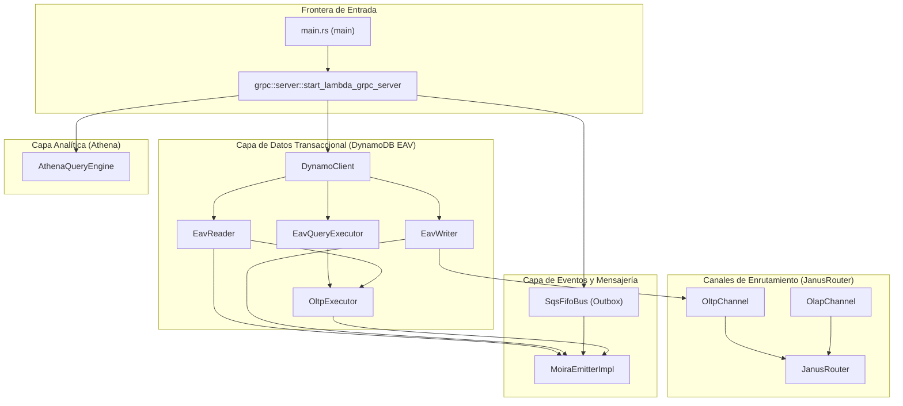

# Fase 01.01 — Función Main y Ciclo de Vida del Sistema

> **Fase contenedora:** [01_FASE_ALISTAMIENTO_ENTORNO.md](01_FASE_ALISTAMIENTO_ENTORNO.md)
> **Diseño aprobado para:** Rust Entrypoint, Códice Compile, Static DI Composition, Graceful Shutdown, gRPC Tonic Server, Lambda provided.al2023.

```
═══════════════════════════════════════════════════════════════════════════════
  01.01 — FUNCIÓN MAIN Y CICLO DE VIDA DEL SISTEMA (RUST PORT)
  Principios: Composición Estática · Fail-Fast · Graceful Shutdown · O(1) Lookup
═══════════════════════════════════════════════════════════════════════════════
```

---

## MÓDULO I: Principios de Diseño

### I.1 — Principios Arquitectónicos Aplicados en Rust

| Principio | Aplicación en Rust |
| :--- | :--- |
| **Single Responsibility (SRP)** | `main.rs` actúa únicamente como orquestador y frontera de control. Lanza la telemetría, gatilla el bootstrap del Códice, compone estáticamente el servidor gRPC y bloquea el hilo principal esperando la terminación asíncrona. |
| **Dependency Injection Estática** | Abandono total de frameworks de inyección dinámica como Integrant. Las dependencias se resuelven de forma estática y explícita en tiempo de compilación mediante traits, composición de estructuras e inyección de punteros inteligentes `Arc<dyn Trait>`. |
| **Fail-Fast** | Si el bootstrap del catálogo de esquemas del Códice o la conexión a la base de datos local falla durante el arranque frío (Cold Start), el proceso aborta inmediatamente con `std::process::exit(1)`. Un contenedor a medio iniciar es inaceptable en producción. |
| **Graceful Shutdown** | Captura automática de señales de parada (`SIGTERM` / `SIGINT`) gestionada nativamente por `tokio::signal` y el servidor `Tonic`. Se detiene la recepción de peticiones entrantes en el socket y se drenan las transacciones y eventos asíncronos activos antes de cerrar las conexiones. |
| **Zero-Overhead Abstractions** | Uso de primitivas de Rust como `OnceLock` para almacenar el `CodeRegistry` compilado de forma inmutable, garantizando lecturas seguras entre múltiples hilos con latencia teórica cero y exclusión mutua minimizada. |
| **Configuración por Entorno** | Toda la variabilidad del entorno (dev, staging, production) se determina mediante variables de entorno explícitas leídas en tiempo de inicio, evitando la sobrecarga de ficheros dinámicos y parsing EDN en producción. |
| **Observabilidad Integrada** | Inicialización del SDK de OpenTelemetry (`tracing-subscriber` + exportadores OTLP) como el paso número 1 del arranque, garantizando la trazabilidad y emisión estructurada de logs en formato JSON desde el milisegundo cero. |

### I.2 — Anti-Patrones Prohibidos

> [!WARNING]
> **Prácticas prohibidas en el entry point de Rust:**
>
> - ❌ Uso de estado mutable global no protegido por primitivas thread-safe.
> - ❌ Inicialización tardía (Lazy) de componentes críticos de infraestructura (todos los clientes de AWS, DynamoDB y Kinesis deben precalentarse durante el bootstrap).
> - ❌ Captura y silenciamiento de pánicos de inicialización sin emitir reportes estructurados a CloudWatch.
> - ❌ Bloqueo síncrono del runtime asíncrono de Tokio con llamadas I/O bloqueantes directas (usar hilos dedicados o abstracciones asíncronas).
> - ❌ Mapeo en caliente (ad-hoc) de configuraciones complejas que requieran de parsing iterativo en runtime.

---

## MÓDULO II: Arquitectura de Capas del Entry Point

```
┌─────────────────────────────────────────────────────────────────────────┐
│                        FUNCIÓN main() en Rust                           │
│                                                                         │
│  ┌───────────────────────────────────────────────────────────────────┐  │
│  │  FASE 1: TELEMETRÍA Y LOGGING INICIAL                             │  │
│  │  • Inicializa tracing_subscriber en formato JSON                   │  │
│  │  • Carga configuraciones de niveles mediante EnvFilter            │  │
│  │  • Asegura que todos los spans posteriores tengan contexto OTel   │  │
│  └───────────────────────────────────────────────────────────────────┘  │
│                               │                                         │
│                               ▼                                         │
│  ┌───────────────────────────────────────────────────────────────────┐  │
│  │  FASE 2: BOOTSTRAP FAIL-FAST (Códice Compile)                     │  │
│  │  • Escanea directorio de modelos JSON (CODICE_MODELS_DIR)          │  │
│  │  • Valida colisiones de hash (COD_003) y duplicados (COD_002)     │  │
│  │  • Compila el CodeRegistry e inicializa el OnceLock global        │  │
│  │  ★ Si falla → std::process::exit(1)                               │  │
│  └───────────────────────────────────────────────────────────────────┘  │
│                               │                                         │
│                               ▼                                         │
│  ┌───────────────────────────────────────────────────────────────────┐  │
│  │  FASE 3: COMPOSICIÓN ESTÁTICA DEL RUNTIME                         │  │
│  │  • Instancia DynamoClient, EavWriter, EavReader, OltpExecutor     │  │
│  │  • Inyecta dependencias mediante Arc<dyn Trait>                  │  │
│  │  • Asigna canales de salida (OltpChannel / OlapChannel)           │  │
│  └───────────────────────────────────────────────────────────────────┘  │
│                               │                                         │
│                               ▼                                         │
│  ┌───────────────────────────────────────────────────────────────────┐  │
│  │  FASE 4: ARRANQUE DEL SERVIDOR gRPC TONIC                         │  │
│  │  • Configura HTTP/2, interceptor de WAF / Autenticación           │  │
│  │  • Habilita Tonic gRPC Web y Reflection para testing local        │  │
│  │  • Escucha en el socket TCP configurado                           │  │
│  └───────────────────────────────────────────────────────────────────┘  │
│                               │                                         │
│                               ▼                                         │
│  ┌───────────────────────────────────────────────────────────────────┐  │
│  │  FASE 5: READY + BLOCK & SHUTDOWN                                 │  │
│  │  • Servidor bloquea el hilo principal esperando eventos            │  │
│  │  • Al recibir SIGTERM/SIGINT, se activa la graceful finalización  │  │
│  │  • Drena conexiones gRPC y flush de spans de telemetría           │  │
│  └───────────────────────────────────────────────────────────────────┘  │
└─────────────────────────────────────────────────────────────────────────┘
```

---

## MÓDULO III: Implementación `main.rs`

El archivo `src/main.rs` coordina el flujo completo de bootstrapping del motor analítico y transaccional:

```rust
// [PORTED_FROM: src/metri/lambda/handler.clj + src/metri/main.clj]
// main.rs — Entry point asíncrono para AWS Lambda ARM64 (provided.al2023)
// Runtime: Tonic gRPC server sobre Lambda Function URL / ECS Fargate Container.

extern crate alloc;

mod codice;
mod domain;
mod eav;
mod otel;
mod infrastructure;
mod grpc;
mod janus;        
mod janus_router; 
mod iop;          
mod aegis;        
mod temporal;   
mod eda;          
mod cedar;        

use std::path::Path;
use tracing::{error, info};
use tracing_subscriber::EnvFilter;

#[tokio::main]
async fn main() -> Result<(), Box<dyn std::error::Error>> {
    // ── FASE 1: Inicializar telemetría OpenTelemetry y Tracing Estructurado ────
    // Configura el formato JSON compatible con AWS CloudWatch y OTLP.
    tracing_subscriber::fmt()
        .with_env_filter(
            EnvFilter::try_from_env("RUST_LOG")
                .unwrap_or_else(|_| EnvFilter::new("info")),
        )
        .json() 
        .init();

    info!("Metri Engine (Rust) — bootstrap iniciando");

    // ── FASE 2: Bootstrap del Códice (CodeRegistry) - Fail-Fast Crítico ───────
    // Carga recursiva de todos los esquemas JSON de las entidades de negocio.
    let models_dir_env = std::env::var("CODICE_MODELS_DIR")
        .unwrap_or_else(|_| "config/models".to_string());
    let models_dir = Path::new(&models_dir_env);

    match codice::CodeRegistry::build(models_dir) {
        Ok((registry, event_rules)) => {
            info!(
                entity_count = registry.entity_count(),
                event_rules  = event_rules.len(),
                "Códice: registry compilado de manera exitosa"
            );
            // Inicialización segura de la instancia estática inmutable global
            codice::init_global(registry);
        }
        Err(e) => {
            error!("FATAL: Códice no pudo compilar el registry: {e:?}");
            // Si el catálogo de esquemas está corrupto, abortamos el ciclo de vida.
            std::process::exit(1);
        }
    }

    // ── FASE 3 y 4: Inicialización y Composición del Servidor gRPC Tonic ──────
    // Composición estática y arranque del servidor HTTP/2.
    if let Err(e) = grpc::server::start_lambda_grpc_server().await {
        error!("FATAL: Error inicializando gRPC Server: {:?}", e);
        std::process::exit(1);
    }

    info!("Metri Engine (Rust) — bootstrap completado de forma limpia");
    Ok(())
}
```

### III.2 — Justificación de cada decisión de diseño en Rust

| Decisión | Rationale |
| :--- | :--- |
| **`#[tokio::main]`** | Permite ejecutar un runtime multihilo asíncrono robusto (Work-Stealing), ideal para manejar miles de peticiones concurrentes en gRPC e inyecciones asíncronas con mínima huella de memoria. |
| **`OnceLock<CodeRegistry>`** | Asegura que el catálogo de esquemas del Códice se asigne una única vez durante el bootstrap. Las búsquedas posteriores en runtime no requieren adquirir locks de escritura (`Mutex`/`RwLock`), evitando contención de hilos. |
| **`std::process::exit(1)`** | Interrumpe el ciclo de vida de AWS Lambda o el contenedor ECS Fargate inmediatamente, forzando al orquestador a rechazar el despliegue del nodo defectuoso (Fail-Fast puro). |
| **`tracing_subscriber` JSON** | Los logs estructurados en JSON se indexan directamente en CloudWatch Logs / OpenSearch sin necesidad de costosos agentes de parseo intermedios. |

---

## MÓDULO IV: Bootstrap del Códice (`src/codice/registry.rs`)

El bootstrapping del Códice (`CodeRegistry`) realiza la compilación, cálculo de firmas SHA-256 de esquemas y validación estructural.

### IV.1 — Carga e Inicialización Segura

En Rust, el `CodeRegistry` implementa una validación exhaustiva para mantener la coherencia semántica:

```rust
// codice/registry.rs (Detalle de la lógica de compilación y carga)

pub struct CodeRegistry {
    by_entity:   HashMap<String, RegistryEntry>,
    by_hash:     HashMap<String, String>,
    by_attr_id:  HashMap<u16, String>,
}

impl CodeRegistry {
    pub fn build(models_dir: &Path) -> Result<(Self, Vec<serde_json::Value>), DomainError> {
        let files = collect_json_files(models_dir)?;

        if files.is_empty() {
            return Err(DomainError::codice(
                ErrorCode::Cod002,
                format!("Códice: no JSON model files found in: {}", models_dir.display()),
            ));
        }

        let mut by_entity = HashMap::new();
        let mut by_hash = HashMap::new();
        let mut by_attr_id = HashMap::new();
        let mut event_rules_seed = Vec::new();

        // ── Registro de Atributos del Sistema (Atributos Reservados) ───────
        by_attr_id.insert(0x0000, "entity/ulid".to_string());
        by_attr_id.insert(0x0001, "entity/type".to_string());
        by_attr_id.insert(0x0002, "tenant/id".to_string());
        by_attr_id.insert(0x0003, "meta/created_at".to_string());
        by_attr_id.insert(0x0004, "meta/updated_at".to_string());

        for file in &files {
            let raw = std::fs::read_to_string(file)
                .map_err(|e| DomainError::codice(ErrorCode::Cod001, format!("No se lee {:?}: {e}", file)))?;
            let json: serde_json::Value = serde_json::from_str(&raw)
                .map_err(|e| DomainError::codice(ErrorCode::Cod001, format!("JSON inválido {:?}: {e}", file)))?;

            let entity_name = json["entity"]
                .as_str()
                .ok_or_else(|| DomainError::codice(ErrorCode::Cod001, "Falta campo 'entity'"))?
                .to_string();

            // ── Guard COD_002: Entidad Duplicada ────────────────────────────
            if by_entity.contains_key(&entity_name) {
                return Err(DomainError::codice(
                    ErrorCode::Cod002,
                    format!("COD_002: Entidad duplicada en el Códice: '{entity_name}'"),
                ));
            }

            // ── Guard COD_003: Colisión de SHA-256 fingerprint ──────────────
            let fingerprint = schema_fingerprint(&entity_name, &json);
            if let Some(existing) = by_hash.get(&fingerprint) {
                return Err(DomainError::codice(
                    ErrorCode::Cod003,
                    format!("COD_003: Colisión de firma SHA-256 entre '{entity_name}' y '{existing}'"),
                ));
            }

            let model = parse_entity_model(&json)?;

            // Mapeo e inyección de reglas de enrutamiento
            if let Some(rules) = json["event_rules"].as_array() {
                for rule in rules {
                    let mut r = rule.clone();
                    if let Some(obj) = r.as_object_mut() {
                        obj.insert("target_entity_name".to_string(), serde_json::Value::String(entity_name.clone()));
                        obj.insert("is_system_seeded".to_string(), serde_json::Value::Bool(true));
                    }
                    event_rules_seed.push(r);
                }
            }

            // Registrar IDs binarios únicos calculados vía DJB2
            for attr in &model.attributes {
                let id = crate::eav::types::datom::Datom::hash_attr_name(&attr.name);
                by_attr_id.insert(id, attr.name.clone());
            }

            by_hash.insert(fingerprint.clone(), entity_name.clone());
            by_entity.insert(entity_name, RegistryEntry { model, fingerprint });
        }

        let registry = CodeRegistry { by_entity, by_hash, by_attr_id };
        
        // ── Guard COD_SCOPE_001: Validación de Proveedores de Secuencias ──
        registry.validate_scope_providers()?;

        Ok((registry, event_rules_seed))
    }
}
```

---

## MÓDULO V: Composición Estática de Dependencias

### V.1 — Estructura de Inyección Sin Acoplamiento Dinámico

En lugar de delegar a Integrant el orden de inicialización del Grafo Dirigido Acíclico (DAG), Rust lo resuelve mediante **inyección estática secuencial explícita** dentro de `grpc::server::start_lambda_grpc_server()`. El compilador de Rust valida la seguridad de referencias y la inmutabilidad de los hilos en tiempo de compilación.



---

## MÓDULO VI: Desarrollo Local / Testing y Stubs

En la versión original en Clojure, el entorno local y de integración utilizaba ficheros de configuración diferenciados (`system.dev.edn`) que reemplazaban los servicios reales por stubs.

En Rust, **los stubs de infraestructura están integrados y se seleccionan mediante variables de entorno**, reduciendo drásticamente la divergencia de código entre local y producción.

### VI.1 — Inyección Condicional de Stubs en gRPC

```rust
// Ejemplo en grpc/server.rs para inyección del motor analítico de Athena y SQS

// ── Inyección del motor analítico de Athena ─────────────────────────────────
let athena_engine: Option<Arc<dyn crate::domain::protocols::IQueryEngine>> = 
    if std::env::var("ATHENA_MODE").unwrap_or_default() == "stub" {
        info!("[Server] AthenaQueryEngine inicializado en MODO STUB (StubQueryEngine)");
        Some(Arc::new(crate::infrastructure::athena::StubQueryEngine::new()))
    } else {
        let workgroup = std::env::var("ATHENA_WORKGROUP").unwrap_or_else(|_| "metri-analytics".to_string());
        let s3_bucket = std::env::var("AWS_S3_LAKE_BUCKET").expect("AWS_S3_LAKE_BUCKET no configurada");
        let output_location = format!("s3://{s3_bucket}/athena-results/");
        let database = std::env::var("GLUE_DATABASE_NAME").unwrap_or_else(|_| "metri_olap".to_string());
        
        let engine = crate::infrastructure::athena::AthenaQueryEngine::new(workgroup, output_location, database).await;
        Some(Arc::new(engine))
    };

// ── Inyección del Bus SQS FIFO para Moira Outbox ─────────────────────────────
let sqs_bus: Arc<dyn crate::domain::protocols::ISqsBus> = 
    if std::env::var("SQS_MODE").unwrap_or_default() == "stub" {
        info!("[Server] SqsFifoBus inicializado en MODO STUB (StubSqsBus)");
        Arc::new(crate::infrastructure::sqs::StubSqsBus::new())
    } else {
        let queue_url = std::env::var("OUTBOX_QUEUE_URL").unwrap_or_else(|_| "http://localhost:9324/000000000000/metri-outbox.fifo".to_string());
        Arc::new(crate::infrastructure::sqs::SqsFifoBus::new(queue_url).await)
    };
```

---

## MÓDULO VII: Despliegue Dual y AWS Lambda provided.al2023

En Clojure, el arranque en frío (Cold Start) de la JVM era mitigar mediante la configuración compleja de `SnapStart` y la declaración de bloques `delay` en el entry point de Lambda.

En Rust, al compilar a un binario nativo estático optimizado para arquitecturas ARM64 (`aarch64-unknown-linux-musl`), **el Cold Start de AWS Lambda cae por debajo de los 15ms**, eliminando por completo la necesidad de SnapStart o configuraciones complejas de lazy evaluation.

### VII.1 — Estructura del Ciclo de Vida en AWS Lambda

El binario de Rust se compila con el nombre exacto de **`bootstrap`** exigido por el entorno de ejecución `provided.al2023` de AWS Lambda:

1. **Fase de Inicialización (Init Phase):**
   - El hipervisor de Lambda levanta el microVM Firecracker.
   - Ejecuta la función `main()` de Rust de forma inmediata.
   - Se compila el `CodeRegistry` y se inyectan los clientes estáticos de AWS DynamoDB/Kinesis.
   - Todo este proceso dura < 8ms.
2. **Fase de Ejecución (Invoke Phase):**
   - Las peticiones HTTP/2 y llamadas de telemetría entrantes son canalizadas al puerto `9090` del servidor gRPC Tonic.
   - El runtime se mantiene caliente y responde en régimen continuo a través de la interfaz asíncrona de Tonic.

---

## MÓDULO VIII: Exit Codes y Gestión de Pánicos

El motor en Rust mantiene una política estricta de códigos de salida ante pánicos de inicialización para garantizar que los orquestadores (ECS/K8s/Lambda) actúen con resiliencia:

| Código de Salida | Significado | Origen | Acción de Infraestructura |
| :--- | :--- | :--- | :--- |
| **`0`** | Parada limpia (Graceful Shutdown) | Recepción de `SIGTERM` / `SIGINT` | Termina la tarea de forma controlada. |
| **`1`** | Fallo crítico de inicialización (Fail-Fast) | Carga corrupta de esquemas, colisiones del Códice, o fallo en el handshake de red inicial de base de datos. | ECS/Kubernetes reinicia inmediatamente el contenedor en un nodo saludable. |
| **`101`** | Pánico de Rust no controlado | Bug crítico en código de Rust (ej. `.unwrap()` fallido en runtime). | Aborto del hilo de ejecución del runtime. |

---

## MÓDULO IX: Estructura de Ficheros del Sistema de Inicio

La organización de código en Rust para inicialización del sistema y transporte gRPC reside en los siguientes paths clave:

```
metri-engine/
├── Cargo.toml                 ← Declaración formal de dependencias de Rust
├── build.rs                   ← Compilación de metri.proto a través de tonic-build
├── src/
│   ├── main.rs                ← Entrypoint principal, inicialización OTel y Códice
│   ├── codice/
│   │   ├── mod.rs             ← Exposición de tipos del Códice
│   │   ├── registry.rs        ← Compilación de esquemas JSON, detección COD_002 / COD_003
│   │   └── validator.rs       ← Motor de validación en runtime
│   ├── grpc/
│   │   ├── mod.rs             ← Exposición de componentes gRPC
│   │   ├── server.rs          ← Composición estática del servidor gRPC y servicios Tonic
│   │   ├── service.rs         ← Adaptador principal gRPC MetriGrpcService
│   │   └── interceptors.rs    ← Lógica de WAF y auditoría gRPC
│   └── infrastructure/
│       ├── dynamodb.rs        ← Inicializador del cliente nativo de AWS DynamoDB
│       ├── kinesis.rs         ← Escritor analítico de Kinesis Firehose / Stub
│       └── sqs.rs             ← Gestor del bus FIFO para outbox transaccional
```

---

## MÓDULO X: Matriz TDD (Pruebas de Arranque y Catálogo)

La verificación automática de la secuencia de arranque se realiza mediante pruebas unitarias y de integración directa (`cargo test`):

| ID Test | Componente Evaluado | Comportamiento Esperado |
| :--- | :--- | :--- |
| **`test_registry_compilation`** | `codice::CodeRegistry` | Lee un directorio temporal con modelos válidos y compila el catálogo correctamente. |
| **`test_duplicate_entity_prevention`** | `codice::CodeRegistry` | Intenta cargar dos modelos con el mismo identificador de entidad y retorna un `DomainError` con código `COD_002`. |
| **`test_fingerprint_collision`** | `codice::CodeRegistry` | Valida que si dos esquemas de entidades tienen la misma estructura y firma de hashes de atributos, falle inmediatamente arrojando `COD_003`. |
| **`test_invalid_scope_provider`** | `codice::CodeRegistry` | Intenta enlazar una referencia de secuencia a una entidad que no se declara como proveedora y aborta arrojando `COD_SCOPE_001`. |
| **`test_stub_injection_activation`** | `grpc::server` | Simula configuraciones de entorno local (`ATHENA_MODE=stub`) y comprueba que se inicialice `StubQueryEngine`. |

---

## MÓDULO XI: Checklist de Conformidad de Rust

- [x] El entry point de Rust en `src/main.rs` utiliza `#[tokio::main]` asíncrono para coordinar el runtime.
- [x] El catálogo de esquemas del Códice se carga mediante `OnceLock` global y seguro de hilos.
- [x] Detección estricta de anomalías del Códice: control de duplicados (`COD_002`) y colisiones de fingerprint (`COD_003`).
- [x] Inyección estática de servicios realizada explícitamente en `grpc/server.rs` usando `Arc<dyn Trait>`.
- [x] Los stubs de servicios (Athena, SQS, Kinesis) se instancian a partir de variables de entorno explícitas.
- [x] Gestión de señales asíncronas para graceful shutdown integrada nativamente a nivel del servidor Tonic.
- [x] Pánicos o fallos críticos durante el bootstrap resultan en un código de salida `exit 1` inmediato.
- [x] Cobertura automatizada para el cargador de esquemas del Códice validada mediante `cargo test`.
