# Fase 01.02 — Clientes de Infraestructura

> **Fase contenedora:** [01_FASE_ALISTAMIENTO_ENTORNO.md](01_FASE_ALISTAMIENTO_ENTORNO.md)
> **Fase hermana anterior:** [01.01_FASE_MAIN_BOOTSTRAP.md](01.01_FASE_MAIN_BOOTSTRAP.md)
> **Fase hermana siguiente:** [01.03_FASE_RUNTIME_GRPC.md](01.03_FASE_RUNTIME_GRPC.md)
> **Diseñado para:** Integrant CAPA 1 — todos los clientes de infraestructura que el sistema necesita en producción y localmente.

```
═══════════════════════════════════════════════════════════════════════════════
  01.02 — CLIENTES DE INFRAESTRUCTURA
  Principios: Zero-Config Drift · Paridad Local/Prod · Fail-Fast · DIP
═══════════════════════════════════════════════════════════════════════════════
```

---

## MÓDULO I: Inventario de Clientes

El Metri Engine requiere **9 clientes de infraestructura**. Cada uno se instancia una vez en Integrant (CAPA 1), se pasa por referencia (`#ig/ref`) a los componentes que lo necesitan, y se libera ordenadamente en `ig/halt!`.

```
┌─────────────────────────────────────────────────────────────────────────────┐
│  CLIENTES DE INFRAESTRUCTURA — CAPA 1 del DAG Integrant                    │
│                                                                             │
│  :infra/datahike      ← OLTP transaccional (Datahike + DynamoDB backend)   │
│  :infra/athena        ← OLAP analítico     (AWS Athena + S3 Iceberg)        │
│  :infra/valkey        ← Session store      (Valkey / Redis — token opaco)  │
│  :infra/dynamodb      ← Quota store        (DynamoDB directo — QuotaGuard)  │
│  :infra/kinesis       ← Streaming OLAP     (Kinesis Firehose — BulkIngest)  │
│  :infra/eventbridge   ← Fault bus          (EventBridge → Sherlog / Echo)   │
│  :moira/sqs-bus       ← Outbox EDA bus     (SQS FIFO — Moira → Event Router)│
│  :cedar/engine        ← ABAC evaluator     (Cedar SDK + PolicySet cache)    │
│  :infra/tracer        ← Observabilidad     (OTel SDK + ADOT exporter)       │
│                                                                             │
│  Local (Docker)  → dynamodb-local  para Datahike y QuotaGuard               │
│                    elasticmq       para SQS FIFO                            │
│                    valkey          para Session Store                       │
│                    Stubs in-memory para Kinesis, EventBridge, Athena        │
│  Producción      → AWS Serverless / Managed para cada servicio              │
└─────────────────────────────────────────────────────────────────────────────┘
```

> [!IMPORTANT]
> **Regla de oro de CAPA 1:** Ningún cliente de infraestructura contiene lógica de negocio.
> Son adaptadores puros — conectan, configuran y liberan recursos.
> La lógica de dominio vive en CAPA 3+.

---

## MÓDULO I-B: Principios de Diseño — Desacoplamiento, Escalabilidad, SOLID y DRY

Todos los clientes de infraestructura de CAPA 1 son **adaptadores puros**, altamente **desacoplados** y **escalables**. Deben ser fáciles de sustituir en tests sin tocar ni un byte de lógica de negocio, y estar preparados para soportar cargas de alta concurrencia en producción mediante pooling y delegación a servicios Managed/Serverless. Cada cliente sigue los mismos cinco principios con aplicación concreta y verificable.

### I-B.1 — Tabla de Principios por Cliente

| Principio                     | Regla Concreta                                                                                                                                              | Mecanismo de Verificación                                                                     |
| :---------------------------- | :---------------------------------------------------------------------------------------------------------------------------------------------------------- | :-------------------------------------------------------------------------------------------- |
| **S** — Single Responsibility | Un fichero `.clj` por cliente. Zero imports cruzados entre clientes.                                                                                        | `grep -r "infrastructure/valkey" src/metri/infrastructure/` → solo `valkey.clj`               |
| **O** — Open/Closed           | Cada cliente expone un **Protocol** en `domain/protocols.clj`. Cambiar el backend (ej. Redis → DragonflyDB) = nueva implementación, sin tocar consumidores. | Nuevo record implementando el protocol → registrar en `system.edn` → consumidores inalterados |
| **L** — Liskov Substitution   | Cada protocol tiene **stubs canónicos** que pasan la misma suite de tests de contrato que la implementación real.                                           | `(satisfies? ISessionStore stub)` = `true`                                                    |
| **I** — Interface Segregation | Los protocols son atómicos (1-3 métodos). Ningún consumidor depende de métodos que no usa.                                                                  | `ISessionStore` solo tiene `get/put/del`. No mezcla con `ISQSBus`.                            |
| **D** — Dependency Inversion  | Ningún componente de negocio importa un namespace de `infrastructure/` directamente. Todo llega via `#ig/ref`.                                              | `grep -r "infrastructure/valkey" src/metri/iop/` → cero resultados                            |

### I-B.2 — DRY: Protocolo Canónico Compartido

El contrato Railway (`[:ok …] | [:error …]`) y el constructor de error son **únicos en el sistema** — no se replican por cliente.

```clojure
;; ns: metri.domain.protocols
;; SSOT de los protocolos de infraestructura
;; Cada cliente implementa solo el protocol que le corresponde.
;; Ningún consumidor importa metri.infrastructure.* directamente.

(defprotocol ISessionStore
  "Almacén de sesiones de tokens opacos (Valkey/Redis)."
  (get-session  [this token]           "Retorna mapa de sesión o nil")
  (put-session! [this token payload ttl] "[:ok] | [:error {:code :INFRA_VALKEY_001}]")
  (del-session! [this token]           "[:ok] | [:error {:code :INFRA_VALKEY_001}]"))

(defprotocol ISQSBus
  "Bus SQS FIFO para el Outbox Pattern de Moira."
  (publish!         [this msg]           "[:ok {:message-id str}] | [:error {:code :MOI_SQS_001 :retryable? true}]")
  (receive-messages [this opts]          "[:ok [{:message-id :receipt-handle :body :attrs}]] | [:error]")
  (delete-message!  [this receipt-handle] "[:ok] | [:error]"))

(defprotocol IEventBus
  "Bus de eventos de fallo (EventBridge → Sherlog / Echo)."
  (put-event! [this event-type detail]  "[:ok] | [:error {:code :EVB_001}]"))

(defprotocol IFaultNotifier
  "Alias semántico de IEventBus para Sherlog."
  (notify-fault! [this fault-dto]       "[:ok] | [:error {:code :EVB_001}]"))

(defprotocol IStreamWriter
  "Escritor de streaming OLAP (Kinesis Firehose)."
  (put-record! [this stream-name data partition-key]
    "[:ok {:sequence-number str}] | [:error {:code :JNS_OLAP_002 :retryable? true}]"))

(defprotocol IQueryEngine
  "Motor de consultas analíticas (Athena)."
  (start-query! [this sql output-location]
    "[:ok {:execution-id str}] | [:error {:code :ATH_001}]")
  (get-query-results [this execution-id]
    "[:ok {:columns [...] :rows [...]}] | [:error {:code :ATH_002}]"))
```

> [!IMPORTANT]
> `errors/error` del catálogo (`resources/errors/error_catalog.edn`) es el **único constructor**
> de `[:error …]` en todo CAPA 1. Ningún cliente lanza excepciones hacia afuera —
> todo `catch` interno se convierte en `(errors/error :CODIGO ctx)`.

### I-B.3 — Patrón Canónico de Implementación

Todos los 9 clientes **deben seguir exactamente este patrón**. El incumplimiento es detectable en code review.

```clojure
;; ┌─────────────────────────────────────────────────────────────────────┐
;; │  PATRÓN CANÓNICO — infra client (ejemplo: valkey.clj)              │
;; │                                                                     │
;; │  1. defrecord implementa el Protocol de domain/protocols.clj       │
;; │  2. ig/init-key  → construye el record con la config env           │
;; │  3. ig/halt-key! → libera recursos — nunca lanza                   │
;; │  4. Toda fn pública retorna [:ok …] | [:error …] — sin throw       │
;; │  5. La fn NUNCA lee env vars — solo recibe parámetros del config    │
;; └─────────────────────────────────────────────────────────────────────┘

(ns metri.infrastructure.valkey
  (:require [integrant.core :as ig]
            [metri.domain.protocols :as proto]
            [metri.common.errors :as errors]))

;; ── 1. Record que implementa el Protocol ─────────────────────────────
(defrecord ValkeySessionStore [conn]
  proto/ISessionStore
  (get-session  [_ token]              (try-get-session conn token))
  (put-session! [_ token payload ttl]  (try-put-session conn token payload ttl))
  (del-session! [_ token]              (try-del-session conn token)))

;; ── 2. Init — construye el record, verifica salud ────────────────────
(defmethod ig/init-key :infra/valkey
  [_ {:keys [host port password ssl? max-connections]}]
  (let [pool (make-pool host port password ssl? max-connections)
        ping (ping-pool pool)]
    (if (= :ok (first ping))
      (do (println "    → Valkey: conectado a" host) (->ValkeySessionStore pool))
      (throw (ex-info "Valkey PING failed" {:code :INFRA_VALKEY_001})))))

;; ── 3. Halt — libera siempre ──────────────────────────────────────────
(defmethod ig/halt-key! :infra/valkey
  [_ store]
  (println "    ← Valkey: cerrando pool")
  (close-pool (:conn store)))

;; ── 4. Fns privadas — Railway interno, sin throw hacia afuera ─────────
(defn- try-get-session [conn token]
  (try
    [:ok (wcar conn (car/get token))]
    (catch Exception e
      (errors/error :INFRA_VALKEY_001 {:op :get-session :token token :detail (ex-message e)}))))
```

### I-B.4 — Stubs Canónicos (Liskov — Testabilidad Total)

Cada cliente tiene un **stub en memoria** que:

- Implementa el **mismo Protocol** que la implementación real.
- Pasa la **misma suite de tests de contrato** (no tests paralelos ad-hoc).
- Se inyecta via Integrant en `system.dev.edn` — cero I/O externo en tests.

```clojure
;; ns: metri.infrastructure.stubs.valkey
;; ← inyectado via system.dev.edn o directamente en tests
(defrecord InMemorySessionStore [store-atom]
  proto/ISessionStore
  (get-session  [_ token]
    [:ok (get @store-atom token)])
  (put-session! [_ token payload _ttl]
    (swap! store-atom assoc token payload)
    [:ok])
  (del-session! [_ token]
    (swap! store-atom dissoc token)
    [:ok]))

;; Constructor para tests — determinístico, sin I/O
(defn make-stub [] (->InMemorySessionStore (atom {})))
```

### I-B.5 — Tabla de Testabilidad por Cliente

| Cliente              | Protocol                  | Record real             | Stub canónico                            | Suite de contrato      | Test I/O                    |
| :------------------- | :------------------------ | :---------------------- | :--------------------------------------- | :--------------------- | :-------------------------- |
| `:infra/datahike`    | — (Datahike conn directo) | `DH conn map`           | `datahike mem-backend`                   | `datahike_test.clj`    | TestContainers / LocalStack |
| `:infra/athena`      | `IQueryEngine`            | `AthenaQueryEngine`     | `InMemoryQueryEngine`                    | `athena_test.clj`      | LocalStack Athena           |
| `:infra/valkey`      | `ISessionStore`           | `ValkeySessionStore`    | `InMemorySessionStore`                   | `valkey_test.clj`      | TestContainers Valkey       |
| `:infra/dynamodb`    | — (SDK directo)           | `DynamoDB client map`   | LocalStack DynamoDB                      | `dynamodb_test.clj`    | LocalStack                  |
| `:infra/kinesis`     | `IStreamWriter`           | `KinesisFirehoseWriter` | `InMemoryStreamWriter`                   | `kinesis_test.clj`     | LocalStack Kinesis          |
| `:infra/eventbridge` | `IEventBus`               | `EventBridgeClient`     | `InMemoryEventBus`                       | `eventbridge_test.clj` | LocalStack                  |
| `:moira/sqs-bus`     | `ISQSBus`                 | `SQSFifoBus`            | `InMemorySQSBus`                         | `sqs_test.clj`         | LocalStack SQS FIFO         |
| `:cedar/engine`      | — (SDK JNI)               | `CedarEngine map`       | `AlwaysAllowEngine` / `AlwaysDenyEngine` | `authorizer_test.clj`  | In-process JNI              |
| `:infra/tracer`      | — (OTel API)              | `OTelTracer`            | NoOp OTel SDK                            | `otel_test.clj`        | Sin I/O                     |

> [!TIP]
> Los tests **Unit** nunca hacen I/O real — usan el stub canónico via `(make-stub)`.
> Los tests **Integration** usan LocalStack o TestContainers para verificar el contrato contra el SDK real.
> **Nunca** un test Unit usa mocks ad-hoc de `with-redefs` en clientes de infraestructura — solo stubs canónicos.

### I-B.6 — DRY: Regla "Un error, un lugar"

```
❌ MAL — error inline por cada cliente:
   (catch Exception e [:error {:code :VALKEY_ERR :msg (ex-message e)}])   ; valkey.clj
   (catch Exception e [:error {:code :SQS_ERR   :msg (ex-message e)}])   ; sqs.clj
   ;; Cada fichero reinventa el DTO de error → deriva del catálogo

✅ BIEN — error desde el catálogo SSOT:
   (catch Exception e (errors/error :INFRA_VALKEY_001 {:detail (ex-message e)}))
   (catch Exception e (errors/error :MOI_SQS_001      {:detail (ex-message e) :retryable? true}))
   ;; errors/error lee :retryable?, :severity, :http-status del catálogo edn
   ;; SSOT: resources/errors/error_catalog.edn
```

### I-B.7 — Checklist de Compliance (PR Gate)

Antes de hacer merge de cualquier cliente de infraestructura nuevo o modificado:

- [ ] **S** — Fichero único `src/metri/infrastructure/<cliente>.clj` — sin lógica mixta
- [ ] **O** — Protocol definido en `src/metri/domain/protocols.clj` — no inline en el fichero cliente
- [ ] **L** — Stub canónico en `src/metri/infrastructure/stubs/<cliente>.clj` — pasa la misma suite de tests
- [ ] **I** — Protocol tiene ≤ 3 métodos — si necesita más, es candidato a split
- [ ] **D** — Ningún consumidor en `src/metri/iop/`, `src/metri/janus/`, `src/metri/moira/` importa el namespace del cliente directamente
- [ ] **DRY** — Todo `[:error]` se construye con `errors/error :CODIGO ctx` — cero DTOs inline
- [ ] `ig/halt-key!` implementado — nunca omitir aunque esté vacío
- [ ] Tests Unit con stub canónico — pasan sin I/O externo
- [ ] Tests Integration con LocalStack / TestContainers — verifican el SDK real

---

## MÓDULO II: Datahike — OLTP Transaccional

### II.1 — Rol en el sistema

Datahike es la **base de datos OLTP principal** del Metri Engine. Provee el modelo de datos entidad-atributo-valor (EAV) con soporte para queries Datalog, historial de cambios y transacciones ACID. El backend de persistencia es **DynamoDB Serverless** en producción, lo que elimina la gestión de servidores.

```
┌─────────────────── Datahike — Flujo de datos ─────────────────────────────┐
│                                                                            │
│  ig/init-key :infra/datahike                                               │
│    ├─ [1] Verifica si la DB existe en DynamoDB                             │
│    ├─ [2] Si no existe → crea la DB (idempotente)                          │
│    ├─ [3] Conecta → retorna {:conn conn :config cfg}                       │
│    └─ [4] Los componentes dependientes reciben la conn via #ig/ref         │
│                                                                            │
│  Consumidores (CAPA 2+):                                                   │
│    :infra/tenant-guard    ← Pool Model: aísla queries por tenant_id        │
│    :iop/cedar-authorizer  ← Hidratación de principal (user/role/groups)    │
│    :janus/oltp-channel    ← d/transact ACID (entidades + proyecciones)     │
│    :moira/emitter         ← Outbox CDC                                     │
│    :audit/interceptor     ← :audit/* attrs                                 │
└────────────────────────────────────────────────────────────────────────────┘
```

### II.2 — Implementación Integrant

```clojure
;; ns: metri.infrastructure.datahike
;; SOLID-S: responsabilidad unica — conectar/liberar Datahike, sin logica de negocio
;; SOLID-D: no importa ningun namespace de infraestructura hermano
;; DRY: errors/error es el unico constructor de [:error]
(ns metri.infrastructure.datahike
  (:require [datahike.api :as d]
            [integrant.core :as ig]
            [metri.common.errors :as errors]))

(defmethod ig/init-key :infra/datahike
  [_ {:keys [store]}]
  ;; Falla rapido en bootstrap — excepcion deliberada para detener ig/init
  ;; Es el unico lugar donde un cliente de CAPA 1 puede lanzar (fail-fast bootstrap)
  (try
    (let [cfg {:store store}]
      (when-not (d/database-exists? cfg)
        (println "    -> Datahike: creando base de datos...")
        (d/create-database cfg))
      (let [conn (d/connect cfg)]
        (println (str "    -> Datahike: conectado a " (:backend store) "/" (:table store)))
        {:conn   conn
         :config cfg}))
    (catch Exception e
      ;; errors/error construye el DTO y lo registra en el catalogo
      ;; throws deliberadamente — Integrant lo captura y aborta el arranque
      (throw (ex-info "Datahike init failed"
                      (errors/error :INFRA_DH_001
                                    {:detail (ex-message e) :store store}))))))

(defmethod ig/halt-key! :infra/datahike
  [_ {:keys [conn]}]
  (println "    <- Datahike: liberando conexion")
  ;; halt nunca lanza hacia afuera — protege el shutdown ordenado de Integrant
  (try (d/release conn) (catch Exception _ nil)))

;; ── Helper para el bootstrapper (pre-Integrant) ──────────────────────────
;; SOLID-S: solo un caso de uso — bootstrap-only, comentado para no reusar
;; Lee env vars directamente — no depende de Integrant (pre-init)
(defn get-connection
  "Conexion bootstrap-only usada antes de que ig/init cargue :infra/datahike.
   NO reusar en componentes regulares — usar #ig/ref :infra/datahike en su lugar."
  []
  (let [backend (or (System/getenv "DATAHIKE_BACKEND") "mem")
        cfg     (case backend
                  "dynamodb" {:store {:backend  :dynamodb
                                      :table    (System/getenv "DATAHIKE_DDB_TABLE")
                                      :region   (System/getenv "AWS_REGION")
                                      :endpoint (System/getenv "DATAHIKE_ENDPOINT")}}
                  {:store {:backend  :mem}})]
    (when (d/database-exists? cfg)
      (d/connect cfg))))
```

### II.3 — Variables de entorno

| Variable             | Descripción                       | Producción                        | Local (Docker)          |
| :------------------- | :-------------------------------- | :-------------------------------- | :---------------------- |
| `DATAHIKE_BACKEND`   | Backend de persistencia           | `dynamodb`                        | `dynamodb`              |
| `DATAHIKE_DDB_TABLE` | Nombre de la tabla DynamoDB       | `metri-dh-prod`                   | `metri-dh-shared`       |
| `AWS_REGION`         | Región AWS                        | `us-east-1`                       | `us-east-1`             |
| `DATAHIKE_ENDPOINT`  | Override de endpoint (solo local) | _(vacío — usa endpoint AWS real)_ | `http://localhost:8000` |

### II.4 — Config Integrant

```clojure
;; system.edn — PRODUCCIÓN
:infra/datahike
  {:store {:backend  :dynamodb
           :table    #env "DATAHIKE_DDB_TABLE"
           :region   #env "AWS_REGION"}}

;; system.dev.edn — LOCAL
:infra/datahike
  {:store {:backend  :dynamodb
           :table    "metri-dh-shared"
           :region   "us-east-1"
           :endpoint "http://localhost:4566"}}
```

### II.5 — Docker local

```yaml
# docker-compose.yml — amazon/dynamodb-local para Datahike
services:
  localstack:
    image: localstack/localstack:3
    ports:
      - "4566:4566"
    environment:
      SERVICES: dynamodb,s3,kinesis,events,athena
      AWS_DEFAULT_REGION: us-east-1
      LOCALSTACK_AUTH_TOKEN: ${LOCALSTACK_AUTH_TOKEN}
    volumes:
      - "./infra/localstack/init:/etc/localstack/init/ready.d"
      - localstack-data:/var/lib/localstack
```

```bash
# infra/localstack/init/01_create_datahike_table.sh
awslocal dynamodb create-table \
  --table-name metri-dh-shared \
  --attribute-definitions AttributeName=Id,AttributeType=S \
  --key-schema AttributeName=Id,KeyType=HASH \
  --billing-mode PAY_PER_REQUEST \
  --region us-east-1
```

> [!NOTE]
> Datahike gestiona el schema de la tabla DynamoDB internamente. El script solo crea la tabla vacía — Datahike la inicializa en el primer `create-database`.

---

## MÓDULO III: Athena — OLAP Analítico

### III.1 — Rol en el sistema

AWS Athena es el **motor de consultas OLAP** serverless. Consul los datos en formato Parquet/Iceberg sobre S3. Aegis (Fase 05) transpila el AST del request a SQL y lo ejecuta contra Athena cuando el `entity_type` tiene `engine: "olap"` en el Códice.

```
Aegis Pipeline
  └─ [AST SQL] → :infra/athena → Athena StartQueryExecution
                                  └─ S3 Iceberg (particionado por tenant_id)
                                      └─ QueryResult → streaming chunks → gRPC
```

### III.2 — Implementación Integrant

```clojure
;; ns: metri.infrastructure.athena
;; SOLID-S: responsabilidad unica — ejecutar queries Athena, sin logica de negocio
;; SOLID-O: implementa IQueryEngine — sustituible por otro motor sin tocar Aegis
;; DRY: errors/error unico constructor de [:error], sin DTO inline
(ns metri.infrastructure.athena
  (:require [integrant.core :as ig]
            [metri.domain.protocols :as proto]
            [metri.common.errors :as errors])
  (:import [software.amazon.awssdk.services.athena AthenaClient]
           [software.amazon.awssdk.services.athena.model
            StartQueryExecutionRequest QueryExecutionContext
            ResultConfiguration]))

;; ── Record que implementa IQueryEngine (SOLID-O + L) ─────────────────────
(defrecord AthenaQueryEngine [client workgroup output-location]
  proto/IQueryEngine

  (start-query! [_ sql database]
    (try
      (let [req (-> (StartQueryExecutionRequest/builder)
                    (.queryString sql)
                    (.queryExecutionContext
                      (-> (QueryExecutionContext/builder)
                          (.database database)
                          .build))
                    (.resultConfiguration
                      (-> (ResultConfiguration/builder)
                          (.outputLocation output-location)
                          .build))
                    (.workGroup workgroup)
                    .build)
            resp (.startQueryExecution client req)]
        [:ok {:execution-id (.queryExecutionId resp)}])
      ;; DRY: errors/error lee :retryable?, :severity del catalogo edn
      (catch Exception e
        (errors/error :ATH_001 {:detail (ex-message e) :sql sql}))))

  (get-query-results [_ execution-id]
    (try
      ;; poll-results — implementacion completa en Fase 05 (Aegis)
      [:ok {:execution-id execution-id}]
      (catch Exception e
        (errors/error :ATH_002 {:detail (ex-message e) :execution-id execution-id})))))

(defmethod ig/init-key :infra/athena
  [_ {:keys [workgroup output-location region endpoint]}]
  (try
    (let [builder (-> (AthenaClient/builder)
                      (.region (software.amazon.awssdk.regions.Region/of region)))
          client  (-> builder
                      (cond-> endpoint
                        (.endpointOverride (java.net.URI/create endpoint)))
                      .build)]
      (println (str "    -> Athena: workgroup=" workgroup))
      (->AthenaQueryEngine client workgroup output-location))
    (catch Exception e
      (throw (ex-info "Athena init failed"
                      (errors/error :INFRA_ATH_INIT {:detail (ex-message e)}))))))

(defmethod ig/halt-key! :infra/athena
  [_ athena-engine]
  (println "    <- Athena: cerrando cliente")
  (try (.close (:client athena-engine)) (catch Exception _ nil)))

;; ── Stub canonico para tests Unit (Liskov) ───────────────────────────────
(defrecord InMemoryQueryEngine [queries-atom]
  proto/IQueryEngine
  (start-query! [_ sql _db]
    (let [id (str "stub-qid-" (count @queries-atom))]
      (swap! queries-atom conj {:sql sql :id id})
      [:ok {:execution-id id}]))
  (get-query-results [_ execution-id]
    [:ok {:execution-id execution-id :columns [] :rows []}]))

(defn make-athena-stub [] (->InMemoryQueryEngine (atom [])))
```

> [!NOTE]
> `start-query!` es asincronica — retorna solo el `execution-id`.
> El polling de resultados es responsabilidad de **Aegis** (Fase 05). SRP garantizado — el cliente no hace polling interno.

### III.3 — Variables de entorno

| Variable                 | Descripción                       | Producción                        | Local (Docker)             |
| :----------------------- | :-------------------------------- | :-------------------------------- | :------------------------- |
| `ATHENA_WORKGROUP`       | Workgroup de Athena               | `metri-analytics-prod`            | `primary` (LocalStack)     |
| `ATHENA_OUTPUT_LOCATION` | S3 URI para resultados de queries | `s3://metri-athena-results-prod/` | `s3://metri-local/athena/` |
| `ATHENA_DATABASE`        | Base de datos (Glue catalog)      | `metri_prod`                      | `metri_local`              |
| `AWS_S3_LAKE_BUCKET`     | Bucket principal del Data Lake    | `metri-datalake-prod`             | `metri-local`              |

### III.4 — Config Integrant

```clojure
;; system.edn — PRODUCCIÓN
:infra/athena
  {:workgroup       #env "ATHENA_WORKGROUP"
   :output-location #env "ATHENA_OUTPUT_LOCATION"
   :region          #env "AWS_REGION"}

;; system.dev.edn — LOCAL (LocalStack con Athena stubbed)
:infra/athena
  {:workgroup        "primary"
   :output-location  "s3://metri-local/athena-results/"
   :region           "us-east-1"
   :endpoint         "http://localhost:4566"}
```

> [!WARNING]
> LocalStack Pro incluye soporte parcial de Athena. Para tests de integración completos en local, usar **Trino** como sustituto compatible con el protocolo Athena JDBC.

---

## MÓDULO IV: Valkey — Session Store (Zero-Trust)

### IV.1 — Rol en el sistema

Valkey (fork de Redis mantenido por la Linux Foundation) es el **session store de tokens opacos**. Es la primera verificación en el pipeline de Cedar: si el token no está en Valkey, el request es rechazado con `:ABAC_401` antes de tocar Datahike.

```
CedarAuthorizer Paso 1:
  Bearer <TOKEN> → GET valkey[sha256(TOKEN)]
                    └─ HIT  → Session{tenant_id, user_id, expires_at}
                    └─ MISS → [:error :ABAC_401]

Invariante Zero-Trust:
  • El token NUNCA contiene roles, permisos ni status.
  • Todo lo que no está en Valkey NO es una sesión válida.
  • TTL controlado — un token expirado es indistinguible de uno inválido.
```

### IV.2 — Implementación Integrant

```clojure
;; ns: metri.infrastructure.valkey
;; SOLID-S: responsabilidad unica — operaciones de sesion, sin logica de negocio
;; SOLID-O: implementa ISessionStore — sustituible por otro store sin tocar CedarAuthorizer
;; SOLID-L: InMemorySessionStore pasa misma suite de tests que ValkeySessionStore
;; SOLID-I: ISessionStore solo tiene 3 metodos (get/put/del), sin mezclar con ISQSBus
;; SOLID-D: no hay require de metri.iop.* ni metri.cedar.* — direccion correcta
;; DRY: errors/error unico constructor de [:error]
(ns metri.infrastructure.valkey
  (:require [integrant.core :as ig]
            [taoensso.carmine :as car]
            [metri.domain.protocols :as proto]
            [metri.common.errors :as errors]))

;; ── Record que implementa ISessionStore (SOLID-O + L) ────────────────────
(defrecord ValkeySessionStore [conn-opts]
  proto/ISessionStore

  (get-session [_ token]
    ;; Railway: [:ok sesion-o-nil] | [:error {:code :INFRA_VALKEY_001}]
    (try
      [:ok (car/wcar conn-opts (car/get token))]
      (catch Exception e
        (errors/error :INFRA_VALKEY_001
                      {:op :get-session :detail (ex-message e)}))))

  (put-session! [_ token session-map ttl-seconds]
    (try
      (car/wcar conn-opts
        (car/set token session-map)
        (car/expire token ttl-seconds))
      [:ok]
      (catch Exception e
        (errors/error :INFRA_VALKEY_001
                      {:op :put-session! :detail (ex-message e)}))))

  (del-session! [_ token]
    (try
      (car/wcar conn-opts (car/del token))
      [:ok]
      (catch Exception e
        (errors/error :INFRA_VALKEY_001
                      {:op :del-session! :detail (ex-message e)})))))

(defmethod ig/init-key :infra/valkey
  [_ {:keys [host port password ssl? max-connections-per-pool]}]
  (let [conn-spec {:host     host
                   :port     (or port 6379)
                   :password (when-not (empty? password) password)
                   :ssl?     (boolean ssl?)}
        pool-opts {:max-total (or max-connections-per-pool 50)}
        pool      (car/connection-pool pool-opts conn-spec)
        conn-opts {:pool pool :spec conn-spec}]
    (println (str "    -> Valkey: conectando a " host ":" (or port 6379)))
    ;; PING de salud en bootstrap — falla rapido si Valkey no esta disponible
    (try
      (car/wcar conn-opts (car/ping))
      (catch Exception e
        (throw (ex-info "Valkey health check failed"
                        (errors/error :INFRA_VALKEY_001 {:detail (ex-message e)})))))
    (println "    -> Valkey: PONG OK")
    (->ValkeySessionStore conn-opts)))

(defmethod ig/halt-key! :infra/valkey
  [_ valkey-store]
  (println "    <- Valkey: cerrando pool de conexiones")
  ;; halt nunca lanza — protege el shutdown ordenado de Integrant
  (try (.close (get-in valkey-store [:conn-opts :pool])) (catch Exception _ nil)))

;; ── Stubs canonicos — misma suite de tests que ValkeySessionStore ────────
;; Liskov: (satisfies? ISessionStore (make-session-stub)) == true
;; Inyectado via system.dev.edn o directamente en tests Unit
(defrecord InMemorySessionStore [store-atom]
  proto/ISessionStore
  (get-session  [_ token]               [:ok (get @store-atom token)])
  (put-session! [_ token payload _ttl]  (swap! store-atom assoc token payload) [:ok])
  (del-session! [_ token]               (swap! store-atom dissoc token) [:ok]))

(defn make-session-stub
  "Crea un stub in-memory deterministico para tests Unit. Sin I/O."
  [] (->InMemorySessionStore (atom {})))
```

> [!TIP]
> Los consumidores (`CedarAuthorizer`) reciben un `ISessionStore` — no saben si es
> `ValkeySessionStore` o `InMemorySessionStore`. Liskov garantizado por el protocol.
> En tests: inyectar `(make-session-stub)` via Integrant — sin levantar Docker.

### IV.3 — Variables de entorno

| Variable                 | Descripción                             | Producción (ElastiCache)                  | Local (Docker) |
| :----------------------- | :-------------------------------------- | :---------------------------------------- | :------------- |
| `VALKEY_HOST`            | Endpoint del clúster                    | `metri-valkey.xxxxxx.cache.amazonaws.com` | `localhost`    |
| `VALKEY_PORT`            | Puerto                                  | `6379`                                    | `6379`         |
| `VALKEY_PASSWORD`        | Auth token del clúster                  | _secreto vía SSM_                         | _(vacío)_      |
| `VALKEY_SSL`             | TLS habilitado                          | `true`                                    | `false`        |
| `VALKEY_MAX_CONNECTIONS` | Pool máximo de conexiones por instancia | `100`                                     | `10`           |

### IV.4 — Config Integrant

```clojure
;; system.edn — PRODUCCIÓN (AWS ElastiCache Serverless)
:infra/valkey
  {:host                    #env "VALKEY_HOST"
   :port                    6379
   :password                #env "VALKEY_PASSWORD"
   :ssl?                    true        ;; ElastiCache Serverless requiere TLS
   :max-connections-per-pool 100}

;; system.dev.edn — LOCAL
:infra/valkey
  {:host                    "localhost"
   :port                    6379
   :password                ""
   :ssl?                    false
   :max-connections-per-pool 10}
```

### IV.5 — Docker local

```yaml
# docker-compose.yml
services:
  valkey:
    image: valkey/valkey:7.2-alpine
    ports:
      - "6379:6379"
    command: valkey-server --save "" --appendonly no --loglevel warning
    healthcheck:
      test: ["CMD", "valkey-cli", "ping"]
      interval: 5s
      timeout: 3s
      retries: 5
```

### IV.6 — Producción: AWS ElastiCache Serverless

> [!IMPORTANT]
> En producción se usa **AWS ElastiCache Serverless** con Valkey 7.2.
>
> - Escala automáticamente de 0 a N GB sin provisioning manual.
> - TLS en tránsito **obligatorio** (`ssl? true`).
> - El Auth Token se gestiona vía **AWS Secrets Manager** — nunca como variable en texto plano.
> - Modo **cluster** deshabilitado — Valkey Serverless gestiona la replicación internamente.

```
┌─────────────────────────────────────────────────────┐
│  AWS ElastiCache Serverless (Valkey 7.2)            │
│                                                     │
│  Nombre:    metri-session-store                     │
│  Capacidad: 1 GB mínimo, auto-escala hasta 10 GB    │
│  TLS:       Obligatorio (in-transit encryption)     │
│  Auth:      Token vía AWS Secrets Manager           │
│  Multi-AZ:  Habilitado (failover automático)        │
│  TTL:       Configurado por sesión (no global)       │
└─────────────────────────────────────────────────────┘
```

---

## MÓDULO V: DynamoDB — Quota Store

### V.1 — Rol en el sistema

DynamoDB directo (sin Datahike) es usado por el **QuotaGuard** (Fase 07) para registrar y validar el consumo de cuotas por tenant. La separación de Datahike garantiza que las validaciones de cuota no interfieran con las transacciones de negocio.

```
QuotaGuard:
  GET   dynamo[tenant_id:entity_type]  → quota actual
  UPDATE dynamo[tenant_id:entity_type] → atomic increment (ConditionalWrite)
```

### V.2 — Implementación Integrant

```clojure
;; ns: metri.infrastructure.dynamodb
(ns metri.infrastructure.dynamodb
  (:require [integrant.core :as ig])
  (:import [software.amazon.awssdk.services.dynamodb DynamoDbClient]
           [software.amazon.awssdk.regions Region]))

(defmethod ig/init-key :infra/dynamodb
  [_ {:keys [region endpoint table-name]}]
  (let [builder (-> (DynamoDbClient/builder)
                    (.region (Region/of region)))
        client  (-> builder
                    (cond-> endpoint
                      (.endpointOverride (java.net.URI/create endpoint)))
                    .build)]
    (println (str "    → DynamoDB: tabla=" table-name " región=" region))
    {:client     client
     :table-name table-name}))

(defmethod ig/halt-key! :infra/dynamodb
  [_ {:keys [client]}]
  (println "    ← DynamoDB: cerrando cliente")
  (.close client))
```

### V.3 — Variables de entorno

| Variable               | Descripción                       | Producción         | Local (Docker)          |
| :--------------------- | :-------------------------------- | :----------------- | :---------------------- |
| `DYNAMODB_QUOTA_TABLE` | Tabla de cuotas por tenant        | `metri-quota-prod` | `metri-quota-local`     |
| `AWS_REGION`           | Región AWS                        | `us-east-1`        | `us-east-1`             |
| `DYNAMODB_ENDPOINT`    | Override de endpoint (solo local) | _(vacío)_          | `http://localhost:8000` |

### V.4 — Config Integrant

```clojure
;; system.edn — PRODUCCIÓN
:infra/dynamodb
  {:region     #env "AWS_REGION"
   :table-name #env "DYNAMODB_QUOTA_TABLE"}

;; system.dev.edn — LOCAL
:infra/dynamodb
  {:region     "us-east-1"
   :endpoint   "http://localhost:4566"
   :table-name "metri-quota-local"}
```

---

## MÓDULO VI: Kinesis Firehose — Streaming OLAP

### VI.1 — Rol en el sistema

Amazon Kinesis Data Firehose es el **canal de ingesta masiva OLAP**. El `OLAPChannel` (dentro de Janus) lo usa para el `rpc BulkIngest` — los payloads Arrow/Parquet se envían directamente a Kinesis, que los vierte en S3 en formato Iceberg para consulta por Athena.

```clojure
;; ns: metri.infrastructure.kinesis
;; SOLID-S: responsabilidad unica — escribir registros en Firehose, sin logica de negocio
;; SOLID-O: implementa IStreamWriter — sustituible por otro stream sin tocar OLAPChannel
;; DRY: errors/error unico constructor de [:error], sin DTO inline
(ns metri.infrastructure.kinesis
  (:require [integrant.core :as ig]
            [metri.domain.protocols :as proto]
            [metri.common.errors :as errors])
  (:import [software.amazon.awssdk.services.firehose FirehoseClient]
           [software.amazon.awssdk.services.firehose.model
            PutRecordRequest Record]
           [software.amazon.awssdk.core SdkBytes]))

;; ── Record que implementa IStreamWriter (SOLID-O + L) ────────────────────
(defrecord KinesisFirehoseWriter [client stream-prefix]
  proto/IStreamWriter

  (put-record! [_ stream-name data _partition-key]
    (try
      (let [full-stream (str stream-prefix "-" stream-name)
            record      (-> (Record/builder)
                            (.data (SdkBytes/fromByteArray data))
                            .build)
            req         (-> (PutRecordRequest/builder)
                            (.deliveryStreamName full-stream)
                            (.record record)
                            .build)
            resp        (.putRecord client req)]
        [:ok {:sequence-number (.recordId resp)}])
      ;; DRY: errors/error lee :retryable?=true del catalogo para :JNS_OLAP_002
      (catch Exception e
        (errors/error :JNS_OLAP_002
                      {:detail (ex-message e) :stream-name stream-name})))))

(defmethod ig/init-key :infra/kinesis
  [_ {:keys [region endpoint stream-prefix]}]
  (try
    (let [builder (-> (FirehoseClient/builder)
                      (.region (software.amazon.awssdk.regions.Region/of region)))
          client  (-> builder
                      (cond-> endpoint
                        (.endpointOverride (java.net.URI/create endpoint)))
                      .build)]
      (println (str "    -> Kinesis Firehose: stream-prefix=" stream-prefix))
      (->KinesisFirehoseWriter client stream-prefix))
    (catch Exception e
      (throw (ex-info "Kinesis init failed"
                      (errors/error :INFRA_KNS_INIT {:detail (ex-message e)}))))))

(defmethod ig/halt-key! :infra/kinesis
  [_ kinesis-writer]
  (println "    <- Kinesis: cerrando cliente Firehose")
  (try (.close (:client kinesis-writer)) (catch Exception _ nil)))

;; ── Stub canonico para tests Unit (Liskov) ───────────────────────────────
;; Liskov: (satisfies? IStreamWriter (make-stream-stub)) == true
(defrecord InMemoryStreamWriter [records-atom]
  proto/IStreamWriter
  (put-record! [_ stream-name data _partition-key]
    (swap! records-atom conj {:stream stream-name :data data})
    [:ok {:sequence-number (str "stub-" (count @records-atom))}]))

(defn make-stream-stub [] (->InMemoryStreamWriter (atom [])))
```

### VI.3 — Variables de entorno

| Variable                | Descripción            | Producción            | Local (Docker)          |
| :---------------------- | :--------------------- | :-------------------- | :---------------------- |
| `KINESIS_STREAM_PREFIX` | Prefijo de los streams | `metri-firehose-prod` | `metri-local`           |
| `AWS_REGION`            | Región AWS             | `us-east-1`           | `us-east-1`             |
| `KINESIS_ENDPOINT`      | Override de endpoint   | _(vacío)_             | `http://localhost:4566` |

### VI.4 — Config Integrant

```clojure
;; system.edn — PRODUCCIÓN
:infra/kinesis
  {:region        #env "AWS_REGION"
   :stream-prefix #env "KINESIS_STREAM_PREFIX"}

;; system.dev.edn — LOCAL
:infra/kinesis
  {:region        "us-east-1"
   :endpoint      "http://localhost:4566"
   :stream-prefix "metri-local"}
```

---

## MÓDULO VII: EventBridge — Fault Bus

### VII.1 — Rol en el sistema

Amazon EventBridge es el **bus de eventos de fallas** del sistema. El componente Sherlog (`FASE 10`) publica eventos `DOMAIN_FAULT_ESCALATED` en EventBridge cuando una falla supera el umbral de severidad. Echo (componente externo) subscribes al bus para ejecutar retry, circuit break y escalación.

```clojure
;; ns: metri.infrastructure.eventbridge
;; SOLID-S: responsabilidad unica — publicar eventos de falla, sin logica de retry
;; SOLID-O: implementa IEventBus — sustituible por SNS sin tocar Sherlog
;; DRY: errors/error unico constructor de [:error], sin DTO inline
(ns metri.infrastructure.eventbridge
  (:require [integrant.core :as ig]
            [metri.domain.protocols :as proto]
            [metri.common.errors :as errors])
  (:import [software.amazon.awssdk.services.eventbridge EventBridgeClient]
           [software.amazon.awssdk.services.eventbridge.model
            PutEventsRequest PutEventsRequestEntry]))

;; ── Record que implementa IEventBus (SOLID-O + L) ──────────────────────
(defrecord EventBridgeEventBus [client event-bus-name source]
  proto/IEventBus

  (put-event! [_ event-type detail]
    (try
      (let [entry (-> (PutEventsRequestEntry/builder)
                      (.eventBusName event-bus-name)
                      (.source source)
                      (.detailType (or event-type "DOMAIN_FAULT_ESCALATED"))
                      (.detail (str detail))   ;; JSON string
                      .build)
            req   (-> (PutEventsRequest/builder)
                      (.entries [entry])
                      .build)]
        (.putEvents client req)
        [:ok])
      ;; DRY: errors/error lee :retryable?=false del catalogo para :EVB_001
      (catch Exception e
        (errors/error :EVB_001 {:detail (ex-message e) :event-type event-type})))))

(defmethod ig/init-key :infra/eventbridge
  [_ {:keys [region endpoint event-bus-name source]}]
  (try
    (let [builder (-> (EventBridgeClient/builder)
                      (.region (software.amazon.awssdk.regions.Region/of region)))
          client  (-> builder
                      (cond-> endpoint
                        (.endpointOverride (java.net.URI/create endpoint)))
                      .build)]
      (println (str "    -> EventBridge: bus=" event-bus-name))
      (->EventBridgeEventBus client event-bus-name (or source "metri.engine")))
    (catch Exception e
      (throw (ex-info "EventBridge init failed"
                      (errors/error :INFRA_EVB_INIT {:detail (ex-message e)}))))))

(defmethod ig/halt-key! :infra/eventbridge
  [_ eb-bus]
  (println "    <- EventBridge: cerrando cliente")
  (try (.close (:client eb-bus)) (catch Exception _ nil)))

;; ── Stub canonico para tests Unit (Liskov) ──────────────────────────────
(defrecord InMemoryEventBus [events-atom]
  proto/IEventBus
  (put-event! [_ event-type detail]
    (swap! events-atom conj {:type event-type :detail detail})
    [:ok]))

(defn make-event-bus-stub [] (->InMemoryEventBus (atom [])))
```

### VII.3 — Variables de entorno

| Variable               | Descripción          | Producción             | Local (Docker)          |
| :--------------------- | :------------------- | :--------------------- | :---------------------- |
| `EVENTBRIDGE_BUS_NAME` | Nombre del event bus | `metri-fault-bus-prod` | `metri-fault-bus-local` |
| `EVENTBRIDGE_SOURCE`   | Source identifier    | `metri.engine`         | `metri.engine`          |
| `AWS_REGION`           | Región AWS           | `us-east-1`            | `us-east-1`             |
| `EVENTBRIDGE_ENDPOINT` | Override de endpoint | _(vacío)_              | `http://localhost:4566` |

### VII.4 — Config Integrant

```clojure
;; system.edn — PRODUCCIÓN
:infra/eventbridge
  {:region         #env "AWS_REGION"
   :event-bus-name #env "EVENTBRIDGE_BUS_NAME"
   :source         #env "EVENTBRIDGE_SOURCE"}

;; system.dev.edn — LOCAL
:infra/eventbridge
  {:region         "us-east-1"
   :endpoint       "http://localhost:4566"
   :event-bus-name "metri-fault-bus-local"
   :source         "metri.engine"}
```

---

## MÓDULO VII-B: SQS FIFO — Outbox EDA Bus (Moira)

### VII-B.1 — Rol en el sistema

AWS SQS FIFO es el **bus de transporte del Outbox Pattern de Moira** ([04_FASE_MOIRA.md](04_FASE_MOIRA.md)). Después de que OLTPChannel persiste el `outbox_event` en Datahike (TX ACID), Moira publica el evento en la cola SQS FIFO. El `MessageGroupId = tenant_id + entity_type` garantiza orden FIFO por tipo de entidad dentro de cada tenant — distintos tipos procesan en paralelo sin interferirse.

```
Moira Outbox Pattern:
  OLTPChannel → d/transact [outbox_event PENDING]   (misma TX ACID que la entidad)

  Moira.emit (future fire-and-forget):
    :db/cas PENDING → PROCESSING (lock optimista, N réplicas safe)
    └─ ISQSBus.publish(sqs-message)
         └─ SQS FIFO queue  (MessageGroupId = "tnt_01J..._work_order")
              └─ Event Router (Golang) — consume, evalúa rules → EventBridge

Garantía de durabilidad:
  • El evento persiste en Datahike (PENDING) hasta confirmación SQS.
  • SQS retiene mensajes hasta 14 días (Event Router caído = no hay pérdida).
  • Backoff exponencial en Datahike si SQS falla — sin bombardeo del bus.
```

> [!IMPORTANT]
> **Una cola por environment, no por entity_type.**
> El particionamiento FIFO se logra vía `MessageGroupId` — evita el anti-patrón
> de crear N colas (una por entity_type) que complica la gestión de IAM y DLQ.

### VII-B.2 — Implementación Integrant

```clojure
;; ns: metri.infrastructure.sqs
;; SOLID-S: responsabilidad unica — pub/recv/ack en SQS FIFO, sin logica de negocio
;; SOLID-O: implementa ISQSBus — sustituible por otro bus sin tocar Moira
;; SOLID-L: InMemorySQSBus pasa la misma suite de tests de contrato que SQSFifoBus
;; SOLID-I: ISQSBus tiene solo 3 metodos (publish!/receive-messages/delete-message!)
;; SOLID-D: Moira depende de ISQSBus (protocol), no de SQSFifoBus (impl) directamente
;; DRY: errors/error unico constructor de [:error] en todo el modulo
(ns metri.infrastructure.sqs
  (:require [integrant.core :as ig]
            [metri.domain.protocols :as proto]
            [metri.common.errors :as errors])
  (:import [software.amazon.awssdk.services.sqs SqsClient]
           [software.amazon.awssdk.services.sqs.model
            SendMessageRequest MessageAttributeValue
            ReceiveMessageRequest DeleteMessageRequest]))

;; ── Record que implementa ISQSBus (SOLID-O + L) ────────────────────────
(defrecord SQSFifoBus [client queue-url]
  proto/ISQSBus

  (publish! [_ {:keys [message-group-id message-body message-attrs]}]
    ;; Railway: [:ok {:message-id :sequence-number}] | [:error {:code :MOI_SQS_001}]
    (try
      (let [str-attr (fn [v] (-> (MessageAttributeValue/builder)
                                 (.dataType "String")
                                 (.stringValue (or v ""))
                                 .build))
            req (-> (SendMessageRequest/builder)
                    (.queueUrl queue-url)
                    (.messageGroupId message-group-id)
                    ;; Deduplicacion automatica via ContentBasedDeduplication en la cola
                    (.messageBody message-body)
                    (.messageAttributes
                      {"detail-type" (str-attr (:detail-type message-attrs))
                       "outbox-id"   (str-attr (:outbox-id message-attrs))
                       "tenant-id"   (str-attr (:tenant-id message-attrs))
                       "entity-type" (str-attr (:entity-type message-attrs))})
                    .build)
            resp (.sendMessage client req)]
        [:ok {:message-id      (.messageId resp)
              :sequence-number (.sequenceNumber resp)}])
      ;; DRY: errors/error lee :retryable?=true del catalogo para :MOI_SQS_001
      (catch Exception e
        (errors/error :MOI_SQS_001
                      {:detail (ex-message e) :group-id message-group-id}))))

  (receive-messages [_ {:keys [max-messages] :or {max-messages 10}}]
    ;; Railway: [:ok [{:message-id :receipt-handle :body :attrs}]] | [:error]
    (try
      (let [req (-> (ReceiveMessageRequest/builder)
                    (.queueUrl queue-url)
                    (.maxNumberOfMessages max-messages)
                    (.waitTimeSeconds 20)    ;; long-polling — reduce llamadas vacias
                    (.messageAttributeNames ["All"])
                    .build)
            resp (.receiveMessage client req)]
        [:ok (mapv (fn [msg]
                     {:message-id     (.messageId msg)
                      :receipt-handle (.receiptHandle msg)
                      :body           (.body msg)
                      :attrs          (into {}
                                            (map (fn [[k v]] [k (.stringValue v)])
                                                 (.messageAttributes msg)))})
                   (.messages resp))])
      (catch Exception e
        (errors/error :MOI_SQS_002 {:detail (ex-message e)}))))

  (delete-message! [_ receipt-handle]
    ;; Railway: [:ok] | [:error] — nunca lanza hacia afuera
    (try
      (.deleteMessage client
        (-> (DeleteMessageRequest/builder)
            (.queueUrl queue-url)
            (.receiptHandle receipt-handle)
            .build))
      [:ok]
      (catch Exception e
        (errors/error :MOI_SQS_003
                      {:detail (ex-message e) :receipt-handle receipt-handle})))))

(defmethod ig/init-key :moira/sqs-bus
  [_ {:keys [region endpoint queue-url]}]
  (try
    (let [builder (-> (SqsClient/builder)
                      (.region (software.amazon.awssdk.regions.Region/of region)))
          client  (-> builder
                      (cond-> endpoint
                        (.endpointOverride (java.net.URI/create endpoint)))
                      .build)]
      (println (str "    -> SQS FIFO: queue=" queue-url))
      (->SQSFifoBus client queue-url))
    (catch Exception e
      (throw (ex-info "SQS init failed"
                      (errors/error :INFRA_SQS_INIT {:detail (ex-message e)}))))))

(defmethod ig/halt-key! :moira/sqs-bus
  (try
    (let [str-attr (fn [v] (-> (MessageAttributeValue/builder)
                               (.dataType "String")
                               (.stringValue v)
                               .build))
          req (-> (SendMessageRequest/builder)
                  (.queueUrl queue-url)
                  (.messageGroupId message-group-id)
                  ;; Deduplication automática via ContentBasedDeduplication en la cola
                  (.messageBody message-body)
                  (.messageAttributes
                    {"detail-type" (str-attr (get message-attrs :detail-type ""))
                     "outbox-id"   (str-attr (get message-attrs :outbox-id ""))
                     "tenant-id"   (str-attr (get message-attrs :tenant-id ""))
                     "entity-type" (str-attr (get message-attrs :entity-type ""))})
                  .build)
          resp (.sendMessage client req)]
      [:ok {:message-id (.messageId resp)
             :sequence-number (.sequenceNumber resp)}])
    (catch Exception e
      [:error {:stage   :moira
               :code    :MOI_SQS_001
               :detail  (ex-message e)
               :retryable? true}])))

;; ── API de consumo (usada por Event Router / tests de integración) ───────
(defn receive-messages
  "Recibe hasta `max-messages` mensajes de la cola (long-polling 20s).
   Retorna vector de {:message-id :receipt-handle :body :attrs}."
  [{:keys [client queue-url]} & {:keys [max-messages] :or {max-messages 10}}]
  (let [req (-> (ReceiveMessageRequest/builder)
                (.queueUrl queue-url)
                (.maxNumberOfMessages max-messages)
                (.waitTimeSeconds 20)   ;; long-polling — reduce llamadas vacías
                (.messageAttributeNames ["All"])
                .build)
        resp (.receiveMessage client req)]
    (mapv (fn [msg]
            {:message-id     (.messageId msg)
             :receipt-handle (.receiptHandle msg)
             :body           (.body msg)
             :attrs          (into {} (map (fn [[k v]] [k (.stringValue v)])
                                          (.messageAttributes msg)))})
          (.messages resp))))

(defn delete-message!
  "Elimina un mensaje procesado de la cola (ack explícito en SQS).
   Llamado por Event Router tras procesar exitosamente el outbox_event."
  [{:keys [client queue-url]} receipt-handle]
  (.deleteMessage client
    (-> (DeleteMessageRequest/builder)
        (.queueUrl queue-url)
        (.receiptHandle receipt-handle)
        .build)))
```

### VII-B.3 — Variables de entorno

| Variable           | Descripción                       | Producción                                                             | Local (Docker)                                               |
| :----------------- | :-------------------------------- | :--------------------------------------------------------------------- | :----------------------------------------------------------- |
| `OUTBOX_QUEUE_URL` | URL completa de la cola SQS FIFO  | `https://sqs.us-east-1.amazonaws.com/123456789/metri-outbox-prod.fifo` | `http://localhost:9324/000000000000/metri-outbox.fifo` |
| `AWS_REGION`       | Región AWS                        | `us-east-1`                                                            | `us-east-1`                                                  |
| `SQS_ENDPOINT`     | Override de endpoint (solo local) | _(vacío)_                                                              | `http://localhost:9324`                                      |

### VII-B.4 — Config Integrant

```clojure
;; system.edn — PRODUCCIÓN
:moira/sqs-bus
  {:queue-url #env "OUTBOX_QUEUE_URL"
   :region    #env "AWS_REGION"}

;; system.dev.edn — LOCAL (LocalStack)
:moira/sqs-bus
  {:queue-url "http://localhost:4566/000000000000/metri-outbox-local.fifo"
   :region    "us-east-1"
   :endpoint  "http://localhost:4566"}
```

### VII-B.5 — Docker local

```bash
# infra/localstack/init/00_init_all.sh  (añadir a la sección SQS)

# Cola SQS FIFO para Moira Outbox
awslocal sqs create-queue \
  --queue-name metri-outbox-local.fifo \
  --attributes \
    FifoQueue=true,\
    ContentBasedDeduplication=true,\
    VisibilityTimeout=30,\
    MessageRetentionPeriod=86400

# Dead-Letter Queue (mismos atributos FIFO)
awslocal sqs create-queue \
  --queue-name metri-outbox-dlq-local.fifo \
  --attributes FifoQueue=true,ContentBasedDeduplication=true

OUTBOX_DLQ_ARN=$(awslocal sqs get-queue-attributes \
  --queue-url http://localhost:4566/000000000000/metri-outbox-dlq-local.fifo \
  --attribute-names QueueArn \
  --query 'Attributes.QueueArn' --output text)

# Asociar DLQ a la cola principal (3 intentos antes de DLQ)
awslocal sqs set-queue-attributes \
  --queue-url http://localhost:4566/000000000000/metri-outbox-local.fifo \
  --attributes "{\"RedrivePolicy\":\"{\\\"deadLetterTargetArn\\\":\\\"$OUTBOX_DLQ_ARN\\\",\\\"maxReceiveCount\\\":\\\"3\\\"}\"}"

echo "SQS FIFO Moira Outbox inicializado ✓"
```

### VII-B.6 — Producción: AWS SQS FIFO Managed

```
┌─────────────────────────────────────────────────────┐
│  AWS SQS FIFO — metri-outbox-prod.fifo             │
│                                                     │
│  Tipo:                 FIFO                         │
│  Deduplicación:        ContentBasedDeduplication    │
│  VisibilityTimeout:    30s (mayor que fut timeout)  │
│  MessageRetention:     14 días                      │
│  DLQ:                  metri-outbox-dlq-prod.fifo   │
│  maxReceiveCount:      3 intentos antes de DLQ      │
│  Particionamiento:     MessageGroupId por tenant+type│
└─────────────────────────────────────────────────────┘
```

> [!NOTE]
> `ContentBasedDeduplication` previene mensajes duplicados si Moira llama `publish!`
> dos veces con el mismo payload (ej. retry de `mark-delivered!` fallido).
> La deduplicación tiene ventana de 5 minutos — suficiente para el backoff exponencial.

---

## MÓDULO VIII: Cedar Engine — ABAC Evaluator

### VIII.1 — Rol en el sistema

El Cedar Engine es el **motor de evaluación de políticas ABAC**. Compila los `PolicySet` desde las `grants` del rol y evalúa en microsegundos si una acción está permitida o denegada. Se apoya en un cache LRU indexado por `(role-id, grants-hash)` para evitar recompilación.

```
CedarAuthorizer Paso 4:
  grants → get-or-compile-policy-set → cedar/is-authorized(PolicySet, principal, action, resource)
                                         └─ :allow → domain-boundaries push-down
                                         └─ :deny  → [:error :ABAC_403]
```

### VIII.2 — Implementación Integrant

```clojure
;; ns: metri.infrastructure.cedar
(ns metri.infrastructure.cedar
  (:require [integrant.core :as ig]))

;; ── Cedar Engine wrapper ─────────────────────────────────────────────────
;; El SDK de Cedar (software.amazon.cedar/cedar-java) usa JNI.
;; ig/init-key lo inicializa UNA VEZ y lo pasa a los consumidores.

(defmethod ig/init-key :cedar/engine
  [_ {:keys [policies-table region]}]
  (println "    → Cedar Engine: inicializando SDK")
  ;; En producción: carga PolicySets base desde DynamoDB al inicio.
  ;; En dev: inicia vacío — los PolicySets se compilan on-demand desde grants.
  (let [engine (com.cedarpolicy.CedarAuthorizationEngine.)]
    (println "    → Cedar Engine: SDK listo ✓")
    {:engine          engine
     :policies-table  policies-table
     :region          region}))

(defmethod ig/halt-key! :cedar/engine
  [_ _]
  (println "    ← Cedar Engine: liberado"))

;; ── Policy Cache (LRU) ───────────────────────────────────────────────────
(defmethod ig/init-key :cedar/policy-cache
  [_ {:keys [max-size]}]
  (println (str "    → Cedar PolicyCache: LRU max-size=" max-size))
  (-> (com.github.benmanes.caffeine.cache.Caffeine/newBuilder)
      (.maximumSize (or max-size 5000))
      (.build)))

(defmethod ig/halt-key! :cedar/policy-cache [_ _]
  (println "    ← Cedar PolicyCache: limpiado"))

;; ── Principal Cache (TTL) ────────────────────────────────────────────────
(defmethod ig/init-key :cedar/cache
  [_ {:keys [ttl-ms max-size]}]
  (println (str "    → Cedar PrincipalCache: TTL=" ttl-ms "ms max-size=" max-size))
  (-> (com.github.benmanes.caffeine.cache.Caffeine/newBuilder)
      (.maximumSize (or max-size 50000))
      (.expireAfterWrite (or ttl-ms 10000) java.util.concurrent.TimeUnit/MILLISECONDS)
      (.build)))

(defmethod ig/halt-key! :cedar/cache [_ _]
  (println "    ← Cedar PrincipalCache: limpiado"))
```

### VIII.3 — Variables de entorno

| Variable                     | Descripción                           | Producción                  | Local (Docker)         |
| :--------------------------- | :------------------------------------ | :-------------------------- | :--------------------- |
| `CEDAR_POLICIES_TABLE`       | DynamoDB table de PolicySets base     | `metri-cedar-policies-prod` | `cedar-policies-local` |
| `CEDAR_CACHE_TTL_MS`         | TTL del Principal Cache (ms)          | `10000`                     | `10000`                |
| `CEDAR_POLICY_CACHE_SIZE`    | Tamaño máximo del LRU Policy Cache    | `5000`                      | `500`                  |
| `CEDAR_PRINCIPAL_CACHE_SIZE` | Tamaño máximo del TTL Principal Cache | `50000`                     | `1000`                 |

### VIII.4 — Config Integrant

```clojure
;; system.edn — PRODUCCIÓN
:cedar/engine
  {:policies-table #env "CEDAR_POLICIES_TABLE"
   :region         #env "AWS_REGION"}

:cedar/policy-cache
  {:max-size #env-int "CEDAR_POLICY_CACHE_SIZE"}

:cedar/cache
  {:ttl-ms   #env-int "CEDAR_CACHE_TTL_MS"
   :max-size  #env-int "CEDAR_PRINCIPAL_CACHE_SIZE"}

;; system.dev.edn — LOCAL
:cedar/engine
  {:policies-table "cedar-policies-local"
   :region         "us-east-1"}

:cedar/policy-cache {:max-size 500}
:cedar/cache        {:ttl-ms 10000 :max-size 1000}
```

---

## MÓDULO IX: OpenTelemetry — Observabilidad

### IX.1 — Rol en el sistema

El OTel SDK es el **sistema de trazabilidad distribuida**. Crea spans desde el interceptor gRPC (span raíz) hasta los pasos internos de Cedar, Janus y Audit. En producción usa el sidecar **ADOT (AWS Distro for OpenTelemetry)** que exporta a AWS X-Ray y/o Jaeger.

```
Request gRPC:
  otel-server-interceptor → span raíz "grpc.{method}"
    └─ cedar.authorize
    └─ quota.check
    └─ janus.route
    └─ audit.interceptor
    └─ span exportado → ADOT sidecar → X-Ray / Jaeger
```

### IX.2 — Implementación

```clojure
;; ns: metri.otel.spans
;; Inicializado en bootstrap/run-fail-fast! paso [2]
;; (antes de Integrant — los bootstraps [3] y [4] ya crean spans)

(defn init!
  "Inicializa el OTel SDK según el entorno.
   - Production/Staging: gRPC exporter → ADOT sidecar en localhost:4317
   - Development:        NoOp exporter  → sin I/O externo"
  []
  (let [env (or (System/getenv "ENVIRONMENT") "development")
        exporter-endpoint (System/getenv "OTEL_EXPORTER_OTLP_ENDPOINT")]
    (if (and (not= env "development") exporter-endpoint)
      (let [exporter (-> (io.opentelemetry.exporter.otlp.grpc.OtlpGrpcSpanExporter/builder)
                         (.setEndpoint exporter-endpoint)
                         .build)
            sdk     (-> (io.opentelemetry.sdk.OpenTelemetrySdk/builder)
                        (.setTracerProvider
                          (-> (io.opentelemetry.sdk.trace.SdkTracerProvider/builder)
                              (.addSpanProcessor
                                (io.opentelemetry.sdk.trace.export.BatchSpanProcessor/create exporter))
                              .build))
                        (.setPropagators
                          (io.opentelemetry.context.propagation.ContextPropagators/create
                            (io.opentelemetry.extension.trace.propagation.W3CTraceContextPropagator/getInstance)))
                        .buildAndRegisterGlobal)]
        (println (str "    → OTel: exportando a " exporter-endpoint))
        sdk)
      (do
        (println "    → OTel: NoOp (development)")
        (io.opentelemetry.api.GlobalOpenTelemetry/get)))))
```

### IX.3 — Variables de entorno

| Variable                      | Descripción                       | Producción (ADOT)                      | Local (Docker)   |
| :---------------------------- | :-------------------------------- | :------------------------------------- | :--------------- |
| `OTEL_EXPORTER_OTLP_ENDPOINT` | Endpoint del exportador OTLP      | `http://localhost:4317` (sidecar ADOT) | _(vacío = NoOp)_ |
| `OTEL_SERVICE_NAME`           | Nombre del servicio en trazas     | `metri-engine`                         | `metri-engine`   |
| `OTEL_RESOURCE_ATTRIBUTES`    | Atributos adicionales del recurso | `env=prod,version=1.x.y`               | `env=local`      |

### IX.4 — Config ECS (producción)

```yaml
# task-definition.json — contenedor sidecar ADOT
{
  "name": "adot-collector",
  "image": "public.ecr.aws/aws-observability/aws-otel-collector:latest",
  "essential": false,
  "command": ["--config=/etc/ecs/ecs-default-config.yaml"],
  "portMappings":
    [
      { "containerPort": 4317, "protocol": "tcp" },
      { "containerPort": 4318, "protocol": "tcp" },
    ],
}
```

---

## MÓDULO X: `docker-compose.yml` Completo

```yaml
# docker-compose.yml — entorno local completo del Metri Engine
version: "3.9"

services:
  # ─── Valkey 7.2 (Session Store — Zero-Trust) ───────────────────────────
  valkey:
    image: valkey/valkey:7.2-alpine
    container_name: metri-valkey
    ports:
      - "6379:6379"
    command: valkey-server --save "" --appendonly no --loglevel warning
    healthcheck:
      test: ["CMD", "valkey-cli", "ping"]
      interval: 5s
      timeout: 3s
      retries: 5

  # ─── LocalStack 3.x (DynamoDB, S3, Kinesis, EventBridge, Athena) ───────
  localstack:
    image: localstack/localstack:3
    container_name: metri-localstack
    ports:
      - "4566:4566" # API unificada
      - "4510-4559:4510-4559" # puertos de servicio
    environment:
      SERVICES: dynamodb,s3,kinesis,firehose,events,athena,glue
      AWS_DEFAULT_REGION: us-east-1
      LOCALSTACK_AUTH_TOKEN: ${LOCALSTACK_AUTH_TOKEN:-}
      DEBUG: ${LOCALSTACK_DEBUG:-0}
    volumes:
      - "./infra/localstack/init:/etc/localstack/init/ready.d"
      - localstack-data:/var/lib/localstack
    healthcheck:
      test: ["CMD", "curl", "-f", "http://localhost:4566/_localstack/health"]
      interval: 10s
      timeout: 5s
      retries: 10

  # ─── Metre Engine (JVM Clojure) ─────────────────────────────────────────
  metri-engine:
    build:
      context: .
      dockerfile: Dockerfile
    container_name: metri-engine
    ports:
      - "9090:9090" # gRPC
    env_file:
      - .env.local
    environment:
      ENVIRONMENT: development
      DATAHIKE_BACKEND: dynamodb
      DATAHIKE_DDB_TABLE: metri-dh-shared
      DATAHIKE_ENDPOINT: http://localstack:4566
      AWS_REGION: us-east-1
      AWS_ACCESS_KEY_ID: test
      AWS_SECRET_ACCESS_KEY: test
      VALKEY_HOST: valkey
      VALKEY_PORT: "6379"
      DYNAMODB_QUOTA_TABLE: metri-quota-local
      DYNAMODB_ENDPOINT: http://localstack:4566
      KINESIS_STREAM_PREFIX: metri-local
      KINESIS_ENDPOINT: http://localstack:4566
      EVENTBRIDGE_BUS_NAME: metri-fault-bus-local
      EVENTBRIDGE_ENDPOINT: http://localstack:4566
      ATHENA_WORKGROUP: primary
      ATHENA_OUTPUT_LOCATION: s3://metri-local/athena-results/
      CEDAR_POLICIES_TABLE: cedar-policies-local
    depends_on:
      valkey:
        condition: service_healthy
      localstack:
        condition: service_healthy

volumes:
  localstack-data:
```

```bash
# infra/localstack/init/00_init_all.sh
#!/bin/bash
set -e

echo "==> Inicializando recursos LocalStack para Metri Engine..."

# Datahike DynamoDB
awslocal dynamodb create-table \
  --table-name metri-dh-shared \
  --attribute-definitions AttributeName=Id,AttributeType=S \
  --key-schema AttributeName=Id,KeyType=HASH \
  --billing-mode PAY_PER_REQUEST

# QuotaGuard DynamoDB
awslocal dynamodb create-table \
  --table-name metri-quota-local \
  --attribute-definitions AttributeName=pk,AttributeType=S \
  --key-schema AttributeName=pk,KeyType=HASH \
  --billing-mode PAY_PER_REQUEST

# Cedar Policies DynamoDB
awslocal dynamodb create-table \
  --table-name cedar-policies-local \
  --attribute-definitions AttributeName=role_id,AttributeType=S \
  --key-schema AttributeName=role_id,KeyType=HASH \
  --billing-mode PAY_PER_REQUEST

# S3 Data Lake
awslocal s3 mb s3://metri-local

# Kinesis Firehose (LocalStack Pro)
awslocal firehose create-delivery-stream \
  --delivery-stream-name metri-local-work_order \
  --s3-destination-configuration \
    RoleARN=arn:aws:iam::000000000000:role/firehose,\
    BucketARN=arn:aws:s3:::metri-local,\
    Prefix=iceberg/work_order/

# EventBridge
awslocal events create-event-bus --name metri-fault-bus-local

echo "==> LocalStack inicializado ✓"
```

---

## MÓDULO X-B: Estructura de Carpetas y Ficheros

Todos los clientes de infraestructura documentados en este módulo se materializan en los siguientes ficheros del proyecto. La estructura refleja la **arquitectura hexagonal**: infraestructura en `src/metri/infrastructure/`, contratos/protocolos en `src/metri/domain/`, tests en `test/metri/infrastructure/`, configuración en `resources/config/` y scripts de aprovisionamiento en `infra/`.

```
metri-engine/
│
├── deps.edn                              ← Añadir sdks: sqs, valkey, kinesis, eventbridge, cedar
│
├── src/
│   └── metri/
│       ├── infrastructure/               ← CAPA 1: Un fichero por cliente
│       │   ├── core.clj                  ← [EXISTENTE] Namespace raíz de infraestructura
│       │   ├── datahike.clj              ← [EXISTENTE] :infra/datahike — ig/init + get-connection
│       │   ├── athena.clj                ← [EXISTENTE] :infra/athena — ig/init + start-query!
│       │   ├── valkey.clj                ← [NEW] :infra/valkey — ig/init + get/put/del-session!
│       │   ├── dynamodb.clj              ← [NEW] :infra/dynamodb — ig/init (QuotaGuard client)
│       │   ├── kinesis.clj               ← [NEW] :infra/kinesis — ig/init + put-record!
│       │   ├── eventbridge.clj           ← [NEW] :infra/eventbridge — ig/init + put-event!
│       │   ├── sqs.clj                   ← [NEW] :moira/sqs-bus — ig/init + publish! + receive/delete
│       │   └── otel.clj                  ← [NEW] :infra/tracer — init! (bootstrap step 2)
│       │
│       ├── cedar/                        ← ABAC engine — separado de infrastructure/
│       │   ├── engine.clj                ← [NEW] :cedar/engine — ig/init + halt
│       │   ├── cache.clj                 ← [NEW] :cedar/cache (TTL) + :cedar/policy-cache (LRU)
│       │   └── authorizer.clj            ← Lógica de autorización Cedar (CAPA 3, consume cedar/*)
│       │
│       ├── domain/
│       │   ├── core.clj                  ← [EXISTENTE]
│       │   └── protocols.clj             ← [NEW] Protocolos: ISQSBus, ISessionStore, IEventBus
│       │
│       ├── application/
│       │   └── core.clj                  ← [EXISTENTE]
│       │
│       ├── codice/                       ← Schema-driven core (FASE 02)
│       └── moira/                        ← Event emitter (FASE 04)
│           ├── emitter.clj               ← Usa :infra/datahike + :moira/sqs-bus
│           ├── outbox.clj                ← CAS atómico, fetch-and-claim!, mark-delivered!
│           └── sandbox.clj               ← SCI Sandbox para filter_conditions
│
├── test/
│   └── metri/
│       └── infrastructure/               ← Tests por cliente — Unit + Integration
│           ├── datahike_test.clj         ← datahike-connect-ok, datahike-create-idempotent
│           ├── athena_test.clj           ← athena-start-query, athena-client-error
│           ├── valkey_test.clj           ← valkey-ping-ok, session-roundtrip, ttl-expired
│           ├── dynamodb_test.clj         ← quota-table-write, atomic-increment
│           ├── kinesis_test.clj          ← put-record-ok, put-record-fails
│           ├── eventbridge_test.clj      ← put-event-ok, put-event-fails
│           ├── sqs_test.clj              ← sqs-publish-ok, sqs-railway-error, fifo-order, delete
│           └── otel_test.clj             ← otel-noop-dev, otel-grpc-exporter-prod
│
├── resources/
│   ├── config/
│   │   ├── system.edn                    ← [NEW] Config Integrant PRODUCCIÓN (todos los clientes)
│   │   └── system.dev.edn                ← [NEW] Config Integrant LOCAL (endpoints LocalStack)
│   ├── bootstrap/                        ← [EXISTENTE] Recursos del bootstrapper
│   └── errors/
│       └── error_catalog.edn             ← Añadir: :MOI_SQS_001, :MOI_001, :INFRA_VALKEY_001
│
└── infra/
    ├── localstack/
    │   └── init/
    │       └── 00_init_all.sh            ← [NEW] Script único de aprovisionamiento LocalStack:
    │                                         • DynamoDB: metri-dh-shared, metri-quota-local,
    │                                                     cedar-policies-local
    │                                         • S3: metri-local (data lake)
    │                                         • Kinesis Firehose: metri-local-{entity_type}
    │                                         • EventBridge: metri-fault-bus-local
    │                                         • SQS FIFO: metri-outbox-local.fifo + DLQ
    └── docker/
        └── docker-compose.override.yml   ← [NEW] Override opcional para ports de debugging
```

### Convenciones de nombrado

| Patrón            | Ejemplo                            | Regla                                                                     |
| :---------------- | :--------------------------------- | :------------------------------------------------------------------------ |
| Namespace Clojure | `metri.infrastructure.valkey`      | Mapea directamente a `src/metri/infrastructure/valkey.clj`                |
| Key Integrant     | `:infra/valkey`                    | Prefijo `:infra/`, `:cedar/`, `:moira/` según dominio del componente      |
| Test namespace    | `metri.infrastructure.valkey-test` | Sufijo `-test` — en `test/` espejando `src/`                              |
| Script init       | `00_init_all.sh`                   | Un único script ordenado — numerado con prefijo para ejecución secuencial |

### Ficheros `[NEW]` que deben crearse

Los ficheros marcados `[NEW]` no existen aún en el repositorio. Deben crearse en el mismo orden en que Integrant los inicializa (CAPA 1 primero):

| Orden | Fichero                                    | Contiene                                                                        |
| :---- | :----------------------------------------- | :------------------------------------------------------------------------------ |
| 1     | `src/metri/infrastructure/valkey.clj`      | `ig/init-key :infra/valkey`, `get/put/del-session!`                             |
| 2     | `src/metri/infrastructure/dynamodb.clj`    | `ig/init-key :infra/dynamodb`                                                   |
| 3     | `src/metri/infrastructure/kinesis.clj`     | `ig/init-key :infra/kinesis`, `put-record!`                                     |
| 4     | `src/metri/infrastructure/eventbridge.clj` | `ig/init-key :infra/eventbridge`, `put-event!`                                  |
| 5     | `src/metri/infrastructure/sqs.clj`         | `ig/init-key :moira/sqs-bus`, `publish!`, `receive-messages`, `delete-message!` |
| 6     | `src/metri/infrastructure/otel.clj`        | `init!` (llamado por bootstrap paso [2])                                        |
| 7     | `src/metri/cedar/engine.clj`               | `ig/init-key :cedar/engine`                                                     |
| 8     | `src/metri/cedar/cache.clj`                | `ig/init-key :cedar/cache` y `:cedar/policy-cache`                              |
| 9     | `src/metri/domain/protocols.clj`           | `defprotocol ISQSBus`, `ISessionStore`, `IEventBus`                             |
| 10    | `resources/config/system.edn`              | Config Integrant producción completa                                            |
| 11    | `resources/config/system.dev.edn`          | Config Integrant local completa                                                 |
| 12    | `infra/localstack/init/00_init_all.sh`     | Script de aprovisionamiento unificado                                           |

### Dependencias `deps.edn` a añadir

```clojure
;; deps.edn — Añadir los SDKs faltantes para los clientes nuevos
{:deps {;; ... existentes (datahike, athena, otel, etc.) ...

        ;; Valkey / Redis
        com.taoensso/carmine                  {:mvn/version "3.4.0"}

        ;; DynamoDB directo (QuotaGuard) — usar AWS SDK V2 ya disponible
        software.amazon.awssdk/dynamodb       {:mvn/version "2.25.11"}

        ;; Kinesis Firehose
        software.amazon.awssdk/firehose       {:mvn/version "2.25.11"}

        ;; EventBridge
        software.amazon.awssdk/eventbridge    {:mvn/version "2.25.11"}

        ;; SQS
        software.amazon.awssdk/sqs            {:mvn/version "2.25.11"}

        ;; Cedar SDK (ABAC)
        software.amazon.cedar/cedar-java       {:mvn/version "3.2.1"}

        ;; LRU / TTL cache (Cedar caches)
        com.github.ben-manes.caffeine/caffeine {:mvn/version "3.1.8"}

        ;; Integrant lifecycle
        integrant/integrant                    {:mvn/version "0.10.0"}}}
```

> [!IMPORTANT]
> `com.taoensso/carmine` ya estaba comentado en `deps.edn` — descomentar al crear `valkey.clj`.
> `cedar-java` también estaba comentado — descomentar al crear `cedar/engine.clj`.
> Los SDKs AWS V2 (`dynamodb`, `firehose`, `eventbridge`, `sqs`) deben ser la misma versión
> que el existente `athena` (`2.25.11`) para evitar conflictos del BOM.

---

## MÓDULO XI: Tabla de Variables de Entorno Consolidada

| Variable                      | Componente       | Producción                                                             | Local                                                        |
| :---------------------------- | :--------------- | :--------------------------------------------------------------------- | :----------------------------------------------------------- |
| `AWS_REGION`                  | Todos (AWS SDK)  | `us-east-1`                                                            | `us-east-1`                                                  |
| `ENVIRONMENT`                 | Bootstrap        | `production`                                                           | `development`                                                |
| `DATAHIKE_BACKEND`            | Datahike         | `dynamodb`                                                             | `dynamodb`                                                   |
| `DATAHIKE_DDB_TABLE`          | Datahike         | `metri-dh-prod`                                                        | `metri-dh-shared`                                            |
| `DATAHIKE_ENDPOINT`           | Datahike         | _(vacío)_                                                              | `http://localhost:8000`                                      |
| `ATHENA_WORKGROUP`            | Athena           | `metri-analytics-prod`                                                 | `primary`                                                    |
| `ATHENA_OUTPUT_LOCATION`      | Athena           | `s3://metri-athena-results-prod/`                                      | `s3://metri-local/athena-results/`                           |
| `ATHENA_DATABASE`             | Athena           | `metri_prod`                                                           | `metri_local`                                                |
| `AWS_S3_LAKE_BUCKET`          | Athena / Kinesis | `metri-datalake-prod`                                                  | `metri-local`                                                |
| `VALKEY_HOST`                 | Valkey           | `{cluster}.cache.amazonaws.com`                                        | `localhost`                                                  |
| `VALKEY_PASSWORD`             | Valkey           | _SSM SecretString_                                                     | _(vacío)_                                                    |
| `VALKEY_SSL`                  | Valkey           | `true`                                                                 | `false`                                                      |
| `VALKEY_MAX_CONNECTIONS`      | Valkey           | `100`                                                                  | `10`                                                         |
| `DYNAMODB_QUOTA_TABLE`        | DynamoDB Quota   | `metri-quota-prod`                                                     | `metri-quota-local`                                          |
| `DYNAMODB_ENDPOINT`           | DynamoDB Quota   | _(vacío)_                                                              | `http://localhost:8000`                                      |
| `KINESIS_STREAM_PREFIX`       | Kinesis          | `metri-firehose-prod`                                                  | `metri-local`                                                |
| `KINESIS_ENDPOINT`            | Kinesis          | _(vacío)_                                                              | `http://localhost:4566`                                      |
| `EVENTBRIDGE_BUS_NAME`        | EventBridge      | `metri-fault-bus-prod`                                                 | `metri-fault-bus-local`                                      |
| `EVENTBRIDGE_ENDPOINT`        | EventBridge      | _(vacío)_                                                              | `http://localhost:4566`                                      |
| `OUTBOX_QUEUE_URL`            | SQS / Moira      | `https://sqs.us-east-1.amazonaws.com/123456789/metri-outbox-prod.fifo` | `http://localhost:9324/000000000000/metri-outbox.fifo`       |
| `SQS_ENDPOINT`                | SQS / Moira      | _(vacío)_                                                              | `http://localhost:9324`                                      |
| `CEDAR_POLICIES_TABLE`        | Cedar Engine     | `metri-cedar-policies-prod`                                            | `cedar-policies-local`                                       |
| `CEDAR_CACHE_TTL_MS`          | Cedar Cache      | `10000`                                                                | `10000`                                                      |
| `CEDAR_POLICY_CACHE_SIZE`     | Cedar LRU        | `5000`                                                                 | `500`                                                        |
| `CEDAR_PRINCIPAL_CACHE_SIZE`  | Cedar TTL        | `50000`                                                                | `1000`                                                       |
| `OTEL_EXPORTER_OTLP_ENDPOINT` | OTel             | `http://localhost:4317` (ADOT)                                         | _(vacío = NoOp)_                                             |
| `OTEL_SERVICE_NAME`           | OTel             | `metri-engine`                                                         | `metri-engine`                                               |

---

## MÓDULO XII: DAG de Dependencias — CAPA 1

```mermaid
graph TD
    subgraph "CAPA 1: Clientes de Infraestructura"
        DH[":infra/datahike<br/>Datahike + DynamoDB"]
        AT[":infra/athena<br/>AWS Athena"]
        VK[":infra/valkey<br/>Valkey 7.2"]
        DD[":infra/dynamodb<br/>DynamoDB Quota"]
        KN[":infra/kinesis<br/>Kinesis Firehose"]
        EB[":infra/eventbridge<br/>EventBridge"]
        SQ[":moira/sqs-bus<br/>SQS FIFO"]
        CE[":cedar/engine<br/>Cedar SDK"]
        CC[":cedar/cache<br/>Principal Cache TTL"]
        CP[":cedar/policy-cache<br/>Policy Cache LRU"]
        OT[":infra/tracer<br/>OTel SDK"]
    end

    subgraph "CAPA 2+: Consumidores"
        TG["TenantGuard"]
        CA["CedarAuthorizer"]
        QG["QuotaGuard"]
        JO["OLTPChannel"]
        JA["OLAPChannel"]
        SH["Sherlog Notifier"]
        AEG["Aegis Pipeline"]
        ME["MoiraEmitter"]
    end

    DH --> TG
    DH --> CA
    DH --> JO
    DH --> ME
    VK --> CA
    CE --> CA
    CC --> CA
    CP --> CA
    DD --> QG
    KN --> JA
    EB --> SH
    SQ --> ME
    AT --> AEG
    OT --> CA & QG & JO & JA & SH & ME

    style DH fill:#4a90d9,color:#fff
    style VK fill:#e74c3c,color:#fff
    style AT fill:#f39c12,color:#fff
    style DD fill:#4a90d9,color:#fff
    style KN fill:#f39c12,color:#fff
    style EB fill:#9b59b6,color:#fff
    style SQ fill:#e67e22,color:#fff
    style CE fill:#27ae60,color:#fff
    style CC fill:#27ae60,color:#fff
    style CP fill:#27ae60,color:#fff
    style OT fill:#1abc9c,color:#fff
```



---

## MÓDULO XIII: Matriz TDD de Clientes

| Test                            | Tipo        | Escenario                                           | Resultado esperado                               |
| :------------------------------ | :---------- | :-------------------------------------------------- | :----------------------------------------------- |
| `datahike-connect-ok`           | Integration | DynamoDB disponible → `ig/init`                     | `:conn` retornado correctamente                  |
| `datahike-create-idempotent`    | Integration | Llamar `ig/init` dos veces                          | Segunda vez no crea DB de nuevo                  |
| `datahike-halt-releases`        | Integration | `ig/halt!` → `d/release`                            | Conexión liberada sin error                      |
| `valkey-ping-ok`                | Integration | Valkey disponible → `ig/init`                       | PONG recibido                                    |
| `valkey-ping-fails-bootstrap`   | Integration | Valkey caído → `ig/init`                            | `ex-info :INFRA_VALKEY_001`                      |
| `valkey-session-roundtrip`      | Unit        | `put-session!` → `get-session`                      | Mapa de sesión recuperado íntegro                |
| `valkey-session-ttl-expired`    | Integration | TTL vencido → `get-session`                         | `nil` (no excepción)                             |
| `valkey-del-session`            | Unit        | `del-session!` → `get-session`                      | `nil` — token revocado                           |
| `athena-start-query`            | Integration | SQL válido → `start-query!`                         | `[:ok {:execution-id str}]`                      |
| `athena-client-error`           | Unit        | SDK lanza excepción                                 | `[:error {:code :ATH_001}]`                      |
| `kinesis-put-record-ok`         | Integration | Payload Arrow → `put-record!`                       | `[:ok {:sequence-number str}]`                   |
| `kinesis-put-record-fails`      | Unit        | Kinesis caído                                       | `[:error {:code :JNS_OLAP_002}]`                 |
| `eventbridge-put-event-ok`      | Integration | Fault event → `put-event!`                          | `[:ok]`                                          |
| `eventbridge-put-event-fails`   | Unit        | EventBridge caído                                   | `[:error {:code :EVB_001}]`                      |
| `sqs-publish-ok`                | Integration | `publish!` con LocalStack SQS FIFO activo           | `[:ok {:message-id str}]`                        |
| `sqs-publish-railway-error`     | Unit        | SDK lanza excepción (SQS caído)                     | `[:error {:code :MOI_SQS_001 :retryable? true}]` |
| `sqs-message-group-fifo`        | Integration | 3 eventos mismo `MessageGroupId`                    | Recibidos en orden FIFO por `receive-messages`   |
| `sqs-delete-removes-from-queue` | Integration | `publish!` → `receive-messages` → `delete-message!` | Lista vacía tras delete                          |
| `cedar-policy-cache-lru`        | Unit        | Cache lleno → evict LRU entry                       | Entrada menos usada eviccionada                  |
| `cedar-principal-cache-ttl`     | Unit        | Entry TTL vencido                                   | Re-hidrata desde Datahike                        |
| `otel-noop-dev`                 | Unit        | `ENVIRONMENT=development` sin endpoint              | NoOp exporter — sin I/O externo                  |
| `otel-grpc-exporter-prod`       | Integration | `OTEL_EXPORTER_OTLP_ENDPOINT` seteado               | gRPC exporter configurado                        |

> [!NOTE]
> Los tests de Integration usan **TestContainers** (Valkey, LocalStack) o el
> `docker-compose.yml` de desarrollo. Los tests Unit usan stubs/mocks del cliente.
> Ningún test de Unit hace I/O real.
