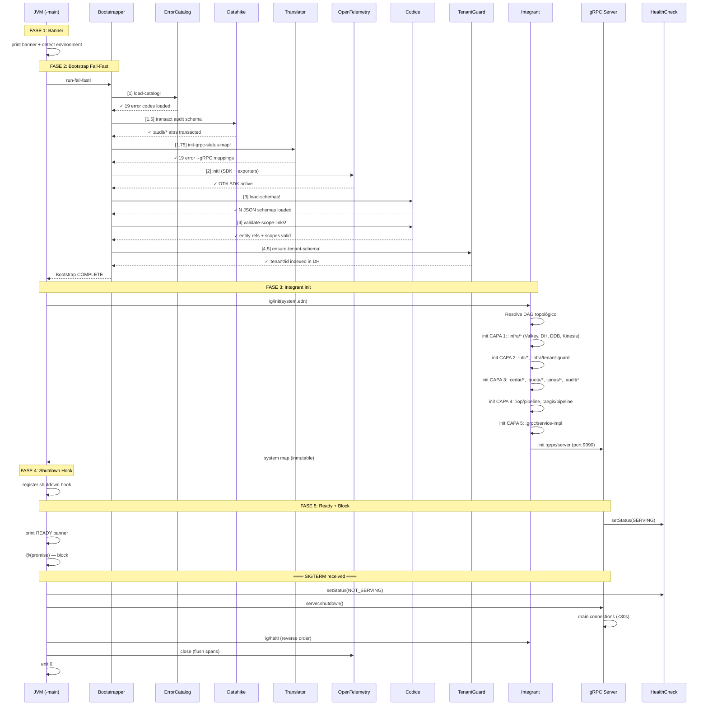
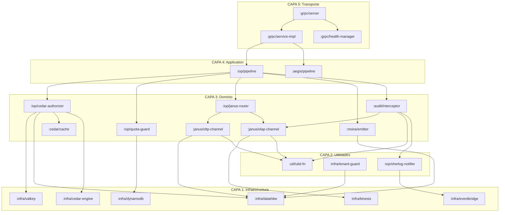

# Fase 01.02 — Función Main y Ciclo de Vida del Sistema

> **Fase contenedora:** [01_FASE_ALISTAMIENTO_ENTORNO.md](01_FASE_ALISTAMIENTO_ENTORNO.md)
> **Fase hermana:** [01.01_FASE_RUNTIME_GRPC.md](01.01_FASE_RUNTIME_GRPC.md)
> **Diseño aprobado para:** Bootstrap, Integrant lifecycle, shutdown, REPL, Lambda

```
═══════════════════════════════════════════════════════════════════════════════
  01.02 — FUNCIÓN MAIN Y CICLO DE VIDA DEL SISTEMA
  Principios: Single Responsibility · Fail-Fast · Graceful Shutdown · DIP
═══════════════════════════════════════════════════════════════════════════════
```

---

## MÓDULO I: Principios de Diseño

### I.1 — Principios Arquitectónicos Aplicados

| Principio                          | Aplicación en Main                                                                                                                                     |
| :--------------------------------- | :----------------------------------------------------------------------------------------------------------------------------------------------------- |
| **Single Responsibility (SRP)**    | `main.clj` SOLO orquesta el ciclo de vida. No contiene lógica de negocio, traducción, ni I/O directo.                                                  |
| **Dependency Inversion (DIP)**     | Ningún componente se instancia directamente — todo se resuelve por Integrant vía `system.edn`.                                                         |
| **Fail-Fast**                      | Si el bootstrap falla, la JVM muere con `exit 1` antes de aceptar cualquier request. Un servidor "medio vivo" es peor que uno muerto.                  |
| **Graceful Shutdown**              | Al recibir SIGTERM, el sistema drena conexiones activas (≤30s), deja de aceptar nuevos requests, y libera recursos en orden inverso de inicialización. |
| **Zero-Exception Boundary**        | El `main.clj` es el ÚNICO lugar donde se permite `try/catch` a nivel de JVM — para capturar errores fatales de bootstrap e Integrant.                  |
| **Configuration as Code**          | Toda la configuración vive en EDN (`system.edn`) — no en código imperativo. El `main.clj` no toma decisiones de wiring.                                |
| **Inmutabilidad del Sistema**      | Una vez que `ig/init` retorna, el `system` es inmutable. No se agregan ni remueven componentes en runtime.                                             |
| **Observabilidad desde el Inicio** | El primer span de OTel se crea en el bootstrap. Toda operación posterior es traceable.                                                                 |

### I.2 — Anti-Patrones Prohibidos

> [!WARNING]
> **Prácticas que están PROHIBIDAS en el entry point:**
>
> - ❌ `require` condicional basado en variables de entorno (complicates compilation)
> - ❌ `def` con side-effects al nivel del namespace (se ejecutan en compile-time)
> - ❌ `try/catch` que traga excepciones silenciosamente (swallowing)
> - ❌ `Thread/sleep` como mecanismo de espera (usa `CountDownLatch` o `promise`)
> - ❌ Inicialización perezosa de componentes de infraestructura (todo eager en bootstrap)
> - ❌ Acceso directo a `System/getenv` fuera de `config.readers` (centralizar en EDN)
> - ❌ Estado mutable global (usar `atom` solo dentro de componentes Integrant)

---

## MÓDULO II: Arquitectura de Capas del Entry Point

```
┌─────────────────────────────────────────────────────────────────────────┐
│                        FUNCIÓN -main                                    │
│                                                                         │
│  ┌───────────────────────────────────────────────────────────────────┐  │
│  │  FASE 1: BANNER + ENVIRONMENT DETECTION                          │  │
│  │  • Imprime versión, modo (dev/staging/prod), timestamp            │  │
│  │  • Detecta ENVIRONMENT env var                                    │  │
│  │  • Selecciona config profile (system.edn vs system.dev.edn)       │  │
│  └───────────────────────────────────────────────────────────────────┘  │
│                               │                                         │
│                               ▼                                         │
│  ┌───────────────────────────────────────────────────────────────────┐  │
│  │  FASE 2: BOOTSTRAP FAIL-FAST (bootstrap.clj)                     │  │
│  │  [1] errors/load-catalog!     → error_catalog.edn                 │  │
│  │  [1.5] datahike/audit-schema  → transact :audit/* attrs           │  │
│  │  [1.75] translator/init-grpc-status-map!  → error→gRPC status     │  │
│  │  [2] otel/init!               → OpenTelemetry SDK                 │  │
│  │  [3] codice/load-schemas!     → JSON schemas en memoria           │  │
│  │  [4] codice/validate-scope-links! → entity refs + scopes          │  │
│  │  [4.5] tenant-guard/verify-schema! → :tenant/id exists in DH     │  │
│  │  ★ CUALQUIER fallo → System/exit 1 INMEDIATAMENTE                │  │
│  └───────────────────────────────────────────────────────────────────┘  │
│                               │                                         │
│                               ▼                                         │
│  ┌───────────────────────────────────────────────────────────────────┐  │
│  │  FASE 3: INTEGRANT INIT (system.edn)                              │  │
│  │  • Cargar EDN con custom reader tags (#env, #env-bool, #env-int)  │  │
│  │  • ig/init resuelve DAG topológico automáticamente                 │  │
│  │  • Retorna system map inmutable con todos los componentes          │  │
│  │  ★ Si ig/init falla → System/exit 2                               │  │
│  └───────────────────────────────────────────────────────────────────┘  │
│                               │                                         │
│                               ▼                                         │
│  ┌───────────────────────────────────────────────────────────────────┐  │
│  │  FASE 4: SHUTDOWN HOOK                                            │  │
│  │  • Registrar JVM shutdown hook (SIGTERM / SIGINT)                 │  │
│  │  • Health → NOT_SERVING                                           │  │
│  │  • gRPC server.shutdown() → drain 30s                             │  │
│  │  • ig/halt! → liberar recursos en orden INVERSO                   │  │
│  │  • OTel flush → exportar spans pendientes                        │  │
│  └───────────────────────────────────────────────────────────────────┘  │
│                               │                                         │
│                               ▼                                         │
│  ┌───────────────────────────────────────────────────────────────────┐  │
│  │  FASE 5: READY + BLOCK                                            │  │
│  │  • Log: "Metri Engine READY — gRPC listening on port 9090"        │  │
│  │  • HealthCheck → SERVING                                          │  │
│  │  • @(promise) — bloquear hilo principal hasta SIGTERM             │  │
│  └───────────────────────────────────────────────────────────────────┘  │
└─────────────────────────────────────────────────────────────────────────┘
```

---

## MÓDULO III: Implementación `main.clj`

### III.1 — Namespace y entry point

```clojure
(ns metri.main
  "Entry point de la JVM — orquesta el ciclo de vida completo.

   RESPONSABILIDADES (y SOLO estas):
   1. Detectar entorno (dev/staging/production)
   2. Ejecutar bootstrap fail-fast
   3. Inicializar sistema Integrant
   4. Registrar shutdown hook
   5. Bloquear hilo principal

   NO CONTIENE: lógica de negocio, traducción proto, I/O directo.
   NO IMPORTA: clases Protobuf, SDKs AWS, componentes de dominio."
  (:gen-class)  ;; AOT compile — necesario para -main como entry point JVM
  (:require [integrant.core :as ig]
            [clojure.java.io :as io]
            [metri.bootstrap :as bootstrap]
            [metri.config.readers]))  ;; side-effect: registra #env, #env-bool, #env-int

;; ═══════════════════════════════════════════════════════════════════════════
;; CONSTANTES
;; ═══════════════════════════════════════════════════════════════════════════

(def ^:private version "0.1.0-SNAPSHOT")

(def ^:private banner
  "
  ╔══════════════════════════════════════════════════╗
  ║                                                  ║
  ║   █▀▄▀█ █▀▀ ▀█▀ █▀█ █                            ║
  ║   █ ▀ █ ██▄  █  █▀▄ █                            ║
  ║                                                  ║
  ║   Engine — Analytical gRPC Runtime               ║
  ║                                                  ║
  ╚══════════════════════════════════════════════════╝")

;; ═══════════════════════════════════════════════════════════════════════════
;; FUNCIONES PRIVADAS
;; ═══════════════════════════════════════════════════════════════════════════

(defn- detect-environment
  "Detecta el entorno de ejecución desde la variable ENVIRONMENT.
   Retorna keyword: :development, :staging, :production.
   Default: :development (fail-safe para devs)."
  []
  (let [env (or (System/getenv "ENVIRONMENT") "development")]
    (keyword env)))

(defn- select-config-resource
  "Selecciona el recurso EDN según el entorno.
   - :production / :staging → config/system.edn
   - :development           → config/system.dev.edn (con overrides)"
  [environment]
  (case environment
    :development "config/system.dev.edn"
    ;; staging y production usan el mismo system.edn
    ;; — las diferencias viven en las variables de entorno
    "config/system.edn"))

(defn- load-system-config
  "Carga y parsea el system.edn con resolución de custom reader tags.
   PRECONDICIÓN: metri.config.readers ya fue loaded (side-effect al require)."
  [config-resource]
  (let [resource (io/resource config-resource)]
    (when-not resource
      (throw (ex-info (str "Config resource not found: " config-resource)
                      {:resource config-resource
                       :code     :BOOT_CONFIG_NOT_FOUND})))
    (-> resource slurp ig/read-string)))

(defn- register-shutdown-hook!
  "Registra el shutdown hook de la JVM.
   Secuencia de shutdown:
   1. Log inicio de shutdown
   2. Health → NOT_SERVING (stop accepting traffic on NLB)
   3. Esperar drain (gRPC server cierra gracefully)
   4. ig/halt! en orden INVERSO de inicialización
   5. OTel flush — exportar spans pendientes
   6. Log fin de shutdown"
  [system environment]
  (.addShutdownHook (Runtime/getRuntime)
    (Thread.
      (fn []
        (let [start (System/nanoTime)]
          (println "\n── Shutdown ──────────────────────────────────")
          (println "  Environment:" (name environment))

          ;; [1] Health → NOT_SERVING
          (when-let [hm (:grpc/health-manager system)]
            (println "  [1] Health → NOT_SERVING")
            (.setStatus hm "metri.MetriService" :not-serving))

          ;; [2] gRPC server graceful shutdown (drain connections)
          (when-let [server (:grpc/server system)]
            (println "  [2] gRPC server shutting down (30s drain)...")
            (.shutdown (:server server))
            (.awaitTermination (:server server) 30 java.util.concurrent.TimeUnit/SECONDS))

          ;; [3] Integrant halt — reverse topological order
          (println "  [3] ig/halt! — releasing resources...")
          (ig/halt! system)

          ;; [4] OTel flush
          (println "  [4] OTel flush — exporting pending spans...")
          (try
            (when-let [otel (:otel/sdk system)]
              (.close otel))
            (catch Exception _))  ;; best-effort — no fail on shutdown

          (let [elapsed-ms (/ (- (System/nanoTime) start) 1e6)]
            (println (format "── Shutdown COMPLETE (%.0fms) ─────────────────\n" elapsed-ms))))))))

(defn- print-ready-banner
  "Imprime el banner de READY con información del sistema."
  [system environment]
  (let [port (get-in system [:grpc/server :port] 9090)]
    (println (str "\n✓ Metri Engine READY"))
    (println (str "  Environment:  " (name environment)))
    (println (str "  gRPC port:    " port))
    (println (str "  Health check: SERVING"))
    (println (str "  Version:      " version))
    (println (str "  PID:          " (.pid (java.lang.ProcessHandle/current))))
    (println "")))

;; ═══════════════════════════════════════════════════════════════════════════
;; ENTRY POINT
;; ═══════════════════════════════════════════════════════════════════════════

(defn -main
  "Entry point de la JVM.

   Secuencia:
   1. Banner + environment detection
   2. Bootstrap fail-fast (sequential, any failure → exit 1)
   3. Integrant init (topological dependency resolution)
   4. Register shutdown hook (SIGTERM → graceful drain)
   5. Block until SIGTERM

   CONTRATOS:
   - Si bootstrap falla → exit 1 (JVM muere, ECS/Lambda reintenta)
   - Si ig/init falla    → exit 2 (config error, no reintentable)
   - Si todo OK          → bloquea hasta SIGTERM, exit 0

   INVARIANTE: cero requests aceptados hasta que FASE 5 emite SERVING."
  [& _args]

  ;; ── FASE 1: Banner + Environment ─────────────────────────────────────
  (println banner)
  (let [environment (detect-environment)]
    (println (str "  Environment: " (name environment)))
    (println (str "  Version:     " version))
    (println (str "  JVM:         " (System/getProperty "java.version")))
    (println (str "  Timestamp:   " (java.time.Instant/now)))
    (println "")

    ;; ── FASE 2: Bootstrap Fail-Fast ──────────────────────────────────
    ;; Si cualquier paso falla → System/exit 1
    ;; No se acepta ningún request hasta que bootstrap complete.
    (bootstrap/run-fail-fast!)

    ;; ── FASE 3: Integrant Init ───────────────────────────────────────
    ;; Carga system.edn, resuelve el DAG topológico, instancia todos
    ;; los componentes en orden de dependencias.
    (println "── Integrant ─────────────────────────────────")
    (let [config-resource (select-config-resource environment)
          _               (println (str "  Config: " config-resource))
          config          (try
                            (load-system-config config-resource)
                            (catch Exception e
                              (println (str "  ✗ FATAL: Cannot load config: " (ex-message e)))
                              (System/exit 2)))
          system          (try
                            (let [start (System/nanoTime)
                                  sys   (ig/init config)
                                  ms    (/ (- (System/nanoTime) start) 1e6)]
                              (println (format "  ✓ System initialized (%.0fms) — %d components"
                                               ms (count sys)))
                              sys)
                            (catch Exception e
                              (println (str "  ✗ FATAL: ig/init failed: " (ex-message e)))
                              (when-let [data (ex-data e)]
                                (println (str "  Data: " (pr-str data))))
                              (System/exit 2)))]

      ;; ── FASE 4: Shutdown Hook ────────────────────────────────────
      (register-shutdown-hook! system environment)

      ;; ── FASE 5: Ready + Block ────────────────────────────────────
      (print-ready-banner system environment)

      ;; Bloquear el hilo principal hasta SIGTERM.
      ;; @(promise) nunca se resuelve — el shutdown hook se encarga.
      @(promise))))
```

### III.2 — Justificación de cada decisión

| Decisión                                    | Rationale                                                                                                          |
| :------------------------------------------ | :----------------------------------------------------------------------------------------------------------------- |
| `(:gen-class)`                              | Necesario para AOT compilation — `clj -M -m metri.main` requiere una clase con `public static void main(String[])` |
| `require metri.config.readers`              | Side-effect import: registra `#env`, `#env-bool`, `#env-int` antes de que `ig/read-string` los necesite            |
| `detect-environment` default `:development` | Fail-safe: un dev que olvida setear `ENVIRONMENT` obtiene el modo más permisivo, no el más restrictivo             |
| `exit 1` vs `exit 2`                        | Código 1 = bootstrap fail (reintentable por ECS). Código 2 = config error (no reintentable — necesita fix humano)  |
| `@(promise)` para bloquear                  | Más limpio que `Thread/sleep(Long/MAX_VALUE)`. No consume CPU. Se desbloquea solo vía shutdown hook                |
| Shutdown hook con orden explícito           | Health→NOT_SERVING primero para que NLB deje de enviar tráfico ANTES de que el server cierre                       |
| OTel flush en `try/catch`                   | Best-effort: si OTel falla al cerrar, no bloquear el shutdown (el sistema ya está muriendo)                        |

---

## MÓDULO IV: Bootstrap Fail-Fast (`bootstrap.clj`)

### IV.1 — Diseño del Bootstrap

```clojure
(ns metri.bootstrap
  "Bootstrapper secuencial fail-fast.

   INVARIANTES:
   1. Cada paso DEBE completar antes del siguiente
   2. Si ANY paso falla → (System/exit 1) — no se aceptan requests
   3. El orden NO es arbitrario — cada paso depende del anterior
   4. El bootstrap es IDEMPOTENTE — safe to call multiple times
   5. Todos los pasos son SÍNCRONOS — no async, no futures

   ORDEN DE DEPENDENCIAS:
     [1]    Error catalog   → necesario para que todo reporte errores con códigos
     [1.5]  Audit schema    → Datahike schema debe existir antes de init :audit/*
     [1.75] gRPC status map → necesita catálogo del paso [1]
     [2]    OTel SDK        → listo antes de que cualquier span se cree
     [3]    Codice schemas  → deben cargarse antes de validar scopes
                               NOTA: ig/init-key :codice/registry ahora recibe
                               tenant-guard como dep para seed (D7)
     [4]    Scope links     → requiere schemas del paso [3]
     [4.5]  Tenant guard    → verificar que :tenant/id existe en DH schema"
  (:require [metri.common.errors :as errors]
            [metri.otel.spans :as otel]
            [metri.codice.bootstrapper :as codice]
            [metri.grpc.translator :as translator]
            [metri.infrastructure.datahike :as datahike]
            [metri.infrastructure.tenant-guard :as tenant-guard]
            [clojure.java.io :as io]
            [clojure.edn :as edn]))

;; ═══════════════════════════════════════════════════════════════════════════
;; STEP RUNNER — fail-fast wrapper
;; ═══════════════════════════════════════════════════════════════════════════

(defn- run-step!
  "Ejecuta un paso del bootstrap con timing y fail-fast.
   Si el paso lanza excepción → imprime error y mata la JVM.

   DISEÑO: Este es el ÚNICO lugar donde System/exit se llama por bootstrap.
   Los pasos individuales lanzan excepciones normales — run-step! las captura."
  [step-id step-name f]
  (let [start (System/nanoTime)]
    (print (str "  [" step-id "] " step-name " "))
    (flush)
    (try
      (f)
      (let [elapsed-ms (/ (- (System/nanoTime) start) 1e6)]
        (println (format "✓ (%.1fms)" elapsed-ms)))
      (catch Exception e
        (println (str "✗ FATAL: " (ex-message e)))
        (when-let [data (ex-data e)]
          (println (str "         Data: " (pr-str data))))
        (System/exit 1)))))

;; ═══════════════════════════════════════════════════════════════════════════
;; BOOTSTRAP SEQUENCE
;; ═══════════════════════════════════════════════════════════════════════════

(defn run-fail-fast!
  "Ejecuta el bootstrap secuencial. Si cualquier paso falla, la JVM muere.

   POSTCONDICIONES al completar:
   - errors/catalog está cargado en memoria
   - Datahike tiene :audit/* y :tenant/id en su schema
   - translator tiene el mapa error-code→gRPC-Status
   - OTel SDK está activo y exportando
   - Codice tiene todos los JSON schemas validados
   - Todas las entity refs y sequence scopes son resolvibles
   - :tenant/id existe como atributo indexado en Datahike"
  []
  (println "\n── Bootstrap ──────────────────────────────────")

  ;; [1] Error Catalog — SSOT de todos los códigos de error del sistema.
  ;; PRIMERO: todo lo demás necesita reportar errores con códigos válidos.
  ;; Si este paso falla, nada funciona.
  (run-step! "1" "errors/load-catalog!"
    #(errors/load-catalog!))

  ;; [1.5] Audit Schema — transacciona los atributos :audit/* en Datahike.
  ;; Estos atributos DEBEN existir antes de que Integrant inicialice
  ;; :audit/interceptor, porque ese componente hace d/transact con :audit/*.
  ;; DISEÑO: datahike/get-connection lee el store directamente desde env vars
  ;; (DATAHIKE_DDB_TABLE + AWS_REGION), sin pasar por Integrant. Es una conexión
  ;; directa bootstrap-only. Integrant la reutiliza después en :infra/datahike.
  ;; Si la DB no existe aún, levanta — este paso asume que :infra/datahike
  ;; ya creó la DB en el primer despliegue (idempotente vía datahike/database-exists?).
  (run-step! "1.5" "datahike/audit-schema"
    (fn []
      (let [audit-schema (-> (io/resource "schemas/audit_attrs.edn")
                            slurp
                            edn/read-string)
            conn (datahike/get-connection)]
        (when-not conn
          (throw (ex-info "Datahike connection unavailable"
                          {:step :bootstrap/audit-schema})))
        (datahike/transact-schema! conn audit-schema))))

  ;; [1.75] gRPC Status Map — derivar error-code → gRPC Status del catálogo.
  ;; Necesita el catálogo cargado en [1]. Evita duplicación DRY.
  (run-step! "1.75" "translator/init-grpc-status-map!"
    #(translator/init-grpc-status-map! @errors/catalog))

  ;; [2] OpenTelemetry — SDK + exporters.
  ;; En ECS: ADOT sidecar recibe spans vía gRPC localhost:4317.
  ;; En dev: NoOp exporter (no envía spans).
  (run-step! "2" "otel/init!"
    #(otel/init!))

  ;; [3] Codice — JSON schemas de todas las entidades.
  ;; Escanea resources/schemas/*.json, valida con Malli, registra en memoria.
  ;; G6 FASE 10: span OTel (SDK ya inicializado en paso [2])
  ;; NOTA D7: ig/init-key :codice/registry ejecuta seed-event-routing-rules!
  ;; usando tenant-guard/transact-with-tenant! (no d/transact directo).
  ;; Las firmas de la API cambiaron (D1): load-schema, entity-engine, etc.
  ;; ahora retornan Railway [:ok val] | [:error map] y reciben ctx.
  ;; Ver: 02_FASE_MOTOR_SCHEMA_DRIVEN_CORE.md → MÓDULO XI (Checklist FASE 10).
  (run-step! "3" "codice/load-schemas!"
    #(otel/with-span ["bootstrap.codice.load-schemas" {:kind :internal}]
       (let [span (otel/current-span)]
         (codice/load-schemas!)
         (otel/set-attributes! span
           {"schema.count" (count @codice/registry)}))))

  ;; [4] Codice — validar entity refs y sequence scopes.
  ;; G6 FASE 10: span OTel con link.count
  ;; Verifica que todo is_entity_ref apunte a un entity_type real
  ;; y que todo is_sequence_scope/is_sequence_scope_via sea resolvible.
  (run-step! "4" "codice/validate-scope-links!"
    #(otel/with-span ["bootstrap.codice.validate-scope-links" {:kind :internal}]
       (codice/validate-scope-links!)))

  ;; [4.5] Tenant Guard — verificar que :tenant/id existe en Datahike.
  ;; G6 FASE 10: span OTel con attr.exists
  ;; Pool Model: TODA entidad debe tener :tenant/id. Si el schema
  ;; no tiene este atributo, el tenant-guard no puede funcionar.
  (run-step! "4.5" "tenant-guard/verify-schema!"
    (fn []
      (otel/with-span ["bootstrap.tenant-guard.verify-schema" {:kind :internal}]
        (let [conn (datahike/get-connection)
              span (otel/current-span)]
          (tenant-guard/ensure-tenant-schema! conn)
          (otel/set-attributes! span {"attr.exists" true})))))

  (println "── Bootstrap COMPLETE ─────────────────────────\n"))
```

> [!NOTE]
> **G6 FASE 10:** Los pasos [1], [1.5], [1.75] ejecutan ANTES de `otel/init!` (paso [2]).
> Por lo tanto, no pueden tener spans OTel. Solo los pasos [3], [4] y [4.5] se benefician
> de observabilidad via spans.

### IV.1.1 — Observabilidad OTel del Bootstrap (G7 FASE 10)

| Span | Cuándo | Atributos clave |
| :--- | :----- | :-------------- |
| `bootstrap.codice.load-schemas` | Paso [3] — post OTel init | `schema.count` |
| `bootstrap.codice.validate-scope-links` | Paso [4] — post OTel init | — |
| `bootstrap.tenant-guard.verify-schema` | Paso [4.5] — post OTel init | `attr.exists` |

> [!IMPORTANT]
> Si el bootstrap falla en un paso con span OTel, el span se cierra con `status=ERROR`
> automáticamente (el `run-step!` lanza, y `otel/with-span` captura el error en el span
> antes de propagarlo).




---

## MÓDULO V: Integrant Component Lifecycle

### V.1 — `init-key` / `halt-key!` Pattern

Cada componente Integrant implementa exactamente DOS métodos:

```clojure
;; Patrón estándar para TODOS los componentes del sistema.
;; NO se permite lógica de negocio en init-key/halt-key!

;; ── Ejemplo: :infra/datahike ────────────────────────────────────────────

(defmethod ig/init-key :infra/datahike
  [_ {:keys [store]}]
  (println "    → Datahike connecting to" (:table store))
  (let [cfg {:store store}]
    ;; Crear database si no existe (idempotente)
    (when-not (datahike/database-exists? cfg)
      (datahike/create-database cfg))
    ;; Retornar conexión — los demás componentes la reciben vía #ig/ref
    {:conn   (datahike/connect cfg)
     :config cfg}))

(defmethod ig/halt-key! :infra/datahike
  [_ {:keys [conn]}]
  (println "    ← Datahike releasing connection")
  (datahike/release conn))

;; ── Ejemplo: :infra/tenant-guard ────────────────────────────────────────

(defmethod ig/init-key :infra/tenant-guard
  [_ {:keys [datahike-conn]}]
  (println "    → TenantGuard initialized (Pool Model)")
  ;; Retorna un record que implementa las funciones de tenant-guard
  ;; con la conexión Datahike ya inyectada.
  {:conn (:conn datahike-conn)})

;; ── Ejemplo: :grpc/server ───────────────────────────────────────────────

(defmethod ig/init-key :grpc/server
  [_ {:keys [service-impl port health-manager otel-sdk
             max-inbound-msg-size-mb deadline-ms]}]
  (let [otel-interceptor (when otel-sdk
                           (io.opentelemetry.instrumentation.grpc/GrpcTelemetry/create otel-sdk))
        server (-> (io.grpc.netty.shaded.io.grpc.netty/NettyServerBuilder/forPort port)
                   (.addService (:service service-impl))
                   (.addService (io.grpc.protobuf.services/ProtoReflectionService/newInstance))
                   (.addService (io.grpc.services/HealthStatusManager. health-manager))
                   ;; Interceptors: OTel primero (crea span root del request)
                   (.intercept (.newServerInterceptor otel-interceptor))
                   (.maxInboundMessageSize (* max-inbound-msg-size-mb 1024 1024))
                   (.build)
                   (.start))]
    (println (str "    → gRPC server listening on port " port))
    {:server server :port port}))

(defmethod ig/halt-key! :grpc/server
  [_ {:keys [server]}]
  (println "    ← gRPC server shutting down")
  (.shutdown server)
  (.awaitTermination server 30 java.util.concurrent.TimeUnit/SECONDS))
```

### V.2 — Orden de Inicialización (DAG)



> [!IMPORTANT]
> **El orden lo resuelve Integrant automáticamente** desde el DAG de `#ig/ref`.
> No hay código imperativo que diga "primero esto, luego lo otro" — el orden emerge del grafo declarativo.
> Si alguien agrega un `#ig/ref` incorrecto, `ig/init` detecta el ciclo y falla ANTES de iniciar.

---

## MÓDULO VI: Desarrollo REPL

### VI.1 — Sistema Recargable

```clojure
(ns user
  "Namespace REPL — solo se carga en dev.
   Provee funciones para iniciar/detener/resetear el sistema."
  (:require [integrant.core :as ig]
            [integrant.repl :refer [clear go halt prep init reset reset-all]]
            [integrant.repl.state :refer [system config]]
            [clojure.java.io :as io]
            [metri.bootstrap :as bootstrap]
            [metri.config.readers]))

;; Preparar el config
(integrant.repl/set-prep!
  (fn []
    (bootstrap/run-fail-fast!)
    (-> (io/resource "config/system.dev.edn")
        slurp
        ig/read-string)))

;; Usando el REPL:
(comment
  ;; Iniciar el sistema completo
  (go)

  ;; Detener el sistema
  (halt)

  ;; Resetear (halt + reload namespaces + go)
  (reset)

  ;; Acceder a componentes individuales
  (:infra/datahike system)
  (:iop/pipeline system)

  ;; Ejecutar un pipeline manualmente
  (let [iop (:iop/pipeline system)]
    (iop {:request {:entity-type "work_order"
                    :operation   :create
                    :payload     {:title "Test WO"}}}))
  )
```

### VI.2 — `system.dev.edn`

```clojure
;; config/system.dev.edn — overrides para desarrollo local.
;; Hereda del system.edn pero reemplaza infraestructura real con stubs.

{:infra/valkey         {:host "localhost" :port 6379 :password ""}

 ;; Pool Model: tabla local compartida en LocalStack DynamoDB
 :infra/datahike       {:store {:backend :dynamodb
                                :table   "metri-dh-shared"
                                :region  "us-east-1"
                                :endpoint "http://localhost:4566"}}

 :infra/dynamodb       {:region "us-east-1"
                         :endpoint "http://localhost:4566"}

 :infra/kinesis        {:stream-prefix "metri-local"
                         :region "us-east-1"
                         :endpoint "http://localhost:4566"}

 :infra/cedar-engine   {:policies-table "cedar-policies-local"
                         :endpoint "http://localhost:4566"}

 :infra/eventbridge    {:event-bus-name "metri-fault-bus-local"
                         :region "us-east-1"
                         :endpoint "http://localhost:4566"}

 ;; OTel: NoOp en dev
 :otel/sdk              {:exporter :noop}

 ;; gRPC: reflection habilitado en dev
 :grpc/server          {:port 9090
                         :enable-reflection true
                         :deadline-ms 60000}}  ;; 60s en dev (más tiempo para debug)
```

---

## MÓDULO VII: Lambda Entry Point (`handler.clj`)

```clojure
(ns metri.lambda.handler
  "Entry point para AWS Lambda con Function URL + RESPONSE_STREAM.

   PRINCIPIO: Comparte EXACTAMENTE los mismos pipelines (IOP, Aegis)
   que el modo gRPC. Solo el entry point y el transporte cambian.

   SNAPSTART: El `delay` en `system` asegura que bootstrap + ig/init
   se ejecutan en la fase de init (congelada por SnapStart).
   Los requests subsiguientes reutilizan el sistema inicializado."
  (:gen-class
   :implements [com.amazonaws.services.lambda.runtime.RequestStreamHandler])
  (:require [integrant.core :as ig]
            [metri.bootstrap :as bootstrap]
            [metri.config.readers]
            [clojure.java.io :as io]
            [cheshire.core :as json])
  (:import [java.io InputStream OutputStream]))

;; ── Sistema Integrant — inicializado UNA VEZ (SnapStart lo congela) ───
(def ^:private system
  (delay
    (bootstrap/run-fail-fast!)
    (let [config (-> (io/resource "config/system.lambda.edn")
                     slurp
                     ig/read-string)]
      (ig/init config))))

(defn -handleRequest
  "Entry point Lambda — Function URL con RESPONSE_STREAM.
   FASE 10 G1 (paridad con handle-unary gRPC): excepciones inesperadas
   → sherlog/handle-fault! con SYS_000 antes de retornar 500."
  [this ^InputStream input-stream ^OutputStream output-stream context]
  (try
    (let [system    @system
          iop       (:iop/pipeline system)
          event     (json/parse-stream (io/reader input-stream) true)
          operation (get-in event [:headers :x-metri-operation] "transact")
          ctx       {:request {:entity-type    (get-in event [:body :entity_type])
                               :entity-id      (get-in event [:body :entity_id])
                               :operation      (keyword (get-in event [:body :action] "create"))
                               :payload        (get-in event [:body :payload] {})
                               :proto-tenant-id (get-in event [:body :tenant_id])}}
          result    (iop ctx)
          response  (case (first result)
                      :ok    {:statusCode 200
                              :body (json/generate-string (second result))}
                      :error {:statusCode (error->http-status (second result))
                              :body (json/generate-string (second result))})]
      (with-open [w (io/writer output-stream)]
        (.write w (json/generate-string response))
        (.flush w)))
    (catch Exception e
      ;; G1 FASE 10 (paridad Lambda ↔ gRPC): excepción inesperada → Sherlog/SYS_000.
      ;; Los errores Railway [:error] nunca llegan aquí — el IOP los maneja vía
      ;; iop/error_response → build-error-dto → sherlog/handle-fault!.
      ;; Solo excepciones no controladas (bugs, NPE, infraestructura) escalan aquí.
      (try
        (let [system @system
              dto    (error-response/build-error-dto
                       {:code :SYS_000 :stage :lambda :detail (ex-message e)}
                       {} nil)]
          (sherlog/handle-fault! dto :error
            (sherlog/get-notifiers)
            (:janus/olap-channel system)))
        (catch Exception _))  ;; best-effort — nunca bloquea la respuesta
      (with-open [w (io/writer output-stream)]
        (.write w (json/generate-string
                    {:statusCode 500
                     :body (json/generate-string {:error (ex-message e)})}))
        (.flush w)))))

(defn- error->http-status
  "Mapea error Railway → HTTP status code para Lambda responses.
   DRY: usa :http-status del catálogo maestro (errors/lookup) —
   los mismos códigos que :grpc-status en translator.clj.
   Fallback 500 si el código no está en el catálogo (indica bug en error_catalog.edn).
   FASE 10 III.2: si el código no está en el catálogo, no existe en el sistema."
  [{:keys [code]}]
  (or (some->> code errors/lookup :http-status)
      500))
```

> [!IMPORTANT]
> `error->http-status` deriva el status HTTP **exclusivamente** del catálogo maestro
> (`errors/lookup code :http-status`). No hay `case code ...` hardcodeado.
> Si un error no tiene `:http-status` en `error_catalog.edn`, retorna 500 y es
> detectable en test: añadir el código al catálogo es la corrección — nunca el código.

---

## MÓDULO VIII: Exit Codes y Manejo de Errores

### VIII.1 — Tabla de Exit Codes

| Exit Code | Fase      | Significado                                    | Reintentable      |
| :-------- | :-------- | :--------------------------------------------- | :---------------- |
| `0`       | Shutdown  | Terminación limpia vía SIGTERM                 | ✅ (normal)       |
| `1`       | Bootstrap | Fallo en paso fail-fast                        | ✅ (ECS restart)  |
| `2`       | Integrant | Config EDN inválido o componente no resolvible | ❌ (necesita fix) |
| `137`     | OOM       | JVM killed por kernel (out of memory)          | ⚠️ (ajustar heap) |
| `143`     | SIGTERM   | Killed externally (ECS task stop)              | ✅ (normal)       |

### VIII.2 — Logging Estructurado del Lifecycle

```clojure
;; Output del bootstrap en producción:
;;
;; ╔══════════════════════════════════════════════════╗
;; ║   █▀▄▀█ █▀▀ ▀█▀ █▀█ █                            ║
;; ║   █ ▀ █ ██▄  █  █▀▄ █                            ║
;; ║   Engine — Analytical gRPC Runtime               ║
;; ╚═════════════�| Documento                                                                  | Relación                                                      |
| :------------------------------------------------------------------------- | :------------------------------------------------------------ |
| [01.01_FASE_RUNTIME_GRPC.md](01.01_FASE_RUNTIME_GRPC.md) | system.edn SSOT, gRPC server lifecycle, deployment topology. **G1-G10 FASE 10 implementados.** |
| [03_FASE_INGESTION.md](03_FASE_INGESTION.md) | Principio Pool Model — tenant-guard verificado en bootstrap |
| [03A_FASE_IOP.md](03A_FASE_IOP.md) | Pipeline IOP que se inyecta como `:iop/pipeline` en Integrant |
| [10_FASE_GESTION_ERRORES_EDA.md](10_FASE_GESTION_ERRORES_EDA.md) | error_catalog.edn cargado en bootstrap paso [1]. **G6/G7/G8 implementados.** |
| [09_FASE_AUDITORIA.md](09_FASE_AUDITORIA.md) | audit_attrs.edn transaccionado en bootstrap paso [1.5] |
| [02_FASE_MOTOR_SCHEMA_DRIVEN_CORE.md](02_FASE_MOTOR_SCHEMA_DRIVEN_CORE.md) | Códice schemas cargados en bootstrap paso [3]. **D1-D7:** API ahora Railway, seed via tenant-guard |

> [!WARNING]
> **FASE 02 Breaking Changes (D1-D7):**
> Las firmas de la API pública del Códice cambiaron. Todas las funciones ahora:
>
> - Reciben `ctx` como segundo argumento
> - Retornan Railway `[:ok val]` / `[:error map]` — nunca `throw`
> - Usan `errors/error` del catálogo maestro
> - `seed-event-routing-rules!` y `sequence/next!` usan `tenant-guard`
>   Ver: [02_FASE_MOTOR_SCHEMA_DRIVEN_CORE.md → MÓDULO XI](02_FASE_MOTOR_SCHEMA_DRIVEN_CORE.md)
── readers.clj        [NEW]  ← #env, #env-bool, #env-int reader tags
│   │
│   ├── grpc/
│   │   ├── server.clj         [NEW]  ← ig/init-key :grpc/server (Netty lifecycle)
│   │   ├── service.clj        [NEW]  ← MetriServiceImpl (adaptador → pipelines)
│   │   ├── translator.clj     [NEW]  ← proto↔clj + init-grpc-status-map!
│   │   └── interceptors.clj   [NEW]  ← OTel + deadline enforcement
│   │
│   ├── lambda/
│   │   └── handler.clj        [NEW]  ← Function URL + SnapStart
│   │
│   ├── infrastructure/
│   │   ├── tenant-guard.clj   [NEW]  ← Pool Model gate para Datahike
│   │   ├── datahike.clj       [MOD]  ← ig/init-key :infra/datahike
│   │   └── ...
│   │
│   └── domain/                       ← Dominio puro (cero imports de infra)
│
├── config/
│   ├── system.edn             [NEW]  ← SSOT: grafo Integrant completo
│   ├── system.lambda.edn      [NEW]  ← Variante Lambda (sin gRPC server)
│   └── system.dev.edn         [NEW]  ← Overrides dev: LocalStack, NoOp OTel
│
├── dev/
│   └── user.clj               [NEW]  ← REPL namespace con go/halt/reset
│
└── resources/
    └── schemas/
        └── audit_attrs.edn    [NEW]  ← Schema :audit/* para bootstrap
```

---

## MÓDULO X: Matriz TDD

### X.1 — `main_test.clj` (8 tests)

| ID    | Caso                                            | Esperado                      |
| :---- | :---------------------------------------------- | :---------------------------- |
| MN-01 | `-main` con bootstrap OK + Integrant OK         | System inicializado, no lanza |
| MN-02 | `-main` con bootstrap fallo                     | `System/exit 1` invocado      |
| MN-03 | `-main` con config EDN inválido                 | `System/exit 2` invocado      |
| MN-04 | `detect-environment` con ENVIRONMENT=production | `:production`                 |
| MN-05 | `detect-environment` sin ENVIRONMENT            | `:development`                |
| MN-06 | `select-config-resource` con `:development`     | `"config/system.dev.edn"`     |
| MN-07 | `select-config-resource` con `:production`      | `"config/system.edn"`         |
| MN-08 | Shutdown hook ejecuta ig/halt! en orden inverso | mock verify: halt! called     |

### X.2 — `bootstrap_test.clj` (10 tests)

| ID     | Caso                                                               | Esperado                                |
| :----- | :----------------------------------------------------------------- | :-------------------------------------- |
| BST-01 | Todos los pasos OK                                                 | `run-fail-fast!` completa sin excepción |
| BST-02 | `errors/load-catalog!` falla                                       | `System/exit 1` invocado                |
| BST-03 | `otel/init!` falla                                                 | `System/exit 1` invocado                |
| BST-04 | `codice/load-schemas!` falla                                       | `System/exit 1` invocado                |
| BST-05 | `codice/validate-scope-links!` falla                               | `System/exit 1` invocado                |
| BST-06 | Pasos posteriores no se ejecutan si anterior falla                 | mock verify: paso N+1 nunca invocado    |
| BST-07 | `datahike/audit-schema` falla → exit 1                             | `System/exit 1` — conn unavailable      |
| BST-08 | `translator/init-grpc-status-map!` ejecuta después de catalog      | atom tiene entries                      |
| BST-09 | `tenant-guard/ensure-tenant-schema!` verifica :tenant/id           | Schema existe en DH                     |
| BST-10 | `tenant-guard/ensure-tenant-schema!` falla si :tenant/id no existe | `System/exit 1`                         |

---

## MÓDULO XI: Checklist

- [ ] `main.clj` tiene `(:gen-class)` para AOT compilation
- [ ] `main.clj` NO importa clases Protobuf ni SDKs AWS
- [ ] Bootstrap ejecuta 7 pasos en orden estricto
- [ ] Bootstrap falla → `System/exit 1` antes de aceptar requests
- [ ] Config EDN inválido → `System/exit 2`
- [ ] Shutdown hook registrado con orden: Health→Drain→Halt→OTel
- [ ] `@(promise)` bloquea hilo principal sin consumir CPU
- [ ] `system.dev.edn` tiene overrides para LocalStack
- [ ] `dev/user.clj` tiene `go`/`halt`/`reset` para REPL workflow
- [ ] `handler.clj` usa `delay` para SnapStart compatibility
- [ ] Exit codes documentados: 0 (normal), 1 (bootstrap), 2 (config)
- [ ] Banner imprime versión, environment, JVM version y PID
- [ ] `tenant-guard/ensure-tenant-schema!` ejecuta en bootstrap paso [4.5]

**FASE 10 — Gestión de Errores y Observabilidad (G6/G7/G8):**

- [ ] Pasos [3], [4], [4.5] del bootstrap envueltos en `otel/with-span` (G6)
- [ ] Spans de bootstrap anotan `schema.count` y `attr.exists` (G7)
- [ ] `run-step!` invoca `System/exit 1` para cualquier fallo — nunca silencia errores
- [ ] OTel SDK inicializado (paso [2]) ANTES de spans de bootstrap (pasos [3]+)
- [ ] `system.edn` refleja D7 — Codice keys con tenant-guard (G4/G9 en 01.01)
- [ ] `error_catalog.edn` cargado en paso [1] — SSOT de códigos de error
- [ ] `error->http-status` en `handler.clj` deriva `:http-status` de `errors/lookup` — **nunca `case` hardcodeado** (FASE 10 III.2 DRY)
- [ ] `handler.clj` `-handleRequest` captura excepciones inesperadas → `sherlog/handle-fault!` con `SYS_000` (paridad G1 con `handle-unary` gRPC)
- [ ] `sherlog/handle-fault!` es el **único punto de entrada** de Sherlog — nunca `emit-fault-event!` ni `record-fault!` directamente (FASE 10 V.4)
- [ ] `emit-fault-event!` SINCRÓNICO — completa antes de que el handler Lambda retorne (~8-15ms p99) (FASE 10 V.3/V.4)
- [ ] `trace_id` del OTel span activo propagado a todo `[:error]` producido en el pipeline (FASE 10 Railway)
- [ ] `datahike/get-connection` en paso [1.5] usa env vars directas (sin Integrant) — documentado y testeado (BST-07)

---

## Referencias Cruzadas

| Documento                                                                  | Relación                                                      |
| :------------------------------------------------------------------------- | :------------------------------------------------------------ |
| [01.01_FASE_RUNTIME_GRPC.md](01.01_FASE_RUNTIME_GRPC.md) | system.edn SSOT, gRPC server lifecycle, deployment topology |
| [03_FASE_INGESTION.md](03_FASE_INGESTION.md) | Principio Pool Model — tenant-guard verificado en bootstrap |
| [03A_FASE_IOP.md](03A_FASE_IOP.md) | Pipeline IOP que se inyecta como `:iop/pipeline` en Integrant |
| [10_FASE_GESTION_ERRORES_EDA.md](10_FASE_GESTION_ERRORES_EDA.md) | error_catalog.edn cargado en bootstrap paso [1] |
| [09_FASE_AUDITORIA.md](09_FASE_AUDITORIA.md) | audit_attrs.edn transaccionado en bootstrap paso [1.5] |
| [02_FASE_MOTOR_SCHEMA_DRIVEN_CORE.md](02_FASE_MOTOR_SCHEMA_DRIVEN_CORE.md) | Codice schemas cargados en bootstrap paso [3]. **D1-D7:** API ahora Railway, seed via tenant-guard |

> [!WARNING]
> **FASE 02 Breaking Changes (D1-D7):**
> Las firmas de la API pública del Códice cambiaron. Todas las funciones ahora:
>
> - Reciben `ctx` como segundo argumento
> - Retornan Railway `[:ok val]` / `[:error map]` — nunca `throw`
> - Usan `errors/error` del catálogo maestro
> - `seed-event-routing-rules!` y `sequence/next!` usan `tenant-guard`
>   Ver: [02_FASE_MOTOR_SCHEMA_DRIVEN_CORE.md → MÓDULO XI](02_FASE_MOTOR_SCHEMA_DRIVEN_CORE.md)
