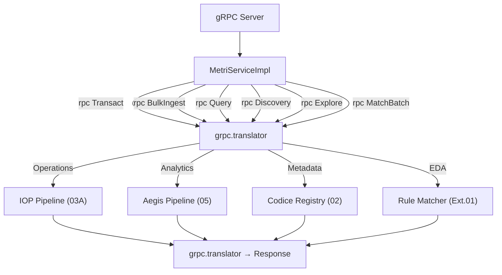
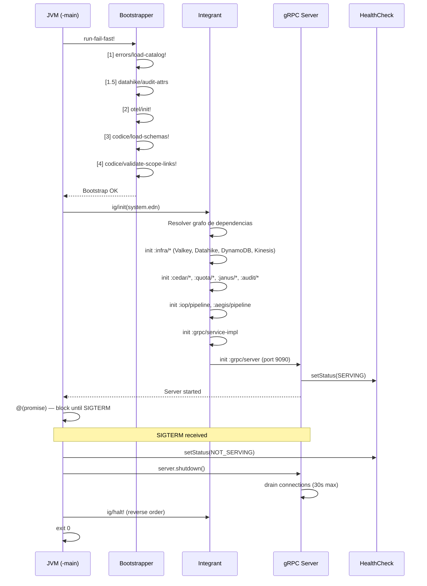
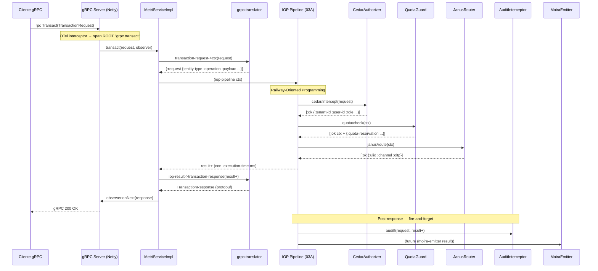

# Fase 01.01: Runtime & Infraestructura gRPC

**Nombre del Manifiesto:** `Runtime & Infraestructura gRPC`
**Tipo:** Capa Raíz — Shell de Composición del Metri Engine
**Fase contenedora:** [01_FASE_ALISTAMIENTO_ENTORNO.md](01_FASE_ALISTAMIENTO_ENTORNO.md)
**Depende de:** Todas las fases (01–10)
**Consumida por:** Clientes gRPC (`metri-auth`, `Event Router`, )

> [!IMPORTANT]
> Este documento define la **capa de infraestructura raíz** del Metri Engine.
> No contiene lógica de negocio — es un **shell de composición** que:
>
> 1. Compila el contrato Protobuf (`metri.proto`) en stubs Java.
> 2. Levanta el servidor gRPC con Netty.
> 3. Traduce mensajes Protobuf ↔ mapas Clojure canónicos.
> 4. Orquesta el arranque fail-fast de todos los componentes via Integrant.
> 5. Expone los 6 RPCs del `MetriService` y despacha al pipeline correcto.
> 6. Gestiona el apagado graceful del sistema.
>
> El Runtime **no decide** qué hacer con cada request — delega al IOP (write path), Aegis (read path) o al Códice (metadata path).

---

## MÓDULO 0: Definición y Objetivo

### Definición

El Runtime es el **proceso JVM que aloja el Metri Engine**. Es la primera capa que toca el request gRPC y la última que toca la response. Entre ambas, delega todo el trabajo a componentes inyectados.

### Posición en la Arquitectura

```
Cliente gRPC (metri-auth, Event Router, MCP Proxy)
    │
    ▼
┌─────────────────────────────────────────────────────┐
│  FASE 01.01 — Runtime gRPC                          │
│                                                     │
│  ┌─ grpc.server ─────────────────────────────────┐  │
│  │  MetriServiceImpl                             │  │
│  │    ├─ rpc Transact      → grpc.translator ──┐ │  │
│  │    ├─ rpc BulkIngest    → grpc.translator ──┤ │  │
│  │    ├─ rpc Query         → grpc.translator ──┤ │  │
│  │    ├─ rpc Discovery     → grpc.translator ──┤ │  │
│  │    ├─ rpc Explore       → grpc.translator ──┤ │  │
│  │    └─ rpc MatchBatch    → grpc.translator ──┤ │  │
│  └─────────────────────────────────────────────┘ │  │
│                                                  │  │
│  ┌─ Despacho por dominio ────────────────────────┤  │
│  │  Operations  → IOP Pipeline (03A)             │  │
│  │  Analytics   → Aegis Pipeline (05)            │  │
│  │  Metadata    → Codice Registry (02)           │  │
│  │  EDA         → Rule Matcher (Ext. 01)         │  │
│  └───────────────────────────────────────────────┘  │
│                                                     │
│  ┌─ Integrant System ───────────────────────────────┐│
│  │  system.edn → ig/init → componentes → ig/halt!  ││
│  └──────────────────────────────────────────────────┘│
└─────────────────────────────────────────────────────┘
```

> [!NOTE]
> El Runtime **no es un componente del pipeline** — es el **contenedor** del pipeline.
> Ningún componente interior (Cedar, Quota, Janus, Audit) sabe que vive dentro de un servidor gRPC.
> Esta es la inversión de dependencias máxima: el transporte depende del dominio, nunca al revés.

---

## MÓDULO I: Compilación Protobuf y Generación de Stubs

### I.1 — Pipeline de Compilación

**Fuente de verdad:** `metri-engine/metri.proto` — SSOT del contrato de red.

```
metri.proto
    │
    ▼
protoc --java_out=target/proto --grpc-java_out=target/proto
    │
    ├── metri/data/grpc/MetriServiceGrpc.java        ← stubs del service
    ├── metri/data/grpc/TransactionRequest.java       ← mensajes Operations
    ├── metri/data/grpc/QueryRequest.java             ← mensajes Analytics
    ├── metri/data/grpc/DiscoveryRequest.java         ← mensajes Metadata
    └── metri/data/grpc/MatchRoutingRules*.java       ← mensajes EDA
```

### I.2 — Integración con `build.clj`

```clojure
;; build.clj [MODIFICAR] — añadir paso de compilación protobuf
(ns build
  (:require [clojure.tools.build.api :as b]))

(def proto-src   "metri.proto")
(def proto-out   "target/proto")
(def class-dir   "target/classes")

(defn compile-proto [_]
  (b/process {:command-args ["protoc"
                             (str "--java_out=" proto-out)
                             (str "--grpc-java_out=" proto-out)
                             (str "--plugin=protoc-gen-grpc-java=" (System/getenv "GRPC_JAVA_PLUGIN"))
                             proto-src]})
  (println "Protobuf compiled →" proto-out))

(defn uber [_]
  (compile-proto nil)
  (b/compile-clj {:basis (b/create-basis {:project "deps.edn"})
                   :src-dirs ["src" proto-out]
                   :class-dir class-dir})
  (b/uber {:class-dir class-dir
            :uber-file "target/metri-engine.jar"
            :basis (b/create-basis {:project "deps.edn"})
            :main 'metri.main}))
```

### I.3 — Dependencias gRPC (`deps.edn`)

```clojure
;; deps.edn [MODIFICAR] — añadir deps gRPC
{:deps {;; ... existentes ...
        ;; gRPC Runtime
        io.grpc/grpc-netty-shaded {:mvn/version "1.63.0"}
        io.grpc/grpc-protobuf     {:mvn/version "1.63.0"}
        io.grpc/grpc-stub         {:mvn/version "1.63.0"}
        io.grpc/grpc-services     {:mvn/version "1.63.0"}  ;; health + reflection
        ;; Protobuf
        com.google.protobuf/protobuf-java      {:mvn/version "3.25.3"}
        com.google.protobuf/protobuf-java-util {:mvn/version "3.25.3"}
        ;; Integrant
        integrant/integrant {:mvn/version "0.10.0"}
        ;; OTel gRPC interceptor
        io.opentelemetry.instrumentation/opentelemetry-grpc-1.6
          {:mvn/version "2.3.0-alpha"}}}
```

> [!IMPORTANT]
> Las clases Java generadas por `protoc` son **infraestructura de transporte**.
> Ningún namespace del dominio (`metri.domain.*`, `metri.janus.*`, `metri.codice.*`) puede importarlas.
> Solo `metri.grpc.*` tiene permiso de tocar clases Protobuf — esta regla es verificable en compilación.

---

## MÓDULO II: Servidor gRPC

### II.1 — Arranque del Servidor (`grpc/server.clj` `[NEW]`)

```clojure
(ns metri.grpc.server
  "Servidor gRPC Netty — shell de transporte puro.
   No contiene lógica de negocio. Recibe el service-impl inyectado."
  (:require [integrant.core :as ig]
            [metri.grpc.interceptors :as interceptors])
  (:import [io.grpc ServerBuilder]
           [io.grpc.protobuf.services ProtoReflectionService HealthStatusManager]))

(defmethod ig/init-key :grpc/server
  [_ {:keys [service-impl port enable-reflection health-manager
             otel-sdk max-inbound-msg-size-mb deadline-ms]
      :or   {port 9090
             enable-reflection false
             max-inbound-msg-size-mb 16
             deadline-ms 30000}}]
  (let [builder (-> (ServerBuilder/forPort port)
                    ;; ── Interceptores de transporte (orden = prioridad) ─────
                    ;; OTel PRIMERO — crea el span ROOT antes de cualquier lógica
                    (.intercept (interceptors/otel-server-interceptor otel-sdk))
                    (.intercept (interceptors/deadline-enforcement-interceptor deadline-ms))
                    (.intercept (interceptors/logging-interceptor))
                    ;; ── Service + Health ─────────────────────────────────────
                    (.addService service-impl)
                    (.addService (.getHealthService health-manager))
                    ;; ── Tuning ──────────────────────────────────────────────
                    (.maxInboundMessageSize (* max-inbound-msg-size-mb 1024 1024))
                    (.keepAliveTime 30 java.util.concurrent.TimeUnit/SECONDS)
                    (.keepAliveTimeout 10 java.util.concurrent.TimeUnit/SECONDS)
                    (.permitKeepAliveWithoutCalls true))
        builder (if enable-reflection
                  (.addService builder (ProtoReflectionService/newInstance))
                  builder)
        server  (.build builder)]
    (.start server)
    ;; Marcar como SERVING — ALB/NLB comienza a enviar tráfico
    (.setStatus health-manager "" io.grpc.health.v1.HealthCheckResponse$ServingStatus/SERVING)
    (log/info "gRPC server started" {:port port :reflection enable-reflection})
    {:server server :port port :health-manager health-manager}))

(defmethod ig/halt-key! :grpc/server
  [_ {:keys [server health-manager]}]
  ;; 1. Marcar como NOT_SERVING — ALB deja de enviar tráfico
  (.setStatus health-manager "" io.grpc.health.v1.HealthCheckResponse$ServingStatus/NOT_SERVING)
  ;; 2. Graceful shutdown — espera hasta 30s para drenar conexiones activas
  (.shutdown server)
  (when-not (.awaitTermination server 30 java.util.concurrent.TimeUnit/SECONDS)
    (log/warn "gRPC server did not terminate in 30s — forcing shutdown")
    (.shutdownNow server))
  (log/info "gRPC server stopped"))
```

### II.2 — Health Check

```clojure
;; El HealthStatusManager reporta a ALB/NLB el estado del servicio.
;; En el bootstrapper: al completar READY se marca SERVING.
;; En el shutdown hook: se marca NOT_SERVING ANTES de cerrar el server.

;; system.edn
:grpc/health-manager {}  ;; → (HealthStatusManager.)

(defmethod ig/init-key :grpc/health-manager [_ _]
  (HealthStatusManager.))
```

### II.3 — Interceptores de Transporte

```clojure
;; ns: metri.grpc.interceptors [NEW]
;; Interceptores gRPC NO son interceptores del IOP — son de transporte.
;; Se registran en el ServerBuilder en ORDEN DE PRIORIDAD:
;;   1. OTel        → span ROOT (traceparent propagation)
;;   2. Deadline    → enforce max execution time
;;   3. Logging     → structured log per request

(ns metri.grpc.interceptors
  (:import [io.grpc Context Contexts Deadline ServerInterceptor ServerCall
            ServerCallHandler Metadata Status]
           [io.opentelemetry.instrumentation.grpc.v1_6 GrpcTelemetry]
           [java.util.concurrent TimeUnit]))

(defn otel-server-interceptor
  "Propaga W3C traceparent desde los headers gRPC al contexto OTel.
   Crea el span ROOT 'grpc.{method}' que será padre de todos los spans internos.
   REQUIERE: el otel-sdk ya inicializado por el bootstrapper (paso [2])."
  [otel-sdk]
  (-> (GrpcTelemetry/builder otel-sdk)
      (.build)
      (.newServerInterceptor)))

(defn deadline-enforcement-interceptor
  "Inyecta un deadline máximo si el cliente no envía uno.
   Previene requests zombie que consumen hilos Netty indefinidamente.
   El deadline se propaga al IOP via gRPC Context → accesible en cualquier punto."
  [max-deadline-ms]
  (reify ServerInterceptor
    (interceptCall [_ call headers next-handler]
      (let [existing-deadline (.getDeadline call)]
        (if existing-deadline
          ;; Cliente envió deadline — respetar el menor entre el suyo y el max
          (.startCall next-handler call headers)
          ;; Cliente no envió deadline — inyectar el default
          (let [deadline (Deadline/after max-deadline-ms TimeUnit/MILLISECONDS)
                ctx      (-> (Context/current) (.withDeadline deadline))]
            (Contexts/interceptCall ctx call headers next-handler)))))))

(defn logging-interceptor
  "Log estructurado por request: method, peer, deadline restante."
  []
  (reify ServerInterceptor
    (interceptCall [_ call headers next-handler]
      (let [method   (.getFullMethodName call)
            peer     (.authority call)
            deadline (.getDeadline call)]
        (log/info "gRPC call" {:method   method
                               :peer     peer
                               :deadline (when deadline
                                           (.timeRemaining deadline TimeUnit/MILLISECONDS))})
        (.startCall next-handler call headers)))))
```

> [!NOTE]
> El `otel-server-interceptor` crea el span ROOT `grpc.{method}` con el `trace_id` del cliente.
> Todos los spans del IOP (`iop.transact`, `janus.*`, `audit.interceptor`) se anidarán bajo este span.
> Si el cliente no envía `traceparent`, OTel genera un `trace_id` nuevo.

> [!IMPORTANT]
> **Deadline enforcement** previene requests zombie:
>
> - Si el cliente envía un `deadline` en los headers gRPC → se respeta.
> - Si el cliente NO envía `deadline` → el interceptor inyecta el default (`30s`).
> - El deadline se propaga automáticamente via `gRPC Context` — cualquier componente
>   interno puede consultar `Context.current().getDeadline()` para abortar operaciones costosas.
> - Un request que excede su deadline recibe `Status.DEADLINE_EXCEEDED` sin consumir
>   más recursos del pipeline.

---

## MÓDULO III: Service Implementation

### III.1 — `MetriServiceImpl` (`grpc/service.clj` `[NEW]`)

```clojure
(ns metri.grpc.service
  "Implementación del MetriService gRPC.
   Traduce Protobuf ↔ Clojure y despacha a los pipelines inyectados.
   Nunca contiene lógica de negocio — es un adaptador puro.
   FASE 10 G1/G2: excepciones inesperadas → Sherlog + span OTel."
  (:require [integrant.core :as ig]
            [metri.grpc.translator :as t]
            [metri.otel.spans :as otel]
            [metri.iop.sherlog :as sherlog]
            [metri.iop.error-response :as error-response]
            [metri.domain.audit.protocol :refer [audit!]])
  (:import [metri.data.grpc MetriServiceGrpc$MetriServiceImplBase]
           [io.grpc Status]
           [io.grpc.stub StreamObserver]))

(defn- handle-unary
  "Template para RPCs unarios: traducir → ejecutar → responder.
   Propaga el deadline del contexto gRPC al request Clojure.
   FASE 10 G1: excepciones inesperadas → sherlog/handle-fault! con SYS_000.
   FASE 10 G2: span OTel 'grpc.handle-unary' con entity.type + operation."
  [response-observer translate-fn pipeline-fn result->proto-fn request
   {:keys [sherlog-notifiers olap-channel]}]  ;; G5: deps de Sherlog inyectadas
  (otel/with-span ["grpc.handle-unary" {:kind :server}]  ;; G2: span OTel
    (let [span (otel/current-span)]
      (try
        (let [;; Extraer deadline del contexto gRPC propagado por el interceptor
              grpc-deadline (some-> (io.grpc.Context/current) .getDeadline)
              deadline-ms   (when grpc-deadline
                              (.timeRemaining grpc-deadline
                                             java.util.concurrent.TimeUnit/MILLISECONDS))
              ;; Traducir Protobuf → Clojure + inyectar deadline
              clj-request   (cond-> (translate-fn request)
                              deadline-ms (assoc-in [:request :deadline-ms] deadline-ms))
              ;; Anotar span con contexto del request
              _             (otel/set-attributes! span
                              {"entity.type" (get-in clj-request [:request :entity-type] "unknown")
                               "operation"   (name (get-in clj-request [:request :operation] :unknown))})
              ;; Verificar si el deadline ya expiró antes de ejecutar el pipeline
              _ (when (and deadline-ms (neg? deadline-ms))
                  (throw (io.grpc.StatusRuntimeException.
                           (.asRuntimeException (Status/DEADLINE_EXCEEDED)))))
              result   (pipeline-fn clj-request)
              response (result->proto-fn result clj-request)]
          (otel/set-status! span :ok)
          (.onNext response-observer response)
          (.onCompleted response-observer))
        (catch io.grpc.StatusRuntimeException sre
          ;; Re-lanzar status exceptions (DEADLINE_EXCEEDED, etc.) sin envolver
          (otel/set-status! span :error "gRPC StatusRuntimeException")
          (.onError response-observer sre))
        (catch Exception e
          ;; G1 FASE 10: excepción inesperada → Sherlog como SYS_000
          ;; Estas excepciones escapan del pipeline Railway — son las más peligrosas.
          ;; Sin Sherlog, desaparecen silenciosamente como INTERNAL.
          ;; NOTA DE DISEÑO: Sherlog se invoca SOLO aquí para excepciones no controladas.
          ;; Los errores Railway [:error] los maneja el IOP vía iop/error_response.clj
          ;; (→ build-error-dto → sherlog/handle-fault!), que es responsabilidad de 03A.
          ;; handle-unary NUNCA llama a Sherlog por un [:error] retornado correctamente.
          (otel/set-status! span :error (ex-message e))
          (otel/set-attributes! span {"error.code" "SYS_000"})
          (try
            (let [error-dto (error-response/build-error-dto
                              {:code :SYS_000 :stage :grpc :detail (ex-message e)}
                              {} nil)]
              (sherlog/handle-fault! error-dto :error sherlog-notifiers olap-channel))
            (catch Exception _))  ;; best-effort — nunca bloquear la respuesta gRPC
          (let [status (-> (Status/INTERNAL)
                          (.withDescription (str "Unhandled: " (ex-message e))))]
            (.onError response-observer (.asRuntimeException status))))))))


;; ── Service class — inyectada por Integrant ─────────────────────────────────
(defn make-service-impl
  "Construye el MetriServiceImpl con todos los pipelines inyectados.
   Cada RPC es un adaptador de 3 líneas: translate → dispatch → respond.
   G5 FASE 10: recibe sherlog-notifiers + olap-channel para handle-unary."
  [{:keys [iop-pipeline iop-bulk-pipeline aegis-pipeline
           codice-registry rule-matcher
           sherlog-notifiers olap-channel]}]  ;; G5: deps Sherlog
  (let [sherlog-deps {:sherlog-notifiers sherlog-notifiers
                      :olap-channel      olap-channel}]
    (proxy [MetriServiceGrpc$MetriServiceImplBase] []

      ;; ─── Operations Domain ──────────────────────────────────────────────
      (transact [^TransactionRequest request ^StreamObserver observer]
        (handle-unary observer
          t/transaction-request->ctx       ;; Protobuf → Clojure map
          iop-pipeline                     ;; run-iop
          t/iop-result->transaction-response  ;; Railway → Protobuf
          request
          sherlog-deps))                   ;; G5: deps Sherlog

      (bulkIngest [^BulkRequest request ^StreamObserver observer]
        (handle-unary observer
          t/bulk-request->ctx
          iop-bulk-pipeline
          t/iop-result->bulk-response
          request
          sherlog-deps))

      ;; ─── Analytics Domain ───────────────────────────────────────────────
      (query [^QueryRequest request ^StreamObserver observer]
        ;; Server streaming — Aegis emite chunks mediante el observer
        ;; G3 FASE 10: span OTel + Sherlog para excepciones inesperadas
        (otel/with-span ["grpc.query.stream" {:kind :server}]
          (let [span (otel/current-span)]
            (try
              (let [clj-request (t/query-request->ctx request)]
                (otel/set-attributes! span
                  {"entity.type" (get-in clj-request [:request :entity-type] "unknown")
                   "operation"   "query"})
                (aegis-pipeline clj-request
                  ;; callback: cada chunk → observer.onNext
                  (fn [chunk] (.onNext observer (t/aegis-chunk->query-response chunk)))
                  ;; on-complete
                  (fn []
                    (otel/set-status! span :ok)
                    (.onCompleted observer))
                  ;; on-error
                  (fn [err]
                    (otel/set-status! span :error (str (:code err)))
                    (otel/set-attributes! span {"error.code" (name (:code err))})
                    (.onError observer
                      (.asRuntimeException
                        (t/error->grpc-status err))))))
              (catch Exception e
                (otel/set-status! span :error (ex-message e))
                (otel/set-attributes! span {"error.code" "SYS_000"})
                ;; G3 FASE 10: Sherlog para excepciones inesperadas
                (try
                  (let [error-dto (error-response/build-error-dto
                                    {:code :SYS_000 :stage :grpc :detail (ex-message e)}
                                    {} nil)]
                    (sherlog/handle-fault! error-dto :error sherlog-notifiers olap-channel))
                  (catch Exception _))
                (.onError observer
                  (.asRuntimeException
                    (-> (Status/INTERNAL) (.withDescription (ex-message e))))))))))

      ;; ─── Metadata Domain ────────────────────────────────────────────────
      (discovery [^DiscoveryRequest request ^StreamObserver observer]
        (handle-unary observer
          t/discovery-request->ctx
          (:discovery codice-registry)
          t/discovery-result->response
          request
          sherlog-deps))

      (explore [^ExploreRequest request ^StreamObserver observer]
        (handle-unary observer
          t/explore-request->ctx
          (:explore codice-registry)
          t/explore-result->response
          request
          sherlog-deps))

      ;; ─── EDA Domain ─────────────────────────────────────────────────────
      (matchRoutingRulesBatch [^MatchRoutingRulesBatchRequest request ^StreamObserver observer]
        (handle-unary observer
          t/match-batch-request->ctx
          rule-matcher
          t/match-batch-result->response
          request
          sherlog-deps)))))

(defmethod ig/init-key :grpc/service-impl [_ deps]
  (make-service-impl deps))
```

### III.2 — Despacho por Dominio



> [!IMPORTANT]
> **`MetriServiceImpl` es un adaptador — no un orquestador.**
> No decide qué hacer con el request. Solo traduce y despacha al pipeline correcto.
> El pipeline ya está inyectado como una `fn` — el service no sabe qué hay adentro.

---

## MÓDULO IV: Traducción gRPC ↔ Dominio

### IV.1 — Protocolo Translador (`grpc/translator.clj` `[NEW]`)

Funciones puras — sin side effects, sin estado, testeables sin servidor.

```clojure
(ns metri.grpc.translator
  "Traduce entre mensajes Protobuf y mapas Clojure canónicos.
   REGLA: este namespace es el ÚNICO que importa clases Protobuf.
   El dominio nunca toca Protobuf. El transporte nunca toca el dominio."
  (:require [metri.common.errors :as errors])
  (:import [com.google.protobuf.util JsonFormat]
           [com.google.protobuf Struct Value]
           [metri.data.grpc
            TransactionRequest TransactionResponse
            BulkRequest BulkResponse
            QueryRequest QueryResponse
            DiscoveryRequest DiscoveryResponse
            ExploreRequest ExploreResponse
            MatchRoutingRulesBatchRequest MatchRoutingRulesBatchResponse
            Status OperationAction]))
```

### IV.2 — `TransactionRequest` → IOP request

```clojure
(def ^:private action->keyword
  {OperationAction/CREATE :create
   OperationAction/UPDATE :update
   OperationAction/DELETE :delete
   OperationAction/UPSERT :upsert
   OperationAction/GET    :get})

(defn transaction-request->ctx
  "Traduce un TransactionRequest gRPC al mapa canónico que el IOP espera.
   INVARIANTE: tenant_id del proto es IGNORADO por seguridad —
   el IOP lo resuelve desde Cedar. Aquí solo transportamos entity_type,
   operation y payload."
  [^TransactionRequest req]
  {:request {:entity-type    (.getEntityType req)
             :entity-id      (let [id (.getEntityId req)]
                               (when-not (empty? id) id))
             :operation      (get action->keyword (.getAction req) :create)
             :payload        (struct->map (.getPayload req))
             :suppress-events (.getSuppressEvents req)
             ;; tenant_id del proto → lo transportamos pero Cedar lo sobreescribe
             :proto-tenant-id (.getTenantId req)}})
```

> [!CAUTION]
> **El `tenant_id` del `TransactionRequest.tenant_id` es IGNORADO por el IOP.**
> El campo se transporta solo para logging/correlación. El `tenant-id` real lo resuelve
> `CedarAuthorizer` desde Valkey (sesión del token opaco). Un bypass de esta regla
> es vulnerabilidad **P0 crítica** — ver [06_FASE_CEDAR_AUTHORIZER.md](06_FASE_CEDAR_AUTHORIZER.md).

### IV.3 — `google.protobuf.Struct` ↔ Clojure map

```clojure
(defn struct->map
  "Convierte un google.protobuf.Struct a un mapa Clojure nativo.
   Recursivo — soporta Struct anidados, listas y valores primitivos."
  [^Struct struct]
  (when struct
    (reduce-kv
      (fn [m k ^Value v]
        (assoc m (keyword k) (value->clj v)))
      {}
      (.getFieldsMap struct))))

(defn- value->clj [^Value v]
  (case (.getKindCase v)
    :NULL_VALUE  nil
    :NUMBER_VALUE (.getNumberValue v)
    :STRING_VALUE (.getStringValue v)
    :BOOL_VALUE   (.getBoolValue v)
    :STRUCT_VALUE (struct->map (.getStructValue v))
    :LIST_VALUE   (mapv value->clj (.getValuesList (.getListValue v)))
    nil))

(defn map->struct
  "Convierte un mapa Clojure a google.protobuf.Struct.
   Inversa de struct->map — soporta los mismos tipos."
  [m]
  (when m
    (let [builder (Struct/newBuilder)]
      (doseq [[k v] m]
        (.putFields builder (name k) (clj->value v)))
      (.build builder))))

(defn- clj->value [v]
  (cond
    (nil? v)     (-> (Value/newBuilder) (.setNullValue 0) .build)
    (number? v)  (-> (Value/newBuilder) (.setNumberValue (double v)) .build)
    (string? v)  (-> (Value/newBuilder) (.setStringValue v) .build)
    (boolean? v) (-> (Value/newBuilder) (.setBoolValue v) .build)
    (map? v)     (-> (Value/newBuilder) (.setStructValue (map->struct v)) .build)
    (coll? v)    (let [lb (com.google.protobuf.ListValue/newBuilder)]
                   (doseq [item v] (.addValues lb (clj->value item)))
                   (-> (Value/newBuilder) (.setListValue (.build lb)) .build))
    :else        (-> (Value/newBuilder) (.setStringValue (str v)) .build)))
```

### IV.4 — Railway Result → gRPC Response

```clojure
(defn iop-result->transaction-response
  "Traduce el resultado Railway del IOP a un TransactionResponse gRPC."
  [[tag body] _request]
  (let [builder (TransactionResponse/newBuilder)]
    (case tag
      :ok
      (-> builder
          (.setStatus (-> (Status/newBuilder) (.setSuccess true) .build))
          (.setEntityId (or (:ulid body) ""))
          (.setResult (map->struct (dissoc body :ulid :channel :tx-id
                                               :execution-time-ms)))
          .build)

      :error
      (-> builder
          (.setStatus (-> (Status/newBuilder)
                         (.setSuccess false)
                         (.setErrorCode (name (:code body)))
                         (.setErrorMessage (or (:detail body) ""))
                         .build))
          .build))))

(defn iop-result->bulk-response
  "Traduce el resultado del BulkIngest a un BulkResponse gRPC."
  [[tag body] _request]
  (let [builder (BulkResponse/newBuilder)]
    (case tag
      :ok    (-> builder
                 (.setStatus (-> (Status/newBuilder) (.setSuccess true) .build))
                 (.setIngestedCount (or (:ingested-count body) 0))
                 (.setOutboxCount (or (:outbox-count body) 0))
                 .build)
      :error (-> builder
                 (.setStatus (-> (Status/newBuilder)
                                (.setSuccess false)
                                (.setErrorCode (name (:code body)))
                                (.setErrorMessage (or (:detail body) ""))
                                .build))
                 .build))))
```

> [!NOTE]
> **Separación de responsabilidades `translator.clj` vs `iop/error_response.clj`:**
> El translator extrae `(:code body)` directamente del mapa Railway para construir el
> `TransactionResponse` Protobuf (capa de transporte). **No usa `build-error-dto`** porque:
>
> - `iop-result->transaction-response` solo serializa el resultado al protocolo Protobuf.
> - `build-error-dto` construye el **DTO forense** para Sherlog/EDA con `trace_id`, `span_id`,
>   `sanitize-context`, etc. — lo invoca el IOP (`03A_FASE_IOP.md`), no el translator.
> - El translator **nunca** invoca Sherlog ni construye `[:error]` inline — solo traduce.
> - Esta separación garantiza que el transport layer (gRPC) no tenga dependencia del subsistema
>   de observabilidad — principio de inversión de dependencias (SOLID D).

### IV.5 — Error Code → gRPC Status (Derivado del Catálogo)

```clojure
;; ── Derivación dinámica desde error_catalog.edn ────────────────────────────
;; En lugar de un mapa estático duplicado, el translator lo construye
;; en bootstrap a partir del catálogo ya cargado.
;; Esto elimina la duplicación DRY — si se añade un código al catálogo,
;; el mapeo gRPC se actualiza automáticamente.

(def ^:private grpc-status-keyword->instance
  "Mapeo de keyword del catálogo → instancia io.grpc.Status.
   Las keywords (:INTERNAL, :NOT_FOUND, ...) son las que usa error_catalog.edn."
  {:INTERNAL           Status/INTERNAL
   :INVALID_ARGUMENT   Status/INVALID_ARGUMENT
   :NOT_FOUND          Status/NOT_FOUND
   :PERMISSION_DENIED  Status/PERMISSION_DENIED
   :UNAUTHENTICATED    Status/UNAUTHENTICATED
   :RESOURCE_EXHAUSTED Status/RESOURCE_EXHAUSTED
   :UNAVAILABLE        Status/UNAVAILABLE
   :ABORTED            Status/ABORTED
   :DEADLINE_EXCEEDED  Status/DEADLINE_EXCEEDED
   :ALREADY_EXISTS     Status/ALREADY_EXISTS})

(def ^:private error-code->grpc-status
  "Mapa derivado dinámicamente de error_catalog.edn en bootstrap.
   Inicializado por `init-grpc-status-map!` — NO hardcodeado."
  (atom {}))

(defn init-grpc-status-map!
  "Invocado durante bootstrap DESPUÉS de errors/load-catalog!.
   Lee el campo :grpc-status de cada entrada del catálogo y construye
   el mapa code→Status. Llamar una sola vez."
  [catalog]
  (reset! error-code->grpc-status
    (reduce-kv
      (fn [m error-code entry]
        (let [grpc-kw (:grpc-status entry)
              status  (get grpc-status-keyword->instance grpc-kw Status/INTERNAL)]
          (assoc m error-code status)))
      {}
      catalog)))

(defn error->grpc-status
  "Convierte un mapa de error Railway a un io.grpc.Status con descripción.
   Usa el mapa derivado del catálogo — fallback a INTERNAL si el código
   no está registrado (indica que falta en error_catalog.edn → bug)."
  [{:keys [code detail] :as error-map}]
  (let [base-status (get @error-code->grpc-status code Status/INTERNAL)]
    (-> base-status
        (.withDescription (or detail (str (name code) " — unmapped error code"))))))
```

> [!IMPORTANT]
> **`error-code->grpc-status` se deriva dinámicamente del catálogo en bootstrap.**
> No es un mapa estático duplicado. `init-grpc-status-map!` lee el campo `:grpc-status`
> de cada entrada de `error_catalog.edn` y construye el mapeo code→Status.
> Si se añade un nuevo código al catálogo con su `:grpc-status`, el translator
> lo reconoce automáticamente sin modificar código.
>
> **Invariante:** si `error->grpc-status` retorna `Status/INTERNAL` para un código
> que debería ser otro status, significa que el código falta en `error_catalog.edn` → bug.

---

## MÓDULO V: Ciclo de Vida del Sistema — Integrant + `main.clj`

### V.1 — `main.clj` — Punto de Entrada (`[NEW]`)

```clojure
(ns metri.main
  "Punto de entrada de la JVM. Responsabilidades:
   1. Cargar configuración de system.edn
   2. Ejecutar bootstrap fail-fast
   3. Inicializar sistema Integrant (todos los componentes)
   4. Arrancar servidor gRPC
   5. Registrar shutdown hook para apagado graceful
   6. Bloquear hilo principal hasta SIGTERM"
  (:gen-class)
  (:require [integrant.core :as ig]
            [clojure.java.io :as io]
            [clojure.edn :as edn]
            [metri.bootstrap :as bootstrap]))

(defn load-system-config
  "Carga system.edn con resolución de #ig/ref y #env."
  []
  (-> (io/resource "config/system.edn")
      slurp
      (ig/read-string)))

(defn -main [& _args]
  (println "═══════════════════════════════════════════════")
  (println "  Metri Engine — Runtime gRPC")
  (println "  Mode:" (or (System/getenv "ENVIRONMENT") "development"))
  (println "═══════════════════════════════════════════════")

  ;; ── Fase 1: Bootstrap fail-fast ────────────────────────────────────────
  ;; Si cualquier paso falla, la JVM termina con exit code 1.
  ;; No se acepta ningún request hasta que READY.
  (bootstrap/run-fail-fast!)

  ;; ── Fase 2: Inicializar sistema Integrant ──────────────────────────────
  (let [config (load-system-config)
        system (ig/init config)]

    ;; ── Fase 3: Shutdown hook ──────────────────────────────────────────
    (.addShutdownHook (Runtime/getRuntime)
      (Thread.
        (fn []
          (println "\nShutting down Metri Engine...")
          (ig/halt! system)
          (println "Metri Engine stopped."))))

    ;; ── Fase 4: Bloquear hilo principal ──────────────────────────────
    (let [port (get-in system [:grpc/server :port])]
      (println (str "\n✓ Metri Engine READY — gRPC listening on port " port))
      (println "  Press Ctrl+C to stop.\n")
      ;; Bloquear hasta SIGTERM
      @(promise))))
```

### V.2 — Bootstrapper Fail-Fast (`bootstrap.clj` `[NEW]`)

```clojure
(ns metri.bootstrap
  "Bootstrapper secuencial fail-fast.
   Cada paso DEBE completar antes del siguiente.
   Si ANY paso falla → (System/exit 1) — no se aceptan requests.

   INVARIANTE: el orden de los pasos NO es arbitrario.
   Cada paso depende de que el anterior haya completado:
     [1] Error catalog → necesario para que [1.5] y [2+] reporten errores
     [1.5] Audit attrs  → schema Datahike debe existir antes de init :audit/*
     [1.75] gRPC status → necesita catálogo del paso [1]
     [2] OTel           → SDK listo antes de que cualquier span se cree
     [3] Codice schemas → deben cargarse antes de validar scopes
     [4] Scope links    → requiere schemas del paso [3]"
  (:require [metri.common.errors :as errors]
            [metri.otel.spans :as otel]
            [metri.codice.bootstrapper :as codice]
            [metri.grpc.translator :as translator]
            [metri.infrastructure.datahike :as datahike]
            [clojure.java.io :as io]
            [clojure.edn :as edn]))

(defn- run-step! [step-name f]
  (let [start (System/nanoTime)]
    (print (str "  [" step-name "] "))
    (flush)
    (try
      (f)
      (let [elapsed-ms (/ (- (System/nanoTime) start) 1e6)]
        (println (format "✓ (%.1fms)" elapsed-ms)))
      (catch Exception e
        (println "✗ FATAL:" (ex-message e))
        (System/exit 1)))))

(defn run-fail-fast!
  "Ejecuta el bootstrap secuencial. Si cualquier paso falla, la JVM muere.
   Orden estricto — las dependencias tardías no pueden ejecutarse antes."
  []
  (println "\n── Bootstrap ──────────────────────────────────")

  ;; [1] Error Catalog — SSOT de todos los códigos del sistema
  ;; PRIMERO: todo lo demás necesita reportar errores con códigos válidos
  (run-step! "1 errors/load-catalog!"
    #(errors/load-catalog!))

  ;; [1.5] Audit Attrs — transacciona el schema Datahike para :audit/*
  ;; Los atributos :audit/action, :audit/tenant-id, etc. deben existir
  ;; en Datahike ANTES de que se inicialice :audit/interceptor en Integrant.
  ;; Si no existen → d/transact falla con :db.error/not-an-entity.
  (run-step! "1.5 datahike/audit-schema"
    (fn []
      (let [audit-schema (-> (io/resource "schemas/audit_attrs.edn")
                            slurp
                            edn/read-string)
            conn (datahike/get-connection)]
        (when-not conn
          (throw (ex-info "Datahike connection unavailable — cannot transact audit schema"
                          {:step :bootstrap/audit-schema})))
        (datahike/transact-schema! conn audit-schema))))

  ;; [1.75] gRPC Status Map — derivar error-code→gRPC-Status del catálogo
  ;; Necesita el catálogo del paso [1] ya cargado.
  (run-step! "1.75 translator/init-grpc-status-map!"
    #(translator/init-grpc-status-map! @errors/catalog))

  ;; [2] OpenTelemetry — SDK + exporters (ADOT sidecar en ECS)
  (run-step! "2 otel/init!"
    #(otel/init!))

  ;; [3] Codice — JSON schemas de todas las entidades
  ;; Escanea resources/schemas/*.json, valida con Malli, registra en memoria
  (run-step! "3 codice/load-schemas!"
    #(codice/load-schemas!))

  ;; [4] Codice — validar entity refs y sequence scopes
  ;; Verifica que todo entityRef apunte a un entity_type real
  ;; y que todo is_sequence_scope/is_sequence_scope_via sea resolvible
  (run-step! "4 codice/validate-scope-links!"
    #(codice/validate-scope-links!))

  (println "── Bootstrap COMPLETE ─────────────────────────\n"))
```

### V.3 — Diagrama de Arranque



---

## MÓDULO VI: Diagrama de Secuencia — Request gRPC End-to-End



---

## MÓDULO VII: `system.edn` Consolidado (SSOT)

### VII.0 — Custom Reader Tags

El `system.edn` utiliza reader tags personalizados que Integrant no provee por defecto.
Estos se registran en el namespace `metri.config.readers` y se cargan antes de `ig/read-string`:

```clojure
;; ns: metri.config.readers [NEW]
;; Registra custom readers para system.edn ANTES de ig/read-string.

(ns metri.config.readers
  (:require [integrant.core :as ig]))

;; #env "VAR_NAME" → lee variable de entorno, lanza si ausente en producción
(defmethod ig/read-string-tag 'env [_ value]
  (let [env-val (System/getenv value)]
    (when (and (nil? env-val)
              (= "production" (System/getenv "ENVIRONMENT")))
      (throw (ex-info (str "Required env var missing: " value)
                      {:var value :env (System/getenv "ENVIRONMENT")})))
    (or env-val
        ;; En dev/test: retornar placeholder descriptivo
        (str "<unset:" value ">"))))

;; #env-bool "VAR_NAME" → lee variable de entorno como boolean
(defmethod ig/read-string-tag 'env-bool [_ value]
  (= "true" (System/getenv value)))

;; #env-int "VAR_NAME" → lee variable de entorno como integer
(defmethod ig/read-string-tag 'env-int [_ value]
  (some-> (System/getenv value) Integer/parseInt))
```

> [!IMPORTANT]
> **En producción (`ENVIRONMENT=production`), las variables de entorno son obligatorias.**
> Si falta una variable declarada con `#env`, el reader lanza antes de que `ig/init` se ejecute.
> En dev/test, se retorna un placeholder descriptivo para facilitar debugging.

Y en `main.clj`, el namespace de readers se requiere antes de cargar la config:

```clojure
;; En metri.main — load-system-config
(defn load-system-config []
  (require 'metri.config.readers)  ;; ← registra #env, #env-bool, #env-int
  (-> (io/resource "config/system.edn")
      slurp
      (ig/read-string)))
```

### VII.1 — Grafo de Dependencias

```clojure
;; config/system.edn — FUENTE DE VERDAD del grafo de dependencias
;; Integrant resuelve el orden topológico automáticamente.
;; Cada #ig/ref es un arco en el DAG — si falta una dependencia, ig/init falla.
{
 ;; ═══════════════════════════════════════════════════════════════════════════
 ;; CAPA 1: INFRAESTRUCTURA (sin deps de negocio)
 ;; ═══════════════════════════════════════════════════════════════════════════

 :infra/valkey         {:host     #env "VALKEY_HOST"
                        :port     6379
                        :password #env "VALKEY_PASSWORD"}

 ;; Pool Model: UNA SOLA tabla DynamoDB compartida por todos los tenants.
 ;; El aislamiento se garantiza por tenant-guard, no por tablas separadas.
 :infra/datahike       {:store {:backend :dynamodb
                                :table   #env "DATAHIKE_DDB_TABLE"  ;; = "metri-dh-shared"
                                :region  #env "AWS_REGION"}}

 :infra/dynamodb       {:region #env "AWS_REGION"}

 :infra/kinesis        {:stream-prefix #env "KINESIS_STREAM_PREFIX"
                        :region        #env "AWS_REGION"}

 :infra/cedar-engine   {:policies-table #env "CEDAR_POLICIES_TABLE"}

 :infra/eventbridge    {:event-bus-name #env "FAULT_BUS_NAME"
                        :region         #env "AWS_REGION"}

 ;; ═══════════════════════════════════════════════════════════════════════════
 ;; CAPA 2: UTILIDADES (transversales — sin lógica de negocio)
 ;; ═══════════════════════════════════════════════════════════════════════════

 :util/ulid-fn         {}  ;; fn: () → ULID string

 ;; tenant-guard: gate obligatorio para TODA operación Datahike.
 ;; Inyecta :tenant/id en escrituras, filtra por :tenant/id en lecturas.
 ;; Ver 03_FASE_INGESTION.md → Principio Transversal Pool Model.
 :infra/tenant-guard   {:datahike-conn #ig/ref :infra/datahike}

 :iop/sherlog-notifier {:eventbridge #ig/ref :infra/eventbridge}

 ;; ═══════════════════════════════════════════════════════════════════════════
 ;; CAPA 3: DOMINIO (interceptores y componentes de negocio)
 ;; ═══════════════════════════════════════════════════════════════════════════

 ;; ── CedarAuthorizer (Paso 1 del IOP) ────────────────────────────────────
 :cedar/cache          {:strategy :ttl :ttl-ms 10000 :max-size 50000}

 :iop/cedar-authorizer {:valkey-store   #ig/ref :infra/valkey
                         :datahike-conn  #ig/ref :infra/datahike
                         :cache          #ig/ref :cedar/cache
                         :cedar-engine   #ig/ref :infra/cedar-engine}

 ;; ── QuotaGuard (Paso 2 del IOP) ─────────────────────────────────────────
 :iop/quota-guard      {:dynamodb #ig/ref :infra/dynamodb}

 ;; ── JanusRouter (Paso 3 del IOP) + Canales ──────────────────────────────
 ;; Proyecciones ACID (IProjectionBuilder)
 :janus/outbox-builder              {}
 :janus/saga-builder                {}
 :janus/calendar-builder            {}
 :janus/quota-confirmation-builder  {}

 :janus/projection-registry {:builders [#ig/ref :janus/outbox-builder
                                         #ig/ref :janus/saga-builder
                                         #ig/ref :janus/calendar-builder
                                         #ig/ref :janus/quota-confirmation-builder]}

 ;; G4/G9 FASE 02 D7: OLTPChannel ahora recibe tenant-guard
 :janus/oltp-channel  {:datahike-conn       #ig/ref :infra/datahike
                        :tenant-guard        #ig/ref :infra/tenant-guard  ;; D7: Pool Model
                        :ulid-fn             #ig/ref :util/ulid-fn
                        :projection-registry #ig/ref :janus/projection-registry
                        :codice-generator-fn #ig/ref :codice/generator-inject  ;; D7: closure
                        :kms                 #ig/ref :infra/kms}

 :janus/olap-channel  {:kinesis-client #ig/ref :infra/kinesis
                        :ulid-fn       #ig/ref :util/ulid-fn}

 ;; G9 FASE 02 D7: generator ahora recibe tenant-guard para closure
 :codice/generator-inject {:tenant-guard #ig/ref :infra/tenant-guard}

 :iop/janus-router     {:channel-registry    {:oltp #ig/ref :janus/oltp-channel
                                               :olap #ig/ref :janus/olap-channel}
                          :codice-registry     #ig/ref :codice/registry}

 ;; ── MoiraEmitter (async — post-response) ────────────────────────────────
 :moira/sqs-bus       {:queue-url #env "OUTBOX_QUEUE_URL"
                        :region   #env "AWS_REGION"}
 :moira/emitter       {:datahike-conn #ig/ref :infra/datahike
                        :sqs-bus       #ig/ref :moira/sqs-bus}

 ;; ── AuditInterceptor (fire-and-forget — SIEMPRE) ────────────────────────
 :audit/interceptor   {:olap-channel   #ig/ref :janus/olap-channel
                        :ulid-fn        #ig/ref :util/ulid-fn
                        :fault-notifier #ig/ref :iop/sherlog-notifier}

 ;; ═══════════════════════════════════════════════════════════════════════════
 ;; CAPA 4: APPLICATION (pipelines compuestos)
 ;; ═══════════════════════════════════════════════════════════════════════════

 :iop/pipeline        {:steps             [#ig/ref :iop/cedar-authorizer   ;; Paso 1
                                            #ig/ref :iop/quota-guard        ;; Paso 2
                                            #ig/ref :iop/janus-router]      ;; Paso 3
                         :moira-emitter     #ig/ref :moira/emitter
                         :audit-interceptor #ig/ref :audit/interceptor}

 ;; G9 FASE 02 D7: Codice registry ahora recibe tenant-guard
 :codice/registry            {:models-dir   #env "CODICE_MODELS_DIR"
                               :tenant-guard #ig/ref :infra/tenant-guard  ;; D7: Pool Model
                               :datahike     #ig/ref :infra/datahike}

 :aegis/pipeline       {}  ;; → completar en 05_FASE_CONSULTA.md

 :eda/rule-matcher     {}  ;; → completar en COMPONENTE_EXTERNO_01

 ;; ═══════════════════════════════════════════════════════════════════════════
 ;; CAPA 5: TRANSPORTE (gRPC — depende de todo lo anterior)
 ;; ═══════════════════════════════════════════════════════════════════════════

 :grpc/health-manager  {}

 :grpc/service-impl    {:iop-pipeline      #ig/ref :iop/pipeline
                         :iop-bulk-pipeline #ig/ref :iop/pipeline     ;; reutiliza IOP
                         :aegis-pipeline    #ig/ref :aegis/pipeline
                         :codice-registry   #ig/ref :codice/registry
                         :rule-matcher      #ig/ref :eda/rule-matcher
                         :sherlog-notifiers #ig/ref :iop/sherlog-notifier  ;; G5
                         :olap-channel      #ig/ref :janus/olap-channel}  ;; G5

 :grpc/server          {:service-impl          #ig/ref :grpc/service-impl
                         :port                  #env-int "GRPC_PORT"     ;; default 9090
                         :enable-reflection     #env-bool "GRPC_REFLECTION_ENABLED"
                         :health-manager        #ig/ref :grpc/health-manager
                         :otel-sdk              #ig/ref :otel/sdk
                         :max-inbound-msg-size-mb 16
                         :deadline-ms           30000}  ;; 30s default

 ;; OTel SDK — inicializado en bootstrap, expuesto como componente Integrant
 :otel/sdk              {}}
```

> [!IMPORTANT]
> **El `system.edn` es la SSOT del grafo de dependencias.**
> Integrant resuelve el orden topológico automáticamente.
> Si un componente necesita otro, se declara `#ig/ref` — si falta, `ig/init` lanza antes de arrancar.
> Ningún namespace hace `require` directo de otro componente — todo llega inyectado.

### VII.2 — Observabilidad OTel (G7 FASE 10)

| Span                         | Cuándo                       | Atributos clave                  |
| :--------------------------- | :--------------------------- | :------------------------------- |
| `grpc.{method}` (ROOT)       | Interceptor Netty — cada RPC | `trace_id` (W3C), `method`       |
| `grpc.handle-unary`          | Cada RPC unario (G2)         | `entity.type`, `operation`       |
| `grpc.handle-unary` `:error` | Exception inesperada (G1)    | `error.code=SYS_000`             |
| `grpc.query.stream`          | RPC Query streaming (G3)     | `entity.type`, `operation=query` |
| `grpc.query.stream` `:error` | Exception en stream (G3)     | `error.code=SYS_000`             |

> [!NOTE]
> Los spans `grpc.handle-unary` y `grpc.query.stream` son **hijos** del span ROOT `grpc.{method}`
> creado por el OTel interceptor de Netty. Los spans del IOP (`iop.transact`, `janus.*`) se
> anidan bajo `grpc.handle-unary`.

---

## MÓDULO VIII: Topología de Despliegue

### VIII.1 — Modo Lambda (Producción Primaria)

```
┌─────────────────────────────────────────────────────┐
│  AWS Lambda                                    │
│                                                     │
│  ┌─ Task Definition ────────────────────────────┐   │
│  │  Container: metri-engine                     │   │
│  │  Image: ECR/metri-engine:latest              │   │
│  │  Port: 9090 (gRPC)                           │   │
│  │  Health: grpc.health.v1.Health               │   │
│  │  CPU: 2048  Memory: 4096                     │   │
│  │  ADOT Sidecar: OTel → Kinesis                │   │
│  └──────────────────────────────────────────────┘   │
│                                                     │
│  ┌─ NLB (Network Load Balancer) ────────────────┐   │
│  │  Listener: TCP 443 → TLS termination         │   │
│  │  Target: port 9090 (gRPC health check)       │   │
│  │  Cross-zone: enabled                         │   │
│  └──────────────────────────────────────────────┘   │
└─────────────────────────────────────────────────────┘
```

### VIII.2 — Dockerfile (`[NEW]`)

```dockerfile
# ── Stage 1: Build ──────────────────────────────────────────────────────────
FROM clojure:temurin-21-tools-deps-bookworm-slim AS builder

WORKDIR /app
COPY deps.edn build.clj ./
RUN clj -P  # Pre-download dependencies

COPY src/ src/
COPY resources/ resources/
COPY metri.proto ./

# Install protoc + grpc-java plugin
RUN apt-get update && apt-get install -y protobuf-compiler
# protoc compilation happens in build.clj
RUN clj -T:build uber

# ── Stage 2: Runtime ────────────────────────────────────────────────────────
FROM eclipse-temurin:21-jre-alpine

WORKDIR /app
COPY --from=builder /app/target/metri-engine.jar ./metri-engine.jar

# gRPC port
EXPOSE 9090

# Health check via grpcurl (optional — NLB uses gRPC health directly)
HEALTHCHECK --interval=10s --timeout=3s \
  CMD grpcurl -plaintext localhost:9090 grpc.health.v1.Health/Check || exit 1

ENTRYPOINT ["java", \
  "-XX:+UseZGC", \
  "-XX:MaxRAMPercentage=75.0", \
  "-Dclojure.spec.skip-macros=true", \
  "-jar", "metri-engine.jar"]
```

### VIII.3 — Modo Lambda (Adaptador gRPC-Web Serverless)

El despliegue Serverless nativo (AWS Lambda + Function URL) presenta dos restricciones insalvables para el protocolo gRPC tradicional:
1. **Pérdida de Trailing Headers:** AWS API Gateway / Lambda destruyen los Trailing Headers (usados por gRPC para propagar el `grpc-status`).
2. **Transformación de Eventos:** AWS traduce las peticiones entrantes a JSON, impidiendo leer el socket TCP crudo.

Para lograr una arquitectura Serverless **FASE 10** sin desplegar contenedores ECS/Fargate persistentes, implementamos el **Santo Grial del Serverless: Emulación gRPC-Web sobre Lambda Response Streaming**.

#### Flujo Arquitectónico (Capa Anticorrupción Perfecta)

**1. Entrada (Lectura):**
AWS inyecta el flujo HTTP en formato JSON. El cliente gRPC-Web envía su petición como `Content-Type: application/grpc-web+proto`. AWS transforma el cuerpo binario a Base64.
`handler.clj` lee el JSON, extrae el campo `"body"`, lo decodifica de Base64 a bytes crudos, descarta el prefijo de 5 bytes de gRPC-Web, y ejecuta `TransactionRequest/parseFrom(bytes)`. El motor interno recibe Protobuf puro.

**2. Salida (Escritura en Streaming):**
Al devolver la respuesta, evitamos completamente JSON. El handler escribe directamente sobre el `OutputStream` de AWS (configurado como `RESPONSE_STREAM`) respetando el formato de bloques (framing) oficial de gRPC-Web:

```clojure
;; ns: metri.lambda.handler
;; Estructura de Salida gRPC-Web emulada manualmente:

;; Chunk 1: Datos (Flag 0x00)
(escribir-byte 0x00)
(escribir-int32 (alength protobuf-bytes))
(escribir-bytes protobuf-bytes)
(.flush stream) ;; Se envía el pedazo al cliente inmediatamente

;; Chunk 2: Trailing Headers (Flag 0x80)
;; Aquí va el grpc-status vital para el protocolo
(escribir-byte 0x80)
(escribir-int32 (alength trailer-bytes))
(escribir-bytes trailer-bytes)
(.flush stream)
```

**Ventajas de la Emulación gRPC-Web:**
- **Compatibilidad Universal:** Cualquier cliente estándar de `grpc-web` (React, Python, Node) puede conectarse de forma nativa. Para el cliente, el servidor es un backend gRPC convencional.
- **Rendimiento Máximo a la Salida:** Eliminamos la serialización JSON de salida. Transmitimos los bytes crudos directamente al cliente usando HTTP Chunked Transfer nativo de AWS.
- **Escala a Cero Absoluta:** Conservamos todas las ventajas económicas y de concurrencia infinita de Lambda sin pagar por clústeres siempre encendidos.

> [!IMPORTANT]
> **El modo Lambda reutiliza exactamente los mismos pipelines** (IOP, Aegis).
> Solo el entry point (`-main` vs `-handleRequest`) y el transporte (Netty vs Function URL) cambian.
>
> **SnapStart:** El `delay` en `system` asegura que `bootstrap/run-fail-fast!` + `ig/init`
> se ejecutan en la fase de init (congelada por SnapStart). Los requests subsiguientes
> reutilizan el sistema inicializado en memoria — **cero cold starts** después del primer deploy.
>
> **`system.lambda.edn`:** Idéntico a `system.edn` pero:
>
> - Omite `:grpc/server` y `:grpc/health-manager` (no hay Netty)
> - Omite `:grpc/service-impl` (el handler traduce directamente)
> - Los pipelines (`:iop/pipeline`, `:aegis/pipeline`) son los mismos

### VIII.4 — `docker-compose.yml` (Desarrollo Local) `[MODIFICAR]`

```yaml
version: "3.8"
services:
  # ── Metri Engine (gRPC nativo) ────────────────────────────────────────
  metri-engine:
    build: .
    ports:
      - "9090:9090"
    environment:
      ENVIRONMENT: development
      VALKEY_HOST: valkey
      VALKEY_PASSWORD: ""
      AWS_REGION: us-east-1
      DATAHIKE_DDB_TABLE: metri-dh-shared
      KINESIS_STREAM_PREFIX: metri-local
      OUTBOX_QUEUE_URL: http://localstack:4566/000000000000/metri-outbox.fifo
      CEDAR_POLICIES_TABLE: cedar-policies-local
      FAULT_BUS_NAME: metri-faults-local
      GRPC_REFLECTION_ENABLED: "true"
      # LocalStack endpoint overrides
      AWS_ENDPOINT_OVERRIDE: http://localstack:4566
    depends_on:
      - valkey
      - localstack

  # ── Valkey (Session Store) ────────────────────────────────────────────
  valkey:
    image: valkey/valkey:7-alpine
    ports:
      - "6379:6379"

  # ── LocalStack (AWS Services) ─────────────────────────────────────────
  localstack:
    image: localstack/localstack:3.4
    ports:
      - "4566:4566"
    environment:
      SERVICES: sqs,dynamodb,kinesis,events,s3
      DEFAULT_REGION: us-east-1
```

---

## MÓDULO IX: Variables de Entorno Consolidadas

| Variable                      | Componente           | Descripción                                               |
| :---------------------------- | :------------------- | :-------------------------------------------------------- |
| `ENVIRONMENT`                 | main.clj             | `production` \| `staging` \| `development`                |
| `GRPC_PORT`                   | grpc/server          | Puerto gRPC (default: 9090)                               |
| `GRPC_REFLECTION_ENABLED`     | grpc/server          | `true` en dev — `false` en prod                           |
| `VALKEY_HOST`                 | Cedar (Paso 1)       | Host Valkey/Redis                                         |
| `VALKEY_PASSWORD`             | Cedar (Paso 1)       | Password Valkey                                           |
| `CEDAR_POLICIES_TABLE`        | Cedar (Paso 1)       | DynamoDB table de PolicySets                              |
| `DATAHIKE_DDB_TABLE`          | Datahike OLTP        | DynamoDB tabla compartida (Pool Model): `metri-dh-shared` |
| `AWS_REGION`                  | Todas las AWS deps   | Región AWS                                                |
| `KINESIS_STREAM_PREFIX`       | OLAP Channel + Audit | Prefijo stream Kinesis                                    |
| `OUTBOX_QUEUE_URL`            | Moira                | URL de la cola SQS FIFO                                   |
| `FAULT_BUS_NAME`              | Sherlog              | EventBridge bus para errores                              |
| `AWS_ENDPOINT_OVERRIDE`       | Dev/LocalStack       | Override para LocalStack                                  |
| `OTEL_EXPORTER_OTLP_ENDPOINT` | OTel SDK             | Endpoint del collector                                    |
| `OTEL_SERVICE_NAME`           | OTel SDK             | `metri-engine`                                            |

---

## MÓDULO X: Principios SOLID y Estructura de Archivos

### X.1 — Principios SOLID

| Principio | Aplicación                                                                                                                                   |
| :-------- | :------------------------------------------------------------------------------------------------------------------------------------------- |
| **S**     | `main.clj` solo arranca. `server.clj` solo gestiona Netty. `service.clj` solo despacha. `translator.clj` solo traduce.                       |
| **O**     | Añadir un nuevo RPC = añadir un método en `service.clj` + funciones en `translator.clj`. `main.clj`, `server.clj` y `system.edn` no cambian. |
| **L**     | El `iop-pipeline` inyectado es una `fn` — reemplazable por un stub en tests sin cambiar `service.clj`.                                       |
| **I**     | `translator.clj` no conoce Netty. `service.clj` no conoce Integrant. `server.clj` no conoce Protobuf.                                        |
| **D**     | `MetriServiceImpl` recibe todos los pipelines inyectados por Integrant. No importa namespaces de IOP, Aegis ni Codice.                       |

### X.2 — Estructura de Archivos

```
metri-engine/
├── metri.proto                    ← SSOT contrato de red
│
├── src/metri/
│   ├── main.clj           [NEW]  ← -main: bootstrap → Integrant → gRPC → block
│   ├── bootstrap.clj      [NEW]  ← run-fail-fast!: [1]→[4] secuencial
│   │
│   ├── config/                    ← CUSTOM READERS
│   │   └── readers.clj    [NEW]  ← #env, #env-bool, #env-int reader tags
│   │
│   ├── grpc/                      ← CAPA DE TRANSPORTE (única que toca Protobuf)
│   │   ├── server.clj     [NEW]  ← ig/init-key :grpc/server (Netty lifecycle)
│   │   ├── service.clj    [NEW]  ← MetriServiceImpl (adaptador → pipelines)
│   │   ├── translator.clj [NEW]  ← proto↔clj: struct->map, result->proto, init-grpc-status-map!
│   │   └── interceptors.clj [NEW] ← OTel + deadline enforcement + logging
│   │
│   ├── lambda/                    ← ADAPTADOR LAMBDA (modo serverless)
│   │   └── handler.clj    [NEW]  ← Function URL + SnapStart → pipeline → response
│   │
│   ├── iop/                       ← IOP Pipeline (ya documentado en 03A)
│   │   ├── core.clj               ← run-iop + ig/init-key :iop/pipeline
│   │   └── pipeline.clj           ← chain + run (Railway ROP engine)
│   │
│   ├── domain/                    ← Dominio puro (cero imports de infra)
│   ├── infrastructure/            ← Adaptadores AWS
│   └── codice/                    ← Schema-Driven Core (Fase 02)
│
├── config/
│   ├── system.edn         [NEW]  ← SSOT: grafo Integrant completo
│   ├── system.lambda.edn  [NEW]  ← Variante Lambda (sin gRPC server)
│   └── system.dev.edn     [NEW]  ← Overrides dev: NoOp stubs, LocalStack
│
├── test/metri/grpc/       [NEW]
│   ├── translator_test.clj        ← proto↔clj (25 tests)
│   ├── service_test.clj           ← service con stubs IOP (14 tests)  ← G10 Sherlog
│   ├── bootstrap_test.clj         ← fail-fast (8 tests)
│   ├── integration_test.clj       ← gRPC client → server → IOP → response (13 tests)
│   └── readers_test.clj           ← custom reader tags (4 tests)
│
├── Dockerfile             [NEW]  ← Multistage: build → JRE slim
├── docker-compose.yml     [MOD]  ← Añadir: metri-engine, Valkey, LocalStack
└── build.clj              [MOD]  ← Añadir: compile-proto step
```

> [!IMPORTANT]
> **Regla de fronteras:**
>
> - `metri.grpc.*` → único namespace que importa clases Protobuf Java
> - `metri.domain.*` → cero imports de AWS, gRPC ni Integrant
> - `metri.infrastructure.*` → único namespace que importa SDKs AWS
> - `metri.iop.*` → solo importa protocolos del dominio
>
> Esta separación es verificable en compilación — un `require` cruzado es un error de diseño.

---

## MÓDULO XI: Matriz TDD

Comando: `clj -M:test --namespace-regex 'metri.grpc.*'`

### XI.1 — `translator_test.clj` — Proto ↔ Clojure (20 tests)

| ID     | Caso                                                             | Input                        | Esperado                                     |
| :----- | :--------------------------------------------------------------- | :--------------------------- | :------------------------------------------- |
| TRL-01 | `struct->map` con primitivos                                     | `{a: 1, b: "hi", c: true}`   | `{:a 1.0 :b "hi" :c true}`                   |
| TRL-02 | `struct->map` con Struct anidado                                 | `{x: {y: 1}}`                | `{:x {:y 1.0}}`                              |
| TRL-03 | `struct->map` con lista                                          | `{items: [1, 2, 3]}`         | `{:items [1.0 2.0 3.0]}`                     |
| TRL-04 | `struct->map` con null                                           | `{x: null}`                  | `{:x nil}`                                   |
| TRL-05 | `struct->map` → `map->struct` roundtrip                          | cualquier mapa válido        | mapa idéntico                                |
| TRL-06 | `map->struct` con keyword keys                                   | `{:name "WO"}`               | Struct con `name: "WO"`                      |
| TRL-07 | `transaction-request->ctx` extrae operation                      | `action: CREATE`             | `{:operation :create}`                       |
| TRL-08 | `transaction-request->ctx` extrae entity-type                    | `entity_type: "asset"`       | `{:entity-type "asset"}`                     |
| TRL-09 | `transaction-request->ctx` extrae payload                        | `payload: {title: "X"}`      | `{:payload {:title "X"}}`                    |
| TRL-10 | `transaction-request->ctx` transporta proto-tenant-id            | `tenant_id: "t1"`            | `{:proto-tenant-id "t1"}`                    |
| TRL-11 | `iop-result->transaction-response` con `:ok`                     | `[:ok {:ulid "U1"}]`         | `status.success=true, entity_id="U1"`        |
| TRL-12 | `iop-result->transaction-response` con `:error`                  | `[:error {:code :JNS_001}]`  | `status.success=false, error_code="JNS_001"` |
| TRL-13 | `iop-result->bulk-response` con `:ok`                            | `[:ok {:ingested-count 50}]` | `ingested_count=50`                          |
| TRL-14 | `error->grpc-status` para `:ABAC_401`                            | `{:code :ABAC_401}`          | `Status.UNAUTHENTICATED`                     |
| TRL-15 | `error->grpc-status` para `:ABAC_403`                            | `{:code :ABAC_403}`          | `Status.PERMISSION_DENIED`                   |
| TRL-16 | `error->grpc-status` para `:QTA_001`                             | `{:code :QTA_001}`           | `Status.RESOURCE_EXHAUSTED`                  |
| TRL-17 | `error->grpc-status` para `:JNS_VAL_001`                         | `{:code :JNS_VAL_001}`       | `Status.INVALID_ARGUMENT`                    |
| TRL-18 | `error->grpc-status` para código desconocido                     | `{:code :UNKNOWN}`           | `Status.INTERNAL` (fallback)                 |
| TRL-19 | `action->keyword` mapea los 5 OperationAction                    | 5 enums                      | 5 keywords correctas                         |
| TRL-20 | `struct->map` con Struct vacío                                   | `Struct.getDefaultInstance`  | `{}`                                         |
| TRL-21 | `init-grpc-status-map!` carga todos los códigos del catálogo     | catálogo completo            | atom con 19+ entries                         |
| TRL-22 | `init-grpc-status-map!` mapea `:ABAC_401` → `UNAUTHENTICATED`    | catálogo con ABAC_401        | `Status.UNAUTHENTICATED`                     |
| TRL-23 | `error->grpc-status` antes de `init-grpc-status-map!` → INTERNAL | cualquier code               | `Status.INTERNAL` (atom vacío)               |
| TRL-24 | `handle-unary` propaga `deadline-ms` al ctx                      | gRPC Context con deadline 5s | `{:request {:deadline-ms 5000}}`             |
| TRL-25 | `handle-unary` sin deadline en Context                           | gRPC Context sin deadline    | `:deadline-ms` ausente en ctx                |

### XI.2 — `service_test.clj` — MetriServiceImpl con Stubs (14 tests)

| ID     | Caso                                                                         | Stub IOP                      | Esperado                                               |
| :----- | :--------------------------------------------------------------------------- | :---------------------------- | :----------------------------------------------------- |
| SVC-01 | `transact` happy path                                                        | `[:ok {:ulid "U1"}]`          | `observer.onNext` con `success=true`                   |
| SVC-02 | `transact` error Cedar                                                       | `[:error {:code :ABAC_401}]`  | `observer.onNext` con `success=false`                  |
| SVC-03 | `transact` exception inesperada                                              | IOP lanza `Exception`         | `observer.onError` con `INTERNAL`                      |
| SVC-04 | `bulkIngest` happy path                                                      | `[:ok {:ingested-count 100}]` | `observer.onNext` con count=100                        |
| SVC-05 | `discovery` retorna schemas                                                  | stub registry                 | `observer.onNext` con schemas                          |
| SVC-06 | `explore` retorna valores                                                    | stub registry                 | `observer.onNext` con values                           |
| SVC-07 | `matchBatch` retorna rules                                                   | stub matcher                  | `observer.onNext` con matched_rules                    |
| SVC-08 | `query` streaming emite chunks                                               | stub aegis (3 chunks)         | `observer.onNext` × 3 + `onCompleted`                  |
| SVC-09 | `query` error → `observer.onError`                                           | stub aegis error              | `observer.onError` con status correcto                 |
| SVC-10 | Service impl no lanza para ningún RPC                                        | N/A                           | Todos los RPCs absorben exceptions → `INTERNAL`        |
| SVC-11 | Service impl recibe pipeline inyectado                                       | cambiar stub                  | resultado cambia — DIP verificado                      |
| SVC-12 | `handle-unary` template no modifica response                                 | cualquier                     | response idéntica a lo que devuelve `result->proto-fn` |
| SVC-13 | Exception en pipeline → `sherlog/handle-fault!` invocado con `SYS_000` (G10) | IOP lanza `Exception`         | SpyNotifier captura 1 llamada con `:code "SYS_000"`    |
| SVC-14 | Error Railway `:error` → `sherlog` NO invocado en handle-unary (G10)         | `[:error {:code :JNS_001}]`   | SpyNotifier con 0 llamadas (Sherlog es del pipeline)   |

### XI.3 — `bootstrap_test.clj` — Fail-Fast (8 tests)

| ID     | Caso                                                          | Esperado                                |
| :----- | :------------------------------------------------------------ | :-------------------------------------- |
| BST-01 | Todos los pasos OK                                            | `run-fail-fast!` completa sin excepción |
| BST-02 | `errors/load-catalog!` falla                                  | `System/exit 1` invocado                |
| BST-03 | `otel/init!` falla                                            | `System/exit 1` invocado                |
| BST-04 | `codice/load-schemas!` falla                                  | `System/exit 1` invocado                |
| BST-05 | `codice/validate-scope-links!` falla                          | `System/exit 1` invocado                |
| BST-06 | Pasos posteriores no se ejecutan si anterior falla            | mock verify: paso N+1 nunca invocado    |
| BST-07 | `datahike/audit-schema` falla → exit 1                        | `System/exit 1` — conn unavailable      |
| BST-08 | `translator/init-grpc-status-map!` ejecuta después de catalog | atom tiene entries                      |

### XI.4 — `integration_test.clj` — End-to-End gRPC (13 tests)

| ID     | Caso                                                               | Esperado                                   |
| :----- | :----------------------------------------------------------------- | :----------------------------------------- |
| INT-01 | Client → `Transact` → stub IOP → `TransactionResponse` OK          | `status.success=true`                      |
| INT-02 | Client → `Transact` → stub IOP error → `TransactionResponse` error | `error_code` presente                      |
| INT-03 | Client → `BulkIngest` → stub IOP → `BulkResponse` OK               | `ingested_count > 0`                       |
| INT-04 | Client → `Discovery` → stub Codice → `DiscoveryResponse` OK        | `schemas` no vacío                         |
| INT-05 | Client → `Query` → stub Aegis → stream de `QueryResponse`          | 1+ chunks recibidos                        |
| INT-06 | gRPC Health Check → SERVING                                        | `status = SERVING`                         |
| INT-07 | Server shutdown → Health Check NOT_SERVING                         | `status = NOT_SERVING`                     |
| INT-08 | OTel span `grpc.transact` creado                                   | `trace_id` no vacío                        |
| INT-09 | `tenant_id` del proto NO es el del ctx                             | Cedar stub sobreescribe                    |
| INT-10 | 100 requests concurrentes → sin errores de threading               | 100 responses OK                           |
| INT-11 | Request sin deadline → deadline inyectado por interceptor (30s)    | `deadline-ms` ≈ 30000 en ctx               |
| INT-12 | Request con deadline 5s → respetado                                | `deadline-ms` ≈ 5000 en ctx                |
| INT-13 | Request con deadline expirado → `DEADLINE_EXCEEDED`                | `observer.onError` con `DEADLINE_EXCEEDED` |

### XI.5 — `readers_test.clj` — Custom Reader Tags (4 tests)

| ID     | Caso                                | Esperado                    |
| :----- | :---------------------------------- | :-------------------------- |
| RDR-01 | `#env` con variable presente        | valor de la variable        |
| RDR-02 | `#env` con variable ausente en dev  | `"<unset:VAR>"` placeholder |
| RDR-03 | `#env` con variable ausente en prod | `ex-info` thrown            |
| RDR-04 | `#env-bool "true"`                  | `true` boolean              |

### Cobertura

| Fichero                | Tests  | Comportamientos                                                                      |
| :--------------------- | :----- | :----------------------------------------------------------------------------------- |
| `translator_test.clj`  | 25     | Struct↔map, request→ctx, result→proto, error→status, init-grpc-status-map!, deadline |
| `service_test.clj`     | **14** | 6 RPCs con stubs, exception safety, DIP, **Sherlog G10** (SVC-13/14)                 |
| `bootstrap_test.clj`   | **8**  | Fail-fast para cada paso + audit schema + grpc status derivation                     |
| `integration_test.clj` | 13     | End-to-end con gRPC client + deadline enforcement                                    |
| `readers_test.clj`     | 4      | #env, #env-bool, #env-int reader tags                                                |
| **Total**              | **64** | —                                                                                    |

---

## MÓDULO XII: Checklist

- [ ] `protoc` compila `metri.proto` sin errores → clases Java en `target/proto/`
- [ ] `deps.edn` incluye `grpc-netty-shaded`, `grpc-protobuf`, `grpc-stub`, `integrant`
- [ ] `build.clj` ejecuta `compile-proto` antes de `compile-clj`
- [ ] `main.clj` ejecuta bootstrap fail-fast antes de `ig/init`
- [ ] `system.edn` tiene todas las dependencias declaradas — `ig/init` resuelve sin errores
- [ ] `MetriServiceImpl` despacha los 6 RPCs a los pipelines correctos
- [ ] `translator.clj` es el **único** namespace que importa clases Protobuf
- [ ] `struct->map` / `map->struct` roundtrip preserva tipos
- [ ] `error->grpc-status` mapea todos los códigos del catálogo
- [ ] Health check reporta `SERVING` después de bootstrap
- [ ] Health check reporta `NOT_SERVING` durante shutdown
- [ ] Graceful shutdown drena conexiones en ≤30s
- [ ] `docker-compose.yml` levanta: engine + Valkey + LocalStack
- [ ] `Dockerfile` produce imagen multistage con JRE 21 slim
- [ ] Shutdown hook invoca `ig/halt!` en orden inverso
- [ ] `clj -M:test --namespace-regex 'metri.grpc.*'` → **64 tests** en verde
- [ ] Ningún namespace de dominio importa clases Protobuf
- [ ] `#env` lanza en prod si variable ausente — silencioso en dev
- [ ] Deadline enforcement inyecta 30s por default si cliente no envía deadline
- [ ] `init-grpc-status-map!` ejecuta en bootstrap después de `load-catalog!`
- [ ] `system.lambda.edn` excluye `:grpc/server` y `:grpc/health-manager`

**FASE 10 — Gestión de Errores y Observabilidad (G8):**

- [ ] `handle-unary` envuelto en `otel/with-span` "grpc.handle-unary" (G2)
- [ ] `query` streaming envuelto en `otel/with-span` "grpc.query.stream" (G3)
- [ ] Excepciones inesperadas en `handle-unary` → `sherlog/handle-fault!` con `SYS_000` (G1) — **solo excepciones, nunca errores Railway `[:error]`**
- [ ] Excepciones inesperadas en `query` → `sherlog/handle-fault!` con `SYS_000` (G3)
- [ ] `MetriServiceImpl` recibe `sherlog-notifiers` + `olap-channel` inyectados (G5)
- [ ] `system.edn` refleja D7 — `tenant-guard` en `:codice/registry`, `:codice/generator-inject`, `:janus/oltp-channel` (G4/G9)
- [ ] Spans OTel anotan `entity.type` y `operation` en cada RPC (G2/G3)
- [ ] `trace_id` del OTel span activo propagado a todo `[:error]` generado en el pipeline (FASE 10 Railway)
- [ ] `errors/error` es el **único constructor** de `[:error]` — ningún `[:error {:code "..."}]` inline en el transport layer (FASE 10 III.3)
- [ ] `build-error-dto` lee `:retryable?` del catálogo vía `errors/lookup` — **nunca el desarrollador decide** (FASE 10 VI)
- [ ] `sanitize-context` redacta campos `sensitive: true` → `"[REDACTED]"` en el DTO forense (FASE 10 IV.2)
- [ ] `sherlog/handle-fault!` es el **único punto de entrada** de Sherlog — nunca `emit-fault-event!` ni `record-fault!` directamente (FASE 10 V.4)
- [ ] `emit-fault-event!` SINCRÓNICO — completa antes de que el handler retorne (~8-15ms p99) (FASE 10 V.4)
- [ ] `clj -M:test --namespace-regex 'metri.grpc.*'` → **64 tests** en verde (G10)

---

## Referencias Cruzadas

| Documento                                                                  | Relación                                                             |
| :------------------------------------------------------------------------- | :------------------------------------------------------------------- |
| [03A_FASE_IOP.md](03A_FASE_IOP.md)                                         | Pipeline al que despacha `rpc Transact` y `rpc BulkIngest`           |
| [03B_FASE_JANUS_ROUTER.md](03B_FASE_JANUS_ROUTER.md)                       | Paso 3 del IOP — canales OLTP/OLAP                                   |
| [06_FASE_CEDAR_AUTHORIZER.md](06_FASE_CEDAR_AUTHORIZER.md)                 | Paso 1 del IOP — token → identidad                                   |
| [07_FASE_QUOTA_GUARD.md](07_FASE_QUOTA_GUARD.md)                           | Paso 2 del IOP — headroom de quotas                                  |
| [09_FASE_AUDITORIA.md](09_FASE_AUDITORIA.md)                               | `IAuditInterceptor` post-response                                    |
| [10_FASE_GESTION_ERRORES_EDA.md](10_FASE_GESTION_ERRORES_EDA.md)           | Railway Pattern + Sherlog + error catalog. **G1-G10 implementados.** |
| [02_FASE_MOTOR_SCHEMA_DRIVEN_CORE.md](02_FASE_MOTOR_SCHEMA_DRIVEN_CORE.md) | Códice — schemas + generación. **D1-D7: API Railway, tenant-guard**  |
| [04_FASE_MOIRA.md](04_FASE_MOIRA.md)                                       | MoiraEmitter — async EDA post-Janus                                  |
| [01_FASE_ALISTAMIENTO_ENTORNO.md](01_FASE_ALISTAMIENTO_ENTORNO.md)         | Variables de entorno y topología Lambda                              |

> [!WARNING]
> **FASE 02 Breaking Changes (D1-D7):**
> `system.edn` fue actualizado:
>
> - `:codice/load-schema-fn` y `:codice/validate-payload-fn` → eliminadas (schema via ctx)
> - `:codice/registry` → ahora requiere `:tenant-guard` y `:models-dir`
> - `:codice/generator-inject` reemplaza `:codice/generator-fn` (closure con tenant-guard)
> - `:janus/oltp-channel` → ahora incluye `:tenant-guard` y `:kms`
