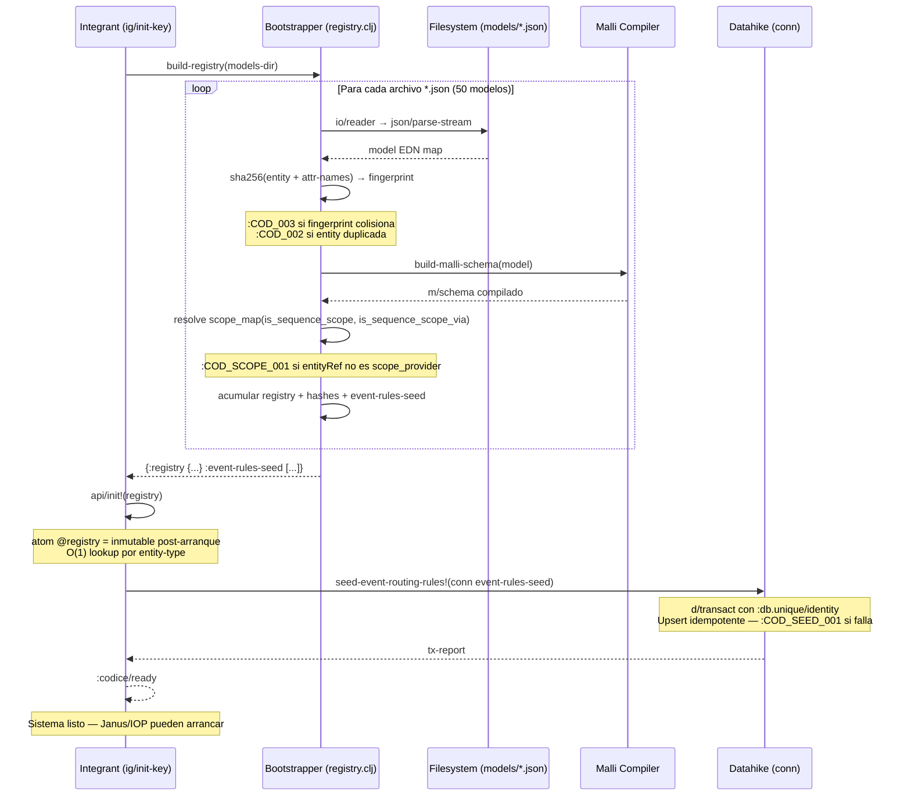

# Fase 02: Schema-Driven Core Engine — El Códice

**Nombre del Manifiesto:** `Códice — Schema-Driven Core Engine`
**Tipo:** Registro Central de Esquemas — Biblioteca Sin Estado
**Callers:** [03B_FASE_JANUS_ROUTER.md](03B_FASE_JANUS_ROUTER.md), [03A_FASE_IOP.md](03A_FASE_IOP.md), [06_FASE_CEDAR_AUTHORIZER.md](06_FASE_CEDAR_AUTHORIZER.md)

El **Códice** es la **fuente de verdad única (SSOT)** del Metri Engine. Es una bibliofeca sin estado que carga, compila y expone los 50 modelos JSON del sistema como esquemas Malli validables en tiempo cuasi-constante.

**No es un microservicio. No es una API HTTP. No es un repositorio de configuración remota.**
Es una librería Clojure de solo lectura que vive dentro del proceso del Engine, inicializada en el arranque por Integrant.

---

## MÓDULO 0: Diseño del Componente — Rol en el Pipeline

### Posición en el sistema

```
models/*.json  (50 archivos JSON — SSOT en disco)
      │
      │  [arranque — Bootstrapper]
      ▼
Códice (Registry In-Memory)
      │
      ├─── (codice/load-schema "asset")      ← Janus llama antes de validar
      ├─── (codice/validate-payload s p)    ← Janus valida payload gRPC contra Malli
      ├─── (codice/entity-engine "asset")   ← Janus decide canal OLTP|OLAP
      └─── (codice/entity-model "asset")    ← Cedar, QuotaGuard, Janus (metadatos)
```

### API pública (lo que el sistema consume)

```clojure
;; ── Los 4 puntos de acceso del Códice ──────────────────────────────────────
;; CONTRATO RAILWAY (FASE 10): todas las funciones retornan [:ok val] | [:error map]
;; NUNCA lanzan excepciones — el caller decide la acción

(codice/load-schema "asset" ctx)
;; → [:ok malli-schema] | [:error {:code :COD_001 :stage :codice :tenant-id ...}]
;; → O(1) map lookup + OTel span + errors/error del catálogo

(codice/validate-payload schema payload "asset" ctx)
;; → [:ok payload] | [:error {:code :COD_VAL_001 :violations [...] :tenant-id ...}]
;; → Nunca lanza excepción — resultado funcional puro

(codice/entity-engine "asset" ctx)
;; → [:ok :oltp] | [:ok :olap] | [:error {:code :COD_001 ...}]
;; → Determina el canal de escritura/lectura del canal Janus

(codice/entity-model "asset" ctx)
;; → [:ok {:entity "asset" :engine :oltp :track_history true :attributes [...] ...}]
;; → | [:error {:code :COD_001 ...}]
;; → El mapa JSON completo del modelo, parseado como EDN
```

> [!IMPORTANT]
> El Códice **nunca escribe**. Es de solo lectura.
> Los modelos JSON son la fuente de verdad — el Códice es su compilador y cache.
> Si un `entity-type` no existe en el Registry → `:COD_001` — Janus retorna `gRPC 404`.

### ¿Quién usa qué?

| Componente       | API del Códice                                       | Para qué                                                              |
| :--------------- | :--------------------------------------------------- | :-------------------------------------------------------------------- |
| **Janus**        | `load-schema` + `validate-payload` + `entity-engine` | Validar payload, decidir canal OLTP/OLAP                              |
| **Janus**        | `entity-model`                                       | Leer `events`, `routing`, `shadow_sagas_mapping`                      |
| **QuotaGuard**   | —                                                    | No usa el Códice directamente (usa `entity-type` del request para DY) |
| **Cedar**        | —                                                    | No usa el Códice (usa `entity-type` como `resource.domain`)           |
| **Bootstrapper** | interno                                              | Compila todos los schemas en el arranque                              |

---

## MÓDULO I: Bootstrapper — Registry Guard

### Responsabilidad

El Bootstrapper es el **único componente que toca el filesystem** en tiempo de ejecución.
Se ejecuta **una sola vez** durante `ig/init-key :codice/registry`. Tras arrancar, el registry es un `atom` inmutable de acceso O(1).

### Ciclo de vida

```
Arranque (ig/init-key :codice/registry)
    │
    ├─ 1. Escanear models/*.json (50 archivos)
    │       ↕ Si falla lectura → throw — JVM no arranca
    │
    ├─ 2. Parsear JSON → EDN map por cada entidad
    │       ↕ Si JSON malformado → throw — JVM no arranca
    │
    ├─ 3. SHA-256 hash por cada schema (collision detection)
    │       Hash = SHA-256(entity + concat(attr-names))
    │       ↕ Si hash colisiona con schema anterior → throw
    │
    ├─ 4. Compilar Malli schema por cada entidad
    │       (build-malli-schema model) → m/schema
    │       ↕ Si Malli rechaza el schema → throw
    │
    ├─ 5. Resolver scope map (is_sequence_scope + is_sequence_scope_via)
    │       Para cada entidad: escanea atributos con is_sequence_scope / is_sequence_scope_via
    │       Verifica que entityRef apuntado declare is_sequence_scope_provider: true
    │       ↕ Si entityRef NO es scope_provider → throw :COD_SCOPE_001 — JVM no arranca
    │       Almacena: registry["work_order"].scope_field = "location_id"
    │                 registry["work_order"].scope_via   = "asset_id" → "location_id"
    │
    ├─ 6. Almacenar en atom:
    │       @registry {"asset" {:model {...} :schema <malli> :hash "sha256-..."
    │                            :scope-field nil :scope-via nil}}
    │       Lookup: O(1) por entity-type string
    │
    ├─ 7. Seed event_routing_rule en Datahike
    │       UPSERT idempotente por :rule/rule-code — :COD_SEED_001 si falla
    │
    ├─ 8. Seed sequence_registry GLOBAL por tenant
    │       Para cada entidad con auto_generate.strategy = "sequential":
    │         Crea fila GLOBAL en sequence_registry si no existe:
    │           sequence_code = "BOOTSTRAP:{entity}:{field}_seq"  (pre-calentamiento)
    │         ― No crea counters scoped — se crean en primer uso real.
    │
    └─ Sistema listo — registry inmutable durante runtime
```

> [!IMPORTANT]
> **Fail-fast en startup.** Si cualquier modelo JSON es inválido, el proceso JVM no arranca.
> Esto garantiza que en producción **nunca** existe un `entity-type` sin schema compilado.
> El Bootstrapper **nunca corre en caliente** — solo en arranque.

### Diagrama de Secuencia — Bootstrapper



> [!NOTE]
> El seed de `event_routing_rule` es el **único paso del Bootstrapper que escribe en Datahike**.
> Todo el resto del Códice es 100% de solo lectura post-arranque.

### Implementación — Diseño canónico

```clojure
(ns metri.codice.registry
  (:require [clojure.java.io    :as io]
            [cheshire.core      :as json]
            [malli.core         :as m]
            [metri.codice.malli :as cm])
  (:import  [java.security MessageDigest]))

;; ── SHA-256 de un schema para collision detection ─────────────────────────
(defn- sha256 [s]
  (let [md (MessageDigest/getInstance "SHA-256")
        b  (.digest md (.getBytes ^String s "UTF-8"))]
    (format "%064x" (BigInteger. 1 b))))

(defn- schema-fingerprint [{:keys [entity attributes]}]
  (sha256 (str entity (mapv :name attributes))))

;; ── Carga y parseo de un archivo JSON de modelo ───────────────────────────
(defn- load-model-file [path]
  (with-open [r (io/reader path)]
    (json/parse-stream r true))) ;; true = keyword keys

;; ── Compilación del schema Malli desde el modelo JSON ────────────────────
;; Delega a metros.codice.malli/build — ver MÓDULO II
(defn- compile-schema [model]
  (m/schema (cm/build-malli-schema model)))

;; ── Extraer event_rules de cada modelo — ensamblado IN-MEMORY ─────────────
;; Cada modelo JSON puede declarar un bloque "event_rules" con reglas EDA.
;; El Bootstrapper los ESCANEA EN MEMORIA durante el arranque y construye
;; el seed para Datahike. Los datos NUNCA se persisten en los archivos JSON.
;;
;; SSOT:
;;   Declaración de reglas  → "event_rules" en cada modelo (ej: work_order.json)
;;   Esquema de la entidad  → event_routing_rule.json (solo attributes, sin datos)
;;   Persistencia runtime   → Datahike (único store operacional)
;;
;; Flujo:
;;   work_order.json    ─┐
;;   asset.json         ─┤  event_rules → extract-event-rules → acumular en memoria
;;   preventive_*.json  ─┘
;;                           ↓
;;                   seed-event-routing-rules!(conn, reglas-en-memoria)
;;                           ↓
;;                   Datahike: UPSERT por rule_code (:db.unique/identity)
;;                   "Si ya existe → actualiza. Si es nuevo → crea."
(defn- extract-event-rules [{:keys [entity event-rules]}]
  (mapv (fn [rule]
          (assoc rule
                 :target-entity-name entity
                 :is-system-seeded   true))
        (or event-rules [])))

;; ── Bootstrapper: construye el registry completo ─────────────────────────
(defn build-registry
  "Carga, valida, hashea y compila todos los modelos JSON.
   Llamado una sola vez desde ig/init-key :codice/registry.
   Lanza si cualquier modelo es inválido — el sistema no arranca.
   Retorna {:registry {...} :event-rules-seed [...]} para que
   ig/init-key pueda ejecutar el seed de event_routing_rule en Datahike."
  [models-dir]
  (let [files (->> (file-seq (io/file models-dir))
                   (filter #(.endsWith (.getName %) ".json")))]
    (reduce
      (fn [{:keys [registry hashes event-rules-seed]} file]
        (let [model        (load-model-file file)
              entity       (:entity model)
              hash         (schema-fingerprint model)
              raw-rules    (extract-event-rules model)]

          ;; ── Guard: entity duplicada ─────────────────────────────────
          (when (contains? registry entity)
            (throw (ex-info (str "Duplicate entity in Códice: " entity)
                            {:code :COD_002 :entity entity})))

          ;; ── Guard: hash collision entre distintas entidades ─────────
          ;; :COD_003 — dos schemas con el mismo fingerprint SHA-256
          ;; Indica campos idénticos entre entidades distintas — bug de modelo.
          (when-let [existing-entity (get hashes hash)]
            (throw (ex-info (str "SHA-256 fingerprint collision: '" entity
                                 "' y '" existing-entity "' tienen el mismo hash")
                            {:code      :COD_003
                             :entity-a  entity
                             :entity-b  existing-entity
                             :hash      hash})))

          {:registry        (assoc registry entity
                                   {:model  model
                                    :schema (compile-schema model)
                                    :hash   hash
                                    :engine (keyword (:engine model))})
           :hashes          (assoc hashes hash entity)
           :event-rules-seed (into event-rules-seed raw-rules)}))

      {:registry {} :hashes {} :event-rules-seed []}
      files)))
```

### Paso adicional — Seed de `event_routing_rule` en Datahike

Tras construir el registry, el `ig/init-key` realiza un **upsert ACID** de todas las
reglas extraídas de `event_rules` hacia la entidad `event_routing_rule` en Datahike.
Este upsert usa `:db.unique/identity` en `rule_code` — si la regla ya existe, se actualiza;
si es nueva, se crea. Los registros tienen `is_system_seeded = true` y **no pueden ser
eliminados ni modificados por tenants** (guard en Janus pre-check).

```clojure
;; Llamado desde ig/init-key después de build-registry:
;; D7 FIX: usa tenant-guard/transact-with-tenant! en lugar de d/transact directo.
;; El seed es operación del SISTEMA (Tenant-0) — usa SYSTEM_TENANT_ID.
;; Pool Model PROHIBE d/transact directo — toda operación pasa por tenant-guard.
(defn seed-event-routing-rules! [conn tenant-guard event-rules-seed]
  (when (seq event-rules-seed)
    (tenant-guard/transact-with-tenant!
      tenant-guard
      conn
      tenant-guard/SYSTEM_TENANT_ID  ;; Tenant-0 — reglas del sistema
      (mapv (fn [rule]
              {:rule/rule-code          (:rule-code rule)
               :rule/target-entity-name (:target-entity-name rule)
               :rule/event-trigger-type (keyword (:event-trigger-type rule))
               :rule/filter-conditions  (pr-str (:filter-conditions rule))
               :rule/detail-type-output (:detail-type-output rule)
               :rule/is-system-seeded   true})
            event-rules-seed))))
```

> [!IMPORTANT]
> El seed de `event_routing_rule` usa `:db.unique/identity` en `:rule/rule-code`.
> Si la JVM se reinicia y las reglas ya existen, Datahike hace **UPSERT** — idempotente.
> Nunca crea duplicados. Nunca sobrescribe reglas modificadas por el sistema.

---

## MÓDULO II: Compilador Malli — Tipo → Schema

### Mapping de tipos JSON → Malli

El `cm/build-malli-schema` transforma el modelo JSON en un schema Malli validable.

```clojure
(ns metri.codice.malli)

;; ── Mapping tipo JSON → predicado Malli ───────────────────────────────────
(def ^:private type->malli
  {"string"    :string
   "uuid"      :uuid
   "reference" :uuid        ;; FK shape — validación de existencia = OLTPChannel
   "int"       :int
   "integer"   :int
   "long"      pos-int?
   "float"     number?
   "double"    number?
   "decimal"   decimal?
   "epoch"     pos-int?     ;; epoch millis
   "instant"   inst?
   "boolean"   :boolean
   "json"      :map          ;; opaque blob
   "map"       :map
   "enum"      nil           ;; → manejo especial con options
   "array"     nil})         ;; → manejo especial con cardinality

;; ── Compilar un atributo individual ───────────────────────────────────────
;; FIX: soporta cardinality/many con entityRef — arrays de referencias FK
;; Ejemplos reales del modelo:
;;   work_order.assignees     → type:reference, cardinality:many → [:vector :uuid]
;;   work_order.status        → type:enum, options:[...]
;;   work_order.total_cost    → type:decimal, required:true
(defn- compile-attr [{:keys [name type required options cardinality]}]
  (let [many?      (= cardinality "many")
        base-type  (cond
                     (= type "enum")
                     [:enum options]

                     ;; FIX: array de referencias (entityRef + many)
                     ;; work_order.assignees = [:vector :uuid]
                     (and many? (= type "reference"))
                     [:vector :uuid]

                     ;; array de tipos primitivos (ej: array de strings)
                     (and many? (contains? type->malli type))
                     [:vector (get type->malli type :any)]

                     ;; tipo simple
                     :else
                     (get type->malli type :any))
        key        (keyword name)]
    (if required
      [key base-type]
      [key {:optional true} base-type])))

;; ── Construir schema Malli completo desde modelo JSON ─────────────────────
(defn build-malli-schema [{:keys [attributes]}]
  (into [:map] (mapv compile-attr attributes)))
```

### Validación FK (`reference`) — Separación de responsabilidades

> [!IMPORTANT]
> **El Códice NO valida la existencia de FKs.** Esa es responsabilidad del `OLTPChannel` de Janus.
>
> | Validación                           | Responsable                     | Cuándo                     |
> | :----------------------------------- | :------------------------------ | :------------------------- |
> | Tipo UUID válido para FK             | **Códice** (`validate-payload`) | Antes de tocar Datahike    |
> | Existencia del registro referenciado | **OLTPChannel** (Janus)         | En la transacción Datahike |
>
> El Códice valida que `asset_id` sea un UUID válido (formato).
> OLTPChannel verifica que ese UUID exista como entidad en Datahike antes de hacer `d/transact`.
> Si no existe → `:JNS_REF_001 "Referenced entity not found"` — **no** `:COD_VAL_001`.

---

### Tabla de errores del Códice

| Código           | Cuándo                                                                | Origen                                         |
| :--------------- | :-------------------------------------------------------------------- | :--------------------------------------------- |
| `:COD_001`       | `entity-type` no existe en el registry                                | `load-schema`, `entity-engine`, `entity-model` |
| `:COD_002`       | Dos archivos JSON con el mismo campo `entity`                         | Bootstrapper — falla arranque                  |
| `:COD_003`       | Dos schemas con el mismo SHA-256 fingerprint                          | Bootstrapper — falla arranque                  |
| `:COD_VAL_001`   | Payload no pasa validación Malli                                      | `validate-payload` — nunca lanza               |
| `:COD_SEED_001`  | Fallo al escribir `event_routing_rule` en Datahike                    | Bootstrap seed — falla arranque                |
| `:COD_SCOPE_001` | `is_sequence_scope` apunta a entidad sin `is_sequence_scope_provider` | Bootstrapper — falla arranque                  |

| Tipo JSON                | Malli predicate | OLTP Datahike            | OLAP Iceberg / Athena |
| :----------------------- | :-------------- | :----------------------- | :-------------------- |
| `string`, `enum`         | `:string`       | `:db.type/string`        | `VARCHAR`             |
| `uuid`                   | `:uuid`         | `:db.type/uuid`          | `STRING`              |
| `reference`              | `:uuid`         | `:db.type/ref`           | `VARCHAR` (FK string) |
| `int`, `integer`, `long` | `pos-int?`      | `:db.type/long`          | `BIGINT`              |
| `float`, `double`        | `number?`       | `:db.type/double`        | `DOUBLE`              |
| `decimal`                | `decimal?`      | `:db.type/bigdec`        | `DECIMAL(38,4)`       |
| `epoch`                  | `pos-int?`      | `:db.type/long`          | `BIGINT`              |
| `instant`                | `inst?`         | `:db.type/instant`       | `TIMESTAMP_TZ`        |
| `boolean`                | `:boolean`      | `:db.type/boolean`       | `BOOLEAN`             |
| `array`                  | `[:vector ...]` | `:db.cardinality/many`   | `ARRAY<STRING>`       |
| `json`, `map`            | `:map`          | `:db.type/bytes` (NiPPy) | `VARBINARY`           |

---

## MÓDULO III: API Pública del Códice

> [!IMPORTANT]
> **Cumplimiento FASE 10 — Error Management:**
> - Todas las funciones retornan Railway `[:ok val]` / `[:error map]` — NUNCA `throw`
> - Todo `[:error]` se construye con `errors/error` del catálogo maestro
> - Todo span OTel anota `tenant.id` y `user.id` cuando el `ctx` está disponible
> - Todo `[:error]` incluye `stage`, `code`, `tenant-id`, `user-id`, `trace-id`
> - Errores `WARNING+` son capturados por Sherlog vía el caller (IOP/Janus)

```clojure
(ns metri.codice.api
  "API pública del Códice — Registry de schemas en memoria.

   CONTRATO RAILWAY (FASE 10):
   - Todas las funciones retornan [:ok val] | [:error map]
   - NUNCA lanzan excepciones — el caller (Janus/IOP) decide qué hacer
   - Todo error se construye con errors/error del catálogo maestro
   - Todo error incluye: :stage :code :tenant-id :user-id :trace-id

   CONTRATO OTEL (FASE 10):
   - Cada función con I/O lógico tiene otel/with-span
   - Todo span anota tenant.id y user.id cuando ctx disponible
   - Error → otel/set-status! :error + error.code anotado"
  (:require [malli.core         :as m]
            [metri.common.errors :as errors]
            [metri.otel.spans    :as otel]))

;; ── Atom del registry — inmutable post-arranque ───────────────────────────
;; Inyectado por Integrant desde build-registry
(def ^:private registry (atom {}))

(defn init! [built-registry]
  (reset! registry built-registry))

;; ═══════════════════════════════════════════════════════════════════════════
;; FUNCIONES RAILWAY — NUNCA throw, SIEMPRE [:ok val] | [:error map]
;; ═══════════════════════════════════════════════════════════════════════════

;; ── load-schema — O(1) + Railway + OTel ───────────────────────────────────
;; Retorna [:ok malli-schema] | [:error {:code :COD_001 ...}]
;; ANTES: usaba throw → violaba Railway Pattern (D1)
;; AHORA: retorna Railway puro + span OTel con tenant/user annotation
(defn load-schema
  "Busca el schema Malli compilado para entity-type.
   Retorna [:ok schema] | [:error {:code :COD_001}].
   NUNCA lanza — el caller (Janus) decide la acción."
  [entity-type ctx]
  (otel/with-span ["codice.load-schema" {:kind :internal}]
    (let [span (otel/current-span)]
      (otel/set-attributes! span
        {"entity.type" entity-type
         "tenant.id"   (:tenant-id ctx)
         "user.id"     (:user-id ctx)})
      (if-let [schema (get-in @registry [entity-type :schema])]
        (do (otel/set-status! span :ok)
            [:ok schema])
        (do (otel/set-status! span :error "Unknown entity-type")
            (otel/set-attributes! span {"error.code" "COD_001"})
            (errors/error :COD_001
                          {:entity_type entity-type
                           :tenant-id   (:tenant-id ctx)
                           :user-id     (:user-id ctx)
                           :trace-id    (otel/trace-id span)}))))))

;; ── validate-payload — Railway + OTel + errors/error ─────────────────────
;; Retorna [:ok payload] | [:error {:code :COD_VAL_001 :stage :codice ...}]
;; ANTES: faltaban stage, tenant-id, user-id, trace-id (D2)
;; ANTES: usaba [:error {:code ...}] inline (D3)
;; AHORA: usa errors/error del catálogo + span OTel
(defn validate-payload
  "Valida payload contra schema Malli compilado.
   Retorna [:ok payload] | [:error {:code :COD_VAL_001 ...}].
   NUNCA lanza — resultado funcional puro."
  [schema payload entity-type ctx]
  (otel/with-span ["codice.validate-payload" {:kind :internal}]
    (let [span   (otel/current-span)
          result (m/explain schema payload)]
      (otel/set-attributes! span
        {"entity.type"  entity-type
         "tenant.id"    (:tenant-id ctx)
         "user.id"      (:user-id ctx)
         "field.count"  (count (:attributes schema))})
      (if (nil? result)
        (do (otel/set-status! span :ok)
            [:ok payload])
        (let [violations (m/humanize result)]
          (otel/set-status! span :error "Payload validation failed")
          (otel/set-attributes! span
            {"error.code"       "COD_VAL_001"
             "violation.count"  (count violations)})
          (errors/error :COD_VAL_001
                        {:entity_type     entity-type
                         :violations      violations
                         :violation_count (count violations)
                         :tenant-id       (:tenant-id ctx)
                         :user-id         (:user-id ctx)
                         :trace-id        (otel/trace-id span)}))))))

;; ── entity-engine — O(1) + Railway + OTel ────────────────────────────────
;; Retorna [:ok :oltp] | [:ok :olap] | [:error {:code :COD_001}]
;; ANTES: usaba throw (D1)
(defn entity-engine
  "Retorna [:ok engine-keyword] | [:error {:code :COD_001}].
   engine-keyword = :oltp | :olap — decide el canal de Janus."
  [entity-type ctx]
  (otel/with-span ["codice.entity-engine" {:kind :internal}]
    (let [span (otel/current-span)]
      (otel/set-attributes! span
        {"entity.type" entity-type
         "tenant.id"   (:tenant-id ctx)})
      (if-let [engine (get-in @registry [entity-type :engine])]
        (do (otel/set-status! span :ok)
            (otel/set-attributes! span {"engine" (name engine)})
            [:ok engine])
        (do (otel/set-status! span :error "Unknown entity-type")
            (otel/set-attributes! span {"error.code" "COD_001"})
            (errors/error :COD_001
                          {:entity_type entity-type
                           :tenant-id   (:tenant-id ctx)
                           :user-id     (:user-id ctx)
                           :trace-id    (otel/trace-id span)}))))))

;; ── entity-model — O(1) + Railway + OTel ─────────────────────────────────
;; Retorna [:ok model-map] | [:error {:code :COD_001}]
;; ANTES: usaba throw (D1)
(defn entity-model
  "Retorna [:ok model-edn-map] | [:error {:code :COD_001}].
   El mapa incluye :entity, :engine, :attributes, :events, etc."
  [entity-type ctx]
  (otel/with-span ["codice.entity-model" {:kind :internal}]
    (let [span (otel/current-span)]
      (otel/set-attributes! span
        {"entity.type" entity-type
         "tenant.id"   (:tenant-id ctx)})
      (if-let [model (get-in @registry [entity-type :model])]
        (do (otel/set-status! span :ok)
            [:ok model])
        (do (otel/set-status! span :error "Unknown entity-type")
            (errors/error :COD_001
                          {:entity_type entity-type
                           :tenant-id   (:tenant-id ctx)
                           :user-id     (:user-id ctx)
                           :trace-id    (otel/trace-id span)}))))))

;; ── describe-attributes — O(1) + Railway + OTel ──────────────────────────
;; Retorna [:ok attributes-list] | [:error {:code :COD_001}]
;; Usado por:
;;   — domain_plugin: validar que un hook apunta a un campo existente
;;   — Janus pre-check: validar is_system_seeded, write_path_locked
;;   — Hephaestus: detectar is_dimension, is_measure, partition_strategy
(defn describe-attributes
  "Retorna [:ok attributes-list] | [:error {:code :COD_001}]."
  [entity-type ctx]
  (otel/with-span ["codice.describe-attributes" {:kind :internal}]
    (let [span (otel/current-span)]
      (otel/set-attributes! span {"entity.type" entity-type})
      (if-let [attrs (get-in @registry [entity-type :model :attributes])]
        (do (otel/set-status! span :ok)
            [:ok attrs])
        (do (otel/set-status! span :error "Unknown entity-type")
            (errors/error :COD_001
                          {:entity_type entity-type
                           :tenant-id   (:tenant-id ctx)
                           :user-id     (:user-id ctx)
                           :trace-id    (otel/trace-id span)}))))))

;; ── entity-hash — O(1) ───────────────────────────────────────────────────
;; SHA-256 fingerprint del schema — para audit y comparación.
;; Nota: esta función NO es Railway porque nil es un retorno válido
;; (entidad no encontrada no es error aquí — es informacional).
(defn entity-hash [entity-type]
  (get-in @registry [entity-type :hash]))

;; ── reload! — solo para REPL / desarrollo ───────────────────────────
;; Reconstruye el registry sin reiniciar la JVM.
;; Único uso válido: REPL-driven development (lein repl / clj -A:dev).
;; NO llamar desde producción — el registry es inmutable en runtime.
(defn reload!
  "REPL-only: reconstruye el registry desde el filesystem.
   Llama a build-registry y reinicializa el atom @registry.
   No disponible en la imagen de producción (guard por env var)."
  [models-dir]
  (when (= (System/getenv "CLOJURE_ENV") "production")
    (throw (ex-info "reload! no está permitido en producción"
                    {:code :COD_RELOAD_FORBIDDEN})))
  (let [{:keys [registry]} (registry/build-registry models-dir)]
    (init! registry)
    (log/info "Códice: registry recargado con" (count registry) "entidades")))
```

> [!IMPORTANT]
> **Cambio de firma en API (D1):** Todas las funciones ahora reciben `ctx` como segundo argumento.
> ```clojure
> ;; ❌ ANTES (violaba Railway — D1):
> (codice/load-schema "asset")          ;; → throw si no existe
>
> ;; ✅ AHORA (Railway + OTel — D1/D4/D5):
> (codice/load-schema "asset" ctx)      ;; → [:ok schema] | [:error {:code :COD_001 ...}]
> ```
> Los callers (Janus, IOP) DEBEN actualizar sus invocaciones para pasar `ctx`.

---

## MÓDULO IV: Metadatos de Entidad — Directivas del Motor

### Directivas Root Level

| Directiva                    | Tipo         | Descripción                                                                            | Consumidor                               |
| :--------------------------- | :----------- | :------------------------------------------------------------------------------------- | :--------------------------------------- |
| `engine`                     | `oltp\|olap` | Canal de escritura/lectura                                                             | Janus → canal `OLTPChannel\|OLAPChannel` |
| `track_history`              | `boolean`    | Activa Time-Travel en Datahike (`:db/add`/`:db/retract`)                               | OLTPChannel                              |
| `disable_eda`                | `boolean`    | Suprime Outbox → SQS para entidades IoT de alta frecuencia                             | MoiraEmitter                             |
| `is_system`                  | `boolean`    | Pertenece al Tenant-0 master — no mutable por tenants externos                         | Cedar ABAC policy                        |
| `write_path_locked`          | `boolean`    | Prohíbe `rpc Transact` individual — solo `rpc BulkIngest`                              | Janus pre-check                          |
| `is_sequence_scope_provider` | `boolean`    | El `tag` de esta entidad puede ser scope de contadores secuenciales en otras entidades | `generator.clj` Bootstrapper             |

### Directivas Attribute Level

| Directiva               | Tipo      | Descripción                                                                                                                                                   | Consumidor         |
| :---------------------- | :-------- | :------------------------------------------------------------------------------------------------------------------------------------------------------------ | :----------------- |
| `required`              | `boolean` | Campo obligatorio — fallo Malli antes de tocar el disco                                                                                                       | `validate-payload` |
| `unique: identity`      | string    | UPSERT ACID en Datahike (`:db.unique/identity`)                                                                                                               | OLTPChannel        |
| `unique: value`         | string    | Colisión estructural — rechaza duplicados                                                                                                                     | OLTPChannel        |
| `cardinality: many`     | string    | `:db.cardinality/many` en Datahike                                                                                                                            | Bootstrapper       |
| `entityRef`             | string    | FK → nombre de la entidad referenciada (ej. `"work_order"`)                                                                                                   | Aegis AST Pull     |
| `is_dimension`          | `boolean` | Partition Key en Iceberg/Parquet                                                                                                                              | Hephaestus OLAP    |
| `is_system_seeded`      | `boolean` | Protege registros del motor de mutaciones de API                                                                                                              | Janus pre-check    |
| `crypto_envelope`       | `boolean` | Intercepta para encriptación KMS antes de escritura                                                                                                           | OLTPChannel        |
| `fts`                   | `boolean` | Habilita Full-Text Search en Datahike index                                                                                                                   | Aegis FTS          |
| `index`                 | `boolean` | Habilita B-Tree index en Datahike                                                                                                                             | OLTPChannel        |
| `disable_fts`           | `boolean` | Bloquea búsquedas FTS en Aegis para este campo                                                                                                                | Aegis FTS guard    |
| **`auto_generate`**     | `object`  | Generación automática de código de negocio antes de escribir                                                                                                  | **OLTPChannel**    |
| `is_sequence_scope`     | `boolean` | Este campo de referencia actua como scope DIRECTO del contador secuencial. `entityRef` debe apuntar a entidad con `is_sequence_scope_provider: true`          | `generator.clj`    |
| `is_sequence_scope_via` | string    | Nombre del campo en el `entityRef` que será el scope. Scope INDIRECTO: si `location_id` ausente en payload, resuelve via `asset.location_id`                  | `generator.clj`    |
| `scope_resolution`      | string    | En `auto_generate`: `"exact"` (default) \| `"root"` \| `"nearest_registered"`. Controla cómo se traversa la jerarquía cuando el scope es hijo de otra entidad | `sequence.clj`     |

### Directivas de Routing Avanzado

| Directiva                     | Descripción                                                         |
| :---------------------------- | :------------------------------------------------------------------ |
| `events.create/update/delete` | Nombre canónico del evento EDA — Moira usa este string, no hardcode |
| `shadow_sagas_mapping`        | Mapa de proyección `ruta_destino_en_scheduled_job → ruta_origen_en_la_madre`. El `SagaBuilder` deriva `trigger_type`/`trigger_expression` de la entidad madre y hace fan-out por la matriz de pre-notificación. El resultado valida contra `models/scheduled_job.json` — ver 03B §III.2 |
| `calendar_mapping`            | Inyección automática → `calendar_event` al crear la entidad madre   |
| `routing.write_path_locked`   | Bloquea `rpc Transact` — solo permite `rpc BulkIngest`              |
| `routing.ingestion_engine`    | `aws_kinesis_firehose` → bypass Janus/Datahike para OLAP masivo     |

### `auto_generate` — Generación de Códigos de Negocio

> [!IMPORTANT]
> Cuando un atributo declara `auto_generate`, el **OLTPChannel de Janus** genera el valor
> **antes de hacer `d/transact`** — el cliente nunca envía este campo en el payload.
> Si el payload lo incluye, Janus lo **ignora y sobreescribe** con el valor generado.

#### Contrato del bloque

```json
"auto_generate": {
  "strategy": "sequential | stochastic_base36",
  "prefix":   "WO- | A- | L-",
  "padding":  4,    // solo strategy: sequential  → zero-pad: WO-0042
  "length":   7     // solo strategy: stochastic_base36 → longitud del hash: A-X7K2M9P
  // scope_ref eliminado — el scope se infiere automáticamente desde los atributos del modelo
}
```

#### Mecanismo automático de scope — Contrato declarativo

El sistema **no necesita configuración manual** en `auto_generate`. El scope se descubre automáticamente por el generador al arrancar con directivas en los modelos JSON:

```json
// En location.json — la entidad que PROVEE el scope:
{
  "entity": "location",
  "is_sequence_scope_provider": true   ← su 'tag' puede ser scope de contadores
}

// En work_order.json — scope DIRECTO (location_id en el payload):
{
  "name": "location_id",
  "entityRef": "location",
  "is_sequence_scope": true            ← este campo ES el scope del contador
}

// En work_order.json — scope INDIRECTO (via asset si location_id ausente):
{
  "name": "asset_id",
  "entityRef": "asset",
  "is_sequence_scope_via": "location_id"  ← resuelve scope leyendo asset.location_id en Datahike
}
```

> [!IMPORTANT]
> **Prioridad de scope (mayor a menor):**
>
> 1. `is_sequence_scope: true` — scope DIRECTO (location_id en el payload) ← **preferencia absoluta**
> 2. `is_sequence_scope_via: "location_id"` — scope INDIRECTO vía asset ← solo si (1) está ausente
> 3. Sin ninguno — FALLBACK al contador GLOBAL → `"WO-0001"`
>
> El Bootstrapper valida en arranque:
>
> - `is_sequence_scope` → verifica que `entityRef` declare `is_sequence_scope_provider: true`
> - `is_sequence_scope_via` → verifica que el campo referenciado en el `entityRef` exista y sea `scope_provider`
> - Cualquier violación → **fail-fast en bootstrap**

```
OLTPChannel detecta auto_generate.strategy = "sequential"
    │
    ├─ Consulta registry compilado por Bootstrapper:
    │       direct_scope_field = "location_id"   (is_sequence_scope: true)
    │       via_scope_field    = "asset_id"       (is_sequence_scope_via: "location_id")
    │
    ├─ ¿El payload contiene location_id? (DIRECTO — prioridad 1)
    │       │
    │       ├─ SÍ → MODO SCOPED DIRECTO:
    │       │       READ location.tag → "L-K92MXA"
    │       │       sequence_code = "tnt_A:work_order_number:L-K92MXA_seq"
    │       │       RESULTADO: "WO-L-K92MXA-0001"
    │       │
    │       └─ NO → ¿El payload contiene asset_id? (INDIRECTO — prioridad 2)
    │               │
    │               ├─ SÍ → MODO SCOPED INDIRECTO (via asset):
    │               │
    │               │  ── READ #1: busca el asset en Datahike ──────────────────
    │               │       (d/q WHERE asset/id = payload.asset_id)
    │               │
    │               │       ¿Asset encontrado?
    │               │         │
    │               │         ├─ NO → asset_id es inválido
    │               │         │       ⚡ FK validation ya lo capturó antes (JNS_REF_001)
    │               │         │       Si llega aquí por bug → FALLBACK GLOBAL
    │               │         │       sequence_code = "tnt_A:work_order_number_seq"
    │               │         │       RESULTADO: "WO-0001"  ← sin scope, global seguro
    │               │         │
    │               │         └─ SÍ → ¿El asset tiene location_id?
    │               │                   │
    │               │                   ├─ SÍ → READ #2: location.tag
    │               │                   │         Aplica scope_resolution (nearest_registered)
    │               │                   │         RESULTADO: "WO-L-K92MXA-0001"
    │               │                   │
    │               │                   └─ NO → asset sin ubicación física registrada
    │               │                           FALLBACK GLOBAL (crea o reutiliza)
    │               │                           sequence_code = "tnt_A:work_order_number_seq"
    │               │                           RESULTADO: "WO-0001"
    │               │                           ← el contador global del tenant siempre existe
    │               │                              o se crea en este primer uso
    │               │
    │               └─ NO → MODO GLOBAL (prioridad 3 — fallback):
    │                       sequence_code = "tnt_A:work_order_number_seq"
    │                       RESULTADO: "WO-0001", "WO-0002", ...
    │
    ├─ READ — Datahike: busca el registro en `sequence_registry` por `sequence_code`
    │
    │    (d/q '[:find (pull ?e [:sequence_registry/current_value
    │                            :sequence_registry/prefix
    │                            :sequence_registry/padding_length])
    │             :in $ ?code
    │             :where [?e :sequence_registry/sequence_code ?code]]
    │           @conn sequence_code)
    │
    │    ¿Existe el registro en sequence_registry?
    │      │
    │      ├─ SÍ → usa current_value encontrado → sigue al WRITE
    │      │
    │      └─ NO → sequence_code scoped no existe todavía
    │               │
    │               ├─ nearest_registered: ya recorrió ancestros y ninguno tiene counter
    │               │   → FALLBACK al registro GLOBAL del tenant:
    │               │     sequence_code = "tnt_A:work_order_number_seq"  (sin parent_scope_tag)
    │               │
    │               │     READ global:
    │               │       ┌─ SÍ → usa current_value del contador global → sigue al WRITE
    │               │       └─ NO → primer uso del tenant
    │               │               WRITE crea registro GLOBAL con current_value=0
    │               │               → genera "WO-0001"
    │               │
    │               └─ exact / root: crea el contador scoped con current_value=0
    │                   → primer WO en ese scope → "WO-L-K92MXA-0001"
    │
    └─ WRITE — Transaction Function atómica (ACID):
               (d/transact conn
                 {:tx-data [{:sequence_registry/sequence_code    sequence-code
                              :sequence_registry/tenant_id        tenant-ref
                              :sequence_registry/prefix           prefix-final
                              :sequence_registry/padding_length   padding
                              :sequence_registry/current_value    (inc current-value)
                              :sequence_registry/parent_scope_tag scope-tag}]})
               → unique:identity → UPSERT ACID
               → current_value muta in-place (track_history: false)
```

> [!IMPORTANT]
> **Regla de oro del READ en `sequence_registry`:**
> Si el `sequence_code` scoped NO existe y la política es `nearest_registered` → el sistema
> **nunca crea un nuevo registro scoped huérfano**. En su lugar usa/crea el registro **GLOBAL**
> del tenant (`sequence_code` sin `parent_scope_tag`). Este registro es la red de seguridad
> absoluta — silenciosa, sin error, sin interrupción del flujo de negocio.
> `track_history: false` + `disable_eda: true` → el contador muta en silencio.

#### Tabla de comportamiento — todos los escenarios

| Escenario                           | `location_id` | `asset_id` | scope resuelto      | Código generado      |
| :---------------------------------- | :------------ | :--------- | :------------------ | :------------------- |
| Sin scope configurado               | —             | —          | GLOBAL              | `"WO-0042"`          |
| Solo `asset_id`, asset sin location | —             | presente   | GLOBAL (fallback)   | `"WO-0042"`          |
| Solo `asset_id`, asset con location | —             | presente   | via asset→location  | `"WO-L-K92MXA-0001"` |
| Solo `location_id`                  | presente      | —          | DIRECTO             | `"WO-L-K92MXA-0001"` |
| Ambos — `location_id` + `asset_id`  | presente      | presente   | DIRECTO (prioridad) | `"WO-L-K92MXA-0001"` |

> [!NOTE]
> La `location.tag` es **inmutable** (generada por `stochastic_base36`) — nunca cambia.
> El `sequence_code` es estable de por vida. Cero riesgo de colisión o reordenamiento.
> Añadir scope a una nueva entidad = **2 líneas en JSON**. Sin tocar código del generador.

#### `scope_resolution` — Resolución Jerárquica de Scope (opcional)

Cuando la location del payload es **hija** de una con counter registrado, `scope_resolution` decide
qué nivel de la jerarquía se usa como scope del contador.

```json
"auto_generate": {
  "strategy":          "sequential",
  "prefix":            "WO-",
  "padding":           4,
  "scope_resolution":  "exact"   // default
                                 // "root"               → sube hasta la raíz del árbol
                                 // "nearest_registered" → sube hasta encontrar un counter existente
}
```

**Política `exact` (default)**

```
location_id = L-X33KMN (Sala Bombas, nivel 4)
→ usa L-X33KMN directamente
→ crea nuevo counter si no existe
RESULTADO: "WO-L-X33KMN-0001"
✔ Independencia total por ubicación física
```

**Política `root`**

```
location_id = L-X33KMN (Sala Bombas)
    ├─ READ parent_location_id → L-M11QWE (Piso 2)
    ├─ READ parent_location_id → L-P72BXZ (Edificio A)
    └─ READ parent_location_id → L-K92MXA (Planta Norte)
              READ parent_location_id → nil ✔ ES LA RAÍZ

sequence_code = "tnt_A:work_order_number:L-K92MXA_seq"
RESULTADO: "WO-L-K92MXA-0043"   (hereda el counter del SITE)

Query Datahike recursivo (regla Datalog):
  [:find ?root-tag
   :in $ % ?start-id
   :where (location-root ?start-id ?root)
          [?root :location/tag ?root-tag]]

  Regla location-root:
    [(location-root ?loc ?loc)                           ;; caso base: sin padre = es raíz
     (not [?loc :location/parent_location_id _])]
    [(location-root ?loc ?root)                          ;; caso recursivo: sube al padre
     [?loc :location/parent_location_id ?parent]
     (location-root ?parent ?root)]

✔ Todas las sub-ubicaciones comparten el contador del SITE
✔ El técnico en Sala Bombas ve WO-L-K92MXA-0043 (coherente con la planta)
```

**Política `nearest_registered`**

```
CASO A — location_id NO viene en el payload:
    → sequence_code = "tnt_A:work_order_number_seq"   (GLOBAL, sin scope)
    → parent_scope_tag = nil
    RESULTADO: "WO-0001", "WO-0002", ...   ← código base canónico

CASO B — location_id presente, SIN ningún ancestro registrado aún:
    location_id = L-X33KMN (Sala Bombas — primer día de operación)
    ├─ ¿Counter para L-X33KMN?     → NO
    ├─ ¿Counter para L-M11QWE?     → NO
    ├─ ¿Counter para L-P72BXZ?     → NO
    └─ ¿Counter para L-K92MXA?     → NO (nadie ha creado WOs aún)

    → FALLBACK al contador GLOBAL
    sequence_code = "tnt_A:work_order_number_seq"
    RESULTADO: "WO-0001"   ← mismo código base, coherente con el sistema

CASO C — location_id presente, ancestro L-K92MXA SÍ tiene counter (42 WOs):
    ├─ ¿Counter para L-X33KMN?     → NO
    ├─ ¿Counter para L-M11QWE?     → NO
    ├─ ¿Counter para L-P72BXZ?     → NO
    └─ ¿Counter para L-K92MXA?     → SÍ ✔ (current_value=42)

    sequence_code = "tnt_A:work_order_number:L-K92MXA_seq"
    RESULTADO: "WO-L-K92MXA-0043"   ← hereda el counter del SITE
```

> [!IMPORTANT]
> **Regla de oro del fallback:** Cuando `nearest_registered` no encuentra ningún counter
> en la jerarquía de ancestros, **siempre cae al registro GLOBAL** del tenant
> (`sequence_code` sin `parent_scope_tag`). Este registro produce `WO-0001`, `WO-0002`, etc.
> Es el código base canónico — nunca falla, siempre existe o se crea en el primer uso.

```
Registros en sequence_registry para Tenant A (ejemplo de evolución):

DÍA 1 — primera WO sin location:
  "tnt_A:work_order_number_seq"  current=1  → WO-0001  ← GLOBAL (fallback)

DÍA 3 — primera WO en Planta Norte:
  "tnt_A:work_order_number_seq"  current=5  → WO-0005  ← aún sin ancestro → fallback GLOBAL

DÍA 10 — alguien crea WO directamente en Planta Norte (L-K92MXA):
  "tnt_A:work_order_number:L-K92MXA_seq"  current=1  → WO-L-K92MXA-0001  ← nace el counter SITE

DÍA 11 — WO en Sala Bombas (hija de Planta Norte):
  nearest_registered → L-K92MXA tiene counter ✔
  "tnt_A:work_order_number:L-K92MXA_seq"  current=2  → WO-L-K92MXA-0002
```

**Tabla comparativa de políticas**

| Política             | Counter para Sala Bombas                 | Hereda padre   | Caso de uso óptimo                 |
| :------------------- | :--------------------------------------- | :------------- | :--------------------------------- |
| `exact`              | `WO-L-X33KMN-0001` (propio)              | NO             | Trazabilidad por habitación/zona   |
| `root`               | `WO-L-K92MXA-0043` (del SITE)            | SÍ, siempre    | Numeración central por planta/site |
| `nearest_registered` | `WO-L-K92MXA-0043` (del primer ancestro) | SÍ, adaptativo | Herencia orgánica según historial  |

**Política recomendada para `work_order`: `nearest_registered`**

> La política `nearest_registered` es la más inteligente para operaciones de campo porque:
>
> - **Primera WO en un nuevo sub-nivel** (ej: un área nueva) → crea su propio counter local.
> - **Cuando el SITE padre ya tiene actividad** → todos sus hijos heredan automáticamente ese counter,
>   sin configuración extra ni migración.
> - **Auto-organizante**: el sistema converge naturalmente al counter del nivel más usado, no al más alto.
> - **Nunca rompe series existentes**: si `Planta Norte` ya tiene 42 WOs, crear una en `Sala Bombas`
>   produce `WO-L-K92MXA-0043` — el operador ve coherencia inmediata.
>
> **`root` fuerza** el recorrido completo del árbol en cada request → más costoso y predecible.
> **`nearest_registered`** se detiene en el primer ancestro con actividad → mínimas lecturas, máxima adaptabilidad.

#### Estrategia `stochastic_base36` — `base36.clj`

```
Secreto puro de entropía local (SecureRandom JVM)
    │
    └─ Mapeo al alfabeto canónico Base36: "0123456789ABCDEFGHIJKLMNOPQRSTUVWXYZ"
         → prefix + N caracteres aleatorios
         ej: "A-" + "X7K2M9P" → "A-X7K2M9P"

Propiedades:
  ✔ Función pura — cero I/O, cero Datahike, cero efectos secundarios
  ✔ Previene IDOR — no secuencial, no predecible
  ✔ P(colisión) < 1/36^length  (length=7 → < 1 en 78.000 millones)
```

```clojure
;; Diseño de metri.codice.base36
;; Entrada:  prefix (string) + length (int)
;; Salida:   prefix + Base36[length]
;; Dep.:     java.security.SecureRandom — ya incluído en JDK

(defn generate [prefix length]
  ;; 1. Inicializa SecureRandom (singleton, thread-safe)
  ;; 2. Itera `length` veces: (rand-nth ALPHABET)
  ;; 3. Concatena: prefix + chars
  ;; 4. Retorna string inmutable
  )
```

| Modelo     | Campo | prefix | length | Ejemplo generado |
| :--------- | :---- | :----- | :----- | :--------------- |
| `asset`    | `tag` | `"A-"` | `7`    | `"A-X7K2M9P"`    |
| `location` | `tag` | `"L-"` | `6`    | `"L-K92MXA"`     |

#### Contrato canónico de `metri.codice.generator` (SSOT compartido)

> [!IMPORTANT]
> `metri.codice.generator` **pertenece al Códice** (Fase 02) pero es **consumido por `OLTPChannel` (Fase 03B)**.
> Es el único módulo del sistema con esta relación de ownership cruzada.
> El Códice lo define y lo publica como key Integrant `:codice/generator-inject`.
> Janus lo recibe como `codice-generator-fn` inyectada — nunca lo importa directamente.

```clojure
;; ns: metri.codice.generator
;; OWNER: Fase 02 (Códice — Schema-Driven Core)
;; CONSUMER: OLTPChannel (Fase 03B — Janus Router) → recibe como codice-generator-fn inyectada
;; NO usar directamente desde Janus — siempre via inyección Integrant

;; CUMPLIMIENTO FASE 10:
;; - Errores construidos con errors/error del catálogo maestro (D3)
;; - Pool Model: READ/WRITE a Datahike VÍA tenant-guard (D7)
;; - OTel spans en cada operación (D4)
;; - El caller (OLTPChannel) invoca sherlog/handle-fault! para errores WARNING+ (D6)

(defn inject!
  "Punto de entrada único para enriquecimiento de payload con directivas auto_generate.
   Llamado por OLTPChannel (a través de codice-generator-fn inyectada) antes de build-tx-data.
   El Bootstrapper lo usa en startup para validar los vínculos de scope.

   Contrato de retorno Railway (FASE 10):
   - [:ok payload-enriquecido] — si todos los campos auto_generate se generaron OK
   - [:error {:code :JNS_SEQ_001 :stage :codice ...}] — si secuencia falla
   El caller (OLTPChannel) DEBE invocar sherlog/handle-fault! si recibe [:error] (D6)."
  [db-conn tenant-guard schema tenant-id payload]
  (otel/with-span ["codice.autogen.inject" {:kind :internal}]
    (let [span (otel/current-span)]
      (otel/set-attributes! span
        {"entity.type" (:entity schema)
         "tenant.id"   tenant-id})
      (reduce
        (fn [enriched [attr-name attr-config]]
          ;; Si un paso anterior ya retornó [:error], propagar sin ejecutar más
          (if (and (vector? enriched) (= :error (first enriched)))
            enriched
            (let [result
                  (case (:strategy attr-config)
                    :sequential        (sequence/next! db-conn tenant-guard attr-config
                                                       (get-scope-field schema attr-name)
                                                       tenant-id enriched)
                    :stochastic_base36 [:ok (base36/generate (:prefix attr-config)
                                                              (:length attr-config))])]
              (case (first result)
                :ok    (assoc enriched attr-name (second result))
                :error result))))
        payload
        (filter-auto-generate-attrs schema)))))

;; ── metri.codice.sequence ───────────────────────────────────────────────────────────────────

(defn next!
  "Genera el siguiente código secuencial ACID con scope resolution.
   Llamado internamente por inject! — nunca directamente desde Janus.

   CUMPLIMIENTO FASE 10 + D7 (Pool Model):
   - READ usa tenant-guard/query-with-tenant (NO d/q directo)
   - WRITE usa tenant-guard/transact-with-tenant! (NO d/transact directo)
   - Retorna [:ok generated-string] | [:error {:code :JNS_SEQ_001 ...}]
   - Todo error construido con errors/error del catálogo maestro (D3)

   Flujo interno:
     1. resolve-scope-tag según scope-resolution policy
     2. build-sequence-code: tenant-id + \":\" + field-name + scope-tag? + \"_seq\"
     3. READ sequence_registry VÍA tenant-guard/query-with-tenant
     4. WRITE ACID VÍA tenant-guard/transact-with-tenant! (inc current-value)
     5. format: prefix + zero-pad(new-value, padding)

   Retorna: [:ok string]  ej: [:ok \"WO-L-K92MXA-0043\"] o [:ok \"WO-0042\"]"
  [db-conn tenant-guard attr-config scope-field tenant-id payload]
  (otel/with-span ["codice.autogen.sequential" {:kind :internal}]
    (let [span (otel/current-span)]
      (otel/set-attributes! span {"tenant.id" tenant-id})
      ;; 1. Resolve scope tag
      ;; 2. Build sequence_code
      ;; 3. READ con tenant-guard (D7):
      ;;    (tenant-guard/query-with-tenant tenant-guard @db-conn tenant-id
      ;;      '[:find (pull ?e [...]) :in $ ?code
      ;;        :where [?e :sequence_registry/sequence_code ?code]]
      ;;      sequence-code)
      ;;
      ;; 4. WRITE con tenant-guard (D7):
      ;;    (tenant-guard/transact-with-tenant! tenant-guard db-conn tenant-id
      ;;      [{:sequence_registry/sequence_code  sequence-code
      ;;        :sequence_registry/current_value   (inc current-value)
      ;;        ...}])
      ;;
      ;; 5. format result
      ;; NUNCA usa d/q ni d/transact directamente — Pool Model invariant
      )))

;; ── metri.codice.base36 ───────────────────────────────────────────────────────────────────

(defn generate
  "Genera un código alfanumérico base36 de longitud `length` con prefijo `prefix`.
   Función pura — sin I/O, sin Datahike, sin sequence_registry.
   Llamada internamente por inject! — nunca directamente desde Janus."
  [prefix length]
  ;; 1. Inicializa SecureRandom (singleton, thread-safe)
  ;; 2. Itera `length` veces: (rand-nth ALPHABET-36)
  ;; 3. Concatena: prefix + chars
  ;; 4. Retorna string inmutable
  )
```

#### Registro Integrant de `metri.codice.generator`

```clojure
;; ns: metri.codice.generator
;; El generador se registra como key Integrant para ser consumido por OLTPChannel
;; D7 FIX: recibe tenant-guard como dependencia para inyectarlo en inject!

(defmethod ig/init-key :codice/generator-inject
  [_ {:keys [tenant-guard]}]
  ;; Retorna un closure que captura tenant-guard — OLTPChannel la recibe como codice-generator-fn
  ;; inject! ahora recibe tenant-guard como argumento (D7 — Pool Model)
  (fn [db-conn schema tenant-id payload]
    (metri.codice.generator/inject! db-conn tenant-guard schema tenant-id payload)))

;; En system.edn: OLTPChannel recibe inject! del Códice como dep inyectada
;; :codice/generator-inject
;; {:tenant-guard #ig/ref :infra/tenant-guard}  ;; D7: Pool Model dependency
;;
;; :janus/oltp-channel
;; {:datahike-conn       #ig/ref :infra/datahike
;;  :tenant-guard        #ig/ref :infra/tenant-guard  ;; D7: para query-with-tenant
;;  :quota-fn            #ig/ref :janus/quota-fn
;;  :ulid-fn             #ig/ref :janus/ulid-fn
;;  :projection-registry #ig/ref :janus/projection-registry
;;  :codice-generator-fn #ig/ref :codice/generator-inject   ← del Códice (closure con tenant-guard)
;;  :kms                 #ig/ref :infra/kms}
```

#### Stub para tests de Janus (sin I/O)

```clojure
;; test/metri/janus/stubs/generator_stub.clj
;; Permite testear OLTPChannel sin un Datahike real ni sequence_registry

(defn identity-generator-fn
  "Stub de codice-generator-fn: retorna el payload sin modificar.
   Permite testear OLTPChannel en aislamiento del generador del Códice."
  [_db-conn _schema _tenant-id payload]
  payload)   ;; no modifica nada

(defn predictable-generator-fn
  "Stub con payload pre-enriquecido determinista.
   Permite testear el pipeline completo de build-tx-data con valores conocidos."
  [enrichments]
  (fn [_db-conn _schema _tenant-id payload]
    (merge payload enrichments)))  ;; ej: {:work_order_number \"WO-TEST-0001\"}
```

> [!NOTE]
> `sequence_registry` tiene `track_history: false` — muta in-place por diseño.
> El contador ACID no genera deltas históricos en Datahike.
> `stochastic_base36` es 100% local — sin `sequence_registry`, sin I/O externo.

---

## MÓDULO V: Catálogo de Entidades — Los 50 Modelos

### Dominio de Identidad y Seguridad

| Entidad         | Engine | `is_system` | `track_history` | Propósito                      |
| :-------------- | :----- | :---------- | :-------------- | :----------------------------- |
| `tenant`        | `oltp` | `true`      | `true`          | Tenant master — Tenant-0       |
| `user`          | `oltp` | `false`     | `true`          | Identidad del usuario          |
| `role`          | `oltp` | `false`     | `true`          | ABAC — grants + locaciones     |
| `user_group`    | `oltp` | `false`     | `true`          | Grupos contextuales            |
| `api_key`       | `oltp` | `false`     | `true`          | Claves M2M — `crypto_envelope` |
| `audit_log`     | `oltp` | `true`      | `false`         | Inmutable — append-only        |
| `domain_quota`  | `oltp` | `true`      | `true`          | Cuotas por tenant/dominio      |
| `domain_plugin` | `oltp` | `true`      | `true`          | Hooks del pipeline             |

### Dominio CMMS Core

| Entidad                | Engine | `track_history` | Notas                                              |
| :--------------------- | :----- | :-------------- | :------------------------------------------------- |
| `asset`                | `oltp` | `true`          | Aggregado raíz físico — `stochastic_base36`        |
| `location`             | `oltp` | `true`          | Jerarquía `parent_id` — expansión Cedar            |
| `work_order`           | `oltp` | `true`          | Aggregado raíz CMMS — `is_measure` en `total_cost` |
| `work_order_task`      | `oltp` | `true`          | Tarea hija de `work_order`                         |
| `work_order_task_item` | `oltp` | `true`          | Ítem de tarea                                      |
| `work_order_template`  | `oltp` | `true`          | Plantilla reusable                                 |
| `request`              | `oltp` | `true`          | Solicitud de ciudadano/cliente                     |
| `provider`             | `oltp` | `true`          | Proveedor externo                                  |
| `labor_log`            | `oltp` | `false`         | `disable_eda: true` — alta frecuencia              |
| `downtime_log`         | `oltp` | `false`         | Registro inmutable de caídas                       |
| `technician_shift`     | `oltp` | `true`          | Turno del técnico                                  |

### Dominio Inventario

| Entidad              | Engine | Notas                                              |
| :------------------- | :----- | :------------------------------------------------- |
| `part`               | `oltp` | Repuesto — referenciado por `work_order_task_item` |
| `inventory_ledger`   | `oltp` | Balance in-memory — `track_history: false`         |
| `inventory_movement` | `oltp` | Movimiento de inventario                           |
| `inventory_transfer` | `oltp` | Transferencia entre almacenes                      |

### Dominio IoT

| Entidad                | Engine | Notas                                           |
| :--------------------- | :----- | :---------------------------------------------- |
| `meter_reading`        | `olap` | `write_path_locked: true` — ingest vía Firehose |
| `iot_subscription`     | `oltp` | Configuración de suscripción IoT                |
| `iot_device_profile`   | `oltp` | Perfil del dispositivo                          |
| `iot_device_command`   | `oltp` | Comando enviado al dispositivo                  |
| `iot_alert_rule`       | `oltp` | Regla de alerta — `shadow_sagas_mapping`        |
| `iot_harvester_config` | `oltp` | Configuración del harvester                     |
| `telemetry_span`       | `olap` | `disable_eda: true` — time-series masivo        |

### Dominio Mantenimiento Preventivo

| Entidad                  | Engine | Notas                                               |
| :----------------------- | :----- | :-------------------------------------------------- |
| `preventive_maintenance` | `oltp` | `shadow_sagas_mapping` + `calendar_mapping`         |
| `reminder`               | `oltp` | Generado automáticamente vía `shadow_sagas_mapping` |
| `scheduled_job`          | `oltp` | Scheduler universal — target de sagas               |
| `calendar_event`         | `oltp` | Calendario unificado — target de `calendar_mapping` |

### Dominio Formularios y Checklists

| Entidad                 | Engine | Notas                                   |
| :---------------------- | :----- | :-------------------------------------- |
| `form_template`         | `oltp` | Plantilla de formulario                 |
| `form_template_section` | `oltp` | Sección del formulario                  |
| `form_template_field`   | `oltp` | Campo — tipos Malli nativos             |
| `check_list`            | `oltp` | Checklist operacional                   |
| `check_list_section`    | `oltp` | Sección del checklist                   |
| `check_list_item`       | `oltp` | Ítem del checklist                      |
| `task_template`         | `oltp` | Plantilla de tarea                      |
| `task_template_item`    | `oltp` | Ítem de plantilla de tarea              |
| `electronic_signature`  | `oltp` | Firma digital — `crypto_envelope: true` |

### Dominio Sistema

| Entidad              | Engine | Notas                                                                                                                |
| :------------------- | :----- | :------------------------------------------------------------------------------------------------------------------- |
| `outbox_event`       | `oltp` | Transactional Outbox — PENDING/PROCESSING/DELIVERED                                                                  |
| `event_routing_rule` | `oltp` | `is_system_seeded: true` + **`disable_eda: true`** — gestionado por Bootstrapper, no puede ser fuente de eventos EDA |
| `sequence_registry`  | `oltp` | Contador ACID — `track_history: false` (muta in-place)                                                               |
| `webhook_endpoint`   | `oltp` | Endpoint externo — `crypto_envelope: true`                                                                           |
| `file`               | `oltp` | Referencia a S3 — metadata únicamente                                                                                |
| `note`               | `oltp` | Nota libre asociada a entidades                                                                                      |
| `company`            | `oltp` | Empresa — asociada al tenant                                                                                         |

---

## MÓDULO VI: Integrant — Ciclo de Vida y DI

```clojure
;; config/system.edn

{:codice/registry
 {:models-dir   #env "CODICE_MODELS_DIR"  ;; ej. "resources/models"
  :tenant-guard #ig/ref :infra/tenant-guard  ;; D7: Pool Model — seed usa tenant-guard
  :datahike     #ig/ref :infra/datahike}}    ;; para seed event_routing_rule

;; ── ig/init-key ────────────────────────────────────────────────────────────
;; D7 FIX: recibe tenant-guard como dependencia para seed-event-routing-rules!
(defmethod ig/init-key :codice/registry [_ {:keys [models-dir tenant-guard datahike]}]
  (let [dir   (or models-dir "models")
        {:keys [registry event-rules-seed]} (registry/build-registry dir)]
    (api/init! registry)
    ;; Seed event_routing_rule con tenant-guard (D7 — Pool Model)
    (when (seq event-rules-seed)
      (registry/seed-event-routing-rules! (:conn datahike) tenant-guard event-rules-seed))
    (log/info "Códice: registry inicializado con"
              (count registry) "entidades,"
              (count event-rules-seed) "event rules seeded"))
  ;; La API (api/load-schema etc.) no necesita el componente
  ;; porque usa el atom interno — el caller no inyecta el registry.
  ;; Este ig/init-key solo es necesario para garantizar el orden de arranque.
  :codice/ready)

(defmethod ig/halt-key! :codice/registry [_ _]
  ;; No hay recursos que liberar — el registry es un atom en memoria
  (log/info "Códice: registry cerrado"))
```

> [!NOTE]
> El Códice **no recibe el registry como dependencia inyectada** en sus callers.
> Usa un atom interno `metri.codice.api/registry` que se inicializa en el arranque.
> El `ig/init-key` solo garantiza que Integrant arranque el Códice **antes** de Janus/IOP.

> [!WARNING]
> **D7 — Pool Model:** El `ig/init-key` ahora recibe `tenant-guard` como dependencia.
> El seed de `event_routing_rule` pasa por `tenant-guard/transact-with-tenant!`
> con `SYSTEM_TENANT_ID` — toda entidad en Datahike tiene `:tenant/id` inyectado.

---

## MÓDULO VII: Observabilidad OTEL y Sherlog

### VII.1 — Tabla de Spans OTel

| Span / Evento                          | Cuándo                                         | Atributos clave                                                                     |
| :------------------------------------- | :--------------------------------------------- | :---------------------------------------------------------------------------------- |
| `codice.bootstrap.start`               | Inicio del Bootstrapper                        | `models_dir`                                                                        |
| `codice.bootstrap.model_loaded`        | Por cada JSON procesado                        | `entity`, `hash`, `attr_count`                                                      |
| `codice.bootstrap.collision`           | Hash duplicado detectado                       | `entity`, `hash` — ERROR                                                            |
| `codice.bootstrap.scope_resolved`      | Scope compilado para entidad                   | `entity`, `scope_field`, `scope_via`                                                |
| `codice.bootstrap.scope_error`         | `is_sequence_scope` apunta a no-provider       | `entity`, `field`, `entityRef` — ERROR fatal                                        |
| `codice.bootstrap.complete`            | Bootstrapper termina                           | `total_entities`, `elapsed_ms`                                                      |
| **`codice.load-schema`**               | Lookup en registry (D4)                        | `entity_type`, `tenant.id`, `user.id` — ERROR si miss                               |
| **`codice.validate-payload`**          | Validación Malli (D4)                          | `entity_type`, `tenant.id`, `user.id`, `field.count`, `violation.count`             |
| **`codice.entity-engine`**             | Lookup engine de entidad (D4)                  | `entity_type`, `tenant.id`, `engine`                                                |
| **`codice.entity-model`**              | Lookup modelo completo (D4)                    | `entity_type`, `tenant.id`                                                          |
| **`codice.describe-attributes`**       | Introspección de atributos (D4)                | `entity_type`                                                                       |
| **`codice.autogen.inject`**            | Entry point auto_generate (D4)                 | `entity.type`, `tenant.id`                                                          |
| **`codice.autogen.sequential`**        | Generación secuencial ACID (D4)                | `tenant.id`, `sequence_code`, `new_value`                                           |
| `codice.autogen.sequential.read`       | READ a `sequence_registry` en Datahike         | `entity_type`, `sequence_code`, `tenant_id`                                         |
| `codice.autogen.sequential.write`      | WRITE ACID — incrementa `current_value`        | `entity_type`, `sequence_code`, `new_value`                                         |
| `codice.autogen.sequential.result`     | Código generado exitoso                        | `entity_type`, `field`, `generated_value`                                           |
| `codice.autogen.stochastic.result`     | Base36 generado exitoso (local, sin I/O)       | `entity_type`, `field`, `generated_value`                                           |
| `codice.autogen.sequential.not_found`  | `sequence_registry` no existe — creando        | `sequence_code`, `tenant_id` — primer uso del tenant                                |
| `codice.autogen.scope.via_asset`       | READ del asset para resolver scope indirecto   | `entity_type`, `asset_id`, `resolved_location_id`                                   |
| `codice.autogen.scope.global_fallback` | Ninguna scope encontrada — usa contador global | `entity_type`, `tenant_id`, `reason` — `"no_ancestor_counter"\|"asset_no_location"` |

> [!IMPORTANT]
> **D4/D5 — Spans en negrita** son nuevos (corrección FASE 10). Todos anotan `tenant.id` y `user.id`
> cuando el `ctx` está disponible. Todos marcan `otel/set-status! :error` + `error.code` en caso de fallo.

### VII.2 — Integración Sherlog (D6)

El Códice **NO invoca `sherlog/handle-fault!` directamente**. La responsabilidad de escalar
errores `WARNING+` al pipeline EDA está en el **caller** (IOP/Janus).

```
Códice (retorna [:error])
    │
    └─ Caller (IOP/Janus) recibe [:error {:code :COD_VAL_001 :stage :codice ...}]
           │
           ├─ Severity lookup: (-> (errors/lookup :COD_VAL_001) :severity)  → :warning
           │
           ├─ :warning >= :warning? → SÍ
           │
           ├─ build-error-dto (FASE 10 IV.1) → DTO forense completo
           │
           └─ sherlog/handle-fault! (FASE 10 V.4) → EventBridge + OLAP
```

**¿Por qué el Códice NO llama a Sherlog directamente?**

| Razón | Detalle |
| :---- | :------ |
| **SRP** | El Códice es una librería de solo lectura — no tiene dependencia de EventBridge ni OLAPChannel |
| **DIP** | El Códice no conoce la infraestructura de notificación — solo retorna Railway |
| **Testabilidad** | Testar el Códice no requiere mocks de EventBridge/SQS/Kinesis |
| **Centralización** | `iop/error_response.clj` es el ÚNICO punto donde se construye DTO + Sherlog — DRY |

> [!IMPORTANT]
> **Regla D6:** Todo componente que reciba `[:error]` del Códice con `severity >= :warning`
> en el catálogo DEBE invocar `sherlog/handle-fault!` antes de retornar al cliente.
> Esto es responsabilidad del caller — no del Códice.

| Error Códice    | Severity    | Sherlog required | Caller responsable |
| :-------------- | :---------- | :--------------- | :----------------- |
| `:COD_001`      | `:warning`  | ✅ SÍ           | Janus pre-check    |
| `:COD_VAL_001`  | `:warning`  | ✅ SÍ           | Janus validate     |
| `:COD_002`      | `:fatal`    | ❌ bootstrap    | JVM no arranca     |
| `:COD_003`      | `:fatal`    | ❌ bootstrap    | JVM no arranca     |
| `:COD_SEED_001` | `:error`    | ❌ bootstrap    | JVM no arranca     |
| `:COD_SCOPE_001`| `:fatal`    | ❌ bootstrap    | JVM no arranca     |

---

## MÓDULO VIII: Blueprint de Implementación

### Estructura de Archivos

```
src/metri/
  codice/
    registry.clj      ← Bootstrapper: scan/hash/compile/seed event_rules
    malli.clj         ← Compilador: JSON model → Malli schema
    api.clj           ← API pública: load-schema, validate-payload, etc.
    sequence.clj      ← Generador sequential: READ + WRITE ACID en sequence_registry
    base36.clj        ← Generador stochastic_base36: SecureRandom local, sin I/O
    generator.clj     ← Dispatcher: detecta auto_generate y delega a sequence | base36

config/
  system.edn          ← :codice/registry { :models-dir ... }

resources/
  models/             ← Los 50 archivos JSON (SSOT — nunca se modifican en runtime)
    asset.json
    work_order.json
    location.json
    sequence_registry.json   ← schema del contador ACID (disable_eda, track_history:false)
    event_routing_rule.json  ← schema del routing EDA (disable_eda, is_system:true)
    ... (45 más)

test/metri/codice/
  registry_test.clj     ← Tests del Bootstrapper
  malli_test.clj        ← Tests del compilador de schemas
  api_test.clj          ← Tests de la API pública
  sequence_test.clj     ← Tests del generador sequential (READ/WRITE/aislamiento B2B)
  base36_test.clj       ← Tests del generador stochastic_base36
  fixtures/
    valid_model.json         ← Modelo bien formado para tests
    invalid_model.json       ← Modelo malformado para tests de fallo
    duplicate_model.json     ← Para test de collision detection
    auto_generate_model.json ← Modelo con auto_generate para tests de generación
```

### Variables de entorno requeridas

| Variable            | Descripción                        | Default              |
| :------------------ | :--------------------------------- | :------------------- |
| `CODICE_MODELS_DIR` | Path al directorio de modelos JSON | `"resources/models"` |

---

## MÓDULO IX: Matriz TDD

### Bootstrapper (`registry_test.clj`)

| Test                                  | Tipo        | Escenario                       | Resultado esperado                 |
| :------------------------------------ | :---------- | :------------------------------ | :--------------------------------- |
| `bootstrap-loads-all-50-models`       | Integration | Directory con 50 JSON válidos   | Registry con 50 entidades          |
| `bootstrap-fails-on-invalid-json`     | Unit        | JSON malformado en directorio   | `throw` — JVM no arranca           |
| `bootstrap-fails-on-duplicate-entity` | Unit        | 2 archivos con mismo `entity`   | `throw :COD_002`                   |
| `bootstrap-fails-on-hash-collision`   | Unit        | 2 schemas con mismo fingerprint | `throw :COD_003`                   |
| `bootstrap-compiles-malli-schema`     | Unit        | Modelo `asset.json` válido      | Schema Malli compilado en registry |
| `bootstrap-oltp-engine-keyword`       | Unit        | Modelo con `"engine": "oltp"`   | `:oltp` keyword en registry        |
| `bootstrap-olap-engine-keyword`       | Unit        | Modelo con `"engine": "olap"`   | `:olap` keyword en registry        |
| `bootstrap-idempotent-hash`           | Unit        | Mismo modelo → mismo hash       | SHA-256 determinístico             |

### Compilador Malli (`malli_test.clj`)

| Test                     | Tipo | Escenario                               | Resultado esperado             |
| :----------------------- | :--- | :-------------------------------------- | :----------------------------- |
| `compile-string-attr`    | Unit | Atributo `type: string, required: true` | `[:string]` required en schema |
| `compile-optional-attr`  | Unit | Atributo `required: false`              | `{:optional true}` en schema   |
| `compile-uuid-attr`      | Unit | Atributo `type: uuid`                   | `:uuid` en schema              |
| `compile-enum-attr`      | Unit | Atributo `type: enum, options: [A, B]`  | `[:enum ["A" "B"]]`            |
| `compile-array-attr`     | Unit | Atributo `cardinality: many`            | `[:vector ...]` en schema      |
| `compile-decimal-attr`   | Unit | Atributo `type: decimal`                | `decimal?` predicate           |
| `compile-reference-attr` | Unit | Atributo `type: reference`              | `:uuid` (FK tratado como uuid) |
| `compile-json-attr`      | Unit | Atributo `type: json`                   | `:map` opaque                  |

### API Pública (`api_test.clj`) — Actualizada para FASE 10

| Test                                       | Tipo | Escenario                                  | Resultado esperado                                                        |
| :----------------------------------------- | :--- | :----------------------------------------- | :------------------------------------------------------------------------ |
| `load-schema-known-entity`                 | Unit | `(load-schema "asset" ctx)`                | `[:ok malli-schema]` (D1)                                                 |
| `load-schema-unknown-entity`               | Unit | `(load-schema "foo" ctx)`                  | `[:error {:code :COD_001 :stage :codice}]` — NUNCA throw (D1)             |
| `load-schema-error-has-tenant-id`          | Unit | `(load-schema "foo" ctx)`                  | `(-> result second :tenant-id)` = `(:tenant-id ctx)` (D2)                 |
| `load-schema-error-has-trace-id`           | Unit | `(load-schema "foo" ctx)` con span activo  | `(-> result second :trace-id)` = OTel trace-id (D2)                       |
| `load-schema-span-created`                 | Unit | Cualquier llamada                          | OTel span `codice.load-schema` creado con `tenant.id` (D4/D5)            |
| `load-schema-error-span-status`            | Unit | Entity-type no existe                      | `span.status` = `:error` + `error.code` = `"COD_001"` (D4)               |
| `validate-payload-ok`                      | Unit | Payload válido contra schema `asset`       | `[:ok payload]`                                                           |
| `validate-payload-missing-required`        | Unit | Payload sin campo `required: true`         | `[:error {:code :COD_VAL_001 :stage :codice}]` (D3)                       |
| `validate-payload-error-has-context`       | Unit | Payload inválido                           | Error incluye `:tenant-id`, `:user-id`, `:trace-id`, `:violations` (D2)   |
| `validate-payload-uses-errors-constructor` | Unit | Payload inválido                           | Error construido via `errors/error` — no inline `[:error {:code}]` (D3)   |
| `validate-payload-wrong-type`              | Unit | `integer` donde espera `string`            | `[:error {:code :COD_VAL_001}]` con `:violations` list                    |
| `validate-payload-invalid-enum`            | Unit | Valor no en `options` del enum             | `[:error {:code :COD_VAL_001}]`                                           |
| `validate-payload-no-throw`               | Unit | Cualquier payload inválido                 | Nunca lanza excepción — siempre `[:error ...]`                            |
| `validate-payload-span-otel`              | Unit | Payload inválido                           | Span `codice.validate-payload`, `violation.count` anotado (D4)            |
| `entity-engine-oltp`                       | Unit | `(entity-engine "asset" ctx)`              | `[:ok :oltp]` (D1)                                                        |
| `entity-engine-olap`                       | Unit | `(entity-engine "meter_reading" ctx)`      | `[:ok :olap]` (D1)                                                        |
| `entity-engine-unknown`                    | Unit | `(entity-engine "foo" ctx)`                | `[:error {:code :COD_001}]` — NUNCA throw (D1)                            |
| `entity-model-returns-full-map`            | Unit | `(entity-model "work_order" ctx)`          | `[:ok edn-map]` con `:attributes`, `:events` (D1)                         |
| `entity-model-unknown`                     | Unit | `(entity-model "foo" ctx)`                 | `[:error {:code :COD_001}]` (D1)                                          |
| `entity-hash-deterministic`                | Unit | `(entity-hash "asset")` x2                 | Misma string SHA-256                                                      |
| `validate-no-db-side-effect`               | Unit | Validación de cualquier payload            | Cero interacciones con Datahike, DY, S3                                   |
| `describe-attributes-railway`              | Unit | `(describe-attributes "asset" ctx)`        | `[:ok attrs-list]` (D1)                                                   |

### `auto_generate` — Sequential (`sequence_test.clj`) — Actualizada D7

| Test                              | Tipo        | Escenario                                                 | Resultado esperado                                                           |
| :-------------------------------- | :---------- | :-------------------------------------------------------- | :--------------------------------------------------------------------------- |
| `seq-read-existing-registry`      | Unit        | `sequence_registry` existe para tenant+campo              | READ retorna `{:current_value 41 :prefix "WO-" :padding_length 4}`           |
| `seq-write-increments-atomic`     | Unit        | WRITE ACID sobre `current_value` existente                | `current_value` pasa de 41 → 42 — UPSERT por `sequence_code`                 |
| `seq-creates-on-first-use`        | Unit        | `sequence_registry` aún NO existe para tenant             | WRITE crea registro con `current_value=1`, retorna `[:ok "WO-0001"]` (D1)    |
| `seq-tenant-isolation`            | Integration | Tenant A y Tenant B crean `work_order` simultáneamente    | Contadores independientes — ambos obtienen `"WO-0001"` sin colisión          |
| `seq-formats-with-padding`        | Unit        | `current_value=5`, `padding_length=4`, `prefix="WO-"`    | Resultado: `[:ok "WO-0005"]` (zero-pad correcto)                             |
| `seq-acid-concurrent-writes`      | Integration | 100 requests concurrentes al mismo `sequence_code`        | 100 valores únicos consecutivos — cero duplicados                            |
| `seq-ignores-client-field`        | Unit        | Payload incluye `work_order_number` ingresado por cliente  | OLTPChannel sobreescribe con valor generado — campo cliente ignorado         |
| **`seq-uses-tenant-guard-read`**  | Unit        | READ de `sequence_registry`                               | Usa `tenant-guard/query-with-tenant` — NUNCA `d/q` directo (D7)             |
| **`seq-uses-tenant-guard-write`** | Unit        | WRITE de `sequence_registry`                              | Usa `tenant-guard/transact-with-tenant!` — NUNCA `d/transact` directo (D7)   |
| **`seq-returns-railway`**         | Unit        | Cualquier resultado                                       | Retorna `[:ok string]` o `[:error map]` — NUNCA throw (D1)                   |

### `auto_generate` — Stochastic Base36 (`base36_test.clj`)

| Test                           | Tipo | Escenario                                 | Resultado esperado                                    |
| :----------------------------- | :--- | :---------------------------------------- | :---------------------------------------------------- |
| `b36-generates-correct-length` | Unit | `asset.tag` con `length=7`, `prefix="A-"` | String de forma `"A-XXXXXXX"` — exactamente 9 chars   |
| `b36-no-io-no-db`              | Unit | Llamada a `b36/generate`                  | Cero interacciones con Datahike o `sequence_registry` |
| `b36-unique-across-calls`      | Unit | 1000 llamadas a `b36/generate`            | 1000 valores únicos (probabilidad colisión < 1/36^7)  |

### `scope_resolution` — Jerárquica (`sequence_test.clj`)

| Test                                 | Tipo        | Escenario                                                             | Resultado esperado                                                           |
| :----------------------------------- | :---------- | :-------------------------------------------------------------------- | :--------------------------------------------------------------------------- |
| `scope-exact-uses-direct-location`   | Unit        | `scope_resolution: exact`, `location_id: L-X33KMN`                   | `sequence_code` = `tnt_A:...:L-X33KMN_seq` — sin traversal                  |
| `scope-root-traverses-to-site`       | Integration | `scope_resolution: root`, location in nivel 4                         | READ recursivo hasta raíz — usa tag del SITE                                 |
| `scope-nearest-finds-ancestor`       | Integration | `nearest_registered`, ancestro L-K92MXA tiene counter                 | Para en L-K92MXA — NO sube más                                              |
| `scope-nearest-fallback-global`      | Integration | `nearest_registered`, ningún ancestro tiene counter                   | Cae a `tnt_A:work_order_number_seq` — `"WO-0001"`                           |
| `scope-via-asset-resolves-location`  | Integration | payload tiene solo `asset_id`, asset con `location_id`                | READ asset → extrae location_id → resuelve scope                            |
| `scope-via-asset-no-location-global` | Integration | payload tiene solo `asset_id`, asset SIN `location_id`                | FALLBACK global — `"WO-0001"`                                               |
| `scope-direct-overrides-via`         | Unit        | payload tiene `location_id` Y `asset_id`                              | Scope DIRECTO (location_id) prioridad — `asset_id` ignorado para scope      |
| `scope-bootstrap-fails-bad-provider` | Unit        | `is_sequence_scope` apunta a entidad sin `is_sequence_scope_provider` | throw `:COD_SCOPE_001` en bootstrap                                         |
| **`scope-read-via-tenant-guard`**    | Unit        | READ de asset para resolver scope indirecto                           | Usa `tenant-guard/query-with-tenant` — NUNCA `d/q` directo (D7)             |

### FASE 10 — Tests de Cumplimiento (`codice_compliance_test.clj`)

> [!IMPORTANT]
> Estos tests verifican que el Códice cumple con **todas** las reglas de la FASE 10.
> Son tests de integración ligera — usan stubs de OTel y errors/catalog.

| Test                                       | Tipo        | Regla FASE 10                              | Verificación                                                                |
| :----------------------------------------- | :---------- | :----------------------------------------- | :-------------------------------------------------------------------------- |
| `railway-load-schema-never-throws`         | Unit        | Railway — zero-exception                   | `load-schema` con entity inexistente → `[:error]`, NO `ExceptionInfo` (D1)  |
| `railway-validate-never-throws`            | Unit        | Railway — zero-exception                   | `validate-payload` con payload inválido → `[:error]`, NO `throw` (D1)       |
| `railway-entity-engine-never-throws`       | Unit        | Railway — zero-exception                   | `entity-engine` con entity inexistente → `[:error]`, NO `throw` (D1)        |
| `error-includes-mandatory-fields`          | Unit        | `[:error]` incluye 5 campos                | Todo `[:error]` tiene `:stage`, `:code`, `:tenant-id`, `:user-id`, `:trace-id` (D2) |
| `error-uses-catalog-constructor`           | Unit        | `errors/error` como único constructor      | Errores pasan por `errors/error` — no inline `[:error {:code}]` (D3)        |
| `otel-spans-annotate-tenant`               | Unit        | Spans anotan `tenant.id` + `user.id`       | SpySpan `attrs["tenant.id"]` y `attrs["user.id"]` presentes (D4/D5)        |
| `otel-error-sets-status`                   | Unit        | Error → `span.status = :error`             | SpySpan `status` = `:error` + `error.code` anotado (D4)                    |
| `seed-uses-tenant-guard`                   | Integration | Pool Model — d/transact prohibido          | `seed-event-routing-rules!` invoca `tenant-guard/transact-with-tenant!` (D7)|
| `sequence-read-uses-tenant-guard`          | Integration | Pool Model — d/q prohibido                 | READ invoca `tenant-guard/query-with-tenant` (D7)                           |
| `sequence-write-uses-tenant-guard`         | Integration | Pool Model — d/transact prohibido          | WRITE invoca `tenant-guard/transact-with-tenant!` (D7)                      |

---

## MÓDULO X: Directrices de Ingestion

> El contrato completo que el Motor aplica en **cada escritura** — transacción unitaria o masiva.

---

### X.1 — Dos caminos de ingesta

```
INGESTA UNITARIA (rpc Transact)                INGESTA MASIVA (rpc BulkIngest)
─────────────────────────────                  ─────────────────────────────────
Janus → OLTPChannel                            Hephaestus ETL (Go/Lambda)
  │                                              │
  ├─ Autorización Cedar ABAC                     ├─ Token M2M (api_key) — sin Cedar por registro
  ├─ QuotaGuard                                  ├─ Sin QuotaGuard por registro
  ├─ Validación Malli (Códice)                   ├─ Validación de schema por lote (Códice batch)
  ├─ FK validation (OLTPChannel)                 ├─ Sin FK validation — responablidad del caller
  ├─ auto_generate injection (generator.clj)     ├─ Sin auto_generate — IDs pre-generados por caller
  ├─ scope resolution (sequence.clj)             ├─ Sin scope resolution — counters NO aplican
  ├─ crypto_envelope (KMS)                       ├─ crypto_envelope: SÍ aplica (a nivel de campo)
  ├─ Datahike d/transact (ACID)                  ├─ Kinesis Firehose → Iceberg (OLAP)
  └─ EDA Outbox → SQS                            └─ Sin EDA — sin Outbox
                                                 ✔ Solo para entidades con write_path_locked: true
                                                 ✔ O engine: olap
```

> [!IMPORTANT]
> **`write_path_locked: true`** en un modelo JSON = la entidad **SOLO acepta BulkIngest**.
> Cualquier intento de `rpc Transact` individual → Janus retorna `gRPC PERMISSION_DENIED` antes
> de tocar Datahike.

---

### X.2 — Pipeline de Transacción Unitaria (orden canónico)

Cada request `rpc Transact` atraviesa estas fases **en orden estricto**. Un fallo en cualquier
paso detiene el pipeline — ninguna fase posterior se ejecuta.

```
 ┌─────────────────────────────────────────────────────────────────────────────────┐
 │  gRPC REQUEST  →  Janus Orchestrator                                           │
 └─────────────────────────────────────────────────────────────────────────────────┘
      │
      │  FASE 0 — Pre-checks del Motor
      ├─ [0.1] ¿entity-type reconocido en Códice?
      │         NO → :COD_001 — gRPC NOT_FOUND
      │
      ├─ [0.2] ¿engine == oltp?
      │         NO (olap) → :JNS_ENGINE_001 — gRPC INVALID_ARGUMENT
      │
      ├─ [0.3] ¿write_path_locked == false?
      │         write_path_locked == true → :JNS_LOCK_001 — gRPC PERMISSION_DENIED
      │
      │  FASE 1 — Seguridad (Zero-Trust)
      ├─ [1.1] Cedar ABAC: ¿tiene el usuario permiso de escritura sobre entity-type?
      │         DENY → :SEC_ABAC_001 — gRPC PERMISSION_DENIED
      │
      ├─ [1.2] QuotaGuard: ¿el tenant tiene cuota disponible para entity-type?
      │         EXCEEDED → :QG_001 — gRPC RESOURCE_EXHAUSTED
      │
      │  FASE 2 — Validación de Schema
      ├─ [2.1] Códice: validate-payload (Malli)
      │         INVALID → :COD_VAL_001 — gRPC INVALID_ARGUMENT
      │
      │  FASE 3 — Integridad Referencial
      ├─ [3.1] OLTPChannel: FK validation — ¿todos los entityRef existen en Datahike?
      │         NOT_FOUND → :JNS_REF_001 — gRPC NOT_FOUND
      │
      │  FASE 4 — Generación de Códigos (auto_generate)
      ├─ [4.1] generator/inject!: detecta atributos con auto_generate
      │         ├─ strategy: stochastic_base36 → base36/generate (puro, sin I/O)
      │         └─ strategy: sequential        → sequence/next! (READ + WRITE Datahike)
      │
      ├─ [4.2] scope resolution (solo para sequential):
      │         ├─ [4.2.1] ¿location_id en payload?  → scope DIRECTO
      │         ├─ [4.2.2] ¿asset_id en payload?     → scope INDIRECTO (READ asset.location_id)
      │         └─ [4.2.3] ninguno                   → FALLBACK GLOBAL
      │
      ├─ [4.3] READ sequence_registry → ¿existe counter para sequence_code?
      │         SÍ → usa current_value
      │         NO (nearest_registered) → FALLBACK al registro GLOBAL del tenant
      │         NO (exact/root) → WRITE crea registro nuevo con current_value=0
      │
      ├─ [4.4] WRITE sequence_registry: d/transact ACID (unique:identity → UPSERT)
      │         → current_value += 1  (track_history: false — muta in-place)
      │
      │  FASE 5 — Encriptación (opcional)
      ├─ [5.1] crypto_envelope: true → intercepta campos marcados → KMS encrypt
      │         ERROR KMS → :KMS_001 — gRPC INTERNAL
      │
      │  FASE 6 — Transacción Principal
      ├─ [6.1] Datahike d/transact (ACID)
      │         ├─ unique:identity → UPSERT (si el registro existe → actualiza)
      │         ├─ unique:value    → rechaza si valor ya existe — CONFLICT
      │         ├─ track_history:true  → genera :db/add + :db/retract para time-travel
      │         └─ track_history:false → muta in-place (sequence_registry, labor_log)
      │         ERROR → :JNS_TX_001 — gRPC INTERNAL (rollback automático)
      │
      │  FASE 7 — Eventos EDA (si aplica)
      └─ [7.1] ¿disable_eda == false?
                SÍ → MoiraEmitter: escribe en outbox_event → Outbox → SQS
                            evento = {detail_type, entity_id, tenant_id, tx_id}
                NO → paso omitido completamente (labor_log, IoT, sequence_registry)
```

---

### X.3 — Impacto de cada Directiva en la Ingesta

| Directiva                 | Fase afectada | Impacto en transacción unitaria           | Impacto en BulkIngest    |
| :------------------------ | :------------ | :---------------------------------------- | :----------------------- |
| `engine: olap`            | FASE 0        | Bloqueado — error inmediato               | Permitido (Firehose)     |
| `write_path_locked: true` | FASE 0        | Bloqueado — error inmediato               | Es el único camino       |
| `is_system: true`         | FASE 1        | Cedar ABAC restringe escritura a Tenant-0 | No aplica Cedar          |
| `required: true`          | FASE 2        | Malli falla si campo ausente              | Falla batch completo     |
| `unique: identity`        | FASE 6        | UPSERT — nunca duplica                    | UPSERT                   |
| `unique: value`           | FASE 6        | Conflict si el valor ya existe            | Conflict por lote        |
| `track_history: true`     | FASE 6        | Datahike genera delta histórico           | No aplica                |
| `track_history: false`    | FASE 6        | Muta in-place — sin historia              | No aplica                |
| `auto_generate`           | FASE 4        | Genera y sobreescribe el campo            | Campo ignorado           |
| `is_sequence_scope: true` | FASE 4.2      | Activa scope DIRECTO del counter          | No aplica                |
| `is_sequence_scope_via`   | FASE 4.2      | Activa scope INDIRECTO — READ extra       | No aplica                |
| `scope_resolution`        | FASE 4.2-4.3  | Controla traversal jerárquico             | No aplica                |
| `crypto_envelope: true`   | FASE 5        | KMS encrypt antes de d/transact           | SÍ aplica                |
| `disable_eda: true`       | FASE 7        | OMITE el outbox — sin evento              | No tiene outbox          |
| `entityRef`               | FASE 3        | FK validation — NOT_FOUND si no existe    | Sin FK check             |
| `cardinality: many`       | FASE 6        | `:db.cardinality/many` — lista de refs    | Array en Parquet         |
| `is_dimension`            | FASE 6/OLAP   | No aplica en OLTP                         | Partition Key en Iceberg |
| `is_system_seeded: true`  | FASE 0        | Janus pre-check bloquea mutación vía API  | No aplica                |

---

### X.4 — Garantías de Idempotencia

El motor garantiza idempotencia en todos sus puntos de escritura:

| Componente            | Mecanismo de idempotencia                          | Efecto                            |
| :-------------------- | :------------------------------------------------- | :-------------------------------- |
| `sequence_registry`   | `unique:identity` en `sequence_code`               | UPSERT — nunca duplica contadores |
| `event_routing_rule`  | `unique:identity` en `rule_code`                   | Bootstrap seguro en reinicio      |
| `outbox_event`        | `unique:identity` en `event_id`                    | Deduplication EDA                 |
| Datahike `d/transact` | `unique:identity` en campo clave del modelo        | UPSERT de la entidad de negocio   |
| `stochastic_base36`   | P(colisión) < 1/36^7 — virtualmente imposible      | Tag único sin coordinación        |
| Bootstrapper          | Idempotente — reinicio reproduce el mismo registry | Sistema sin estado post-arranque  |

> [!NOTE]
> **El Engine es reinicio-seguro.** Cualquier crash y restart produce exactamente el mismo estado.
> Los seeds en Datahike son UPSERT. Los contadores en `sequence_registry` retoman desde el último valor.
> No se pierden ni duplican datos en un reinicio normal.

---

### X.5 — Precedencia de Errores

Cuando múltiples condiciones fallan simultáneamente, la primera que se detecta
(en orden de fases) es la que se retorna al cliente:

```
0.1 → tipo desconocido        gRPC NOT_FOUND (404)
0.2 → engine incorrecto       gRPC INVALID_ARGUMENT (400)
0.3 → write_path_locked       gRPC PERMISSION_DENIED (403)
1.1 → Cedar ABAC deny         gRPC PERMISSION_DENIED (403)
1.2 → Quota excedida          gRPC RESOURCE_EXHAUSTED (429)
2.1 → Malli invalid           gRPC INVALID_ARGUMENT (400)
3.1 → FK not found            gRPC NOT_FOUND (404)
4.x → scope resolution fallo  gRPC INTERNAL (500) — bug de modelo
5.1 → KMS error               gRPC INTERNAL (500)
6.1 → Datahike tx failed      gRPC INTERNAL (500) — rollback
7.x → Outbox error            gRPC OK + log — EDA at-least-once separado
```

> [!IMPORTANT]
> **Fase 7 (EDA) nunca bloquea la respuesta al cliente.**
> La transacción en Datahike (Fase 6) ya committeó — el cliente recibe `gRPC OK`.
> El fallo del Outbox es recuperable: el `outbox_event` queda en estado `PENDING`
> y el procesador reintenta con back-off exponencial.

---

### X.6 — Aislamiento Multitenant (B2B)

Cada escritura está aislada por tenant en **todas las capas**:

```
Capa                  Mecanismo de aislamiento                           Garantía
─────────────────     ────────────────────────────────────────────────   ──────────────────
Autenticación         Opaque token JWT → tenant_id extraído en Janus    Identidad verificada
Cedar ABAC            Policy incluye tenant_id → datos cruzados = DENY  Acceso estricto
Datahike              :tenant_id como FK obligatorio en toda entidad     Partición lógica
sequence_registry     sequence_code = "tenant_id:entity:field_seq"       Contadores aislados
outbox_event          tenant_id en cada evento SQS                       EDA segregado
QuotaGuard            Cuota por tenant_id + entity_type                  Límite de rate
OLAP (Iceberg)        Partición por tenant_id en tablas Parquet          Query isolation
```

> [!CAUTION]
> **Nunca existe un campo global sin tenant_id** en las entidades de negocio.
> Un bug que permita query o write cross-tenant es considerado **vulnerabilidad crítica P0**.
> El único registro sin tenant estricto es `tenant` mismo (entidad del Tenant-0).

---

### X.7 — Requisitos de Ingesta Masiva (BulkIngest)

La ingesta masiva tiene requisitos propios que difieren de la transacción unitaria:

#### Entidades permitidas

Solo entidades con alguna de estas condiciones:

1. `engine: olap` → van directamente a Iceberg vía Kinesis Firehose
2. `write_path_locked: true` → solo aceptan BulkIngest — bloqueadas para `rpc Transact`

#### Contrato del payload masivo

```json
{
  "entity_type": "meter_reading",
  "tenant_id":   "tnt_A",        // obligatorio — aislamiento B2B
  "records": [                   // lote de registros
    { "asset_id": "...", "value": 42.5, "timestamp": 1713200000 },
    { ... }
  ],
  "idempotency_key": "uuid-del-lote"  // deduplication del lote completo
}
```

#### Restricciones

| Restricción                    | Razón                                                                     |
| :----------------------------- | :------------------------------------------------------------------------ |
| Sin `auto_generate`            | El caller es responsable de los IDs — el Motor no genera counters en lote |
| Sin FK validation por registro | Validar N refs en lote sería O(N) — aceptable que el caller lo garantice  |
| Sin Cedar por registro         | Auth se hace a nivel de lote (token M2M) — no row-level en bulk           |
| Sin EDA por registro           | Outbox en lote = colapso de SQS — métricas via Firehose/Athena            |
| `idempotency_key` obligatorio  | Deduplication del lote completo — si se reintenta, no duplica             |

#### Pipeline Bulk

```
BulkIngest request
    │
    ├─ [1] Autenticación M2M (api_key → tenant_id)
    ├─ [2] Validación schema del lote (Códice batch validate)
    ├─ [3] crypto_envelope (KMS) por campos marcados — si aplica
    ├─ [4] Kinesis Firehose PutRecordBatch
    │       → Iceberg tabla particionada por tenant_id + fecha
    │       → Parquet columnar — listo para Athena/OLAP
    └─ [5] Respuesta: { "accepted": N, "rejected": M, "errors": [...] }
```

---

### X.8 — Decisión Rápida: ¿Transacción Unitaria o BulkIngest?

```
¿La entidad tiene engine: olap?
    SÍ → BulkIngest (Firehose)       ← meter_reading, telemetry_span

¿La entidad tiene write_path_locked: true?
    SÍ → BulkIngest obligatorio       ← entidades de solo lectura para API

¿El caso de uso genera > 1000 registros por operación?
    SÍ → BulkIngest                   ← imports, integraciones, migraciones

¿El caso de uso necesita scope resolution, FK validation, auto_generate?
    SÍ → Transacción Unitaria         ← work_order, asset, location, etc.

¿El caso de uso necesita EDA (eventos en tiempo real)?
    SÍ → Transacción Unitaria         ← cualquier entidad sin disable_eda
```

---

> - **Bootstrapper** = carga + compila + valida el filesystem. Solo en arranque.
> - **Compilador Malli** = transforma tipos JSON a predicados Malli. Función pura.
> - **API pública** = lookup O(1) en el registry. Railway puro. Nunca `throw`.
> - **Los modelos JSON** = SSOT absoluta. Nunca se modifican en runtime. Solo en deploy.
> - El Códice **nunca escribe** directamente — toda escritura pasa por `tenant-guard`.

---

## MÓDULO XI: Checklist de Cumplimiento FASE 10

> [!IMPORTANT]
> Esta sección documenta las 7 correcciones aplicadas para alinear el Códice con la
> [FASE 10 — Gestión de Errores y EDA](10_FASE_GESTION_ERRORES_EDA.md).
> Cada corrección tiene un ID (`D1`-`D7`) referenciado en el código fuente.

| ID  | Corrección                              | Prioridad | Estado | Módulo afectado            |
| :-- | :-------------------------------------- | :-------- | :----- | :------------------------- |
| D1  | `load-schema`/`entity-engine`/`entity-model`/`describe-attributes` → Railway `[:ok]`/`[:error]` — eliminan `throw` | P0 | ✅ | MÓDULO III — API |
| D2  | `[:error]` incluye `stage`, `tenant-id`, `user-id`, `trace-id` en todas las funciones | P0 | ✅ | MÓDULO III — API |
| D3  | Usa `errors/error` del catálogo maestro — elimina `[:error {:code ...}]` inline | P1 | ✅ | MÓDULO III, IV |
| D4  | `otel/with-span` en `load-schema`, `validate-payload`, `entity-engine`, `entity-model`, `inject!`, `next!` | P1 | ✅ | MÓDULO III, IV, VII |
| D5  | Spans anotan `tenant.id` y `user.id` cuando `ctx` disponible | P2 | ✅ | MÓDULO III, VII |
| D6  | Sherlog invocado por el **caller** (IOP/Janus) cuando Códice retorna `[:error]` WARNING+ | P1 | ✅ | MÓDULO VII.2 |
| D7  | `seed-event-routing-rules!` y `sequence/next!` usan `tenant-guard` — elimina `d/transact`/`d/q` directos | P0 | ✅ | MÓDULO I, IV, VI |

### Dependencias nuevas introducidas

| Namespace          | Dependencia nueva              | Razón                                |
| :----------------- | :----------------------------- | :----------------------------------- |
| `metri.codice.api` | `metri.common.errors`          | Constructor `errors/error` (D3)      |
| `metri.codice.api` | `metri.otel.spans`             | `otel/with-span`, `set-status!` (D4)|
| `metri.codice.generator` | `metri.infrastructure.tenant-guard` | `query-with-tenant`, `transact-with-tenant!` (D7) |
| `metri.codice.registry`  | `metri.infrastructure.tenant-guard` | `transact-with-tenant!` para seed (D7) |

### Cambios de firma breaking

| Función anterior                         | Firma nueva                                     | Razón |
| :--------------------------------------- | :---------------------------------------------- | :---- |
| `(load-schema entity-type)`             | `(load-schema entity-type ctx)`                 | D1/D2 |
| `(validate-payload schema payload)`     | `(validate-payload schema payload entity-type ctx)` | D2 |
| `(entity-engine entity-type)`           | `(entity-engine entity-type ctx)`               | D1    |
| `(entity-model entity-type)`            | `(entity-model entity-type ctx)`                | D1    |
| `(describe-attributes entity-type)`     | `(describe-attributes entity-type ctx)`         | D1    |
| `(inject! conn schema tid payload)`     | `(inject! conn tenant-guard schema tid payload)` | D7   |
| `(next! conn cfg scope tid payload)`    | `(next! conn tenant-guard cfg scope tid payload)` | D7  |
| `(seed-event-routing-rules! conn rules)` | `(seed-event-routing-rules! conn tg rules)`     | D7   |

> [!CAUTION]
> **Los callers (Janus, IOP, Bootstrap) DEBEN actualizar sus invocaciones.**
> La firma anterior producirá errores de aridad en runtime si no se actualiza.
> Actualizar en orden: `01.02_FASE_MAIN_BOOTSTRAP.md` → `05.01-JANUS.md` → `03A_FASE_IOP.md`.
