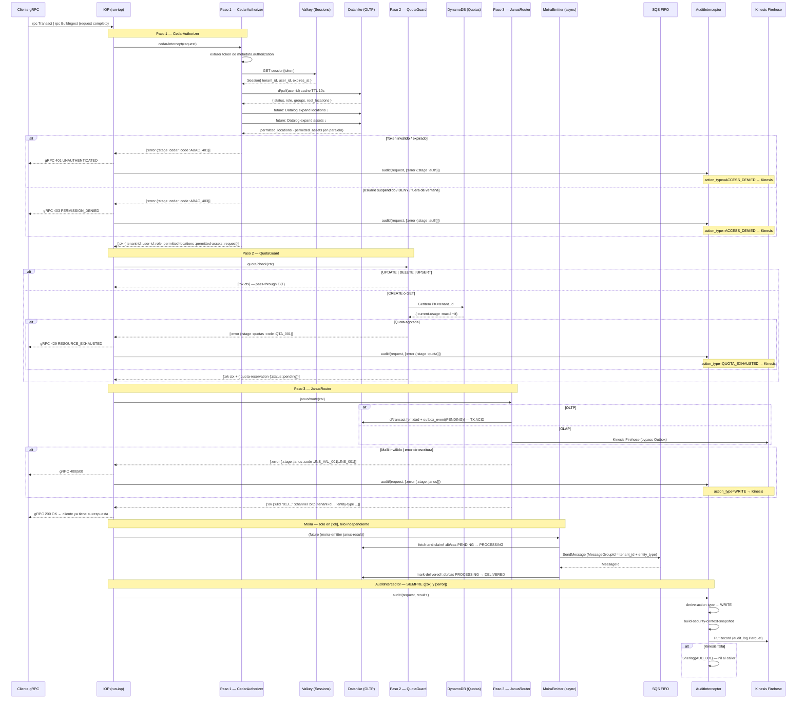

# Fase 03A: Ingestion Orchestration Pipeline (IOP)

**Nombre del Manifiesto:** `Ingestion Orchestration Pipeline (IOP)`
**Tipo:** Coordinador de Pipeline — Núcleo del Metri Engine
**Fase contenedora:** [03_FASE_INGESTION.md](03_FASE_INGESTION.md)

---

## MÓDULO 0: Definición y Objetivo

### Definición

El IOP es el **algoritmo raíz de nivel superior** que gobierna el ciclo de vida completo de cada solicitud de escritura en Metri Engine.

**No conoce dominios de negocio.** Su única responsabilidad es **coordinar una secuencia de componentes desacoplados** en orden estricto, encadenar sus salidas y propagar el resultado al caller.

El IOP actúa como un **coordinador funcional puro**:

- Invoca cada componente respetando su propio contrato.
- Encadena las salidas como entradas del siguiente paso.
- Cortocircuita al primer error tipado `[:error …]`.
- Ningún paso puede saltarse ni reordenarse.
- Cada componente es dueño de sus propias entradas, salidas y lógica interna.

### Objetivo

```
Cliente gRPC
    │
    ▼
IOP (run-iop)
    ├─ Paso 1: CedarAuthorizer   ← autorización Zero-Trust
    ├─ Paso 2: QuotaGuard        ← control de recursos por tenant
    ├─ Paso 3: JanusRouter       ← validación de payload + ruteo a canal de escritura
    │
    ├─ gRPC 200 OK al cliente    ← respuesta inmediata tras Janus
    │
    ├─ (async) MoiraEmitter      ← cierre EDA fuera del hilo de respuesta
    └─ (async) AuditInterceptor  ← registro OLAP de auditoría — fire-and-forget
```

> [!IMPORTANT]
> **Orden de ejecución estricto e inmutable:**
>
> 1. `CedarAuthorizer` — interceptor de autorización. Único con acceso al token opaco.
> 2. `QuotaGuard` — verifica headroom. Consume `:tenant-id` ya resuelto por Cedar.
> 3. `JanusRouter` — valida el payload contra el Códice (Malli entity schema), inyecta `tenant_id` y ruta al canal de escritura (`IJanusWriteChannel`).
> 4. **gRPC Response** — respuesta inmediata al cliente.
> 5. `MoiraEmitter` + `AuditInterceptor` — fuera del hilo de respuesta, fire-and-forget. El orden entre ellos no importa — son independientes.
>
> Ningún paso puede operarse en otro orden. `QuotaGuard` sin `:tenant-id` no tiene sentido. `JanusRouter` sin autorización previa viola Zero-Trust.
> **`AuditInterceptor` captura TODOS los eventos** — incluyendo `[:error]` de Cedar/Quota/Janus — y es el único productor del `audit_log` OLAP.

---

## MÓDULO I: Motor del Pipeline — Railway-Oriented Programming

### Principio de diseño

El IOP implementa **Railway-Oriented Programming (ROP)**: cada componente opera en el carril `:ok` o en el carril `:error`. Un error descarrila el tren — ningún paso posterior se ejecuta.

```
Carril :ok   →  [Cedar] ──► [QuotaGuard] ──► [Janus] ──► gRPC 200
                                                            │
                                                            └─► (async) Moira

Carril :error →  [Cedar-DENY] ──► cortocircuita ──► gRPC 401|403
               →  [Quota-FAIL] ──► cortocircuita ──► gRPC 429
               →  [Janus-FAIL] ──► cortocircuita ──► gRPC 400|500
```

### `pipeline/chain` y `pipeline/run`

```clojure
(ns metri.pipeline)

(defn chain
  "Aplica step-fn al valor unwrapped de un [:ok v].
   Si el result es [:error ...] lo propaga sin invocar step-fn.
   Implementa el carril :ok / :error sin try/catch ni if-let."
  [result step-fn]
  (case (first result)
    :ok    (step-fn (second result))
    :error result))

(defn run
  "Reduce una secuencia de fns [ctx → Result] sobre un ctx inicial.
   Cortocircuita en el primer [:error ...].
   Cada step recibe el valor unwrapped del [:ok prev-ctx]."
  [init-ctx steps]
  (reduce chain [:ok init-ctx] steps))
```

> [!NOTE]
> `pipeline/chain` es la única implementación del cortocircuito en todo el sistema. Sin `try/catch`, sin excepciones como control de flujo. Los componentes lanzan `ExceptionInfo` solo para sus errores internos — al salir al IOP siempre retornan `[:ok ...]` o `[:error ...]`.

### Principios SOLID

| Principio   | Aplicación en el IOP                                                                                                                                                                                                                  |
| :---------- | :------------------------------------------------------------------------------------------------------------------------------------------------------------------------------------------------------------------------------------ |
| **S** — SRP | `CedarAuthorizer` = identidad + ABAC. `QuotaGuard` = headroom. `JanusRouter` = validar payload (Códice) + rutear canal. `AuditInterceptor` = serializar y enrutar el `audit_log`. `IOP` = coordinar. Nadie conoce la lógica del otro. |
| **O** — OCP | Añadir `DlpScanner` = declarar `#ig/ref :iop/dlp-scanner` en `system.edn`. Cero modificaciones a `run-iop` ni a ningún paso existente.                                                                                                |
| **L** — LSP | En tests, cualquier paso se reemplaza por un stub `[:ok ctx']` sin afectar el pipeline ni los demás pasos. `NoOpAuditInterceptor` satisface el mismo contrato que `AuditInterceptorImpl`.                                             |
| **I** — ISP | Cada componente expone solo la función que el IOP invoca. `IAuditInterceptor` expone solo `audit!` — sin herencia de `IFaultNotifier` ni `IJanusWriteChannel`.                                                                        |
| **D** — DIP | El IOP recibe todos los componentes como dependencias inyectadas por Integrant — nunca los instancia directamente. `AuditInterceptorImpl` recibe `olap-channel` inyectado.                                                            |

---

## MÓDULO II: Composición — Integrant y `system.edn`

### Configuración declarativa

```clojure
;; config/system.edn — componentes del IOP
{
 ;; ── Infraestructura ────────────────────────────────────────────────────────
 :infra/valkey        {:host #env "VALKEY_HOST" :port 6379
                       :password #env "VALKEY_PASSWORD"}
 :infra/datahike      {:store {:backend :cloud
                               :region  #env "AWS_REGION"
                               :table   #env "DATAHIKE_TABLE"}}
 :infra/dynamodb      {:region #env "AWS_REGION"}
 :infra/cedar-engine  {:policies-table #env "CEDAR_POLICIES_TABLE"}
 :infra/kinesis       {:stream-prefix  #env "KINESIS_STREAM_PREFIX"}
 :infra/eventbridge   {:event-bus-name #env "EVENT_BUS_NAME"  ;; Sherlog emit-fault-event!
                       :region         #env "AWS_REGION"}

 ;; D7 Pool Model: tenant-guard asegura que toda op Datahike lleva :tenant/id
 :infra/tenant-guard  {:datahike-conn  #ig/ref :infra/datahike}

 ;; ── Paso 1: CedarAuthorizer ────────────────────────────────────────────────
 ;; El interceptor extrae el token internamente — el IOP pasa el request completo.
 :cedar/cache          {:strategy :ttl :ttl-ms 10000 :max-size 50000}
 :iop/cedar-authorizer {:valkey-store  #ig/ref :infra/valkey
                         :datahike-conn #ig/ref :infra/datahike
                         :cache         #ig/ref :cedar/cache
                         :cedar-engine  #ig/ref :infra/cedar-engine}

 ;; ── Paso 2: QuotaGuard ─────────────────────────────────────────────────────
 :iop/quota-guard      {:dynamodb #ig/ref :infra/dynamodb}

 ;; ── Paso 3: JanusRouter + canales ──────────────────────────────────────────
 ;; NOTA: wiring completo de oltp-channel está en 03B_FASE_JANUS_ROUTER.md
 ;; Aquí se muestra la vista IOP — las deps completas de Janus (D7) están en 03B
 :janus/oltp-channel   {:datahike-conn  #ig/ref :infra/datahike
                         :tenant-guard   #ig/ref :infra/tenant-guard}  ;; D7 Pool Model
 :janus/olap-channel   {:kinesis        #ig/ref :infra/kinesis}
 :iop/janus-router     {:channel-registry #ig/ref :janus/channel-registry
                         :codice-registry  #ig/ref :codice/registry
                         ;; D6 FASE 10: Janus necesita Sherlog para errores Códice WARNING+
                         :sherlog-notifiers #ig/ref :iop/sherlog-notifier
                         :olap-channel      #ig/ref :janus/olap-channel}

 ;; ── Moira (async — fuera de :steps, solo en [:ok]) ─────────────────────────
 ;; :moira/emitter NO está en :steps — fire-and-forget post-Janus.
 :moira/sqs-bus        {:queue-url #env "OUTBOX_QUEUE_URL" :region #env "AWS_REGION"}
 :moira/emitter        {:datahike-conn #ig/ref :infra/datahike
                         :sqs-bus       #ig/ref :moira/sqs-bus}

 ;; ── Sherlog (IFaultNotifier — EventBridge + OLAPChannel) ────────────────────
 ;; emit-fault-event! → EventBridge  |  record-fault! → :janus/olap-channel
 :iop/sherlog-notifier {:eventbridge   #ig/ref :infra/eventbridge
                         :olap-channel  #ig/ref :janus/olap-channel}   ;; IFaultNotifier
 :util/ulid-fn         {}                                              ;; fn: () → ulid

 ;; ── AuditInterceptor (fuera de :steps — SIEMPRE, [:ok] y [:error]) ─────────
 ;; Comparte :janus/olap-channel — un solo stream Kinesis para todo el OLAP.
 :audit/interceptor    {:olap-channel   #ig/ref :janus/olap-channel
                         :ulid-fn        #ig/ref :util/ulid-fn
                         :fault-notifier #ig/ref :iop/sherlog-notifier}

 ;; ── Pipeline principal ──────────────────────────────────────────────────────
 :iop/pipeline         {:steps              [#ig/ref :iop/cedar-authorizer  ;; Paso 1
                                             #ig/ref :iop/quota-guard        ;; Paso 2
                                             #ig/ref :iop/janus-router]      ;; Paso 3
                          :moira-emitter     #ig/ref :moira/emitter
                          :audit-interceptor #ig/ref :audit/interceptor}}    ;; ← inyectado
```

### Materialización del pipeline — `run-iop`

```clojure
(ns metri.iop
  (:require [integrant.core :as ig]
            [metri.pipeline :as pipeline]
            [metri.domain.audit.protocol :refer [audit!]]))

;; ── Orquestador principal ─────────────────────────────────────────────────
(defmethod ig/init-key :iop/pipeline [_ {:keys [steps moira-emitter audit-interceptor]}]
  (fn run-iop [request]
    (let [start-ms (System/currentTimeMillis)
          result   (pipeline/run request steps)
          result+  (cond-> result
                     (= :ok (first result))
                     (update 1 assoc :execution-time-ms
                             (- (System/currentTimeMillis) start-ms)))]

      ;; Moira: fire-and-forget — solo en [:ok], fuera del hilo de respuesta gRPC.
      (when (= :ok (first result+))
        (future (moira-emitter (second result+))))

      ;; AuditInterceptor: SIEMPRE — [:ok] y [:error].
      ;; Recibe result+ con :execution-time-ms ya calculado.
      ;; Nunca altera result+ ni bloquea la respuesta al caller.
      (audit! audit-interceptor request result+)

      result+)))  ;; respuesta inmediata al caller

;; ── Paso 1: CedarAuthorizer ─────────────────────────────────────────────────
;; El IOP pasa el request completo — NO extrae el token.
;; Extraer el token del header es responsabilidad exclusiva del interceptor.
(defmethod ig/init-key :iop/cedar-authorizer
  [_ {:keys [valkey-store datahike-conn cache cedar-engine]}]
  (fn [request]
    (cedar/intercept request
      {:valkey-store  valkey-store
       :db            @datahike-conn  ;; deref por request = point-in-time snapshot
       :cache         cache
       :cedar-engine  cedar-engine})))
;;  Entrada: request gRPC completo (header Authorization intacto)
;;  Salida:  [:ok  {:tenant-id :user-id :role :permitted-locations :permitted-assets :request}]
;;         | [:error {:stage :cedar :code :ABAC_401 :detail "..."}]  ;; token
;;         | [:error {:stage :cedar :code :ABAC_403 :detail "..."}]  ;; policy

;; ── Paso 2: QuotaGuard ──────────────────────────────────────────────────────
(defmethod ig/init-key :iop/quota-guard [_ deps]
  (fn [ctx]
    (quota/check ctx deps)))
;;  Entrada: salida de CedarAuthorizer (ctx con :tenant-id ya resuelto)
;;  Salida:  [:ok  ctx + {:quota-reservation {:id ... :debit 1 :status :pending}}]
;;         | [:error {:stage :quotas :code :QTA_001 :detail "Quota exhausted"}]

;; ── Paso 3: JanusRouter ─────────────────────────────────────────────────────
(defmethod ig/init-key :iop/janus-router [_ deps]
  (fn [ctx]
    (janus/route ctx deps)))
;;  Entrada: salida de QuotaGuard (ctx completo)
;;  Salida:  [:ok  {:ulid "01J..." :channel :oltp|:olap :tenant-id ... :entity-type ...}]
;;         | [:error {:stage :janus :code :JNS_VAL_001|:JNS_001 :detail "..."}]

;; ── Moira: EventEmitter (async — no en :steps) ──────────────────────────────
(defmethod ig/init-key :moira/emitter [_ {:keys [datahike-conn sqs-bus]}]
  (fn [janus-result]
    (moira.emitter/emit janus-result {:datahike-conn datahike-conn
                                       :sqs-bus       sqs-bus})))
```

> [!TIP]
> Añadir un paso nuevo (ej. `DlpScanner`):
>
> 1. `(defmethod ig/init-key :iop/dlp-scanner ...)` con su contrato
> 2. `#ig/ref :iop/dlp-scanner` al vector `:steps` en la posición correcta
> 3. **Cero modificaciones** a `run-iop`, `pipeline/chain` ni a ningún paso existente.

---

## MÓDULO III: Descripción de Pasos

### Paso 1 — `CedarAuthorizer` (Interceptor Zero-Trust)

**Componente:** `cedar-authorizer/intercept`
**Especificación canónica:** [06_FASE_CEDAR_AUTHORIZER.md](06_FASE_CEDAR_AUTHORIZER.md)
**Rol:** Frontera entre el transporte gRPC y el dominio de autorización. Caja negra para el IOP.

> [!IMPORTANT]
> **El IOP pasa el `request` completo — NO extrae el token, ni `entity-type`, ni `operation`.**
> Cada componente lee del mismo request lo que necesita para su responsabilidad propia:
>
> - **CedarAuthorizer** lee: `metadata.authorization` (token) + `entity-type` (resource.domain) + `operation` (Cedar Action)
> - **QuotaGuard** lee: `entity-type` (resource_domain) + `operation` (mapping → limit_type)
> - **Janus** lee: `entity-type` (`codice/load-schema entity-type ctx` → Railway `[:ok schema]`) + `body` (payload)
>   El request viaja intacto — nadie lo modifica.

**Internamente (transparente para el IOP):**

```
Paso 1:  extrae token de metadata.authorization → Valkey → Session{tenant_id, user_id}
Paso 2:  OLTP pull Datahike (user/role/groups) con cache TTL 10s
Paso 3:  consolida raíces + 2 expansiones Datalog en PARALELO (futures)
Paso 3b: valida ventana temporal (función pura)
Paso 4:  extrae action  ← request.operation   (CREATE|GET|UPDATE|DELETE|UPSERT)
         extrae domain  ← request.entity-type ("asset"|"location"|...)
         Cedar ABAC: is-authorized(principal, action, resource{domain}) → ALLOW|DENY
```

**Contrato de salida (todo lo que el IOP necesita saber):**

```clojure
;; [:ok] — ALLOW
{:tenant-id           "tnt_01J..."    ;; resuelto desde Valkey
 :user-id             "usr_01J..."    ;; resuelto desde Valkey
 :role                {:role/id ... :role/grants [...]}    ;; desde Datahike
 :permitted-locations [id...]         ;; techo ∪ descendientes — disponibles en ctx para validación de escritura
 :permitted-assets    [id...]         ;; techo ∪ descendientes — disponibles en ctx para validación de escritura
 :request             <grpc-request-original-intacto>}     ;; nunca modificado

;; [:error] — token inválido o ausente (FASE 10 I.1 — Rich Context DTO)
;; errors/error construye el mapa con :retryable?, :severity del catálogo
;; :trace-id se obtiene del OTel span activo — no se pasa en ctx sino via otel/trace-id
[:error {:stage    :cedar
         :code     :ABAC_401
         :detail   "Invalid or expired token"
         :tenant-id nil           ;; aún no resuelto en ABAC_401
         :trace-id "<otel-trace-id>"}]  ;; otel/trace-id del span ROOT activo

;; [:error] — DENY: usuario suspendido / policy / fuera de ventana temporal
[:error {:stage    :cedar
         :code     :ABAC_403
         :detail   "Access denied — suspended/policy/window"
         :tenant-id "tnt_01J..."  ;; resuelto antes del policy check
         :user-id   "usr_01J..."
         :trace-id  "<otel-trace-id>"}]
```

> [!NOTE]
> `CedarAuthorizer` no valida el payload de negocio, no ruta el canal ni produce ULID.
> Entrega el `:request` original **sin modificar** — la validación del payload (entity schema) y el ruteo al canal son responsabilidad exclusiva de Janus.

---

### Paso 2 — `QuotaGuard` (Control de Recursos del Tenant)

**Componente:** `quota-guard/check`
**Especificación canónica:** [07_FASE_QUOTA_GUARD.md](07_FASE_QUOTA_GUARD.md)
**Rol:** Verifica headroom del tenant antes de escribir. Débito optimista con confirmación post-escritura.

```clojure
;; Entrada: salida de CedarAuthorizer
{:tenant-id           "tnt_01J..."    ;; QuotaGuard no conoce el token
 :user-id             "usr_01J..."
 :role                {:role/id ...}
 :permitted-locations [id...]
 :permitted-assets    [id...]
 :request             <grpc-request>}

;; [:ok] — headroom disponible
;; ctx anterior + reserva optimista
{:quota-reservation {:id "rsv_01J..." :debit 1 :status :pending}}

;; [:error] — quota agotada (FASE 10 I.1 — Rich Context DTO)
[:error {:stage    :quotas
         :code     :QTA_001
         :detail   "Quota exhausted for tenant"
         :tenant-id "tnt_01J..."  ;; resuelto por Cedar upstream
         :user-id   "usr_01J..."
         :trace-id  "<otel-trace-id>"}]
```

> [!NOTE]
> `QuotaGuard` **no lee el token opaco** ni conoce el payload de negocio ni el canal de escritura.
> Solo lee DynamoDB con el `:tenant-id` resuelto. Extrae `operation` y `entity-type` del request para el lookup.
> **Operaciones monitoreadas:** solo `CREATE` (→ `WRITE_COUNT`) y `GET` (→ `READ_COUNT`).
> `UPDATE`, `DELETE`, `UPSERT` — pass-through O(1) sin llamada a DynamoDB.
> La confirmación del débito ocurre dentro del canal de Janus al finalizar la escritura.

---

### Paso 3 — `JanusRouter` (Validación de Payload + Ruteo de Escritura)

**Componente:** `janus/route`
**Especificación canónica:** [03B_FASE_JANUS_ROUTER.md](03B_FASE_JANUS_ROUTER.md)
**Rol:** Valida el payload de ingesta contra el Códice y ruta al canal correcto. Caja negra para el IOP.

> [!IMPORTANT]
> **Janus NO procesa AST, no aplica RLS, no hace Shield pruning.**
> El AST (`filter-node`, RLS injection, Shield) es vocabulario del **path de consulta (Aegis)**.
> En ingesta, el payload es un `google.protobuf.Struct` de valores de entidad — no un árbol de consulta.
> La seguridad de escritura ya está garantizada upstream por `CedarAuthorizer` (ABAC) y el `tenant_id` viene del ctx — nunca del cliente.

```clojure
;; Entrada: salida de QuotaGuard (ctx completo)

;; Internamente Janus ejecuta (caja negra para el IOP):
;;   1. codice/load-schema(entity-type, ctx)              → [:ok schema] | [:error {:code :COD_001}] (D1)
;;   2. codice/validate-payload(schema, payload, et, ctx) → [:ok payload] | [:error {:code :COD_VAL_001}] (D2)
;;   3. inject tenant_id desde ctx                        → nunca del request del cliente
;;   4. codice/entity-engine(entity-type, ctx)            → [:ok :oltp|:olap] | [:error] (D1)
;;   5. (route IJanusWriteChannel ctx)                    → OLTPChannel | OLAPChannel
;;
;;   FASE 10: si Códice retorna [:error] con severity >= :warning,
;;   Janus DEBE invocar sherlog/handle-fault! antes de retornar (D6)

;; [:ok] — escritura exitosa
[:ok {:ulid "01J..." :channel :oltp|:olap
      :tenant-id "..." :entity-type "..."}]

;; [:error] — payload inválido | sin canal registrado | error de escritura (FASE 10 I.1)
;; errors/error construye el mapa — :retryable? y :severity vienen del catálogo
[:error {:stage    :janus
         :code     :JNS_VAL_001
         :detail   "Malli entity schema violation"
         :tenant-id "tnt_01J..."
         :user-id   "usr_01J..."
         :trace-id  "<otel-trace-id>"}]
[:error {:stage :janus :code :JNS_001      :detail "No channel for engine" ...}]
[:error {:stage :janus :code :JNS_OLTP_001 :detail "Write error" ...}]
```

> [!NOTE]
> El `engine` es leído del **Códice (Fase 02)** — no del request del cliente.
> El `tenant_id` es inyectado desde el ctx resuelto por Cedar — el cliente nunca puede auto-asignarse un tenant.

Tras `[:ok …]` de Janus, el IOP:

1. **Retorna `:ok` al caller** — gRPC 200 inmediato.
2. **Dispara Moira** con `future` — fuera del hilo de respuesta.

---

### Paso 4 — `MoiraEventEmitter` (Cierre EDA — Asíncrono)

**Componente:** `:moira/emitter`
**Especificación canónica:** [04_FASE_MOIRA.md](04_FASE_MOIRA.md)
**Rol:** Cierra el ciclo EDA fuera del hilo de respuesta. Nunca bloquea al cliente.

> [!IMPORTANT]
> **Moira NO está en `:steps` del pipeline.**
> Si estuviera, el IOP esperaría a que SQS confirme antes de devolver `200 OK`.
> A 3,000 req/s eso es inaceptable. Moira opera en un hilo separado del ForkJoinPool — completamente independiente del ciclo gRPC.

```
IOP: pipeline/run → [:ok janus-result]
       │
       ├─► gRPC 200 OK al cliente   ← respuesta inmediata
       │
       └─► (future (moira-emitter janus-result))   ← hilo independiente
             ├─ fetch-and-claim!  (Outbox PENDING → PROCESSING, :db/cas atómico)
             ├─ ISQSBus.publish   (MessageGroupId = tenant_id + entity_type)
             └─ mark-delivered!   (PROCESSING → DELIVERED)
                 └─ si falla: mark-failed! + backoff exponencial
```

| Paso interno | Operación                                                          | Garantía                                                                        |
| :----------- | :----------------------------------------------------------------- | :------------------------------------------------------------------------------ |
| 1            | `fetch-and-claim!` — `:db/cas` PENDING → PROCESSING + `claimed_at` | Una sola réplica reclama el evento — cero doble-despacho                        |
| 2            | Filtro backoff — `retry_at ≤ now` (Datalog)                        | Eventos en cooldown son invisibles hasta que su ventana expire                  |
| 3            | `ISQSBus.publish` — `MessageGroupId = tenant_id + entity_type`     | N streams paralelos por tenant — sin bottleneck de alto volumen                 |
| 4            | `mark-delivered!` — `:db/cas` PROCESSING → DELIVERED               | Idempotente — si falla, el evento queda en PROCESSING para recuperación externa |
| 5            | `mark-failed!` — backoff `2^retry × 30s`, tope 30min               | El SQS tiene tiempo de recuperarse sin ser bombardeado                          |

**Backoff exponencial:**

```
Fallo 1 → retry_at = now + 30s
Fallo 2 → retry_at = now + 60s
Fallo 3 → retry_at = now + 2min
Fallo 4 → retry_at = now + 4min
Fallo 5 → retry_at = now + 8min
Fallo 6+ → retry_at = now + 30min (tope)
Max retries → status FAILED → OTEL alert + dead-letter manual
```

> [!NOTE]
> Si la JVM muere entre `fetch-and-claim!` y `mark-delivered!`, el evento queda en `PROCESSING`. La recuperación de estos eventos es responsabilidad de un componente externo — ver [COMPONENTE_EXTERNO_01_EVENT_ROUTER.md](COMPONENTE_EXTERNO_01_EVENT_ROUTER.md).

---

## MÓDULO IV: Flujo de Datos

```
request (gRPC crudo — nunca modificado por el IOP)
  │
  ├─► [Paso 1] cedar/intercept(request)
  │          El interceptor extrae el token internamente.
  │          El IOP no toca metadata.authorization.
  │          → [:ok { :tenant-id   "tnt_01J..."
  │                   :user-id     "usr_01J..."
  │                   :role        {:role/id ... :role/grants [...]}
  │                   :permitted-locations [id...]   ← techo ∪ descendientes
  │                   :permitted-assets    [id...]   ← techo ∪ descendientes
  │                   :request     <original-intacto> }]
  │          → [:error {:stage :cedar :code :ABAC_401}]  ;; token inválido
  │          → [:error {:stage :cedar :code :ABAC_403}]  ;; DENY / suspendido
  │
  ├─► [Paso 2] quota/check(ctx)
  │          Lee desde request: operation → limit_type mapping
  │                             entity-type → resource_domain
  │          CREATE  → WRITE_COUNT → verifica headroom en DY
  │          GET     → READ_COUNT  → verifica headroom en DY
  │          UPDATE|DELETE|UPSERT → pass-through O(1) sin DY
  │          → [:ok ctx + {:quota-reservation {:id "rsv_01J..." :status :pending}}]
  │          → [:error {:stage :quotas :code :QTA_001}]  ;; CREATE/GET agotado
  │          → [:error {:stage :quotas :code :QTA_002}]  ;; quota no configurada
  │
  ├─► [Paso 3] janus/route(ctx)
  │          Internamente: codice/load-schema(et, ctx) → [:ok schema] (D1)
  │                        codice/validate-payload(schema, payload, et, ctx) → [:ok] (D2)
  │                        codice/entity-engine(et, ctx) → [:ok :oltp|:olap] (D1)
  │                        inject tenant_id · IJanusWriteChannel.route
  │          FASE 10 D6: si Códice retorna [:error] WARNING+ → sherlog/handle-fault!
  │          → [:ok {:ulid "01J..." :channel :oltp|:olap}]
  │          → [:error {:stage :janus :code :JNS_VAL_001|:JNS_001|:JNS_OLTP_001}]
  │
  ├─► gRPC response al cliente
  │     [:ok  ...]          → gRPC 200 OK
  │     [:error :ABAC_401]  → gRPC 401 UNAUTHENTICATED
  │     [:error :ABAC_403]  → gRPC 403 PERMISSION_DENIED
  │     [:error :QTA_001]   → gRPC 429 RESOURCE_EXHAUSTED
  │     [:error :JNS_VAL_001] → gRPC 400 INVALID_ARGUMENT
  │     [:error :JNS_001]   → gRPC 500 INTERNAL
  │
  └─► (future) moira-emitter(janus-result)   ← async, post-gRPC-200
        Outbox PENDING → PROCESSING → SQS → DELIVERED
```

> [!NOTE]
> El token opaco es leído **una única vez** — internamente por `CedarAuthorizer`. El IOP nunca lo toca.
> El `tenant_id` en el payload lo inyecta Janus desde el ctx — el cliente nunca puede falsificarlo.

---

## MÓDULO V: Diagrama de Secuencia



---

## MÓDULO VI: Observabilidad OTEL

| Span                        | Cuándo                     | Atributos clave                                                                          |
| :-------------------------- | :------------------------- | :--------------------------------------------------------------------------------------- |
| `iop.pipeline.start`        | Inicio de `run-iop`        | `tenant_id` (aún no resuelto), `request_id`                                              |
| `iop.step1.cedar.start`     | Antes de `cedar/intercept` | —                                                                                        |
| `iop.step1.cedar.allow`     | Cedar retorna `:ok`        | `tenant_id`, `user_id`, latencia ms                                                      |
| `iop.step1.cedar.deny_401`  | Token inválido/expirado    | `reason`                                                                                 |
| `iop.step1.cedar.deny_403`  | DENY / suspendido / tiempo | `user_id`, `reason`                                                                      |
| `iop.step2.quota.ok`        | Headroom disponible        | `tenant_id`, `debit`, `remaining`                                                        |
| `iop.step2.quota.exhausted` | Quota agotada              | `tenant_id`, `current_usage`, `max_limit`                                                |
| `iop.step3.janus.ok`        | Escritura exitosa          | `ulid`, `channel`, `entity_type`                                                         |
| `iop.step3.janus.error`     | Fallo de escritura         | `code`, `detail`                                                                         |
| `iop.pipeline.latency_ms`   | Siempre                    | P50, P95, P99 del pipeline síncrono                                                      |
| `iop.moira.dispatched`      | `future` lanzado           | `ulid`, `entity_type`, `tenant_id`                                                       |
| `iop.moira.delivered`       | Moira completa             | `ulid`, latencia SQS ms                                                                  |
| `iop.moira.failed`          | Moira falla                | `retry_count`, `next_retry_at`                                                           |
| `audit.interceptor`         | Siempre — post-gRPC        | `audit.action_type`, `audit.tenant_id`, `audit.resource_domain`, `audit.has_resource_id` |

**Mapeo de errores a gRPC:**

| `[:error :code]` | gRPC Status                                        | HTTP equiv. |
| :--------------- | :------------------------------------------------- | :---------- |
| `:ABAC_401`      | `UNAUTHENTICATED`                                  | 401         |
| `:ABAC_403`      | `PERMISSION_DENIED`                                | 403         |
| `:QTA_001`       | `RESOURCE_EXHAUSTED`                               | 429         |
| `:COD_001`       | `NOT_FOUND` — entity-type no existe en Códice (D1) | 404         |
| `:COD_VAL_001`   | `INVALID_ARGUMENT` — Malli entity validation (D2)  | 400         |
| `:JNS_VAL_001`   | `INVALID_ARGUMENT` — Malli entity schema violation | 400         |
| `:JNS_001`       | `INTERNAL`                                         | 500         |
| `:SCH_001`       | `NOT_FOUND`                                        | 404         |

---

## MÓDULO VII: Blueprint de Implementación

> [!IMPORTANT]
> Diseño de implementación — estructura de archivos, namespaces y TDD.
> No es código en producción. Es la especificación que guiará el desarrollo.

### Estructura de Archivos

```
src/metri/
  iop/
    core.clj           ← run-iop + ig/init-key :iop/pipeline (incluye audit!)
    pipeline.clj       ← chain + run (Railway ROP engine)
    error_response.clj ← [NEW] build-error-dto — ÚNICO productor del DTO forense
                           Propietario: IOP. Responsabilidad: construir el Rich Context DTO
                           (sanitize-context, :retryable? del catálogo, trace-id del span OTel)
                           que sherlog/handle-fault! consume. Nunca llamado desde el gRPC transport.
    steps/
      cedar.clj        ← ig/init-key :iop/cedar-authorizer (wrapper)
      quota.clj        ← ig/init-key :iop/quota-guard (wrapper)
      janus.clj        ← ig/init-key :iop/janus-router (wrapper)
      moira.clj        ← ig/init-key :moira/emitter (wrapper)

  domain/audit/
    protocol.clj       ← IAuditInterceptor (defprotocol) — importado en iop/core.clj
    action_type.clj    ← derive-action-type (fn pura)

  infrastructure/audit/
    interceptor.clj    ← AuditInterceptorImpl + ig/init-key :audit/interceptor
    security_snapshot.clj ← build-security-context-snapshot
    stubs.clj          ← NoOpAuditInterceptor, SpyAuditInterceptor

config/
  system.edn           ← fuente de verdad — incluye :audit/interceptor wiring
  system.dev.edn       ← overrides dev: NoOpAuditInterceptor en lugar de AuditInterceptorImpl

resources/
  bootstrap/
    audit_attrs.edn    ← atributos :audit/* para Datahike (nuevo — bootstrap paso [1.5])
  errors/
    error_catalog.edn  ← añadir AUD_001, AUD_002

test/metri/iop/
  pipeline_test.clj    ← tests del motor pipeline/chain + run
  iop_core_test.clj    ← tests de integración del pipeline completo (con stubs)
  steps/
    cedar_stub.clj     ← stub de CedarAuthorizer
    quota_stub.clj     ← stub de QuotaGuard
    janus_stub.clj     ← stub de JanusRouter
    moira_stub.clj     ← stub de MoiraEmitter

test/metri/application/audit/
  fixtures.clj         ← SpyOLAPChannel, datos canónicos
  interceptor_test.clj ← contrato IAuditInterceptor (10 tests — ver 09_FASE_AUDITORIA.md)
  action_type_test.clj ← derive-action-type (10 tests)
  snapshot_test.clj    ← build-security-context-snapshot (8 tests)
  integration_test.clj ← audit_log record end-to-end (14 tests)
```

### Variables de entorno requeridas

| Variable                | Paso que la usa                        | Descripción                           |
| :---------------------- | :------------------------------------- | :------------------------------------ |
| `VALKEY_HOST`           | Paso 1 — Cedar                         | Host Valkey/Redis                     |
| `VALKEY_PASSWORD`       | Paso 1 — Cedar                         | Password Valkey                       |
| `CEDAR_POLICIES_TABLE`  | Paso 1 — Cedar                         | DynamoDB table de PolicySets          |
| `DATAHIKE_STORE_URI`    | Paso 1, 3 — Cedar + Janus              | URI de la store Datahike              |
| `AWS_REGION`            | Paso 2, Moira                          | Región AWS (DynamoDB + SQS)           |
| `OUTBOX_QUEUE_URL`      | Moira                                  | URL de la cola SQS FIFO del Outbox    |
| `KINESIS_STREAM_PREFIX` | Paso 3 — Janus OLAP + AuditInterceptor | Prefijo del stream Kinesis compartido |

### Matriz TDD

**Motor del Pipeline (`pipeline_test.clj`)**

| Test                         | Escenario               | Resultado esperado                       |
| :--------------------------- | :---------------------- | :--------------------------------------- |
| `chain-ok-propagates`        | `[:ok v]` + step-fn     | Aplica step-fn al valor `v`              |
| `chain-error-short-circuits` | `[:error e]` + step-fn  | Retorna `[:error e]` sin invocar step-fn |
| `run-all-ok`                 | 3 steps todos `:ok`     | Retorna `[:ok final-ctx]`                |
| `run-short-circuit-step1`    | Step 1 retorna `:error` | Steps 2 y 3 nunca se invocan             |
| `run-short-circuit-step2`    | Step 2 retorna `:error` | Step 3 nunca se invoca                   |
| `run-short-circuit-step3`    | Step 3 retorna `:error` | Se propaga `:error` de Janus             |
| `run-empty-steps`            | `steps = []`            | Retorna `[:ok init-ctx]` intacto         |

**Pipeline completo (`iop_core_test.clj`) — con stubs**

| Test                                  | Escenario                                | Resultado esperado                                                        |
| :------------------------------------ | :--------------------------------------- | :------------------------------------------------------------------------ |
| `cedar-deny-401-blocks-pipeline`      | Cedar → `:ABAC_401`                      | `[:error {:stage :cedar :code :ABAC_401}]` — quota y janus nunca invocan  |
| `cedar-deny-403-blocks-pipeline`      | Cedar → `:ABAC_403`                      | `[:error {:stage :cedar :code :ABAC_403}]` — quota y janus nunca invocan  |
| `cedar-extracts-action-from-op`       | request.operation = :create              | Cedar mapea a `Action::"CREATE"` internamente                             |
| `cedar-extracts-domain-from-entity`   | request.entity-type = "asset"            | Cedar construye `resource{:domain "asset"}`                               |
| `quota-passthrough-update`            | operation = :update                      | QuotaGuard retorna `[:ok ctx]` sin llamar DY                              |
| `quota-passthrough-delete`            | operation = :delete                      | QuotaGuard retorna `[:ok ctx]` sin llamar DY                              |
| `quota-check-create`                  | operation = :create                      | QuotaGuard consulta DY con WRITE_COUNT                                    |
| `quota-check-get`                     | operation = :get                         | QuotaGuard consulta DY con READ_COUNT                                     |
| `quota-deny-blocks-pipeline`          | Cedar `:ok` → Quota `:QTA_001`           | `[:error {:stage :quotas}]` — janus nunca invoca                          |
| `janus-val-error-blocks-pipeline`     | Cedar/Quota `:ok` → Janus `:JNS_VAL_001` | `[:error {:stage :janus :code :JNS_VAL_001}]`                             |
| `janus-channel-error-blocks-pipeline` | Cedar/Quota `:ok` → Janus `:JNS_001`     | `[:error {:stage :janus :code :JNS_001}]`                                 |
| `happy-path-returns-ok`               | Todo `:ok`                               | `[:ok {:ulid ... :channel :oltp}]`                                        |
| `moira-dispatched-on-ok`              | Happy path                               | Moira invocada con `future` una sola vez                                  |
| `moira-not-dispatched-on-error`       | Cualquier error                          | Moira nunca invocada                                                      |
| `moira-failure-transparent`           | Moira falla en el `future`               | El `[:ok ...]` al cliente no se afecta                                    |
| `request-not-modified-by-iop`         | Happy path                               | `:request` en `cedar-ctx` es idéntico al original                         |
| `token-not-touched-by-iop`            | Cualquier flujo                          | `metadata.authorization` no es leído por el IOP                           |
| `audit-invoked-on-ok`                 | Happy path                               | `SpyAuditInterceptor` captura 1 llamada con `action_type=WRITE`           |
| `audit-invoked-on-cedar-deny`         | Cedar → `:ABAC_401`                      | `SpyAuditInterceptor` captura 1 llamada con `action_type=ACCESS_DENIED`   |
| `audit-invoked-on-quota-deny`         | Quota → `:QTA_001`                       | `SpyAuditInterceptor` captura 1 llamada con `action_type=QUOTA_EXHAUSTED` |
| `audit-invoked-on-janus-error`        | Janus → `:JNS_VAL_001`                   | `SpyAuditInterceptor` captura 1 llamada con `action_type=WRITE`           |
| `audit-never-blocks-result`           | audit! lanza internamente                | `run-iop` retorna `[:ok ...]` correctamente                               |
| `audit-noop-in-non-audit-tests`       | `NoOpAuditInterceptor` inyectado         | Tests de pipeline no relacionados con auditoría pasan sin cambios         |
| `audit-receives-execution-time`       | Happy path                               | `result+` contiene `:execution-time-ms` — `audit!` lo recibe              |

**Integración del sistema (`system.dev.edn`)**

| Test                               | Escenario                                   | Resultado esperado                                 |
| :--------------------------------- | :------------------------------------------ | :------------------------------------------------- |
| `integrant-start-stop`             | Arranque del sistema completo               | Todos los componentes inician/paran sin errores    |
| `add-new-step-no-existing-changes` | Añadir `DlpScanner` a `:steps`              | `run-iop`, `chain`, pasos existentes = sin cambios |
| `stub-cedar-swap`                  | Reemplazar Cedar con stub en test           | Pipeline funciona con `[:ok stub-ctx]`             |
| `noop-audit-interceptor-in-dev`    | `system.dev.edn` usa `NoOpAuditInterceptor` | Sin llamadas reales a Kinesis en entorno dev       |

---

> [!NOTE]
> **Separación de responsabilidades canónica del IOP:**
>
> - **IOP** = coordina el orden. No conoce dominios. Pasa el request completo.
> - **CedarAuthorizer** = token (Paso 1) + ABAC. Extrae `operation`→Action y `entity-type`→resource.domain en Paso 4.
> - **QuotaGuard** = headroom solo para `CREATE` y `GET`. Pass-through O(1) para UPDATE/DELETE/UPSERT.
> - **JanusRouter** = valida payload (Códice entity schema via `ctx`) + inyecta `tenant_id` + ruta a `IJanusWriteChannel`.
>   **FASE 10 D6:** Janus invoca `sherlog/handle-fault!` para errores Códice WARNING+ antes de retornar `[:error]`.
> - **MoiraEmitter** = cierra EDA fuera del hilo de respuesta. No está en `:steps`. Solo en `[:ok]`.
> - **AuditInterceptor** = registra `audit_log` OLAP. No está en `:steps`. Se invoca SIEMPRE — `[:ok]` y `[:error]`.
> - **request** = viaja intacto por todo el pipeline — nadie lo modifica. Cada paso lee lo que necesita.

> [!WARNING]
> **FASE 02 Breaking Changes (D1-D7):**
> Las llamadas al Códice desde Janus (Paso 3) cambiaron:
> - `codice/load-schema`, `entity-engine`, `entity-model` → reciben `ctx`, retornan Railway `[:ok]`/`[:error]`
> - `codice/validate-payload` → recibe `entity-type` y `ctx` adicional
> - `codice-generator-fn` closure captura `tenant-guard` (D7)
> Ver: [02_FASE_MOTOR_SCHEMA_DRIVEN_CORE.md → MÓDULO XI](02_FASE_MOTOR_SCHEMA_DRIVEN_CORE.md)

---

## Checklist FASE 10 — IOP

**Railway-Oriented Programming:**

- [ ] `pipeline/chain` cortocircuita en `[:error]` — pasos posteriores nunca se invocan
- [ ] `run-iop` retorna `[:ok ...]` o `[:error ...]` — nunca lanza excepciones al gRPC transport
- [ ] `errors/error` es el **único** constructor de `[:error]` en Cedar, Quota y Janus — cero construcciones inline
- [ ] Todo `[:error]` contiene `:stage`, `:code`, `:detail`, `:tenant-id` (si resuelto), `:user-id` (si resuelto), `:trace-id`

**Observabilidad OTel:**

- [ ] `iop.pipeline.start` span anotado con `tenant_id` y `request_id` al inicio de `run-iop`
- [ ] `iop.step1.cedar.*`, `iop.step2.quota.*`, `iop.step3.janus.*` — spans anidados bajo el ROOT gRPC
- [ ] `:trace-id` del OTel span activo capturado vía `otel/trace-id` e incluido en todo `[:error]`
- [ ] `iop.pipeline.latency_ms` registrado siempre — incluyendo en paths de error

**Sherlog y DTO Forense:**

- [ ] `iop/error_response.clj` (`build-error-dto`) existe y es el **único** productor del DTO forense
- [ ] El DTO forense incluye `sanitize-context` (campos `sensitive: true` → `"[REDACTED]"`)
- [ ] `build-error-dto` lee `:retryable?` del catálogo via `errors/lookup` — **nunca** lo decide el desarrollador
- [ ] `sherlog/handle-fault!` es el **único** punto de entrada de Sherlog — nunca `emit-fault-event!` directamente
- [ ] `emit-fault-event!` SINCRÓNICO — ~8-15ms p99 — antes de que el handler retorne

**Multitenancy (Pool Model D7):**

- [ ] `:infra/tenant-guard` en el grafo Integrant — toda op Datahike pasa por él
- [ ] `janus/oltp-channel` recibe `tenant-guard` inyectado (D7)
- [ ] `tenant_id` del payload cliente es **ignorado** — solo el ctx resuelto por Cedar es válido

**Audit y EDA:**

- [ ] `AuditInterceptor` invocado SIEMPRE — `[:ok]` y `[:error]` — fire-and-forget
- [ ] `MoiraEmitter` invocado SOLO en `[:ok]` — nunca en paths de error
- [ ] `audit!` nunca bloquea `result+` — fallo de Kinesis → `Sherlog(AUD_001)` → sigue

**Tests:**

- [ ] `clj -M:test --namespace-regex 'metri.iop.*'` → todos los tests en verde
- [ ] `error-response-dto-test` verifica que `build-error-dto` incluye `trace-id` del span OTel
- [ ] `pipeline-test` verifica cortocircuito Rails en cada paso (Cedar, Quota, Janus)

