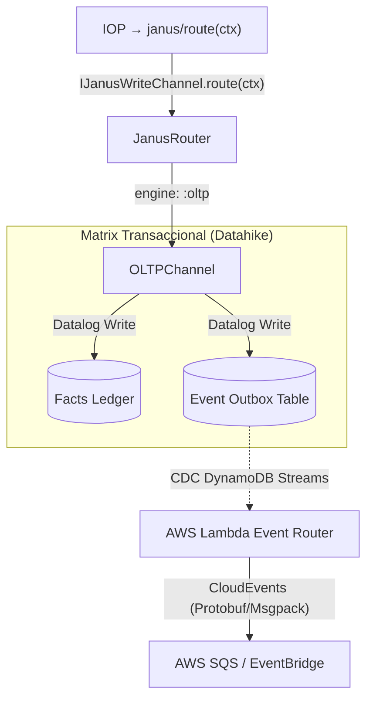
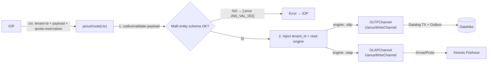

# Fase 03B: Janus Ingestion & Agnostic Router

**Nombre del Manifiesto:** `Janus Ingestion & Agnostic Router`
**Tipo:** Router de Escritura — Canal OLTP / OLAP
**Fase contenedora:** [03_FASE_INGESTION.md](03_FASE_INGESTION.md)
**Invocado por:** [03A_FASE_IOP.md](03A_FASE_IOP.md) — Paso 3 del pipeline
**Depende de:** [02_FASE_MOTOR_SCHEMA_DRIVEN_CORE.md](02_FASE_MOTOR_SCHEMA_DRIVEN_CORE.md) — El Códice (SSOT)

---

## MÓDULO 0: Definición y Objetivo

### Definición

Janus es el **router de escritura de alta velocidad** del Metri Engine. Es invocado exclusivamente por el IOP, **únicamente después** de que `CedarAuthorizer` y `QuotaGuard` hayan emitido `[:ok …]`. Recibe el `ctx` con la identidad ya resuelta y el payload de ingesta, y ejecuta dos responsabilidades propias y no delegables:

1. **Validar el payload de escritura** contra el Códice (Fase 02) — tipo de entidad, campos obligatorios, cardinalidades, operaciones permitidas.
2. **Rutear al canal correcto** — `OLTPChannel` o `OLAPChannel` — evaluando el metaparámetro `engine` del Códice.

### Posición en el pipeline

```
IOP (run-iop)
  ├─ Paso 1: CedarAuthorizer   ← autorización Zero-Trust
  ├─ Paso 2: QuotaGuard        ← control de recursos por tenant
  └─ Paso 3: JanusRouter       ← (ESTE COMPONENTE)
               ├─ OLTPChannel  → Datahike (ACID)
               └─ OLAPChannel  → Kinesis Firehose (bypass)
```

> [!IMPORTANT]
> **¿Por qué Janus NO procesa AST (filter trees, RLS injection, Shield pruning)?**
>
> El AST (`filter-node`, `SELECT`, `FILTER`, RLS conditions) es vocabulario del **path de consulta/lectura** — pertenece a **Aegis** (query engine). En el path de **ingesta**, el payload es un `google.protobuf.Struct` de valores de entidad o un `RowSet` de Arrow — no un árbol de consulta. No hay columnas que filtrar, no hay filas que ocultar, no hay atributos que podar del SELECT.
>
> La seguridad de escritura ya está garantizada upstream:
>
> - **Tenant isolation** → `tenant_id` viene del ctx resuelto por Cedar, jamás del cliente.
> - **Autorización de operación** → Cedar ABAC ya emitió `ALLOW` para el `scope` de escritura.
> - **Validación de schema** → el Códice define qué campos acepta cada entidad y con qué tipos.

> [!NOTE]
> Janus **no ejecuta** resolución de identidad, verificación de Quotas, evaluación de políticas Cedar ni emisión de eventos EDA. Esas responsabilidades pertenecen al IOP y sus componentes upstream.

---

## MÓDULO I: Contratos y Protocolo

### I.1 — Protocolo `IJanusWriteChannel`

Los canales de escritura no son `if/else` condicionales — son implementaciones polimórficas de un contrato mínimo:

```clojure
;; ns: metri.janus.channels.protocol
(defprotocol IJanusWriteChannel
  "Contrato único que todo canal de escritura de Janus debe satisfacer.
   Recibe el ctx ENRIQUECIDO del router y ejecuta la escritura en su backend.
   El canal nunca llama al Códice — el schema ya viene resuelto en ctx.

   CONTRATO RAILWAY (obligatorio — no opcional):
     Toda implementación DEBE retornar una de estas dos formas:
       [:ok  {:ulid str :channel kw}]              — escritura exitosa
       [:error {:stage :janus :code kw :detail str}] — fallo controlado

   PROHIBIDO lanzar excepciones. Toda implementación atrapa sus propios
   errores y los convierte en [:error ...]. Una impl que lanza viola Liskov
   y rompe el Railway del IOP — el sistema no lo detectará en compilación.

   STUBS CANÓNICOS para tests (Liskov verificable):
     InMemoryOLTPStub  → simula TX ACID en memoria sin Datahike
     InMemoryOLAPStub  → simula put-record sin Kinesis
     NoOpWriteChannel  → retorna siempre [:ok {:ulid \"stub\" :channel :noop}]
   Todo stub debe pasar la misma suite de tests de contrato que la impl real."
  (route [this ctx]
    "ctx  :: {:tenant-id         uuid   ;; inyectado desde Cedar — nunca del cliente
              :user-id           uuid
              :role              map
              :entity-type       str    ;; leído del Códice por el router
              :schema            map    ;; schema ya resuelto — el canal NO llama al Códice
              :operation         kw     ;; :create :update :delete :upsert
              :payload           map    ;; Struct validado + tenant_id inyectado
              :quota-reservation map}
     ret  :: [:ok {:ulid str :channel kw}] | [:error {:stage :janus :code kw :detail str}]"))
```

> [!IMPORTANT]
> **`:schema` en el ctx es el contrato de desacoplamiento clave.**
> El `JanusRouter` carga el schema **una sola vez** y lo propaga en el ctx.
> Ningún canal (`OLTPChannel`, `OLAPChannel`) llama al Códice directamente.
> Esto elimina el doble lookup y rompe la dependencia directa al namespace `codice`.

### I.2 — Composición del Router (Desacoplado)

El router recibe el `channel-registry` como dependencia inyectada por Integrant — **no existe más el `def` global**. Además, enriquece el `ctx` con el `schema` antes de despachar al canal:

```clojure
;; ns: metri.janus.core
;; deps inyectadas por Integrant — el router NO importa ningún namespace externo
;; load-schema-fn y validate-payload-fn llegan desde :codice/registry — nunca hardcodeadas

(defn route
  "Entrada: ctx del IOP (identidad resuelta + payload de ingesta)
   deps inyectadas por Integrant:
     :channel-registry    — mapa engine→canal  (IJanusWriteChannel)
     :load-schema-fn      — fn: (f entity-type) → malli/schema | throws :COD_001
     :validate-payload-fn — fn: (f schema payload) → [:ok p] | [:error ...]

   Pipeline:
   1. Carga schema via load-schema-fn   — UNA SOLA VEZ, propaga en ctx
   2. Valida payload via validate-payload-fn
   3. Pre-checks (engine, write_path_locked, is_system_seeded)
   4. Enriquece ctx con :schema y :tenant_id — el canal nunca llama al Códice
   5. Despacha al canal del registry inyectado"
  [ctx deps]
  (let [{:keys [channel-registry load-schema-fn validate-payload-fn]} deps
        entity-type (:entity-type ctx)
        schema      (load-schema-fn entity-type)]              ;; ← fn inyectada
    (case (validate-payload-fn schema (:payload ctx))          ;; ← fn inyectada
      [:error e]
      ;; FASE 10 III.3: errors/error único constructor — lee :retryable? del catálogo
      (errors/error :COD_VAL_001
        {:stage     :janus
         :detail    e
         :tenant-id (:tenant-id ctx)
         :user-id   (:user-id ctx)})

      [:ok _]
      (let [engine   (keyword (get schema :engine))
            channel  (get channel-registry engine)
            safe-ctx (-> ctx
                         (assoc :schema schema)                ;; ← schema en ctx
                         (assoc-in [:payload :tenant_id]       ;; ← tenant isolation
                                   (:tenant-id ctx)))]
        (if channel
          (.route channel safe-ctx)
          ;; FASE 10 III.3: errors/error único constructor
          (errors/error :JNS_001
            {:stage     :janus
             :detail    (str "No channel for engine: " engine)
             :tenant-id (:tenant-id ctx)
             :user-id   (:user-id ctx)})))))))

;; ── Integrant — wiring completo: router NO conoce ningún namespace externo ──
(defmethod ig/init-key :iop/janus-router
  [_ {:keys [channel-registry load-schema-fn validate-payload-fn]}]
  (fn [ctx]
    (route ctx {:channel-registry    channel-registry
                :load-schema-fn      load-schema-fn      ;; ← codice/load-schema inyectada
                :validate-payload-fn validate-payload-fn ;; ← codice/validate-payload inyectada
                })))
```

> [!NOTE]
> El `engine` es leído del **Códice (Fase 02)** — no del request del cliente.
> El `tenant_id` es inyectado desde el `ctx` resuelto por Cedar — el cliente nunca puede auto-asignarse un tenant.
> El `def` global `janus-channel-registry` **ya no existe** — el registry llega inyectado en `deps`.

### I.3 — Contratos gRPC (Parachoques Arquitectónico)

El sistema repudia las rutas HTTP crudas. Toda ingesta se somete a las reglas del archivo maestro **`metri-data/src/main/proto/metri.proto`** — SSOT para la red:

1. **`OperationAction` Taxativa:** El backend prohíbe deducir la intención. El contrato fuerza explícitamente (`CREATE`, `UPDATE`, `DELETE`, `UPSERT`).
2. **Contexto Base obligatorio (`required`):** `tenant_id` y `entity_type` son `required` en el proto. Si el cliente los omite, aborta con `INVALID_ARGUMENT` antes de llegar a Janus.
3. **`RowSet` y `binary_payload` (Alta Rotación):** Vía de emergencia O(1) para `BulkIngest` — transporta masas Apache Arrow intactas sin deserializar el contenido vectorizado.
4. **Dogma del Códice Estricto (Entity Schema Validation):** Todo payload `1-a-1` se valida con `Malli` contra el JSON Schema de la entidad (tipos `uuid`, `decimal`, `epoch`, cardinalidades). Ningún dato entra si viola el esquema.

Bifurcación del contrato gRPC → canal de escritura:

- **`rpc Transact(TransactionRequest)`** → operaciones atómicas ACID → `OLTPChannel`
- **`rpc BulkIngest(BulkRequest)`** → ráfagas vectoriales IO-optimizadas → `OLAPChannel`

> [!TIP]
> **Filosofía Zero-Throw de Recepción:** Payloads con tipos inválidos o campos `required` ausentes nunca expulsan una Exception. El _Códice_ encapsula el rechazo bajo `[:error {:code :JNS_VAL_001}]`. Esto protege los hilos ECS/Lambda a 3,000 req/s.

### I.4 — Identidad Léxica ULID Inyectada

Sin importar el canal, toda creación inyecta un **ULID** — nunca UUID v4 estocástico:

- **Gravedad Cronológica:** Lexicográficos por tiempo (Base32) → inserción adyacente en B-Trees → O(1) lineal.
- **Fragmentación Nula:** Sin Page-Faults agresivos a diferencia de UUID aleatorio en millones de inserciones.

---

## MÓDULO II: Principios SOLID

| Principio                     | Aplicación en Janus                                                                                                                                                                                                                                                                         | Mecanismo                                                         |
| :---------------------------- | :------------------------------------------------------------------------------------------------------------------------------------------------------------------------------------------------------------------------------------------------------------------------------------------ | :---------------------------------------------------------------- |
| **S** — Single Responsibility | `JanusRouter` solo valida y despacha. `OLTPChannel.route` solo orquesta — 3 fns privadas (`enrich-payload`, `verify-entity-refs`, `execute-transaction!`) cada una con una sola razón de cambio. `IProjectionBuilder` encapsula cada proyección ACID (incluida `QuotaConfirmationBuilder`). | Namespaces separados: `core.clj`, `oltp.clj`, `projections/*.clj` |
| **O** — Open/Closed           | Agregar proyecciones ACID (Outbox, Sagas, Calendar, **QuotaConfirmation**, Notifications...) = implementar `IProjectionBuilder` + registrarlo en `system.edn`. `OLTPChannel` y `build-tx-data` **no se tocan jamás**.                                                                       | `IProjectionBuilder` protocol + `projection-registry` inyectado   |
| **L** — Liskov Substitution   | `IJanusWriteChannel` tiene contrato Railway **formal y obligatorio** en su docstring — prohíbe lanzar excepciones. Stubs canónicos (`InMemoryOLTPStub`, `InMemoryOLAPStub`, `NoOpWriteChannel`) documentados. Liskov es verificable en tests, no solo convención.                           | Contrato Railway en docstring + stubs canónicos                   |
| **I** — Interface Segregation | `IJanusWriteChannel` = 1 método (`route`). `IProjectionBuilder` = 2 métodos (`applicable?` + `build`). Ningún canal carga contratos de auth, quotas, AST ni EDA.                                                                                                                            | Protocolos atómicos, sin herencia                                 |
| **D** — Dependency Inversion  | Ningún componente importa namespaces externos directamente. `JanusRouter` recibe `load-schema-fn` y `validate-payload-fn` inyectadas. `OLTPChannel` recibe `ulid-fn` y `codice-generator-fn` — `quota-fn` eliminada (lógica movida a `QuotaConfirmationBuilder`).                           | 100% inyección via Integrant — cero `require` de negocio          |

---

## MÓDULO III: Protocolo `IProjectionBuilder` (Extensión ACID)

Antes de definir `OLTPChannel`, se establece el protocolo que hace extensibles las proyecciones ACID sin tocar el canal:

```clojure
;; ns: metri.janus.channels.projections.protocol
(defprotocol IProjectionBuilder
  "Contrato de toda proyección ACID que acompaña a la entidad principal
   en la misma transacción Datahike. Implementaciones registrables en
   system.edn — sin modificar OLTPChannel ni build-tx-data."
  (applicable? [this schema]
    "Retorna true si esta proyección aplica al schema dado.
     Puro — sin I/O. Solo lee el schema.")
  (build [this schema payload parent-ulid]
    "Construye uno o más mapas de hechos Datahike para esta proyección.
     Retorna un mapa o un vector de mapas.
     Nunca lanza — si hay error, retorna [:error ...]."))
```

### III.1 — `OutboxBuilder` — Proyección del Event Outbox

```clojure
;; ns: metri.janus.channels.projections.outbox
(defrecord OutboxBuilder []
  IProjectionBuilder
  (applicable? [_ schema]
    ;; Aplica a toda entidad que NO tenga disable_eda: true
    (not (true? (:disable_eda schema))))
  (build [_ schema payload parent-ulid]
    ;; Genera el registro Outbox PENDING en la misma TX ACID
    ;; → cero pérdida de eventos — si la TX falla, el Outbox también revierte
    {:outbox/ulid        parent-ulid
     :outbox/entity-type (:entity schema)
     :outbox/tenant-id   (:tenant_id payload)
     :outbox/event-type  (get-in schema [:events :create])
     :outbox/payload     (pr-str payload)
     :outbox/status      :PENDING
     :outbox/created-at  (System/currentTimeMillis)}))
```

### III.2 — `SagaBuilder` — Proyección de Mantenimiento Programado

```clojure
;; ns: metri.janus.channels.projections.saga
(defrecord SagaBuilder []
  IProjectionBuilder
  (applicable? [_ schema]
    ;; Aplica solo si el modelo declara shadow_sagas_mapping
    (some? (:shadow_sagas_mapping schema)))
  (build [_ schema payload parent-ulid]
    ;; Genera todos los scheduled_job(s) declarados en shadow_sagas_mapping
    (mapv (fn [saga-def]
            {:db/id                (d/tempid :db.part/user)
             :scheduled_job/ulid   (ulid/generate)
             :scheduled_job/owner  parent-ulid
             :scheduled_job/type   (keyword (:job_type saga-def))
             :scheduled_job/due_at (resolve-due-at saga-def payload)})
          (:shadow_sagas_mapping schema))))
```

### III.3 — `CalendarBuilder` — Proyección de Eventos de Calendario

```clojure
;; ns: metri.janus.channels.projections.calendar
(defrecord CalendarBuilder []
  IProjectionBuilder
  (applicable? [_ schema]
    ;; Aplica solo si el modelo declara calendar_mapping
    (some? (:calendar_mapping schema)))
  (build [_ schema payload parent-ulid]
    ;; Genera todos los calendar_event(s) declarados en calendar_mapping
    (mapv (fn [cal-def]
            {:db/id                     (d/tempid :db.part/user)
             :calendar_event/ulid       (ulid/generate)
             :calendar_event/owner      parent-ulid
             :calendar_event/title      (resolve-title cal-def payload)
             :calendar_event/start_at   (resolve-start-at cal-def payload)})
          (:calendar_mapping schema))))
```

### III.4 — `QuotaConfirmationBuilder` — Proyección de Confirmación de Quota

```clojure
;; ns: metri.janus.channels.projections.quota
;; Mueve la confirmación de quota AL INTERIOR de la TX ACID.
;; Hermes la procesa async — OLTPChannel ya NO llama a quota-fn post-commit.
;;
;; Garantía de resiliencia:
;;   TX falla  → quota_confirmation tampoco existe → sin dangling state
;;   TX commit → Hermes reintenta hasta que quota service responda
;;   JVM restart → outbox persiste en Datahike → cero pérdida de confirmaciones
(defrecord QuotaConfirmationBuilder []
  IProjectionBuilder

  (applicable? [_ schema]
    ;; Aplica a toda entidad que necesite confirmar débito (toda entidad no exenta)
    (not (true? (:disable_quota schema))))

  (build [_ schema payload parent-ulid]
    ;; Escribe la intención de confirmación en la misma TX — Hermes la procesa async
    {:quota_confirmation/ulid        (ulid/generate)
     :quota_confirmation/entity-ulid parent-ulid
     :quota_confirmation/entity-type (:entity schema)
     :quota_confirmation/tenant-id   (:tenant_id payload)
     :quota_confirmation/reservation (pr-str (:quota-reservation payload))
     :quota_confirmation/status      :PENDING
     :quota_confirmation/created-at  (System/currentTimeMillis)}))
```

> [!IMPORTANT]
> **¿Por qué `QuotaConfirmationBuilder` y no `confirm-quota!` síncrono?**
>
> | Escenario                   | Antes (`confirm-quota!` síncrono) | Después (`QuotaConfirmationBuilder`)            |
> | :-------------------------- | :-------------------------------- | :---------------------------------------------- |
> | TX OK + quota service OK    | ✅                                | ✅                                              |
> | TX OK + quota service caído | ❌ dangling state irrecuperable   | ✅ outbox PENDING, Hermes reintenta             |
> | TX falla                    | ✅ rollback                       | ✅ rollback (quota_confirmation tampoco existe) |
> | Restart JVM post-TX         | ❌ confirmación perdida           | ✅ outbox persiste en Datahike                  |
> | Quota service caído 24h     | ❌ sin reconciliación posible     | ✅ Hermes reintenta al restaurar                |

> [!TIP]
> **Agregar una nueva proyección** (ej. `NotificationBuilder` para emails/push automáticos):
>
> 1. Crear `defrecord NotificationBuilder []` implementando `IProjectionBuilder` en su namespace.
> 2. Añadir `#ig/ref :janus/notification-builder` al vector `:builders` del `:janus/projection-registry` en `system.edn`.
> 3. **`OLTPChannel`, `build-tx-data` y `JanusRouter` nunca se modifican.**
>
> El `QuotaConfirmationBuilder` ya existe como ejemplo real de extensión — fue añadido
> sin tocar `OLTPChannel` ni `build-tx-data`.

### III.4 — Ensamblado: `build-tx-data` con registry polimórfico

````clojure
;; ns: metri.janus.channels.oltp
;; build-tx-data NO tiene lógica condicional propia — delega todo al registry

(defn- build-entity-attrs
  "Traduce payload validado + ULID → mapa base de atributos Datahike."
  [schema payload ulid]
  {:db/id         (d/tempid :db.part/user)
   :entity/ulid   ulid
   :entity/type   (keyword (:entity schema))
   :entity/tenant (:tenant_id payload)
   ;; resto del payload sin tenant_id (ya está en :entity/tenant)
   (merge (dissoc payload :tenant_id))})

(defn- build-tx-data
  "Ensambla el vector :tx-data polimórficamente desde el projection-registry.
   Nunca sabe qué proyecciones hay — solo llama applicable? y build.
   Agregar una proyección = registrar un IProjectionBuilder. Esta fn no cambia."
  [schema payload ulid projection-registry]
  (let [entity-fact  (build-entity-attrs schema payload ulid)
        projections  (->> projection-registry
                          (filter #(applicable? % schema))        ;; ← polimEl `OLTPChannel` tiene **cero imports directos** de namespaces de negocio.
Todas las dependencias llegan inyectadas. El método `route` es un **puro orquestador** —
no implementa lógica propia, solo llama 3 funciones privadas en orden y propaga errores
por el Railway Pattern. La confirmación de quota vive en la TX via `QuotaConfirmationBuilder`.
Cada función tiene **una sola razón para cambiar**:

```clojure
;; ns: metri.janus.channels.oltp
;; SIN require de: metri.quotas, metri.ulid, metri.codice, metri.codice.generator
;; TODO llega como campo inyectado o en el ctx
;; quota-fn ELIMINADA — la confirmación vive en la TX via QuotaConfirmationBuilder

;; ── Fn privada 1: Enriquecimiento de payload (auto_generate) ─────────────────
;; Razón de cambio: contrato de codice-generator-fn evoluciona (Fase 02 SSOT)
(defn- enrich-payload
  [generator-fn conn schema tenant-id payload]
  (generator-fn conn schema tenant-id payload))

;; ── Fn privada 2: Type-safe Batch FK verification — O(1) queries ─────────────
;; Razón de cambio: lógica de FK validation o tipos de referencia cambian
;;
;; VERSIÓN 1:  N d/entity secuenciales          → N round-trips, solo existencia
;; VERSIÓN 2:  1 d/q batch [:in $ [?ulid ...]]  → O(1) queries, solo existencia
;; VERSIÓN 3:  1 d/q batch + entityRef del schema → O(1) queries, existencia + tipo
;;
;; entityRef en el schema compilado (Fase 02 — SSOT) declara el tipo esperado:
;;   location_id → entityRef: "location"
;;   asset_id    → entityRef: "asset"
;;   assignees   → entityRef: "user" (cardinality:many)
;;
;; Error JNS_REF_001 → UUID no existe en Datahike
;; Error JNS_REF_002 → UUID existe pero el entity/type no coincide con entityRef
;;                     (type confusion attack bloqueado en la capa de ingesta)
(defn- verify-entity-refs
  [conn schema payload]
  (let [ref-attrs (filter #(= (:type %) "reference") (:attributes schema))

        ;; Recolectar triples [field-name uuid expected-entity-type]
        ;; entityRef viene del schema compilado por el Códice en bootstrap
        ref-triples (mapcat (fn [attr]
                              (let [v             (get payload (keyword (:name attr)))
                                    expected-type (keyword (:entityRef attr))]  ;; ← del schema
                                (cond
                                  (nil? v)    []                                              ;; campo opcional — skip
                                  (vector? v) (map #(vector (:name attr) % expected-type) v) ;; cardinality:many
                                  :else       [[(:name attr) v expected-type]])))             ;; cardinality:one
                            ref-attrs)

        all-uuids (mapv second ref-triples)]

    ;; Retorno inmediato sin I/O si no hay FKs que verificar
    (if (empty? all-uuids)
      [:ok]

      ;; ── 1 sola query batch — retorna ulid + entity/type real ─────────────
      ;; Datahike resuelve la intersección en el índice AVET internamente
      (let [found-map (->> (d/q '[:find  ?ulid ?type
                                  :in    $ [?ulid ...]
                                  :where [?e :entity/ulid ?ulid]
                                         [?e :entity/type ?type]]  ;; ← tipo real
                                @conn all-uuids)
                           (into {} (map (fn [[ulid t]] [ulid t]))))

            ;; Clasificar cada triple como ok | not-found | wrong-type
            violations (keep (fn [[field uuid expected-type]]
                               (let [actual-type (get found-map uuid)]
                                 (cond
                                   ;; UUID no existe en Datahike
                                   (nil? actual-type)
                                   ;; FASE 10 III.3: violations mapa — errors/error en el caller
                                   {:field  field
                                    :code   :JNS_REF_001
                                    :detail (str field " not found: " uuid)}

                                   ;; UUID existe pero el tipo no coincide con entityRef
                                   (not= actual-type expected-type)
                                   {:field  field
                                    :code   :JNS_REF_002
                                    :detail (str field " expected :" (name expected-type)
                                                 " but got :"        (name actual-type))})))
                             ref-triples)]

        (if (seq violations)
          ;; Reporta TODAS las violaciones — existencia + type confusion
          ;; FASE 10 III.3: errors/error único constructor — lee :retryable? del catálogo
          (errors/error (-> violations first :code)
            {:stage      :janus
             :violations violations
             :tenant-id  (:tenant-id ctx)
             :user-id    (:user-id ctx)})
          [:ok])))))

;; ── Fn privada 3: Ejecución de transacción ACID ───────────────────────────────
;; Razón de cambio: manejo de errores Datahike o forma del tx-report cambian
;; Retorna [:ok tx-report] | [:error ...] — nunca lanza.
(defn- execute-transaction!
  "Ejecuta la TX ACID en Datahike. Retorna [:ok tx-report] | [:error ...].
   FASE 10 III.3: nunca lanza — errors/error único constructor de [:error].
   Severity :error → JanusRouter invoca sherlog/handle-fault! antes de retornar."
  [conn tx-data ctx]
  (try
    [:ok (d/transact conn {:tx-data tx-data})]
    (catch Exception e
      ;; FASE 10 III.3: errors/error lee :retryable?, :severity del catálogo
      ;; Caller (JanusRouter) invocará sherlog/handle-fault! porque severity=:error
      (errors/error :JNS_TX_001
        {:stage  :janus
         :detail (ex-message e)
         :tenant-id (:tenant-id ctx)
         :user-id   (:user-id ctx)}))))

;; ── defrecord + route: PURO ORQUESTADOR (3 pasos) ────────────────────────────
(defrecord OLTPChannel
  [datahike-conn           ;; única dep de infraestructura: la conn Datahike
   ulid-fn                 ;; fn: ()       → genera ULID (testeable sin I/O)
   projection-registry     ;; [IProjectionBuilder ...] → inyectado por Integrant
   codice-generator-fn]    ;; fn: inject! del Códice  → enriquece payload con auto_generate
                           ;;     Owner: metri.codice.generator (Fase 02 — SSOT)

  IJanusWriteChannel

  (route [this ctx]
    ;; route NO implementa lógica — solo orquesta las 3 fns privadas en orden.
    ;; schema YA viene en ctx — el router lo cargó UNA sola vez.
    ;; quota-reservation llega en ctx — QuotaConfirmationBuilder lo escribe en la TX.
    ;; Razón de cambio de route: el ORDEN del pipeline cambia. Nada más.
    (let [{:keys [schema payload tenant-id]} ctx
          ulid ((:ulid-fn this))]

      ;; Paso 1 — FK integrity (antes de consumir I/O de generación)
      (let [ref-result (verify-entity-refs datahike-conn schema payload)]
        (if (= :error (first ref-result))
          ref-result

          ;; Paso 2 — enriquecer payload + ensamblar TX con todas las proyecciones
          ;; QuotaConfirmationBuilder incluido en projection-registry:
          ;;   → outbox_event (EDA) + scheduled_job (Saga) + calendar_event
          ;;   → quota_confirmation (NUEVO — confirmación durable en la TX)
          (let [enriched (enrich-payload (:codice-generator-fn this)
                                         datahike-conn schema tenant-id payload)
                tx-data  (build-tx-data schema enriched ulid
                                        (:projection-registry this))]

            ;; Paso 3 — TX ACID (entity + todas las proyecciones indivisibles)
            ;; Si falla → quota_confirmation tampoco existe → cero dangling state
            (let [tx-result (execute-transaction! datahike-conn tx-data)]
              (if (= :error (first tx-result))
                tx-result
                [:ok {:ulid    ulid
                      :channel :oltp
                      :tx-id   (:db-after (second tx-result))}]))))))))

;; ── Integrant — wiring con todas las dependencias explícitas ─────────────────
(defmethod ig/init-key :janus/oltp-channel
  [_ {:keys [datahike-conn ulid-fn projection-registry codice-generator-fn]}]
  (->OLTPChannel datahike-conn ulid-fn projection-registry codice-generator-fn))
````

> [!IMPORTANT]
> **Evolución del desacoplamiento — historial completo:**
>
> | Campo                    | V1 (original)             | V2 (DI fix)                        | V3 (Resiliencia)                              | Owner                        |
> | :----------------------- | :------------------------ | :--------------------------------- | :-------------------------------------------- | :--------------------------- |
> | `datahike-conn`          | ✅ inyectado              | ✅ inyectado                       | ✅ inyectado                                  | Infra                        |
> | `quota/confirm!`         | ❌ namespace directo      | ✅ `quota-fn` inyectada            | ✅ **eliminada** → `QuotaConfirmationBuilder` | **Proyección ACID**          |
> | `ulid/generate`          | ❌ namespace directo      | ✅ `ulid-fn` inyectada             | ✅ `ulid-fn` inyectada                        | Janus                        |
> | `codice/load-schema`     | ❌ doble lookup           | ✅ `schema` en `ctx`               | ✅ `schema` en `ctx`                          | Códice                       |
> | Proyecciones ACID        | ❌ `if/case` hardcoded    | ✅ `IProjectionBuilder`            | ✅ + `QuotaConfirmationBuilder`               | Janus                        |
> | `generator/inject!`      | ❌ módulo propio de Janus | ✅ `codice-generator-fn` inyectada | ✅ `codice-generator-fn` inyectada            | **Códice (Fase 02)**         |
> | `confirm-quota!` post-TX | ✅ síncrono               | ✅ síncrono                        | ✅ **movida a TX** — durable y resiliente     | **QuotaConfirmationBuilder** |

### IV.2 — Comportamiento dirigido por el Códice

Si el Códice arroja **`engine: "oltp"`** (Dominio Crítico: Facturas, Órdenes, Stock):

1. **Inyección Autonómica:** Si el schema decreta `strategy: sequential` o `strategy: stochastic_base36`, la `codice-generator-fn` (inyectada desde Fase 02) enriquece el payload **antes de `d/transact`** — el canal no conoce la lógica de generación.
2. **Aceptación Estricta:** Valida identidad excluyente (`unique`) — sin choques en el B-Tree maestro.
3. **Proyección de Sagas y Calendarios:** Si el modelo tiene `shadow_sagas_mapping` o `calendar_mapping`, inyecta/muta `scheduled_job.json` y `calendar_event.json` en la misma transacción ACID.
4. **ACID Nativo (Datalog Transact):** Datahike procesa la matriz principal + proyecciones de forma indivisible. Todo pasa o todo falla.
5. **Pautado Dual (Outbox):** La mutación se graba **simultáneamente** como binario (Protobuf / Transit-MessagePack) en la `Outbox Table`.

### IV.3 — Diagrama de escritura OLTP (arquitectura desacoplada)



---

## MÓDULO IV: Canal `OLAPChannel` (Bypass Big Data)

### IV.1 — Definición Canónica (100% Desacoplada)

El `OLAPChannel` espeja el patrón de desacoplamiento del `OLTPChannel` — **cero imports directos**
de namespaces de negocio. `ulid-fn` y `quota-fn` llegan inyectadas por Integrant:

```clojure
;; ns: metri.janus.channels.olap
;; SIN require de: metri.quotas, metri.ulid
;; TODO llega como campo inyectado o en el ctx

(defrecord OLAPChannel
  [kinesis-client   ;; única dep de infraestructura: cliente Kinesis
   ulid-fn          ;; fn: () → genera ULID (testeable sin I/O)
   quota-fn]        ;; fn: (quota-fn reservation) → confirma débito optimista

  IJanusWriteChannel

  (route [this ctx]
    (let [{:keys [tenant-id entity-type payload quota-reservation]} ctx
          operation-type (get-in ctx [:request :operation-type])
          ulid           ((:ulid-fn this))]         ;; ← inyectada
      ;; Censura API: rpc Transact es inválido para canales OLAP
      ;; FASE 10 III.3: errors/error único constructor — lee :retryable? del catálogo
      (if (= operation-type :transact)
        (errors/error :JNS_OLAP_001
          {:stage  :janus
           :detail "rpc Transact is forbidden for engine:olap — use BulkIngest"
           :tenant-id tenant-id})
        (let [binary-payload (olap/wrap-arrow-or-proto payload ulid)]
          (try
            (ks/put-record kinesis-client {:stream-name  (olap/stream-for tenant-id entity-type)
                                           :data          binary-payload
                                           :partition-key ulid})
            ((:quota-fn this) quota-reservation)    ;; ← inyectada
            [:ok {:ulid ulid :channel :olap}]
            (catch Exception e
              ;; severity :error → JanusRouter invocará sherlog/handle-fault!
              (errors/error :JNS_OLAP_002
                {:stage     :janus
                 :detail    (ex-message e)
                 :tenant-id tenant-id})))))))))

### IV.2 — Comportamiento dirigido por el Códice

Si el Códice arroja **`engine: "olap"`** con `write_path_locked: true`:

1. **Censura API:** `rpc Transact` → bloqueo inmediato `[:error :JNS_OLAP_001]`. Solo `rpc BulkIngest`.
2. **Bypass directo Kinesis:** El payload Arrow/Protobuf con ULID se redirige puro a `aws_kinesis_firehose` — Datahike no es invocado.
3. Kinesis/Firehose vierte los binarios como Apache Parquet sobre S3, listo para Athena en O(1).

---

## MÓDULO V: Pipeline de Ingesta — `rpc Transact`

### V.1 — Los 7 Pasos del `rpc Transact`

Cada request atraviesa estas fases en **orden estricto e irrevocable**:

```

gRPC TransactionRequest → IOP → Janus
│
│ FASE 0 — Pre-checks (Janus Router, O(1))
├─ [0.1] entity-type en Códice? NO → :COD_001 gRPC NOT_FOUND
├─ [0.2] engine == oltp? NO → :JNS_ENGINE_001 gRPC INVALID_ARGUMENT
├─ [0.3] write_path_locked == false? SÍ → :JNS_LOCK_001 gRPC PERMISSION_DENIED
├─ [0.4] is_system_seeded == false? SÍ → :JNS_SEED_001 gRPC PERMISSION_DENIED
│
│ ← Cedar ABAC y QuotaGuard ya fueron ejecutados por IOP upstream.
│ Janus recibe el ctx con identidad y cuota ya resueltas.
│
│ FASE 2 — Validación de Schema (Códice/Malli)
├─ [2.1] validate-payload OK? NO → :COD_VAL_001 gRPC INVALID_ARGUMENT
│
│ FASE 3 — Integridad Referencial (OLTPChannel)
├─ [3.1] todos los entityRef existen? NO → :JNS_REF_001 gRPC NOT_FOUND
│
│ FASE 4 — Generación de Códigos (OLTPChannel → codice/generator/inject!)
│ Owner: metri.codice.generator (Fase 02 — SSOT)
│ Janus llama via codice-generator-fn inyectada — no posee la lógica
├─ [4.1] auto_generate: stochastic_base36 → base36/generate [sin I/O]
├─ [4.2] auto_generate: sequential
│ ├─ scope DIRECTO (is_sequence_scope) → READ location.tag
│ ├─ scope INDIRECTO (is_sequence_scope_via) → READ asset → READ location.tag
│ └─ scope GLOBAL (fallback) → usa tnt_X:entity:field_seq
├─ [4.3] READ sequence_registry → current_value
│ NO existe + nearest_registered → FALLBACK GLOBAL
│ NO existe + exact/root → crea registro nuevo (current_value=0)
└─ [4.4] WRITE sequence_registry ACID → current_value += 1
│
│ FASE 5 — Encriptación (OLTPChannel → KMS)
├─ [5.1] crypto_envelope: true? KMS error → :KMS_001 gRPC INTERNAL
│
│ FASE 6 — Transacción ACID (OLTPChannel → Datahike)
├─ [6.1] d/transact
│ unique:identity → UPSERT
│ unique:value → CONFLICT si ya existe
│ track_history:true → delta :db/add + :db/retract
│ track_history:false → muta in-place
│ TX error → :JNS_TX_001 gRPC INTERNAL (rollback automático)
│
│ FASE 7 — EDA Outbox (MoiraEmitter)
└─ [7.1] disable_eda == false?
SÍ → outbox_event → Outbox → SQS
NO → omitido (labor_log, IoT, sequence_registry)
⚠ Un fallo aquí NO bloquea la respuesta — cliente recibe gRPC OK

````

> [!IMPORTANT]
> **Precedencia de errores:** La primera fase que falla determina el código de error.
> Fase 7 (EDA) es la única que **nunca bloquea** — la TX en Datahike ya committeó.

### V.2 — Decisión por Directiva del Códice

| Directiva del modelo        | Fase | Acción de Janus                                        | Error si falla        |
| :-------------------------- | :--- | :----------------------------------------------------- | :-------------------- |
| `engine: olap`              | 0.2  | Rechaza `rpc Transact` — solo `BulkIngest`             | `:JNS_ENGINE_001`     |
| `write_path_locked: true`   | 0.3  | Rechaza antes de tocar Datahike                        | `:JNS_LOCK_001`       |
| `is_system_seeded: true`    | 0.4  | Bloquea mutación de registros de sistema               | `:JNS_SEED_001`       |
| `required: true`            | 2.1  | Malli falla si campo ausente en payload                | `:COD_VAL_001`        |
| `entityRef`                 | 3.1  | Verifica existencia del registro referenciado          | `:JNS_REF_001`        |
| `auto_generate: sequential` | 4.x  | READ + WRITE ACID en `sequence_registry`               | `:JNS_SEQ_001`        |
| `auto_generate: base36`     | 4.1  | Genera localmente — sin I/O                            | (nunca falla)         |
| `is_sequence_scope`         | 4.2  | READ `location.tag` → scope DIRECTO                   | `:JNS_SCOPE_001`      |
| `is_sequence_scope_via`     | 4.2  | READ asset → READ `location.tag` → scope INDIRECTO    | FALLBACK GLOBAL       |
| `scope_resolution`          | 4.3  | `exact`/`root`/`nearest_registered` — traversal DH    | FALLBACK GLOBAL       |
| `crypto_envelope: true`     | 5.1  | KMS encrypt campos sensibles antes de `d/transact`     | `:KMS_001`            |
| `unique: identity`          | 6.1  | UPSERT — Datahike `db.unique/identity`                 | (nunca duplica)       |
| `unique: value`             | 6.1  | Rechaza si el valor ya existe en Datahike              | `:JNS_CONFLICT_001`   |
| `track_history: false`      | 6.1  | Muta in-place — sin delta histórico en Datahike        | (nunca falla)         |
| `disable_eda: true`         | 7.1  | Omite completamente el Outbox — sin evento SQS         | (nunca falla)         |
| `shadow_sagas_mapping`      | 6.1  | Proyecta `scheduled_job` en la misma TX ACID           | `:JNS_SAGA_001`       |
| `calendar_mapping`          | 6.1  | Proyecta `calendar_event` en la misma TX ACID          | `:JNS_CAL_001`        |

---

## MÓDULO VI: Auto-Generate — Delegación al Códice (Fase 02 — SSOT)

El campo `auto_generate` en el modelo JSON instruye al sistema a **generar y sobreescribir**
el valor antes de `d/transact`. El cliente nunca provee este campo — si lo incluye, Janus lo ignora.

> [!IMPORTANT]
> **El `OLTPChannel` NO posee la lógica de generación de códigos.**
> La recibe completamente encapsulada via `codice-generator-fn` inyectada desde Fase 02.
> El árbol de decisión completo (estrategias, scope resolution, READ/WRITE en `sequence_registry`)
> vive como **SSOT exclusivo en [02_FASE_MOTOR_SCHEMA_DRIVEN_CORE.md — MÓDULO IV](02_FASE_MOTOR_SCHEMA_DRIVEN_CORE.md)**.
> Consultar ese documento para el contrato completo de `auto_generate`, `scope_resolution`,
> políticas `exact`/`root`/`nearest_registered` y los escenarios de comportamiento.

### VI.1 — Contrato de invocación desde el canal

Lo único que el `OLTPChannel` conoce sobre `auto_generate` es **cómo llamar la función inyectada**:

```clojure
;; En OLTPChannel.route — Fase 4 del pipeline (ver MÓDULO V.1)
;; codice-generator-fn encapsula TODO: estrategia, scope, READ, WRITE ACID
;; El canal no sabe si es base36, sequential, scoped o global.
enriched-payload ((:codice-generator-fn this)   ;; ← fn inyectada de Fase 02
                   datahike-conn                 ;; ← para READ/WRITE sequence_registry
                   schema                        ;; ← schema ya en ctx (sin doble lookup)
                   (:tenant-id ctx)              ;; ← tenant isolation
                   payload)                      ;; ← payload validado
````

**Contrato de retorno:** el payload enriquecido con el campo `auto_generate` sobrescrito:

- `stochastic_base36` → `{:work_order_number "WO-X7K2M9P" ...}` — sin I/O, instantáneo
- `sequential` → `{:work_order_number "WO-L-K92MXA-0043" ...}` — ACID, con scope

### VI.2 — Tabla de comportamiento por escenario

| Escenario                           | `location_id` | `asset_id` | Scope resuelto      | Código generado      |
| :---------------------------------- | :------------ | :--------- | :------------------ | :------------------- |
| Sin scope configurado               | —             | —          | GLOBAL              | `"WO-0042"`          |
| Solo `asset_id`, asset sin location | —             | presente   | GLOBAL (fallback)   | `"WO-0042"`          |
| Solo `asset_id`, asset con location | —             | presente   | via asset→location  | `"WO-L-K92MXA-0001"` |
| Solo `location_id`                  | presente      | —          | DIRECTO             | `"WO-L-K92MXA-0001"` |
| Ambos — `location_id` + `asset_id`  | presente      | presente   | DIRECTO (prioridad) | `"WO-L-K92MXA-0001"` |

> [!NOTE]
> Esta tabla es un resumen de referencia rápida.
> La especificación completa con los árboles de decisión, queries Datalog y políticas de
> `scope_resolution` (`exact` / `root` / `nearest_registered`) está en
> **[Fase 02 — MÓDULO IV: `auto_generate`](02_FASE_MOTOR_SCHEMA_DRIVEN_CORE.md)**
>
> `sequence_registry` usa `track_history: false` + `disable_eda: true`.
> El contador muta en silencio — sin deltas históricos, sin eventos EDA.
> El WRITE es ACID por `unique:identity` en `sequence_code` — cero race conditions.

---

## MÓDULO VII: BulkIngest — Pipeline del OLAPChannel

El `OLAPChannel` aplica un subconjunto reducido de fases — sin las garantías OLTP:

```
rpc BulkIngest → OLAPChannel
    │
    ├─ [1] entity-type tiene engine: olap O write_path_locked: true?
    │       NO → :JNS_OLAP_003  gRPC PERMISSION_DENIED
    │
    ├─ [2] Autenticación M2M (api_key → tenant_id del ctx)
    │
    ├─ [3] Códice: validate-schema del lote (Malli batch)
    │       INVALID → :COD_VAL_001  gRPC INVALID_ARGUMENT
    │
    ├─ [4] crypto_envelope: true → KMS encrypt campos marcados
    │
    ├─ [5] idempotency_key presente?
    │       NO → :JNS_BULK_001  idempotency_key obligatorio
    │
    └─ [6] Kinesis Firehose PutRecordBatch
            → Iceberg particionado por tenant_id + fecha
            → Parquet columnar para Athena/OLAP
```

**Lo que BulkIngest NO hace (vs Transact):**

| Sin esto en BulkIngest | Razón                                          |
| :--------------------- | :--------------------------------------------- |
| Sin Cedar por registro | Auth M2M a nivel de lote — no row-level        |
| Sin FK validation      | O(N) inaceptable — responsabilidad del caller  |
| Sin `auto_generate`    | IDs pre-generados por el caller del lote       |
| Sin scope resolution   | Contadores no aplican a ingesta masiva         |
| Sin EDA por registro   | Outbox en lote = colapso SQS                   |
| Sin QuotaGuard/reg.    | Rate medido por lote completo, no por registro |

---

## MÓDULO VIII: Aislamiento Multitenant

Janus es el **guardián final del aislamiento B2B** antes de tocar Datahike:

```
Capa                   Mecanismo en Janus                        Garantía
───────────────────    ──────────────────────────────────────    ──────────────────────
tenant_id inyectado    ctx.tenant-id reemplaza cualquier valor   Cross-tenant imposible
                       que el cliente envíe en el payload
sequence_code          Incluye tenant_id como prefijo            Contadores B2B aislados
                       "tnt_A:work_order_number_seq"
scope resolution       Verifica location/asset del MISMO tenant  No resuelve cross-tenant
d/transact             :tenant_id como FK en toda entidad        Partición lógica en DH
outbox_event           tenant_id en cada evento SQS emitido      EDA segregada por tenant
```

> [!CAUTION]
> **El `tenant_id` del payload del cliente es SIEMPRE ignorado.**
> Janus sobreescribe con el `tenant_id` del `ctx` resuelto por Cedar.
> Un bypass de esta regla es vulnerabilidad **P0 crítica**.

---

## MÓDULO IX: Diagramas de Composición

### IX.1 — Composición estructural



> [!IMPORTANT]
> El `janus-channel-registry` es el **único lugar** donde se define qué canal corresponde a qué `engine`.
> Añadir un nuevo canal = implementar `IJanusWriteChannel` + registrarlo aquí. `JanusRouter` nunca cambia.

> [!NOTE]
> **D6 FASE 10 — Sherlog en JanusRouter: detalle de implementación**
>
> `JanusRouter` recibe `sherlog-notifiers` y `olap-channel` **inyectados** por Integrant
> (no los importa directamente). Los invoca vía `sherlog/handle-fault!` cuando detecta errores
> de severidad `>= :warning` antes de retornar `[:error]`:
>
> | Situación | Severity | Sherlog invocado |
> | :-------- | :------- | :--------------- |
> | `Códice/load-schema` → `[:error :COD_001]` | `:warning` | SÍ — schema inválido, tipo desconocido |
> | `Códice/validate-payload` → `[:error :COD_VAL_001]` | `:warning` | SÍ — payload violó schema |
> | `execute-transaction!` → `[:error :JNS_TX_001]` | `:error` | SÍ — fallo Datahike |
> | `OLAPChannel` → `[:error :JNS_OLAP_002]` | `:error` | SÍ — fallo Kinesis |
> | Pre-checks (engine/lock/seed) → fallan | `:info` | NO — no invocan Sherlog |
> | `verify-entity-refs` → `[:error :JNS_REF_001]` | `:warning` | SÍ — referencia inválida |
>
> **Flujo D6:** `errors/error :CODIGO ctx` → `sherlog/handle-fault!` → `emit-fault-event!` (SINCRÓNICO ~8ms) → `record-fault!` (OLAP) → retorna `[:error]` al IOP.
>
> El AST (`filter-node`, RLS injection, Shield pruning) **no existe en este pipeline** — es vocabulario de Aegis (query/read engine). La validación de Malli en Janus aplica al **entity payload** del Códice, no a árboles de consulta.

### IX.2 — Diagrama de Secuencia Interno (rpc Transact → OLTPChannel)

```mermaid
sequenceDiagram
    participant IOP  as IOP (run-iop)
    participant JR   as JanusRouter (janus/route)
    participant COD  as Códice (codice/api)
    participant GEN  as codice/generator (Fase 02 — SSOT)
    participant DH   as Datahike (conn)
    participant KMS  as AWS KMS

    IOP->>JR: janus/route(ctx)
    Note over JR: ctx incluye tenant-id, payload, quota-reservation

    JR->>COD: codice/load-schema(entity-type, ctx)  ;; D1: Railway
    COD-->>JR: [:ok malli/schema] (O(1) atom lookup)
    alt entity-type no existe
        COD-->>JR: [:error {:code :COD_001 :stage :codice}]  ;; D1: NO throw
        Note over JR: D6 FASE 10: sherlog/handle-fault! (severity :warning, olap-channel inyectado)
        Note over JR: errors/error :COD_001 → DTO forense → emit-fault-event! (SYNC) → record-fault!
        JR-->>IOP: [:error {:code :COD_001}] → gRPC NOT_FOUND
    end

    JR->>COD: codice/validate-payload(schema, payload, entity-type, ctx)  ;; D2
    COD-->>JR: [:ok payload] | [:error {:code :COD_VAL_001 :stage :codice}]
    alt payload inválido
        Note over JR: D6 FASE 10: sherlog/handle-fault! (severity :warning, olap-channel inyectado)
        Note over JR: errors/error :COD_VAL_001 → DTO forense → emit-fault-event! (SYNC) → record-fault!
        JR-->>IOP: [:error {:code :COD_VAL_001}] → gRPC INVALID_ARGUMENT
    end

    Note over JR: Pre-checks: engine, write_path_locked, is_system_seeded
    alt pre-check falla
        JR-->>IOP: [:error {:code :JNS_ENGINE_001|:JNS_LOCK_001|:JNS_SEED_001}]
    end

    JR->>JR: inject tenant_id desde ctx — sobreescribe payload del cliente
    JR->>COD: codice/entity-engine(entity-type, ctx) → [:ok :oltp]  ;; D1
    JR->>DH: OLTPChannel — verificar entityRef (FK existence)
    alt referencia no existe
        DH-->>JR: nil
        JR-->>IOP: [:error {:code :JNS_REF_001}] → gRPC NOT_FOUND
    end

    Note over JR,GEN: Fase 4 — Auto-Generate (si auto_generate declarado)
    JR->>GEN: resolve-scope(ctx, registry)
    GEN->>DH: READ location.tag (scope DIRECTO) | READ asset → location.tag (INDIRECTO)
    DH-->>GEN: scope_tag = "L-K92MXA" | nil (→ GLOBAL)
    GEN->>DH: READ sequence_registry(sequence_code)
    alt código scoped no existe + nearest_registered
        DH-->>GEN: nil
        GEN->>DH: READ sequence_registry(GLOBAL code)
        DH-->>GEN: current_value (o 0 si primer uso)
    end
    GEN->>DH: WRITE ACID sequence_registry — current_value += 1
    DH-->>GEN: tx-report
    GEN-->>JR: codigo_generado = "WO-L-K92MXA-0043" | "WO-0001"

    Note over JR,KMS: Fase 5 — Encriptación KMS (si crypto_envelope: true)
    JR->>KMS: encrypt(campos sensibles)
    alt KMS falla
        KMS-->>JR: error
        JR-->>IOP: [:error {:code :KMS_001}] → gRPC INTERNAL
    end
    KMS-->>JR: campos encriptados

    Note over JR,DH: Fase 6 — Transacción ACID (via tenant-guard D7)
    JR->>DH: tenant-guard/transact-with-tenant!(conn, tenant-id, tx-data)  ;; D7
    Note over DH: entidad principal + Outbox PENDING + sagas + calendar (todo o nada)
    alt d/transact falla
        DH-->>JR: Exception
        JR-->>IOP: [:error {:code :JNS_TX_001}] → gRPC INTERNAL
    end
    DH-->>JR: tx-report {:db-after ...}
    JR->>JR: quota/confirm!(quota-reservation) — confirma el débito optimista

    JR-->>IOP: [:ok {:ulid "01J..." :channel :oltp :tx-id ...}]
    IOP-->>IOP: gRPC 200 OK al cliente + (future moira-emitter)
```

> [!NOTE]
> El diagrama muestra el **camino feliz completo** de `rpc Transact` con todos los puntos de fallo explícitos.
> Cada `alt` representa un cortocircuito Railway que devuelve `[:error ...]` al IOP sin continuar.
> La Fase 4 (Auto-Generate) solo se ejecuta si el schema declara `auto_generate` — en entidades sin este campo el bloque se omite completamente.

---

## MÓDULO X: Catálogo de Errores de Janus

| Código              | Fase | Causa                                                      | gRPC Status         |
| :------------------ | :--- | :--------------------------------------------------------- | :------------------ |
| `:COD_001`          | 0.1  | `entity-type` no registrado en el Códice                   | `NOT_FOUND`         |
| `:JNS_ENGINE_001`   | 0.2  | `rpc Transact` sobre entidad con `engine: olap`            | `INVALID_ARGUMENT`  |
| `:JNS_LOCK_001`     | 0.3  | `rpc Transact` sobre entidad con `write_path_locked: true` | `PERMISSION_DENIED` |
| `:JNS_SEED_001`     | 0.4  | Intento de mutar registro marcado `is_system_seeded: true` | `PERMISSION_DENIED` |
| `:COD_VAL_001`      | 2.1  | Payload no supera validación Malli del entity schema       | `INVALID_ARGUMENT`  |
| `:JNS_REF_001`      | 3.1  | `entityRef` apunta a un registro que no existe en Datahike | `NOT_FOUND`         |
| `:JNS_SEQ_001`      | 4.x  | Error de lectura/escritura en `sequence_registry`          | `INTERNAL`          |
| `:JNS_SCOPE_001`    | 4.2  | Scope DIRECTO inválido — `location.tag` no encontrado      | `NOT_FOUND`         |
| `:KMS_001`          | 5.1  | Error de KMS al encriptar campos `crypto_envelope: true`   | `INTERNAL`          |
| `:JNS_TX_001`       | 6.1  | Error de `d/transact` en Datahike                          | `INTERNAL`          |
| `:JNS_CONFLICT_001` | 6.1  | Conflicto `unique: value` — valor duplicado en Datahike    | `ABORTED`           |
| `:JNS_SAGA_001`     | 6.1  | Error al proyectar `shadow_sagas_mapping` en la TX ACID    | `INTERNAL`          |
| `:JNS_CAL_001`      | 6.1  | Error al proyectar `calendar_mapping` en la TX ACID        | `INTERNAL`          |
| `:JNS_OLTP_001`     | 6.1  | Error general de escritura en `OLTPChannel`                | `INTERNAL`          |
| `:JNS_OLAP_001`     | —    | `rpc Transact` enviado a canal OLAP (`write_path_locked`)  | `PERMISSION_DENIED` |
| `:JNS_OLAP_002`     | —    | Error de Kinesis Firehose en `OLAPChannel`                 | `INTERNAL`          |
| `:JNS_OLAP_003`     | —    | `rpc BulkIngest` sobre entidad sin `engine: olap`          | `PERMISSION_DENIED` |
| `:JNS_BULK_001`     | —    | `idempotency_key` ausente en `rpc BulkIngest`              | `INVALID_ARGUMENT`  |
| `:JNS_001`          | —    | `engine` del Códice sin canal registrado en el registry    | `INTERNAL`          |

---

## MÓDULO XI: Observabilidad OTEL

| Span                     | Cuándo                            | Atributos clave                             |
| :----------------------- | :-------------------------------- | :------------------------------------------ |
| `janus.route.start`      | Entrada a `janus/route`           | `entity_type`, `operation`, `tenant_id`     |
| `janus.precheck.ok`      | Pre-checks 0.1–0.4 superados      | `engine`, `entity_type`                     |
| `janus.precheck.fail`    | Pre-check falla                   | `code`, `detail`                            |
| `janus.validate.ok`      | Malli valida el payload           | `entity_type`                               |
| `janus.validate.fail`    | Malli rechaza el payload          | `code: JNS_VAL_001`, `violations`           |
| `janus.scope.resolve`    | Resolución de scope secuencial    | `scope_tag`, `strategy` (direct/via/global) |
| `janus.seq.read`         | READ en `sequence_registry`       | `sequence_code`, `current_value`            |
| `janus.seq.write`        | WRITE ACID en `sequence_registry` | `sequence_code`, `new_value`                |
| `janus.oltp.transact`    | `d/transact` en Datahike          | `ulid`, `entity_type`, `tenant_id`          |
| `janus.oltp.ok`          | Transacción ACID exitosa          | `ulid`, `tx_id`, `channel: oltp`            |
| `janus.oltp.fail`        | Error de `d/transact`             | `code: JNS_TX_001`, `detail`                |
| `janus.olap.kinesis`     | PUT a Kinesis Firehose            | `ulid`, `stream_name`, `entity_type`        |
| `janus.olap.ok`          | Bypass OLAP exitoso               | `ulid`, `channel: olap`                     |
| `janus.olap.fail`        | Error de Kinesis                  | `code: JNS_OLAP_002`, `detail`              |
| `janus.route.latency_ms` | Siempre (fin de `janus/route`)    | P50, P95, P99 por `entity_type` y `channel` |

---

## MÓDULO XII: Blueprint de Implementación

> [!IMPORTANT]
> Diseño de implementación — estructura de archivos, namespaces y TDD.
> No es código en producción. Es la especificación que guiará el desarrollo.

### XII.1 — Estructura de Archivos

```
src/metri/
  janus/
    core.clj                            ← janus/route — router principal + pre-checks
                                           Carga schema UNA vez → lo pasa en ctx
    channels/
      protocol.clj                      ← defprotocol IJanusWriteChannel
      registry.clj                      ← ig/init-key :janus/channel-registry
      oltp.clj                          ← defrecord OLTPChannel (100% desacoplado)
                                           Campos: datahike-conn, quota-fn, ulid-fn,
                                                   projection-registry, codice-generator-fn
                                           ⚠ NO tiene generator/ propio
                                           ⚠ Llama codice-generator-fn inyectada (Fase 02)
      olap.clj                          ← defrecord OLAPChannel
      projections/
        protocol.clj                    ← defprotocol IProjectionBuilder
                                           (applicable? build)
        outbox.clj                      ← defrecord OutboxBuilder
        saga.clj                        ← defrecord SagaBuilder
        calendar.clj                    ← defrecord CalendarBuilder
        ;; Añadir proyecciones aquí — sin tocar OLTPChannel
    multitenant.clj                     ← inject-tenant-id! guards
    ;; ¡NO HAY generator/ en Janus!
    ;; El generador pertenece al Códice (Fase 02):
    ;;   metri.codice.generator  → inject! (dispatcher)
    ;;   metri.codice.sequence   → next! (sequential ACID)
    ;;   metri.codice.base36     → generate (pure fn)

config/
  system.edn                            ← Grafo de dependencias Integrant completo
  system.dev.edn                        ← Overrides con stubs in-memory

test/metri/janus/
  core_test.clj                         ← tests del router + schema-in-ctx
  channels/
    oltp_test.clj                       ← OLTPChannel con todos los stubs inyectados
                                           (incluyendo codice-generator-fn stub)
    olap_test.clj                       ← OLAPChannel con Kinesis stub
    projections/
      outbox_test.clj                   ← OutboxBuilder aislado (sin DH)
      saga_test.clj                     ← SagaBuilder aislado
      calendar_test.clj                 ← CalendarBuilder aislado
      registry_test.clj                 ← Composición del projection-registry
  ;; Tests de generator → pertenecen a test/metri/codice/generator_test.clj
  ;; No hay test/metri/janus/generator/ — el generador no es de Janus
  stubs/
    oltp_stub.clj                       ← InMemoryOLTPStub
    olap_stub.clj                       ← InMemoryOLAPStub
    quota_stub.clj                      ← quota-fn stub: atom de confirmaciones
    ulid_stub.clj                       ← ulid-fn stub: retorna ULIDs predecibles
    noop_projection_stub.clj            ← NoOpBuilder: applicable?=false siempre
    generator_stub.clj                  ← codice-generator-fn stub: retorna payload sin modificar
```

### XII.2 — Variables de Entorno Requeridas

| Variable                | Canal / Componente | Descripción                                   |
| :---------------------- | :----------------- | :-------------------------------------------- |
| `DATAHIKE_STORE_URI`    | OLTPChannel        | URI de la store Datahike                      |
| `KINESIS_STREAM_PREFIX` | OLAPChannel        | Prefijo del stream Kinesis Firehose           |
| `AWS_REGION`            | OLAPChannel / KMS  | Región AWS                                    |
| `KMS_KEY_ARN`           | OLTPChannel (KMS)  | ARN de la llave KMS para `crypto_envelope`    |
| `CODICE_MODELS_DIR`     | JanusRouter        | Ruta al directorio `models/*.json` del Códice |

### XII.3 — Matriz TDD

**Router principal (`core_test.clj`)**

| Test                       | Escenario                       | Resultado esperado                                          |
| :------------------------- | :------------------------------ | :---------------------------------------------------------- |
| `precheck-unknown-entity`  | `entity-type` no en Códice      | `[:error {:code :COD_001}]`                                 |
| `precheck-engine-mismatch` | `engine: olap` + `rpc Transact` | `[:error {:code :JNS_ENGINE_001}]`                          |
| `precheck-write-locked`    | `write_path_locked: true`       | `[:error {:code :JNS_LOCK_001}]`                            |
| `precheck-system-seeded`   | `is_system_seeded: true`        | `[:error {:code :JNS_SEED_001}]`                            |
| `validate-payload-fail`    | Campo `required` ausente        | `[:error {:code :COD_VAL_001}]`                             |
| `tenant-id-injected`       | Happy path OLTP                 | `payload.tenant_id == ctx.tenant-id` — nunca el del cliente |
| `engine-from-codice`       | engine no viene del request     | `codice/entity-engine` llamado — request.engine ignorado    |
| `no-channel-registered`    | engine sin canal en registry    | `[:error {:code :JNS_001}]`                                 |
| `happy-path-oltp`          | Todo válido, engine: oltp       | `[:ok {:ulid ... :channel :oltp}]`                          |
| `happy-path-olap`          | Todo válido, engine: olap       | `[:ok {:ulid ... :channel :olap}]`                          |

**OLTPChannel (`oltp_test.clj`) — con dependencias stub inyectadas**

```clojure
;; Setup: OLTPChannel construido con stubs — cero imports reales
(def test-channel
  (->OLTPChannel
    datahike-mem-conn               ;; Datahike in-memory
    (fn [r] (swap! confirmed conj r)) ;; quota-fn stub: captura confirmaciones
    (fn [] "ULID-TEST-001")          ;; ulid-fn stub: determinístico
    [outbox-builder-stub             ;; projection-registry con stubs
     noop-saga-builder]))
```

| Test                             | Escenario                                               | Resultado esperado                               |
| :------------------------------- | :------------------------------------------------------ | :----------------------------------------------- |
| `schema-from-ctx-not-codice`     | Verificar que OLTPChannel NO llama `codice/load-schema` | `codice/load-schema` nunca invocado              |
| `ulid-fn-injected-called`        | `ulid-fn` stub registra la llamada                      | `ulid-fn` invocada exactamente 1 vez             |
| `quota-fn-confirmed-on-ok`       | TX exitosa                                              | `quota-fn` stub invocada con `quota-reservation` |
| `quota-fn-not-called-on-fail`    | `d/transact` lanza excepción                            | `quota-fn` stub **nunca** invocada               |
| `ref-not-found`                  | entityRef UUID inexistente en DH                        | `[:error {:code :JNS_REF_001}]`                  |
| `upsert-unique-identity`         | `unique: identity` + mismo payload                      | UPSERT — no duplica                              |
| `conflict-unique-value`          | `unique: value` + valor existente                       | `[:error {:code :JNS_CONFLICT_001}]`             |
| `projection-registry-dispatched` | `OutboxBuilder` applicable — DH tiene el outbox         | Outbox en misma TX que la entidad                |
| `noop-builder-skipped`           | `NoOpBuilder` applicable?=false                         | No añade hechos al tx-data                       |
| `oltp-returns-ulid`              | TX exitosa                                              | `[:ok {:ulid "ULID-TEST-001" :channel :oltp}]`   |

**`IProjectionBuilder` — Tests por implementación**

| Test                                      | Archivo             | Escenario                                    | Resultado esperado                         |
| :---------------------------------------- | :------------------ | :------------------------------------------- | :----------------------------------------- |
| `outbox-applicable-when-eda-enabled`      | `outbox_test.clj`   | `disable_eda: false`                         | `applicable?` = true                       |
| `outbox-not-applicable-when-eda-disabled` | `outbox_test.clj`   | `disable_eda: true`                          | `applicable?` = false                      |
| `outbox-build-returns-pending-fact`       | `outbox_test.clj`   | schema + payload                             | Mapa con `:outbox/status :PENDING`         |
| `saga-applicable-only-with-mapping`       | `saga_test.clj`     | `shadow_sagas_mapping` presente              | `applicable?` = true                       |
| `saga-build-one-job-per-mapping-entry`    | `saga_test.clj`     | 3 sagas en mapping                           | Retorna vector de 3 mapas `scheduled_job`  |
| `calendar-applicable-only-with-mapping`   | `calendar_test.clj` | `calendar_mapping` presente                  | `applicable?` = true                       |
| `calendar-build-events`                   | `calendar_test.clj` | calendar_mapping con 2 entries               | Retorna vector de 2 mapas `calendar_event` |
| `registry-filters-applicable`             | `registry_test.clj` | `[OutboxBuilder, NoOpBuilder]`               | Solo OutboxBuilder produce hechos          |
| `registry-all-applicable`                 | `registry_test.clj` | `[OutboxBuilder, SagaBuilder]` ambos aplican | tx-data contiene entidad + outbox + saga   |

**Generador Secuencial (`sequence_test.clj`)**

| Test                                      | Escenario                                     | Resultado esperado                               |
| :---------------------------------------- | :-------------------------------------------- | :----------------------------------------------- |
| `base36-pure-no-io`                       | `stochastic_base36`                           | Sin llamadas a DH — función pura                 |
| `scope-direct-priority`                   | payload con `location_id` + `asset_id`        | Usa `location_id` — prioridad DIRECTA            |
| `scope-indirect-via-asset`                | solo `asset_id`, asset tiene location         | READ asset → READ location.tag → scope INDIRECTO |
| `scope-global-fallback-no-asset-location` | `asset_id` presente, asset sin location       | FALLBACK GLOBAL — sin error                      |
| `scope-global-no-scope-fields`            | payload sin `location_id` ni `asset_id`       | FALLBACK GLOBAL — sequence_code sin scope_tag    |
| `seq-registry-exists`                     | `sequence_code` ya en DH                      | usa `current_value` existente                    |
| `seq-registry-not-exists-exact`           | `sequence_code` nuevo, policy `exact`         | crea registro `current_value=0`                  |
| `seq-registry-not-exists-nearest`         | no counter en jerarquía, `nearest_registered` | FALLBACK al registro GLOBAL                      |
| `seq-write-acid-increments`               | WRITE ACID                                    | `current_value` = anterior + 1                   |
| `seq-format-with-scope`                   | scope_tag presente                            | `"WO-L-K92MXA-0001"`                             |
| `seq-format-global`                       | sin scope_tag                                 | `"WO-0001"`                                      |
| `seq-track-history-false`                 | `sequence_registry`                           | NO genera delta histórico                        |
| `seq-disable-eda-true`                    | `sequence_registry`                           | NO genera evento Outbox                          |

**OLAPChannel (`olap_test.clj`)**

| Test                            | Escenario                        | Resultado esperado                 |
| :------------------------------ | :------------------------------- | :--------------------------------- |
| `transact-blocked-on-olap`      | `rpc Transact` + `engine: olap`  | `[:error {:code :JNS_OLAP_001}]`   |
| `bulk-requires-idempotency-key` | BulkIngest sin `idempotency_key` | `[:error {:code :JNS_BULK_001}]`   |
| `kinesis-put-ok`                | BulkIngest válido                | `[:ok {:ulid ... :channel :olap}]` |
| `kinesis-fail`                  | Kinesis lanza excepción          | `[:error {:code :JNS_OLAP_002}]`   |
| `quota-confirmed-on-ok`         | BulkIngest exitoso               | `quota/confirm!` invocado          |

### XII.4 — Simulación Local

#### Variables de entorno para desarrollo local

Crear el archivo `.env.dev` en la raíz del proyecto:

```bash
# .env.dev — sobreescribe system.edn para desarrollo local

# Datahike in-memory (no requiere instancia externa)
DATAHIKE_STORE_URI=memory://dev

# Stub de Kinesis (local stack o mock)
KINESIS_STREAM_PREFIX=local-dev
AWS_REGION=us-east-1

# KMS mock — en local no encripta (guard por CLOJURE_ENV)
KMS_KEY_ARN=arn:aws:kms:us-east-1:000000000000:key/mock-dev-key

# Códice — directorio de modelos JSON
CODICE_MODELS_DIR=resources/models

# Entorno — activa stubs y reload! del Códice
CLOJURE_ENV=development
```

#### Configuración `system.dev.edn`

```clojure
;; config/system.dev.edn — overrides de development
;; Reemplaza conexiones reales por stubs in-memory
{
 ;; Datahike en memoria — sin persistencia entre reinicios
 :infra/datahike {:store {:backend :mem :id "dev-store"}}

 ;; Kinesis stub local — no envía a AWS
 :infra/kinesis  {:stub? true :stream-prefix "local-dev"}

 ;; KMS mock — retorna el payload sin encriptar
 :infra/kms      {:stub? true}

 ;; Valkey mock — sessions en atom local
 :infra/valkey   {:stub? true}

 ;; DynamoDB mock — quotas siempre disponibles en dev
 :infra/dynamodb {:stub? true}
}
```

#### Comandos de ejecución

```bash
# 1. Arrancar el sistema completo con stubs (dev REPL)
clj -A:dev
=> (require '[metri.dev.system :as dev])
=> (dev/start!)   ;; carga system.edn + system.dev.edn + .env.dev

# 2. Ejecutar todos los tests de Janus en aislamiento
clj -M:test --namespace-regex "metri.janus.*"

# 3. Ejecutar tests del generador secuencial (scope resolution)
clj -M:test --namespace-regex "metri.janus.generator.*"

# 4. Test de integración del pipeline IOP completo (stubs Cedar + QuotaGuard)
clj -M:test --var metri.iop.iop-core-test/happy-path-returns-ok

# 5. Test de multitenancy — verifica que tenant_id del cliente es ignorado
clj -M:test --var metri.janus.core-test/tenant-id-injected

# 6. Recargar el Códice en REPL sin reiniciar la JVM (development only)
=> (metri.codice.api/reload! "resources/models")

# 7. Inspeccionar el registry del Códice en REPL
=> @metri.codice.api/registry  ;; mapa completo de entidades compiladas
```

> [!TIP]
> Para simular escenarios de scope resolution sin Datahike real, los stubs `InMemoryOLTPStub`
> en `test/metri/janus/stubs/oltp_stub.clj` aceptan un `seed-data` inicial que simula
> locations y assets con sus relaciones jerárquicas — sin persistencia ni Datahike externo.

### XII.5 — Deployment y Arranque con Integrant

#### Configuración `system.edn` (producción — grafo completo desacoplado)

```clojure
;; config/system.edn — grafo de dependencias Integrant completo
;; Toda dependencia es explícita — cero estado global, cero namespaces hard-coded
{
 ;; ── Infraestructura ──────────────────────────────────────────────────────────
 :infra/datahike {:store {:backend :cloud
                           :region  #env "AWS_REGION"
                           :table   #env "DATAHIKE_TABLE"}}
 :infra/kinesis  {:stream-prefix #env "KINESIS_STREAM_PREFIX"
                  :region        #env "AWS_REGION"}
 :infra/kms      {:key-arn #env "KMS_KEY_ARN"
                  :region  #env "AWS_REGION"}

 ;; ── Códice (Bootstrapper + generador — SSOT del comportamiento transaccional) ─────────
 ;; D7 FIX: :codice/registry ahora recibe tenant-guard como dependencia
 :codice/registry {:models-dir    #env "CODICE_MODELS_DIR"
                   :tenant-guard  #ig/ref :infra/tenant-guard  ;; D7: Pool Model
                   :datahike      #ig/ref :infra/datahike}

 ;; D7 FIX: generator-inject ahora recibe tenant-guard para capturarlo en closure
 ;; metri.codice.generator/inject! publicada como key Integrant
 ;; Owner: Fase 02 (Códice)  |  Consumer: Fase 03B (Janus) via :codice-generator-fn
 :codice/generator-inject {:tenant-guard #ig/ref :infra/tenant-guard}  ;; D7

 ;; ── Funciones puras inyectables (sin estado) ─────────────────────────────────
 ;; Estas fns se usan en OLTPChannel — inyectadas, nunca importadas directamente
 :janus/ulid-fn   {:impl metri.ulid/generate}      ;; fn pura — sin estado
 :janus/quota-fn  {:impl metri.quotas/confirm!}    ;; wraps el namespace real

 ;; ── Projection Registry (Open/Closed — añadir proyecciones aquí) ─────────────
 ;; Para agregar NotificationBuilder:
 ;;   1) crear defrecord NotificationBuilder implements IProjectionBuilder
 ;;   2) añadir #ig/ref :janus/notification-builder al vector :builders
 ;;   OLTPChannel y build-tx-data NO se modifican
 :janus/outbox-builder    {}
 :janus/saga-builder      {}
 :janus/calendar-builder  {}

 :janus/projection-registry
 {:builders [#ig/ref :janus/outbox-builder
              #ig/ref :janus/saga-builder
              #ig/ref :janus/calendar-builder]}

 ;; ── OLTPChannel — TODAS las deps explícitas, cero hard-coding ────────────────
 ;; codice-generator-fn viene del Códice (Fase 02) — closure con tenant-guard inyectado (D7)
 :janus/oltp-channel
 {:datahike-conn        #ig/ref :infra/datahike
  :tenant-guard         #ig/ref :infra/tenant-guard           ;; D7: Pool Model
  :quota-fn             #ig/ref :janus/quota-fn              ;; inyectada
  :ulid-fn              #ig/ref :janus/ulid-fn               ;; inyectada
  :projection-registry  #ig/ref :janus/projection-registry   ;; extensible
  :codice-generator-fn  #ig/ref :codice/generator-inject      ;; ← del Códice (closure D7)
  :kms                  #ig/ref :infra/kms}

 ;; ── OLAPChannel ──────────────────────────────────────────────────────────────
 :janus/olap-channel
 {:kinesis #ig/ref :infra/kinesis}

 ;; ── Channel Registry (Open/Closed — el único mapa engine→canal) ──────────────
 ;; Añadir canal nuevo = añadir una línea aquí. Sin tocar JanusRouter.
 :janus/channel-registry
 {:oltp #ig/ref :janus/oltp-channel
  :olap #ig/ref :janus/olap-channel}

 ;; ── JanusRouter (Paso 3 del IOP) — recibe registry, no los canales ───────────
 :iop/janus-router
 {:channel-registry #ig/ref :janus/channel-registry
  :codice-registry  #ig/ref :codice/registry}
}
```

#### Orden de arranque Integrant (grafo de dependencias)

```
ig/init-key :infra/datahike           → conexión Datahike Cloud
ig/init-key :infra/kinesis            → cliente Kinesis Firehose
ig/init-key :infra/kms                → cliente KMS
      │
ig/init-key :codice/registry          → Bootstrapper fail-fast:
                                         scan models/*.json
                                         compilar Malli schemas
                                         validar scope providers
                                         seed event_routing_rules VIA tenant-guard (D7)
                                         seed sequence_registry GLOBAL VIA tenant-guard (D7)
      │
ig/init-key :codice/generator-inject  → closure que captura tenant-guard (D7):
                                         (fn [conn schema tid payload]
                                           (inject! conn tenant-guard schema tid payload))
                                         ← PUENTE entre Fase 02 y Fase 03B
      │
      │  ← sistema listo para recibir requests solo tras este punto
      │
ig/init-key :janus/ulid-fn            → fn pura: metri.ulid/generate
ig/init-key :janus/quota-fn           → fn: metri.quotas/confirm!
ig/init-key :janus/outbox-builder     → OutboxBuilder (IProjectionBuilder)
ig/init-key :janus/saga-builder       → SagaBuilder   (IProjectionBuilder)
ig/init-key :janus/calendar-builder   → CalendarBuilder (IProjectionBuilder)
ig/init-key :janus/projection-registry → [OutboxBuilder, SagaBuilder, CalendarBuilder]
      │
ig/init-key :janus/oltp-channel       → OLTPChannel{
                                           datahike-conn,
                                           quota-fn,
                                           ulid-fn,
                                           projection-registry,
                                           codice-generator-fn,  ← del Códice (closure D7)
                                           tenant-guard,         ← D7: Pool Model
                                           kms
                                         } — cero imports directos
ig/init-key :janus/olap-channel       → OLAPChannel{kinesis}
ig/init-key :janus/channel-registry   → {:oltp OLTPChannel, :olap OLAPChannel}
ig/init-key :iop/janus-router         → fn route lista para el IOP
```

> [!IMPORTANT]
> El grafo de dependencias de Integrant es el **único lugar** que conoce el acoplamiento real.
> Cada componente ve solo sus propias dependencias — nunca el grafo completo.
> El Bootstrapper del Códice (`:codice/registry`) **debe completarse antes** de que
> cualquier canal arranque — Integrant lo garantiza por el `#ig/ref`.

#### Healthcheck de producción

```clojure
;; ns: metri.janus.health
;; El healthcheck recibe el channel-registry como dep inyectada — sin estado global
(defn healthcheck [channel-registry codice-registry]
  (let [registry-size (count @codice-registry)
        channels      (keys channel-registry)]
    (if (and (pos? registry-size) (seq channels))
      [:ok {:status          :ready
             :codice-entities registry-size
             :channels        channels}]
      [:error {:status :degraded
                :detail (str "Códice entities: " registry-size
                             ", channels: " channels)}])))
```

---

## Checklist FASE 10 — Janus Router

**Railway-Oriented Programming:**

- [ ] `JanusRouter.route` retorna `[:ok ...]` o `[:error ...]` — nunca lanza excepciones
- [ ] `OLTPChannel.route` retorna `[:ok ...]` o `[:error ...]` — nunca lanza excepciones
- [ ] `OLAPChannel.route` retorna `[:ok ...]` o `[:error ...]` — nunca lanza excepciones
- [ ] `errors/error` es el **único** constructor de `[:error]` en todo el módulo Janus — cero inline
- [ ] Todo `[:error]` contiene `:stage`, `:code`, `:detail`, `:tenant-id` (si disponible), `:trace-id`

**Sherlog D6:**

- [ ] `JanusRouter` recibe `sherlog-notifiers` y `olap-channel` inyectados por Integrant
- [ ] `sherlog/handle-fault!` se invoca ANTES de retornar `[:error]` para severity `>= :warning`
- [ ] `emit-fault-event!` SINCRÓNICO (~8-15ms p99) — completado antes de que `route` retorne
- [ ] Errores Códice (`:COD_001`, `:COD_VAL_001`) → severity `:warning` → Sherlog
- [ ] Errores de escritura (`:JNS_TX_001`, `:JNS_OLAP_002`) → severity `:error` → Sherlog
- [ ] Pre-checks (`:JNS_ENGINE_001`, `:JNS_LOCK_001`, `:JNS_SEED_001`) → severity `:info` → sin Sherlog

**Multitenancy Pool Model (D7):**

- [ ] `OLTPChannel` recibe `tenant-guard` inyectado — toda escritura Datahike pasa por él
- [ ] `transact-with-tenant!` inyecta `:tenant/id` en CADA entidad del tx-data
- [ ] Ningún componente llama `d/transact` o `d/q` directamente — siempre via `tenant-guard`
- [ ] `tenant_id` del payload del cliente es **ignorado** — solo el ctx de Cedar es válido

**OTel:**

- [ ] `janus.route.start` span con `entity_type`, `operation`, `tenant_id`
- [ ] `janus.precheck.fail` span anotar `code`, `detail` en errores pre-check
- [ ] `janus.validate.fail` span anotar `violations` en errores Malli
- [ ] `janus.oltp.fail` span anotar `code: JNS_TX_001` en errores Datahike
- [ ] `trace-id` del span OTel activo incluido en todo `[:error]` via `errors/error`

**Tests:**

- [ ] `clj -M:test --namespace-regex 'metri.janus.*'` → todos los tests en verde
- [ ] `oltp-test`: `execute-transaction!` lanzar excepción → `[:error {:code :JNS_TX_001}]` con `errors/error`
- [ ] `olap-test`: Kinesis falla → `[:error {:code :JNS_OLAP_002}]` con `errors/error`
- [ ] `core-test`: `[:error]` inline ausente — grep confirma cero instancias sin `errors/error`
- [ ] Sherlog spy verifica invocación con severity correcta para cada código de error
