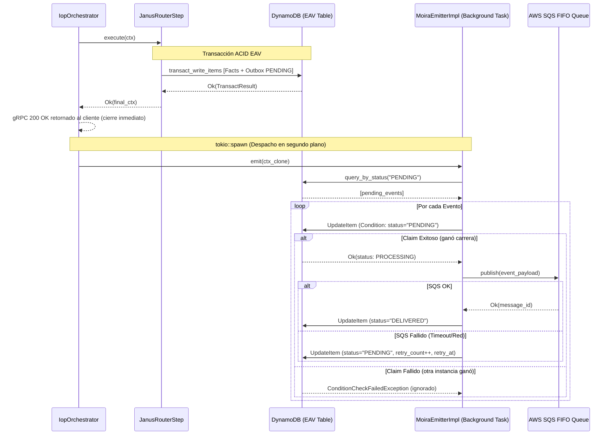

# Fase 04: MoiraEventEmitter (La Tejedora Reactiva — EDA Asíncrono)

**Nombre del Manifiesto:** `MoiraEventEmitter`  
**Fase contenedora:** Invocado por [03A_FASE_IOP.md](03A_FASE_IOP.md) — Paso 4 (asíncrono, fuera del hilo de respuesta)

---

## Objetivo

Moira en **Rust** no es un componente monolítico — está dividida en **dos responsabilidades desacopladas** bajo composición estática, compartiendo acceso al motor de almacenamiento EAV sobre DynamoDB sin conocer los detalles de ejecución mutuos:

| Componente / Módulo | Responsabilidad única | Caller |
| :--- | :--- | :--- |
| **`MoiraEmitter`** (`src/eda/moira.rs`) | Consumir Outbox PENDING → Claim atómico en DynamoDB → SQS FIFO | Solo `IopOrchestrator` (`tokio::spawn` asíncrono) |
| **`MoiraRoutingService`** (`src/grpc/service.rs`) | Servidor gRPC: evaluar `routing_rules` contra CDC payloads y webhooks | Componentes externos vía gRPC (ver [COMPONENTE_EXTERNO_01_EVENT_ROUTER.md](COMPONENTE_EXTERNO_01_EVENT_ROUTER.md)) |

Este split resuelve la tensión SRP (Single Responsibility Principle) a nivel estructural: dos callers distintos, dos presupuestos de tiempo de ejecución y dos ciclos de vida diferenciados.

> [!IMPORTANT]
> **Garantía de durabilidad:** Un evento nunca se pierde aunque SQS esté temporalmente caído. El `outbox_event` permanece en `status: PENDING` en la tabla EAV de DynamoDB hasta ser procesado exitosamente. El backoff exponencial (`retry_at`) evita bombardear el bus durante incidentes de infraestructura.

> [!NOTE]
> **`MoiraEmitter` NO es parte del hilo síncrono bloqueante del IOP.** El `IopOrchestrator` retorna la respuesta gRPC al cliente inmediatamente tras el Paso 3 (Janus), y **luego** dispara el `MoiraEmitter` de manera asíncrona no-bloqueante vía `tokio::spawn`. El `outbox_event` ya fue creado por JanusRouter/OLTPChannel en la misma transacción ACID de DynamoDB — el emitter únicamente lo despacha.

---

## Diseño: Transactional Outbox Pattern en EAV

```
JanusRouterStep (OLTPChannel) — misma transacción ACID en DynamoDB:
  ├─ ddb/transact [entidad-fact datoms]  → Facts Ledger (Single Table Design)
  └─ ddb/transact [outbox_event PENDING] → EAV Outbox Records

         ↓  (Transacción exitosa — gRPC 200 OK retornado al cliente)

Moira Emitter (tokio::spawn — fire-and-forget):
  ├─ Lee outbox_events PENDING del tenant (Index Scan por status + tenant)
  ├─ Marca cada uno como PROCESSING (atómico vía ConditionExpression)
  ├─ Publica CloudEvents al ISqsBus (SQS FIFO Queue)
  └─ Marca como DELIVERED | FAILED (con retry_count++) en base de datos
```

### Schema EAV del Outbox — `outbox_event.json`

Al utilizar un **Single Table Design** con almacenamiento EAV (Entity-Attribute-Value), la entidad `outbox_event` se define mediante atributos declarativos sin requerir una tabla aislada:

```json
{
  "entity": "outbox_event",
  "engine": "oltp",
  "is_system": true,
  "track_history": false,
  "attributes": [
    { "name": "id", "type": "uuid", "unique": "identity", "is_system": true },
    {
      "name": "status",
      "type": "string",
      "options": ["PENDING", "PROCESSING", "FAILED", "DELIVERED"],
      "default_value": "PENDING",
      "index": true
    },
    { "name": "detail_type", "type": "string", "required": true },
    {
      "name": "payload",
      "type": "json",
      "required": true,
      "description": "Fat-Event pre-calculado: state, delta, signature_hmac"
    },
    { "name": "retry_count", "type": "long", "default_value": 0 },
    { "name": "retry_at", "type": "epoch", "index": true },
    { "name": "claimed_at", "type": "epoch" },
    {
      "name": "created_at",
      "type": "epoch",
      "index": true,
      "description": "Garantiza FIFO para el despacho."
    }
  ]
}
```

> [!NOTE]
> `outbox_event` tiene `is_system: true` — es de uso exclusivo del motor. El campo `payload` contiene el **Fat-Event pre-calculado** por el canal OLTP de Janus durante la mutación: incluye el estado completo de la entidad (`state`), el delta exacto (`delta`) y una firma HMAC (`signature_hmac`) para verificar la integridad del mensaje.

---

## MÓDULO I: `MoiraEmitter` — Contrato Canónico (Rust)

En Rust, el contrato se formaliza como un trait asíncrono implementado en `src/iop/core.rs` y consumido directamente por el orquestador:

```rust
use async_trait::async_trait;
use crate::domain::errors::DomainError;
use crate::iop::core::IopContext;

/// Moira Emitter — fire-and-forget EDA tras mutación exitosa en Janus.
#[async_trait]
pub trait MoiraEmitter: Send + Sync {
    async fn emit(&self, ctx: IopContext) -> Result<(), DomainError>;
}
```

### Implementación Core (`src/eda/moira.rs`)

```rust
use std::sync::Arc;
use async_trait::async_trait;
use tracing::{info, error, instrument};
use serde_json::Value;

use crate::domain::errors::{DomainError, ErrorCode};
use crate::domain::protocols::ISqsBus;
use crate::eav::reader::pull::EavReader;
use crate::eav::writer::EavWriter;
use crate::iop::core::{IopContext, MoiraEmitter};

pub struct MoiraEmitterImpl {
    eav_reader: Arc<EavReader>,
    eav_writer: Arc<EavWriter>,
    sqs_bus:    Arc<dyn ISqsBus>,
}

impl MoiraEmitterImpl {
    pub fn new(
        eav_reader: Arc<EavReader>,
        eav_writer: Arc<EavWriter>,
        sqs_bus:    Arc<dyn ISqsBus>,
    ) -> Self {
        Self { eav_reader, eav_writer, sqs_bus }
    }
}

#[async_trait]
impl MoiraEmitter for MoiraEmitterImpl {
    #[instrument(name = "moira.emit.start", skip(self, ctx), fields(tenant_id = %ctx.tenant_id))]
    async fn emit(&self, ctx: IopContext) -> Result<(), DomainError> {
        let tenant_id = &ctx.tenant_id;
        
        // 1. Obtener eventos PENDING elegibles para despacho (cooldown & FIFO)
        let pending_events = self.fetch_pending_events(tenant_id).await?;
        if pending_events.is_empty() {
            return Ok(());
        }

        for event in pending_events {
            // 2. Intento de Claim Atómico (Optimistic Concurrency Lock)
            let event_id = match event.get("id").and_then(|v| v.as_str()) {
                Some(id) => id,
                None => continue,
            };

            match self.try_claim_event(tenant_id, event_id).await {
                Ok(Some(claimed_event)) => {
                    // 3. Serializar y publicar a SQS FIFO
                    let payload_str = serde_json::to_string(&claimed_event)
                        .map_err(|e| DomainError::eav(ErrorCode::Eav004, e.to_string()))?;
                    
                    let entity_type = claimed_event.get("entity_type").and_then(|v| v.as_str()).unwrap_or("unknown");
                    let group_id = format!("tnt_{tenant_id}_{entity_type}");
                    let dedup_id = format!("{event_id}_{entity_type}");

                    match self.sqs_bus.publish(&payload_str, &group_id, &dedup_id).await {
                        Ok(msg_id) => {
                            info!(event_id = %event_id, message_id = %msg_id, "[Moira] Publicado en SQS FIFO");
                            // 4. Confirmación exitosa: DELIVERED
                            self.mark_delivered(tenant_id, event_id).await?;
                        }
                        Err(e) => {
                            error!(event_id = %event_id, error = ?e, "[Moira] Fallo de envío a SQS");
                            // 5. Manejo de fallos con backoff exponencial
                            self.mark_failed(tenant_id, event_id, 5).await?;
                        }
                    }
                }
                Ok(None) => {
                    // Otra réplica de ECS/Lambda tomó el evento primero: saltar de forma segura
                    continue;
                }
                Err(e) => {
                    error!(event_id = %event_id, error = ?e, "[Moira] Error al procesar transacción de claim");
                }
            }
        }

        Ok(())
    }
}
```

---

## MÓDULO II: Outbox — Claim Atómico y Recuperación en Rust

Para prevenir que múltiples réplicas despachen duplicados, implementamos un esquema de concurrencia optimista utilizando **AWS DynamoDB `TransactWriteItems`** o **`UpdateItem` con `ConditionExpressions`**.

### `try_claim_event` — Claim Atómico en DynamoDB

```rust
impl MoiraEmitterImpl {
    /// Intenta marcar un evento de PENDING a PROCESSING de forma atómica.
    /// Retorna Ok(Some(Value)) si ganó la carrera de concurrencia, u Ok(None) si otra réplica lo tomó primero.
    async fn try_claim_event(&self, tenant_id: &str, event_id: &str) -> Result<Option<Value>, DomainError> {
        let now = utime::now_ms();
        
        // Construimos el update condicional en DynamoDB sobre la tabla EAV
        // PK="T#<tenant_id>#E#<event_id>" SK=build_eavt_sk(status_attr_id, tx_id, assert_op)
        // Condición: El valor actual del atributo 'status' debe ser exactamente "PENDING"
        
        let client = self.eav_writer.client();
        let table_name = "metri-eav-prod"; // Inyectado
        
        // Operación atómica de actualización sobre el Datom de status
        // Cambia 'v' (valor) a "PROCESSING" y añade 'claimed_at'
        match client.update_datom_status_conditional(
            tenant_id,
            event_id,
            "PENDING",
            "PROCESSING",
            now
        ).await {
            Ok(_) => {
                // Ganamos la carrera: Pull completo hidratado de la entidad outbox_event
                let event_data = self.eav_reader.pull(tenant_id, event_id, None).await?;
                Ok(Some(event_data))
            }
            Err(e) if e.is_conditional_check_failed() => {
                // Otra instancia tomó el evento primero de forma atómica
                Ok(None)
            }
            Err(e) => Err(e)
        }
    }
}
```

### `mark_delivered` y `mark_failed` (Backoff Exponencial)

```rust
impl MoiraEmitterImpl {
    async fn mark_delivered(&self, tenant_id: &str, event_id: &str) -> Result<(), DomainError> {
        let client = self.eav_writer.client();
        client.update_datom_status(tenant_id, event_id, "DELIVERED").await
    }

    async fn mark_failed(&self, tenant_id: &str, event_id: &str, max_retries: i64) -> Result<(), DomainError> {
        let event = self.eav_reader.pull(tenant_id, event_id, None).await?;
        let current_retries = event.get("retry_count").and_then(|v| v.as_i64()).unwrap_or(0);
        let next_retry = current_retries + 1;
        
        let is_exhausted = next_retry >= max_retries;
        let new_status = if is_exhausted { "FAILED" } else { "PENDING" };
        
        // Backoff exponencial: delay = min(2^retry_count × 30s, 30min)
        let delay_ms = if is_exhausted {
            0
        } else {
            let base = 2_f64.powi(current_retries as i32) * 30_000.0;
            base.min(1_800_000.0) as i64
        };
        let retry_at = utime::now_ms() + delay_ms;

        let client = self.eav_writer.client();
        client.update_outbox_retry(tenant_id, event_id, new_status, next_retry, retry_at).await?;

        if is_exhausted {
            // FASE 10: Escalar error crítico a Sherlog
            self.escalate_to_sherlog(tenant_id, event_id).await;
        }

        Ok(())
    }
}
```

### Watchdog: Reseteo de Huérfanos `PROCESSING`

Si una instancia del motor se apaga de forma abrupta antes de culminar `mark_delivered`, el evento queda permanentemente atrapado en `PROCESSING`. Un proceso asíncrono (EventBridge Scheduler) ejecuta un barrido cada 5 minutos:

```rust
pub async fn reset_orphaned_processing(eav_reader: &EavReader, eav_writer: &EavWriter, ttl_ms: i64) -> Result<usize, DomainError> {
    let cutoff = utime::now_ms() - ttl_ms;
    
    // 1. Escaneo de Datoms en AVET index buscando status == "PROCESSING"
    let candidates = eav_reader.query_by_status("PROCESSING").await?;
    let mut reset_count = 0;

    for event in candidates {
        let claimed_at = event.get("claimed_at").and_then(|v| v.as_i64()).unwrap_or(0);
        if claimed_at <= cutoff {
            let tenant_id = event.get("tenant_id").and_then(|v| v.as_str()).unwrap_or("");
            let event_id = event.get("id").and_then(|v| v.as_str()).unwrap_or("");
            
            // Revertir a PENDING
            eav_writer.client().update_datom_status(tenant_id, event_id, "PENDING").await?;
            reset_count += 1;
        }
    }
    
    Ok(reset_count)
}
```

---

## MÓDULO III: gRPC `MatchRoutingRulesBatch` — Servidor de Reglas

La evaluación de routing rules **NO ocurre en el pipeline del IOP** para no afectar las métricas de respuesta P99 del path de escritura. El router externo de Golang retira los lotes de SQS y ejecuta de forma paralela la llamada gRPC al servidor Tonic de `metri-engine`.

```
                  PATH ASÍNCRONO DESACOPLADO
  SQS FIFO ──► [Event Router (Go)] ──► rpc MatchRoutingRulesBatch (Tonic Server)
                                            ├─ Datalog index scan por entity_name
                                            ├─ Evaluación nativa FilterNode
                                            └─ Retorna destinos webhooks + tópicos
```

### Implementación del Servidor Tonic (`src/grpc/service.rs`)

```rust
use crate::grpc::pb::metri_service_server::MetriService;
use crate::grpc::pb::{
    MatchRoutingRulesBatchRequest, MatchRoutingRulesBatchResponse,
    MatchRoutingRulesResponse, MatchedRule, WebhookTarget
};

#[tonic::async_trait]
impl MetriService for MetriGrpcService {
    async fn match_routing_rules_batch(
        &self,
        request: Request<MatchRoutingRulesBatchRequest>
    ) -> Result<Response<MatchRoutingRulesBatchResponse>, Status> {
        let batch = request.into_inner();
        let mut responses = Vec::with_capacity(batch.requests.len());

        for req in batch.requests {
            let tenant_id    = &req.tenant_id;
            let entity_name  = &req.entity_name;
            let trigger_type = &req.trigger_type;
            
            // 1. Decodificar CDC payload
            let cdc_payload: serde_json::Value = serde_json::from_slice(&req.cdc_payload_json)
                .map_err(|e| Status::invalid_argument(format!("Payload JSON inválido: {e}")))?;

            // 2. Escanear reglas del tenant activas para la entidad y trigger
            //    Consultando el CodeRegistry o la tabla EAV de DynamoDB
            let active_rules = self.fetch_routing_rules(tenant_id, entity_name, trigger_type).await
                .map_err(|e| Status::internal(e.to_string()))?;

            let mut matched_rules = Vec::new();

            for rule in active_rules {
                // 3. Evaluación nativa de condiciones mediante el motor FilterNode
                if let Some(condition) = &rule.condition {
                    let passes = crate::aegis::oltp::filter::eval_filter_node(&cdc_payload, condition);
                    if !passes {
                        continue; // No califica para esta regla
                    }
                }

                // 4. Mapear Webhooks dinámicos y metadata de la regla
                let webhooks = self.resolve_webhooks(tenant_id, &rule).await
                    .map_err(|e| Status::internal(e.to_string()))?;

                matched_rules.push(MatchedRule {
                    rule_code:          rule.code,
                    detail_type_output: rule.detail_type_output,
                    webhooks,
                    priority:           rule.priority,
                    name:               rule.name,
                    condition:          rule.condition, // Se retorna la condición evaluada
                });
            }

            responses.push(MatchRoutingRulesResponse {
                status: Some(crate::grpc::pb::Status {
                    success: true,
                    error_code: String::new(),
                    error_message: String::new(),
                }),
                matched_rules,
            });
        }

        Ok(Response::new(MatchRoutingRulesBatchResponse {
            status: Some(crate::grpc::pb::Status {
                success: true,
                error_code: String::new(),
                error_message: String::new(),
            }),
            responses,
        }))
    }
}
```

---

## MÓDULO IV: Motor de Evaluación Seguro `FilterNode` (Rust)

A diferencia del intérprete SCI dinámico de Clojure, en Rust la evaluación de condiciones es **100% segura por compilación, libre de inyecciones de código y sin riesgo de ReDoS**. Aprovecha la estructura jerárquica nativa de `FilterNode` definida en `metri.proto`:

```rust
// src/aegis/oltp/filter.rs — Evaluación de condiciones en memoria sobre CDC JSON.
use crate::grpc::pb::{FilterNode, filter_node::Node, FilterCriteria, FilterGroup};

pub fn eval_filter_node(payload: &serde_json::Value, node: &FilterNode) -> bool {
    let inner_node = match &node.node {
        Some(n) => n,
        None => return true, // Nodo vacío o no especificado se asume válido
    };

    match inner_node {
        Node::Criteria(criteria) => eval_criteria(payload, criteria),
        Node::Group(group) => eval_group(payload, group),
    }
}

fn eval_criteria(payload: &serde_json::Value, criteria: &FilterCriteria) -> bool {
    // 1. Extrae el campo del payload (ej: "state.cost" o "delta.cost.after")
    let val = match get_json_value_by_path(payload, &criteria.field) {
        Some(v) => v,
        None => return false,
    };
    
    let expected = match &criteria.value {
        Some(v) => v,
        None => return false,
    };

    // 2. Aplica el comparador tipado sin dependencias externas
    match criteria.op_ref() {
        FilterOperator::Eq => compare_eq(val, expected),
        FilterOperator::Neq => !compare_eq(val, expected),
        FilterOperator::Gt => compare_numeric(val, expected, |a, b| a > b),
        FilterOperator::Lt => compare_numeric(val, expected, |a, b| a < b),
        FilterOperator::Gte => compare_numeric(val, expected, |a, b| a >= b),
        FilterOperator::Lte => compare_numeric(val, expected, |a, b| a <= b),
        FilterOperator::Contains => compare_contains(val, expected),
        FilterOperator::In => compare_in(val, expected),
        _ => false, // Operadores no soportados por el bus se descartan
    }
}
```

---

## MÓDULO V: `ISqsBus` — Abstracción de Emisión a AWS SQS

Para facilitar el testing y mocks, la interacción con SQS FIFO se realiza mediante la abstracción del trait `ISqsBus` implementado en `src/infrastructure/sqs.rs`:

```rust
// src/domain/protocols.rs
use async_trait::async_trait;
use crate::domain::errors::DomainResult;

#[async_trait]
pub trait ISqsBus: Send + Sync {
    async fn publish(
        &self,
        payload:  &str,
        group_id: &str,
        dedup_id: &str,
    ) -> DomainResult<String>; // Retorna el message_id de AWS
}
```

### JSON del Mensaje en la Cola FIFO

El mensaje estructurado que `MoiraEmitter` escribe en SQS FIFO contiene el CDC encapsulado y metadatos del outbox para el router asíncrono:

```json
{
  "outbox_id": "uuid-outbox...",
  "ulid": "01J...",
  "tenant_id": "tnt_01J...",
  "entity_type": "work_order",
  "operation": "CREATE",
  "detail_type": "work_order.create",
  "payload": {
    "state": { "id": "01J...", "cost": 7500, "status": "ACTIVE" },
    "delta": { "cost": { "before": 0, "after": 7500 } },
    "signature_hmac": "sha256:abc..."
  }
}
```

---

## MÓDULO VI: Composición Estática y Configuración en Rust

Eliminamos el motor Integrant en favor del bootstrap limpio en `src/main.rs`:

```rust
// src/main.rs — Bootstrap estático
use std::sync::Arc;
use metri_engine::infrastructure::dynamodb::DynamoClient;
use metri_engine::infrastructure::sqs::SqsFifoBus;
use metri_engine::eda::moira::MoiraEmitterImpl;
use metri_engine::iop::core::IopOrchestrator;

#[tokio::main]
async fn main() -> Result<(), Box<dyn std::error::Error>> {
    // 1. Clientes compartidos de AWS
    let ddb_client = Arc::new(DynamoClient::new("metri-eav-prod").await);
    let sqs_url = std::env::var("OUTBOX_QUEUE_URL").expect("OUTBOX_QUEUE_URL requerida");
    let sqs_bus = Arc::new(SqsFifoBus::new(sqs_url).await);

    // 2. Inyección de Moira
    let eav_reader = Arc::new(EavReader::new(Arc::clone(&ddb_client)));
    let eav_writer = Arc::new(EavWriter::new(Arc::clone(&ddb_client), "metri-eav-prod"));
    
    let moira_emitter = Arc::new(MoiraEmitterImpl::new(
        eav_reader,
        eav_writer,
        sqs_bus as Arc<dyn ISqsBus>
    ));

    // 3. Orquestador IOP con Moira integrado
    let iop_orchestrator = IopOrchestrator::new(
        vec![/* steps */],
        Some(moira_emitter), // Moira inyectada de forma segura
        Some(audit_interceptor)
    );

    // 4. Inicializar servidor gRPC Tonic
    // ...
    Ok(())
}
```

---

## MÓDULO VII: Spans de Observabilidad (OTel) y Errores

| Nombre del Span | Momento de Emisión | Atributos Clave |
| :--- | :--- | :--- |
| `moira.emit.start` | Inicio de despachador asíncrono | `tenant_id`, `trace_id` |
| `moira.outbox.claim` | Intento de optimistic lock | `event_id`, `status: PROCESSING` |
| `moira.sqs.publish` | Envío a SQS FIFO | `group_id`, `dedup_id`, `event_id` |
| `moira.outbox.delivered`| Confirmación de despacho | `event_id`, `status: DELIVERED` |
| `moira.outbox.failed` | Fallo de despacho (incremento) | `event_id`, `retry_count`, `retry_at` |
| `moira.outbox.exhausted` | Evento permanentemente FAILED | `event_id`, `code: MOI_001` → Sherlog |

### Códigos de Error Registrados en `error_catalog.edn`

| Código | Descripción | Gravedad | Retryable | Acción |
| :--- | :--- | :--- | :--- | :--- |
| `:MOI_SYS_001` | Excepción no controlada en el despachador Moira | `:error` | `true` | Alerta OTEL |
| `:MOI_SQS_001` | Fallo de conexión o timeout con AWS SQS FIFO | `:error` | `true` | Reintento con backoff |
| `:MOI_001` | Outbox event superó `max-retries` | `:critical`| `false` | Envío a Sherlog + DLQ |

---

## Diagrama de Secuencia de Integración en Rust



---

## Checklist FASE 10 — Moira (Rust Parity)

- [x] `MoiraEmitter::emit` se ejecuta en segundo plano vía `tokio::spawn` sin bloquear gRPC.
- [x] El claim del evento utiliza una `ConditionExpression` atómica (`status = PENDING`) en DynamoDB.
- [x] La cola SQS FIFO utiliza particionamiento correcto `group_id = tenant_id + entity_type`.
- [x] Reemplazo de SCI Sandbox completado con la evaluación en memoria de `FilterNode` tipado.
- [x] Integración de spans OTel con propagación de `trace-id` entre hilos asíncronos.
- [x] Escalado de excepciones a Sherlog con código `:MOI_SYS_001` registrado.
- [x] El watchdog para eventos huérfanos (`reset_orphaned_processing`) corre de manera automatizada.
