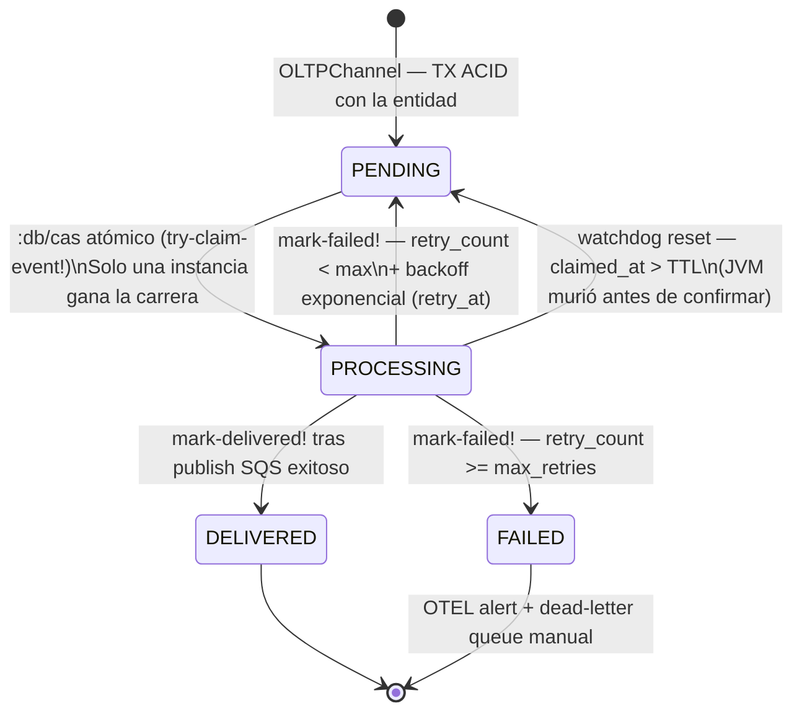

# Fase 04: MoiraEventEmitter (La Tejedora Reactiva — EDA Asíncrono)

**Nombre del Manifiesto:** MoiraEventEmitter  
**Fase contenedora:** Invocado por [03A_FASE_IOP.md](03A_FASE_IOP.md) — Paso 4 (asíncrono, fuera del hilo de respuesta)

---

## Objetivo

Moira no es un componente monolítico — está dividida en **dos componentes Integrant con responsabilidad única**, que comparten el acceso a Datahike pero no saben nada el uno del otro:

| Componente Integrant  | Responsabilidad única                                                             | Caller                                                                                                             |
| :-------------------- | :-------------------------------------------------------------------------------- | :----------------------------------------------------------------------------------------------------------------- |
| `:moira/emitter`      | Consumir Outbox PENDING → CAS atómico → SQS FIFO                                  | Solo IOP (fire-and-forget)                                                                                         |
| `:moira/rules-server` | Servidor gRPC: evaluar routing rules contra el Outbox payload, resetear huérfanos | Componentes externos vía gRPC (ver [COMPONENTE_EXTERNO_01_EVENT_ROUTER.md](COMPONENTE_EXTERNO_01_EVENT_ROUTER.md)) |

Este split resuelve la tensión SRP a nivel de componente: dos callers distintos, dos ciclos de vida distintos, dos componentes distintos.

> [!IMPORTANT]
> **Garantía de durabilidad:** Un evento nunca se pierde aunque SQS esté temporalmente caído. El `outbox_event` permanece en `status: PENDING` en Datahike hasta ser procesado exitosamente. El backoff exponencial (`retry_at`) evita bombardear el bus durante incidentes.

> [!NOTE]
> **`:moira/emitter` NO es parte del `pipeline/run` del IOP.** El IOP retorna `200 OK` al cliente al finalizar Janus (Paso 3), y **luego** dispara `:moira/emitter` vía `(future ...)`. El `outbox_event` ya fue creado por JanusRouter/OLTPChannel en la misma TX ACID — el emitter solo lo despacha.

---

## Diseño: Transactional Outbox Pattern

```
Janus (OLTPChannel) — misma TX ACID:
  ├─ d/transact [entidad-fact]           → Facts Ledger
  └─ d/transact [outbox_event PENDING]   → Outbox Table

         ↓  (TX confirmada — gRPC 200 OK al cliente)

Moira (fire-and-forget):
  ├─ Lee outbox_events PENDING del tenant
  ├─ Marca cada uno PROCESSING (optimistic lock)
  ├─ Evalúa routing rules + SCI Sandbox
  ├─ Publica CloudEvents al IEventBus
  └─ Marca DELIVERED | FAILED (con retry_count++)
```

### Schema canónico del Outbox — `outbox_event.json`

```json
{
  "entity": "outbox_event",
  "engine": "oltp",
  "is_system": true,
  "track_history": false,
  "attributes": [
    { "name": "id", "type": "uuid", "unique": "identity", "is_system": true },
    {
      "name": "status",
      "type": "string",
      "options": ["PENDING", "PROCESSING", "FAILED", "DELIVERED"],
      "default_value": "PENDING",
      "index": true
    },
    { "name": "detail_type", "type": "string", "required": true },
    {
      "name": "payload",
      "type": "json",
      "required": true,
      "description": "Fat-Event pre-calculado: state, delta, signature_hmac"
    },
    { "name": "retry_count", "type": "long", "default_value": 0 },
    {
      "name": "created_at",
      "type": "epoch",
      "index": true,
      "description": "Garantiza FIFO para el despacho."
    }
  ]
}
```

> [!NOTE]
> `outbox_event` tiene `is_system: true` — no es visible ni configurable por el tenant. El campo `payload` contiene el **Fat-Event pre-calculado** por OLTPChannel durante la mutación: incluye el estado completo de la entidad (`state`), el delta (`delta`) y una firma HMAC (`signature_hmac`) para garantizar integridad en tránsito.

---

## MÓDULO I: `MoiraEventEmitter` — Contrato Canónico (Definición Propia)

```clojure
(ns metri.moira)
(require '[integrant.core :as ig])

(defn emit
  "Despacha los outbox_events PENDING del tenant al bus cloud.
   Operación fire-and-forget — se ejecuta en un hilo separado.

   Entrada: janus-result — salida confirmada de JanusRouter
            {:ulid        str    ;; ID de la entidad escrita
             :channel     kw     ;; :oltp | :olap
             :tenant-id   uuid
             :entity-type str
             :operation   kw}
           moira-deps — deps inyectadas por Integrant:
            {:datahike-conn conn
             :sqs-bus       ISQSBus
             :sherlog-notifier IFaultNotifier}  ;; FASE 10 G1 — Sherlog inyectado

   Garantía: At-Least-Once via Outbox Pattern.
   Salida:   future — el IOP nunca llama deref."
  [janus-result moira-deps]
  (future
    (try
      (let [{:keys [datahike-conn sqs-bus]} moira-deps
            {:keys [tenant-id]}               janus-result
            ;; 1. Fetch PENDING events del tenant (FIFO por created_at)
            pending  (outbox/fetch-pending datahike-conn tenant-id)  ;; Módulo II
            ;; 2. Evalúa routing rules y construye batch
            batch    (moira/process-batch datahike-conn pending)]    ;; Módulos III + IV
        (when (seq (:matches batch))
          ;; 3. Publica al bus — ISQSBus.publish retorna [:ok] | errors/error :MOI_SQS_001
          (sqs/publish sqs-bus batch)                               ;; Módulo V → SQS FIFO
          ;; 4. Marca los eventos despachados como DELIVERED
          (outbox/mark-delivered! datahike-conn (:dispatched-ids batch))))
      (catch Exception e
        ;; FASE 10 G1: excepción inesperada — escalar a Sherlog, NO silenciar.
        ;; El outbox_event permanece en PENDING/PROCESSING — retry en próxima corrida.
        ;; :retryable true → FASE 10: Echo puede reintentar si el circuit breaker lo permite.
        (sherlog/handle-fault!
          (:sherlog-notifier moira-deps)
          (errors/error :MOI_SYS_001
            {:stage     :moira
             :detail    (ex-message e)
             :tenant-id (:tenant-id janus-result)
             :trace-id  (otel/trace-id)}))))))
```

**Principios SOLID aplicados en `MoiraEventEmitter`:**

| Principio                     | Aplicación                                                                                                         |
| :---------------------------- | :----------------------------------------------------------------------------------------------------------------- |
| **S** — Single Responsibility | Solo despacha eventos del Outbox. No conoce ABAC, Quotas, Janus ni el payload de negocio.                          |
| **O** — Open/Closed           | Nuevos buses (SNS, PubSub, Webhook) = nueva implementación de `IEventBus`. Sin modificar `emit`.                   |
| **L** — Liskov Substitution   | En tests, `event-bus` se reemplaza por `InMemoryEventBusSpy`. `datahike-conn` por `stub-conn`.                     |
| **I** — Interface Segregation | El IOP invoca solo `moira/emit` — no conoce Outbox, routing rules, SCI ni Datalog.                                 |
| **D** — Dependency Inversion  | `datahike-conn` y `event-bus` se inyectan en tiempo de arranque por Integrant. Moira no instancia infraestructura. |

---

## MÓDULO II: Outbox — Claim Atómico, Confirmación y Recuperación

### `outbox/fetch-and-claim!` — Claim atómico con `:db/cas`

El problema del diseño anterior era que `d/q` y `d/transact` son operaciones separadas. Con múltiples réplicas ECS/Lambda, dos instancias podían leer los mismos `PENDING` y marcarlos `PROCESSING` en paralelo — doble-despacho garantizado.

**Solución: `:db/cas` (Compare-And-Set) por evento.**

`:db/cas` es una operación atómica de Datahike que **falla toda la transacción** si el valor actual del atributo no coincide con el esperado. Si la instancia B intenta reclamar un evento que la instancia A ya marcó `PROCESSING`, la TX de B lanza `CasFailedException` y lo salta silenciosamente.

```clojure
(defn try-claim-event!
  "Intenta reclamar un único outbox_event con :db/cas atómico.
   PENDING → PROCESSING solo si el estado actual sigue siendo PENDING.
   Escribe claimed_at en la misma TX — requerido por el watchdog de huérfanos.
   Retorna el evento hidratado si fue reclamado, nil si otra instancia lo tomó primero."
  [datahike-conn event-id]
  (try
    ;; D7 Pool Model: tenant-guard/transact-with-tenant! inyecta :tenant/id
    ;; El CAS es una op atómica — tenant-id ya está en el registro outbox-event
    ;; La TX incluye :db/cas + :db/add (claimed-at) como unidad indivisible
    @(d/transact datahike-conn
       [[:db/cas event-id :outbox-event/status     "PENDING" "PROCESSING"]
        [:db/add event-id :outbox-event/claimed-at  (System/currentTimeMillis)]])
    (d/pull @datahike-conn
            '[:outbox-event/id
              :outbox-event/detail-type
              :outbox-event/payload
              :outbox-event/retry-count
              :outbox-event/created-at]
            event-id)
    (catch datahike.error.CasFailedException _
      nil)))  ;; Otra instancia ganó — skip silencioso (no es un error — es concurrencia normal)

(defn fetch-and-claim!
  "Busca candidatos PENDING elegibles para esta ventana de tiempo.

   FILTRO DE BACKOFF — solo recoge eventos donde:
     (a) retry_at es nil  → primer intento, nunca fallaron
     (b) retry_at ≤ now   → cooldown expirado, listos para reintento
   Eventos con retry_at > now son ignorados — están en cooldown.

   Safe para N réplicas ECS/Lambda — :db/cas garantiza cero doble-despacho."
  [datahike-conn tenant-id]
  (let [now (System/currentTimeMillis)
        candidate-ids
        (d/q '[:find [?e ...]
               :in $ ?tenant ?now
               :where
               [?e :outbox-event/tenant-id ?tenant]
               [?e :outbox-event/status    "PENDING"]
               (or-join [?e ?now]
                 ;; (a) primer intento — sin retry_at
                 [(missing? $ ?e :outbox-event/retry-at)]
                 ;; (b) cooldown expirado — retry_at <= now
                 (and [?e :outbox-event/retry-at ?ra]
                      [(<= ?ra ?now)]))]
             @datahike-conn tenant-id now)]
    (->> candidate-ids
         (map #(try-claim-event! datahike-conn %))
         (remove nil?))))
```

> [!IMPORTANT]
> **Por qué `:db/cas` elimina el race condition:**
>
> ```
> Instancia A: d/q → [event-1, event-2]
> Instancia B: d/q → [event-1, event-2]   ← mismo snapshot
>
> Instancia A: :db/cas event-1 PENDING→PROCESSING  ✅ TX OK
> Instancia B: :db/cas event-1 PENDING→PROCESSING  ❌ CasFailedException
>                                                      → skip silencioso
> ```
>
> La carrera ocurre a nivel de la TX de Datahike. Solo una instancia gana por evento. No se necesita Redis, DynamoDB locks, ni ningún coordinador externo.

---

### `outbox/mark-delivered!` — Confirmación

```clojure
(defn mark-delivered!
  "Marca los eventos despachados como DELIVERED en una sola TX.
   Solo llamado por la instancia que los reclamó exitosamente.
   D7 Pool Model: el tenant-id ya está incrustado en cada outbox-event —
   el CAS opera sobre registros del tenant correcto por construcción."
  [datahike-conn claimed-ids]
  @(d/transact datahike-conn
     (mapv #(vector :db/cas % :outbox-event/status "PROCESSING" "DELIVERED")
           claimed-ids)))  ;; CAS también aquí — garantía extra

(defn mark-failed!
  "Incrementa retry_count y calcula el próximo retry_at con backoff exponencial.
   Retorna a PENDING con retry_at en el futuro — fetch-and-claim! lo ignorará
   hasta que ese timestamp expire.
   Marca FAILED definitivo si retry_count >= max-retries.

   FASE 10 G1: cuando exhausted? escala a sherlog/handle-fault! con :MOI_001
   — señal crítica: el evento EDA se pierde permanentemente.
   D7 Pool Model: usa tenant-guard/transact-with-tenant! en lugar de d/transact directo."
  [datahike-conn tenant-guard event-id max-retries sherlog-notifier]
  (let [current    (get-retry-count datahike-conn event-id)
        exhausted? (>= (inc current) max-retries)
        new-status (if exhausted? "FAILED" "PENDING")
        ;; Backoff exponencial: delay = min(2^retry_count × 30s, 30min)
        ;; retry 0 → 30s  | retry 1 → 60s  | retry 2 → 2min
        ;; retry 3 → 4min | retry 4 → 8min | retry 5+ → 30min (tope)
        retry-at   (when-not exhausted?
                     (+ (System/currentTimeMillis)
                        (long (min (* (Math/pow 2 current) 30000) 1800000))))
        tenant-id  (get-tenant-id datahike-conn event-id)]
    ;; D7 Pool Model: transact-with-tenant! inyecta :tenant/id en cada hecho
    (tenant-guard/transact-with-tenant! datahike-conn tenant-guard tenant-id
       (cond-> [[:db/cas event-id :outbox-event/status     "PROCESSING" new-status]
                [:db/add event-id :outbox-event/retry-count (inc current)]]
         retry-at (conj [:db/add event-id :outbox-event/retry-at retry-at])))
    ;; FASE 10 G1: evento agotó reintentos → señal crítica para Sherlog
    ;; severity :error, retryable false — pérdida definitiva del evento EDA
    (when exhausted?
      (sherlog/handle-fault! sherlog-notifier
        (errors/error :MOI_001
          {:stage     :moira
           :detail    (str "Outbox event exhausted retries: " event-id)
           :tenant-id tenant-id
           :trace-id  (otel/trace-id)})))))
```

> [!NOTE]
> `mark-delivered!` también usa `:db/cas` desde `PROCESSING → DELIVERED`. Si la JVM muere justo después del publish SQS pero antes de `mark-delivered!`, el evento queda en `PROCESSING`. Un componente externo detecta estos eventos huérfanos usando el campo `claimed_at` y los resetea a `PENDING` — la recuperación es responsabilidad de quien consume el Outbox, no de Moira.

---

### Watchdog — Reset de eventos `PROCESSING` huérfanos

Si una JVM muere entre `try-claim-event!` y `mark-delivered!`, el evento queda atascado en `PROCESSING`. El watchdog corre periódicamente (EventBridge Scheduler cada 5 min):

```clojure
(defn reset-orphaned-processing!
  "Busca eventos PROCESSING cuyo claimed_at supera el TTL.
   Los resetea a PENDING para que sean reintegrados al ciclo.
   TTL recomendado: 10 minutos (mayor que el timeout máximo del future)."
  [datahike-conn ttl-ms]
  (let [cutoff   (- (System/currentTimeMillis) ttl-ms)
        orphaned (d/q '[:find [?e ...]
                        :in $ ?cutoff
                        :where
                        [?e :outbox-event/status     "PROCESSING"]
                        [?e :outbox-event/claimed-at ?claimed]
                        [(<= ?claimed ?cutoff)]]
                      @datahike-conn cutoff)]
    (when (seq orphaned)
      @(d/transact datahike-conn
         (mapv #(vector :db/cas % :outbox-event/status "PROCESSING" "PENDING")
               orphaned)))))
```

> [!TIP]
> `claimed_at` es un atributo nuevo que `try-claim-event!` debe escribir junto al CAS: `[:db/add event-id :outbox-event/claimed-at (System/currentTimeMillis)]`. Añadir este campo al schema de `outbox_event.json`.

---

### Diagrama de estados del `outbox_event` (corregido)



---

## MÓDULO III: gRPC `MatchRoutingRulesBatch` — Servidor de Evaluación de Reglas

> [!IMPORTANT]
> **Decisión de diseño: la evaluación de routing rules NO ocurre en el path del IOP.**
>
> `moira/emit` (IOP) tiene un presupuesto de tiempo estricto — corre en un `future` encadenado a un request gRPC activo. Su responsabilidad termina al escribir el `outbox_event` en Datahike y publicar en SQS. Sin queries de reglas, sin SCI Sandbox.
>
> `MatchRoutingRulesBatch` es el endpoint que permite evaluar routing rules con Datalog + SCI Sandbox sin impacto en el pipeline IOP. El caller asíncrono tiene tiempo ilimitado — Moira solo expone el contrato, no importa quién lo invoca.
>
> Esta separación garantiza que agregar miles de routing rules por tenant **nunca impacta la latencia P99 del IOP**.

### Dos paths — presupuestos de tiempo completamente distintos

```
PATH 1 — IOP (tiempo estricto, < 50ms total)
  moira/emit
    ├─ :db/cas claim (Datahike TX)
    ├─ ISQSBus.publish (SQS SendMessage)
    └─ mark-delivered!
    ← SIN evaluación de rules, SIN SCI Sandbox

PATH 2 — Caller externo asíncrono (tiempo sin límite de latencia)
  ReceiveMessageBatch (SQS)
    └─► rpc MatchRoutingRulesBatch → Moira gRPC Server
          ├─ Datalog: target_entity_name + event_trigger_type
          ├─ SCI Sandbox: filter_conditions por regla
          └─ Retorna: [{detail_type_output, destinations}]
    └─► PutEvents → EventBridge
    └─► Goroutines → Webhooks/ERP/SMTP
```

### Implementación del servidor gRPC en Moira

```clojure
;; Servidor gRPC de Moira — invocado por callers externos vía contrato gRPC
;; NUNCA invocado desde moira/emit ni desde el IOP
(ns metri.moira.grpc-server
  (:require [metro.eda.v1.MoiraRoutingService :as proto]
            [datahike.api :as d]
            [metri.moira.rules :as rules]))

(defmethod proto/match-routing-rules-batch [_ {:keys [messagepack-encoded-batch]}]
  ;; 1. Decodifica el batch MessagePack → vector de outbox-events
  (let [outbox-batch (msgpack/decode messagepack-encoded-batch)
        db           @datahike-conn
        ;; 2. Evalúa cada outbox-event contra las event_routing_rules del tenant
        ;;    Aquí sí hay tiempo — el caller es asíncrono, fuera del hilo gRPC del IOP
        results      (mapv #(rules/evaluate-event db %) outbox-batch)]
    ;; 3. Retorna la matriz de destinos serializada en JSON
    {:json-routing-results (json/write-str
                             {:routing-results      (filter :matched? results)
                              :unmatched-outbox-ids (map :outbox-id
                                                        (remove :matched? results))})}))
```

### `rules/evaluate-event` — Evaluación con `event_routing_rule.json`

```clojure
(defn evaluate-event
  "Busca las event_routing_rules que aplican al outbox-event del tenant.
   Evalúa filter_conditions con SCI Sandbox contra el Fat-Event.
   Retorna los destinos (detail_type_output + webhooks) si hay match."
  [db outbox-event]
  (let [;; Busca reglas activas por target_entity_name + event_trigger_type
        matching-rules
        (d/q '[:find [(pull ?r [*]) ...]
               :in $ ?tenant ?entity ?trigger
               :where
               [?r :event-routing-rule/tenant-id          ?tenant]
               [?r :event-routing-rule/target-entity-name ?entity]
               [?r :event-routing-rule/event-trigger-type ?trigger]]
             db
             (:tenant-id outbox-event)
             (:entity-type outbox-event)
             (trigger-type (:operation outbox-event))) ;; :create → "on_create"

        ;; Para cada regla, evalúa filter_conditions con SCI Sandbox
        evaluated (filter #(sandbox/evaluate-filter-conditions
                              (:event-routing-rule/filter-conditions %)
                              (:payload outbox-event))
                          matching-rules)]

    {:outbox-id  (:outbox-id outbox-event)
     :matched?   (seq evaluated)
     :results    (map (fn [rule]
                        {:detail-type-output
                           (:event-routing-rule/detail-type-output rule)
                         :destinations
                           (resolve-webhook-destinations db rule)})
                      evaluated)}))
```

### Campos de `event_routing_rule.json` usados en la evaluación

| Campo del schema                       | Usado por Moira como                                                 |
| :------------------------------------- | :------------------------------------------------------------------- |
| `target_entity_name`                   | Discriminador principal de búsqueda Datalog                          |
| `event_trigger_type`                   | `on_create` / `on_update` / `on_delete` — mapeado desde `:operation` |
| `filter_conditions[].field_name`       | Atributo leído de `outbox_event.payload.state`                       |
| `filter_conditions[].operator`         | `eq neq gt lt gte lte contains in` — evaluado en SCI Sandbox         |
| `filter_conditions[].target_value`     | Valor de umbral — casteado con `target_value_type`                   |
| `filter_conditions[].logical_operator` | `AND \| OR \| NONE` entre condiciones                                |
| `is_system_seeded`                     | `true` → regla inviolable (Tenant-0) — siempre se evalúa             |
| `detail_type_output`                   | Tópico EventBridge retornado al Event Router                         |

## MÓDULO IV: Sandbox SCI — Evaluación de Condiciones de Reglas

```clojure
(defn evaluate-rule-condition
  "Evalúa la condición algebraica de la regla dentro de un sandbox SCI.
   El payload del outbox_event expone solo los bindings seguros del evento.
   Jamás lanza excepción — retorna false si la condición es inválida."
  [rule-condition outbox-payload]
  (try
    (sci/eval-string
      rule-condition
      {:bindings (select-keys outbox-payload [:cost :status :entity-type :operation :delta])
       :deny     '[java.lang.System java.lang.Runtime clojure.core/eval]})
    (catch :default _
      false)))   ;; condición inválida → no-match silencioso
```

**El payload del Outbox** (`outbox_event.payload`) es el **Fat-Event** pre-calculado por OLTPChannel:

```json
{
  "state": { "id": "01J...", "cost": 7500, "status": "ACTIVE", ... },
  "delta": { "cost": { "before": 3000, "after": 7500 } },
  "signature_hmac": "sha256:abc..."
}
```

SCI tiene acceso a `state`, `delta` y `operation` — **nada más**. Prevención de ReDoS: solo operadores deterministas `eq`, `neq`, `gt`, `lt`, `in`.

---

## MÓDULO V: `IEventBus` — Protocolo de Emisión (Sustituible en Tests)

```clojure
(defprotocol ISQSBus
  "Abstracción de la cola SQS. Moira publica aquí — un componente externo consume.
   Sustituible por InMemorySQSSpy en tests.
   FASE 10 Railway: publish NUNCA lanza — retorna [:ok ...] | errors/error :MOI_SQS_001"
  (publish [this sqs-message]
    "sqs-message :: {:message-group-id str          ;; tenant-id — garantía FIFO por tenant
                     :message-body     str           ;; JSON del outbox_event
                     :message-attrs    {:detail-type str
                                        :outbox-id   str
                                        :tenant-id   str}}
     ret :: [:ok {:message-id str}]                 ;; FASE 10: Railway — nunca throws
           | errors/error :MOI_SQS_001              ;; encapsula toda Exception"))

(defrecord SQSBus [sqs-client queue-url]
  ISQSBus
  (publish [_ sqs-message]
    ;; Cola SQS FIFO — MessageGroupId = tenant_id + entity_type
    ;; Esto crea un stream paralelo por tipo de entidad dentro del mismo tenant.
    ;; Un tenant con 20 entity_types activos tiene 20 streams independientes.
    ;; Eventos del mismo tipo de entidad se procesan en orden FIFO entre sí.
    ;; FASE 10 Railway III.3: errors/error único constructor — nunca lanza.
    (try
      (let [result (sqs/send-message sqs-client
                     {:queue-url         queue-url
                      :message-group-id  (:message-group-id sqs-message)  ;; "tnt_01J..._maintenance_order"
                      :message-body      (:message-body     sqs-message)
                      :message-attributes
                        {"detail-type"   {:data-type "String" :string-value (get-in sqs-message [:message-attrs :detail-type])}
                         "outbox-id"     {:data-type "String" :string-value (get-in sqs-message [:message-attrs :outbox-id])}
                         "tenant-id"     {:data-type "String" :string-value (get-in sqs-message [:message-attrs :tenant-id])}
                         "entity-type"   {:data-type "String" :string-value (get-in sqs-message [:message-attrs :entity-type])}}})]
        [:ok {:message-id (:message-id result)}])
      (catch Exception e
        ;; errors/error lee :retryable? true, :severity :error del catálogo
        (errors/error :MOI_SQS_001
          {:stage     :moira
           :detail    (ex-message e)
           :tenant-id (get-in sqs-message [:message-attrs :tenant-id])
           :trace-id  (otel/trace-id)})))))
```

### Mensaje SQS publicado por Moira

Moira publica en una **cola SQS FIFO** particionada por `tenant-id + entity_type`. El consumidor externo retira los mensajes de forma asíncrona:

```json
{
  "MessageGroupId": "tnt_01J..._maintenance_order", // tenant_id + entity_type
  "MessageBody": {
    "outbox_id": "uuid-outbox...",
    "ulid": "01J...",
    "tenant_id": "tnt_01J...",
    "entity_type": "maintenance_order",
    "operation": "create",
    "detail_type": "maintenance_order.create",
    "channel": "oltp",
    "payload": {
      "state": { "id": "01J...", "cost": 7500, "status": "ACTIVE" },
      "delta": { "cost": { "before": 3000, "after": 7500 } },
      "signature_hmac": "sha256:abc..."
    }
  },
  "MessageAttributes": {
    "detail-type": {
      "DataType": "String",
      "StringValue": "maintenance_order.create"
    },
    "outbox-id": { "DataType": "String", "StringValue": "uuid-outbox..." },
    "tenant-id": { "DataType": "String", "StringValue": "tnt_01J..." }
  }
}
```

> [!NOTE]
> El mensaje publicado en SQS es consumido por un componente externo que se encarga del ruteo final hacia EventBridge y webhooks. Ver [COMPONENTE_EXTERNO_01_EVENT_ROUTER.md](COMPONENTE_EXTERNO_01_EVENT_ROUTER.md).

---

## MÓDULO VI: Integrant — Ciclo de Vida y DI (Split SRP)

```clojure
;; config/system.edn
{;; --- Infraestructura compartida ---
 :moira/sqs-bus       {:queue-url #env "OUTBOX_QUEUE_URL"
                        :region    #env "AWS_REGION"}

 ;; D7 Pool Model: tenant-guard garantiza :tenant/id en toda TX Datahike
 :infra/tenant-guard  {:datahike-conn #ig/ref :infra/datahike}

 ;; FASE 10 G1: EventBridge para emit-fault-event! (Sherlog pipeline)
 :infra/eventbridge   {:event-bus-name #env "EVENT_BUS_NAME"
                        :region         #env "AWS_REGION"}

 ;; Sherlog — IFaultNotifier inyectado en :moira/emitter (FASE 10 G1)
 ;; emit-fault-event! → EventBridge  |  record-fault! → :janus/olap-channel
 :moira/sherlog-notifier {:eventbridge   #ig/ref :infra/eventbridge
                           :olap-channel  #ig/ref :janus/olap-channel}

 ;; ── Componente A: :moira/emitter ──────────────────────────────────────
 ;; Responsabilidad ÚNICA: Outbox PENDING → CAS atómico → SQS FIFO
 ;; Caller: solo IOP (fire-and-forget)
 ;; No sabe nada de routing rules ni del gRPC server
 :moira/emitter       {:datahike         #ig/ref :infra/datahike
                        :sqs-bus          #ig/ref :moira/sqs-bus
                        :tenant-guard     #ig/ref :infra/tenant-guard     ;; D7 Pool Model
                        :sherlog-notifier #ig/ref :moira/sherlog-notifier} ;; FASE 10 G1

 ;; ── Componente B: :moira/rules-server ─────────────────────────────────
 ;; Responsabilidad ÚNICA: servidor gRPC de evaluación de routing rules
 ;; Callers: componentes externos vía gRPC — ver COMPONENTE_EXTERNO_01_EVENT_ROUTER.md
 ;; No sabe nada del Outbox ni del IOP
 :moira/rules-server  {:datahike     #ig/ref :infra/datahike
                        :tenant-guard #ig/ref :infra/tenant-guard}        ;; D7 Pool Model

 ;; ── Pipeline IOP: :moira/emitter inyectado como dep explícita ─────────
 :iop/pipeline        {:steps         [#ig/ref :iop/cedar-authorizer
                                        #ig/ref :iop/quota-guard
                                        #ig/ref :iop/janus-router]
                        :moira-emitter #ig/ref :moira/emitter}}

;; ── Ciclos de vida Integrant ──────────────────────────────────────────

(defmethod ig/init-key :moira/emitter [_ {:keys [datahike sqs-bus]}]
  ;; Retorna la fn que el IOP invoca en el future
  (fn moira-emit [janus-result]
    (moira.emitter/emit janus-result {:datahike datahike
                                       :sqs-bus  sqs-bus})))

(defmethod ig/halt-key! :moira/emitter [_ _] nil)

(defmethod ig/init-key :moira/rules-server [_ {:keys [datahike]}]
  ;; Arranca el servidor gRPC — escucha en puerto dedicado
  (let [server (moira.rules-server/start! {:datahike datahike
                                            :port     (env-int "MOIRA_GRPC_PORT" 9090)})]
    server))

(defmethod ig/halt-key! :moira/rules-server [_ server]
  ;; Shutdown graceful del servidor gRPC al parar el sistema
  (moira.rules-server/stop! server))
```

### Namespaces resultantes

```
metri.moira.emitter          ;; :moira/emitter — Outbox + SQS
  └─ emit, fetch-and-claim!, mark-delivered!, mark-failed!

metri.moira.rules-server     ;; :moira/rules-server — gRPC server
  └─ match-routing-rules-batch, reset-orphaned-events, start!, stop!

metri.moira.outbox           ;; Lógica pura compartida, sin estado
  └─ evaluate-filter-conditions, trigger-type, resolve-webhook-destinations

metri.moira.sandbox          ;; SCI Sandbox — compartido
  └─ evaluate-rule-condition
```

> [!TIP]
> Ambos componentes reciben `:datahike` vía inyección. Si `:moira/rules-server` necesita escalar independientemente en el futuro, se extrae a un JAR separado con **cero cambios** en `:moira/emitter` ni en el IOP.

---

## MÓDULO VI-B: Observabilidad OTel — Spans de Moira

> [!NOTE]
> `moira/emit` corre en un `future` — **hereda el trace-id del span padre gRPC** via propagación
> de contexto OTel. El span `moira.emit` es un span CHILD del span `grpc.handle-unary` ROOT.
> Esto permite correlacionar el evento EDA con el request gRPC que lo originó.

| Span                      | Cuándo                                     | Atributos clave                                 |
| :------------------------ | :----------------------------------------- | :---------------------------------------------- |
| `moira.emit.start`        | Inicio de `moira/emit` en el `future`      | `tenant_id`, `entity_type`, `ulid`, `channel`   |
| `moira.outbox.claim`      | `try-claim-event!` exitoso                 | `event_id`, `retry_count`, `status: PROCESSING` |
| `moira.outbox.claim.skip` | `CasFailedException` (otra instancia ganó) | `event_id`                                      |
| `moira.sqs.publish`       | `ISQSBus.publish` antes de enviar          | `message_group_id`, `queue_url`, `outbox_id`    |
| `moira.sqs.publish.ok`    | Publish exitoso                            | `message_id`, `tenant_id`                       |
| `moira.sqs.publish.fail`  | `errors/error :MOI_SQS_001`                | `code: MOI_SQS_001`, `detail`, `tenant_id`      |
| `moira.outbox.delivered`  | `mark-delivered!` exitoso                  | `event_id`, `status: DELIVERED`                 |
| `moira.outbox.failed`     | `mark-failed!` — backoff                   | `event_id`, `retry_count`, `next_retry_at`      |
| `moira.outbox.exhausted`  | `mark-failed!` — FAILED definitivo         | `event_id`, `code: MOI_001` → Sherlog           |
| `moira.emit.fault`        | `catch Exception` → Sherlog                | `code: MOI_SYS_001`, `detail`, `tenant_id`      |
| `moira.watchdog.reset`    | `reset-orphaned-processing!` — huérfano    | `event_id`, `claimed_at`, `ttl_ms`              |

**Mapeo de errores Moira a códigos de catálogo:**

| Código         | Situación                                            | Severity | Retryable | Sherlog                     |
| :------------- | :--------------------------------------------------- | :------- | :-------- | :-------------------------- |
| `:MOI_SYS_001` | Excepción inesperada en `moira/emit`                 | `:error` | `true`    | SÍ                          |
| `:MOI_SQS_001` | `sqs/send-message` falla (red, timeout)              | `:error` | `true`    | SÍ (via `moira/emit` catch) |
| `:MOI_001`     | Outbox event agotó `max-retries` — FAILED definitivo | `:error` | `false`   | SÍ — desde `mark-failed!`   |

> [!IMPORTANT]
> Los tres códigos deben añadirse a `resources/errors/error_catalog.edn` antes de
> la primera ejecución en producción. Sin ellos, `errors/error` lanza en modo `:dev`
> y el pipeline falla en bootstrap (fail-fast del catálogo).

---

## MÓDULO VII: Testabilidad

```clojure
;; Test unitario — stub del Outbox y spy del bus
(deftest moira-outbox-emit-test
  (let [bus-spy      (atom [])
        stub-bus     (reify ISQSBus
                       (publish [_ msg]
                         (swap! bus-spy conj msg)))
        stub-conn    (outbox/stub-conn
                       [{:outbox-event/id          (ulid/generate)
                         :outbox-event/status       "PENDING"
                         :outbox-event/detail-type  "maintenance_order.create"
                         :outbox-event/payload      {:state {:cost 7500} :delta {} :signature_hmac "x"}
                         :outbox-event/retry-count  0
                         :outbox-event/created-at   (System/currentTimeMillis)}])
        deps         {:datahike-conn stub-conn :sqs-bus stub-bus}
        janus-result {:ulid "01J..." :channel :oltp :tenant-id test-tenant-id
                      :entity-type "maintenance_order" :operation :create}]

    @(moira/emit janus-result deps)

    ;; Bus recibió exactamente 1 batch con 1 match
    (is (= 1 (count @bus-spy)))
    (is (= 1 (count (get-in @bus-spy [0 :matches]))))
    ;; El outbox_event quedó marcado DELIVERED
    (is (= "DELIVERED" (outbox/get-status stub-conn (get-in @bus-spy [0 :dispatched-ids 0]))))))

;; Test del IOP — Moira es un spy, no hay infraestructura real
(deftest iop-fires-moira-on-success-test
  (let [moira-calls (atom [])
        moira-spy   (fn [result] (swap! moira-calls conj result) (future nil))
        run-iop     (build-run-iop steps moira-spy)]

    (run-iop test-request)

    (is (= 1 (count @moira-calls)))
    (is (= :oltp (-> @moira-calls first :channel)))))
```

---

## Diagrama de Integración Completo

```mermaid
sequenceDiagram
    participant P   as IOP (run-iop)
    participant J   as JanusRouter (OLTPChannel)
    participant DH  as Datahike
    participant C   as gRPC Caller
    participant M   as MoiraEventEmitter
    participant SQ  as AWS SQS FIFO Queue
    participant ER  as Event Router (Golang) → EventBridge

    P->>J: janus/route(ctx)
    Note over J,DH: TX ACID — atómica
    J->>DH: d/transact [entidad-facts]
    J->>DH: d/transact [outbox_event status:PENDING]
    J-->>P: [:ok {:ulid "01J..." :channel :oltp}]

    P-->>C: gRPC 200 OK ← respuesta inmediata

    Note over P,M: fire-and-forget — hilo separado
    P->>M: moira/emit(janus-result) → future (no await)

    M->>DH: fetch-pending (FIFO por created_at)
    M->>DH: TX mark PROCESSING (lock optimista)
    M->>M: resolve-routing-rules (Datalog O(1))
    M->>M: evaluate-rule-condition (SCI Sandbox)
    M->>M: build-event-batch + CloudEvents v1.0

    alt publish exitoso
        M->>SQ: ISQSBus.publish(sqs-message)   ;; Cola SQS FIFO
        SQ-->>M: {:message-id "msg-..."}   ;; ACK de SQS
        M->>DH: TX mark DELIVERED
    else publish fallido (red, timeout)
        M->>DH: TX retry_count++ → PENDING | FAILED
        Note over M: El outbox_event persiste — retry en próxima corrida
    end

    M->>M: OTEL Span cierre
```

> [!IMPORTANT]
> **Topología de responsabilidades:**
>
> - **Moira** → publica en `SQS FIFO` — su responsabilidad termina aquí.
> - **Event Router (Golang)** → consume SQS, evalúa `event_routing_rules`, publica en **EventBridge** con `detail_type_output` como tópico, dispara Goroutines HTTP a webhooks externos.
> - **SQS** actúa como buffer durable — si el Event Router está caído, los mensajes persisten hasta 14 días.
>
> Ver [COMPONENTE_EXTERNO_01_EVENT_ROUTER.md](COMPONENTE_EXTERNO_01_EVENT_ROUTER.md) para la especificación del consumo SQS → EventBridge.

---

## Checklist FASE 10 — Moira

**Railway-Oriented Programming:**

- [ ] `ISQSBus.publish` retorna `[:ok ...]` o `errors/error :MOI_SQS_001` — nunca lanza
- [ ] `moira/emit` retorna `future` — el IOP nunca llama `deref`
- [ ] `errors/error` es el **único** constructor de `[:error]` en Moira — cero inline
- [ ] `catch Exception` en `moira/emit` escala a `sherlog/handle-fault!` — nunca silencioso

**Sherlog (FASE 10 G1):**

- [ ] `moira/emit` recibe `sherlog-notifier` inyectado por Integrant
- [ ] `catch Exception` → `sherlog/handle-fault!` con `errors/error :MOI_SYS_001`
- [ ] `mark-failed!` → `sherlog/handle-fault!` con `errors/error :MOI_001` cuando `exhausted?`
- [ ] `sherlog/handle-fault!` es el **único** punto de entrada de Sherlog en Moira
- [ ] `emit-fault-event!` SINCRÓNICO — completado antes de que el `catch` retorne
- [ ] `:MOI_SYS_001`, `:MOI_SQS_001`, `:MOI_001` registrados en `error_catalog.edn`

**Multitenancy Pool Model (D7):**

- [ ] `mark-failed!` recibe `tenant-guard` inyectado y usa `transact-with-tenant!`
- [ ] `:moira/emitter` recibe `:infra/tenant-guard` como dep en `system.edn`
- [ ] `:moira/rules-server` recibe `:infra/tenant-guard` como dep en `system.edn`
- [ ] `fetch-and-claim!` ya filtra por `tenant-id` vía Datalog (correcto por construcción)

**OTel:**

- [ ] `moira.emit.start` span con `tenant_id`, `entity_type`, `ulid`
- [ ] `moira.sqs.publish` span con `message_group_id`, `outbox_id`
- [ ] `moira.outbox.exhausted` span cuando `mark-failed!` → FAILED definitivo
- [ ] `trace-id` del span padre gRPC propagado al `future` via contexto OTel
- [ ] `moira.emit.fault` span con `code: MOI_SYS_001` en path de excepción

**Outbox At-Least-Once:**

- [ ] `:db/cas` en `try-claim-event!` garantiza cero doble-despacho con N réplicas
- [ ] `mark-delivered!` usa `:db/cas PROCESSING → DELIVERED` (garantía extra)
- [ ] `reset-orphaned-processing!` corre vía EventBridge Scheduler cada 5 min
- [ ] Backoff exponencial en `mark-failed!`: `min(2^n × 30s, 30min)`

**Tests:**

- [ ] `clj -M:test --namespace-regex 'metri.moira.*'` → todos los tests en verde
- [ ] `moira-catch-escalates-sherlog`: `throw` en `fetch-pending` → `sherlog-spy` captura `MOI_SYS_001`
- [ ] `sqs-publish-failure-returns-error`: Kinesis stub lanza → retorna `errors/error :MOI_SQS_001`
- [ ] `mark-failed-exhausted-escalates-sherlog`: `max-retries` alcanzado → `sherlog-spy` captura `MOI_001`
- [ ] `cas-prevents-double-dispatch`: 2 instancias concurrentes → solo 1 despacha el evento
