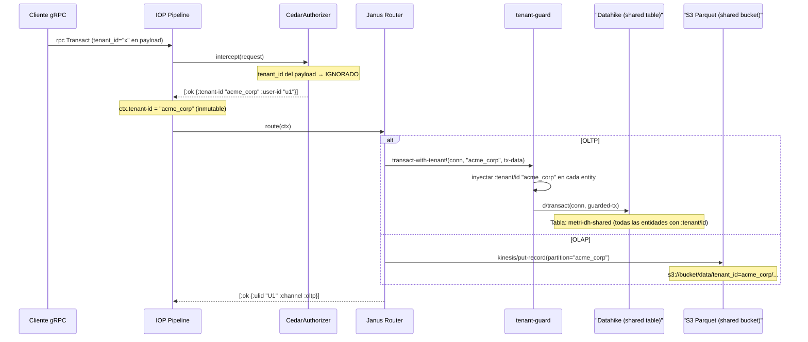

# Fase 05.01 — Cerebro Janus (Orquestador Core Principal)

**Janus** es el punto central de ruteo del `MetriService` y el único encargado de orquestar la escritura (OLTP/OLAP) y la construcción del Árbol de Sintaxis Abstracta (ATS) para consultas. Funciona bajo diseño estricto Zero-Trust, Railway-Oriented Programming y **aislamiento multitenant por diseño (Pool Model)**.

---

## 1. Topología del Componente

- **Namespace Aislado:** `src/metri/engine/janus/core.clj` provee aislamiento estricto de los flujos `Transact` y `Query`. Janus nunca escribe en base de datos directamente, orquesta mediante protocolos inyectados.
- **Posición en el IOP:** Janus es el **Paso 3** del IOP — solo se ejecuta después de que Cedar (Paso 1) y Quota (Paso 2) hayan emitido `[:ok ...]`.
- **Documento de referencia detallado:** [03B_FASE_JANUS_ROUTER.md](03B_FASE_JANUS_ROUTER.md) contiene los módulos completos I–XIV.

---

## 2. Orquestación del ATS y Zero-Trust

1. **Request canónico:** Janus recibe el `ctx` del IOP — con `tenant-id`, `user-id` y `role` ya resueltos por Cedar. El payload gRPC ya fue traducido a mapa Clojure por `grpc.translator`.
2. **Censura ABAC:** El `tenant-id` del `ctx` fue inyectado por `CedarAuthorizer` desde Valkey. Janus **nunca** lee el `tenant_id` del payload del cliente — lo sobreescribe con el del `ctx`.
3. **Safe ATS:** Para queries, Janus construye el Raw ATS y lo envía al interceptor Cedar para poda ABAC + RLS (Row-Level Security) antes de derivar a **Aegis**.

---

## 3. Filosofía Zero-Exception (ROP + EDA + OTel)

- Los bloques `try/catch` están **prohibidos** en Janus. Todo el flujo obedece el patrón Railway devolviendo `[:ok val]` o `[:error payload]`.
- Si ocurre una violación Malli en la entrada o Cedar dictamina un rechazo de dominio, Janus empaqueta el error como un **Rich Context Error** del `error_catalog.edn`.
- En lugar de colapsar la petición o tragar la falla (swallowing), Janus despacha el fracaso como evento EDA e inyecta trazas **OpenTelemetry (`traceparent`)**, enviándolas como Spans asíncronos al bus de errores.

---

## 4. PRINCIPIO: Aislamiento Multitenant en Janus (Pool Model)

> [!CAUTION]
> **Este principio es IRRENUNCIABLE. Janus es el guardián final del aislamiento B2B antes de tocar storage.**
> La violación de cualquier garantía es vulnerabilidad **P0 crítica**.

### 4.1 — Modelo Pool: Infraestructura Compartida

```
Recurso              Instancia                    Modelo
──────────────────   ─────────────────────────    ────────────────────
DynamoDB table       metri-dh-shared               UNA tabla compartida
Datahike conn        :infra/datahike (Integrant)   UNA conexión compartida
S3 bucket            metri-lake-{account}           UN bucket compartido
Athena database      metri_analytics                UNA database compartida
SQS queue            metri-outbox.fifo              UNA cola compartida
Valkey cluster       :infra/valkey                  UN clúster compartido
```

> [!IMPORTANT]
> **El aislamiento NO es físico — es lógico, garantizado por el `tenant-guard`.**
> Toda operación Datahike pasa OBLIGATORIAMENTE por `tenant-guard`, que inyecta
> el filtro `:tenant/id` en toda escritura y lectura. Ningún componente hace
> `d/transact` o `d/q` directamente.

### 4.2 — Invariantes de Aislamiento en Janus

```
Capa                   Mecanismo en Janus                         Garantía
───────────────────    ───────────────────────────────────────    ──────────────────────
tenant_id inyectado    ctx.tenant-id viene de Cedar (SIEMPRE)     Identidad soberana
d/transact             via tenant-guard/transact-with-tenant!     :tenant/id inyectado
                       NUNCA d/transact directo                    en cada entidad
d/q (lectura)          via tenant-guard/query-with-tenant          :tenant/id como filtro
                       NUNCA d/q directo                           obligatorio en [:where]
d/pull                 via tenant-guard/pull-with-tenant            Verificación post-pull
sequence_code          tenant_id como prefijo del scope            Contadores B2B aislados
                       "acme_corp:work_order_number_seq"
outbox_event           tenant_id en cada evento SQS emitido        EDA segregada por tenant
olap_record            tenant_id como partition key en S3           Parquet particionado B2B
```

### 4.3 — Datahike: Tabla Compartida + `tenant-guard` (OLTP)

```clojure
;; Janus NUNCA hace d/transact directo — siempre via tenant-guard.
;; La conexión Datahike es COMPARTIDA (una sola tabla DynamoDB).
;; El aislamiento depende 100% del filtro :tenant/id.

(defn route-oltp
  "Rutea la escritura OLTP — usa tenant-guard para aislar por tenant."
  [{:keys [datahike-conn tenant-id entity-type payload] :as ctx}]
  (let [tx-data (build-tx-data ctx)]
    ;; tenant-guard inyecta :tenant/id en CADA entidad
    ;; y bloquea si alguna entidad trae un tenant distinto
    (tenant-guard/transact-with-tenant! datahike-conn tenant-id tx-data)))

(defn query-entities
  "Lee entidades — SIEMPRE filtrado por tenant-id via tenant-guard."
  [{:keys [datahike-conn tenant-id entity-type] :as ctx}]
  ;; tenant-guard inyecta [:where [?e :tenant/id "acme_corp"]] automáticamente
  (tenant-guard/query-with-tenant datahike-conn tenant-id
    {:find  '[?e ?v]
     :where [['?e :entity/type entity-type]]}))
```

> [!WARNING]
>
> ```clojure
> ;; ❌ PROHIBIDO — d/transact directo sin tenant-guard:
> (d/transact conn tx-data)
> ;; → NO inyecta :tenant/id → data breach potencial
>
> ;; ❌ PROHIBIDO — d/q directo sin tenant-guard:
> (d/q '[:find ?e :where [?e :entity/type "asset"]] @conn)
> ;; → NO filtra por tenant → retorna datos de TODOS los tenants
>
> ;; ✅ OBLIGATORIO — siempre via tenant-guard:
> (tenant-guard/transact-with-tenant! conn tenant-id tx-data)
> (tenant-guard/query-with-tenant conn tenant-id query-map)
> ```

### 4.4 — S3 + Parquet: Bucket Compartido + Partición por tenant_id (OLAP)

```clojure
;; Cada escritura OLAP incluye tenant_id como partition key.
;; Kinesis Firehose dynamic partitioning → S3 prefix aislado por tenant.

(defn route-olap
  "Rutea la escritura OLAP — tenant_id como partition key en Kinesis."
  [{:keys [tenant-id entity-type] :as ctx} record]
  (let [s3-prefix (olap-partition/tenant-s3-prefix tenant-id entity-type)]
    (kinesis/put-record {:stream-name   (str kinesis-prefix "-" entity-type)
                         :partition-key tenant-id
                         :data          (serialize-parquet record)})))
```

> [!IMPORTANT]
> **Estructura S3 — bucket compartido, particionado por tenant:**
>
> ```
> s3://metri-lake-{account}/
> └── data/
>     ├── tenant_id=acme_corp/
>     │   ├── entity_type=work_order/year=2026/month=04/day=16/*.parquet
>     │   └── entity_type=asset/year=2026/month=04/day=16/*.parquet
>     ├── tenant_id=globex_inc/
>     │   └── entity_type=work_order/...
> ```
>
> Athena partition pruning → `WHERE tenant_id = 'acme_corp'` solo escanea ese prefix.

### 4.5 — Athena: Database Compartida + Filtro Obligatorio (Analytics)

```clojure
;; UNA SOLA database Athena: metri_analytics
;; TODA query incluye WHERE tenant_id = ? — sin excepción.

;; Ejemplo de query generado por Aegis:
;; SELECT * FROM metri_analytics.work_order
;; WHERE tenant_id = 'acme_corp'
;;   AND year = 2026 AND month = 4;
;;
;; Partition pruning → solo lee:
;;   s3://bucket/data/tenant_id=acme_corp/entity_type=work_order/year=2026/...
```

### 4.6 — Diagrama de Flujo Multitenant (Pool Model)



---

## 5. Pruebas y Despliegue

- **Casos TDD (`clojure.test`):** Validación de aislamiento: verificar que `query-with-tenant` con tenant A nunca retorna datos de tenant B. Test de cross-tenant write bloqueado por precondición.
- **Producción:** `.jar` inmutable en **AWS ECS Fargate**.
- **Validación Caliente:** `gRPCurl` para verificar `Discovery` y `Transact` post-deploy con mocks de Cedar inyectados.

---

## 6. Referencias Cruzadas

| Documento                                                  | Relación                                                      |
| :--------------------------------------------------------- | :------------------------------------------------------------ |
| [03_FASE_INGESTION.md](03_FASE_INGESTION.md)               | Principio transversal de aislamiento multitenant (Pool Model) |
| [03A_FASE_IOP.md](03A_FASE_IOP.md)                         | IOP inyecta `tenant-id` en el ctx después de Cedar            |
| [03B_FASE_JANUS_ROUTER.md](03B_FASE_JANUS_ROUTER.md)       | Módulos detallados I–XIV del router                           |
| [06_FASE_CEDAR_AUTHORIZER.md](06_FASE_CEDAR_AUTHORIZER.md) | Cedar resuelve `tenant-id` desde Valkey                       |
| [01.01_FASE_RUNTIME_GRPC.md](01.01_FASE_RUNTIME_GRPC.md)   | system.edn con `:infra/datahike` (conexión compartida)        |
