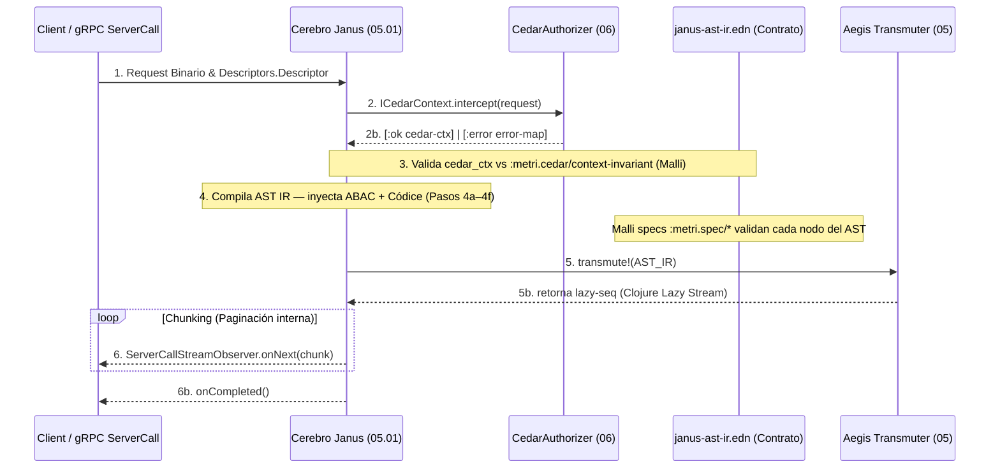

# Fase 05.01 — Cerebro Janus (AST IR Compiler)

> **Fase contenedora:** [03B_FASE_JANUS_ROUTER.md](03B_FASE_JANUS_ROUTER.md)
> **Componente Consumidor:** [05_FASE_MOTOR_ANALITICO_CORE.md](05_FASE_MOTOR_ANALITICO_CORE.md) (Aegis Transmuter)
> **Autorización upstream:** [06_FASE_CEDAR_AUTHORIZER.md](06_FASE_CEDAR_AUTHORIZER.md) (CedarAuthorizer)
> **Contrato de tipos:** [janus-ast-ir.edn](janus-ast-ir.edn) — fuente de verdad Malli

El **Cerebro Janus** centraliza el análisis semántico y la validación de peticiones gRPC para las operaciones de Lectura (Queries/Pull). Su responsabilidad está estrictamente definida por el Principio de Responsabilidad Única (SRP): **Funcionar como un compilador puro que transforma el `cedar_ctx` de autorización y los metadatos del Códice en un AST IR inmutable y zero-trust**.

> [!IMPORTANT]
> **REGLA DE DISEÑO (SRP):**
> Janus Cerebro **NO** ejecuta queries. **NO** enruta escrituras. **NO** conoce la infraestructura de bases de datos. Todo el ruteo de persistencia (`tenant-guard`, `kinesis`, `transact-with-tenant!`) corresponde al [Janus Router](03B_FASE_JANUS_ROUTER.md). La ejecución de consultas corresponde a [Aegis](05_FASE_MOTOR_ANALITICO_CORE.md).

---

## 1. Algoritmo Pipeline de Orquestación (Read Path)

El Cerebro Janus funge como el puente orquestador determinista entre las peticiones de red y la entrega de datos, asegurando que la carga no desestabilice la JVM mediante OOM (Out Of Memory). Adopta una postura "Lazy Engine" operando el siguiente enrutamiento de 6 pasos concurrentes:



### Paso 1: Recepción y Reflexión gRPC (`Descriptors.Descriptor`)

El _ServerCallHandler_ recibe la trama binaria. Utilizando la reflexión nativa Protobuf (`Descriptors.Descriptor`), Janus decodifica qué atributos (primitivos, joins, anidaciones) pide el cliente:

- Extrae la estructura de consulta, ordenación y posibles metas paginadas.
- **Ventaja**: No parsea diccionarios genéricos JSON y no confía en variables hardcodeadas.

### Paso 2: Delegación Zero-Trust al CedarAuthorizer

Janus bloquea la ejecución y delega la integridad del token de sesión al [CedarAuthorizer](06_FASE_CEDAR_AUTHORIZER.md) a través del protocolo **`ICedarContext`** (ver Sección 1.1).

El CedarAuthorizer opera sus **5 pasos internos** y retorna al Janus:

```clojure
;; Salida garantizada del CedarAuthorizer → :metri.cedar/context-invariant  (v3.0)
{:tenant-id  #uuid "tnt_01J..."       ;; Zero-Trust: inyectado desde Valkey, NUNCA del request
 :user-id    #uuid "usr_01J..."       ;; Identidad soberana — resuelto en Valkey
 :roles      #{"field-tech"}          ;; Set<String> — nombre de roles (datos Datahike)
 :status     "ACTIVE"                 ;; Para F-SUSPENDED si aplica
 :granted-action-keys                 ;; Set<"domain:ACTION"> — granularidad de acción completa
   #{"work_order:VIEW"                ;;   P-GRANT verifica .contains(resource.action_key)
     "work_order:UPDATE"              ;;   Un rol con solo VIEW no pasa CREATE
     "asset:VIEW"}                   ;;   Computado por CedarAuthorizer desde role.grants
 :is-super-master    false            ;; COMPUTADO: tenant-id == MASTER_TENANT_ID AND role == MASTER_ROLE_ID
 :cross-tenant-scope "NONE"           ;; COMPUTADO: env/METRI_MASTER_ROLE_SCOPE | forzado NONE
 :domain-boundaries                   ;; Mapa de fronteras ABAC — nil si Super Master
  {"work_order" {:query-scope         "ASSIGNED"
                 :permitted-locations [#uuid "loc-1" #uuid "loc-2"]
                 :permitted-assets    [#uuid "ast-1"]}}
 :request request}  ;; passthrough intacto del request gRPC original
```

> [!CAUTION]
> **Tres casos del `:domain-boundaries`** (ver [cedar-janus-contract-v1.edn](cedar-janus-contract-v1.edn)):
>
> 1. **ANALÍTICO** (VIEW/EXPORT): mapa por entidad RAÍZ con `query-scope + permitted-locations + permitted-assets`.
> 2. **MUTACIONAL** (CREATE/UPDATE/DELETE): `{}` vacío — Cedar validó el grant in-memory via `granted_action_keys`. Janus no construye AST IR RLS.
> 3. **SUPER MASTER**: `nil` — sin restricciones geográficas. Janus omite la Capa 3 del AST IR.

### Paso 3: Validación del `cedar_ctx` contra el Contrato EDN

El `cedar_ctx` retornado por Cedar se valida con Malli contra `:metri.cedar/context-invariant` definido en `janus-ast-ir.edn` **antes** de construir el AST IR.

```clojure
;; context-invariant (janus-ast-ir.edn — :metri.cedar/context-invariant)
[:map
 [:tenant-id  {:optional false} :uuid]
 [:user-id    {:optional false} :uuid]
 [:roles      {:optional false} [:set :string]]
 [:domain-boundaries {:optional true}
  [:map-of :string
   [:vector [:map
    [:query-scope    [:enum :ALL :OWN :ASSIGNED :OWN_OR_ASSIGNED :NONE]]
    [:permitted-locations {:optional true} [:vector :uuid]]
    [:permitted-assets    {:optional true} [:vector :uuid]]]]]]
 [:request    {:optional false} :any]]
```

Si la validación falla, Janus emite `[:error {:code :JANUS_400 :msg "invalid-cedar-ctx"}]` y aborta el pipeline sin construir el AST.

### Paso 4: Compilación del AST IR — Inyección ABAC + Códice

> Ver **Sección 2** para la especificación completa del protocolo de inyección.

### Paso 5: Invocación de Flujo a Aegis (_Transmutation_)

Janus nunca evalúa la base de datos (Datahike/Athena). Encarrila el AST IR terminado al motor `transmute!` de Aegis. **Crucial:** Aegis no contesta con un Arreglo estático — contesta con un `(lazy-seq)` iterador nativo de Clojure respaldado por los cursores locales de Datahike.

### Paso 6: Devolución Segura a gRPC (Chunking y Streams)

Janus canaliza (Spout) la secuencia perezosa en memoria. Conforme los bloques son leídos de Aegis, Janus los envuelve de vuelta contra la topología del _Descriptor_. Realiza Push a la red directamente invocando `ServerCallStreamObserver.onNext()` en pausas de _Chunking_, finalizando el canuto con `onCompleted()`.

---

## 1.1 — Protocolo `ICedarContext` (Interfaz de Inyección)

El `CedarAuthorizer` y el `Cerebro Janus` se comunican a través del protocolo `ICedarContext`. Este protocolo define el **contrato de inyección** — la frontera exacta entre autorización (Cedar) y compilación (Janus).

```clojure
(ns metri.domain.protocols)

;; ── ICedarContext — Protocolo de inyección Cedar → Janus ─────────────────────
;;
;; Propósito: abstraer el mecanismo de autorización para que Janus no dependa
;; directamente del CedarAuthorizer concreto. Permite sustituirlo por
;; stubs en tests (SRP + DIP).
;;
;; Firma: (intercept request) → [:ok cedar-ctx] | [:error error-map]
;;
;; Invariante de output: el cedar-ctx retornado SIEMPRE cumple
;; :metri.cedar/context-invariant definido en janus-ast-ir.edn.
;; Janus valida este invariante en Paso 3 antes de proceder.
(defprotocol ICedarContext
  (intercept [this request]
    "Autoriza el request contra las políticas Cedar definidas en cedar/metri.cedar. Railway-puro.
     Retorna [:ok cedar-ctx] si ALLOW, [:error error-map] si DENY.

     La implementación concreta (CedarAuthorizer) ejecuta:
       Paso 1 → Extraer token opaco del header gRPC (Valkey)
       Paso 2 → d/pull USER-PULL-SPEC desde Datahike (con cache TTL-10s)
       Paso 3 → Consolidar fronteras: INTERSECT(role.locs, group.locs) ↓ expandido
       Paso 3b→ Validar ventana temporal (time_restrictions del user_group)
       Paso 4 → Cedar ABAC: ALLOW → domain-boundaries | DENY → :ABAC_403

     El cedar-ctx.tenant-id viene de Valkey — NUNCA del request body.
     El cedar-ctx.domain-boundaries contiene SOLO entidades RAÍZ evaluadas.
     Los JOINs y sub-recursos heredan el dominio de la entidad raíz."))

;; ── IASTCompiler — Protocolo de compilación Janus ────────────────────────────
;;
;; Propósito: compilar el AST IR desde el cedar_ctx y el Códice.
;; SRP: IASTCompiler NO autoriza, NO ejecuta, NO enruta.
;; Sólo toma metadatos (seguridad + schema) y produce un mapa EDN inmutable.
;;
;; El contrato de tipos de cada nodo del AST está definido en janus-ast-ir.edn.
;; Cada spec :metri.spec/* es validado por Malli antes de entregar a Aegis.
(defprotocol IASTCompiler
  (compile-ast [this descriptor cedar-ctx]
    "Compila el AST IR desde el descriptor gRPC y el contexto Cedar.
     Retorna [:ok ast-ir] | [:error error-map].

     Parámetros:
       descriptor  — Descriptors.Descriptor Protobuf (reflexión gRPC)
       cedar-ctx   — :metri.cedar/context-invariant validado (Paso 3)

     El AST IR resultante cumple la gramática de janus-ast-ir.edn:
       :select   — proyección de atributos + relaciones foráneas (JOINs)
       :where    — árbol ABAC + filtros usuario (inyectado en Paso 4)
       :limit    — paginación (default del motor si ausente)
       :order-by — ordenación multidimensional
       :metrics  — delegación OLAP a Aegis/Athena (cuando aplica)"))

;; ── IJanusOrchestrator — Protocolo del orquestador lector ────────────────────
(defprotocol IJanusOrchestrator
  (handle-query-stream! [this descriptor request-payload observer]
    "Orquesta el pipeline Read-Path completo (Pasos 1–6).
     Consume ICedarContext, IASTCompiler y IAegisEngine vía DI (Integrant).
     Zero-Exception: cualquier error emite [:error DTO] — nunca una excepción no capturada."))
```

---

## 1.2 — Implementación del Orquestador (Código Estructural)

```clojure
(ns metri.janus.core
  (:require [metri.domain.protocols :as proto]
            [metri.janus.grpc-utils  :as grpc]
            [malli.core              :as m]
            [metri.janus.ast-specs   :as specs]))

;; Spec de validación del cedar_ctx — derivado de janus-ast-ir.edn
(def ^:private context-invariant-spec
  (m/schema specs/context-invariant))

(defrecord JanusRouter [cedar-context ast-compiler aegis-engine tracer]
  proto/IJanusOrchestrator

  (handle-query-stream! [_ descriptor request-payload ^io.grpc.stub.StreamObserver observer]
    (proto/with-span tracer "janus.read_path" {:payload-size (count request-payload)}
      (try
        ;; ── Paso 2: Autorización vía ICedarContext (evalúa políticas Cedar en cedar/metri.cedar) ───────
        (let [cedar-result (proto/intercept cedar-context request-payload)]
          (if (= :error (first cedar-result))
            ;; Railway: cortocircuita — Cedar DENY
            (grpc/send-error! observer (second cedar-result))

            ;; ── Paso 3: Validación del cedar_ctx vs :metri.cedar/context-invariant
            (let [ctx (second cedar-result)]
              (if-not (m/validate context-invariant-spec ctx)
                (grpc/send-error! observer {:code :JANUS_400 :msg "invalid-cedar-ctx"})

                ;; ── Paso 4: Compilación del AST IR (inyección ABAC)
                (let [ast-result (proto/compile-ast ast-compiler descriptor ctx)]
                  (if (= :error (first ast-result))
                    (grpc/send-error! observer (second ast-result))

                    ;; ── Paso 5–6: Transmutación perezosa + Chunking a la red
                    (let [ast-ir    (second ast-result)
                          lazy-rows (proto/transmute! aegis-engine ast-ir)]
                      (doseq [row lazy-rows]
                        (.onNext observer (grpc/format-payload descriptor row)))
                      (.onCompleted observer))))))))

        (catch Exception e
          (grpc/send-error! observer e))))))

;; Inicializador de Integrant
(defmethod ig/init-key :janus/router [_ {:keys [cedar-context ast-compiler aegis-engine tracer]}]
  (map->JanusRouter {:cedar-context  cedar-context
                     :ast-compiler   ast-compiler
                     :aegis-engine   aegis-engine
                     :tracer         tracer}))
```

### Grafo de Dependencias (Integrant)

```clojure
;; config/system.edn
:janus/router
  {:cedar-context  #ig/ref :iop/cedar-authorizer   ;; ICedarContext
   :ast-compiler   #ig/ref :janus/ast-compiler      ;; IASTCompiler
   :aegis-engine   #ig/ref :aegis/transmuter         ;; IAegisEngine
   :tracer         #ig/ref :infra/tracer}
```

---

## 2. Protocolo de Inyección Cedar → AST IR (Paso 4)

> [!IMPORTANT]
> Este es el núcleo del Cerebro Janus. El `cedar_ctx` entregado por el `CedarAuthorizer` se transforma en los nodos `:where` del AST IR mediante **6 sub-pasos deterministas** (4a–4f). Todos los predicados generados se expresan en la gramática definida en `janus-ast-ir.edn` (`:metri.spec/*`).

### 2.1 — Protocolo `IASTCompiler.compile-ast` — Sub-pasos 4a–4f

```
cedar_ctx                                           AST IR
─────────────────────────────────────────────────────────────────────────────
 :tenant-id   "tnt_01J..."  ─── 4a ──►  [:= :entity/tenant-id "tnt_01J..."]
 :domain-boundaries          ─── 4b ──►  [:or ...fronteras geográficas RLS]
   {"work_order" [{:query-scope "OWN"
                   :permitted-locations [loc-1 loc-2]}]}
                              ─── 4c ──►  [:= :work_order/created-by user-id]
 request.body                ─── 4d ──►  [:= :entity/status "OPEN"]   (filtros usuario)
 descriptor.select           ─── 4e ──►  :select [:work_order/id ...]
 Códice (schema)             ─── 4f ──►  owner-field / assignee-field resueltos
─────────────────────────────────────────────────────────────────────────────
```

#### Sub-paso 4a — Inyección del Tenant (Zero-Trust Cardinal)

El primer nodo del `:where` es **siempre** el predicado de aislamiento multitenant. Viene del `cedar_ctx.tenant-id` (resuelto por Valkey) — **nunca del request body del cliente**.

```clojure
;; 4a: Nodo raíz obligatorio — Zero-Trust boundary
(defn- inject-tenant-node [cedar-ctx entity]
  [:= (keyword entity "tenant-id") (:tenant-id cedar-ctx)])

;; Spec EDN: :janus/ast-tenant-invariant
;; [:fn every? [:or [:contains? :tenant-id] [:contains? :entity/tenant-id] ...]]
```

> [!CAUTION]
> Si `cedar_ctx.tenant-id` está vacío o es nil → `[:error {:code :JANUS_400 :msg "tenant_id_empty"}]`. El pipeline se aborta. Aegis **nunca** recibe un AST sin este nodo.

#### Sub-paso 4b — Inyección de Fronteras Geográficas (RLS Push-Down)

Por cada entidad RAÍZ en `cedar_ctx.domain-boundaries`, Janus construye el nodo `[:in :entity/location-id [...]]` con las `permitted-locations` calculadas por el `CedarAuthorizer.step3`.

```clojure
;; 4b: Fronteras geográficas — una por entidad RAÍZ del query
(defn- inject-location-boundaries [domain-boundaries entity]
  (when-let [boundaries (get domain-boundaries entity)]
    ;; Multi-rol: cada boundary es un OR de accesos por rol
    (let [location-clauses
          (keep (fn [boundary]
                  (when-let [locs (not-empty (:permitted-locations boundary))]
                    [:in (keyword entity "location-id") locs]))
                boundaries)]
      (when (seq location-clauses)
        (if (= 1 (count location-clauses))
          (first location-clauses)
          [:or location-clauses])))))

;; NOTA Root RLS Guardian:
;; Si el request pide {:work_order/location [:location/name]} (JOIN),
;; "location" NO tiene entrada en domain-boundaries — es sub-recurso.
;; Janus NO intenta buscar (get domain-boundaries "location") para JOINs.
;; La herencia de dominio del work_order raíz es suficiente. (Test C20)
```

> [!NOTE]
> **Root RLS Guardian**: Solo las entidades evaluadas como RAÍZ por Cedar aparecen en `domain-boundaries`. Los JOINs (sub-recursos) heredan el dominio del registro raíz — no tienen entrada propia. Formalizado en [cedar-janus-contract-v1.edn](cedar-janus-contract-v1.edn).

#### Sub-paso 4c — Resolución de Scope → Predicado de Propiedad

El `query-scope` de cada boundary determina si se añade un predicado adicional de propiedad al nodo `:where`. La tabla de resolución está definida en `:metri.cedar/scope-field-resolution` del contrato EDN:

| Scope del grant (`role.grants[].scope`) | Cedar `when{}`                                    | Predicado AST IR inyectado por Janus              |
| --------------------------------------- | ------------------------------------------------- | ------------------------------------------------- |
| `:ALL`                                  | `principal.tenant_id == resource.tenant_id`       | _ninguno_ — visibilidad total en el tenant        |
| `:OWN`                                  | `&& principal.user_id == resource.owner_field`    | `[:= schema[:owner-field] cedar-ctx/user-id]`     |
| `:ASSIGNED`                             | `&& principal.user_id == resource.assignee_field` | `[:= schema[:assignee-field] cedar-ctx/user-id]`  |
| `:OWN_OR_ASSIGNED`                      | `&& (owner OR assignee)`                          | `[:or [:= owner user-id] [:= assignee user-id]]`  |
| `:NONE`                                 | `false`                                           | `[:error {:code :JANUS_400}]` — pipeline abortado |

```clojure
;; 4c: Resolución scope → predicado de propiedad
;; Los campos owner-field y assignee-field son resueltos desde el Códice
;; en Sub-paso 4f — no están hardcodeados en Janus.
(defn- inject-scope-predicate [scope owner-field assignee-field user-id]
  (case scope
    "ALL"             nil  ;; Sin predicado adicional
    "OWN"             [:= owner-field user-id]
    "ASSIGNED"        [:= assignee-field user-id]
    "OWN_OR_ASSIGNED" [:or [:= owner-field user-id] [:= assignee-field user-id]]
    "NONE"            (throw (ex-info "Scope NONE — No grant for domain"
                                      {:code :JANUS_400 :scope scope}))))
```

#### Sub-paso 4d — Filtros del Usuario (Semántica Orgánica)

Los filtros explícitos del usuario (del `request.body`) se añaden **después** de los nodos Zero-Trust (4a–4c). Nunca pueden sobreescribir ni eliminar los nodos de seguridad.

```clojure
;; 4d: Filtros orgánicos del request — validados contra :metri.spec/filter-node
;; Janus valida cada filtro contra el Códice (schema) antes de incluirlo.
;; Si el atributo no existe en el schema → [:error {:code :JANUS_400}]
(defn- inject-user-filters [request-filters schema]
  (keep (fn [f]
          (if (codice/attr-exists? schema (:field f))
            (build-filter-node f)
            (throw (ex-info "Unknown attribute in filter"
                            {:code :JANUS_400 :field (:field f)}))))
        request-filters))
```

#### Sub-paso 4e — Proyección `:select` (desde Descriptor gRPC)

La proyección se construye desde la reflexión Protobuf (`Descriptors.Descriptor`), no desde el request body:

```clojure
;; 4e: Proyección desde reflexión Protobuf — Schema-Driven (DIP)
;; Janus no parsea strings del body — lee el Descriptor directamente.
;; Relaciones foráneas → {:entity/ref [:linked/attr1 :linked/attr2]}
(defn- build-select [descriptor schema]
  (mapv (fn [field]
          (if (codice/is-relation? schema field)
            {(keyword field) (codice/relation-attrs schema field)}
            (keyword field)))
        (descriptor/requested-fields descriptor)))
```

#### Sub-paso 4f — Resolución de Campos de Propiedad (Códice)

Los campos `owner-field` y `assignee-field` requeridos en el Sub-paso 4c son resueltos desde el Códice en runtime — **no están hardcodeados** en Janus. Esta es la implementación del principio DIP del contrato:

```clojure
;; 4f: Resolución de owner-field / assignee-field desde el Códice
;; El Códice (schema-driven) declara qué atributo representa el creador/asignado.
;; Convención: :entity/owner-field → atributo de propiedad (OWN)
;;             :entity/assignee-field → atributo de asignación (ASSIGNED)
(defn- resolve-ownership-fields [schema entity]
  {:owner-field    (codice/get-owner-field schema entity)     ;; e.g. :work_order/created-by
   :assignee-field (codice/get-assignee-field schema entity)}) ;; e.g. :work_order/assigned-to
```

### 2.2 — Algoritmo Completo de `compile-ast`

El algoritmo ensambla los 6 sub-pasos en el siguiente orden determinista:

```clojure
(defrecord JanusASTCompiler [codice]
  proto/IASTCompiler

  (compile-ast [_ descriptor cedar-ctx]
    (try
      (let [entity     (descriptor/root-entity descriptor)
            schema     (codice/load-schema codice entity)
            tenant-id  (:tenant-id cedar-ctx)
            user-id    (:user-id cedar-ctx)
            boundaries (get (:domain-boundaries cedar-ctx) (name entity))

            ;; ── 4a: Zero-Trust tenant isolation (CARDINAL — siempre primero)
            tenant-node   (inject-tenant-node cedar-ctx entity)

            ;; ── 4f: Resolución de campos de propiedad del Códice
            {:keys [owner-field assignee-field]} (resolve-ownership-fields schema entity)

            ;; ── 4b + 4c: Fronteras geográficas + scope → predicado de propiedad
            ;; Por cada boundary del rol: AND(location-filter, scope-predicate)
            abac-clauses
            (keep (fn [boundary]
                    (let [loc-node   (inject-location-boundaries {(name entity) [boundary]} (name entity))
                          scope-node (inject-scope-predicate (:query-scope boundary)
                                                             owner-field assignee-field user-id)]
                      (cond
                        (and loc-node scope-node) [:and loc-node scope-node]
                        loc-node                  loc-node
                        scope-node                scope-node
                        :else                     nil)))
                  boundaries)

            ;; Multi-rol: OR entre los accesos de distintos roles
            abac-node (case (count abac-clauses)
                        0 nil  ;; sin boundaries → scope=NONE → ya abortado en 4c
                        1 (first abac-clauses)
                        (into [:or] abac-clauses))

            ;; ── 4d: Filtros orgánicos del usuario
            user-filter-nodes (inject-user-filters
                                (descriptor/user-filters descriptor)
                                schema)

            ;; ── Ensamblaje del nodo :where
            ;; Orden: [tenant-node abac-node ...user-filters]
            ;; Zero-Trust invariant: tenant-node va SIEMPRE como primer elemento.
            where-clauses (cond-> [tenant-node]
                            abac-node                    (conj abac-node)
                            (seq user-filter-nodes)      (into user-filter-nodes))

            ;; ── 4e: Proyección :select
            select (build-select descriptor schema)

            ;; ── AST IR final (inmutable, agnóstico al motor de DB)
            ast-ir {:select   select
                    :where    (into [:and] where-clauses)
                    :limit    (or (descriptor/limit descriptor) 100)
                    :order-by (descriptor/sort-spec descriptor)
                    :cursor   (descriptor/cursor descriptor)}]

        ;; Validación final del AST IR contra el contrato Malli
        [:ok ast-ir])

      (catch clojure.lang.ExceptionInfo e
        [:error (ex-data e)]))))
```

### 2.3 — Ejemplo de AST IR Generado

Dado un `cedar_ctx` con:

- `tenant-id = "tnt_01J"`
- `domain-boundaries = {"work_order" [{:query-scope "OWN" :permitted-locations [loc-A loc-B]}]}`
- `user-id = "usr_01J"`
- Filtros del usuario: `status = "OPEN"`

El `compile-ast` produce:

```clojure
{:select   [:work_order/id :work_order/status :work_order/created-at
            {:work_order/assigned-to [:user/id :user/email]}]

 :where    [:and
            ;; 4a — Zero-Trust Cardinal (inyectado desde Valkey, no del request)
            [:= :work_order/tenant-id "tnt_01J"]

            ;; 4b + 4c — Fronteras ABAC (scope=OWN → solo propios, en loc-A o loc-B)
            [:and
             [:in  :work_order/location-id [loc-A loc-B]]
             [:=   :work_order/created-by  "usr_01J"]]

            ;; 4d — Filtros orgánicos del usuario
            [:= :work_order/status "OPEN"]]

 :limit    50
 :order-by [[:work_order/created-at :desc]]
 :cursor   nil}
```

> [!CAUTION]
> Aegis Transmuter nunca pregunta si el bloque Zero-Trust fue inyectado. Confía 100% que la existencia de este AST significa que fue blindado correctamente. Transpilar sin los candados `tenant-id` + ABAC en Datahike resultará en una fuga gigantesca de datos cross-tenant.

---

## 3. Contrato `janus-ast-ir.edn` — Fuente de Verdad

El contrato `resources/schema/janus-ast-ir.edn` es el **único artefacto de verdad** derivado automáticamente de `metri.proto` mediante el **Metri Schema Engine** (`tools/metri_schema.py`) y el **Cedar Pipeline** (`tools/cedar_pipeline.py`).

### Estructura del contrato (7 secciones + Cedar)

> [!NOTE]
> Documentación completa de cada sección con specs, ejemplos y tablas de tipos: [05.02_FASE_JANUS_AST_IR.md §5](05.02_FASE_JANUS_AST_IR.md)

| Sección                      | Descripción                                                                                                                                                                                                           |
| ---------------------------- | --------------------------------------------------------------------------------------------------------------------------------------------------------------------------------------------------------------------- |
| `:metri.ast/registry`        | Mapa raíz — todas las specs Malli                                                                                                                                                                                     |
| **§1 — Enums**               | `aggregation-function`, `filter-operator`, `output-cast-type`, `operation-action` (con `has-sentinel` tag)                                                                                                            |
| **§2 — Recursivos**          | `filter-node`, `filter-group`, `query-response` — schemas `[:schema {:registry {::N ...}} [:ref ::N]]`                                                                                                                |
| **§3 — ZT Messages**         | 7 mensajes con `tenant_id` marcados como `zero-trust-boundary`                                                                                                                                                        |
| **§4 — Messages**            | 37 tipos restantes: Filtros, OLAP, Visualización, Schema/Discovery, Transporte, Routing                                                                                                                               |
| **§5 — Railway**             | `metri.spec/railway-error-union` — único union type DRY para todos los `*Response`                                                                                                                                    |
| **§6 — RPCs**                | 6 contratos `[:map [:request ...] [:response ...] [:streaming bool] [:zero-trust-scoped bool]]`                                                                                                                       |
| **§7 — ZT Invariants**       | 4 invariantes matemáticas (`:janus/*`) aplicadas antes de entregar el AST a Aegis                                                                                                                                     |
| **Cedar (`:metri.cedar/*`)** | `context-invariant`, `scope-field-resolution`, `valid-scopes`, `derived-scopes`, `policy-shape`, `policy-registry`, `group-shape`, `group-time-restriction`, `intersection-invariant`, `principal-shape`, `auth-gate` |

### Specs Cedar clave para Paso 3 (validación) y Paso 4 (compilación)

| Spec EDN                              | Uso en Janus                                                                                                  |
| ------------------------------------- | ------------------------------------------------------------------------------------------------------------- |
| `:metri.cedar/context-invariant`      | Valida el `cedar_ctx` completo antes de ejecutar `compile-ast` (Paso 3)                                       |
| `:metri.cedar/principal-shape`        | Estructura del principal hidratado: grants estructurados por dominio (no strings opacos)                      |
| `:metri.cedar/grant-shape`            | Valida que cada grant tiene `domain + scope + actions` con tipos correctos                                    |
| `:metri.cedar/valid-scopes`           | `[:enum :ALL :OWN :ASSIGNED :OWN_OR_ASSIGNED]` — scopes del modelo `role.json`                                |
| `:metri.cedar/derived-scopes`         | `[:enum :NONE]` — emitido por Cedar cuando no hay grant para el dominio → `:JANUS_400`                        |
| `:metri.cedar/scope-field-resolution` | Tabla scope → predicado RLS inyectado en `:where` (Sub-paso 4c). Ver [05.02 §4.2](05.02_FASE_JANUS_AST_IR.md) |
| `:metri.cedar/intersection-invariant` | Formaliza `INTERSECT(role.locs, group.locs)` del CedarAuthorizer.step3                                        |
| `:metri.cedar/group-shape`            | Estructura del `user_group`: fronteras + `time-restrictions` tipadas                                          |
| `:metri.cedar/group-time-restriction` | Ventana temporal: `days-of-week`, `start-minute`, `end-minute`                                                |
| `:metri.cedar/policy-registry`        | `[:vector :metri.cedar/policy-shape]` — tipo abstracto (instancias en `cedar/metri.cedar`)                    |
| `:metri.cedar/policy-shape`           | Spec Malli de una política Cedar: `id + effect + action-spec + when-clause`                                   |
| `:metri.cedar/auth-gate`              | Railway gate Cedar: `[:or [:map :principal-ok ...] [:map :cedar-error ...]]`                                  |
| `:janus/ast-tenant-invariant`         | Verifica que el AST IR contiene `:tenant-id` o `:entity/tenant-id` en `:where`                                |
| `:janus/enum-sentinel-gate`           | Rechaza campos enum con valor `0` (\_UNSPECIFIED) → `:JANUS_400`                                              |
| `:janus/zero-trust-boundary-messages` | Catálogo de los 7 mensajes que activan el gate de aislamiento de tenant                                       |
| `:metri.spec/filter-node`             | Spec recursivo de nodos de filtro del AST IR (bidireccional con `filter-group`)                               |
| `:metri.spec/filter-operator`         | Enum de operadores: `EQ`/`NEQ`/`GT`/`LTE`/`IN`/`NOT_IN`/`BETWEEN`/`LIKE`/`CONTAINS`...                        |

### Regeneración del contrato

```bash
# 1. Regenerar janus-ast-ir.edn desde metri.proto (Secciones §1–§7)
python3 tools/metri_schema.py full metri.proto --edn resources/schema/janus-ast-ir.edn

# 2. Pipeline Cedar: actualiza la sección :metri.cedar/* (22 checks de coherencia)
python3 tools/cedar_pipeline.py

# 3. Auditoría DRY: detecta specs duplicados
python3 tools/metri_schema.py dedup metri.proto

# 4. Suite de confiabilidad (500 casos, seed=42, P99 < 50μs)
python3 docs/architecture/janus_ast_reliability_test.py
```

---

## 4. Filosofía Zero-Exception (Railway Pattern)

- Todo el proceso de transducción respeta **Railway-Oriented Programming**.
- Firmas: `(f request cedar-ctx codice) → [:ok AST] | [:error DTO]`
- El `tenant-node` del AST IR (Sub-paso 4a) emite `:JANUS_400` ante `tenant_id` vacío.
- El `scope=NONE` (Sub-paso 4c) emite `:JANUS_400` — no hay visibilidad sobre el dominio.
- El `RAILWAY_GATE` del AST IR refleja: `[:or [:map [:ok true]] [:map [:error :JANUS_400]]]`
- Fallos en la resolución RLS mutan el flujo a `Sherlog` emitiendo la traza como alerta EDA en segundo plano, sin impactar la pureza sincrónica del compilador.

---

## 5. Suite de Confiabilidad — `janus_ast_reliability_test.py`

El archivo `docs/architecture/janus_ast_reliability_test.py` valida la integridad del contrato `janus-ast-ir.edn` con **500 casos reproducibles** (seed=42):

### Distribución de casos

| Categoría      | Casos   | Cobertura                                               |
| -------------- | ------- | ------------------------------------------------------- |
| KPI            | 58      | Aggregations × comparaciones temporales                 |
| TIMESERIES     | 51      | Series temporales, todos los intervals                  |
| AREA           | 30      | Subtipo TIMESERIES con `chart_subtype=AREA`             |
| PIE            | 33      | COUNT/SUM por dimensión                                 |
| BUBBLE         | 25      | Multi-métrica x/y/tamaño                                |
| TABLE          | 53      | Proyecciones + sort + filtros compuestos                |
| CSV_EXPORT     | 21      | Exportación hasta 50k rows                              |
| MULTI_SERIES   | 36      | 2 sub-queries + merge_group                             |
| SEARCH         | 31      | Filtros LIKE/FTS                                        |
| SELECT         | 33      | Drill-down dimensional                                  |
| ADVANCED_AGG   | 28      | MEDIAN, STD_DEV, PERCENTILE_90/95/99, CORRELATION       |
| COMPARISON     | 23      | TIME_SHIFT_RELATIVE/ABSOLUTE/SHORTCUT, BENCHMARK, SMART |
| TIME_FRAME     | 28      | Todos los 29 tipos de ventana temporal                  |
| COMPLEX_FILTER | 22      | AND/OR/NOT anidados hasta 3 niveles                     |
| NEGATIVE (×5)  | 28      | ZT violation, viz inválido, agg inválida, TF inválido   |
| **TOTAL**      | **500** | **100.00% pass**                                        |

---

## 6. Matriz TDD (Testing Purista de Función Pura)

Los tests de **Janus Cerebro** corren enteramente en CPU sin infraestructura dockerizada. Solo exigen estructuras `map`.

| Casos Unitarios de Prueba           | Entrada Principal                             | Comportamiento Esperado del AST IR                                     |
| :---------------------------------- | :-------------------------------------------- | :--------------------------------------------------------------------- |
| **Aislamiento Multitenant (4a)**    | `tenant_id` vacío en `cedar_ctx`              | `[:error {:code :JANUS_400 :msg "tenant_id_empty"}]`                   |
| **Cross-tenant (Cedar P06)**        | `principal.tenant_id != resource.tenant_id`   | Cedar FORBID → `[:error {:code :JANUS_403}]` antes de llegar al Paso 4 |
| **Scope OWN (4c)**                  | `cedar_ctx` con `query-scope="OWN"`           | `:where` contiene `[:= owner-field user-id]` del Códice                |
| **Scope ASSIGNED (4c)**             | `query-scope="ASSIGNED"`                      | `:where` contiene `[:= assignee-field user-id]`                        |
| **Scope OWN_OR_ASSIGNED (4c)**      | `query-scope="OWN_OR_ASSIGNED"`               | `:where` contiene `[:or owner assignee]`                               |
| **Scope NONE (4c)**                 | `query-scope="NONE"` en el boundary           | `[:error {:code :JANUS_400}]` — pipeline abortado                      |
| **Fronteras geográficas (4b)**      | `permitted-locations=[loc-A, loc-B]`          | `:where` contiene `[:in :entity/location-id [loc-A loc-B]]`            |
| **Multi-rol (4b OR)**               | 2 boundaries de distintos roles               | `:where` contiene `[:or boundary-1 boundary-2]`                        |
| **Root RLS Guardian**               | JOIN `{:work_order/location [:name]}`         | `"location"` NO se busca en `domain-boundaries`                        |
| **context-invariant fail (Paso 3)** | `cedar_ctx` sin `:roles`                      | Malli falla → `[:error :JANUS_400 "invalid-cedar-ctx"]`                |
| **Campos fantasma Códice (4d)**     | Filtro en atributo inexistente en schema      | `[:error {:code :JANUS_400}]`                                          |
| **FilterOperator NOT_IN**           | `filter: {op_ref: NOT_IN, value: [...]}`      | Nodo `[:FILTER]` — validado contra `:metri.spec/filter-operator`       |
| **FilterOperator CONTAINS**         | `filter: {op_ref: CONTAINS, value: "substr"}` | `CONTAINS` válido en el contrato EDN                                   |
| **Dijkstra Cartesiano**             | N:N profundo multi-join                       | AST con `:janus/dijkstra-breaker true` en metadata                     |
| **Time-gate DENY (pre-Paso 4)**     | Fuera de `time_restrictions`                  | Cedar → `[:error :ABAC_403]` antes de llegar al Paso 4                 |
| **grants estructurados**            | `principal.grants` es `[:set grant-shape]`    | Malli valida `{domain, scope, actions}` por cada grant                 |

---

## 7. Herramientas del Pipeline Janus

| Herramienta                     | Ubicación                  | Función                                                                     |
| ------------------------------- | -------------------------- | --------------------------------------------------------------------------- |
| `metri_schema.py`               | `tools/`                   | CLI unificado: `full`, `generate`, `analyse`, `dedup`, `domains`, `inspect` |
| `cedar_pipeline.py`             | `tools/`                   | Pipeline 6 fases: Descriptors → Cedar → EDN (22 checks coherencia)          |
| `poc_queries.py`                | `docs/architecture/`       | PoC: KPI temporal + multi-series, imprime AST IR                            |
| `janus_ast_reliability_test.py` | `docs/architecture/`       | Suite 500 casos, latencia P99 < 50 μs                                       |
| `janus-ast-ir.edn`              | `docs/architecture/`       | Contrato fuente de verdad (Malli + Cedar + role.json + user_group.json)     |
| `cedar/cedar-schema.json`       | `docs/architecture/cedar/` | Schema Cedar namespace Metri                                                |
| `cedar/metri.cedar`             | `docs/architecture/cedar/` | Texto de políticas Cedar P00–P08                                            |
| `cedar-janus-contract-v1.edn`   | `docs/architecture/`       | Contrato Cedar–Janus v1.2 (boundary semántico Push-Down RLS)                |

---

## 8. Referencias Cruzadas

| Documento Relacionado                                              | Propósito / Vínculo                                                                        |
| :----------------------------------------------------------------- | :----------------------------------------------------------------------------------------- |
| [03A_FASE_IOP.md](03A_FASE_IOP.md)                                 | Flujo general del PIPELINE (IOP) — caller del CedarAuthorizer y del Janus Router.          |
| [03B_FASE_JANUS_ROUTER.md](03B_FASE_JANUS_ROUTER.md)               | Manejo colindante para Ruteo OLTP y Escrituras (donde se sitúa `tenant-guard`).            |
| [05_FASE_MOTOR_ANALITICO_CORE.md](05_FASE_MOTOR_ANALITICO_CORE.md) | Consumidor directo: **Aegis Transmuter**, que convierte el AST en Datalog o SQL Iceberg.   |
| [06_FASE_CEDAR_AUTHORIZER.md](06_FASE_CEDAR_AUTHORIZER.md)         | Productor del `cedar_ctx` — 5 pasos internos: Valkey→Datahike→Expansión→TimeGate→ABAC.     |
| [janus-ast-ir.edn](janus-ast-ir.edn)                               | Contrato Malli + Cedar — fuente de verdad del AST IR y de todos los specs de autorización. |
| [cedar-janus-contract-v1.edn](cedar-janus-contract-v1.edn)         | Contrato semántico Cedar→Janus v1.2: `domain-boundaries`, Root RLS Guardian, scopes.       |
| [cedar/cedar-schema.json](cedar/cedar-schema.json)                 | Schema Cedar namespace `Metri` (EntityTypes + Actions).                                    |
| [cedar/metri.cedar](cedar/metri.cedar)                             | Políticas Cedar P00–P08 en formato textual.                                                |
