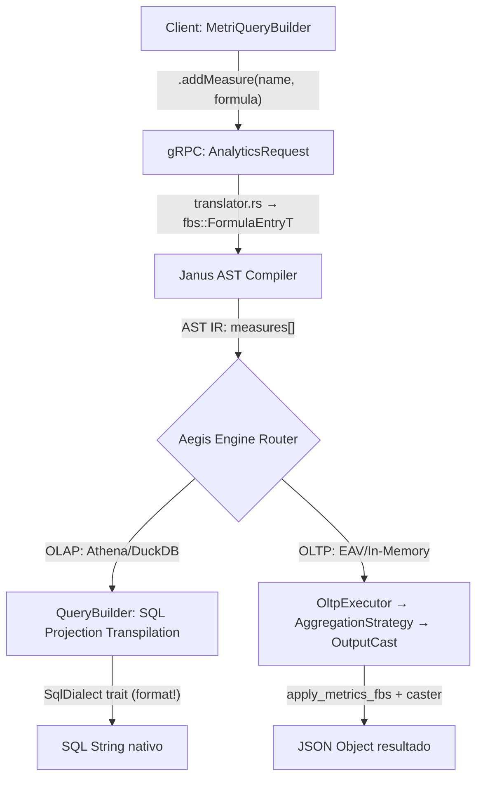
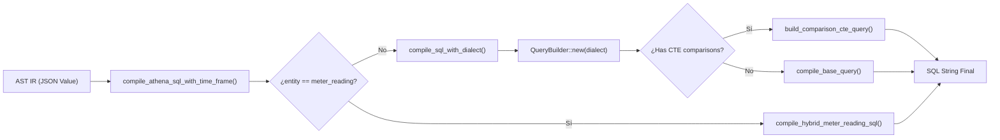
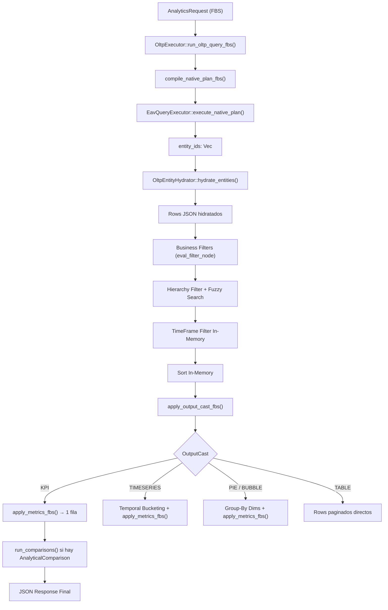
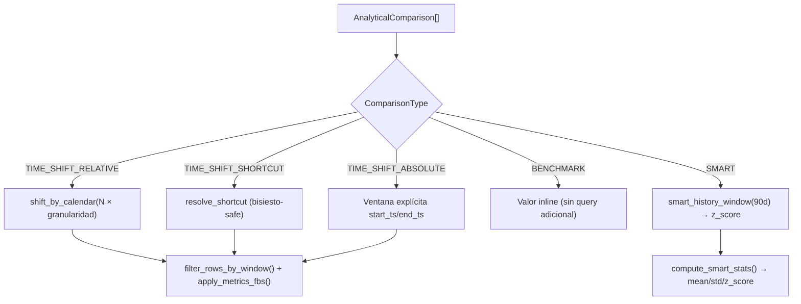
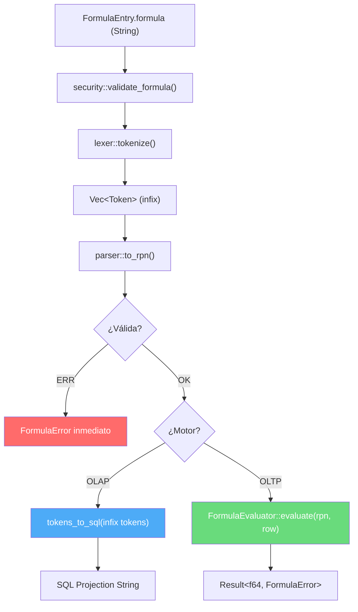
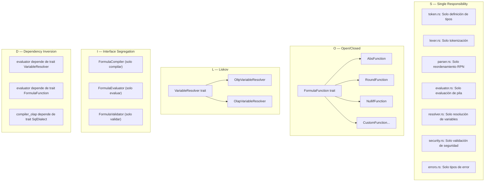
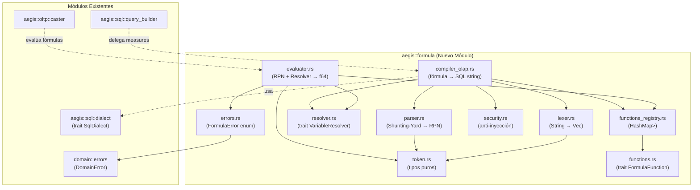
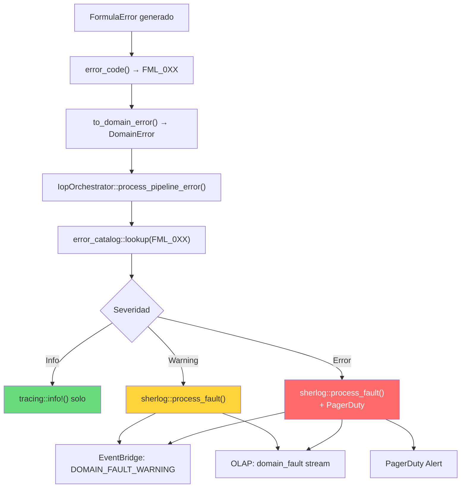

# Fase 05.05 — Motor de Fórmulas y Capa de Cálculo (OLAP & OLTP)

> **Fase contenedora:** [05_FASE_MOTOR_ANALITICO_CORE.md](05_FASE_MOTOR_ANALITICO_CORE.md)  
> **Componente principal:** [Aegis Transmuter](05.03-AEGIS.md)  
> **Contrato asociado:** [metri.proto](file:///Users/macuser/projects/metri/metri-engine/proto/metri.proto) (`FormulaEntry`, `measures`, `AggregationFunction`)

El **Motor de Fórmulas de Metri** es el encargado de procesar cálculos derivados, agregaciones estadísticas avanzadas y expresiones matemáticas ad-hoc. Opera bajo el principio de **Double-Engine Paradigm**, abstrayendo si la consulta se ejecuta físicamente sobre un lago de datos masivo (**OLAP**) o en memoria local transaccional (**OLTP**).

> [!IMPORTANT]
> **Implementación 100% Rust.** Todo el motor de fórmulas está implementado nativamente en Rust. No existe dependencia alguna de HoneySQL, Clojure ni Datalog. La generación de SQL se realiza mediante `format!` y traits polimórficos (`SqlDialect`), y el cómputo in-memory utiliza el patrón Strategy con traits Rust (`AggregationStrategy`).

---

## 1. El Campo `formula` y el Contrato Analítico

En [metri.proto](file:///Users/macuser/projects/metri/metri-engine/proto/metri.proto), las fórmulas personalizadas se inyectan a través del mensaje `FormulaEntry` dentro del campo `measures` de la consulta:

```proto
message FormulaEntry {
  string name = 1;      // Alias de la columna de salida (ej. "rentabilidad_neta")
  string formula = 2;   // Expresión de cálculo (ej. "(asset/revenue - asset/cost) / asset/revenue")
}
```

### 1.1 — Resolución de Variables `dominio/atributo`

Las fórmulas soportan referencias a atributos con notación **namespace** (`dominio/atributo`), alineándose con la convención EAV de Metri donde cada atributo pertenece a un dominio semántico:

```
asset/health_score          → columna SQL: health_score
asset/revenue               → columna SQL: revenue
work_order/total_cost       → columna SQL: total_cost
meter_reading/reading_value → columna SQL: reading_value
```

La resolución se aplica uniformemente en ambos motores:

| Motor | Mecanismo | Archivo |
|:---|:---|:---|
| **OLAP** | `col_id_str()` → `name.split('/').last().replace('-', "_")` | [query_builder.rs](file:///Users/macuser/projects/metri/metri-engine/src/aegis/sql/query_builder.rs) |
| **OLTP** | `attr_key.split('/').last().unwrap_or(attr_key)` + dual-lookup (`row.get(full_key).or_else(\|\| row.get(bare_key))`) | [aggregation.rs](file:///Users/macuser/projects/metri/metri-engine/src/aegis/oltp/aggregation.rs), [filter.rs](file:///Users/macuser/projects/metri/metri-engine/src/aegis/oltp/filter.rs) |

> [!IMPORTANT]
> **Convención Universal:** El patrón `split('/').last()` es la única fuente de verdad (SSOT) para resolver namespaces en todo el engine. Se aplica en: `aggregation.rs`, `filter.rs`, `comparison.rs`, `caster.rs`, `executor.rs`, `hydrator.rs`, `hierarchy.rs`, `label_template.rs` y `query_builder.rs`.

**Ejemplo de fórmula con namespace:**
```typescript
MetriQuery("asset")
  .addMeasure("score_normalizado", "(asset/health_score / 100) * asset/area_value")
  .addMeasure("margen", "(asset/revenue - work_order/total_cost) / NULLIF(asset/revenue, 0)")
  .asKPI()
```

### 1.2 — Pipeline Completo del Motor de Fórmulas



### 1.3 — Traducción gRPC → FlatBuffers (Rust)

El [translator.rs](file:///Users/macuser/projects/metri/metri-engine/src/grpc/translator.rs) convierte los mensajes Protobuf gRPC a la representación interna FlatBuffers Object API (`fbs::FormulaEntryT`):

```rust
// grpc/translator.rs — Traduce measures del proto a FBS
let measures: Vec<fbs::FormulaEntryT> = query.measures.iter().map(|m| fbs::FormulaEntryT {
    name:    if m.name.is_empty()    { None } else { Some(m.name.clone()) },
    formula: if m.formula.is_empty() { None } else { Some(m.formula.clone()) },
}).collect();
```

---

## 2. Ejecución de Fórmulas en Motores OLAP (Athena / DuckDB)

En cargas de trabajo analíticas masivas (OLAP), Aegis delega el cálculo directamente al motor de base de datos distribuido (AWS Athena/Trino para producción, DuckDB para pruebas locales).

### 2.1 — Transpilación SQL Nativa en Rust

El transpilador [query_builder.rs](file:///Users/macuser/projects/metri/metri-engine/src/aegis/sql/query_builder.rs) extrae las fórmulas inyectadas en el AST IR y las añade como expresiones SQL nativas en la cláusula `SELECT` utilizando `format!` de Rust:

```rust
// aegis/sql/query_builder.rs — Inyección directa de fórmulas como SQL Projections
if let Some(measures) = ast_ir.get("measures").and_then(|v| v.as_array()) {
    for fe in measures {
        if let (Some(formula), Some(name)) = (
            fe.get("formula").and_then(|v| v.as_str()),
            fe.get("name").and_then(|v| v.as_str())
        ) {
            // La fórmula puede contener refs namespace: "asset/health_score"
            // col_id_str() resolverá cada referencia → "health_score" en el SQL final
            select_exprs.push((formula.to_string(), Some(name.to_string())));
        }
    }
}
```

**Resolución de namespace en OLAP** — `col_id_str()` normaliza `dominio/atributo` → columna SQL:

```rust
// aegis/sql/query_builder.rs — Resolución universal de namespaces
pub fn col_id_str(&self, name: &str) -> String {
    if name == "tenant/id" || name == "entity/tenant-id" {
        return "_tenant".to_string();
    }
    let base = name.split('/').last().unwrap_or(name); // asset/health_score → health_score
    base.replace('-', "_")                              // health-score → health_score
}
```

### 2.2 — SqlDialect Trait: Polimorfismo de Base de Datos (OCP/DIP)

El compilador SQL está desacoplado de las funciones específicas de cada motor gracias al trait [SqlDialect](file:///Users/macuser/projects/metri/metri-engine/src/aegis/sql/dialect.rs), que permite inyectar dialectos de forma polimórfica:

```rust
// aegis/sql/dialect.rs — Trait polimórfico para generación de SQL
pub trait SqlDialect: Send + Sync {
    fn format_regexp_like(&self, col: &str, pattern: &str) -> String;
    fn format_from_unixtime(&self, epoch_expr: &str) -> String;
    fn format_epoch_to_timestamp(&self, col: &str) -> String;
    fn format_date_trunc(&self, interval: &str, col: &str) -> String;
    fn format_percentile(&self, col: &str, percentile: f64) -> String;
    fn format_stddev_samp(&self, col: &str) -> String;
    fn format_var_samp(&self, col: &str) -> String;
    fn format_corr(&self, sec_col: &str, col: &str) -> String;
    fn format_regr_slope(&self, sec_col: &str, col: &str) -> String;
    fn format_coalesce(&self, expr: &str, fallback: &str) -> String;
    fn format_exists(&self, table: &str, tenant_id: &str, parent_col: &str) -> String;
}
```

**Dialectos implementados:**

| Dialecto | Struct | Uso |
|:---|:---|:---|
| **Athena/Trino** | `AthenaDialect` | Producción — AWS Athena sobre Iceberg/Parquet |
| **PostgreSQL** | `PostgresDialect` | Pruebas — `to_timestamp()`, `~*` regex, `percentile_cont()` |

### 2.3 — Pipeline de Compilación OLAP Completo

El [compiler.rs](file:///Users/macuser/projects/metri/metri-engine/src/aegis/sql/compiler.rs) orquesta la compilación completa:



**Invariante de Seguridad:** `ast_contains_tenant(ast_ir)` verifica rigurosamente que toda consulta generada contenga el filtro `WHERE tenant_id = '...'` antes de emitir SQL. Cualquier AST sin aislamiento de tenant es rechazado con error `Aeg001`.

### 2.4 — Unión Híbrida para Telemetría (meter_reading)

Para entidades de telemetría, el compilador genera consultas de **Unión Híbrida** que combinan:

| Escenario | Fuente | Descripción |
|:---|:---|:---|
| **A: Caliente** | `meter_reading` (crudo) | Consulta 100% en la tabla buffer de hoy |
| **B: Histórico** | `meter_reading_rollup` (Iceberg Parquet) | Consulta 100% pre-compactada (ayer o antes) |
| **C: Híbrida** | `UNION ALL` de ambas | Cruza la frontera UTC de las 00:00 |

> [!WARNING]
> **Anti-Denial of Wallet:** Se aplica una cuota de seguridad que rechaza ventanas de consulta que excedan 3 años (`3 * 365 * 86400` segundos) para prevenir barridos accidentales sobre el lago de datos.

### 2.5 — Ejemplo de Transpilación Compleja

**Request DSL del cliente (con namespace `dominio/atributo`):**
```typescript
MetriQuery("asset")
  .addMeasure("score_ponderado", "(asset/health_score * asset/area_value) / 100")
  .addMeasure("margen", "((asset/revenue - asset/cost) / NULLIF(asset/revenue, 0)) * 100")
  .asTable()
```

**SQL Generado (Rust `format!` via `AthenaDialect`):**
```sql
SELECT health_score,
       area_value,
       revenue,
       cost,
       (health_score * area_value) / 100 AS score_ponderado,
       ((revenue - cost) / NULLIF(revenue, 0)) * 100 AS margen
FROM metri_db.asset t
WHERE _tenant = 'tnt_01'
LIMIT 1000;
```

> [!NOTE]
> Las referencias `asset/health_score` en la fórmula se resuelven a `health_score` en el SQL final gracias a `col_id_str()`. El namespace `asset/` sirve como contexto semántico para el cliente pero no llega al motor SQL.

> [!WARNING]
> **Aislamiento de Inyecciones:** Las fórmulas enviadas como strings crudos son evaluadas estrictamente bajo el contexto de seguridad del esquema. Janus inyecta de forma ineludible las cláusulas de partición (`tenant_id`) en el `WHERE`, impidiendo que una fórmula maliciosa acceda a datos cross-tenant.

---

## 3. Ejecución de Fórmulas en Motor OLTP (EAV / In-Memory)

En el motor transaccional OLTP, los cálculos se ejecutan completamente en Rust sobre datos hidratados desde el almacén EAV (Entity-Attribute-Value) en DynamoDB. No existe ninguna dependencia de Datalog ni motores de grafo externos.

### 3.1 — Pipeline OLTP Completo



### 3.2 — Agregaciones Estadísticas In-Memory (`aggregation.rs`)

La capa de agregación [aggregation.rs](file:///Users/macuser/projects/metri/metri-engine/src/aegis/oltp/aggregation.rs) implementa el patrón **Open-Closed (OCP)** mediante el trait `AggregationStrategy`. Cada función de agregación es una implementación independiente del trait, lo que permite extender el sistema sin modificar el código existente:

```rust
// aegis/oltp/aggregation.rs — Trait OCP para agregaciones
pub trait AggregationStrategy: Send + Sync {
    fn compute(&self, vals: &[f64], sec_vals: &[f64]) -> f64;
}
```

**Estrategias implementadas (14 funciones):**

| Strategy Struct | AggregationFunction | Complejidad | Descripción |
|:---|:---|:---|:---|
| `CountStrategy` | `COUNT` | O(1) | `vals.len()` |
| `SumStrategy` | `SUM` | O(N) | `vals.iter().sum()` |
| `AvgStrategy` | `AVG` | O(N) | `safe_mean(vals)` |
| `MinStrategy` | `MIN` | O(N log N) | Sort + first |
| `MaxStrategy` | `MAX` | O(N log N) | Sort + last |
| `PercentileStrategy { p: 0.5 }` | `MEDIAN` | O(N log N) | Nearest-Rank |
| `PercentileStrategy { p: 0.90/0.95/0.99 }` | `PERCENTILE_90/95/99` | O(N log N) | Nearest-Rank parametrizado |
| `StdDevStrategy` | `STD_DEV` | O(N) | `variance_sample().sqrt()` (Bessel n-1) |
| `VarianceStrategy` | `VARIANCE` | O(N) | `variance_sample()` (Bessel n-1) |
| `CorrelationStrategy` | `CORRELATION` | O(N) | Pearson R bivariada |
| `LinearRegressionStrategy` | `LINEAR_REGRESSION` | O(N) | Pendiente MCO (regr_slope) |
| `LogisticRegressionStrategy` | `LOGISTIC_REGRESSION` | O(1) | Fallback a COUNT (no nativo) |

**Fórmulas estadísticas clave:**

* **Nearest-Rank Percentile:**
  $$\text{Index} = \min(\lfloor p \times N \rfloor, N-1)$$

* **Pearson Correlation Coefficient ($r$):**
  $$r = \frac{\sum (x_i - \bar{x})(y_i - \bar{y})}{\sqrt{\sum (x_i - \bar{x})^2 \sum (y_i - \bar{y})^2}}$$

* **Linear Regression Slope ($\beta_1$):**
  $$\beta_1 = \frac{\sum (x_i - \bar{x})(y_i - \bar{y})}{\sum (x_i - \bar{x})^2}$$

### 3.3 — Filtered Aggregation (Métricas con Predicado Local)

Cada `MetricDefinition` puede incluir un `FilterNode` opcional que restringe las filas participantes en esa métrica específica sin afectar las demás:

```rust
// Filtered aggregation: solo rows que pasan el predicado contribuyen
let eff_rows: Vec<&Value> = if let Some(filter_node) = &metric.filter {
    rows.iter().filter(|r| eval_filter_node(r, filter_node)).collect()
} else {
    rows.iter().collect()
};
```

### 3.4 — Evaluación de Filtros In-Memory (`filter.rs`)

El [filter.rs](file:///Users/macuser/projects/metri/metri-engine/src/aegis/oltp/filter.rs) implementa un evaluador recursivo de `FilterNode` sobre rows JSON, soportando el árbol completo AND/OR/NOT con 14 operadores:

| Operador | Descripción |
|:---|:---|
| `EQ` / `NEQ` | Igualdad / Desigualdad |
| `GT` / `GTE` / `LT` / `LTE` | Comparaciones numéricas |
| `IN` / `NOT_IN` | Pertenencia a lista |
| `BETWEEN` | Rango numérico/string |
| `LIKE` | Patrón wildcard (%, _) → regex |
| `CONTAINS` | Substring case-insensitive |
| `MATCHES` | Fuzzy match (Levenshtein) |
| `IS_NULL` / `IS_NOT_NULL` | Nulabilidad |

---

## 4. Mapeo Unificado OLAP ↔ OLTP

El sistema unifica el comportamiento matemático entre el push-down de base de datos (OLAP) y el runtime de Rust (OLTP):

| Función (`AggregationFunction`) | Dialecto SQL — OLAP (`SqlDialect` trait) | Implementación Rust — OLTP (`AggregationStrategy`) | Propósito |
| :--- | :--- | :--- | :--- |
| `COUNT` | `COUNT(field)` | `CountStrategy` → `vals.len()` | Conteo de registros |
| `SUM` | `SUM(field)` | `SumStrategy` → `vals.iter().sum()` | Suma aritmética |
| `AVG` | `AVG(field)` | `AvgStrategy` → `safe_mean(vals)` | Media aritmética |
| `MIN` / `MAX` | `MIN(field)` / `MAX(field)` | `MinStrategy` / `MaxStrategy` → sort + first/last | Valores extremos |
| `MEDIAN` | `approx_percentile(field, 0.5)` | `PercentileStrategy { p: 0.5 }` | Mediana estadística |
| `PERCENTILE_90/95/99` | `approx_percentile(field, p)` | `PercentileStrategy { p }` | Análisis de latencia/SLA |
| `STD_DEV` | `stddev_samp(field)` | `StdDevStrategy` → `variance_sample().sqrt()` | Dispersión de datos |
| `VARIANCE` | `var_samp(field)` | `VarianceStrategy` → `variance_sample()` | Varianza de distribución |
| `CORRELATION` | `corr(sec, field)` | `CorrelationStrategy` → `pearson_r()` | Correlación bivariada |
| `LINEAR_REGRESSION` | `regr_slope(sec, field)` | `LinearRegressionStrategy` → `regr_slope()` | Forecasting |

> [!NOTE]
> Las funciones SQL del dialecto OLAP se generan dinámicamente a través del trait `SqlDialect`. Por ejemplo, `AthenaDialect::format_percentile("cost", 0.95)` produce `approx_percentile(cost, 0.95)`, mientras que `PostgresDialect::format_percentile("cost", 0.95)` produce `percentile_cont(0.95) WITHIN GROUP (ORDER BY cost)`.

---

## 5. Motor de Comparaciones Analíticas (`comparison.rs`)

El [comparison.rs](file:///Users/macuser/projects/metri/metri-engine/src/aegis/oltp/comparison.rs) implementa 5 tipos de comparación temporal/estadística definidos en el contrato `AnalyticalComparison`:



**Diferencias clave entre OLAP y OLTP:**

| Aspecto | OLAP (SQL) | OLTP (Rust In-Memory) |
|:---|:---|:---|
| **Mecanismo** | CTEs `WITH prev_0` + `CROSS JOIN` / `LEFT JOIN` | `filter_rows_by_window()` sobre rows hidratados |
| **Resolución temporal** | Push-down a Athena/Trino | `temporal::comparison` (chrono, bisiesto-safe, DST-aware) |
| **Estadísticas SMART** | `stddev_samp()` / `avg()` en CTE | `compute_smart_stats()` → mean/std/z_score en Rust |

---

## 6. Output Casting y Bucketing (`caster.rs`)

El [caster.rs](file:///Users/macuser/projects/metri/metri-engine/src/aegis/oltp/caster.rs) orquesta la transformación final de los rows hidratados según el `OutputCastType` solicitado:

| OutputCast | Comportamiento |
|:---|:---|
| **KPI** (1) | `apply_metrics_fbs(all_rows)` → 1 fila de métricas agregadas + `run_comparisons()` si existen |
| **TIMESERIES** (2) | `apply_timeseries_bucketing()` → group-by temporal por intervalo (day/week/month) + dims + apply_metrics por bucket |
| **TABLE** (3) | Rows paginados directos (group-by + metrics si hay dims) |
| **PIE / BUBBLE** (4/5) | Group-by dims → `apply_metrics_fbs()` por grupo → sort descendente |
| **CSV_EXPORT** (6) | Sin límite de rows, sin paginación |

### 6.1 — Bucketing Temporal (TIMESERIES)

```rust
// caster.rs — Truncado temporal y agrupamiento
pub fn truncate_to_interval(epoch_secs: i64, interval: &str) -> i64 {
    let unit = interval.parse::<CalUnit>().unwrap();
    temporal::core::truncate_to_unit(epoch_secs, unit, "UTC")
}
```

El sistema prueba múltiples campos de timestamp por prioridad: `created_at` → `meta/created_at` → `timestamp` → `updated_at` → `ingested_at`.

---

## 7. Especificación Formal de la Sintaxis de Fórmulas

El campo `formula` de `FormulaEntry` acepta expresiones matemáticas como strings que se evalúan de forma diferente según el motor:
- **OLAP:** Se inyectan como SQL nativo en la cláusula `SELECT` (push-down al motor de base de datos).
- **OLTP:** Se parsean y evalúan en memoria mediante un intérprete AST basado en **Shunting-Yard / RPN**.

### 7.1 — Gramática EBNF

```ebnf
formula       ::= expression

expression    ::= term ( ( '+' | '-' ) term )*
term          ::= unary ( ( '*' | '/' | '%' ) unary )*
unary         ::= ( '-' )? factor
factor        ::= function_call
               |  '(' expression ')'
               |  literal
               |  variable

function_call ::= FUNCTION_NAME '(' arg_list ')'
arg_list      ::= expression ( ',' expression )*

variable      ::= IDENTIFIER ( '/' IDENTIFIER )?      /* dominio/atributo */
literal       ::= NUMBER

IDENTIFIER    ::= [a-zA-Z_] [a-zA-Z0-9_]*
NUMBER        ::= [0-9]+ ( '.' [0-9]+ )?
FUNCTION_NAME ::= [A-Z_]+                              /* case-insensitive */
```

> [!IMPORTANT]
> **Las fórmulas operan exclusivamente sobre valores numéricos (`f64`).** Las variables que resuelvan a tipos no numéricos (strings, booleans, nulls) producen `None` y abortan la evaluación de la expresión de forma segura.

### 7.2 — Operadores Aritméticos

| Operador | Símbolo | Precedencia | Asociatividad | Descripción | Ejemplo |
|:---|:---:|:---:|:---:|:---|:---|
| **Suma** | `+` | 1 (baja) | Izquierda | Adición aritmética | `revenue + other_income` |
| **Resta** | `-` | 1 (baja) | Izquierda | Sustracción aritmética | `asset/revenue - asset/cost` |
| **Negación unaria** | `-` | 3 (alta) | Derecha | Invierte el signo del operando | `-asset/cost` |
| **Multiplicación** | `*` | 2 (media) | Izquierda | Producto aritmético | `quantity * unit_price` |
| **División** | `/` | 2 (media) | Izquierda | Cociente. **División por cero → `None`** | `profit / NULLIF(revenue, 0)` |
| **Módulo** | `%` | 2 (media) | Izquierda | Residuo de la división entera | `total % batch_size` |

**Reglas de precedencia** (de menor a mayor):

```
1.  +  -          (suma, resta)
2.  *  /  %       (multiplicación, división, módulo)
3.  - (unario)    (negación)
4.  ()            (paréntesis — máxima precedencia)
5.  FUNC()        (llamadas a función)
```

**Ejemplo de evaluación por precedencia:**
```
Formula:   asset/revenue - asset/cost * 0.21
Parseo:    asset/revenue - (asset/cost * 0.21)      ← * se evalúa primero
Resultado: 1000 - (500 * 0.21) = 1000 - 105 = 895
```

### 7.3 — Paréntesis y Agrupamiento

Los paréntesis `()` sirven para dos propósitos:

1. **Forzar orden de evaluación:** Sobrescribir la precedencia natural de los operadores.
2. **Delimitar argumentos de funciones:** Encerrar los argumentos de las llamadas a función.

| Uso | Ejemplo | Evaluación |
|:---|:---|:---|
| Forzar precedencia | `(revenue - cost) / revenue` | La resta se ejecuta **antes** de la división |
| Anidamiento profundo | `((a + b) * (c - d)) / e` | Se evalúan las sumas/restas internas primero |
| Argumentos de función | `ROUND((revenue - cost) / revenue, 2)` | La expresión interna es el primer argumento |
| Sin paréntesis | `revenue - cost / revenue` | Equivale a `revenue - (cost / revenue)` — ⚠️ resultado distinto |

> [!WARNING]
> **Paréntesis desbalanceados** (ej. `(revenue - cost` o `revenue)`) son rechazados por el parser con error de sintaxis `DSL_SYNTAX_ERROR` antes de llegar al motor de ejecución.

### 7.4 — Variables (Referencias a Atributos)

Las variables referencian columnas/atributos del dataset actual. Soportan dos formatos:

| Formato | Ejemplo | Resolución OLAP (SQL) | Resolución OLTP (Row JSON) |
|:---|:---|:---|:---|
| **Bare** | `revenue` | `revenue` | `row["revenue"]` |
| **Namespace** | `asset/revenue` | `revenue` (vía `col_id_str`) | `row["asset/revenue"]` → fallback `row["revenue"]` |
| **Con guión** | `asset/health-score` | `health_score` (vía `replace('-', "_")`) | `row["asset/health-score"]` → fallback `row["health_score"]` |

**Resolución OLTP (dual-lookup namespace-aware):**
```rust
let bare_name = attr_name.split('/').last().unwrap_or(attr_name);
let val = row.get(attr_name)                    // 1. Intenta "asset/revenue"
    .or_else(|| row.get(bare_name))             // 2. Fallback a "revenue"
    .and_then(|v| v.as_f64())?;                 // 3. Cast a f64 o None
```

**Restricciones de nomenclatura:**
- Solo caracteres alfanuméricos, `_`, `-` y `/` (para namespace)
- No pueden empezar con un dígito
- El separador `/` solo aparece una vez (máximo un nivel de namespace)
- Sensible a mayúsculas/minúsculas (`Revenue` ≠ `revenue`)

### 7.5 — Literales Numéricos

| Tipo | Ejemplo | Descripción |
|:---|:---|:---|
| **Entero** | `100`, `0`, `42` | Números enteros sin punto decimal |
| **Decimal** | `3.14`, `0.5`, `100.00` | Números con punto decimal (notación fija) |
| **Negativo** | `-1`, `-0.05` | Precedido por operador unario `-` |

> [!NOTE]
> No se soporta notación científica (`1e6`), hexadecimal (`0xFF`) ni separadores de miles (`1_000`). Todas las fórmulas se evalúan en aritmética de punto flotante IEEE 754 (`f64`).

### 7.6 — Funciones Permitidas

Las funciones se invocan con la sintaxis `NOMBRE(arg1, arg2, ...)` y son **case-insensitive** en el parser.

#### Funciones Escalares (por fila)

| Función | Aridad | Descripción | OLAP (SQL) | OLTP (Rust) | Ejemplo |
|:---|:---:|:---|:---|:---|:---|
| `ABS(x)` | 1 | Valor absoluto | `ABS(x)` | `x.abs()` | `ABS(asset/profit)` |
| `ROUND(x, n)` | 2 | Redondeo a `n` decimales | `ROUND(x, n)` | `(x * 10^n).round() / 10^n` | `ROUND(ratio, 2)` |
| `CEIL(x)` | 1 | Redondeo hacia arriba | `CEIL(x)` | `x.ceil()` | `CEIL(asset/area_value)` |
| `FLOOR(x)` | 1 | Redondeo hacia abajo | `FLOOR(x)` | `x.floor()` | `FLOOR(cost / 100)` |
| `POWER(x, n)` | 2 | Potencia x^n | `POWER(x, n)` | `x.powf(n)` | `POWER(growth_rate, 2)` |
| `SQRT(x)` | 1 | Raíz cuadrada | `SQRT(x)` | `x.sqrt()` | `SQRT(asset/variance)` |
| `LOG(x)` | 1 | Logaritmo natural (ln) | `LN(x)` | `x.ln()` | `LOG(revenue)` |
| `LOG10(x)` | 1 | Logaritmo base 10 | `LOG10(x)` | `x.log10()` | `LOG10(population)` |
| `MOD(x, y)` | 2 | Módulo (residuo) | `MOD(x, y)` | `x % y` | `MOD(total, batch_size)` |
| `SIGN(x)` | 1 | Signo: -1, 0 o 1 | `SIGN(x)` | `x.signum()` | `SIGN(profit)` |

#### Funciones de Protección contra Nulos y Ceros

| Función | Aridad | Descripción | OLAP (SQL) | OLTP (Rust) | Ejemplo |
|:---|:---:|:---|:---|:---|:---|
| `NULLIF(x, y)` | 2 | Retorna `NULL` si `x == y`, sino `x`. **Esencial para división segura** | `NULLIF(x, y)` | `if x == y { None } else { Some(x) }` | `revenue / NULLIF(cost, 0)` |
| `COALESCE(x, y)` | 2 | Retorna `x` si no es `NULL`, sino `y` | `COALESCE(x, y)` | `x.unwrap_or(y)` | `COALESCE(asset/score, 0)` |
| `IF(cond, x, y)` | 3 | Retorna `x` si `cond ≠ 0`, sino `y` | `IF(cond, x, y)` | `if cond != 0.0 { x } else { y }` | `IF(revenue, profit / revenue, 0)` |

#### Funciones Estadísticas / de Rango

| Función | Aridad | Descripción | OLAP (SQL) | OLTP (Rust) | Ejemplo |
|:---|:---:|:---|:---|:---|:---|
| `GREATEST(x, y, ...)` | N | Mayor de todos los argumentos | `GREATEST(x, y)` | `vals.max()` | `GREATEST(score_a, score_b)` |
| `LEAST(x, y, ...)` | N | Menor de todos los argumentos | `LEAST(x, y)` | `vals.min()` | `LEAST(cost_a, cost_b)` |
| `CLAMP(x, lo, hi)` | 3 | Restringe `x` al rango [lo, hi] | `GREATEST(lo, LEAST(x, hi))` | `x.clamp(lo, hi)` | `CLAMP(score, 0, 100)` |

> [!TIP]
> **`NULLIF` es la función más crítica.** Toda fórmula que involucre división debería proteger el denominador con `NULLIF(denominador, 0)` para evitar errores de división por cero. En OLTP, la división por cero retorna `None` (la fila se omite del resultado).

### 7.7 — Estructura Completa de una Fórmula



> [!IMPORTANT]
> **Ambos motores comparten el mismo Lexer y Parser.** Esto garantiza que una fórmula válida en OLTP también es válida en OLAP y viceversa. La bifurcación ocurre **después** del parsing:
> - **OLAP** usa los tokens **infix** (pre-RPN) para reconstruir SQL via `tokens_to_sql()`. El RPN solo se usa para **validar** sintaxis y aridad.
> - **OLTP** usa los tokens **RPN** (post-Shunting-Yard) para evaluar via `FormulaEvaluator::evaluate()`.

**Anatomía de una fórmula compleja:**

```
┌─────────────────────────────────────────────────────────────────────┐
│  ((asset/revenue - work_order/total_cost) / NULLIF(asset/revenue, 0)) * 100  │
│   ▲               ▲                        ▲                  ▲    ▲         │
│   │               │                        │                  │    │         │
│   Variable(ns)    Variable(ns)             Función(2 args)    Lit  Op(*)    │
│                                                                              │
│  Paréntesis nivel 1: (revenue - total_cost)                                 │
│  Paréntesis nivel 2: (...) / NULLIF(revenue, 0)                             │
│  Operador final:     resultado * 100                                         │
└─────────────────────────────────────────────────────────────────────┘
```

### 7.8 — Ejemplos de Fórmulas Válidas

```
# Operadores básicos
asset/revenue + asset/other_income
asset/revenue - asset/cost
quantity * unit_price
profit / NULLIF(revenue, 0)

# Porcentaje / ratio
((asset/revenue - asset/cost) / NULLIF(asset/revenue, 0)) * 100

# Funciones escalares
ABS(asset/profit)
ROUND((revenue - cost) / revenue, 4)
SQRT(POWER(delta_x, 2) + POWER(delta_y, 2))

# Protección contra nulos/ceros
COALESCE(asset/health_score, 0) * area_value
revenue / NULLIF(cost, 0)
IF(revenue, (revenue - cost) / revenue * 100, 0)

# Composición anidada
ROUND(ABS((asset/target - asset/actual) / NULLIF(asset/target, 0)) * 100, 2)
CLAMP(asset/health_score, 0, 100)
GREATEST(score_manual, score_automated) * weight

# Negación unaria
-asset/cost + asset/revenue
(-cost + revenue) / NULLIF(revenue, 0)
```

### 7.9 — Fórmulas Inválidas (Rechazadas)

| Fórmula | Error | Razón |
|:---|:---|:---|
| `revenue +` | `DSL_SYNTAX_ERROR` | Operador binario sin operando derecho |
| `(revenue - cost` | `DSL_SYNTAX_ERROR` | Paréntesis abierto sin cerrar |
| `revenue cost` | `DSL_SYNTAX_ERROR` | Dos operandos consecutivos sin operador |
| `UNKNOWN_FN(x)` | `DSL_SYNTAX_ERROR` | Función no registrada en el catálogo |
| `"texto" + 1` | `TYPE_MISMATCH` | Los strings no son operandos válidos |
| `SELECT * FROM t` | `DSL_SECURITY_VIOLATION` | Inyección SQL detectada (solo para OLAP) |

### 7.10 — Límites y Restricciones

El motor de fórmulas impone los siguientes límites para prevenir abuso, DoS y consumo excesivo de recursos:

| Límite | Valor | Aplicación | Justificación |
|:---|:---:|:---|:---|
| **Longitud máxima de fórmula** | 4096 chars | Lexer (`tokenize()`) | Previene payloads masivos. Una fórmula de negocio razonable rara vez excede 500 chars |
| **Profundidad máxima de paréntesis** | 32 niveles | Parser (`to_rpn()`) | Previene stack overflow en evaluación recursiva. 32 niveles cubre `((((a+b)*c)/d)...)` |
| **Número máximo de tokens** | 512 tokens | Lexer (`tokenize()`) | Limita complejidad computacional del parser O(N²) worst-case |
| **Número máximo de funciones anidadas** | 16 niveles | Parser (`to_rpn()`) | Previene `ROUND(ABS(SQRT(POWER(LOG(...)))))` extremo |
| **Aridad máxima de función variádica** | 64 args | Evaluator (`evaluate()`) | `GREATEST(x1, x2, ..., x64)` — suficiente para cualquier caso real |
| **Número máximo de measures por query** | 32 | `compiler_olap` / `caster` | Previene queries con 100+ columnas derivadas que degradan Athena |

> [!WARNING]
> **Todos los límites se validan ANTES de la ejecución** (en Lexer/Parser, no en Evaluator). Un `FormulaError` con el código y posición exacta se retorna inmediatamente sin tocar Athena ni evaluar rows.

**Errores de límite:**

| Violación | Error | Mensaje |
|:---|:---|:---|
| Fórmula > 4096 chars | `FML_008` | `FORMULA_TOO_LONG: length 5230 exceeds max 4096` |
| Paréntesis > 32 niveles | `FML_009` | `NESTING_TOO_DEEP: depth 35 exceeds max 32` |
| Tokens > 512 | `FML_010` | `TOO_MANY_TOKENS: count 600 exceeds max 512` |
| Funciones anidadas > 16 | `FML_011` | `FUNCTION_NESTING_TOO_DEEP: depth 18 exceeds max 16` |

> [!TIP]
> Los límites son configurables a nivel de `FunctionRegistry` para permitir ajustes por tenant si se requiere en el futuro (ej: tenants enterprise con fórmulas más complejas).

> [!NOTE]
> **Implementación canónica:** La definición completa de tipos (`Token`, `Operator`), traits (`FormulaFunction`, `VariableResolver`), evaluador (`FormulaEvaluator`) y compilador OLAP (`OlapFormulaCompiler`) se encuentra en **§9.3 — Contratos y Tipos Core**. Esta sección (§7) define únicamente la **especificación de sintaxis**; §9 es la **única fuente de verdad** de la implementación.

> [!IMPORTANT]
> **Diferencia OLAP vs OLTP — ambos parsean, solo difieren en ejecución:**
> - **OLAP:** La fórmula pasa por `lexer::tokenize()` → `parser::to_rpn()` para **validar sintaxis, aridad y resolver la ambigüedad `/`** (namespace vs división). Luego `tokens_to_sql()` reconstruye SQL desde los tokens infix con namespaces resueltos. El motor de base de datos (Athena/Trino) ejecuta la expresión. **El RPN solo se usa para validación, NO para evaluación.**
> - **OLTP:** La fórmula pasa por el mismo `lexer::tokenize()` → `parser::to_rpn()`, pero el RPN se usa para evaluación in-memory via `FormulaEvaluator::evaluate()` sobre cada row.

---

## 8. Capa Semántica (SemanticMetricRef)

El contrato soporta `SemanticMetricRef` para métricas predefinidas y auditadas que residen en el servidor (estilo LookML):

```proto
message SemanticMetricRef {
  string metric_key = 1;  // ej. "Global_Gross_Margin"
}
```

Actualmente, en la transpilación OLAP, las métricas semánticas no resueltas generan un placeholder:

```rust
// query_builder.rs — SemanticMetricRef sin resolver → NULL placeholder
select_exprs.push((
    format!("NULL /* semantic:{} */", metric_key),
    Some(metric_key.to_string()),
));
```

> [!TIP]
> La resolución completa de `SemanticMetricRef` está diseñada para conectar con el **Schema Registry** (Codice), donde cada `metric_key` se mapea a una `FormulaEntry` auditable que contiene la fórmula canónica. Esto evita la inyección repetitiva de fórmulas desde frontends dispares.

---

## 9. Arquitectura SOLID del Motor de Fórmulas

### 9.1 — Estructura de Archivos

```
metri-engine/src/aegis/
├── mod.rs                          # ← agregar: pub mod formula;
├── formula/                        # ══════ NUEVO MÓDULO ══════
│   ├── mod.rs                      # Declaraciones de submódulos + re-exports públicos
│   ├── token.rs                    # [S] Token, Operator, enums del lexer
│   ├── lexer.rs                    # [S] Tokenizer: String → Vec<Token>
│   ├── parser.rs                   # [S] Shunting-Yard: Vec<Token> → Vec<Token> (RPN)
│   ├── evaluator.rs                # [S] FormulaEvaluator: RPN + Row → Option<f64>
│   ├── resolver.rs                 # [S] VariableResolver trait + impl namespace-aware
│   ├── functions.rs                # [O] Registro de funciones: FormulaFunction trait
│   ├── functions_registry.rs       # [O] Catálogo: HashMap<String, Box<dyn FormulaFunction>>
│   ├── compiler_olap.rs            # [D] OlapFormulaCompiler: fórmula → SQL projection
│   ├── security.rs                 # [S] Validación anti-inyección SQL + whitelist
│   └── errors.rs                   # [S] FormulaError: errores tipados del motor
│
├── sql/
│   ├── query_builder.rs            # ← MODIFICAR: delegar measures a formula::compiler_olap
│   └── ...
│
├── oltp/
│   ├── caster.rs                   # ← MODIFICAR: integrar formula::evaluator en OutputCast
│   ├── aggregation.rs              # Sin cambios — AggregationStrategy es ortogonal
│   └── ...
│
└── testing/
    ├── formula_lexer_tests.rs      # Tests unitarios del lexer
    ├── formula_parser_tests.rs     # Tests unitarios del parser
    ├── formula_evaluator_tests.rs  # Tests unitarios del evaluador
    ├── formula_functions_tests.rs  # Tests unitarios de funciones
    ├── formula_security_tests.rs   # Tests de seguridad anti-inyección
    └── formula_integration_tests.rs # Tests E2E OLAP + OLTP
```

### 9.2 — Principios SOLID Aplicados



---

### 9.3 — Contratos (Traits) y Tipos Core

#### `token.rs` — Tipos del Lexer **(S: Single Responsibility)**

```rust
// aegis/formula/token.rs — Solo definición de tipos del AST.
// SRP: No contiene lógica de parseo ni evaluación.

/// Operadores aritméticos binarios y unario.
#[derive(Debug, Clone, PartialEq)]
pub enum Operator {
    Add,    // +    precedencia 1
    Sub,    // -    precedencia 1
    Mul,    // *    precedencia 2
    Div,    // /    precedencia 2
    Mod,    // %    precedencia 2
    Neg,    // -    precedencia 3 (unario)
}

impl Operator {
    pub fn precedence(&self) -> u8 {
        match self {
            Operator::Add | Operator::Sub => 1,
            Operator::Mul | Operator::Div | Operator::Mod => 2,
            Operator::Neg => 3,
        }
    }

    pub fn is_left_associative(&self) -> bool {
        !matches!(self, Operator::Neg)
    }
}

/// Token atómico de una fórmula parseada.
#[derive(Debug, Clone, PartialEq)]
pub enum Token {
    Literal(f64),                    // 100, 3.14
    Variable(String),                // "asset/revenue", "cost"
    Operator(Operator),              // +, -, *, /, %
    Function(String, usize),         // ("NULLIF", 2)
    ParenOpen,                       // (
    ParenClose,                      // )
    Comma,                           // ,
}
```

---

#### `lexer.rs` — Tokenizador **(S: Single Responsibility)**

```rust
// aegis/formula/lexer.rs — Convierte un string de fórmula en una secuencia de tokens.
// SRP: Solo tokeniza. No reordena, no evalúa, no valida semántica.

use crate::aegis::formula::token::Token;
use crate::aegis::formula::errors::FormulaError;

/// Tokeniza un string de fórmula en una secuencia de tokens atómicos.
///
/// Reconoce: literales numéricos, variables (con namespace `dominio/atributo`),
/// operadores (+, -, *, /, %), paréntesis, comas, y nombres de función
/// (cualquier IDENTIFIER seguido de `(`).
///
/// # Errors
/// - `FormulaError::UnexpectedToken` si encuentra un carácter no reconocido.
/// - `FormulaError::EmptyFormula` si el input está vacío o es solo whitespace.
///
/// # Ejemplo
/// ```
/// let tokens = tokenize("(asset/revenue - asset/cost) * 100")?;
/// // → [ParenOpen, Variable("asset/revenue"), Operator(Sub),
/// //    Variable("asset/cost"), ParenClose, Operator(Mul), Literal(100.0)]
/// ```
pub fn tokenize(formula: &str) -> Result<Vec<Token>, FormulaError> {
    if formula.trim().is_empty() {
        return Err(FormulaError::EmptyFormula);
    }
    let mut tokens = Vec::new();
    let mut chars = formula.char_indices().peekable();

    while let Some(&(pos, ch)) = chars.peek() {
        match ch {
            ' ' | '\t' | '\n' | '\r' => { chars.next(); }
            '+' => { tokens.push(Token::Operator(Operator::Add)); chars.next(); }
            '-' => {
                // Distinguir negación unaria vs resta binaria:
                // Es unario si es el primer token, o si el token anterior es
                // un operador, ParenOpen, o Comma.
                let is_unary = tokens.is_empty() || matches!(
                    tokens.last(),
                    Some(Token::Operator(_) | Token::ParenOpen | Token::Comma)
                );
                if is_unary {
                    tokens.push(Token::Operator(Operator::Neg));
                } else {
                    tokens.push(Token::Operator(Operator::Sub));
                }
                chars.next();
            }
            '*' => { tokens.push(Token::Operator(Operator::Mul)); chars.next(); }
            '/' => {
                // Distinguir operador división vs separador de namespace:
                // Si el carácter anterior y siguiente son alfanuméricos → namespace.
                // (Se resuelve durante el scan de IDENTIFIER, no aquí)
                tokens.push(Token::Operator(Operator::Div)); chars.next();
            }
            '%' => { tokens.push(Token::Operator(Operator::Mod)); chars.next(); }
            '(' => { tokens.push(Token::ParenOpen); chars.next(); }
            ')' => { tokens.push(Token::ParenClose); chars.next(); }
            ',' => { tokens.push(Token::Comma); chars.next(); }
            '0'..='9' | '.' => {
                // Scan numérico: consume dígitos y punto decimal
                let num_str = scan_number(&mut chars);
                let val = num_str.parse::<f64>().map_err(|_|
                    FormulaError::UnexpectedToken { position: pos, found: num_str.clone() }
                )?;
                tokens.push(Token::Literal(val));
            }
            'a'..='z' | 'A'..='Z' | '_' => {
                // Scan identificador: consume alfanuméricos, _, - y /
                // (el `/` se consume como namespace separator si está entre identifiers)
                let ident = scan_identifier(&mut chars);
                // Si el siguiente carácter no-whitespace es `(`, es una función
                skip_whitespace(&mut chars);
                if chars.peek().map(|&(_, c)| c) == Some('(') {
                    tokens.push(Token::Function(ident.to_uppercase(), 0)); // arity se resuelve en parser
                } else {
                    tokens.push(Token::Variable(ident));
                }
            }
            _ => {
                return Err(FormulaError::UnexpectedToken {
                    position: pos,
                    found: ch.to_string(),
                });
            }
        }
    }
    Ok(tokens)
}
```

---

#### `parser.rs` — Parser Shunting-Yard **(S: Single Responsibility)**

```rust
// aegis/formula/parser.rs — Convierte tokens infix a cola RPN (Reverse Polish Notation).
// SRP: Solo reordena tokens. No tokeniza, no evalúa, no compila a SQL.
//
// Implementa el algoritmo Shunting-Yard de Dijkstra con soporte para:
//   - Operadores binarios con precedencia y asociatividad
//   - Operador unario (negación)
//   - Funciones con aridad variable
//   - Paréntesis anidados

use crate::aegis::formula::token::{Token, Operator};
use crate::aegis::formula::functions_registry::FunctionRegistry;
use crate::aegis::formula::errors::FormulaError;

/// Convierte una secuencia de tokens infix a Reverse Polish Notation (RPN)
/// usando el algoritmo Shunting-Yard.
///
/// - Resuelve la aridad de funciones contando argumentos separados por Comma.
/// - Valida paréntesis balanceados.
/// - Valida que las funciones existan en el `FunctionRegistry`.
///
/// # Errors
/// - `FormulaError::UnbalancedParentheses` si los paréntesis no cierran.
/// - `FormulaError::UnknownFunction` si una función no está registrada.
///
/// # Ejemplo
/// ```
/// let tokens = lexer::tokenize("(a + b) * c")?;
/// let rpn = to_rpn(tokens, &registry)?;
/// // → [Variable("a"), Variable("b"), Operator(Add), Variable("c"), Operator(Mul)]
/// ```
pub fn to_rpn(
    tokens: Vec<Token>,
    registry: &FunctionRegistry,
) -> Result<Vec<Token>, FormulaError> {
    let mut output: Vec<Token> = Vec::new();
    let mut op_stack: Vec<Token> = Vec::new();
    let mut arity_stack: Vec<usize> = Vec::new(); // Track function arity

    for token in tokens {
        match &token {
            Token::Literal(_) | Token::Variable(_) => {
                output.push(token);
                // Si estamos dentro de una función y es el primer argumento
                if let Some(arity) = arity_stack.last_mut() {
                    if *arity == 0 { *arity = 1; }
                }
            }
            Token::Function(name, _) => {
                if !registry.is_registered(name) {
                    return Err(FormulaError::UnknownFunction { name: name.clone() });
                }
                op_stack.push(token);
                arity_stack.push(0);
            }
            Token::Comma => {
                // Flush operadores hasta el paréntesis de la función
                while let Some(top) = op_stack.last() {
                    if matches!(top, Token::ParenOpen) { break; }
                    output.push(op_stack.pop().unwrap());
                }
                if let Some(arity) = arity_stack.last_mut() {
                    *arity += 1;
                }
            }
            Token::Operator(op) => {
                while let Some(Token::Operator(top_op)) = op_stack.last() {
                    if (op.is_left_associative() && op.precedence() <= top_op.precedence())
                        || (!op.is_left_associative() && op.precedence() < top_op.precedence())
                    {
                        output.push(op_stack.pop().unwrap());
                    } else {
                        break;
                    }
                }
                op_stack.push(token);
            }
            Token::ParenOpen => op_stack.push(token),
            Token::ParenClose => {
                let mut found_open = false;
                while let Some(top) = op_stack.pop() {
                    if matches!(top, Token::ParenOpen) {
                        found_open = true;
                        break;
                    }
                    output.push(top);
                }
                if !found_open {
                    return Err(FormulaError::UnbalancedParentheses { position: 0 });
                }
                // Si el token anterior al paréntesis era una función, emitirla
                if let Some(Token::Function(name, _)) = op_stack.last() {
                    let arity = arity_stack.pop().unwrap_or(0);
                    let fn_name = name.clone();
                    op_stack.pop();
                    output.push(Token::Function(fn_name, arity));
                }
            }
        }
    }

    // Flush operadores restantes
    while let Some(top) = op_stack.pop() {
        if matches!(top, Token::ParenOpen) {
            return Err(FormulaError::UnbalancedParentheses { position: 0 });
        }
        output.push(top);
    }

    Ok(output)
}
```

---

#### `resolver.rs` — Resolución de Variables **(L: Liskov Substitution + D: Dependency Inversion)**

```rust
// aegis/formula/resolver.rs — Trait para resolución de variables.
// LSP: OltpVariableResolver y OlapVariableResolver son intercambiables.
// DIP: evaluator.rs depende de este trait, NO de implementaciones concretas.

use crate::domain::errors::DomainError;

/// Contrato para resolver el valor de una variable en el contexto de una fórmula.
/// Abstrae la diferencia entre OLAP (columna SQL) y OLTP (row JSON).
pub trait VariableResolver: Send + Sync {
    /// Resuelve una variable a su valor numérico.
    /// Retorna None si la variable no existe o no es numérica.
    fn resolve(&self, var_name: &str) -> Option<f64>;
}

/// Resolución OLTP: busca en un row JSON con dual-lookup namespace-aware.
pub struct OltpVariableResolver<'a> {
    row: &'a serde_json::Map<String, serde_json::Value>,
}

impl<'a> OltpVariableResolver<'a> {
    pub fn new(row: &'a serde_json::Map<String, serde_json::Value>) -> Self {
        Self { row }
    }
}

impl<'a> VariableResolver for OltpVariableResolver<'a> {
    fn resolve(&self, var_name: &str) -> Option<f64> {
        let bare_name = var_name.split('/').last().unwrap_or(var_name);
        self.row.get(var_name)
            .or_else(|| self.row.get(bare_name))
            .and_then(|v| v.as_f64())
    }
}

/// Resolución OLAP: transforma variable namespace → nombre de columna SQL.
pub struct OlapVariableResolver;

impl OlapVariableResolver {
    /// Transforma "asset/health_score" → "health_score"
    /// Transforma "asset/health-score" → "health_score"
    pub fn resolve_to_sql_column(var_name: &str) -> String {
        if var_name == "tenant/id" || var_name == "entity/tenant-id" {
            return "_tenant".to_string();
        }
        let base = var_name.split('/').last().unwrap_or(var_name);
        base.replace('-', "_")
    }
}
```

---

#### `functions.rs` — Trait de Funciones **(O: Open/Closed)**

```rust
// aegis/formula/functions.rs — Trait extensible para funciones de fórmula.
// OCP: Para agregar una nueva función (ej. EXP), solo se crea un nuevo struct
//       que implemente FormulaFunction y se registra. NO se modifica código existente.

/// Contrato que toda función de fórmula debe implementar.
pub trait FormulaFunction: Send + Sync {
    /// Nombre canónico de la función (uppercase).
    fn name(&self) -> &'static str;

    /// Número de argumentos esperados. None = variádica.
    fn arity(&self) -> Option<usize>;

    /// Evalúa la función con los argumentos dados (orden: arg1, arg2, ...).
    /// Retorna None si la evaluación es indefinida (ej: NULLIF match, div/0).
    fn evaluate(&self, args: &[f64]) -> Option<f64>;
}

// ── Implementaciones concretas (cada una en su propio bloque OCP) ───────────

pub struct AbsFunction;
impl FormulaFunction for AbsFunction {
    fn name(&self) -> &'static str { "ABS" }
    fn arity(&self) -> Option<usize> { Some(1) }
    fn evaluate(&self, args: &[f64]) -> Option<f64> {
        args.first().map(|x| x.abs())
    }
}

pub struct RoundFunction;
impl FormulaFunction for RoundFunction {
    fn name(&self) -> &'static str { "ROUND" }
    fn arity(&self) -> Option<usize> { Some(2) }
    fn evaluate(&self, args: &[f64]) -> Option<f64> {
        let (x, n) = (args.get(0)?, *args.get(1)? as i32);
        let factor = 10_f64.powi(n);
        Some((x * factor).round() / factor)
    }
}

pub struct CeilFunction;
impl FormulaFunction for CeilFunction {
    fn name(&self) -> &'static str { "CEIL" }
    fn arity(&self) -> Option<usize> { Some(1) }
    fn evaluate(&self, args: &[f64]) -> Option<f64> {
        args.first().map(|x| x.ceil())
    }
}

pub struct FloorFunction;
impl FormulaFunction for FloorFunction {
    fn name(&self) -> &'static str { "FLOOR" }
    fn arity(&self) -> Option<usize> { Some(1) }
    fn evaluate(&self, args: &[f64]) -> Option<f64> {
        args.first().map(|x| x.floor())
    }
}

pub struct PowerFunction;
impl FormulaFunction for PowerFunction {
    fn name(&self) -> &'static str { "POWER" }
    fn arity(&self) -> Option<usize> { Some(2) }
    fn evaluate(&self, args: &[f64]) -> Option<f64> {
        Some(args.get(0)?.powf(*args.get(1)?))
    }
}

pub struct SqrtFunction;
impl FormulaFunction for SqrtFunction {
    fn name(&self) -> &'static str { "SQRT" }
    fn arity(&self) -> Option<usize> { Some(1) }
    fn evaluate(&self, args: &[f64]) -> Option<f64> {
        let x = args.first()?;
        if *x < 0.0 { None } else { Some(x.sqrt()) }
    }
}

pub struct LogFunction;
impl FormulaFunction for LogFunction {
    fn name(&self) -> &'static str { "LOG" }
    fn arity(&self) -> Option<usize> { Some(1) }
    fn evaluate(&self, args: &[f64]) -> Option<f64> {
        let x = args.first()?;
        if *x <= 0.0 { None } else { Some(x.ln()) }
    }
}

pub struct Log10Function;
impl FormulaFunction for Log10Function {
    fn name(&self) -> &'static str { "LOG10" }
    fn arity(&self) -> Option<usize> { Some(1) }
    fn evaluate(&self, args: &[f64]) -> Option<f64> {
        let x = args.first()?;
        if *x <= 0.0 { None } else { Some(x.log10()) }
    }
}

pub struct ModFunction;
impl FormulaFunction for ModFunction {
    fn name(&self) -> &'static str { "MOD" }
    fn arity(&self) -> Option<usize> { Some(2) }
    fn evaluate(&self, args: &[f64]) -> Option<f64> {
        let (x, y) = (args.get(0)?, args.get(1)?);
        if *y == 0.0 { None } else { Some(x % y) }
    }
}

pub struct SignFunction;
impl FormulaFunction for SignFunction {
    fn name(&self) -> &'static str { "SIGN" }
    fn arity(&self) -> Option<usize> { Some(1) }
    fn evaluate(&self, args: &[f64]) -> Option<f64> {
        args.first().map(|x| x.signum())
    }
}

pub struct NullifFunction;
impl FormulaFunction for NullifFunction {
    fn name(&self) -> &'static str { "NULLIF" }
    fn arity(&self) -> Option<usize> { Some(2) }
    fn evaluate(&self, args: &[f64]) -> Option<f64> {
        let (x, y) = (args.get(0)?, args.get(1)?);
        if x == y { None } else { Some(*x) }
    }
}

pub struct CoalesceFunction;
impl FormulaFunction for CoalesceFunction {
    fn name(&self) -> &'static str { "COALESCE" }
    fn arity(&self) -> Option<usize> { Some(2) }
    fn evaluate(&self, args: &[f64]) -> Option<f64> {
        let (x, y) = (args.get(0)?, args.get(1)?);
        Some(if x.is_nan() { *y } else { *x })
    }
}

pub struct IfFunction;
impl FormulaFunction for IfFunction {
    fn name(&self) -> &'static str { "IF" }
    fn arity(&self) -> Option<usize> { Some(3) }
    fn evaluate(&self, args: &[f64]) -> Option<f64> {
        let (cond, then_val, else_val) = (args.get(0)?, args.get(1)?, args.get(2)?);
        Some(if *cond != 0.0 { *then_val } else { *else_val })
    }
}

pub struct GreatestFunction;
impl FormulaFunction for GreatestFunction {
    fn name(&self) -> &'static str { "GREATEST" }
    fn arity(&self) -> Option<usize> { None } // Variádica
    fn evaluate(&self, args: &[f64]) -> Option<f64> {
        args.iter().copied().reduce(f64::max)
    }
}

pub struct LeastFunction;
impl FormulaFunction for LeastFunction {
    fn name(&self) -> &'static str { "LEAST" }
    fn arity(&self) -> Option<usize> { None }
    fn evaluate(&self, args: &[f64]) -> Option<f64> {
        args.iter().copied().reduce(f64::min)
    }
}

pub struct ClampFunction;
impl FormulaFunction for ClampFunction {
    fn name(&self) -> &'static str { "CLAMP" }
    fn arity(&self) -> Option<usize> { Some(3) }
    fn evaluate(&self, args: &[f64]) -> Option<f64> {
        let (x, lo, hi) = (args.get(0)?, args.get(1)?, args.get(2)?);
        Some(x.clamp(*lo, *hi))
    }
}
```

---

#### `functions_registry.rs` — Catálogo Extensible **(O: Open/Closed)**

```rust
// aegis/formula/functions_registry.rs — Registro dinámico de funciones.
// OCP: Nuevas funciones se REGISTRAN sin modificar el evaluador ni el parser.

use std::collections::HashMap;
use crate::aegis::formula::functions::FormulaFunction;

pub struct FunctionRegistry {
    functions: HashMap<String, Box<dyn FormulaFunction>>,
}

impl FunctionRegistry {
    /// Crea el registro con todas las funciones estándar del catálogo §7.6.
    pub fn standard() -> Self {
        use crate::aegis::formula::functions::*;
        let mut reg = Self { functions: HashMap::new() };
        reg.register(Box::new(AbsFunction));
        reg.register(Box::new(RoundFunction));
        reg.register(Box::new(CeilFunction));
        reg.register(Box::new(FloorFunction));
        reg.register(Box::new(PowerFunction));
        reg.register(Box::new(SqrtFunction));
        reg.register(Box::new(LogFunction));
        reg.register(Box::new(Log10Function));
        reg.register(Box::new(ModFunction));
        reg.register(Box::new(SignFunction));
        reg.register(Box::new(NullifFunction));
        reg.register(Box::new(CoalesceFunction));
        reg.register(Box::new(IfFunction));
        reg.register(Box::new(GreatestFunction));
        reg.register(Box::new(LeastFunction));
        reg.register(Box::new(ClampFunction));
        reg
    }

    /// Registra una función nueva (OCP: extensión sin modificación).
    pub fn register(&mut self, func: Box<dyn FormulaFunction>) {
        self.functions.insert(func.name().to_uppercase(), func);
    }

    /// Busca una función por nombre (case-insensitive).
    pub fn get(&self, name: &str) -> Option<&dyn FormulaFunction> {
        self.functions.get(&name.to_uppercase()).map(|f| f.as_ref())
    }

    /// Valida si un nombre de función es conocido.
    pub fn is_registered(&self, name: &str) -> bool {
        self.functions.contains_key(&name.to_uppercase())
    }
}
```

---

#### `errors.rs` — Errores Tipados **(S: Single Responsibility)**

Define el enum `FormulaError` con 11 variantes y el bridge a `DomainError` + `ErrorCode` del catálogo global. Cada variante incluye contexto forense específico.

```rust
// aegis/formula/errors.rs — Errores específicos del motor de fórmulas.
// SRP: Solo define tipos de error y el bridge a DomainError.
// Integración: Cada FormulaError se mapea a un ErrorCode registrado en
//              config/errors/error_catalog.toml y emitido via Sherlog.

use crate::domain::errors::{DomainError, ErrorCode, ErrorCategory};

/// Errores específicos del motor de fórmulas.
/// Cada variante corresponde a un código `FML_0XX` del catálogo global.
#[derive(Debug, Clone, PartialEq)]
pub enum FormulaError {
    // ─── Errores de Lexer/Parser (validación estática) ───

    /// FML_001: Token no reconocido en la posición indicada.
    UnexpectedToken { position: usize, found: String },
    /// FML_002: Paréntesis abierto sin cerrar o viceversa.
    UnbalancedParentheses { position: usize },
    /// FML_003: Función no registrada en el catálogo.
    UnknownFunction { name: String },
    /// FML_004: Aridad incorrecta (esperada vs recibida).
    ArityMismatch { function: String, expected: usize, got: usize },
    /// FML_007: Inyección SQL detectada (solo OLAP path).
    SqlInjectionDetected { fragment: String },
    /// FML_009: Fórmula vacía.
    EmptyFormula,

    // ─── Errores de Evaluación (runtime OLTP) ───

    /// FML_005: División por cero.
    DivisionByZero,
    /// FML_006: Dominio matemático inválido (ej: SQRT(-1), LOG(0)).
    MathDomainError { function: String, detail: String },
    /// FML_012: Variable no encontrada en el row/contexto.
    UnresolvedVariable { name: String },

    // ─── Errores de Límites (§7.10) ───

    /// FML_008: Fórmula excede longitud máxima.
    FormulaTooLong { length: usize, max: usize },
    /// FML_009: Profundidad de paréntesis excede límite.
    NestingTooDeep { depth: usize, max: usize },
    /// FML_010: Número de tokens excede límite.
    TooManyTokens { count: usize, max: usize },
    /// FML_011: Funciones anidadas exceden límite.
    FunctionNestingTooDeep { depth: usize, max: usize },
}

impl FormulaError {
    /// Código de error del catálogo global (TOML).
    /// Usado por Sherlog para lookup de severidad y dispatch EDA.
    pub fn error_code(&self) -> &'static str {
        match self {
            Self::UnexpectedToken { .. }       => "FML_001",
            Self::UnbalancedParentheses { .. } => "FML_002",
            Self::UnknownFunction { .. }       => "FML_003",
            Self::ArityMismatch { .. }         => "FML_004",
            Self::DivisionByZero               => "FML_005",
            Self::MathDomainError { .. }       => "FML_006",
            Self::SqlInjectionDetected { .. }  => "FML_007",
            Self::FormulaTooLong { .. }        => "FML_008",
            Self::NestingTooDeep { .. }        => "FML_009",
            Self::TooManyTokens { .. }         => "FML_010",
            Self::FunctionNestingTooDeep { .. }=> "FML_011",
            Self::UnresolvedVariable { .. }    => "FML_012",
            Self::EmptyFormula                 => "FML_013",
        }
    }

    /// Mensaje humano para el error.
    pub fn detail(&self) -> String {
        match self {
            Self::UnexpectedToken { position, found } =>
                format!("Unexpected token '{}' at position {}", found, position),
            Self::UnbalancedParentheses { position } =>
                format!("Unbalanced parentheses at position {}", position),
            Self::UnknownFunction { name } =>
                format!("Unknown function: {}", name),
            Self::ArityMismatch { function, expected, got } =>
                format!("{}() expects {} args, got {}", function, expected, got),
            Self::DivisionByZero =>
                "Division by zero".to_string(),
            Self::MathDomainError { function, detail } =>
                format!("Math domain error in {}(): {}", function, detail),
            Self::SqlInjectionDetected { fragment } =>
                format!("SQL injection detected: '{}'", fragment),
            Self::FormulaTooLong { length, max } =>
                format!("Formula length {} exceeds max {}", length, max),
            Self::NestingTooDeep { depth, max } =>
                format!("Nesting depth {} exceeds max {}", depth, max),
            Self::TooManyTokens { count, max } =>
                format!("Token count {} exceeds max {}", count, max),
            Self::FunctionNestingTooDeep { depth, max } =>
                format!("Function nesting depth {} exceeds max {}", depth, max),
            Self::UnresolvedVariable { name } =>
                format!("Unresolved variable: {}", name),
            Self::EmptyFormula =>
                "Empty formula".to_string(),
        }
    }

    /// Convierte a DomainError del catálogo de errores del engine.
    /// El código se usa para lookup en error_catalog.toml y Sherlog.
    pub fn to_domain_error(&self) -> DomainError {
        let code = self.error_code();
        let detail = self.detail();
        let category = match self {
            Self::SqlInjectionDetected { .. } => ErrorCategory::Security,
            Self::DivisionByZero
            | Self::MathDomainError { .. }
            | Self::UnresolvedVariable { .. } => ErrorCategory::Internal,
            _ => ErrorCategory::Validation,
        };
        let retryable = false; // Todas las FormulaError son NOT retryable

        DomainError {
            code: code.to_string(),
            stage: "aegis::formula".to_string(),
            detail,
            retryable,
            context: Some(serde_json::json!({
                "error_type": format!("{:?}", self),
                "formula_module": "aegis::formula",
            })),
        }
    }
}
```

---

#### `evaluator.rs` — Evaluador **(I: Interface Segregation + D: Dependency Inversion)**

```rust
// aegis/formula/evaluator.rs — Evaluador RPN desacoplado.
// ISP: Solo expone evaluate(). No conoce parseo ni compilación SQL.
// DIP: Depende de traits (VariableResolver, FormulaFunction), NO de implementaciones concretas.

use crate::aegis::formula::token::{Token, Operator};
use crate::aegis::formula::resolver::VariableResolver;
use crate::aegis::formula::functions_registry::FunctionRegistry;
use crate::aegis::formula::errors::FormulaError;

pub struct FormulaEvaluator {
    rpn_tokens: Vec<Token>,
}

impl FormulaEvaluator {
    pub fn new(rpn_tokens: Vec<Token>) -> Self {
        Self { rpn_tokens }
    }

    /// Evalúa la fórmula contra un resolver de variables y un registro de funciones.
    /// DIP: recibe traits, no implementaciones concretas.
    pub fn evaluate(
        &self,
        resolver: &dyn VariableResolver,
        functions: &FunctionRegistry,
    ) -> Result<f64, FormulaError> {
        let mut stack: Vec<f64> = Vec::new();

        for token in &self.rpn_tokens {
            match token {
                Token::Literal(val) => stack.push(*val),

                Token::Variable(name) => {
                    let val = resolver.resolve(name)
                        .ok_or_else(|| FormulaError::UnresolvedVariable {
                            name: name.clone()
                        })?;
                    stack.push(val);
                }

                Token::Operator(op) => {
                    if matches!(op, Operator::Neg) {
                        let operand = stack.pop()
                            .ok_or(FormulaError::EmptyFormula)?;
                        stack.push(-operand);
                    } else {
                        let right = stack.pop().ok_or(FormulaError::EmptyFormula)?;
                        let left = stack.pop().ok_or(FormulaError::EmptyFormula)?;
                        let result = match op {
                            Operator::Add => left + right,
                            Operator::Sub => left - right,
                            Operator::Mul => left * right,
                            Operator::Div => {
                                if right == 0.0 { return Err(FormulaError::DivisionByZero); }
                                left / right
                            }
                            Operator::Mod => {
                                if right == 0.0 { return Err(FormulaError::DivisionByZero); }
                                left % right
                            }
                            Operator::Neg => unreachable!(),
                        };
                        stack.push(result);
                    }
                }

                Token::Function(name, arity) => {
                    let func = functions.get(name)
                        .ok_or_else(|| FormulaError::UnknownFunction {
                            name: name.clone()
                        })?;

                    // Validar aridad si la función no es variádica
                    if let Some(expected) = func.arity() {
                        if *arity != expected {
                            return Err(FormulaError::ArityMismatch {
                                function: name.clone(),
                                expected,
                                got: *arity,
                            });
                        }
                    }

                    let mut args = Vec::with_capacity(*arity);
                    for _ in 0..*arity {
                        args.push(stack.pop().ok_or(FormulaError::EmptyFormula)?);
                    }
                    args.reverse(); // RPN: args están en orden inverso

                    let result = func.evaluate(&args)
                        .ok_or_else(|| FormulaError::MathDomainError {
                            function: name.clone(),
                            detail: format!("undefined for args {:?}", args),
                        })?;
                    stack.push(result);
                }

                _ => {} // ParenOpen/Close/Comma ya fueron consumidos por el parser
            }
        }

        stack.pop().ok_or(FormulaError::EmptyFormula)
    }
}
```

---

#### `compiler_olap.rs` — Compilador OLAP **(D: Dependency Inversion)**

El compilador OLAP reutiliza el **mismo Lexer y Parser** que OLTP para validar la fórmula, pero **no ejecuta el evaluador RPN**. En su lugar, reconstruye un string SQL desde los tokens infix con las variables namespace resueltas a columnas bare.

> [!WARNING]
> **¿Por qué no usar regex para OLAP?** Porque el operador `/` es ambiguo:
> - `asset/revenue` → namespace separator (debe resolverse a `revenue`)
> - `revenue / cost` → operador de división (debe mantenerse como `/ cost`)
>
> Solo el Lexer puede distinguirlos contextualmente (mirando si hay un IDENTIFIER a ambos lados vs un operador/literal precedente). Usar regex produciría resultados incorrectos en fórmulas como `asset/revenue / asset/cost`.

```rust
// aegis/formula/compiler_olap.rs — Compila fórmulas a SQL projection strings.
// DIP: Depende del trait SqlDialect (aegis::sql::dialect), NO de AthenaDialect directamente.
//
// Flujo: formula_str → validate → tokenize → to_rpn (solo validar) → tokens_to_sql
//        El RPN se genera SOLO para validar sintaxis y aridad.
//        El SQL se reconstruye desde los tokens INFIX (pre-RPN).

use crate::aegis::formula::token::{Token, Operator};
use crate::aegis::formula::resolver::OlapVariableResolver;
use crate::aegis::formula::functions_registry::FunctionRegistry;
use crate::aegis::formula::errors::FormulaError;
use crate::aegis::formula::{lexer, parser, security};

pub struct OlapFormulaCompiler;

impl OlapFormulaCompiler {
    /// Compila una fórmula a un string SQL projection.
    ///
    /// Pipeline:
    ///   1. Validación de seguridad (word-boundary blacklist)
    ///   2. Tokenización (lexer) — resuelve ambigüedad `/`
    ///   3. Parsing (Shunting-Yard) — valida sintaxis + aridad (RPN descartado)
    ///   4. Reconstrucción SQL desde tokens infix con namespaces resueltos
    ///
    /// # Ejemplo
    /// ```
    /// let sql = OlapFormulaCompiler::compile(
    ///     "(asset/revenue - work_order/cost) / NULLIF(asset/revenue, 0)",
    ///     &registry,
    /// )?;
    /// // → "(revenue - cost) / NULLIF(revenue, 0)"
    /// ```
    pub fn compile(
        formula_str: &str,
        registry: &FunctionRegistry,
    ) -> Result<String, FormulaError> {
        // 1. Validación de seguridad anti-inyección (word-boundary)
        security::validate_formula(formula_str)?;

        // 2. Tokenización — resuelve la ambigüedad `/` (namespace vs división)
        let tokens = lexer::tokenize(formula_str)?;

        // 3. Parsing completo — valida sintaxis, paréntesis, aridad de funciones
        //    El resultado RPN se DESCARTA; solo se usa para validación.
        let _rpn = parser::to_rpn(tokens.clone(), registry)?;

        // 4. Reconstrucción SQL desde tokens INFIX (no RPN)
        let sql = Self::tokens_to_sql(&tokens);

        Ok(sql)
    }

    /// Reconstruye un string SQL desde tokens infix, resolviendo namespaces.
    ///
    /// Transforma:
    ///   Variable("asset/revenue") → "revenue"
    ///   Variable("asset/health-score") → "health_score"
    ///   Operator(Div) → "/"
    ///   Function("NULLIF", _) → "NULLIF"
    ///
    /// Preserva el orden infix original, que es directamente compatible con SQL.
    fn tokens_to_sql(tokens: &[Token]) -> String {
        let mut parts: Vec<String> = Vec::with_capacity(tokens.len());

        for token in tokens {
            let part = match token {
                Token::Literal(v) => {
                    if *v == (*v as i64) as f64 && !v.is_nan() {
                        format!("{}", *v as i64)  // 100.0 → "100" (entero limpio)
                    } else {
                        format!("{}", v)          // 3.14 → "3.14"
                    }
                }
                Token::Variable(name) => {
                    OlapVariableResolver::resolve_to_sql_column(name)
                }
                Token::Operator(op) => match op {
                    Operator::Add => "+".to_string(),
                    Operator::Sub => "-".to_string(),
                    Operator::Mul => "*".to_string(),
                    Operator::Div => "/".to_string(),
                    Operator::Mod => "%".to_string(),
                    Operator::Neg => "-".to_string(),  // unario
                }
                Token::Function(name, _) => format!("{}(", name),  // abre el paréntesis
                Token::ParenOpen => "(".to_string(),
                Token::ParenClose => ")".to_string(),
                Token::Comma => ",".to_string(),
            };
            parts.push(part);
        }

        // Join con espacios inteligentes: no poner espacio después de `(` ni antes de `)`/`,`
        let mut sql = String::with_capacity(parts.iter().map(|p| p.len() + 1).sum());
        for (i, part) in parts.iter().enumerate() {
            if i > 0 {
                let prev = &parts[i - 1];
                // Paréntesis explícitos para evitar bug de precedencia &&/||
                let is_after_open   = prev.ends_with('(');   // "(" → no espacio después
                let is_before_close = part.starts_with(')'); // ")" → no espacio antes
                let is_before_comma = part.starts_with(','); // "," → no espacio antes
                let is_unary_neg    = prev == "-" && matches!(
                    parts.get(i.wrapping_sub(2)).map(|s| s.as_str()),
                    None | Some("(" | "+" | "-" | "*" | "/" | "%" | ",")
                );

                let needs_space = !is_after_open
                    && !is_before_close
                    && !is_before_comma
                    && !is_unary_neg;

                if needs_space {
                    sql.push(' ');
                }
            }
            sql.push_str(part);
        }
        sql
    }
}
```

**Ejemplo de compilación OLAP paso a paso:**

```
Input:   "(asset/revenue - work_order/total_cost) / NULLIF(asset/revenue, 0) * 100"

Paso 1 — security::validate_formula()
         ✅ No contiene \bSELECT\b, \bDROP\b, etc.

Paso 2 — lexer::tokenize()
         [ParenOpen, Variable("asset/revenue"), Operator(Sub),
          Variable("work_order/total_cost"), ParenClose, Operator(Div),
          Function("NULLIF",0), ParenOpen, Variable("asset/revenue"),
          Comma, Literal(0), ParenClose, Operator(Mul), Literal(100)]
         ✅ Ambigüedad `/` resuelta: primer `/` es namespace, segundo es Operator(Div)

Paso 3 — parser::to_rpn()
         ✅ Sintaxis válida, NULLIF registrada, aridad = 2 correcta
         (resultado RPN descartado)

Paso 4 — tokens_to_sql()
         "(revenue - total_cost) / NULLIF(revenue, 0) * 100"
         ✅ Namespaces resueltos: asset/revenue → revenue
```

---

#### `security.rs` — Validación Anti-Inyección **(S: Single Responsibility)**

```rust
// aegis/formula/security.rs — Validación de seguridad para fórmulas.
// SRP: Solo valida. No parsea, no evalúa, no compila.
//
// IMPORTANTE: El matching de keywords usa WORD BOUNDARY (\b), NO substring.
// Esto evita falsos positivos como:
//   "selection_count"  → contiene "SELECT" como substring, pero NO como word boundary.
//   "updated_from"     → contiene "FROM" como substring, pero NO como word boundary.
//   "inner_join_score" → contiene "JOIN" como substring, pero NO como word boundary.

use crate::aegis::formula::errors::FormulaError;
use crate::aegis::formula::functions_registry::FunctionRegistry;
use regex::Regex;
use once_cell::sync::Lazy;

/// Palabras clave SQL prohibidas en fórmulas (prevención de inyección).
/// Se validan con word-boundary regex (`\bKEYWORD\b`) para evitar falsos positivos.
const SQL_KEYWORD_BLACKLIST: &[&str] = &[
    "SELECT", "INSERT", "UPDATE", "DELETE", "DROP", "ALTER",
    "CREATE", "EXEC", "EXECUTE", "UNION", "FROM", "WHERE",
    "JOIN", "INTO", "GRANT", "REVOKE", "TRUNCATE",
];

/// Patrones literales (NO word-boundary) — siempre peligrosos.
const SQL_LITERAL_BLACKLIST: &[&str] = &[
    "--", "/*", "*/", ";",
];

/// Regex pre-compilada para word-boundary matching de SQL keywords.
static SQL_KEYWORD_RE: Lazy<Regex> = Lazy::new(|| {
    let pattern = SQL_KEYWORD_BLACKLIST
        .iter()
        .map(|kw| format!(r"\b{}\b", kw))
        .collect::<Vec<_>>()
        .join("|");
    Regex::new(&pattern).unwrap()
});

/// Valida que la fórmula no contenga fragmentos SQL peligrosos.
///
/// Usa **word-boundary matching** (`\bSELECT\b`) para keywords SQL,
/// evitando falsos positivos en atributos como `selection_count` o `updated_from`.
/// Los patrones literales (`--`, `/*`, `*/`, `;`) se buscan por substring directo.
///
/// # Ejemplos
/// ```
/// validate_formula("selection_count + 1")?;         // ✅ OK — "SELECT" no es word boundary
/// validate_formula("SELECT * FROM t").unwrap_err();  // ❌ DSL_SECURITY_VIOLATION
/// validate_formula("revenue -- comment").unwrap_err(); // ❌ Literal "--" detectado
/// ```
pub fn validate_formula(formula: &str) -> Result<(), FormulaError> {
    let upper = formula.to_uppercase();

    // 1. Word-boundary matching para SQL keywords
    if let Some(m) = SQL_KEYWORD_RE.find(&upper) {
        return Err(FormulaError::SqlInjectionDetected {
            fragment: m.as_str().to_string(),
        });
    }

    // 2. Substring matching para patrones literales (siempre peligrosos)
    for pattern in SQL_LITERAL_BLACKLIST {
        if upper.contains(pattern) {
            return Err(FormulaError::SqlInjectionDetected {
                fragment: pattern.to_string(),
            });
        }
    }

    Ok(())
}

// NOTA: rewrite_variables() ha sido ELIMINADA.
// La resolución de namespaces ahora se realiza a nivel de tokens en
// OlapFormulaCompiler::tokens_to_sql() (§9.3), que usa
// OlapVariableResolver::resolve_to_sql_column() por cada Token::Variable.
// Esto es más preciso que regex porque resuelve la ambigüedad `/`
// (namespace vs división) a nivel léxico, no textual.

/// Valida que todas las funciones invocadas estén registradas.
pub fn validate_functions(formula: &str, registry: &FunctionRegistry) -> Result<(), FormulaError> {
    let re = Regex::new(r"([A-Z_]\w*)\s*\(").unwrap();
    for caps in re.captures_iter(&formula.to_uppercase()) {
        let fn_name = &caps[1];
        if !registry.is_registered(fn_name) {
            return Err(FormulaError::UnknownFunction {
                name: fn_name.to_string(),
            });
        }
    }
    Ok(())
}
```

---

#### `mod.rs` — Re-exports Públicos

```rust
// aegis/formula/mod.rs — Motor de Fórmulas (§05.05)
//
// Arquitectura SOLID:
//   [S] token, lexer, parser, evaluator, resolver, security, errors — SRP
//   [O] FormulaFunction trait + FunctionRegistry — OCP
//   [L] VariableResolver trait: Oltp/Olap intercambiables — LSP
//   [I] FormulaEvaluator ≠ FormulaCompiler ≠ FormulaValidator — ISP
//   [D] evaluator → VariableResolver trait, FormulaFunction trait — DIP

pub mod token;
pub mod lexer;
pub mod parser;
pub mod evaluator;
pub mod resolver;
pub mod functions;
pub mod functions_registry;
pub mod compiler_olap;
pub mod security;
pub mod errors;

// Re-exports para conveniencia
pub use token::{Token, Operator};
pub use evaluator::FormulaEvaluator;
pub use resolver::{VariableResolver, OltpVariableResolver, OlapVariableResolver};
pub use functions_registry::FunctionRegistry;
pub use errors::FormulaError;
```

---

### 9.4 — Diagrama de Dependencias



### 9.5 — Puntos de Integración con Módulos Existentes

#### Integración OLAP — `query_builder.rs`

> [!NOTE]
> **El registry se crea una sola vez** fuera del loop de measures. Cada fórmula se compila independientemente: `tokenize → to_rpn (validar) → tokens_to_sql (reconstruir)`. Si una fórmula falla, la query completa se rechaza con `FormulaError` antes de tocar Athena.

```rust
// ANTES (actual — fórmula inyectada como string crudo, sin validación):
if let Some(measures) = ast_ir.get("measures").and_then(|v| v.as_array()) {
    for fe in measures {
        if let (Some(formula), Some(name)) = (...) {
            select_exprs.push((formula.to_string(), Some(name.to_string())));
        }
    }
}

// DESPUÉS (con formula::compiler_olap — validación completa antes de Athena):
if let Some(measures) = ast_ir.get("measures").and_then(|v| v.as_array()) {
    let registry = FunctionRegistry::standard();
    for fe in measures {
        if let (Some(formula), Some(name)) = (
            fe.get("formula").and_then(|v| v.as_str()),
            fe.get("name").and_then(|v| v.as_str())
        ) {
            // Compila: validate → tokenize → parse(validar) → tokens_to_sql
            // Si falla, retorna FormulaError SIN ejecutar query en Athena ($$$)
            let sql_expr = OlapFormulaCompiler::compile(formula, &registry)
                .map_err(|e| e.to_domain_error())?;
            select_exprs.push((sql_expr, Some(name.to_string())));
        }
    }
}
```

#### Integración OLTP — `caster.rs`

> [!CAUTION]
> **Pre-compilación obligatoria.** Las fórmulas se tokenizan y parsean **una sola vez** fuera del loop de rows. Solo `evaluate()` se ejecuta por cada fila. Esto garantiza complejidad **O(N)** (N = rows), no O(N × P) (P = costo de parsing). Colocar `tokenize()` + `to_rpn()` dentro del loop de rows es un bug de performance.

```rust
// ANTES (actual): Las fórmulas de `measures` no se evalúan en OLTP.

// DESPUÉS (con formula::evaluator + pre-compilación):
if let Some(measures) = &ast_ir.measures {
    let registry = FunctionRegistry::standard();

    // ┌─────────────────────────────────────────────────────────────────┐
    // │ FASE 1: PRE-COMPILACIÓN (una sola vez, fuera del loop de rows) │
    // │ Complejidad: O(M × P) donde M = measures, P = tokens/fórmula  │
    // └─────────────────────────────────────────────────────────────────┘
    let compiled_measures: Vec<(&str, FormulaEvaluator)> = measures
        .iter()
        .filter_map(|measure| {
            let formula_str = measure.formula.as_deref()?;
            let name = measure.name.as_deref().unwrap_or("measure");
            let tokens = lexer::tokenize(formula_str).ok()?;
            let rpn = parser::to_rpn(tokens, &registry).ok()?;
            Some((name, FormulaEvaluator::new(rpn)))
        })
        .collect();

    // ┌─────────────────────────────────────────────────────────────────┐
    // │ FASE 2: EVALUACIÓN (por cada row, O(N) total)                  │
    // │ Solo evaluate() se ejecuta — NO tokenize ni to_rpn.            │
    // └─────────────────────────────────────────────────────────────────┘
    for row in &mut rows {
        if let Some(obj) = row.as_object_mut() {
            for (name, evaluator) in &compiled_measures {
                let resolver = OltpVariableResolver::new(obj);
                if let Ok(result) = evaluator.evaluate(&resolver, &registry) {
                    obj.insert(name.to_string(), serde_json::json!(result));
                }
            }
        }
    }
}
```

---

### 9.6 — Catálogo de Errores e Integración Sherlog

El motor de fórmulas se integra con el sistema de gestión de errores documentado en [10_FASE_GESTION_ERRORES_EDA.md](10_FASE_GESTION_ERRORES_EDA.md), siguiendo los 4 pilares: Railway Pattern, Rich Context Error DTO, OpenTelemetry y **Sherlog Pipeline EDA**.

#### 9.6.1 — Catálogo Completo (`error_catalog.toml`)

Las siguientes entradas se agregan al archivo SSOT `config/errors/error_catalog.toml`:

```toml
# ═════ Motor de Fórmulas (aegis::formula) ═════

[[errors]]
code             = "FML_001"
family           = "fml"
stage            = "aegis::formula::lexer"
severity         = "warning"
http_status      = 400
grpc_status      = "INVALID_ARGUMENT"
description      = "Unexpected token in formula expression"
context_required = ["position", "found"]
retryable        = false

[[errors]]
code             = "FML_002"
family           = "fml"
stage            = "aegis::formula::parser"
severity         = "warning"
http_status      = 400
grpc_status      = "INVALID_ARGUMENT"
description      = "Unbalanced parentheses in formula"
context_required = ["position"]
retryable        = false

[[errors]]
code             = "FML_003"
family           = "fml"
stage            = "aegis::formula::parser"
severity         = "warning"
http_status      = 400
grpc_status      = "INVALID_ARGUMENT"
description      = "Unknown function invoked in formula"
context_required = ["function_name"]
retryable        = false

[[errors]]
code             = "FML_004"
family           = "fml"
stage            = "aegis::formula::parser"
severity         = "warning"
http_status      = 400
grpc_status      = "INVALID_ARGUMENT"
description      = "Function arity mismatch — wrong number of arguments"
context_required = ["function_name", "expected", "got"]
retryable        = false

[[errors]]
code             = "FML_005"
family           = "fml"
stage            = "aegis::formula::evaluator"
severity         = "info"
http_status      = 200
grpc_status      = "OK"
description      = "Division by zero in formula evaluation (row skipped)"
context_required = []
retryable        = false

[[errors]]
code             = "FML_006"
family           = "fml"
stage            = "aegis::formula::evaluator"
severity         = "info"
http_status      = 200
grpc_status      = "OK"
description      = "Math domain error in formula (e.g., SQRT(-1), LOG(0))"
context_required = ["function_name", "detail"]
retryable        = false

[[errors]]
code             = "FML_007"
family           = "fml"
stage            = "aegis::formula::security"
severity         = "error"
http_status      = 403
grpc_status      = "PERMISSION_DENIED"
description      = "SQL injection pattern detected in formula (word-boundary match)"
context_required = ["fragment"]
retryable        = false

[[errors]]
code             = "FML_008"
family           = "fml"
stage            = "aegis::formula::lexer"
severity         = "warning"
http_status      = 400
grpc_status      = "INVALID_ARGUMENT"
description      = "Formula exceeds maximum length"
context_required = ["length", "max"]
retryable        = false

[[errors]]
code             = "FML_009"
family           = "fml"
stage            = "aegis::formula::parser"
severity         = "warning"
http_status      = 400
grpc_status      = "INVALID_ARGUMENT"
description      = "Parenthesis nesting depth exceeds limit"
context_required = ["depth", "max"]
retryable        = false

[[errors]]
code             = "FML_010"
family           = "fml"
stage            = "aegis::formula::lexer"
severity         = "warning"
http_status      = 400
grpc_status      = "INVALID_ARGUMENT"
description      = "Formula token count exceeds limit"
context_required = ["count", "max"]
retryable        = false

[[errors]]
code             = "FML_011"
family           = "fml"
stage            = "aegis::formula::parser"
severity         = "warning"
http_status      = 400
grpc_status      = "INVALID_ARGUMENT"
description      = "Function nesting depth exceeds limit"
context_required = ["depth", "max"]
retryable        = false

[[errors]]
code             = "FML_012"
family           = "fml"
stage            = "aegis::formula::evaluator"
severity         = "info"
http_status      = 200
grpc_status      = "OK"
description      = "Variable not found in row context during evaluation"
context_required = ["variable_name"]
retryable        = false

[[errors]]
code             = "FML_013"
family           = "fml"
stage            = "aegis::formula::lexer"
severity         = "warning"
http_status      = 400
grpc_status      = "INVALID_ARGUMENT"
description      = "Empty formula string received"
context_required = []
retryable        = false
```

#### 9.6.2 — Tabla de Referencia Rápida

| Código | Variante | Stage | Severidad | HTTP | gRPC | Retryable | Sherlog EDA |
|:---|:---|:---|:---:|:---:|:---:|:---:|:---:|
| `FML_001` | `UnexpectedToken` | `lexer` | ⚠️ Warning | 400 | INVALID_ARGUMENT | ❌ | ✅ |
| `FML_002` | `UnbalancedParentheses` | `parser` | ⚠️ Warning | 400 | INVALID_ARGUMENT | ❌ | ✅ |
| `FML_003` | `UnknownFunction` | `parser` | ⚠️ Warning | 400 | INVALID_ARGUMENT | ❌ | ✅ |
| `FML_004` | `ArityMismatch` | `parser` | ⚠️ Warning | 400 | INVALID_ARGUMENT | ❌ | ✅ |
| `FML_005` | `DivisionByZero` | `evaluator` | ℹ️ Info | 200 | OK | ❌ | ❌ |
| `FML_006` | `MathDomainError` | `evaluator` | ℹ️ Info | 200 | OK | ❌ | ❌ |
| `FML_007` | `SqlInjectionDetected` | `security` | 🚨 Error | 403 | PERMISSION_DENIED | ❌ | ✅✅ |
| `FML_008` | `FormulaTooLong` | `lexer` | ⚠️ Warning | 400 | INVALID_ARGUMENT | ❌ | ✅ |
| `FML_009` | `NestingTooDeep` | `parser` | ⚠️ Warning | 400 | INVALID_ARGUMENT | ❌ | ✅ |
| `FML_010` | `TooManyTokens` | `lexer` | ⚠️ Warning | 400 | INVALID_ARGUMENT | ❌ | ✅ |
| `FML_011` | `FunctionNestingTooDeep` | `parser` | ⚠️ Warning | 400 | INVALID_ARGUMENT | ❌ | ✅ |
| `FML_012` | `UnresolvedVariable` | `evaluator` | ℹ️ Info | 200 | OK | ❌ | ❌ |
| `FML_013` | `EmptyFormula` | `lexer` | ⚠️ Warning | 400 | INVALID_ARGUMENT | ❌ | ✅ |

> [!IMPORTANT]
> **Decisiones de severidad:**
> - **FML_005, FML_006, FML_012** son `Info` (no disparan Sherlog EDA) porque son situaciones esperadas en datos reales (filas con valores nulos, división por cero en datasets). La fila se omite silenciosamente del resultado.
> - **FML_007** es `Error` (dispara Sherlog + EventBridge + PagerDuty) porque indica un **intento de inyección SQL**, que es un evento de seguridad crítico.
> - Los demás son `Warning` (disparan Sherlog EDA para análisis OLAP pero no alertas en tiempo real).

#### 9.6.3 — Pipeline Sherlog para Errores de Fórmulas



#### 9.6.4 — Integración en Código: Emisor Sherlog para Fórmulas

```rust
// aegis/formula/errors.rs — Emisión Sherlog integrada

use crate::iop::sherlog::{self, FaultSeverity};
use crate::domain::error_catalog;

impl FormulaError {
    /// Emite el error al pipeline Sherlog (si la severidad lo requiere).
    /// Llamado automáticamente por el bridge to_domain_error().
    ///
    /// Flujo:
    ///   1. Lookup en error_catalog.toml → obtiene severidad
    ///   2. Si Warning+ → sherlog::process_fault() (fire-and-forget)
    ///   3. Métrica Prometheus: formula_errors_total{code="FML_0XX"}
    pub async fn emit_to_sherlog(
        &self,
        notifier: &dyn sherlog::IFaultNotifier,
        olap_channel: &dyn crate::infrastructure::IWriteChannel,
        ctx: &crate::iop::IopContext,
    ) {
        let domain_error = self.to_domain_error();
        let error_dto = crate::iop::error_response::build_error_dto(
            &domain_error, ctx,
        );

        // Fire-and-forget: nunca interrumpe el pipeline principal
        sherlog::process_fault(
            notifier,
            olap_channel,
            &domain_error,
            &error_dto,
            Some("formula".to_string()),
        ).await;
    }
}
```

#### 9.6.5 — Rich Context Error DTO (Ejemplo JSON)

Cuando un `FML_007` (SQL injection) se detecta, el DTO emitido a Sherlog/EventBridge contiene:

```json
{
  "status": "error",
  "error": {
    "code": "FML_007",
    "description": "SQL injection pattern detected in formula (word-boundary match)",
    "correlation_id": "REQ-a3f9b211",
    "trace_id": "4bf92f3577b34da6a3ce929d0e0e4736",
    "span_id": "00f067aa0ba902b7",
    "tenant_id": "tnt_acme_corp",
    "user_id": "usr_analyst_42",
    "timestamp": 1749156472,
    "stage": "aegis::formula::security",
    "component": "metri-engine",
    "retryable": false,
    "context": {
      "error_type": "SqlInjectionDetected",
      "formula_module": "aegis::formula",
      "fragment": "SELECT",
      "original_formula": "asset/revenue + SELECT * FROM users"
    }
  }
}
```

> [!CAUTION]
> **El campo `original_formula` pasa por sanitización de privacidad** (Fase 10, Módulo IV.2). Si la fórmula contiene referencias a atributos marcados como `sensitive: true` en el Códice, esos valores se reemplazan con `"[REDACTED]"` antes de persistir en el stream OLAP.

#### 9.6.6 — Métricas Prometheus

El motor de fórmulas expone las siguientes métricas via `SherlogMetrics`:

| Métrica | Tipo | Labels | Descripción |
|:---|:---:|:---|:---|
| `formula_errors_total` | Counter | `code`, `stage`, `tenant` | Total de errores por código FML_0XX |
| `formula_compile_duration_ms` | Histogram | `engine` (olap/oltp), `tenant` | Latencia de compilación (tokenize+parse) |
| `formula_evaluate_duration_ms` | Histogram | `tenant`, `measure_count` | Latencia de evaluación OLTP por batch |
| `formula_injection_attempts_total` | Counter | `tenant`, `fragment` | **Solo FML_007** — intentos de inyección SQL |

```rust
// En compiler_olap.rs y evaluator.rs:
SherlogMetrics::record_error(self.error_code(), "aegis::formula");
SherlogMetrics::record_latency("aegis::formula", elapsed_ms);
```

> [!TIP]
> La métrica `formula_injection_attempts_total` se emite con el label `tenant` para detectar patrones de abuso por tenant específico. Un spike en esta métrica activa automáticamente una alerta en PagerDuty via la regla EventBridge `DOMAIN_FAULT_ERROR`.

---

### 9.7 — Matriz de Tests

| Test File | Cubre | Tipo | Assertions clave |
|:---|:---|:---|:---|
| `formula_lexer_tests.rs` | `lexer.rs` | Unitario | Tokenización de operadores, variables namespace, literales, funciones |
| `formula_parser_tests.rs` | `parser.rs` | Unitario | Precedencia correcta, paréntesis, unario, funciones anidadas |
| `formula_evaluator_tests.rs` | `evaluator.rs` | Unitario | Evaluación aritmética, resolución de variables, div/0, funciones |
| `formula_functions_tests.rs` | `functions.rs` | Unitario | Cada función individual: edge cases, dominio, aridad |
| `formula_security_tests.rs` | `security.rs` | Unitario | Blacklist SQL, rewrite de namespaces, funciones desconocidas |
| `formula_integration_tests.rs` | E2E | Integración | OLAP: fórmula → SQL. OLTP: fórmula → f64 evaluado contra row JSON |

---

### 9.8 — Mapa Completo de Archivos del Motor de Fórmulas

| Archivo | Módulo | SOLID | Responsabilidad |
|:---|:---|:---:|:---|
| [token.rs](file:///Users/macuser/projects/metri/metri-engine/src/aegis/formula/token.rs) | `aegis::formula` | **S** | Enums `Token`, `Operator` — tipos puros sin lógica |
| [lexer.rs](file:///Users/macuser/projects/metri/metri-engine/src/aegis/formula/lexer.rs) | `aegis::formula` | **S** | `tokenize()`: String → `Vec<Token>` |
| [parser.rs](file:///Users/macuser/projects/metri/metri-engine/src/aegis/formula/parser.rs) | `aegis::formula` | **S** | `to_rpn()`: Shunting-Yard → cola RPN |
| [evaluator.rs](file:///Users/macuser/projects/metri/metri-engine/src/aegis/formula/evaluator.rs) | `aegis::formula` | **I/D** | `FormulaEvaluator::evaluate(resolver, registry)` |
| [resolver.rs](file:///Users/macuser/projects/metri/metri-engine/src/aegis/formula/resolver.rs) | `aegis::formula` | **L/D** | Trait `VariableResolver` + impls OLTP/OLAP |
| [functions.rs](file:///Users/macuser/projects/metri/metri-engine/src/aegis/formula/functions.rs) | `aegis::formula` | **O** | Trait `FormulaFunction` + 16 implementaciones |
| [functions_registry.rs](file:///Users/macuser/projects/metri/metri-engine/src/aegis/formula/functions_registry.rs) | `aegis::formula` | **O** | `FunctionRegistry`: catálogo extensible `HashMap<String, Box<dyn>>` |
| [compiler_olap.rs](file:///Users/macuser/projects/metri/metri-engine/src/aegis/formula/compiler_olap.rs) | `aegis::formula` | **D** | Fórmula → SQL projection string (delega a `SqlDialect`) |
| [security.rs](file:///Users/macuser/projects/metri/metri-engine/src/aegis/formula/security.rs) | `aegis::formula` | **S** | Blacklist SQL, rewrite namespaces, validación de funciones |
| [errors.rs](file:///Users/macuser/projects/metri/metri-engine/src/aegis/formula/errors.rs) | `aegis::formula` | **S** | `FormulaError` enum → `DomainError` bridge |
| [query_builder.rs](file:///Users/macuser/projects/metri/metri-engine/src/aegis/sql/query_builder.rs) | `aegis::sql` | — | **MODIFICAR**: delegar measures a `formula::compiler_olap` |
| [caster.rs](file:///Users/macuser/projects/metri/metri-engine/src/aegis/oltp/caster.rs) | `aegis::oltp` | — | **MODIFICAR**: integrar `formula::evaluator` en OutputCast |
| [aggregation.rs](file:///Users/macuser/projects/metri/metri-engine/src/aegis/oltp/aggregation.rs) | `aegis::oltp` | — | Sin cambios — `AggregationStrategy` es ortogonal a fórmulas |
| [dialect.rs](file:///Users/macuser/projects/metri/metri-engine/src/aegis/sql/dialect.rs) | `aegis::sql` | — | Sin cambios — `SqlDialect` trait consumido por `compiler_olap` |

