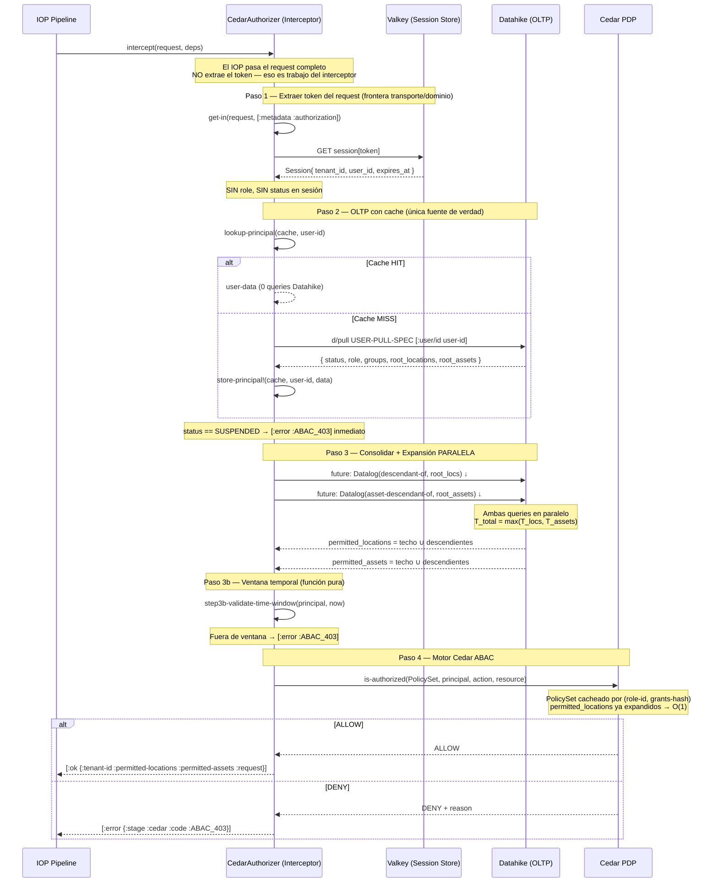
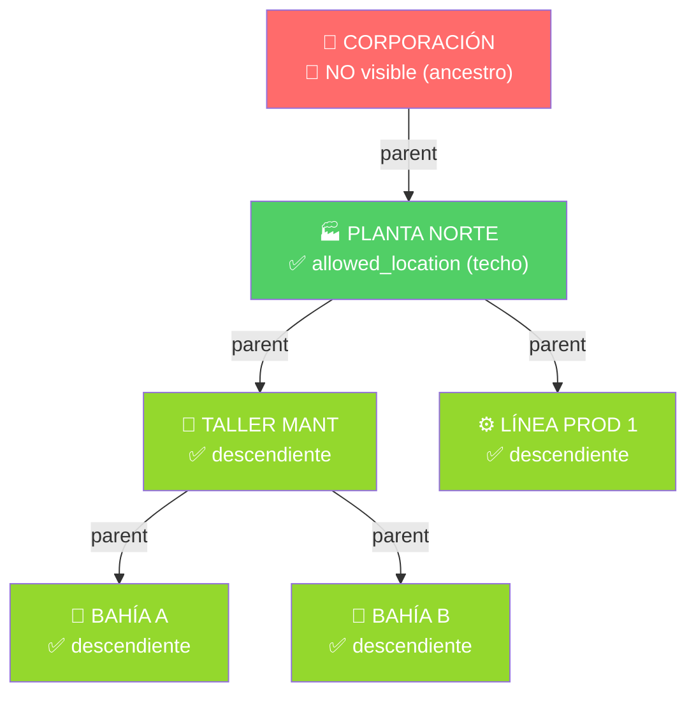

# Fase 06: CedarAuthorizer — Interceptor de Autorización Zero-Trust

**Nombre del Manifiesto:** `CedarAuthorizer`
**Tipo:** Interceptor de Autorización — Paso 1 del IOP Pipeline
**Caller:** [03A_FASE_IOP.md](03A_FASE_IOP.md) — Paso 1 (síncrono, bloqueante)
**Consumidor del output:** [05.01-JANUS.md](05.01-JANUS.md) — Cerebro Janus (valida `cedar_ctx` vs `:metri.cedar/context-invariant`)
**Contrato de output:** [janus-ast-ir.edn](janus-ast-ir.edn) — sección `:metri.cedar/*` | [05.02_FASE_JANUS_AST_IR.md §4](05.02_FASE_JANUS_AST_IR.md)

El **CedarAuthorizer** es el único punto de entrada de autorización del Metri Engine.
Es un **interceptor** — no un servicio, no un microservicio, no una Lambda independiente.
Vive dentro del mismo proceso que el IOP y se ejecuta síncronamente antes de cualquier operación de negocio.

---

## DOMINIO 0: Diseño del Interceptor — Contrato de Entrada y Salida

### La decisión de diseño clave

> **¿El Interceptor extrae el token internamente, o recibe el token como parámetro?**

**Decisión: El Interceptor recibe el `request` completo. El token es extraído como Paso 1 dentro del interceptor.**

| Argumento                                                | Explicación                                                                                                                                           |
| :------------------------------------------------------- | :---------------------------------------------------------------------------------------------------------------------------------------------------- |
| **SRP del interceptor**                                  | El interceptor ES la frontera entre el transporte (gRPC) y el dominio de autorización. Extraer el token del header es su trabajo — no del IOP.        |
| **El IOP no debe saber cómo se transporta el token**     | Hoy es `metadata.authorization`, mañana puede ser `x-metri-token`. El IOP nunca debería cambiar por eso.                                              |
| **El output incluye el `request` original**              | El interceptor devuelve `{:request request}` al IOP para que Janus lo procese. Si el input fuera solo el token, tendría que recibir el request igual. |
| **Protocolo-agnóstico por fuera, específico por dentro** | El IOP llama `(interceptor request)` — una sola firma limpia. Solo el Paso 1 interno conoce `metadata.authorization`.                                 |

**Lo que NO hace el IOP:**

```clojure
;; ❌ MAL — el IOP no extrae el token, eso no es su responsabilidad
(let [token (get-in request [:metadata :authorization])]
  (cedar/intercept token deps))

;; ✅ CORRECTO — el IOP pasa el request completo
(cedar/intercept request deps)
```

---

### Entrada del Interceptor

```
Entrada: request (gRPC Request Object)

┌─────────────────────────────────────────────────────────────┐
│ request                                                     │
│  ├─ :metadata                                               │
│  │    └─ :authorization  "Bearer sha256-abc..."   ← TOKEN   │
│  ├─ :entity-type    "asset" | "location" | ...    ← DOMAIN  │
│  │    (= domain_quota.resource_domain)                      │
│  ├─ :operation      :create | :get | :update | ...  ← ACTION  │
│  │    (= Cedar Action::“CREATE” | Action::“VIEW” | ...)      │
│  ├─ :body                                                   │
│  │    └─ raw payload (ATS sin procesar — Janus lo valida)   │
│  └─ ...otros campos gRPC                                    │
└─────────────────────────────────────────────────────────────┘

Deps inyectadas (Integrant):
  :valkey-store   ISessionStore   → resolver opaque token
  :db             Datahike DB     → pull user/role/groups (snapshot)
  :cache          IPrincipalCache → TTL 10s por user-id
  :cedar-engine   CedarEngine     → PolicySet cache + evaluación ABAC

Campos del request que usa el interceptor internamente:
  :metadata.authorization  → Paso 1: extraer token opaco
  :entity-type             → Paso 4: resource.domain (Cedar Resource)
  :operation               → Paso 4: Cedar Action
```

> [!NOTE]
> El mismo `:request` viaja intacto por todo el pipeline — nadie lo modifica. Cada componente lee lo que necesita:
>
> - **CedarAuthorizer** lee: `metadata.authorization` (Paso 1) + `entity-type` y `operation` (Paso 4 → `action-from` y `resource-from`)
> - **QuotaGuard** lee: `entity-type` (→ `resource_domain` DY) + `operation` (→ mapping `limit_type`)
> - **Janus** lee: `entity-type` (→ `codice/load-schema`) + `body` (→ payload Malli validation)

### Salida del Interceptor

```
Salida: [:ok cedar-ctx] | [:error error-map]


[:ok cedar-ctx]
┌────────────────────────────────────────────────────────────────────┐
│ cedar-ctx (Evoluciona según el consumidor final)                   │
│  ├─ :tenant-id      "tnt_01J..."  ← Zero-Trust: inyectado por Cedar│
│  ├─ :user-id        "usr_01J..."  ← identidad soberana del sujeto  │
│  ├─ :roles          #{"tenant-admin"} ← array de roles para el ABAC│
│  │                                                                  │
│  │  SI ES ANALÍTICA (Janus Router / action="VIEW"):                 │
│  ├─ :domain-boundaries                                              │
│  │    {"work_order" [{:query-scope "ALL" ...}]   ← entidad RAÍZ 1  │
│  │     "asset"      [{...} {...}]}               ← entidad RAÍZ 2  │
│  │   ⚠ Solo entidades evaluadas como raíz por Cedar.               │
│  │     JOINs/sub-recursos NO aparecen aquí.                        │
│  │     (Root RLS Guardian — ver cedar-janus-contract-v1.edn)        │
│  │                                                                  │
│  │  SI ES MUTACIONAL (IOP OLTP / action="CREATE/UPDATE/DELETE/..."):│
│  ├─ :domain-boundaries  {}  ← Vacío (Cedar validó ABAC en memoria) │
│  │                                                                  │
│  └─ :request        request ← passthrough original, intacto        │
└────────────────────────────────────────────────────────────────────┘
  ↑ Janus consume `:domain-boundaries` SOLO para entidades RAÍZ del query.
    Si el request incluye JOINs, Janus NO busca el sub-dominio en este mapa.
    Hereda el dominio del registro raíz (Root RLS Guardian).
    [Validado: test C20 — cedar_contract_test.py]
  ↑ IOP consume el `ctx` sabiendo que Cedar ya evaluó ACTION+BODY mediante
    ABAC estricto y no necesita re-evaluar en el path mutacional.

[:error error-map]
┌─────────────────────────────────────────────────────────────┐
│ error-map                                                   │
│  ├─ :stage   :cedar                                         │
│  ├─ :code    :ABAC_401  (token ausente o expirado)          │
│  │         | :ABAC_403  (usuario suspendido, DENY Cedar,     │
│  │                       fuera de ventana temporal)         │
│  └─ :detail  string     (descripción human-readable)        │
└─────────────────────────────────────────────────────────────┘
  ↑ El IOP retorna gRPC 401/403 al cliente sin llegar a Janus.
```

### Diagrama de contrato

```
                  ┌──────────────────────────────────────────┐
IOP               │          CedarAuthorizer                 │
                  │                                          │
(cedar/intercept  │  Paso 1: token ← metadata.authorization  │
  request         │  Paso 2: user/role/groups ← Datahike      │
  deps)    ──────►│  Paso 3: expand locations/assets (↓ puro) │
                  │  Paso 3b: ventana temporal (fn pura)      │
                  │  Paso 4: action  ← request.operation      │
                  │           domains ← request(entities)    │
                  │           domain-dict ← map/reduce       │
                  │           Cedar ABAC → ALLOW | DENY       │
                  │                                          │
          ◄───────│  [:ok cedar-ctx] | [:error {:code ...}]  │
                  └──────────────────────────────────────────┘

  El IOP no sabe NADA de lo que ocurre dentro del interceptor.
  Solo conoce la firma y el formato del resultado.
```

---

## DOMINIO I: Algoritmo de Autorización — 5 Pasos

```
┌──────────────────────────────────────────────────────────────────────────────────┐
│                     CedarAuthorizer — Pipeline interno                          │
│                                                                                  │
│  ┌─────────┐   ┌──────────────────────┐   ┌─────────────────────────────────┐   │
│  │ PASO 1  │   │       PASO 2         │   │           PASO 3                │   │
│  │ Extraer │   │  Consulta OLTP       │   │      Consolidar Fronteras       │   │
│  │ Token   │──►│  1 pull recursivo    │──►│  Unión pura por Rol (O(n))      │   │
│  │ del     │   │  user→roles→groups   │   │  + Datalog en PARALELO          │   │
│  │ request │   │  + status check      │   │  ┌─ expand locations ↓ ─┐       │   │
│  │ Valkey  │   │  CACHE TTL 10s ✦    │   │  └─ expand assets    ↓ ─┘ futures│  │
│  └─────────┘   └──────────────────────┘   └─────────────────────────────────┘   │
│                                                                                  │
│  ┌─────────────────────┐   ┌────────────────────────────────────────────────┐   │
│  │       PASO 3b       │   │                    PASO 4                      │   │
│  │  Ventana Temporal   │──►│          Motor Cedar ABAC                      │   │
│  │  Función Pura       │   │  PolicySet cache por (role-id, grants-hash) ✦  │   │
│  │  O(restricciones)   │   │  → ALLOW | DENY en microsegundos               │   │
│  └─────────────────────┘   └────────────────────────────────────────────────┘   │
└──────────────────────────────────────────────────────────────────────────────────┘
   ✦ = optimizaciones de rendimiento
```

---

### Infraestructura — Protocolos y Helpers DRY

```clojure
(ns metri.cedar.authorizer
  (:require [datahike.api        :as d]
            [clojure.string      :as str]
            [metri.cedar.cache   :as cache]
            [metri.cedar.session :as session]
            [metri.cedar.rules   :as rules]
            [metri.cedar.time    :as tw]))

;; ── Protocolo IPrincipalCache — abstracción testeable ─────────────────────
(defprotocol IPrincipalCache
  (lookup-principal [this user-id])
  (store-principal! [this user-id principal])
  (evict-user!      [this user-id])
  (evict-by-role!   [this role-id]))
;; evict-by-role! invalida TODOS los usuarios con ese rol → efecto inmediato

;; ── Pull spec compartido — DRY: definido una vez, usado siempre ───────────
;; FIX B-2: La profundidad máxima de expansión es 10 niveles jerárquicos.
;; Si el árbol tiene más niveles, la expansión Datalog los ignorará silenciosamente.
;; Asegúrate de que la jerarquía operacional no supere este límite en producción.
(def ^:private MAX-HIERARCHY-DEPTH 10)

(def ^:private USER-PULL-SPEC
  '[:user/id
    :user/status
    :user/tenant-id
    {:user/role-ids
       [:role/id :role/name :role/grants
        {:role/allowed-locations [:db/id]}
        {:role/allowed-assets    [:db/id]}]}
    {:user/group-ids
       [:user-group/id
        {:user-group/allowed-locations [:db/id]}
        {:user-group/allowed-assets    [:db/id]}
        :user-group/time-restrictions]}])

;; ── DRY: extract-ids — elimina (mapv :db/id coll) en 4 puntos ────────────
(defn- extract-ids [coll] (into [] (keep :db/id) coll))

;; ── DRY: expand-subtree — función única para jerarquías ──────────────────
;; Reemplaza expand-permitted-locations + expand-permitted-assets con 1 fn.
;; FIX B-2 CORREGIDO: MAX-HIERARCHY-DEPTH ahora se pasa como parámetro `:depth`
;; a la query Datalog usando la función recursiva acotada.
;; La constante ya NO es decorativa — el motor Datalog respeta el límite.
(defn- expand-subtree [db rule-sym root-ids]
  (if (empty? root-ids)
    #{}
    (into (set root-ids)
          (d/q '[:find [?desc ...]
                 :in $ [?root ...] % ?max-depth
                 :where (rule ?root ?desc ?max-depth)]
               db root-ids
               [[rule-sym '(?parent ?child ?depth)
                 [(!= ?depth 0)]
                 ['db.fn/call rule-sym ?parent ?mid (dec ?depth)]
                 [(= ?child ?mid)]]]
               MAX-HIERARCHY-DEPTH))))

(def ^:private expand-locations #(expand-subtree %1 'descendant-of       %2))
(def ^:private expand-assets    #(expand-subtree %1 'asset-descendant-of %2))

;; FIX A-1: policy-cache eliminado como singleton global.
;; Se inyecta ahora por Integrant como :policy-cache dentro de `auth-deps`.
;; Para tests: pasar (cache/build {:strategy :lru :max-size 10}) sin monkeypatching.
;; En producción: configurado en integrant.edn con la estrategia LRU apropiada.

;; ── action-from — extrae Cedar Action desde request.operation ────────────
;; request.operation (keyword gRPC) → Cedar Action string
;; Cedar usa strings canónicos en sus evaluaciones — no keywords.
(def ^:private operation->cedar-action
  {:create "CREATE"   ;; Action::"CREATE" — nueva entidad
   :get    "VIEW"     ;; Action::"VIEW"   — consulta/lectura
   :update "UPDATE"   ;; Action::"UPDATE" — modificación
   :delete "DELETE"   ;; Action::"DELETE" — eliminación
   :upsert "UPSERT"}) ;; Action::"UPSERT" — inserción o modificación

(defn- action-from [request]
  (or (get operation->cedar-action (get-in request [:operation]))
      (throw (ex-info "Unknown or missing operation in request"
                      {:stage :cedar :code :ABAC_400
                       :detail (str "operation=" (get-in request [:operation]))}))))

;; ── resource-from — construye Cedar Resource desde request ───────────────
;; Cedar Resource encapsula QUÉ entidad se está accediendo.
;; :domain     = request.entity-type → filtra la política Cedar correcta
;; :entity-id  = request.body.id    → el registro específico (puede ser nil en CREATE)
;; :tenant-id  ya resuelto por Cedar — no del request
(defn- extract-domains-from [request]
  "Extrae el array de entidades demandadas. Si es batch, interroga el mapa :queries.
   FIX #4: Falla rápido si el mapa :queries existe pero viene vacío (no dominios = denegación)."
  (if-let [batch-queries (not-empty (get-in request [:body :queries]))]
    ;; Batch: extrae el set de dominios únicos del mapa de queries
    (set (map (comp name :entity :ast val) batch-queries))
    ;; Simple: entity-type o falla inmediata si está ausente
    #{(or (get-in request [:entity-type])
          (throw (ex-info "Missing entity-type in request"
                          {:stage :cedar :code :ABAC_400
                           :detail "entity-type required for Cedar resource"}))})))

;; NOTA: Si :body.queries existe pero está vacío {}, not-empty retorna nil.
;; El fallback intenta entity-type. Si tampoco existe → ABAC_400.
;; Esto previene que un dashboard vacío passé silenciosamente.

(defn- resource-from [request]
  {:domains   (extract-domains-from request)
   :entity-id (get-in request [:body :id])})
```

> [!NOTE]
> `action-from` y `resource-from` son los únicos puntos donde Cedar lee del request.
> Todo lo demás del request (payload, body) es caja negra — Janus lo procesa.
> El `:tenant-id` en el Resource Cedar viene del ctx (resuelto por Valkey) — nunca del request.

---

### Paso 1 — Extraer Token del Request (Frontera de Transporte)

```clojure
(defn- step1-extract-token
  "Paso 1: el interceptor opera sobre el request completo.
   Extrae el token opaco del header de autorización gRPC.
   Si el header falta o está vacío → falla inmediata :ABAC_401.
   Resuelve el token en Valkey → Session mínima de identidad.

   ¿Por qué el interceptor extrae el token y no el IOP?
   → El interceptor ES la frontera transporte/dominio.
   → El IOP no debe conocer la estructura del header gRPC.
   → Cambiar la ubicación del token (header, cookie, body) = cambio solo aquí."
  [request valkey-store]
  (let [header (get-in request [:metadata :authorization])]
    (when (str/blank? header)
      (throw (ex-info "Missing authorization header"
                      {:stage :cedar :code :ABAC_401
                       :detail "Authorization header is required"})))
    (let [token   (str/replace-first header #"^(?i)bearer\s+" "")
          session (session/resolve-opaque valkey-store token)]
      (when-not session
        (throw (ex-info "Invalid or expired token"
                        {:stage :cedar :code :ABAC_401
                         :detail "Token not found or TTL expired"})))
      ;; FIX C-1: Guard contra payload malformado de Valkey.
      ;; Si Valkey devuelve un mapa sin :user-id o :tenant-id (corrupción, downgrade, etc.),
      ;; fallamos controladamente con :ABAC_401 en lugar de propagar un NPE al Paso 2.
      (when-not (and (uuid? (:user-id session)) (uuid? (:tenant-id session)))
        (throw (ex-info "Malformed session payload from Valkey"
                        {:stage :cedar :code :ABAC_401
                         :detail (str "session missing :user-id or :tenant-id kid=" (:kid session))})))
      session)))
;;  session :: { :kid        "sha256-abc..."
;;               :tenant-id  #uuid "tnt_01J..."
;;               :user-id    #uuid "usr_01J..."
;;               :expires-at 1744234567000 }
;;  SIN status · SIN role_id · SIN group_ids
;;  → todo lo demás viene de Datahike (única fuente de verdad de autorización)
;;  INVARIANTE: :user-id y :tenant-id DEBEN ser UUIDs válidos — validado en Paso 1.
```

---

### Paso 2 — Consulta OLTP con Cache Inteligente

```clojure
;; ── Cache con doble estrategia de invalidación ───────────────────────────
;;
;;   Evento                  Acción de invalidación
;;   ────────────────────    ──────────────────────────────────────────────
;;   user muta               (evict-user! cache user-id)
;;   role muta               (evict-by-role! cache role-id)   ;; N usuarios
;;   group muta              (evict-user! cache uid) por cada afectado
;;
;;   Con TTL 10s:     9,000 queries/s → 900 queries/s (3,000 req/s)
;;   + evict explícito: efecto bloqueo/rol en < 100ms (sin esperar TTL)

(defn- fetch-user-graph
  "Pull recursivo puro — 1 interacción Datahike.
   Trabaja sobre db snapshot (point-in-time) — consistencia garantizada."
  [db user-id]
  (let [user (d/pull db USER-PULL-SPEC [:user/id user-id])]
    (when (= "SUSPENDED" (:user/status user))
      (throw (ex-info "User is suspended"
                      {:stage :cedar :code :ABAC_403
                       :detail (str "User " user-id " is suspended")})))
    user))

(defn- step2-query-oltp
  "Cache-aside pattern.
   HIT:  0 queries Datahike → microsegundos.
   MISS: 1 pull recursivo → cachea → retorna.
   El status, rol, grupos y locaciones siempre reflejan el estado
   actual de Datahike — no la versión que tenía el token al login."
  [db user-id cache]
  (or (lookup-principal cache user-id)
      (let [data (fetch-user-graph db user-id)]
        (store-principal! cache user-id data)
        data)))
```

---

### Paso 3 — Consolidar + Expansión Jerárquica en Paralelo

```clojure
(defn- step3-consolidate
  "Construye los Boundaries en 2 sub-pasos:
   3a) Base Groups: locaciones/assets de permisos de grupos transversales al usuario.
   3b) Iteración Multi-Rol: por cada rol, se expanden sus propias locaciones/assets
       sumándoles los Base Groups. Cada Rol guarda sus grants intactos."
  [db user-data]
  ;; FIX B-1: Guard defensivo para usuario sin roles asignados.
  ;; Sin roles = ninguna frontera posible = DENY inmediato antes de gastar futures.
  (let [roles  (not-empty (:user/role-ids user-data))]
    (when-not roles
      (throw (ex-info "User has no roles assigned"
                      {:stage :cedar :code :ABAC_403
                       :detail (str "user-id=" (:user/id user-data) " has empty role-ids")})))
    (let [groups (:user/group-ids user-data)

          ;; Grupos son transversales a todos los roles del user
          group-locs   (mapcat #(extract-ids (:user-group/allowed-locations %)) groups)
          group-assets (mapcat #(extract-ids (:user-group/allowed-assets %)) groups)

          ;; Mapeamos paralelamente las expansiones jerárquicas usando futures
          process-role
          (fn [role]
            (future
              (let [r-locs (distinct (concat (extract-ids (:role/allowed-locations role)) group-locs))
                    r-asts (distinct (concat (extract-ids (:role/allowed-assets role)) group-assets))]
                {:role-id            (:role/id role)
                 :grants             (:role/grants role)
                 ;; Expansión Datalog descendente (max MAX-HIERARCHY-DEPTH niveles)
                 :permitted-locations (vec (expand-locations db r-locs))
                 :permitted-assets    (vec (expand-assets db r-asts))})))

          processed-roles (mapv deref (map process-role roles))]

      {:user-id             (:user/id user-data)
       :tenant-id           (:db/id (:user/tenant-id user-data))
       :roles               (set (map (comp :role/name :role/id) roles)) ;; #{"tenant-admin" ...}
       :roles-boundaries    processed-roles
       :time-restrictions   (mapcat :user-group/time-restrictions groups)})))
```

> [!TIP]
> Con expansión en paralelo: `T_paso3 = max(T_locs, T_assets)` en lugar de `T_locs + T_assets`. En árboles de 5 niveles, ~40% más rápido.

---

### Paso 3b — Validación de Ventana Temporal (Función Pura)

```clojure
;; Delegado a metri.cedar.time — 100% puro, sin side-effects.
;; Clock inyectable en aridad-2 → testeable sin mocks de JVM.

;; FIX B-3: `days-of-week` se convierte a set UNA VEZ en la función de validación,
;; no en cada evaluación del predicado. Esto evita reconstruir el set O(n) veces
;; si hay muchas restricciones paralelas por grupos.
;; FIX C-3: `day` ahora es parámetro explícito de `now-within-window?` — antes
;; era capturado silenciosamente del scope externo, creando una dependencia oculta
;; que rompería si la función se extraería a su propio namespace (time.clj).
(defn- now-within-window? [{:keys [start-minute end-minute]} day-set day minute]
  (and (contains? day-set day)
       (<= start-minute minute end-minute)))

(defn- step3b-validate-time-window
  "Valida que el momento actual esté en alguna ventana autorizada.
   Sin restricciones → pass (mínima sorpresa: no es DENY por defecto).
   Clock inyectable para tests sin mocks."
  ([principal]
   (step3b-validate-time-window principal (java.time.ZonedDateTime/now java.time.ZoneOffset/UTC)))
  ([principal ^java.time.ZonedDateTime now]
   (let [restrictions (:time-restrictions principal)]
     (when (seq restrictions)
       (let [day     (.getValue (.getDayOfWeek now))
             minute  (+ (* (.getHour now) 60) (.getMinute now))
             ;; FIX B-3: Set pre-calculado por restricción, no por evaluación
             windows (mapv #(assoc % :days-set (set (:days-of-week %))) restrictions)]
         ;; FIX C-3: `day` y `minute` pasados explícitamente como argumentos
         (when-not (some #(now-within-window? % (:days-set %) day minute) windows)
           (throw (ex-info "Access outside allowed time window"
                           {:stage :cedar :code :ABAC_403
                            :detail {:day day :minute minute}})))))
     (assoc principal :time-window-valid true))))
```

---

### Paso 4 — Motor Cedar ABAC con PolicySet Cache

```clojure
(defn- get-or-compile-policy-set [cedar-engine policy-cache role-id grants]
  ;; FIX A-1: policy-cache ahora es parámetro inyectado, no singleton global.
  ;; Permite sustituirlo por (atom {}) en tests sin monkeypatching.
  (let [k [role-id (hash grants)]]
    (or (cache/lookup policy-cache k)
        (let [ps (cedar/compile-policy-set cedar-engine grants)]
          (cache/store! policy-cache k ps)
          ps))))

(defn- build-cedar-multi-role-context
  [cedar-engine principal domains]
  "Compila y valida las reglas ABAC iterando N dominios, devolviendo mapa Múltiple de Fronteras.
   FIX C-2: Recolecta TODOS los dominios denegados antes de lanzar la excepción.
   En batch analytics, el error reporta el set completo de dominios fallidos,
   no solo el primero (comportamiento anterior que truncaba el reduce)."
  (let [{:keys [allowed denied]}
        (reduce (fn [{:keys [allowed denied]} domain]
                  (let [boundaries
                        (reduce (fn [acc boundary]
                                  (let [grant (first (filter #(= (:domain %) domain) (:grants boundary)))]
                                    (if grant
                                      (conj acc {:query-scope         (or (:scope grant) "NONE")
                                                 :permitted-locations (:permitted-locations boundary)
                                                 :permitted-assets    (:permitted-assets boundary)})
                                      acc)))
                                []
                                (:roles-boundaries principal))]
                    (if (empty? boundaries)
                      {:allowed allowed :denied (conj denied domain)}
                      {:allowed (assoc allowed domain boundaries) :denied denied})))
                {:allowed {} :denied []}
                domains)]
    ;; Si hay cualquier dominio denegado, reportamos el set completo en un solo throw.
    (when (seq denied)
      (throw (ex-info "Cedar DENY (Batch domains unauthorized)"
                      {:stage :cedar :code :ABAC_403
                       :denied-domains denied
                       :detail (str "No role authorized for: " (clojure.string/join ", " denied))})))
    allowed))

;; FIX A-2: step4 separado en dos funciones puras + dispatcher de 1 línea.
;; Cada función tiene una única responsabilidad (SRP), es testeable de forma aislada
;; y el dispatcher queda como un simple predicado de routing.

(defn- step4-mutational
  "Camino OLTP: valida mutación contra TODOS los roles (OR lógico).
   ALLOW si al menos 1 rol lo permite. DENY si todos lo rechazan."
  [cedar-engine policy-cache principal action resource body]
  (let [roles-boundaries (:roles-boundaries principal)
        resource+body    (merge resource {:attributes body})
        decisions        (mapv (fn [rb]
                                (let [ps (get-or-compile-policy-set cedar-engine policy-cache
                                                                     (:role-id rb)
                                                                     (:grants rb))]
                                  (cedar/is-authorized cedar-engine ps
                                                       {:principal principal
                                                        :action    action
                                                        :resource  resource+body})))
                              roles-boundaries)
        allowed?         (some #(= :allow (:effect %)) decisions)]
    (when-not allowed?
      (throw (ex-info "Cedar DENY (Mutational ABAC Failed — All roles denied)"
                      {:stage :cedar :code :ABAC_403
                       :action action :domains (:domains resource)})))
    {}))

(defn- step4-analytical
  "Camino OTLP: construye el diccionario de fronteras RLS para Push-Down a Janus."
  [cedar-engine principal domains]
  (build-cedar-multi-role-context cedar-engine principal domains))

(defn- step4-evaluate-cedar
  "Dispatcher puro — delega al camino correcto según la naturaleza de la acción.
   Mutacional (CREATE/UPDATE/DELETE/UPSERT) → step4-mutational (in-memory ABAC).
   Analítico  (VIEW)                        → step4-analytical  (Push-Down RLS)."
  [cedar-engine policy-cache principal action resource body]
  (if (contains? mutational-actions action)
    (step4-mutational  cedar-engine policy-cache principal action resource body)
    (step4-analytical  cedar-engine principal (:domains resource))))
```

---

### Orquestador — `intercept` (Punto de entrada público)

```clojure
;; FIX M-2: Deps agrupados semánticamente para reducir la aridad y facilitar
;; la evolución futura sin ampliar la firma plana del interceptor.
;; auth-deps    = {:valkey-store … :db … :cache … :cedar-engine … :policy-cache …}
;; tracing-deps = {:tracer …}
(defn intercept
  "Punto de entrada único del interceptor.
   El IOP llama: (cedar/intercept request {:auth-deps deps :tracing-deps tracing})
   El IOP NO extrae el token, NO conoce la estructura del header.

   Garantías:
   · O(1) Valkey      → identidad mínima, 0 permisos en token
   · O(1) Cache       → ≤ 3 queries Datahike en MISS (1 pull + N futures por rol)
   · O(1) Cedar       → PolicySet inyectable por [role-id grants-hash]
   · Fail-fast        → primer error cortocircuita → [:error ...]
   · Railway puro     → try/catch en superficie, 0 if-let anidados
   · OTel             → span completo del ciclo de autorización"
  [request {:keys [auth-deps tracing-deps]}]
  (let [{:keys [valkey-store db cache cedar-engine policy-cache]} auth-deps
        {:keys [tracer]}                                          tracing-deps]
    ;; Span OTel cubre el ciclo completo del interceptor
    (with-span [span tracer "cedar.authorize"
                {:attr/user-op (name (get-in request [:operation] :unknown))
                 :attr/entity  (str (get-in request [:entity-type] "batch"))}]
      (try
        (let [session     (step1-extract-token request valkey-store)
              user-data   (step2-query-oltp db (:user-id session) cache)
              principal   (step3-consolidate db user-data)
              principal   (step3b-validate-time-window principal)
              domain-dict (step4-evaluate-cedar cedar-engine policy-cache principal
                                                (action-from request)
                                                (resource-from request)
                                                (:body request))]
          (otel/set-status! span :ok)
          [:ok {:tenant-id         (:tenant-id session)
                :user-id           (:user-id session)
                :roles             (:roles principal)
                :domain-boundaries domain-dict
                :request           request}])
        (catch clojure.lang.ExceptionInfo e
          (otel/record-exception! span e)
          (otel/set-status! span :error (str (:code (ex-data e))))
          [:error (merge {:stage :cedar} (ex-data e))])))))

;; ── API de invalidación — llamar desde mutaciones de user/role/group ─────
(defn invalidate-user!  [cache user-id]  (evict-user!    cache user-id))
(defn invalidate-role!  [cache role-id]  (evict-by-role! cache role-id))
;; FIX M-3: invalidate-group! encapsula el loop de usuarios afectados.
;; Llamar después de cualquier mutación en user-group (añadir/quitar miembros).
(defn invalidate-group! [cache db group-id]
  (let [affected-users (d/q '[:find [?uid ...]
                               :in $ ?gid
                               :where [?u :user/group-ids ?gid]
                                      [?u :user/id ?uid]]
                             db group-id)]
    (doseq [uid affected-users]
      (evict-user! cache uid))))
```

### Análisis de Complejidad

| Paso                       | Cache HIT         | Cache MISS       | Paralelo    |
| :------------------------- | :---------------- | :--------------- | :---------- |
| 1 — Extraer token + Valkey | O(1)              | O(1)             | —           |
| 2 — OLTP Pull              | **O(1)**          | O(grafo)         | —           |
| 3 — Consolidar raíces      | O(n)              | O(n)             | —           |
| 3 — Expand locations       | O(profundidad)    | O(profundidad)   | ✅ `future` |
| 3 — Expand assets          | O(profundidad)    | O(profundidad)   | ✅ `future` |
| 3b — Time window           | O(restricciones)  | O(restricciones) | —           |
| 4 — action-from            | O(1) — map lookup | O(1)             | —           |
| 4 — resource-from          | O(1) — get in     | O(1)             | —           |
| 4 — PolicySet compile      | **O(1)**          | O(grants)        | —           |
| 4 — Cedar evaluate         | O(1)              | O(1)             | —           |

**Ruta crítica (cache HIT):** Valkey O(1) → Cache O(1) → Pure O(n) → max(T_locs, T_assets) → action-from O(1) → Cedar O(1)

### Principios SOLID

| Principio   | Aplicación                                                                                                                                                                                                                                                                  |
| :---------- | :-------------------------------------------------------------------------------------------------------------------------------------------------------------------------------------------------------------------------------------------------------------------------- |
| **S** — SRP | `step1` = extrae token (Valkey). `step2` = OLTP + cache (Datahike). `step3` = consolida + expande jerárquicamente. `step3b` = ventana temporal (pura). `step4` = extrae `action-from` + `resource-from` del request + evalua ABAC Cedar. `intercept` = orquesta únicamente. |
| **O** — OCP | Nuevas jerarquías = nueva `parent_id`. Nuevas políticas = fila en Datahike. Nuevas restricciones temporales = nuevo `time_restriction`. Cero cambios al algoritmo.                                                                                                          |
| **L** — LSP | `IPrincipalCache` sustituible por `InMemoryCache` en tests. `step3b` con clock inyectable sin mocks de JVM.                                                                                                                                                                 |
| **I** — ISP | El IOP solo conoce `intercept`. `invalidate-user!` / `invalidate-role!` solo para mutation hooks. Ningún step es visible externamente.                                                                                                                                      |
| **D** — DIP | `valkey-store`, `db`, `cache`, `cedar-engine` inyectados por Integrant. `IPrincipalCache` desacopla el algoritmo del tipo de cache concreto.                                                                                                                                |

---

## DOMINIO II: Resolución de Identidad — Opaque Token

### Protocolo Zero-Network

```
Login (una sola vez):
  1. Autenticación contra IdP externo (Auth0 / Cognito)
  2. Session mínima guardada en Valkey:
       valkey[KID] = { tenant_id, user_id, expires_at }
       ← NUNCA se guardan role, grupos, status ni permisos
  3. Cliente recibe: "Authorization: Bearer <OPAQUE_TOKEN>"
     (SHA-256 aleatorio, sin información decodificable)

Por cada request:
  Interceptor:
    Paso 1 → extrae token del header → GET valkey[token]
             ← Session{ tenant_id, user_id, expires_at }

    Paso 2 → d/pull datahike[user-id]
             ← { status, role, groups, locations, assets }
                ↑ siempre el estado actual — no lo del momento del login
```

### Schema de Sesión (`session.proto`) — Mínimo de identidad

```protobuf
// El token opaco solo transporta IDENTIDAD — nunca autorización.
// Roles, grupos, status y permisos viven EXCLUSIVAMENTE en Datahike.
message Session {
  string kid        = 1;  // Clave Valkey — SHA-256 random
  string tenant_id  = 2;  // Para routing y aislamiento multitenant
  string user_id    = 3;  // Para pull en Datahike
  int64  expires_at = 4;  // TTL — único control de validez del token
}
```

> [!IMPORTANT]
> **Sin status, sin role_id, sin group_ids en sesión.**
> Cambiar rol → efecto inmediato en el próximo request.
> Bloquear usuario → efecto inmediato en el próximo request.
> **Sin gap de vulnerabilidad por TTL de sesión.**

### Reglas de seguridad del token

| Regla                    | Fuente de verdad | Implementación                                               |
| :----------------------- | :--------------- | :----------------------------------------------------------- |
| **Revocación de token**  | Valkey           | `DEL valkey[KID]` → token inválido en todas las instancias   |
| **Replay attack**        | Valkey           | TTL estricto — token expirado falla en Paso 1                |
| **Tenant isolation**     | Valkey           | `tenant_id` del Session, nunca del request del cliente       |
| **Bloqueo de usuario**   | Datahike         | `user.status = SUSPENDED` → DENY en Paso 2, efecto inmediato |
| **Cambio de rol**        | Datahike         | Re-hidrata en el próximo request (TTL 10s o evict explícito) |
| **Cambio de grupos**     | Datahike         | Re-hidrata en el próximo request                             |
| **Cambio de locaciones** | Datahike         | Re-hidrata en el próximo request                             |

---

## DOMINIO III: Hidratación del Principal — Jerarquías Direccionales

### Las tres fuentes de permisos contextuales

```
user.role_id  → role.allowed_locations  ┐
               → role.allowed_assets    ├─ TECHO: límite superior no franqueable
               → role.grants            ┘

user.group_ids → user_group.allowed_locations  ┐
               → user_group.allowed_assets     ├─ Refinamiento contextual
               → user_group.time_restrictions  ┘

Resultado: permitted_locations = (role.locs ∪ group.locs) ∪ todos sus descendientes
           permitted_assets    = (role.assets ∪ group.assets) ∪ todos sus descendientes
```

### Modelos de identidad — atributos relevantes

**`role.json`**

```json
{
  "grants": "[ { domain, actions:[VIEW|CREATE|UPDATE|DELETE], scope } ]",
  "allowed_locations": "techo superior del acceso jerárquico",
  "allowed_assets": "techo superior del acceso a activos"
}
```

**`user_group.json`**

```json
{
  "allowed_locations": "refinamiento contextual de locaciones",
  "allowed_assets": "refinamiento contextual de activos",
  "time_restrictions": "[ { days_of_week, start_minute, end_minute } ]"
}
```

**`user.json`**

```json
{
  "role_id": "ref:role      ← un único rol base (1:1)",
  "group_ids": "[ ref:user_group ]  ← N grupos opcionales (1:N)"
}
```

---

### La Regla Jerárquica — Dirección Única: Padre → Hijo

> [!IMPORTANT]
> **Invariante de jerarquía:** Si un usuario tiene acceso a una `location` (o `asset`), puede ver **todos sus descendientes**. Nunca puede ver sus **ancestros**. Dirección: exclusivamente **↓ descendente**.

```
Árbol de locaciones:

  CORPORACIÓN                  ← 🚫 NO visible (ancestro)
    └─ PLANTA_NORTE            ← ✅ allowed_location (techo asignado)
         ├─ TALLER_MANT           ← ✅ descendiente — visible
         │    ├─ BAHÍA_A          ← ✅ descendiente — visible
         │    └─ BAHÍA_B          ← ✅ descendiente — visible
         └─ LÍNEA_PROD_1          ← ✅ descendiente — visible
```

### Expansión Datalog — `expand-subtree`

```clojure
(def HIERARCHY-RULES
  '[;; Hijo directo
    [(descendant-of ?ancestor ?desc)
     [?desc :location/parent-id ?ancestor]]
    ;; Cierre transitivo ↓
    [(descendant-of ?ancestor ?desc)
     [?middle :location/parent-id ?ancestor]
     (descendant-of ?middle ?desc)]

    ;; Equivalente para assets
    [(asset-descendant-of ?ancestor ?desc)
     [?desc :asset/parent-id ?ancestor]]
    [(asset-descendant-of ?ancestor ?desc)
     [?middle :asset/parent-id ?ancestor]
     (asset-descendant-of ?middle ?desc)]])
```

> [!IMPORTANT]
> El techo es el **límite superior no franqueable**. Si `role.allowed_locations = [PLANTA_NORTE]`, el usuario nunca verá `CORPORACIÓN` aunque exista en el árbol.

---

## DOMINIO IV: Políticas Cedar ABAC — `metri.cedar` v3.0

El contrato de políticas Cedar (`docs/architecture/cedar/metri.cedar`) define **2 permits + 3 forbids**. Es un archivo estático — no se genera en runtime. Define la FORMA de los checks, no los datos.

```
Estructura de precedencia (forbid > permit siempre):
  [F1] F-SUSPENDED     → bloquea todo, sin excepción alguna
  [F2] F-SCOPE-NONE    → visibilidad cero en el dominio solicitado
  [F3] F-CROSS-TENANT  → aislamiento Zero-Trust cardinal
  [P1] P-SUPER-MASTER  → permit irrestricto cross-tenant (neutraliza F3)
  [P2] P-GRANT         → permit base: action_key autorizado + mismo tenant
```

### `P-GRANT` — Acceso ordinario con granularidad de acción

```cedar
permit(principal is Metri::User, action, resource is Metri::MetriResource)
when {
    principal.granted_action_keys.contains(resource.action_key) &&
    principal.tenant_id == resource.tenant_id
};
```

- `granted_action_keys` = `Set<"domain:ACTION">` computado por CedarAuthorizer desde `role.grants` de Datahike.
  Ejemplo: `#{"work_order:VIEW" "work_order:UPDATE" "asset:VIEW"}`
- `resource.action_key` = `"domain:ACTION"` computado del `grpc-action-table` en CedarAuthorizer.
  `ListWorkOrders` → `"work_order:VIEW"` | `CreateWorkOrder` → `"work_order:CREATE"`
- Cedar verifica la **acción específica**, no solo la presencia del dominio. Un rol con `VIEW` no pasa `CREATE`.
- El scope (ALL/OWN/ASSIGNED) NO se evalúa en Cedar — Janus lo expande en predicados AST IR.

### `P-SUPER-MASTER` — Acceso de plataforma cross-tenant

```cedar
permit(principal is Metri::User, action, resource is Metri::MetriResource)
when {
    principal.is_super_master &&
    (principal.cross_tenant_scope == "READ_ALL" || principal.cross_tenant_scope == "FULL")
};
```

- `is_super_master` y `cross_tenant_scope` son **atributos computados** — no columnas de Datahike.
- `is_super_master=true` implica `is_master=true` por definición de su cómputo (incluye `tenant_id == MASTER_TENANT_ID`).
- `READ_ALL`: puede leer cualquier tenant | `FULL`: lee y escribe cualquier tenant.
- Neutraliza `F-CROSS-TENANT` porque ese forbid lleva `!is_super_master` como guard explícito.

### `F-SUSPENDED` — Prioridad absoluta

```cedar
forbid(principal is Metri::User, action, resource)
when { principal.status == "SUSPENDED" };
```

Sin excepciones. Bloquea todo, incluso al User Master. Efecto inmediato en el siguiente request.

### `F-SCOPE-NONE` — Visibilidad cero (universal)

```cedar
forbid(principal is Metri::User, action, resource is Metri::MetriResource)
when { resource.query_scope == "NONE" };
```

Extendido en v3.0 para cubrir **todas** las acciones (antes solo analíticas). `query_scope="NONE"` se inyecta en el resource cuando el dominio tiene scope no configurado (misconfiguration). Bloquea VIEW, CREATE, UPDATE, DELETE por igual. Janus emite `:JANUS_400`.

### `F-CROSS-TENANT` — Zero-Trust CARDINAL (nunca eliminar)

```cedar
forbid(principal is Metri::User, action, resource is Metri::MetriResource)
when {
    principal.tenant_id != resource.tenant_id &&
    !principal.is_super_master
};
```

Garantía irrevocable: ningún usuario puede acceder a datos de otro tenant. `!is_super_master` es el único escape point del sistema.

> [!WARNING]
> La evaluación Cedar **nunca es cacheada por request** — evaluación fresca en cada call. El **`granted_action_keys`** sí puede cachearse junto al user-graph por `(user-id, role-ids-hash)` con invalidación explícita cuando cambian los roles.

---

## DOMINIO V: Flujo de Autorización Completo



### Diagrama de jerarquía — acceso descendente exclusivo



---

## DOMINIO VI: Mapeo de Entidades → Cedar

| Entidad Datahike               | Rol Cedar                  | Expansión jerárquica          |
| :----------------------------- | :------------------------- | :---------------------------- |
| `user`                         | `Principal`                | No — es el sujeto             |
| `role`                         | `PolicySet` fuente         | No — define el techo          |
| `role.allowed_locations`       | `permitted_locations` raíz | ✅ Expandida ↓ (Paso 3)       |
| `role.allowed_assets`          | `permitted_assets` raíz    | ✅ Expandida ↓ (Paso 3)       |
| `user_group.allowed_locations` | Adicional al conjunto raíz | ✅ Expandida ↓ (Paso 3)       |
| `user_group.allowed_assets`    | Adicional al conjunto raíz | ✅ Expandida ↓ (Paso 3)       |
| `location.parent_id`           | Estructura del árbol       | Define dirección de expansión |
| `asset.parent_id`              | Estructura del árbol       | Define dirección de expansión |
| `role.grants[].scope`          | Cláusula `when` Cedar      | `ALL / OWN / ASSIGNED`        |

---

## DOMINIO VII: Integrant — Ciclo de Vida y DI

```clojure
;; config/system.edn — componentes del CedarAuthorizer
:infra/valkey
  {:host #env "VALKEY_HOST" :port 6379 :password #env "VALKEY_PASSWORD"}
  ;; → ig/init-key → ValkeyStore (ISessionStore)
  ;; → ig/halt-key! → disconnect

:cedar/cache
  {:strategy :ttl :ttl-ms 10000 :max-size 50000}
  ;; → ig/init-key → TTLCache (IPrincipalCache)
  ;; → ig/halt-key! → nil

:cedar/policy-cache
  {:strategy :lru :max-size 5000}
  ;; Cache de PolicySets compilados por (role-id, grants-hash).
  ;; LRU: los roles menos usados son eviccionados primero.
  ;; → ig/init-key → LRUCache (IPrincipalCache)

:cedar/engine
  {:policies-table #env "CEDAR_POLICIES_TABLE"}
  ;; → ig/init-key → CedarEngine (wrapper SDK)
  ;; → ig/halt-key! → nil

:infra/tracer
  {:service-name "metri-cedar-authorizer"
   :endpoint     #env "OTEL_EXPORTER_OTLP_ENDPOINT"}
  ;; → ig/init-key → OTel Tracer (SDK)

:iop/cedar-authorizer
  {:auth-deps
    {:valkey-store  #ig/ref :infra/valkey
     :db            #ig/ref :infra/datahike
     :cache         #ig/ref :cedar/cache
     :cedar-engine  #ig/ref :cedar/engine
     :policy-cache  #ig/ref :cedar/policy-cache}   ;; ← FIX A-1: inyectado, no singleton
   :tracing-deps
    {:tracer        #ig/ref :infra/tracer}}         ;; ← FIX M-2: agrupado semánticamente
  ;; → ig/init-key → (fn [request]
  ;;                   (authorizer/intercept request
  ;;                     {:auth-deps    auth-deps
  ;;                      :tracing-deps tracing-deps}))
```

> [!NOTE]
> El `db` se dereferencia **por cada request** (`@datahike`) dentro del wrapper — no en `init-key`.
> Esto garantiza que cada ejecución de `intercept` trabaja con el snapshot más reciente
> de Datahike (point-in-time consistency).
> El `policy-cache` usa estrategia LRU (vs TTL del `principal-cache`) porque los PolicySets
> son estables hasta que el `role.grants` cambia — se invalidan explícitamente vía
> `invalidate-role!`, no por TTL.

### Variables de entorno

| Variable                      | Descripción                         | Ejemplo                      |
| :---------------------------- | :---------------------------------- | :--------------------------- |
| `VALKEY_HOST`                 | Host del clúster Valkey             | `valkey.internal`            |
| `VALKEY_PASSWORD`             | Password del clúster Valkey         | `****`                       |
| `CEDAR_POLICIES_TABLE`        | DynamoDB table de PolicySets        | `metri-cedar-policies-prod`  |
| `DATAHIKE_STORE_URI`          | URI de la store Datahike            | `datahike:aws-ddb://...`     |
| `OTEL_EXPORTER_OTLP_ENDPOINT` | Endpoint del colector OpenTelemetry | `http://otel-collector:4317` |

---

## DOMINIO VIII: Observabilidad OTEL

| Span / Evento                     | Cuándo                           | Atributos                                                                       |
| :-------------------------------- | :------------------------------- | :------------------------------------------------------------------------------ |
| `cedar.step1.token_extracted`     | Siempre                          | `has_header`, latencia Valkey ms                                                |
| `cedar.step1.token_invalid`       | Token ausente/expirado           | `reason`                                                                        |
| `cedar.step1.session_malformed`   | Valkey retorna payload roto      | `kid`, `missing_fields` — **FIX C-1**                                           |
| `cedar.step2.cache_hit`           | Cache HIT                        | `user_id`, `tenant_id`                                                          |
| `cedar.step2.cache_miss`          | Cache MISS                       | `user_id`, `tenant_id`, latencia Datahike ms                                    |
| `cedar.step2.user_suspended`      | Status SUSPENDED                 | `user_id`, `tenant_id`                                                          |
| `cedar.step3.expand_completed`    | Siempre                          | `#root_locs`, `#expanded_locs`, `#root_assets`, `#expanded_assets`, latencia ms |
| `cedar.step3.depth_limit_reached` | Árbol supera MAX-HIERARCHY-DEPTH | `domain`, `depth_limit` — **FIX B-2**                                           |
| `cedar.step3b.time_denied`        | Fuera de ventana temporal        | `user_id`, `day`, `minute`                                                      |
| `cedar.step4.allow`               | ALLOW                            | `user_id`, `tenant_id`, `action`, `domain`                                      |
| `cedar.step4.deny`                | DENY unitario                    | `user_id`, `tenant_id`, `action`, `domain`, `reason`                            |
| `cedar.step4.batch_deny`          | DENY en batch analytics          | `denied_domains[]`, `total_denied` — **FIX C-2**                                |
| `cedar.intercept.latency_ms`      | Siempre                          | P50, P95, P99 total del interceptor                                             |

---

## DOMINIO IX: Blueprint de Implementación

> [!IMPORTANT]
> Diseño de implementación — estructura de archivos, namespaces, dependencias y TDD.
> No es código en producción. Es la especificación que guiará el desarrollo.

### Estructura de Archivos

```
src/metri/cedar/
  authorizer.clj    ← pipeline intercept + 5 step-fns + invalidate-user!/role!/group!
  cache.clj         ← IPrincipalCache · TTLCache (Caffeine) · LRUCache · InMemoryCache (test)
  session.clj       ← ISessionStore · ValkeyStore (Carmine) · StubStore (test)
  rules.clj         ← USER-PULL-SPEC · HIERARCHY-RULES · expand-subtree (respeta MAX-HIERARCHY-DEPTH)
                       MAX-HIERARCHY-DEPTH exportada como var pública para tests
  time.clj          ← now-within-window? (day param explícito) · step3b-validate-time-window (puro)

test/metri/cedar/
  authorizer_test.clj  ← pipeline con stubs (InMemoryCache, StubStore, stub-cedar)
  cache_test.clj       ← TTL expiry · evict-by-role! · concurrencia
  rules_test.clj       ← árbol 5 niveles · set vacío · cierre transitivo · límite MAX-HIERARCHY-DEPTH
  time_test.clj        ← función pura, clock inyectable, day como arg explícito, sin infraestructura
```

### Dependencias (`deps.edn`)

```clojure
;; Añadir / descomentar:
com.taoensso/carmine                  {:mvn/version "3.4.0"}      ;; Valkey
software.amazon.cedar/cedar-java      {:mvn/version "3.2.1"}      ;; Cedar SDK
org.clojure/core.cache                {:mvn/version "1.1.234"}    ;; IPrincipalCache base
com.github.ben-manes.caffeine/caffeine {:mvn/version "3.1.8"}     ;; TTLCache backend
```

### Bootstrap del Sistema — Validación Fail-Fast y Seed Idempotente

El arranque oficial del Metri Engine requiere **validación fail-fast** de variables de entorno antes de inicializar el `CedarAuthorizer`, seguida por el **seed idempotente** de la tríada de plataforma. Se define en `docs/architecture/models/bootstrap.json`.

> [!CAUTION]
> Si cualquiera de las 6 variables `METRI_MASTER_*` no está seteada en el entorno del host, el sistema lanza una excepción fatal en startup y **no arranca**. No hay fallback silencioso. Operar sin identidad de plataforma configurada es un error arquitectónico, no una advertencia.

#### Paso 0: Validación Fail-Fast (antes de cualquier inicialización)

```clojure
(defn validate-master-env! []
  (let [required ["METRI_MASTER_TENANT_ID" "METRI_MASTER_ROLE_ID"
                  "METRI_MASTER_ROLE_SCOPE" "METRI_MASTER_USER_ID"
                  "METRI_MASTER_USER_EMAIL" "METRI_MASTER_USER_PASSWORD_HASH"]
        missing  (filterv #(nil? (System/getenv %)) required)]
    (when (seq missing)
      (throw (ex-info "FATAL: Missing METRI_MASTER_* env vars. System cannot start."
                      {:missing missing})))))

;; Integrant: primer paso del sistema
(defmethod ig/init-key :metri/cedar-authorizer [_ config]
  (validate-master-env!)   ; ← lanza antes de cualquier conexión
  ...)
```

#### Variables de entorno requeridas (`.env`)

```env
# ── Tenant Master ──────────────────────────────────────────
METRI_MASTER_TENANT_ID=<uuid>               # UUID permanente del Tenant Master
METRI_MASTER_TENANT_NAME=Metri Platform     # Nombre visible en la UI
METRI_MASTER_TENANT_STORAGE_REGION=us-east-1
METRI_MASTER_TENANT_BILLING_EMAIL=billing@metri.io

# ── Super Master Role ──────────────────────────────────────
METRI_MASTER_ROLE_ID=<uuid>                 # UUID del rol super-master
METRI_MASTER_ROLE_SCOPE=FULL                # READ_ALL | FULL

# ── User Master ────────────────────────────────────────────
METRI_MASTER_USER_ID=<uuid>                 # UUID del usuario master
METRI_MASTER_USER_EMAIL=admin@metri.io      # Email de acceso
METRI_MASTER_USER_PASSWORD_HASH=<bcrypt>    # Hash Bcrypt/Argon2 — NUNCA texto plano
METRI_MASTER_USER_FIRST_NAME=Platform
METRI_MASTER_USER_LAST_NAME=Admin
```

> [!CAUTION]
> **NUNCA** commitear el `.env` de producción. El `bootstrap.json` contiene únicamente placeholders `$ENV_VAR` — los valores reales viven exclusivamente en el runtime del host o AWS SSM/Secrets Manager.

#### Secuencia de Bootstrap (3 pasos ordenados, idempotentes por UUID)

```
Paso 1: Crear Tenant Master
  entity=tenant, tier=ENTERPRISE
  tenant_id = env/METRI_MASTER_TENANT_ID
  ↓ idempotency: upsert-by-id — si ya existe el UUID, no crea duplicado
  NOTA: is_master NO es un flag en Datahike — se COMPUTA en CedarAuthorizer
        comparando session.tenant_id con env/METRI_MASTER_TENANT_ID

Paso 2: Crear Super Master Role (dentro del Tenant Master)
  entity=role, tenant_id = METRI_MASTER_TENANT_ID
  role_id = env/METRI_MASTER_ROLE_ID
  grants = [{:domain "*" :actions ["VIEW" "CREATE" "UPDATE" "DELETE" "UPSERT" "EXECUTE"] :scope "ALL"}]
  ↓ idempotency: upsert-by-id — si ya existe el UUID, no crea duplicado
  NOTA: is_super_master NO es un flag en Datahike — se COMPUTA comparando
        role_id con env/METRI_MASTER_ROLE_ID

Paso 3: Crear User Master
  entity=user, tenant_id = METRI_MASTER_TENANT_ID
  user_id = env/METRI_MASTER_USER_ID
  email + password_hash ← variables de entorno
  role_ids = [env/METRI_MASTER_ROLE_ID]
  ↓ idempotency: upsert-by-id — si ya existe el UUID, no crea duplicado
```

#### Principal Cedar del User Master (hidratado por CedarAuthorizer v3.0)

```clojure
;; Lo que CedarAuthorizer::build-cedar-principal retorna para el User Master
{:tenant-id           #uuid "METRI_MASTER_TENANT_ID"
 :user-id             #uuid "METRI_MASTER_USER_ID"
 :roles               #{"super-master"}
 :status              "ACTIVE"
 :granted-action-keys #{"*:VIEW" "*:CREATE" "*:UPDATE"     ;; domain wildcard
                        "*:DELETE" "*:UPSERT" "*:EXECUTE"}  ;; P-GRANT siempre true
 :is-super-master     true         ;; COMPUTADO — no columna Datahike
 :cross-tenant-scope  "FULL"       ;; COMPUTADO — desde env/METRI_MASTER_ROLE_SCOPE
 :domain-boundaries   nil}         ;; nil = sin restricciones geográficas
```

#### Evaluación Cedar para el User Master (`metri.cedar` v3.0)

| Política           | ¿Aplica?                    | Razón                                                           |
| :----------------- | :-------------------------- | :-------------------------------------------------------------- |
| **F-SUSPENDED**    | ❌ Solo si status=SUSPENDED | Único bloqueo posible al User Master (emergencia)               |
| **F-SCOPE-NONE**   | ❌ NO aplica                | query_scope="ALL" — nunca "NONE" para el super-master           |
| **F-CROSS-TENANT** | ❌ NO aplica                | lleva `!is_super_master` — super-master excluido explícitamente |
| **P-SUPER-MASTER** | ✅ PERMIT                   | `is_super_master=true && cross_tenant_scope="FULL"`             |
| **P-GRANT**        | ✅ también PERMIT           | `granted_action_keys.contains("*:VIEW")=true` (wildcard)        |

#### Garantías de aislamiento para usuarios ordinarios

Todo usuario que **no** sea el User Master está sujeto a estas garantías irrevocables:

| Garantía                                | Mecanismo Cedar                                         | Capa   |
| :-------------------------------------- | :------------------------------------------------------ | :----- |
| No puede ver datos de otro tenant       | `F-CROSS-TENANT`: `tenant_id != resource.tenant_id`     | Cedar  |
| No puede ejecutar acciones sin grant    | `P-GRANT`: `granted_action_keys.contains(action_key)`   | Cedar  |
| No puede escalar a CREATE con solo VIEW | `P-GRANT`: action_key="domain:CREATE" no está en el Set | Cedar  |
| Su query tiene `tenant_id` forzado      | Janus AST IR Capa 1 — `[:= :entity/tenant-id "tnt_X"]`  | Janus  |
| El `tenant_id` no viene del request     | Valkey resuelve el token opaco — el cliente no lo envía | Valkey |

> [!NOTE]
> Archivos de referencia:
>
> - `docs/architecture/models/bootstrap.json` — seed data con placeholders `$ENV_VAR`
> - `docs/architecture/models/tenant.json` — schema Datahike (sin flags de plataforma)
> - `docs/architecture/models/user.json` — schema Datahike (sin flags de plataforma)
> - `docs/architecture/models/role.json` — schema Datahike (sin flags de plataforma)
> - `docs/architecture/cedar/metri.cedar` v3.0 — 2 permits + 3 forbids
> - `docs/architecture/cedar/cedar-schema.json` — atributos Cedar: `granted_action_keys`, `action_key`, `is_super_master`, `cross_tenant_scope`

---

### Matriz TDD

| Test                        | Tipo        | Escenario                            | Resultado esperado                               |
| :-------------------------- | :---------- | :----------------------------------- | :----------------------------------------------- |
| `token-missing`             | Unit        | Sin header `Authorization`           | `[:error {:code :ABAC_401}]`                     |
| `token-no-bearer`           | Unit        | Header malformado                    | `[:error {:code :ABAC_401}]`                     |
| `token-expired`             | Unit        | Token no en Valkey                   | `[:error {:code :ABAC_401}]`                     |
| `session-malformed-no-uuid` | Unit        | Valkey retorna mapa sin `:user-id`   | `[:error {:code :ABAC_401}]` — **FIX C-1**       |
| `user-suspended`            | Unit        | `user.status = SUSPENDED`            | `[:error {:code :ABAC_403}]`                     |
| `cache-hit-0-queries`       | Unit        | 2do request mismo user               | 0 queries Datahike                               |
| `cache-miss-1-pull`         | Unit        | 1er request                          | 1 pull recursivo                                 |
| `evict-by-role-rehydrates`  | Unit        | Role muta → evict → next request     | Re-hidrata con rol nuevo                         |
| `expand-locs-flat`          | Unit        | Sin hijos                            | Solo raíces en resultado                         |
| `expand-locs-tree-5lvl`     | Unit        | Árbol 5 niveles                      | Todos los descendientes ∪ raíces                 |
| `expand-locs-depth-limit`   | Unit        | Árbol 11 niveles (supera MAX=10)     | Solo 10 niveles expandidos — **FIX B-2**         |
| `expand-locs-empty`         | Unit        | `root-ids = []`                      | `#{}` sin queries Datalog                        |
| `expand-parallel-futures`   | Unit        | locations ≠ assets                   | Ambas se lanzan como `future`                    |
| `time-inside-window`        | Unit (puro) | Lunes 09:00, ventana 08-18           | Pass                                             |
| `time-outside-window`       | Unit (puro) | Sábado 09:00, solo L-V               | `[:error :ABAC_403]`                             |
| `time-day-arg-explicit`     | Unit (puro) | `now-within-window?` llamado directo | No captura `day` del scope externo — **FIX C-3** |
| `time-no-restrictions`      | Unit (puro) | Sin restricciones                    | Pass — no DENY por defecto                       |
| `cedar-allow`               | Unit        | Policy ALLOW                         | `[:ok cedar-ctx]`                                |
| `cedar-deny`                | Unit        | Policy DENY                          | `[:error {:code :ABAC_403}]`                     |
| `cedar-batch-partial-deny`  | Unit        | Batch: 3 dominios, 2 denegados       | `:denied-domains` contiene los 2 — **FIX C-2**   |
| `policy-cache-hit`          | Unit        | 2do request mismo role               | PolicySet no recompilado                         |
| `ancestor-blocked`          | Integration | Recurso en location padre            | DENY                                             |
| `descendant-allowed`        | Integration | Recurso en location hijo             | ALLOW                                            |
| `intercept-happy-path`      | Integration | Todo OK                              | `[:ok {:tenant-id :domain-boundaries :request}]` |

> [!NOTE]
> **Separación de responsabilidades canónica:**
>
> - **Valkey** = autenticación de token (¿es válido? ¿a quién pertenece?) + validación UUID de payload (FIX C-1)
> - **Datahike** = fuente de verdad de autorización (¿qué puede hacer? ¿está activo?)
> - **Cedar** = juez de políticas (¿está permitido?) + reporte completo de dominios denegados (FIX C-2)
> - **Janus** = ejecutor de filtros RLS: valida el `cedar_ctx` emitido contra `:metri.cedar/context-invariant`, resuelve el scope con `:metri.cedar/scope-field-resolution`, e inyecta predicados en el AST IR. Solo opera sobre entidades RAIZ del query (Root RLS Guardian).
>
> Documentación completa del contrato `cedar_ctx` → Janus: [05.02_FASE_JANUS_AST_IR.md §4](05.02_FASE_JANUS_AST_IR.md)
