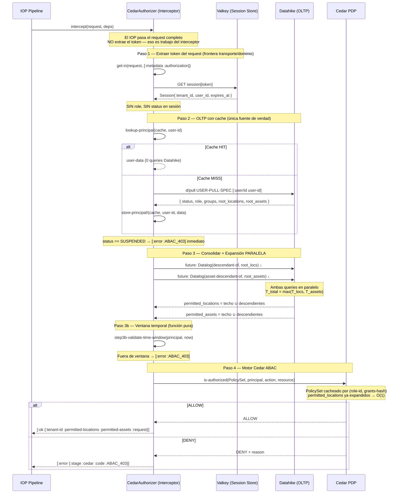
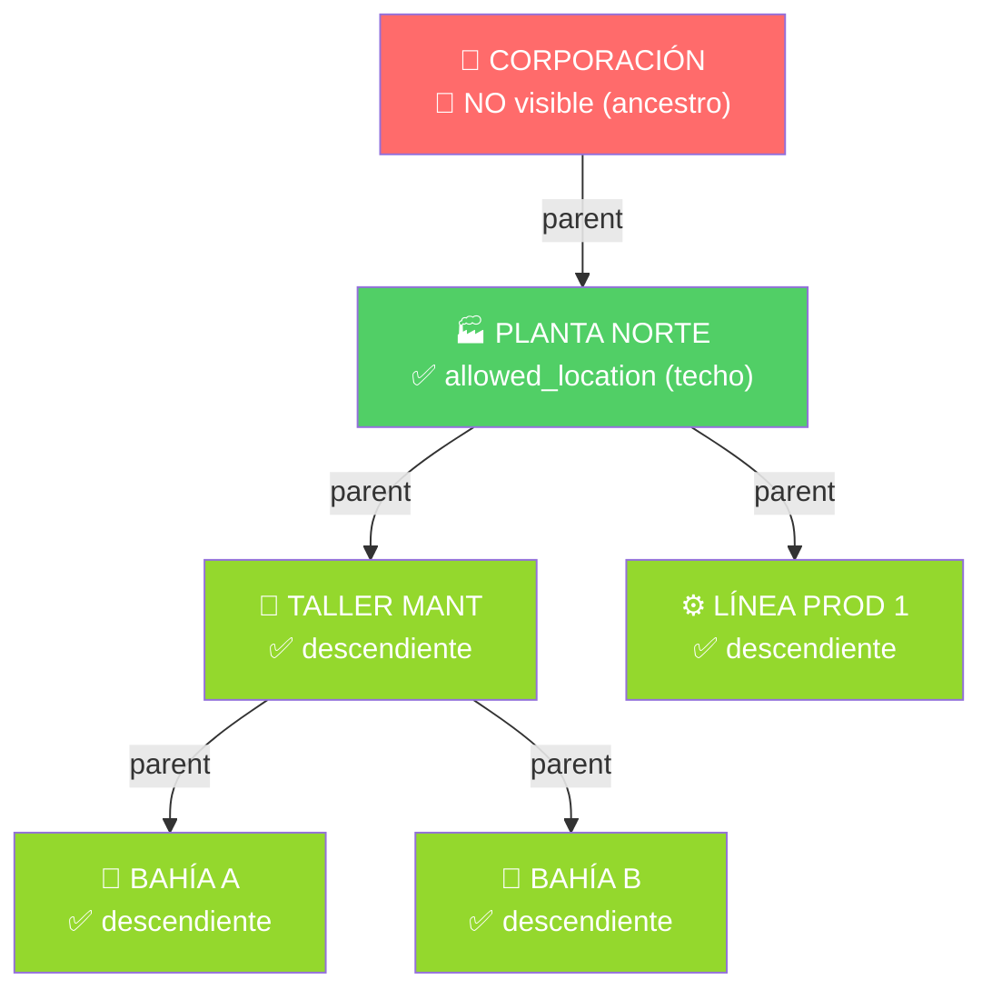

# Fase 06: CedarAuthorizer — Interceptor de Autorización Zero-Trust

**Nombre del Manifiesto:** `CedarAuthorizer`
**Tipo:** Interceptor de Autorización — Paso 1 del IOP Pipeline
**Caller:** [03A_FASE_IOP.md](03A_FASE_IOP.md) — Paso 1 (síncrono, bloqueante)

El **CedarAuthorizer** es el único punto de entrada de autorización del Metri Engine.
Es un **interceptor** — no un servicio, no un microservicio, no una Lambda independiente.
Vive dentro del mismo proceso que el IOP y se ejecuta síncronamente antes de cualquier operación de negocio.

---

## DOMINIO 0: Diseño del Interceptor — Contrato de Entrada y Salida

### La decisión de diseño clave

> **¿El Interceptor extrae el token internamente, o recibe el token como parámetro?**

**Decisión: El Interceptor recibe el `request` completo. El token es extraído como Paso 1 dentro del interceptor.**

| Argumento                                                | Explicación                                                                                                                                           |
| :------------------------------------------------------- | :---------------------------------------------------------------------------------------------------------------------------------------------------- |
| **SRP del interceptor**                                  | El interceptor ES la frontera entre el transporte (gRPC) y el dominio de autorización. Extraer el token del header es su trabajo — no del IOP.        |
| **El IOP no debe saber cómo se transporta el token**     | Hoy es `metadata.authorization`, mañana puede ser `x-metri-token`. El IOP nunca debería cambiar por eso.                                              |
| **El output incluye el `request` original**              | El interceptor devuelve `{:request request}` al IOP para que Janus lo procese. Si el input fuera solo el token, tendría que recibir el request igual. |
| **Protocolo-agnóstico por fuera, específico por dentro** | El IOP llama `(interceptor request)` — una sola firma limpia. Solo el Paso 1 interno conoce `metadata.authorization`.                                 |

**Lo que NO hace el IOP:**

```clojure
;; ❌ MAL — el IOP no extrae el token, eso no es su responsabilidad
(let [token (get-in request [:metadata :authorization])]
  (cedar/intercept token deps))

;; ✅ CORRECTO — el IOP pasa el request completo
(cedar/intercept request deps)
```

---

### Entrada del Interceptor

```
Entrada: request (gRPC Request Object)

┌─────────────────────────────────────────────────────────────┐
│ request                                                     │
│  ├─ :metadata                                               │
│  │    └─ :authorization  "Bearer sha256-abc..."   ← TOKEN   │
│  ├─ :entity-type    "asset" | "location" | ...    ← DOMAIN  │
│  │    (= domain_quota.resource_domain)                      │
│  ├─ :operation      :create | :get | :update | ...  ← ACTION  │
│  │    (= Cedar Action::“CREATE” | Action::“VIEW” | ...)      │
│  ├─ :body                                                   │
│  │    └─ raw payload (ATS sin procesar — Janus lo valida)   │
│  └─ ...otros campos gRPC                                    │
└─────────────────────────────────────────────────────────────┘

Deps inyectadas (Integrant):
  :valkey-store   ISessionStore   → resolver opaque token
  :db             Datahike DB     → pull user/role/groups (snapshot)
  :cache          IPrincipalCache → TTL 10s por user-id
  :cedar-engine   CedarEngine     → PolicySet cache + evaluación ABAC

Campos del request que usa el interceptor internamente:
  :metadata.authorization  → Paso 1: extraer token opaco
  :entity-type             → Paso 4: resource.domain (Cedar Resource)
  :operation               → Paso 4: Cedar Action
```

> [!NOTE]
> El mismo `:request` viaja intacto por todo el pipeline — nadie lo modifica. Cada componente lee lo que necesita:
>
> - **CedarAuthorizer** lee: `metadata.authorization` (Paso 1) + `entity-type` y `operation` (Paso 4 → `action-from` y `resource-from`)
> - **QuotaGuard** lee: `entity-type` (→ `resource_domain` DY) + `operation` (→ mapping `limit_type`)
> - **Janus** lee: `entity-type` (→ `codice/load-schema`) + `body` (→ payload Malli validation)

### Salida del Interceptor

```
Salida: [:ok cedar-ctx] | [:error error-map]

[:ok cedar-ctx]
┌─────────────────────────────────────────────────────────────┐
│ cedar-ctx                                                   │
│  ├─ :tenant-id           "tnt_01J..."   ← aislamiento       │
│  ├─ :user-id             "usr_01J..."   ← identidad         │
│  ├─ :role                { role-map }   ← grants + name     │
│  ├─ :permitted-locations [id...]        ← ya expandidos ↓   │
│  ├─ :permitted-assets    [id...]        ← ya expandidos ↓   │
│  └─ :request             request        ← original, intacto  │
└─────────────────────────────────────────────────────────────┘
  ↑ Janus consume `:permitted-locations` y `:permitted-assets` disponibles en el ctx (para validación de escritura).
  ↑ El `:request` nunca fue modificado — validación del payload (Malli entity schema) = responsabilidad de Janus.

[:error error-map]
┌─────────────────────────────────────────────────────────────┐
│ error-map                                                   │
│  ├─ :stage   :cedar                                         │
│  ├─ :code    :ABAC_401  (token ausente o expirado)          │
│  │         | :ABAC_403  (usuario suspendido, DENY Cedar,     │
│  │                       fuera de ventana temporal)         │
│  └─ :detail  string     (descripción human-readable)        │
└─────────────────────────────────────────────────────────────┘
  ↑ El IOP retorna gRPC 401/403 al cliente sin llegar a Janus.
```

### Diagrama de contrato

```
                  ┌──────────────────────────────────────────┐
IOP               │          CedarAuthorizer                 │
                  │                                          │
(cedar/intercept  │  Paso 1: token ← metadata.authorization  │
  request         │  Paso 2: user/role/groups ← Datahike      │
  deps)    ──────►│  Paso 3: expand locations/assets (↓ puro) │
                  │  Paso 3b: ventana temporal (fn pura)      │
                  │  Paso 4: action  ← request.operation      │
                  │           domain ← request.entity-type   │
                  │           Cedar ABAC → ALLOW | DENY       │
                  │                                          │
          ◄───────│  [:ok cedar-ctx] | [:error {:code ...}]  │
                  └──────────────────────────────────────────┘

  El IOP no sabe NADA de lo que ocurre dentro del interceptor.
  Solo conoce la firma y el formato del resultado.
```

---

## DOMINIO I: Algoritmo de Autorización — 5 Pasos

```
┌──────────────────────────────────────────────────────────────────────────────────┐
│                     CedarAuthorizer — Pipeline interno                          │
│                                                                                  │
│  ┌─────────┐   ┌──────────────────────┐   ┌─────────────────────────────────┐   │
│  │ PASO 1  │   │       PASO 2         │   │           PASO 3                │   │
│  │ Extraer │   │  Consulta OLTP       │   │      Consolidar + Expandir      │   │
│  │ Token   │──►│  1 pull recursivo    │──►│  Unión pura (O(n))              │   │
│  │ del     │   │  user→role→groups    │   │  + 2 Datalog en PARALELO        │   │
│  │ request │   │  + status check      │   │  ┌─ expand locations ↓ ─┐       │   │
│  │ Valkey  │   │  CACHE TTL 10s ✦    │   │  └─ expand assets    ↓ ─┘ futures│  │
│  └─────────┘   └──────────────────────┘   └─────────────────────────────────┘   │
│                                                                                  │
│  ┌─────────────────────┐   ┌────────────────────────────────────────────────┐   │
│  │       PASO 3b       │   │                    PASO 4                      │   │
│  │  Ventana Temporal   │──►│          Motor Cedar ABAC                      │   │
│  │  Función Pura       │   │  PolicySet cache por (role-id, grants-hash) ✦  │   │
│  │  O(restricciones)   │   │  → ALLOW | DENY en microsegundos               │   │
│  └─────────────────────┘   └────────────────────────────────────────────────┘   │
└──────────────────────────────────────────────────────────────────────────────────┘
   ✦ = optimizaciones de rendimiento
```

---

### Infraestructura — Protocolos y Helpers DRY

```clojure
(ns metri.cedar.authorizer
  (:require [datahike.api        :as d]
            [clojure.string      :as str]
            [metri.cedar.cache   :as cache]
            [metri.cedar.session :as session]
            [metri.cedar.rules   :as rules]
            [metri.cedar.time    :as tw]))

;; ── Protocolo IPrincipalCache — abstracción testeable ─────────────────────
(defprotocol IPrincipalCache
  (lookup-principal [this user-id])
  (store-principal! [this user-id principal])
  (evict-user!      [this user-id])
  (evict-by-role!   [this role-id]))
;; evict-by-role! invalida TODOS los usuarios con ese rol → efecto inmediato

;; ── Pull spec compartido — DRY: definido una vez, usado siempre ───────────
(def ^:private USER-PULL-SPEC
  '[:user/id
    :user/status
    :user/tenant-id
    {:user/role-id
       [:role/id :role/name :role/grants
        {:role/allowed-locations [:db/id]}
        {:role/allowed-assets    [:db/id]}]}
    {:user/group-ids
       [:user-group/id
        {:user-group/allowed-locations [:db/id]}
        {:user-group/allowed-assets    [:db/id]}
        :user-group/time-restrictions]}])

;; ── DRY: extract-ids — elimina (mapv :db/id coll) en 4 puntos ────────────
(defn- extract-ids [coll] (into [] (keep :db/id) coll))

;; ── DRY: expand-subtree — función única para jerarquías ──────────────────
;; Reemplaza expand-permitted-locations + expand-permitted-assets con 1 fn.
(defn- expand-subtree [db rule-sym root-ids]
  (if (empty? root-ids)
    #{}
    (into (set root-ids)
          (d/q '[:find [?desc ...]
                 :in $ [?root ...] %
                 :where (rule ?root ?desc)]
               db root-ids [[rule-sym]]))))

(def ^:private expand-locations #(expand-subtree %1 'descendant-of       %2))
(def ^:private expand-assets    #(expand-subtree %1 'asset-descendant-of %2))

;; ── PolicySet cache — evita recompilar Cedar por cada request ────────────
(def ^:private policy-cache
  (cache/build {:strategy :lru :max-size 1000}))

;; ── action-from — extrae Cedar Action desde request.operation ────────────
;; request.operation (keyword gRPC) → Cedar Action string
;; Cedar usa strings canónicos en sus evaluaciones — no keywords.
(def ^:private operation->cedar-action
  {:create "CREATE"   ;; Action::"CREATE" — nueva entidad
   :get    "VIEW"     ;; Action::"VIEW"   — consulta/lectura
   :update "UPDATE"   ;; Action::"UPDATE" — modificación
   :delete "DELETE"   ;; Action::"DELETE" — eliminación
   :upsert "UPSERT"}) ;; Action::"UPSERT" — inserción o modificación

(defn- action-from [request]
  (or (get operation->cedar-action (get-in request [:operation]))
      (throw (ex-info "Unknown or missing operation in request"
                      {:stage :cedar :code :ABAC_400
                       :detail (str "operation=" (get-in request [:operation]))}))))

;; ── resource-from — construye Cedar Resource desde request ───────────────
;; Cedar Resource encapsula QUÉ entidad se está accediendo.
;; :domain     = request.entity-type → filtra la política Cedar correcta
;; :entity-id  = request.body.id    → el registro específico (puede ser nil en CREATE)
;; :tenant-id  ya resuelto por Cedar — no del request
(defn- resource-from [request]
  {:domain    (or (get-in request [:entity-type])
                  (throw (ex-info "Missing entity-type in request"
                                  {:stage :cedar :code :ABAC_400
                                   :detail "entity-type required for Cedar resource"})))
   :entity-id (get-in request [:body :id])}) ;; nil en CREATE es válido
```

> [!NOTE]
> `action-from` y `resource-from` son los únicos puntos donde Cedar lee del request.
> Todo lo demás del request (payload, body) es caja negra — Janus lo procesa.
> El `:tenant-id` en el Resource Cedar viene del ctx (resuelto por Valkey) — nunca del request.

---

### Paso 1 — Extraer Token del Request (Frontera de Transporte)

```clojure
(defn- step1-extract-token
  "Paso 1: el interceptor opera sobre el request completo.
   Extrae el token opaco del header de autorización gRPC.
   Si el header falta o está vacío → falla inmediata :ABAC_401.
   Resuelve el token en Valkey → Session mínima de identidad.

   ¿Por qué el interceptor extrae el token y no el IOP?
   → El interceptor ES la frontera transporte/dominio.
   → El IOP no debe conocer la estructura del header gRPC.
   → Cambiar la ubicación del token (header, cookie, body) = cambio solo aquí."
  [request valkey-store]
  (let [header (get-in request [:metadata :authorization])]
    (when (str/blank? header)
      (throw (ex-info "Missing authorization header"
                      {:stage :cedar :code :ABAC_401
                       :detail "Authorization header is required"})))
    (let [token   (str/replace-first header #"^(?i)bearer\s+" "")
          session (session/resolve-opaque valkey-store token)]
      (when-not session
        (throw (ex-info "Invalid or expired token"
                        {:stage :cedar :code :ABAC_401
                         :detail "Token not found or TTL expired"})))
      session)))
;;  session :: { :kid       "sha256-abc..."
;;               :tenant-id "tnt_01J..."
;;               :user-id   "usr_01J..."
;;               :expires-at 1744234567000 }
;;  SIN status · SIN role_id · SIN group_ids
;;  → todo lo demás viene de Datahike (única fuente de verdad de autorización)
```

---

### Paso 2 — Consulta OLTP con Cache Inteligente

```clojure
;; ── Cache con doble estrategia de invalidación ───────────────────────────
;;
;;   Evento                  Acción de invalidación
;;   ────────────────────    ──────────────────────────────────────────────
;;   user muta               (evict-user! cache user-id)
;;   role muta               (evict-by-role! cache role-id)   ;; N usuarios
;;   group muta              (evict-user! cache uid) por cada afectado
;;
;;   Con TTL 10s:     9,000 queries/s → 900 queries/s (3,000 req/s)
;;   + evict explícito: efecto bloqueo/rol en < 100ms (sin esperar TTL)

(defn- fetch-user-graph
  "Pull recursivo puro — 1 interacción Datahike.
   Trabaja sobre db snapshot (point-in-time) — consistencia garantizada."
  [db user-id]
  (let [user (d/pull db USER-PULL-SPEC [:user/id user-id])]
    (when (= "SUSPENDED" (:user/status user))
      (throw (ex-info "User is suspended"
                      {:stage :cedar :code :ABAC_403
                       :detail (str "User " user-id " is suspended")})))
    user))

(defn- step2-query-oltp
  "Cache-aside pattern.
   HIT:  0 queries Datahike → microsegundos.
   MISS: 1 pull recursivo → cachea → retorna.
   El status, rol, grupos y locaciones siempre reflejan el estado
   actual de Datahike — no la versión que tenía el token al login."
  [db user-id cache]
  (or (lookup-principal cache user-id)
      (let [data (fetch-user-graph db user-id)]
        (store-principal! cache user-id data)
        data)))
```

---

### Paso 3 — Consolidar + Expansión Jerárquica en Paralelo

```clojure
(defn- step3-consolidate
  "Construye el Principal Cedar en 2 sub-pasos:
   3a) Unión de raíces: role ∪ grupos → sets sin duplicados (puro, O(n)).
   3b) Expansión Datalog en PARALELO con futures (independientes).
       Tiempo = max(T_locations, T_assets), no la suma.
   NUNCA incluye ancestros — expansión exclusivamente descendente ↓."
  [db user-data]
  (let [role   (:user/role-id   user-data)
        groups (:user/group-ids user-data)

        ;; ── 3a: Unión de raíces (puro — 0 queries) ───────────────────────────
        root-locs   (distinct
                      (concat (extract-ids (:role/allowed-locations role))
                              (mapcat #(extract-ids (:user-group/allowed-locations %)) groups)))
        root-assets (distinct
                      (concat (extract-ids (:role/allowed-assets role))
                              (mapcat #(extract-ids (:user-group/allowed-assets %)) groups)))

        ;; ── 3b: Expansión descendente en PARALELO (2 futures) ────────────────
        ;; Ambas queries son read-only sobre el mismo db snapshot → thread-safe.
        ;; Short-circuit si root-ids vacío → O(0), sin queries.
        f-locs   (future (expand-locations db root-locs))
        f-assets (future (expand-assets   db root-assets))]

    {:user-id             (:user/id user-data)
     :tenant-id           (:db/id (:user/tenant-id user-data))
     :role                role
     :grants              (:role/grants role)
     :permitted-locations (vec @f-locs)    ;; raíces ∪ todos los descendientes
     :permitted-assets    (vec @f-assets)  ;; raíces ∪ todos los descendientes
     :time-restrictions   (mapcat :user-group/time-restrictions groups)}))
```

> [!TIP]
> Con expansión en paralelo: `T_paso3 = max(T_locs, T_assets)` en lugar de `T_locs + T_assets`. En árboles de 5 niveles, ~40% más rápido.

---

### Paso 3b — Validación de Ventana Temporal (Función Pura)

```clojure
;; Delegado a metri.cedar.time — 100% puro, sin side-effects.
;; Clock inyectable en aridad-2 → testeable sin mocks de JVM.

(defn- now-within-window? [{:keys [days-of-week start-minute end-minute]} day minute]
  (and (contains? (set days-of-week) day)
       (<= start-minute minute end-minute)))

(defn- step3b-validate-time-window
  "Valida que el momento actual esté en alguna ventana autorizada.
   Sin restricciones → pass (mínima sorpresa: no es DENY por defecto).
   Clock inyectable para tests sin mocks."
  ([principal]
   (step3b-validate-time-window principal (java.time.ZonedDateTime/now java.time.ZoneOffset/UTC)))
  ([principal ^java.time.ZonedDateTime now]
   (let [restrictions (:time-restrictions principal)]
     (when (seq restrictions)
       (let [day    (.getValue (.getDayOfWeek now))
             minute (+ (* (.getHour now) 60) (.getMinute now))]
         (when-not (some #(now-within-window? % day minute) restrictions)
           (throw (ex-info "Access outside allowed time window"
                           {:stage :cedar :code :ABAC_403
                            :detail {:day day :minute minute}})))))
     (assoc principal :time-window-valid true))))
```

---

### Paso 4 — Motor Cedar ABAC con PolicySet Cache

```clojure
(defn- get-or-compile-policy-set [cedar-engine role-id grants]
  (let [k [role-id (hash grants)]]
    (or (cache/lookup policy-cache k)
        (let [ps (cedar/compile-policy-set cedar-engine grants)]
          (cache/store! policy-cache k ps)
          ps))))

(defn- step4-evaluate-cedar
  "Evaluación Cedar O(1): principal trae permitted_locations y permitted_assets
   pre-expandidos → Cedar solo verifica pertenencia al conjunto.
   PolicySet cacheado por (role-id, grants-hash) → compilación única por rol."
  [cedar-engine principal action resource]
  (let [policy-set (get-or-compile-policy-set cedar-engine
                     (get-in principal [:role :role/id])
                     (:grants principal))
        decision   (cedar/is-authorized cedar-engine policy-set
                     {:principal principal
                      :action    action
                      :resource  resource})]
    (when (= :deny (:effect decision))
      (throw (ex-info "Cedar DENY"
                      {:stage :cedar :code :ABAC_403
                       :reason (:reason decision)})))))
```

---

### Orquestador — `intercept` (Punto de entrada público)

```clojure
(defn intercept
  "Punto de entrada único del interceptor.
   El IOP llama: (cedar/intercept request deps)
   El IOP NO extrae el token, NO conoce la estructura del header.

   Garantías:
   · O(1) Valkey  → identidad mínima, 0 permisos en token
   · O(1) Cache   → ≤ 3 queries Datahike en MISS (1 pull + 2 Datalog paralelos)
   · O(1) Cedar   → PolicySet cacheado, evaluación de conjunto
   · Fail-fast    → primer error cortocircuita → [:error ...]
   · Railway puro → try/catch en superficie, 0 if-let anidados"
  [request {:keys [valkey-store db cache cedar-engine]}]
  ;;                             ↑ db = @conn dereferenciado por el wrapper de Integrant
  ;;                               Garantiza point-in-time consistency por request
  (try
    (let [;; Paso 1 — Extraer token del request (frontera transporte/dominio)
          session   (step1-extract-token request valkey-store)

          ;; Paso 2 — OLTP con cache: user-id → grafo user/role/groups
          user-data (step2-query-oltp db (:user-id session) cache)

          ;; Paso 3 — Consolidar raíces + expansión paralela
          principal (step3-consolidate db user-data)

          ;; Paso 3b — Ventana temporal (función pura, fail-fast si fuera de rango)
          principal (step3b-validate-time-window principal)

          ;; Paso 4 — Cedar ABAC (PolicySet cacheado, evaluación O(1))
          _         (step4-evaluate-cedar cedar-engine principal
                                          (action-from request)
                                          (resource-from request))]

      [:ok {:tenant-id           (:tenant-id session)
             :user-id             (:user-id session)
             :role                (:role principal)
             :permitted-locations (:permitted-locations principal)
             :permitted-assets    (:permitted-assets principal)
             :request             request}])

    (catch clojure.lang.ExceptionInfo e
      [:error (merge {:stage :cedar} (ex-data e))])))

;; ── API de invalidación — llamar desde mutaciones de user/role ───────────
(defn invalidate-user! [cache user-id]   (evict-user!    cache user-id))
(defn invalidate-role! [cache role-id]   (evict-by-role! cache role-id))
```

### Análisis de Complejidad

| Paso                       | Cache HIT        | Cache MISS       | Paralelo    |
| :------------------------- | :--------------- | :--------------- | :---------- |
| 1 — Extraer token + Valkey | O(1)             | O(1)             | —           |
| 2 — OLTP Pull              | **O(1)**         | O(grafo)         | —           |
| 3 — Consolidar raíces      | O(n)             | O(n)             | —           |
| 3 — Expand locations       | O(profundidad)   | O(profundidad)   | ✅ `future` |
| 3 — Expand assets          | O(profundidad)   | O(profundidad)   | ✅ `future` |
| 3b — Time window           | O(restricciones) | O(restricciones) | —           |
| 4 — action-from           | O(1) — map lookup   | O(1)             | —           |
| 4 — resource-from         | O(1) — get in       | O(1)             | —           |
| 4 — PolicySet compile      | **O(1)**            | O(grants)        | —           |
| 4 — Cedar evaluate         | O(1)                | O(1)             | —           |

**Ruta crítica (cache HIT):** Valkey O(1) → Cache O(1) → Pure O(n) → max(T_locs, T_assets) → action-from O(1) → Cedar O(1)

### Principios SOLID

| Principio   | Aplicación                                                                                                                                                         |
| :---------- | :----------------------------------------------------------------------------------------------------------------------------------------------------------------- |
| **S** — SRP | `step1` = extrae token (Valkey). `step2` = OLTP + cache (Datahike). `step3` = consolida + expande jerárquicamente. `step3b` = ventana temporal (pura). `step4` = extrae `action-from` + `resource-from` del request + evalua ABAC Cedar. `intercept` = orquesta únicamente. |
| **O** — OCP | Nuevas jerarquías = nueva `parent_id`. Nuevas políticas = fila en Datahike. Nuevas restricciones temporales = nuevo `time_restriction`. Cero cambios al algoritmo. |
| **L** — LSP | `IPrincipalCache` sustituible por `InMemoryCache` en tests. `step3b` con clock inyectable sin mocks de JVM.                                                        |
| **I** — ISP | El IOP solo conoce `intercept`. `invalidate-user!` / `invalidate-role!` solo para mutation hooks. Ningún step es visible externamente.                             |
| **D** — DIP | `valkey-store`, `db`, `cache`, `cedar-engine` inyectados por Integrant. `IPrincipalCache` desacopla el algoritmo del tipo de cache concreto.                       |

---

## DOMINIO II: Resolución de Identidad — Opaque Token

### Protocolo Zero-Network

```
Login (una sola vez):
  1. Autenticación contra IdP externo (Auth0 / Cognito)
  2. Session mínima guardada en Valkey:
       valkey[KID] = { tenant_id, user_id, expires_at }
       ← NUNCA se guardan role, grupos, status ni permisos
  3. Cliente recibe: "Authorization: Bearer <OPAQUE_TOKEN>"
     (SHA-256 aleatorio, sin información decodificable)

Por cada request:
  Interceptor:
    Paso 1 → extrae token del header → GET valkey[token]
             ← Session{ tenant_id, user_id, expires_at }

    Paso 2 → d/pull datahike[user-id]
             ← { status, role, groups, locations, assets }
                ↑ siempre el estado actual — no lo del momento del login
```

### Schema de Sesión (`session.proto`) — Mínimo de identidad

```protobuf
// El token opaco solo transporta IDENTIDAD — nunca autorización.
// Roles, grupos, status y permisos viven EXCLUSIVAMENTE en Datahike.
message Session {
  string kid        = 1;  // Clave Valkey — SHA-256 random
  string tenant_id  = 2;  // Para routing y aislamiento multitenant
  string user_id    = 3;  // Para pull en Datahike
  int64  expires_at = 4;  // TTL — único control de validez del token
}
```

> [!IMPORTANT]
> **Sin status, sin role_id, sin group_ids en sesión.**
> Cambiar rol → efecto inmediato en el próximo request.
> Bloquear usuario → efecto inmediato en el próximo request.
> **Sin gap de vulnerabilidad por TTL de sesión.**

### Reglas de seguridad del token

| Regla                    | Fuente de verdad | Implementación                                               |
| :----------------------- | :--------------- | :----------------------------------------------------------- |
| **Revocación de token**  | Valkey           | `DEL valkey[KID]` → token inválido en todas las instancias   |
| **Replay attack**        | Valkey           | TTL estricto — token expirado falla en Paso 1                |
| **Tenant isolation**     | Valkey           | `tenant_id` del Session, nunca del request del cliente       |
| **Bloqueo de usuario**   | Datahike         | `user.status = SUSPENDED` → DENY en Paso 2, efecto inmediato |
| **Cambio de rol**        | Datahike         | Re-hidrata en el próximo request (TTL 10s o evict explícito) |
| **Cambio de grupos**     | Datahike         | Re-hidrata en el próximo request                             |
| **Cambio de locaciones** | Datahike         | Re-hidrata en el próximo request                             |

---

## DOMINIO III: Hidratación del Principal — Jerarquías Direccionales

### Las tres fuentes de permisos contextuales

```
user.role_id  → role.allowed_locations  ┐
               → role.allowed_assets    ├─ TECHO: límite superior no franqueable
               → role.grants            ┘

user.group_ids → user_group.allowed_locations  ┐
               → user_group.allowed_assets     ├─ Refinamiento contextual
               → user_group.time_restrictions  ┘

Resultado: permitted_locations = (role.locs ∪ group.locs) ∪ todos sus descendientes
           permitted_assets    = (role.assets ∪ group.assets) ∪ todos sus descendientes
```

### Modelos de identidad — atributos relevantes

**`role.json`**

```json
{
  "grants": "[ { domain, actions:[VIEW|CREATE|UPDATE|DELETE], scope } ]",
  "allowed_locations": "techo superior del acceso jerárquico",
  "allowed_assets": "techo superior del acceso a activos"
}
```

**`user_group.json`**

```json
{
  "allowed_locations": "refinamiento contextual de locaciones",
  "allowed_assets": "refinamiento contextual de activos",
  "time_restrictions": "[ { days_of_week, start_minute, end_minute } ]"
}
```

**`user.json`**

```json
{
  "role_id": "ref:role      ← un único rol base (1:1)",
  "group_ids": "[ ref:user_group ]  ← N grupos opcionales (1:N)"
}
```

---

### La Regla Jerárquica — Dirección Única: Padre → Hijo

> [!IMPORTANT]
> **Invariante de jerarquía:** Si un usuario tiene acceso a una `location` (o `asset`), puede ver **todos sus descendientes**. Nunca puede ver sus **ancestros**. Dirección: exclusivamente **↓ descendente**.

```
Árbol de locaciones:

  CORPORACIÓN                  ← 🚫 NO visible (ancestro)
    └─ PLANTA_NORTE            ← ✅ allowed_location (techo asignado)
         ├─ TALLER_MANT           ← ✅ descendiente — visible
         │    ├─ BAHÍA_A          ← ✅ descendiente — visible
         │    └─ BAHÍA_B          ← ✅ descendiente — visible
         └─ LÍNEA_PROD_1          ← ✅ descendiente — visible
```

### Expansión Datalog — `expand-subtree`

```clojure
(def HIERARCHY-RULES
  '[;; Hijo directo
    [(descendant-of ?ancestor ?desc)
     [?desc :location/parent-id ?ancestor]]
    ;; Cierre transitivo ↓
    [(descendant-of ?ancestor ?desc)
     [?middle :location/parent-id ?ancestor]
     (descendant-of ?middle ?desc)]

    ;; Equivalente para assets
    [(asset-descendant-of ?ancestor ?desc)
     [?desc :asset/parent-id ?ancestor]]
    [(asset-descendant-of ?ancestor ?desc)
     [?middle :asset/parent-id ?ancestor]
     (asset-descendant-of ?middle ?desc)]])
```

> [!IMPORTANT]
> El techo es el **límite superior no franqueable**. Si `role.allowed_locations = [PLANTA_NORTE]`, el usuario nunca verá `CORPORACIÓN` aunque exista en el árbol.

---

## DOMINIO IV: Políticas Cedar ABAC

### Compilación de políticas desde Datahike

```
Datahike (role.grants) ──compile──► Cedar PolicySet (cacheado por role-id)
                                     evalúa en microsegundos por request
```

### Política `allow_location` — Jerárquica

```cedar
permit (
  principal is User,
  action in [Action::"VIEW", Action::"CREATE",
             Action::"UPDATE", Action::"DELETE"],
  resource
)
when {
  principal.status == "ACTIVE" &&
  resource.tenant_id == principal.tenant_id &&
  // permitted_locations ya incluye techo + todos sus descendientes
  // nunca incluye ancestros — garantía del Paso 3
  principal.permitted_locations.contains(resource.location_id) &&
  principal.grants.contains(resource.domain) &&
  principal.time_window_valid
};

forbid (principal is User, action, resource)
when {
  !principal.permitted_locations.contains(resource.location_id)
};
```

### Política `allow_asset` — Jerarquía de Activos

```cedar
permit (
  principal is User,
  action in [Action::"VIEW", Action::"UPDATE", Action::"EXECUTE"],
  resource is Asset
)
when {
  principal.status == "ACTIVE" &&
  resource.tenant_id == principal.tenant_id &&
  // permitted_assets = raíz ∪ sub-componentes descendientes
  principal.permitted_assets.contains(resource.asset_id) &&
  // consistencia: el activo debe estar en una locación autorizada
  principal.permitted_locations.contains(resource.location_id)
};
```

### Política de scope — Visibilidad dentro de la locación

```cedar
// scope: ALL — ve todos los recursos de la locación autorizada
permit (principal is User, action == Action::"VIEW", resource)
when {
  principal.permitted_locations.contains(resource.location_id) &&
  principal.grants_scope == "ALL"
};

// scope: OWN — solo recursos creados por él
permit (principal is User, action == Action::"VIEW", resource)
when {
  principal.permitted_locations.contains(resource.location_id) &&
  principal.grants_scope == "OWN" &&
  resource.created_by == principal.user_id
};

// scope: ASSIGNED — solo recursos asignados a él
permit (principal is User, action == Action::"VIEW", resource)
when {
  principal.permitted_locations.contains(resource.location_id) &&
  principal.grants_scope in ["ASSIGNED", "OWN_OR_ASSIGNED"] &&
  resource.assigned_to == principal.user_id
};
```

> [!WARNING]
> La evaluación Cedar **nunca es cacheada por request** — evaluación fresca. El **PolicySet** sí es cacheado por `(role-id, grants-hash)` — Cedar es determinista dado el mismo PolicySet + contexto.

---

## DOMINIO V: Flujo de Autorización Completo



### Diagrama de jerarquía — acceso descendente exclusivo



---

## DOMINIO VI: Mapeo de Entidades → Cedar

| Entidad Datahike               | Rol Cedar                  | Expansión jerárquica          |
| :----------------------------- | :------------------------- | :---------------------------- |
| `user`                         | `Principal`                | No — es el sujeto             |
| `role`                         | `PolicySet` fuente         | No — define el techo          |
| `role.allowed_locations`       | `permitted_locations` raíz | ✅ Expandida ↓ (Paso 3)       |
| `role.allowed_assets`          | `permitted_assets` raíz    | ✅ Expandida ↓ (Paso 3)       |
| `user_group.allowed_locations` | Adicional al conjunto raíz | ✅ Expandida ↓ (Paso 3)       |
| `user_group.allowed_assets`    | Adicional al conjunto raíz | ✅ Expandida ↓ (Paso 3)       |
| `location.parent_id`           | Estructura del árbol       | Define dirección de expansión |
| `asset.parent_id`              | Estructura del árbol       | Define dirección de expansión |
| `role.grants[].scope`          | Cláusula `when` Cedar      | `ALL / OWN / ASSIGNED`        |

---

## DOMINIO VII: Integrant — Ciclo de Vida y DI

```clojure
;; config/system.edn — componentes del CedarAuthorizer
:infra/valkey
  {:host #env "VALKEY_HOST" :port 6379 :password #env "VALKEY_PASSWORD"}
  ;; → ig/init-key → ValkeyStore (ISessionStore)
  ;; → ig/halt-key! → disconnect

:cedar/cache
  {:strategy :ttl :ttl-ms 10000 :max-size 50000}
  ;; → ig/init-key → TTLCache (IPrincipalCache)
  ;; → ig/halt-key! → nil

:cedar/engine
  {:policies-table #env "CEDAR_POLICIES_TABLE"}
  ;; → ig/init-key → CedarEngine (wrapper SDK)
  ;; → ig/halt-key! → nil

:iop/cedar-authorizer
  {:valkey-store #ig/ref :infra/valkey
   :cache        #ig/ref :cedar/cache
   :cedar-engine #ig/ref :cedar/engine
   :datahike     #ig/ref :infra/datahike}
  ;; → ig/init-key → (fn [request]
  ;;                   (authorizer/intercept request
  ;;                     {:valkey-store valkey-store
  ;;                      :db           @datahike     ;; ← deref por request
  ;;                      :cache        cache
  ;;                      :cedar-engine cedar-engine}))
```

> [!NOTE]
> El `db` se dereferencia **por cada request** (`@datahike`) dentro del wrapper — no en `init-key`. Esto garantiza que cada ejecución de `intercept` trabaja con el snapshot más reciente de Datahike (point-in-time consistency).

### Variables de entorno

| Variable               | Descripción                  | Ejemplo                     |
| :--------------------- | :--------------------------- | :-------------------------- |
| `VALKEY_HOST`          | Host del clúster Valkey      | `valkey.internal`           |
| `VALKEY_PASSWORD`      | Password del clúster Valkey  | `****`                      |
| `CEDAR_POLICIES_TABLE` | DynamoDB table de PolicySets | `metri-cedar-policies-prod` |
| `DATAHIKE_STORE_URI`   | URI de la store Datahike     | `datahike:aws-ddb://...`    |

---

## DOMINIO VIII: Observabilidad OTEL

| Span / Evento                  | Cuándo                    | Atributos                                                                       |
| :----------------------------- | :------------------------ | :------------------------------------------------------------------------------ |
| `cedar.step1.token_extracted`  | Siempre                   | `has_header`, latencia Valkey ms                                                |
| `cedar.step1.token_invalid`    | Token ausente/expirado    | `reason`                                                                        |
| `cedar.step2.cache_hit`        | Cache HIT                 | `user_id`, `tenant_id`                                                          |
| `cedar.step2.cache_miss`       | Cache MISS                | `user_id`, `tenant_id`, latencia Datahike ms                                    |
| `cedar.step2.user_suspended`   | Status SUSPENDED          | `user_id`, `tenant_id`                                                          |
| `cedar.step3.expand_completed` | Siempre                   | `#root_locs`, `#expanded_locs`, `#root_assets`, `#expanded_assets`, latencia ms |
| `cedar.step3b.time_denied`     | Fuera de ventana temporal | `user_id`, `day`, `minute`                                                      |
| `cedar.step4.allow`            | ALLOW                     | `user_id`, `tenant_id`, `action`, `domain`                                      |
| `cedar.step4.deny`             | DENY                      | `user_id`, `tenant_id`, `action`, `domain`, `reason`                            |
| `cedar.intercept.latency_ms`   | Siempre                   | P50, P95, P99 total del interceptor                                             |

---

## DOMINIO IX: Blueprint de Implementación

> [!IMPORTANT]
> Diseño de implementación — estructura de archivos, namespaces, dependencias y TDD.
> No es código en producción. Es la especificación que guiará el desarrollo.

### Estructura de Archivos

```
src/metri/cedar/
  authorizer.clj    ← pipeline intercept + 5 step-fns + invalidate-user!/role!
  cache.clj         ← IPrincipalCache · TTLCache (Caffeine) · InMemoryCache (test)
  session.clj       ← ISessionStore · ValkeyStore (Carmine) · StubStore (test)
  rules.clj         ← USER-PULL-SPEC · HIERARCHY-RULES · expand-subtree DRY
  time.clj          ← now-within-window? · step3b-validate-time-window (puro)

test/metri/cedar/
  authorizer_test.clj  ← pipeline con stubs (InMemoryCache, StubStore, stub-cedar)
  cache_test.clj       ← TTL expiry · evict-by-role! · concurrencia
  rules_test.clj       ← árbol 5 niveles · set vacío · cierre transitivo
  time_test.clj        ← función pura, clock inyectable, sin infraestructura
```

### Dependencias (`deps.edn`)

```clojure
;; Añadir / descomentar:
com.taoensso/carmine                  {:mvn/version "3.4.0"}      ;; Valkey
software.amazon.cedar/cedar-java      {:mvn/version "3.2.1"}      ;; Cedar SDK
org.clojure/core.cache                {:mvn/version "1.1.234"}    ;; IPrincipalCache base
com.github.ben-manes.caffeine/caffeine {:mvn/version "3.1.8"}     ;; TTLCache backend
```

### Matriz TDD

| Test                       | Tipo        | Escenario                        | Resultado esperado                            |
| :------------------------- | :---------- | :------------------------------- | :-------------------------------------------- |
| `token-missing`            | Unit        | Sin header `Authorization`       | `[:error {:code :ABAC_401}]`                  |
| `token-no-bearer`          | Unit        | Header malformado                | `[:error {:code :ABAC_401}]`                  |
| `token-expired`            | Unit        | Token no en Valkey               | `[:error {:code :ABAC_401}]`                  |
| `user-suspended`           | Unit        | `user.status = SUSPENDED`        | `[:error {:code :ABAC_403}]`                  |
| `cache-hit-0-queries`      | Unit        | 2do request mismo user           | 0 queries Datahike                            |
| `cache-miss-1-pull`        | Unit        | 1er request                      | 1 pull recursivo                              |
| `evict-by-role-rehydrates` | Unit        | Role muta → evict → next request | Re-hidrata con rol nuevo                      |
| `expand-locs-flat`         | Unit        | Sin hijos                        | Solo raíces en resultado                      |
| `expand-locs-tree-5lvl`    | Unit        | Árbol 5 niveles                  | Todos los descendientes ∪ raíces              |
| `expand-locs-empty`        | Unit        | `root-ids = []`                  | `#{}` sin queries Datalog                     |
| `expand-parallel-futures`  | Unit        | locations ≠ assets               | Ambas se lanzan como `future`                 |
| `time-inside-window`       | Unit (puro) | Lunes 09:00, ventana 08-18       | Pass                                          |
| `time-outside-window`      | Unit (puro) | Sábado 09:00, solo L-V           | `[:error :ABAC_403]`                          |
| `time-no-restrictions`     | Unit (puro) | Sin restricciones                | Pass — no DENY por defecto                    |
| `cedar-allow`              | Unit        | Policy ALLOW                     | `[:ok cedar-ctx]`                             |
| `cedar-deny`               | Unit        | Policy DENY                      | `[:error {:code :ABAC_403}]`                  |
| `policy-cache-hit`         | Unit        | 2do request mismo role           | PolicySet no recompilado                      |
| `ancestor-blocked`         | Integration | Recurso en location padre        | DENY                                          |
| `descendant-allowed`       | Integration | Recurso en location hijo         | ALLOW                                         |
| `intercept-happy-path`     | Integration | Todo OK                          | `[:ok {:tenant-id :permitted-locations ...}]` |

> [!NOTE]
> **Separación de responsabilidades canónica:**
>
> - **Valkey** = autenticación de token (¿es válido? ¿a quién pertenece?)
> - **Datahike** = fuente de verdad de autorización (¿qué puede hacer? ¿está activo?)
> - **Cedar** = juez de políticas (¿está permitido?)
> - **Janus** = ejecutor de filtros (¿cómo se aplica RLS al AST?)
