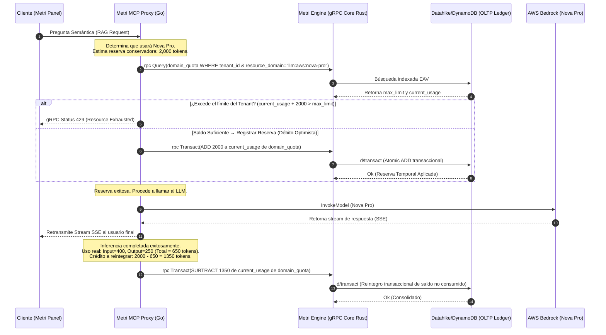

# Extensión de Fase 07: QuotaGuard — Inclusión de Límites de Tokens para AWS Bedrock Nova vía la Entidad Nativa de Metri Engine

Este documento técnico detalla el diseño del control de cuotas de tokens para **AWS Bedrock Nova Lite**, **Nova Pro** y cualquier modelo futuro de lenguaje grande (**Claude, Llama, GPT, Mistral**, etc.) en estricto cumplimiento con la filosofía **Zero-Idle-Infrastructure** y **Schema-Driven EAV** de Metri. 

En lugar de crear bases de datos aisladas, micro-tablas físicas adicionales de DynamoDB o RPCs dedicadas de gRPC, **reutilizamos por completo la infraestructura existente de Metri Engine**, específicamente el modelo dominial `domain_quota` almacenado en el motor OLTP transaccional (respaldado por Datahike/DynamoDB) y accesible por sus APIs universales.

---

## 1. El Enfoque Unificado: Todo es EAV (Entity-Attribute-Value)

En la arquitectura de Metri, cualquier recurso administrado se define en el **Códice** como un esquema dinámico. Para el control de recursos, el sistema ya cuenta con el esquema de metadatos `config/models/domain_quota.json`.

### 1.1 Mapeo de Modelos de IA en la Entidad Nativa `domain_quota`

Para controlar los límites de tokens de Bedrock Nova y modelos futuros, no creamos nuevos modelos estructurados en DynamoDB. Modelamos los límites de tokens como registros estándar de la entidad `domain_quota`:

* **`entity`**: `"domain_quota"` (Límites administrados por el Códice)
* **`tenant_id`**: Referencia al ID del Tenant en el Ledger.
* **`resource_domain`**: Al ser un atributo de tipo `string` flexible en el Códice, representamos los modelos de lenguaje directamente con identificadores semánticos estándar:
  * `"llm:aws:nova-lite"` (para AWS Bedrock Nova Lite)
  * `"llm:aws:nova-pro"` (para AWS Bedrock Nova Pro)
* **`limit_type`**: Expandimos el enum existente en `domain_quota.json` para soportar las métricas de tokens de forma agnóstica.
* **`current_usage`**: Contador atómico incrementado mediante transacciones transaccionales ACID en `metri-engine`.

### 1.2 Extensión del Esquema `domain_quota.json`

Solo se requiere realizar una adición de tres opciones a la propiedad `"limit_type"` en el modelo nativo del Códice (`config/models/domain_quota.json`):

```json
{
  "entity": "domain_quota",
  "engine": "oltp",
  "is_system": true,
  "track_history": true,
  "attributes": [
    {
      "name": "tenant_id",
      "type": "reference",
      "entityRef": "tenant",
      "required": true
    },
    {
      "name": "resource_domain",
      "type": "string",
      "required": true,
      "doc": "El modelo LLM o dominio (ej: 'llm:aws:nova-pro', 'asset')"
    },
    {
      "name": "limit_type",
      "type": "enum",
      "options": [
        "WRITE_COUNT",
        "READ_COUNT",
        "INPUT_TOKENS",    // NUEVO: Límite de tokens del prompt (entrada)
        "OUTPUT_TOKENS",   // NUEVO: Límite de tokens generados (salida)
        "TOKEN_COUNT"      // NUEVO: Límite acumulado de tokens (total)
      ],
      "required": true
    },
    {
      "name": "reset_strategy",
      "type": "enum",
      "options": ["MONTHLY", "YEARLY", "FIXED"],
      "required": true
    },
    {
      "name": "period_key",
      "type": "string",
      "required": true
    },
    {
      "name": "max_limit",
      "type": "long",
      "required": true
    },
    {
      "name": "current_usage",
      "type": "long",
      "required": true
    }
  ]
}
```

---

## 2. Flujo de Secuencia Universal sin RPCs Ad-hoc

Al utilizar la capacidad de persistencia nativa de Metri Engine, el **Metri MCP Proxy (Go)** se comunica usando únicamente las dos RPCs universales de `MetriService`: `Query` (para verificar saldo) y `Transact` (para debitar o ajustar atómicamente).



---

## 3. Escalabilidad Sin Código y Cuotas por Cada LLM (Claude, Llama, GPT, etc.)

El diseño actual garantiza que podamos definir **cuotas independientes y personalizadas para cada LLM individual**, evitando límites generales vagos y otorgando a los administradores un control granular.

### 3.1 Convención de Nomenclatura Estándar (URNs)

Representamos cualquier modelo de lenguaje mediante una nomenclatura jerárquica unificada en el atributo `resource_domain` de tipo string:

$$\text{Format: } \texttt{llm:<provider>:<model-family>:<model-variant>}$$

Ejemplos prácticos listos para producción:
* **AWS Bedrock Nova:**
  * `"llm:aws:nova-lite"` (AWS Bedrock Nova Lite)
  * `"llm:aws:nova-pro"` (AWS Bedrock Nova Pro)
* **Anthropic Claude:**
  * `"llm:anthropic:claude-3.5-sonnet"` (Claude 3.5 Sonnet)
  * `"llm:anthropic:claude-3-opus"` (Claude 3 Opus)
* **Meta Llama:**
  * `"llm:meta:llama-3.1-70b"` (Llama 3.1 70B)
  * `"llm:meta:llama-3-8b"` (Llama 3 8B)
* **OpenAI GPT:**
  * `"llm:openai:gpt-4o"` (GPT-4o)
  * `"llm:openai:gpt-4o-mini"` (GPT-4o Mini)

### 3.2 Habilitación de Cuotas Específicas en la Base de Datos (Data-Driven)

Para establecer un límite de tokens mensual específico para un modelo (ej: **Claude 3.5 Sonnet** vs **Nova Lite**) a un tenant determinado, **se insertan dos tuplas independientes en la base de datos de cuotas de Metri**, sin tocar código:

```json
// 1. Cuota Estricta para Claude 3.5 Sonnet (Evita sobrecostos del modelo Premium):
{
  "tenant_id": "tenant-01",
  "resource_domain": "llm:anthropic:claude-3.5-sonnet",
  "limit_type": "TOKEN_COUNT",
  "reset_strategy": "MONTHLY",
  "period_key": "2026-05-12_2026-06-12",
  "max_limit": 500000,    // Límite estricto de 500K tokens
  "current_usage": 0
}

// 2. Cuota Generosa para Nova Lite (Permite alto volumen de consultas baratas):
{
  "tenant_id": "tenant-01",
  "resource_domain": "llm:aws:nova-lite",
  "limit_type": "TOKEN_COUNT",
  "reset_strategy": "MONTHLY",
  "period_key": "2026-05-12_2026-06-12",
  "max_limit": 10000000,  // Límite amplio de 10M tokens
  "current_usage": 0
}
```

---

## 4. Implementación Práctica del Control de Cuota por LLM (TypeScript)

El proxy MCP consulta la cuota del modelo **específicamente solicitado** antes de la inferencia:

```typescript
import { MetriClient } from './grpc/metri-client'; 

const metri = new MetriClient(process.env.METRI_ENGINE_URL);

interface LlmRequest {
  tenantId: string;
  prompt: string;
  modelUrn: string; // Ej: "llm:anthropic:claude-3.5-sonnet" o "llm:aws:nova-lite"
}

async function handleLlmCallWithSpecificQuota(req: LlmRequest): Promise<string> {
  // Estimar tokens de la llamada
  const estInputTokens = Math.ceil(req.prompt.length / 4);
  const estOutputTokens = 1000; // Reserva máxima para respuesta
  const totalEstimated = estInputTokens + estOutputTokens;

  // 1. Pre-flight Check: Consulta la cuota ESPECÍFICA de este modelo de IA
  const quotaQuery = await metri.query({
    tenantId: req.tenantId,
    entity: 'domain_quota',
    filters: [
      { field: 'resource_domain', op: 'EQ', value: req.modelUrn },
      { field: 'limit_type', op: 'EQ', value: 'TOKEN_COUNT' },
      { field: 'period_key', op: 'EQ', value: getCurrentPeriodKey() }
    ]
  });

  const quota = quotaQuery.data.rows[0];
  if (!quota) {
    throw new Error(`gRPC RESOURCE_EXHAUSTED: No active quota configuration found for LLM ${req.modelUrn}`);
  }
  
  if (quota.current_usage + totalEstimated > quota.max_limit) {
    throw new Error(`gRPC RESOURCE_EXHAUSTED: Quota limit (${quota.max_limit} tokens) exceeded for LLM ${req.modelUrn}`);
  }

  // 2. Débito Optimista (Reserva)
  await metri.transact({
    tenantId: req.tenantId,
    operations: [{
      op: 'UPDATE',
      entity: 'domain_quota',
      id: quota.id,
      attributes: {
        current_usage: { fn: 'db.fn/increment', value: totalEstimated }
      }
    }]
  });

  try {
    // 3. Invocar al proveedor específico
    const llmResponse = await callLlmProvider(req.prompt, req.modelUrn);
    const actualTokens = llmResponse.usage.totalTokens;

    // 4. Liquidar y ajustar el saldo
    const diff = totalEstimated - actualTokens;
    if (diff > 0) {
      // Devolver tokens sobre-estimados a la cuota del LLM específico
      await metri.transact({
        tenantId: req.tenantId,
        operations: [{
          op: 'UPDATE',
          entity: 'domain_quota',
          id: quota.id,
          attributes: {
            current_usage: { fn: 'db.fn/decrement', value: diff }
          }
        }]
      });
    } else if (diff < 0) {
      // Debitar tokens adicionales si la respuesta fue más larga de lo reservado
      await metri.transact({
        tenantId: req.tenantId,
        operations: [{
          op: 'UPDATE',
          entity: 'domain_quota',
          id: quota.id,
          attributes: {
            current_usage: { fn: 'db.fn/increment', value: Math.abs(diff) }
          }
        }]
      });
    }

    return llmResponse.text;
  } catch (error) {
    // 5. Reversión completa en caso de fallo crítico
    await metri.transact({
      tenantId: req.tenantId,
      operations: [{
        op: 'UPDATE',
        entity: 'domain_quota',
        id: quota.id,
        attributes: {
          current_usage: { fn: 'db.fn/decrement', value: totalEstimated }
        }
      }]
    });
    throw error;
  }
}
```

---

## 5. Ventajas de la Arquitectura de Cuotas por LLM

1. **Control Granular y Económico:** Evita que el uso desmedido de un modelo extremadamente costoso (ej: *Claude 3 Opus o GPT-4o*) consuma el presupuesto asignado a tareas automatizadas ligeras pensadas para modelos eficientes (*Nova Lite o Llama 3 8B*).
2. **Cero Overhead de Código:** El núcleo de Rust de `metri-engine` no requiere lógica condicional compleja de modelos. Simplemente busca y actualiza registros bajo la URN `resource_domain == <requested_llm>`, delegando la lógica de negocio al Codex y a los datos del Tenant.
3. **Consistencia Transaccional ACID Real:** Las operaciones de débito, confirmación y reversión se realizan mediante transacciones ACID atómicas en Datahike/DynamoDB, eliminando discrepancias o pérdidas de cuota bajo alta concurrencia.
4. **Mapeo de Seguridad Homogéneo:** El acceso a los datos de la entidad `domain_quota` está regulado directamente por las políticas **Cedar ABAC** del orquestador (Fase 06).
