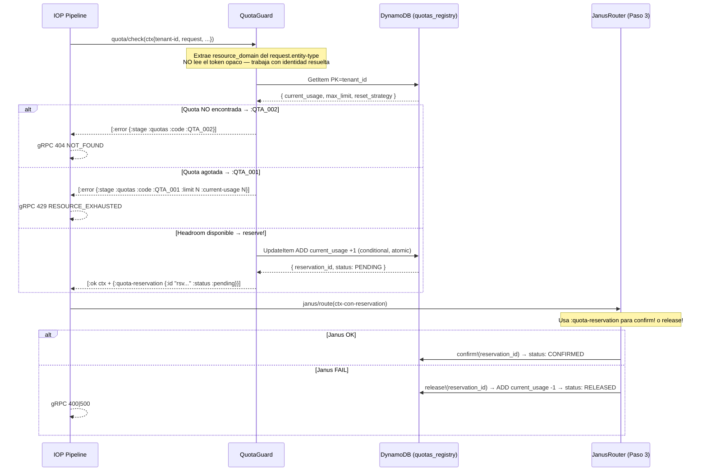

# Fase 07: QuotaGuard — Interceptor de Control de Recursos

**Nombre del Manifiesto:** `QuotaGuard`
**Tipo:** Interceptor — Paso 2 del IOP Pipeline
**Caller:** [03A_FASE_IOP.md](03A_FASE_IOP.md) — invocado síncronamente después de `CedarAuthorizer`

El **QuotaGuard** es la barrera económica y defensiva del Metri Engine. Verifica que el tenant tenga headroom de recursos antes de que Janus procese la escritura. Opera como **filtro de capacidad** — si el tenant no tiene recursos disponibles, Janus nunca es invocado.

---

## MÓDULO 0: Diseño del Interceptor — Contrato de Entrada y Salida

### Posición en el pipeline

```
IOP Pipeline:
  Paso 1: CedarAuthorizer   → resuelve identidad + ABAC  ✅ ya ejecutado
  Paso 2: QuotaGuard        → verifica headroom           ← ESTE COMPONENTE
  Paso 3: JanusRouter       → valida payload + escribe    ⏳ solo si headroom OK
```

### La decisión de diseño clave

> **¿QuotaGuard lee el token opaco directamente?**

**Decisión: NO. QuotaGuard recibe el ctx enriquecido por CedarAuthorizer — nunca el token.**

| Argumento | Explicación |
| :-------- | :---------- |
| **Zero-Trust por capas** | El token fue validado en el Paso 1. El Paso 2 trabaja sobre identidad ya resuelta. |
| **SRP**: QuotaGuard = headroom | Solo necesita `:tenant-id` — no la clave de sesión Valkey ni el JWT. |
| **Orden de pipeline inmutable** | Si QuotaGuard necesitara el token, rompería la dependencia lineal Cedar→Quota. |
| **Testabilidad** | Se puede probar con un ctx mínimo `{:tenant-id "tnt-test"}` sin infraestructura de auth. |

---

### Entrada del Interceptor

```
Entrada: ctx (salida de CedarAuthorizer, Paso 1)

┌─────────────────────────────────────────────────────────────┐
│ ctx                                                         │
│  ├─ :tenant-id           "tnt_01J..."  ← para lookup DY    │
│  ├─ :user-id             "usr_01J..."  ← para audit log    │
│  ├─ :role                { role map }  ← disponible        │
│  ├─ :permitted-locations [id...]       ← disponible        │
│  ├─ :permitted-assets    [id...]       ← disponible        │
│  └─ :request             <grpc-request> ← intacto          │
└─────────────────────────────────────────────────────────────┘

Deps inyectadas (Integrant):
  :dynamodb-client    DynamoDBClient  → leer quotas_registry
```

### Salida del Interceptor

```
Salida: [:ok ctx-enriquecido] | [:error error-map]

[:ok ctx-enriquecido]
┌─────────────────────────────────────────────────────────────┐
│ ctx anterior + :quota-reservation                           │
│  ├─ :tenant-id           (heredado)                        │
│  ├─ :user-id             (heredado)                        │
│  ├─ :role                (heredado)                        │
│  ├─ :permitted-locations (heredado)                        │
│  ├─ :permitted-assets    (heredado)                        │
│  ├─ :request             (heredado, intacto)               │
│  └─ :quota-reservation                                     │
│       ├─ :id       "rsv_01J..."   ← ID único de reserva    │
│       ├─ :debit    1              ← unidades a descontar   │
│       ├─ :domain   "assets"       ← resource_domain        │
│       └─ :status   :pending       ← confirmar en Janus     │
└─────────────────────────────────────────────────────────────┘
  ↑ Janus usa :quota-reservation para confirmar el débito
    post-escritura exitosa (fuera del hilo de QuotaGuard).
  ↑ El :request nunca es modificado — sigue intacto para Janus.

[:error error-map]
┌─────────────────────────────────────────────────────────────┐
│ error-map                                                   │
│  ├─ :stage   :quotas                                        │
│  ├─ :code    :QTA_001   (quota agotada)                    │
│  │         | :QTA_002   (quota no encontrada)              │
│  │         | :QTA_003   (error interno DynamoDB)           │
│  └─ :detail  string     + :limit int + :current-usage int  │
└─────────────────────────────────────────────────────────────┘
  ↑ El IOP retorna gRPC 429 RESOURCE_EXHAUSTED al cliente.
  ↑ Janus NUNCA es invocado cuando QuotaGuard retorna :error.
```

### Diagrama de contrato

```
                  ┌──────────────────────────────────────────┐
IOP               │            QuotaGuard                    │
                  │                                          │
(quota/check      │  1. Lee resource_domain del request      │
  ctx             │  2. GET DynamoDB quotas_registry         │
  deps)   ───────►│     [tenant-id + resource-domain]        │
                  │  3. Evalúa headroom (has-headroom?)       │
                  │  4a. OK: reserva optimista (reserve!)     │
                  │  4b. FAIL: cortocircuita el pipeline      │
                  │                                          │
          ◄───────│  [:ok ctx+reservation] | [:error QTA_*]  │
                  └──────────────────────────────────────────┘
```

---

## MÓDULO I: Algoritmo del Interceptor

### Origen del `resource_domain`

> [!IMPORTANT]
> **`resource_domain` viene del campo `entity_type` del request gRPC** — no del ctx de Cedar.
> Cedar solo aporta identidad (`:tenant-id`, `:user-id`). El "sobre qué entidad" opera la request proviene del payload del cliente.

```
Flujo de resolución del dominio:

  gRPC Request
    └─ entity_type: "asset"           ← campo required en metri.proto

         QuotaGuard lee:
           entity_type → resource_domain   → lookup domain_quota
           "asset"     → "asset"          → ¿tiene headroom el tenant para "asset"?

         Janus/Códice lee (mismo valor, diferente propósito):
           entity_type → target_domain    → cargar plugins domain_plugin
           "asset"     → "asset"          → PRE_VALIDATE, PRE_COMMIT, etc. de "asset"

  domain_quota.resource_domain  = entity name del Códice = "asset" | "location" | ...
  domain_plugin.target_domain   = entity name del Códice = "asset" | "location" | ...
  Ambos = request.entity_type   = campo required del proto gRPC (Fase 01)
```

**Los mismos valores de `entity_type` que define el Códice (Fase 02) son los que populan `resource_domain` en `domain_quota` y `target_domain` en `domain_plugin`.** No hay transformación — es el mismo string.

---

### Operaciones monitoreadas — Mapping `operation → limit_type`

> [!IMPORTANT]
> **QuotaGuard solo intercede en `CREATE` y `GET`.** Las demás operaciones (`UPDATE`, `DELETE`, `UPSERT`) pasan directo a Janus sin ningún check de quota ni llamada a DynamoDB.

```
Operación gRPC    limit_type en domain_quota    ¿QuotaGuard actúa?
─────────────     ──────────────────────────    ──────────────────
CREATE            WRITE_COUNT                   ✅ sí — consume cuota de creación
GET / query       READ_COUNT                    ✅ sí — consume cuota de consulta
UPDATE            —                             ⏭  pass-through sin check
DELETE            —                             ⏭  pass-through sin check
UPSERT            —                             ⏭  pass-through sin check
```

**Razón del diseño:**
- `WRITE_COUNT` limita la **creación de nuevas entidades** — solo `CREATE` genera registros nuevos.  
- `READ_COUNT` limita el **consumo analítico** — solo `GET`/queries consumen capacidad de lectura.  
- `UPDATE` muta sin crear → no genera storage nuevo → sin cuota.  
- `DELETE` reduce el storage → sin cuota (incluso contrarrestada).  
- `UPSERT` puede crear O actualizar → se trata como write sin quota para no penalizar updates.

---

### Implementación — Diseño canónico

```clojure
(ns metri.quota-guard)

;; ── Protocolo IQuotaStore — abstracción testeable ─────────────────────────
(defprotocol IQuotaStore
  (read-quota  [this tenant-id resource-domain limit-type] "→ Quota | nil")
  (reserve!    [this quota]                                "→ Reservation | throws")
  (confirm!    [this reservation]                          "→ void — llamado por Janus post-write")
  (release!    [this reservation]                          "→ void — llamado si Janus falla"))

;; ── Mapping: operation → limit_type ──────────────────────────────────────
;; Solo CREATE y GET son operaciones monitoreadas por quota.
;; UPDATE, DELETE, UPSERT → nil → pass-through sin ningún check.
(def ^:private operation->limit-type
  {:create :WRITE_COUNT   ;; domain_quota.limit_type = WRITE_COUNT
   :get    :READ_COUNT    ;; domain_quota.limit_type = READ_COUNT
   :update nil            ;; no monitoreado
   :delete nil            ;; no monitoreado
   :upsert nil})          ;; no monitoreado (puede ser update)

;; ── Resolver resource-domain desde el request gRPC ────────────────────────
;; Fuente: request.entity_type (required en metri.proto)
;; = domain_quota.resource_domain = domain_plugin.target_domain (mismo valor)
(defn- resolve-domain [request]
  (or (get-in request [:entity-type])
      (throw (ex-info "Missing entity_type in gRPC request — required field"
                      {:stage :quotas :code :QTA_002
                       :detail "entity_type is required to resolve resource_domain"}))))

;; ── Evaluación de headroom ────────────────────────────────────────────────
(defn- has-headroom? [{:keys [current-usage max-limit]}]
  (< current-usage max-limit))

;; ── Punto de entrada del interceptor ─────────────────────────────────────
(defn check
  "Interceptor de Paso 2 del IOP.
   Solo evalúa quota para operaciones CREATE (WRITE_COUNT) y GET (READ_COUNT).
   UPDATE, DELETE, UPSERT → pass-through inmediato sin llamada a DynamoDB.
   El resource-domain viene de request.entity_type (required en proto).
   Patrón: débito optimista (reserve! now → confirm! | release! después de Janus).

   Entrada: ctx de CedarAuthorizer + deps inyectadas
   Salida:  [:ok ctx+reservation] | [:ok ctx] (pass-through) | [:error QTA_*]"
  [{:keys [tenant-id request] :as cedar-ctx}
   {:keys [quota-store]}]
  (let [operation  (get-in request [:operation])          ;; :create | :get | :update ...
        limit-type (get operation->limit-type operation)]  ;; :WRITE_COUNT | :READ_COUNT | nil

    ;; ── Fast path: operación no monitoreada → pass-through O(1) ──────────
    (if (nil? limit-type)
      [:ok cedar-ctx]   ;; UPDATE, DELETE, UPSERT — Janus sin restricciones

      ;; ── Check path: CREATE o GET — consulta DynamoDB ──────────────────
      (try
        (let [domain (resolve-domain request)
              quota  (read-quota quota-store tenant-id domain limit-type)]
          (cond
            (nil? quota)
            [:error {:stage :quotas :code :QTA_002
                     :detail (str "No quota configured for tenant=" tenant-id
                                  " resource_domain=" domain
                                  " limit_type=" (name limit-type))}]

            (not (has-headroom? quota))
            [:error {:stage :quotas :code :QTA_001
                     :limit         (:max-limit quota)
                     :current-usage (:current-usage quota)
                     :detail        "Quota exhausted — upgrade plan or wait for reset"}]

            :else
            (let [reservation (reserve! quota-store quota)]
              [:ok (assoc cedar-ctx :quota-reservation reservation)])))

        (catch clojure.lang.ExceptionInfo e
          [:error (merge {:stage :quotas} (ex-data e))])
        (catch Exception e
          [:error {:stage :quotas :code :QTA_003
                   :detail (str "DynamoDB error: " (.getMessage e))}])))))
```

> [!IMPORTANT]
> **Débito optimista:** `reserve!` registra la reserva en DynamoDB **antes** de que Janus escriba.
> Si Janus falla, el IOP llama `release!` para liberar la reserva.
> Si Janus tiene éxito, el canal (`OLTPChannel`/`OLAPChannel`) llama `confirm!`.
> En ningún caso el counter se incrementa definitivamente antes de la escritura exitosa.


### Principios SOLID

| Principio | Aplicación |
| :-------- | :--------- |
| **S** — SRP | QuotaGuard evalúa **solo headroom**. No conoce Cedar, Janus, tokens ni EDA. |
| **O** — OCP | Añadir estrategia `has-headroom?` (ej. burst allowance) = nueva función, sin modificar `check`. |
| **L** — LSP | `IQuotaStore` sustituible por `InMemoryQuotaStore` en tests sin afectar el interceptor. |
| **I** — ISP | El IOP solo conoce `quota/check`. `confirm!` y `release!` son API de los canales de Janus. |
| **D** — DIP | `quota-store` inyectado por Integrant — `QuotaGuard` nunca instancia DynamoDB directamente. |

---

## MÓDULO II: Sistema de Cuotas — Modelo de Datos

### Modelo `domain_quota.json`

```json
{
  "id":               "uuid — PK",
  "tenant_id":        "ref:tenant — FK",
  "resource_domain":  "string — ej: assets | work_orders | documents",
  "metric_type":      "WRITE_COUNT | READ_COUNT",
  "max_limit":        "int — límite máximo del plan",
  "current_usage":    "int — contador actual",
  "reset_strategy":   "MONTHLY | YEARLY | FIXED",
  "reset_at":         "epoch-ms — próximo reset (null si FIXED)",
  "created_at":       "epoch-ms",
  "updated_at":       "epoch-ms"
}
```

### Dimensiones de limitación

| `limit_type` | Operación gRPC monitoreada | Qué limita | Ejemplo |
| :----------- | :------------------------- | :--------- | :------ |
| `WRITE_COUNT` | `CREATE` únicamente | Creación de nuevas entidades | Max 100 Activos por mes |
| `READ_COUNT` | `GET` / queries analíticas | Consumo de capacidad analítica | Max 10,000 queries por mes |

> [!NOTE]
> `UPDATE`, `DELETE` y `UPSERT` **no consumen quota** — no generan nuevos registros ni capacidad analítica adicional.
> QuotaGuard retorna `[:ok ctx]` **sin llamar a DynamoDB** para estas operaciones — O(1) sin latencia.

### Estrategias de reset

| Estrategia | Comportamiento | Uso típico |
| :--------- | :------------- | :--------- |
| `MONTHLY` | Contador reinicia el 1° de cada mes a 00:00 UTC | Planes de suscripción estándar |
| `YEARLY` | Reinicio anual el 1° de enero | Cuotas de almacenamiento o volumen anual |
| `FIXED` | Hard-limit acumulativo (LIFETIME) | Límites técnicos absolutos por tenant |

### DynamoDB — Diseño de tabla `quotas_registry`

```
PK: tenant_id#resource_domain    ← lookup O(1)
SK: metric_type                  ← WRITE_COUNT | READ_COUNT

Atributos:
  max_limit       (N)
  current_usage   (N)            ← actualizado atómicamente con ADD
  reset_strategy  (S)
  reset_at        (N)            ← TTL index para reset automático
  reservation_id  (S)            ← última reserva activa
```

> [!NOTE]
> `current_usage` se actualiza con **DynamoDB ConditionExpression + ADD atómico** — garantiza consistencia en alta concurrencia sin locks distribuidos.

---

## MÓDULO III: Débito Optimista — Ciclo de Vida de la Reserva

```
QuotaGuard                     Janus (OLTPChannel)
     │                               │
     ├─ reserve!() ─────────────────►│  status: PENDING
     │   current_usage += 1 (ADD)    │
     │   reservation_id = "rsv..."   │
     │                               │
     │   [:ok ctx+reservation] ─────►│
     │                               ├─ d/transact (escritura ACID)
     │                               │
     │                               ├─ si OK: confirm!(reservation)
     │                               │    → reservation status: CONFIRMED
     │                               │
     │                               └─ si FAIL: release!(reservation)
     │                                    current_usage -= 1 (ADD -1)
     │                                    reservation status: RELEASED
     │
     └─ si IOP falla antes de Janus: release!(reservation) via IOP cleanup
```

> [!IMPORTANT]
> **Si el proceso muere entre `reserve!` y `confirm!`/`release!`:**
> La reserva queda en estado `PENDING` con su TTL de 30 segundos.
> Al expirar, DynamoDB revierte automáticamente el `current_usage` vía TTL cleanup.
> El tenant no pierde quota por errores técnicos.

---

## MÓDULO IV: Sistema de Plugins (Hook Pipeline)

> [!NOTE]
> Los plugins son extensiones inyectables en el ciclo de vida de Janus — **no** de QuotaGuard.
> Se documentan aquí porque comparten el modelo `domain_plugin.json` y su activación depende de que las Quotas sean superadas correctamente.

### Puntos de intercepción (`domain_plugin.json`)

| Hook Type | Cuándo se ejecuta | Ejemplo de uso |
| :-------- | :---------------- | :------------- |
| `PRE_VALIDATE` | Antes de Malli entity schema | Sanitización de strings, normalización de campos |
| `POST_VALIDATE` | Después de confirmar schema OK | Cross-check contra estados externos |
| `PRE_COMMIT` | Última barrera antes de `d/transact` | Validaciones de negocio (ej: "No hay stock") |
| `POST_COMMIT` | Tras escritura exitosa | Disparo de eventos legacy o integraciones síncronas |
| `ON_QUERY_STREAM` | Intercepta flujo de salida analítico | Enmascaramiento dinámico de datos sensibles |

### Abstracción `clojure_fn`

Los plugins se definen como strings de namespaces:
```clojure
;; domain_plugin.json
{"hook_type": "PRE_COMMIT",
 "fn":        "metri.plugins.inventory/validate-stock",
 "enabled":   true}
```
El motor carga dinámicamente el namespace sin recompilación del core.

---

## MÓDULO V: Integrant — Ciclo de Vida y DI

```clojure
;; config/system.edn
:infra/dynamodb   {:region #env "AWS_REGION"}

:quota/store      {:dynamodb #ig/ref :infra/dynamodb
                   :table    #env "QUOTA_REGISTRY_TABLE"}
                  ;; → ig/init-key → DynamoDBQuotaStore (IQuotaStore)
                  ;; → ig/halt-key! → close client

:iop/quota-guard  {:quota-store #ig/ref :quota/store}
                  ;; → ig/init-key → (fn [ctx] (quota/check ctx deps))

;; ig/init-key
(defmethod ig/init-key :iop/quota-guard [_ {:keys [quota-store]}]
  (fn [ctx]
    (quota/check ctx {:quota-store quota-store})))
;;  Entrada: ctx de CedarAuthorizer
;;  Salida:  [:ok ctx+:quota-reservation] | [:error {:stage :quotas :code :QTA_*}]
```

### Variables de entorno

| Variable | Descripción | Ejemplo |
| :------- | :---------- | :------ |
| `AWS_REGION` | Región AWS para DynamoDB | `us-east-1` |
| `QUOTA_REGISTRY_TABLE` | Nombre de la tabla DynamoDB | `metri-quota-registry-prod` |

---

## MÓDULO VI: Observabilidad OTEL

| Span / Evento | Cuándo | Atributos |
| :------------ | :----- | :-------- |
| `quota.check.start` | Inicio de `check` | `tenant_id`, `resource_domain` |
| `quota.lookup.ok` | Quota encontrada en DY | `tenant_id`, `domain`, `current_usage`, `max_limit`, latencia ms |
| `quota.lookup.miss` | Quota no existe | `tenant_id`, `domain` → `:QTA_002` |
| `quota.headroom.ok` | Headroom disponible | `remaining = max_limit - current_usage` |
| `quota.headroom.exhausted` | Sin headroom | `tenant_id`, `domain`, `limit`, `usage` → `:QTA_001` |
| `quota.reserve.ok` | `reserve!` exitoso | `reservation_id`, `debit` |
| `quota.reserve.failed` | DY error en reserve | `tenant_id`, `error` → `:QTA_003` |
| `quota.confirm.ok` | Confirmado post-Janus | `reservation_id` |
| `quota.release.ok` | Liberado post-Janus-fail | `reservation_id` |
| `quota.check.latency_ms` | Siempre | P50, P95, P99 |

**Mapeo de errores a gRPC:**

| Código | Descripción | gRPC Status | HTTP |
| :----- | :---------- | :---------- | :--- |
| `:QTA_001` | Quota agotada | `RESOURCE_EXHAUSTED` | 429 |
| `:QTA_002` | Quota no encontrada | `NOT_FOUND` | 404 |
| `:QTA_003` | Error interno DynamoDB | `INTERNAL` | 500 |

---

## MÓDULO VII: Diagrama de Secuencia



---

## MÓDULO VIII: Blueprint de Implementación

> [!IMPORTANT]
> Diseño de implementación — estructura de archivos, namespaces y TDD.
> No es código en producción. Es la especificación que guiará el desarrollo.

### Estructura de Archivos

```
src/metri/quota/
  guard.clj         ← check + resolve-domain + has-headroom? (punto de entrada)
  store.clj         ← IQuotaStore protocol + DynamoDBQuotaStore (prod)
  model.clj         ← Quota record + Reservation record + validaciones Malli
  reset.clj         ← lógica de reset: MONTHLY | YEARLY | FIXED
  plugin.clj        ← carga dinámica de plugins (clojure_fn resolver)

test/metri/quota/
  guard_test.clj    ← tests del interceptor (con InMemoryQuotaStore)
  store_test.clj    ← tests del protocolo IQuotaStore
  reset_test.clj    ← tests de estrategias de reset (función pura)
  model_test.clj    ← tests de validaciones Malli del modelo

test/metri/quota/stubs/
  in_memory_quota_store.clj  ← stub simple (atom) para tests sin DynamoDB
```

### Dependencias (`deps.edn`)

```clojure
;; Ya existentes — no se agregan nuevas:
com.cognitect.aws/api      {:mvn/version "0.8.692"}   ;; DynamoDB client
io.replikativ/datahike     {:mvn/version "0.6.1525"}  ;; (no usada en QuotaGuard directamente)
metosin/malli              {:mvn/version "0.16.4"}    ;; validación del modelo
```

### Matriz TDD

**Motor del Interceptor (`guard_test.clj`)**

| Test | Tipo | Escenario | Resultado esperado |
| :--- | :--- | :-------- | :----------------- |
| `check-quota-not-found` | Unit | Quota no existe para tenant+domain | `[:error {:stage :quotas :code :QTA_002}]` |
| `check-quota-exhausted` | Unit | `current_usage >= max_limit` | `[:error {:stage :quotas :code :QTA_001 :limit N}]` |
| `check-headroom-ok` | Unit | `current_usage < max_limit` | `[:ok ctx-con-:quota-reservation]` |
| `check-reservation-present` | Unit | Happy path | `:quota-reservation` en el ctx resultado |
| `check-reservation-id-unique` | Unit | 2 checks mismo tenant | `reservation_id` diferente en cada uno |
| `check-ctx-inherited` | Unit | Happy path | `:tenant-id`, `:user-id`, `:request` heredados intactos |
| `check-no-token-access` | Unit | ctx sin `:token` ni `:kid` | Ejecuta sin error — no los necesita |
| `check-dynamodb-error` | Unit | DY lanza Exception | `[:error {:stage :quotas :code :QTA_003}]` |
| `check-missing-entity-type` | Unit | request sin `:entity-type` | `[:error {:stage :quotas :code :QTA_002}]` |

**Protocolo IQuotaStore (`store_test.clj`)**

| Test | Escenario | Resultado esperado |
| :--- | :-------- | :----------------- |
| `reserve-atomicity` | 2 threads reservan simultáneamente | Solo 1 incrementa — DY conditional |
| `confirm-updates-status` | confirm! tras reserve! | `reservation.status = :confirmed` |
| `release-decrements-usage` | release! tras reserve! | `current_usage` vuelve al valor anterior |
| `release-idempotent` | 2 release! misma reserva | `current_usage` decrementado solo 1 vez |

**Estrategias de reset (`reset_test.clj`)**

| Test | Escenario | Resultado esperado |
| :--- | :-------- | :----------------- |
| `monthly-resets-on-1st` | Reset MONTHLY, 1° del mes 00:00 | `current_usage = 0` |
| `yearly-resets-on-jan-1st` | Reset YEARLY, 1° enero | `current_usage = 0` |
| `fixed-never-resets` | Reset FIXED, any date | `current_usage` acumulativo |
| `reset-not-triggered-early` | MONTHLY, día 15 | `current_usage` sin cambio |

**Integración con IOP (`guard_integration_test.clj`)**

| Test | Escenario | Resultado esperado |
| :--- | :-------- | :----------------- |
| `iop-short-circuit-on-quota-fail` | Quota agotada | Janus nunca es invocado |
| `iop-janus-called-on-quota-ok` | Headroom disponible | Janus recibe ctx+reservation |
| `janus-confirm-on-success` | Janus OK | `confirm!` llamado con reservation |
| `janus-release-on-fail` | Janus FAIL | `release!` llamado con reservation |

---

> [!NOTE]
> **Separación de responsabilidades canónica del QuotaGuard:**
> - **QuotaGuard** = verifica headroom + reserva optimista. No conoce el token, no aplica ABAC, no procesa payload.
> - **CedarAuthorizer** = proveedor de `:tenant-id` (upstream). QuotaGuard confía en él ciegamente.
> - **JanusRouter** = consumidor de `:quota-reservation`. Confirma o libera el débito post-escritura.
> - **IQuotaStore** = abstracción entre QuotaGuard y DynamoDB — intercambiable en tests.
