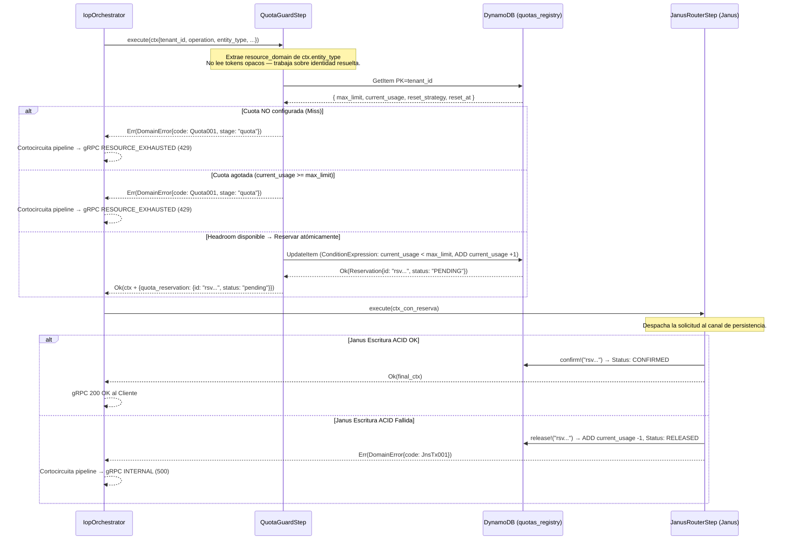

# Fase 07: QuotaGuard — Interceptor de Control de Recursos

**Nombre del Manifiesto:** `QuotaGuard`
**Tipo:** Interceptor — Paso 2 del IOP Pipeline (Rust)
**Caller:** `IopOrchestrator` (`src/iop/core.rs`) — invocado síncronamente después de `CedarAuthorizerStep`

El **QuotaGuard** es la barrera económica y defensiva de **Metri Engine**. Verifica que el tenant tenga headroom de recursos (cuota disponible) antes de que Janus procese la escritura. Opera como un **filtro de capacidad** de alto rendimiento — si el tenant no tiene recursos disponibles, Janus nunca es invocado.

---

## MÓDULO 0: Diseño del Interceptor — Contrato de Entrada y Salida

### Posición en el pipeline de Rust

```
IOP Pipeline (IopOrchestrator):
  Paso 1: CedarAuthorizerStep   → resuelve identidad + ABAC  ✅ ya ejecutado
  Paso 2: QuotaGuardStep        → verifica headroom           ← ESTE COMPONENTE
  Paso 3: JanusRouterStep       → valida payload + escribe    ⏳ solo si headroom OK
```

### La decisión de diseño clave

> **¿QuotaGuard lee el token opaco directamente?**
>
> **Decisión: NO. QuotaGuard recibe el `IopContext` enriquecido por `CedarAuthorizerStep` — nunca el token.**

| Argumento | Explicación |
| :-------- | :---------- |
| **Zero-Trust por capas** | El token fue validado en el Paso 1. El Paso 2 trabaja sobre identidad ya resuelta. |
| **SRP**: QuotaGuard = headroom | Solo necesita `ctx.tenant_id` — no la clave de sesión Valkey ni el JWT. |
| **Orden de pipeline inmutable** | Si QuotaGuard necesitara el token, rompería la dependencia lineal Cedar→Quota. |
| **Testabilidad** | Se puede probar con un `IopContext` mínimo (ej. `IopContext::new("tnt-test", ...)`) sin infraestructura de autenticación o Valkey. |

---

### Entrada del Interceptor (`IopContext`)

En la arquitectura de Rust, el contexto fluye como una struct `IopContext` inmutable/mutable a través de los pasos del pipeline.

```rust
// Definición conceptual del estado en IopContext relevante para QuotaGuard
pub struct IopContext {
    pub tenant_id:   String,                  // Heredado de CedarAuthorizerStep (resuelto vía Valkey)
    pub user_id:     String,                  // Heredado de CedarAuthorizerStep (para audit log)
    pub entity_type: String,                  // Determina el resource_domain (ej: "asset", "location")
    pub operation:   String,                  // Operación gRPC (ej: "CREATE", "GET", "UPDATE")
    pub request:     serde_json::Map<String, serde_json::Value>, // Payload original gRPC
    // ...
    pub quota_reservation: Option<serde_json::Value>, // Reserva inyectada en Paso 2
}
```

**Dependencias Inyectadas (Composición Estática):**
* `DynamoClient` (`src/infrastructure/dynamodb.rs`): Cliente de baja latencia para leer y actualizar de forma atómica la tabla `quotas_registry`.

### Salida del Interceptor

Retorna un tipo `Result<IopContext, DomainError>`.

#### 1. Caso de Éxito: `Ok(IopContext)` (Enriquecido con `:quota-reservation`)

El contexto es devuelto con la reserva optimista inyectada.

```json
// En ctx.quota_reservation (serde_json::Value)
{
  "id":     "rsv_01J...",   // ID único de reserva (ULID)
  "debit":  1,              // Unidades a descontar
  "domain": "asset",        // resource_domain de la cuota
  "status": "pending"       // Confirmado en Janus post-escritura exitosa
}
```
* **Janus** utiliza esta reserva para consolidar (`confirm!`) o revertir (`release!`) el débito según el resultado final de la escritura (fuera del hilo principal del QuotaGuard).
* El payload original (`ctx.request`) permanece completamente intacto.

#### 2. Caso de Error: `Err(DomainError)`

```rust
// DomainError con código de error y etapa específicos
DomainError {
    code: ErrorCode::Quota001,
    stage: "quota".to_string(),
    detail: "Quota exhausted — upgrade plan or wait for reset".to_string(),
    retryable: false,
    context: Some(json!({
        "limit": 100,
        "current_usage": 100,
        "resource_domain": "asset"
    })),
}
```
* El orquestador `IopOrchestrator` cortocircuita el pipeline inmediatamente.
* Retorna un gRPC Status `RESOURCE_EXHAUSTED` (HTTP 429) al cliente.
* **Janus NUNCA es invocado** cuando QuotaGuard retorna error.

### Diagrama de contrato

```
                  ┌──────────────────────────────────────────┐
IopStep           │            QuotaGuardStep                │
                  │                                          │
(execute          │  1. Lee resource_domain (entity_type)    │
   ctx)  ────────►│  2. GET DynamoDB quotas_registry         │
                  │     [tenant_id + resource_domain]        │
                  │  3. Evalúa headroom (has_headroom?)       │
                  │  4a. OK: reserva optimista (reserve!)     │
                  │  4b. FAIL: cortocircuita el pipeline      │
                  │                                          │
          ◄───────│  Ok(ctx + reservation) | Err(Quota001)   │
                  └──────────────────────────────────────────┘
```

---

## MÓDULO I: Algoritmo del Interceptor

### Origen del `resource_domain`

> [!IMPORTANT]
> **`resource_domain` viene del campo `entity_type` del request gRPC** — no del contexto de Cedar.
> Cedar solo aporta identidad (`tenant_id`, `user_id`). La entidad sobre la cual opera la solicitud proviene del payload del cliente y se mapea directamente a `ctx.entity_type`.

```
Flujo de resolución del dominio:

  gRPC Request
    └─ entity_type: "asset"           ← campo obligatorio en metri.proto

         QuotaGuard lee:
           ctx.entity_type → resource_domain   → lookup domain_quota
           "asset"         → "asset"           → ¿tiene headroom el tenant para "asset"?

         Janus/Códice lee (mismo valor, diferente propósito):
           ctx.entity_type → target_domain     → cargar plugins domain_plugin
           "asset"         → "asset"           → PRE_VALIDATE, PRE_COMMIT, etc. de "asset"

  domain_quota.resource_domain  = entity name del Códice = "asset" | "location" | ...
  domain_plugin.target_domain   = entity name del Códice = "asset" | "location" | ...
  Ambos = request.entity_type   = campo requerido del proto gRPC (Fase 01)
```

---

### Operaciones monitoreadas — Mapping `operation → limit_type`

> [!IMPORTANT]
> **QuotaGuard solo intercede en `CREATE` y `GET`.** Las demás operaciones (`UPDATE`, `DELETE`, `UPSERT`) pasan directo a Janus sin ningún check de cuota ni llamada a DynamoDB (O(1) pass-through).

```
Operación gRPC    limit_type en domain_quota    ¿QuotaGuard actúa?
─────────────     ──────────────────────────    ──────────────────
CREATE            WRITE_COUNT                   ✅ sí — consume cuota de creación
GET / query       READ_COUNT                    ✅ sí — consume cuota de consulta
UPDATE            —                             ⏭  pass-through sin check
DELETE            —                             ⏭  pass-through sin check
UPSERT            —                             ⏭  pass-through sin check
```

**Razón del diseño:**
* `WRITE_COUNT` limita la **creación de nuevas entidades** — solo `CREATE` genera registros de almacenamiento persistente nuevo.  
* `READ_COUNT` limita el **consumo analítico** — solo `GET` y queries consumen capacidad de lectura y procesamiento.  
* `UPDATE` muta atributos existentes sin crear nuevas entidades → no genera almacenamiento incremental de primer nivel → sin cuota.  
* `DELETE` reduce el almacenamiento del tenant → sin cuota.  
* `UPSERT` puede crear o actualizar → se trata como pass-through sin cuota para no penalizar actualizaciones directas.

---

### Implementación — Diseño Canónico en Rust

#### 1. Definición de Traits y Modelos (`src/domain/quota/mod.rs`)

```rust
use async_trait::async_trait;
use serde::{Deserialize, Serialize};
use crate::domain::errors::DomainResult;

#[derive(Debug, Clone, Serialize, Deserialize)]
pub enum MetricType {
    #[serde(rename = "WRITE_COUNT")]
    WriteCount,
    #[serde(rename = "READ_COUNT")]
    ReadCount,
}

impl MetricType {
    pub fn as_str(&self) -> &'static str {
        match self {
            Self::WriteCount => "WRITE_COUNT",
            Self::ReadCount => "READ_COUNT",
        }
    }
}

#[derive(Debug, Clone, Serialize, Deserialize)]
pub enum ResetStrategy {
    #[serde(rename = "MONTHLY")]
    Monthly,
    #[serde(rename = "YEARLY")]
    Yearly,
    #[serde(rename = "FIXED")]
    Fixed,
}

#[derive(Debug, Clone, Serialize, Deserialize)]
pub struct Quota {
    pub id:              String,
    pub tenant_id:       String,
    pub resource_domain: String,
    pub metric_type:     MetricType,
    pub max_limit:       i64,
    pub current_usage:   i64,
    pub reset_strategy:  ResetStrategy,
    pub reset_at:        Option<i64>, // epoch ms
}

#[derive(Debug, Clone, Serialize, Deserialize)]
pub struct Reservation {
    pub id:              String,
    pub quota_id:        String,
    pub debit:           i64,
    pub status:          String, // "PENDING" | "CONFIRMED" | "RELEASED"
    pub ttl:             i64,    // epoch ms para DynamoDB TTL cleanup
}

/// Protocolo IQuotaStore — abstracción testeable para el almacenamiento
#[async_trait]
pub trait IQuotaStore: Send + Sync {
    async fn read_quota(
        &self,
        tenant_id: &str,
        resource_domain: &str,
        metric_type: &MetricType,
    ) -> DomainResult<Option<Quota>>;

    async fn reserve(&self, quota: &Quota) -> DomainResult<Reservation>;
    async fn confirm(&self, reservation_id: &str) -> DomainResult<()>;
    async fn release(&self, reservation_id: &str) -> DomainResult<()>;
}
```

#### 2. Interceptor `QuotaGuardStep` (`src/iop/quota_step.rs`)

```rust
use std::sync::Arc;
use async_trait::async_trait;
use serde_json::json;
use tracing::{info, warn, instrument};

use crate::domain::errors::{DomainError, ErrorCode};
use crate::domain::quota::{IQuotaStore, MetricType};
use crate::iop::core::{IopContext, IopStep};

/// Wrapper IopStep para el control de cuotas por tenant (Paso 2 del IOP).
pub struct QuotaGuardStep {
    quota_store: Arc<dyn IQuotaStore>,
}

impl QuotaGuardStep {
    pub fn new(quota_store: Arc<dyn IQuotaStore>) -> Self {
        info!("[QuotaStep] Inicializando QuotaGuardStep");
        Self { quota_store }
    }
}

#[async_trait]
impl IopStep for QuotaGuardStep {
    /// Verifica la cuota del tenant para la operación.
    /// Operaciones monitoreadas: CREATE (WRITE_COUNT), GET (READ_COUNT).
    /// UPDATE, DELETE, UPSERT → pass-through inmediato sin llamadas a base de datos.
    #[instrument(name = "iop.step2.quota.start", skip(self, ctx), fields(tenant_id = %ctx.tenant_id))]
    async fn execute(&self, mut ctx: IopContext) -> Result<IopContext, DomainError> {
        let op = ctx.operation.to_uppercase();

        // ── Fast path: operación no monitoreada → pass-through O(1) ──────────
        // [PORTED_FROM: (if (#{:update :delete :upsert} operation) [:ok ctx] ...)]
        if !matches!(op.as_str(), "CREATE" | "GET") {
            info!(
                tenant    = %ctx.tenant_id,
                operation = %op,
                "[QuotaStep] Pass-through O(1) — sin afectación de cuota"
            );
            return Ok(ctx);
        }

        let metric_type = match op.as_str() {
            "CREATE" => MetricType::WriteCount,
            "GET"    => MetricType::ReadCount,
            _        => unreachable!(),
        };

        let domain = &ctx.entity_type;

        // ── Check path: CREATE o GET — consulta e incrementa optimista ────────
        info!(
            tenant    = %ctx.tenant_id,
            domain    = %domain,
            metric    = ?metric_type,
            "[QuotaStep] Evaluando cuota en DynamoDB"
        );

        match self.quota_store.read_quota(&ctx.tenant_id, domain, &metric_type).await? {
            None => {
                warn!(
                    tenant = %ctx.tenant_id,
                    domain = %domain,
                    "[QuotaStep] Cuota no configurada"
                );
                Err(DomainError::new(
                    ErrorCode::Quota001,
                    format!(
                        "No quota configured for tenant={} resource_domain={} limit_type={}",
                        ctx.tenant_id, domain, metric_type.as_str()
                    ),
                ).with_stage("quota"))
            }
            Some(quota) => {
                // Validación de headroom
                if quota.current_usage >= quota.max_limit {
                    warn!(
                        tenant  = %ctx.tenant_id,
                        limit   = quota.max_limit,
                        current = quota.current_usage,
                        "[QuotaStep] Cuota agotada para el tenant"
                    );
                    
                    let mut error = DomainError::new(
                        ErrorCode::Quota001,
                        "Quota exhausted — upgrade plan or wait for reset",
                    ).with_stage("quota");
                    
                    error = error.with_context(json!({
                        "limit": quota.max_limit,
                        "current_usage": quota.current_usage,
                        "resource_domain": domain
                    }));
                    
                    Err(error)
                } else {
                    // Débito optimista: Registrar la reserva antes de escribir
                    let reservation = self.quota_store.reserve(&quota).await?;
                    
                    info!(
                        tenant         = %ctx.tenant_id,
                        reservation_id = %reservation.id,
                        "[QuotaStep] Reserva de cuota exitosa (PENDING)"
                    );

                    ctx.quota_reservation = Some(json!({
                        "id":     reservation.id,
                        "debit":  reservation.debit,
                        "domain": domain.clone(),
                        "status": "pending"
                    }));

                    Ok(ctx)
                }
            }
        }
    }
}
```

> [!IMPORTANT]
> **Débito optimista:** `reserve` registra la reserva en DynamoDB e incrementa de manera temporal el contador **antes** de que Janus escriba.
> Si Janus falla, el IOP o el canal invoca `release` para liberar la reserva y decrementar el contador.
> Si Janus tiene éxito, se invoca `confirm` para cambiar el estado de la reserva a confirmado.
> En ningún caso el counter definitivo se incrementa permanentemente sin una escritura exitosa.

---

### Principios SOLID Aplicados

| Principio | Aplicación en Rust |
| :-------- | :----------------- |
| **S** — SRP | `QuotaGuardStep` evalúa **únicamente headroom**. No valida tokens, no ejecuta ABAC, no procesa payload. |
| **O** — OCP | Añadir nuevas métricas de recursos o algoritmos de validación (bursting, etc.) se hace inyectando una implementación alternativa de `IQuotaStore` sin alterar la struct `QuotaGuardStep`. |
| **L** — LSP | `IQuotaStore` puede sustituirse por `InMemoryQuotaStore` en ambientes de test local o TDD de manera transparente. |
| **I** — ISP | El IOP solo conoce `QuotaGuardStep::execute`. Los métodos `confirm` y `release` son consumidos por los canales específicos de Janus (`OLTPChannel` / `OLAPChannel`). |
| **D** — DIP | `IQuotaStore` es una abstracción. `QuotaGuardStep` depende del trait, nunca de un cliente concreto de DynamoDB o Redis. |

---

## MÓDULO II: Sistema de Cuotas — Modelo de Datos

### Modelo `domain_quota.json`

```json
{
  "id":               "uuid — PK",
  "tenant_id":        "ref:tenant — FK",
  "resource_domain":  "string — ej: asset | location | work_order | llm:aws:nova-pro",
  "metric_type":      "WRITE_COUNT | READ_COUNT | TOKEN_COUNT | INPUT_TOKENS | OUTPUT_TOKENS",
  "max_limit":        "int — límite máximo del plan",
  "current_usage":    "int — contador actual",
  "reset_strategy":   "MONTHLY | YEARLY | FIXED",
  "period_key":       "string — rango exacto ej: 2026-05-12_2026-06-12 | LIFETIME",
  "reset_at":         "epoch-ms — próximo reset (null si FIXED)",
  "created_at":       "epoch-ms",
  "updated_at":       "epoch-ms"
}
```

### Dimensiones de limitación

| `limit_type` | Operación gRPC monitoreada | Qué limita | Ejemplo |
| :----------- | :------------------------- | :--------- | :------ |
| `WRITE_COUNT` | `CREATE` únicamente | Creación de nuevas entidades | Max 500 Activos por mes |
| `READ_COUNT` | `GET` / queries analíticas | Capacidad analítica (lectura) | Max 20,000 queries por mes |

> [!NOTE]
> `UPDATE`, `DELETE` y `UPSERT` **no consumen cuota**. `QuotaGuardStep` retorna `Ok(ctx)` **sin consultar DynamoDB** para estas operaciones, logrando un costo de latencia de O(1) / ~0ms.

### Estrategias de reset y Ventanas de Facturación (`period_key`)

El cálculo de las ventanas de cuota no está restringido a meses calendario simples. Soporta ciclos de facturación personalizados donde el periodo comienza y termina en un día específico del mes (ej: del día 12 de un mes al día 12 del mes siguiente).

| Estrategia | Estructura de `period_key` | Comportamiento | Uso típico |
| :--------- | :------------------------- | :------------- | :--------- |
| `MONTHLY` | `YYYY-MM-DD_YYYY-MM-DD`<br/>*(Ej: `2026-05-12_2026-06-12`)* | El ciclo mensual comienza en una fecha especial (día D) y concluye el mismo día del mes siguiente. | Suscripciones mensuales con ciclo de facturación personalizado |
| `YEARLY` | `YYYY-MM-DD_YYYY-MM-DD`<br/>*(Ej: `2026-01-01_2027-01-01`)* | Ciclo anual que corre desde el día de inicio hasta el mismo día del año siguiente. | Cuotas de volumen anuales |
| `FIXED` | `LIFETIME` | Límite acumulativo permanente que nunca se reinicia. | Límites técnicos absolutos |

### DynamoDB — Diseño de tabla `quotas_registry`

La tabla DynamoDB se diseña buscando operaciones O(1) de lectura/escritura consistentes y directas.

```
PK: tenant_id#resource_domain    ← Hash Key (S)
SK: metric_type                  ← Range Key (S) — WRITE_COUNT | READ_COUNT

Atributos:
  max_limit       (N)
  current_usage   (N)            ← Actualizado atómicamente con ADD
  reset_strategy  (S)
  reset_at        (N)            ← Timestamp en milisegundos
  reservation_id  (S)            ← Referencia opcional al ID de la última reserva activa
```

> [!IMPORTANT]
> **`current_usage` ya no se escribe.** El consumo vive en un contador atómico
> fuera del log de datoms (`src/quota/ledger.rs`), donde el techo y el incremento
> son la misma escritura condicional. El campo de la fila `domain_quota` quedó
> como **semilla**: `try_debit` lo usa como punto de partida la primera vez que
> toca un contador que aún no existe, para no regalarle a un tenant en marcha lo
> que ya gastó.
>
> Al leer `domain_quota`, el motor superpone el valor vigente del contador
> (`src/quota/projection.rs`): una sola lectura para toda la página. Antes, cada
> débito escribía además una `TransactWriteItems` completa sobre la fila solo
> para mantener ahí una copia — se pagaba en el camino caliente y, al ser
> best-effort, la copia se quedaba atrás sin que nadie lo notara.

### Coste por operación

| Operación | Antes | Ahora |
| :-------- | :---- | :---- |
| Paso IOP (`CREATE` / `GET`) | 1 consulta OLTP + 1 `UpdateItem` + 1 `TransactWriteItems` (*n* datoms + índices + outbox) | 1 `UpdateItem` (con la resolución en memoria) |
| `ReserveTokens` | 1 consulta + 1 `UpdateItem` + 1 `TransactWriteItems` | 1 consulta (cacheada) + 1 `PutItem` + 1 `UpdateItem` + 1 `UpdateItem` |
| `ReconcileTokens` | 1 `pull` + 1 `UpdateItem` + 1 `TransactWriteItems` | 1 `UpdateItem` (claim) + 1 `TransactWriteItems` de 2 items + 1 `UpdateItem` |

La fila que importa es la primera: corre en cada escritura del motor.

---

## MÓDULO III: Débito Optimista — Ciclo de Vida de la Reserva

Hay dos ciclos distintos y conviene no mezclarlos:

- **Pipeline IOP** (`CREATE`/`GET`): la reserva es una unidad, vive dentro de una
  sola petición y la devuelve el propio orquestador con `compensate` si un paso
  posterior falla. No necesita salir del proceso porque quien debita y quien
  compensa son el mismo.
- **Tokens de IA** (`ReserveTokens`/`ReconcileTokens`): la reserva sobrevive a la
  petición que la abrió —el modelo tarda en responder— y la concilia una llamada
  posterior, que puede aterrizar en **otra réplica**. Ese es el ciclo que
  describe este módulo.

### Reservas de IA distribuidas

```
Réplica A                        Store + Ledger (DynamoDB)              Cualquier réplica
    │
    ├─ ReserveTokens ───────────► 1. abrir reserva      status=OPEN, debited=false
    │                             2. try_debit          UpdateItem condicional
    │                             3. marcar el débito   debited=true
    ◄─ reservation_id = {tenant}:{ulid}
    ·
    · (el modelo genera)
    ·
                                  4. claim (CAS + lease)  ◄──── ReconcileTokens  ─┐
                                     settle_once({id}#final)                      │ solo
                                     close(SETTLED)                               │ uno
                                                                                  │ de los
                                  4'. claim (CAS + lease) ◄──── Barrido ──────────┘ dos
                                      settle_once({id}#final)
                                      close(EXPIRED)
```

**El orden importa.** La reserva se abre *antes* del débito. Si el proceso muere
entre los dos pasos, queda un ticket con `debited = false` que el barrido cierra
sin tocar el contador. Al revés —debitar y luego registrar— la muerte dejaría un
débito aplicado que nadie reclama, que es la fuga que había.

**El ticket no dice nada que se use para calcular.** Antes era
`{cuota}:{estimado}:{tenant}:{uuid}` y la conciliación se creía esas cifras, sin
firma: cualquiera podía fabricar uno. Ahora es un ULID opaco con el tenant
delante para saber dónde buscar, y lo que se concilia sale del item guardado.

> [!IMPORTANT]
> **El TTL de DynamoDB no devuelve tokens.** El borrado es asíncrono, puede
> tardar hasta 48 h y el evento de borrado no puede decrementar el contador. El
> `ttl` sirve para que los tickets ya cerrados desaparezcan solos. Quien devuelve
> los tokens es el **barrido** (`src/quota/sweeper.rs`), que consulta `GSI-SWEEP`
> por `expires_at`. Diseñarlo al revés es el error clásico de esta arquitectura.

### Exactamente una vez

El `claim` reparte el trabajo; no lo garantiza. Entre ganar el lease y escribir
en el contador cabe una muerte, y el siguiente que reclame no sabría si el
apunte llegó a aplicarse. Por eso todo apunte ligado a una reserva pasa por
`QuotaCounter::settle_once`, que mete el incremento y su marca de idempotencia en
la **misma `TransactWriteItems`**: o caen los dos, o ninguno.

«Conciliándose» no es un estado: es una reserva abierta con un `lease_until`
vivo. Que el lease venza basta para liberarla, así que no hay ninguna escritura
de vuelta que pueda fallar y dejarla bloqueada.

### Qué pasa cuando la conciliación llega tarde

El store guarda **por qué** se cerró cada reserva, y de ahí sale la decisión:

| Estado al conciliar | Qué se apunta |
| :------------------ | :------------ |
| Abierta | `consumido − estimado`, con clave `{id}#final` |
| Cerrada `EXPIRED` | solo `consumido`, con clave `{id}#late` — la estimación ya la devolvió el barrido |
| Cerrada `SETTLED` | nada: es un reintento, y se responde lo mismo |
| Cerrada `REJECTED` / `ABANDONED` | nada: nunca hubo débito que corregir |
| Con el lease en otras manos | nada: se pide reintento (`ABORTED`) |

Dar la misma respuesta a los cuatro casos de «cerrada» era justo lo que producía
la doble devolución.

### Tabla de reservas

```
PK  = T#{tenant}#RSV#{ulid}      SK = "RSV"
     t, q, e (estimated), d (debited), s (OPEN|CLOSED), cr (razón),
     lu (lease_until), xa (expires_at), ttl

GSI-SWEEP:  gp = "OPEN#{shard}"   gs = expires_at
```

`gp` y `gs` solo existen mientras la reserva está abierta: al cerrarla se borran,
así que el índice contiene exactamente lo que falta por cerrar y no crece con el
histórico. El *shard* (16 particiones, FNV del ULID) evita que todas las réplicas
consulten la misma partición y conviertan el barrido en el punto caliente que
viene a evitar.

---

## MÓDULO IV: Sistema de Plugins (Hook Pipeline)

Los plugins son extensiones dinámicas inyectadas exclusivamente en el ciclo de vida de escrituras de Janus — **no** en QuotaGuard. Se configuran mediante el modelo de definición `domain_plugin.json`.

### Puntos de intercepción de Janus Hooks

| Hook Type | Cuándo se ejecuta | Ejemplo de uso |
| :-------- | :---------------- | :------------- |
| `PRE_VALIDATE` | Antes de validar el payload contra el Códice | Sanitización de campos, normalización de strings |
| `POST_VALIDATE` | Tras validación del esquema del Códice (Ok) | Cross-check de consistencia referencial ligera |
| `PRE_COMMIT` | Inmediatamente antes de iniciar `d/transact` | Validaciones avanzadas de reglas de negocio |
| `POST_COMMIT` | Posterior a la escritura ACID exitosa en DynamoDB | Disparadores síncronos, eventos legacy, webhooks |
| `ON_QUERY_STREAM` | Intercepta el flujo analítico de salida | Enmascaramiento dinámico de datos sensibles (GDPR) |

### Abstracción de carga en Rust

A diferencia de Clojure que utiliza carga dinámica de namespaces de strings, en Rust la arquitectura de plugins de `metri-engine` favorece:
1. **Compilación estática de plugins** registrados vía un patrón factory/registry estático en cold start.
2. **Carga dinámica opcional** a través de WebAssembly (Wasmtime) para aislamiento extremo y extensibilidad segura sin recompilar el núcleo.

---

## MÓDULO V: Composición Estática y Dependencias en Rust

En Rust se elimina el uso de herramientas de orquestación de ciclo de vida e inyección dinámica como Integrant (Clojure). La inyección y ensamblado del pipeline se resuelven en el bootstrap de la función Lambda (`src/main.rs`) de manera estática y con cero overhead en tiempo de ejecución.

### Wiring en `src/main.rs` (Bootstrap)

```rust
// main.rs — Composición estática
use std::sync::Arc;
use metri_engine::infrastructure::dynamodb::DynamoClient;
use metri_engine::infrastructure::quota::DynamoDbQuotaStore;
use metri_engine::iop::core::{IopOrchestrator, IopStep};
use metri_engine::iop::quota_step::QuotaGuardStep;
use metri_engine::iop::cedar_step::CedarAuthorizerStep;
use metri_engine::iop::janus_step::JanusRouterStep;

async fn bootstrap() {
    // 1. Clientes de infraestructura compartidos
    let ddb_client = Arc::new(DynamoClient::new("metri-eav-prod").await);
    
    // 2. Repositorio de cuotas
    let quota_store = Arc::new(DynamoDbQuotaStore::new(
        Arc::clone(&ddb_client),
        "metri-quota-registry-prod".to_string()
    ));
    
    // 3. Pasos del IOP Pipeline
    let step_cedar = Arc::new(CedarAuthorizerStep::new());
    let step_quota = Arc::new(QuotaGuardStep::new(Arc::clone(&quota_store) as Arc<dyn IQuotaStore>));
    let step_janus = Arc::new(JanusRouterStep::new(Arc::new(janus_router)));
    
    let steps: Vec<Arc<dyn IopStep>> = vec![
        step_cedar,
        step_quota,
        step_janus,
    ];
    
    // 4. Inicializar Orquestador IOP
    let orchestrator = IopOrchestrator::new(
        steps,
        Some(Arc::new(moira_emitter)),
        Some(Arc::new(audit_interceptor))
    );
    
    // Listo para despachar solicitudes gRPC sin intermediarios dinámicos
}
```

### Variables de Entorno Requeridas

| Variable | Descripción | Por defecto |
| :------- | :---------- | :---------- |
| `AWS_REGION` | Región AWS de ejecución | `us-east-1` |
| `QUOTA_TABLE` | Tabla de las reservas de IA en vuelo | `metri-quota-local` |
| `QUOTA_RESERVATION_STORE` | `memory` guarda las reservas en el proceso. **Incorrecto con más de una réplica**: cada proceso solo vería sus tickets | DynamoDB |
| `QUOTA_RESERVATION_TTL_SECS` | Cuánto vive una reserva antes de que el barrido la recoja. Súbelo si el modelo tarda más que eso en responder | `90` |
| `QUOTA_TENANT_MISMATCH` | `warn` deja pasar —dejando traza— una petición sobre la cuota de otro tenant, en vez de rechazarla. Escotilla para verlo en producción antes de cerrar | rechaza |
| `QUOTA_CACHE_TTL_SECS` | Cuánto vale una resolución de cuota antes de volver a consultarla. Es el retardo con el que se ve un cambio de `max_limit`; `0` desactiva la memoria | `30` |

---

## MÓDULO VI: Observabilidad OTEL y Códigos de Error

### Spans y Eventos de Tracing

| Span / Evento | Cuándo se emite | Atributos clave |
| :------------ | :-------------- | :-------------- |
| `quota.check.start` | Inicio de evaluación | `tenant_id`, `resource_domain` |
| `quota.lookup.ok` | Cuota encontrada | `tenant_id`, `domain`, `current_usage`, `max_limit` |
| `quota.lookup.miss` | Cuota no existe | `tenant_id`, `domain` (Resulta en ErrorCode::Quota001) |
| `quota.headroom.exhausted` | Límite excedido | `tenant_id`, `domain`, `max_limit`, `current_usage` |
| `quota.reserve.ok` | Reserva exitosa en DDB | `reservation_id`, `debit` |
| `quota.confirm.ok` | Confirmación exitosa | `reservation_id` |
| `quota.release.ok` | Liberación / Reversión | `reservation_id` |

### Mapeo de Códigos de Error a gRPC (Tonic)

Los fallos de cuota interceptados en el paso 2 se traducen a errores canónicos gRPC en la capa de transporte gRPC de Tonic.

| Código de Dominio | gRPC Status Code | HTTP Status | Causa raíz |
| :---------------- | :--------------- | :---------- | :--------- |
| `ErrorCode::Quota001` | `RESOURCE_EXHAUSTED` | 429 Too Many Requests | El tenant ha alcanzado el límite permitido para su plan actual en el dominio de recursos. |
| `ErrorCode::Quota001` (Miss) | `RESOURCE_EXHAUSTED` / `NOT_FOUND` | 404 / 429 | El tenant no cuenta con un perfil de cuotas configurado en la tabla de registro. |
| `ErrorCode::Infra001` | `INTERNAL` | 500 Internal Server Error | El SDK de AWS DynamoDB retornó una excepción de conexión o fallo de lectura en la tabla. |

---

## MÓDULO VII: Diagrama de Secuencia Completo



---

## MÓDULO VIII: Blueprint de Implementación

### Estructura de Archivos (Rust Workspace)

```
metri-engine/
  ├── src/
  │    ├── domain/
  │    │    └── quota/
  │    │         ├── mod.rs        ← Traits IQuotaStore, structs Quota, Reservation y MetricType
  │    │         └── reset.rs      ← Lógica de verificación y reset de cuotas (pure functions)
  │    ├── infrastructure/
  │    │    └── quota/
  │    │         └── dynamodb.rs   ← Implementación de IQuotaStore usando DynamoClient
  │    ├── iop/
  │    │    ├── quota_step.rs     ← QuotaGuardStep wrapper que implementa IopStep
  │    │    └── core.rs           ← IopOrchestrator coordinando el pipeline
  │    └── main.rs                ← Composición y arranque estático de dependencias
  └── tests/
       └── quota_guard_test.rs    ← Tests unitarios y de integración con InMemoryQuotaStore
```

### Matriz TDD (Rust implementation specifications)

#### 1. Pruebas de Interceptor (`tests/quota_guard_test.rs` con `InMemoryQuotaStore`)

| ID de Prueba | Caso de Prueba | Entrada | Salida Esperada |
| :----------- | :------------- | :------ | :-------------- |
| `check_quota_not_configured` | Cuota inexistente para el tenant en el dominio especificado. | `tenant_id: "tnt-1"`, `entity_type: "asset"`, `op: "CREATE"` | `Err(DomainError { code: Quota001, stage: "quota", .. })` |
| `check_quota_exhausted` | `current_usage` es igual o mayor a `max_limit`. | `tenant_id: "tnt-2"`, `entity_type: "asset"`, `op: "CREATE"` (usage: 10, limit: 10) | `Err(DomainError { code: Quota001, stage: "quota", .. })` |
| `check_quota_ok` | Headroom disponible en el contador del tenant. | `tenant_id: "tnt-3"`, `entity_type: "asset"`, `op: "CREATE"` (usage: 5, limit: 10) | `Ok(ctx)` conteniendo `ctx.quota_reservation` con estado `"pending"`. |
| `check_reservation_uniqueness` | Dos checks concurrentes para el mismo tenant generan identificadores de reserva diferenciados. | 2 peticiones concurrentes del mismo tenant. | Dos `reservation_id` (ULIDs) distintos e incrementos independientes. |
| `check_context_preservation` | La ejecución exitosa no altera el resto de variables del contexto de entrada. | `IopContext` estructurado con metadatos del usuario y roles. | `Ok(ctx)` con atributos de usuario, roles y payload intactos. |
| `check_fast_path_bypass` | Operaciones no monitoreadas no consumen cuotas ni consultan base de datos. | `op: "UPDATE"`, `op: "DELETE"`, `op: "UPSERT"` | `Ok(ctx)` inmediato (pass-through sin invocar `IQuotaStore`). |

#### 2. Pruebas de Persistencia y Concurrencia (`IQuotaStore` integration tests)

| Caso de Prueba | Escenario de Simulación | Resultado Esperado |
| :------------- | :---------------------- | :----------------- |
| `reserve_concurrency` | Múltiples threads intentan consumir el último espacio de cuota de forma simultánea. | Solo una solicitud exitosa realiza la reserva; las demás fallan de forma controlada lanzando `Quota001` gracias a la ConditionExpression de DynamoDB. |
| `confirm_lifecycle` | Invocación de `confirm` sobre una reserva temporalmente activa. | La reserva actualiza su estado en DynamoDB a `"CONFIRMED"` de manera permanente. |
| `release_lifecycle` | Invocación de `release` posterior a un fallo en el Janus router. | `current_usage` se reduce de manera exacta en 1 unidad y la reserva pasa a estado `"RELEASED"`. |
| `release_idempotency` | Invocación consecutiva de `release` sobre la misma reserva por duplicidad en el reintento. | Se realiza el decremento una única vez; las llamadas redundantes no reducen el contador por debajo del valor inicial (idempotencia garantizada por `reservation_id`). |
