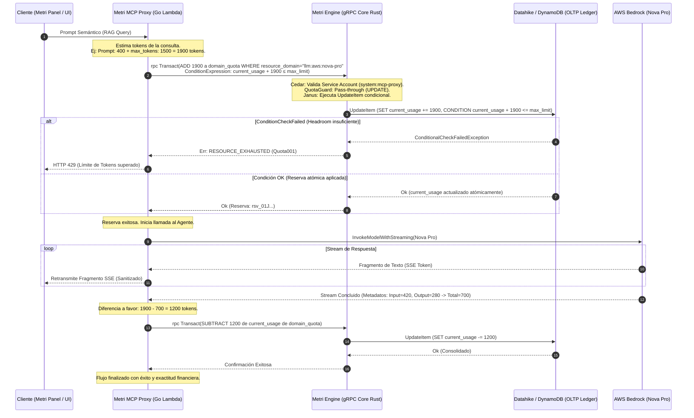

# Fase 08: Metri Q Assitant — Motor de Agentes Serverless y Model Context Protocol (MCP)

**Nombre del Manifiesto:** `MetriQAssitant`  
**Fase contenedora:** Integrado en el API Boundary de `Metri Engine` (`metri-engine/src`) y orquestado en conjunto con [07_FASE_QUOTA_GUARD.md](07_FASE_QUOTA_GUARD.md), [07.01_EXTENSION_QUOTAS_BEDROCK_NOVA.md](07.01_EXTENSION_QUOTAS_BEDROCK_NOVA.md) y [11_FASE_BASE_DE_DATOS_VECTORIAL_SERVERLESS.md](11_FASE_BASE_DE_DATOS_VECTORIAL_SERVERLESS.md).  
**Documentos de Extensión:**
- 🔌 **[Extensión Metri Q: Integración, Súper-Poderes y Tool Calling](METRI_Q.md)** — Documento consolidado que abarca el acoplamiento del frontend Vue 3, los 5 súper-poderes cognitivos y optimizaciones en Go, y la ejecución de acciones locales (Agentic UI) con LangChain.js.
**Proyecto:** `metri-q-assitant` (Go 1.23+ / AWS SAM)  
**Infraestructura como Código:** AWS SAM (`template.yaml`)

---

## 1. Visión General e Integración con AWS Bedrock y AWS Agent Core

Fieles al principio de **Cero Infraestructura Ociosa ($0.00 base cost en reposo)** de Metri, el componente **Metri Q Assitant** abandona la invocación clásica, acoplada e insegura de modelos de lenguaje grande (LLMs) mediante APIs sincrónicas directas en el núcleo de ejecución. 

Implementamos un entorno de agentes serverless de alto rendimiento construido sobre **AWS Agent Core** y **Amazon Bedrock Runtime**. Esta arquitectura desacopla por completo la orquestación cognitiva del backend transaccional de Rust, eliminando el riesgo de que los prolongados tiempos de inferencia de las IAs agoten el runtime async Tokio del servidor gRPC principal de Metri Engine.

```
                  ARQUITECTURA DE AGENTES DE METRI (SERVERLESS & DECOUPLED)
                  
     ┌────────────────────────┐         gRPC M2M         ┌───────────────────────┐
     │  Metri Engine Core     │◄────────────────────────►│  Metri MCP Proxy      │
     │  (Rust / Tonic gRPC)   │      (High-Speed)        │  (Go / AWS Lambda)    │
     └───────────┬────────────┘                          └──────────┬────────────┘
                 │                                                  │
                 │ (Cedar ABAC / Ledgers)                           │ (SSE via Lambda Function URL)
                 ▼                                                  ▼
     ┌────────────────────────┐                          ┌───────────────────────┐
     │  Datahike / DynamoDB   │                          │  Clientes (Metri UI)  │
     └────────────────────────┘                          └───────────────────────┘
                                                                    ▲
                                                                    │ (RAG / Inference)
                                                         ┌──────────┴────────────┐
                                                         │   AWS Bedrock / Nova  │
                                                         │   & AWS Agent Core    │
                                                         └───────────────────────┘
```

### Características Principales de la Infraestructura
1. **Zero-Idle Compute:** Toda la inferencia y el razonamiento del agente corren en la infraestructura elástica de **Amazon Bedrock** y **AWS Lambda**, cobrándose únicamente por milisegundo consumido y por token procesado.
2. **Orquestación Asíncrona:** La comunicación pesada y en streaming (Server-Sent Events) del LLM se procesa en el **Metri MCP Proxy** (Go / AWS Lambda). El proxy se expone mediante una **Lambda Function URL con response streaming**, gestiona la conexión SSE con el cliente final y realiza llamadas gRPC ultra-rápidas hacia `metri-engine` solo cuando requiere consultar o modificar el Ledger transaccional.
3. **AWS Agent Core Integration:** Los flujos multietapa, el razonamiento reactivo (Chain-of-Thought) y la llamada a herramientas especializadas son orquestados mediante AWS Agent Core, asegurando la escalabilidad a nivel de infraestructura en la nube.

### 1.1 Configuración del Lambda de MCP Proxy

| Parámetro | Valor | Justificación |
| :--- | :--- | :--- |
| **Runtime** | `provided.al2023` (Go binario estático) | Cold start ~50-80ms. Binario de ~15MB sin dependencias externas. |
| **Arquitectura** | `arm64` (Graviton3) | ~20% más económico y ~10% mejor latencia que x86_64 en Lambda. |
| **Timeout** | 120 segundos | Margen para streams de 3-15s + latencia de red |
| **Memoria** | 256 MB | Go requiere ~30-50MB base. 256MB es suficiente para SSE + gRPC client. |
| **Provisioned Concurrency** | 0 (innecesario) | Cold start de Go (~50ms) elimina la necesidad de pre-calentamiento. |
| **Entrega de Response** | **Lambda Function URL con Response Streaming** | Implementado vía **AWS Lambda Web Adapter** (extension layer). |
| **IaC** | **AWS SAM** (`template.yaml`) | `sam local invoke` para testing, `sam deploy` para producción. |

> [!NOTE]
> **Eliminación de Provisioned Concurrency:** Con Node.js se requerían 10 instancias pre-calentadas ($$$) para evitar cold starts de 300-500ms. Go compila a un binario estático con cold start de ~50-80ms, permitiendo reducir este costo operativo a **$0.00** en provisioned concurrency.

> [!NOTE]
> **No se utiliza API Gateway** para el endpoint del MCP Proxy. API Gateway edge-optimized tiene un idle timeout de 30 segundos que puede cortar streams SSE de modelos con razonamiento extenso (Chain-of-Thought). Lambda Function URL no tiene este límite.

### 1.2 Estructura del Proyecto Go (`metri-q-assitant/`)

```
metri-q-assitant/
├── cmd/
│   └── agent/
│       └── main.go                    # Entrypoint: HTTP server con net/http
├── internal/
│   ├── agent/
│   │   ├── loop.go                    # Bucle cognitivo ReAct (Bedrock ConverseStream)
│   │   └── pii.go                     # PII censorship con RE2 en Go
│   ├── mcpclient/
│   │   └── client.go                  # Cliente MCP remoto (conecta a metri-mcp)
│   └── quota/
│       └── client.go                  # Cliente gRPC QuotaService para metri-engine
├── proto/                             # Protobufs generados
├── template.yaml                      # AWS SAM template (Lambda Function URL)
├── samconfig.toml                     # Configuración de deployment por stage
├── Makefile                           # build, test, deploy
├── go.mod
└── go.sum
```

### 1.3 AWS SAM Template (`template.yaml`)

```yaml
AWSTemplateFormatVersion: '2010-09-09'
Transform: AWS::Serverless-2016-10-31
Description: >
  Metri MCP Proxy — Agente IA serverless con streaming SSE,
  token accounting y MCP tools sobre AWS Bedrock.

Globals:
  Function:
    Timeout: 120
    MemorySize: 256
    Architectures:
      - arm64
    Environment:
      Variables:
        METRI_ENGINE_GRPC_ADDR: !Ref MetriEngineGrpcAddr
        AWS_BEDROCK_REGION: !Ref BedrockRegion
        SERVICE_ACCOUNT_SECRET_ARN: !Ref ServiceAccountSecretArn
        LOG_LEVEL: info

Parameters:
  MetriEngineGrpcAddr:
    Type: String
    Default: "metri-engine.internal:50051"
    Description: Dirección gRPC de Metri Engine (Service Discovery o DNS privado)
  BedrockRegion:
    Type: String
    Default: "us-east-1"
  ServiceAccountSecretArn:
    Type: String
    Description: ARN del secreto en Secrets Manager con el token M2M
  StageName:
    Type: String
    Default: prod
    AllowedValues: [dev, staging, prod]

Resources:
  # ── Lambda Function ──────────────────────────────────────────────
  MetriMcpProxyFunction:
    Type: AWS::Serverless::Function
    Metadata:
      BuildMethod: go1.x
    Properties:
      Handler: bootstrap
      Runtime: provided.al2023
      CodeUri: cmd/proxy/
      FunctionUrlConfig:
        AuthType: NONE    # Auth se maneja en el handler via opaque token
        InvokeMode: RESPONSE_STREAM
        Cors:
          AllowOrigins:
            - "https://panel.metri.one"
            - "http://localhost:5173"
          AllowMethods:
            - "POST"
            - "GET"
            - "OPTIONS"
          AllowHeaders:
            - "Content-Type"
            - "Authorization"
          MaxAge: 3600
      Layers:
        - !Sub "arn:aws:lambda:${AWS::Region}:753240598075:layer:LambdaAdapterLayerArm64:24"
      Environment:
        Variables:
          AWS_LAMBDA_EXEC_WRAPPER: /opt/bootstrap
          PORT: "8080"
      Policies:
        # Bedrock Model Invocation
        - Statement:
            - Effect: Allow
              Action:
                - bedrock:InvokeModel
                - bedrock:InvokeModelWithResponseStream
              Resource:
                - !Sub "arn:aws:bedrock:${BedrockRegion}::foundation-model/amazon.nova-*"
                - !Sub "arn:aws:bedrock:${BedrockRegion}::foundation-model/anthropic.claude-*"
        # Secrets Manager (Service Account token)
        - Statement:
            - Effect: Allow
              Action:
                - secretsmanager:GetSecretValue
              Resource:
                - !Ref ServiceAccountSecretArn

  # ── Watchdog: EventBridge Scheduler ──────────────────────────────
  QuotaWatchdogSchedule:
    Type: AWS::Scheduler::Schedule
    Properties:
      Name: !Sub "metri-quota-watchdog-${StageName}"
      ScheduleExpression: "rate(5 minutes)"
      FlexibleTimeWindow:
        Mode: "OFF"
      Target:
        Arn: !GetAtt MetriMcpProxyFunction.Arn
        Input: '{"action": "watchdog_quota_reconciliation"}'
        RoleArn: !GetAtt WatchdogSchedulerRole.Arn

  WatchdogSchedulerRole:
    Type: AWS::IAM::Role
    Properties:
      AssumeRolePolicyDocument:
        Version: "2012-10-17"
        Statement:
          - Effect: Allow
            Principal:
              Service: scheduler.amazonaws.com
            Action: sts:AssumeRole
      Policies:
        - PolicyName: InvokeWatchdog
          PolicyDocument:
            Version: "2012-10-17"
            Statement:
              - Effect: Allow
                Action: lambda:InvokeFunction
                Resource: !GetAtt MetriMcpProxyFunction.Arn

Outputs:
  MetriMcpProxyUrl:
    Description: Lambda Function URL del MCP Proxy (SSE streaming)
    Value: !GetAtt MetriMcpProxyFunctionUrl.FunctionUrl
  FunctionArn:
    Description: ARN del Lambda para referencia en CI/CD
    Value: !GetAtt MetriMcpProxyFunction.Arn
```

> [!IMPORTANT]
> **AWS Lambda Web Adapter:** El layer `LambdaAdapterLayerArm64` permite que el binario Go funcione como un servidor HTTP estándar (`net/http` en `:8080`), y el adapter se encarga de traducir las invocaciones Lambda a HTTP y viceversa, incluyendo el soporte completo de **response streaming** sin código custom de Lambda Runtime API.

---

## 2. Compatibilidad Multimodelo e Identificadores de Recursos (URNs)

Metri Q Assitant es agnóstico del proveedor de inteligencia artificial. A través de **Amazon Bedrock**, el sistema es compatible de forma nativa tanto con los modelos de última generación de Amazon como de terceros proveedores líderes:

### 2.1 Modelos Soportados de Forma Nativa

*   **Familia AWS Nova:**
    *   **AWS Nova Micro:** Optimizado para tareas sencillas de ultra-baja latencia y costos mínimos.
    *   **AWS Nova Lite:** Modelo multimedia altamente eficiente, perfecto para RAG y procesamiento de activos en gran volumen.
    *   **AWS Nova Pro:** Modelo insignia de gran capacidad para análisis predictivo complejo, generación de código y razonamiento avanzado.
*   **Familia Anthropic Claude (vía Bedrock):**
    *   **Claude 3.5 Haiku:** El modelo más rápido y rentable para tareas de clasificación y herramientas.
    *   **Claude 3.5 Sonnet:** Balance óptimo entre inteligencia superior y velocidad operativa.
    *   **Claude 3 Opus:** Máxima potencia cognitiva para planeación inter-sistema y resolución de fallas de mantenimiento de alta complejidad.

### 2.2 Convención de Nomenclatura Estándar (URNs)

Para identificar dinámicamente qué modelo se está invocando y poder aplicar límites y cuotas diferenciadas sin alterar el código de Metri, utilizamos una estructura jerárquica de URNs en el atributo `resource_domain` de la cuota:

$$\text{Fórmula: } \quad \texttt{llm:<proveedor>:<familia>:<variante>}$$

| Proveedor | Familia | Variante | URN Representativa |
| :--- | :--- | :--- | :--- |
| **AWS** | Nova | Micro | `llm:aws:nova-micro` |
| **AWS** | Nova | Lite | `llm:aws:nova-lite` |
| **AWS** | Nova | Pro | `llm:aws:nova-pro` |
| **Anthropic** | Claude | 3.5 Haiku | `llm:anthropic:claude-3.5-haiku` |
| **Anthropic** | Claude | 3.5 Sonnet | `llm:anthropic:claude-3.5-sonnet` |
| **Anthropic** | Claude | 3 Opus | `llm:anthropic:claude-3-opus` |

### 2.3 Registro de Modelos en Go (`internal/bedrock/models.go`)

```go
// ModelSpec define las propiedades de un modelo LLM soportado por Metri.
type ModelSpec struct {
    BedrockID       string  // ej: "amazon.nova-pro-v1:0"
    URN             string  // ej: "llm:aws:nova-pro" (→ domain_quota.resource_domain)
    Family          string  // "nova" | "claude"
    MaxOutputTokens int
    CharsPerToken   float64 // Ratio heurístico para estimación rápida (español)
}

// Registry contiene todos los modelos soportados, indexados por clave UI.
var Registry = map[string]ModelSpec{
    "nova-micro":     {BedrockID: "amazon.nova-micro-v1:0",                   URN: "llm:aws:nova-micro",             Family: "nova",   MaxOutputTokens: 4096, CharsPerToken: 4.2},
    "nova-lite":      {BedrockID: "amazon.nova-lite-v1:0",                    URN: "llm:aws:nova-lite",              Family: "nova",   MaxOutputTokens: 4096, CharsPerToken: 4.2},
    "nova-pro":       {BedrockID: "amazon.nova-pro-v1:0",                     URN: "llm:aws:nova-pro",               Family: "nova",   MaxOutputTokens: 4096, CharsPerToken: 4.2},
    "claude-haiku":   {BedrockID: "anthropic.claude-3-5-haiku-20241022-v1:0",  URN: "llm:anthropic:claude-3.5-haiku", Family: "claude", MaxOutputTokens: 4096, CharsPerToken: 3.8},
    "claude-sonnet":  {BedrockID: "anthropic.claude-3-5-sonnet-20241022-v2:0", URN: "llm:anthropic:claude-3.5-sonnet",Family: "claude", MaxOutputTokens: 4096, CharsPerToken: 3.8},
    "claude-opus":    {BedrockID: "anthropic.claude-3-opus-20240229-v1:0",     URN: "llm:anthropic:claude-3-opus",    Family: "claude", MaxOutputTokens: 4096, CharsPerToken: 3.8},
}
```

> [!NOTE]
> **`CharsPerToken`:** Los tokenizers de Nova (~4.2 chars/token en español) y Claude (~3.8 chars/token en español) difieren. Esta heurística permite estimar tokens sin invocar un tokenizer pesado en el hot path de la reserva.

---

## 3. Integración Desacoplada con Model Context Protocol (MCP)

Para evitar los "agentes monolíticos" y la fuga técnica de información mediante prompts estáticos gigantescos, Metri Q Assitant adopta el estándar de la industria **Model Context Protocol (MCP)**.

### 3.1 RPCs Utilizadas por el MCP Proxy

El Metri MCP Proxy utiliza las siguientes RPCs del `MetriService` de `metri-engine`:

| RPC | Tipo | Uso en Metri Q Assitant |
| :--- | :--- | :--- |
| **`rpc Discovery`** | Solo lectura | Exposición semántica de esquemas y capacidades. Herramientas: `list_schemas`, `get_schema`. |
| **`rpc Explore`** | Solo lectura | Autocompletados, diccionarios dimensionales y sugerencias rápidas para comprensión contextual. |
| **`rpc Query`** | Solo lectura | Consultas analíticas del agente contra el Ledger OLTP o Data Lake OLAP. |
| **`rpc Transact`** | **Escritura** | **Exclusivo para token accounting:** débito y reintegro atómico de cuotas en `domain_quota`. |

> [!WARNING]
> **Superficie de escritura:** A diferencia de su rol original como componente read-only ([COMPONENTE_EXTERNO_06](COMPONENTE_EXTERNO_06_METRI_MCP.md)), el MCP Proxy adquiere capacidad de escritura limitada sobre la entidad `domain_quota` (sistema) para la contabilidad de tokens. Esta excepción está controlada por el mecanismo de identidad M2M descrito en la Sección 5.3.

### 3.2 Implementación MCP en Go

El MCP Server se implementa con el SDK oficial Tier 1 `github.com/modelcontextprotocol/go-sdk`:

```go
// internal/mcp/server.go
package mcp

import (
    "context"
    "github.com/modelcontextprotocol/go-sdk/mcp"
)

// NewMetriMCPServer crea el servidor MCP con las herramientas de Metri Engine.
func NewMetriMCPServer(engineClient *engine.GrpcClient) *mcp.Server {
    server := mcp.NewServer(
        &mcp.Implementation{Name: "metri-q-assitant", Version: "1.0.0"},
        &mcp.ServerOptions{
            Capabilities: &mcp.ServerCapabilities{
                Tools:     &mcp.ToolCapabilities{},
                Resources: &mcp.ResourceCapabilities{Subscribe: true},
            },
        },
    )

    // Registrar herramientas de lectura (Discovery, Explore, Query)
    registerDiscoveryTools(server, engineClient)
    registerExploreTools(server, engineClient)
    registerQueryTools(server, engineClient)

    return server
}
```

### 3.3 Descubrimiento Dinámico de Datos
En lugar de escribir prompts pesados con información hardcodeada del esquema, el agente descubre orgánicamente y "en frío" la taxonomía y bases del tenant:
- Cuando el usuario realiza una pregunta conceptual, el LLM invoca `Discovery`, `Explore` o `Query` de forma autónoma.
- Esto reduce el tamaño de la ventana de contexto inicial, minimiza costos y previene alucinaciones del modelo.

### 3.4 El Parachoques de SSE (Server-Sent Events)
Las respuestas completas de los LLMs demoran entre 3 y 15 segundos.
*   Mantener el runtime async de Tokio/Rust esperando por streams HTTP2 prolongados provocaría agotamiento de conexiones y *Connection Timeouts* críticos en el servicio gRPC principal.
*   El **Metri MCP Proxy (Go)** funciona como amortiguador de la red: mantiene el socket caliente con el cliente final (Metri UI) transmitiendo fragmentos SSE en milisegundos mediante Lambda Function URL con response streaming. Go gestiona la concurrencia con **goroutines** (M:N scheduler), permitiendo manejar múltiples streams SSE simultáneos sin bloquear el event loop — a diferencia de Node.js (single-threaded).
*   Las llamadas de datos tras bambalinas hacia el motor transaccional de Rust se resuelven en nanosegundos vía gRPC binario (Tonic), liberando el runtime principal del core inmediatamente.

### 3.5 gRPC Client Nativo en Go

```go
// internal/engine/grpc_client.go
package engine

import (
    "google.golang.org/grpc"
    "google.golang.org/grpc/credentials/insecure"
    "google.golang.org/grpc/metadata"
    pb "metri-q-assitant/proto"
)

type GrpcClient struct {
    conn   *grpc.ClientConn
    client pb.MetriServiceClient
}

// NewGrpcClient crea una conexión gRPC persistente a metri-engine.
// Usa connection pooling nativo de gRPC (HTTP/2 multiplexing).
func NewGrpcClient(addr string) (*GrpcClient, error) {
    conn, err := grpc.NewClient(addr,
        grpc.WithTransportCredentials(insecure.NewCredentials()),
        grpc.WithDefaultCallOptions(grpc.MaxCallRecvMsgSize(4*1024*1024)),
    )
    if err != nil {
        return nil, err
    }
    return &GrpcClient{conn: conn, client: pb.NewMetriServiceClient(conn)}, nil
}

// Transact ejecuta rpc Transact con el Service Account token.
func (c *GrpcClient) Transact(ctx context.Context, serviceToken string, req *pb.TransactRequest) (*pb.TransactResponse, error) {
    md := metadata.New(map[string]string{
        "authorization": "Bearer " + serviceToken,
    })
    ctx = metadata.NewOutgoingContext(ctx, md)
    return c.client.Transact(ctx, req)
}
```

> [!NOTE]
> **Ventaja de Go para gRPC:** `google.golang.org/grpc` es la **implementación de referencia** del protocolo gRPC, mantenida por el equipo core de Google. Soporta HTTP/2 multiplexing nativo, connection pooling, y cero overhead de serialización — vs. `@grpc/grpc-js` (Node.js) que es una implementación JavaScript pura con conocidos problemas de memory leaks en conexiones long-lived.

---

## 4. Contabilidad de Tokens Basada en la Entidad Nativa `domain_quota`

El control financiero de la IA en Metri Engine **no** utiliza micro-tablas físicas aisladas en DynamoDB, ni bases de datos de sesión volátiles. Reutilizamos la infraestructura unificada del **Códice**, representando los límites de tokens de forma nativa a través del esquema `domain_quota.json` y accediendo a ellos mediante las RPCs universales `Query` y `Transact` de `MetriService` — tal como detalla la [Extensión de Fase 07.01](07.01_EXTENSION_QUOTAS_BEDROCK_NOVA.md).

> [!IMPORTANT]
> **Distinción clave con QuotaGuard (Fase 07):** El interceptor `QuotaGuardStep` del IOP Pipeline solo gestiona cuotas de entidades de negocio (`WRITE_COUNT` para `CREATE`, `READ_COUNT` para `GET`). Las operaciones `UPDATE` pasan por QuotaGuard como pass-through O(1) sin check.
>
> La contabilidad de tokens de LLM opera mediante `rpc Transact` con una **`ConditionExpression` interna** que valida atómicamente `current_usage + estimado ≤ max_limit` en DynamoDB antes de aplicar el incremento. Esto garantiza consistencia bajo concurrencia sin split check-then-act.

### 4.1 Definición de la Entidad de Cuota (`config/models/domain_quota.json`)

El esquema de metadatos del Códice define los atributos del ledger de cuotas. Los tipos de límite para tokens (`INPUT_TOKENS`, `OUTPUT_TOKENS`, `TOKEN_COUNT`) ya forman parte del esquema de producción actual:

```jsonc
{
  "entity": "domain_quota",
  "engine": "oltp",
  "is_system": true,
  "track_history": false,   // Desactivado para token accounting — evita datoms de historial por cada ±delta
  "disable_eda": true,      // Suprime outbox events de Moira — evita ruido EDA por débitos/reintegros
  "attributes": [
    {
      "name": "tenant_id",
      "type": "reference",
      "entityRef": "tenant",
      "required": true,
      "doc": "Las cuotas están estrictamente aisladas por Tenant en Metri Engine."
    },
    {
      "name": "resource_domain",
      "type": "string",
      "required": true,
      "doc": "El modelo LLM o dominio (ej: 'llm:aws:nova-pro', 'llm:anthropic:claude-3.5-sonnet', 'asset')."
    },
    {
      "name": "limit_type",
      "type": "enum",
      "options": [
        "WRITE_COUNT",
        "READ_COUNT",
        "INPUT_TOKENS",    // Límite de tokens del prompt (entrada)
        "OUTPUT_TOKENS",   // Límite de tokens de la generación (salida)
        "TOKEN_COUNT"      // Límite acumulado de tokens (total de entrada + salida)
      ],
      "required": true,
      "doc": "Specifies if the quota limits creations, queries, or LLM tokens."
    },
    {
      "name": "reset_strategy",
      "type": "enum",
      "options": ["MONTHLY", "YEARLY", "FIXED"],
      "required": true
    },
    {
      "name": "period_key",
      "type": "string",
      "required": true,
      "doc": "La ventana temporal del ciclo de facturación (ej. '2026-06-01_2026-07-01'). Resuelto internamente por Metri Engine según el reset_strategy y la fecha de activación del tenant."
    },
    {
      "name": "max_limit",
      "type": "long",
      "required": true
    },
    {
      "name": "current_usage",
      "type": "long",
      "required": true,
      "doc": "Contador atómico administrado mediante transacciones ACID con ConditionExpression en DynamoDB."
    }
  ]
}
```

### 4.2 El Algoritmo en 5 Pasos de Token Accounting

Para evitar el fraude de consumo (race conditions donde múltiples usuarios de un mismo tenant agotan el presupuesto en paralelo) y garantizar la exactitud financiera, el **Metri MCP Proxy** y **Metri Engine** operan bajo un ciclo de vida transaccional de **débito atómico condicional, liquidación real y reversión**.

```
              CICLO DE VIDA TRANSACCIONAL DE CONTABILIDAD DE TOKENS
              
   ┌───────────────────────────────────────────────────────────────────────┐
   │ 1. ESTIMACIÓN + RESERVA ATÓMICA (Atomic Conditional Debit)            │
   │    • Estima tokens del Prompt.                                        │
   │    • rpc Transact con ConditionExpression:                             │
   │      current_usage + estimado ≤ max_limit → ADD estimado.             │
   │    • Si excede: RESOURCE_EXHAUSTED (sin invocar Bedrock).             │
   └───────────────────────────────────┬───────────────────────────────────┘
                                       │
                                       ▼
   ┌───────────────────────────────────────────────────────────────────────┐
   │ 2. EJECUCIÓN DE INFERENCIA                                            │
   │    • Invoca AWS Bedrock (Nova / Claude).                              │
   │    • Transmite stream SSE en tiempo real al usuario.                  │
   └───────────────────────────────────┬───────────────────────────────────┘
                                       │
                                       ▼
   ┌───────────────────────────────────────────────────────────────────────┐
   │ 3. CONCILIACIÓN POST-FLIGHT                                           │
   │    • Bedrock retorna consumo real (ej: Input=400, Output=350 = 750).  │
   │    • Compara con reserva: Diferencia a favor = 1,750 tokens.          │
   └───────────────────────────────────┬───────────────────────────────────┘
                                       │
                                       ▼
   ┌───────────────────────────────────────────────────────────────────────┐
   │ 4. AJUSTE TRANSACCIONAL FINAL (ACID)                                  │
   │    • Si hubo saldo a favor: Resta diferencia de 'current_usage'.      │
   │    • Si hubo excedente: Suma diferencia a 'current_usage'.            │
   └───────────────────────────────────────────────────────────────────────┘
                                       │
                                       ▼
   ┌───────────────────────────────────────────────────────────────────────┐
   │ 5. GESTIÓN DE ERRORES Y ROLLBACK                                      │
   │    • Si Bedrock falla: Rollback completo de la reserva.               │
   │    • Si el Lambda cae: Watchdog periódico detecta inconsistencias.    │
   └───────────────────────────────────────────────────────────────────────┘
```

#### Paso 1: Estimación y Reserva Atómica (Conditional Debit)
Cuando ingresa una solicitud de inferencia para el modelo `llm:aws:nova-pro`:
1. El MCP Proxy analiza el prompt inicial y calcula una estimación conservadora. La heurística de estimación es configurable por modelo (los tokenizers de Claude, Nova y GPT difieren en ratio caracteres/token, especialmente en español):
   $$\text{Tokens Estimados} = \text{Tokens Entrada (heurística del tokenizer)} + \text{max\_tokens de la request Bedrock}$$
2. Envía un **único `rpc Transact` condicional** a `metri-engine`. Metri Engine resuelve internamente el `period_key` vigente del tenant (según `reset_strategy` y fecha de activación), y ejecuta un **DynamoDB `UpdateItem` con `ConditionExpression`**:
   ```
   SET current_usage = current_usage + :estimado
   CONDITION: current_usage + :estimado <= :max_limit
   ```
3. **Si la condición falla** (headroom insuficiente): Metri Engine retorna gRPC `RESOURCE_EXHAUSTED` (HTTP 429) de forma atómica, **sin haber modificado el contador y sin invocar Bedrock**.
4. **Si la condición se cumple**: El incremento se aplica atómicamente. No hay ventana TOCTOU entre check y reserve — ambos ocurren en la misma operación DynamoDB.

#### Paso 2: Inferencia RAG y Streaming SSE
1. Con la reserva asegurada en el Ledger, el MCP Proxy invoca a **Amazon Bedrock runtime** y redirige los fragmentos de la respuesta en tiempo real al cliente final de forma progresiva.

#### Paso 3: Conciliación Post-flight (Reconciliation)
Una vez finalizado el flujo del stream de Bedrock:
1. El metadato de respuesta de Bedrock/Nova retorna el reporte preciso de consumo de tokens:
   - `inputTokenCount`: 450 tokens consumidos en la entrada.
   - `outputTokenCount`: 300 tokens consumidos en la salida.
   - **Consumo Real:** 750 tokens.
2. El MCP Proxy calcula el factor de corrección comparando el estimado reservado con el real:
   $$\text{Diferencia} = \text{Tokens Reservados (Paso 1)} - \text{Tokens Reales (750)}$$

#### Paso 4: Ajuste Transaccional Final (Atomic Reconciliation)
1. **Caso Saldo a Favor (Diferencia > 0):** El MCP Proxy invoca `rpc Transact` para realizar un reintegro ACID, decrementando el `current_usage` con el remanente no consumido (devolución al tenant).
2. **Caso Excedente (Diferencia < 0):** En caso de que la generación excediera de forma inusual la estimación original, se realiza un débito complementario por la diferencia.

#### Paso 5: Gestión de Errores y Rollback
Si la llamada a Bedrock falla críticamente por red, timeout del proveedor o políticas de seguridad:
* El MCP Proxy atrapa la excepción y gatilla un **Rollback de Reserva** mediante `rpc Transact`.
* Se ejecuta un decrecimiento por el total de los tokens estimados originales, dejando el contador del tenant intacto y evitando cobros indebidos por fallos ajenos a su operación.

> [!WARNING]
> **Crash-Fault Tolerance — Watchdog de Cuotas Huérfanas:** Si el contenedor Lambda del proxy cae catastróficamente a mitad de la llamada (después de la reserva pero antes de la conciliación), el `current_usage` queda inflado. A diferencia de la tabla `quotas_registry` de QuotaGuard (que soporta TTL nativo de DynamoDB), la ruta EAV no tiene mecanismo de TTL automático para datoms inmutables. Para compensar, un **EventBridge Scheduler** periódico (cada 5 minutos) ejecuta un proceso de detección de cuotas huérfanas, análogo al [watchdog de Moira para outbox_events en estado PROCESSING](04_FASE_MOIRA.md). El watchdog compara los registros de reserva en el log de auditoría OLAP contra las confirmaciones recibidas y emite alertas a Sherlog para resolución manual o corrección automática del `current_usage`.

---

## 5. Seguridad Zero-Trust, ABAC Cedar y Censura de PII

El componente Metri Q Assitant opera bajo un modelo estricto de seguridad militar para garantizar el cumplimiento normativo (GDPR / HIPAA) corporativo.

### 5.1 Autorización ABAC para Herramientas MCP (Cedar RLS)
Cuando la IA decide invocar una herramienta MCP de Metri Engine (por ejemplo, buscar órdenes de trabajo críticas), la llamada gRPC de lectura (`rpc Query`) ingresa a `metri-engine` y es procesada por el flujo analítico de **Aegis** ([Fase 05](05_FASE_CONSULTA.md)):
1. Se evalúa el contexto original del usuario final (su rol, departamento y tenant) contra la entidad y atributos que la herramienta intenta consultar.
2. Si el usuario no tiene permisos según las políticas de Cedar, los `domain_boundaries` pre-computados por el [CedarAuthorizer](06_FASE_CEDAR_AUTHORIZER.md) actúan como **filtros RLS (Row-Level Security)** que restringen el conjunto de resultados antes de que lleguen al proxy. Solo los registros pertenecientes a las locaciones y activos autorizados del usuario son incluidos en la respuesta.
3. **El Agente NUNCA ve ni recibe datos que el usuario final no esté explícitamente autorizado a observar.**

### 5.2 Censura y Sanitización de Entrada/Salida (PII Censorship)
El MCP Proxy en Go implementa un middleware de sanitización de alta velocidad con patrones `regexp` compilados en tiempo de init:

```go
// internal/middleware/pii.go
package middleware

import "regexp"

// Patrones compilados una sola vez en el init del Lambda (cold start).
// Go's regexp2 engine es RE2-based (tiempo lineal garantizado, sin backtracking).
var (
    reSSN        = regexp.MustCompile(`\b\d{3}-\d{2}-\d{4}\b`)
    reCreditCard = regexp.MustCompile(`\b(?:\d{4}[- ]?){3}\d{4}\b`)
    reEmail      = regexp.MustCompile(`\b[a-zA-Z0-9._%+\-]+@[a-zA-Z0-9.\-]+\.[a-zA-Z]{2,}\b`)
    rePhone      = regexp.MustCompile(`\b(?:\+\d{1,3}[- ]?)?\(?\d{2,4}\)?[- ]?\d{3,4}[- ]?\d{4}\b`)
    reCURP       = regexp.MustCompile(`\b[A-Z]{4}\d{6}[HM][A-Z]{5}[A-Z0-9]{2}\b`)
    reRFC        = regexp.MustCompile(`\b[A-ZÑ&]{3,4}\d{6}[A-Z0-9]{3}\b`)
)

// CensorPII reemplaza patrones de PII detectados con tokens genéricos.
func CensorPII(text string) string {
    text = reSSN.ReplaceAllString(text, "[REDACTED_SSN]")
    text = reCreditCard.ReplaceAllString(text, "[REDACTED_CC]")
    text = reEmail.ReplaceAllString(text, "[REDACTED_EMAIL]")
    text = rePhone.ReplaceAllString(text, "[REDACTED_PHONE]")
    text = reCURP.ReplaceAllString(text, "[REDACTED_CURP]")
    text = reRFC.ReplaceAllString(text, "[REDACTED_RFC]")
    return text
}
```

> [!NOTE]
> A diferencia del enfoque original con ZodValidation (TypeScript), Go utiliza `regexp` compilado con el engine **RE2** (tiempo lineal garantizado sin backtracking). Los patrones se compilan una sola vez durante el cold start del Lambda (~2ms) y se reutilizan en O(n) por cada request. No existe riesgo de ReDoS (Regular Expression Denial of Service).

### 5.3 Identidad M2M del MCP Proxy (Service Account)

> [!IMPORTANT]
> El MCP Proxy es un componente **Machine-to-Machine (M2M)** que debe autenticarse ante Metri Engine para invocar `rpc Transact` sobre `domain_quota`. A diferencia de los usuarios humanos (que se autentican vía opaque tokens en Valkey), el proxy utiliza un **Service Account** dedicado.

**Modelo de Autenticación M2M:**
1. En el cold start, el MCP Proxy obtiene un token de servicio desde AWS Secrets Manager y lo presenta en la cabecera `Authorization: Bearer <service_token>` de cada llamada gRPC a `metri-engine`.
2. El `CedarAuthorizerStep` (Paso 1 del IOP) resuelve la sesión del Service Account en Valkey, identificándolo como `principal: Metri::ServiceAccount` con rol `system:mcp-proxy`.
3. La policy Cedar del Service Account otorga permisos estrictamente limitados:

```cedar
// PERMIT: Service Account del MCP Proxy — solo operaciones de cuota de tokens
permit(
  principal is Metri::ServiceAccount,
  action == "SYSTEM_TOKEN_ACCOUNTING",
  resource is Metri::MetriResource
)
when {
  resource.entity_type == "domain_quota" &&
  resource.limit_type in ["INPUT_TOKENS", "OUTPUT_TOKENS", "TOKEN_COUNT"]
};
```

4. **Propagación de identidad del usuario final:** Para las llamadas de lectura (`rpc Query`, `rpc Discovery`, `rpc Explore`), el proxy reenvía el opaque token del usuario final original en la cabecera gRPC. Cedar evalúa contra la identidad del usuario, no del servicio. Esto garantiza que el agente solo accede a datos autorizados para el usuario.

---

## 6. Diagrama de Secuencia Transaccional de Inferencia y Tokens

El siguiente diagrama detalla la interacción cronológica completa de la llamada de agente y el control de tokens en la entidad nativa `domain_quota` de Metri Engine, con la reserva atómica condicional que elimina la ventana TOCTOU:



---

## 7. Consideraciones de Observabilidad y EDA

### 7.1 Supresión de Ruido en Moira (EDA) y Auditoría

Las operaciones de token accounting generan múltiples mutaciones de `domain_quota` por cada llamada de LLM (reserva + reintegro). Para evitar contaminar los sistemas de downstream con ruido operacional interno:

*   **EDA:** La entidad `domain_quota` tiene `disable_eda: true`, suprimiendo la emisión de `outbox_event` por parte de MoiraEmitter. Las mutaciones de cuota no disparan webhooks ni eventos en SQS FIFO.
*   **Auditoría OLTP:** La entidad tiene `track_history: false` para cuotas de tokens, evitando la creación de datoms de historial en la tabla EAV por cada incremento/decremento de `current_usage`.
*   **Auditoría OLAP:** El `AuditInterceptor` sí captura las operaciones de token accounting con un `action_type: TOKEN_ACCOUNTING` diferenciado. Los dashboards forenses de metri-panel filtran este tipo por defecto, manteniéndolo visible solo en vistas de diagnóstico de cuotas.

---

## 8. Trade-Offs y Decisiones de Migración (TypeScript → Go)

> [!CAUTION]
> Esta sección documenta las consecuencias de la decisión de implementar el MCP Proxy en **Go** en lugar de **TypeScript/Node.js**, y las soluciones adoptadas para cada trade-off identificado.

### 8.1 Trade-Off: Lambda Response Streaming en Go

**Problema:** AWS Lambda no ofrece un wrapper nativo `streamifyResponse()` para Go como lo hace para Node.js. El runtime `provided.al2023` no incluye soporte de streaming out-of-the-box.

**Solución adoptada:** **AWS Lambda Web Adapter** (layer oficial de AWS). El adapter corre como extensión Lambda y traduce invocaciones Lambda a HTTP estándar (`net/http`). El binario Go arranca un servidor HTTP en `:8080` que escribe SSE al `http.ResponseWriter` con `Flusher.Flush()`, y el adapter se encarga de la traducción a Lambda response streaming.

```go
// El handler SSE es un net/http estándar — cero código Lambda-specific.
func (h *StreamHandler) ServeHTTP(w http.ResponseWriter, r *http.Request) {
    flusher, ok := w.(http.Flusher)
    if !ok {
        http.Error(w, "Streaming not supported", http.StatusInternalServerError)
        return
    }
    w.Header().Set("Content-Type", "text/event-stream")
    w.Header().Set("Cache-Control", "no-cache")
    w.Header().Set("Connection", "keep-alive")

    for token := range h.bedrockStream(r.Context(), request) {
        fmt.Fprintf(w, "data: %s\n\n", token)
        flusher.Flush()
    }
}
```

**Impacto:** Cero dependencia del Lambda Runtime API. El mismo binario Go corre localmente (`go run .`), en Docker (`sam local invoke`), y en Lambda — portabilidad total.

### 8.2 Trade-Off: Sanitización PII sin Zod

**Problema:** TypeScript usaba `ZodValidation` para validación de schemas + regex para PII. Go no tiene un equivalente directo de Zod.

**Solución adoptada:**
- **PII censorship:** `regexp` compilado con engine RE2 (sección 5.2). Rendimiento superior a Zod+regex en JS porque:
  - Patrones compilados una sola vez en cold start (~2ms).
  - RE2 garantiza tiempo lineal O(n) — inmune a ReDoS.
  - Sin allocations de objetos Zod por cada validación.
- **Validación de schemas de request:** `go-playground/validator` con struct tags para validación de payloads JSON entrantes. Ejemplo:

```go
type ChatRequest struct {
    Messages    []Message `json:"messages" validate:"required,min=1,dive"`
    Model       string    `json:"model" validate:"required,oneof=nova-micro nova-lite nova-pro claude-haiku claude-sonnet claude-opus"`
    MaxTokens   int       `json:"maxTokens" validate:"required,min=1,max=4096"`
    SystemPrompt string   `json:"systemPrompt" validate:"omitempty,max=16000"`
}
```

### 8.3 Trade-Off: Ecosistema MCP — JS-first ya no aplica

**Problema original:** Se eligió TypeScript porque el ecosistema MCP era "JavaScript-first" en 2024.

**Estado actual (2026):** El SDK oficial `github.com/modelcontextprotocol/go-sdk` es **Tier 1** (mantenido en colaboración con Google). Soporta:
- Server + Client con tipado estático
- Transporte SSE y Stdio
- Tools, Resources, Prompts con type-safe handlers
- Spec version `2024-11-05` (la misma que usa `McpClientService.ts` del frontend)

**Impacto:** Paridad funcional completa. No hay features del MCP spec que estén en el SDK de TypeScript pero no en el de Go.

### 8.4 Trade-Off: Bedrock SDK para Go

**Problema:** Verificar que `aws-sdk-go-v2` soporta `InvokeModelWithResponseStream` para streaming.

**Solución:** `github.com/aws/aws-sdk-go-v2/service/bedrockruntime` soporta streaming nativo:

```go
import "github.com/aws/aws-sdk-go-v2/service/bedrockruntime"

output, err := client.InvokeModelWithResponseStream(ctx, &bedrockruntime.InvokeModelWithResponseStreamInput{
    ModelId:     aws.String("amazon.nova-pro-v1:0"),
    ContentType: aws.String("application/json"),
    Body:        bodyJSON,
})
// Leer chunks del stream:
stream := output.GetStream()
defer stream.Close()
for event := range stream.Events() {
    switch v := event.(type) {
    case *types.ResponseStreamMemberChunk:
        // v.Value.Bytes contiene el fragmento de texto
    }
}
```

**Impacto:** Soporte completo para streaming. El SDK Go v2 es modular (solo importas `bedrockruntime`, no todo el SDK — ~2MB vs ~50MB de `@aws-sdk` en Node.js).

### 8.5 Tabla Comparativa: Go vs. TypeScript/Node.js

| Dimensión | Go (nueva decisión) | TypeScript/Node.js (anterior) |
| :--- | :--- | :--- |
| **Cold start** | ~50-80ms (`provided.al2023`) | ~300-500ms (Node.js 20.x) |
| **Memoria base** | ~30-50 MB | ~80-150 MB |
| **Provisioned Concurrency** | **No necesario** ($0.00) | 10 instancias requeridas ($$) |
| **Binario de deploy** | ~15 MB (estático) | ~50-100 MB (node_modules) |
| **gRPC client** | Implementación de referencia (Google) | JS puro (`@grpc/grpc-js`) — memory leaks conocidos |
| **MCP SDK** | Tier 1 oficial (`go-sdk`) | Tier 1 oficial (`@modelcontextprotocol/sdk`) |
| **Concurrencia** | Goroutines M:N | Event loop single-thread |
| **PII/Regex** | RE2 (tiempo lineal, inmune a ReDoS) | V8 regex (backtracking, vulnerable a ReDoS) |
| **Validación schemas** | `go-playground/validator` (struct tags) | Zod (runtime schemas) |
| **Streaming SSE** | Lambda Web Adapter + `net/http` Flusher | `awslambda.streamifyResponse()` nativo |
| **Testing local** | `go run .` / `sam local invoke` | `ts-node` / `sam local invoke` |
| **Compilación** | `go build` → binario estático cross-compiled | `tsc` + `esbuild` bundle |
| **IDE recomendado** | GoLand (JetBrains) | VS Code + Volar |

---

## 9. Análisis Costo-Beneficio: Elecciones Tecnológicas Óptimas

> [!IMPORTANT]
> Cada decisión tecnológica de Metri Q Assitant se evalúa bajo el principio fundacional de Metri: **máximo rendimiento por dólar invertido**. Este análisis documenta las alternativas consideradas, el precio unitario de cada opción y la justificación económica de la decisión final.

### 9.1 Compute: Go/ARM64 Lambda vs. Node.js/x86 Lambda

#### Pricing por Invocación (us-east-1, On-Demand)

| Componente | Go + ARM64 (Graviton3) | Node.js + x86 | Δ Ahorro |
| :--- | :--- | :--- | :--- |
| **Duración** (por GB-s) | $0.0000133334 | $0.0000166667 | **−20%** |
| **Memoria configurada** | 256 MB | 512 MB | **−50%** |
| **GB-s efectivo por invocación** (10s stream) | 256/1024 × 10 = **2.5 GB-s** | 512/1024 × 10 = **5.0 GB-s** | **−50%** |
| **Costo de duración por invocación** | 2.5 × $0.0000133 = **$0.0000333** | 5.0 × $0.0000167 = **$0.0000833** | **−60%** |
| **Cold start promedio** | ~60ms | ~400ms | **−85%** |
| **Provisioned Concurrency** | **$0.00** (innecesario) | 10 × 512MB × 24h × 30d = **~$55/mes** | **−100%** |

$$\text{Ahorro mensual en Provisioned Concurrency: } \$55.00 \text{ eliminados}$$

#### Costo Fijo Mensual: Lambda Function URL vs. API Gateway

| Opción | Costo Base | Costo por Millón de Requests | Decisión |
| :--- | :--- | :--- | :--- |
| **Lambda Function URL** | **$0.00** | $0.00 (incluido en invocación Lambda) | ✅ **Seleccionado** |
| API Gateway REST | $0.00 | $3.50/millón | ❌ Rechazado |
| API Gateway HTTP | $0.00 | $1.00/millón | ❌ Rechazado (no soporta SSE streaming) |
| ALB | ~$16.20/mes (fijo) | $0.40/millón LCU | ❌ Rechazado (costo base fijo) |

> [!TIP]
> **Lambda Function URL** es la única opción que cumple simultáneamente: $0.00 en reposo, soporte SSE streaming nativo, y sin idle timeout de 30s (el problema de API Gateway que corta streams largos de Chain-of-Thought).

### 9.2 Modelos LLM: Matriz de Costo por Conversación Típica

Una conversación típica de Metri Q involucra ~500 tokens de entrada (prompt + contexto) y ~800 tokens de salida (respuesta del agente). Calculamos el costo por conversación para cada modelo:

#### Precios Bedrock On-Demand (us-east-1, por 1M tokens)

| Modelo | Input $/1M tok | Output $/1M tok | **Costo/Conversación** | Relación Calidad/Precio |
| :--- | :--- | :--- | :--- | :--- |
| **Nova Micro** | $0.035 | $0.14 | **$0.000130** | ⭐⭐⭐⭐⭐ Ultra-económico |
| **Nova Lite** | $0.06 | $0.24 | **$0.000222** | ⭐⭐⭐⭐⭐ Recomendado |
| **Nova Pro** | $0.80 | $3.20 | **$0.002960** | ⭐⭐⭐⭐ Mejor relación Pro |
| **Claude 3.5 Haiku** | $0.80 | $4.00 | **$0.003600** | ⭐⭐⭐⭐ Rápido y capaz |
| **Claude 3.5 Sonnet** | $3.00 | $15.00 | **$0.013500** | ⭐⭐⭐ Premium |
| **Claude 3 Opus** | $15.00 | $75.00 | **$0.067500** | ⭐⭐ Solo para casos complejos |

$$\text{Factor de costo: } \frac{\text{Claude 3 Opus}}{\text{Nova Micro}} = \frac{\$0.0675}{\$0.00013} = \mathbf{519\times} \text{ más caro}$$

> [!TIP]
> **Estrategia de enrutamiento por costo:** Metri Q usa **Nova Lite** como modelo default (⭐⭐⭐⭐⭐). El selector de modelos en la UI permite al usuario escalar a modelos más caros solo cuando la complejidad lo justifica. El `domain_quota` con URN por modelo permite asignar presupuestos diferenciados — por ejemplo, un tenant podría tener 500K tokens/mes en Nova Lite pero solo 50K tokens/mes en Claude Sonnet.

### 9.3 Infraestructura como Código: AWS SAM vs. Alternativas

| IaC | Costo | Learning Curve | Serverless-Native | Local Testing | Decisión |
| :--- | :--- | :--- | :--- | :--- | :--- |
| **AWS SAM** | **$0.00** (open source) | Bajo (YAML declarativo) | ✅ Diseñado para Lambda | ✅ `sam local invoke` | ✅ **Seleccionado** |
| AWS CDK | $0.00 (open source) | Medio (TypeScript/Python) | ✅ L2 constructs | ⚠️ Limitado (`cdk synth` + SAM) | ❌ Overhead innecesario |
| Terraform | $0.00 (open source) | Alto (HCL + providers) | ⚠️ No nativo | ❌ No tiene `local invoke` | ❌ No alineado |
| Serverless Framework | $0.00–$175/mes | Bajo | ✅ Diseñado para Lambda | ✅ `sls invoke local` | ❌ Vendor lock-in del dashboard |
| CloudFormation directo | $0.00 | Alto (verbose YAML) | ⚠️ Genérico | ❌ No tiene testing local | ❌ SAM lo envuelve mejor |

> [!NOTE]
> **SAM es CloudFormation** — pero con macros (`Transform: AWS::Serverless-2016-10-31`) que reducen el YAML de ~200 líneas a ~80. No introduce un runtime adicional ni vendor lock-in. `sam deploy` genera un changeset de CloudFormation estándar.

### 9.4 Lenguaje del Proxy: Análisis de TCO

| Factor de Costo | Go | Node.js (TypeScript) | Análisis |
| :--- | :--- | :--- | :--- |
| **Lambda Compute** (10K inv/mes × 10s) | **$0.33/mes** | $0.83/mes | Go: −60% por menor memoria y ARM64 |
| **Prov. Concurrency** | **$0.00/mes** | $55.00/mes | Go no lo necesita (cold start <100ms) |
| **Lambda Function URL** | **$0.00/mes** | $0.00/mes | Igual |
| **Secrets Manager** (1 secret) | $0.40/mes | $0.40/mes | Igual |
| **EventBridge Scheduler** (watchdog) | **$0.00/mes** | $0.00/mes | Free tier cubre ~14M invocaciones |
| **ECR / S3** (deploy artifact) | ~$0.10/mes | ~$0.50/mes | Go: binario 15MB vs 100MB bundle |
| **Subtotal Infraestructura** | **$0.83/mes** | **$56.73/mes** | **Go: −98.5% más económico** |
| **Bedrock** (costo dominante) | Variable (modelo) | Variable (modelo) | Idéntico — el LLM no depende del runtime |

$$\boxed{\text{Ahorro anual en infraestructura: } (\$56.73 - \$0.83) \times 12 = \mathbf{\$670.80/\text{año}}}$$

### 9.5 Proyección de TCO Mensual: Escenario SaaS (50 Tenants)

Asumiendo 50 tenants activos, cada uno realizando ~200 conversaciones/mes con **Nova Lite** (modelo default):

| Componente | Cálculo | Costo Mensual |
| :--- | :--- | :--- |
| **Bedrock (Nova Lite)** | 50 × 200 × $0.000222 | **$2.22** |
| **Lambda Compute (Go/ARM64)** | 10,000 inv × 10s × 0.25GB × $0.0000133 | **$0.33** |
| **Lambda Requests** | 10,000 × $0.20/1M | **$0.002** |
| **Secrets Manager** | 1 secret | **$0.40** |
| **EventBridge Watchdog** | 8,640 inv/mes (cada 5min) | **$0.00** (free tier) |
| **SAM / CloudFormation** | — | **$0.00** |
| **Total Mensual** | | **$2.95** |

$$\boxed{\text{Costo por tenant/mes: } \frac{\$2.95}{50} = \mathbf{\$0.059/\text{tenant/mes}}}$$

> [!CAUTION]
> **El costo de inferencia de Bedrock es el factor dominante (75%+ del TCO).** La elección del modelo tiene un impacto 500× mayor que la elección del runtime del proxy. Por eso la estrategia de Metri Q es usar **Nova Lite como default** y escalar a modelos premium solo bajo demanda explícita del usuario.

### 9.6 Resumen de Decisiones Costo-Beneficio

```
    PIRÁMIDE DE IMPACTO EN COSTO (mayor → menor)
    
    ┌─────────────────────────────────────┐
    │  1. MODELO LLM (Nova vs Claude)     │  ← 75%+ del TCO
    │     Nova Lite: $0.00022/conv        │
    │     Claude Opus: $0.0675/conv       │
    │     Decisión: Nova Lite default     │
    ├─────────────────────────────────────┤
    │  2. PROVISIONED CONCURRENCY         │  ← $55/mes eliminados
    │     Node.js: $55/mes (10 inst.)     │
    │     Go: $0.00/mes (innecesario)     │
    │     Decisión: Go (ARM64/Graviton)   │
    ├─────────────────────────────────────┤
    │  3. API GATEWAY vs FUNCTION URL     │  ← $3.50/M reqs eliminados
    │     API GW: $3.50/millón requests   │
    │     Fn URL: $0.00                   │
    │     Decisión: Lambda Function URL   │
    ├─────────────────────────────────────┤
    │  4. MEMORIA LAMBDA (256 vs 512 MB)  │  ← −50% en GB-s
    │     Go: 256 MB suficiente           │
    │     Node.js: 512 MB mínimo          │
    │     Decisión: Go (menor footprint)  │
    ├─────────────────────────────────────┤
    │  5. IaC (SAM vs CDK vs Terraform)   │  ← $0.00 en todos
    │     SAM: Nativo + testing local     │
    │     Decisión: SAM (menor friction)  │
    └─────────────────────────────────────┘
```

---

## 10. Hoja de Ruta: Unificación del Token Accounting (gRPC QuotaService)

> [!NOTE]
> **Decisión de Diseño para Evolución Futura:** Para resolver la dualidad entre el MCP Proxy (Go) manipulando la base de datos de bajo nivel y el Core Engine (Rust) ejecutando el pipeline transaccional, se adopta la arquitectura de **Servicios gRPC Dedicados (`QuotaService`)** de Rust. Este diseño queda documentado para ser implementado cuando la escala o la seguridad Zero-Trust lo requieran.

### 10.1 Arquitectura del Flujo Unificado (Rust-Owned)

En lugar de que el MCP Proxy (Go) manipule directamente la entidad `domain_quota` mediante transacciones EAV crudas, toda la lógica de negocio y la persistencia se encapsulan en Metri Engine (Rust). El proxy opera de forma simplificada a través de un canal gRPC dedicado:

```
            FLUJO UNIFICADO DE CONTABILIDAD DE TOKENS (gRPC)

   ┌───────────────┐              1. ReserveTokens()              ┌───────────────┐
   │   MCP Proxy   │─────────────────────────────────────────────►│ Metri Engine  │
   │  (Go Lambda)  │◄─────────────────────────────────────────────│ (Rust / Core) │
   └───────┬───────┘          Reservation ID + Headroom OK        └───────┬───────┘
           │                                                              │
           │ 2. streamChat()                                              │ 1.1 Evalúa Cedar
           ▼                                                              │ 1.2 Calcula period_key
   ┌───────────────┐                                                      │ 1.3 Crea Reserva EAV
   │  AWS Bedrock  │                                                      ▼
   └───────┬───────┘                                              ┌───────────────┐
           │ 3. Tokens reales                                     │   DynamoDB    │
           ▼                                                      │ (EAV Ledger)  │
   ┌───────────────┐              4. ReconcileTokens()            └───────────────┘
   │   MCP Proxy   │─────────────────────────────────────────────►│ Metri Engine  │
   │  (Go Lambda)  │◄─────────────────────────────────────────────│ (Rust / Core) │
   └───────────────┘              Ok (Reintegro Aplicado)         └───────────────┘
```

### 10.2 Definición del Contrato gRPC (`proto/metri.proto`)

Se expone un servicio especializado en el archivo de interfaz gRPC central:

```protobuf
// QuotaService: Gestión de ciclo de vida de cuotas de tokens para Metri Q Assitant
service QuotaService {
  // Paso 1 (Pre-flight): Verifica disponibilidad y genera reserva atómica temporal
  rpc ReserveTokens(ReserveTokensRequest) returns (ReserveTokensResponse);
  
  // Paso 4 (Post-flight): Concilia el consumo real, consolida débito y libera headroom sobrante
  rpc ReconcileTokens(ReconcileTokensRequest) returns (ReconcileTokensResponse);
}

message ReserveTokensRequest {
  string tenant_id = 1;
  string model_urn = 2;         // ej. "llm:aws:nova-pro"
  int64 estimated_tokens = 3;   // Tokens estimados a bloquear para asegurar headroom
}

message ReserveTokensResponse {
  Status status = 1;
  string reservation_id = 2;    // ID único (UUID) de la reserva temporal en el Ledger
  int64 allowed_tokens = 3;      // Cantidad de tokens aprobados para la operación
}

message ReconcileTokensRequest {
  string reservation_id = 1;    // ID retornado previamente en ReserveTokens
  int64 actual_input_tokens = 2;  // Consumo final real de entrada reportado por Bedrock
  int64 actual_output_tokens = 3; // Consumo final real de salida reportado por Bedrock
}

message ReconcileTokensResponse {
  Status status = 1;
  int64 tokens_consumed = 2;    // Cantidad total final debitada permanentemente
  int64 tokens_returned = 3;    // Tokens reintegrados al tenant (estimación - real)
}
```

### 10.3 Beneficios Operacionales de la Unificación

1. **Principio de Mínimo Privilegio (Cedar M2M):**
   La cuenta de servicio del proxy (`system:mcp-proxy`) solo requiere permisos gRPC específicos para invocar `ReserveTokens` y `ReconcileTokens`. Se revoca cualquier permiso genérico de escritura o transaccional sobre la base de datos EAV en Aegis.
2. **Encapsulamiento del Dominio EAV:**
   El cálculo del `period_key`, las validaciones de ciclos mensuales, la conversión de tipos a `DatomValue` y las transacciones condicionales de DynamoDB residen exclusivamente en **Rust**. Go permanece liviano, rápido y desacoplado de la persistencia física.
3. **Escalabilidad de Rendimiento Transparente (Hacia Valkey/Moira):**
   Si la escala transaccional requiere eliminar la escritura síncrona en base de datos para no penalizar el tiempo de respuesta del LLM:
   - Se migra la implementación interna del servicio `ReserveTokens` en Rust para usar un **caché distribuido en memoria en Valkey (O(1))** y despachar conciliaciones asíncronas vía Moira (colas SQS).
   - **Cero cambios en Go:** El MCP Proxy no sufre modificaciones de código al mantener su interfaz gRPC idéntica, permitiendo una optimización transparente de la infraestructura en caliente.

---

## 11. Checklist de Cumplimiento de Diseño y Pruebas

- [x] **Mapeo del Códice:** El esquema `config/models/domain_quota.json` soporta las opciones de `limit_type` (`INPUT_TOKENS`, `OUTPUT_TOKENS`, `TOKEN_COUNT`) desde producción.
- [x] **Mapeo de Modelos (URNs):** Validar la convención jerárquica `llm:<provider>:<family>:<variant>` para cuotas independientes por modelo de IA.
- [x] **Algoritmo Transaccional:** Reserva atómica condicional via `rpc Transact` con `ConditionExpression` (sin TOCTOU) y conciliación/reversión post-inferencia.
- [x] **Desacoplamiento SSE:** Lambda Function URL con response streaming via Lambda Web Adapter. Runtime Rust/Tokio 100% blindado contra timeouts de inferencia.
- [x] **Censura ABAC Cedar:** RLS via `domain_boundaries` en Aegis para herramientas de lectura del agente.
- [x] **Identidad M2M:** Service Account `system:mcp-proxy` con policy Cedar limitada a `domain_quota` + token limit_types.
- [x] **Supresión EDA:** `disable_eda: true` y `track_history: false` en `domain_quota` para token accounting.
- [x] **Watchdog de Cuotas Huérfanas:** EventBridge Scheduler periódico (SAM template) para detectar reservas sin conciliación.
- [x] **Proyecto Go:** Estructura `metri-q-assitant/` con `cmd/`, `internal/`, `proto/`, `template.yaml`, `Makefile`.
- [x] **AWS SAM IaC:** Template con Lambda Function URL, IAM Bedrock policies, Secrets Manager, Watchdog EventBridge.
- [x] **Trade-offs documentados:** Lambda streaming (Web Adapter), PII sin Zod (RE2 regexp), MCP Go SDK Tier 1, Bedrock SDK v2.
- [x] **Análisis Costo-Beneficio:** Precios Bedrock por modelo, TCO Go vs Node.js, proyección SaaS 50 tenants.
- [x] **Diseño de Unificación gRPC:** Documentación detallada del `QuotaService` de Rust y modelo de transición para solventar la dualidad de bases de datos.
- [ ] **Extensión de MetricType en Rust:** Ampliar el enum `MetricType` del QuotaGuardStep para soportar `InputTokens`, `OutputTokens` y `TokenCount` si se desea unificar la ruta de token accounting dentro del IOP Pipeline en el futuro.


