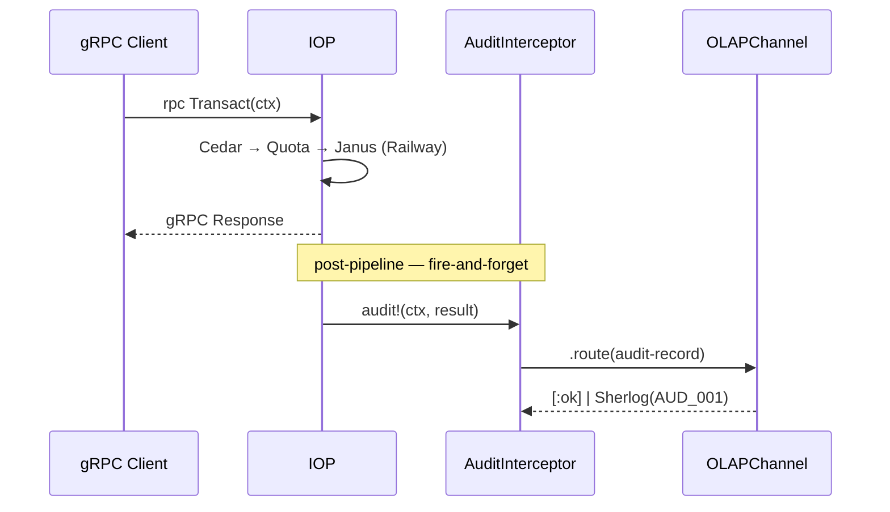

# Fase 09 — Auditoría Asertiva y Criptografía Time-Travel

**Fase contenedora:** Core Engine  
**Depende de:** [03B_FASE_JANUS_ROUTER.md](03B_FASE_JANUS_ROUTER.md), [06_FASE_CEDAR_AUTHORIZER.md](06_FASE_CEDAR_AUTHORIZER.md), [10_FASE_GESTION_ERRORES_EDA.md](10_FASE_GESTION_ERRORES_EDA.md)  
**Consumida por:** `IOP Pipeline`, `Sherlog`, `QuotaGuard`, `CedarAuthorizer`

> [!IMPORTANT]
> La auditoría opera en **dos capas ortogonales**:
>
> | Capa | Motor | Eventos | Costo query |
> | :--- | :---- | :------ | :---------- |
> | **OLTP Time-Travel** | Datahike | `CREATE`, `UPDATE`, `DELETE` | O(1) — `d/history` |
> | **OLAP Asíncrono** | Kinesis → S3 → Athena | `READ`, `ACCESS_DENIED`, `QUOTA_EXHAUSTED`, `PLUGIN_REJECTED` | $0.001/GB — Athena |

---

## MÓDULO I: Auditoría OLTP — Time-Travel Nativo

En Datahike **la transacción es una entidad material**. El `OLTPChannel` la anota con atributos `:audit/*` en la misma operación ACID — sin tablas de log adicionales:

```clojure
;; ns: metri.infrastructure.datahike  [MODIFICAR]
;; Incluir como primer elemento del vector :tx-data en OLTPChannel
(defn build-tx-meta [ctx]
  {:db/id            "datomic.tx"
   :audit/user-id    (:user-id ctx)       ;; Cedar ctx — nunca del cliente
   :audit/tenant-id  (:tenant-id ctx)     ;; Cedar ctx — nunca del cliente
   :audit/ip         (get-in ctx [:request :client-ip])
   :audit/trace-id   (otel/trace-id (otel/current-span))
   :audit/operation  (name (:operation ctx))})
```

**Schema Datahike** — `resources/bootstrap/audit_attrs.edn` `[NEW]`:

```edn
[{:db/ident :audit/user-id    :db/valueType :db.type/string :db/cardinality :db.cardinality/one}
 {:db/ident :audit/tenant-id  :db/valueType :db.type/string :db/cardinality :db.cardinality/one}
 {:db/ident :audit/ip         :db/valueType :db.type/string :db/cardinality :db.cardinality/one}
 {:db/ident :audit/trace-id   :db/valueType :db.type/string :db/cardinality :db.cardinality/one
  :db/doc "W3C traceparent — correlación OTel"}
 {:db/ident :audit/operation  :db/valueType :db.type/string :db/cardinality :db.cardinality/one
  :db/doc "CREATE | UPDATE | DELETE | UPSERT"}]
```

**Query Time-Travel** — quién mutó el activo `XYZ`:

```clojure
(d/q '[:find  ?user-id ?op ?t
       :in    $ ?asset-ulid
       :where [(d/history $) $h]
              [$h ?e :entity/ulid ?asset-ulid]
              [$h ?e :audit/user-id ?user-id]
              [$h ?e :audit/operation ?op]
              [$h ?e :db/txInstant ?t]]
     (d/history @conn) "uuid-xyz")
```

> [!NOTE]
> Datahike es **solo-append** — el histórico de transacciones nunca se borra. Registrar `READ` aquí ahogaría las write-units de DynamoDB; por eso esos eventos van al canal OLAP.

---

## MÓDULO II: Auditoría OLAP — Modelo `audit_log`

Fuente de verdad: [`models/audit_log.json`](models/audit_log.json) — `engine: olap`, `disable_eda: true`, `partition_strategy: YYYY-MM-DD`.

| Campo              | Tipo      | Rol       | Semántica                                                        |
| :----------------- | :-------- | :-------- | :--------------------------------------------------------------- |
| `tenant_id`        | reference | dimension | Aislamiento multitenant en Athena                                |
| `user_id`          | reference | dimension | Trazabilidad por actor — sujeto a censura ABAC                   |
| `action_type`      | enum      | dimension | `READ \| WRITE \| DELETE \| ACCESS_DENIED \| QUOTA_EXHAUSTED \| PLUGIN_REJECTED` |
| `resource_domain`  | string    | dimension | Tipo de entidad accedida (`asset`, `work_order`)                 |
| `resource_id`      | uuid      | —         | FK opcional — `nil` en `ACCESS_DENIED`                           |
| `client_ip`        | string    | dimension | Detección de anomalías de acceso                                 |
| `security_context` | json      | —         | Snapshot Cedar eval + claims — forense offline                   |
| `execution_time_ms`| long      | measure   | Baseline SLOs                                                    |
| `plugin_telemetry` | json      | —         | Trazabilidad de plugins ejecutados en el pipeline                |

> [!IMPORTANT]
> `disable_eda: true` previene que el `OLAPChannel` emita un evento EDA por cada registro — sin loop de bus. La correlación analítica ocurre en Athena por `tenant_id` + `trace_id`.

**Partición S3:** `s3://metri-audit-olap/audit_log/year=YYYY/month=MM/day=DD/`

**Queries de Compliance (Athena):**

```sql
-- Accesos denegados por IP en el último mes
SELECT client_ip, user_id, resource_domain, COUNT(*) as denials
FROM audit_log
WHERE tenant_id = 'uuid-acme' AND action_type = 'ACCESS_DENIED'
  AND year = '2026' AND month = '04'
GROUP BY client_ip, user_id, resource_domain HAVING COUNT(*) > 10;

-- SLO: tiempo de ejecución p99 por dominio
SELECT resource_domain, AVG(execution_time_ms) as avg_ms,
       PERCENTILE_APPROX(execution_time_ms, 0.99) as p99_ms
FROM audit_log WHERE tenant_id = 'uuid-acme' AND year = '2026' AND month = '04'
GROUP BY resource_domain;
```

---

## MÓDULO III: `IAuditInterceptor` — Interceptor Desacoplado

### III.1 — Protocolo (`domain/audit/protocol.clj` `[NEW]`)

```clojure
(ns metri.domain.audit.protocol
  "Contrato puro — cero imports de infra.")

(defprotocol IAuditInterceptor
  "INVARIANTES:
   1. audit! SIEMPRE retorna nil — fire-and-forget.
   2. audit! NUNCA lanza — todo fallo se absorbe y va a Sherlog.
   3. audit! NO modifica ctx ni result del caller.
   4. Se invoca DESPUÉS de que la respuesta gRPC fue enviada.

   Stubs: NoOpAuditInterceptor (tests sin auditoría)
          SpyAuditInterceptor  (tests con assertions)"
  (audit! [this ctx result]
    "ctx    :: {:tenant-id str :user-id str :operation kw :entity-type kw
                :request {:client-ip str} :cedar-result map :token-claims map :role map}
     result :: [:ok {:ulid str :execution-time-ms long ...}]
            |  [:error {:stage kw :code kw ...}]
     ret    :: nil"))
```

### III.2 — `derive-action-type` (`domain/audit/action_type.clj` `[NEW]`)

Función pura — **único lugar** del sistema donde se mapea estado del pipeline → `action_type`:

```clojure
(ns metri.domain.audit.action-type)

(defn derive-action-type
  "Prioridad: seguridad/quota/plugin > :read > WRITE (fallback).
   Extender: añadir cláusula cond aquí — el caller nunca cambia."
  [ctx result]
  (let [stage (get-in result [1 :stage])]
    (cond
      (= stage :auth)            "ACCESS_DENIED"
      (= stage :quota)           "QUOTA_EXHAUSTED"
      (= stage :plugin)          "PLUGIN_REJECTED"
      (= (:operation ctx) :read) "READ"
      :else                      "WRITE")))
```

### III.3 — `build-security-context-snapshot` (`infrastructure/audit/security_snapshot.clj` `[NEW]`)

```clojure
(ns metri.infrastructure.audit.security-snapshot)

(def ^:private allowed-claim-keys #{:roles :groups :scope})

(defn build-security-context-snapshot
  "Snapshot inmutable y serializable — se ejecuta UNA vez por request.
   Solo expone los claims declarados — evita leakage de claims internos."
  [ctx]
  {:cedar-permit   (get-in ctx [:cedar-result :permit])
   :cedar-policies (get-in ctx [:cedar-result :policies-matched])
   :token-claims   (select-keys (get-in ctx [:token-claims]) allowed-claim-keys)
   :role           (:role ctx)})
```

### III.4 — `AuditInterceptorImpl` (`infrastructure/audit/interceptor.clj` `[NEW]`)

```clojure
(ns metri.infrastructure.audit.interceptor
  (:require [integrant.core :as ig]
            [metri.domain.audit.protocol :refer [IAuditInterceptor]]
            [metri.domain.audit.action-type :refer [derive-action-type]]
            [metri.infrastructure.audit.security-snapshot :refer [build-security-context-snapshot]]))

(defrecord AuditInterceptorImpl
  [olap-channel    ;; IJanusWriteChannel — inyectado por Integrant
   ulid-fn         ;; fn: () → ulid — testeable sin I/O
   fault-notifier] ;; IFaultNotifier — notifica AUD_001 a Sherlog

  IAuditInterceptor

  (audit! [this ctx result]
    (otel/with-span ["audit.interceptor" {:kind :producer}]
      (let [span    (otel/current-span)
            record  {:entity_type "audit_log"
                     :payload {:id                ((:ulid-fn this))
                               :tenant_id         (:tenant-id ctx)
                               :user_id           (:user-id ctx)
                               :action_type       (derive-action-type ctx result)
                               :resource_domain   (or (some-> ctx :entity-type name) "unknown")
                               :resource_id       (get-in result [1 :ulid])
                               :client_ip         (get-in ctx [:request :client-ip])
                               :security_context  (build-security-context-snapshot ctx)
                               :execution_time_ms (get-in result [1 :execution-time-ms])
                               :plugin_telemetry  (get-in result [1 :plugin-telemetry])}}]
        (otel/set-attributes! span
          {"audit.tenant_id"       (:tenant-id ctx)
           "audit.action_type"     (get-in record [:payload :action_type])
           "audit.resource_domain" (get-in record [:payload :resource_domain])})
        (try
          (.route (:olap-channel this) record)
          (otel/set-status! span :ok)
          (catch Exception e
            (otel/set-status! span :error "OLAPChannel write failed")
            (sherlog/emit-fault-event!
              {:error {:code "AUD_001" :stage "audit.interceptor" :detail (ex-message e)
                       :tenant_id (:tenant-id ctx) :user_id (:user-id ctx)
                       :trace_id (otel/trace-id span)}}
              :warning [(:fault-notifier this)])))))
    nil))  ;; siempre nil — invariante fire-and-forget

(defmethod ig/init-key :audit/interceptor
  [_ {:keys [olap-channel ulid-fn fault-notifier]}]
  (->AuditInterceptorImpl olap-channel ulid-fn fault-notifier))
```

### III.5 — Stubs canónicos (`infrastructure/audit/stubs.clj` `[NEW]`)

```clojure
(ns metri.infrastructure.audit.stubs
  (:require [metri.domain.audit.protocol :refer [IAuditInterceptor]]))

(defrecord NoOpAuditInterceptor []
  IAuditInterceptor (audit! [_ _ _] nil))

(defrecord SpyAuditInterceptor [calls-atom]
  IAuditInterceptor
  (audit! [_ ctx result]
    (swap! calls-atom conj {:ctx ctx :result result}) nil))

(defn noop-interceptor [] (->NoOpAuditInterceptor))
(defn spy-interceptor  [] (->SpyAuditInterceptor (atom [])))
```

### III.6 — Wiring Integrant (`system.edn`)

```edn
{:janus/olap-channel  {:kinesis-client #ig/ref :aws/kinesis-client
                        :ulid-fn        #ig/ref :util/ulid-fn}

 :audit/interceptor   {:olap-channel   #ig/ref :janus/olap-channel
                        :ulid-fn        #ig/ref :util/ulid-fn
                        :fault-notifier #ig/ref :iop/sherlog-notifier}

 :iop/pipeline        {:cedar-authorizer  #ig/ref :auth/cedar-authorizer
                        :quota-guard       #ig/ref :quota/guard
                        :janus-router      #ig/ref :iop/janus-router
                        :audit-interceptor #ig/ref :audit/interceptor}}
```

---

## MÓDULO IV: Integración con el Pipeline IOP

```
gRPC Request → IOP (run-iop)
  ├─ 1. CedarAuthorizer    → [:ok] | [:error :stage :auth]
  ├─ 2. QuotaGuard         → [:ok] | [:error :stage :quota]
  ├─ 3. JanusRouter        → [:ok {:ulid ...}] | [:error ...]
  ├─ build-grpc-response   → respuesta enviada al cliente
  └─ audit! (siempre)      → fire-and-forget → OLAPChannel → Kinesis → S3 → Athena
```

```clojure
;; ns: metri.application.core  [MODIFICAR — añadir audit! al final de run-iop]
(defn run-iop [ctx deps]
  (let [{:keys [cedar-authorizer quota-guard janus-router audit-interceptor]} deps
        start-ms (System/currentTimeMillis)
        result   (-> ctx cedar-authorizer (then quota-guard) (then janus-router))
        result+  (cond-> result
                   (= :ok (first result))
                   (update 1 assoc :execution-time-ms (- (System/currentTimeMillis) start-ms)))
        response (build-grpc-response result+ ctx)]
    (audit! audit-interceptor ctx result+)  ;; always — post-response, fire-and-forget
    response))
```



---

## MÓDULO V: Principios SOLID y DRY

| Principio | Aplicación |
| :-------- | :--------- |
| **S** | `AuditInterceptorImpl` solo enruta. `derive-action-type` tiene una razón de cambio: el enum global. |
| **O** | Nuevo `action_type` = nuevo enum en `audit_log.json` + nueva cláusula en `derive-action-type`. `AuditInterceptorImpl` no cambia. |
| **L** | `NoOpAuditInterceptor` y `SpyAuditInterceptor` satisfacen el mismo contrato. La suite de contrato aplica a los 3 stubs. |
| **I** | `IAuditInterceptor` expone 1 método (`audit!`). No hereda `IFaultNotifier` ni `IJanusWriteChannel` — son deps inyectadas. |
| **D** | El IOP recibe `IAuditInterceptor` inyectado. `AuditInterceptorImpl` recibe `olap-channel` inyectado — cero `require` de negocio. |

| Riesgo DRY | Solución |
| :--------- | :------- |
| `action_type` en múltiples lugares | `derive-action-type` — único punto. El IOP no tiene condicionales de tipo. |
| Serialización Kinesis repetida | `OLAPChannel.route` — único productor. El interceptor delega. |
| `security_context` construido varias veces | `build-security-context-snapshot` — una vez por request. |
| Enum duplicado en código | SSOT en `audit_log.json` — el interceptor no hardcodea strings. |

---

## MÓDULO VI: Catálogo de Errores

Añadir al final del vector `:entries` en `resources/errors/error_catalog.edn`:

```edn
;; ── Familia AUD — Auditoría ──────────────────────────────────────────────────
{:code :AUD_001 :family :aud :stage :audit.interceptor :severity :warning
 :http-status 500 :grpc-status :INTERNAL :retryable? false
 :description "AuditInterceptor.audit! failed to write to OLAPChannel — audit record lost"
 :context-required [:tenant_id :user_id :action_type]}

{:code :AUD_002 :family :aud :stage :audit.interceptor :severity :warning
 :http-status 500 :grpc-status :INTERNAL :retryable? false
 :description "audit/derive-action-type returned nil — fallback to WRITE applied"
 :context-required [:tenant_id :operation :result-stage]}
```

> [!NOTE]
> `retryable?: false` en ambos casos — un record de auditoría perdido es brecha de compliance, no fallo de infra recuperable.

---

## MÓDULO VII: Estructura de Carpetas

```
metri-engine/
├── resources/
│   ├── bootstrap/
│   │   └── audit_attrs.edn        [NEW]  ← Atributos :audit/* — Datahike bootstrap paso [1.5]
│   └── errors/
│       └── error_catalog.edn             ← Añadir AUD_001, AUD_002
│
├── src/metri/
│   ├── application/
│   │   └── core.clj                      ← run-iop: añadir audit! post-pipeline
│   ├── domain/
│   │   └── audit/
│   │       ├── protocol.clj       [NEW]  ← IAuditInterceptor (defprotocol)
│   │       └── action_type.clj    [NEW]  ← derive-action-type (fn pura, sin I/O)
│   ├── infrastructure/
│   │   ├── datahike.clj                  ← Añadir build-tx-meta
│   │   └── audit/
│   │       ├── interceptor.clj    [NEW]  ← AuditInterceptorImpl + ig/init-key
│   │       ├── security_snapshot.clj [NEW] ← build-security-context-snapshot
│   │       └── stubs.clj          [NEW]  ← NoOpAuditInterceptor, SpyAuditInterceptor
│   └── codice/
│       └── bootstrapper.clj              ← Cargar audit_attrs.edn en paso [1.5]
│
└── test/metri/application/audit/  [NEW]
    ├── fixtures.clj               [NEW]  ← Stubs y datos canónicos compartidos
    ├── interceptor_test.clj       [NEW]  ← Contrato IAuditInterceptor (10 tests)
    ├── action_type_test.clj       [NEW]  ← derive-action-type (10 tests)
    ├── snapshot_test.clj          [NEW]  ← build-security-context-snapshot (8 tests)
    └── integration_test.clj       [NEW]  ← audit_log record end-to-end (14 tests)
```

> [!IMPORTANT]
> `domain/audit/` — **cero imports de AWS, Kinesis o Datahike**. Solo protocol + fn pura.
> `infrastructure/audit/` — única capa que puede importar SDKs. La inversión de dependencias es verificable en compilación.

**Bootstrap — orden actualizado:**

```
[1]   errors/load-catalog!          → error_catalog.edn     — FALLA → JVM no arranca
[1.5] datahike/transact-schema!     → audit_attrs.edn        — FALLA → JVM no arranca
[2]   otel/init!                    → SDK OTel + ADOT
[3]   codice/load-schemas!          → JSON schemas
[4]   codice/validate-scope-links!  → entityRef + is_sequence_scope
[5]   READY
```

---

## MÓDULO VIII: Matriz TDD

Comando: `clj -M:test --namespace-regex 'metri.application.audit.*'`

### Fixtures compartidos (`test/metri/application/audit/fixtures.clj`)

```clojure
(ns metri.application.audit.fixtures
  (:require [metri.domain.audit.protocol :refer [IAuditInterceptor]]))

;; Spy OLAPChannel — captura records
(defrecord SpyOLAPChannel [records-atom])
(defn spy-channel [] (->SpyOLAPChannel (atom [])))
(defn spy-records [ch] @(:records-atom ch))
(defn route! [ch record]
  (swap! (:records-atom ch) conj record)
  [:ok {:ulid "spy-ulid" :channel :spy-olap}])

;; OLAPChannel que falla — simula Kinesis down
(defrecord FailingOLAPChannel [])
(defn failing-channel [] (->FailingOLAPChannel))

;; Spy Notifier — captura llamadas a Sherlog
(defrecord SpyFaultNotifier [calls-atom])
(defn spy-notifier [] (->SpyFaultNotifier (atom [])))
(defn spy-notifications [n] @(:calls-atom n))

;; Datos canónicos
(def base-ctx
  {:tenant-id "uuid-acme" :user-id "uuid-tech-01" :operation :create
   :entity-type :work_order :request {:client-ip "10.0.0.1"}
   :cedar-result {:permit true :policies-matched ["policy-001" "policy-002"]}
   :token-claims {:roles ["engineer"] :groups ["plant-A"] :scope "write:cmms"
                  :sub "internal-do-not-expose"}
   :role {:name "engineer" :level 2}})

(def ok-result     [:ok {:ulid "new-uuid-123" :channel :oltp :execution-time-ms 38}])
(def error-auth    [:error {:stage :auth   :code :SEC_403}])
(def error-quota   [:error {:stage :quota  :code :SEC_QTA_001}])
(def error-plugin  [:error {:stage :plugin :code :PLUG_001}])
(def error-janus   [:error {:stage :janus  :code :JNS_REF_001}])
(def read-ctx      (assoc base-ctx :operation :read :entity-type :asset))
```

### Matriz de casos

#### `interceptor_test.clj` — Contrato `IAuditInterceptor` (10 tests)

| ID | Caso | Input | Esperado |
| :- | :--- | :---- | :------- |
| AUD-01 | `audit!` retorna `nil` — impl real | `base-ctx` + `ok-result` | `nil` |
| AUD-02 | `audit!` retorna `nil` — `NoOp` | `base-ctx` + `ok-result` | `nil` (Liskov) |
| AUD-03 | `audit!` retorna `nil` — `Spy` | `base-ctx` + `ok-result` | `nil` (Liskov) |
| AUD-04 | `SpyAuditInterceptor` acumula N llamadas | 3 invocaciones | `count = 3` |
| AUD-05 | Fallo OLAPChannel → `nil` absorbido | `FailingOLAPChannel` | `nil` |
| AUD-06 | Sherlog recibe 1 notificación en fallo | `FailingOLAPChannel` | `count = 1` |
| AUD-07 | `audit!` no modifica `ctx` del caller | cualquier resultado | `ctx` idéntico |
| AUD-08 | `audit!` no modifica `result` del caller | cualquier resultado | `result` idéntico |
| AUD-09 | Todo stub acepta `[:ok]` | 3 stubs × `ok-result` | `nil` × 3 |
| AUD-10 | Todo stub acepta `[:error]` | 3 stubs × `error-auth` | `nil` × 3 |

```clojure
(ns metri.application.audit.interceptor-test
  (:require [clojure.test :refer [deftest testing is]]
            [metri.application.audit.fixtures :as f]
            [metri.domain.audit.protocol :refer [audit!]]
            [metri.infrastructure.audit.interceptor :refer [->AuditInterceptorImpl]]
            [metri.infrastructure.audit.stubs :refer [->NoOpAuditInterceptor ->SpyAuditInterceptor]]))

(defn- make-impl [ch] (->AuditInterceptorImpl ch (constantly "test-ulid") (f/spy-notifier)))

(defn run-contract! [interceptor]
  (is (nil? (audit! interceptor f/base-ctx f/ok-result)))       ;; nil siempre
  (is (nil? (audit! interceptor f/base-ctx f/error-auth)))      ;; nil en error
  (let [ctx-before f/base-ctx]
    (audit! interceptor f/base-ctx f/ok-result)
    (is (= ctx-before f/base-ctx)))                             ;; ctx intacto
  (let [r-before f/ok-result]
    (audit! interceptor f/base-ctx f/ok-result)
    (is (= r-before f/ok-result))))                             ;; result intacto

(deftest contract-impl-test  (testing "AUD-01,07,08" (run-contract! (make-impl (f/spy-channel)))))
(deftest contract-noop-test  (testing "AUD-02,07,08" (run-contract! (->NoOpAuditInterceptor))))
(deftest contract-spy-test   (testing "AUD-03,07,08" (run-contract! (->SpyAuditInterceptor (atom [])))))

(deftest spy-accumulates-test
  (testing "AUD-04"
    (let [spy (->SpyAuditInterceptor (atom []))]
      (audit! spy f/base-ctx f/ok-result)
      (audit! spy f/base-ctx f/error-auth)
      (audit! spy f/read-ctx f/ok-result)
      (is (= 3 (count @(:calls-atom spy)))))))

(deftest olap-failure-test
  (let [notifier (f/spy-notifier)
        impl     (->AuditInterceptorImpl (f/failing-channel) (constantly "t") notifier)]
    (testing "AUD-05: nil absorbido" (is (nil? (audit! impl f/base-ctx f/ok-result))))
    (testing "AUD-06: 1 notif Sherlog" (is (= 1 (count (f/spy-notifications notifier)))))))
```

#### `action_type_test.clj` — `derive-action-type` (10 tests)

| ID | `ctx.operation` | `result` | Esperado |
| :- | :-------------- | :------- | :------- |
| DAT-01 | `:create` | `error-auth` | `"ACCESS_DENIED"` |
| DAT-02 | `:create` | `error-quota` | `"QUOTA_EXHAUSTED"` |
| DAT-03 | `:create` | `error-plugin` | `"PLUGIN_REJECTED"` |
| DAT-04 | `:read` | `ok-result` | `"READ"` |
| DAT-05 | `:create` | `ok-result` | `"WRITE"` |
| DAT-06 | `:create` | `error-janus` | `"WRITE"` |
| DAT-07 | `:delete` | `ok-result` | `"WRITE"` |
| DAT-08 | `:read` | `error-auth` | `"ACCESS_DENIED"` (prio) |
| DAT-09 | `:update` | `ok-result` | `"WRITE"` |
| DAT-10 | `:upsert` | `ok-result` | `"WRITE"` |

```clojure
(ns metri.application.audit.action-type-test
  (:require [clojure.test :refer [deftest testing is are]]
            [metri.application.audit.fixtures :as f]
            [metri.domain.audit.action-type :refer [derive-action-type]]))

(deftest security-priority-test
  (testing "DAT-01" (is (= "ACCESS_DENIED"   (derive-action-type f/base-ctx f/error-auth))))
  (testing "DAT-02" (is (= "QUOTA_EXHAUSTED" (derive-action-type f/base-ctx f/error-quota))))
  (testing "DAT-03" (is (= "PLUGIN_REJECTED" (derive-action-type f/base-ctx f/error-plugin))))
  (testing "DAT-08: :read + auth-error → ACCESS_DENIED (no READ)"
    (is (= "ACCESS_DENIED" (derive-action-type f/read-ctx f/error-auth)))))

(deftest read-test
  (testing "DAT-04" (is (= "READ" (derive-action-type f/read-ctx f/ok-result)))))

(deftest write-operations-test
  (testing "DAT-06: error janus → WRITE"
    (is (= "WRITE" (derive-action-type f/base-ctx f/error-janus))))
  (are [op] (= "WRITE" (derive-action-type (assoc f/base-ctx :operation op) f/ok-result))
    :create :update :delete :upsert))  ;; DAT-05, DAT-07, DAT-09, DAT-10
```

#### `snapshot_test.clj` — `build-security-context-snapshot` (8 tests)

| ID | Caso | Esperado |
| :- | :--- | :------- |
| SEC-01 | `cedar-permit` presente | `true` |
| SEC-02 | `cedar-policies` presente | `["policy-001" "policy-002"]` |
| SEC-03 | `:role` del ctx presente | `{:name "engineer" :level 2}` |
| SEC-04 | `:sub` NO aparece en snapshot | `nil` |
| SEC-05 | `:roles` SÍ aparece | `["engineer"]` |
| SEC-06 | Resultado serializable como JSON | `(string? (json/write-str snap))` |
| SEC-07 | `cedar-permit false` en fallo auth | `false` |
| SEC-08 | `cedar-policies nil` si ausente en ctx | `nil` |

```clojure
(ns metri.application.audit.snapshot-test
  (:require [clojure.test :refer [deftest testing is]]
            [clojure.data.json :as json]
            [metri.application.audit.fixtures :as f]
            [metri.infrastructure.audit.security-snapshot :refer [build-security-context-snapshot]]))

(deftest cedar-test
  (let [snap (build-security-context-snapshot f/base-ctx)]
    (testing "SEC-01" (is (true?  (:cedar-permit snap))))
    (testing "SEC-02" (is (= ["policy-001" "policy-002"] (:cedar-policies snap)))))
  (testing "SEC-07: permit false"
    (let [snap (build-security-context-snapshot (assoc-in f/base-ctx [:cedar-result :permit] false))]
      (is (false? (:cedar-permit snap)))))
  (testing "SEC-08: policies nil si ausente"
    (let [snap (build-security-context-snapshot (update f/base-ctx :cedar-result dissoc :policies-matched))]
      (is (nil? (:cedar-policies snap))))))

(deftest claims-whitelist-test
  (let [snap (build-security-context-snapshot f/base-ctx)]
    (testing "SEC-04: :sub ausente" (is (nil? (get-in snap [:token-claims :sub]))))
    (testing "SEC-05: :roles presente" (is (= ["engineer"] (get-in snap [:token-claims :roles]))))
    (testing "SEC-03: :role presente" (is (= {:name "engineer" :level 2} (:role snap))))))

(deftest json-test
  (testing "SEC-06: serializable"
    (is (string? (json/write-str (build-security-context-snapshot f/base-ctx))))))
```

#### `integration_test.clj` — `audit_log` record end-to-end (14 tests)

| ID | Campo verificado | Caso | Esperado |
| :- | :--------------- | :--- | :------- |
| INT-01 | `tenant_id` | del ctx (no payload) | `"uuid-acme"` |
| INT-02 | `user_id` | del ctx | `"uuid-tech-01"` |
| INT-03 | `action_type` | `error-auth` | `"ACCESS_DENIED"` |
| INT-04 | `entity_type` del record | siempre | `"audit_log"` |
| INT-05 | `resource_domain` | `:entity-type :work_order` | `"work_order"` |
| INT-06 | `resource_id` | `[:ok]` result | `"new-uuid-123"` |
| INT-07 | `resource_id` | `[:error]` result | `nil` |
| INT-08 | `execution_time_ms` | del result | `38` |
| INT-09 | `client_ip` | del `ctx.request` | `"10.0.0.1"` |
| INT-10 | `security_context` | siempre | `(map? ...)` |
| INT-11 | `plugin_telemetry` | result lo incluye | `[{:plugin ...}]` |
| INT-12 | `plugin_telemetry` | result sin telemetría | `nil` |
| INT-13 | Cardinalidad | 1 llamada → 1 record | `count = 1` |
| INT-14 | Cardinalidad | 3 llamadas → 3 records | `count = 3` |

```clojure
(ns metri.application.audit.integration-test
  (:require [clojure.test :refer [deftest testing is]]
            [metri.application.audit.fixtures :as f]
            [metri.domain.audit.protocol :refer [audit!]]
            [metri.infrastructure.audit.interceptor :refer [->AuditInterceptorImpl]]))

(defn- impl [ch] (->AuditInterceptorImpl ch (constantly "test-ulid") (f/spy-notifier)))
(defn- payload [ch] (-> (f/spy-records ch) first :payload))

(deftest identity-test
  (let [ch (f/spy-channel)] (audit! (impl ch) f/base-ctx f/ok-result)
    (testing "INT-01" (is (= "uuid-acme"    (:tenant_id   (payload ch)))))
    (testing "INT-02" (is (= "uuid-tech-01" (:user_id     (payload ch)))))
    (testing "INT-04" (is (= "audit_log"    (:entity_type (first (f/spy-records ch))))))))

(deftest resource-test
  (let [ch (f/spy-channel)] (audit! (impl ch) f/base-ctx f/ok-result)
    (testing "INT-05" (is (= "work_order"  (:resource_domain (payload ch)))))
    (testing "INT-06" (is (= "new-uuid-123" (:resource_id     (payload ch))))))
  (let [ch (f/spy-channel)] (audit! (impl ch) f/base-ctx f/error-auth)
    (testing "INT-07" (is (nil? (:resource_id (payload ch)))))))

(deftest action-and-timing-test
  (let [ch (f/spy-channel)] (audit! (impl ch) f/base-ctx f/error-auth)
    (testing "INT-03" (is (= "ACCESS_DENIED" (:action_type (payload ch))))))
  (let [ch (f/spy-channel)] (audit! (impl ch) f/base-ctx f/ok-result)
    (testing "INT-08" (is (= 38 (:execution_time_ms (payload ch)))))
    (testing "INT-09" (is (= "10.0.0.1" (:client_ip (payload ch)))))
    (testing "INT-10" (is (map? (:security_context (payload ch)))))))

(deftest telemetry-test
  (let [tel [{:plugin "notif" :ms 5}]
        ch  (f/spy-channel)]
    (audit! (impl ch) f/base-ctx (update f/ok-result 1 assoc :plugin-telemetry tel))
    (testing "INT-11" (is (= tel (:plugin_telemetry (payload ch))))))
  (let [ch (f/spy-channel)] (audit! (impl ch) f/base-ctx f/ok-result)
    (testing "INT-12" (is (nil? (:plugin_telemetry (payload ch)))))))

(deftest cardinality-test
  (let [ch (f/spy-channel)]
    (audit! (impl ch) f/base-ctx f/ok-result)
    (testing "INT-13" (is (= 1 (count (f/spy-records ch))))))
  (let [ch (f/spy-channel)]
    (audit! (impl ch) f/base-ctx f/ok-result)
    (audit! (impl ch) f/base-ctx f/error-auth)
    (audit! (impl ch) f/read-ctx f/ok-result)
    (testing "INT-14" (is (= 3 (count (f/spy-records ch)))))))
```

### Cobertura

| Fichero | Tests | Comportamientos |
| :------ | :---- | :-------------- |
| `interceptor_test.clj` | 10 | Contrato Liskov ×3 stubs, fallo OLAPChannel |
| `action_type_test.clj` | 10 | 6 action_types + prioridad + CRUD ops |
| `snapshot_test.clj` | 8 | Whitelist claims, JSON safety, nil safety |
| `integration_test.clj` | 14 | Todos los campos del `audit_log` record |
| **Total** | **42** | — |

---

## MÓDULO IX: Observabilidad

### Árbol de Spans

```
Span ROOT: "iop.transact"                      [trace_id: 4bf92f35...]
  ├── "janus.load-schema"
  ├── "janus.validate-payload"
  ├── "janus.verify-entity-refs"
  ├── "janus.enrich-payload"
  ├── "janus.execute-transaction"
  └── "audit.interceptor" [kind:producer]     ← post-pipeline
        attrs: audit.action_type, audit.tenant_id, audit.resource_domain
```

### SLO Dashboard (Athena)

```sql
-- % de records de auditoría exitosos vs. AUD_001 en domain_fault
WITH total AS (SELECT COUNT(*) n FROM audit_log
               WHERE year='2026' AND month='04' AND tenant_id='uuid-acme'),
     lost  AS (SELECT COUNT(*) n FROM domain_fault
               WHERE error_code='AUD_001' AND year='2026' AND month='04' AND tenant_id='uuid-acme')
SELECT total.n, lost.n, ROUND(100.0*(total.n - lost.n)/total.n, 4) AS audit_success_rate_pct
FROM total, lost;
```

---

## MÓDULO X: Checklist

- [ ] `audit_attrs.edn` cargado en bootstrap paso `[1.5]` — antes de `codice/load-schemas!`
- [ ] `build-tx-meta` incluido en el vector `:tx-data` de `OLTPChannel`
- [ ] `audit!` invocado post-`build-grpc-response` en `run-iop`
- [ ] `AuditInterceptorImpl` wired en `system.edn` — el IOP no lo instancia
- [ ] `NoOpAuditInterceptor` en todos los tests que no validan auditoría
- [ ] Suite de contrato `run-contract!` aplicada a los 3 stubs
- [ ] `AUD_001`, `AUD_002` en `error_catalog.edn`
- [ ] `disable_eda: true` en `audit_log.json` — sin loop EDA
- [ ] Span `"audit.interceptor"` con `audit.action_type` y `audit.tenant_id`
- [ ] `clj -M:test` → 42 tests en verde, 0 failures
