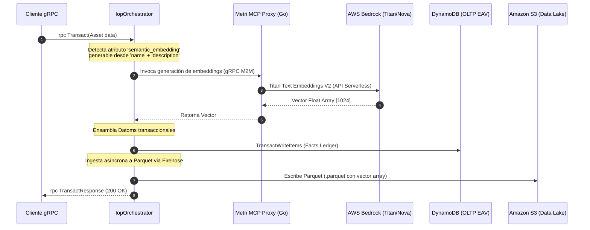

# Fase 11: Metri Serverless Vector Store (Búsqueda Semántica de $0 Base Cost para AWS Bedrock Nova)

**Nombre del Manifiesto:** `MetriVectorStore`  
**Fase contenedora:** Invocado por [03A_FASE_IOP.md](03A_FASE_IOP.md) (Write Path) y [05_FASE_CONSULTA.md](05_FASE_CONSULTA.md) / [COMPONENTE_EXTERNO_06_METRI_MCP.md](COMPONENTE_EXTERNO_06_METRI_MCP.md) (Read Path)

---

## 1. Principio Rector e Integración con AWS Bedrock Nova (Sin Valkey)

Fieles al principio de **Cero Infraestructura Ociosa ($0.00 base cost en reposo)** de Metri, este módulo diseña un motor de almacenamiento y búsqueda vectorial integrado en `metri-engine` **eliminando por completo cualquier dependencia de Valkey/Redis**. Toda la infraestructura descansa sobre servicios puramente serverless y basados en disco/almacenamiento elástico.

Aprovechando la familia de modelos multimedios y ultra-eficientes **AWS Bedrock Nova** (Nova Pro, Nova Lite, Nova Micro) y sus modelos de embeddings nativos (`amazon.titan-embed-text-v2`), Metri expande su núcleo inmutable **EAV (Entity-Attribute-Value)** para soportar atributos de tipo `vector` de forma nativa, segmentados por Tenant de forma criptográfica y autorizados mediante **Cedar ABAC**.

```
                           ESQUEMA DUAL DE BÚSQUEDA VECTORIAL METRI (PURE SERVERLESS)
                           
                                    ┌──────────────────────┐
                                    │ AWS Bedrock Nova LLM │
                                    └──────────┬───────────┘
                                               │ (Contexto RAG)
                                   ┌───────────▼───────────┐
                                   │ Metri MCP Proxy (Go)  │
                                   └───────────┬───────────┘
                                               │
                       ┌───────────────────────┴───────────────────────┐
                       │ (Búsqueda Rápida / Baja Latencia)             │ (Búsqueda Analítica Completa)
        ┌──────────────▼──────────────┐                 ┌──────────────▼──────────────┐
        │ Ephemeral Index (S3 + RAM)  │                 │   AWS Athena (Trino OLAP)   │
        │ o Batch DynamoDB EAV (OLTP) │                 │ (Cold S3 Parquet / $0 Base) │
        └─────────────────────────────┘                 └─────────────────────────────┘
```

---

## 2. Modelado de Datos: Vectores como Atributos EAV de Primer Nivel

En el núcleo de metadatos de Metri Engine (`Códice`), introducimos la firma del tipo de dato `vector` en la definición de esquemas JSON. Esto permite que cualquier entidad de negocio (ej. `work_order`, `asset_profile`, `location` o la telemetría OTel) pueda poseer representaciones vectoriales automáticas.

### Fragmento de Definición de Esquema (`config/models/asset.json`)
```json
{
  "entity": "asset",
  "engine": "dual",
  "attributes": [
    { "name": "id", "type": "uuid", "unique": "identity" },
    { "name": "name", "type": "string", "required": true },
    { "name": "description", "type": "string" },
    {
      "name": "semantic_embedding",
      "type": "vector",
      "dimensions": 1024,
      "model": "amazon.titan-embed-text-v2",
      "auto_generate_from": ["name", "description"],
      "description": "Atributo vectorial generado automáticamente a partir de los metadatos textuales."
    }
  ]
}
```

### Representación EAV en el Ledger Inmutable (Datoms)
En DynamoDB (OLTP) y en los archivos Parquet en S3 (OLAP), el embedding se almacena de forma estructurada como una matriz numérica indexable asociada a la entidad:

*   **Entity (E):** `asset-99` (Siemens Pump 50HP)
*   **Attribute (A):** `:asset/semantic_embedding`
*   **Value (V):** `[0.0152, -0.0843, 0.2319, ..., 0.0041]` (Array de 1024 floats de 32 bits)
*   **Tx (T):** `100249` (Transaction epoch)

---

## 3. Arquitectura del Flujo de Datos (Pipelines)

### 3.1 Canal de Escritura (Write Path: Generación e Ingesta en IOP)

1.  **Ingreso a IOP (`rpc Transact`):** El orquestador recibe la mutación de la entidad.
2.  **Evaluación de Generación:** Si el esquema define un atributo `vector` con la propiedad `auto_generate_from`, el pipeline de ingesta (`src/iop/pipeline.rs`) detecta el cambio.
3.  **Llamada Serverless No Bloqueante:** A través del `Metri MCP Proxy` (Componente 06), se invoca a Amazon Bedrock para generar el embedding del texto concatenado (ej. *"Bomba Siemens Centrifuga... Rodamiento Mobil DTE"*).
4.  **Almacenamiento Dual Serverless:**
    *   **OLTP (DynamoDB):** Se persiste el vector en formato binario comprimido (como `Float32Array` serializado en BSON/Binario de DynamoDB) para optimizar costos de almacenamiento y RCU/WCU en la base de datos transaccional EAV.
    *   **OLAP (S3 Parquet):** El compactador masivo (*Hephaestus*) vuelca los datoms de embeddings a archivos `.parquet` particionados por `tenant_id` y `created_at` en S3.



---

## 4. Estrategia de Búsqueda Vectorial Híbrida de $0 Base Cost (Sin Servidores Calientes)

Para garantizar sub-segundos en consultas y costo cero en reposo absoluto, `Metri Engine` implementa tres caminos de consulta vectorial polimórficos según el volumen y la latencia requerida:

### Camino A: Búsqueda Semántica de Baja Latencia Epímera (Local HNSW sobre S3 / Lambda RAM)
*   **Cuándo se usa:** Consultas interactivas rápidas de usuarios (ej. RAG inmediato en Metri Panel para un tenant activo).
*   **Mecanismo:** El índice vectorial HNSW compacto de cada tenant se almacena de manera particionada en **Amazon S3** (`s3://metri-indices/{tenant_id}/hnsw.index`). 
    1. Cuando llega una búsqueda, el motor de ejecución en Rust (`metri-engine`) o el `Metri MCP Proxy` descarga el archivo de índice desde S3 en la RAM local de la Lambda / Contenedor (operación ultra-rápida de ~30-50ms gracias a la red interna de AWS).
    2. Se inicializa el índice localmente en memoria RAM en menos de **5ms** usando `hnsw_rs` (Rust) o `hnswlib-node` (TS).
    3. Se ejecuta la búsqueda KNN localmente en microsegundos y se retorna el resultado.
    4. Se libera la memoria de forma inmediata.
*   **Costo de reposo:** **Exactamente $0.00**. Solo pagas por milisegundos de Lambda y almacenamiento elástico de S3 ($0.023 por GB/mes).

### Camino B: Recuperación Rápida EAV Directa (In-Memory Batch en DynamoDB)
*   **Cuándo se usa:** Tenants pequeños a medianos (menos de 5,000 registros vectoriales) que buscan máxima consistencia transaccional (Read-Your-Own-Writes) sin esperar la sincronización del índice HNSW en S3.
*   **Mecanismo:** 
    1. Se realiza un Scan o Query filtrado por `tenant_id` directamente a los datoms del atributo `:asset/semantic_embedding` en la tabla EAV de DynamoDB.
    2. Se recuperan los registros (al ser pocos miles, la transferencia toma menos de **30ms**).
    3. El microservicio en Rust o TS calcula el producto punto / similitud coseno directamente en la CPU del contenedor a velocidad nativa en **<2ms**.
*   **Costo:** Solo el costo de las RCU consumidas por la lectura pagada bajo el esquema elástico por demanda.

### Camino C: Búsqueda Analítica Masiva (AWS Athena Vector Math)
*   **Cuándo se usa:** Queries analíticas complejas interanuales o reportes BI pesados que cruzan millones de registros históricos.
*   **Mecanismo:** AWS Athena (Serverless Trino) procesa los archivos Parquet en S3 de forma masiva. No requiere ningún servidor encendido. Las consultas calculan la **Similitud Coseno** directamente mediante funciones matemáticas vectoriales de Presto/Trino sobre los arrays de Parquet.
*   **Query de Athena (Presto SQL compilado por Aegis):**
    ```sql
    WITH query_vector_definition AS (
      SELECT ARRAY[0.0152, -0.0843, 0.2319, ..., 0.0041] AS q_vec
    )
    SELECT 
      e.entity_id,
      e.name,
      e.description,
      -- Producto punto / (magnitud_q * magnitud_e) = Similitud Coseno
      (
        reduce(zip_with(e.semantic_embedding, q.q_vec, (x, y) -> x * y), 0.0, (s, x) -> s + x, s -> s) 
        / 
        (
          sqrt(reduce(e.semantic_embedding, 0.0, (s, x) -> s + (x * x), s -> s)) 
          * 
          sqrt(reduce(q.q_vec, 0.0, (s, x) -> s + (x * x), s -> s))
        )
      ) AS cosine_similarity
    FROM 
      metri_olap_prod.asset e,
      query_vector_definition q
    WHERE 
      e.tenant_id = 'tnt_01JRP14X'
    ORDER BY 
      cosine_similarity DESC
    LIMIT 10;
    ```
*   **Costo:** Exactamente **$5.00 por TB de datos escaneados** en Athena. Cero costo de reposo.

---

## 5. Integración RAG con AWS Bedrock Nova y Control de Acceso ABAC (Cedar)

### 5.1 El Rol del Metri MCP Proxy y la Familia Nova
Cuando el operario realiza una pregunta semántica libre (ej. *"¿Qué manuales y órdenes de mantenimiento aplican a la Bomba Siemens que ha estado fallando en lubricación?"*):

1.  **Prompt Entry:** Llega al `Metri MCP Proxy` (Componente 06) desde Metri Panel.
2.  **Generación de Embedding del Query:** El Proxy convierte la pregunta en un vector de consulta usando Bedrock.
3.  **Consulta Vectorial Restringida (Aegis + Cedar):**
    *   Aegis ejecuta la búsqueda vectorial (Camino A o B) filtrando de forma estricta por `tenant_id`.
    *   **Paso Crítico Cedar PDP:** Antes de retornar los resultados al contexto, el motor de seguridad embebido **Cedar** evalúa el rol del usuario contra los documentos recuperados:
        ```cedar
        // Cedar Rule: Solo ingenieros de mantenimiento pueden leer fichas técnicas vectoriales de activos críticos
        permit(
          principal,
          action == Action::"Read",
          resource
        ) when {
          principal.role == "MaintenanceEngineer" &&
          resource.classification != "Confidential"
        };
        ```
    *   Cualquier documento o activo semántico que no pase la validación ABAC es **censurado en tiempo real (Zero-Trust Censorship)** y purgado del conjunto de resultados.
4.  **Inferencia RAG con Bedrock Nova:**
    *   El contexto limpio de filtraciones de datos e inyecciones semánticas se inyecta en el prompt maestro.
    *   Se envía a **AWS Bedrock Nova Pro** o **Nova Lite** mediante un stream SSE rápido.
    *   La respuesta llega al usuario en lenguaje humano directo, preciso y 100% verificado contra las reglas de cumplimiento de la corporación.

---

## 6. Pipeline de Reconstrucción del Índice Epímero (HNSW Sync Pipeline)

Para mantener los índices HNSW en S3 actualizados, un dispatcher asíncrono e incremental re-construye el índice HNSW en segundo plano:

```
Mutación en IOP ──► Outbox Event (Moira) ──► EventBridge Pipe ──► Lambda Index Rebuilder (Rust)
                                                                            │
                                                                   Sube nuevo hnsw.index a S3
```

1. **Evento de Mutación:** Cuando un atributo `vector` cambia, Moira (`04_FASE_MOIRA.md`) emite un evento del tipo `vector.update`.
2. **Dispatcher Incremental:** Un EventBridge Pipe asíncrono captura el evento e invoca a una Lambda Rebuilder ligera.
3. **Reconstrucción Eficiente:** La Lambda descarga el índice existente de S3, inserta los nuevos vectores de forma incremental in-RAM en Rust, y sobreescribe el archivo `.index` en S3 con una suma de verificación SHA-256 para validaciones de integridad caliente en las Lambda consumidoras.

---

## 7. Checklist de Implementación en Rust (`metri-engine`)

- [ ] Agregar soporte para el atributo de tipo `vector` en la serialización y deserialización de Malli y Códice (`src/metri/codice/malli.clj` y equivalentes en Rust).
- [ ] Implementar el formato de persistencia Float32Array comprimido en el `EavWriter` de DynamoDB.
- [ ] Incorporar el compilador de funciones vectoriales en HoneySQL / Athena SQL dentro del orquestador analítico `Aegis`.
- [ ] Implementar el sincronizador local HNSW (`hnsw_rs`) con almacenamiento en S3 para el Camino A.
- [ ] Proteger el canal de recuperación vectorial mediante la validación imperativa de políticas Cedar ABAC a nivel de datoms vectoriales.
- [ ] Validar la conexión de la tubería semántica contra el endpoint regional de **AWS Bedrock Nova** utilizando AWS SDK para Rust (`aws-config` y `aws-sdk-bedrockruntime`).
