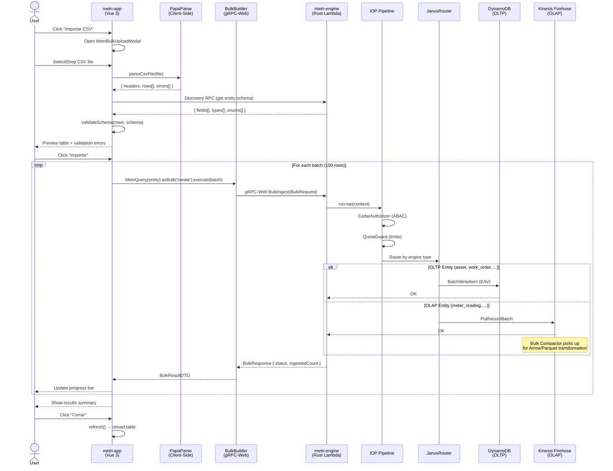

# Fase 12 — Integración Carga Masiva CSV (metri-app ↔ metri-engine ↔ metri-bulk-compactor)

**Componentes Involucrados:** `metri-app` (Vue 3 Frontend) · `metri-engine` (Rust gRPC Backend) · `metri-bulk-compactor` (Golang Lambda — Hephaestus)
**Patrón Arquitectónico:** Client-Side CSV Parsing · gRPC-Web BulkIngest · Schema-Driven Validation · Streaming Progress
**Estado:** Diseño Arquitectónico

---

## 1. Definición del Problema

Actualmente, las entidades en Metri se crean una a una mediante el flujo `MetriCreateButton → Formulario → Transact gRPC`. No existe un mecanismo en el frontend para **cargar masivamente** datos desde un archivo CSV. Los usuarios que necesitan migrar cientos o miles de registros (activos, ubicaciones, órdenes de trabajo) deben hacerlo manualmente — un proceso lento y propenso a errores.

> [!IMPORTANT]
> Este documento diseña la integración **end-to-end** del flujo de carga masiva CSV, conectando el frontend (`metri-app`) con el backend (`metri-engine`) a través del RPC `BulkIngest` existente y su infraestructura `BulkBuilder` ya definida en el cliente gRPC.

---

## 2. Estado Actual del Ecosistema (Inventario de Piezas Existentes)

### 2.1 Infraestructura Backend — YA EXISTE

| Pieza | Ubicación | Estado |
|:------|:----------|:-------|
| RPC `BulkIngest` | [metri.proto:31](file:///Users/macuser/projects/metri/metri-engine/proto/metri.proto#L31) | ✅ Producción |
| `BulkRequest` / `BulkResponse` proto | [metri.proto:888-900](file:///Users/macuser/projects/metri/metri-engine/proto/metri.proto#L888-L900) | ✅ Producción |
| `RowSet` con `rows_json` payload | [metri.proto:625-641](file:///Users/macuser/projects/metri/metri-engine/proto/metri.proto#L625-L641) | ✅ Producción |
| IOP Pipeline (Cedar → Quota → Janus) | [core.rs](file:///Users/macuser/projects/metri/metri-engine/src/iop/core.rs) | ✅ Producción |
| OLTP Channel (DynamoDB EAV) | [oltp_channel.rs](file:///Users/macuser/projects/metri/metri-engine/src/janus_router/oltp_channel.rs) | ✅ Producción |
| OLAP Channel (Kinesis Firehose) | [olap_channel.rs](file:///Users/macuser/projects/metri/metri-engine/src/janus_router/olap_channel.rs) | ✅ Producción |
| Bulk Compactor Lambda (Hephaestus) | [main.go](file:///Users/macuser/projects/metri/metri-bulk-compactor/cmd/compactor_handler/main.go) | ✅ Producción |

### 2.2 Infraestructura Frontend — YA EXISTE (sin UI consumer)

| Pieza | Ubicación | Estado |
|:------|:----------|:-------|
| `BulkBuilder` class | [metri.builder.ts:256-292](file:///Users/macuser/projects/metri/metri-app/src/lib/metri-client/builder/metri.builder.ts#L256-L292) | ✅ Definida, **SIN USAR** |
| `MetriQuery('entity').asBulk('create')` | [metri.builder.ts:613](file:///Users/macuser/projects/metri/metri-app/src/lib/metri-client/builder/metri.builder.ts#L613) | ✅ Definida, **SIN USAR** |
| `#header-actions` slot en `MetriEntityDashboard` | [MetriEntityDashboard.vue](file:///Users/macuser/projects/metri/metri-app/src/components/dashboard/MetriEntityDashboard.vue) | ✅ Producción |
| `refresh()` en `useEntityTableQuery` | [useEntityTableQuery.ts](file:///Users/macuser/projects/metri/metri-app/src/composables/useEntityTableQuery.ts) | ✅ Producción |
| Naive UI `NUpload` / `NModal` | Librería de componentes | ✅ Disponible |

### 2.3 Lo que FALTA (Scope de esta Fase)

| Pieza | Tipo | Descripción |
|:------|:-----|:------------|
| `MetriBulkUploadButton.vue` | Componente UI | Botón "Importar CSV" para el slot `#header-actions` |
| `MetriBulkUploadModal.vue` | Componente UI | Modal wizard de 4 pasos: Upload → Preview → Ingest → Results |
| `useBulkCsvUpload.ts` | Composable | Orquestador: parseo CSV, validación schema, batching, progress |
| `csv-parser.ts` | Utilidad | Parser CSV client-side (PapaParse wrapper) |
| Endpoint template CSV (opcional) | Engine REST | `GET /api/v1/{entity}/template/csv` para descarga de plantilla |

---

## 3. Arquitectura del Flujo Completo

### 3.1 Topología de Alto Nivel

```
┌─────────────────────────────────────────────────────────────────────────────────┐
│                               metri-app (Vue 3)                                │
│                                                                                 │
│  AssetDashboardView / LocationDashboardView / WorkOrderDashboardView / ...      │
│  ┌──────────────────────────────────────────────────────────────────────────┐    │
│  │  MetriEntityDashboard                                                    │    │
│  │  ┌──────────────────────────────────────────────────────────────────┐    │    │
│  │  │  #header-actions slot                                            │    │    │
│  │  │  ┌──────────────┐  ┌──────────────────────┐                     │    │    │
│  │  │  │ MetriCreate  │  │ MetriBulkUpload      │ ← NUEVO             │    │    │
│  │  │  │   Button     │  │   Button             │                     │    │    │
│  │  │  └──────────────┘  └───────┬──────────────┘                     │    │    │
│  │  └────────────────────────────┼─────────────────────────────────────┘    │    │
│  └───────────────────────────────┼──────────────────────────────────────────┘    │
│                                  │ click                                         │
│                                  ▼                                               │
│  ┌──────────────────────────────────────────────────────────────────────────┐    │
│  │  MetriBulkUploadModal (4-Step Wizard)                   ← NUEVO         │    │
│  │                                                                          │    │
│  │  Step 1: Upload CSV     → File picker + drag-and-drop                   │    │
│  │  Step 2: Preview & Map  → Table preview + schema validation             │    │
│  │  Step 3: Processing     → Batched BulkIngest con progress bar           │    │
│  │  Step 4: Results        → Summary (success/errors/warnings)             │    │
│  │                                                                          │    │
│  │  ┌─────────────────────────────────────────┐                             │    │
│  │  │  useBulkCsvUpload() composable          │ ← NUEVO                    │    │
│  │  │  ├── PapaParse: CSV → JSON rows         │                             │    │
│  │  │  ├── Schema validation (via Discovery)  │                             │    │
│  │  │  ├── Batch chunking (100 rows/batch)    │                             │    │
│  │  │  └── BulkBuilder.execute(batch[])       │                             │    │
│  │  └──────────────┬──────────────────────────┘                             │    │
│  └─────────────────┼────────────────────────────────────────────────────────┘    │
│                    │ gRPC-Web                                                     │
└────────────────────┼─────────────────────────────────────────────────────────────┘
                     │
                     ▼
┌──────────────────────────────────────────────────────────────────────────────────┐
│                          metri-engine (Rust · Lambda)                            │
│                                                                                  │
│  CloudFront WAF → API Gateway → gRPC MetriService                               │
│  ┌──────────────────────────────────────────────────────────────────────────┐    │
│  │  rpc BulkIngest(BulkRequest) → IOP Pipeline                             │    │
│  │  ┌───────────────────────────────────────────────────────────────────┐   │    │
│  │  │  Step 1: CedarAuthorizer  → Zero-Trust ABAC (token → tenant_id)  │   │    │
│  │  │  Step 2: QuotaGuard       → Tenant resource quota check          │   │    │
│  │  │  Step 3: JanusRouter      → Schema validation + channel routing  │   │    │
│  │  │  ┌──────────────────────────────────────────────────────────┐     │   │    │
│  │  │  │  Códice engine resolution:                               │     │   │    │
│  │  │  │  OLTP entities (asset, work_order, location, ...)        │     │   │    │
│  │  │  │    → OLTP Channel → DynamoDB EAV → Datahike              │     │   │    │
│  │  │  │  OLAP entities (meter_reading, audit_log, ...)           │     │   │    │
│  │  │  │    → OLAP Channel → Kinesis Firehose → Glue Iceberg      │     │   │    │
│  │  │  └──────────────────────────────────────────────────────────┘     │   │    │
│  │  │  Step 4: (async) MoiraEmitter → SQS FIFO → Event Router         │   │    │
│  │  │  Step 5: (async) AuditInterceptor → OLAP audit log              │   │    │
│  │  └───────────────────────────────────────────────────────────────────┘   │    │
│  └──────────────────────────────────────────────────────────────────────────┘    │
│                                                                                  │
│  rpc Discovery → Schema introspection (campos, tipos, enums)                    │
└──────────────────────────────────────────────────────────────────────────────────┘
```

### 3.2 Decisión Arquitectónica: Ruta Directa vs. Ruta S3

Se evaluaron dos estrategias de integración:

| Criterio | Ruta A: Client-Side Parse → gRPC BulkIngest | Ruta B: S3 Upload → Lambda Trigger |
|:---------|:---------------------------------------------|:-----------------------------------|
| **Infraestructura existente** | `BulkBuilder` + `BulkIngest` RPC listos | Requiere nuevo endpoint presign + trigger S3 + nueva Lambda |
| **Feedback en tiempo real** | ✅ Progress por batch instantáneo | ❌ Polling/WebSocket para resultado asíncrono |
| **Validación previa** | ✅ Schema validation en frontend antes de enviar | ❌ Validación post-upload (errores tardíos) |
| **Tamaño máximo** | ~10,000 filas (API Gateway 10MB / 29s timeout) | Ilimitado (S3 → Lambda 15min) |
| **Complejidad** | Baja — reutiliza 100% de la infra existente | Alta — nuevo endpoint, nuevo trigger, polling |
| **Seguridad** | ✅ Cedar + Quota + WAF completos | Requiere IAM + presigned URL security model |
| **Idempotencia** | ✅ IOP la garantiza (ULID generation) | Requiere idempotency key management |

> [!IMPORTANT]
> **Decisión: Ruta A (Client-Side Parse → gRPC BulkIngest)** es la ruta seleccionada.
>
> Razones:
> 1. **Zero infraestructura nueva** — reutiliza `BulkBuilder` (ya definido, sin usar) y `BulkIngest` RPC (producción)
> 2. **Feedback inmediato** — progress bar por batch con errores inline
> 3. **Validación preventiva** — el usuario ve errores ANTES de enviar al backend
> 4. **Seguridad completa** — todo el flujo pasa por Cedar + QuotaGuard + WAF
> 5. Para archivos >10,000 filas, se implementará Ruta B en una fase futura

---

## 4. Relación con el Bulk Compactor (Hephaestus)

> [!NOTE]
> En este flujo, el **Bulk Compactor Lambda NO es invocado directamente** por el upload CSV del frontend. El Bulk Compactor opera en el canal OLAP (Kinesis Firehose) para entidades de alta volumetría (meter_reading, audit_log, etc.). El frontend usa la Ruta A que llega al engine vía gRPC.
>
> Sin embargo, **el resultado final es el mismo**: los datos ingestados por `BulkIngest` pasan por el JanusRouter que enruta según el Códice — si la entidad es OLAP, los datos llegan a Kinesis Firehose y eventualmente al Bulk Compactor para la transmutación Arrow/Parquet.

```
                          Entidades OLTP                    Entidades OLAP
                     (asset, work_order, ...)          (meter_reading, audit_log, ...)
                              │                                    │
  Frontend CSV Upload ────────┤                                    │
  → BulkIngest gRPC           │                                    │
  → IOP Pipeline              │                                    │
  → JanusRouter ──────────────┤                                    │
                              │                                    │
                              ▼                                    ▼
                    OLTP Channel                          OLAP Channel
                    DynamoDB EAV                     Kinesis Firehose Stream
                    (escritura directa)                         │
                                                               ▼
                                                    Bulk Compactor Lambda
                                                    (Arrow + Parquet + FTS)
                                                               │
                                                               ▼
                                                    S3 Iceberg / Glue / Athena
```

---

## 5. Diseño de Componentes Frontend

### 5.1 `MetriBulkUploadButton.vue` — Botón de Carga

Componente botón reutilizable que se integra en el slot `#header-actions` de cualquier dashboard de entidad.

```vue
<!-- Integración en AssetDashboardView.vue -->
<MetriEntityDashboard ...props>
  <template #header-actions>
    <MetriCreateButton :label="t('ui.dashboard.create_btn')" />
    <MetriBulkUploadButton                           <!-- NUEVO -->
      :entity="'asset'"
      :label="t('ui.bulk.import_btn')"
      @upload-complete="refresh"
    />
  </template>
</MetriEntityDashboard>
```

**Props:**
| Prop | Tipo | Descripción |
|:-----|:-----|:------------|
| `entity` | `string` | Nombre de la entidad (e.g., `'asset'`, `'location'`) |
| `label` | `string` | Texto del botón (i18n) |
| `disabled` | `boolean` | Deshabilitar el botón |

**Events:**
| Event | Payload | Descripción |
|:------|:--------|:------------|
| `upload-complete` | `BulkUploadResult` | Emitido cuando el proceso completo termina |

### 5.2 `MetriBulkUploadModal.vue` — Modal Wizard de 4 Pasos

Modal fullscreen con stepper que guía al usuario a través del flujo completo de carga.

```
┌─────────────────────────────────────────────────────────────────┐
│  ╔═══════════════════════════════════════════════════════════╗  │
│  ║  Importar Activos desde CSV                               ║  │
│  ╚═══════════════════════════════════════════════════════════╝  │
│                                                                 │
│  ●━━━━━━━━●━━━━━━━━●━━━━━━━━○                                  │
│  Upload   Preview  Process  Results                             │
│                                                                 │
│  ┌─────────────────────────────────────────────────────────┐   │
│  │                                                         │   │
│  │   Step content area (dinámico según paso activo)        │   │
│  │                                                         │   │
│  └─────────────────────────────────────────────────────────┘   │
│                                                                 │
│  ┌─────────────────────────────────────────────────────────┐   │
│  │  [Descargar Plantilla]    [Cancelar]    [Siguiente →]   │   │
│  └─────────────────────────────────────────────────────────┘   │
└─────────────────────────────────────────────────────────────────┘
```

#### Step 1: Upload (Selección de Archivo)

```
┌─────────────────────────────────────────────────────┐
│                                                     │
│   ┌─────────────────────────────────────────────┐   │
│   │     📁                                      │   │
│   │     Arrastra tu archivo CSV aquí             │   │
│   │     o haz clic para seleccionar              │   │
│   │                                              │   │
│   │     Formatos: .csv (UTF-8)                   │   │
│   │     Máximo: 10,000 filas                     │   │
│   └─────────────────────────────────────────────┘   │
│                                                     │
│   💡 ¿No tienes una plantilla?                      │
│      [Descargar plantilla CSV para assets]           │
│                                                     │
└─────────────────────────────────────────────────────┘
```

- Usa `NUploadDragger` de Naive UI
- Validación client-side: extensión `.csv`, encoding UTF-8, max 10MB
- Al seleccionar archivo → parseo con PapaParse → pasa a Step 2

#### Step 2: Preview & Schema Mapping

```
┌─────────────────────────────────────────────────────────────────┐
│  📊 Preview — 247 filas detectadas                              │
│                                                                 │
│  ┌─── Column Mapping ───────────────────────────────────────┐   │
│  │  CSV Column     →  Entity Field       Status             │   │
│  │  ─────────────────────────────────────────────────────    │   │
│  │  "nombre"       →  name (string)       ✅ Mapeado        │   │
│  │  "serial"       →  serial_number       ✅ Mapeado        │   │
│  │  "estado"       →  status (enum)       ⚠️ 3 inválidos   │   │
│  │  "criticidad"   →  criticality (enum)  ✅ Mapeado        │   │
│  │  "fabricante"   →  manufacturer        ✅ Mapeado        │   │
│  │  "ubicacion_id" →  location_id (ref)   ✅ Mapeado        │   │
│  │  "extra_col"    →  ─ (ignorada)        ℹ️ Sin mapeo     │   │
│  └──────────────────────────────────────────────────────────┘   │
│                                                                 │
│  ┌─── Data Preview (primeras 5 filas) ──────────────────────┐   │
│  │  name          serial      status     criticality  ...   │   │
│  │  ───────────   ─────────   ────────   ───────────        │   │
│  │  Bomba-001     SN-4421     ACTIVE     A                  │   │
│  │  Bomba-002     SN-4422     ACTIVE     B                  │   │
│  │  Motor-003     SN-4423     BROKEN     A            ← ⚠️ │   │
│  │  ...                                                     │   │
│  └──────────────────────────────────────────────────────────┘   │
│                                                                 │
│  ⚠️ 3 filas tienen valores inválidos para "status".             │
│     Valores válidos: ACTIVE, INACTIVE, IN_MAINTENANCE           │
│     [Ignorar errores y continuar] [Cancelar]                    │
└─────────────────────────────────────────────────────────────────┘
```

- Obtiene el schema de la entidad via `MetriQuery(entity).discover()` (RPC Discovery existente)
- Mapeo automático de columnas CSV → campos del schema (case-insensitive, snake_case normalization)
- Validación de tipos: string, number, boolean, date, enum
- Validación de campos requeridos
- Preview tabular de las primeras N filas
- Errores inline por fila/columna

#### Step 3: Processing (Ingestión por Batches)

```
┌─────────────────────────────────────────────────────────────────┐
│  ⚙️ Procesando...                                               │
│                                                                 │
│  ┌──────────────────────────────────────────────────────────┐   │
│  │  ████████████████████░░░░░░░░░  67% (167/247 filas)     │   │
│  └──────────────────────────────────────────────────────────┘   │
│                                                                 │
│  Batch 1/3:  ✅ 100 filas ingestadas                            │
│  Batch 2/3:  ⏳ Procesando... (67/100)                          │
│  Batch 3/3:  ⏸ Pendiente (47 filas)                             │
│                                                                 │
│  Velocidad: ~85 filas/segundo                                   │
│  Tiempo estimado restante: 1s                                   │
│                                                                 │
│  [Cancelar importación]                                         │
└─────────────────────────────────────────────────────────────────┘
```

- Divide las filas en batches de 100 (configurable)
- Cada batch: `MetriQuery(entity).asBulk('create').execute(batchRows)`
- Progress tracking reactivo por batch
- Cancelación vía `AbortController`
- Si un batch falla, continúa con los siguientes (partial success)

#### Step 4: Results (Resumen)

```
┌─────────────────────────────────────────────────────────────────┐
│  ✅ Importación Completada                                      │
│                                                                 │
│  ┌─── Resumen ──────────────────────────────────────────────┐   │
│  │  Total filas:       247                                   │   │
│  │  ✅ Exitosas:       242                                   │   │
│  │  ❌ Fallidas:       5                                     │   │
│  │  ⏱ Tiempo total:    2.8s                                  │   │
│  └──────────────────────────────────────────────────────────┘   │
│                                                                 │
│  ┌─── Errores (5 filas) ────────────────────────────────────┐   │
│  │  Fila 23:  "status" → valor "BROKEN" no válido           │   │
│  │  Fila 89:  "name" → campo requerido vacío                │   │
│  │  Fila 134: "location_id" → referencia no encontrada      │   │
│  │  Fila 201: Quota excedida (máximo 500 assets)            │   │
│  │  Fila 202: Quota excedida (máximo 500 assets)            │   │
│  └──────────────────────────────────────────────────────────┘   │
│                                                                 │
│  [Descargar reporte de errores (.csv)]   [Cerrar]               │
└─────────────────────────────────────────────────────────────────┘
```

- Muestra resumen de success/failure counts
- Tabla de errores con fila y motivo
- Opción de descargar CSV con filas fallidas para corrección
- Al cerrar → `emit('upload-complete')` → `refresh()` recarga la tabla

---

### 5.3 `useBulkCsvUpload.ts` — Composable Orquestador

```typescript
interface UseBulkCsvUploadOptions {
  entity: string
  batchSize?: number      // default: 100
  action?: 'create' | 'upsert'  // default: 'create'
}

interface BulkUploadState {
  // Reactive state
  step:              Ref<'idle' | 'upload' | 'preview' | 'processing' | 'results'>
  parsedRows:        Ref<Record<string, unknown>[]>
  columnMapping:     Ref<ColumnMapping[]>
  validationErrors:  Ref<ValidationError[]>
  progress:          Ref<UploadProgress>
  result:            Ref<BulkUploadResult | null>
  
  // Actions
  parseFile:         (file: File) => Promise<void>
  validateSchema:    () => Promise<ValidationResult>
  startIngestion:    () => Promise<void>
  cancelIngestion:   () => void
  downloadErrors:    () => void
  reset:             () => void
}

interface UploadProgress {
  totalRows:         number
  processedRows:     number
  successCount:      number
  errorCount:        number
  currentBatch:      number
  totalBatches:      number
  rowsPerSecond:     number
  estimatedRemaining: number  // seconds
}

interface BulkUploadResult {
  totalRows:     number
  successCount:  number
  errorCount:    number
  errors:        RowError[]
  durationMs:    number
}

interface RowError {
  rowIndex:  number
  field?:    string
  message:   string
  rawRow:    Record<string, unknown>
}
```

#### Algoritmo de Ingestión por Batches

```typescript
async function startIngestion() {
  const rows = validatedRows.value
  const batches = chunkArray(rows, batchSize)
  const errors: RowError[] = []
  
  for (let i = 0; i < batches.length; i++) {
    if (abortController.signal.aborted) break
    
    progress.value.currentBatch = i + 1
    
    try {
      const result = await MetriQuery(entity)
        .asBulk(action)
        .execute(batches[i])
      
      progress.value.successCount += result.ingestedCount
      progress.value.processedRows += batches[i].length
    } catch (err) {
      // Batch failed — mark all rows in batch as errored
      for (let j = 0; j < batches[i].length; j++) {
        errors.push({
          rowIndex: (i * batchSize) + j,
          message:  err.message,
          rawRow:   batches[i][j],
        })
      }
      progress.value.errorCount += batches[i].length
      progress.value.processedRows += batches[i].length
    }
  }
  
  result.value = {
    totalRows:    rows.length,
    successCount: progress.value.successCount,
    errorCount:   errors.length,
    errors,
    durationMs:   Date.now() - startTime,
  }
  step.value = 'results'
}
```

### 5.4 `csv-parser.ts` — Parser CSV Client-Side

```typescript
import Papa from 'papaparse'

interface CsvParseResult {
  headers: string[]
  rows:    Record<string, string>[]
  errors:  Papa.ParseError[]
}

export function parseCsvFile(file: File): Promise<CsvParseResult> {
  return new Promise((resolve, reject) => {
    Papa.parse(file, {
      header:         true,
      skipEmptyLines: 'greedy',
      encoding:       'UTF-8',
      transformHeader: (h: string) => h.trim().toLowerCase().replace(/\s+/g, '_'),
      complete: (results) => {
        resolve({
          headers: results.meta.fields || [],
          rows:    results.data as Record<string, string>[],
          errors:  results.errors,
        })
      },
      error: reject,
    })
  })
}
```

---

## 6. Flujo de Datos Detallado (Secuencia)



---

## 7. Integración con AssetDashboardView.vue

### 7.1 Modificación Requerida

El cambio en [AssetDashboardView.vue](file:///Users/macuser/projects/metri/metri-app/src/views/AssetDashboardView.vue) es mínimo — solo requiere agregar el botón de bulk upload al slot `#header-actions`:

```diff
 <template #header-actions>
   <MetriCreateButton
     :label="t('ui.dashboard.create_btn')"
   />
+  <MetriBulkUploadButton
+    entity="asset"
+    :label="t('ui.bulk.import_btn')"
+    @upload-complete="refresh"
+  />
 </template>
```

### 7.2 Naturaleza Entity-Agnostica

El mismo patrón se replica en **cualquier** dashboard de entidad:

```vue
<!-- LocationDashboardView.vue -->
<MetriBulkUploadButton entity="location" ... @upload-complete="refresh" />

<!-- WorkOrderDashboardView.vue -->
<MetriBulkUploadButton entity="work_order" ... @upload-complete="refresh" />

<!-- MeterReadingDashboardView.vue -->
<MetriBulkUploadButton entity="meter_reading" ... @upload-complete="refresh" />
```

> [!TIP]
> Para entidades OLAP como `meter_reading`, las filas enviadas vía `BulkIngest` serán enrutadas automáticamente al canal OLAP → Kinesis Firehose → Bulk Compactor (Hephaestus), que se encargará de la transmutación Arrow/Parquet y la escritura al DataLake.

---

## 8. Validación Schema-Driven

La validación en el frontend usa el schema obtenido del RPC `Discovery` del engine para garantizar consistencia:

### 8.1 Reglas de Validación

| Tipo de Campo | Validación Client-Side | Validación Engine-Side |
|:-------------|:----------------------|:----------------------|
| `string` | Longitud max, regex pattern | Códice Malli validation |
| `number` / `float` | `isNaN()` check, rango | Type coercion + range |
| `boolean` | Parseo: `true/false/1/0/yes/no` | Strict boolean |
| `date` | ISO 8601 parse | Temporal validation |
| `enum` | Match contra valores válidos del schema | Enum assertion |
| `ref` (FK) | Formato (string ID presente) | Referential integrity |
| `required` | Campo no vacío/null | Malli `:required true` |

### 8.2 Estrategia de Mapeo de Columnas

```typescript
function autoMapColumns(csvHeaders: string[], schemaFields: FieldDef[]): ColumnMapping[] {
  return csvHeaders.map(header => {
    // 1. Exact match (case-insensitive)
    const exact = schemaFields.find(f => f.key.toLowerCase() === header.toLowerCase())
    if (exact) return { csvColumn: header, entityField: exact.key, status: 'mapped' }
    
    // 2. Snake-case normalization
    const normalized = header.replace(/[\s-]+/g, '_').toLowerCase()
    const snake = schemaFields.find(f => f.key === normalized)
    if (snake) return { csvColumn: header, entityField: snake.key, status: 'mapped' }
    
    // 3. Label match (i18n display name)
    const label = schemaFields.find(f => f.label?.toLowerCase() === header.toLowerCase())
    if (label) return { csvColumn: header, entityField: label.key, status: 'mapped' }
    
    // 4. No match → ignored column
    return { csvColumn: header, entityField: null, status: 'ignored' }
  })
}
```

---

## 9. Límites y Restricciones

| Restricción | Valor | Origen |
|:-----------|:------|:-------|
| Max filas por archivo | 10,000 | UX + API Gateway timeout prevention |
| Max tamaño archivo | 10 MB | API Gateway body limit |
| Max filas por batch | 100 | DynamoDB transaction limit (25 items × 4 datoms avg) |
| Timeout por batch | 29s | API Gateway timeout |
| Encoding CSV | UTF-8 | Requisito del parser |
| Concurrent batches | 1 (secuencial) | Prevenir 429 throttling del engine |
| Acciones soportadas | `create`, `upsert` | BulkBuilder API |
| Formatos soportados | `.csv` | Fase 1 (`.xlsx` en fase futura) |

> [!WARNING]
> Para cargas superiores a 10,000 filas, se requerirá la implementación de la **Ruta B** (S3 Upload → Lambda Trigger → Bulk Compactor con nuevo handler S3). Esto se documenta como extensión futura en la Sección 11.

---

## 10. Estructura de Archivos (Nuevos Componentes)

```
metri-app/src/
├── components/
│   └── dashboard/
│       ├── MetriBulkUploadButton.vue     ← [NEW] Botón reutilizable
│       └── MetriBulkUploadModal.vue      ← [NEW] Modal wizard 4-step
├── composables/
│   └── useBulkCsvUpload.ts              ← [NEW] Composable orquestador
├── lib/
│   └── csv/
│       ├── csv-parser.ts                 ← [NEW] PapaParse wrapper
│       └── csv-validator.ts              ← [NEW] Schema-driven validation
└── views/
    ├── AssetDashboardView.vue            ← [MODIFY] Agregar BulkUploadButton
    ├── LocationDashboardView.vue         ← [MODIFY] Agregar BulkUploadButton
    └── WorkOrderDashboardView.vue        ← [MODIFY] Agregar BulkUploadButton
```

---

## 11. Extensiones Futuras

### 11.1 Ruta B — S3 Upload para Archivos Masivos (>10K filas)

Para archivos que excedan el límite de 10,000 filas, se implementará un flujo alternativo que sube el CSV a S3 y dispara una nueva Lambda handler en el Bulk Compactor:

```
Frontend → Engine Presign Endpoint → S3 PutObject → S3 Event → New BulkCompactor CSV Handler
                                                                          │
                                                                          ▼
                                                              CSV Parse → BulkIngest gRPC batches
                                                                          │
                                                                          ▼
                                                              Result → S3 .result.json → Frontend Poll
```

**Cambios requeridos para Ruta B:**
1. **metri-engine**: Nuevo endpoint `POST /api/v1/upload/presign` para CSV upload
2. **metri-bulk-compactor**: Nuevo handler `S3ObjectCreated` con parsing CSV
3. **metri-app**: Polling/WebSocket para resultado asíncrono

### 11.2 Soporte Excel (.xlsx)

Agregar SheetJS (xlsx) como parser alternativo en el frontend, convirtiendo `.xlsx` → `Record<string, unknown>[]` antes de usar el mismo pipeline de `BulkBuilder`.

### 11.3 Descarga de Template CSV

Endpoint en el engine que genera un CSV template con:
- Header row con nombres de campos
- Row de tipos (string, number, enum, etc.)
- Row de ejemplos
- Campos requeridos marcados con `*`

---

## 12. Dependencias npm Nuevas

| Paquete | Versión | Propósito | Tamaño |
|:--------|:--------|:----------|:-------|
| `papaparse` | `^5.4` | CSV parsing client-side (zero-dependency, streaming) | ~25KB gzipped |

> [!NOTE]
> PapaParse es la única dependencia nueva. Es zero-dependency, soporta streaming para archivos grandes, y tiene >12M descargas semanales. No se requiere ninguna otra librería.

---

## 13. Consideraciones de Seguridad

| Capa | Mecanismo | Detalle |
|:-----|:----------|:--------|
| **Frontend** | File validation | Tipo MIME, extensión, tamaño, encoding |
| **Frontend** | Schema validation | Validación de tipos y enums contra Discovery |
| **gRPC** | WAF CloudFront | Regla 8: `Content-Type: application/grpc-web` enforcement |
| **IOP Step 1** | CedarAuthorizer | ABAC — `tenant_id` NUNCA del payload, siempre de la sesión |
| **IOP Step 2** | QuotaGuard | Límite de entidades por tenant (`domain_quota`) |
| **IOP Step 3** | JanusRouter | Schema Malli validation + Códice compliance |
| **Multitenant** | Pool Model | `tenant_id` inyectado por Cedar, no por el cliente |

> [!CAUTION]
> El `tenant_id` en el `BulkRequest` es **ignorado** para usuarios normales. Cedar resuelve el tenant desde el token de sesión en Valkey. Solo el service account `usr_system_bff` puede especificar un `tenant_id` override. Esto previene data injection cross-tenant.

---

## 14. Observabilidad

| Métrica / Traza | Fuente | Uso |
|:-----------------|:-------|:----|
| `bulk_upload.started` | Frontend (analytics) | Tracking de feature adoption |
| `bulk_upload.rows_parsed` | Frontend | Volume de datos procesados |
| `bulk_upload.batch_success` | Frontend | Success rate por batch |
| `bulk_upload.batch_error` | Frontend | Error rate por batch |
| `bulk_upload.completed` | Frontend | Duration, success/error counts |
| `iop.bulk_ingest.duration` | Engine (OTel) | Backend processing time |
| `janus_router.bulk.routed` | Engine (OTel) | Channel routing decisions |
| `quota_guard.check` | Engine (OTel) | Quota violations |

---

## 15. Referencias Cruzadas

| Documento | Vínculo |
|:----------|:--------|
| [COMPONENTE_EXTERNO_02_BULK_COMPACTOR.md](COMPONENTE_EXTERNO_02_BULK_COMPACTOR.md) | Arquitectura del Bulk Compactor Lambda (Hephaestus) |
| [03_FASE_INGESTION.md](03_FASE_INGESTION.md) | Pipeline de ingestión y modelo multitenant |
| [03A_FASE_IOP.md](03A_FASE_IOP.md) | IOP Pipeline (Cedar → Quota → Janus) |
| [03B_FASE_JANUS_ROUTER.md](03B_FASE_JANUS_ROUTER.md) | Routing OLTP/OLAP por entity engine type |
| [02_FASE_MOTOR_SCHEMA_DRIVEN_CORE.md](02_FASE_MOTOR_SCHEMA_DRIVEN_CORE.md) | Códice SSOT — definición de schemas por entidad |
| [metri.proto](file:///Users/macuser/projects/metri/metri-engine/proto/metri.proto) | Contrato gRPC (BulkRequest, BulkResponse, RowSet) |
| [metri.builder.ts](file:///Users/macuser/projects/metri/metri-app/src/lib/metri-client/builder/metri.builder.ts) | BulkBuilder client-side (líneas 256-292) |
| [AssetDashboardView.vue](file:///Users/macuser/projects/metri/metri-app/src/views/AssetDashboardView.vue) | Dashboard de referencia para integración |
