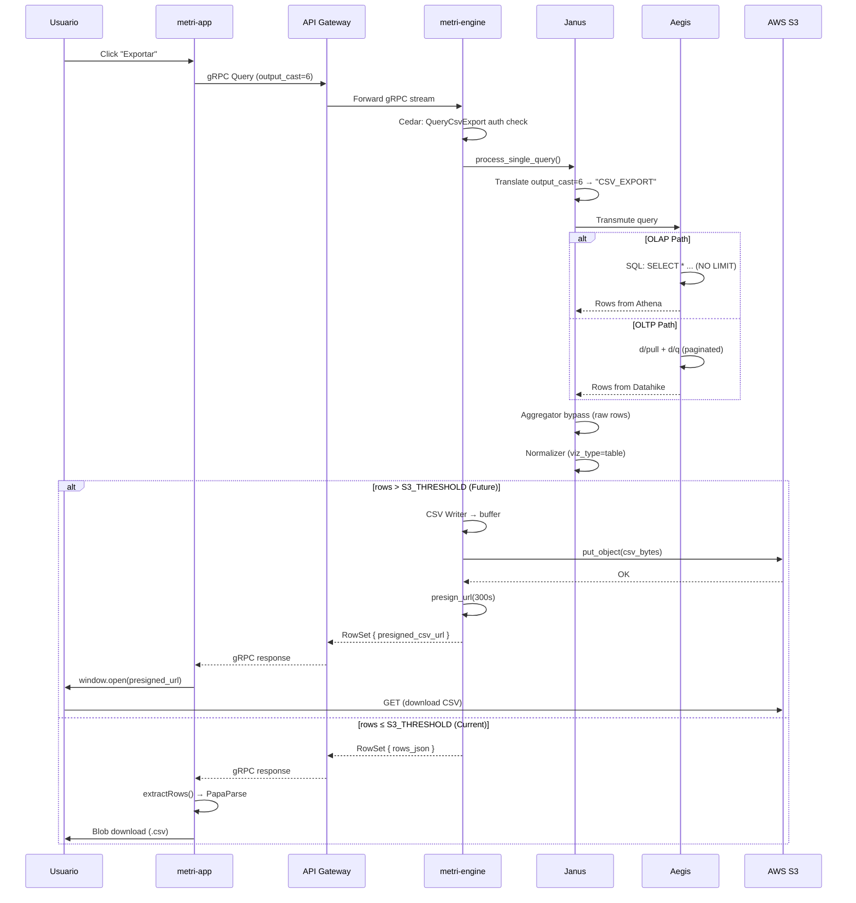

# Fase 13 — Integración Exportación CSV (metri-engine ↔ metri-app)

| Componentes involucrados | `metri-engine` (Rust gRPC), `metri-app` (Vue 3 Frontend) |
|:-------------------------|:---------------------------------------------------------|
| Patrón arquitectónico | `OutputCastType.CSV_EXPORT` → Dual Payload Strategy (`RowsJson` / `presigned_csv_url`) |
| Estado | ✅ Contrato Proto definido · ✅ Pipeline Query preparado · ⚠️ S3 Presigned pendiente · ✅ Frontend conectado |

---

## 1 · Definición del Problema

El motor analítico de Metri necesita soportar la exportación masiva de datos a CSV para cualquier entidad del sistema. Existen dos escenarios con restricciones técnicas distintas:

| Escenario | Volumen | Restricción |
|:----------|:--------|:------------|
| **Tabla estándar** (< 10K filas) | Pequeño | Cabe en un gRPC stream normal |
| **Exportación masiva** (> 10K filas) | Enorme | AWS API Gateway: **10 MB body**, **29s timeout** |

La estrategia `presigned_csv_url` en el proto `RowSet` fue diseñada explícitamente para evadir los límites de API Gateway, forzando al engine a volcar el CSV/Parquet directamente a S3 y devolver una URL presignada de corta duración.

---

## 2 · Contrato Proto Existente

### 2.1 · `OutputCastType` Enum

Define el tipo semántico de salida de cada query. `CSV_EXPORT = 6` indica al pipeline que la respuesta es una exportación de datos completa.

```protobuf
// metri.proto:508-516
enum OutputCastType {
  OUTPUT_CAST_UNSPECIFIED = 0;
  KPI = 1;
  TIMESERIES = 2;
  TABLE = 3;
  PIE = 4;
  BUBBLE = 5;
  CSV_EXPORT = 6;          // ← Contrato de exportación masiva
}
```

Reflejado en:
- **FlatBuffers IR**: [janus_ir_ast.fbs:44-52](file:///Users/macuser/projects/metri/metri-engine/src/janus/janus_ir_ast.fbs#L44-L52) — `CSV_EXPORT = 6`
- **Rust generado**: [gen/metri.rs:1605-1643](file:///Users/macuser/projects/metri/metri-engine/src/grpc/gen/metri.rs#L1605) — `CsvExport = 6`

### 2.2 · `RowSet` con `presigned_csv_url`

```protobuf
// metri.proto:625-641
message RowSet {
  repeated ColumnSchema columns = 1;
  
  oneof payload_strategy {
    DataRowList rows_json = 2;        // Standard: JSON rows pequeñas
    bytes arrow_binary_blob = 3;      // High-performance: Arrow/Parquet WASM
    string presigned_csv_url = 4;     // Massive Scale: S3 Presigned URL
  }
}
```

> **Diseño**: La exclusividad mutua (`oneof`) garantiza que una respuesta transporta **exactamente un** payload. El frontend discrimina por `payloadStrategy` para decidir cómo consumir los datos.

### 2.3 · `QueryResponse` con `links` HATEOAS

```protobuf
// metri.proto:683-699
message QueryResponse {
  Status status = 1;
  RowSet data = 2;
  VizMeta viz_ext = 4;
  map<string, QueryResponse> batch_results = 5;
  QueryMetadata metadata = 6;
  Pagination pagination = 7;
  repeated Link links = 8;            // ← HATEOAS download link
}
```

```protobuf
// metri.proto:57-61
message Link {
  string rel = 1;       // "download", "self", "next"
  string href = 2;      // Presigned S3 URL
  string method = 3;    // "GET"
}
```

> El campo `links` puede transportar un `Link { rel: "download", href: "https://s3...presigned", method: "GET" }` como alternativa HATEOAS al `presigned_csv_url` dentro del `RowSet`.

### 2.4 · `AnalyticsRequest.output_cast`

```protobuf
// metri.proto:541-543
OutputCastType output_cast = 17;     // Set by frontend via .asExport()
```

### 2.5 · Cedar `QueryCsvExport` Action

```json
// authorizer.rs:921-933
{
  "uid": { "type": "Metri::Action", "id": "QueryCsvExport" },
  "attrs": {},
  "parents": [
    { "type": "Metri::Action", "id": "ActionGroup::\"analytical\"" }
  ]
}
```

> La exportación CSV es una acción del grupo `analytical` en la jerarquía Cedar. Los usuarios necesitan permisos de lectura analítica para exportar datos.

---

## 3 · Pipeline de Ejecución CSV_EXPORT en el Engine

El `OutputCastType.CSV_EXPORT = 6` ya fluye correctamente a través de todo el pipeline de query. A continuación se documenta cada touchpoint con código exacto:

### 3.1 · Flujo Completo

```
Frontend                    Engine
───────                    ──────
MetriQuery('asset')
  .asExport()              →  output_cast = 6 (CSV_EXPORT)
  .execute('export_csv')
        │
        ▼
   gRPC Query RPC          ──→ service.rs:659
        │
        ▼
   translator.rs:96        ──→ output_cast: fbs::OutputCastType(6)
        │
        ▼
   Cedar Authorization     ──→ QueryCsvExport action check
        │
        ▼
   ┌────┴────────┐
   │  OLTP Path  │         ──→ router/oltp.rs:133 → "CSV_EXPORT"
   │  OLAP Path  │         ──→ router/olap.rs:213 → "CSV_EXPORT"
   └────┬────────┘
        │
        ▼
   Aegis Transmutation
   ├── OLTP executor.rs:344  → !is_analytical (treated as TABLE)
   │   executor.rs:575       → Pre-sliced pagination
   │   executor.rs:745       → Offset/limit rows
   │   caster.rs:199         → Default TABLE/CSV arm
   │
   └── OLAP compiler.rs:227  → LIMIT = None (NO LIMIT!)
       query_builder.rs:448  → SELECT * (all columns)
       query_builder.rs:942  → LIMIT = None (confirmed)
        │
        ▼
   aggregator.rs:131       ──→ "TABLE" | "CSV_EXPORT" => rows (NO aggregation)
        │
        ▼
   normalizer.rs:52        ──→ "CSV_EXPORT" => viz_type = "table"
        │
        ▼
   map_chunk_to_response   ──→ service.rs:1891 → ⚠️ SIEMPRE usa RowsJson
                               (presigned_csv_url NO conectado)
```

### 3.2 · Touchpoints Detallados

#### A · Entrada gRPC → Traducción FBS

El traductor copia el `output_cast` i32 directamente desde el proto al IR FlatBuffers:

```rust
// translator.rs:96
output_cast: fbs::OutputCastType(query.output_cast),  // 6 para CSV_EXPORT
```

#### B · Router OLTP y OLAP — Conversión a String

Ambos routers convierten el integer a string canónico para el downstream JSON IR:

```rust
// router/oltp.rs:127-134   |   router/olap.rs:207-214
let output_cast_str = match output_cast_i {
    1 => "KPI",
    2 => "TIMESERIES",
    3 => "TABLE",
    4 => "PIE",
    5 => "BUBBLE",
    6 => "CSV_EXPORT",
    _ => "TABLE",
};
```

#### C · Aegis OLTP — Tratado como TABLE

CSV_EXPORT NO es analítico. Se pagina y extrae como TABLE:

```rust
// executor.rs:342-344
let is_analytical = matches!(output_cast, 1 | 2 | 4 | 5)
    || (ast_ir.metrics... && output_cast != 3 && output_cast != 6);
    //                                                    ↑ CSV_EXPORT excluido

// executor.rs:575 — Pre-slicing como TABLE
if !is_analytical && !needs_large_scan
    && (output_cast == 3 || output_cast == 0 || output_cast == 6) { ... }

// executor.rs:745 — Offset/limit como TABLE
let rows = if output_cast == 3 || output_cast == 6 || output_cast == 0 {
    matching_rows.skip(offset).take(page_limit)
} ...
```

#### D · Aegis OLAP SQL — Dump Completo sin LIMIT

Para OLAP/Athena, CSV_EXPORT genera un `SELECT *` sin límite — diseñado para dumps completos:

```rust
// compiler.rs:226-227
let limit = match output_cast {
    "CSV_EXPORT" => None,       // ← SIN LÍMITE — dump total
    "TABLE"      => Some(10000),
    _            => Some(lim),
};

// query_builder.rs:447-449
"CSV_EXPORT" => {
    select_exprs.push(("*".to_string(), None));  // ← TODAS las columnas
}

// query_builder.rs:941-942 (confirmado en build_hierarchy_query)
let limit = match output_cast {
    "CSV_EXPORT" => None,
    ...
};
```

#### E · Janus Aggregator — Bypass Directo

Las rows de CSV_EXPORT pasan directamente sin agregación:

```rust
// aggregator.rs:129-131
match output_cast {
    "TABLE" | "CSV_EXPORT" => rows,  // ← NO se agrega, rows directas
    "KPI" => { ... },
    "TIMESERIES" => { ... },
    ...
}
```

#### F · Normalizer — Viz Type = "table"

CSV_EXPORT se normaliza a viz type "table" para metadata:

```rust
// normalizer/helpers.rs:52
Some("CSV_EXPORT") => "table",
```

#### G · `map_chunk_to_response` — ⚠️ GAP: Siempre usa RowsJson

**Este es el GAP principal.** La función de ensamblaje final SIEMPRE usa `RowsJson`, independientemente del `output_cast`:

```rust
// service.rs:1891-1893
let payload_strategy = Some(
    row_set::PayloadStrategy::RowsJson(
        DataRowList { iter: pb_rows }       // ← SIEMPRE RowsJson
    )
);
```

**Nunca** se usa `PayloadStrategy::PresignedCsvUrl(url)`, a pesar de que el tipo generado Rust lo soporta:

```rust
// gen/metri.rs:908
pub enum PayloadStrategy {
    RowsJson(DataRowList),        // tag = 2
    ArrowBinaryBlob(Vec<u8>),     // tag = 3
    PresignedCsvUrl(String),      // tag = 4  ← NUNCA USADO
}
```

---

## 4 · Infraestructura AWS S3

### 4.1 · Dependencia en el Engine
```toml
# Cargo.toml:18
aws-sdk-s3 = "1"
```
> `aws-sdk-s3` está declarada como dependencia pero **no se usa en ningún archivo .rs** actualmente. Está lista para ser importada cuando se implemente el dump a S3.

### 4.2 · Infraestructura del Bucket en AWS SAM (`template.yaml`)
Para implementar la **Estrategia 2 (Server-Side S3 Presigned URL)**, debemos definir un bucket de S3 específico para exportaciones temporales. Se recomienda un bucket separado en lugar del data lake primario para poder aplicar políticas de ciclo de vida estrictas y aislar los permisos de descargas públicas temporales.

Agregamos el recurso `MetriCsvExportBucket` en la sección `Resources` de `metri-engine/template.yaml`:

```yaml
  # ── Bucket de Exportaciones CSV Temporales ──
  MetriCsvExportBucket:
    Type: AWS::S3::Bucket
    DeletionPolicy: Retain
    UpdateReplacePolicy: Retain
    Properties:
      # Naming estándar del tenant
      BucketName: !Sub "metri-csv-exports-${AWS::AccountId}-${AWS::Region}"
      
      # Bloqueo total de acceso público directo (los clientes acceden vía Presigned URLs firmadas por el Engine)
      PublicAccessBlockConfiguration:
        BlockPublicAcls: true
        BlockPublicPolicy: true
        IgnorePublicAcls: true
        RestrictPublicBuckets: true
      
      # Encriptación en reposo con la clave KMS administrada por el cliente (CMK)
      BucketEncryption:
        ServerSideEncryptionConfiguration:
          - ServerSideEncryptionByDefault:
              SSEAlgorithm: aws:kms
              KMSMasterKeyID: !Ref MetriKmsMasterKey
      
      # Ciclo de Vida: Eliminación automática de exportaciones antiguas para mitigar costos y fugas de datos
      LifecycleConfiguration:
        Rules:
          - Id: AutoDeleteExportsAfter24Hours
            Status: Enabled
            ExpirationInDays: 1 # Las URL presignadas expiran en 5 mins; el archivo físico se elimina en 24h
            
      # Configuración de CORS para permitir la descarga directa desde el navegador (metri-app)
      CorsConfiguration:
        CorsRules:
          - AllowedHeaders:
              - "*"
            AllowedMethods:
              - GET
            AllowedOrigins:
              - "*" # En producción se restringe al dominio específico de metri-app (e.g., https://app.metri.one)
            MaxAge: 3000
```

### 4.3 · Configuración de la Función Lambda (`MetriEngineFunction`)
Debemos inyectar el nombre del bucket de exportación como variable de entorno y otorgar los permisos CRUD correspondientes.

#### A · Variables de Entorno
Añadimos `AWS_S3_EXPORT_BUCKET` bajo `MetriEngineFunction.Properties.Environment.Variables`:

```yaml
          # ── Storage ──
          EAV_TABLE_NAME: !Ref EavTableName
          CEDAR_POLICIES_TABLE: !Ref MetriSchemasTable
          AWS_S3_LAKE_BUCKET: !Ref MetriDataLakeBucket
          AWS_S3_EXPORT_BUCKET: !Ref MetriCsvExportBucket # ← NUEVO
          ATHENA_WORKGROUP: !Ref AthenaWorkGroup
```

#### B · Políticas de IAM (Least Privilege)
Agregamos la política `S3CrudPolicy` para el nuevo bucket bajo `MetriEngineFunction.Properties.Policies`:

```yaml
      Policies:
        - S3CrudPolicy:
            BucketName: !Ref MetriDataLakeBucket
        - S3CrudPolicy:
            BucketName: !Ref MetriCsvExportBucket # ← NUEVO
        - DynamoDBCrudPolicy:
            TableName: !Ref MetriSchemasTable
```

---

## 5 · Estado Actual: Dual-Strategy

### ✅ Lo que funciona HOY (Strategy 1: Client-Side CSV)

1. Frontend envía `output_cast = CSV_EXPORT`
2. Engine retorna **todas las filas** vía `RowsJson` sin límite (OLAP) o con paginación (OLTP)
3. Frontend extrae rows → PapaParse `unparse()` → descarga `.csv`

```
Frontend                       Engine
────────                       ──────
MetriQuery.asExport()    →    output_cast = 6
                               ↓
                         Aegis: SELECT *, no LIMIT
                               ↓
                         RowsJson { rows: [all_data] }
                               ↓
                    ←    gRPC stream response
extractRows(response)
Papa.unparse(rows)
Blob download
```

### ⚠️ Lo que falta (Strategy 2: Server-Side S3 Presigned URL)

Para datasets masivos (> 10MB / > 100K filas), el pipeline OLAP debe:

1. **Detectar** que `output_cast = CSV_EXPORT` en `map_chunk_to_response`
2. **Generar CSV** en memoria o stream desde los rows procesados
3. **Upload a S3** usando `aws-sdk-s3` (ya en Cargo.toml)
4. **Generar Presigned URL** con TTL corto (e.g., 5 minutos)
5. **Devolver** `PayloadStrategy::PresignedCsvUrl(url)` en vez de `RowsJson`

```
Frontend                       Engine                          AWS S3
────────                       ──────                          ──────
MetriQuery.asExport()    →    output_cast = 6
                               ↓
                         Aegis: SELECT *, no LIMIT
                               ↓
                         csv::Writer → buffer
                               ↓
                         put_object(bucket, key, csv)  →  S3 bucket
                               ↓
                         presigned_url(key, 300s)      ←  Presigned URL
                               ↓
                         PresignedCsvUrl(url)
                               ↓
                    ←    gRPC stream response
                               ↓
window.open(url)                                       →  S3 download
```

---

## 6 · Implementación Propuesta del Engine (Strategy 2)

### 6.1 · Módulo `src/export/csv_exporter.rs` [NEW]

```rust
use aws_sdk_s3::Client as S3Client;
use aws_sdk_s3::presigning::PresigningConfig;
use std::time::Duration;

pub struct CsvExporter {
    s3_client: S3Client,
    bucket: String,
}

impl CsvExporter {
    /// Genera CSV, sube a S3, devuelve presigned URL.
    pub async fn export_to_s3(
        &self,
        tenant_id: &str,
        query_key: &str,
        columns: &[ColumnSchema],
        rows: &[serde_json::Value],
    ) -> Result<String, Box<dyn std::error::Error>> {
        // 1. Generar CSV en buffer
        let mut wtr = csv::Writer::from_writer(vec![]);
        // Header
        let headers: Vec<&str> = columns.iter().map(|c| c.key.as_str()).collect();
        wtr.write_record(&headers)?;
        // Data rows
        for row in rows {
            let record: Vec<String> = headers.iter()
                .map(|h| row.get(h).map(|v| v.to_string()).unwrap_or_default())
                .collect();
            wtr.write_record(&record)?;
        }
        let csv_bytes = wtr.into_inner()?;

        // 2. Upload a S3
        let key = format!(
            "exports/{}/{}/{}_{}.csv",
            tenant_id, query_key,
            chrono::Utc::now().format("%Y%m%d_%H%M%S"),
            ulid::Ulid::new()
        );
        self.s3_client.put_object()
            .bucket(&self.bucket)
            .key(&key)
            .body(csv_bytes.into())
            .content_type("text/csv")
            .send()
            .await?;

        // 3. Presigned URL (5 minutos)
        let presigning = PresigningConfig::builder()
            .expires_in(Duration::from_secs(300))
            .build()?;
        let url = self.s3_client.get_object()
            .bucket(&self.bucket)
            .key(&key)
            .presigned(presigning)
            .await?
            .uri()
            .to_string();

        Ok(url)
    }
}
```

### 6.2 · Modificación de `map_chunk_to_response` [MODIFY]

```diff
// service.rs:1879-1933
fn map_chunk_to_response(
    chunk: QueryChunk,
    is_system_bff: bool,
+   csv_exporter: Option<&CsvExporter>,    // Inject S3 exporter
) -> QueryResponse {
    let (pb_columns, col_keys) = map_columns(...);
    let pb_rows = map_data_rows(...);

+   // Detectar CSV_EXPORT y rows > threshold
+   let output_cast = chunk.body.get("output_cast")
+       .and_then(|v| v.as_str());
+   
+   let payload_strategy = if output_cast == Some("CSV_EXPORT")
+       && pb_rows.len() > CSV_EXPORT_S3_THRESHOLD
+       && csv_exporter.is_some()
+   {
+       // Server-side S3 dump
+       let url = csv_exporter.unwrap()
+           .export_to_s3(tenant_id, query_key, &columns, &rows)
+           .await?;
+       Some(PayloadStrategy::PresignedCsvUrl(url))
+   } else {
        Some(PayloadStrategy::RowsJson(DataRowList { iter: pb_rows }))
+   };
    ...
}
```

### 6.3 · Constante de Threshold

```rust
/// Filas por encima de este umbral activan el S3 dump en lugar de RowsJson
const CSV_EXPORT_S3_THRESHOLD: usize = 5_000;
```

> Para datasets pequeños (< 5K filas), se mantiene `RowsJson` para evitar la latencia del S3 upload. El frontend maneja ambos casos transparentemente.

---

## 7 · Integración Frontend (Ya Implementada)

### 7.1 · Builder — `MetriQueryBuilder.asExport()`

```typescript
// metri.builder.ts:565-567
asExport(): this {
    this.params._outputCast = OutputCastType.CSV_EXPORT;
    return this;
}
```

### 7.2 · Interpreter — `output: 'export'`

```typescript
// MetriInterpreter.ts:339-342
case 'export': {
    builder.asExport();
    break;
}
```

### 7.3 · Response Types — Discriminated Union

```typescript
// response.types.ts:181-196
export type MetriRowSet =
  | { columns: MetriColumnSchema[]; payloadStrategy: 'rowsJson'; rows: MetriDataRow[] }
  | { columns: MetriColumnSchema[]; payloadStrategy: 'arrowBinaryBlob'; blobBytes: Uint8Array }
  | { columns: MetriColumnSchema[]; payloadStrategy: 'presignedCsvUrl'; downloadUrl: string }
```

### 7.4 · Composable — `useCsvExport`

```typescript
// composables/useCsvExport.ts — Dual-strategy handler
async function triggerExport() {
  const response = await MetriQuery(entity).asExport().execute('export_csv')
  const rowSet = response.data

  if (rowSet?.payloadStrategy === 'presignedCsvUrl') {
    window.open(rowSet.downloadUrl, '_blank')     // Strategy 2: S3
  } else {
    const rows = extractRows(response)
    const csv = Papa.unparse(rows)
    downloadBlob(csv, `${entity}_export.csv`)     // Strategy 1: Client-side
  }
}
```

### 7.5 · UI — Botón "Exportar" en Toolbar

El botón ya existe en `MetriDashboardToolbar.vue` y está conectado a través de la cadena de eventos:

```
MetriDashboardToolbar          MetriEntityDashboard        AssetDashboardView
─────────────────────          ────────────────────        ────────────────────
@click="$emit('click-export')" → @click-export="$emit()"  → @click-export="triggerExport"
:disabled="exportLoading"      → :export-loading="..."    → :export-loading="isExporting"
```

---

## 8 · Mapa de Archivos del Engine (CSV_EXPORT Touchpoints)

| Capa | Archivo | Línea(s) | Rol |
|:-----|:--------|:---------|:----|
| **Proto** | [metri.proto](file:///Users/macuser/projects/metri/metri-engine/proto/metri.proto#L508) | 508-516 | `OutputCastType::CSV_EXPORT = 6` |
| **Proto** | [metri.proto](file:///Users/macuser/projects/metri/metri-engine/proto/metri.proto#L625) | 625-641 | `RowSet.presigned_csv_url` oneof |
| **Proto** | [metri.proto](file:///Users/macuser/projects/metri/metri-engine/proto/metri.proto#L683) | 683-699 | `QueryResponse.links` HATEOAS |
| **FBS** | [janus_ir_ast.fbs](file:///Users/macuser/projects/metri/metri-engine/src/janus/janus_ir_ast.fbs#L44) | 44-52 | `CSV_EXPORT = 6` en IR |
| **FBS** | [janus_ir_ast.fbs](file:///Users/macuser/projects/metri/metri-engine/src/janus/janus_ir_ast.fbs#L473) | 473-482 | `RowSet.presigned_csv_url` en IR |
| **Rust Gen** | gen/metri.rs | 1605 | `CsvExport = 6` |
| **Rust Gen** | gen/metri.rs | 908 | `PayloadStrategy::PresignedCsvUrl` |
| **gRPC** | [translator.rs](file:///Users/macuser/projects/metri/metri-engine/src/grpc/translator.rs#L96) | 96 | `output_cast: fbs::OutputCastType(6)` |
| **gRPC** | [service.rs](file:///Users/macuser/projects/metri/metri-engine/src/grpc/service.rs#L659) | 659 | `query()` RPC handler entry |
| **gRPC** | [service.rs](file:///Users/macuser/projects/metri/metri-engine/src/grpc/service.rs#L1879) | 1879-1933 | `map_chunk_to_response` — ⚠️ GAP |
| **Cedar** | [authorizer.rs](file:///Users/macuser/projects/metri/metri-engine/src/cedar/authorizer.rs#L921) | 921-933 | `QueryCsvExport` Cedar action |
| **Janus** | [router/oltp.rs](file:///Users/macuser/projects/metri/metri-engine/src/janus/router/oltp.rs#L127) | 127-134 | `6 => "CSV_EXPORT"` mapping |
| **Janus** | [router/olap.rs](file:///Users/macuser/projects/metri/metri-engine/src/janus/router/olap.rs#L207) | 207-214 | `6 => "CSV_EXPORT"` mapping |
| **Janus** | [aggregator.rs](file:///Users/macuser/projects/metri/metri-engine/src/janus/aggregator.rs#L129) | 129-131 | Bypass: rows directas |
| **Janus** | [normalizer/helpers.rs](file:///Users/macuser/projects/metri/metri-engine/src/janus/normalizer/helpers.rs#L52) | 52 | `"CSV_EXPORT" => "table"` |
| **Aegis** | [oltp/executor.rs](file:///Users/macuser/projects/metri/metri-engine/src/aegis/oltp/executor.rs#L342) | 342-344 | `!is_analytical` classification |
| **Aegis** | [oltp/executor.rs](file:///Users/macuser/projects/metri/metri-engine/src/aegis/oltp/executor.rs#L575) | 575 | Pre-sliced pagination |
| **Aegis** | [oltp/executor.rs](file:///Users/macuser/projects/metri/metri-engine/src/aegis/oltp/executor.rs#L745) | 745 | Offset/limit rows |
| **Aegis** | [oltp/caster.rs](file:///Users/macuser/projects/metri/metri-engine/src/aegis/oltp/caster.rs#L199) | 199 | Default TABLE/CSV arm |
| **Aegis** | [sql/compiler.rs](file:///Users/macuser/projects/metri/metri-engine/src/aegis/sql/compiler.rs#L226) | 226-227 | `LIMIT = None` |
| **Aegis** | [sql/query_builder.rs](file:///Users/macuser/projects/metri/metri-engine/src/aegis/sql/query_builder.rs#L447) | 447-449 | `SELECT *` |
| **Aegis** | [sql/query_builder.rs](file:///Users/macuser/projects/metri/metri-engine/src/aegis/sql/query_builder.rs#L941) | 941-942 | `LIMIT = None` (hierarchy) |

---

## 9 · Mapa de Archivos del Frontend (Ya Implementados)

| Archivo | Estado | Cambio |
|:--------|:------:|:-------|
| [useCsvExport.ts](file:///Users/macuser/projects/metri/metri-app/src/composables/useCsvExport.ts) | ✅ NEW | Composable dual-strategy |
| [MetriDashboardToolbar.vue](file:///Users/macuser/projects/metri/metri-app/src/components/dashboard/MetriDashboardToolbar.vue) | ✅ MOD | `exportLoading` prop, spinner, disabled state |
| [MetriEntityDashboard.vue](file:///Users/macuser/projects/metri/metri-app/src/components/dashboard/MetriEntityDashboard.vue) | ✅ MOD | Propaga `click-export` + `exportLoading` |
| [AssetDashboardView.vue](file:///Users/macuser/projects/metri/metri-app/src/views/AssetDashboardView.vue) | ✅ MOD | Conecta `useCsvExport` al dashboard |

---

## 10 · Diagrama de Secuencia End-to-End



---

## 11 · Seguridad

| Control | Implementación |
|:--------|:---------------|
| **Autorización** | Cedar action `QueryCsvExport` ∈ `ActionGroup::analytical` |
| **Tenant Isolation** | `check_tenant_isolation()` en service.rs antes de routing |
| **ABAC Boundaries** | Janus inyecta `location_boundaries` y `ownership` filters |
| **Presigned URL TTL** | 5 minutos (configurable) |
| **S3 Path Segregation** | `exports/{tenant_id}/{query_key}/` — aislamiento por tenant |
| **BOM UTF-8** | Frontend añade `\uFEFF` prefix para compatibilidad Excel |

---

## 12 · Observabilidad

| Señal | Detalle |
|:------|:--------|
| `tracing::info!` | `[Aegis] CSV_EXPORT query for tenant: {}` |
| `tracing::debug!` | Row count, elapsed_ms, S3 key (cuando aplique) |
| CloudWatch Metrics | `csv_export_count`, `csv_export_rows`, `csv_export_s3_uploads` |
| Error tracking | `fault_notifier` emite `DomainError` si la exportación falla |

---

## 13 · Restricciones y Límites

| Restricción | Valor | Razón |
|:------------|:------|:------|
| Max rows client-side | 10,000 | Memory budget del navegador |
| Max rows S3 dump | Sin límite | El límite es el dataset en Athena/Datahike |
| S3 threshold | 5,000 rows | Balance latencia vs tamaño |
| Presigned URL TTL | 300s (5 min) | Seguridad: minimizar ventana de exposición |
| CSV encoding | UTF-8 + BOM | Compatibilidad Excel universal |

---

## 14 · Extensiones Futuras

1. **Formatos adicionales**: `arrow_binary_blob` para Parquet/Arrow directo a S3
2. **Exportación programada**: Combinación con Metri Schedulers para exports periódicos
3. **Notificaciones**: Integración con Metri Notifications para exportaciones de larga duración
4. **Plantillas de columnas**: Permitir al usuario seleccionar qué columnas exportar
5. **Filtros de exportación**: UI para aplicar filtros específicos antes de exportar

---

## 15 · Cross-References

| Documento | Relevancia |
|:----------|:-----------|
| [05_FASE_CONSULTA.md](05_FASE_CONSULTA.md) | Query phase overview, Arrow Blob Bypass |
| [05.01-JANUS.md](05.01-JANUS.md) | AST IR compilation pipeline |
| [05.03-AEGIS.md](05.03-AEGIS.md) | OLTP/OLAP execution |
| [06_FASE_CEDAR_AUTHORIZER.md](06_FASE_CEDAR_AUTHORIZER.md) | Cedar ABAC authorization hierarchy |
| [12_FASE_BULK_CSV_UPLOAD_INTEGRATION.md](12_FASE_BULK_CSV_UPLOAD_INTEGRATION.md) | Bulk CSV upload (ingress counterpart) |
