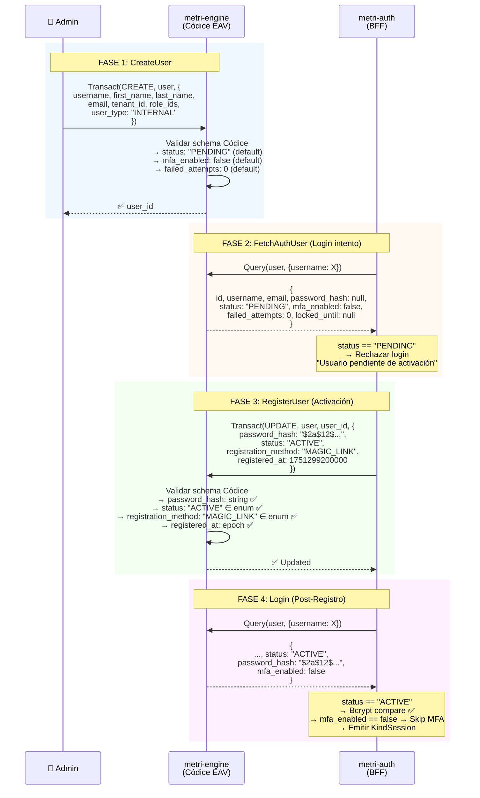
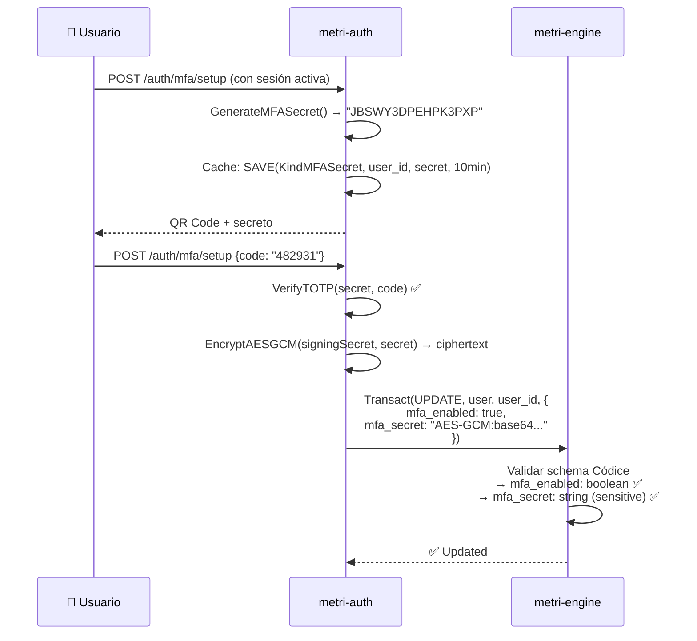
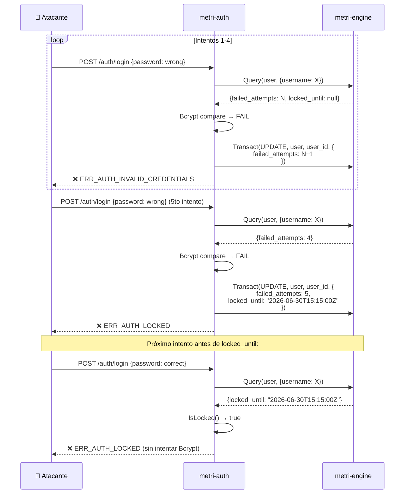

# Fase 14.1 — Integración metri-auth × metri-engine: Cambios Requeridos en el Modelo User

> **Componentes**: `metri-engine` (Códice Schema) + `metri-auth` (Gateway Client)  
> **Versión**: 1.0.0  
> **Fecha**: 2026-06-30  
> **Prerequisito**: [14_FASE_AUTH_FLOWS.md](14_FASE_AUTH_FLOWS.md)  
> **Estado**: Diseño de referencia  

---

## Tabla de Contenidos

1. [Análisis de Brechas](#1-análisis-de-brechas)
2. [Cambios Requeridos en user.json](#2-cambios-requeridos-en-userjson)
3. [Modelo user.json Propuesto (Completo)](#3-modelo-userjson-propuesto-completo)
4. [Diff de Cambios](#4-diff-de-cambios)
5. [Cambios en el Gateway Client (metri-auth)](#5-cambios-en-el-gateway-client-metri-auth)
6. [Cambios en el Domain Model (metri-auth)](#6-cambios-en-el-domain-model-metri-auth)
7. [Impacto en el Schema Contract Test](#7-impacto-en-el-schema-contract-test)
8. [Impacto en Bootstrap/Seed](#8-impacto-en-bootstrapseed)
9. [Flujo de Datos End-to-End](#9-flujo-de-datos-end-to-end)
10. [Reglas de Eventos Propuestas](#10-reglas-de-eventos-propuestas)
11. [Matriz de Compatibilidad](#11-matriz-de-compatibilidad)

---

## 1. Análisis de Brechas

### Situación Actual

El modelo `user.json` en metri-engine define la estructura de datos del usuario como fuente de verdad (Códice). Sin embargo, **existen campos que `metri-auth` lee y escribe mediante gRPC que no están declarados en el schema Códice**, lo que genera una dependencia implícita sin validación estructural.

### Mapeo Actual: AuthUser (Go) ↔ user.json (Códice)

| Campo Go (`AuthUser`) | JSON Tag | ¿Existe en `user.json`? | Estado |
|---|---|---|---|
| `ID` | `id` | ✅ Implícito (EAV PK) | OK |
| `Username` | `username` | ✅ Línea 9 | OK |
| `Email` | `email` | ✅ Línea 24 | ⚠️ `required: true` bloquea flujos sin email |
| `Password` | `password_hash` | ✅ Línea 18 | OK |
| `Tenant` / `TenantIDRaw` | `tenant` / `tenant_id` | ✅ Línea 72 | OK |
| `FailedAttempts` | `failed_attempts` | ❌ **NO EXISTE** | 🔴 CRÍTICO |
| `LockedUntil` | `locked_until` | ❌ **NO EXISTE** | 🔴 CRÍTICO |
| `MFAEnabled` | `mfa_enabled` | ❌ **NO EXISTE** | 🔴 CRÍTICO |
| `MFASecret` | `mfa_secret` | ❌ **NO EXISTE** | 🔴 CRÍTICO |
| `Status` | `status` | ✅ Línea 45 | ⚠️ Falta `PENDING` |
| `Roles` | `role_ids` | ✅ Línea 56 | OK |

### Campos Nuevos Requeridos por Flujos de Autenticación

| Campo Nuevo | Flujo(s) que lo Necesitan | Operación |
|---|---|---|
| `mfa_enabled` | MFA Setup/Challenge | Read + Write |
| `mfa_secret` | MFA Setup/Challenge | Read + Write |
| `failed_attempts` | Login (lockout) | Read + Write |
| `locked_until` | Login (lockout) | Read + Write |
| `registration_method` | Registro (Magic Link / QR / Código) | Write (una vez) |
| `registered_at` | Registro (todos los flujos) | Write (una vez) |

### Constraint Blockers

| Constraint Actual | Problema | Flujos Afectados |
|---|---|---|
| `email: required: true` | Bloquea creación de usuarios sin email | 1B (QR), 1C (Código Verificación) |
| `email: unique: "identity"` | Requiere valor único — sin email no puede ser null | 1B (QR), 1C (Código Verificación) |
| `status: options: [ACTIVE, INACTIVE, SUSPENDED]` | Falta `PENDING` para usuarios recién creados esperando activación | Todos los flujos de registro |

---

## 2. Cambios Requeridos en user.json

### 2.1 Modificar Atributos Existentes

#### A. `email` — Relajar la restricción `required`

```diff
 {
   "name": "email",
   "type": "string",
   "unique": "identity",
-  "required": true,
+  "required": false,
   "fts": true,
   "is_dimension": true,
-  "pattern": "^[^@\\s]+@[^@\\s]+\\.[^@\\s]+$"
+  "pattern": "^[^@\\s]+@[^@\\s]+\\.[^@\\s]+$",
+  "doc": "Email address for Magic Link registration and notifications. Optional for QR/code-based registration flows."
 }
```

> [!WARNING]
> Al hacer `email` opcional, se elimina la restricción `unique: "identity"` para valores `null`. El motor EAV de metri-engine **NO indexa valores null**, por lo que múltiples usuarios sin email no colisionarán. Pero cualquier usuario **con** email conservará la unicidad.

#### B. `status` — Agregar opción `PENDING`

```diff
 {
   "name": "status",
   "type": "enum",
   "options": [
+    "PENDING",
     "ACTIVE",
     "INACTIVE",
     "SUSPENDED"
   ],
-  "default_value": "ACTIVE",
+  "default_value": "PENDING",
   "is_dimension": true,
+  "doc": "User lifecycle status. PENDING = awaiting credential setup, ACTIVE = fully registered, INACTIVE = disabled by admin, SUSPENDED = security lockout."
 }
```

> [!IMPORTANT]
> Cambiar el `default_value` de `ACTIVE` a `PENDING` alinea el modelo con el flujo de registro en dos fases: el admin crea al usuario (`PENDING`), luego el usuario activa sus credenciales (`ACTIVE`). Los usuarios existentes **no se ven afectados** — ya tienen `status: "ACTIVE"` persistido en DynamoDB.

---

### 2.2 Agregar Atributos Nuevos (Auth-Specific)

#### A. `failed_attempts` — Contador de intentos fallidos

```json
{
  "name": "failed_attempts",
  "type": "number",
  "is_system": true,
  "default_value": 0,
  "doc": "Counter for consecutive failed login attempts. Used by metri-auth for account lockout policy (5 attempts → 15min lockout). Reset to 0 on successful login."
}
```

**Justificación**: Persiste en el EAV de metri-engine (no en cache) para que el lockout sobreviva a reinicios de metri-auth. Leído en cada `FetchAuthUser`, escrito por `UpdateUser` en cada login fallido/exitoso.

Referencia en código: [auth_usecase.go#L82-L98](file:///Users/macuser/projects/metri/metri-auth/internal/app/usecase/auth_usecase.go#L82-L98) y [client.go#L856-L866](file:///Users/macuser/projects/metri/metri-auth/internal/interfaces/gateways/metridata/client.go#L856-L866)

---

#### B. `locked_until` — Timestamp de desbloqueo

```json
{
  "name": "locked_until",
  "type": "string",
  "is_system": true,
  "doc": "RFC3339 timestamp indicating when the account lockout expires. Null means account is not locked. Set by metri-auth when failed_attempts >= 5."
}
```

**Justificación**: Almacenado como `string` (RFC3339) porque el modelo EAV no tiene un tipo `datetime` nativo — usa `epoch` para instants, pero el lockout necesita ser human-readable y parseable por Go `time.Parse(time.RFC3339)`.

Referencia en código: [client.go#L791-L797](file:///Users/macuser/projects/metri/metri-auth/internal/interfaces/gateways/metridata/client.go#L791-L797)

---

#### C. `mfa_enabled` — Flag de MFA activo

```json
{
  "name": "mfa_enabled",
  "type": "boolean",
  "is_system": true,
  "default_value": false,
  "doc": "Whether TOTP MFA is active for this user. When true, login requires a second factor challenge after password verification."
}
```

**Justificación**: Leído en cada `Login()` para decidir si interceptar con el MFA challenge. Escrito por `EnableMFA()` / `DisableMFA()`.

Referencia en código: [auth_usecase.go#L104](file:///Users/macuser/projects/metri/metri-auth/internal/app/usecase/auth_usecase.go#L104) y [mfa_usecase.go#L69-L71](file:///Users/macuser/projects/metri/metri-auth/internal/app/usecase/mfa_usecase.go#L69-L71)

---

#### D. `mfa_secret` — Secreto TOTP cifrado

```json
{
  "name": "mfa_secret",
  "type": "string",
  "is_system": true,
  "sensitive": true,
  "doc": "AES-256-GCM encrypted TOTP secret (Base32). Encrypted with TOKEN_SIGNING_SECRET. Used for MFA challenge verification. Null when MFA is disabled."
}
```

**Justificación**: El secreto TOTP se persiste **cifrado** con AES-GCM en el EAV. Marcado como `sensitive: true` para censura automática en logs de error del backend. Escrito por `EnableMFA()`, leído durante el MFA challenge.

Referencia en código: [mfa_usecase.go#L60-L84](file:///Users/macuser/projects/metri/metri-auth/internal/app/usecase/mfa_usecase.go#L60-L84)

---

#### E. `registration_method` — Método de registro

```json
{
  "name": "registration_method",
  "type": "enum",
  "options": [
    "MAGIC_LINK",
    "QR_CODE",
    "VERIFICATION_CODE",
    "DIRECT_API",
    "BOOTSTRAP"
  ],
  "is_system": true,
  "is_dimension": true,
  "doc": "Method used to complete the initial registration. Set once when user transitions from PENDING to ACTIVE. Immutable after registration."
}
```

**Justificación**: Necesario para auditoría, analytics y trazabilidad de seguridad. Permite responder preguntas como: "¿Cuántos usuarios se registraron por QR vs Magic Link?" El campo es una dimensión analítica para el Data Lake.

---

#### F. `registered_at` — Timestamp de registro completado

```json
{
  "name": "registered_at",
  "type": "epoch",
  "is_system": true,
  "doc": "Epoch millisecond timestamp when the user completed registration (PENDING → ACTIVE). Null for users still in PENDING state."
}
```

**Justificación**: Complementa `registration_method` con el timestamp exacto de activación. Diferente de `created_at` (que el EAV registra automáticamente como fecha de creación de la entidad).

---

## 3. Modelo user.json Propuesto (Completo)

```json
{
  "entity": "user",
  "engine": "oltp",
  "is_system": true,
  "track_history": true,
  "doc": "Platform user. The User Master is identified by UUID matching METRI_MASTER_USER_ID (env var) — NOT by any mutable database flag. Its credentials (password_hash) are seeded from environment variables at bootstrap.",
  "attributes": [
    {
      "name": "username",
      "type": "string",
      "unique": "identity",
      "required": true,
      "fts": true,
      "is_dimension": true,
      "doc": "Unique alphanumeric username for platform login."
    },
    {
      "name": "password_hash",
      "type": "string",
      "is_system": true,
      "sensitive": true,
      "doc": "Bcrypt hash (cost 12). Never stored in plaintext. Populated at bootstrap for User Master, or set during registration flow for normal users."
    },
    {
      "name": "email",
      "type": "string",
      "unique": "identity",
      "required": false,
      "fts": true,
      "is_dimension": true,
      "pattern": "^[^@\\s]+@[^@\\s]+\\.[^@\\s]+$",
      "doc": "Email address for Magic Link registration and notifications. Optional for QR/verification-code registration flows."
    },
    {
      "name": "first_name",
      "type": "string",
      "required": true,
      "fts": true
    },
    {
      "name": "last_name",
      "type": "string",
      "required": true,
      "fts": true
    },
    {
      "name": "status",
      "type": "enum",
      "options": [
        "PENDING",
        "ACTIVE",
        "INACTIVE",
        "SUSPENDED"
      ],
      "default_value": "PENDING",
      "is_dimension": true,
      "doc": "User lifecycle status. PENDING = awaiting credential setup via registration flow, ACTIVE = fully registered, INACTIVE = disabled by admin, SUSPENDED = security lockout."
    },
    {
      "name": "role_ids",
      "type": "reference",
      "entityRef": "role",
      "cardinality": "many",
      "required": true,
      "is_dimension": true,
      "doc": "Reference to the User's authorization roles (Matrix dimension)."
    },
    {
      "name": "group_ids",
      "type": "reference",
      "entityRef": "user_group",
      "cardinality": "many",
      "is_dimension": true
    },
    {
      "name": "tenant_id",
      "type": "reference",
      "entityRef": "tenant",
      "required": true,
      "is_dimension": true,
      "doc": "Mandatory tenant isolation for identity management."
    },
    {
      "name": "user_type",
      "type": "enum",
      "options": [
        "INTERNAL",
        "CONTRACTOR"
      ],
      "default_value": "INTERNAL",
      "is_dimension": true,
      "required": true
    },
    {
      "name": "company_id",
      "type": "reference",
      "entityRef": "company",
      "cardinality": "one",
      "is_dimension": true,
      "required": false,
      "doc": "Empresa externa a la que pertenece el contratista. Null para empleados internos."
    },
    {
      "name": "primary_phone",
      "type": "string",
      "unique": "identity",
      "required": false,
      "is_dimension": true,
      "doc": "Primary contact phone number for SMS OTP recovery and notifications."
    },
    {
      "name": "failed_attempts",
      "type": "number",
      "is_system": true,
      "default_value": 0,
      "doc": "Counter for consecutive failed login attempts. Reset to 0 on successful login. Triggers account lockout at >= 5 attempts."
    },
    {
      "name": "locked_until",
      "type": "string",
      "is_system": true,
      "doc": "RFC3339 timestamp indicating when the account lockout expires. Null means not locked. Set when failed_attempts >= 5 (15min duration)."
    },
    {
      "name": "mfa_enabled",
      "type": "boolean",
      "is_system": true,
      "default_value": false,
      "doc": "Whether TOTP MFA second factor is active. When true, login requires a 6-digit TOTP challenge after password."
    },
    {
      "name": "mfa_secret",
      "type": "string",
      "is_system": true,
      "sensitive": true,
      "doc": "AES-256-GCM encrypted TOTP secret (Base32). Encrypted with TOKEN_SIGNING_SECRET. Null when MFA is disabled."
    },
    {
      "name": "registration_method",
      "type": "enum",
      "options": [
        "MAGIC_LINK",
        "QR_CODE",
        "VERIFICATION_CODE",
        "DIRECT_API",
        "BOOTSTRAP"
      ],
      "is_system": true,
      "is_dimension": true,
      "doc": "Method used to complete initial registration. Set once during PENDING → ACTIVE transition. Immutable after registration."
    },
    {
      "name": "registered_at",
      "type": "epoch",
      "is_system": true,
      "doc": "Epoch ms timestamp when the user completed registration (PENDING → ACTIVE). Null for PENDING users."
    }
  ]
}
```

---

## 4. Diff de Cambios

```diff
 {
   "entity": "user",
   "engine": "oltp",
   "is_system": true,
   "track_history": true,
   "doc": "Platform user. ...",
   "attributes": [
     {
       "name": "username",
       ...
     },
     {
       "name": "password_hash",
       "type": "string",
       "is_system": true,
-      "doc": "Bcrypt/Argon2 hash. Never stored in plaintext. ..."
+      "sensitive": true,
+      "doc": "Bcrypt hash (cost 12). Never stored in plaintext. ..."
     },
     {
       "name": "email",
       "type": "string",
       "unique": "identity",
-      "required": true,
+      "required": false,
       "fts": true,
       "is_dimension": true,
-      "pattern": "^[^@\\s]+@[^@\\s]+\\.[^@\\s]+$"
+      "pattern": "^[^@\\s]+@[^@\\s]+\\.[^@\\s]+$",
+      "doc": "Email address for Magic Link registration and notifications. Optional for QR/verification-code registration flows."
     },
     ...
     {
       "name": "status",
       "type": "enum",
       "options": [
+        "PENDING",
         "ACTIVE",
         "INACTIVE",
         "SUSPENDED"
       ],
-      "default_value": "ACTIVE",
+      "default_value": "PENDING",
-      "is_dimension": true
+      "is_dimension": true,
+      "doc": "User lifecycle status. PENDING = awaiting credential setup, ACTIVE = fully registered, ..."
     },
     ...
+    {
+      "name": "failed_attempts",
+      "type": "number",
+      "is_system": true,
+      "default_value": 0,
+      "doc": "Counter for consecutive failed login attempts. ..."
+    },
+    {
+      "name": "locked_until",
+      "type": "string",
+      "is_system": true,
+      "doc": "RFC3339 timestamp. Null = not locked."
+    },
+    {
+      "name": "mfa_enabled",
+      "type": "boolean",
+      "is_system": true,
+      "default_value": false,
+      "doc": "Whether TOTP MFA is active."
+    },
+    {
+      "name": "mfa_secret",
+      "type": "string",
+      "is_system": true,
+      "sensitive": true,
+      "doc": "AES-256-GCM encrypted TOTP secret."
+    },
+    {
+      "name": "registration_method",
+      "type": "enum",
+      "options": ["MAGIC_LINK", "QR_CODE", "VERIFICATION_CODE", "DIRECT_API", "BOOTSTRAP"],
+      "is_system": true,
+      "is_dimension": true,
+      "doc": "Method used to complete initial registration."
+    },
+    {
+      "name": "registered_at",
+      "type": "epoch",
+      "is_system": true,
+      "doc": "Epoch ms when registration completed."
+    }
   ]
 }
```

---

## 5. Cambios en el Gateway Client (metri-auth)

### 5.1 AuthUser Struct — Agregar campos nuevos

Archivo: [client.go](file:///Users/macuser/projects/metri/metri-auth/internal/interfaces/gateways/metridata/client.go#L662-L675)

```diff
 type AuthUser struct {
     ID             FlexID      `json:"id"`
     Username       string      `json:"username"`
     Email          string      `json:"email"`
     Password       string      `json:"password_hash"`
     Tenant         interface{} `json:"tenant"`
     TenantIDRaw    string      `json:"tenant_id"`
     FailedAttempts float64     `json:"failed_attempts"`
     LockedUntil    string      `json:"locked_until"`
     MFAEnabled     bool        `json:"mfa_enabled"`
     MFASecret      string      `json:"mfa_secret"`
     Status         string      `json:"status"`
     Roles          interface{} `json:"role_ids"`
+    RegMethod      string      `json:"registration_method"`
+    RegisteredAt   float64     `json:"registered_at"`
+    PrimaryPhone   string      `json:"primary_phone"`
 }
```

> [!NOTE]
> Los campos `FailedAttempts`, `LockedUntil`, `MFAEnabled`, `MFASecret` ya existen en `AuthUser` — la brecha está en el schema Códice (`user.json`), no en el gateway client. Los campos nuevos son `RegMethod`, `RegisteredAt`, y `PrimaryPhone` (para el flujo de SMS OTP).

### 5.2 Domain User Struct — Agregar campos nuevos

Archivo: [user.go](file:///Users/macuser/projects/metri/metri-auth/internal/domain/user.go#L9-L21)

```diff
 type User struct {
     ID             string      `json:"id"`
     Username       string      `json:"username"`
     Email          string      `json:"email"`
     Password       string      `json:"password"`
     TenantID       string      `json:"tenant_id"`
     FailedAttempts int         `json:"failed_attempts"`
     LockedUntil    *time.Time  `json:"locked_until"`
     MFAEnabled     bool        `json:"mfa_enabled"`
     MFASecret      string      `json:"mfa_secret"`
     Status         string      `json:"status"`
     Roles          interface{} `json:"roles"`
+    RegMethod      string      `json:"registration_method"`
+    RegisteredAt   int64       `json:"registered_at"`
+    PrimaryPhone   string      `json:"primary_phone"`
 }
```

### 5.3 queryOneUser — Mapear campos nuevos

Archivo: [client.go](file:///Users/macuser/projects/metri/metri-auth/internal/interfaces/gateways/metridata/client.go#L799-L813)

```diff
 user := &domain.User{
     ID:             authUser.ID.String(),
     Username:       authUser.Username,
     Email:          authUser.Email,
     Password:       authUser.Password,
     TenantID:       authUser.TenantID(),
     FailedAttempts: int(authUser.FailedAttempts),
     LockedUntil:    lockedUntil,
     MFAEnabled:     authUser.MFAEnabled,
     MFASecret:      authUser.MFASecret,
     Status:         authUser.Status,
     Roles:          authUser.Roles,
+    RegMethod:      authUser.RegMethod,
+    RegisteredAt:   int64(authUser.RegisteredAt),
+    PrimaryPhone:   authUser.PrimaryPhone,
 }
```

### 5.4 RegisterUser — Escribir `registration_method` y `registered_at`

Archivo: [auth_usecase.go](file:///Users/macuser/projects/metri/metri-auth/internal/app/usecase/auth_usecase.go#L171-L192)

```diff
 func (u *authUseCase) RegisterUser(ctx context.Context, req RegisterRequest) error {
     hashed, err := u.hasher.Hash(req.Password)
     if err != nil {
         return errors.New("ERR_INTERNAL_SERVER_ERROR")
     }

-    err = u.userRepo.UpdateUser(ctx, req.TenantID, req.UserID, map[string]interface{}{
-        "password_hash": hashed,
-        "status":        "active",
-    })
+    updates := map[string]interface{}{
+        "password_hash": hashed,
+        "status":        "ACTIVE",
+        "registered_at": time.Now().UTC().UnixMilli(),
+    }
+    if req.RegistrationMethod != "" {
+        updates["registration_method"] = req.RegistrationMethod
+    }
+    err = u.userRepo.UpdateUser(ctx, req.TenantID, req.UserID, updates)
     if err != nil {
         return errors.New("ERR_DATABASE_UNAVAILABLE")
     }

     u.eventBus.Publish(ctx, "USER_REGISTRATION_COMPLETED", map[string]interface{}{
-        "user_id":   req.UserID,
-        "tenant_id": req.TenantID,
-        "timestamp": time.Now().UTC().Format(time.RFC3339),
+        "user_id":             req.UserID,
+        "tenant_id":           req.TenantID,
+        "registration_method": req.RegistrationMethod,
+        "timestamp":           time.Now().UTC().Format(time.RFC3339),
     })

     return nil
 }
```

### 5.5 RegisterRequest DTO — Agregar `RegistrationMethod`

Archivo: [dto.go](file:///Users/macuser/projects/metri/metri-auth/internal/app/usecase/dto.go#L24-L28)

```diff
 type RegisterRequest struct {
     TenantID string
     UserID   string
     Password string
+    RegistrationMethod string // "MAGIC_LINK", "QR_CODE", "VERIFICATION_CODE", "DIRECT_API"
 }
```

---

## 6. Cambios en el Domain Model (metri-auth)

### Tabla de Referencia Rápida

| Archivo | Cambio | Razón |
|---|---|---|
| [user.go](file:///Users/macuser/projects/metri/metri-auth/internal/domain/user.go) | +3 campos en `User` struct | Mapeo de campos nuevos del Códice |
| [dto.go](file:///Users/macuser/projects/metri/metri-auth/internal/app/usecase/dto.go) | +1 campo en `RegisterRequest` | Tracking de método de registro |
| [auth_usecase.go](file:///Users/macuser/projects/metri/metri-auth/internal/app/usecase/auth_usecase.go) | Modificar `RegisterUser()` | Escribir `registration_method` + `registered_at` |
| [client.go](file:///Users/macuser/projects/metri/metri-auth/internal/interfaces/gateways/metridata/client.go) | +3 campos en `AuthUser` + mapeo | Lectura de campos nuevos desde engine |

---

## 7. Impacto en el Contrato de Esquema

> **Actualizado (2026-08-04).** El antiguo `cmd/simulator/test_schema_contract.go` de
> metri-auth **ya no existe**. Era un script de 479 líneas aislado con `//go:build ignore`
> que hacía `POST http://localhost:3001/api/query` — una API REST que este motor dejó de
> exponer al migrar a gRPC — y que mantenía a mano un `authUserMirror`, copia de `AuthUser`
> que había que sincronizar en cada cambio. Al no compilarse nunca, se pudrió sin que nadie
> lo detectara.
>
> Lo sustituye un test unitario que **reflexiona sobre el struct real**, de modo que la
> deriva entre copia y original es imposible por construcción, y que se ejecuta en cada
> `make check` en lugar de requerir infraestructura viva:
>
> [mapper_test.go](file:///Users/macuser/projects/metri/metri-auth/internal/interfaces/gateways/metridata/mapper_test.go)

### Qué verifica

| Test | Comprobación |
|---|---|
| `TestAuthUser_ContratoDeCamposJSON` | Cada clave JSON que el motor debe devolver está declarada en `AuthUser`, con el campo Go esperado y la razón por la que es obligatoria |
| `TestAuthUser_SinCamposHuerfanos` | A la inversa: si se añade un campo a `AuthUser` sin registrarlo en el contrato, falla — el contrato no puede quedarse atrás |
| `TestAuthUser_TenantID` | El tenant se desenvuelve correctamente en todas sus serializaciones: cadena, tupla EAV, tupla con EID numérico, y mapas con clave `id` / `tenant/id` / `eid` |
| `TestSafeTenantID_Serializacion` | Un EID grande se serializa como `74766790689051`, nunca en notación científica |
| `TestFlexID` | El `id` se acepta tanto si llega como número como si llega como cadena |

### Qué hacer al añadir un campo

Si este motor empieza a devolver una clave nueva que metri-auth necesita:

1. Añadir el campo a `AuthUser` en
   [client.go](file:///Users/macuser/projects/metri/metri-auth/internal/interfaces/gateways/metridata/client.go).
2. Añadir su entrada a `contratoAuthUser` en `mapper_test.go`, **con la justificación** de por
   qué es obligatoria (qué flujo se rompe sin ella).

`TestAuthUser_SinCamposHuerfanos` falla si se hace el paso 1 y se olvida el 2.

### Qué se perdió y por qué no importa

El script antiguo también consultaba el motor **vivo** y validaba los valores devueltos
(`status` en `ACTIVE`/`PENDING`, `password_hash` no vacío…). Esa parte dependía de la API REST
retirada. La verificación equivalente contra un motor en marcha corresponde ahora a los
tests de integración de la Fase 7 del
[plan de refactorización de metri-auth](../../../metri-auth/REFACTOR_PLAN.md).

## 8. Impacto en Bootstrap/Seed

### Usuario Master (Bootstrap)

El usuario `admin` del tenant `system` se crea durante el bootstrap con `METRI_MASTER_USER_PASSWORD_HASH` desde variables de entorno. Con los cambios:

```diff
 # Bootstrap del usuario admin (en bootstrap service)
 {
   "username": "admin",
   "email": "admin@metri.one",
   "password_hash": "$2a$12$...",
-  "status": "ACTIVE",
+  "status": "ACTIVE",
+  "registration_method": "BOOTSTRAP",
+  "registered_at": <current_epoch_ms>,
+  "mfa_enabled": false,
+  "failed_attempts": 0,
   "role_ids": ["<MASTER_ROLE_ID>"],
   "tenant_id": "<MASTER_TENANT_ID>",
   "user_type": "INTERNAL"
 }
```

> [!TIP]
> Los campos con `default_value` (`mfa_enabled: false`, `failed_attempts: 0`, `status: "PENDING"`) serán aplicados automáticamente por el motor Códice si no se incluyen explícitamente. Solo `registration_method: "BOOTSTRAP"` y `registered_at` deben ser explícitos para el admin.

### Compatibilidad Retroactiva

Los usuarios existentes en producción:
- **NO se ven afectados** por los cambios — los campos nuevos son opcionales (`is_system: true`, sin `required`)
- `failed_attempts` → el motor EAV devuelve `0` (default) si no existe
- `mfa_enabled` → el motor EAV devuelve `false` (default) si no existe
- `status` → los usuarios existentes con `ACTIVE` siguen siendo `ACTIVE`
- `registration_method` → `null` para usuarios legacy (pre-migración)

---

## 9. Flujo de Datos End-to-End

### Registro via Magic Link (Flujo 1A)



### Activación de MFA (Flujo 2)



### Lockout por Intentos Fallidos



---

## 10. Reglas de Eventos Propuestas

Agregar al `user.json` para disparo automático de alertas de seguridad:

```json
"event_rules": [
  {
    "rule_code": "USER_ACCOUNT_LOCKED",
    "event_trigger_type": "on_update",
    "filter_conditions": [
      {
        "field_name": "failed_attempts",
        "operator": "gte",
        "target_value": "5"
      }
    ],
    "detail_type_output": "system.auth.security.alert",
    "description": "Alerta de seguridad cuando una cuenta es bloqueada por exceso de intentos fallidos."
  },
  {
    "rule_code": "USER_MFA_DISABLED_ALERT",
    "event_trigger_type": "on_update",
    "filter_conditions": [
      {
        "field_name": "mfa_enabled",
        "operator": "eq",
        "target_value": "false"
      }
    ],
    "detail_type_output": "system.auth.mfa.disabled",
    "description": "Alerta crítica cuando MFA es desactivado en una cuenta."
  },
  {
    "rule_code": "USER_REGISTRATION_COMPLETED_RULE",
    "event_trigger_type": "on_update",
    "filter_conditions": [
      {
        "field_name": "status",
        "operator": "eq",
        "target_value": "ACTIVE"
      }
    ],
    "detail_type_output": "system.auth.registration.completed",
    "description": "Evento automático cuando un usuario completa su registro (PENDING → ACTIVE)."
  }
]
```

> [!NOTE]
> Estas reglas se disparan **en adición** a los eventos que `metri-auth` ya publica explícitamente via EventBridge. Son una capa de redundancia que opera a nivel de datos (EAV), no a nivel de aplicación, garantizando que las alertas se emitan incluso si metro-auth no puede publicar al bus.

---

## 11. Matriz de Compatibilidad

### Breaking Changes

| Cambio | ¿Breaking? | Migración |
|---|---|---|
| `email: required: false` | ⚠️ Parcial | La UI de creación de usuario debe adaptarse para no exigir email en flujos QR/código |
| `status: +PENDING, default: PENDING` | ⚠️ Parcial | El bootstrap del `admin` debe pasar `status: "ACTIVE"` explícitamente. Usuarios existentes no afectados. |
| `+failed_attempts` | ✅ No | Campo nuevo con default `0`, `is_system: true` |
| `+locked_until` | ✅ No | Campo nuevo nullable, `is_system: true` |
| `+mfa_enabled` | ✅ No | Campo nuevo con default `false`, `is_system: true` |
| `+mfa_secret` | ✅ No | Campo nuevo nullable, `is_system: true`, `sensitive: true` |
| `+registration_method` | ✅ No | Campo nuevo nullable, `is_system: true` |
| `+registered_at` | ✅ No | Campo nuevo nullable, `is_system: true` |
| `password_hash: +sensitive` | ✅ No | Solo afecta censura en logs |

### Servicios Impactados

| Servicio | Tipo de Cambio | Prioridad |
|---|---|---|
| **metri-engine** (`user.json`) | Schema Códice: 3 modificados + 6 nuevos | 🔴 Primero |
| **metri-auth** (Gateway Client) | `AuthUser` + `User` + `RegisterRequest` + `RegisterUser()` | 🟡 Segundo |
| **metri-auth** (Schema Contract Test) | `authUserMirror` + assertions | 🟡 Segundo |
| **metri-auth** (Bootstrap) | Admin seed payload | 🟡 Segundo |
| **metri-app** (Frontend) | Formulario de creación de usuario: email opcional | 🟢 Tercero |
| **metri-notifications** | Templates para `registration_method` analytics | 🟢 Tercero |

### Orden de Despliegue

```
1. metri-engine    → Deploy schema cambios (user.json)
2. metri-auth      → Deploy código Go (gateway + usecase + handler)
3. metri-app       → Deploy UI cambios (formulario usuario)
4. Validación      → make check en metri-auth + make smoke contra el entorno
```

> [!CAUTION]
> El orden de despliegue es **estricto**: el schema Códice en metri-engine debe actualizarse **antes** que metri-auth, porque el motor valida las transacciones contra el schema. Si metri-auth intenta escribir `registration_method` antes de que el schema lo declare, la transacción será rechazada con un error de validación.
