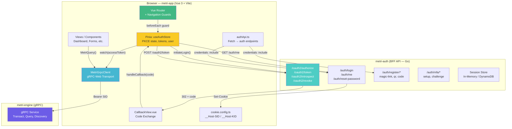
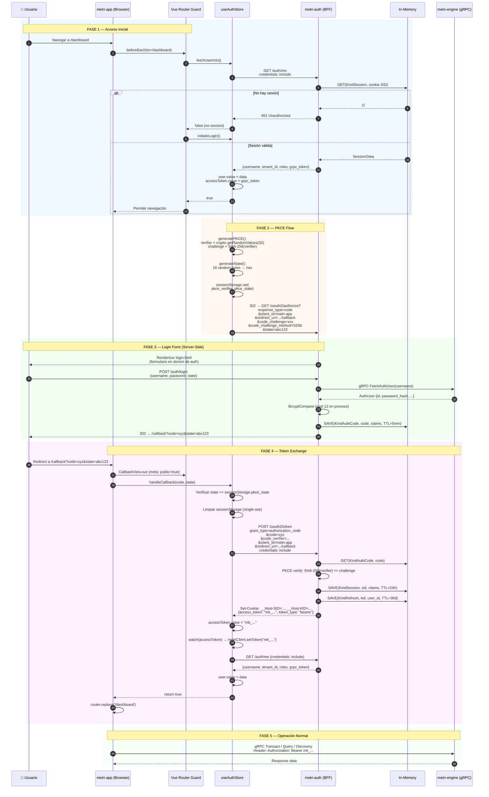
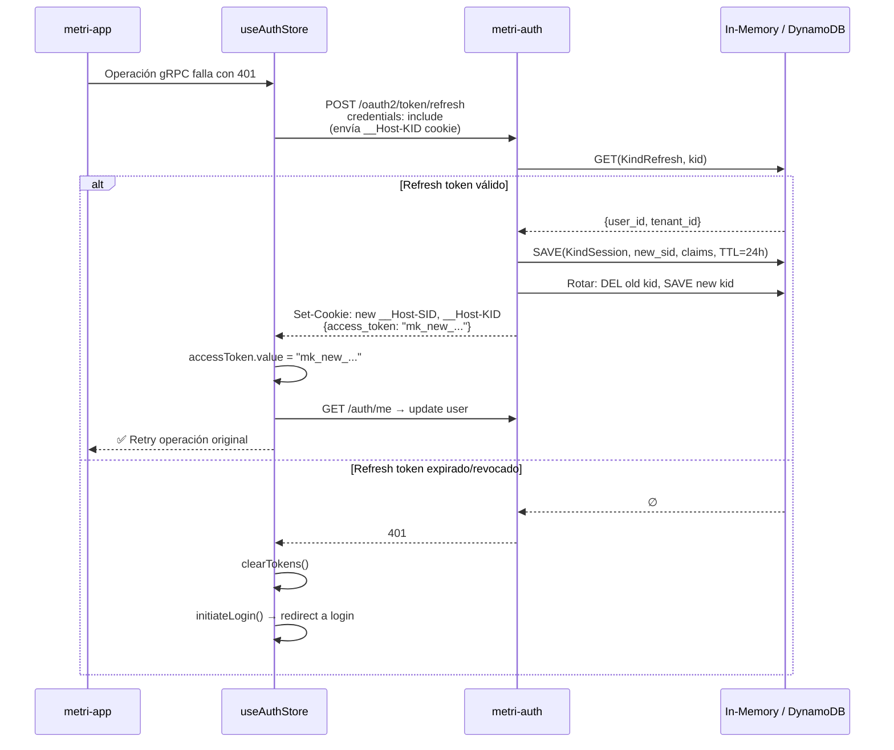
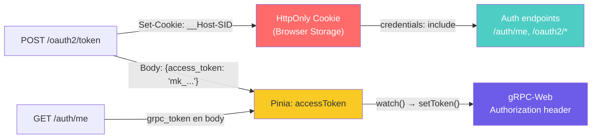
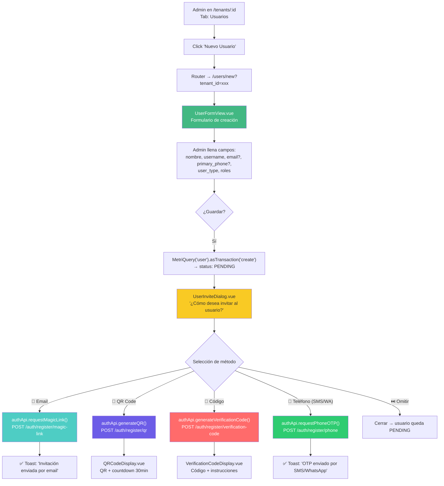
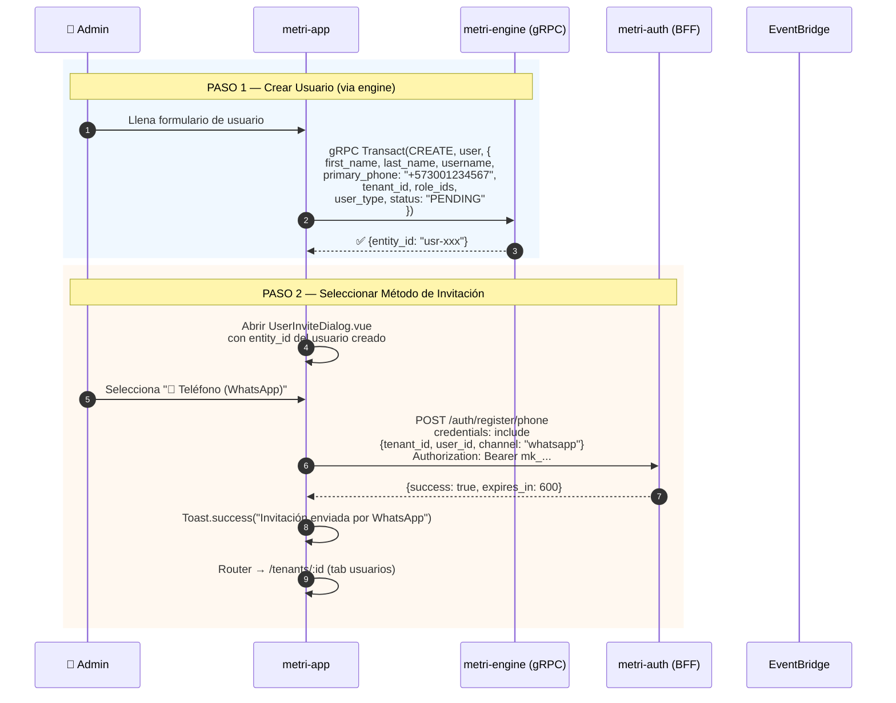
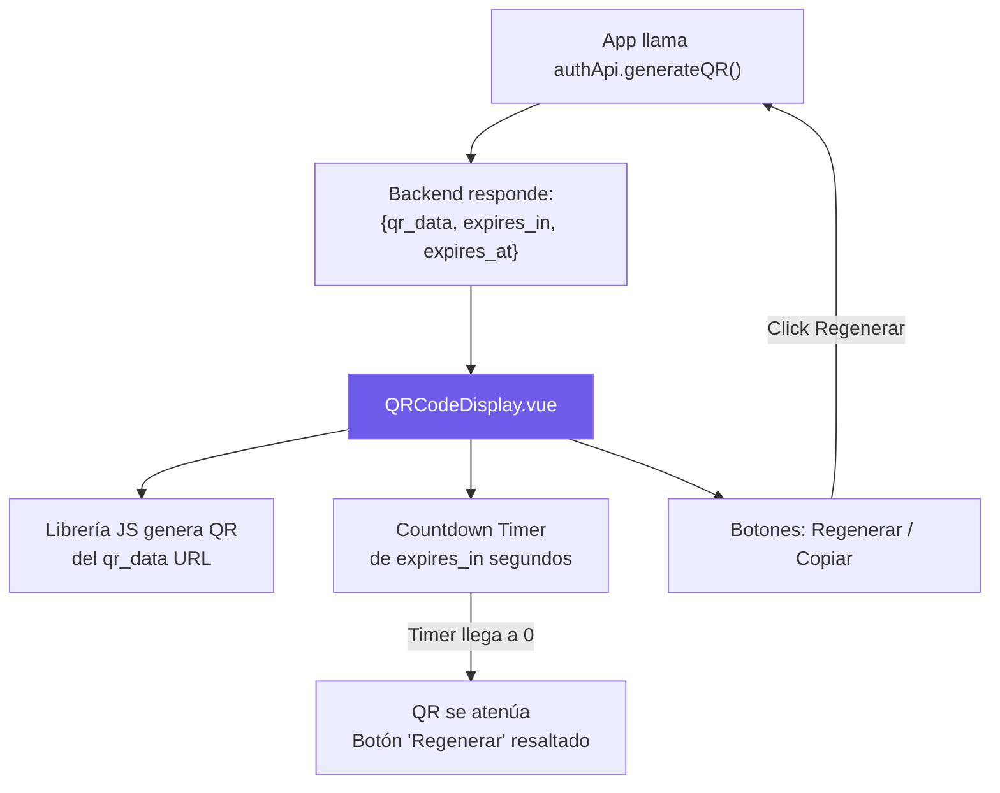
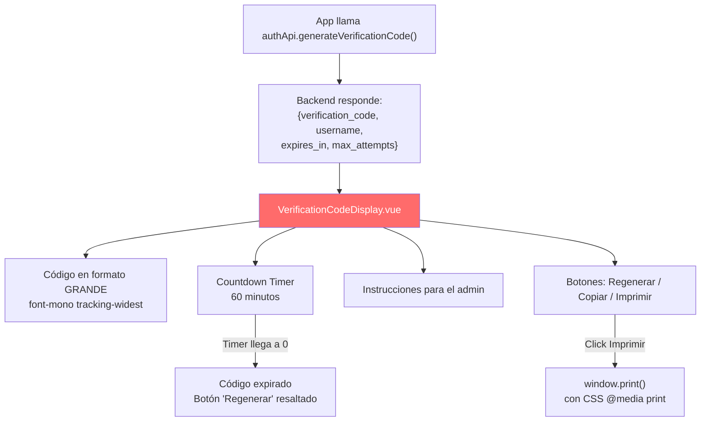
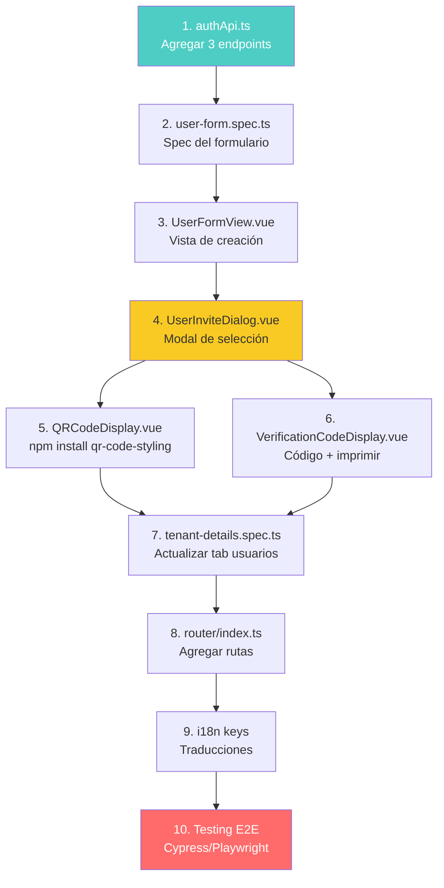
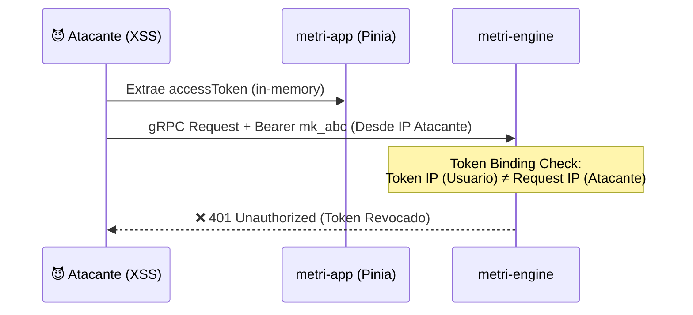

# Fase 14.2 — Integración metri-auth ↔ metri-app (Frontend)

> **Servicio Frontend**: `metri-app` (Vue 3 + Vite + Naive UI + gRPC-Web)  
> **Servicio Backend**: `metri-auth` (Go BFF — OAuth 2.1 / OIDC)  
> **Fecha**: 2026-06-30  
> **Estado**: Análisis de integración  
> **Companion**: [14 — Flujos de Auth](14_FASE_AUTH_FLOWS.md) · [14.1 — Integración Engine](14.1_FASE_AUTH_ENGINE_INTEGRATION.md)

---

## Tabla de Contenidos

1. [Estado Actual de la Integración](#1-estado-actual-de-la-integración)
2. [Diagrama de Arquitectura Completo](#2-diagrama-de-arquitectura-completo)
3. [Flujo OAuth 2.1 PKCE Actual](#3-flujo-oauth-21-pkce-actual)
4. [Análisis de Componentes Existentes](#4-análisis-de-componentes-existentes)
5. [Gestión de Sesión y Tokens](#5-gestión-de-sesión-y-tokens)
6. [Gap Analysis — Cambios Requeridos](#6-gap-analysis--cambios-requeridos)
7. [Diseño de Integración: Flujo de Invitación de Usuarios](#7-diseño-de-integración-flujo-de-invitación-de-usuarios)
8. [Diseño de Integración: Flujo QR en Frontend](#8-diseño-de-integración-flujo-qr-en-frontend)
9. [Diseño de Integración: Flujo Código de Verificación](#9-diseño-de-integración-flujo-código-de-verificación)
10. [Diseño de Integración: MFA en el Panel](#10-diseño-de-integración-mfa-en-el-panel)
11. [Cambios Requeridos por Archivo](#11-cambios-requeridos-por-archivo)
12. [Orden de Implementación](#12-orden-de-implementación)

---

## 1. Estado Actual de la Integración

### 1.1 Stack Tecnológico de metri-app

| Componente | Tecnología | Versión |
|---|---|---|
| **Framework** | Vue 3 (Composition API) | 3.x |
| **Build Tool** | Vite | 5.x |
| **UI Library** | Naive UI | 2.x |
| **State** | Pinia | 2.x |
| **Router** | Vue Router 4 | 4.x |
| **gRPC-Web** | @protobuf-ts/grpcweb-transport | 2.x |
| **HTTP** | Fetch API nativo + Axios | — |
| **Auth Protocol** | OAuth 2.1 + PKCE (S256) | RFC 7636 |

### 1.2 Archivos Clave de Autenticación

| Archivo | Responsabilidad | Líneas |
|---|---|---|
| [auth.ts](file:///Users/macuser/projects/metri/metri-app/src/stores/auth.ts) | Pinia store: PKCE, token exchange, session mgmt | 293 |
| [authApi.ts](file:///Users/macuser/projects/metri/metri-app/src/services/authApi.ts) | Cliente HTTP para endpoints de auth | 34 |
| [router/index.ts](file:///Users/macuser/projects/metri/metri-app/src/router/index.ts) | Route guards, session verification | 172 |
| [CallbackView.vue](file:///Users/macuser/projects/metri/metri-app/src/views/CallbackView.vue) | Página de callback OAuth PKCE | 68 |
| [cookie.config.ts](file:///Users/macuser/projects/metri/metri-app/src/lib/cookie.config.ts) | Cookie names (__Host-SID/KID), helper de lectura | 56 |
| [metri.client.ts](file:///Users/macuser/projects/metri/metri-app/src/lib/metri-client/core/metri.client.ts) | gRPC-Web client con auth token injection | 186 |
| [metriApi.ts](file:///Users/macuser/projects/metri/metri-app/src/services/metriApi.ts) | Axios HTTP client con interceptors de quota | 82 |
| [tenant-details.spec.ts](file:///Users/macuser/projects/metri/metri-app/src/views/tenant-details.spec.ts) | Spec declarativa del detalle de tenant (incluye tab de usuarios) | 483 |

### 1.3 Configuración de Entorno

Definida en [.env](file:///Users/macuser/projects/metri/metri-app/.env):

| Variable | Desarrollo | Producción |
|---|---|---|
| `VITE_AUTH_URL` | `http://localhost:8081` (fallback) | `https://auth.metri.one` |
| `VITE_CLIENT_ID` | `metri-app` | `metri-app` |
| `VITE_REDIRECT_URI` | `http://localhost:5173/callback` | `https://app.metri.one/callback` |
| `VITE_APP_URL` | `http://localhost:5173` | `https://app.metri.one` |
| `VITE_METRI_GRPC_URL` | `http://localhost:9091` | — |

---

## 2. Diagrama de Arquitectura Completo



---

## 3. Flujo OAuth 2.1 PKCE Actual

### 3.1 Secuencia Detallada



### 3.2 Flujo de Refresh Token



> [!IMPORTANT]
> **Optimización Crítica: Mitigación de Condición de Carrera en la Rotación del Refresh Token**  
> Cuando un dashboard carga múltiples componentes en paralelo, se disparan varias peticiones gRPC-Web simultáneas. Si el token expira, todas las llamadas fallarán con `401` al mismo tiempo y llamarán de forma concurrente a `refreshSession()`.  
> Dado que el BFF rota el `__Host-KID` (Refresh Token) en cada petición, la primera rotación invalidará el token anterior; las peticiones concurrentes enviarán el token antiguo, fallarán y causarán un logout involuntario del usuario.  
> **Solución**: Implementar un bloqueo por promesa en `useAuthStore` para asegurar que solo una petición de refresco viaje por la red, haciendo que las demás llamadas concurrentes esperen esa misma promesa.
>
> ```typescript
> // Implementación optimizada en src/stores/auth.ts
> let refreshPromise: Promise<boolean> | null = null
> 
> async function refreshSession(): Promise<boolean> {
>   if (refreshPromise) {
>     console.debug('[AUTH] Refresh already in progress, queuing request...')
>     return refreshPromise
>   }
> 
>   refreshPromise = (async () => {
>     try {
>       const res = await fetch(`${AUTH_URL}/oauth2/token/refresh`, {
>         method: 'POST',
>         headers: { 'Content-Type': 'application/x-www-form-urlencoded' },
>         credentials: 'include',
>       })
>       if (!res.ok) {
>         console.warn('[AUTH] Session refresh failed - invalidating credentials')
>         clearTokens()
>         return false
>       }
>       await fetchUserInfo()
>       return true
>     } catch (e) {
>       clearTokens()
>       return false
>     } finally {
>       refreshPromise = null // Liberar lock
>     }
>   })()
> 
>   return refreshPromise
> }
> ```

---

## 4. Análisis de Componentes Existentes

### 4.1 Auth Store — [auth.ts](file:///Users/macuser/projects/metri/metri-app/src/stores/auth.ts)

| Función | Líneas | Descripción | Uso Actual |
|---|---|---|---|
| `generatePKCE()` | L15-28 | Genera verifier + challenge SHA-256 | Login PKCE flow |
| `generateState()` | L31-35 | Genera estado CSRF hex 32 chars | Login PKCE flow |
| `initiateLogin()` | L63-87 | Construye URL de authorize y redirige | Router guard, retry |
| `handleCallback()` | L93-157 | Intercambia código por tokens | CallbackView.vue |
| `fetchUserInfo()` | L160-186 | GET /auth/me → actualiza user + grpc_token | Router guard, post-login |
| `introspect()` | L189-208 | POST /oauth2/introspect | No usado activamente |
| `logout()` | L211-219 | POST /oauth2/revoke + clearTokens() | LogoutView.vue |
| `refreshSession()` | L227-248 | POST /oauth2/token/refresh | Retry automático |

> [!NOTE]
> **Patrón BFF**: Los tokens (`__Host-SID`, `__Host-KID`) son **HttpOnly cookies** — JavaScript no puede leerlos. El auth store recibe el `grpc_token` (SID `mk_...`) en el body de `/auth/me` y `/oauth2/token` para inyectarlo en los headers de gRPC-Web.

### 4.2 Auth API Client — [authApi.ts](file:///Users/macuser/projects/metri/metri-app/src/services/authApi.ts)

```typescript
// Endpoints actualmente implementados:
authApi.login(tenantId, username, password)        // POST /auth/login
authApi.recoverByEmail(tenantId, email)            // POST /auth/recover/email
authApi.recoverBySMS(tenantId, username)           // POST /auth/recover/sms
authApi.verifyOTP(tenantId, username, otp)         // POST /auth/recover/verify-otp
authApi.resetPassword(resetToken, newPassword)     // POST /auth/recover/reset
authApi.logout(token)                              // POST /oauth2/revoke
```

> [!WARNING]
> **Faltan endpoints para los flujos nuevos**: No hay funciones para `magic-link`, `qr`, `verification-code`, ni `mfa/setup`. Estos deben agregarse.

### 4.3 Router Guard — [router/index.ts](file:///Users/macuser/projects/metri/metri-app/src/router/index.ts#L118-L152)

El guard funciona así:

```
beforeEach(to) → fetchUserInfo()
  ├─ ✅ Session válida → permitir navegación
  └─ ❌ No session → initiateLogin() (redirect a login page de metri-auth)
```

> [!IMPORTANT]
> El login **NO es una vista de metri-app** — es una página HTML renderizada por `metri-auth` en su propio dominio (`auth.metri.one`). metro-app solo tiene la `CallbackView` para recibir el código de autorización post-login.

### 4.4 Gestión de Usuarios — [tenant-details.spec.ts](file:///Users/macuser/projects/metri/metri-app/src/views/tenant-details.spec.ts#L316-L373)

La tabla de usuarios del tenant ya existe como un **related tab** en el detalle del tenant:

```typescript
relatedTabs: [{
  key: 'users',
  entity: 'user',
  tabLabel: 'ui.tenant.tab_users',
  tabIcon: PeopleOutline,
  relationForeignKey: 'tenant_id',
  selectTree: {
    id: true, username: true, email: true,
    first_name: true, last_name: true,
    status: true, user_type: true,
  },
  createButton: {
    label: 'ui.tenant.new_user_btn',
    onClick: ({ message }) => message.info('Crear usuario (en desarrollo)'),
    //                         ⬆ STUB — aún no implementado
  },
}]
```

> [!CAUTION]
> **El botón "Crear usuario" es un stub** — solo muestra un `message.info('Crear usuario (en desarrollo)')`. Este es el punto exacto donde se integra la funcionalidad de invitación de usuarios con los 3 flujos de registro.

### 4.5 Sistema de Formularios — [MetriEntityForm.vue](file:///Users/macuser/projects/metri/metri-app/src/components/form/MetriEntityForm.vue)

metri-app utiliza un **sistema de formularios declarativos** basado en specs:

```
FormViewSpec → MetriEntityForm.vue → MetriFormField.vue
      ↓                ↓                    ↓
   Sections       useEntityForm()      N-Form fields
   Fields         MetriQuery()         Type-based render
   Hooks          Validation           Naive UI components
```

Cada formulario se define como un `FormViewSpec<T>` y el componente genérico `MetriEntityForm` se encarga del rendering, validación, y persistencia via `MetriQuery().asTransaction('create')`.

---

## 5. Gestión de Sesión y Tokens

### 5.1 Flujo de Token de Sesión



### 5.2 Estrategia de Cookies

| Cookie | Nombre (Dev) | Nombre (Prod) | Contenido | Flags |
|---|---|---|---|---|
| **Session** | `SID` | `__Host-SID` | HMAC token `mk_...` | HttpOnly, Secure, SameSite=Lax, Path=/ |
| **Refresh** | `KID` | `__Host-KID` | Refresh token ID | HttpOnly, Secure, SameSite=Lax, Path=/ |
| **MFA** | `mfa_session` | `mfa_session` | MFA session ID | HttpOnly, Secure, SameSite=Strict, Path=/auth/mfa/ |

### 5.3 Token Sync Pipeline

```
Cookie → /auth/me → grpc_token (body) → Pinia accessToken → watch() → metriClient.setToken() → gRPC header
```

Esta cadena asegura que el token de sesión siempre esté sincronizado entre:
- La cookie HttpOnly (para endpoints de auth con `credentials: include`)
- El Pinia store (para el gRPC-Web transport header)

---

## 6. Gap Analysis — Cambios Requeridos

### 6.1 Componentes que FALTAN

| Componente | Tipo | Necesario Para | Prioridad |
|---|---|---|---|
| `UserFormView.vue` + spec | **Vista + Ruta** | Crear usuarios con selección de método de invitación | 🔴 Crítico |
| `UserInviteDialog.vue` | **Componente** | Modal para seleccionar flujo de invitación (Email/QR/Código) | 🔴 Crítico |
| `QRCodeDisplay.vue` | **Componente** | Mostrar QR generado con countdown timer | 🔴 Crítico |
| `VerificationCodeDisplay.vue` | **Componente** | Mostrar código con formato grande + copiar + imprimir | 🔴 Crítico |
| `MFASetupPrompt.vue` | **Componente** | Prompt post-login para configurar MFA (si no está configurado) | 🟡 Medio |
| Endpoints en `authApi.ts` | **Servicio** | Nuevos métodos para magic-link, qr, verification-code | 🔴 Crítico |
| Ruta `/users/new` | **Router** | Formulario de creación de usuario | 🔴 Crítico |
| i18n keys | **Locales** | Traducciones para nuevos componentes | 🟡 Medio |

### 6.2 Componentes que NECESITAN MODIFICACIÓN

| Archivo | Cambio | Impacto |
|---|---|---|
| [authApi.ts](file:///Users/macuser/projects/metri/metri-app/src/services/authApi.ts) | Agregar 4 endpoints nuevos | Bajo |
| [tenant-details.spec.ts](file:///Users/macuser/projects/metri/metri-app/src/views/tenant-details.spec.ts#L369-L372) | Reemplazar stub del botón "Crear usuario" | Bajo |
| [router/index.ts](file:///Users/macuser/projects/metri/metri-app/src/router/index.ts) | Agregar rutas `/users/new`, `/users/:id` | Bajo |
| [tenant-details.spec.ts](file:///Users/macuser/projects/metri/metri-app/src/views/tenant-details.spec.ts#L322-L330) | Agregar columnas `status: PENDING`, `registration_method` | Bajo |

### 6.3 Componentes que NO NECESITAN CAMBIOS

| Archivo | Razón |
|---|---|
| [auth.ts](file:///Users/macuser/projects/metri/metri-app/src/stores/auth.ts) (store) | Los flujos de registro/invitación ocurren desde el lado del admin, no del usuario que se registra. El flujo PKCE existente no cambia. |
| [CallbackView.vue](file:///Users/macuser/projects/metri/metri-app/src/views/CallbackView.vue) | El callback OAuth sigue igual — los usuarios registrados hacen login normal post-registro. |
| [cookie.config.ts](file:///Users/macuser/projects/metri/metri-app/src/lib/cookie.config.ts) | Cookies no cambian. |
| [metri.client.ts](file:///Users/macuser/projects/metri/metri-app/src/lib/metri-client/core/metri.client.ts) | El gRPC client no necesita cambios. |
| [MetriEntityForm.vue](file:///Users/macuser/projects/metri/metri-app/src/components/form/MetriEntityForm.vue) | El formulario genérico ya soporta los nuevos campos del usuario via spec. |

> [!IMPORTANT]
> **Separación clave**: El registro (magic link, QR, código) es una operación del **admin** dentro del panel de metri-app. El **usuario nuevo** nunca interactúa con metri-app durante el registro — solo con las páginas server-side de `metri-auth` (`reset_password.html`, `register_code.html`). Por lo tanto, los cambios en metri-app son exclusivamente **del lado del admin**.

---

## 7. Diseño de Integración: Flujo de Invitación de Usuarios

### 7.1 User Journey del Admin



### 7.2 Diagrama de Secuencia — Creación + Invitación



### 7.3 Contrato del `UserInviteDialog`

```typescript
// UserInviteDialog.vue — Props interface
interface UserInviteDialogProps {
  show: boolean                  // v-model para visibilidad
  userId: string                 // ID del usuario recién creado
  tenantId: string               // Tenant del usuario
  username: string               // Para display
  email?: string | null          // Si tiene email → habilitar opción Magic Link
  primaryPhone?: string | null   // Si tiene teléfono → habilitar opción SMS/WhatsApp
}

// Eventos emitidos
// @update:show - cerrar dialog
// @invited     - invitación exitosa ({method: 'magic_link' | 'qr' | 'code' | 'phone_otp'})
// @skipped     - admin omitió invitación
```

### 7.4 Disponibilidad de Métodos según Datos del Usuario

| Condición | Magic Link | QR Code | Código | Teléfono (SMS/WA) |
|---|---|---|---|---|
| Email presente | ✅ Disponible | ✅ Disponible | ✅ Disponible | ❌ Deshabilitado (sin tlf) |
| Teléfono presente | ❌ Deshabilitado | ✅ Disponible | ✅ Disponible | ✅ Disponible |
| Sin email + sin teléfono | ❌ | ✅ Disponible | ✅ Disponible | ❌ |
| Email + teléfono | ✅ (recomendado) | ✅ | ✅ | ✅ |

---

## 8. Diseño de Integración: Flujo QR en Frontend

### 8.1 Componente `QRCodeDisplay.vue`



### 8.2 Dependencia JS para QR

> [!TIP]
> Se recomienda usar `qr-code-styling` (NPM: [qr-code-styling](https://www.npmjs.com/package/qr-code-styling)) que permite personalizar el QR con:
> - Logo del tenant embebido en el centro
> - Colores del tema del tenant
> - Esquinas redondeadas (estilo moderno)
> - Export a PNG/SVG

Alternativa ligera: `qrcode` (NPM: [qrcode](https://www.npmjs.com/package/qrcode)) — 15KB, solo Canvas/SVG.

### 8.3 Wireframe del Componente QR

```
┌─────────────────────────────────────────────────────────────────┐
│                                                                 │
│  📱 Código QR de Registro                                      │
│                                                                 │
│  ┌───────────────────────────────────────────────────────┐      │
│  │                                                       │      │
│  │              ███████████████████████                   │      │
│  │              ██                 ██                     │      │
│  │              ██  █████████████  ██                     │      │
│  │              ██  ██         ██  ██                     │      │
│  │              ██  ██  █████  ██  ██                     │      │
│  │              ██  ██  ██ ██  ██  ██                     │      │
│  │              ██  ██  █████  ██  ██                     │      │
│  │              ██  ██         ██  ██                     │      │
│  │              ██  █████████████  ██                     │      │
│  │              ██                 ██                     │      │
│  │              ███████████████████████                   │      │
│  │                                                       │      │
│  └───────────────────────────────────────────────────────┘      │
│                                                                 │
│  Usuario: jperez · Expira en: ⏱ 28:45                          │
│                                                                 │
│  Instrucciones:                                                 │
│  1. Muestre este código QR al nuevo usuario                     │
│  2. El usuario debe escanearlo con la cámara de su móvil        │
│  3. Se abrirá una página para establecer su contraseña          │
│                                                                 │
│  ┌──────────────┐  ┌──────────────┐  ┌──────────────────────┐  │
│  │ 🔄 Regenerar │  │ 📋 Copiar    │  │ ✅ Listo, cerrar      │  │
│  │    QR        │  │    enlace    │  │                       │  │
│  └──────────────┘  └──────────────┘  └──────────────────────┘  │
└─────────────────────────────────────────────────────────────────┘
```

---

## 9. Diseño de Integración: Flujo Código de Verificación

### 9.1 Componente `VerificationCodeDisplay.vue`



### 9.2 Wireframe del Componente Código

```
┌─────────────────────────────────────────────────────────────────┐
│                                                                 │
│  🔢 Código de Verificación                                     │
│                                                                 │
│  ┌───────────────────────────────────────────────────────┐      │
│  │                                                       │      │
│  │           A   7   K   3   —   M   X   9   P          │      │
│  │                                                       │      │
│  │           font-size: 3rem · font-mono · tracking-wide │      │
│  │                                                       │      │
│  └───────────────────────────────────────────────────────┘      │
│                                                                 │
│  Usuario: jperez                                                │
│  Expira en: ⏱ 58:30 · Intentos permitidos: 5                  │
│                                                                 │
│  ────────────────────────────────────────────────────────       │
│                                                                 │
│  📋 Instrucciones para el usuario:                              │
│  1. Abra auth.metri.one/register/code en su navegador           │
│  2. Ingrese su nombre de usuario: jperez                        │
│  3. Ingrese el código: A7K3-MX9P                                │
│  4. Establezca su contraseña                                    │
│                                                                 │
│  ┌──────────────┐  ┌──────────────┐  ┌──────────────────────┐  │
│  │ 🔄 Regenerar │  │ 📋 Copiar    │  │ 🖨️  Imprimir tarjeta │  │
│  └──────────────┘  └──────────────┘  └──────────────────────┘  │
│  ┌─────────────────────────────────────────────────────────┐    │
│  │                    ✅ Listo, cerrar                      │    │
│  └─────────────────────────────────────────────────────────┘    │
└─────────────────────────────────────────────────────────────────┘
```

---

## 10. Diseño de Integración: MFA en el Panel

### 10.1 Punto de Integración

El MFA tiene **dos** puntos de contacto con metri-app:

| Punto | Donde Ocurre | Controlado por |
|---|---|---|
| **MFA Setup** | Post-login, si MFA no está configurado | metri-auth (server-side) |
| **MFA Challenge** | Cada login si MFA está activado | metri-auth (server-side) |
| **MFA Status** | Perfil del usuario en el panel | metri-app (UI) |

> [!NOTE]
> **MFA Setup y Challenge son 100% server-side** — ocurren en las páginas HTML de metri-auth (`mfa_setup.html`, `mfa_challenge.html`). **metri-app NO necesita componentes de MFA** para los flujos de autenticación.

### 10.2 Lo que SÍ necesita metri-app para MFA

1. **Mostrar estado MFA** en el perfil/tabla de usuarios: columna `mfa_enabled` (true/false)
2. **Botón "Configurar MFA"** en el perfil del admin (link a `AUTH_URL/auth/mfa/setup`)
3. **Badge visual** indicando si MFA está activo para el usuario actual

### 10.3 Cambio en User Table

```typescript
// Agregar columna mfa_enabled al tab de usuarios del tenant
{
  key: 'mfa_enabled',
  label: 'col_mfa',
  type: 'tag',
  meta: {
    colorMap: {
      true: '#10b981',   // verde
      false: '#94a3b8',  // gris
    },
    labelMap: {
      true: '🔐 Activo',
      false: '—',
    },
  },
},
```

---

## 11. Cambios Requeridos por Archivo

### 11.1 Archivos NUEVOS

---

#### [NEW] `src/services/authApi.ts` — Agregar Endpoints

```typescript
// Agregar al objeto authApi existente:

// Flujo 1A — Magic Link
requestMagicLink: (tenantId: string, userId: string, email: string) =>
  post<{ success: boolean; expires_in: number }>('/auth/register/magic-link', {
    tenant_id: tenantId, user_id: userId, email,
  }),

// Flujo 1B — QR Code
generateQR: (tenantId: string, userId: string) =>
  post<{
    registration_url: string;
    qr_data: string;
    expires_in: number;
    expires_at: string;
  }>('/auth/register/qr', {
    tenant_id: tenantId, user_id: userId,
  }),

// Flujo 1C — Verification Code
generateVerificationCode: (tenantId: string, userId: string) =>
  post<{
    verification_code: string;
    username: string;
    expires_in: number;
    expires_at: string;
    max_attempts: number;
    instructions: string;
  }>('/auth/register/verification-code', {
    tenant_id: tenantId, user_id: userId,
  }),

// Flujo 1D — Phone OTP (SMS/WhatsApp)
requestPhoneOTP: (tenantId: string, userId: string, channel: 'sms' | 'whatsapp') =>
  post<{ success: boolean; expires_in: number }>('/auth/register/phone', {
    tenant_id: tenantId, user_id: userId, channel,
  }),
```

---

#### [NEW] `src/views/UserFormView.vue` — Formulario de Creación de Usuario

Vista que usa `MetriEntityForm` con una spec para el entity `user`. Post-save abre el `UserInviteDialog`.

---

#### [NEW] `src/views/user-form.spec.ts` — Spec del Formulario

```typescript
export const USER_FORM_SPEC: FormViewSpec<UserForm> = {
  entity: 'user',
  scope: 'system',
  identifierField: 'entity/ulid',
  header: {
    createTitle: 'ui.user.create_title',
    editTitle: 'ui.user.edit_title',
    backRoute: '/tenants/:tenantId',
    saveLabel: 'ui.user.save_btn',
    // ...
  },
  sections: [
    {
      key: 'identity',
      title: 'ui.user.section_identity',
      fields: [
        { key: 'first_name', label: 'ui.attributes.first_name', type: 'text', required: true, span: 12 },
        { key: 'last_name', label: 'ui.attributes.last_name', type: 'text', required: true, span: 12 },
        { key: 'username', label: 'ui.attributes.username', type: 'text', required: true, span: 12 },
        { key: 'email', label: 'ui.attributes.email', type: 'text', span: 12 },
      ],
    },
    {
      key: 'access',
      title: 'ui.user.section_access',
      fields: [
        { key: 'user_type', label: 'ui.attributes.user_type', type: 'select', 
          options: ['INTERNAL', 'CONTRACTOR'], defaultValue: 'INTERNAL', span: 12 },
        { key: 'role_ids', label: 'ui.attributes.roles', type: 'multi-select',
          entityRef: 'role', span: 12 },
      ],
    },
  ],
  hooks: {
    onBeforeSave: (data) => ({
      ...data,
      status: 'PENDING',           // Siempre PENDING en creación
      failed_attempts: 0,
      mfa_enabled: false,
    }),
    onAfterSave: async (data) => {
      // Abrir UserInviteDialog
      // (se implementa en UserFormView.vue via emit)
    },
  },
}
```

---

#### [NEW] `src/components/common/UserInviteDialog.vue`

Dialog modal con 3 opciones (Email, QR, Código) + botón "Omitir".

---

#### [NEW] `src/components/common/QRCodeDisplay.vue`

Componente que recibe `qr_data` y renderiza un QR con countdown timer.

---

#### [NEW] `src/components/common/VerificationCodeDisplay.vue`

Componente que muestra el código en formato grande con instrucciones e imprimir.

---

### 11.2 Archivos MODIFICADOS

---

#### [MODIFY] [authApi.ts](file:///Users/macuser/projects/metri/metri-app/src/services/authApi.ts)

Agregar 3 endpoints nuevos (ver §11.1).

---

#### [MODIFY] [router/index.ts](file:///Users/macuser/projects/metri/metri-app/src/router/index.ts)

```diff
+    {
+      path: '/users/new',
+      component: () => import('@/views/UserFormView.vue'),
+      meta: { requiresAuth: true, layout: 'DashboardLayout' },
+    },
+    {
+      path: '/users/:id/edit',
+      component: () => import('@/views/UserFormView.vue'),
+      meta: { requiresAuth: true, layout: 'DashboardLayout' },
+    },
```

---

#### [MODIFY] [tenant-details.spec.ts](file:///Users/macuser/projects/metri/metri-app/src/views/tenant-details.spec.ts#L316-L373)

Cambios en el tab de usuarios:

```diff
 selectTree: {
   id: true,
   username: true,
   email: true,
   first_name: true,
   last_name: true,
   status: true,
   user_type: true,
+  mfa_enabled: true,
+  registration_method: true,
 },
 schema: {
   columns: [
     { key: 'username', label: 'col_user', type: 'text', sortable: true },
     { key: 'name', label: 'col_full_name', type: 'composite',
       meta: { subKeys: ['first_name', 'last_name'] } },
     { key: 'email', label: 'col_email', type: 'text' },
     { key: 'user_type', label: 'col_type', type: 'tag', ... },
-    { key: 'status', label: 'col_status', type: 'tag', ... },
+    { key: 'status', label: 'col_status', type: 'tag',
+      meta: {
+        colorMap: {
+          ACTIVE: '#10b981',
+          PENDING: '#f59e0b',     // ← NEW
+          INACTIVE: 'var(--metri-muted-text-color)',
+          SUSPENDED: '#f43f5e',
+        },
+      },
+    },
+    { key: 'mfa_enabled', label: 'col_mfa', type: 'tag',
+      meta: { colorMap: { true: '#10b981', false: '#94a3b8' },
+              labelMap: { true: '🔐', false: '—' } } },
   ],
 },
 createButton: {
   label: 'ui.tenant.new_user_btn',
-  onClick: ({ message }) => message.info('Crear usuario (en desarrollo)'),
+  onClick: ({ router, parentId }) => {
+    router.push(`/users/new?tenant_id=${parentId}`)
+  },
 },
+// Acción por fila: Re-invitar usuario
+rowActions: ['edit', 'invite', 'delete'],
```

---

## 12. Orden de Implementación



### Dependencias de Deploy

```
1. metri-engine (schema user.json)  ← Ya documentado en 14.1
    ↓
2. metri-auth (endpoints Go)       ← Ya documentado en 14
    ↓
3. metri-app (frontend)            ← Este documento
    ↓
4. metri-notifications (templates) ← Evento EventBridge
```

> [!IMPORTANT]
> El deploy de los cambios en metri-app **depende** de que los endpoints de metri-auth ya estén implementados y desplegados (`/auth/register/qr`, `/auth/register/verification-code`). El endpoint `/auth/register/magic-link` ya existe. El orden de deploy es: **engine → auth → app → notifications**.

---

## Resumen de Hallazgos Clave

| Hallazgo | Impacto |
|---|---|
| **Login es 100% server-side** — metri-app NO renderiza formularios de login/register | Los flujos de registro del usuario final no tocan metri-app |
| **Admin crea usuarios via gRPC** — `MetriQuery('user').asTransaction('create')` | El formulario de usuario usa el sistema declarativo existente |
| **Botón "Crear usuario" es un stub** — `message.info('en desarrollo')` | Punto exacto de integración: línea 371 de tenant-details.spec.ts |
| **Cookie strategy es BFF** — tokens en HttpOnly, grpc_token en body | Los endpoints de invitación usan `credentials: include` automáticamente |
| **authApi.ts tiene 6 endpoints** — faltan 4 para los flujos nuevos | Extensión incremental del cliente HTTP existente |
| **Sistema de formularios es declarativo** — `FormViewSpec` + `MetriEntityForm` | El formulario de usuario se crea solo con una spec JSON-like |
| **No hay UI de MFA en el panel** — MFA es server-side en metri-auth | Solo se necesita mostrar el estado `mfa_enabled` en la tabla de usuarios |

---

## 13. Análisis de Vulnerabilidades de Seguridad y Mitigaciones

Este análisis evalúa el perímetro de seguridad en la integración entre `metri-app` (Frontend) y `metri-auth` (BFF/OAuth2), clasificando los riesgos e implementando contramedidas específicas en el diseño.

### 13.1 Resumen de Vulnerabilidades Identificadas

| ID | Nivel | Vulnerabilidad | Vector de Ataque | Mitigación Diseñada |
|---|---|---|---|---|
| **SEC-01** | 🔴 **Crítico** | Exposición del gRPC Session Token (`mk_...`) ante XSS | Robo de sesión in-memory mediante inyección de scripts | Token Binding temporal (IP/User-Agent) + CSP Estricta |
| **SEC-02** | 🟠 **Alto** | SMS/WhatsApp Bombing (Agotamiento de recursos y costos) | Abuso automatizado de los endpoints `/auth/register/phone` | Rate limiting IP/Teléfono (Session Store) + Token de Admin Scoped |
| **SEC-03** | 🟡 **Medio** | Fuga del token de registro en la cabecera `Referer` | Fuga a servicios de terceros a través de links externos | Cabecera `Referrer-Policy: no-referrer` + Token Single-Use |
| **SEC-04** | 🟡 **Medio** | Clickjacking en las páginas server-side de `metri-auth` | Embebido en iframes maliciosos para captura de contraseñas | `frame-ancestors 'none'` en Content Security Policy |
| **SEC-05** | 🟢 **Bajo** | Fijación de sesiones huérfanas en cambio de contraseña | Sesiones previas no revocadas tras el registro/activación | Revocación total de tokens activos en `UpdateUser` de engine |

---

### 13.2 Detalles de Vulnerabilidades y Soluciones

---

#### 🔴 SEC-01: Exposición de gRPC Session Token (`mk_...`) ante XSS

* **Descripción**: Al ser `metri-app` una SPA, no puede usar una cookie `HttpOnly` directamente para autorizar las peticiones gRPC-Web (Envoy Proxy requiere la cabecera `Authorization: Bearer mk_...`). El token se expone en la memoria JavaScript del store de Pinia (`accessToken`). Si un atacante logra inyectar código (XSS), puede extraer el token y suplantar al usuario.
* **Gravedad**: Crítico
* **Solución de Diseño**:
  1. **Content Security Policy (CSP)**: Configurar en CloudFront políticas de cabeceras de respuesta que impidan la ejecución de scripts no confiables (`script-src 'self'`).
  2. **Token Binding (Mecanismo en *.env*)**: `TOKEN_BINDING_MODE=strict`. El backend `metri-auth` asocia el token de sesión a la combinación criptográfica del `User-Agent` e `IP` del cliente al momento del login. Si una petición gRPC-Web es enviada desde una IP o huella digital distinta, el proxy o BFF rechaza el token devolviendo `401`.



---

#### 🟠 SEC-02: SMS/WhatsApp Bombing y Costos Financieros

* **Descripción**: Los endpoints `/auth/register/phone` y `/auth/register/magic-link` envían notificaciones físicas (SMS via Twilio o WhatsApp via Meta) que conllevan un coste por mensaje. Un atacante (o un script automatizado) podría inundar estos endpoints causando denegación de servicio (DoS), agotando el saldo de Twilio o enviando spam masivo a números arbitrarios.
* **Gravedad**: Alto
* **Solución de Diseño**:
  1. **Control de Acceso (Scope)**: Los endpoints de invitación en `metri-auth` requieren obligatoriamente una sesión de administrador válida con el scope `user:invite`.
  2. **Sliding-Window Rate Limiting (Session Store)**: Implementar una limitación doble en la API de autenticación:
     * **Por IP de Admin**: Máximo 30 peticiones de invitación por minuto.
     * **Por Número de Teléfono / Email destino**: Máximo 3 intentos de envío de OTP por cada 10 minutos.

```go
// In-Memory Rate Limiting logic en metri-auth
limitKey := fmt.Sprintf("rate:phone:%s", req.Phone)
count, _ := cache.Increment(ctx, limitKey)
if count == 1 {
    cache.Expire(ctx, limitKey, 10*time.Minute)
}
if count > 3 {
    return errors.New("ERR_RATE_LIMIT_EXCEEDED") // Bloquear envío
}
```

---

#### 🟡 SEC-03: Fuga del Token de Registro en la Cabecera `Referer`

* **Descripción**: Cuando el usuario hace clic en el Magic Link o en el link decodificado del QR (`https://auth.metri.one/auth/register/verify?token=a4f8...`), su navegador abre la página web. Si esa página de restablecimiento de contraseña carga recursos de terceros (fuentes de Google, scripts de análisis, logos externos), el navegador enviará el token en la cabecera HTTP `Referer`.
* **Gravedad**: Medio
* **Solución de Diseño**:
  1. **Referrer Policy**: Enviar la cabecera HTTP `Referrer-Policy: no-referrer` en todas las respuestas HTML de `metri-auth`. Esto obliga al navegador a omitir la URL de origen al cargar cualquier recurso externo.
  2. **Token Efímero de Un Solo Uso**: El token de invitación (`KindMagic`) se destruye inmediatamente en el Session Store (`DEL`) tras el primer acceso en el handler `HandleMagicLinkVerify`, sustituyéndose por un `KindReset` que no es expuesto en la URL externa.

---

#### 🟡 SEC-04: Clickjacking en Páginas Server-Side de `metri-auth`

* **Descripción**: Un atacante podría incrustar la página de inicio de sesión (`/auth/login`), la de MFA (`/auth/mfa/setup`) o la de creación de contraseña (`/auth/reset-password`) dentro de un `<iframe>` invisible en un sitio web malicioso de phishing para capturar las pulsaciones de teclado del usuario.
* **Gravedad**: Medio
* **Solución de Diseño**:
  1. **X-Frame-Options**: Enviar la cabecera `X-Frame-Options: DENY` en todas las páginas HTML renderizadas por `metri-auth`.
  2. **CSP Frame Ancestors**: Configurar la cabecera `Content-Security-Policy: frame-ancestors 'none';` en el API Gateway de autenticación para bloquear el renderizado en cualquier frame de forma redundante y moderna.

---

#### 🟢 SEC-05: Fijación de Sesiones Huérfanas en Cambio de Contraseña

* **Descripción**: Si un usuario tiene múltiples sesiones iniciadas (por ejemplo, en su teléfono y en su laptop) y cambia su contraseña (o si un administrador restablece su contraseña por haber sido comprometida), las sesiones activas en otros dispositivos podrían seguir siendo válidas si sus tokens de sesión no son revocados de forma activa.
* **Gravedad**: Bajo
* **Solución de Diseño**:
  1. **Revocación Global en Cascada**: Al procesar una actualización de contraseña en `metri-engine` (dentro del flujo `RegisterUser` o `ResetPassword`), el motor debe emitir un comando para eliminar de la sesión in-memory e in-database todos los registros `KindSession` y `KindRefresh` asociados a ese `user_id`.
  2. **Re-autenticación**: Todos los dispositivos del usuario recibirán un `401` en su siguiente petición gRPC-Web y serán redirigidos a iniciar sesión con la nueva contraseña.
