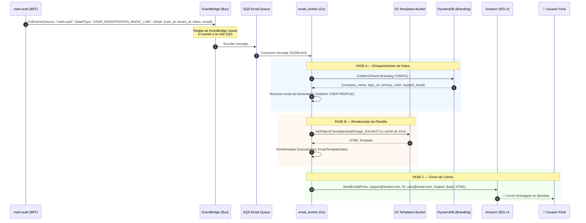

# Fase 14.3 — Plantillas de Correo e Integración con metri-notifications

> **Módulo**: `metri-notifications` (Go email_worker)  
> **Servicio de Entrega**: Amazon SES v2  
> **Motor de Renderizado**: Go `html/template`  
> **Ubicación de Plantillas**: Amazon S3 (`TEMPLATES_BUCKET`)  
> **Fecha**: 2026-06-30  
> **Estado**: Diseño de referencia e Implementación de Plantillas

---

## 1. Arquitectura de Integración de Notificaciones

La comunicación entre `metri-auth` (BFF) y `metri-notifications` se realiza de forma **asíncrona** y desacoplada a través de Amazon EventBridge y colas SQS, asegurando que fallos en el canal de notificaciones no bloqueen los flujos de login o registro.



---

## 2. Contratos de Datos de Eventos (EventBridge)

Para disparar los correos, `metri-auth` publica los siguientes eventos a EventBridge.

### 2.1 Evento: `USER_REGISTRATION_MAGIC_LINK` (Invitación)
Emitido cuando el admin invita a un usuario.

```json
{
  "Source": "metri.auth",
  "DetailType": "USER_REGISTRATION_MAGIC_LINK",
  "Detail": {
    "tenant_id": "t-uuid-12345",
    "user_id": "usr-uuid-67890",
    "email": "juan.perez@empresa.com",
    "title": "Te damos la bienvenida a Metri One — Activa tu cuenta",
    "template_path": "auth/magic_link",
    "link": "/auth/register/verify?token=mk_magic_abcdef12345&state=register",
    "template_data": {
      "first_name": "Juan",
      "last_name": "Pérez",
      "username": "jperez",
      "expires_in_mins": "15"
    }
  }
}
```

### 2.2 Evento: `USER_REGISTRATION_COMPLETED` (Bienvenida)
Emitido tras establecer contraseña y activar la cuenta (`PENDING` → `ACTIVE`).

```json
{
  "Source": "metri.auth",
  "DetailType": "USER_REGISTRATION_COMPLETED",
  "Detail": {
    "tenant_id": "t-uuid-12345",
    "user_id": "usr-uuid-67890",
    "email": "juan.perez@empresa.com",
    "title": "¡Tu cuenta de Metri está lista!",
    "template_path": "auth/welcome",
    "link": "/dashboard",
    "template_data": {
      "first_name": "Juan",
      "username": "jperez",
      "registration_method": "MAGIC_LINK"
    }
  }
}
```

### 2.3 Evento: `AUTH_SECURITY_ALERT` (Alerta de Seguridad)
Emitido en cambios de contraseña, desactivación de MFA o bloqueos de cuenta.

```json
{
  "Source": "metri.auth",
  "DetailType": "AUTH_SECURITY_ALERT",
  "Detail": {
    "tenant_id": "t-uuid-12345",
    "user_id": "usr-uuid-67890",
    "email": "juan.perez@empresa.com",
    "title": "Alerta de Seguridad: Cambio de Contraseña en tu cuenta de Metri",
    "template_path": "auth/security_alert",
    "link": "/auth/recover",
    "template_data": {
      "first_name": "Juan",
      "action": "CAMBIO_CONTRASEÑA",
      "ip_address": "186.114.23.45",
      "device_browser": "Chrome 124.0 / macOS Sonoma",
      "timestamp": "2026-06-30T1## 3. Diseño Estético de las Plantillas en MJML

Las plantillas se escriben usando **MJML (Mailjet Markup Language)** para garantizar un diseño responsivo fluido y consistente en todos los clientes de correo (incluyendo Outlook, Gmail App y Apple Mail), evitando el tedio del código HTML en tablas anidadas y hacks de CSS.

---

### 3.1 Plantilla MJML: Invitación por Magic Link (`templates/auth/magic_link.mjml`)

```xml
<mjml>
  <mj-head>
    <mj-title>{{.Title}}</mj-title>
    <mj-font name="Inter" href="https://fonts.googleapis.com/css2?family=Inter:wght@400;700;800&display=swap" />
    <mj-attributes>
      <mj-all font-family="Inter, -apple-system, BlinkMacSystemFont, 'Segoe UI', sans-serif" />
      <mj-text font-size="16px" color="#475569" line-height="26px" />
    </mj-attributes>
  </mj-head>
  <mj-body background-color="#F8FAFC">
    <!-- Header: Logo -->
    <mj-section padding="40px 20px 10px 20px">
      <mj-column>
        <mj-image src="{{.LogoURL}}" alt="{{.CompanyName}}" width="140px" align="center" />
      </mj-column>
    </mj-section>

    <!-- Card Principal -->
    <mj-section background-color="#FFFFFF" border-radius="24px" border="1px solid #E2E8F0" padding="40px">
      <mj-column>
        <mj-text font-size="24px" font-weight="800" color="#0F172A" align="center" padding-bottom="20px" line-height="32px">
          Te damos la bienvenida a {{.CompanyName}}
        </mj-text>
        <mj-text>
          Hola <strong>{{index .Data "first_name"}}</strong>,
        </mj-text>
        <mj-text>
          Un administrador ha creado tu cuenta en <strong>{{.CompanyName}}</strong> con el siguiente nombre de usuario de acceso:
        </mj-text>
        <mj-text align="center" padding="15px 0">
          <span style="background-color: #F1F5F9; padding: 8px 16px; border-radius: 8px; font-family: monospace; font-size: 16px; color: #0F172A; font-weight: bold; border: 1px solid #E2E8F0;">{{index .Data "username"}}</span>
        </mj-text>
        <mj-text>
          Para comenzar a utilizar la plataforma, activa tu cuenta y define tu contraseña haciendo clic en el siguiente botón:
        </mj-text>
        <mj-button href="{{.ActionURL}}" background-color="{{.PrimaryColor}}" color="#FFFFFF" font-size="16px" font-weight="700" border-radius="12px" padding="25px 0" inner-padding="16px 32px">
          Activar Mi Cuenta
        </mj-button>
        <mj-text font-size="14px" color="#64748B" css-class="alert-box" container-background-color="#F8FAFC" padding="15px" border-radius="12px" style="border-left: 4px solid #3B82F6;">
          <strong>Importante:</strong> Este enlace de activación es de un solo uso y expirará en <strong>{{index .Data "expires_in_mins"}} minutos</strong> por motivos de seguridad.
        </mj-text>
      </mj-column>
    </mj-section>

    <!-- Footer -->
    <mj-section padding="20px 40px">
      <mj-column>
        <mj-text font-size="12px" color="#94A3B8" align="center" line-height="20px">
          Si el botón no funciona, copia y pega la siguiente URL en tu navegador:<br/>
          <a href="{{.ActionURL}}" style="color: #3B82F6; text-decoration: none; word-break: break-all;">{{.ActionURL}}</a>
        </mj-text>
        <mj-divider border-color="#E2E8F0" border-width="1px" padding="20px 0" />
        <mj-text font-size="11px" color="#94A3B8" align="center" line-height="18px">
          Este es un correo automático enviado por la plataforma de seguridad de {{.CompanyName}}.<br/>
          Si no solicitaste este registro, por favor ignora este correo.
        </mj-text>
      </mj-column>
    </mj-section>
  </mj-body>
</mjml>
```

---

### 3.2 Plantilla MJML: Registro Completado (`templates/auth/welcome.mjml`)

```xml
<mjml>
  <mj-head>
    <mj-title>{{.Title}}</mj-title>
    <mj-font name="Inter" href="https://fonts.googleapis.com/css2?family=Inter:wght@400;700;800&display=swap" />
    <mj-attributes>
      <mj-all font-family="Inter, -apple-system, BlinkMacSystemFont, 'Segoe UI', sans-serif" />
      <mj-text font-size="16px" color="#475569" line-height="26px" />
    </mj-attributes>
  </mj-head>
  <mj-body background-color="#F8FAFC">
    <!-- Header -->
    <mj-section padding="40px 20px 10px 20px">
      <mj-column>
        <mj-image src="{{.LogoURL}}" alt="{{.CompanyName}}" width="140px" align="center" />
      </mj-column>
    </mj-section>

    <!-- Card Principal -->
    <mj-section background-color="#FFFFFF" border-radius="24px" border="1px solid #E2E8F0" padding="40px">
      <mj-column>
        <!-- Icono de éxito -->
        <mj-text align="center" padding-bottom="10px">
          <span style="background-color: #DCFCE7; color: #15803D; font-size: 28px; width: 56px; height: 56px; line-height: 56px; border-radius: 50%; display: inline-block; text-align: center; font-weight: bold;">✓</span>
        </mj-text>
        <mj-text font-size="24px" font-weight="800" color="#0F172A" align="center" padding-bottom="20px" line-height="32px">
          ¡Tu cuenta está lista!
        </mj-text>
        <mj-text>
          Hola <strong>{{index .Data "first_name"}}</strong>,
        </mj-text>
        <mj-text>
          Has configurado exitosamente tus credenciales en <strong>{{.CompanyName}}</strong>. Ya puedes acceder al panel de control con tus datos:
        </mj-text>
        
        <!-- Detalles de acceso -->
        <mj-table padding="15px" container-background-color="#F8FAFC" style="border: 1px solid #E2E8F0; border-radius: 16px;">
          <tr style="font-size: 14px; line-height: 24px;">
            <td style="font-weight: 700; color: #64748B; width: 30%;">Usuario:</td>
            <td style="font-family: monospace; color: #0F172A; font-weight: bold;">{{index .Data "username"}}</td>
          </tr>
          <tr style="font-size: 14px; line-height: 24px;">
            <td style="font-weight: 700; color: #64748B;">Método:</td>
            <td style="color: #0F172A;">{{index .Data "registration_method"}}</td>
          </tr>
        </mj-table>

        <mj-button href="{{.ActionURL}}" background-color="{{.PrimaryColor}}" color="#FFFFFF" font-size="16px" font-weight="700" border-radius="12px" padding="25px 0" inner-padding="16px 32px">
          Ingresar al Portal
        </mj-button>
        
        <mj-text font-size="13px" color="#94A3B8" align="center" padding-top="15px">
          Te recomendamos configurar la autenticación de doble factor (MFA) desde tu perfil para aumentar la seguridad de tu cuenta.
        </mj-text>
      </mj-column>
    </mj-section>

    <!-- Footer -->
    <mj-section padding="20px 40px">
      <mj-column>
        <mj-text font-size="12px" color="#94A3B8" align="center" line-height="18px">
          © 2026 {{.CompanyName}}. Todos los derechos reservados.<br/>
          Contacto de soporte: <a href="mailto:{{index .Metadata "support_email"}}" style="color: #3B82F6; text-decoration: none;">{{index .Metadata "support_email"}}</a>
        </mj-text>
      </mj-column>
    </mj-section>
  </mj-body>
</mjml>
```

---

### 3.3 Plantilla MJML: Alerta de Seguridad (`templates/auth/security_alert.mjml`)

```xml
<mjml>
  <mj-head>
    <mj-title>{{.Title}}</mj-title>
    <mj-font name="Inter" href="https://fonts.googleapis.com/css2?family=Inter:wght@400;700;800&display=swap" />
    <mj-attributes>
      <mj-all font-family="Inter, -apple-system, BlinkMacSystemFont, 'Segoe UI', sans-serif" />
      <mj-text font-size="16px" color="#475569" line-height="26px" />
    </mj-attributes>
  </mj-head>
  <mj-body background-color="#F8FAFC">
    <!-- Header -->
    <mj-section padding="40px 20px 10px 20px">
      <mj-column>
        <mj-image src="{{.LogoURL}}" alt="{{.CompanyName}}" width="140px" align="center" />
      </mj-column>
    </mj-section>

    <!-- Card Principal con Borde Rojo superior de Alerta -->
    <mj-section background-color="#FFFFFF" border-radius="24px" border="1px solid #E2E8F0" border-top="4px solid #EF4444" padding="40px">
      <mj-column>
        <!-- Icono Warning Shield -->
        <mj-text align="center" padding-bottom="10px">
          <span style="background-color: #FEE2E2; color: #DC2626; font-size: 28px; width: 56px; height: 56px; line-height: 56px; border-radius: 50%; display: inline-block; text-align: center; font-weight: bold;">⚠️</span>
        </mj-text>
        
        <mj-text font-size="22px" font-weight="800" color="#0F172A" align="center" padding-bottom="20px" line-height="30px">
          Notificación de Seguridad
        </mj-text>
        
        <mj-text>
          Hola <strong>{{index .Data "first_name"}}</strong>,
        </mj-text>
        <mj-text>
          Te notificamos que se ha realizado una acción de seguridad crítica en tu cuenta de <strong>{{.CompanyName}}</strong>:
        </mj-text>
        
        <!-- Detalle de la Alerta -->
        <mj-table padding="15px" container-background-color="#FEF2F2" style="border: 1px solid #FEE2E2; border-radius: 16px;">
          <tr style="font-size: 14px; line-height: 24px;">
            <td style="font-weight: 700; color: #991B1B; width: 35%;">Acción:</td>
            <td style="color: #0F172A; font-weight: bold;">{{index .Data "action"}}</td>
          </tr>
          <tr style="font-size: 14px; line-height: 24px;">
            <td style="font-weight: 700; color: #991B1B;">Dirección IP:</td>
            <td style="font-family: monospace; color: #0F172A;">{{index .Data "ip_address"}}</td>
          </tr>
          <tr style="font-size: 14px; line-height: 24px;">
            <td style="font-weight: 700; color: #991B1B;">Dispositivo:</td>
            <td style="color: #0F172A;">{{index .Data "device_browser"}}</td>
          </tr>
          <tr style="font-size: 14px; line-height: 24px;">
            <td style="font-weight: 700; color: #991B1B;">Fecha / Hora:</td>
            <td style="color: #0F172A;">{{index .Data "timestamp"}}</td>
          </tr>
        </mj-table>

        <mj-text font-weight="700" color="#0F172A" padding-top="20px">
          ¿No fuiste tú?
        </mj-text>
        <mj-text padding-bottom="20px">
          Si no realizaste esta acción, es muy probable que tus credenciales hayan sido comprometidas. Protege tu cuenta inmediatamente haciendo clic en el siguiente botón:
        </mj-text>

        <mj-button href="{{.ActionURL}}" background-color="#DC2626" color="#FFFFFF" font-size="16px" font-weight="700" border-radius="12px" padding="10px 0" inner-padding="16px 32px">
          Proteger Mi Cuenta
        </mj-button>
      </mj-column>
    </mj-section>

    <!-- Footer -->
    <mj-section padding="20px 40px">
      <mj-column>
        <mj-text font-size="12px" color="#94A3B8" align="center" line-height="18px">
          Este es un aviso automático de ciberseguridad. No respondas a este correo.<br/>
          Soporte: <a href="mailto:{{index .Metadata "support_email"}}" style="color: #3B82F6; text-decoration: none;">{{index .Metadata "support_email"}}</a>
        </mj-text>
      </mj-column>
    </mj-section>
  </mj-body>
</mjml>
```

---

## 4. Despliegue y Pruebas en el Entorno Local

Dado que `email_worker` requiere archivos HTML renderizados en S3, el flujo de desarrollo y despliegue compila primero las plantillas MJML a HTML antes de subirlas.

### 4.1 Compilación de MJML a HTML

Para compilar localmente, se requiere tener instalado el CLI de `mjml` (Node.js):

```bash
# Compilar plantillas individuales
npx mjml templates/auth/magic_link.mjml -o templates/auth/magic_link.html
npx mjml templates/auth/welcome.mjml -o templates/auth/welcome.html
npx mjml templates/auth/security_alert.mjml -o templates/auth/security_alert.html
```

---

### 4.2 Subida a LocalStack S3 (Entorno Local)

Las plantillas compiladas (`.html`) deben copiarse en el bucket de S3 de LocalStack para que el `email_worker` las descargue en caliente:

```bash
# Crear el bucket si no existe
awslocal s3 mb s3://metri-templates-local

# Subir los archivos HTML compilados
awslocal s3 cp templates/auth/magic_link.html s3://metri-templates-local/templates/auth/magic_link.html
awslocal s3 cp templates/auth/welcome.html s3://metri-templates-local/templates/auth/welcome.html
awslocal s3 cp templates/auth/security_alert.html s3://metri-templates-local/templates/auth/security_alert.html
```

---

### 4.3 Simulación de Evento de Envío en Local (SQS)

Enviar un payload de prueba a la cola del `email_worker` (`metri-email-queue-local`) para disparar la Lambda localmente:

```bash
awslocal sqs send-message --queue-url http://localhost:9324/000000000000/metri-email-queue-local --message-body '{
  "tenant_id": "system",
  "user_id": "usr-admin-123",
  "title": "Prueba de Magic Link",
  "template_path": "auth/magic_link",
  "link": "/auth/register/verify?token=test_token_123",
  "template_data": {
    "first_name": "Administrador",
    "username": "admin",
    "expires_in_mins": "15"
  }
}'
```

---

### 4.4 Verificación de la Salida de Logs

Inspeccionar los logs de Docker del contenedor de `metri-notifications` (`ws_worker` o `email_worker` según compose) para confirmar:
* Descarga de plantilla HTML compilada desde S3 exitosa.
* Compilación `html/template` en caliente correcta.
* Llamada a `SendEmail` de SES exitosa (SES en LocalStack simula el envío y lo loguea sin costo).

---

## 5. Estrategia de Internacionalización (i18n)

Para soportar múltiples idiomas de manera escalable y limpia en una plataforma multi-tenant, `metri-notifications` implementa una estrategia de internacionalización basada en **segmentación de rutas físicas** con **fallback automático**.

### 5.1 Flujo de Resolución de Idioma

```mermaid
graph TD
    A["Evento EventBridge recibido"] --> B{"¿Contiene campo 'locale'?"}
    B -->|Sí| C["Usar locale del evento"]
    B -->|No| D["Consultar DynamoDB:<br/>PREFERENCES del usuario"]
    D --> E{"¿Tiene campo 'locale'?"}
    E -->|Sí| F["Usar locale de la DB"]
    E -->|No| G["Usar locale por defecto: 'en'"]
    C --> H["Intentar descargar desde S3:<br/>templates/{locale}/{path}.html"]
    F --> H
    G --> H
    H --> I{"¿Plantilla existe?"}
    I -->|Sí| J["Renderizar y enviar correo"]
    I -->|No (404)| K["Fallback a inglés:<br/>descargar templates/en/{path}.html"]
    K --> J
```

### 5.2 Estructura de S3 Localizada

Los archivos MJML se compilan a carpetas segmentadas por idioma en S3:

```
s3://metri-templates/
├── templates/
│   ├── es/                  <-- Español
│   │   ├── auth/
│   │   │   ├── magic_link.html
│   │   │   ├── welcome.html
│   │   │   └── security_alert.html
│   ├── en/                  <-- Inglés (Default Fallback)
│   │   ├── auth/
│   │   │   ├── magic_link.html
│   │   │   ├── welcome.html
│   │   │   └── security_alert.html
│   └── pt/                  <-- Portugués
│       └── auth/
│           └── ...
```

---

### 5.3 Cambios en el Event Payload (EventBridge)

El objeto `Detail` del evento en EventBridge ahora incluye opcionalmente el campo `locale`:

```json
{
  "Source": "metri.auth",
  "DetailType": "USER_REGISTRATION_MAGIC_LINK",
  "Detail": {
    "tenant_id": "t-uuid-12345",
    "user_id": "usr-uuid-67890",
    "email": "juan.perez@empresa.com",
    "locale": "es", 
    "title": "Te damos la bienvenida a Metri — Activa tu cuenta",
    "template_path": "auth/magic_link",
    "link": "/auth/register/verify?token=mk_magic_xyz",
    "template_data": {
      "first_name": "Juan",
      "username": "jperez",
      "expires_in_mins": "15"
    }
  }
}
```

---

### 5.4 Modificación en el `email_worker` (Go)

Optimizamos la función `getTemplate` en [main.go](file:///Users/macuser/projects/metri/metri-notifications/cmd/email_worker/main.go#L249-L286) para implementar la resolución y el fallback de idioma al descargar de S3.

```go
// Modificación en cmd/email_worker/main.go

func (w *EmailWorker) getTemplate(ctx context.Context, templatePath string, locale string) (*template.Template, error) {
    if locale == "" {
        locale = "en" // Idioma por defecto
    }

    cacheKey := fmt.Sprintf("%s:%s", locale, templatePath)
    if val, ok := w.cache.Load(cacheKey); ok {
        entry := val.(TemplateCacheEntry)
        if time.Now().Before(entry.ExpiresAt) {
            return entry.Template, nil
        }
    }

    // 1. Intentar descargar plantilla para el idioma solicitado
    s3Key := fmt.Sprintf("templates/%s/%s.html", locale, templatePath)
    tmplContent, err := w.downloadFromS3(ctx, s3Key)
    
    // 2. Fallback a inglés si el idioma solicitado no existe (404)
    if err != nil && locale != "en" {
        log.Printf("[i18n] Plantilla no encontrada para '%s' (%s). Aplicando fallback a 'en'.", locale, s3Key)
        s3Key = fmt.Sprintf("templates/en/%s.html", templatePath)
        tmplContent, err = w.downloadFromS3(ctx, s3Key)
    }

    if err != nil {
        return nil, fmt.Errorf("error al descargar plantilla desde S3: %w", err)
    }

    // Compilar la plantilla
    tmpl, err := template.New(cacheKey).Parse(string(tmplContent))
    if err != nil {
        return nil, fmt.Errorf("error al compilar plantilla HTML: %w", err)
    }

    // Guardar en caché
    w.cache.Store(cacheKey, TemplateCacheEntry{
        Template:  tmpl,
        ExpiresAt: time.Now().Add(w.cacheTTL),
    })

    return tmpl, nil
}

// Helper para descargar bytes de S3
func (w *EmailWorker) downloadFromS3(ctx context.Context, key string) ([]byte, error) {
    output, err := w.s3Client.GetObject(ctx, &s3.GetObjectInput{
        Bucket: aws.String(w.bucketName),
        Key:    aws.String(key),
    })
    if err != nil {
        return nil, err
    }
    defer output.Body.Close()

    buf := new(bytes.Buffer)
    if _, err := buf.ReadFrom(output.Body); err != nil {
        return nil, err
    }
    return buf.Bytes(), nil
}
```

---

### 5.5 Internacionalización de SMS y WhatsApp

A diferencia del correo electrónico, el canal de **SMS** y **WhatsApp** maneja mensajes cortos de texto plano o requiere el uso de plantillas pre-aprobadas en la plataforma de Meta. La estrategia i18n para estos canales se estructura en base a su medio de entrega:

#### A. Flujo SMS (Texto Plano Localizado desde S3)
El `sms_worker` descarga plantillas de texto plano en caliente de S3 en la ruta `templates/{locale}/sms/{template_name}.txt` y las hidrata usando el motor nativo de Go `text/template`.

**Ejemplo de Plantilla S3 (`templates/es/sms/registration_otp.txt`)**:
```
Metri: Usa el codigo {{.OTP}} para completar tu registro. Expira en 10 minutos.
```

**Ejemplo de Plantilla S3 (`templates/en/sms/registration_otp.txt`)**:
```
Metri: Use code {{.OTP}} to complete your registration. Expires in 10 minutes.
```

#### B. Flujo WhatsApp (Meta Templates en Twilio)
WhatsApp Business API **obliga** a utilizar plantillas registradas y pre-aprobadas por Meta. No es posible enviar texto libre para iniciar conversaciones.
1. Las plantillas se registran en la consola de Twilio/Meta en los diferentes idiomas requeridos.
2. Twilio asigna un **`ContentSid`** único por plantilla (que agrupa todas las traducciones).
3. Para enviar el mensaje localizado, `sms_worker` realiza la petición a la API de Twilio enviando el `ContentSid` y el mapa de variables dinámicas (`ContentVariables`). Twilio/Meta asocia automáticamente el idioma del destinatario basándose en el código de país del teléfono (`To`) o usa la traducción asociada por defecto.

---

### 5.6 Modificación en el `sms_worker` (Go)

Actualizamos el método `Handle` en [main.go](file:///Users/macuser/projects/metri/metri-notifications/cmd/sms_worker/main.go#L97-L153) para resolver el idioma y cargar la plantilla correspondiente:

```go
// Modificación en cmd/sms_worker/main.go

// 1. Resolver Locale (desde mensaje o DB)
locale, _ := msg["locale"].(string)
if locale == "" {
    locale = "en" // Fallback
}

channel, _ := msg["channel"].(string) // "sms" o "whatsapp"

var bodyMessage string
var err error

if channel == "whatsapp" {
    // Para WhatsApp usamos la integración de Meta Templates (ContentSid)
    // Twilio/Meta gestiona el i18n de forma interna con el ContentSid de la plantilla
    contentSid := os.Getenv("TWILIO_WHATSAPP_REGISTRATION_SID")
    otpCode := msg["otp"].(string)
    
    err = w.sendTwilioWhatsAppTemplate(accountSid, authToken, fromNumber, phone, contentSid, map[string]string{
        "1": otpCode,
    })
} else {
    // Para SMS cargamos la plantilla de texto plano traducida desde S3
    templateName := "sms/registration_otp"
    s3Key := fmt.Sprintf("templates/%s/%s.txt", locale, templateName)
    
    tmplBytes, err := w.downloadFromS3(ctx, s3Key)
    if err != nil && locale != "en" {
        // Fallback a inglés
        s3Key = fmt.Sprintf("templates/en/%s.txt", templateName)
        tmplBytes, err = w.downloadFromS3(ctx, s3Key)
    }
    
    if err == nil {
        // Hidratar la plantilla de texto
        tmpl, parseErr := template.New(templateName).Parse(string(tmplBytes))
        if parseErr == nil {
            var buf bytes.Buffer
            tmpl.Execute(&buf, map[string]interface{}{
                "OTP": msg["otp"].(string),
            })
            bodyMessage = buf.String()
        }
    }
    
    if bodyMessage == "" {
        bodyMessage = fmt.Sprintf("Metri: Usa el codigo %s para tu registro.", msg["otp"].(string))
    }

    // Enviar SMS
    err = w.sendAwsSnsSms(ctx, phone, bodyMessage)
    if err != nil {
        err = w.sendTwilioSms(accountSid, authToken, fromNumber, phone, bodyMessage)
    }
}
```
