# Fase 14 — Diseño de Flujos de Autenticación

> **Servicio**: `metri-auth` (Identity & Access Guardian)  
> **Versión**: 1.0.0  
> **Fecha**: 2026-06-30  
> **Estado**: Diseño de referencia  
> **Companion**: [14.1 — Integración Engine](14.1_FASE_AUTH_ENGINE_INTEGRATION.md)  

---

## Tabla de Contenidos

1. [Visión General](#1-visión-general)
2. [Arquitectura de Referencia](#2-arquitectura-de-referencia)
3. [Flujo 1 — Registro de Usuario Nuevo](#3-flujo-1--registro-de-usuario-nuevo)
   - [1A. Magic Link por Correo (via metri-notifications)](#3a-flujo-1a--magic-link-por-correo)
   - [1B. Registro por Código QR](#3b-flujo-1b--registro-por-código-qr)
   - [1C. Código de Verificación (Sin Correo ni SMS)](#3c-flujo-1c--código-de-verificación-sin-correo-ni-sms)
4. [Flujo 2 — Registro de MFA (Segundo Factor)](#4-flujo-2--registro-de-mfa-segundo-factor)
5. [Catálogo de Eventos EventBridge](#5-catálogo-de-eventos-eventbridge)
6. [Modelo de Datos de Sesión](#6-modelo-de-datos-de-sesión)
7. [Contratos de Seguridad](#7-contratos-de-seguridad)
8. [Integración metri-auth ↔ metri-notifications](#8-integración-metri-auth--metri-notifications)
9. [Templates de Correo Requeridos](#9-templates-de-correo-requeridos)
10. [Matriz de Decisión por Tipo de Usuario](#10-matriz-de-decisión-por-tipo-de-usuario)

---

## 1. Visión General

`metri-auth` es el guardián de identidad del ecosistema Metri. Opera como un **BFF (Backend for Frontend) API** y proveedor **OAuth 2.1 / OIDC**, implementado en Go 1.22+ sobre infraestructura serverless de AWS (Lambda ARM64, CloudFront, WAFv2, DynamoDB, EventBridge).

### Principio Fundamental

```
┌─────────────────────────────────────────────────────────────────┐
│  metri-auth = AUTENTICACIÓN EXCLUSIVA                          │
│  "¿Eres quien dices ser?"                                      │
│                                                                 │
│  ✗ NO contiene lógica de negocio                                │
│  ✗ NO define roles ni constantes                                │
│  ✗ NO autoriza — eso es Cedar ABAC en metri-engine              │
│                                                                 │
│  ✓ Identidad, sesiones, MFA, recuperación, tokens               │
└─────────────────────────────────────────────────────────────────┘
```

### Separación de Responsabilidades

| Componente | Responsabilidad |
|---|---|
| **metri-auth** | Autenticación: validar credenciales (Bcrypt cost 12), emitir sesiones, gestionar MFA |
| **metri-engine** | Autorización: Cedar ABAC, políticas, roles dinámicos en DynamoDB (EAV) |
| **metri-notifications** | Entrega: correo (SES), SMS (Twilio), Push (FCM), WebSocket |

---

## 2. Arquitectura de Referencia

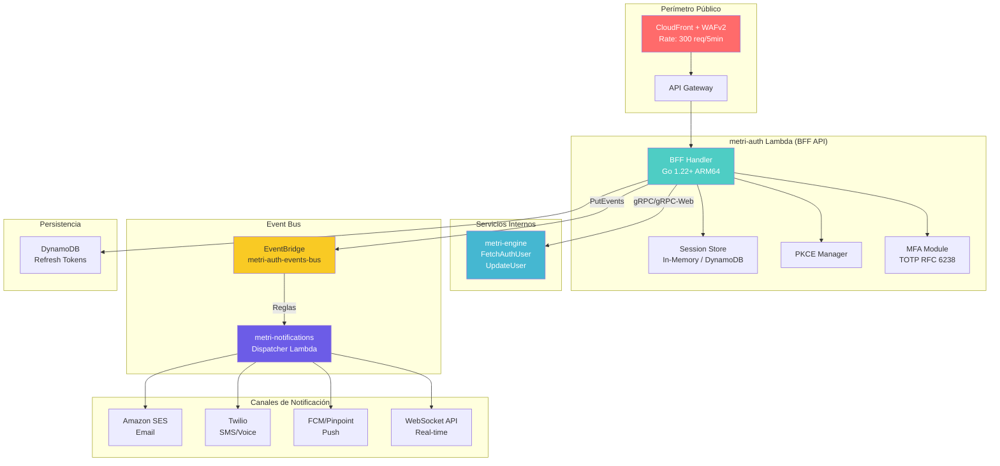
```mermaid
graph TB
    subgraph "Perímetro Público"
        CF["CloudFront + WAFv2<br/>Rate: 300 req/5min"]
        CF --> APIGW["API Gateway"]
    end

    subgraph "metri-auth Lambda (BFF API)"
        APIGW --> BFF["BFF Handler<br/>Go 1.22+ ARM64"]
        BFF --> SESS["Session Store<br/>In-Memory / DynamoDB"]
        BFF --> PKCE["PKCE Manager"]
        BFF --> MFA_MOD["MFA Module<br/>TOTP RFC 6238"]
    end

    subgraph "Servicios Internos"
        BFF -->|"gRPC/gRPC-Web"| ENGINE["metri-engine<br/>FetchAuthUser<br/>UpdateUser"]
    end

    subgraph "Event Bus"
        BFF -->|"PutEvents"| EB["EventBridge<br/>metri-auth-events-bus"]
        EB -->|"Reglas"| NOTIF["metri-notifications<br/>Dispatcher Lambda"]
    end

    subgraph "Canales de Notificación"
        NOTIF --> SES["Amazon SES<br/>Email"]
        NOTIF --> TWILIO["Twilio<br/>SMS/Voice"]
        NOTIF --> FCM["FCM/Pinpoint<br/>Push"]
        NOTIF --> WS["WebSocket API<br/>Real-time"]
    end

    subgraph "Persistencia"
        BFF --> DDB["DynamoDB<br/>Refresh Tokens"]
    end

    style CF fill:#ff6b6b,color:#fff
    style BFF fill:#4ecdc4,color:#fff
    style ENGINE fill:#45b7d1,color:#fff
    style EB fill:#f9ca24,color:#333
    style NOTIF fill:#6c5ce7,color:#fff
```

---

## 3. Flujo 1 — Registro de Usuario Nuevo

> [!IMPORTANT]
> El registro de usuarios en Metri es un proceso de **dos fases**: primero, un administrador crea la entidad de usuario en `metri-engine` con `status: "pending"` (sin contraseña). Luego, `metri-auth` gestiona la activación de credenciales mediante uno de los flujos descritos a continuación.

### Actores del Flujo de Registro

| Actor | Rol |
|---|---|
| **Admin** | Crea el usuario en metri-engine (nombre, email, tenant, roles) |
| **metri-engine** | Persiste la entidad User con `status: "pending"` en DynamoDB |
| **metri-auth** | Orquesta la verificación de identidad y establecimiento de credenciales |
| **metri-notifications** | Entrega el medio de verificación (email, SMS, etc.) |
| **Usuario Final** | Recibe la invitación y completa su registro |

---

### 3A. Flujo 1A — Magic Link por Correo

> **Canal de entrega**: Email via metri-notifications (Amazon SES)  
> **Evento EventBridge**: `USER_REGISTRATION_MAGIC_LINK`  
> **Caso de uso**: El usuario tiene una dirección de correo electrónico asociada  
> **Endpoints**: `POST /auth/register/magic-link` → `GET /auth/register/verify` → `POST /auth/reset-password`

---

#### 3A.1 Máquina de Estados

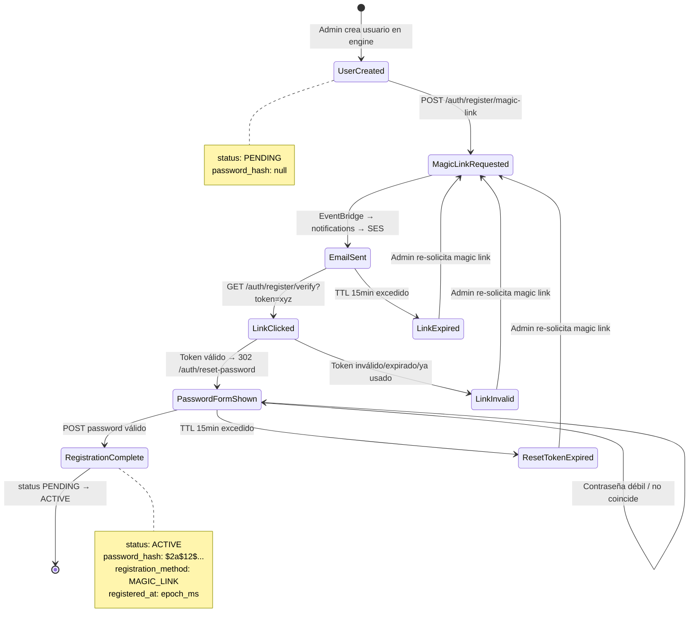
```mermaid
stateDiagram-v2
    [*] --> UserCreated: Admin crea usuario en engine
    UserCreated --> MagicLinkRequested: POST /auth/register/magic-link
    MagicLinkRequested --> EmailSent: EventBridge → notifications → SES
    EmailSent --> LinkClicked: GET /auth/register/verify?token=xyz
    EmailSent --> LinkExpired: TTL 15min excedido
    LinkExpired --> MagicLinkRequested: Admin re-solicita magic link
    LinkClicked --> PasswordFormShown: Token válido → 302 /auth/reset-password
    LinkClicked --> LinkInvalid: Token inválido/expirado/ya usado
    LinkInvalid --> MagicLinkRequested: Admin re-solicita magic link
    PasswordFormShown --> RegistrationComplete: POST password válido
    PasswordFormShown --> PasswordFormShown: Contraseña débil / no coincide
    PasswordFormShown --> ResetTokenExpired: TTL 15min excedido
    ResetTokenExpired --> MagicLinkRequested: Admin re-solicita magic link
    RegistrationComplete --> [*]: status PENDING → ACTIVE

    note right of UserCreated
        status: PENDING
        password_hash: null
    end note

    note right of RegistrationComplete
        status: ACTIVE
        password_hash: $2a$12$...
        registration_method: MAGIC_LINK
        registered_at: epoch_ms
    end note
```

---

#### 3A.2 Diagrama de Secuencia Detallado


```mermaid
sequenceDiagram
    autonumber
    participant Admin as 👤 Admin
    participant App as metri-app (UI)
    participant Engine as metri-engine
    participant Auth as metri-auth (BFF)
    participant Cache as In-Memory
    participant EB as EventBridge
    participant Notif as metri-notifications
    participant S3 as S3 Templates
    participant SES as Amazon SES
    participant User as 👤 Usuario Nuevo

    rect rgb(240, 248, 255)
        Note over Admin,Engine: FASE 1 — Creación del Usuario (metri-app → metri-engine)
        Admin->>App: Formulario "Nuevo Usuario":<br/>first_name, last_name, username,<br/>email, tenant_id, role_ids, user_type
        App->>Engine: gRPC Transact(CREATE, user, {<br/>  first_name, last_name, username,<br/>  email, tenant_id, role_ids,<br/>  user_type: "INTERNAL"<br/>})
        Engine->>Engine: Validar Códice schema:<br/>→ username: unique identity ✅<br/>→ email: unique identity ✅<br/>→ status: default "PENDING"<br/>→ failed_attempts: default 0<br/>→ mfa_enabled: default false
        Engine-->>App: ✅ {entity_id: "usr-uuid-xxx"}
        App-->>Admin: ✅ "Usuario creado. Seleccione método de invitación."
    end

    rect rgb(255, 248, 240)
        Note over Admin,Auth: FASE 2 — Solicitud del Magic Link
        Admin->>App: Click "Enviar invitación por email"
        App->>Auth: POST /auth/register/magic-link<br/>Content-Type: application/json<br/>Authorization: Bearer admin_session<br/>{<br/>  "tenant_id": "t-uuid",<br/>  "user_id": "usr-uuid-xxx",<br/>  "email": "nuevo@empresa.com"<br/>}
        Auth->>Auth: Validar request:<br/>→ tenant_id ≠ "" ✅<br/>→ user_id ≠ "" ✅<br/>→ email matches regex ✅
        Auth->>Auth: generateOpaqueToken()<br/>→ crypto/rand 32 bytes<br/>→ hex encode<br/>→ "a4f8c3e1d7b2..."
        Auth->>Cache: SAVE(KindMagic, "a4f8c3e1d7b2...",<br/>{<br/>  "user_id": "usr-uuid-xxx",<br/>  "tenant_id": "t-uuid",<br/>  "email": "nuevo@empresa.com",<br/>  "flow": "magic_link"<br/>}, TTL=15min)
        Cache-->>Auth: OK
        Auth->>Auth: Construir URL firmada:<br/>magicURL = baseURL +<br/>"/auth/register/verify?token=a4f8c3e1d7b2...&state=register"
    end

    rect rgb(240, 255, 240)
        Note over Auth,SES: FASE 3 — Publicación de Evento y Entrega del Email
        Auth->>EB: PutEvents({<br/>  Source: "metri.auth",<br/>  DetailType: "USER_REGISTRATION_MAGIC_LINK",<br/>  Detail: {<br/>    "user_id": "usr-uuid-xxx",<br/>    "email": "nuevo@empresa.com",<br/>    "token": "a4f8c3e1d7b2...",<br/>    "url": "https://auth.metri.one/auth/register/verify?token=...",<br/>    "tenant_id": "t-uuid",<br/>    "timestamp": "2026-06-30T14:20:00Z"<br/>  }<br/>})
        Auth-->>App: 200 OK {<br/>  "success": true,<br/>  "message": "Magic link enviado a nuevo@empresa.com"<br/>}
        App-->>Admin: ✅ "Invitación enviada"
        EB->>Notif: EventBridge Rule match:<br/>source = "metri.auth"<br/>detail-type = "USER_REGISTRATION_MAGIC_LINK"
        Notif->>Notif: Idempotency Guard:<br/>DynamoDB conditional write (24h TTL)
        Notif->>S3: GET templates/metri-auth/<br/>magic_link_invite.html
        S3-->>Notif: Template HTML (MJML compiled)
        Notif->>Notif: Load tenant BrandingConfig:<br/>→ logo_url, primary_color,<br/>  company_name from DynamoDB
        Notif->>Notif: Render template:<br/>→ {{.URL}} = magic link<br/>→ {{.UserName}} = "nuevo@empresa.com"<br/>→ {{.ExpiresIn}} = "15 minutos"<br/>→ {{.CompanyName}} = branding<br/>→ {{.LogoURL}} = branding
        Notif->>Notif: Verificar email reputation:<br/>→ email_status ≠ BOUNCED ✅<br/>→ email_status ≠ COMPLAINT ✅
        Notif->>SES: ses:SendEmail({<br/>  To: "nuevo@empresa.com",<br/>  Subject: "Te invitaron a Metri",<br/>  HtmlBody: rendered_html<br/>})
        SES-->>User: 📧 Email con Magic Link
    end

    rect rgb(255, 240, 255)
        Note over User,Engine: FASE 4 — Clic en el Magic Link
        User->>User: 📧 Abrir email → Click botón<br/>"Activar mi cuenta"
        User->>Auth: GET /auth/register/verify<br/>?token=a4f8c3e1d7b2...&state=register
        Auth->>Auth: Validar parámetros:<br/>→ token ≠ "" ✅<br/>→ len(token) == 64 hex chars ✅
        Auth->>Cache: GET(KindMagic, "a4f8c3e1d7b2...")
        alt Token válido
            Cache-->>Auth: {user_id, tenant_id, email, flow}
            Auth->>Cache: DEL(KindMagic, "a4f8c3e1d7b2...")<br/>← Anti-replay: destruir ANTES de procesar
            Auth->>Auth: generateOpaqueToken() → resetToken
            Auth->>Cache: SAVE(KindReset, resetToken,<br/>{user_id, tenant_id}, TTL=15min)
            Auth-->>User: 302 Found<br/>Location: /auth/reset-password<br/>?token=resetToken&state=register&mode=register
        else Token expirado o ya usado
            Cache-->>Auth: "" (empty) o error
            Auth-->>User: Renderizar error.html<br/>Code: "invalid_grant"<br/>Desc: "Magic link is invalid or has expired."
        end
    end

    rect rgb(248, 255, 248)
        Note over User,Engine: FASE 5 — Establecimiento de Contraseña
        User->>Auth: GET /auth/reset-password<br/>?token=resetToken&state=register&mode=register
        Auth-->>User: Renderizar reset_password.html<br/>(modo registro: textos adaptados)
        User->>User: Ingresar nueva contraseña<br/>+ confirmación
        User->>Auth: POST /auth/reset-password<br/>{token: resetToken, password: "...",<br/>confirm: "...", state: "register"}
        Auth->>Auth: Validar contraseña:<br/>→ password == confirm ✅<br/>→ len(password) >= 8 ✅<br/>→ complexity check ✅
        Auth->>Cache: GET(KindReset, resetToken)
        Cache-->>Auth: {user_id, tenant_id}
        Auth->>Auth: bcrypt.GenerateFromPassword(<br/>password, cost=12) en proceso<br/>→ ~80-150ms CPU
        Auth->>Engine: gRPC Transact(UPDATE, user,<br/>"usr-uuid-xxx", {<br/>  "password_hash": "$2a$12$...",<br/>  "status": "ACTIVE",<br/>  "registration_method": "MAGIC_LINK",<br/>  "registered_at": 1751299200000<br/>})
        Engine-->>Auth: ✅ Updated
        Auth->>Cache: DEL(KindReset, resetToken)<br/>← Single-use: destruir solo tras éxito en DB
        Auth->>EB: PutEvents({<br/>  DetailType: "USER_REGISTRATION_COMPLETED",<br/>  Detail: {user_id, tenant_id,<br/>    registration_method: "MAGIC_LINK",<br/>    timestamp}<br/>})
        Auth-->>User: 302 → /auth/login?state=register<br/>&info=registration_complete
        User->>User: Pantalla login con banner:<br/>"✅ Cuenta activada. Inicia sesión."
    end
```

---

#### 3A.3 Contratos API

##### `POST /auth/register/magic-link` — Solicitar Magic Link

**Request:**

```http
POST /auth/register/magic-link HTTP/1.1
Host: auth.metri.one
Content-Type: application/json
Authorization: Bearer <admin_session_token>

{
  "tenant_id": "t-uuid-xxx",
  "user_id": "usr-uuid-xxx",
  "email": "nuevo@empresa.com"
}
```

**Response (Success):**

```http
HTTP/1.1 200 OK
Content-Type: application/json

{
  "success": true,
  "message": "Magic link enviado a nuevo@empresa.com",
  "magic_link": "https://auth.metri.one/auth/register/verify?token=a4f8...&state=register",
  "expires_in": 900
}
```

**Response (Error):**

```http
HTTP/1.1 400 Bad Request
Content-Type: application/json

{
  "error": "invalid_request",
  "error_description": "Missing required field: email"
}
```

##### `GET /auth/register/verify` — Verificar Magic Link

**Request:**

```http
GET /auth/register/verify?token=a4f8c3e1d7b2...&state=register HTTP/1.1
Host: auth.metri.one
```

**Response (Success):**

```http
HTTP/1.1 302 Found
Location: /auth/reset-password?token=<resetToken>&state=register&mode=register
```

**Response (Token Inválido/Expirado):**

```http
HTTP/1.1 200 OK
Content-Type: text/html

<!-- Renderiza error.html con: -->
<!-- Code: "invalid_grant" -->
<!-- Desc: "Magic link is invalid or has expired." -->
```

---

#### 3A.4 Matriz de Errores y Recuperación

| Escenario | Error | HTTP | Mensaje al Usuario | Recuperación |
|---|---|---|---|---|
| `token` vacío en URL | `invalid_request` | 400 | "Enlace de registro no válido." | Admin re-envía magic link |
| Token no existe en cache | `invalid_grant` | 200 (HTML) | "El enlace ha expirado o ya fue utilizado." | Admin re-envía magic link |
| Token expirado (>15min) | `invalid_grant` | 200 (HTML) | "El enlace ha expirado o ya fue utilizado." | Admin re-envía magic link |
| Token ya consumido (replay) | `invalid_grant` | 200 (HTML) | "El enlace ha expirado o ya fue utilizado." | Admin re-envía magic link |
| Email con bounce en SES | Event silently fails | N/A | Admin no recibe confirmación | Admin verifica email y re-envía |
| Reset token expirado (>15min) | `expired` | 302 | "El token de restablecimiento ha expirado." | Admin re-envía magic link |
| Passwords no coinciden | `mismatch` | 302 | "Las contraseñas no coinciden." | Re-ingresar en formulario |
| Contraseña débil (<8 chars) | `weak` | 302 | "La contraseña es demasiado débil." | Re-ingresar en formulario |
| User ya está ACTIVE | N/A | — | Magic link funciona (sobrescribe password) | Idempotente: se puede re-registrar |
| Engine no disponible (gRPC) | `server_error` | 500 | "Error interno. Inténtelo más tarde." | Retry automático (gRPC retry policy) |

---

#### 3A.5 Edge Cases

| Edge Case | Comportamiento | Justificación |
|---|---|---|
| **Admin solicita 2 magic links seguidos** | El segundo **sobrescribe** al primero (nuevo KindMagic token). El token anterior queda huérfano y expira por TTL. | Último token emitido es el válido |
| **Usuario hace clic en link expirado** | Página de error amigable con instrucción de contactar al admin | Anti-frustración UX |
| **Usuario hace clic 2 veces (doble-clic)** | Primer clic consume el token → redirect exitoso. Segundo clic → `invalid_grant` (token ya destruido) | Anti-replay por diseño |
| **Atacante intercepta el email** | Token single-use: si el atacante lo usa primero, el usuario legítimo ve `invalid_grant`. Si el usuario lo usa primero, el atacante ve `invalid_grant`. | No hay ventana de replay |
| **Email bounce/complaint** | metri-notifications verifica `email_status` antes de enviar. Si bounce, el email no se envía pero el token sigue en cache (expira por TTL) | Protección de reputación SES |
| **Usuario ya registrado (ACTIVE)** | El magic link funciona — genera un resetToken que permite cambiar password. `status` se vuelve a escribir como `ACTIVE`. | Idempotente: permite re-registro |
| **Magic link abierto desde otro dispositivo** | Funciona: el token no está vinculado a un dispositivo/IP/fingerprint | Usabilidad: forward de email a mobile |

---

#### 3A.6 Especificación de Pantallas

##### Email Template (`magic_link_invite.html`)

```
┌─────────────────────────────────────────────┐
│  [Logo del Tenant]                          │
│                                             │
│  ¡Bienvenido a {{CompanyName}}!             │
│                                             │
│  Has sido invitado a unirte a la            │
│  plataforma de gestión de activos.          │
│                                             │
│  ┌─────────────────────────────────────┐    │
│  │     Activar mi cuenta               │    │
│  │     (botón CTA principal)           │    │
│  └─────────────────────────────────────┘    │
│                                             │
│  Este enlace expira en 15 minutos.          │
│                                             │
│  Si no solicitaste esta invitación,         │
│  puedes ignorar este correo.                │
│                                             │
│  ─────────────────────────────────────────  │
│  © 2026 Metri · Términos · Privacidad       │
└─────────────────────────────────────────────┘
```

##### Pantalla de Establecimiento de Contraseña (`reset_password.html`, `mode=register`)

```
┌─────────────────────────────────────────────┐
│  [Logo Metri]                               │
│                                             │
│  Configura tu contraseña                    │
│                                             │
│  Estás a un paso de activar tu cuenta.      │
│                                             │
│  ┌─────────────────────────────────────┐    │
│  │ Nueva contraseña         🔒  👁️    │    │
│  └─────────────────────────────────────┘    │
│  ┌─────────────────────────────────────┐    │
│  │ Confirmar contraseña     🔒  👁️    │    │
│  └─────────────────────────────────────┘    │
│                                             │
│  Requisitos:                                │
│  ☑ Mínimo 8 caracteres                     │
│  ☐ Al menos una mayúscula                  │
│  ☐ Al menos un número                      │
│                                             │
│  ┌─────────────────────────────────────┐    │
│  │         Activar cuenta              │    │
│  └─────────────────────────────────────┘    │
└─────────────────────────────────────────────┘
```

---

#### 3A.7 Propiedades de Seguridad

| Propiedad | Valor | Detalle |
|---|---|---|
| **TTL del Magic Link** | 15 minutos | `SAVE(KindMagic, ..., TTL=15min)` |
| **TTL del Reset Token** | 15 minutos | `SAVE(KindReset, ..., TTL=15min)` |
| **Uso** | Single-use | `DEL(KindMagic, token)` inmediato post-lectura |
| **Anti-replay** | Destrucción pre-procesamiento | Token destruido ANTES de generar resetToken |
| **Entropía del token** | 256 bits | `crypto/rand` 32 bytes → hex (64 chars) |
| **Transporte** | HTTPS-only | CloudFront `redirect-to-https` + `__Host-` cookies |
| **WAFv2 Rate Limit** | 300 req / 5 min / IP | Previene enumeración masiva de tokens |
| **Bcrypt Cost** | 12 | ~80-150ms por hash (en proceso) |
| **Fingerprint Binding** | No (por diseño) | Permite forward de email a otro dispositivo |

#### 3A.8 Implementación en Código

**Endpoint de solicitud** — [oidc.go](file:///Users/macuser/projects/metri/metri-auth/internal/interfaces/http/handlers/oidc.go#L412-L452) (`HandleRequestMagicLink`):

```go
// POST /auth/register/magic-link
func (h *AuthHandler) HandleRequestMagicLink(w http.ResponseWriter, r *http.Request) {
    // 1. Decodificar body: {tenant_id, user_id, email}
    // 2. Generar token efímero (KindMagic, 15min TTL)
    // 3. Construir URL firmada
    // 4. Publicar USER_REGISTRATION_MAGIC_LINK → EventBridge
}
```

**Endpoint de verificación** — [oidc.go](file:///Users/macuser/projects/metri/metri-auth/internal/interfaces/http/handlers/oidc.go#L372-L408) (`HandleMagicLinkVerify`):

```go
// GET /auth/register/verify?token=xyz&state=register
func (h *AuthHandler) HandleMagicLinkVerify(w http.ResponseWriter, r *http.Request) {
    // 1. Recuperar datos de KindMagic (SessionStore)
    // 2. Destruir token inmediatamente (anti-replay)
    // 3. Crear KindReset efímero para formulario de password
    // 4. Redirect → /auth/reset-password?token=...&mode=register
}
```

---

### 3B. Flujo 1B — Registro por Código QR

> **Canal de entrega**: QR generado y presentado en pantalla por el administrador  
> **Caso de uso**: Onboarding presencial — el admin muestra un QR al nuevo usuario (ej: operarios en planta, técnicos de campo)  
> **Endpoints**: `POST /auth/register/qr` → `GET /auth/register/verify` → `POST /auth/reset-password`

> [!NOTE]
> Este flujo es ideal para escenarios donde el usuario nuevo está **físicamente presente** con el administrador. El QR contiene una URL de registro que el usuario escanea con su dispositivo móvil. No requiere email ni teléfono.

---

#### 3B.1 Máquina de Estados

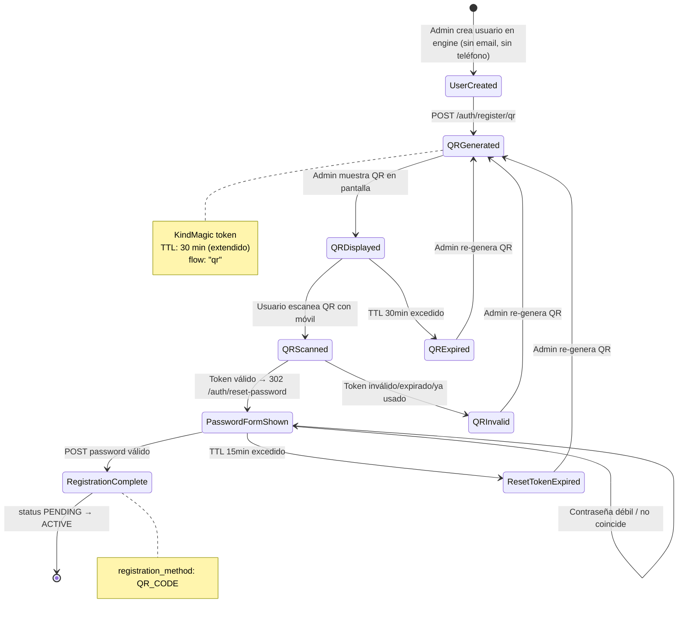
```mermaid
stateDiagram-v2
    [*] --> UserCreated: Admin crea usuario en engine (sin email, sin teléfono)
    UserCreated --> QRGenerated: POST /auth/register/qr
    QRGenerated --> QRDisplayed: Admin muestra QR en pantalla
    QRDisplayed --> QRScanned: Usuario escanea QR con móvil
    QRDisplayed --> QRExpired: TTL 30min excedido
    QRExpired --> QRGenerated: Admin re-genera QR
    QRScanned --> PasswordFormShown: Token válido → 302 /auth/reset-password
    QRScanned --> QRInvalid: Token inválido/expirado/ya usado
    QRInvalid --> QRGenerated: Admin re-genera QR
    PasswordFormShown --> RegistrationComplete: POST password válido
    PasswordFormShown --> PasswordFormShown: Contraseña débil / no coincide
    PasswordFormShown --> ResetTokenExpired: TTL 15min excedido
    ResetTokenExpired --> QRGenerated: Admin re-genera QR
    RegistrationComplete --> [*]: status PENDING → ACTIVE

    note right of QRGenerated
        KindMagic token
        TTL: 30 min (extendido)
        flow: "qr"
    end note

    note right of RegistrationComplete
        registration_method: QR_CODE
    end note
```

---

#### 3B.2 Diagrama de Secuencia Detallado


```mermaid
sequenceDiagram
    autonumber
    participant Admin as 👤 Admin
    participant App as metri-app (UI)
    participant Engine as metri-engine
    participant Auth as metri-auth (BFF)
    participant Cache as In-Memory
    participant User as 👤 Usuario Nuevo (Móvil)
        Auth->>Auth: bcrypt.GenerateFromPassword(<br/>password, cost=12) en proceso<br/>→ ~80-150ms CPU
    participant EB as EventBridge

    rect rgb(240, 248, 255)
        Note over Admin,Engine: FASE 1 — Creación del Usuario (sin email)
        Admin->>App: Formulario "Nuevo Usuario":<br/>first_name, last_name, username,<br/>tenant_id, role_ids, user_type<br/>⚠️ email: vacío, primary_phone: vacío
        App->>Engine: gRPC Transact(CREATE, user, {<br/>  first_name, last_name, username,<br/>  tenant_id, role_ids,<br/>  user_type: "INTERNAL"<br/>})
        Note over Engine: Validar Códice schema:<br/>→ email: required=false → null ✅<br/>→ status: default "PENDING"
        Engine-->>App: ✅ {entity_id: "usr-uuid-xxx"}
        App-->>Admin: ✅ "Usuario creado.<br/>Seleccione método de invitación."
    end

    rect rgb(255, 248, 240)
        Note over Admin,Auth: FASE 2 — Generación del QR de Registro
        Admin->>App: Click "Generar código QR"
        App->>Auth: POST /auth/register/qr<br/>Content-Type: application/json<br/>Authorization: Bearer admin_session<br/>{<br/>  "tenant_id": "t-uuid",<br/>  "user_id": "usr-uuid-xxx"<br/>}
        Auth->>Auth: Validar:<br/>→ tenant_id ≠ "" ✅<br/>→ user_id ≠ "" ✅
        Auth->>Auth: generateOpaqueToken()<br/>→ registrationToken
        Auth->>Cache: SAVE(KindMagic, registrationToken,<br/>{<br/>  "user_id": "usr-uuid-xxx",<br/>  "tenant_id": "t-uuid",<br/>  "flow": "qr"<br/>}, TTL=30min)
        Auth->>Auth: Construir URL:<br/>regURL = baseURL +<br/>"/auth/register/verify?token=..."<br/>"&state=qr"
        Auth->>Auth: Generar QR image URL:<br/>→ Opción A: API externa (qrserver.com)<br/>→ Opción B: Librería Go (skip2/go-qrcode)<br/>→ Opción C: Frontend genera QR con JS
        Auth-->>App: 200 OK {<br/>  "registration_url": "https://auth...",<br/>  "qr_data": "https://auth.metri.one/auth/register/verify?token=...",<br/>  "expires_in": 1800,<br/>  "expires_at": "2026-06-30T14:50:00Z"<br/>}
        App->>App: Renderizar QR en pantalla<br/>usando qr_data (JS QR library)
        App->>App: Mostrar countdown timer<br/>de 30 minutos
        App-->>Admin: 📱 QR Code visible en pantalla
    end

    rect rgb(240, 255, 240)
        Note over Admin,User: FASE 3 — Escaneo Presencial del QR
        Admin->>Admin: Muestra pantalla con QR<br/>al usuario nuevo (presencial)
        User->>User: 📱 Abre cámara del móvil<br/>→ Escanea QR code
        User->>User: 📱 Navegador móvil abre URL<br/>del QR automáticamente
        User->>Auth: GET /auth/register/verify<br/>?token=registrationToken&state=qr
    end

    rect rgb(255, 240, 255)
        Note over Auth,Engine: FASE 4 — Verificación del Token y Establecimiento de Contraseña
        Auth->>Cache: GET(KindMagic, registrationToken)
        alt Token válido
            Cache-->>Auth: {user_id, tenant_id, flow: "qr"}
            Auth->>Cache: DEL(KindMagic, registrationToken)<br/>← Anti-replay: destruir inmediatamente
            Auth->>Auth: generateOpaqueToken() → resetToken
            Auth->>Cache: SAVE(KindReset, resetToken,<br/>{user_id, tenant_id}, TTL=15min)
            Auth-->>User: 302 Found<br/>Location: /auth/reset-password<br/>?token=resetToken&state=qr&mode=register
        else Token expirado o inválido
            Cache-->>Auth: "" (empty)
            Auth-->>User: Renderizar error.html<br/>"El código QR ha expirado.<br/>Solicite uno nuevo al administrador."
        end
    end

    rect rgb(248, 255, 248)
        Note over User,Engine: FASE 5 — Creación de Contraseña (en móvil)
        User->>Auth: GET /auth/reset-password<br/>?token=resetToken&state=qr&mode=register
        Auth-->>User: 📱 Renderizar reset_password.html<br/>(diseño responsive para móvil)
        User->>User: 📱 Ingresar nueva contraseña<br/>+ confirmación
        User->>Auth: POST /auth/reset-password<br/>{token: resetToken, password, confirm}
        Auth->>Auth: Validar contraseña:<br/>→ password == confirm ✅<br/>→ len >= 8, complexity ✅
        Auth->>Cache: GET(KindReset, resetToken) → {user_id, tenant_id}
        Auth->>Auth: bcrypt.GenerateFromPassword(<br/>password, cost=12) en proceso<br/>→ ~80-150ms CPU
        Auth->>Engine: gRPC Transact(UPDATE, user,<br/>"usr-uuid-xxx", {<br/>  "password_hash": "$2a$12$...",<br/>  "status": "ACTIVE",<br/>  "registration_method": "QR_CODE",<br/>  "registered_at": 1751299200000<br/>})
        Engine-->>Auth: ✅ Updated
        Auth->>Cache: DEL(KindReset, resetToken)<br/>← Single-use: destruir solo tras éxito en DB
        Auth->>EB: PutEvents(USER_REGISTRATION_COMPLETED,<br/>{user_id, tenant_id,<br/>registration_method: "QR_CODE", timestamp})
        Auth-->>User: 302 → /auth/login<br/>?state=qr&info=registration_complete
        User->>User: 📱 Pantalla login con banner:<br/>"✅ Cuenta activada. Inicia sesión."
    end
```

---

#### 3B.3 Contratos API

##### `POST /auth/register/qr` — Generar QR de Registro

**Request:**

```http
POST /auth/register/qr HTTP/1.1
Host: auth.metri.one
Content-Type: application/json
Authorization: Bearer <admin_session_token>

{
  "tenant_id": "t-uuid-xxx",
  "user_id": "usr-uuid-xxx"
}
```

**Response (Success):**

```http
HTTP/1.1 200 OK
Content-Type: application/json

{
  "registration_url": "https://auth.metri.one/auth/register/verify?token=a4f8...&state=qr",
  "qr_data": "https://auth.metri.one/auth/register/verify?token=a4f8...&state=qr",
  "expires_in": 1800,
  "expires_at": "2026-06-30T14:50:00Z"
}
```

> [!TIP]
> El campo `qr_data` contiene la URL cruda que el frontend debe codificar como QR usando una librería JavaScript (ej: `qrcode.js`, `qr-code-styling`). Esto evita una dependencia en APIs externas de QR y permite personalización del diseño del QR (colores del tenant, logo embebido).

**Response (Error):**

```http
HTTP/1.1 400 Bad Request
Content-Type: application/json

{
  "error": "invalid_request",
  "error_description": "Missing required field: user_id"
}
```

---

#### 3B.4 Matriz de Errores y Recuperación

| Escenario | Error | HTTP | Mensaje al Usuario | Recuperación |
|---|---|---|---|---|
| `user_id` vacío | `invalid_request` | 400 | "Falta el campo user_id." | Admin corrige request |
| Token QR expirado (>30min) | `invalid_grant` | 200 (HTML) | "El código QR ha expirado. Solicite uno nuevo." | Admin re-genera QR |
| QR ya escaneado (replay) | `invalid_grant` | 200 (HTML) | "El código QR ha expirado. Solicite uno nuevo." | Admin re-genera QR |
| Segundo escaneo simultáneo | `invalid_grant` | 200 (HTML) | El segundo request falla (token ya destruido) | Operación atómica por diseño |
| Reset token expirado | `expired` | 302 | "El token ha expirado." | Admin re-genera QR |
| Passwords no coinciden | `mismatch` | 302 | "Las contraseñas no coinciden." | Re-ingresar en formulario |
| Dispositivo sin internet | N/A | timeout | "Sin conexión." | Reconectar y re-escanear (si TTL permite) |
| QR fotografiado por tercero | N/A | N/A | Riesgo: tercero puede registrarse en su lugar | Mitigación: admin verifica identidad presencial |

---

#### 3B.5 Edge Cases

| Edge Case | Comportamiento | Justificación |
|---|---|---|
| **Admin genera 2 QRs seguidos** | Cada QR genera un token independiente. Ambos son válidos simultáneamente hasta que uno se use (destruyendo solo su token) o expire. | Un admin podría generar QR para múltiples dispositivos del mismo usuario |
| **QR escaneado desde laptop (no móvil)** | Funciona idénticamente: la URL abre en el navegador del laptop | El flujo no requiere móvil — QR es solo un mecanismo de entrega de URL |
| **Admin cierra pestaña antes de que se escanee** | El token sigue vivo en cache durante 30min independientemente del estado del UI | El token es server-side, no depende del frontend |
| **Red empresarial bloquea auth.metri.one** | El escaneo falla con timeout de red | El usuario necesita una red que permita HTTPS a auth.metri.one |
| **Mismo usuario recibe magic link Y QR** | Ambos tokens coexisten. El primero que se use activa la cuenta. El segundo devuelve `invalid_grant` ya que el usuario ya es ACTIVE. | Los tokens son independientes |
| **QR impreso en papel para entrega diferida** | Funciona dentro del TTL de 30 minutos | Caso válido para entornos sin conectividad inmediata |

---

#### 3B.6 Especificación de Pantallas

##### Pantalla Admin — Generación QR (`metri-app`)

```
┌─────────────────────────────────────────────┐
│  [← Volver]  Invitar Usuario                │
│                                             │
│  Usuario: Juan Pérez (@jperez)              │
│  Tenant: Planta Norte                       │
│  Método: 🔘 Email  🔘 QR Code  🔘 Código   │
│                                             │
│  ┌─────────────────────────────────┐        │
│  │                                 │        │
│  │         ██████████████          │        │
│  │         ██          ██          │        │
│  │         ██  ██████  ██          │        │
│  │         ██  ██  ██  ██          │        │
│  │         ██  ██████  ██          │        │
│  │         ██          ██          │        │
│  │         ██████████████          │        │
│  │             (QR Code)           │        │
│  │                                 │        │
│  └─────────────────────────────────┘        │
│                                             │
│  ⏱ Expira en: 28:45                        │
│                                             │
│  Instrucciones:                             │
│  1. Muestre este QR al nuevo usuario        │
│  2. El usuario lo escanea con su móvil      │
│  3. Establecerá su contraseña               │
│                                             │
│  ┌──────────────────┐ ┌──────────────────┐  │
│  │  Regenerar QR    │ │  Copiar enlace   │  │
│  └──────────────────┘ └──────────────────┘  │
└─────────────────────────────────────────────┘
```

##### Pantalla Usuario Móvil — Post-Escaneo (`reset_password.html`, responsive)

```
┌──────────────────────────┐
│  [Logo Metri]            │
│                          │
│  Bienvenido, Juan        │
│                          │
│  Configura tu contraseña │
│  para activar tu cuenta  │
│                          │
│  ┌──────────────────┐    │
│  │ Contraseña  🔒👁️ │    │
│  └──────────────────┘    │
│  ┌──────────────────┐    │
│  │ Confirmar   🔒👁️ │    │
│  └──────────────────┘    │
│                          │
│  ☑ Mín. 8 caracteres    │
│  ☐ Una mayúscula        │
│  ☐ Un número            │
│                          │
│  ┌──────────────────┐    │
│  │  Activar cuenta  │    │
│  └──────────────────┘    │
└──────────────────────────┘
```

---

#### 3B.7 Propiedades de Seguridad

| Propiedad | Valor | Detalle |
|---|---|---|
| **TTL del QR Token** | 30 minutos | Extendido vs Magic Link por contexto presencial |
| **TTL del Reset Token** | 15 minutos | Post-escaneo, ventana para crear password |
| **Uso** | Single-use | `DEL(KindMagic, token)` inmediato post-escaneo |
| **Tipo de cache** | `KindMagic` | Reutiliza la semántica existente, campo `flow: "qr"` |
| **Verificación** | Mismo endpoint `/auth/register/verify` | Reutiliza `HandleMagicLinkVerify` |
| **Entropía** | 256 bits | Misma generación que magic link |
| **QR Rendering** | Frontend (JS) o server-side | `qr_data` en response para rendering client-side |
| **Riesgo presencial** | Bajo | Admin debe verificar identidad visual del usuario |

> [!TIP]
> El flujo QR reutiliza el mismo [HandleMagicLinkVerify](file:///Users/macuser/projects/metri/metri-auth/internal/interfaces/http/handlers/oidc.go#L372) existente, diferenciándose únicamente en el TTL (30min vs 15min) y el canal de entrega (pantalla vs email). El campo `flow: "qr"` permite trazabilidad en eventos de auditoría y analytics.

#### 3B.8 Endpoint Propuesto

```go
// POST /auth/register/qr
// Genera un token de registro y devuelve los datos para generar el QR en el frontend
func (h *AuthHandler) HandleRegisterQR(w http.ResponseWriter, r *http.Request) {
    var body struct {
        TenantID string `json:"tenant_id"`
        UserID   string `json:"user_id"`
    }
    json.NewDecoder(r.Body).Decode(&body)

    // Generar token efímero de registro (reutiliza KindMagic con TTL extendido)
    regToken := generateOpaqueToken()
    regData, _ := json.Marshal(map[string]string{
        "user_id":   body.UserID,
        "tenant_id": body.TenantID,
        "flow":      "qr",
    })
    h.sessionRepo.Save(r.Context(), domain.KindMagic, regToken, string(regData), 30*time.Minute)

    // Construir URL para el QR
    regURL := fmt.Sprintf("%s/auth/register/verify?token=%s&state=qr", h.baseURL, regToken)

    json.NewEncoder(w).Encode(map[string]interface{}{
        "registration_url": regURL,
        "qr_data":          regURL,
        "expires_in":       1800, // 30 minutos
        "expires_at":       time.Now().Add(30 * time.Minute).UTC().Format(time.RFC3339),
    })
}
```

---

### 3C. Flujo 1C — Código de Verificación (Sin Correo ni SMS)

> **Canal de entrega**: Código alfanumérico presentado en pantalla al administrador  
> **Caso de uso**: Usuarios sin correo electrónico ni número de teléfono (operarios, personal temporal, ambientes restringidos)  
> **Endpoints**: `POST /auth/register/verification-code` → `GET /auth/register/code` → `POST /auth/register/code/verify` → `POST /auth/reset-password`

> [!WARNING]
> Este flujo es el **fallback de último recurso** cuando el usuario no puede recibir notificaciones por ningún canal digital y no tiene un dispositivo con cámara para escanear QR. Requiere que el administrador entregue **verbalmente o por escrito** el código de verificación al usuario, quien luego lo ingresa en un navegador web.

---

#### 3C.1 Máquina de Estados

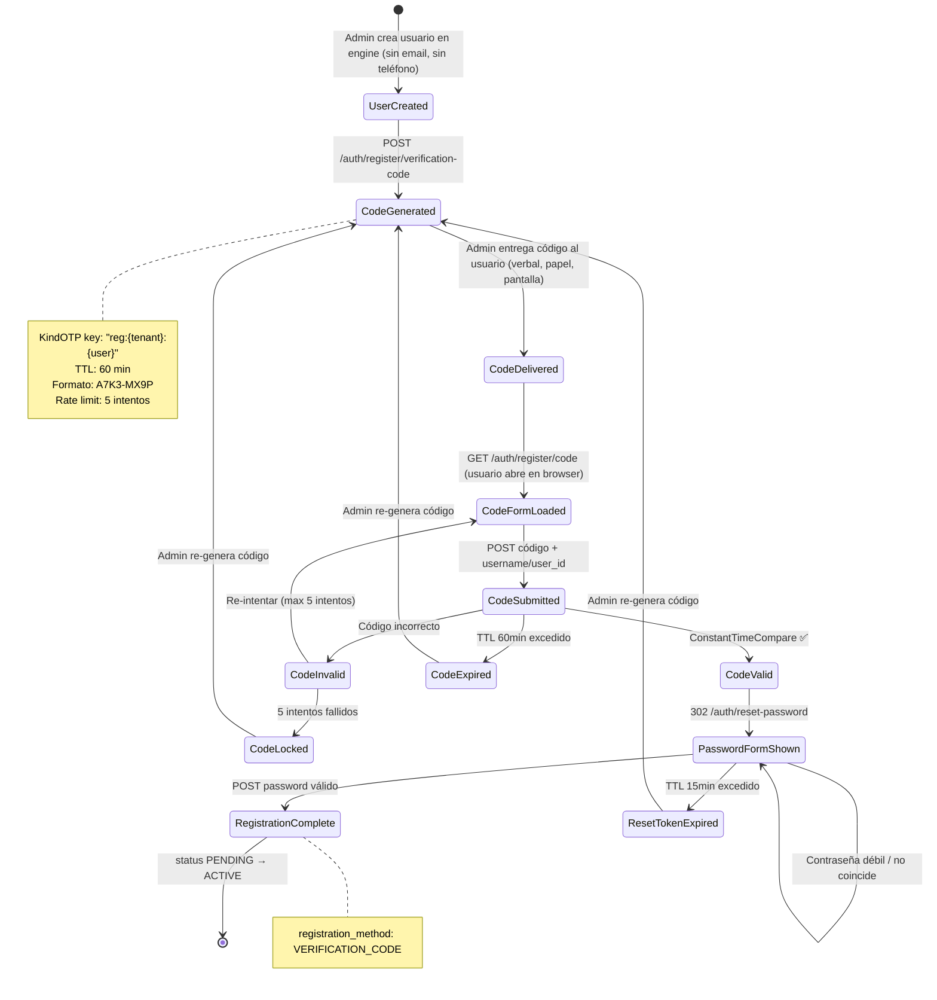
```mermaid
stateDiagram-v2
    [*] --> UserCreated: Admin crea usuario en engine (sin email, sin teléfono)
    UserCreated --> CodeGenerated: POST /auth/register/verification-code
    CodeGenerated --> CodeDelivered: Admin entrega código al usuario (verbal, papel, pantalla)
    CodeDelivered --> CodeFormLoaded: GET /auth/register/code (usuario abre en browser)
    CodeFormLoaded --> CodeSubmitted: POST código + username/user_id
    CodeSubmitted --> CodeValid: ConstantTimeCompare ✅
    CodeSubmitted --> CodeInvalid: Código incorrecto
    CodeSubmitted --> CodeExpired: TTL 60min excedido
    CodeInvalid --> CodeFormLoaded: Re-intentar (max 5 intentos)
    CodeInvalid --> CodeLocked: 5 intentos fallidos
    CodeLocked --> CodeGenerated: Admin re-genera código
    CodeExpired --> CodeGenerated: Admin re-genera código
    CodeValid --> PasswordFormShown: 302 /auth/reset-password
    PasswordFormShown --> RegistrationComplete: POST password válido
    PasswordFormShown --> PasswordFormShown: Contraseña débil / no coincide
    PasswordFormShown --> ResetTokenExpired: TTL 15min excedido
    ResetTokenExpired --> CodeGenerated: Admin re-genera código
    RegistrationComplete --> [*]: status PENDING → ACTIVE

    note right of CodeGenerated
        KindOTP key: "reg:{tenant}:{user}"
        TTL: 60 min
        Formato: A7K3-MX9P
        Rate limit: 5 intentos
    end note

    note right of RegistrationComplete
        registration_method: VERIFICATION_CODE
    end note
```

---

#### 3C.2 Diagrama de Secuencia Detallado


```mermaid
sequenceDiagram
    autonumber
    participant Admin as 👤 Admin
    participant App as metri-app (UI)
    participant Engine as metri-engine
    participant Auth as metri-auth (BFF)
    participant Cache as In-Memory
    participant User as 👤 Usuario Nuevo
    participant EB as EventBridge

    rect rgb(240, 248, 255)
        Note over Admin,Engine: FASE 1 — Creación del Usuario (sin email, sin teléfono)
        Admin->>App: Formulario "Nuevo Usuario":<br/>first_name, last_name, username,<br/>tenant_id, role_ids, user_type<br/>⚠️ email: vacío, primary_phone: vacío
        App->>Engine: gRPC Transact(CREATE, user, {<br/>  first_name, last_name, username,<br/>  tenant_id, role_ids,<br/>  user_type: "INTERNAL"<br/>})
        Engine-->>App: ✅ {entity_id: "usr-uuid-xxx"}
    end

    rect rgb(255, 248, 240)
        Note over Admin,Auth: FASE 2 — Generación del Código de Verificación
        Admin->>App: Click "Generar código de verificación"
        App->>Auth: POST /auth/register/verification-code<br/>Content-Type: application/json<br/>Authorization: Bearer admin_session<br/>{<br/>  "tenant_id": "t-uuid",<br/>  "user_id": "usr-uuid-xxx"<br/>}
        Auth->>Auth: Validar:<br/>→ tenant_id ≠ "" ✅<br/>→ user_id ≠ "" ✅
        Auth->>Auth: generateReadableCode(8)<br/>→ charset: ABCDEFGHJKLMNPQRSTUVWXYZ23456789<br/>→ (sin 0/O, 1/I/L para evitar confusión)<br/>→ crypto/rand 8 bytes → map to charset<br/>→ resultado: "A7K3MX9P"
        Auth->>Auth: formatCode("A7K3MX9P")<br/>→ "A7K3-MX9P" (grupos de 4)
        Auth->>Cache: SAVE(KindOTP, "reg:t-uuid:usr-uuid-xxx",<br/>{<br/>  "code": "A7K3MX9P",<br/>  "user_id": "usr-uuid-xxx",<br/>  "tenant_id": "t-uuid",<br/>  "flow": "code",<br/>  "attempts": 0<br/>}, TTL=60min)
        Auth-->>App: 200 OK {<br/>  "verification_code": "A7K3-MX9P",<br/>  "username": "jperez",<br/>  "expires_in": 3600,<br/>  "expires_at": "2026-06-30T15:20:00Z",<br/>  "instructions": "Entregue este código al usuario..."<br/>}
        App->>App: Mostrar código en pantalla<br/>con formato grande y legible
        App-->>Admin: ┌─────────────────────┐<br/>│  CÓDIGO:  A7K3-MX9P │<br/>│  Usuario: jperez     │<br/>│  Expira: 58:30       │<br/>└─────────────────────┘
    end

    rect rgb(240, 255, 240)
        Note over Admin,User: FASE 3 — Entrega Presencial del Código
        Admin->>User: 🗣️ "Tu código de verificación es:<br/>ALPHA SIETE KILO TRES<br/>guión<br/>MIKE XRAY NUEVE PAPA"<br/><br/>O entrega papel/tarjeta con:<br/>"A7K3-MX9P"<br/>"Tu usuario: jperez"<br/>"Ingresa en: auth.metri.one/register"
    end

    rect rgb(248, 248, 255)
        Note over User,Auth: FASE 4 — Usuario Ingresa el Código
        User->>Auth: GET /auth/register/code<br/>(Página pública de ingreso de código)
        Auth-->>User: Renderizar register_code.html:<br/>Formulario con campos:<br/>- Username o User ID<br/>- Tenant ID (select o hidden)<br/>- Código de verificación (4+4 input)
        User->>User: Ingresa: username="jperez",<br/>código="A7K3-MX9P"
        User->>Auth: POST /auth/register/code/verify<br/>{<br/>  "tenant_id": "t-uuid",<br/>  "username": "jperez",<br/>  "code": "A7K3-MX9P"<br/>}
    end

    rect rgb(255, 240, 255)
        Note over Auth,Engine: FASE 5 — Validación del Código
        Auth->>Auth: Normalizar código:<br/>→ RemoveAll("-") → "A7K3MX9P"<br/>→ ToUpper() → "A7K3MX9P"

        alt Se proporcionó username (no user_id)
            Auth->>Engine: Query(user, {username: "jperez",<br/>tenant: "t-uuid"})
            Engine-->>Auth: {id: "usr-uuid-xxx", ...}
            Auth->>Auth: user_id = "usr-uuid-xxx"
        end

        Auth->>Cache: GET(KindOTP, "reg:t-uuid:usr-uuid-xxx")

        alt Código encontrado en cache
            Cache-->>Auth: {code, user_id, tenant_id, flow, attempts}

            alt Intentos >= 5
                Auth-->>User: Renderizar error.html<br/>"Demasiados intentos fallidos.<br/>Solicite un nuevo código al administrador."
            else Intentos < 5
                Auth->>Auth: subtle.ConstantTimeCompare(<br/>[]byte("A7K3MX9P"),<br/>[]byte(stored.Code))
                alt Código correcto
                    Auth->>Cache: DEL(KindOTP, "reg:t-uuid:usr-uuid-xxx")<br/>← Invalidar inmediatamente
                    Auth->>Auth: generateOpaqueToken() → resetToken
                    Auth->>Cache: SAVE(KindReset, resetToken,<br/>{user_id, tenant_id}, TTL=15min)
                    Auth-->>User: 302 Found<br/>Location: /auth/reset-password<br/>?token=resetToken&mode=register
                else Código incorrecto
                    Auth->>Cache: Increment attempts counter<br/>SAVE(KindOTP, key, {..., attempts: N+1}, TTL=remaining)
                    Auth-->>User: Renderizar register_code.html<br/>con error: "⚠️ Código incorrecto.<br/>Intentos restantes: {5-N-1}"
                end
            end
        else Código no encontrado (expirado)
            Cache-->>Auth: "" (empty)
            Auth-->>User: Renderizar error.html<br/>"El código ha expirado.<br/>Solicite uno nuevo al administrador."
        end
    end

    rect rgb(248, 255, 248)
        Note over User,Engine: FASE 6 — Establecimiento de Contraseña
        User->>Auth: GET /auth/reset-password<br/>?token=resetToken&mode=register
        Auth-->>User: Renderizar reset_password.html<br/>(modo registro)
        User->>Auth: POST /auth/reset-password<br/>{token, password, confirm}
        Auth->>Auth: Validar password<br/>→ match ✅, length ✅, complexity ✅
        Auth->>Cache: GET(KindReset, resetToken)
        Auth->>Auth: bcrypt.GenerateFromPassword(<br/>password, cost=12) en proceso<br/>→ ~80-150ms CPU
        Auth->>Engine: gRPC Transact(UPDATE, user,<br/>"usr-uuid-xxx", {<br/>  "password_hash": "$2a$12$...",<br/>  "status": "ACTIVE",<br/>  "registration_method": "VERIFICATION_CODE",<br/>  "registered_at": 1751299200000<br/>})
        Engine-->>Auth: ✅ Updated
        Auth->>Cache: DEL(KindReset, resetToken)<br/>← Single-use: destruir solo tras éxito en DB
        Auth->>EB: PutEvents(USER_REGISTRATION_COMPLETED,<br/>{user_id, tenant_id,<br/>registration_method: "VERIFICATION_CODE",<br/>timestamp})
        Auth-->>User: 302 → /auth/login?info=registration_complete
    end
```

---

#### 3C.3 Contratos API

##### `POST /auth/register/verification-code` — Generar Código

**Request:**

```http
POST /auth/register/verification-code HTTP/1.1
Host: auth.metri.one
Content-Type: application/json
Authorization: Bearer <admin_session_token>

{
  "tenant_id": "t-uuid-xxx",
  "user_id": "usr-uuid-xxx"
}
```

**Response (Success):**

```http
HTTP/1.1 200 OK
Content-Type: application/json

{
  "verification_code": "A7K3-MX9P",
  "username": "jperez",
  "expires_in": 3600,
  "expires_at": "2026-06-30T15:20:00Z",
  "max_attempts": 5,
  "instructions": "Entregue este código al usuario de forma presencial. El usuario debe ingresar a auth.metri.one/register/code e introducir su nombre de usuario y este código."
}
```

##### `GET /auth/register/code` — Página de Ingreso de Código

**Request:**

```http
GET /auth/register/code HTTP/1.1
Host: auth.metri.one
```

**Response:**

```http
HTTP/1.1 200 OK
Content-Type: text/html

<!-- Renderiza register_code.html -->
```

##### `POST /auth/register/code/verify` — Verificar Código

**Request:**

```http
POST /auth/register/code/verify HTTP/1.1
Host: auth.metri.one
Content-Type: application/x-www-form-urlencoded

tenant_id=t-uuid-xxx&username=jperez&code=A7K3-MX9P
```

**Response (Success):**

```http
HTTP/1.1 302 Found
Location: /auth/reset-password?token=<resetToken>&mode=register
```

**Response (Código Incorrecto):**

```http
HTTP/1.1 200 OK
Content-Type: text/html

<!-- Renderiza register_code.html con error -->
<!-- "⚠️ Código incorrecto. Intentos restantes: 3" -->
```

**Response (Código Expirado):**

```http
HTTP/1.1 200 OK
Content-Type: text/html

<!-- Renderiza error.html -->
<!-- "El código ha expirado. Solicite uno nuevo al administrador." -->
```

**Response (Demasiados Intentos):**

```http
HTTP/1.1 200 OK
Content-Type: text/html

<!-- Renderiza error.html -->
<!-- "Demasiados intentos fallidos. Solicite un nuevo código." -->
```

---

#### 3C.4 Matriz de Errores y Recuperación

| Escenario | Error | HTTP | Mensaje al Usuario | Recuperación |
|---|---|---|---|---|
| `user_id` vacío en generación | `invalid_request` | 400 | "Falta el campo user_id." | Admin corrige request |
| Código expirado (>60min) | `expired` | 200 (HTML) | "El código ha expirado. Solicite uno nuevo." | Admin re-genera código |
| Código incorrecto (intento 1-4) | `invalid_code` | 200 (HTML) | "Código incorrecto. Intentos restantes: N" | Re-ingresar código |
| Código incorrecto (intento 5) | `max_attempts` | 200 (HTML) | "Demasiados intentos fallidos. Solicite un nuevo código." | Admin re-genera código |
| Username no encontrado | `invalid_code` | 200 (HTML) | "Código inválido o expirado." (mensaje genérico) | Verificar username con admin |
| Reset token expirado | `expired` | 302 | "El token ha expirado." | Admin re-genera código |
| Passwords no coinciden | `mismatch` | 302 | "Las contraseñas no coinciden." | Re-ingresar en formulario |
| Admin re-genera código | N/A | N/A | Código anterior sobrescrito en cache | Nuevo código reemplaza al anterior |
| Engine no disponible | `server_error` | 500 | "Error interno." | Retry |

---

#### 3C.5 Edge Cases

| Edge Case | Comportamiento | Justificación |
|---|---|---|
| **Admin re-genera código mientras el anterior está activo** | El nuevo código **sobrescribe** al anterior (misma clave `reg:{tenant}:{user}` en cache). El código anterior queda inválido inmediatamente. | Último código emitido es el válido |
| **Usuario ingresa código con guión ("A7K3-MX9P")** | Se normaliza: `RemoveAll("-")` + `ToUpper()` → "A7K3MX9P" | Tolerancia de formato para usabilidad |
| **Usuario ingresa código en minúsculas ("a7k3mx9p")** | Se normaliza: `ToUpper()` → "A7K3MX9P" | Case-insensitive por diseño |
| **Usuario escribe "O" en lugar de "0"** | No hay confusión: el charset excluye 0/O, 1/I/L | Charset libre de ambigüedad visual |
| **Ataque de fuerza bruta al código** | Rate limit: máx 5 intentos por código + WAFv2 300 req/5min/IP. Después del 5to intento, el código se bloquea (no se destruye, permite auditabilidad). | Defensa en capas |
| **Dos usuarios intentan verificar el mismo código** | Imposible: la clave de cache incluye `user_id`, por lo que cada usuario tiene su propio slot | Aislamiento por diseño |
| **Admin entrega código equivocado a otro usuario** | El código solo funciona con el `user_id` correcto. Otro usuario con otro `user_id` tendrá otra clave de cache y no encontrará el código. | El código está vinculado a la identidad |
| **Código dictado por teléfono con errores de dicción** | Se recomienda al admin usar el **alfabeto fonético** (Alpha, Bravo, ...) o entregar el código escrito | UX presencial |
| **Usuario no tiene computadora — solo papel** | El usuario debe acceder a `auth.metri.one/register/code` desde cualquier dispositivo con browser. Si no tiene acceso, considerar flujo QR como alternativa. | El flujo requiere un browser |

---

#### 3C.6 Protección contra Fuerza Bruta

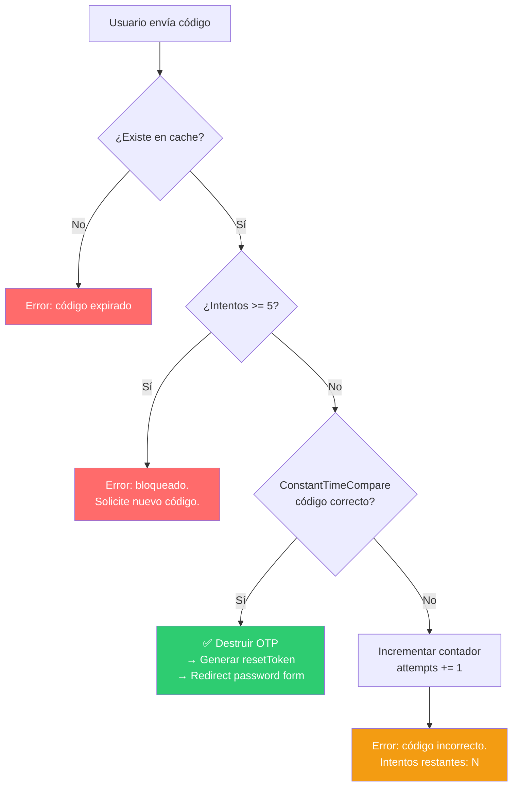
```mermaid
graph TD
    A["Usuario envía código"] --> B{"¿Existe en cache?"}
    B -->|No| C["Error: código expirado"]
    B -->|Sí| D{"¿Intentos >= 5?"}
    D -->|Sí| E["Error: bloqueado.<br/>Solicite nuevo código."]
    D -->|No| F{"ConstantTimeCompare<br/>código correcto?"}
    F -->|Sí| G["✅ Destruir OTP<br/>→ Generar resetToken<br/>→ Redirect password form"]
    F -->|No| H["Incrementar contador<br/>attempts += 1"]
    H --> I["Error: código incorrecto.<br/>Intentos restantes: N"]

    style C fill:#ff6b6b,color:#fff
    style E fill:#ff6b6b,color:#fff
    style G fill:#2ecc71,color:#fff
    style I fill:#f39c12,color:#fff
```

**Capas de protección:**

| Capa | Mecanismo | Parámetro |
|---|---|---|
| **L1 — Edge** | WAFv2 Rate Limiting | 300 req / 5 min / IP |
| **L2 — Edge** | IP Reputation + Bad Inputs | AWS Managed Rules |
| **L3 — Aplicación** | Counter por código | 5 intentos max por `otpKey` |
| **L4 — Aplicación** | TTL de código | 60 min auto-expiración |
| **L5 — Crypto** | Constant-time comparison | `crypto/subtle.ConstantTimeCompare` |
| **L6 — Crypto** | Charset reducido sin ambigüedad | 31 chars (no 0/O, 1/I/L) |

---

#### 3C.7 Especificación de Pantallas

##### Pantalla Admin — Generación Código (`metri-app`)

```
┌─────────────────────────────────────────────┐
│  [← Volver]  Invitar Usuario                │
│                                             │
│  Usuario: Juan Pérez (@jperez)              │
│  Tenant: Planta Norte                       │
│  Método: 🔘 Email  🔘 QR Code  🔘 Código   │
│                                             │
│  ┌─────────────────────────────────────┐    │
│  │                                     │    │
│  │     CÓDIGO DE VERIFICACIÓN          │    │
│  │                                     │    │
│  │     ╔═══════════════════════╗       │    │
│  │     ║   A 7 K 3 - M X 9 P ║       │    │
│  │     ╚═══════════════════════╝       │    │
│  │                                     │    │
│  │     Usuario: jperez                 │    │
│  │                                     │    │
│  └─────────────────────────────────────┘    │
│                                             │
│  ⏱ Expira en: 58:30                        │
│  Intentos permitidos: 5                     │
│                                             │
│  📋 Instrucciones para el usuario:          │
│  1. Abra auth.metri.one/register/code       │
│  2. Ingrese su usuario: jperez              │
│  3. Ingrese el código: A7K3-MX9P            │
│  4. Establezca su contraseña                │
│                                             │
│  ┌──────────────────┐ ┌──────────────────┐  │
│  │  Regenerar Código │ │  Copiar Código   │  │
│  └──────────────────┘ └──────────────────┘  │
│  ┌─────────────────────────────────────┐    │
│  │  🖨️  Imprimir tarjeta de registro   │    │
│  └─────────────────────────────────────┘    │
└─────────────────────────────────────────────┘
```

##### Pantalla Usuario — Ingreso de Código (`register_code.html`)

```
┌─────────────────────────────────────────────┐
│  [Logo Metri]                               │
│                                             │
│  Registro de cuenta                         │
│                                             │
│  Ingresa los datos que te proporcionó       │
│  tu administrador.                          │
│                                             │
│  ┌─────────────────────────────────────┐    │
│  │ Nombre de usuario                   │    │
│  │ ej: jperez                          │    │
│  └─────────────────────────────────────┘    │
│                                             │
│  Código de verificación:                    │
│  ┌────┐ ┌────┐ ┌────┐ ┌────┐               │
│  │ A  │ │ 7  │ │ K  │ │ 3  │               │
│  └────┘ └────┘ └────┘ └────┘               │
│  ┌────┐ ┌────┐ ┌────┐ ┌────┐               │
│  │ M  │ │ X  │ │ 9  │ │ P  │               │
│  └────┘ └────┘ └────┘ └────┘               │
│                                             │
│  ┌─────────────────────────────────────┐    │
│  │          Verificar código           │    │
│  └─────────────────────────────────────┘    │
│                                             │
│  ¿No tienes un código? Contacta a tu       │
│  administrador para obtener uno.            │
└─────────────────────────────────────────────┘
```

##### Pantalla Usuario — Código Incorrecto (con error)

```
┌─────────────────────────────────────────────┐
│  [Logo Metri]                               │
│                                             │
│  Registro de cuenta                         │
│                                             │
│  ┌─────────────────────────────────────┐    │
│  │ ⚠️ Código incorrecto.              │    │
│  │    Intentos restantes: 3            │    │
│  └─────────────────────────────────────┘    │
│                                             │
│  (... formulario igual ...)                 │
└─────────────────────────────────────────────┘
```

---

#### 3C.8 Implementación Detallada

```go
// POST /auth/register/verification-code
// Genera un código alfanumérico de 8 caracteres para registro presencial
func (h *AuthHandler) HandleRegisterVerificationCode(w http.ResponseWriter, r *http.Request) {
    var body struct {
        TenantID string `json:"tenant_id"`
        UserID   string `json:"user_id"`
    }
    if err := json.NewDecoder(r.Body).Decode(&body); err != nil {
        http.Error(w, `{"error":"invalid_request","error_description":"Invalid JSON body"}`, http.StatusBadRequest)
        return
    }
    if body.TenantID == "" || body.UserID == "" {
        http.Error(w, `{"error":"invalid_request","error_description":"tenant_id and user_id are required"}`, http.StatusBadRequest)
        return
    }

    // Opcionalmente verificar que el usuario existe y está en estado PENDING
    user, err := h.userRepo.GetUserByID(r.Context(), body.TenantID, body.UserID)
    if err != nil || user == nil {
        http.Error(w, `{"error":"not_found","error_description":"User not found"}`, http.StatusNotFound)
        return
    }

    // Generar código alfanumérico legible (8 chars, formato A7K3-MX9P)
    code := generateReadableCode(8)

    otpKey := fmt.Sprintf("reg:%s:%s", body.TenantID, body.UserID)
    otpData, _ := json.Marshal(map[string]interface{}{
        "code":      code,
        "user_id":   body.UserID,
        "tenant_id": body.TenantID,
        "flow":      "code",
        "attempts":  0,
    })
    if err := h.sessionRepo.Save(r.Context(), domain.KindOTP, otpKey, string(otpData), 60*time.Minute); err != nil {
        http.Error(w, `{"error":"server_error"}`, http.StatusInternalServerError)
        return
    }

    w.Header().Set("Content-Type", "application/json")
    json.NewEncoder(w).Encode(map[string]interface{}{
        "verification_code": formatCode(code), // "A7K3-MX9P"
        "username":          user.Username,
        "expires_in":        3600,              // 60 minutos
        "expires_at":        time.Now().Add(60 * time.Minute).UTC().Format(time.RFC3339),
        "max_attempts":      5,
        "instructions":      "Entregue este código al usuario de forma presencial. El usuario debe ingresar a auth.metri.one/register/code e introducir su nombre de usuario y este código.",
    })
}

// POST /auth/register/code/verify
// Valida el código con rate limiting y redirige al formulario de contraseña
func (h *AuthHandler) HandleVerifyRegistrationCode(w http.ResponseWriter, r *http.Request) {
    r.ParseForm()
    tenantID := r.FormValue("tenant_id")
    username := r.FormValue("username")
    rawCode := r.FormValue("code")

    // Normalizar código: quitar guiones, convertir a uppercase
    code := strings.ToUpper(strings.ReplaceAll(rawCode, "-", ""))

    // Resolver username → user_id si es necesario
    userID := r.FormValue("user_id")
    if userID == "" && username != "" {
        user, err := h.userRepo.GetUserByUsername(r.Context(), tenantID, username)
        if err != nil || user == nil {
            // Error genérico para no revelar si el usuario existe
            renderErrorPage(w, "invalid_code", "Código inválido o expirado.")
            return
        }
        userID = user.ID
    }

    otpKey := fmt.Sprintf("reg:%s:%s", tenantID, userID)
    otpRaw, err := h.sessionRepo.Get(r.Context(), domain.KindOTP, otpKey)
    if err != nil || otpRaw == "" {
        renderErrorPage(w, "expired", "El código ha expirado. Solicite uno nuevo al administrador.")
        return
    }

    var stored struct {
        Code     string `json:"code"`
        UserID   string `json:"user_id"`
        TenantID string `json:"tenant_id"`
        Flow     string `json:"flow"`
        Attempts int    `json:"attempts"`
    }
    json.Unmarshal([]byte(otpRaw), &stored)

    // Verificar máximo de intentos
    if stored.Attempts >= 5 {
        renderErrorPage(w, "max_attempts", "Demasiados intentos fallidos. Solicite un nuevo código al administrador.")
        return
    }

    // Comparación constant-time (anti timing-attack)
    if subtle.ConstantTimeCompare([]byte(stored.Code), []byte(code)) != 1 {
        // Incrementar contador de intentos
        stored.Attempts++
        updatedData, _ := json.Marshal(stored)
        h.sessionRepo.Save(r.Context(), domain.KindOTP, otpKey, string(updatedData), 60*time.Minute)

        remaining := 5 - stored.Attempts
        errMsg := fmt.Sprintf("Código incorrecto. Intentos restantes: %d", remaining)
        renderErrorPage(w, "invalid_code", errMsg)
        return
    }

    // ✅ Código válido — invalidar y emitir resetToken
    h.sessionRepo.Del(r.Context(), domain.KindOTP, otpKey)
    resetToken := generateOpaqueToken()
    resetData, _ := json.Marshal(map[string]string{
        "user_id": stored.UserID, "tenant_id": stored.TenantID,
    })
    h.sessionRepo.Save(r.Context(), domain.KindReset, resetToken, string(resetData), 15*time.Minute)

    http.Redirect(w, r, fmt.Sprintf("/auth/reset-password?token=%s&mode=register", resetToken), http.StatusFound)
}

// generateReadableCode crea un código alfanumérico legible sin caracteres ambiguos
func generateReadableCode(length int) string {
    // Charset sin 0/O (confusión visual), 1/I/L (confusión visual y fonética)
    const charset = "ABCDEFGHJKLMNPQRSTUVWXYZ23456789" // 31 caracteres
    b := make([]byte, length)
    rand.Read(b)
    for i := range b {
        b[i] = charset[int(b[i])%len(charset)]
    }
    return string(b)
}

// formatCode formatea un código en grupos de 4: "A7K3MX9P" → "A7K3-MX9P"
func formatCode(code string) string {
    if len(code) <= 4 {
        return code
    }
    return code[:4] + "-" + code[4:]
}
```

---

#### 3C.9 Propiedades de Seguridad

| Propiedad | Valor | Detalle |
|---|---|---|
| **TTL del Código** | 60 minutos | Extendido para contexto presencial/logístico |
| **TTL del Reset Token** | 15 minutos | Post-verificación, ventana para crear password |
| **Formato** | 8 chars alfanuméricos uppercase | Charset reducido: 31 chars (sin 0/O, 1/I/L) |
| **Entropía** | ~40 bits | $31^8 \approx 8.5 \times 10^{11}$ combinaciones |
| **Max intentos** | 5 por código | Counter persistido en cache con el OTP |
| **Comparación** | `crypto/subtle.ConstantTimeCompare` | Anti timing-attack |
| **Rate Limiting L1** | WAFv2: 300 req / 5min / IP | Previene enumeración distribuida |
| **Uso** | Single-use | `DEL(KindOTP, key)` post-verificación exitosa |
| **Canal de entrega** | Presencial (verbal, papel, pantalla) | NO digital — no atraviesa red |
| **Vinculación** | Código vinculado a `user_id` + `tenant_id` | No transferible entre usuarios |

> **Canal de entrega**: Email via metri-notifications (Amazon SES)  
> **Evento EventBridge**: `USER_REGISTRATION_MAGIC_LINK`  
> **Caso de uso**: El usuario tiene una dirección de correo electrónico asociada

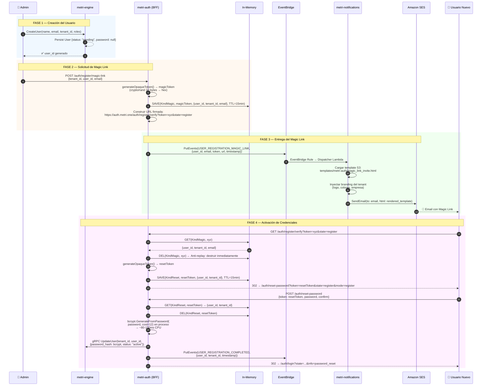
```mermaid
sequenceDiagram
    autonumber
    participant Admin as 👤 Admin
    participant Engine as metri-engine
    participant Auth as metri-auth (BFF)
    participant Cache as In-Memory
    participant EB as EventBridge
    participant Notif as metri-notifications
    participant SES as Amazon SES
    participant User as 👤 Usuario Nuevo

    rect rgb(240, 248, 255)
        Note over Admin,Engine: FASE 1 — Creación del Usuario
        Admin->>Engine: CreateUser(name, email, tenant_id, roles)
        Engine-->>Engine: Persist User {status: "pending", password: null}
        Engine-->>Admin: ✅ user_id generado
    end

    rect rgb(255, 248, 240)
        Note over Admin,Auth: FASE 2 — Solicitud de Magic Link
        Admin->>Auth: POST /auth/register/magic-link<br/>{tenant_id, user_id, email}
        Auth->>Auth: generateOpaqueToken() → magicToken<br/>(crypto/rand 32 bytes → hex)
        Auth->>Cache: SAVE(KindMagic, magicToken, {user_id, tenant_id, email}, TTL=15min)
        Auth->>Auth: Construir URL firmada:<br/>https://auth.metri.one/auth/register/verify?token=xyz&state=register
    end

    rect rgb(240, 255, 240)
        Note over Auth,SES: FASE 3 — Entrega del Magic Link
        Auth->>EB: PutEvents(USER_REGISTRATION_MAGIC_LINK,<br/>{user_id, email, token, url, timestamp})
        EB->>Notif: EventBridge Rule → Dispatcher Lambda
        Notif->>Notif: Cargar template S3:<br/>templates/metri-auth/magic_link_invite.html
        Notif->>Notif: Inyectar branding del tenant<br/>(logo, colores, empresa)
        Notif->>SES: SendEmail(to: email, html: rendered_template)
        SES-->>User: 📧 Email con Magic Link
    end

    rect rgb(255, 240, 255)
        Note over User,Engine: FASE 4 — Activación de Credenciales
        User->>Auth: GET /auth/register/verify?token=xyz&state=register
        Auth->>Cache: GET(KindMagic, xyz)
        Cache-->>Auth: {user_id, tenant_id, email}
        Auth->>Cache: DEL(KindMagic, xyz) ← Anti-replay: destruir inmediatamente
        Auth->>Auth: generateOpaqueToken() → resetToken
        Auth->>Cache: SAVE(KindReset, resetToken, {user_id, tenant_id}, TTL=15min)
        Auth-->>User: 302 → /auth/reset-password?token=resetToken&state=register&mode=register
        User->>Auth: POST /auth/reset-password<br/>{token: resetToken, password, confirm}
        Auth->>Cache: GET(KindReset, resetToken) → {user_id, tenant_id}
        Auth->>Cache: DEL(KindReset, resetToken)
        Auth->>Auth: bcrypt.GenerateFromPassword(<br/>password, cost=12) en proceso<br/>→ ~80-150ms CPU
        Auth->>Engine: gRPC UpdateUser(tenant_id, user_id,<br/>{password_hash: bcrypt, status: "active"})
        Auth->>EB: PutEvents(USER_REGISTRATION_COMPLETED,<br/>{user_id, tenant_id, timestamp})
        Auth-->>User: 302 → /auth/login?state=...&info=password_reset
    end
```

#### Implementación en Código

**Endpoint de solicitud** — [oidc.go](file:///Users/macuser/projects/metri/metri-auth/internal/interfaces/http/handlers/oidc.go#L412-L452) (`HandleRequestMagicLink`):

```go
// POST /auth/register/magic-link
func (h *AuthHandler) HandleRequestMagicLink(w http.ResponseWriter, r *http.Request) {
    // 1. Decodificar body: {tenant_id, user_id, email}
    // 2. Generar token efímero (KindMagic, 15min TTL)
    // 3. Construir URL firmada
    // 4. Publicar USER_REGISTRATION_MAGIC_LINK → EventBridge
}
```

**Endpoint de verificación** — [oidc.go](file:///Users/macuser/projects/metri/metri-auth/internal/interfaces/http/handlers/oidc.go#L372-L408) (`HandleMagicLinkVerify`):

```go
// GET /auth/register/verify?token=xyz&state=register
func (h *AuthHandler) HandleMagicLinkVerify(w http.ResponseWriter, r *http.Request) {
    // 1. Recuperar datos de KindMagic (SessionStore)
    // 2. Destruir token inmediatamente (anti-replay)
    // 3. Crear KindReset efímero para formulario de password
    // 4. Redirect → /auth/reset-password?token=...&mode=register
}
```

#### Propiedades de Seguridad

| Propiedad | Valor |
|---|---|
| **TTL del Magic Link** | 15 minutos |
| **Uso** | Single-use (destrucción inmediata post-lectura) |
| **Anti-replay** | `DEL(KindMagic, token)` antes de procesamiento |
| **Entropía del token** | 256 bits (32 bytes crypto/rand → hex) |
| **Transporte** | HTTPS-only (CloudFront redirect-to-https) |

---

### 3B. Flujo 1B — Registro por Código QR

> **Canal de entrega**: QR generado y presentado en pantalla por el administrador  
> **Caso de uso**: Onboarding presencial — el admin muestra un QR al nuevo usuario (ej: operarios en planta, técnicos de campo)

> [!NOTE]
> Este flujo es ideal para escenarios donde el usuario nuevo está **físicamente presente** con el administrador. El QR contiene una URL de registro cifrada que el usuario escanea con su dispositivo móvil.

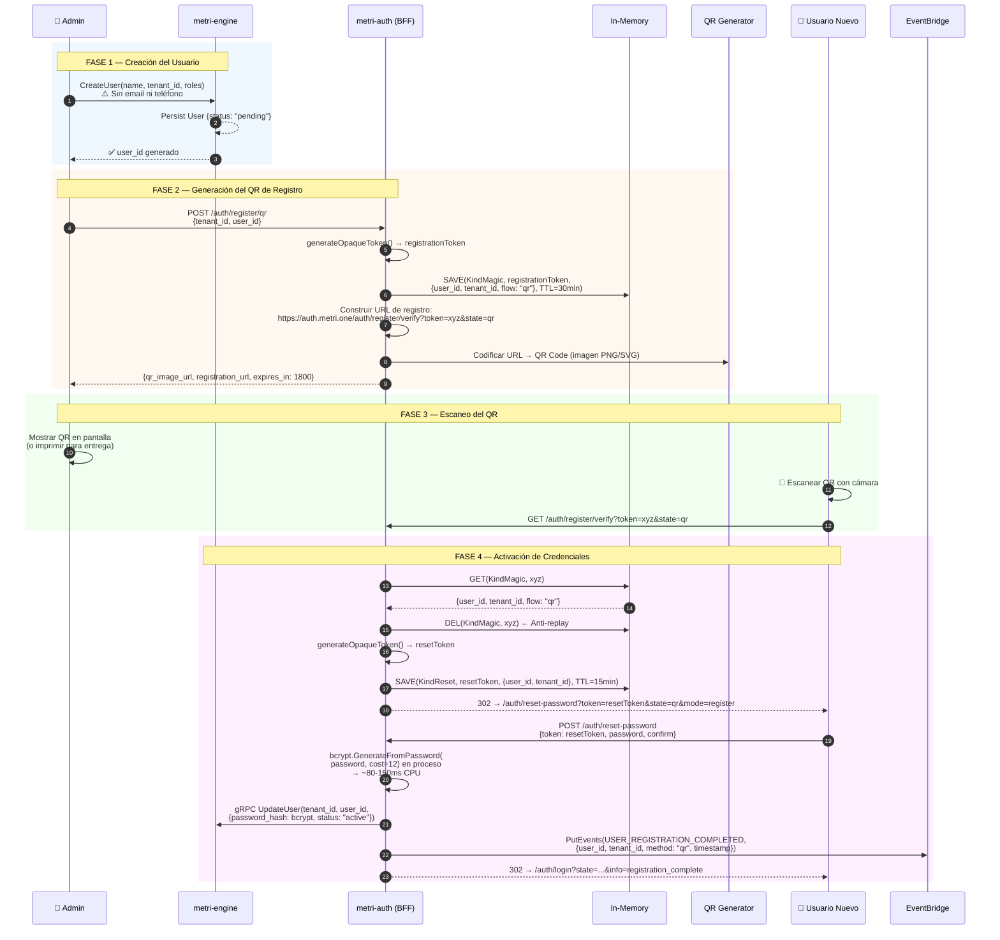
```mermaid
sequenceDiagram
    autonumber
    participant Admin as 👤 Admin
    participant Engine as metri-engine
    participant Auth as metri-auth (BFF)
    participant Cache as In-Memory
    participant QR as QR Generator
    participant User as 👤 Usuario Nuevo
    participant EB as EventBridge

    rect rgb(240, 248, 255)
        Note over Admin,Engine: FASE 1 — Creación del Usuario
        Admin->>Engine: CreateUser(name, tenant_id, roles)<br/>⚠️ Sin email ni teléfono
        Engine-->>Engine: Persist User {status: "pending"}
        Engine-->>Admin: ✅ user_id generado
    end

    rect rgb(255, 248, 240)
        Note over Admin,Auth: FASE 2 — Generación del QR de Registro
        Admin->>Auth: POST /auth/register/qr<br/>{tenant_id, user_id}
        Auth->>Auth: generateOpaqueToken() → registrationToken
        Auth->>Cache: SAVE(KindMagic, registrationToken,<br/>{user_id, tenant_id, flow: "qr"}, TTL=30min)
        Auth->>Auth: Construir URL de registro:<br/>https://auth.metri.one/auth/register/verify?token=xyz&state=qr
        Auth->>QR: Codificar URL → QR Code (imagen PNG/SVG)
        Auth-->>Admin: {qr_image_url, registration_url, expires_in: 1800}
    end

    rect rgb(240, 255, 240)
        Note over Admin,User: FASE 3 — Escaneo del QR
        Admin->>Admin: Mostrar QR en pantalla<br/>(o imprimir para entrega)
        User->>User: 📱 Escanear QR con cámara
        User->>Auth: GET /auth/register/verify?token=xyz&state=qr
    end

    rect rgb(255, 240, 255)
        Note over User,Engine: FASE 4 — Activación de Credenciales
        Auth->>Cache: GET(KindMagic, xyz)
        Cache-->>Auth: {user_id, tenant_id, flow: "qr"}
        Auth->>Cache: DEL(KindMagic, xyz) ← Anti-replay
        Auth->>Auth: generateOpaqueToken() → resetToken
        Auth->>Cache: SAVE(KindReset, resetToken, {user_id, tenant_id}, TTL=15min)
        Auth-->>User: 302 → /auth/reset-password?token=resetToken&state=qr&mode=register
        User->>Auth: POST /auth/reset-password<br/>{token: resetToken, password, confirm}
        Auth->>Auth: bcrypt.GenerateFromPassword(<br/>password, cost=12) en proceso<br/>→ ~80-150ms CPU
        Auth->>Engine: gRPC UpdateUser(tenant_id, user_id,<br/>{password_hash: bcrypt, status: "active"})
        Auth->>EB: PutEvents(USER_REGISTRATION_COMPLETED,<br/>{user_id, tenant_id, method: "qr", timestamp})
        Auth-->>User: 302 → /auth/login?state=...&info=registration_complete
    end
```

#### Endpoint Propuesto

```go
// POST /auth/register/qr
// Genera un token de registro y devuelve el QR como URL codificada
func (h *AuthHandler) HandleRegisterQR(w http.ResponseWriter, r *http.Request) {
    var body struct {
        TenantID string `json:"tenant_id"`
        UserID   string `json:"user_id"`
    }
    json.NewDecoder(r.Body).Decode(&body)

    // Generar token efímero de registro (reutiliza KindMagic con TTL extendido)
    regToken := generateOpaqueToken()
    regData, _ := json.Marshal(map[string]string{
        "user_id":   body.UserID,
        "tenant_id": body.TenantID,
        "flow":      "qr",
    })
    h.sessionRepo.Save(r.Context(), domain.KindMagic, regToken, string(regData), 30*time.Minute)

    // Construir URL y generar QR
    regURL := fmt.Sprintf("%s/auth/register/verify?token=%s&state=qr", h.baseURL, regToken)
    qrURI := fmt.Sprintf("https://api.qrserver.com/v1/create-qr-code/?size=300x300&data=%s",
        url.QueryEscape(regURL))

    json.NewEncoder(w).Encode(map[string]interface{}{
        "registration_url": regURL,
        "qr_image_url":     qrURI,
        "expires_in":       1800, // 30 minutos
    })
}
```

#### Propiedades de Seguridad

| Propiedad | Valor |
|---|---|
| **TTL del QR Token** | 30 minutos (extendido vs Magic Link por contexto presencial) |
| **Uso** | Single-use (destrucción inmediata post-escaneo) |
| **Tipo de cache** | `KindMagic` (reutiliza la semántica existente) |
| **Verificación** | Mismo endpoint que Magic Link (`/auth/register/verify`) |
| **QR Rendering** | Server-side (API externa o librería Go `skip2/go-qrcode`) |

> [!TIP]
> El flujo QR reutiliza el mismo `HandleMagicLinkVerify` existente en [oidc.go#L372](file:///Users/macuser/projects/metri/metri-auth/internal/interfaces/http/handlers/oidc.go#L372), diferenciándose únicamente en el TTL (30min vs 15min) y el canal de entrega (pantalla vs email). El campo `flow: "qr"` permite trazabilidad en eventos de auditoría.

---

### 3C. Flujo 1C — Código de Verificación (Sin Correo ni SMS)

> **Canal de entrega**: Código alfanumérico presentado en pantalla al administrador  
> **Caso de uso**: Usuarios sin correo electrónico ni número de teléfono (operarios, personal temporal, ambientes restringidos)

> [!WARNING]
> Este flujo es el **fallback de último recurso** cuando el usuario no puede recibir notificaciones por ningún canal digital. Requiere que el administrador entregue verbalmente o por escrito el código de verificación al usuario.

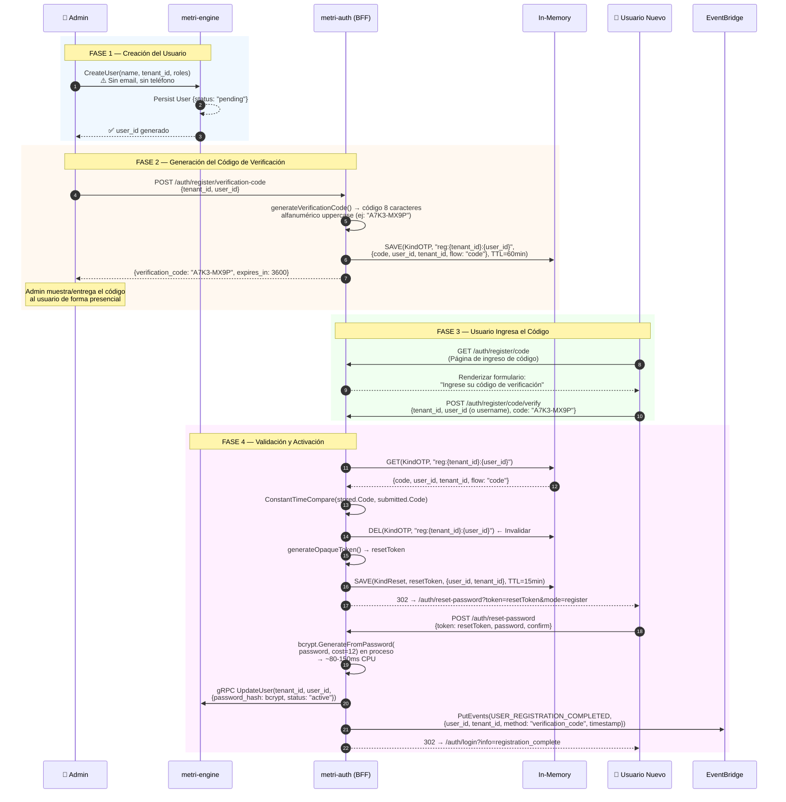
```mermaid
sequenceDiagram
    autonumber
    participant Admin as 👤 Admin
    participant Engine as metri-engine
    participant Auth as metri-auth (BFF)
    participant Cache as In-Memory
    participant User as 👤 Usuario Nuevo
    participant EB as EventBridge

    rect rgb(240, 248, 255)
        Note over Admin,Engine: FASE 1 — Creación del Usuario
        Admin->>Engine: CreateUser(name, tenant_id, roles)<br/>⚠️ Sin email, sin teléfono
        Engine-->>Engine: Persist User {status: "pending"}
        Engine-->>Admin: ✅ user_id generado
    end

    rect rgb(255, 248, 240)
        Note over Admin,Auth: FASE 2 — Generación del Código de Verificación
        Admin->>Auth: POST /auth/register/verification-code<br/>{tenant_id, user_id}
        Auth->>Auth: generateVerificationCode() → código 8 caracteres<br/>alfanumérico uppercase (ej: "A7K3-MX9P")
        Auth->>Cache: SAVE(KindOTP, "reg:{tenant_id}:{user_id}",<br/>{code, user_id, tenant_id, flow: "code"}, TTL=60min)
        Auth-->>Admin: {verification_code: "A7K3-MX9P", expires_in: 3600}
        Note over Admin: Admin muestra/entrega el código<br/>al usuario de forma presencial
    end

    rect rgb(240, 255, 240)
        Note over User,Auth: FASE 3 — Usuario Ingresa el Código
        User->>Auth: GET /auth/register/code<br/>(Página de ingreso de código)
        Auth-->>User: Renderizar formulario:<br/>"Ingrese su código de verificación"
        User->>Auth: POST /auth/register/code/verify<br/>{tenant_id, user_id (o username), code: "A7K3-MX9P"}
    end

    rect rgb(255, 240, 255)
        Note over Auth,Engine: FASE 4 — Validación y Activación
        Auth->>Cache: GET(KindOTP, "reg:{tenant_id}:{user_id}")
        Cache-->>Auth: {code, user_id, tenant_id, flow: "code"}
        Auth->>Auth: ConstantTimeCompare(stored.Code, submitted.Code)
        Auth->>Cache: DEL(KindOTP, "reg:{tenant_id}:{user_id}") ← Invalidar
        Auth->>Auth: generateOpaqueToken() → resetToken
        Auth->>Cache: SAVE(KindReset, resetToken, {user_id, tenant_id}, TTL=15min)
        Auth-->>User: 302 → /auth/reset-password?token=resetToken&mode=register
        User->>Auth: POST /auth/reset-password<br/>{token: resetToken, password, confirm}
        Auth->>Auth: bcrypt.GenerateFromPassword(<br/>password, cost=12) en proceso<br/>→ ~80-150ms CPU
        Auth->>Engine: gRPC UpdateUser(tenant_id, user_id,<br/>{password_hash: bcrypt, status: "active"})
        Auth->>EB: PutEvents(USER_REGISTRATION_COMPLETED,<br/>{user_id, tenant_id, method: "verification_code", timestamp})
        Auth-->>User: 302 → /auth/login?info=registration_complete
    end
```

#### Endpoint Propuesto

```go
// POST /auth/register/verification-code
// Genera un código alfanumérico de 8 caracteres para registro presencial
func (h *AuthHandler) HandleRegisterVerificationCode(w http.ResponseWriter, r *http.Request) {
    var body struct {
        TenantID string `json:"tenant_id"`
        UserID   string `json:"user_id"`
    }
    json.NewDecoder(r.Body).Decode(&body)

    // Generar código alfanumérico legible (8 chars, formato A7K3-MX9P)
    code := generateReadableCode(8)

    otpKey := fmt.Sprintf("reg:%s:%s", body.TenantID, body.UserID)
    otpData, _ := json.Marshal(map[string]string{
        "code":      code,
        "user_id":   body.UserID,
        "tenant_id": body.TenantID,
        "flow":      "code",
    })
    h.sessionRepo.Save(r.Context(), domain.KindOTP, otpKey, string(otpData), 60*time.Minute)

    json.NewEncoder(w).Encode(map[string]interface{}{
        "verification_code": formatCode(code), // "A7K3-MX9P"
        "expires_in":        3600,              // 60 minutos
    })
}

// POST /auth/register/code/verify
// Valida el código y redirige al formulario de contraseña
func (h *AuthHandler) HandleVerifyRegistrationCode(w http.ResponseWriter, r *http.Request) {
    r.ParseForm()
    tenantID := r.FormValue("tenant_id")
    userID := r.FormValue("user_id")
    code := strings.ReplaceAll(r.FormValue("code"), "-", "") // Normalizar

    otpKey := fmt.Sprintf("reg:%s:%s", tenantID, userID)
    otpRaw, err := h.sessionRepo.Get(r.Context(), domain.KindOTP, otpKey)
    if err != nil {
        renderErrorPage(w, "invalid_code", "Código inválido o expirado.")
        return
    }

    var stored struct {
        Code     string `json:"code"`
        UserID   string `json:"user_id"`
        TenantID string `json:"tenant_id"`
    }
    json.Unmarshal([]byte(otpRaw), &stored)

    if subtle.ConstantTimeCompare([]byte(stored.Code), []byte(code)) != 1 {
        renderErrorPage(w, "invalid_code", "Código de verificación incorrecto.")
        return
    }

    // Invalidar código y emitir resetToken
    h.sessionRepo.Del(r.Context(), domain.KindOTP, otpKey)
    resetToken := generateOpaqueToken()
    resetData, _ := json.Marshal(map[string]string{
        "user_id": stored.UserID, "tenant_id": stored.TenantID,
    })
    h.sessionRepo.Save(r.Context(), domain.KindReset, resetToken, string(resetData), 15*time.Minute)

    http.Redirect(w, r, fmt.Sprintf("/auth/reset-password?token=%s&mode=register", resetToken), http.StatusFound)
}

// generateReadableCode crea un código alfanumérico legible sin caracteres ambiguos
func generateReadableCode(length int) string {
    const charset = "ABCDEFGHJKLMNPQRSTUVWXYZ23456789" // Sin 0/O, 1/I/L
    b := make([]byte, length)
    rand.Read(b)
    for i := range b {
        b[i] = charset[int(b[i])%len(charset)]
    }
    return string(b)
}

// formatCode formatea un código en grupos de 4: "A7K3MX9P" → "A7K3-MX9P"
func formatCode(code string) string {
    if len(code) <= 4 {
        return code
    }
    return code[:4] + "-" + code[4:]
}
```

#### Propiedades de Seguridad

| Propiedad | Valor |
|---|---|
| **TTL del Código** | 60 minutos (extendido para contexto presencial/logístico) |
| **Formato** | 8 caracteres alfanuméricos (charset reducido: sin 0/O, 1/I/L) |
| **Entropía** | ~40 bits (31^8 combinaciones ≈ 8.5 × 10^11) |
| **Comparación** | `crypto/subtle.ConstantTimeCompare` (anti timing-attack) |
| **Rate Limiting** | WAFv2: 300 req/5min por IP + SessionStore counter por `otpKey` |
| **Uso** | Single-use (destrucción post-verificación) |
| **Canal** | Presencial (verbal, papel, pantalla) — NO digital |

---

### 3D. Flujo 1D — Registro por Teléfono (SMS / WhatsApp)

> **Canal de entrega**: SMS o WhatsApp via metri-notifications (Twilio / WhatsApp Business API)  
> **Evento EventBridge**: `USER_REGISTRATION_PHONE_OTP`  
> **Caso de uso**: El usuario no tiene email pero sí un número de teléfono celular  
> **Endpoints**: `POST /auth/register/phone` → `GET /auth/register/verify-otp` (HTML page) → `POST /auth/register/phone/verify` → `POST /auth/reset-password`

---

#### 3D.1 Máquina de Estados

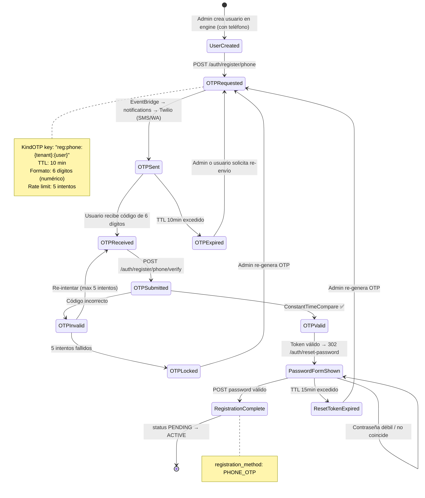
```mermaid
stateDiagram-v2
    [*] --> UserCreated: Admin crea usuario en engine (con teléfono)
    UserCreated --> OTPRequested: POST /auth/register/phone
    OTPRequested --> OTPSent: EventBridge → notifications → Twilio (SMS/WA)
    OTPSent --> OTPReceived: Usuario recibe código de 6 dígitos
    OTPSent --> OTPExpired: TTL 10min excedido
    OTPExpired --> OTPRequested: Admin o usuario solicita re-envío
    OTPReceived --> OTPSubmitted: POST /auth/register/phone/verify
    OTPSubmitted --> OTPValid: ConstantTimeCompare ✅
    OTPSubmitted --> OTPInvalid: Código incorrecto
    OTPInvalid --> OTPReceived: Re-intentar (max 5 intentos)
    OTPInvalid --> OTPLocked: 5 intentos fallidos
    OTPLocked --> OTPRequested: Admin re-genera OTP
    OTPValid --> PasswordFormShown: Token válido → 302 /auth/reset-password
    PasswordFormShown --> RegistrationComplete: POST password válido
    PasswordFormShown --> PasswordFormShown: Contraseña débil / no coincide
    PasswordFormShown --> ResetTokenExpired: TTL 15min excedido
    ResetTokenExpired --> OTPRequested: Admin re-genera OTP
    RegistrationComplete --> [*]: status PENDING → ACTIVE

    note right of OTPRequested
        KindOTP key: "reg:phone:{tenant}:{user}"
        TTL: 10 min
        Formato: 6 dígitos (numérico)
        Rate limit: 5 intentos
    end note

    note right of RegistrationComplete
        registration_method: PHONE_OTP
    end note
```

---

#### 3D.2 Diagrama de Secuencia Detallado

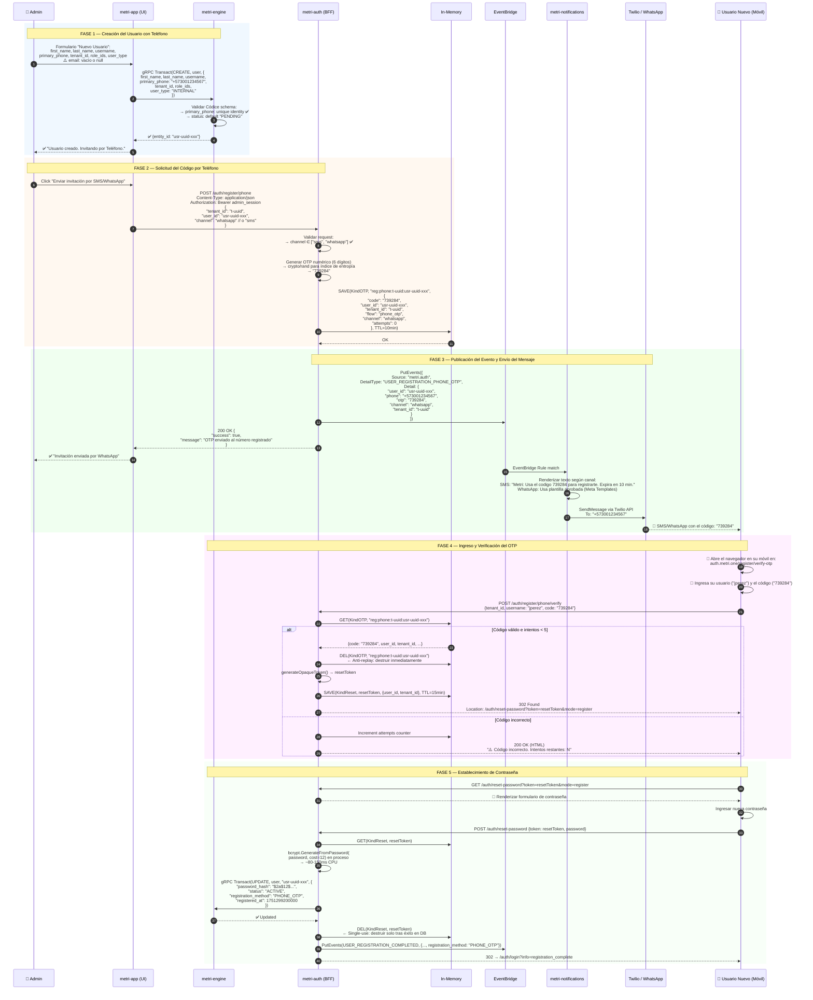
```mermaid
sequenceDiagram
    autonumber
    participant Admin as 👤 Admin
    participant App as metri-app (UI)
    participant Engine as metri-engine
    participant Auth as metri-auth (BFF)
    participant Cache as In-Memory
    participant EB as EventBridge
    participant Notif as metri-notifications
    participant Provider as Twilio / WhatsApp
    participant User as 👤 Usuario Nuevo (Móvil)

    rect rgb(240, 248, 255)
        Note over Admin,Engine: FASE 1 — Creación del Usuario con Teléfono
        Admin->>App: Formulario "Nuevo Usuario":<br/>first_name, last_name, username,<br/>primary_phone, tenant_id, role_ids, user_type<br/>⚠️ email: vacío o null
        App->>Engine: gRPC Transact(CREATE, user, {<br/>  first_name, last_name, username,<br/>  primary_phone: "+573001234567",<br/>  tenant_id, role_ids,<br/>  user_type: "INTERNAL"<br/>})
        Engine->>Engine: Validar Códice schema:<br/>→ primary_phone: unique identity ✅<br/>→ status: default "PENDING"
        Engine-->>App: ✅ {entity_id: "usr-uuid-xxx"}
        App-->>Admin: ✅ "Usuario creado. Invitando por Teléfono."
    end

    rect rgb(255, 248, 240)
        Note over Admin,Auth: FASE 2 — Solicitud del Código por Teléfono
        Admin->>App: Click "Enviar invitación por SMS/WhatsApp"
        App->>Auth: POST /auth/register/phone<br/>Content-Type: application/json<br/>Authorization: Bearer admin_session<br/>{<br/>  "tenant_id": "t-uuid",<br/>  "user_id": "usr-uuid-xxx",<br/>  "channel": "whatsapp" // o "sms"<br/>}
        Auth->>Auth: Validar request:<br/>→ channel ∈ ["sms", "whatsapp"] ✅
        Auth->>Auth: Generar OTP numérico (6 dígitos)<br/>→ crypto/rand para índice de entropía<br/>→ "739284"
        Auth->>Cache: SAVE(KindOTP, "reg:phone:t-uuid:usr-uuid-xxx",<br/>{<br/>  "code": "739284",<br/>  "user_id": "usr-uuid-xxx",<br/>  "tenant_id": "t-uuid",<br/>  "flow": "phone_otp",<br/>  "channel": "whatsapp",<br/>  "attempts": 0<br/>}, TTL=10min)
        Cache-->>Auth: OK
    end

    rect rgb(240, 255, 240)
        Note over Auth,Provider: FASE 3 — Publicación del Evento y Envío del Mensaje
        Auth->>EB: PutEvents({<br/>  Source: "metri.auth",<br/>  DetailType: "USER_REGISTRATION_PHONE_OTP",<br/>  Detail: {<br/>    "user_id": "usr-uuid-xxx",<br/>    "phone": "+573001234567",<br/>    "otp": "739284",<br/>    "channel": "whatsapp",<br/>    "tenant_id": "t-uuid"<br/>  }<br/>})
        Auth-->>App: 200 OK {<br/>  "success": true,<br/>  "message": "OTP enviado al número registrado"<br/>}
        App-->>Admin: ✅ "Invitación enviada por WhatsApp"
        
        EB->>Notif: EventBridge Rule match
        Notif->>Notif: Renderizar texto según canal:<br/>SMS: "Metri: Usa el codigo 739284 para registrarte. Expira en 10 min."<br/>WhatsApp: Usa plantilla aprobada (Meta Templates)
        Notif->>Provider: SendMessage via Twilio API<br/>To: "+573001234567"
        Provider-->>User: 📱 SMS/WhatsApp con el código: "739284"
    end

    rect rgb(255, 240, 255)
        Note over User,Engine: FASE 4 — Ingreso y Verificación del OTP
        User->>User: 📱 Abre el navegador en su móvil en:<br/>auth.metri.one/register/verify-otp
        User->>User: 📱 Ingresa su usuario ("jperez") y el código ("739284")
        User->>Auth: POST /auth/register/phone/verify<br/>{tenant_id, username: "jperez", code: "739284"}
        
        Auth->>Cache: GET(KindOTP, "reg:phone:t-uuid:usr-uuid-xxx")
        alt Código válido e intentos < 5
            Cache-->>Auth: {code: "739284", user_id, tenant_id, ...}
            Auth->>Cache: DEL(KindOTP, "reg:phone:t-uuid:usr-uuid-xxx")<br/>← Anti-replay: destruir inmediatamente
            Auth->>Auth: generateOpaqueToken() → resetToken
            Auth->>Cache: SAVE(KindReset, resetToken, {user_id, tenant_id}, TTL=15min)
            Auth-->>User: 302 Found<br/>Location: /auth/reset-password?token=resetToken&mode=register
        else Código incorrecto
            Auth->>Cache: Increment attempts counter
            Auth-->>User: 200 OK (HTML)<br/>"⚠️ Código incorrecto. Intentos restantes: N"
        end
    end

    rect rgb(248, 255, 248)
        Note over User,Engine: FASE 5 — Establecimiento de Contraseña
        User->>Auth: GET /auth/reset-password?token=resetToken&mode=register
        Auth-->>User: 📱 Renderizar formulario de contraseña
        User->>User: Ingresar nueva contraseña
        User->>Auth: POST /auth/reset-password {token: resetToken, password}
        Auth->>Cache: GET(KindReset, resetToken)
        Auth->>Auth: bcrypt.GenerateFromPassword(<br/>password, cost=12) en proceso<br/>→ ~80-150ms CPU
        Auth->>Engine: gRPC Transact(UPDATE, user, "usr-uuid-xxx", {<br/>  "password_hash": "$2a$12$...",<br/>  "status": "ACTIVE",<br/>  "registration_method": "PHONE_OTP",<br/>  "registered_at": 1751299200000<br/>})
        Engine-->>Auth: ✅ Updated
        Auth->>Cache: DEL(KindReset, resetToken)<br/>← Single-use: destruir solo tras éxito en DB
        Auth->>EB: PutEvents(USER_REGISTRATION_COMPLETED, {..., registration_method: "PHONE_OTP"})
        Auth-->>User: 302 → /auth/login?info=registration_complete
    end
```

---

#### 3D.3 Contratos API

##### `POST /auth/register/phone` — Enviar OTP para Registro

**Request:**
```http
POST /auth/register/phone HTTP/1.1
Host: auth.metri.one
Content-Type: application/json
Authorization: Bearer <admin_session_token>

{
  "tenant_id": "t-uuid-xxx",
  "user_id": "usr-uuid-xxx",
  "channel": "whatsapp"
}
```

**Response (Success):**
```http
HTTP/1.1 200 OK
Content-Type: application/json

{
  "success": true,
  "message": "Código OTP enviado exitosamente a través de whatsapp",
  "expires_in": 600
}
```

##### `POST /auth/register/phone/verify` — Validar OTP

**Request:**
```http
POST /auth/register/phone/verify HTTP/1.1
Host: auth.metri.one
Content-Type: application/x-www-form-urlencoded

tenant_id=t-uuid-xxx&username=jperez&code=739284
```

**Response (Success):**
```http
HTTP/1.1 302 Found
Location: /auth/reset-password?token=<resetToken>&mode=register
```

---

#### 3D.4 Propiedades de Seguridad

| Propiedad | Valor |
|---|---|
| **TTL del OTP** | 10 minutos |
| **Formato** | 6 dígitos numéricos (entropía: $10^6$ combinaciones) |
| **Comparación** | `crypto/subtle.ConstantTimeCompare` |
| **Rate Limiting** | Máximo 5 intentos por código antes de bloquearlo |
| **L1 Rate Limiting** | WAFv2: 5 peticiones de envío por número de teléfono cada 10 min |
| **Canal** | SMS (Twilio) o WhatsApp (Meta API) con cifrado en tránsito |
| **Uso** | Single-use (destrucción post-verificación exitosa) |

---

## 4. Flujo 2 — Registro de MFA (Segundo Factor)

> **Protocolo**: TOTP (RFC 6238) con HMAC-SHA1  
> **Algoritmo**: 30-second epoch window, 6 dígitos, drift ±1 step  
> **Cifrado del secreto**: AES-256-GCM derivado del `TOKEN_SIGNING_SECRET`

> [!IMPORTANT]
> El registro de MFA requiere una **sesión activa**. Solo usuarios ya autenticados (con `KindSession` válido) pueden configurar MFA. Este flujo genera un secreto TOTP, presenta un QR para escaneo con una app de autenticación (Google Authenticator, Authy, 1Password, etc.), y valida el primer código antes de activar la protección.

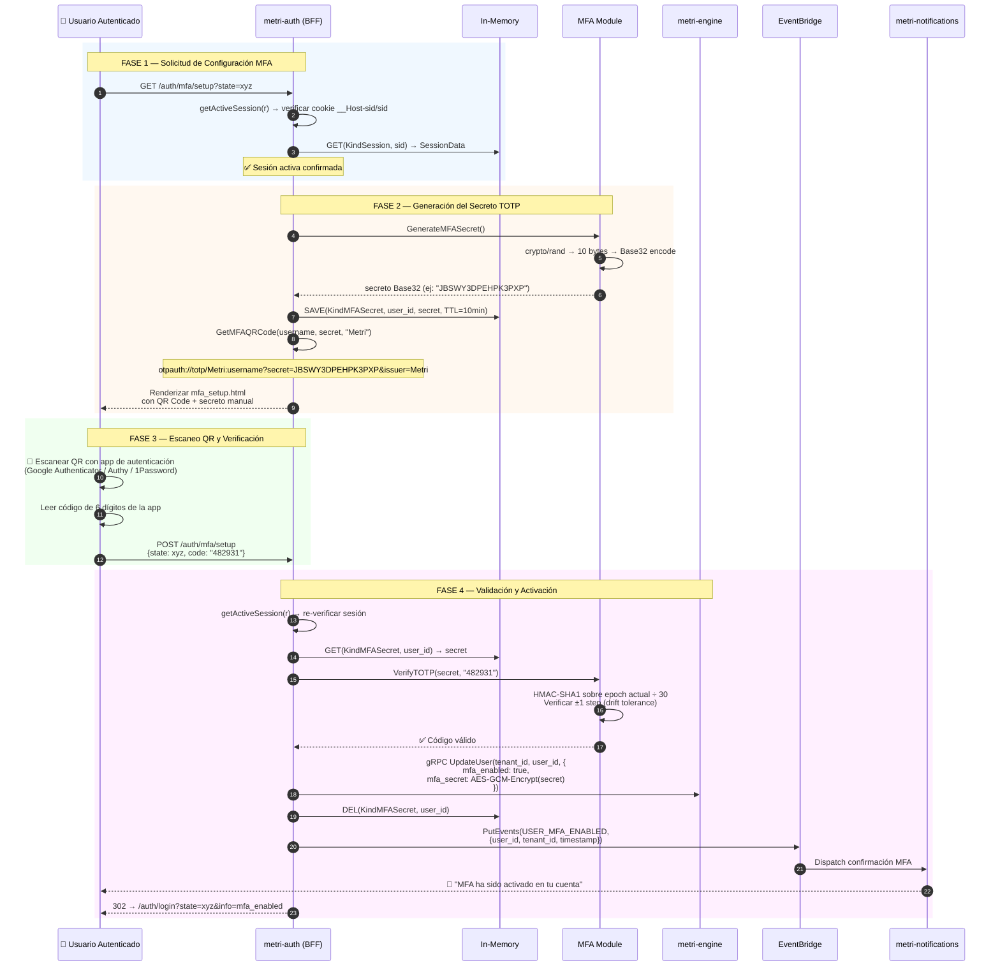
```mermaid
sequenceDiagram
    autonumber
    participant User as 👤 Usuario Autenticado
    participant Auth as metri-auth (BFF)
    participant Cache as In-Memory
    participant MFA as MFA Module
    participant Engine as metri-engine
    participant EB as EventBridge
    participant Notif as metri-notifications

    rect rgb(240, 248, 255)
        Note over User,Auth: FASE 1 — Solicitud de Configuración MFA
        User->>Auth: GET /auth/mfa/setup?state=xyz
        Auth->>Auth: getActiveSession(r) → verificar cookie __Host-sid/sid
        Auth->>Cache: GET(KindSession, sid) → SessionData
        Note over Auth: ✅ Sesión activa confirmada
    end

    rect rgb(255, 248, 240)
        Note over Auth,MFA: FASE 2 — Generación del Secreto TOTP
        Auth->>MFA: GenerateMFASecret()
        MFA->>MFA: crypto/rand → 10 bytes → Base32 encode
        MFA-->>Auth: secreto Base32 (ej: "JBSWY3DPEHPK3PXP")
        Auth->>Cache: SAVE(KindMFASecret, user_id, secret, TTL=10min)
        Auth->>Auth: GetMFAQRCode(username, secret, "Metri")
        Note over Auth: otpauth://totp/Metri:username?secret=JBSWY3DPEHPK3PXP&issuer=Metri
        Auth-->>User: Renderizar mfa_setup.html<br/>con QR Code + secreto manual
    end

    rect rgb(240, 255, 240)
        Note over User,Auth: FASE 3 — Escaneo QR y Verificación
        User->>User: 📱 Escanear QR con app de autenticación<br/>(Google Authenticator / Authy / 1Password)
        User->>User: Leer código de 6 dígitos de la app
        User->>Auth: POST /auth/mfa/setup<br/>{state: xyz, code: "482931"}
    end

    rect rgb(255, 240, 255)
        Note over Auth,Engine: FASE 4 — Validación y Activación
        Auth->>Auth: getActiveSession(r) → re-verificar sesión
        Auth->>Cache: GET(KindMFASecret, user_id) → secret
        Auth->>MFA: VerifyTOTP(secret, "482931")
        MFA->>MFA: HMAC-SHA1 sobre epoch actual ÷ 30<br/>Verificar ±1 step (drift tolerance)
        MFA-->>Auth: ✅ Código válido

        Auth->>Engine: gRPC UpdateUser(tenant_id, user_id, {<br/>  mfa_enabled: true,<br/>  mfa_secret: AES-GCM-Encrypt(secret)<br/>})
        Auth->>Cache: DEL(KindMFASecret, user_id)
        Auth->>EB: PutEvents(USER_MFA_ENABLED,<br/>{user_id, tenant_id, timestamp})
        EB->>Notif: Dispatch confirmación MFA
        Notif-->>User: 📧 "MFA ha sido activado en tu cuenta"
        Auth-->>User: 302 → /auth/login?state=xyz&info=mfa_enabled
    end
```

### Flujo de Challenge MFA (Post-Activación)

Una vez activado MFA, cada login subsiguiente incluye un **segundo paso**:

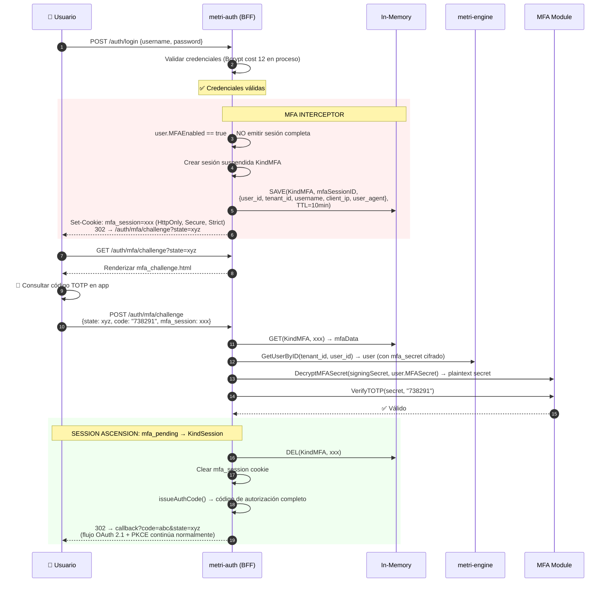
```mermaid
sequenceDiagram
    autonumber
    participant User as 👤 Usuario
    participant Auth as metri-auth (BFF)
    participant Cache as In-Memory
    participant Engine as metri-engine
    participant MFA as MFA Module

    User->>Auth: POST /auth/login {username, password}
    Auth->>Auth: Validar credenciales (Bcrypt cost 12 en proceso)
    Note over Auth: ✅ Credenciales válidas

    rect rgb(255, 240, 240)
        Note over Auth,Cache: MFA INTERCEPTOR
        Auth->>Auth: user.MFAEnabled == true → NO emitir sesión completa
        Auth->>Auth: Crear sesión suspendida KindMFA
        Auth->>Cache: SAVE(KindMFA, mfaSessionID,<br/>{user_id, tenant_id, username, client_ip, user_agent},<br/>TTL=10min)
        Auth-->>User: Set-Cookie: mfa_session=xxx (HttpOnly, Secure, Strict)<br/>302 → /auth/mfa/challenge?state=xyz
    end

    User->>Auth: GET /auth/mfa/challenge?state=xyz
    Auth-->>User: Renderizar mfa_challenge.html

    User->>User: 📱 Consultar código TOTP en app
    User->>Auth: POST /auth/mfa/challenge<br/>{state: xyz, code: "738291", mfa_session: xxx}

    Auth->>Cache: GET(KindMFA, xxx) → mfaData
    Auth->>Engine: GetUserByID(tenant_id, user_id) → user (con mfa_secret cifrado)
    Auth->>MFA: DecryptMFASecret(signingSecret, user.MFASecret) → plaintext secret
    Auth->>MFA: VerifyTOTP(secret, "738291")
    MFA-->>Auth: ✅ Válido

    rect rgb(240, 255, 240)
        Note over Auth,User: SESSION ASCENSION: mfa_pending → KindSession
        Auth->>Cache: DEL(KindMFA, xxx)
        Auth->>Auth: Clear mfa_session cookie
        Auth->>Auth: issueAuthCode() → código de autorización completo
        Auth-->>User: 302 → callback?code=abc&state=xyz<br/>(flujo OAuth 2.1 + PKCE continúa normalmente)
    end
```

### Implementación en Código

**Generación del secreto TOTP** — [mfa.go](file:///Users/macuser/projects/metri/metri-auth/internal/interfaces/http/handlers/mfa.go#L14-L19):

```go
func GenerateMFASecret() string {
    b := make([]byte, 10)
    rand.Read(b)
    return base32.StdEncoding.EncodeToString(b)
}
```

**Verificación TOTP (RFC 6238)** — [mfa.go](file:///Users/macuser/projects/metri/metri-auth/internal/interfaces/http/handlers/mfa.go#L22-L60):

```go
func VerifyTOTP(secret, code string) bool {
    key, _ := base32.StdEncoding.DecodeString(strings.ToUpper(secret))
    currentEpoch := time.Now().Unix() / 30

    // ±1 step drift tolerance
    for _, epoch := range []int64{currentEpoch, currentEpoch - 1, currentEpoch + 1} {
        // HMAC-SHA1 → truncate → mod 10^6 → compare
    }
}
```

**Cifrado AES-GCM del secreto** — [mfa_usecase.go](file:///Users/macuser/projects/metri/metri-auth/internal/app/usecase/mfa_usecase.go#L43-L49):

```go
func (u *mfaUseCase) encryptSecret(secret string) (string, error) {
    key := crypto.DeriveAESKey(u.signingSecret)
    return crypto.EncryptAESGCM(key, secret)
}
```

### Propiedades de Seguridad MFA

| Propiedad | Valor |
|---|---|
| **Algoritmo** | TOTP RFC 6238 (HMAC-SHA1) |
| **Periodo** | 30 segundos |
| **Dígitos** | 6 |
| **Drift tolerance** | ±1 step (±30 segundos) |
| **Cifrado del secreto** | AES-256-GCM (clave derivada de `TOKEN_SIGNING_SECRET`) |
| **TTL setup cache** | 10 minutos (`KindMFASecret`) |
| **TTL challenge** | 10 minutos (`KindMFA`) |
| **Eventos** | `USER_MFA_ENABLED` / `USER_MFA_DISABLED` |

---

## 5. Catálogo de Eventos EventBridge

Todos los eventos se publican al bus `metri-auth-events-bus` con source `metri.auth`:

| Evento | Payload | Consumidor | Acción |
|---|---|---|---|
| `USER_REGISTRATION_MAGIC_LINK` | `{user_id, email, token, url}` | metri-notifications | Enviar email con Magic Link |
| `USER_REGISTRATION_COMPLETED` | `{user_id, tenant_id, method, timestamp}` | Auditoría | Log de activación de perfil |
| `AUTH_PASSWORD_RESET_REQUESTED` | `{user_id, tenant_id, email, token}` | metri-notifications | Enviar email de reset |
| `AUTH_SMS_OTP_REQUESTED` | `{user_id, tenant_id, phone, otp}` | metri-notifications | Enviar SMS con OTP 6 dígitos |
| `USER_MFA_ENABLED` | `{user_id, tenant_id, timestamp}` | metri-notifications | Email de confirmación MFA |
| `USER_MFA_DISABLED` | `{user_id, tenant_id, timestamp}` | metri-notifications | Alerta de seguridad crítica |
| `AUTH_PASSWORD_RESET_COMPLETED` | `{user_id, tenant_id, timestamp}` | Auditoría + Notif | Notificación de cambio de password |
| `TOKEN_ISSUED` | `{user_id, tenant_id, token_id, timestamp}` | Auditoría | Log de emisión de token |

---

## 6. Modelo de Datos de Sesión

### Tipos de Sesión en el Session Store (In-Memory / DynamoDB)

Definidos en [session.go](file:///Users/macuser/projects/metri/metri-auth/internal/domain/session.go#L6-L16):

```go
const (
    KindSession   SessionKind = "session"            // Sesión activa → claims JWT
    KindRefresh   SessionKind = "refresh"            // Refresh token → user_id/tenant_id
    KindAuthCode  SessionKind = "auth_code"          // Código de autorización PKCE
    KindPKCE      SessionKind = "pkce_req"           // Estado de request PKCE
    KindReset     SessionKind = "reset"              // Token de reset de password
    KindMFA       SessionKind = "mfa_pending"        // Sesión MFA suspendida
    KindMFASecret SessionKind = "mfa_secret_pending" // Secreto TOTP temporal (setup)
    KindMagic     SessionKind = "magic"              // Token de magic link / QR
    KindOTP       SessionKind = "otp"                // OTP por SMS / Código de verificación
)
```

### TTL por Tipo

| Kind | TTL | Uso |
|---|---|---|
| `KindSession` | 24h (estándar) / 30 días (RememberMe) | Sesión autenticada activa |
| `KindRefresh` | 30 días | Refresh token en DynamoDB |
| `KindAuthCode` | 5 minutos | Código de autorización OAuth |
| `KindPKCE` | 10 minutos | Challenge PKCE |
| `KindReset` | 15 minutos | Token de reset de password |
| `KindMFA` | 10 minutos | Sesión MFA pendiente |
| `KindMFASecret` | 10 minutos | Secreto TOTP durante setup |
| `KindMagic` | 15 min (email) / 30 min (QR) | Magic link / QR registration |
| `KindOTP` | 10 min (SMS) / 60 min (código verificación) | OTP / Código de verificación |

### Modelo de Usuario

Definido en [user.go](file:///Users/macuser/projects/metri/metri-auth/internal/domain/user.go#L9-L21):

```go
type User struct {
    ID             string      `json:"id"`
    Username       string      `json:"username"`
    Email          string      `json:"email"`
    Password       string      `json:"password"`
    TenantID       string      `json:"tenant_id"`
    FailedAttempts int         `json:"failed_attempts"`
    LockedUntil    *time.Time  `json:"locked_until"`
    MFAEnabled     bool        `json:"mfa_enabled"`
    MFASecret      string      `json:"mfa_secret"`      // AES-GCM encrypted
    Status         string      `json:"status"`           // "pending" | "active"
    Roles          interface{} `json:"roles"`
}
```

---

## 7. Contratos de Seguridad

### Protección Anti-Fuerza Bruta

| Mecanismo | Capa | Parámetro |
|---|---|---|
| **WAFv2 Rate Limiting** | Edge (CloudFront) | 300 req / 5 min por IP |
| **IP Reputation List** | Edge (CloudFront) | AWS Managed Rule |
| **Known Bad Inputs** | Edge (CloudFront) | AWS Managed Rule |
| **Account Lockout** | Aplicación | 5 intentos fallidos → 15 min lockout |
| **Timing Attack Mitigation** | Aplicación | Bcrypt compare en usuario no encontrado (dummy hash) |
| **Constant-Time Comparison** | Aplicación | `crypto/subtle.ConstantTimeCompare` para OTP |

### Protección de Tokens

| Token | Entropía | Uso | Anti-Replay |
|---|---|---|---|
| Magic Link | 256 bits | Single-use | `DEL` inmediato post-lectura |
| QR Registration | 256 bits | Single-use | `DEL` inmediato post-escaneo |
| Verification Code | ~40 bits | Single-use | `DEL` post-verificación |
| Reset Token | 256 bits | Single-use | `DEL` post-uso |
| MFA Session | 256 bits | Single-use | `DEL` post-challenge |
| OTP (SMS) | ~20 bits | Single-use | `DEL` post-verificación |

### Cookies de Sesión

| Cookie | Atributos | Contexto |
|---|---|---|
| `__Host-sid` | `HttpOnly, Secure, SameSite=Lax, Path=/` | Producción (HTTPS) |
| `__Host-kid` | `HttpOnly, Secure, SameSite=Lax, Path=/` | Producción (HTTPS) |
| `sid` | `HttpOnly, SameSite=Lax, Path=/` | Desarrollo (HTTP) |
| `kid` | `HttpOnly, SameSite=Lax, Path=/` | Desarrollo (HTTP) |
| `mfa_session` | `HttpOnly, Secure, SameSite=Strict, Path=/auth/mfa/` | MFA challenge (10min) |

---

## 8. Integración metri-auth ↔ metri-notifications

> [!IMPORTANT]
> **Principio SOLID**: `metri-auth` **NUNCA** se comunica directamente con proveedores de correo (SES/SMTP) ni de mensajería (SMS/Twilio). Toda comunicación de notificaciones es **indirecta** a través de EventBridge.

```
┌─────────────┐    PutEvents    ┌───────────────────────┐    Reglas    ┌────────────────────┐
│ metri-auth  │ ──────────────► │ EventBridge           │ ──────────► │ metri-notifications│
│ (Publisher)  │                 │ metri-auth-events-bus │             │ (Dispatcher)       │
└─────────────┘                 └───────────────────────┘             └────────────────────┘
                                                                            │
                                                                    ┌───────┴───────┐
                                                                    │   Fan-Out     │
                                                               ┌────┴────┐    ┌────┴────┐
                                                               │ SQS     │    │ SQS     │
                                                               │ Email   │    │ SMS     │
                                                               └────┬────┘    └────┬────┘
                                                                    │              │
                                                               ┌────┴────┐    ┌────┴────┐
                                                               │ SES     │    │ Twilio  │
                                                               │ Worker  │    │ Worker  │
                                                               └─────────┘    └─────────┘
```

### Contrato de Eventos

La interfaz `EventPublisher` en [repository.go](file:///Users/macuser/projects/metri/metri-auth/internal/domain/repository.go#L27-L29):

```go
type EventPublisher interface {
    Publish(ctx context.Context, eventType string, payload interface{}) error
}
```

### Mapeo Evento → Canal de Notificación

| Evento de Auth | Canal | Template | Prioridad |
|---|---|---|---|
| `USER_REGISTRATION_MAGIC_LINK` | Email (SES) | `magic_link_invite.html` | NORMAL |
| `AUTH_PASSWORD_RESET_REQUESTED` | Email (SES) | `password_reset.html` | NORMAL |
| `AUTH_SMS_OTP_REQUESTED` | SMS (Twilio) | N/A (texto plano) | HIGH |
| `USER_MFA_ENABLED` | Email (SES) | `mfa_confirmation.html` | NORMAL |
| `USER_MFA_DISABLED` | Email (SES) + Push | `security_alert.html` | CRITICAL |
| `AUTH_PASSWORD_RESET_COMPLETED` | Email (SES) | `password_changed.html` | NORMAL |

---

## 9. Templates de Correo Requeridos

Almacenados en S3: `s3://metri-notification-templates-${AccountId}/templates/metri-auth/`

| Template | Evento Trigger | Variables Dinámicas | Branding |
|---|---|---|---|
| `magic_link_invite.html` | `USER_REGISTRATION_MAGIC_LINK` | `{{.URL}}`, `{{.UserName}}`, `{{.ExpiresIn}}` | Logo, colores del tenant |
| `password_reset.html` | `AUTH_PASSWORD_RESET_REQUESTED` | `{{.URL}}`, `{{.UserName}}`, `{{.ExpiresIn}}` | Logo, colores del tenant |
| `mfa_confirmation.html` | `USER_MFA_ENABLED` | `{{.UserName}}`, `{{.Timestamp}}` | Logo, colores del tenant |
| `security_alert.html` | `USER_MFA_DISABLED` | `{{.UserName}}`, `{{.Timestamp}}`, `{{.RiskLevel}}` | Logo, colores del tenant |
| `password_changed.html` | `AUTH_PASSWORD_RESET_COMPLETED` | `{{.UserName}}`, `{{.Timestamp}}` | Logo, colores del tenant |

> [!TIP]
> Los templates utilizan **MJML** (compilados a HTML via CI/CD), renderizados con Go `html/template`, y soportan branding multi-tenant (`BrandingConfig` en DynamoDB con logo, colores, nombre de empresa).

---

## 10. Matriz de Decisión por Tipo de Usuario

| Escenario | ¿Tiene Email? | ¿Tiene SMS? | Flujo Recomendado | TTL |
|---|---|---|---|---|
| Empleado corporativo | ✅ | ✅ | **1A. Magic Link** | 15 min |
| Operario en planta (presencial) | ❌ | ❌ | **1B. QR Code** | 30 min |
| Técnico de campo (presencial) | ❌ | ❌ | **1C. Código Verificación** | 60 min |
| Personal temporal (sin dispositivo propio) | ❌ | ❌ | **1C. Código Verificación** | 60 min |
| Usuario con email pero sin teléfono | ✅ | ❌ | **1A. Magic Link** | 15 min |
| Registro masivo (batch M2M) | N/A | N/A | **Flujo A directo** (POST /auth/register) | N/A |

### Decisión de MFA

| Escenario | MFA Recomendado | Razón |
|---|---|---|
| Admin/Supervisor | ✅ Obligatorio | Acceso a datos sensibles y configuración |
| Operador estándar | ⚠️ Opcional | Balance seguridad/usabilidad |
| Cuenta de servicio (M2M) | ❌ No aplica | Usa System Token, no credenciales humanas |
| Acceso desde red corporativa | ⚠️ Condicional | Puede configurarse por política Cedar |

---

## Resumen de Endpoints

### Endpoints Existentes (Implementados)

| Endpoint | Método | Handler | Archivo |
|---|---|---|---|
| `/oauth2/authorize` | GET | `HandleAuthorize` | [oidc.go](file:///Users/macuser/projects/metri/metri-auth/internal/interfaces/http/handlers/oidc.go#L33) |
| `/oauth2/token` | POST | `HandleToken` | [oidc.go](file:///Users/macuser/projects/metri/metri-auth/internal/interfaces/http/handlers/oidc.go#L84) |
| `/oauth2/introspect` | POST | `HandleIntrospect` | [oidc.go](file:///Users/macuser/projects/metri/metri-auth/internal/interfaces/http/handlers/oidc.go#L156) |
| `/oauth2/revoke` | POST | `HandleRevoke` | [oidc.go](file:///Users/macuser/projects/metri/metri-auth/internal/interfaces/http/handlers/oidc.go#L219) |
| `/auth/login` | GET/POST | `HandleLoginPage` / `HandleLoginSubmit` | [pages.go](file:///Users/macuser/projects/metri/metri-auth/internal/interfaces/http/handlers/pages.go#L41-L147) |
| `/auth/me` | GET | `HandleMe` | [oidc.go](file:///Users/macuser/projects/metri/metri-auth/internal/interfaces/http/handlers/oidc.go#L332) |
| `/auth/register` | POST | `HandleRegister` | [management.go](file:///Users/macuser/projects/metri/metri-auth/internal/interfaces/http/handlers/management.go#L18) |
| `/auth/register/magic-link` | POST | `HandleRequestMagicLink` | [oidc.go](file:///Users/macuser/projects/metri/metri-auth/internal/interfaces/http/handlers/oidc.go#L412) |
| `/auth/register/verify` | GET | `HandleMagicLinkVerify` | [oidc.go](file:///Users/macuser/projects/metri/metri-auth/internal/interfaces/http/handlers/oidc.go#L372) |
| `/auth/mfa/setup` | GET/POST | `HandleMFASetupPage` / `HandleMFASetupSubmit` | [pages.go](file:///Users/macuser/projects/metri/metri-auth/internal/interfaces/http/handlers/pages.go#L191-L277) |
| `/auth/mfa/challenge` | GET/POST | `HandleMFAChallengePage` / `HandleMFAChallengeSubmit` | [pages.go](file:///Users/macuser/projects/metri/metri-auth/internal/interfaces/http/handlers/pages.go#L218-L356) |
| `/auth/recover` | GET | `HandleRecoverPage` | [pages.go](file:///Users/macuser/projects/metri/metri-auth/internal/interfaces/http/handlers/pages.go#L360) |
| `/auth/recover/email` | POST | `HandleRecoverEmailSubmit` | [pages.go](file:///Users/macuser/projects/metri/metri-auth/internal/interfaces/http/handlers/pages.go#L370) |
| `/auth/recover/sms` | POST | `HandleRecoverSMSSubmit` | [pages.go](file:///Users/macuser/projects/metri/metri-auth/internal/interfaces/http/handlers/pages.go#L381) |
| `/auth/recover/verify-otp` | POST | `HandleVerifyOTP` | [pages.go](file:///Users/macuser/projects/metri/metri-auth/internal/interfaces/http/handlers/pages.go#L392) |
| `/auth/reset-password` | GET/POST | `HandleResetPasswordPage` / `HandleResetPasswordSubmit` | [pages.go](file:///Users/macuser/projects/metri/metri-auth/internal/interfaces/http/handlers/pages.go#L410-L446) |

### Endpoints Nuevos (Propuestos en este documento)

| Endpoint | Método | Handler | Flujo |
|---|---|---|---|
| `/auth/register/qr` | POST | `HandleRegisterQR` | 1B — QR Code |
| `/auth/register/code` | GET | `HandleRegisterCodePage` | 1C — Código Verificación |
| `/auth/register/verification-code` | POST | `HandleRegisterVerificationCode` | 1C — Generar código |
| `/auth/register/code/verify` | POST | `HandleVerifyRegistrationCode` | 1C — Validar código |

### Templates HTML Requeridos (Nuevos)

| Template | Flujo | Contenido |
|---|---|---|
| `register_code.html` | 1C | Formulario para ingresar código de verificación |

> [!NOTE]
> Los flujos 1B (QR) y 1C (Código de Verificación) reutilizan el endpoint existente `/auth/register/verify` (HandleMagicLinkVerify) y el template `reset_password.html` con `mode=register` para la fase final de establecimiento de contraseña, minimizando la cantidad de código nuevo necesario.
