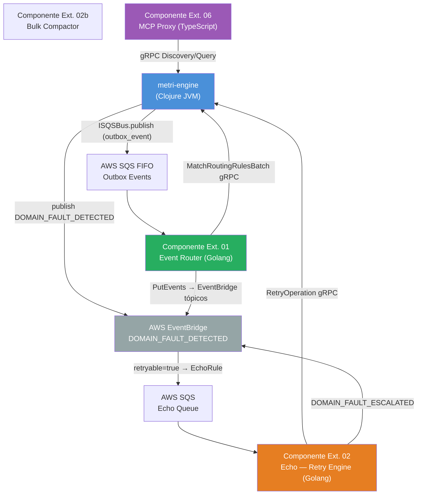

# Anexo — Estructura de Carpetas y Ficheros del Proyecto

> **Tipo:** Documento de referencia arquitectónica — SSOT de la estructura del repositorio.
> **Actualizar cuando:** se añadan o eliminen módulos, namespaces, recursos o componentes externos.
> **Vinculado a:** [01_FASE_ALISTAMIENTO_ENTORNO.md](01_FASE_ALISTAMIENTO_ENTORNO.md) · [00_OVERVIEW.md](00_OVERVIEW.md)

```
═══════════════════════════════════════════════════════════════════════════════
  ANEXO — ESTRUCTURA DE CARPETAS Y FICHEROS
  Principios: Clean Architecture · Hexagonal · DIP · SRP · Zero-Config Drift
═══════════════════════════════════════════════════════════════════════════════
```

---


## II. Arquitectura Hexagonal — Capas del Motor (`metri-engine`)

El motor sigue **Clean Architecture / Arquitectura Hexagonal** estricta. Las dependencias apuntan **siempre hacia adentro** — el dominio no conoce la infraestructura.

```
┌──────────────────────────────────────────────────────────────────────────┐
│  CAPA EXTERIOR: Transporte & Infraestructura                             │
│  src/metri/infrastructure/  ←  AWS SDKs, Valkey, Datahike, SQS, OTel   │
│  src/metri/cedar/           ←  Cedar SDK + Zero-Trust v3.1 (multi-admin) │
│  src/metri/grpc/            ←  Servidor Netty, translators, interceptores│
└────────────────────────────────────────┬─────────────────────────────────┘
                                         │  LIMITES: Protocolos (defprotocol)
┌────────────────────────────────────────▼─────────────────────────────────┐
│  CAPA APLICACIÓN: Orquestación de Casos de Uso                           │
│  src/metri/iop/             ←  IOP Pipeline v3.1 (ROP + Cedar v3.1 ctx)  │
│  src/metri/janus/           ←  OLTPChannel, OLAPChannel, projections/     │
│  src/metri/moira/           ←  EventEmitter, Outbox, SCI Sandbox         │
│  src/metri/audit/           ←  IAuditInterceptor + stubs                 │
└────────────────────────────────────────┬─────────────────────────────────┘
                                         │
┌────────────────────────────────────────▼─────────────────────────────────┐
│  CAPA DOMINIO: Reglas de Negocio Puras                                   │
│  src/metri/domain/          ←  Protocolos, Railway Pattern, audit types   │
│  src/metri/codice/          ←  Schema-Driven Core, validaciones Malli    │
│  src/metri/common/          ←  Errores, ULID, utilitarios puros          │
└──────────────────────────────────────────────────────────────────────────┘
```

> [!IMPORTANT]
> **Regla de oro:** Ningún namespace de `domain/` o `codice/` puede importar nada de
> `infrastructure/`, `grpc/` o SDKs AWS. La dirección de la dependencia ES la arquitectura.
> Verificable en compilación — si un `require` viola esta regla, el código no compila.

---

## III. Árbol Completo — `metri-engine/`

```
metri-engine/
│
├── deps.edn                                        ← SSOT de dependencias Clojure
├── build.clj                                       ← Compilación AOT + uberjar + protobuf
├── pom.xml                                         ← Maven parent (AWS SDK BOM)
├── template.yaml                                   ← IaC AWS SAM (Lambda + recursos)
├── samconfig.toml                                  ← Configuración de despliegue SAM
├── Makefile                                        ← Comandos de desarrollo (dev, test, deploy)
├── metri.proto                                     ← SSOT contrato gRPC MetriService
├── env.json                                        ← Variables de entorno SAM local
├── README.md
│
├── src/                                            ← Código fuente Clojure
│   └── metri/
│       │
│       ├── main.clj                                ← [FASE 01.01] Entry point JVM (-main)
│       ├── bootstrap.clj                           ← [FASE 01.01] Bootstrapper fail-fast
│       │
│       ├── infrastructure/                         ← [FASE 01.02] CAPA 1 — Clientes infra
│       │   ├── core.clj                            ← [EXISTENTE] Namespace raíz
│       │   ├── datahike.clj                        ← [EXISTENTE] :infra/datahike + get-connection
│       │   ├── athena.clj                          ← [EXISTENTE] :infra/athena + start-query!
│       │   ├── valkey.clj                          ← [NEW] :infra/valkey + session API
│       │   ├── dynamodb.clj                        ← [NEW] :infra/dynamodb (QuotaGuard)
│       │   ├── kinesis.clj                         ← [NEW] :infra/kinesis + put-record!
│       │   ├── eventbridge.clj                     ← [NEW] :infra/eventbridge + put-event!
│       │   ├── sqs.clj                             ← [NEW] :moira/sqs-bus + publish!/receive/delete
│       │   └── otel.clj                            ← [NEW] OTel init! (bootstrap step [2])
│       │
│       ├── cedar/                                  ← [FASE 06] ABAC — Zero-Trust v3.1
│       │   ├── engine.clj                          ← :cedar/engine ig/init + SDK JNI
│       │   ├── cache.clj                           ← :cedar/cache (TTL) + :cedar/policy-cache (LRU)
│       │   ├── authorizer.clj                      ← [FASE 06] CedarAuthorizer — 7 pasos Zero-Trust v3.1
│       │   ├── master_env.clj                      ← [v3.1] validate-master-env! + load-master-user-ids
│       │   │                                          load-master-env-config! + install-sighup-handler!
│       │   │                                          Brecha A (multi-admin) + Brecha E (SIGHUP reload)
│       │   ├── mfa.clj                             ← [v3.1] assert-mfa-for-super-master! — Brecha B
│       │   │                                          Verifica mfa-verified=true en sesión Valkey
│       │   │                                          Lanza :ABAC_403 :MFA_REQUIRED antes de Cedar
│       │   └── audit_trail.clj                     ← [v3.1] emit-cross-tenant-audit! — Brecha D
│       │                                              Fire-and-forget hacia Kinesis (moira/emit-async!)
│       │                                              Evento: :PLATFORM_CROSS_TENANT_ACCESS
│       │
│       ├── grpc/                                   ← [FASE 01.03] Capa transporte gRPC
│       │   ├── server.clj                          ← :grpc/server Netty + health
│       │   ├── service.clj                         ← MetriServiceImpl + handle-unary
│       │   ├── interceptors.clj                    ← OTel + deadline + logging interceptors
│       │   └── translator.clj                      ← Protobuf ↔ Clojure map (pura, sin estado)
│       │
│       ├── config/                                 ← [FASE 01.01] Config readers Integrant
│       │   └── readers.clj                         ← #env #env-bool #env-int tags
│       │
│       ├── domain/                                 ← Protocolo de dominio (PURO — sin I/O)
│       │   ├── core.clj
│       │   ├── protocols.clj                       ← ISQSBus ISessionStore IEventBus IFaultNotifier
│       │   ├── pipeline/
│       │   │   └── result.clj                      ← ok? error? unwrap — helpers funcionales puros
│       │   └── audit/
│       │       ├── protocol.clj                    ← (defprotocol IAuditInterceptor) — solo contrato
│       │       └── action_type.clj                 ← derive-action-type — fn pura sin I/O
│       │
│       ├── common/                                 ← Utilidades puras compartidas
│       │   ├── errors.clj                          ← errors/error, load-catalog!, error-catalog atom
│       │   └── ulid.clj                            ← Generador ULID monotónico
│       │
│       ├── codice/                                 ← [FASE 02] Schema-Driven Core
│       │   ├── bootstrapper.clj
│       │   ├── registry.clj
│       │   ├── generator.clj
│       │   ├── validator.clj
│       │   └── schema_parser.clj
│       │
│       ├── iop/                                    ← [FASE 03A] Ingestion Orchestration Pipeline v3.1
│       │   ├── core.clj                            ← run-iop + ig/init-key :iop/pipeline
│       │   ├── pipeline.clj                        ← chain + run — motor Railway ROP (fn puras)
│       │   ├── error_response.clj                  ← build-error-dto — único productor Rich DTO
│       │   ├── sherlog.clj                         ← :iop/sherlog-notifier — handle-fault!
│       │   └── steps/                              ← Wrappers Integrant de cada paso del pipeline
│       │       ├── cedar.clj                       ← ig/init-key :iop/cedar-authorizer
│       │       ├── quota.clj                       ← ig/init-key :iop/quota-guard
│       │       ├── janus.clj                       ← ig/init-key :iop/janus-router
│       │       └── moira.clj                       ← ig/init-key :moira/emitter
│       │
│       ├── janus/                                  ← [FASE 03B] Janus Router
│       │   ├── channels/
│       │   │   ├── protocol.clj                    ← (defprotocol IJanusWriteChannel)
│       │   │   ├── oltp.clj                        ← :janus/oltp-channel — d/transact ACID
│       │   │   └── olap.clj                        ← :janus/olap-channel — Kinesis put-record!
│       │   ├── projections/
│       │   │   ├── protocol.clj                    ← (defprotocol IProjectionBuilder)
│       │   │   ├── outbox.clj                      ← OutboxBuilder — outbox_event PENDING en TX
│       │   │   ├── saga.clj                        ← SagaBuilder — scheduled_job en TX
│       │   │   ├── calendar.clj                    ← CalendarBuilder — calendar_event en TX
│       │   │   └── quota.clj                       ← QuotaConfirmationBuilder — débito durable en TX
│       │   └── core.clj                            ← route — orquestador puro (sin I/O directo)
│       │
│       ├── moira/                                  ← [FASE 04] EventEmitter — Outbox Pattern
│       │   ├── emitter.clj
│       │   ├── outbox.clj
│       │   ├── rules_server.clj
│       │   └── sandbox.clj
│       │
│       ├── aegis/                                  ← [FASE 05] Motor Analítico (Read Path)
│       │   ├── pipeline.clj
│       │   ├── ast.clj
│       │   └── query_engine.clj
│       │
│       ├── quota/                                  ← [FASE 07] QuotaGuard
│       │   └── guard.clj
│       │
│       ├── audit/                                  ← [FASE 09] Auditoría
│       │   ├── interceptor.clj                     ← AuditInterceptorImpl + ig/init-key :audit/interceptor
│       │   ├── security_snapshot.clj               ← build-security-context-snapshot (I/O mínimo)
│       │   └── stubs.clj                           ← NoOpAuditInterceptor + SpyAuditInterceptor (tests)
│       │
│       ├── otel/                                   ← Observabilidad OTel (transversal)
│       │   └── spans.clj
│       │
│       ├── application/                            ← [FASE 01.01] Entry points alternativos
│       │   ├── core.clj
│       │   └── lambda_handler.clj
│       │
│       └── lambda/
│           └── handler.clj                         ← RequestStreamHandler — Lambda entry point
│
├── test/                                           ← Tests Clojure
│   └── metri/
│       ├── infrastructure/                         ← Tests de clientes infra (Unit + Integration)
│       │   ├── audit/
│       │   │   ├── interceptor_test.clj            ← contrato IAuditInterceptor
│       │   │   ├── snapshot_test.clj               ← build-security-context-snapshot
│       │   │   └── integration_test.clj            ← audit_log end-to-end
│       │   ├── datahike_test.clj
│       │   ├── valkey_test.clj
│       │   ├── dynamodb_test.clj
│       │   ├── kinesis_test.clj
│       │   ├── eventbridge_test.clj
│       │   ├── sqs_test.clj
│       │   └── otel_test.clj
│       ├── cedar/
│       │   ├── authorizer_test.clj                 ← 20+ casos TDD Cedar v3.1 (multi-admin, MFA, audit)
│       │   ├── master_env_test.clj                 ← [v3.1] validate-master-env!, load-master-user-ids
│       │   ├── mfa_test.clj                        ← [v3.1] assert-mfa-for-super-master!
│       │   ├── audit_trail_test.clj                ← [v3.1] emit-cross-tenant-audit! + KinesisSpy
│       │   └── cache_test.clj
│       ├── iop/
│       │   ├── pipeline_test.clj                   ← Motor chain/run — puro, sin stubs
│       │   ├── iop_core_test.clj                   ← Pipeline completo con stubs
│       │   ├── iop_cedar_v31_test.clj              ← [v3.1] SM+MFA, granted_action_keys, SIGHUP
│       │   └── steps/
│       │       ├── cedar_stub.clj                  ← cedar-allow! cedar-deny-401! cedar-deny-403!
│       │       ├── quota_stub.clj                  ← quota-ok! quota-deny!
│       │       ├── janus_stub.clj                  ← janus-ok! janus-val-error!
│       │       └── moira_stub.clj                  ← moira-spy (atom contador de llamadas)
│       ├── janus/
│       │   ├── router_test.clj
│       │   ├── oltp_channel_test.clj
│       │   └── projections/
│       │       ├── outbox_test.clj
│       │       ├── saga_test.clj
│       │       ├── calendar_test.clj
│       │       └── quota_confirmation_test.clj
│       ├── moira/
│       │   ├── emitter_test.clj
│       │   └── outbox_test.clj
│       ├── domain/
│       │   └── audit/
│       │       ├── action_type_test.clj            ← derive-action-type (fn pura)
│       │       └── result_test.clj                 ← ok? error? unwrap helpers
│       └── application/
│           └── security/                           ← Tests de seguridad cross-cutting
│
├── resources/                                      ← Recursos estáticos (en el classpath)
│   ├── config/
│   │   ├── system.edn                              ← [NEW] Config Integrant PRODUCCIÓN
│   │   └── system.dev.edn                          ← [NEW] Config Integrant LOCAL
│   ├── bootstrap/                                  ← [EXISTENTE — vacío, reservado]
│   ├── errors/
│   │   └── error_catalog.edn                       ← [EXISTENTE] SSOT de códigos de error
│   ├── schemas/
│   │   ├── audit_attrs.edn                         ← Schema Datahike :audit/*
│   │   └── models/                                 ← JSON Schemas de entidades (Códice)
│   │       ├── work_order.json
│   │       ├── outbox_event.json
│   │       ├── event_routing_rule.json
│   │       └── ...N entidades...
│   └── proto/                                      ← Stubs Java generados por protoc (gitignored)
│       └── target/                                 ← Artefactos de compilación protobuf
│
├── docs/
│   └── architecture/                               ← Documentación arquitectónica (SSOT)
│       ├── 00_OVERVIEW.md
│       ├── 01_FASE_ALISTAMIENTO_ENTORNO.md
│       ├── 01.01_FASE_MAIN_BOOTSTRAP.md
│       ├── 01.02_FASE_CLIENTES_INFRAESTRUCTURA.md
│       ├── 01.03_FASE_RUNTIME_GRPC.md
│       ├── 02_FASE_MOTOR_SCHEMA_DRIVEN_CORE.md
│       ├── 03_FASE_INGESTION.md
│       ├── 03A_FASE_IOP.md                         ← IOP Pipeline v3.1
│       ├── 03B_FASE_JANUS_ROUTER.md
│       ├── 04_FASE_MOIRA.md
│       ├── 05_FASE_CONSULTA.md
│       ├── 05.01-JANUS.md                          ← Cedar v3.1 ctx (granted_action_keys)
│       ├── 05.02_FASE_JANUS_AST_IR.md
│       ├── 05.03-AEGIS.md
│       ├── 05.04-HERMES.md
│       ├── 05_FASE_MOTOR_ANALITICO_CORE.md
│       ├── 06_FASE_CEDAR_AUTHORIZER.md             ← Cedar v3.1 (multi-admin, MFA, audit, SIGHUP)
│       ├── 07_FASE_QUOTA_GUARD.md
│       ├── 08_FASE_INTELIGENCIA_ARTIFICIAL_MCP.md
│       ├── 09_FASE_AUDITORIA.md
│       ├── 10_FASE_GESTION_ERRORES_EDA.md
│       ├── COMPONENTE_EXTERNO_01_EVENT_ROUTER.md
│       ├── COMPONENTE_EXTERNO_02_ECHO.md
│       ├── COMPONENTE_EXTERNO_02_BULK_COMPACTOR.md
│       ├── COMPONENTE_EXTERNO_04_METRI_IOT.md
│       ├── COMPONENTE_EXTERNO_05_METRI_SCHEDULERS.md
│       ├── COMPONENTE_EXTERNO_06_METRI_MCP.md
│       ├── cedar/                                  ← [v3.1] Policy store + schema + IaC
│       │   ├── metri.cedar                         ← SSOT Cedar policy store v3.1
│       │   └── cedar-schema.json                   ← Entity types + attribute contracts
│       ├── models/                                 ← Diagramas y modelos
│       │   └── bootstrap.json                      ← CedarAuthorizer v4.0 pseudocode
│       ├── cedar-janus-contract-v1.edn             ← Contrato formal Cedar↔Janus (Malli)
│       ├── ...
│       ├── ANEXO_ESTRUCTURA_CODIGO.md              ← ESTE FICHERO — SSOT estructura
│       ├── poc/
│       └── proto/
│
├── infra/                                          ← IaC y scripts de aprovisionamiento
│   ├── localstack/
│   │   └── init/
│   │       └── 00_init_all.sh                      ← [NEW] Script único LocalStack
│   └── docker/
│       └── docker-compose.override.yml             ← [NEW] Override debug ports
│
├── scripts/                                        ← Scripts de desarrollo y CI
│   └── validate_contracts.clj                     ← Validación contratos EDN
│
└── events/                                         ← Eventos SAM local para testing
    └── domain_fault_retryable.json
```

---

## IV. Componente Externo 02 — `metri-echo/` (Golang)

> **Doc referencia:** [COMPONENTE_EXTERNO_02_ECHO.md](COMPONENTE_EXTERNO_02_ECHO.md)

Echo es un binario Golang ARM64 completamente independiente de `metri-engine`. La única interfaz es el contrato `DOMAIN_FAULT_DETECTED` en EventBridge.

```
metri-echo/                                         ← Retry Engine — Golang 1.22
│
├── template.yaml                                   ← IaC SAM (EchoFunction + EchoQueue + DLQ)
├── samconfig.toml
├── Makefile                                        ← build / test / deploy-dev / deploy-prod / local
├── go.mod
├── go.sum
│
├── cmd/
│   └── echo_handler/
│       └── main.go                                 ← EchoHandler — Lambda SQS entry point
│                                                      Contiene: init(), EchoHandler(), loop de retry
│
├── internal/                                       ← Paquetes internos (no importables externamente)
│   ├── event/
│   │   └── domain_fault.go                         ← DomainFaultEvent, Detail, FaultDTO structs
│   │
│   ├── retry/
│   │   ├── retry.go                                ← RetryHandler + ExponentialBackoff()
│   │   └── retry_test.go                           ← TDD Matrix ECH-01..ECH-13
│   │
│   ├── dispatcher/
│   │   ├── dispatcher.go                           ← EchoDispatcher — switch por stage/error_code
│   │   └── dispatcher_test.go
│   │
│   ├── grpc/
│   │   └── metri_engine_client.go                  ← gRPC client → metri-engine RetryOperation
│   │
│   ├── dlq/
│   │   └── dlq.go                                  ← DLQClient.Send — SQS dead-letter
│   │
│   ├── eventbridge/
│   │   └── publisher.go                            ← EventBridgePublisher.PutEvent — escalación FATAL
│   │
│   ├── otel/
│   │   └── tracer.go                               ← OTel setup + AWS X-Ray propagator
│   │
├── events/
│   └── domain_fault_retryable.json                 ← Evento de prueba para SAM local
│
└── docs/
    └── architecture/                               ← Link simbólico → COMPONENTE_EXTERNO_02_ECHO.md
```

### Convenciones del paquete Go

| Regla | Ejemplo |
|---|---|
| Paquetes internos no exportables | `metri-echo/internal/...` |
| Interfaces sustituibles en tests | `Dispatcher`, `DLQClient`, `EventBridgePublisher` |
| Mocks via `testify/mock` | `MockDispatcher`, `MockDLQ`, `MockEBPublisher` |
| Build ARM64 | `GOARCH=arm64 GOOS=linux go build` |

---

## V. Convenciones del Motor Clojure

### V.1 — Nomenclatura de Namespaces

| Capa | Namespace | Fichero |
|---|---|---|
| Infraestructura | `metri.infrastructure.valkey` | `src/metri/infrastructure/valkey.clj` |
| Cedar ABAC | `metri.cedar.authorizer` | `src/metri/cedar/authorizer.clj` |
| gRPC transporte | `metri.grpc.translator` | `src/metri/grpc/translator.clj` |
| Aplicación | `metri.iop.pipeline` | `src/metri/iop/pipeline.clj` |
| Dominio | `metri.domain.protocols` | `src/metri/domain/protocols.clj` |
| Negocio | `metri.moira.emitter` | `src/metri/moira/emitter.clj` |
| Utilidades | `metri.common.errors` | `src/metri/common/errors.clj` |
| Tests | `metri.infrastructure.valkey-test` | `test/metri/infrastructure/valkey_test.clj` |

### V.2 — Keys Integrant y propietario

| Key Integrant | Fichero de implementación | Capa |
|---|---|---|
| `:infra/datahike` | `infrastructure/datahike.clj` | 1 — Infraestructura |
| `:infra/athena` | `infrastructure/athena.clj` | 1 — Infraestructura |
| `:infra/valkey` | `infrastructure/valkey.clj` | 1 — Infraestructura |
| `:infra/dynamodb` | `infrastructure/dynamodb.clj` | 1 — Infraestructura |
| `:infra/kinesis` | `infrastructure/kinesis.clj` | 1 — Infraestructura |
| `:infra/eventbridge` | `infrastructure/eventbridge.clj` | 1 — Infraestructura |
| `:moira/sqs-bus` | `infrastructure/sqs.clj` | 1 — Infraestructura |
| `:cedar/engine` | `cedar/engine.clj` | 1 — Infraestructura |
| `:cedar/policy-cache` | `cedar/cache.clj` | 1 — Infraestructura |
| `:cedar/cache` | `cedar/cache.clj` | 1 — Infraestructura |
| `:grpc/server` | `grpc/server.clj` | 1 — Infraestructura |
| `:grpc/service-impl` | `grpc/service.clj` | 1 — Infraestructura |
| `:grpc/health-manager` | `grpc/server.clj` | 1 — Infraestructura |
| `:audit/interceptor` | `audit/interceptor.clj` | 1 — Infraestructura |
| `:util/ulid-fn` | `common/ulid.clj` | 2 — Utilidades |
| `:codice/registry` | `codice/registry.clj` | 2 — Utilidades |
| `:codice/generator-inject` | `codice/generator.clj` | 2 — Utilidades |
| `:iop/cedar-authorizer` | `iop/steps/cedar.clj` | 3 — Dominio |
| `:iop/quota-guard` | `iop/steps/quota.clj` | 3 — Dominio |
| `:janus/oltp-channel` | `janus/channels/oltp.clj` | 3 — Dominio |
| `:janus/olap-channel` | `janus/channels/olap.clj` | 3 — Dominio |
| `:iop/janus-router` | `iop/steps/janus.clj` | 3 — Dominio |
| `:moira/emitter` | `iop/steps/moira.clj` | 3 — Dominio |
| `:moira/rules-server` | `moira/rules_server.clj` | 3 — Dominio |
| `:iop/sherlog-notifier` | `iop/sherlog.clj` | 3 — Dominio |
| `:iop/pipeline` | `iop/core.clj` | 4 — Aplicación |
| `:aegis/pipeline` | `aegis/pipeline.clj` | 4 — Aplicación |

### V.3 — Recursos en `resources/`

| Fichero | Propietario | Descripción |
|---|---|---|
| `errors/error_catalog.edn` | `common/errors.clj` | SSOT de todos los códigos de error del sistema |
| `schemas/audit_attrs.edn` | `bootstrap.clj` paso [1.5] | Atributos Datahike `:audit/*` |
| `schemas/models/*.json` | `codice/bootstrapper.clj` | JSON schemas de entidades por tenant |
| `config/system.edn` | `main.clj` | Config Integrant producción |
| `config/system.dev.edn` | `user.clj` (REPL) | Config Integrant desarrollo local |

---

## VI. Ficheros `[NEW]` — Prioridad de Creación

| Prioridad | Fichero | Desbloquea |
|:---:|---|---|
| P0 | `resources/errors/error_catalog.edn` | ✅ **YA EXISTE** — ampliar con `:AUD_001`, `:AUD_002`, `:MOI_SQS_001` |
| P0 | `src/metri/common/errors.clj` | Todos los componentes que usan `errors/error` |
| P1 | `resources/config/system.edn` | Integrant init en producción |
| P1 | `resources/config/system.dev.edn` | Integrant init en desarrollo / REPL |
| P2 | `src/metri/infrastructure/valkey.clj` | Cedar Authorizer paso 1 (session) |
| P2 | `src/metri/infrastructure/dynamodb.clj` | QuotaGuard |
| P2 | `src/metri/infrastructure/kinesis.clj` | OLAPChannel, AuditInterceptor, cedar/audit_trail |
| P2 | `src/metri/infrastructure/eventbridge.clj` | Sherlog → `emit-fault-event!` |
| P2 | `src/metri/infrastructure/sqs.clj` | MoiraEmitter → `publish!` |
| P2 | `src/metri/infrastructure/otel.clj` | Bootstrap paso [2] |
| **P2** | **`src/metri/cedar/master_env.clj`** | **CedarAuthorizer v3.1 — Brecha A + E** |
| **P2** | **`src/metri/cedar/mfa.clj`** | **CedarAuthorizer v3.1 — Brecha B** |
| **P2** | **`src/metri/cedar/audit_trail.clj`** | **CedarAuthorizer v3.1 — Brecha D** |
| P3 | `src/metri/cedar/engine.clj` | Cedar Authorizer paso 4 |
| P3 | `src/metri/cedar/cache.clj` | Cedar Authorizer paso 2 (cache) |
| P3 | `src/metri/grpc/server.clj` | Lambda + ECS startup |
| P3 | `src/metri/grpc/service.clj` | MetriService RPC dispatch |
| P3 | `src/metri/grpc/interceptors.clj` | OTel + deadline enforcement |
| P3 | `src/metri/grpc/translator.clj` | Protobuf ↔ Clojure |
| P3 | `src/metri/config/readers.clj` | `#env` `#env-bool` `#env-int` tags Integrant |
| P3 | `src/metri/domain/protocols.clj` | ISQSBus, ISessionStore, IEventBus, IFaultNotifier |
| P3 | `src/metri/domain/audit/protocol.clj` | IAuditInterceptor — contrato puro |
| P3 | `src/metri/domain/audit/action_type.clj` | derive-action-type — fn pura |
| P3 | `src/metri/domain/pipeline/result.clj` | ok? error? unwrap helpers |
| P3 | `src/metri/audit/interceptor.clj` | AuditInterceptorImpl + :audit/interceptor |
| P3 | `src/metri/audit/security_snapshot.clj` | build-security-context-snapshot |
| P3 | `src/metri/audit/stubs.clj` | NoOpAuditInterceptor + SpyAuditInterceptor |
| P3 | `src/metri/janus/channels/protocol.clj` | IJanusWriteChannel |
| P3 | `src/metri/janus/projections/protocol.clj` | IProjectionBuilder |
| P3 | `src/metri/janus/projections/outbox.clj` | OutboxBuilder |
| P3 | `src/metri/janus/projections/quota.clj` | QuotaConfirmationBuilder |
| P4 | `infra/localstack/init/00_init_all.sh` | Entorno local completo |
| P4 | `src/metri/application/lambda_handler.clj` | Lambda SnapStart entry point |

---

## VII. `deps.edn` — Estado de Dependencias

```clojure
;; deps.edn — Estado actual y pendientes
{:paths ["src" "resources"]

 :deps {;; ── EXISTENTES ──────────────────────────────────────────────────
        org.clojure/clojure                   {:mvn/version "1.12.0"}
        org.clojure/core.async                {:mvn/version "1.6.681"}
        metosin/malli                         {:mvn/version "0.16.4"}
        io.replikativ/datahike                {:mvn/version "0.6.1525"}
        io.replikativ/datahike-dynamodb       {:mvn/version "0.1.9"}
        com.cognitect.aws/api                 {:mvn/version "0.8.692"}
        com.cognitect.aws/endpoints           {:mvn/version "1.1.12.772"}
        software.amazon.awssdk/athena         {:mvn/version "2.25.11"}
        io.opentelemetry/opentelemetry-api    {:mvn/version "1.37.0"}
        com.amazonaws/aws-lambda-java-core    {:mvn/version "1.2.3"}
        com.amazonaws/aws-lambda-java-events  {:mvn/version "3.11.4"}

        ;; ── COMENTADOS — DESCOMENTAR AL CREAR EL FICHERO DESTINO ────────
        ;; com.taoensso/carmine               {:mvn/version "3.4.0"}      ← valkey.clj
        ;; software.amazon.cedar/cedar-java   {:mvn/version "3.2.1"}      ← cedar/engine.clj

        ;; ── PENDIENTES DE AÑADIR ─────────────────────────────────────────
        ;; software.amazon.awssdk/dynamodb    {:mvn/version "2.25.11"}    ← dynamodb.clj
        ;; software.amazon.awssdk/firehose    {:mvn/version "2.25.11"}    ← kinesis.clj
        ;; software.amazon.awssdk/eventbridge {:mvn/version "2.25.11"}    ← eventbridge.clj
        ;; software.amazon.awssdk/sqs         {:mvn/version "2.25.11"}    ← sqs.clj
        ;; com.github.ben-manes.caffeine/caffeine {:mvn/version "3.1.8"}  ← cedar/cache.clj
        ;; integrant/integrant                {:mvn/version "0.10.0"}     ← system wiring
        ;; io.grpc/grpc-netty-shaded          {:mvn/version "1.63.0"}     ← grpc/server.clj
        ;; io.grpc/grpc-protobuf              {:mvn/version "1.63.0"}     ← translator.clj
        ;; io.grpc/grpc-stub                  {:mvn/version "1.63.0"}
        ;; io.grpc/grpc-services              {:mvn/version "1.63.0"}     ← health + reflection
        ;; com.google.protobuf/protobuf-java  {:mvn/version "3.25.3"}
        ;; borkdude/sci                       {:mvn/version "0.8.41"}     ← moira/sandbox.clj
        }}
```

> [!WARNING]
> Todos los AWS SDK V2 deben usar **exactamente la misma versión** (`2.25.11`) para evitar
> conflictos del BOM. No mezclar versiones entre `athena`, `dynamodb`, `sqs`, etc.

---

## VIII. Diagrama de Dependencias entre Componentes Externos



---

## IX. Reglas de Contribución al Repositorio

> [!CAUTION]
> Violaciones de estas reglas se detectan en el PR review y bloquean el merge.

| Regla | Verificación |
|---|---|
| **No imports cruzados de capas** | `domain/` no puede `require` `infrastructure/` | Compilación Clojure |
| **Un fichero por cliente de infraestructura** | Cada SDK tiene su propio `.clj` en `infrastructure/` | Code review |
| **Tests espejo** | Cada `src/X/Y.clj` tiene `test/X/Y_test.clj` | CI check |
| **Railway en toda la API pública** | Funciones infra retornan `[:ok …] | [:error …]` | TDD |
| **Versión AWS SDK alineada** | Todos los modules SDK V2 = `2.25.11` | `deps.edn` lint |
| **Error catalog primero** | Nuevos códigos en `error_catalog.edn` antes de usarlos | Bootstrap fail-fast |
| **Integrant para toda infra** | Ningún `defonce` de cliente SDK fuera de `ig/init-key` | Arquitectura |
| **Actualizar este ANEXO** | Al añadir/eliminar módulos, actualizar sección III y VI | Obligatorio en PR |
