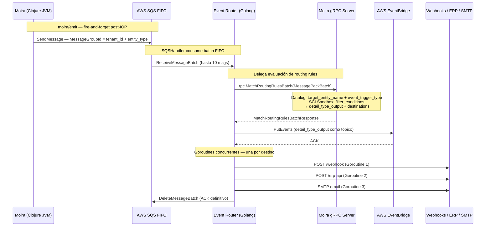

# Componente Externo 01 — Metri Event Router

**Nombre del Componente:** `metri-event-router`
**Runtime:** Golang 1.22
**Infraestructura:** AWS SAM · Lambda · SQS FIFO · EventBridge · EventBridge Scheduler
**Patrón Arquitectónico:** Outbox Consumer · EDA Broadcaster · gRPC Client

---

## Definición

El **Metri Event Router** es el componente Golang que opera como **puente asíncrono** entre el motor Clojure (Moira) y el ecosistema de eventos AWS. Consume los mensajes publicados por Moira en SQS FIFO, delega la evaluación de routing rules vía gRPC, y despacha los eventos resultantes a EventBridge y destinos HTTP externos (webhooks, ERP, SMTP).

Es el **único componente del sistema que toca la red pública de telecomunicaciones**. Su razón de ser es absorber toda la latencia de red externa (webhooks lentos, ERPs en otras regiones, timeouts) para que la JVM de Clojure opere exclusivamente en microsegundos.

---

## Objetivo

> Garantizar la entrega **At-Least-Once** de todos los eventos del Outbox hacia sus destinos registrados, con resiliencia total ante fallos de red, sin impactar la latencia del pipeline IOP/Janus/Moira.

Objetivos específicos:
1. Consumir el Outbox de SQS FIFO con paralelismo multi-stream por tenant
2. Delegar la evaluación de `event_routing_rules` a Moira vía `rpc MatchRoutingRulesBatch`
3. Publicar en AWS EventBridge usando `detail_type_output` como tópico
4. Despachar Goroutines concurrentes por cada destino HTTP (webhook/ERP/SMTP)
5. Detectar y recuperar eventos PROCESSING huérfanos (Watchdog con TTL)

---

## Stack Tecnológico

| Capa | Tecnología |
| :--- | :--------- |
| Lenguaje | Go 1.22 |
| Infraestructura | AWS SAM (Serverless Application Model) |
| Compute | AWS Lambda (arm64) |
| Cola de mensajes | AWS SQS FIFO |
| Bus de eventos | AWS EventBridge |
| Scheduler | AWS EventBridge Scheduler |
| Comunicación interna | gRPC (protobuf `metri.eda.v1`) |
| Serialización batch | MessagePack |
| Observabilidad | OpenTelemetry + AWS X-Ray |

---

## DOMINIO I: Contrato Arquitectónico

### Matriz de Responsabilidades

| Jurisdicción | El Event Router SÍ HACE | ROTUNDAMENTE PROHIBIDO |
| :----------- | :---------------------- | :--------------------- |
| **Ingesta** | Consume SQS FIFO y empaqueta el batch en MessagePack | Escribir directamente en Datahike — Golang no toca el core |
| **Evaluación** | Llama `rpc MatchRoutingRulesBatch` y espera la respuesta de Moira | Interpretar el payload crudo o implementar lógica de negocio |
| **Despacho HTTP** | Lanza Goroutines concurrentes por destino | Descartar un evento SQS sin confirmar entrega o DLQ |
| **Resiliencia** | Reintentos exponenciales por destino HTTP con Goroutines | Modificar el estado del Outbox — solo Moira muta Datahike |

### Separación de presupuestos de tiempo

```
JVM Clojure (IOP + Moira/emit) — budget: < 50ms
  └─► Escribe outbox_event en Datahike
  └─► Publica en SQS FIFO
  └─► gRPC 200 OK al cliente ← el cliente ya terminó

Event Router (Golang) — budget: ilimitado (async)
  └─► Consume SQS batch
  └─► rpc MatchRoutingRulesBatch (Datalog + SCI Sandbox en Moira)
  └─► PutEvents → EventBridge
  └─► Goroutines → webhooks / ERP / SMTP externos
  └─► DeleteMessageBatch (ACK definitivo)
```

### Herencia Global — Reglas Sistémicas y del Tenant

La evaluación de routing rules opera bajo **Global Inheritance Pattern**:

1. **Tenant-0 (System):** Reglas con `is_system_seeded: true` — inviolables, inyectadas por el Registry Guard en el bootstrap. Ningún tenant puede desactivarlas.
2. **Tenant propio:** Reglas custom del tenant definidas por sus usuarios.
3. **Resolución:** Ambas coexisten y se evalúan en la misma pasada Datalog de Moira.

---

## DOMINIO II: Topología de Ruteo

### Flujo completo SQS → gRPC → EventBridge



### Contrato de entrada — Mensaje SQS

```json
{
  "MessageGroupId": "tnt_01J..._maintenance_order",
  "MessageBody": {
    "outbox_id":   "uuid-outbox...",
    "tenant_id":   "tnt_01J...",
    "entity_type": "maintenance_order",
    "operation":   "create",
    "detail_type": "maintenance_order.create",
    "payload": {
      "state": { "id": "01J...", "cost": 7500, "status": "ACTIVE" },
      "delta": { "cost": { "before": 3000, "after": 7500 } },
      "signature_hmac": "sha256:abc..."
    }
  },
  "MessageAttributes": {
    "detail-type":  { "StringValue": "maintenance_order.create" },
    "tenant-id":    { "StringValue": "tnt_01J..." },
    "entity-type":  { "StringValue": "maintenance_order" }
  }
}
```

### Respuesta de Moira → construcción del evento EventBridge

```json
{
  "routing_results": [
    {
      "outbox_id":          "uuid-outbox...",
      "detail_type_output": "production.maintenance.budget_alert",
      "destinations": [
        {
          "webhook_url":             "https://erp.client-a.com/alerts",
          "secret_token_cipher":     "kms:aq12wsx...",
          "prepared_payload_base64": "eyJhY3Rpb...="
        }
      ]
    }
  ],
  "unmatched_outbox_ids": ["uuid-outbox-2..."]
}
```

---

## DOMINIO III: Contratos gRPC

```protobuf
syntax = "proto3";
package metri.eda.v1;

service MoiraRoutingService {

  // Invocado por SQSHandler — evalúa routing rules del batch
  rpc MatchRoutingRulesBatch (MatchRoutingRulesBatchRequest)
      returns (MatchRoutingRulesBatchResponse);

  // Invocado por WatchdogHandler — resetea eventos PROCESSING huérfanos
  rpc ResetOrphanedEvents (ResetOrphanedEventsRequest)
      returns (ResetOrphanedEventsResponse);
}

message MatchRoutingRulesBatchRequest {
  // Batch de outbox_events empaquetados en MessagePack
  bytes messagepack_encoded_batch = 1;
}

message MatchRoutingRulesBatchResponse {
  // [{outbox_id, detail_type_output, destinations:[{webhook_url, token}]}]
  bytes json_routing_results = 1;
}

message ResetOrphanedEventsRequest {
  // TTL en ms — eventos PROCESSING más viejos son huérfanos
  int64 ttl_ms = 1;
}

message ResetOrphanedEventsResponse {
  int32            reset_count     = 1;
  repeated string  reset_event_ids = 2;
}
```

---

## DOMINIO IV: Resiliencia Operativa

### Watchdog — Reset de Eventos PROCESSING Huérfanos

**El problema:** Si la JVM de Moira muere entre `PENDING → PROCESSING` y `mark-delivered!`, el evento queda en `PROCESSING` indefinidamente — `fetch-and-claim!` solo busca `PENDING`.

**La solución:** `WatchdogHandler` — segundo handler Golang disparado por EventBridge Scheduler cada 5 minutos:

```
AWS EventBridge Scheduler (rate: 5 min)
  └─► WatchdogHandler (Lambda Golang)
         └─► rpc ResetOrphanedEvents(ttl_ms=600000)
                └─► Datahike: :db/cas PROCESSING → PENDING
                    (solo si claimed_at + 10min < now)
```

```go
func WatchdogHandler(ctx context.Context) error {
    ttlMs := int64(getEnvInt("WATCHDOG_TTL_MS", 600000))

    resp, err := moiraClient.ResetOrphanedEvents(ctx,
        &pb.ResetOrphanedEventsRequest{TtlMs: ttlMs})
    if err != nil {
        otel.RecordError("watchdog.reset_orphaned", err)
        return err
    }
    if resp.ResetCount > 0 {
        otel.RecordEvent("watchdog.orphans_reset", map[string]any{
            "count":     resp.ResetCount,
            "event_ids": resp.ResetEventIds,
        })
    }
    return nil
}
```

| Escenario | Resultado |
| :-------- | :-------- |
| JVM crash pre-publish SQS | Watchdog → PENDING → retry con backoff |
| JVM crash post-publish SQS | Watchdog → PENDING → posible doble SQS, pero Event Router es idempotente por `outbox_id` |
| Watchdog corre mientras Moira activa | `:db/cas` falla silencioso — DELIVERED ya — cero corrupción |
| Watchdog Lambda falla | Siguiente ciclo (5 min) lo detecta |

> [!TIP]
> TTL recomendado: **10 minutos**. Debe superar el timeout máximo del `future` de Moira (~30s) con margen amplio.

---

## DOMINIO V: SQS FIFO Sharding — Throughput Multi-Stream

### El problema con `MessageGroupId = tenant_id`

SQS FIFO procesa cada `MessageGroupId` **secuencialmente**. Un tenant con 10,000 eventos/min tiene una sola fila de espera — un webhook lento bloquea todo.

### Solución — `MessageGroupId = tenant_id + entity_type`

Cada tipo de entidad activo genera un **stream paralelo independiente**:

```
MessageGroup: "tnt_01J..._maintenance_order"  → 3,000 ev/min ←─┐ paralelos
MessageGroup: "tnt_01J..._asset"               → 4,000 ev/min ←─┤ entre sí
MessageGroup: "tnt_01J..._work_order"          → 2,000 ev/min ←─┤
MessageGroup: "tnt_01J..._purchase_order"      → 1,000 ev/min ←─┘
```

Un tenant con 20 entity_types activos tiene **20 streams paralelos**.

> [!NOTE]
> El orden entre distintos entity_types no es un requisito en Metri EDA. Una `maintenance_order.create` y un `asset.update` no tienen dependencia causal entre sí.

### Overflow Sharding — para volumen extremo por entity_type

```go
const shardCount = 8

func buildMessageGroupId(tenantId, entityType, ulid string) string {
    if isHighVolume(entityType) {
        shard := fnv32(ulid) % shardCount
        return fmt.Sprintf("%s_%s_shard_%d", tenantId, entityType, shard)
    }
    return tenantId + "_" + entityType
}
```

> [!WARNING]
> El overflow sharding rompe el orden FIFO dentro del entity_type. Usar solo para entidades donde el orden no importa (`sensor_reading`, `audit_log`). Nunca para entidades transaccionales (`work_order`, `invoice`).

| Volumen | `MessageGroupId` | Streams | Orden |
| :------ | :--------------- | :------ | :---- |
| < 50k ev/min | `tenant_id + entity_type` | N entity_types | Por entity_type |
| > 50k ev/min (un solo type) | `tenant_id + entity_type + shard_K` | N × SHARD_COUNT | Ninguno |

---

## DOMINIO VI: Event Schedulers — Latidos Temporales

La reactividad de Metri no solo responde a mutaciones (`on_create`, `on_update`) sino también al paso del tiempo.

Los **Metri Schedulers** (modelo `scheduled_job.json`) realizan el "Heartbeat" del sistema:

1. El Scheduler escanea proactivamente entidades con estados vencidos
2. Si una cuota de tiempo se supera, dispara un **evento sintético** con el mismo formato que un evento transaccional
3. El Event Router lo captura y rutea igual que cualquier otro evento

Esto garantiza que el diseño de `event_routing_rules` sea **universal** para mutaciones y para umbrales temporales — sin distinción en el código del Event Router.

---

## DOMINIO VII: Proyecto AWS SAM + Golang

### Estructura de Carpetas y Archivos

```
metri-event-router/
├── template.yaml                    ← IaC SAM — todos los recursos AWS
├── Makefile                         ← build, test, deploy, local
├── go.mod
├── go.sum
│
├── cmd/
│   ├── sqs_handler/
│   │   └── main.go                  ← SQSHandler — punto de entrada Lambda SQS
│   └── watchdog_handler/
│       └── main.go                  ← WatchdogHandler — punto de entrada Lambda Scheduler
│
├── internal/
│   ├── grpc/
│   │   ├── client.go                ← cliente gRPC → Moira (pool + retry)
│   │   └── proto/
│   │       └── eda.pb.go            ← generado: protoc metadata
│   │
│   ├── sqs/
│   │   ├── consumer.go              ← ReceiveMessageBatch + DeleteMessageBatch
│   │   └── message.go              ← structs del mensaje SQS
│   │
│   ├── eventbridge/
│   │   └── publisher.go             ← PutEvents con detail_type_output
│   │
│   ├── dispatcher/
│   │   ├── dispatcher.go            ← orquesta: gRPC → EventBridge → Goroutines
│   │   └── goroutine_pool.go        ← pool de Goroutines HTTP por destino
│   │
│   ├── watchdog/
│   │   └── watchdog.go              ← llama ResetOrphanedEvents, emite OTEL
│   │
│   ├── sharding/
│   │   └── group_id.go              ← buildMessageGroupId con overflow sharding
│   │
│   └── otel/
│       └── tracer.go                ← OpenTelemetry + AWS X-Ray setup
│
├── proto/
│   └── eda.proto                    ← MoiraRoutingService (source of truth)
│
└── docs/
    └── architecture/ → (este documento)
```

### Variables de Entorno

| Variable | Descripción | Requerida | Ejemplo |
| :------- | :---------- | :-------: | :------ |
| `MOIRA_GRPC_ENDPOINT` | Endpoint gRPC del servidor Moira (Clojure) | ✅ | `https://xyz.lambda-url.us-east-1.on.aws` |
| `OUTBOX_QUEUE_URL` | URL de la cola SQS FIFO del Outbox | ✅ | `https://sqs.us-east-1.amazonaws.com/123/metri-outbox.fifo` |
| `EVENTBRIDGE_BUS_NAME` | Nombre del Event Bus en EventBridge | ✅ | `metri-events` |
| `WATCHDOG_TTL_MS` | TTL en ms para detectar eventos PROCESSING huérfanos | ✅ | `600000` (10 min) |
| `SHARD_COUNT` | Número de shards para entity_types de alto volumen | ✅ | `8` |
| `HIGH_VOLUME_ENTITY_TYPES` | CSV de entity_types que usan overflow sharding | ⚪ | `sensor_reading,audit_log` |
| `GRPC_TIMEOUT_MS` | Timeout del cliente gRPC hacia Moira | ✅ | `5000` |
| `HTTP_DISPATCH_TIMEOUT_MS` | Timeout de Goroutines HTTP hacia webhooks externos | ✅ | `30000` |
| `MAX_GOROUTINES_PER_BATCH` | Límite de Goroutines concurrentes por batch SQS | ✅ | `50` |
| `ENVIRONMENT` | Entorno de ejecución | ✅ | `production` |
| `AWS_REGION` | Región AWS (inyectada automáticamente por Lambda) | ✅ | `us-east-1` |
| `OTEL_EXPORTER_OTLP_ENDPOINT` | Endpoint OTEL para traces y métricas | ⚪ | `https://otel.internal:4317` |

### `template.yaml` — IaC SAM del Event Router

```yaml
AWSTemplateFormatVersion: "2010-09-09"
Transform: AWS::Serverless-2016-10-31
Description: >
  metri-event-router

  Componente Golang que consume SQS FIFO (Outbox de Moira),
  evalúa routing rules vía gRPC, y despacha eventos a EventBridge + Webhooks.
  Incluye WatchdogHandler para recuperar eventos PROCESSING huérfanos.

Parameters:
  Environment:
    Type: String
    AllowedValues: [development, staging, production]
    Default: production

  MoiraGrpcEndpoint:
    Type: String
    Description: "URL del servidor gRPC de Moira (Lambda Function URL o ECS endpoint)"

  OutboxQueueArn:
    Type: String
    Description: "ARN de la cola SQS FIFO metri-outbox.fifo (creada en template del Engine)"

  OutboxQueueUrl:
    Type: String
    Description: "URL de la cola SQS FIFO del Outbox"

  EventBridgeBusName:
    Type: String
    Default: metri-events
    Description: "Nombre del EventBridge Bus de Metri"

Globals:
  Function:
    Runtime: provided.al2023    # Go binary compilado con GOARCH=arm64
    Architectures: [arm64]
    MemorySize: 256
    Timeout: 60
    Environment:
      Variables:
        ENVIRONMENT:          !Ref Environment
        MOIRA_GRPC_ENDPOINT:  !Ref MoiraGrpcEndpoint
        OUTBOX_QUEUE_URL:     !Ref OutboxQueueUrl
        EVENTBRIDGE_BUS_NAME: !Ref EventBridgeBusName
        GRPC_TIMEOUT_MS:      "5000"
        HTTP_DISPATCH_TIMEOUT_MS: "30000"
        MAX_GOROUTINES_PER_BATCH: "50"
        WATCHDOG_TTL_MS:      "600000"
        SHARD_COUNT:          "8"

Resources:

  # ── Dead Letter Queue — eventos que no pudieron procesarse ──
  EventRouterDLQ:
    Type: AWS::SQS::Queue
    Properties:
      QueueName: !Sub "metri-event-router-dlq-${Environment}"
      MessageRetentionPeriod: 1209600    # 14 días

  # ── EventBridge Bus ──
  MetriEventBus:
    Type: AWS::Events::EventBus
    Properties:
      Name: !Ref EventBridgeBusName

  # ── Handler 1: SQSHandler — consume el Outbox y despacha eventos ──
  SQSHandlerFunction:
    Type: AWS::Serverless::Function
    Metadata:
      BuildMethod: go1.x
    Properties:
      FunctionName: !Sub "metri-event-router-sqs-${Environment}"
      CodeUri: cmd/sqs_handler/
      Handler: bootstrap
      Description: "Consume SQS FIFO Outbox → gRPC MatchRoutingRulesBatch → EventBridge + Webhooks"

      ReservedConcurrentExecutions: 10   # máx 10 instancias paralelas

      Events:
        OutboxSQSTrigger:
          Type: SQS
          Properties:
            Queue: !Ref OutboxQueueArn
            BatchSize: 10
            FunctionResponseTypes:
              - ReportBatchItemFailures    # reintentos parciales por mensaje

      DeadLetterQueue:
        Type: SQS
        TargetArn: !GetAtt EventRouterDLQ.Arn

      Policies:
        - SQSPollerPolicy:
            QueueName: !Select [4, !Split ["/", !Ref OutboxQueueUrl]]
        - SQSSendMessagePolicy:
            QueueName: !GetAtt EventRouterDLQ.QueueName
        - EventBridgePutEventsPolicy:
            EventBusName: !Ref MetriEventBus
        - Statement:
            - Effect: Allow
              Action: [lambda:InvokeFunction, lambda:InvokeFunctionUrl]
              Resource: "*"    # acceso al endpoint gRPC de Moira

  # ── Handler 2: WatchdogHandler — detecta y recupera PROCESSING huérfanos ──
  WatchdogFunction:
    Type: AWS::Serverless::Function
    Metadata:
      BuildMethod: go1.x
    Properties:
      FunctionName: !Sub "metri-event-router-watchdog-${Environment}"
      CodeUri: cmd/watchdog_handler/
      Handler: bootstrap
      Description: "Detecta eventos PROCESSING huérfanos y los resetea a PENDING vía rpc ResetOrphanedEvents"
      Timeout: 30
      MemorySize: 128

      Events:
        WatchdogSchedule:
          Type: SchedulerEventBridgeRule
          Properties:
            ScheduleExpression: "rate(5 minutes)"
            Description: "Watchdog — reset de eventos PROCESSING huérfanos cada 5 minutos"
            Input: "{}"

      Policies:
        - Statement:
            - Effect: Allow
              Action: [lambda:InvokeFunction, lambda:InvokeFunctionUrl]
              Resource: "*"    # acceso al endpoint gRPC de Moira

Outputs:
  SQSHandlerFunctionArn:
    Description: "ARN del SQSHandler del Event Router"
    Value: !GetAtt SQSHandlerFunction.Arn

  WatchdogFunctionArn:
    Description: "ARN del WatchdogHandler"
    Value: !GetAtt WatchdogFunction.Arn

  EventRouterDLQUrl:
    Description: "URL del Dead Letter Queue del Event Router"
    Value: !Ref EventRouterDLQ

  MetriEventBusName:
    Description: "Nombre del EventBridge Bus"
    Value: !Ref MetriEventBus
```

### Makefile — Comandos de Desarrollo

```makefile
BINARY_SQS     = cmd/sqs_handler/bootstrap
BINARY_WD      = cmd/watchdog_handler/bootstrap

build:
	GOARCH=arm64 GOOS=linux go build -o $(BINARY_SQS)     ./cmd/sqs_handler/
	GOARCH=arm64 GOOS=linux go build -o $(BINARY_WD)      ./cmd/watchdog_handler/

test:
	go test ./... -v -race

proto:
	protoc --go_out=. --go-grpc_out=. proto/eda.proto

deploy-dev:
	sam build && sam deploy --config-env development

deploy-prod:
	sam build && sam deploy --config-env production

local-sqs:
	sam local invoke SQSHandlerFunction --event events/sqs_batch.json

local-watchdog:
	sam local invoke WatchdogFunction --event events/empty.json
```

---

## Topología de Recursos AWS

```
┌─────────────────────────────────────────────────────────────────┐
│  AWS Account — Metri Event Router                               │
│                                                                 │
│  ┌────────────────────────────────────────────────────────┐     │
│  │  SQS FIFO: metri-outbox.fifo                          │     │
│  │  MessageGroupId: tenant_id + entity_type              │     │
│  └───────────────────────┬────────────────────────────────┘     │
│                          │ ReceiveMessageBatch (10 msgs)        │
│                          ▼                                      │
│  ┌────────────────────────────────────────────────────────┐     │
│  │  Lambda: SQSHandler (arm64, 256MB, timeout 60s)       │     │
│  │  Concurrency: 10 instancias paralelas                  │     │
│  │  ReportBatchItemFailures → reintentos parciales        │     │
│  └───┬──────────────────────────────────────────────┬─────┘     │
│      │ rpc MatchRoutingRulesBatch                   │ PutEvents │
│      ▼                                              ▼           │
│  Moira gRPC Server                         EventBridge Bus      │
│  (Lambda Clojure)                          (metri-events)       │
│                                                     │           │
│  ┌──────────────────────────────────────────────────┘           │
│  │ Goroutines HTTP → Webhooks externos / ERP / SMTP             │
│  └──────────────────────────────────────────────────────────    │
│                                                                 │
│  EventBridge Scheduler (rate: 5 min)                           │
│          │                                                      │
│          ▼                                                      │
│  Lambda: WatchdogHandler (128MB, timeout 30s)                  │
│          │ rpc ResetOrphanedEvents                              │
│          ▼                                                      │
│  Moira gRPC Server → Datahike: PROCESSING → PENDING            │
│                                                                 │
│  SQS DLQ: metri-event-router-dlq (retención 14 días)           │
└─────────────────────────────────────────────────────────────────┘
```
