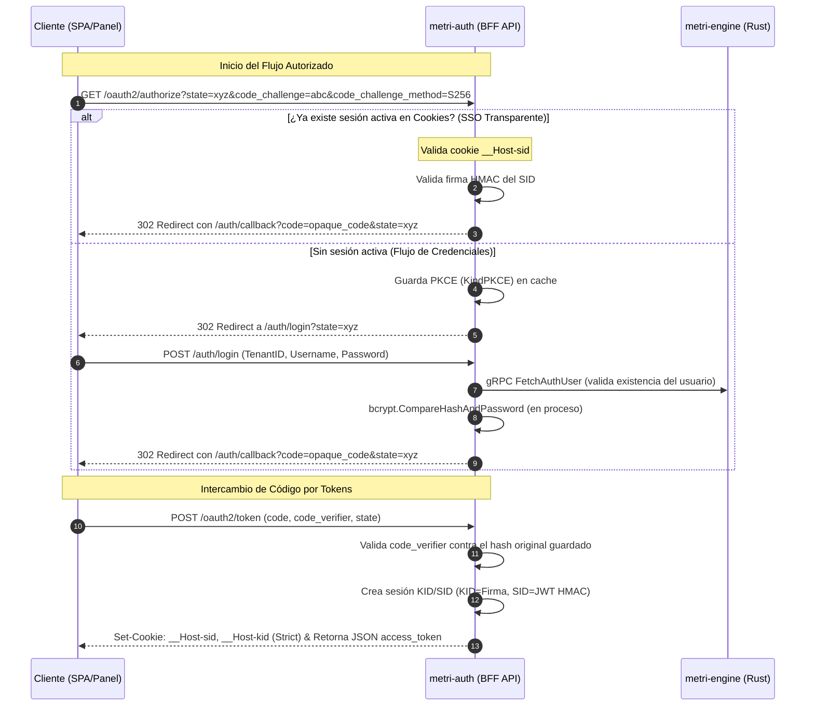
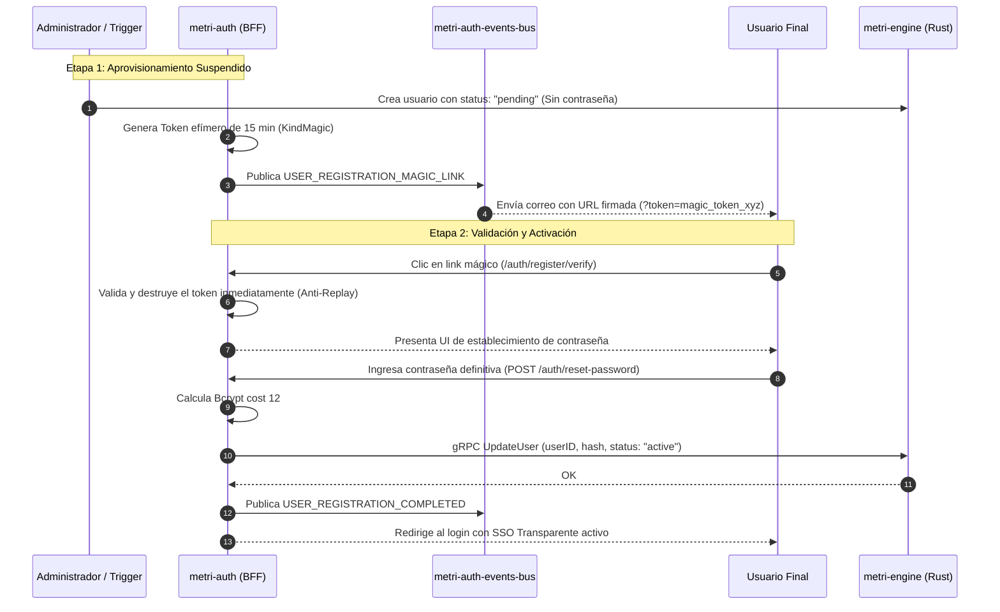
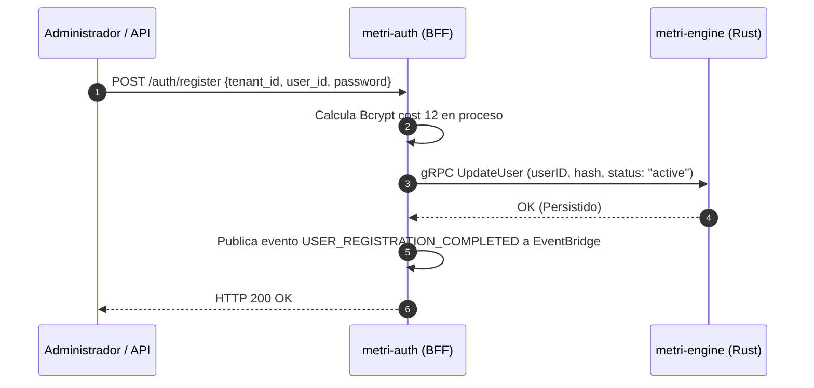

# Componente Externo 03 — Metri Auth (Identity & Access Guardian)

**Nombre del Componente:** `metri-auth`
**Runtime:** Golang 1.22+
**Infraestructura:** AWS SAM · Lambda · CloudFront Edge · WAFv2 · API Gateway · Route 53 · DynamoDB · EventBridge
**Patrón Arquitectónico:** BFF (Backend for Frontend) API · OAuth 2.1 / OIDC Provider · Decoupled Hashing Microservice · Passwordless OTP & MFA Gateway · Event-Driven Identity Publisher

---

## Definición

El **Metri Auth** es el guardián de identidad y el único punto de entrada unificado para el inicio de sesión, el Single Sign-On (SSO) y la gestión del ciclo de vida de sesiones en el ecosistema de **Metri**.

Opera bajo un **desacoplamiento estricto**:
1. **Identidad (Autenticación - metri-auth):** Valida credenciales, inicializa la sesión de usuario, gestiona el flujo de recuperación y resuelve desafíos MFA.
2. **Autorización Fina (ABAC - metri-engine / CedarAuthorizer):** La concesión de permisos finos, asignación de roles dinámicos y la evaluación de políticas de acceso residen de manera exclusiva dentro de `metri-engine` usando Cedar. **metri-auth es estrictamente identitario**, no contiene constantes de lógica de negocios ni roles cableados; estos son datos dinámicos guardados en el motor principal transaccional.

Junto con el `Event Router`, `metri-auth` es uno de los únicos componentes con exposición directa a la red pública de internet, actuando como un escudo perimetral para aislar y proteger el core en Rust (`metri-engine`) de ataques y latencias innecesarias.

---

## Objetivo

> Garantizar la seguridad absoluta, rapidez y resiliencia en la verificación de identidad, federación de tokens de sesión mediante estándares OAuth 2.1 y OIDC, aislando el cómputo costoso de credenciales y evitando la degradación de recursos del motor transaccional.

Objetivos específicos:
1. Servir como proveedor OAuth 2.1 nativo con protección PKCE estricta.
2. Servir la configuración Discovery de OpenID Connect (`/.well-known/openid-configuration`).
3. Ejecutar operaciones de criptografía en proceso (Bcrypt costo 12) optimizadas con aislamiento por invocación Lambda.
4. Proveer flujos de inicio de sesión SSO transparentes para una experiencia Web premium sin fricciones.
5. Inyectar robustez transaccional mediante autenticación de doble factor (2MA/TOTP) y flujos passwordless como Magic Links de registro.
6. Publicar asíncronamente mutaciones de identidad y solicitudes de comunicación externa a un bus de eventos dedicado (`metri-auth-events-bus`).
7. Gestionar sesiones persistentes seguras ("Recordarme") mediante persistencia de Refresh Tokens altamente escalables en tablas de **Amazon DynamoDB**.
8. Instrumentar flujos flexibles de registro y onboarding para la creación de nuevos usuarios bajo esquemas multi-tenant.

---

## Stack Tecnológico

| Capa | Tecnología |
| :--- | :--------- |
| **Lenguaje** | Go 1.22+ |
| **Infraestructura** | AWS SAM (Serverless Application Model) |
| **Edge Delivery** | AWS CloudFront (HTTP/2 con Viewer TLS dinámico) |
| **Perímetro de Seguridad** | AWS WAFv2 (Web ACL con Rate-Limiting + AWS Managed Rules) |
| **Compute** | AWS Lambda (Arquitectura arm64 nativa - Graviton) |
| **DNS Routing** | AWS Route 53 (Alias Records a CloudFront) |
| **Session Cache** | Almacenamiento transient en memoria con persistencia adaptativa |
| **Persistencia a Largo Plazo** | Amazon DynamoDB (`metri-auth-refresh-tokens`) |
| **Canalización de Eventos** | AWS EventBridge (`metri-auth-events-bus`) |
| **Seguridad de Tokens** | JWT y firmas HMAC (SID/KID) stateless |
| **Protocolo de Ingesta Core** | gRPC-Web & gRPC Nativo (Protobuf `metri.grpc`) |
| **Criptografía** | Bcrypt (Cost 12) + SHA-256 + HMAC-SHA256 |
| **Observabilidad** | Prometheus Metrics Handler (`/metrics`) |

---

## DOMINIO I: Separación de Responsabilidades y Desacoplamiento de Cómputo

### 1. Identidad vs Autorización Fina

Para preservar un diseño acoplado al modelo SOLID y evitar drift de seguridad, las responsabilidades de control de acceso se dividen tajantemente:

```
[Cliente Web / Móvil]
       │
       ▼ (Identidad & Autenticación)
┌────────────────────────────────────────────────────────┐
│  metri-auth (BFF / Go)                                 │
│  - "Eres quien dices ser?"                             │
│  - Valida credenciales e inyecta KID/SID              │
└──────────────────────┬─────────────────────────────────┘
                       │
                       ▼ (Autorización Fina & Negocio)
┌────────────────────────────────────────────────────────┐
│  metri-engine (Rust / Cedar)                           │
│  - "Tienes permiso para crear una orden de trabajo?"   │
│  - Evaluaciones Cedar de alta velocidad                │
└────────────────────────────────────────────────────────┘
```

### 2. Procesamiento de Criptografía (Bcrypt Cost 12)

El cómputo de Bcrypt (con costo 12) toma un promedio de **80ms a 150ms** de uso de CPU por petición. `metri-auth` ejecuta la verificación e inactivación de hashing directamente en proceso dentro del contenedor Lambda (aislado por invocación), utilizando `crypto.NewBcryptHasher(12)`. Como defensa en profundidad, el WAF CloudFront (`MetriAuthBlockInternalPaths`) bloquea preventivamente cualquier ruta `/internal/*`.

**Beneficios:**
- **Inmunidad DoS en BFF:** El BFF procesa peticiones en microsegundos, y si la cola de autenticación es atacada, AWS escala el microservicio de hashing de forma elástica en contenedores independientes sin consumir recursos de la API Gateway ni de los hilos de red del BFF.
- **Aislamiento Criptográfico:** Las claves y funciones matemáticas no tocan memoria del enrutador de páginas ni del cliente gRPC.

---

## DOMINIO II: Ciclo de Autenticación, OIDC y Flujo SSO Transparente

`metri-auth` expone un flujo basado en OAuth 2.1, haciendo obligatorio el uso de **PKCE (Proof Key for Code Exchange)** con encriptación SHA-256 (`S256`) para prevenir ataques de interceptación de código de autorización.

### 1. Flujo Completo OAuth 2.1 con PKCE & SSO Transparente



### 2. Catálogo de Endpoints Expuestos

| Endpoint | Protocolo | Mandato / Responsabilidad |
| :--- | :--- | :--- |
| `/.well-known/openid-configuration` | HTTP GET | Descubrimiento OIDC de endpoints, algoritmos de firma (`HS256`) y metadata. |
| `/oauth2/authorize` | HTTP GET | Punto de inicio OAuth 2.1. Almacena retos PKCE y ejecuta el **SSO Transparente**. |
| `/oauth2/token` | HTTP POST | Intercambia el código temporal y verifica el `code_verifier` (PKCE) para inyectar cookies. |
| `/oauth2/introspect` | HTTP POST | Introspección estricta y stateless de tokens para validar llamadas gRPC y APIs externas. |
| `/oauth2/revoke` | HTTP POST | Destrucción de la sesión en caché y expiración forzada de cookies seguras de navegador. |
| `/auth/login` | GET / POST | Renderiza la interfaz de inicio de sesión premium y procesa el envío de credenciales. |
| `/auth/me` | HTTP GET | Retorna la metadata del usuario autenticado (ID, username, tenant, roles) y su JWT gRPC. |
| `/auth/recover` | GET / POST | Orquesta la recuperación de contraseñas vía correo electrónico o SMS (OTP). |
| `/auth/recover/verify-otp` | HTTP POST | Valida el código de un solo uso (OTP) temporal. |
| `/auth/reset-password` | GET / POST | Renderiza y procesa el cambio definitivo de contraseña tras verificar la firma del token de reset. |
| `/auth/mfa/setup` | GET / POST | Generación y registro inicial de semillas MFA (TOTP). |
| `/auth/mfa/challenge` | GET / POST | Desafío de validación MFA multifactor durante el inicio de sesión. |

---

## DOMINIO III: Conectividad y Sesión del Sistema Auto-Rotativa (Service Token)

`metri-auth` no se comunica directamente con las bases de datos transaccionales de Metri. Toda consulta y actualización se realiza mediante gRPC o gRPC-Web seguro contra `metri-engine`.

### 1. Sistema Auto-Rotativo de Credenciales de Servicio (System Token)

Para interactuar legítimamente con las APIs privadas de `metri-engine`, el BFF de autenticación requiere un token con privilegios de sistema (`system-bff`). `metri-auth` implementa una Goroutine en segundo plano que inicializa y auto-rota esta sesión de manera segura:

```
[Goroutine en background]
  └─► Cada 30 minutos ejecuta rotación (el token expira en 1 hora)
  └─► Genera un identificador de token único (JTI) criptográfico
  └─► Firma un token HMAC utilizando TOKEN_SIGNING_SECRET con claims de "system-bff"
  └─► Guarda el token resultante en el cliente HTTP/gRPC (SetServiceToken)
  └─► Registra el JTI en el Session Store para verificaciones
```

Esta rotación automática garantiza que si un token en tránsito es interceptado de manera teórica, su ventana de validez sea extremadamente corta y autolimitada, impidiendo ataques prolongados.

### 2. Transporte Adaptativo (gRPC Nativo × gRPC-Web)

Para máxima agilidad en desarrollo local y compatibilidad serverless en producción:
- El cliente `MetriDataClient` detecta automáticamente el prefijo del endpoint. Si se configura un esquema `http://` o `https://`, conmuta su protocolo interno a **gRPC-Web** encapsulado sobre HTTP/1.1 y HTTP/2, empaquetando y desempaquetando los frames protobuf mediante codificación Big-Endian nativa (`packGrpcWeb` / `unpackGrpcWeb`).
- Si se configura una dirección cruda (e.g., `metri-data:9090`), se conecta de manera directa utilizando un canal de sockets **gRPC Nativo**, acelerando el rendimiento del pipeline de consulta en producción.

### 3. Preflight Check de Arranque

Al inicializar el componente, `metri-auth` ejecuta un bucle de comprobación de salud estricto de hasta 60 segundos (12 intentos cada 5s).
- Intenta recuperar el usuario `admin` del tenant `system`.
- Si `metri-engine` no está disponible o el bootstrap de la base de datos no ha terminado, el contenedor/lambda aborta con `os.Exit(1)` indicando `ERR_PREFLIGHT_DATABASE_UNREACHABLE`. Esto evita iniciar servicios zombis o inconsistentes en producción.

---

## DOMINIO IV: Resiliencia y Mitigación de Drift (Schema Contract Test)

Dado que `metri-auth` consume esquemas dinámicos provenientes de `metri-engine`, cualquier cambio o refactorización del motor transaccional podría romper silenciosamente el inicio de sesión.

Para mitigar esta vulnerabilidad, el componente verifica el contrato de esquema mediante
tests unitarios que reflexionan sobre el struct `AuthUser` real
(`internal/interfaces/gateways/metridata/mapper_test.go`), ejecutados en cada `make check`.

> **Actualizado (2026-08-04).** Antes esto era `cmd/simulator/test_schema_contract.go`, un
> script aislado con `//go:build ignore` que consultaba una API REST retirada del motor y
> mantenía una copia manual de `AuthUser`. Al no compilarse nunca, se pudrió en silencio.
> La versión actual no puede derivar: reflexiona sobre el struct de producción.

### 1. El Contrato de Inferencia de Usuario (`AuthUser`)

El test valida las aserciones de campos obligatorios en respuestas reales de la API transaccional, sirviendo como red de seguridad crítica antes del despliegue continuo (CI/CD):

```go
var requiredFields = []fieldContract{
    {JSONKey: "id", Kind: "string", MustBe: nonEmpty, FailCode: "ERR_AUTH_USER_SCHEMA_MISMATCH"},
    {JSONKey: "username", Kind: "string", MustBe: nonEmpty, FailCode: "ERR_AUTH_USER_SCHEMA_MISMATCH"},
    {JSONKey: "password_hash", Kind: "string", MustBe: nonEmpty, FailCode: "ERR_AUTH_USER_EMPTY_PASSWORD"},
    {JSONKey: "tenant", Kind: "any", MustBe: tenantResolvable, FailCode: "ERR_AUTH_USER_TENANT_MISSING"},
    {JSONKey: "email", Kind: "string", MustBe: nonEmpty, FailCode: "ERR_AUTH_USER_SCHEMA_MISMATCH"},
    {JSONKey: "status", Kind: "string", MustBe: isActive, FailCode: "ERR_AUTH_USER_SCHEMA_MISMATCH"},
}
```

### 2. Bugs Históricos Prevenidos por el Test de Contrato

El test incluye validaciones de tipado avanzado que resuelven de raíz 3 problemas de drift técnico comunes en despliegues distribuidos:

*   **Bug #1 – Renombrado de Campos Clave:** Detecta inconsistencias de struct-tags (por ejemplo, el mapeo de `id` vs `db/id` en el JSON retornado).
*   **Bug #2 – Serializaciones de Tenant Datomic/Datahike:** El campo `tenant` en Datahike puede retornar como un String, una tupla `[db/id "system"]` o un mapa. La función `extractTenantID()` del cliente unifica estas variantes dinámicamente y el test asegura que el valor resuelto sea siempre coherente.
*   **Bug #3 – Drift de Puertos e Hilos:** Verifica la coherencia de variables de entorno de red y detiene despliegues si detecta puertos e interfaces hardcodeadas incompatibles con el perfil productivo.

---

## DOMINIO V: Ciclos Complejos de Seguridad (2MA, MFA y Links Mágicos)

Para robustecer la identidad corporativa sin degradar la fricción de usuario, `metri-auth` incorpora flujos de inicio de sesión sin contraseña y autenticación de doble factor.

### 1. Autenticación Multifactor de Doble Factor (2MA / TOTP)

El mecanismo 2MA utiliza algoritmos de contraseñas dinámicas basadas en tiempo (TOTP - RFC 6238) y se compone de dos etapas principales:

#### A. Registro e Inicialización de MFA (`Register MFA`)
1. El usuario solicita habilitar doble factor en su perfil.
2. `metri-auth` genera criptográficamente una semilla Base32 de alta entropía (`GenerateMFASecret`).
3. Construye un URI estandarizado `otpauth://totp/...` para codificar la URL del código QR y lo almacena temporalmente en el caché transient bajo el tipo `KindMFASecret` (10 minutos TTL).
4. El cliente escanea el QR y envía el primer token de verificación de 6 dígitos.
5. El BFF ejecuta el algoritmo de validación (`VerifyTOTP`) decodificando la semilla Base32 y calculando el HMAC-SHA1 sobre el epoch temporal actual de 30 segundos.
6. Al comprobar consistencia matemática, se activa permanentemente `mfa_enabled = true` y se guarda la semilla cifrada `mfa_secret` en el registro de usuario dentro de `metri-engine`. El evento `USER_MFA_ENABLED` es publicado al bus.

#### B. Desafío MFA en Login (`MFA Challenge`)
1. Tras validar correctamente la contraseña (Bcrypt), el BFF comprueba si el usuario tiene `mfa_enabled == true`.
2. En lugar de emitir cookies definitivas, la sesión se establece en un estado transicional suspendido: `mfa_pending` (Tipo `KindMFA`) en la caché local.
3. Se redirige al navegador a `/auth/mfa/challenge` para capturar el código OTP de 6 dígitos.
4. Si el token TOTP enviado es correcto, el estado de sesión es ascendido a sesión autorizada completa (`KindSession`), liberando los tokens JWT/HMAC definitivos.

### 2. Links Mágicos de Registro (Passwordless Magic Links)

El sistema soporta un registro inicial "passwordless" o libre de contraseñas:
1. El usuario solicita registrarse ingresando su correo electrónico.
2. El BFF crea un token criptográfico efímero de un solo uso (`KindMagic`) con un TTL de 15 minutos.
3. Se encapsula en una URL firmada: `https://auth.metri.one/auth/register/verify?token=xyz&state=abc`.
4. El BFF publica el evento `USER_REGISTRATION_MAGIC_LINK` en el bus de eventos de identidad, delegando el envío del correo electrónico al microservicio de notificaciones.
5. Al hacer clic en el link, `metri-auth` valida la firma del token en caché, lo elimina inmediatamente (prevención de ataques *replay*), y le otorga al navegador una sesión autorizada de corta duración para que complete su formulario de perfil inicial.

---

## DOMINIO VI: Gestión de Recuperación y Persistencia de Sesión Prolongada

### 1. Flujo de Recuperación de Contraseña (Recovery Password)

El pipeline de recuperación permite restaurar el acceso al usuario de manera segura mediante OTPs de corta duración:

```
[Usuario] ──► Solicita Recuperación (Email o SMS)
                 │
                 ▼
          [metri-auth] ──► Genera Token / OTP temporal (KindReset / KindOTP)
                 │     ──► Publica evento en EventBridge (metri-auth-events-bus)
                 ▼
[Notificaciones] ──► Envía Email (URL token) o SMS (Código de 6 dígitos)
                 │
                 ▼
[Usuario] ──► Envía OTP a `/auth/recover/verify-otp`
                 │
                 ▼
          [metri-auth] ──► Invalida OTP, genera resetToken efímero firmado
                       ──► Redirige a formulario `/auth/reset-password`
                 │
                 ▼
[Usuario] ──► Envía Nueva Contraseña ──► metri-auth ejecuta Bcrypt ──► Actualiza metri-engine
```

### 2. Función "Recordarme" (Remember Me)
Al marcar "Recordarme" en la interfaz de login:
*   En lugar de emitir una cookie de sesión de navegador (`Session Cookie`) estándar que expira al cerrar la ventana, el BFF le otorga un ciclo de expiración estricto de **30 días** a las cookies perimetrales `__Host-sid` y `__Host-kid`.
*   Para mitigar el secuestro de sesiones y asegurar la revocación centralizada de dispositivos, la validez prolongada se apoya en una capa persistente de **Tokens de Refresco (Refresh Tokens)**.

### 3. Tokens de Refresco con Persistencia en Amazon DynamoDB

Para evitar la saturación de cachés de alta velocidad en memoria y asegurar resiliencia en reinicios del clúster de red, la persistencia de los Refresh Tokens se delega a una tabla transaccional de **Amazon DynamoDB**: `metri-auth-refresh-tokens`.

*   **Estructura de la Tabla:**
    *   `token_hash` (Partition Key - SHA-256 del Refresh Token).
    *   `user_id` (String - ID del usuario).
    *   `tenant_id` (String - Identificador del tenant).
    *   `client_fingerprint` (String - Hash IP + User Agent).
    *   `expires_at` (Epoch timestamp - TTL nativo de DynamoDB para auto-limpieza).
    *   `revoked` (Boolean).

#### Rotación de Tokens de Refresco (RTR - Refresh Token Rotation)
1. Cuando el token de acceso expira (~1 hora), el cliente móvil/web envía su Refresh Token al endpoint `/oauth2/token/refresh`.
2. El BFF busca el `token_hash` en DynamoDB.
3. **Verificación de Seguridad:** Valida que el token no haya expirado, que no esté revocado y que el `client_fingerprint` coincida con las cabeceras actuales de la petición (prevención de *replay attacks* con tokens robados).
4. Si la comprobación es exitosa, se genera un **nuevo juego de Refresh Token y Access Token**, invalidando el token anterior en DynamoDB (RTR). Esto asegura que cualquier token comprometido sea detectado inmediatamente en el segundo intento de intercambio, forzando la invalidación automática de toda la familia de tokens del usuario.

---

## DOMINIO VII: Bus de Eventos Unificado (`metri-auth-events-bus`)

Para salvaguardar el patrón **SOLID** y el desacoplamiento de microservicios, `metri-auth` **nunca se comunica directamente con proveedores de correo electrónico (SES/SMTP) ni de mensajería (SMS/Twilio)**. 

En su lugar, opera bajo una arquitectura dirigida por eventos (EDA), publicando intenciones y mutaciones a un bus central dedicado en **AWS EventBridge**: `metri-auth-events-bus`.

```
                      ┌────────────────────────────────────┐
                      │            metri-auth              │
                      │         (Autenticación)            │
                      └────────────────┬───────────────────┘
                                       │ PutEvents
                                       ▼
                      ┌────────────────────────────────────┐
                      │    metri-auth-events-bus           │
                      │        (EventBridge)               │
                      └────────────────┬───────────────────┘
                                       │
                ┌──────────────────────┼──────────────────────┐
                ▼ (Regla 1)            ▼ (Regla 2)            ▼ (Regla 3)
     ┌─────────────────────┐┌─────────────────────┐┌─────────────────────┐
     │ metri-notifications ││     Audit logs      ││    Third-Party      │
     │   (Email / SMS)     ││    (CloudWatch)     ││     (Webhooks)      │
     └─────────────────────┘└─────────────────────┘└─────────────────────┘
```

### Catálogo de Eventos de Identidad

| Tipo de Evento (`DetailType`) | Origen (`Source`) | Carga Útil (`Payload`) | Propósito / Acción |
| :--- | :--- | :--- | :--- |
| `USER_REGISTRATION_MAGIC_LINK` | `metri.auth` | `{user_id, email, token, url}` | Despacha correo electrónico de registro sin contraseña. |
| `USER_REGISTRATION_COMPLETED` | `metri.auth` | `{user_id, tenant_id, timestamp}` | Auditoría. Registra la activación definitiva del perfil. |
| `AUTH_PASSWORD_RESET_REQUESTED` | `metri.auth` | `{user_id, tenant_id, email, token}` | Despacha correo electrónico para restablecer la contraseña. |
| `AUTH_SMS_OTP_REQUESTED` | `metri.auth` | `{user_id, tenant_id, phone, otp}` | Despacha mensaje SMS con el código OTP de 6 dígitos. |
| `USER_MFA_ENABLED` | `metri.auth` | `{user_id, tenant_id, timestamp}` | Auditoría de seguridad. Despacha correo de confirmación de activación de MFA. |
| `USER_MFA_DISABLED` | `metri.auth` | `{user_id, tenant_id, timestamp}` | Alerta crítica de seguridad. Notifica la desactivación de MFA de inmediato. |
| `AUTH_PASSWORD_RESET_COMPLETED` | `metri.auth` | `{user_id, tenant_id, timestamp}` | Auditoría. Notifica cambio exitoso de contraseña. |

---

## DOMINIO VIII: Flujos de Registro y Creación de Nuevos Usuarios

La incorporación de nuevos usuarios a la plataforma está altamente estructurada para garantizar la confidencialidad de las credenciales, eliminar el tránsito de contraseñas en texto plano y auditar de forma estricta los estados de onboarding.

Existen **dos flujos de onboarding** con diferentes propósitos y niveles de recomendación:

> [!IMPORTANT]
> **RECOMENDACIÓN DE DISEÑO:**
> El **Flujo B (Invitación mediante Link Mágico)** es el **estándar primario recomendado** para todo usuario humano por razones de seguridad de nivel bancario y experiencia de usuario. El **Flujo A (Registro Directo)** queda estrictamente restringido a aprovisionamientos programáticos integrados entre sistemas de confianza (*Machine-to-Machine* / M2M) donde la identidad ya está federada previamente.

---

### 1. Flujo B (RECOMENDADO): Invitación Autogestionada mediante Link Mágico

Este es el **flujo estándar recomendado** para todos los usuarios. Elimina por completo el uso de contraseñas provisionales inseguras enviadas por correo plano y garantiza que la credencial definitiva sea conocida exclusivamente por el usuario final, creada bajo un canal TLS cifrado.



#### Ventajas del Flujo Recomendado:
*   **Seguridad de Credenciales:** Ningún administrador, canal de comunicación ni logs del sistema procesan jamás la contraseña en texto plano.
*   **Prueba de Propiedad implícita:** El usuario no puede activar su cuenta sin tener acceso físico y verificado a su buzón de correo.
*   **Inmunidad contra Replays:** Al destruirse el token `KindMagic` al primer clic, se bloquea cualquier intento de secuestro de la URL de invitación.

---

### 2. Flujo A (M2M / INTEGRACIONES): Registro Directo / Aprovisionamiento Administrativo

Este canal se reserva exclusivamente para automatizaciones M2M o aprovisionamiento desde backends integrados:



*   **Paso 1 - Recepción:** El endpoint `/auth/register` recibe el identificador del usuario, el tenant destino y la contraseña elegida por la automatización.
*   **Paso 2 - Hashing en proceso:** La BFF API calcula el hash Bcrypt (cost 12) directamente. Anteriormente lo delegaba a una Lambda `metri-token-manager`; se retiró el 2026-08-04 porque en Lambda cada invocación ya dispone de su propia CPU (no hay pool compartido que saturar), el salto de red añadía latencia a cada comparación de contraseña, y su endpoint quedaba expuesto sin autenticación en `/internal/token/*`.
*   **Paso 3 - Persistencia en Rust:** Con el hash seguro obtenido, se actualiza el perfil en `metri-engine`, guardando la credencial cifrada y activando el estado (`status = "active"`).
*   **Paso 4 - Evento:** Se publica `USER_REGISTRATION_COMPLETED` en el bus asíncrono.

---

## DOMINIO IX: Proyecto AWS SAM + Golang

### 1. Estructura de Carpetas

```
metri-auth/
├── template.yaml                     ← Configuración de Infraestructura IaC AWS SAM
├── Makefile                          ← Automatización de compilaciones, test y empaquetamiento
├── go.mod                            ← Declaración de módulos y dependencias de Go
├── go.sum
│
├── cmd/
│   └── metri-auth/
│       └── main.go                   ← Punto de entrada (config → Build → servidor/Lambda)
│
├── internal/
│   ├── app/
│   │   ├── identity/
│   │   │   ├── pkce.go               ← Gestor de desafíos y verificaciones PKCE
│   │   │   └── session.go            ← Generación y firma de tokens JWT/HMAC
│   │   └── usecase/
│   │       ├── auth_usecase.go       ← Lógica de inicio de sesión, bloqueo de cuenta e intentos
│   │       ├── dto.go                ← Objetos de transferencia de datos
│   │       ├── mfa_usecase.go        ← Registro y retos multifactor TOTP (2MA)
│   │       └── recovery_usecase.go   ← Ciclos de recuperación de contraseñas (Email/SMS OTP)
│   │
│   ├── domain/
│   │   ├── result/
│   │   │   └── result.go             ← Patrón Union-Type Result[T] y Catálogo unificado de Errores
│   │   ├── repository.go             ← Interfaces abstractas de datos (User, Session, EventBus)
│   │   ├── session.go                ← Estructuras de datos de sesión y kinds
│   │   └── user.go                   ← Modelo y comportamientos de Entidad de Usuario
│   │
│   ├── infra/
│   │   ├── config/
│   │   │   └── config.go             ← Cargador estricto de variables de entorno
│   │   ├── crypto/
│   │   │   ├── hasher.go             ← Hashers bcrypt a nivel de aplicación
│   │   │   ├── rand.go               ← Generadores criptográficos seguros
│   │   │   └── token.go              ← Firma y validación de tokens JWT/HMAC
│   │   ├── metrics/
│   │   │   └── metrics.go            ← Exposición de métricas Prometheus
│   │   └── persistence/
│   │       ├── eventbus/
│   │       │   └── event_bus.go      ← Publicador asíncrono de eventos a EventBridge
│   │       └── inmemory/
│   │           └── session.go        ← Caché de sesión en memoria con incrementos de rate limit
│   │
│   └── interfaces/
│       ├── http/
│       │   └── handlers/
│       │       ├── cookies.go        ← Utilidades de inyección y borrado de cookies seguras
│       │       ├── handlers.go       ← Estructura central del handler HTTP del BFF
│       │       ├── management.go     ← Registro de usuarios y consultas administrativas
│       │       ├── mfa.go            ← Manejo de peticiones de validación multifactor
│       │       ├── oidc.go           ← Endpoints y flujos estándar de OIDC y OAuth 2.1
│       │       ├── pages.go          ← Renderización de las interfaces UI
│       │       ├── password_utils.go ← Validaciones de complejidad de contraseñas
│       │       ├── policy.go         ← Inyección de headers CSP
│       │       └── token_signing.go  ← Lógica de firma de tokens de sesión
│       └── gateways/
│           └── metridata/
│               ├── client.go         ← Cliente principal de comunicación adaptativa gRPC/gRPC-Web
│               └── pb/
                   ├── metri.go      ← Aliases y contratos de compatibilidad Protobuf
                   └── metri.pb.go   ← Protobuf compilado de los contratos de servicio
```

### 2. Variables de Entorno Clave

| Variable | Descripción | Requerido | Ejemplo / Valor |
| :--- | :--- | :---: | :--- |
| `PORT` | Puerto de escucha en ejecución local. | ⚪ | `8081` |
| `METRI_ENGINE_URL` | Endpoint (gRPC o gRPC-Web) del motor transaccional en Rust. | ✅ | `http://localhost:3001` (local) o `https://engine.metri.one` (producción) |
| `TOKEN_SIGNING_SECRET` | Clave secreta simétrica utilizada para firmar tokens JWT/HMAC. | ✅ | Recuperado dinámicamente de AWS Secrets Manager. |
| `METRI_MASTER_TENANT_ID` | Identificador único del tenant del sistema para bootstrap. | ✅ | `system` |
| `METRI_PANEL_URL` | Dirección base del panel administrativo para redirección post-auth. | ✅ | `https://panel.metri.one` |
| `METRI_AUTH_URL` | URL pública de este servicio para federación OIDC. | ✅ | `https://auth.metri.one` |
| `ENVIRONMENT` | Entorno activo de ejecución para conmutación de cookies. | ✅ | `local`, `development`, `production` |
| `TOKEN_BINDING_MODE` | Nivel de validación de huella de navegador en tokens. | ⚪ | `warn`, `strict`, `off` (Default: `warn`) |
| `METRI_SKIP_PREFLIGHT` | Salta el prebucle de healthcheck contra metri-engine. | ⚪ | `false` (Obligatorio en producción para seguridad de consistencia) |

---

## Topología de Recursos AWS

```
                       ┌────────────────────────────────────────────────────────┐
                       │                   Route 53 DNS                         │
                       │             (auth.metri.one) -> Alias                  │
                       └────────────────────────┬───────────────────────────────┘
                                                │
                                                ▼
                       ┌────────────────────────────────────────────────────────┐
                       │              AWS WAFv2 Security Shield                 │
                       │    - Rate-Limit: 300 req / 5 min                       │
                       │    - Amazon IP Reputation & Bad Inputs Rules           │
                       └────────────────────────┬───────────────────────────────┘
                                                │
                                                ▼
                       ┌────────────────────────────────────────────────────────┐
                       │          CloudFront Edge Distribution                  │
                       │    - HTTPS Enforcement & TLS viewer certificates       │
                       │    - Cache Policy: CachingDisabled (Dynamic API)       │
                       └────────────────────────┬───────────────────────────────┘
                                                │
                                                ▼
                       ┌────────────────────────────────────────────────────────┐
                       │          AWS API Gateway (Prod Stage)                  │
                       │          - Enruta peticiones hacia Lambdas             │
                       └──────────────┬───────────────────┬─────────────────────┘
                                      │
                     HTTP /{proxy+}   │
                                      ▼
     ┌───────────────────────────────────┐
     │      Lambda: BffApiFunction       │
     │      - Runtime: Go 1.x (arm64)    │
     │      - Memoria: 256MB             │
     │      - Timeout: 15s               │
     │      - Bcrypt cost 12 en proceso  │
     └──────┬─────────────────────┬──────┘
            │                     │
            │ PutEvents           │ Read/Write Refresh Token
            ▼                     ▼
┌───────────────────────┐ ┌───────────────┐
│     EventBridge       │ │   DynamoDB    │
│ metri-auth-events-bus │ │  (Recordarme) │
└───────────────────────┘ └───────────────┘
            │
            ▼ (Subscriptores)
  [metri-notifications] ──► Envío físico de Emails & SMS (Twilio / SES)
```
