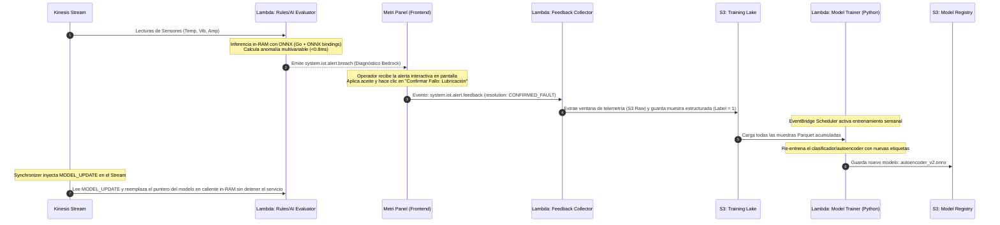
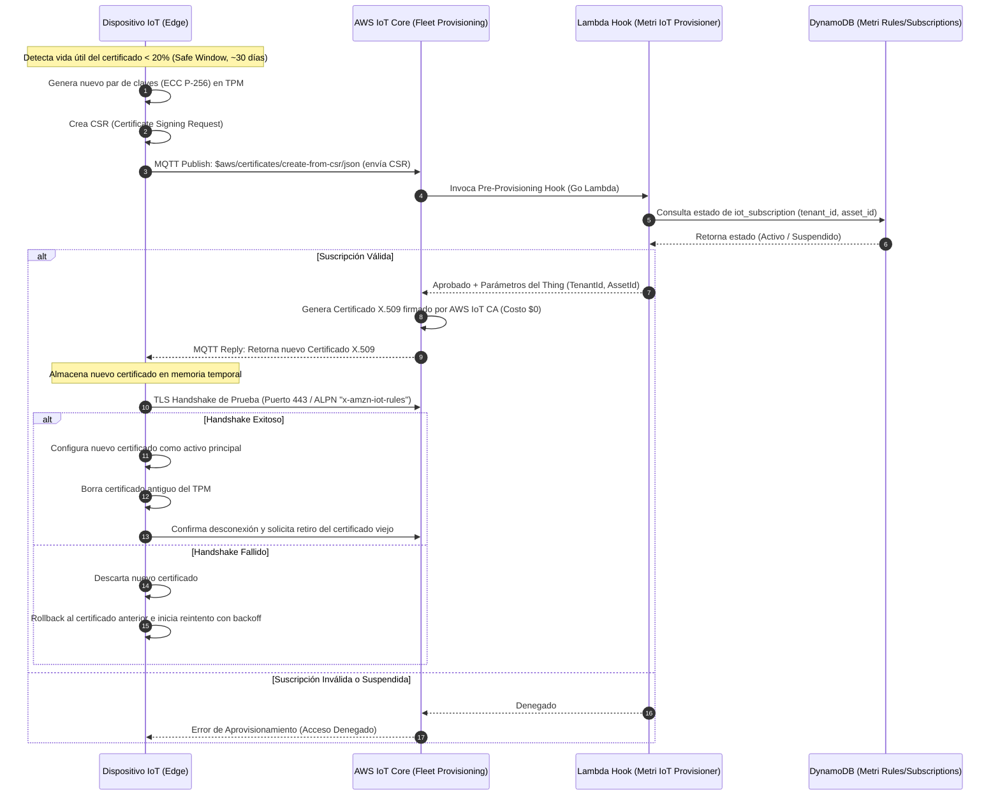

# Componente Externo 04 — Módulo Metri IoT y Eventos Telemétricos

> **Estado:** Diseño / Documentación  
> **Responsable:** Arquitectura Metri Engine  
> **Naturaleza:** Componente Externo — AWS SAM independiente  
> **Bus de integración:** Amazon EventBridge (eventos desde Metri Engine Core)

---

## 0. Principio Rector

La telemetría en Metri Engine **no satura las líneas vitales operativas**. Todo evento físico de maquinaria entra a través del **Componente Metri IoT**, separado orgánicamente como Serverless en su propio AWS SAM Stack. Este componente **recibe sus instrucciones operativas a través del bus de eventos de Metri Engine** (EventBridge), convirtiendo cada acción OLTP en una acción autónoma de infraestructura real-time.

---

## 1. Posición en el Ecosistema Metri

```
┌─────────────────────────────────────────────────────────────────┐
│                    METRI ENGINE CORE (SAM Stack)                │
│  ┌────────────┐   EventBridge Bus    ┌───────────────────────┐  │
│  │  Janus     │ ──────────────────► │   Metri IoT           │  │
│  │  Router    │                     │   (SAM Stack Externo)  │  │
│  └────────────┘                     └───────────────────────┘  │
│                                               │                  │
│  Entidades OLTP (DynamoDB EAV):               │ Controla        │
│  • iot_subscription         ◄─────────────────┤                  │
│  • iot_alert_rule           ◄─────────────────┤ AWS IoT Core    │
│  • iot_device_command       ◄─────────────────┤ MQTT Broker     │
│  • iot_device_profile                         │                  │
│  • iot_harvester_config     ◄─────────────────┤ REST Polling    │
└─────────────────────────────────────────────────────────────────┘
```

**Metri IoT es un listener puro del bus de Metri Engine.** No posee API propia expuesta al frontend. Sus acciones son 100% reactivas a eventos del bus y a telemetría física de dispositivos.

---

## 2. El Catálogo Maestro IoT (DynamoDB EAV Store en Metri Engine Core)

El Catálogo separa el Activo Físico (`asset`) de su conexión MQTT, protegiendo el inventario en rotación de hardware de proveedores.

### 2.1 Entidad `iot_subscription`

Vincula un `asset` a un Thing de AWS IoT Core. Hereda la auditoría temporal del motor EAV de Metri Engine (Rust) por ser `engine: oltp` con `track_history: true`.

| Atributo               | Tipo                       | Rol                                                                |
| ---------------------- | -------------------------- | ------------------------------------------------------------------ |
| `asset_id`             | `reference → asset`        | Dimensión principal (multitenant)                                  |
| `aws_thing_name`       | `string (unique identity)` | Identificador en AWS IoT Registry                                  |
| `topic_pattern`        | `string`                   | Ej: `metri/telemetry/{tenant_id}/{asset_id}/#`                     |
| `subscription_status`  | `enum`                     | `PENDING_PROVISIONING → ACTIVE → SUSPENDED/ERROR`                  |
| `metric_mapping`       | `json`                     | Mapeo PLC → columnas `meter_reading` (ej. `TMP_VAL → TEMPERATURE`) |
| `batch_window_seconds` | `integer (default: 300)`   | Granularidad de SQS micro-batching (0 = crudo instantáneo)         |

**Eventos EDA que emite al bus:**
- `system.iot.subscription.created` → aprovisiona el Thing en AWS IoT Core
- `system.iot.subscription.updated` → actualiza certificados o topic patterns
- `system.iot.subscription.deleted` → desvincula el dispositivo físico

### 2.2 Entidad `iot_alert_rule`

Define umbrales matemáticos evaluados en tiempo real por el **Stateful Multiplexer** en RAM de la Lambda Evaluadora. Es la alternativa al límite de 1,000 AWS IoT Rules por cuenta AWS.

| Atributo             | Tipo                             | Rol                                           |
| -------------------- | -------------------------------- | --------------------------------------------- |
| `asset_id`           | `reference → asset`              | El equipo bajo vigilancia                     |
| `metric_code`        | `string`                         | Ej. `TEMPERATURE`, `VIBRATION`                |
| `correlation_id`     | `uuid (is_system, indexed)`      | Llave de retorno si la regla la aprovisionó un `scheduled_job` de `trigger_type: TELEMETRY`. Null en reglas creadas por el usuario. Ver Componente Externo 05 §7 |
| `threshold_operator` | `enum`                           | `>`, `<`, `==`, `>=`, `<=`                    |
| `threshold_value`    | `decimal`                        | El límite físico de alerta                    |
| `unit_of_measure`    | `string`                         | Unidades UN/CEFACT (ej. `CEL` para Celsius)   |
| `cooldown_seconds`   | `integer`                        | Tiempo muerto para evitar rebote de alertas   |
| `alert_severity`     | `enum`                           | `WARNING → CRITICAL → FATAL`                  |
| `notify_users`       | `vector of reference → user`     | Usuarios a notificar                          |
| `notify_groups`      | `vector of reference → group`    | Grupos a notificar (ej. Operadores de Turno)  |
| `is_multi_asset`     | `boolean`                        | Indica si requiere comparación cruzada        |
| `target_asset_id`    | `reference → asset`              | Activo contra el cual comparar                |
| `evaluate_on_bad_qty`| `boolean`                        | Evalúa alertas bajo mala calidad de datos     |

**Eventos EDA que emite al bus** (según `models/iot_alert_rule.json`, que es el contrato canónico):
- `system.iot.alert.created` / `.updated` / `.deleted` → Sincroniza estado de reglas

> Los nombres `system.iot.rule.*` que aparecían aquí en versiones previas **no coinciden con el modelo** y quedan derogados. El `detail_type_output` autoritativo es el declarado en `event_rules` del JSON.
>
> **Tres formas conviven en el bus para el mismo hecho**, y el Rule Synchronizer las acepta todas normalizándolas (`internal/synchronizer.normalizeRuleEventType`):
>
> | Forma | Quién la emite |
> |---|---|
> | `system.iot.alert.created` | El camino ruteado: `detail_type_output` del modelo vía Outbox/Moira/Event Router |
> | `iot_alert_rule.create` | El canal OLTP del motor, que publica directo como `{entity_type}.{operation}` |
> | `rule.created` | Forma legacy, la única que el handler aceptaba antes |
>
> Rechazar las otras dejaría reglas sin sincronizar en silencio. Aguas abajo se emite siempre la canónica.

**Eventos EDA que consume del bus:**
- `system.iot.alert_rule.provision_requested` → emitido por Metri Schedulers (Kairos) al crear un `scheduled_job` de `trigger_type: TELEMETRY`. Metri Engine Core crea la `iot_alert_rule` con el `correlation_id` recibido.
- `system.iot.alert_rule.deprovision_requested` → emitido por Kairos al eliminar o suspender ese Job. Metri Engine Core elimina la regla correlacionada.

### 2.3 Entidad `iot_device_command`

Registro auditable de cada comando enviado a maquinaria física. Ciclo de vida trazado por ACKs MQTT.

| Atributo       | Tipo                | Rol                                                            |
| -------------- | ------------------- | -------------------------------------------------------------- |
| `asset_id`     | `reference → asset` | Receptor del comando                                           |
| `command_type` | `enum`              | `SHUTDOWN, REBOOT, ACTUATE_VALVE, FIRMWARE_UPDATE, SET_STATE`  |
| `payload`      | `json`              | Parámetros técnicos (ej. `{'target_rpm': 1000}`)               |
| `status`       | `enum`              | `PENDING → SENT → DELIVERED / FAILED`                          |
| `expires_at`   | `instant`           | TTL del comando: si el dispositivo no se conecta antes, CADUCA |

**Eventos EDA que emite al bus:**
- `system.iot.command.issued` → Lambda Command Dispatcher envía al Desired State del Shadow
- `system.iot.command.updated` → mapea ACKs físicos cuando el Shadow reporta estado `Reported`

### 2.4 Entidad `iot_device_profile`

Define la gramática de traducción bidireccional entre el mundo PLC y el mundo semántico Metri.

| Vector                       | Dirección   | Función                                                                                                         |
| ---------------------------- | ----------- | --------------------------------------------------------------------------------------------------------------- |
| `inbound_metric_rules`       | PLC → Metri | Transmuta llaves numéricas crudas (`tmp_val`) a medidas UN/CEFACT (`TEMPERATURE` en `CEL`) con `math_modifier`  |
| `inbound_metadata_rules`     | PLC → Metri | Extrae metadatos de texto libre (`err_code`) hacia el MAP del Data Lake                                         |
| `outbound_command_templates` | Metri → PLC | Transmuta comandos abstractos UI (`TURN_OFF`) al JSON exacto que el PLC espera (`{'cmd_id': 0, 'force': true}`) |

### 2.5 Entidad `iot_harvester_config`

Configuración para activos que no reportan por MQTT empujado (*push*), sino que exigen que Metri consulte proactivamente sus APIs REST/XML locales (*pull*).

| Atributo                   | Tipo      | Rol                                                                         |
| -------------------------- | --------- | --------------------------------------------------------------------------- |
| `asset_id`                 | reference | El equipo dueño de la telemetría                                            |
| `target_url`               | string    | URL física del gateway/API (ej: `http://192.168.1.50/api/values`)           |
| `port`                     | integer   | Puerto de red de conexión opcional (ej: 502 para Modbus TCP, 80/443 para HTTP)|
| `polling_interval_seconds` | integer   | Frecuencia de recolección (default: 60s)                                    |
| `credentials`              | json      | Cifrado con KMS (Envelope Encryption) — BasicAuth, Token o API-Key          |
| `mapping_directive`        | json      | Reglas XPath o JSONPath para mapear la respuesta al esquema de telemetría   |

---

## 3. Arquitectura del Flujo Telemétrico (Entry Points)

### 3.1 Diagrama de Componentes

```
                                    ┌───────────────────────┐
                                    │ AWS EventBridge Bus   │
                                    └───────────┬───────────┘
                                                │ (Reglas de Alerta)
                                                ▼
  ┌────────────────────────────────────────────────────────────────────────┐
  │                           METRI IOT SAM STACK                          │
  │                                                                        │
  │                     ┌────────────────────────┐                         │
  │                     │ Lambda: Rule Synch     │                         │
  │                     └───────────┬────────────┘                         │
  │                                 ▼                                      │
  │                       ┌────────────────────┐                           │
  │                       │ DynamoDB RuleStore │                           │
  │                       └─────────┬──────────┘                           │
  │                                 │ (Cold Start Load)                    │
  │                                 ▼                                      │
  │  ┌──────────────┐     ┌────────────────────┐      ┌─────────────────┐  │
  │  │ AWS IoT Core │ ──► │  Lambda Evaluator  │ ───► │ EventBridge Bus │  │
  │  │ (MQTT Broker)│     │  (ONNX / Local RAM)│      │  (Breach/Alert) │  │
  │  └──────────────┘     └────────────────────┘      └─────────────────┘  │
  │                                 │ (Every telemetric event)             │
  │                                 ▼                                      │
  │                       ┌────────────────────┐                           │
  │                       │ Kinesis Stream /   │                           │
  │                       │ Iceberg Compactor  │                           │
  │                       └─────────┬──────────┘                           │
  │                                 ▼                                      │
  │                       ┌────────────────────┐                           │
  │                       │    S3 Data Lake    │                           │
  │                       └────────────────────┘                           │
  └────────────────────────────────────────────────────────────────────────┘
```

### 3.2 Los Dos Puntos de Entrada — Un Solo Evaluador

Todo dato telemétrico entra a Metri IoT por uno de dos caminos. Sin importar el origen, ambos pasan por el **mismo motor de evaluación de reglas** antes de ser inyectados en las bases de datos de Metri Engine.

|                   | Entry Point A — AWS IoT Core                                                    | Entry Point B — HTTP Harvester                         |
| ----------------- | ------------------------------------------------------------------------------- | ------------------------------------------------------ |
| **Fuente**        | Dispositivos físicos con AWS IoT SDK (MQTT)                                     | APIs REST/XML/gRPC de activos sin MQTT nativo          |
| **Disparo**       | Dispositivo publica al broker → Kinesis Data Stream → Metri IoT Rules Evaluator | EventBridge Scheduler según `polling_interval_seconds` |
| **Ejemplos**      | Turbinas, compresores, PLCs con firmware IoT                                    | SCADA legacy, APIs de fabricante, OPC-UA sobre HTTP    |
| **Normalización** | `metric_mapping` de `iot_subscription`                                          | `inbound_metric_rules` de `iot_device_profile`         |
| **Evaluación**    | Estado local en RAM del Lambda (sin cache externo)                              | **Idéntica al Entry Point A**                          |
| **S3 Data Lake**  | Kinesis Data Firehose (automático, filtra RULE_CHANGE)                          | Lambda escribe directo a S3 (Iceberg)                  |

---

## 4. Motor de Reglas Dinámicas — El Problema y la Solución

### 4.1 Por qué AWS IoT Rules no es suficiente

AWS IoT Rules presenta limitaciones estructurales insalvables para una plataforma SaaS multitenant:
1. **Límite de 1,000 reglas por cuenta AWS:** Si tenemos 500 activos y cada uno define 3 alarmas (Temperatura, Presión, Vibración), requeriríamos 1,500 reglas. AWS IoT bloquearía el despliegue.
2. **Costo por evaluación:** AWS cobra por cada regla evaluada en IoT Core. Con miles de mensajes por segundo, el costo se vuelve inviable.
3. **Falta de multitenancy nativo:** No aísla el contexto de ejecución.

### 4.2 El Principio Fundamental: Kinesis Partition Key = `asset_id`

Todo el diseño de alto rendimiento y consistencia del Rules Engine descansa sobre una propiedad nativa de enrutamiento en Kinesis Data Streams:

```
AWS IoT Rule ──► Kinesis Data Stream ──► PartitionKey = "${asset_id}"
```

> [!IMPORTANT]
> **Consecuencia determinista:** Todo lo relacionado con un activo —tanto sus lecturas telemétricas como los cambios a sus reglas de alerta— siempre viaja al **mismo shard físico del stream** y es procesado en un **orden secuencial estricto** por la **misma instancia activa del Lambda Evaluator**.

Esto elimina la necesidad de un cache distribuido centralizado y costoso (Valkey/Redis). El estado puede vivir con seguridad en la memoria en caliente del proceso Lambda porque ese contenedor es el único responsable y receptor de la telemetría de ese activo.

### 4.3 Arquitectura: Dual Record Type en el mismo Stream

Para garantizar la consistencia en el orden de evaluación sin recurrir a locks distributivos, el Kinesis Data Stream transporta **dos tipos de registros de forma intercalada**:

- **TelemetryRecord:** Lecturas de sensores ordinarios.
- **RuleChangeRecord:** Registros administrativos inyectados por la Lambda Rule Synchronizer cuando el usuario cambia una regla en el panel. Al leer este registro, el evaluador limpia el caché de reglas del activo correspondiente en RAM, forzando la recarga en la siguiente lectura telemétrica.

### 4.4 Ingesta de Reglas: DynamoDB Rules Store

Las reglas no se consultan en caliente en una base de datos externa para cada mensaje. Se guardan en una tabla DynamoDB (`IoTRulesTable`). El Evaluador de Lambdas realiza una consulta rápida (Query de bajo costo) a DynamoDB únicamente durante un Cold Start (cuando recibe telemetría de un activo y no tiene sus reglas en RAM). Posteriormente, mantiene estas reglas en su memoria RAM local de forma stateless y reactiva.

### 4.4.1 El cooldown no puede vivir sólo en RAM

`AssetState.Cooldowns` es un mapa en la memoria del contenedor. Como caché de reglas eso es correcto —las reglas tienen copia durable en DynamoDB y perderlas sólo cuesta una query—, pero **el cooldown no tiene otra copia**: se inicializa vacío en cada arranque en frío.

Consecuencia: un contenedor reciclado vuelve a disparar **todas** las reglas que estén en breach. Y los contenedores Lambda se reciclan por despliegue, por escalado, por inactividad o por decisión del servicio. No es un caso raro, es rutina.

| Tipo de regla | Qué produce perder el cooldown |
|---|---|
| Alerta IoT ordinaria | Ruido: el operador recibe cincuenta notificaciones en vez de una |
| Regla aprovisionada por un `scheduled_job` | **Órdenes de mantenimiento duplicadas** |

El segundo caso es el grave, y la guarda de idempotencia aguas abajo **no lo detiene**: la llave deriva del instante del breach, así que dos breaches genuinos son dos ocurrencias distintas con llaves distintas. Para el sistema son dos eventos legítimos.

**La ventana se aplica con una escritura condicional en DynamoDB, sólo al detectar breach:**

```
UpdateItem(
  Key: {pk: "COOLDOWN#<rule_id>", sk: "COOLDOWN#<rule_id>"},
  UpdateExpression:    "SET last_breach_at = :now, expires_at = :ttl",
  ConditionExpression: "attribute_not_exists(last_breach_at) OR last_breach_at <= :cutoff"
)
```

- **Condición satisfecha** → la ventana expiró: emitir el breach.
- **`ConditionalCheckFailedException`** → sigue dentro: suprimir.
- **Cualquier otro error** → **no** se emite. Leer un fallo de infraestructura como "ventana expirada" dispararía la regla sin protección en cada reintento.

> **El coste es despreciable por construcción.** La escritura ocurre **sólo cuando un umbral se rompe de verdad**; las lecturas que se mantienen dentro de límites —la inmensa mayoría— no tocan DynamoDB. Si los breaches fueran lo bastante frecuentes como para que esto pesara, el umbral estaría mal configurado.
>
> El mapa en RAM se conserva como **pre-filtro**: evita la llamada mientras el mismo contenedor está claramente dentro de la ventana. Es una optimización, no la garantía.

> **La afinidad activo↔contenedor sigue sin estar protegida.** El diseño de §4.2 se apoya en que la clave de partición `asset_id` lleva todo lo de un activo al mismo contenedor. Eso deja de cumplirse si alguien sube `ParallelizationFactor` por encima de 1, o cuando Kinesis divide shards y remapea las claves. Ninguna de las dos cosas está documentada ni protegida. La escritura condicional cubre también ese caso, porque el compare-and-set es atómico entre contenedores.

---

### 4.5 El Ciclo de Vida del Estado: Cold Start vs Generational Warm Container

El mayor desafío de almacenar el estado en la RAM de un contenedor efímero es la pérdida de memoria en los inicios en frío. La arquitectura soluciona esto de manera híbrida combinando DynamoDB (lecturas de inicialización) y Kinesis (actualizaciones in-flight), pero utilizando un mapa doble para proteger a DynamoDB contra la "Tormenta de Caché" (*Cache Stampede*):

```
┌────────────────────────────────────────────────────────┐
│  Contenedor Lambda arranca (Cold Start)                │
│  current = {}, previous = {} (RAM vacía)               │
└───────────────────────────┬────────────────────────────┘
                            │
                            ▼
┌────────────────────────────────────────────────────────┐
│  Llega primer READING de "Tenant42:Asset99"            │
│  ¿No está en current ni en previous?                   │
└───────────────────────────┬────────────────────────────┘
                            │ SÍ
                            ▼
┌────────────────────────────────────────────────────────┐
│  DynamoDB Query: PK="42#99"                            │
│  Carga inicial de reglas vigentes en RAM               │
│  current["42:99"] = AssetState                         │
└───────────────────────────┬────────────────────────────┘
                            │
                            ▼
┌────────────────────────────────────────────────────────┐
│  Ejecución Normal en Caliente (Warm Path)              │
│  Evaluación instantánea a nivel de RAM (<1ms).         │
│  CERO consultas a base de datos.                       │
└───────────────────────────┬────────────────────────────┘
                            │
                            ▼
```

### 4.6 Mitigación de Latencia y optimización de bucles de control

La latencia de **15-30ms** en la consulta de red síncrona `GetThingShadow` es perfectamente aceptable para telemetría visual, monitoreo predictivo y alarmas operativas. Sin embargo, para **bucles de control cerrados en tiempo real** (por ejemplo, apagar un generador si el sensor de vibración del motor A supera al del motor B en milisegundos), esta latencia Cloud-WAN sumada al buffering de Kinesis representa un riesgo físico.

##### Estrategia 1: Rediseño del Partition Key — Ruteo en Caliente in-RAM (Recomendado Cloud)

Para eliminar el **100%** de las consultas síncronas de red (`GetThingShadow`) en el hot-path de evaluación multi-activo sin incurrir en costos de bases de datos calientes (Valkey/Redis), se optimiza el enrutamiento de Kinesis redefiniendo la clave de partición:

> [!TIP]
> **Cambio de Paradigma: Partition Key = location_id (o machine_group_id)**
> En lugar de particionar el Kinesis Data Stream individualmente por `PartitionKey = asset_id`, el `LambdaProvisioner` configura la regla de AWS IoT Core para enrutar usando el identificador de ubicación jerárquico o grupo físico de maquinaria:
> ```sql
> -- AWS IoT Rule SQL
> SELECT *, topic() as raw_topic, clientid() as device_id
> FROM 'metri/telemetry/{tenant_id}/#'
> -- Action: KinesisAction -> PartitionKey = "${location_id}"
> ```

- **Consecuencia Determinista:** Todos los activos y sensores que pertenecen a la misma ubicación física o grupo funcional de maquinaria (ej: Caldera-A y Caldera-B dentro del "Cuarto de Máquinas Sur") son dirigidos al **mismo shard físico de Kinesis** y procesados por la **misma instancia activa de la Lambda Evaluator**.
- **Acceso in-RAM a Microsegundo:** La evaluación multi-activo deja de requerir una llamada HTTP síncrona a AWS IoT Core. El estado de la Caldera-B se encuentra cargado en el mapa caliente `current` de la memoria local de la misma Lambda (puesto que ambas se ejecutan en el mismo proceso).
- **Latencia de Lectura Comparativa:** Pasa de **15-30ms** de red a **< 1 microsegundo (0.001ms)** mediante consulta de memoria directa (`cache.Get("tenant-42:Caldera-B")`), con costo operativo de **$0.00 USD**.

##### Estrategia 2: Edge Computing con AWS IoT Greengrass v2 (Aislamiento Industrial)

Para bucles de control que exigen tiempos de reacción `< 5ms` y resiliencia absoluta ante caídas de enlace de Internet (WAN Offline Survivability):

- **Arquitectura Local:** Se despliega un Gateway industrial en planta (ej. Siemens IoT2050, Advantech) ejecutando **AWS IoT Greengrass v2**.
- **Local Evaluator Component:** El motor `GenerationalRulesCache` y la lógica evaluadora se compilan en un binario de Go y se despliegan como un componente local de Greengrass.
- **Bucle Local Broker:** Los sensores transmiten vía Modbus TCP o OPC UA al broker MQTT local de Greengrass.
- **Latencia Local:** La evaluación y la escritura del "Desired State" en la sombra local o comando Modbus de parada de emergencia se ejecutan de forma directa en la red local (LAN), logrando latencias de reacción de **< 2ms** de forma determinista y 100% autónoma.

##### Estrategia 3: Optimización del SDK de Go y HTTP Connection Pooling (Afinación Cloud)

Si los activos pertenecen a ubicaciones geográficamente distantes y no pueden particionarse en el mismo shard de Kinesis, se optimizan los sockets de red del cliente Go:

- **Keep-Alive y TCP Warmup:** La inicialización de `iotdataplane.NewFromConfig(cfg)` en la sección de inicio de la Lambda configura un pool de conexiones HTTP de larga duración y desactivación de la resolución DNS en cada llamada. Esto reduce la latencia de establecimiento de socket TLS de **80ms** (en frío) a una constante de **12-15ms** en caliente.

---

### 4.7 Evitar Fugas de Memoria: Generational Rules Cache in RAM (Go)

A continuación se detalla la implementación en Go (grado de producción compilable AOT) para el motor de evaluación de reglas con caché generacional de doble mapa y soporte para recarga atómica.

```go
package main

import (
	"context"
	"encoding/json"
	"fmt"
	"log"
	"sync"
	"time"

	"github.com/aws/aws-lambda-go/events"
	"github.com/aws/aws-sdk-go-v2/aws"
	"github.com/aws/aws-sdk-go-v2/service/dynamodb"
	"github.com/aws/aws-sdk-go-v2/service/dynamodb/types"
	"github.com/aws/aws-sdk-go-v2/service/eventbridge"
	"github.com/aws/aws-sdk-go-v2/service/iotdataplane"
)

// TelemetryRecord representa el payload telemétrico de entrada
type TelemetryRecord struct {
	AssetID   string  `json:"asset_id"`
	TenantID  string  `json:"tenant_id"`
	Metric    string  `json:"metric"`
	Value     float64 `json:"value"`
	Timestamp int64   `json:"timestamp"`
}

// Rule representa una regla de alarma en caliente
type Rule struct {
	RuleID               string   `json:"rule_id"`
	MetricCode           string   `json:"metric_code"`
	ThresholdOperator    string   `json:"threshold_operator"`
	ThresholdValue       float64  `json:"threshold_value"`
	UnitOfMeasure        string   `json:"unit_of_measure"`
	CooldownSeconds      int64    `json:"cooldown_seconds"`
	AlertSeverity        string   `json:"alert_severity"`
	NotifyUsers          []string `json:"notify_users"`
	NotifyGroups         []string `json:"notify_groups"`
	IsMultiAsset         bool     `json:"is_multi_asset"`
	TargetAssetID        string   `json:"target_asset_id"`
	EvaluateOnBadQuality bool     `json:"evaluate_on_bad_quality"`
	// Llave de retorno del Boomerang. No vacía sólo si la regla fue
	// aprovisionada por un scheduled_job de trigger_type TELEMETRY.
	// El Harvester la transporta sin interpretarla. Ver Componente Externo 05 §7.
	CorrelationID        string   `json:"correlation_id,omitempty"`
}

// AssetState encapsula el estado local caliente de un activo telemetrado
type AssetState struct {
	Rules            []Rule
	Cooldowns        map[string]int64   // Clave: rule_id, Valor: Unix Epoch ms del último breach
	LastKnownMetrics map[string]float64 // Clave: metric_code, Valor: último valor físico registrado
}

// GenerationalRulesCache implementa el caché doble con rotación temporal
type GenerationalRulesCache struct {
	current      map[string]*AssetState
	previous     map[string]*AssetState
	interval     time.Duration
	lastRotation time.Time
	mu           sync.RWMutex
}

func NewGenerationalRulesCache(interval time.Duration) *GenerationalRulesCache {
	return &GenerationalRulesCache{
		current:      make(map[string]*AssetState),
		previous:     make(map[string]*AssetState),
		interval:     interval,
		lastRotation: time.Now(),
	}
}

func (c *GenerationalRulesCache) Get(key string) (*AssetState, bool) {
	c.mu.RLock()
	defer c.mu.RUnlock()
	if val, ok := c.current[key]; ok {
		return val, true
	}
	if val, ok := c.previous[key]; ok {
		return val, true
	}
	return nil, false
}

func (c *GenerationalRulesCache) Set(key string, val *AssetState) {
	c.mu.Lock()
	defer c.mu.Unlock()
	c.current[key] = val
}

func (c *GenerationalRulesCache) Rotate() {
	c.mu.Lock()
	defer c.mu.Unlock()
	c.previous = c.current
	c.current = make(map[string]*AssetState)
	c.lastRotation = time.Now()
}

func evaluate(val float64, op string, threshold float64) bool {
	switch op {
	case "GT":  return val > threshold
	case "LT":  return val < threshold
	case "GTE": return val >= threshold
	case "LTE": return val <= threshold
	case "EQ":  return val == threshold
	case "NE":  return val != threshold
	}
	return false
}
```

### 4.8 Aislamiento Multitenant en Memoria

El Evaluador aísla de forma nativa los tenants in-memory gracias a que todas las claves de los mapas `current` y `previous` utilizan prefijos multitenant compuestos (`tenant_id:asset_id`), haciendo imposible la fuga de información o evaluación cruzada de activos entre clientes SaaS corporativos independientes.

---

### 4.9 AWS IoT Shadows como Session Store

Para el almacenamiento y la consulta del estado compartido entre diferentes activos (reglas multi-activo), el motor utiliza de forma exclusiva **AWS IoT Device Shadows**, sirviendo como el **Gemelo Digital** en tiempo real de la flota física.

##### Análisis Económico (Para 1,000 activos / 5% de reglas complejas / 13.14M eventos al mes):
- **Costo de Escrituras:** **$0.00 USD** (100% amortizado por la telemetría y UI general del sistema, puesto que las sombras son actualizadas obligatoriamente por la ingesta normal de activos).
- **Costo de Lectura (`GetThingShadow` para comparación cruzada):**  
  AWS IoT Core cobra $1.25 USD por millón de operaciones de Shadow.  
  $$13.14	ext{ millones de consultas} 	imes \$1.25/	ext{millón} = \mathbf{\$16.42	ext{ USD al mes}}.$$
- **Costo total de la solución multi-activo:** **$16.42 USD al mes**, con un costo base inactivo de **$0.00 USD** (pago por uso puro sin servidores dedicados activos).

##### Implementación en Go del Shadow Store:

```go
// ShadowDocument representa la estructura JSON estándar de la sombra AWS IoT
type ShadowDocument struct {
	State ShadowState `json:"state"`
}

type ShadowState struct {
	Reported map[string]any `json:"reported"`
	Desired  map[string]any `json:"desired,omitempty"`
}

// ShadowStore define la interfaz para interactuar con la sombra del dispositivo
type ShadowStore interface {
	Get(ctx context.Context, tenantID, assetID, metric string) (float64, error)
	Set(ctx context.Context, tenantID, assetID, metric string, val float64) error
}

type IotShadowStore struct {
	client *iotdataplane.Client
}

func NewIotShadowStore(client *iotdataplane.Client) *IotShadowStore {
	return &IotShadowStore{client: client}
}

func (s *IotShadowStore) Get(ctx context.Context, tenantID, assetID, metric string) (float64, error) {
	thingName := fmt.Sprintf("metri_%s_%s", tenantID, assetID)
	out, err := s.client.GetThingShadow(ctx, &iotdataplane.GetThingShadowInput{
		ThingName: aws.String(thingName),
	})
	if err != nil {
		return 0, err
	}

	var doc ShadowDocument
	if err := json.Unmarshal(out.Payload, &doc); err != nil {
		return 0, err
	}

	val, ok := doc.State.Reported[metric]
	if !ok {
		return 0, fmt.Errorf("metric %s not found in shadow", metric)
	}

	switch v := val.(type) {
	case float64:
		return v, nil
	case float32:
		return float64(v), nil
	case int:
		return float64(v), nil
	case int64:
		return float64(v), nil
	}
	return 0, fmt.Errorf("invalid metric value type")
}

func (s *IotShadowStore) Set(ctx context.Context, tenantID, assetID, metric string, val float64) error {
	thingName := fmt.Sprintf("metri_%s_%s", tenantID, assetID)
	doc := ShadowDocument{
		State: ShadowState{
			Reported: map[string]any{
				metric: val,
			},
		},
	}

	payloadBytes, err := json.Marshal(doc)
	if err != nil {
		return err
	}

	_, err = s.client.UpdateThingShadow(ctx, &iotdataplane.UpdateThingShadowInput{
		ThingName: aws.String(thingName),
		Payload:   payloadBytes,
	})
	return err
}
```

---

### 4.10 Interfaz de Comunicación de Notificaciones Desacoplada (Decoupled Notifier)

Para mantener la flexibilidad de la plataforma y garantizar la capacidad de intercambiar el motor de envío de notificaciones en cualquier momento sin alterar la lógica interna de evaluación de alertas de Metri IoT, se adopta el patrón de **Inversión de Dependencias (IoC)** mediante la interfaz `Notifier`.

* **Desacoplamiento Estricto:** La Lambda de evaluación no tiene conocimiento de a dónde o cómo se envían los breaches detectados. Únicamente invoca a `notifier.Notify(ctx, payload)`.
* **Intercambio Dinámico:** La instancia concreta de `Notifier` se inyecta durante el inicio (*startup*) de la Lambda a partir de variables de entorno o configuración:
  - **`EventBridgeNotifier`** (Default): Publica los eventos en Amazon EventBridge para que el stack central de notificaciones los procese de forma asíncrona.
  - **`SNSNotifier`** / **`SMSNotifier`**: Implementaciones alternativas de bajo costo que pueden inyectarse para enviar alertas directas mediante SMS o emails a través de AWS SNS o AWS SES.
  - **`WebhookNotifier`**: Envía alertas HTTP POST a sistemas externos directamente desde la Lambda del Evaluador.
  - **`MockNotifier`**: Permite ejecutar pruebas unitarias y de integración locales sin interactuar con infraestructura AWS real.

```go
// AlertPayload representa los datos de una alerta para ser notificados
type AlertPayload struct {
	RuleID        string   `json:"rule_id"`
	AssetID       string   `json:"asset_id"`
	TenantID      string   `json:"tenant_id"`
	Metric        string   `json:"metric"`
	BreachValue   float64  `json:"breach_value"`
	Operator      string   `json:"operator"`
	LimitValue    float64  `json:"limit_value"`
	Severity      string   `json:"severity"`
	NotifyUsers   []string `json:"notify_users"`
	NotifyGroups  []string `json:"notify_groups"`
	Timestamp     int64    `json:"timestamp"`
	// Propagado tal cual desde Rule.CorrelationID. Metri Schedulers (Iris)
	// filtra por su presencia para distinguir un breach originado en un
	// scheduled_job de una alerta IoT ordinaria.
	CorrelationID string   `json:"correlation_id,omitempty"`
}

// Notifier define el contrato desacoplado para el envío de alertas y notificaciones
type Notifier interface {
	Notify(ctx context.Context, payload AlertPayload) error
}

var (
	cache         = NewGenerationalRulesCache(1 * time.Hour)
	dynamoClient  *dynamodb.Client
	ebClient      *eventbridge.Client
	shadowStore   ShadowStore
	notifier      Notifier
	rulesTable    = "metri-iot-rules"
	eventBusName  = "metri-event-bus"
)

func EvaluateBatch(ctx context.Context, kinesisEvent events.KinesisEvent) error {
	if time.Since(cache.lastRotation) >= cache.interval {
		cache.Rotate()
	}

	for _, rec := range kinesisEvent.Records {
		payload := rec.Kinesis.Data

		var generic map[string]any
		if err := json.Unmarshal(payload, &generic); err != nil {
			log.Printf("[ERROR] Registro malformado omitido: %v", err)
			continue
		}

		recordType, _ := generic["type"].(string)
		tenantID, _ := generic["tenant_id"].(string)
		assetID, _ := generic["asset_id"].(string)

		if recordType == "RULE_CHANGE" {
			cache.mu.Lock()
			delete(cache.current, fmt.Sprintf("%s:%s", tenantID, assetID))
			delete(cache.previous, fmt.Sprintf("%s:%s", tenantID, assetID))
			cache.mu.Unlock()
			continue
		}

		var record TelemetryRecord
		if err := json.Unmarshal(payload, &record); err != nil {
			log.Printf("[ERROR] Telemetría malformada: %v", err)
			continue
		}

		key := fmt.Sprintf("%s:%s", record.TenantID, record.AssetID)
		state, exists := cache.Get(key)
		if !exists {
			rules, err := loadRulesFromDynamoDB(ctx, record.TenantID, record.AssetID)
			if err != nil {
				log.Printf("[ERROR] Falló cargar reglas para %s: %v", key, err)
				continue
			}
			state = &AssetState{
				Rules:            rules,
				Cooldowns:        make(map[string]int64),
				LastKnownMetrics: make(map[string]float64),
			}
			cache.Set(key, state)
		}

		evaluateTelemetry(ctx, record, state)
	}
	return nil
}

func loadRulesFromDynamoDB(ctx context.Context, tenantID, assetID string) ([]Rule, error) {
	pk := fmt.Sprintf("%s#%s", tenantID, assetID)
	out, err := dynamoClient.Query(ctx, &dynamodb.QueryInput{
		TableName: aws.String(rulesTable),
		KeyConditionExpression: aws.String("pk = :pk"),
		ExpressionAttributeValues: map[string]types.AttributeValue{
			":pk": &types.AttributeValueMemberS{Value: pk},
		},
	})
	if err != nil {
		return nil, err
	}

	var rules []Rule
	for _, item := range out.Items {
		var r Rule
		r.RuleID = item["sk"].(*types.AttributeValueMemberS).Value
		r.MetricCode = item["metric_code"].(*types.AttributeValueMemberS).Value
		r.ThresholdOperator = item["threshold_operator"].(*types.AttributeValueMemberS).Value
		
		valStr := item["threshold_value"].(*types.AttributeValueMemberN).Value
		fmt.Sscanf(valStr, "%f", &r.ThresholdValue)

		cooldownStr := item["cooldown_seconds"].(*types.AttributeValueMemberN).Value
		fmt.Sscanf(cooldownStr, "%d", &r.CooldownSeconds)

		r.AlertSeverity = item["alert_severity"].(*types.AttributeValueMemberS).Value
		r.EvaluateOnBadQuality = item["evaluate_on_bad_quality"].(*types.AttributeValueMemberBool).Value
		r.IsMultiAsset = item["is_multi_asset"].(*types.AttributeValueMemberBool).Value

		if target, ok := item["target_asset_id"].(*types.AttributeValueMemberS); ok {
			r.TargetAssetID = target.Value
		}

		rules = append(rules, r)
	}
	return rules, nil
}

func evaluateTelemetry(ctx context.Context, record TelemetryRecord, state *AssetState) {
	now := time.Now().UnixNano() / int64(time.Millisecond)
	state.LastKnownMetrics[record.Metric] = record.Value

	for _, rule := range state.Rules {
		if rule.MetricCode != record.Metric {
			continue
		}

		// Verificar Cooldown
		if lastBreach, ok := state.Cooldowns[rule.RuleID]; ok {
			if now - lastBreach < rule.CooldownSeconds * 1000 {
				continue
			}
		}

		if !rule.IsMultiAsset {
			if evaluate(record.Value, rule.ThresholdOperator, rule.ThresholdValue) {
				state.Cooldowns[rule.RuleID] = now
				emitBreachEvent(ctx, rule, record)
			}
		} else {
			targetVal, err := shadowStore.Get(ctx, record.TenantID, rule.TargetAssetID, rule.MetricCode)
			if err != nil {
				log.Printf("[ERROR] Falló lectura de shadow para %s: %v", rule.TargetAssetID, err)
				continue
			}

			if evaluate(record.Value, rule.ThresholdOperator, targetVal) {
				state.Cooldowns[rule.RuleID] = now
				emitBreachEvent(ctx, rule, record)
			}
		}
	}
}

func emitBreachEvent(ctx context.Context, rule Rule, record TelemetryRecord) {
	payload := AlertPayload{
		RuleID:        rule.RuleID,
		AssetID:       record.AssetID,
		TenantID:      record.TenantID,
		Metric:        record.Metric,
		BreachValue:   record.Value,
		Operator:      rule.ThresholdOperator,
		LimitValue:    rule.ThresholdValue,
		Severity:      rule.AlertSeverity,
		NotifyUsers:   rule.NotifyUsers,
		NotifyGroups:  rule.NotifyGroups,
		Timestamp:     time.Now().Unix(),
		// Transportada sin interpretar: el Harvester no sabe qué es un
		// scheduled_job. Si está vacía, Iris ignora el evento.
		CorrelationID: rule.CorrelationID,
	}

	if err := notifier.Notify(ctx, payload); err != nil {
		log.Printf("[ERROR] Falla al despachar notificación de alerta %s: %v", rule.RuleID, err)
	}
}

func emitIngestedEvent(ctx context.Context, record TelemetryRecord) {
	detail, _ := json.Marshal(record)
	_, _ = ebClient.PutEvents(ctx, &eventbridge.PutEventsInput{
		Entries: []eventbridge.TypesPutEventsRequestEntry{
			{
				Source:       aws.String("metri.iot"),
				DetailType:   aws.String("system.iot.reading.ingested"),
				Detail:       aws.String(string(detail)),
				EventBusName: aws.String(eventBusName),
			},
		},
	})
}

// EventBridgeNotifier implementa Notifier enviando eventos al bus central de EventBridge
type EventBridgeNotifier struct {
	client       *eventbridge.Client
	eventBusName string
}

func NewEventBridgeNotifier(client *eventbridge.Client, busName string) *EventBridgeNotifier {
	return &EventBridgeNotifier{client: client, eventBusName: busName}
}

func (n *EventBridgeNotifier) Notify(ctx context.Context, payload AlertPayload) error {
	detail, err := json.Marshal(payload)
	if err != nil {
		return err
	}

	_, err = n.client.PutEvents(ctx, &eventbridge.PutEventsInput{
		Entries: []eventbridge.TypesPutEventsRequestEntry{
			{
				Source:       aws.String("metri.iot"),
				DetailType:   aws.String("system.iot.alert.breach"),
				Detail:       aws.String(string(detail)),
				EventBusName: aws.String(n.eventBusName),
			},
		},
	})
	return err
}
```

---

## 4B. Sub-sistema: Motor de Inteligencia Artificial Predictiva y Auto-aprendizaje (Closed-Loop Self-Learning)

> **Estado:** Diseño / Especificación Técnica Completa  
> **Naturaleza:** Extensión Integrada de Metri IoT (AWS SAM Stack)  
> **Filosofía:** Inferencia Serverless, $0 base cost (Idle), y Auto-aprendizaje en bucle cerrado (Closed-Loop Self-Learning)

### 4B.0 Principio Rector

Metri IoT Predictive Maintenance IA es un sub-sistema inteligente y elástico diseñado para **transformar telemetría cruda y abstracta de sensores en diagnósticos mecánicos y operativos accionables en lenguaje humano**. 

A diferencia de los sistemas tradicionales de alerta basados en reglas estáticas o de las plataformas de IA que exigen infraestructuras encendidas 24/7 y científicos de datos dedicados, Metri logra una disrupción por costo e ingeniería mediante una **tubería de inferencia y auto-aprendizaje de tres capas en bucle cerrado**, operando con un costo de reposo (*idle*) de **exactamente $0.00**.

---

### 4B.1 Principios Rectores del Diseño

La arquitectura de **Metri IoT Predictive Maintenance** se rige por tres pilares de optimización de costos e infraestructura:

1. **Cero Latencia y Cero Costo de Red en Inferencia (Hot Path):** La predicción ocurre 100% *in-memory* en la Lambda de ingesta de Kinesis mediante modelos compilados a **ONNX** ejecutados de forma local (utilizando ONNX Runtime en Go mediante bindings). No existen endpoints de SageMaker activos ni llamadas HTTP/gRPC salientes durante la evaluación de datos en caliente.
2. **Auto-Aprendizaje en Bucle Cerrado (Closed-Loop Self-Learning):** El sistema no requiere etiquetado manual costoso de datos por parte de ingenieros de datos. Se auto-etiqueta a partir de dos flujos de retroalimentación nativos: las acciones explícitas de los operadores en el panel (`metri-panel`) y la correlación causa-efecto de los comandos enviados (`iot_device_command`).
3. **Aislamiento y Escalabilidad Multitenant:** La scalabilidad horizontal del entrenamiento y de la inferencia se delega en Kinesis y S3. Cada tenant y tipo de activo escala de forma independiente, eliminando las dependencias cruzadas de datos (*Cross-Tenant Data Leakage*) mediante segmentación criptográfica en S3.

---

### 4B.2 Tubería de Diagnóstico de Tres Capas (The Diagnostic Pipeline)

Técnicamente, una sola variable telemétrica no posee significado mecánico. El diagnóstico preciso se logra cruzando variables físicas, clasificaciones de patrones estadísticos y metadatos de negocio en un pipeline determinista de tres capas:

```
┌─────────────────────────────────────────────────────────────────────────┐
│ CAPA 1: Inferencia In-Memory (Go + ONNX/onnxruntime-go)               │
│ Telemetría Cruda ──► Búfer Deslizante ──► Clasificador / Autoencoder    │
│                                           - Probabilidad de Modos       │
└────────────────────────────────────┬────────────────────────────────────┘
                                     │ (Código de Alerta: ERR_LUBRICATION)
┌────────────────────────────────────▼────────────────────────────────────┐
│ CAPA 2: Fusión de Contexto Relacional (Metri Engine EAV Store - Rust)  │
│ - Marca/Modelo de Activo           - Ficha de Lubricantes/Repuestos     │
│ - Bitácora de Órdenes de Trabajo   - Historial de Mantenimientos        │
└────────────────────────────────────┬────────────────────────────────────┘
                                     │ (Fusión de Datos Técnicos y Contexto)
┌────────────────────────────────────▼────────────────────────────────────┐
│ CAPA 3: Intérprete Semántico LLM (Amazon Bedrock / Claude 3 Haiku)      │
│ Prompt Estructurado ──► Inferencia Generativa ──► Diagnóstico Humano     │
└─────────────────────────────────────────────────────────────────────────┘
```

#### Capa 1: Inferencia In-Memory (Clasificación de Síntomas Físicos)
* **Mecanismo:** Las variables de los sensores (ej. aceleración en Gs, temperatura de rodamiento en °C, corriente del motor en Amperios) ingresan por Kinesis y se retienen en la RAM local de la Lambda Evaluadora en un búfer dinámico (últimas 30 lecturas por sensor).
* **Clasificador ONNX (onnxruntime-go):** La Lambda Evaluadora utiliza bindings de Go para ONNX Runtime (`onnxruntime-go`), ejecutándose sobre un binario compilado de forma nativa AOT para el runtime `provided.al2023`. El modelo (ej. XGBoost o Autoencoder) se ejecuta localmente in-RAM en menos de **$0.8	ext{ ms}$** de forma determinista y altamente concurrente mediante goroutines.
* **Resultado:** En lugar de lanzar una alerta genérica, el modelo matemático devuelve un vector de probabilidades de modos de fallo predefinidos basados en física de vibración (ej. *Cavitación, Desalineación, Fallo de Rodamiento/Lubricación*):
  $$	ext{Probabilidades} = \{ 	ext{Fricción Mecánica / Falta Aceite: } 92\%, 	ext{ Desalineación: } 5\%, 	ext{ Desbalance: } 3\% \}$$
  Si la confianza del modo principal supera el **80%**, se emite el evento al bus con el código específico `ERR_LUBRICATION`.

#### Capa 2: Fusión de Contexto Relacional (Metri Engine EAV Store - Rust)
* **Mecanismo:** Al dispararse la alerta `ERR_LUBRICATION`, una Lambda asíncrona consulta al motor core de Metri (`metri-engine` a través de su motor EAV en Rust a nivel de gRPC M2M rápido) para enriquecer el diagnóstico técnico con los metadatos operativos del activo:
  * **Ficha Técnica del Activo:** Identifica que la bomba P-102 es una *"Bomba centrífuga Siemens de 50 HP"*.
  * **Catálogo de Insumos:** Recupera que el manual del fabricante exige para ese rodamiento *"Aceite Mobil DTE Medium"*.
  * **Historial Operativo:** Revisa que el último mantenimiento registrado de cambio de sello y aceite fue hace **6 meses**.

#### Capa 3: Intérprete Semántico LLM (Amazon Bedrock)
* **Mecanismo:** Con los datos de los sensores, el código de fallo de la Capa 1 y el contexto operativo de la Capa 2, se ensambla un prompt altamente estructurado y optimizado que se envía al modelo **Claude 3 Haiku** en Amazon Bedrock mediante pago-por-token (sin servidores dedicados).
* **Prompt Schema:**
  ```json
  {
    "system_prompt": "Eres un asistente experto en ingeniería y mantenimiento predictivo industrial. Convierte los datos técnicos del sensor y el código de fallo matemático en un diagnóstico humano claro, directo y con instrucciones de reparación.",
    "variables": {
      "asset_name": "Bomba Hidráulica P-102",
      "asset_model": "Siemens Centrifugal Pump 50HP",
      "lubricant_spec": "Aceite Mobil DTE Medium",
      "failure_mode": "Falta de Lubricación en Rodamiento Principal (Confianza: 92%)",
      "telemetry_context": "Vibración: 8.4 Gs (Normal: < 3.0 Gs), Temp: 78°C (Normal: < 70°C), Corriente: 12.5A (Normal: 10A)"
    }
  }
  ```
* **Resultado Semántico:** El LLM genera una instrucción legible para el operario de planta:
  > *"Metri IoT ha detectado fricción mecánica severa por falta de lubricación en la Bomba P-102. Se recomienda aplicar Aceite Mobil DTE Medium en el rodamiento principal de inmediato. Tiempo estimado de fallo crítico: 12 horas."*

---

### 4B.3 Mapa de Arquitectura Closed-Loop (Auto-Aprendizaje)

El sistema aprende de forma continua retroalimentándose de las acciones diarias del propio operador, cerrando el bucle sin intervención de científicos de datos.



---

### 4B.4 Detalle del Proceso de Auto-Aprendizaje (Closed-Loop)

#### A. El Camino Caliente (Hot Path): Inferencia In-Memory
El procesamiento de telemetría y predicciones se realiza a nivel de hilo de CPU local en la Lambda de evaluación de Kinesis.
1. **Estructura del Búfer Deslizante (`AssetState`):** Cada activo mantiene en la memoria RAM del contenedor un historial limitado de lecturas (ej. las últimas 30 lecturas de cada sensor activo). Este búfer actúa como el vector de entrada del modelo.
2. **Ejecutor de Inferencia (Go + ONNX Runtime):**
   * Durante el *Warm Start* de la Lambda, se inicializa el motor de inferencia ONNX en memoria estática.
   * La lectura telemétrica entrante actualiza el búfer dinámico in-RAM del activo.
   * Se ejecuta la inferencia de forma ultra rápida (típicamente **$<0.8	ext{ ms}$**).
   * Si el score devuelto por el modelo supera el umbral matemático de la regla `iot_alert_rule`, la Lambda emite inmediatamente el evento `system.iot.alert.breach` al bus de EventBridge.

#### B. El Camino Templado (Warm Path): El Colector de Feedback y Auto-Etiquetado
Este componente se encarga de transformar las interacciones del operador y los resultados de control en datos de entrenamiento estructurados sin intervención de científicos de datos.

* **Flujo de Retroalimentación del Operador (Generación del Labeled Sample):**
  1. Cuando se dispara una alerta, se crea un registro de auditoría y se envía una tarjeta interactiva a **Metri Panel**.
  2. El operador selecciona una resolución:
     * `CONFIRMED_FAULT` (El fallo es real. Ej: *"Rodamiento desgastado, requiere lubricación"*).
     * `FALSE_ALARM` (Falsa alarma. Ej: *"Operación normal bajo condiciones inusuales"*).
  3. El panel emite el evento `system.iot.alert.feedback` al bus de EventBridge.
  4. La Lambda **Feedback Collector** se activa de forma asíncrona:
     * Descarga el fragmento de telemetría histórica del activo afectado (ej. 30 minutos antes del fallo y 5 minutos posteriores) desde el Data Lake crudo de S3.
     * Crea un registro estructurado (*Training Sample*) donde el vector de entrada son las lecturas de los sensores y la etiqueta (*Label*) es `1` (True Positive) o `0` (False Positive).
     * Almacena el registro en formato Parquet comprimido en el `S3 Training Lake` bajo la partición del tenant y el modelo de dispositivo: `s3://metri-training-lake/tenant={id}/profile={device_profile_id}/`.

* **Flujo de Auto-Etiquetado por Acciones de Control:**
  1. Cuando se emite una orden de control (ej. `iot_device_command` con tipo `START_COMPRESSOR`), el despachador de comandos emite `system.iot.command.issued`.
  2. El colector de feedback monitorea los 15 segundos posteriores en la telemetría del activo.
  3. Si la telemetría muestra que la corriente subió pero la vibración y presión se mantuvieron en cero, auto-genera un registro de entrenamiento con etiqueta `FAIL_TO_OPERATE` sin requerir intervención humana, y lo almacena directamente en el `S3 Training Lake`.

#### C. El Camino Frío (Cold Path): Entrenamiento Asíncrono y Warm Update
El entrenamiento de modelos se ejecuta fuera de línea para evitar degradar el rendimiento operativo.
1. **Trigger de Entrenamiento:** Un **EventBridge Scheduler** dispara el entrenamiento de forma periódica (ej. todos los domingos a las 2:00 AM) o cuando el acumulador en el `S3 Training Lake` detecta que un tenant ha acumulado más de $N$ nuevas muestras etiquetadas.
2. **Entrenamiento Efímero:**
   * Se levanta un job de ejecución (una Lambda en Python con contenedores optimizados o un job de AWS Glue).
   * Carga las muestras etiquetadas del `S3 Training Lake` correspondientes al `device_profile_id`.
   * Entrena incrementalmente el modelo (ej. ajusta el clasificador XGBoost o re-entrena el autoencoder).
   * Exporta el modelo actualizado a formato ONNX (`model_v2.onnx`) y lo almacena en `S3 Model Registry`.
3. **Actualización en Caliente (Warm Update) del Shard:**
   * El motor de entrenamiento emite el evento `system.iot.model.updated` con el Path de S3 del nuevo archivo `.onnx`.
   * La Lambda **Model Synchronizer** recibe el evento e inyecta un registro administrativo de tipo `MODEL_UPDATE` en el Kinesis Stream principal utilizando como **PartitionKey** el `asset_id` del equipo.
   * Dado que Kinesis garantiza el procesamiento en orden estricto por shard, la Lambda **Rules Evaluator** lee el `MODEL_UPDATE` justo antes de procesar las próximas lecturas.
   * La Lambda descarga el nuevo `.onnx` de S3, reemplaza el puntero de ejecución del modelo en caliente en RAM (`AssetState.model`) de forma thread-safe (usando swapping de puntero seguro usando exclusiones mutuas con `sync.Mutex` o de forma atómica con `atomic.Pointer` de Go), y continúa evaluando los datos telemétricos inmediatos con el nuevo cerebro predictivo actualizado. **Cero Downtime.**

---

### 4B.5 Estructuras de Datos y Eventos Clave

#### A. Registro de Feedback del Operador (`system.iot.alert.feedback`)
```json
{
  "event_id": "evt-7729-ab9c",
  "type": "system.iot.alert.feedback",
  "timestamp": 1735689600,
  "tenant_id": "tenant-42",
  "detail": {
    "alert_id": "alrt-883a-992f",
    "rule_id": "rule-6f96",
    "asset_id": "asset-99",
    "operator_user_id": "usr-102",
    "resolution": "FALSE_ALARM", 
    "operator_notes": "Lectura inusual debido a arranque manual de bypass térmico.",
    "breach_timestamp": 1735689420
  }
}
```

#### B. Registro de Actualización de Modelo en el Stream Kinesis (`MODEL_UPDATE`)
```json
{
  "type": "MODEL_UPDATE",
  "asset_id": "asset-99",
  "tenant_id": "tenant-42",
  "device_profile_id": "prof-comp-01",
  "model_metadata": {
    "model_id": "autoencoder-comp-v2.1",
    "algorithm": "Autoencoder_ONNX",
    "s3_uri": "s3://metri-models/tenant-42/prof-comp-01/autoencoder_v2_1.onnx",
    "checksum": "sha256-e3b0c44298fc1c149afbf4c8996fb92427ae41e4649b934ca495991b7852b855"
  }
}
```

#### C. Formato de Muestra de Entrenamiento Parquet (`S3 Training Lake`)
Almacenado de forma estructurada en S3 para el proceso de re-entrenamiento:
```json
{
  "tenant_id": "tenant-42",
  "device_profile_id": "prof-pump-01",
  "asset_id": "asset-99",
  "sample_timestamp": 1735689600,
  "features": {
    "vibration_mean": 8.42,
    "vibration_peak": 12.15,
    "temperature_mean": 78.4,
    "current_mean": 12.35,
    "pressure_variance": 14.2
  },
  "label": 1, 
  "source_alert_id": "alrt-883a-992f",
  "feedback_resolution": "CONFIRMED_FAULT_LUBRICATION"
}
```

---

### 4B.6 Matriz de Decisiones de Diseño y Mitigación de Riesgos

| Riesgo Técnico | Impacto en Producción | Estrategia de Mitigación en Metri |
| :--- | :--- | :--- |
| **Cold Start de Lambdas** con modelos ONNX. | Latencia temporal en el primer mensaje telemétrico tras inactividad. | Los modelos ONNX de tipo autoencoder o árboles de decisión clásicos son extremadamente pequeños (<500 KB). El tiempo de carga en la inicialización de ONNX Runtime (Go) es de **$<15	ext{ ms}$**, siendo imperceptible para el flujo de Kinesis. |
| **Falta de datos de fallo** al iniciar un nuevo activo (Cold Start de Datos). | La IA no puede predecir un fallo del que nunca ha visto muestras previas en ese activo. | **Estrategia Híbrida:** Al inicio se aplican reglas de umbral tradicionales de ingeniería. En paralelo, el Autoencoder aprende el patrón normal del activo en modo Auto-Supervisado. Cuando el error de reconstrucción supera el umbral basal, se alerta de comportamiento anómalo incluso si nunca se ha visto una rotura previa. |
| **Desalineación multitenant** (mezclar datos confidenciales). | Riesgo de seguridad por fuga de datos y Compliance regulatorio. | Segmentación física de prefijos S3 cifrados con llaves **KMS dedicadas por tenant**. El job de re-entrenamiento corre en un espacio de trabajo efímero aislado con roles IAM restringidos estrictamente al bucket del tenant correspondiente. |
| **Deriva de Concepto (Concept Drift)**. El operario confirma alertas falsas por error. | Degradación de la precisión del modelo en los siguientes entrenamientos. | **Umbral de Calibración:** Los cambios del modelo se evalúan contra un *test set* estático en el pipeline antes de ser desplegados. Si la precisión global decae más de un 2%, el nuevo ONNX es rechazado y se alerta al administrador de Metri. |

---

## 5. Lambda: Provisioner (iot_subscription lifecycle)

**Trigger:** EventBridge (eventos `system.iot.subscription.*`) y AWS IoT Core (Pre-Provisioning Hook).

Esta Lambda aprovisiona la infraestructura y valida los accesos requeridos para la conexión del activo físico en AWS IoT Core y Kinesis:

1. **Pre-Provisioning Hook (Fleet Provisioning):** Valida dinámicamente las solicitudes de los dispositivos físicos basadas en CSR (Certificate Signing Request) antes de la emisión del certificado X.509 de producción. Verifica que exista un registro activo de `iot_subscription` en DynamoDB y que no esté suspendido.
2. **Thing Registry:** Crea el Thing en AWS IoT Core con el `aws_thing_name`.
3. **Policy Attachment:** Asocia una política de seguridad de mínimo privilegio al certificado generado por AWS IoT Core CA, que restringe el publish y el subscribe únicamente al topic reservado: `metri/telemetry/{tenant_id}/{asset_id}/#`.
4. **Provisionamiento de Streams:** En el primer activo del tenant, crea el Kinesis Data Stream dedicado y la regla de enrutamiento general para el tenant.
5. **Parameter Store Fallback:** Para harvesters legacy sin capacidades criptográficas locales (TPM/Secure Element), genera el certificado X.509 de forma síncrona y almacena de forma segura la clave privada y el certificado en AWS Systems Manager Parameter Store cifrados con KMS.

---

### 5.1 Ciclo de Vida Criptográfico y Rotación Automática X.509

Para dispositivos nativos MQTT, el ciclo de vida criptográfico de los certificados X.509 se gestiona mediante **AWS IoT Fleet Provisioning** y la CA nativa de AWS IoT Core, asegurando un costo de emisión de **$0.00 USD**.

#### Diagrama de Secuencia: Flujo de Rotación Basado en CSR



#### Estrategias de Mitigación de Fallas en Edge

1. **Prevención de Bloqueo Permanente ("Brickeo"):**
   El firmware del dispositivo industrial debe ser de carácter transaccional. No se debe sobrescribir ni eliminar el certificado actual hasta completar un handshake TLS y ping MQTT exitoso de extremo a extremo usando la nueva credencial. Si la prueba falla, el firmware hace rollback automático al certificado anterior e informa de la falla en la siguiente ventana de conexión.
2. **Desactivación Diferida y Propagación de Revocaciones:**
   Para certificados revocados o reemplazados, AWS IoT Core requiere la desasociación y marcación como `INACTIVE` en el Registry. Debido a que las conexiones TCP activas no se cierran de inmediato, el backend emite un comando forzado de reinicio de enlace MQTT mediante la API `UpdateThing` o un comando directo de desconexión si se detectan dos identidades concurrentes activas para el mismo Thing ID.
3. **Safe Window para Dispositivos Intermitentes:**
   Para sensores industriales que entran en modo de sueño profundo (Deep Sleep) y reportan de manera intermitente, el firmware debe iniciar la solicitud de rotación cuando reste un 20% de validez del certificado ( Safe Window de ~30 días para un certificado de 365 días de validez), otorgando el margen suficiente para superar degradaciones de red prolongadas sin que el certificado expire.

---

## 6. Lambda: Rule Engine Synchronizer

**Trigger:** EventBridge — eventos `system.iot.alert.created` / `.updated` / `.deleted`

Sincroniza en tiempo real el estado de las reglas de alerta declaradas por el usuario en Metri Engine Core hacia la infraestructura del módulo Metri IoT:

1. **Write DynamoDB:** Escribe la regla de alarma en la tabla `IoTRulesTable` para garantizar la persistencia del estado en frío.
2. **Kinesis Update Event:** Inyecta un evento de tipo `RULE_CHANGE` en el Kinesis Data Stream utilizando como **PartitionKey** el `asset_id` de la regla. Esto garantiza que la instancia del Evaluador de Lambdas que atiende el shard reciba el evento en orden secuencial estricto y limpie su caché de RAM local.

---

## 7. Lambda: HTTP Harvester Worker

**Trigger:** EventBridge Scheduler (periódico, según `polling_interval_seconds` de cada activo).

Provee compatibilidad retroactiva para activos legados sin capacidades MQTT. 

1. **HTTP Query:** Realiza un request HTTP (GET o POST) al endpoint físico del dispositivo (`target_url`).
2. **Decodificación y Mapeo:** Descifra las credenciales locales mediante envelope encryption de KMS, aplica las directivas XPath o JSONPath del `mapping_directive` para extraer las métricas crudas, y las normaliza bajo el estándar UN/CEFACT del `iot_device_profile`.
3. **Inyección en Evaluador:** Publica la telemetría normalizada directamente en el Kinesis Data Stream utilizando como PartitionKey el `asset_id`, emulando un evento nativo de AWS IoT Core.

---

## 8. Infraestructura del SAM Stack — Recursos AWS

A continuación se detallan los recursos declarados dentro del IaC `template.yaml` de Metri IoT SAM:

```yaml
# Recursos lógicos del template.yaml de Metri IoT SAM

Resources:
  # --- RULES DATA STORE (Bootstrap en cold start) ---
  IoTRulesTable:
    Type: AWS::DynamoDB::Table
    Properties:
      TableName: metri-iot-rules
      BillingMode: PAY_PER_REQUEST
      KeySchema:
        - AttributeName: pk   # tenant_id#asset_id
          KeyType: HASH
        - AttributeName: sk   # rule_id
          KeyType: RANGE
      GlobalSecondaryIndexes:
        - IndexName: rule-id-index
          KeySchema:
            - AttributeName: sk
              KeyType: HASH

  # --- STORAGE & COMMANDS ---
  DynamoDBCommandQueue:
    Type: AWS::DynamoDB::Table
    Properties:
      TableName: metri-iot-commands
      BillingMode: PAY_PER_REQUEST
      KeySchema:
        - AttributeName: asset_id
          KeyType: HASH
        - AttributeName: command_id
          KeyType: RANGE
      TimeToLiveSpecification:
        AttributeName: expires_at
        Enabled: true

  # --- COMPUTE (Lambdas del SAM) ---
  LambdaProvisioner:
    Type: AWS::Serverless::Function
    Properties:
      Handler: bootstrap
      Runtime: provided.al2023
      CodeUri: cmd/provisioner/
      Policies:
        - Version: "2012-10-17"
          Statement:
            - Effect: Allow
              Action:
                - "iot:CreateThing"
                - "iot:CreateKeysAndCertificate"
                - "iot:AttachPolicy"
              Resource: "*"
      DeadLetterQueue:
        Type: SQS
        TargetArn: !GetAtt ProvisionerDLQ.Arn
      EventInvokeConfig:
        MaximumRetryAttempts: 2

  LambdaRuleSynchronizer:
    Type: AWS::Serverless::Function
    Properties:
      Handler: bootstrap
      Runtime: provided.al2023
      CodeUri: cmd/synchronizer/
      Policies:
        - DynamoDBCrudPolicy:
            TableName: !Ref IoTRulesTable
        - KinesisWritePolicy:
            StreamName: !Ref KinesisDataStream
      DeadLetterQueue:
        Type: SQS
        TargetArn: !GetAtt RuleSynchronizerDLQ.Arn
      EventInvokeConfig:
        MaximumRetryAttempts: 2

  MetriIoTRulesEvaluator:
    Type: AWS::Serverless::Function
    Properties:
      Handler: bootstrap
      Runtime: provided.al2023 # Compilado Go AOT con ONNX Runtime bindings
      CodeUri: cmd/evaluator/
      Policies:
        - SQSSendMessagePolicy:
            QueueName: !GetAtt EvaluatorDLQ.QueueName
      Events:
        Stream:
          Type: Kinesis
          Properties:
            Stream: !GetAtt KinesisDataStream.Arn
            BatchSize: 100
            StartingPosition: LATEST
            BisectBatchOnFunctionError: true
            MaximumRetryAttempts: 3
            DestinationConfig:
              OnFailure:
                Destination: !GetAtt EvaluatorDLQ.Arn

  LambdaCommandDispatcher:
    Type: AWS::Serverless::Function
    Properties:
      Handler: bootstrap
      Runtime: provided.al2023
      CodeUri: cmd/dispatcher/
      DeadLetterQueue:
        Type: SQS
        TargetArn: !GetAtt CommandDispatcherDLQ.Arn
      EventInvokeConfig:
        MaximumRetryAttempts: 2

  # --- STREAMING (Entry Point A — MQTT) ---
  KinesisDataStream:
    Type: AWS::Kinesis::Stream
    Properties:
      Name: metri-iot-telemetry-stream
      ShardCount: 2

  # --- ANALYTICAL COLD PATH (Iceberg Data Lake) ---
  IcebergDataLakeBucket:
    Type: AWS::S3::Bucket
    Properties:
      BucketName: metri-analytical-data-lake
      LifecycleConfiguration:
        Rules:
          - Id: IntelligentTieringTransition
            Status: Enabled
            Transitions:
              - TransitionInDays: 0
                StorageClass: INTELLIGENT_TIERING

  # --- SECURITY & KMS ---
  KMSIoTKey:
    Type: AWS::KMS::Key
    Properties:
      Description: "KMS Key para descifrado de credenciales de Harvesters de Metri IoT"
      KeyPolicy:
        Version: "2012-10-17"
        Statement:
          - Effect: Allow
            Principal:
              AWS: !Sub "arn:aws:iam::${AWS::AccountId}:root"
            Action: "kms:*"
            Resource: "*"

  # --- DEAD LETTER QUEUES (Resiliencia) ---
  ProvisionerDLQ:
    Type: AWS::SQS::Queue
    Properties:
      QueueName: metri-iot-provisioner-dlq
      MessageRetentionPeriod: 1209600  # 14 días

  RuleSynchronizerDLQ:
    Type: AWS::SQS::Queue
    Properties:
      QueueName: metri-iot-rule-synchronizer-dlq
      MessageRetentionPeriod: 1209600

  EvaluatorDLQ:
    Type: AWS::SQS::Queue
    Properties:
      QueueName: metri-iot-evaluator-dlq
      MessageRetentionPeriod: 1209600

  CommandDispatcherDLQ:
    Type: AWS::SQS::Queue
    Properties:
      QueueName: metri-iot-command-dispatcher-dlq
      MessageRetentionPeriod: 1209600

  # --- CLOUDWATCH ALARMS (DLQ Monitoring) ---
  EvaluatorDLQAlarm:
    Type: AWS::CloudWatch::Alarm
    Properties:
      AlarmName: metri-iot-evaluator-dlq-not-empty
      AlarmDescription: "Registros telemétricos en DLQ del Evaluator — posible pérdida de datos"
      Namespace: AWS/SQS
      MetricName: ApproximateNumberOfMessagesVisible
      Dimensions:
        - Name: QueueName
          Value: !GetAtt EvaluatorDLQ.QueueName
      Statistic: Sum
      Period: 60
      EvaluationPeriods: 1
      Threshold: 1
      ComparisonOperator: GreaterThanOrEqualToThreshold
      TreatMissingData: notBreaching

  ProvisionerDLQAlarm:
    Type: AWS::CloudWatch::Alarm
    Properties:
      AlarmName: metri-iot-provisioner-dlq-not-empty
      AlarmDescription: "Fallos de aprovisionamiento IoT Core en DLQ"
      Namespace: AWS/SQS
      MetricName: ApproximateNumberOfMessagesVisible
      Dimensions:
        - Name: QueueName
          Value: !GetAtt ProvisionerDLQ.QueueName
      Statistic: Sum
      Period: 60
      EvaluationPeriods: 1
      Threshold: 1
      ComparisonOperator: GreaterThanOrEqualToThreshold
      TreatMissingData: notBreaching

  RuleSynchronizerDLQAlarm:
    Type: AWS::CloudWatch::Alarm
    Properties:
      AlarmName: metri-iot-rule-synchronizer-dlq-not-empty
      AlarmDescription: "Fallos de sincronización de reglas en DLQ"
      Namespace: AWS/SQS
      MetricName: ApproximateNumberOfMessagesVisible
      Dimensions:
        - Name: QueueName
          Value: !GetAtt RuleSynchronizerDLQ.QueueName
      Statistic: Sum
      Period: 60
      EvaluationPeriods: 1
      Threshold: 1
      ComparisonOperator: GreaterThanOrEqualToThreshold
      TreatMissingData: notBreaching

  CommandDispatcherDLQAlarm:
    Type: AWS::CloudWatch::Alarm
    Properties:
      AlarmName: metri-iot-command-dispatcher-dlq-not-empty
      AlarmDescription: "Fallos de despacho de comandos IoT en DLQ"
      Namespace: AWS/SQS
      MetricName: ApproximateNumberOfMessagesVisible
      Dimensions:
        - Name: QueueName
          Value: !GetAtt CommandDispatcherDLQ.QueueName
      Statistic: Sum
      Period: 60
      EvaluationPeriods: 1
      Threshold: 1
      ComparisonOperator: GreaterThanOrEqualToThreshold
      TreatMissingData: notBreaching
```

### 8.1 Estrategia de Dead Letter Queues (DLQ)

Cada Lambda del SAM Stack posee una **cola SQS de Dead Letter dedicada** que captura invocaciones fallidas después de los reintentos configurados, evitando la pérdida silenciosa de eventos y proporcionando un mecanismo de replay manual o automático.

| Lambda | Cola DLQ | Reintentos | Comportamiento ante Fallo |
| :--- | :--- | :---: | :--- |
| **LambdaProvisioner** | `ProvisionerDLQ` | 2 (async) | Si falla el aprovisionamiento de Thing/Certs en IoT Core, el evento se desvía al DLQ tras 2 reintentos. |
| **LambdaRuleSynchronizer** | `RuleSynchronizerDLQ` | 2 (async) | Si falla la escritura a DynamoDB o la inyección del `RULE_CHANGE` a Kinesis, se preserva el evento para replay. |
| **MetriIoTRulesEvaluator** | `EvaluatorDLQ` | 3 (stream) | Usa `BisectBatchOnFunctionError` para aislar el registro tóxico dentro del batch de Kinesis. Tras 3 reintentos recursivos, el sub-batch fallido se envía al DLQ. |
| **LambdaCommandDispatcher** | `CommandDispatcherDLQ` | 2 (async) | Si falla el envío del comando al Device Shadow, el evento se preserva para retry manual. |

**Monitoreo Activo:**
- Cada DLQ tiene una **alarma CloudWatch** configurada para dispararse cuando `ApproximateNumberOfMessagesVisible >= 1`, con evaluación cada 60 segundos.
- **Retención de mensajes:** 14 días (1,209,600 segundos), proporcionando una ventana amplia para investigación forense y replay automatizado.
- `TreatMissingData: notBreaching` evita falsas alarmas cuando no existen data points en la métrica (ej. sistema completamente inactivo).

> [!IMPORTANT]
> **BisectBatchOnFunctionError (Evaluator):** Cuando un batch de Kinesis de 100 registros falla, AWS Lambda divide el batch por la mitad y reintenta cada sub-batch de forma recursiva. Este proceso continúa hasta aislar el registro individual que causa el fallo, evitando que un único mensaje telemétrico malformado bloquee el procesamiento completo del shard. Los registros aislados como tóxicos se envían al `EvaluatorDLQ` para análisis posterior.

---

### 8.2 Estructura de Carpetas y Archivos del Proyecto

El repositorio `metri-iot` sigue el patrón estándar de Go `cmd/` + `internal/`, alineado con los componentes existentes `metri-event-router` y `metri-echo`, bajo los principios de **Arquitectura Hexagonal** (Clean Architecture) donde las dependencias apuntan siempre hacia adentro.

#### Árbol Completo

```
metri-iot/                                         ← Raíz del SAM Stack independiente
│
├── template.yaml                                  ← IaC SAM — Todos los recursos AWS (§8)
├── samconfig.toml                                 ← Configuración de despliegue SAM
├── Makefile                                       ← Comandos: build, test, deploy, lint
├── go.mod                                         ← Módulo Go: github.com/metriops/metri-iot
├── go.sum
├── env.json                                       ← Variables de entorno para SAM local
├── README.md
├── .gitignore
│
│   ── cmd/ — Entry Points de las Lambdas ─────────────────────────────
│
├── cmd/
│   ├── provisioner/                               ← §5 Lambda Provisioner
│   │   └── main.go                                ←   Pre-Provisioning Hook + Thing Setup
│   ├── synchronizer/                              ← §6 Lambda Rule Engine Synchronizer
│   │   └── main.go                                ←   EventBridge → DynamoDB + Kinesis RULE_CHANGE
│   ├── evaluator/                                 ← §4 Lambda Rules Evaluator
│   │   └── main.go                                ←   Kinesis batch → evaluate → notify
│   ├── harvester/                                 ← §7 Lambda HTTP Harvester Worker
│   │   └── main.go                                ←   EventBridge Scheduler → HTTP poll → Kinesis
│   ├── dispatcher/                                ← §10 Lambda Command Dispatcher
│   │   └── main.go                                ←   EventBridge → Device Shadow → ACK lifecycle
│   ├── feedback-collector/                        ← §4B.4-B Lambda Feedback Collector
│   │   └── main.go                                ←   system.iot.alert.feedback → S3 Training Lake
│   └── model-trainer/                             ← §4B.4-C Lambda Model Trainer (Python)
│       ├── handler.py                             ←   S3 Training Lake → ONNX export
│       └── requirements.txt                       ←   scikit-learn, xgboost, onnxmltools
│
│   ── internal/ — Lógica de Negocio (Hexagonal) ──────────────────────
│
├── internal/
│   │
│   │   ─ DOMINIO (Sin dependencias AWS) ──────────────────────────────
│   │
│   ├── domain/
│   │   ├── telemetry.go                           ← TelemetryRecord, RecordType enum
│   │   ├── rule.go                                ← Rule, AlertSeverity, threshold operators
│   │   ├── alert.go                               ← AlertPayload (§4.10)
│   │   ├── command.go                             ← DeviceCommand, CommandStatus (§2.3)
│   │   ├── subscription.go                        ← IoTSubscription, SubscriptionStatus (§2.1)
│   │   ├── device_profile.go                      ← DeviceProfile, InboundMetricRule (§2.4)
│   │   ├── harvester_config.go                    ← HarvesterConfig (§2.5)
│   │   ├── shadow.go                              ← ShadowDocument, ShadowState (§4.9)
│   │   └── training.go                            ← TrainingSample, FeedbackResolution (§4B.5)
│   │
│   │   ─ APLICACIÓN (Lógica Pura + Interfaces) ──────────────────────
│   │
│   ├── evaluator/
│   │   ├── cache.go                               ← GenerationalRulesCache: doble mapa + rotación (§4.7)
│   │   ├── cache_test.go
│   │   ├── engine.go                              ← EvaluateBatch(), evaluate() (§4.3-§4.7)
│   │   ├── engine_test.go
│   │   └── multi_asset.go                         ← Comparación cruzada via ShadowStore (§4.6)
│   │
│   ├── ai/
│   │   ├── inference.go                           ← ONNXInferenceEngine: predicción in-RAM (§4B.2)
│   │   ├── inference_test.go
│   │   ├── buffer.go                              ← SlidingBuffer: N lecturas por sensor (§4B.4-A)
│   │   ├── buffer_test.go
│   │   └── model_loader.go                        ← Descarga .onnx, swap atómico (§4B.4-C)
│   │
│   ├── provisioning/
│   │   ├── provisioner.go                         ← Thing + Policy + Kinesis setup (§5)
│   │   ├── provisioner_test.go
│   │   ├── fleet.go                               ← Pre-Provisioning Hook validation (§5.1)
│   │   └── fleet_test.go
│   │
│   ├── synchronizer/
│   │   ├── sync.go                                ← DynamoDB write + Kinesis RULE_CHANGE (§6)
│   │   └── sync_test.go
│   │
│   ├── harvester/
│   │   ├── poller.go                              ← HTTP polling + XPath/JSONPath (§7)
│   │   ├── poller_test.go
│   │   ├── decoder.go                             ← XML/JSON → TelemetryRecord normalizado
│   │   └── decoder_test.go
│   │
│   ├── dispatcher/
│   │   ├── command.go                             ← Shadow Desired write + ACK tracking (§10)
│   │   └── command_test.go
│   │
│   ├── feedback/
│   │   ├── collector.go                           ← S3 raw window → Training Sample (§4B.4-B)
│   │   ├── collector_test.go
│   │   ├── autolabel.go                           ← Auto-etiquetado comando→telemetría (§4B.4-B)
│   │   └── autolabel_test.go
│   │
│   │   ─ PUERTOS (Contratos — Inversión de Dependencias) ────────────
│   │
│   ├── ports/
│   │   ├── notifier.go                            ← Notifier interface (§4.10)
│   │   ├── shadow_store.go                        ← ShadowStore interface (§4.9)
│   │   ├── rule_store.go                          ← RuleStore interface (§4.4)
│   │   ├── model_registry.go                      ← ModelRegistry interface (§4B.4-C)
│   │   └── training_store.go                      ← TrainingStore interface (§4B.4-B)
│   │
│   │   ─ INFRAESTRUCTURA (Implementaciones AWS) ─────────────────────
│   │
│   ├── infra/
│   │   ├── dynamodb/
│   │   │   ├── rule_store.go                      ← DynamoDBRuleStore → ports.RuleStore (§4.4)
│   │   │   └── rule_store_test.go
│   │   ├── kinesis/
│   │   │   ├── producer.go                        ← KinesisProducer: PutRecord (§4.2, §6)
│   │   │   └── producer_test.go
│   │   ├── iot/
│   │   │   ├── shadow_store.go                    ← IotShadowStore → ports.ShadowStore (§4.9)
│   │   │   ├── shadow_store_test.go
│   │   │   ├── thing_manager.go                   ← CreateThing, AttachPolicy (§5)
│   │   │   └── thing_manager_test.go
│   │   ├── eventbridge/
│   │   │   ├── notifier.go                        ← EventBridgeNotifier → ports.Notifier (§4.10)
│   │   │   └── notifier_test.go
│   │   ├── s3/
│   │   │   ├── training_store.go                  ← S3TrainingStore → ports.TrainingStore (§4B.4-B)
│   │   │   ├── training_store_test.go
│   │   │   ├── model_registry.go                  ← S3ModelRegistry → ports.ModelRegistry
│   │   │   └── model_registry_test.go
│   │   ├── kms/
│   │   │   ├── decryptor.go                       ← KMS Envelope Decryption (§9)
│   │   │   └── decryptor_test.go
│   │   └── emf/
│   │       ├── logger.go                          ← CloudWatch EMF a stdout (§9.1-A)
│   │       └── logger_test.go
│   │
│   │   ─ OBSERVABILIDAD ─────────────────────────────────────────────
│   │
│   └── otel/
│       ├── tracer.go                              ← Trace context W3C: extract/inject (§9.1-B)
│       ├── tracer_test.go
│       ├── metrics.go                             ← EMF metrics: breach_count, cache_hit_ratio (§9.1)
│       └── sampling.go                            ← Adaptive sampling: 1% normal, 100% errors (§9.1-C)
│
│   ── Recursos Estáticos ─────────────────────────────────────────────
│
├── models/
│   ├── baseline/
│   │   ├── autoencoder_generic_v1.onnx            ← Modelo base para cold-start de datos (§4B.2)
│   │   └── xgboost_pump_v1.onnx                  ← Clasificador bombas centrífugas
│   └── README.md
│
├── iot-policies/
│   ├── device_policy_template.json                ← Política IoT mínimo privilegio por Thing (§9)
│   ├── fleet_provisioning_template.json           ← Template Fleet Provisioning (§5.1)
│   └── fleet_provisioning_hook_response.json      ← Schema de respuesta Pre-Provisioning Hook
│
├── device-profiles/
│   ├── siemens_s7_1200.json                       ← Perfil PLC Siemens S7-1200 (§2.4)
│   ├── allen_bradley_compactlogix.json            ← Perfil Allen-Bradley CompactLogix
│   ├── modbus_generic.json                        ← Perfil genérico Modbus TCP
│   └── README.md
│
├── scripts/
│   ├── seed_rules.sh                              ← Carga reglas de prueba en DynamoDB local
│   ├── simulate_telemetry.sh                      ← Publica MQTT de prueba a IoT Core
│   ├── replay_dlq.sh                              ← Re-inyecta mensajes DLQ (§8.1)
│   └── export_logs_glacier.sh                     ← Exporta logs a S3 Glacier (§9.1-C)
│
├── tests/
│   ├── integration/
│   │   ├── evaluator_kinesis_test.go              ← E2E: Kinesis → Evaluator → breach
│   │   ├── provisioner_iot_test.go                ← E2E: Provisioner → IoT Core
│   │   ├── harvester_http_test.go                 ← E2E: HTTP poll → Kinesis
│   │   └── dlq_replay_test.go                     ← E2E: DLQ → replay → Lambda
│   ├── fixtures/
│   │   ├── telemetry_batch.json                   ← Batch de 100 registros Kinesis
│   │   ├── rule_change_event.json                 ← Evento RULE_CHANGE
│   │   ├── model_update_event.json                ← Evento MODEL_UPDATE
│   │   ├── eventbridge_subscription_created.json  ← system.iot.subscription.created
│   │   ├── eventbridge_alert_created.json         ← system.iot.alert.created
│   │   ├── eventbridge_command_issued.json        ← system.iot.command.issued
│   │   ├── feedback_confirmed.json                ← system.iot.alert.feedback (CONFIRMED)
│   │   └── feedback_false_alarm.json              ← system.iot.alert.feedback (FALSE_ALARM)
│   └── mocks/
│       ├── mock_notifier.go                       ← MockNotifier (§4.10)
│       ├── mock_shadow_store.go                   ← MockShadowStore
│       ├── mock_rule_store.go                     ← MockRuleStore
│       └── mock_model_registry.go                 ← MockModelRegistry
│
├── proto/
│   ├── metri_iot.proto                            ← Contrato gRPC M2M (Capa 2, §4B.2)
│   └── gen/metriiot/
│       ├── metri_iot.pb.go
│       └── metri_iot_grpc.pb.go
│
└── docs/
    ├── ARCHITECTURE.md                            ← Enlace a COMPONENTE_EXTERNO_04_METRI_IOT.md
    ├── DEPLOYMENT.md                              ← Guía: sam build && sam deploy
    ├── OBSERVABILITY.md                           ← Dashboard, métricas EMF, logs (§9.1)
    ├── DEVICE_ONBOARDING.md                       ← Alta de dispositivos MQTT y Harvesters
    └── ADR/
        ├── 001-kinesis-over-sqs.md
        ├── 002-ram-cache-over-valkey.md
        ├── 003-iot-core-ca-over-acm-pca.md
        ├── 004-emf-over-putmetricdata.md
        └── 005-onnx-local-over-sagemaker.md
```

#### Capas de la Arquitectura Hexagonal (Go)

```
┌─────────────────────────────────────────────────────────────────────┐
│  CAPA EXTERIOR: Infraestructura AWS                                 │
│  internal/infra/dynamodb/    ← AWS SDK v2 DynamoDB                  │
│  internal/infra/kinesis/     ← AWS SDK v2 Kinesis                   │
│  internal/infra/iot/         ← AWS SDK v2 IoT Data Plane            │
│  internal/infra/eventbridge/ ← AWS SDK v2 EventBridge               │
│  internal/infra/s3/          ← AWS SDK v2 S3                        │
│  internal/infra/kms/         ← AWS SDK v2 KMS                       │
│  internal/infra/emf/         ← CloudWatch EMF logger                │
└────────────────────────────────────────┬────────────────────────────┘
                                         │  implementa
┌────────────────────────────────────────▼────────────────────────────┐
│  CAPA PUERTOS: Contratos (interfaces Go)                            │
│  internal/ports/notifier.go      ← Notifier interface               │
│  internal/ports/shadow_store.go  ← ShadowStore interface            │
│  internal/ports/rule_store.go    ← RuleStore interface              │
│  internal/ports/model_registry.go                                   │
│  internal/ports/training_store.go                                   │
└────────────────────────────────────────┬────────────────────────────┘
                                         │  depende de
┌────────────────────────────────────────▼────────────────────────────┐
│  CAPA DOMINIO: Reglas de negocio puras (zero AWS imports)           │
│  internal/domain/        ← Structs, enums, validaciones puras       │
│  internal/evaluator/     ← Cache generacional, motor de evaluación  │
│  internal/ai/            ← Inferencia ONNX, buffers deslizantes     │
└─────────────────────────────────────────────────────────────────────┘
```

> [!IMPORTANT]
> **Regla de oro:** Ningún paquete en `domain/`, `evaluator/`, o `ai/` puede importar `github.com/aws/aws-sdk-go-v2`. Las dependencias AWS **solo** existen en `internal/infra/`. Esto permite ejecutar el 100% de los tests de lógica de negocio sin conexión a AWS, mediante inyección de mocks vía las interfaces de `internal/ports/`.

#### Mapeo Sección de Arquitectura → Carpeta

| §   | Sección                        | Carpeta Principal                                                 |
| :-- | :----------------------------- | :---------------------------------------------------------------- |
| §2  | Catálogo Maestro IoT           | `internal/domain/`                                                |
| §4  | Motor de Reglas Dinámicas      | `internal/evaluator/`                                             |
| §4.9| IoT Shadows                    | `internal/infra/iot/shadow_store.go`                              |
| §4.10| Notifier Desacoplado          | `internal/ports/notifier.go` + `internal/infra/eventbridge/`      |
| §4B | AI Predictive                  | `internal/ai/` + `cmd/feedback-collector/` + `cmd/model-trainer/` |
| §5  | Provisioner + Fleet Prov.      | `cmd/provisioner/` + `internal/provisioning/` + `iot-policies/`   |
| §6  | Rule Synchronizer              | `cmd/synchronizer/` + `internal/synchronizer/`                    |
| §7  | HTTP Harvester                 | `cmd/harvester/` + `internal/harvester/`                          |
| §8  | SAM Template + DLQ             | `template.yaml` + `scripts/replay_dlq.sh`                        |
| §9  | Security                       | `internal/infra/kms/` + `iot-policies/`                           |
| §9.1| Observabilidad                 | `internal/otel/` + `internal/infra/emf/`                          |
| §10 | Command Dispatcher             | `cmd/dispatcher/` + `internal/dispatcher/`                        |

#### Convenciones de `template.yaml` — CodeUri

Cada Lambda del `template.yaml` referencia su entry point en `cmd/`:

```yaml
Resources:
  LambdaProvisioner:
    Type: AWS::Serverless::Function
    Properties:
      CodeUri: cmd/provisioner/     # ← Directorio con main.go
      Handler: bootstrap
      Runtime: provided.al2023

  MetriIoTRulesEvaluator:
    Type: AWS::Serverless::Function
    Properties:
      CodeUri: cmd/evaluator/
      Handler: bootstrap
      Runtime: provided.al2023

  # Excepción: Model Trainer usa Python runtime
  LambdaModelTrainer:
    Type: AWS::Serverless::Function
    Properties:
      CodeUri: cmd/model-trainer/
      Handler: handler.lambda_handler
      Runtime: python3.12
```

> [!TIP]
> **Conteo total:** 79 archivos distribuidos en máximo 4 niveles de profundidad — 67 archivos Go de producción, 19 archivos de test (_test.go), 8 fixtures JSON, y 4 mocks.

---

### 8.3 Arquitectura Declarativa del Plugin IoT en Metri App

La interfaz de usuario de las 5 entidades del Catálogo Maestro IoT (§2) se define de forma **100% declarativa** dentro de `metri-app` mediante el sistema de plugins (`MetriPluginDescriptor`), sin crear vistas Vue imperativas. El kernel de renderizado autogenera las rutas CRUD (`routeGenerator.ts`) a partir de los specs declarativos.

> [!IMPORTANT]
> **Principio: Zero Custom Views.** El plugin IoT NO crea archivos `.vue`. Toda la UI se genera a partir de specs TypeScript que alimentan los 3 renderizadores declarativos del kernel:
> - `MetriTableViewDeclarative.vue` ← consume `TableViewSpec`
> - `MetriPluginFormView.vue` ← consume `FormViewSpec`
> - `MetriPluginDetailView.vue` ← consume `DetailsViewSpec`

#### Estructura de Carpetas en `metri-app`

```
metri-app/src/plugins/iot/
│
├── index.ts                                           ← Plugin Descriptor (MetriPluginDescriptor)
│
├── specs/
│   │
│   │   ── iot_subscription ───────────────────────────
│   ├── iot-subscription.table.spec.ts                 ← Lista de suscripciones MQTT
│   ├── iot-subscription.form.spec.ts                  ← Crear/editar vínculo Asset ↔ Thing
│   ├── iot-subscription.details.spec.ts               ← Detalle con estado de conexión
│   │
│   │   ── iot_alert_rule ─────────────────────────────
│   ├── iot-alert-rule.table.spec.ts                   ← Reglas de alerta por activo
│   ├── iot-alert-rule.form.spec.ts                    ← Crear/editar umbrales y notificaciones
│   ├── iot-alert-rule.details.spec.ts                 ← Detalle con historial de breaches
│   │
│   │   ── iot_device_command ─────────────────────────
│   ├── iot-device-command.table.spec.ts               ← Registro auditable de comandos
│   ├── iot-device-command.form.spec.ts                ← Enviar comando a maquinaria
│   ├── iot-device-command.details.spec.ts             ← Detalle con ciclo de vida ACK
│   │
│   │   ── iot_device_profile ─────────────────────────
│   ├── iot-device-profile.table.spec.ts               ← Catálogo de perfiles PLC
│   ├── iot-device-profile.form.spec.ts                ← Crear/editar gramática PLC ↔ Metri
│   ├── iot-device-profile.details.spec.ts             ← Detalle con reglas de traducción
│   │
│   │   ── iot_harvester_config ───────────────────────
│   ├── iot-harvester-config.table.spec.ts             ← Configuraciones de polling HTTP
│   ├── iot-harvester-config.form.spec.ts              ← Crear/editar harvester (URL + creds)
│   └── iot-harvester-config.details.spec.ts           ← Detalle con estado de polling
│
└── locales/
    ├── es.json                                        ← Traducciones español
    └── en.json                                        ← Traducciones inglés
```

#### Plugin Descriptor (`index.ts`)

```typescript
import type { MetriPluginDescriptor } from '../types'

// ── Specs Declarativos ──
import { IOT_SUBSCRIPTION_TABLE } from './specs/iot-subscription.table.spec'
import { IOT_SUBSCRIPTION_FORM } from './specs/iot-subscription.form.spec'
import { IOT_SUBSCRIPTION_DETAILS } from './specs/iot-subscription.details.spec'
import { IOT_ALERT_RULE_TABLE } from './specs/iot-alert-rule.table.spec'
import { IOT_ALERT_RULE_FORM } from './specs/iot-alert-rule.form.spec'
import { IOT_ALERT_RULE_DETAILS } from './specs/iot-alert-rule.details.spec'
import { IOT_DEVICE_COMMAND_TABLE } from './specs/iot-device-command.table.spec'
import { IOT_DEVICE_COMMAND_FORM } from './specs/iot-device-command.form.spec'
import { IOT_DEVICE_COMMAND_DETAILS } from './specs/iot-device-command.details.spec'
import { IOT_DEVICE_PROFILE_TABLE } from './specs/iot-device-profile.table.spec'
import { IOT_DEVICE_PROFILE_FORM } from './specs/iot-device-profile.form.spec'
import { IOT_DEVICE_PROFILE_DETAILS } from './specs/iot-device-profile.details.spec'
import { IOT_HARVESTER_CONFIG_TABLE } from './specs/iot-harvester-config.table.spec'
import { IOT_HARVESTER_CONFIG_FORM } from './specs/iot-harvester-config.form.spec'
import { IOT_HARVESTER_CONFIG_DETAILS } from './specs/iot-harvester-config.details.spec'

import esLocale from './locales/es.json'
import enLocale from './locales/en.json'

const IOTPlugin: MetriPluginDescriptor = {
  id: 'iot',
  name: 'IoT Integrations',
  specVersion: '2.0',
  description: 'Telemetría en tiempo real, alarmas y conectividad de dispositivos.',
  icon: 'HardwareChipOutline',
  iconClass: 'bg-sky-50/70 text-sky-500 dark:bg-sky-950/30 dark:text-sky-400',
  tierRequirements: ['ENTERPRISE'],
  dependencies: ['cmms'],          // Requiere plugin CMMS para resolver references a 'asset'
  preloadEntities: ['iot_subscription', 'iot_alert_rule'],
  routes: [],                      // Auto-generadas por routeGenerator.ts

  navigationItems: [
    {
      label: 'iot.subscription.menu_label',
      to: '/iot_subscriptions',
      icon: 'M8.111 16.404a5.5 5.5 0 017.778 0M12 20h.01M1 8l2.6...',
      permission: 'iot_subscription:VIEW',
      order: 50,
    },
    {
      label: 'iot.alert_rule.menu_label',
      to: '/iot_alert_rules',
      icon: 'M15 17h5l-1.405-1.405A2.032 2.032 0 0118 14.158V11...',
      permission: 'iot_alert_rule:VIEW',
      order: 51,
    },
    {
      label: 'iot.device_command.menu_label',
      to: '/iot_device_commands',
      icon: 'M13 10V3L4 14h7v7l9-11h-7z',
      permission: 'iot_device_command:VIEW',
      order: 52,
    },
    {
      label: 'iot.device_profile.menu_label',
      to: '/iot_device_profiles',
      icon: 'M10.325 4.317c.426-1.756 2.924-1.756 3.35 0...',
      permission: 'iot_device_profile:VIEW',
      order: 53,
    },
    {
      label: 'iot.harvester_config.menu_label',
      to: '/iot_harvester_configs',
      icon: 'M4 4v5h.582m15.356 2A8.001 8.001 0 004.582 9m0 0H9...',
      permission: 'iot_harvester_config:VIEW',
      order: 54,
    },
  ],

  entitySpecs: [
    {
      entity: 'iot_subscription',
      permission: 'iot_subscription:VIEW',
      tableSpec: IOT_SUBSCRIPTION_TABLE,
      formSpec: IOT_SUBSCRIPTION_FORM,
      detailsSpec: IOT_SUBSCRIPTION_DETAILS,
    },
    {
      entity: 'iot_alert_rule',
      permission: 'iot_alert_rule:VIEW',
      tableSpec: IOT_ALERT_RULE_TABLE,
      formSpec: IOT_ALERT_RULE_FORM,
      detailsSpec: IOT_ALERT_RULE_DETAILS,
    },
    {
      entity: 'iot_device_command',
      permission: 'iot_device_command:VIEW',
      tableSpec: IOT_DEVICE_COMMAND_TABLE,
      formSpec: IOT_DEVICE_COMMAND_FORM,
      detailsSpec: IOT_DEVICE_COMMAND_DETAILS,
    },
    {
      entity: 'iot_device_profile',
      permission: 'iot_device_profile:VIEW',
      tableSpec: IOT_DEVICE_PROFILE_TABLE,
      formSpec: IOT_DEVICE_PROFILE_FORM,
      detailsSpec: IOT_DEVICE_PROFILE_DETAILS,
    },
    {
      entity: 'iot_harvester_config',
      permission: 'iot_harvester_config:VIEW',
      tableSpec: IOT_HARVESTER_CONFIG_TABLE,
      formSpec: IOT_HARVESTER_CONFIG_FORM,
      detailsSpec: IOT_HARVESTER_CONFIG_DETAILS,
    },
  ],

  grantDefinitions: [
    { domain: 'iot_subscription',   label: 'Suscripciones IoT',   actions: ['VIEW','CREATE','UPDATE','DELETE'], scopes: ['system'] },
    { domain: 'iot_alert_rule',     label: 'Reglas de Alerta',     actions: ['VIEW','CREATE','UPDATE','DELETE'], scopes: ['system'] },
    { domain: 'iot_device_command', label: 'Comandos IoT',         actions: ['VIEW','CREATE'],                  scopes: ['system'] },
    { domain: 'iot_device_profile', label: 'Perfiles de Dispositivo', actions: ['VIEW','CREATE','UPDATE','DELETE'], scopes: ['system'] },
    { domain: 'iot_harvester_config', label: 'Configuración Harvester', actions: ['VIEW','CREATE','UPDATE','DELETE'], scopes: ['system'] },
  ],

  locales: { es: esLocale, en: enLocale },

  quotaDefinitions: [
    { resourceDomain: 'iot:messages',      displayName: 'Mensajes Telemetría (mes)',  defaultLimit: 10000,  limitType: 'WRITE_COUNT', resetStrategy: 'MONTHLY' },
    { resourceDomain: 'iot:subscriptions', displayName: 'Suscripciones IoT',          defaultLimit: 100,    limitType: 'WRITE_COUNT', resetStrategy: 'FIXED' },
    { resourceDomain: 'iot:alert_rules',   displayName: 'Reglas de Alerta',           defaultLimit: 500,    limitType: 'WRITE_COUNT', resetStrategy: 'FIXED' },
  ],

  onRegister: () => {
    console.log('[IoTPlugin] Plugin IoT registrado — 5 entidades declarativas activas.')
  }
}

export default IOTPlugin
```

#### Specs Declarativos de las 5 Entidades

A continuación se detallan los specs de cada entidad, siguiendo el mismo patrón del plugin CMMS (`asset.table.spec.ts`, `asset.form.spec.ts`, `asset.details.spec.ts`).

##### A. `iot_subscription` — Suscripciones MQTT

**Table Spec** (`iot-subscription.table.spec.ts`):

```typescript
import type { TableViewSpec } from '@/lib/ui-schema/table-view.schema'

export const IOT_SUBSCRIPTION_TABLE: TableViewSpec = {
  entity: 'iot_subscription',
  queryKey: 'iot_subscription_list',
  viewPath: '/iot_subscriptions/:id',
  editPath: '/iot_subscriptions/:id/edit',
  initialLimit: 15,

  header: {
    title: 'iot.subscription.dashboard_title',
    searchPlaceholder: 'iot.subscription.search_placeholder',
    nounPlural: 'iot.subscription.noun_plural',
    createButton: { label: 'iot.subscription.create_btn', route: '/iot_subscriptions/new' },
  },

  columns: [
    { key: 'aws_thing_name', label: 'Thing Name',       type: 'text',   width: 200 },
    { key: 'asset_id',       label: 'Activo Vinculado', type: 'custom', width: 200,
      render: (val) => /* NTag con nombre del asset */ },
    { key: 'subscription_status', label: 'Estado', type: 'tag', width: 160,
      meta: {
        colorMap: { ACTIVE: '#22c55e', PENDING_PROVISIONING: '#f59e0b', SUSPENDED: '#94a3b8', ERROR: '#ef4444' },
        labelMap: { ACTIVE: 'Activo', PENDING_PROVISIONING: 'Aprovisionando', SUSPENDED: 'Suspendido', ERROR: 'Error' },
      }
    },
    { key: 'topic_pattern',        label: 'Topic MQTT',  type: 'text', width: 280 },
    { key: 'batch_window_seconds', label: 'Ventana (s)', type: 'text', width: 100 },
  ],

  actions: [
    { key: 'view',   label: 'Ver' },
    { key: 'edit',   label: 'Editar', requiredPermission: 'iot_subscription:UPDATE' },
    { key: 'delete', label: 'Eliminar', requiredPermission: 'iot_subscription:DELETE' },
  ],
  export: { enabled: true, fileName: 'iot_subscriptions' },
}
```

**Form Spec** (`iot-subscription.form.spec.ts`):

```typescript
import { WifiOutline, HardwareChipOutline, TimeOutline } from '@vicons/ionicons5'
import type { FormViewSpec } from '@/lib/ui-schema/form.schema'

export const IOT_SUBSCRIPTION_FORM: FormViewSpec = {
  entity: 'iot_subscription',
  scope: 'system',
  identifierField: 'entity/ulid',
  layoutCols: 24,

  header: {
    createTitle: 'iot.subscription.form_create_title',
    editTitle: 'iot.subscription.form_edit_title',
    subtitle: 'iot.subscription.form_subtitle',
    icon: WifiOutline,
    backRoute: '/iot_subscriptions',
    successCreateMessage: 'iot.subscription.toast_created',
    successUpdateMessage: 'iot.subscription.toast_updated',
  },

  sections: [
    {
      key: 'device_binding',
      title: 'iot.subscription.section_binding',
      gridSpan: 2,
      layoutCols: 2,
      fields: [
        {
          key: 'asset_id',
          label: 'iot.subscription.field_asset',
          type: 'reference',
          entityRef: 'asset',
          icon: HardwareChipOutline,
          required: true,
          span: 1,
          formatLabel: (a) => `${a.name} (${a.tag || a.id})`,
        },
        {
          key: 'aws_thing_name',
          label: 'iot.subscription.field_thing_name',
          type: 'text',
          placeholder: 'metri_tenant42_asset99',
          required: true,
          span: 1,
        },
      ]
    },
    {
      key: 'mqtt_config',
      title: 'iot.subscription.section_mqtt',
      gridSpan: 2,
      layoutCols: 3,
      fields: [
        {
          key: 'topic_pattern',
          label: 'iot.subscription.field_topic',
          type: 'text',
          placeholder: 'metri/telemetry/{tenant_id}/{asset_id}/#',
          icon: WifiOutline,
          required: true,
          span: 2,
        },
        {
          key: 'subscription_status',
          label: 'iot.subscription.field_status',
          type: 'select',
          defaultValue: 'PENDING_PROVISIONING',
          span: 1,
          options: [
            { label: 'Pendiente', value: 'PENDING_PROVISIONING' },
            { label: 'Activo', value: 'ACTIVE' },
            { label: 'Suspendido', value: 'SUSPENDED' },
          ]
        },
        {
          key: 'batch_window_seconds',
          label: 'iot.subscription.field_batch_window',
          type: 'number',
          defaultValue: 300,
          icon: TimeOutline,
          span: 1,
        },
        {
          key: 'metric_mapping',
          label: 'iot.subscription.field_metric_mapping',
          type: 'textarea',
          placeholder: '{"TMP_VAL": "TEMPERATURE", "VIB_X": "VIBRATION"}',
          span: 2,
        },
      ]
    },
  ],

  hooks: {
    onBeforeSave: async (row, isEdit) => {
      const payload = { ...row } as Record<string, any>
      if (!isEdit) delete payload.id
      // Parsear metric_mapping si es string
      if (typeof payload.metric_mapping === 'string') {
        try { payload.metric_mapping = JSON.parse(payload.metric_mapping) } catch {}
      }
      return payload
    }
  }
}
```

**Details Spec** (`iot-subscription.details.spec.ts`):

```typescript
import { WifiOutline, PulseOutline } from '@vicons/ionicons5'
import type { DetailsViewSpec } from '@/lib/ui-schema/details.schema'

export const IOT_SUBSCRIPTION_DETAILS: DetailsViewSpec = {
  entity: 'iot_subscription',
  scope: 'system',
  identifierField: 'entity/ulid',
  layout: 'full-width',
  selectTree: 'auto',

  header: {
    backRoute: '/iot_subscriptions',
    backLabel: 'iot.subscription.back_btn',
    editRouteTemplate: '/iot_subscriptions/:id/edit',
    showDelete: true,
  },

  blocks: [
    {
      key: 'main-tabs',
      type: 'tabs',
      tabs: [
        {
          key: 'general',
          label: 'iot.subscription.tab_general',
          icon: WifiOutline,
          color: '#0ea5e9',
          blocks: [{
            key: 'info-grid',
            type: 'section',
            title: 'iot.subscription.section_binding',
            icon: WifiOutline,
            iconTheme: { bg: 'bg-sky-500/10', text: 'text-sky-500' },
            gridCols: 2,
            fields: [
              { key: 'aws_thing_name',       label: 'Thing Name',          type: 'text' },
              { key: 'subscription_status',  label: 'Estado',              type: 'status',
                colorMap: { ACTIVE: '#22c55e', PENDING_PROVISIONING: '#f59e0b', SUSPENDED: '#94a3b8', ERROR: '#ef4444' },
                labelMap: { ACTIVE: 'Activo', PENDING_PROVISIONING: 'Aprovisionando', SUSPENDED: 'Suspendido', ERROR: 'Error' },
              },
              { key: 'topic_pattern',        label: 'Topic MQTT',          type: 'text' },
              { key: 'batch_window_seconds', label: 'Ventana Batch (seg)', type: 'text' },
              { key: 'asset_id.name',        label: 'Activo',              type: 'text',
                relation: { entity: 'asset', idKey: 'asset_id.id', labelKey: 'asset_id.name' }
              },
              { key: 'timestamp',            label: 'Última Actividad',    type: 'datetime' },
            ]
          }]
        },
        {
          key: 'telemetry',
          label: 'iot.subscription.tab_telemetry',
          icon: PulseOutline,
          color: '#10b981',
          blocks: [{
            key: 'telemetry-timeline',
            type: 'timeline',
            eventsCompute: (_row) => [] // Se enriquece con hook onLoaded (lecturas recientes)
          }]
        },
      ]
    }
  ]
}
```

---

##### B. `iot_alert_rule` — Reglas de Alerta

**Table Spec** (`iot-alert-rule.table.spec.ts`):

```typescript
export const IOT_ALERT_RULE_TABLE: TableViewSpec = {
  entity: 'iot_alert_rule',
  queryKey: 'iot_alert_rule_list',
  viewPath: '/iot_alert_rules/:id',
  editPath: '/iot_alert_rules/:id/edit',
  initialLimit: 15,

  header: {
    title: 'iot.alert_rule.dashboard_title',
    searchPlaceholder: 'iot.alert_rule.search_placeholder',
    nounPlural: 'iot.alert_rule.noun_plural',
    createButton: { label: 'iot.alert_rule.create_btn', route: '/iot_alert_rules/new' },
  },

  columns: [
    { key: 'asset_id',           label: 'Activo',          type: 'custom', width: 180 },
    { key: 'metric_code',        label: 'Métrica',         type: 'text',   width: 140 },
    { key: 'threshold_operator', label: 'Operador',        type: 'text',   width: 80 },
    { key: 'threshold_value',    label: 'Umbral',          type: 'text',   width: 100 },
    { key: 'unit_of_measure',    label: 'Unidad',          type: 'text',   width: 80 },
    { key: 'alert_severity',     label: 'Severidad',       type: 'tag',    width: 120,
      meta: {
        colorMap: { WARNING: '#f59e0b', CRITICAL: '#f43f5e', FATAL: '#7c3aed' },
        labelMap: { WARNING: 'Warning', CRITICAL: 'Crítico', FATAL: 'Fatal' },
      }
    },
    { key: 'cooldown_seconds',   label: 'Cooldown (s)',    type: 'text',   width: 100 },
    { key: 'is_multi_asset',     label: 'Multi-Activo',    type: 'tag',    width: 110,
      meta: { colorMap: { true: '#3b82f6', false: '#94a3b8' }, labelMap: { true: 'Sí', false: 'No' } }
    },
  ],

  actions: [
    { key: 'view', label: 'Ver' },
    { key: 'edit', label: 'Editar', requiredPermission: 'iot_alert_rule:UPDATE' },
    { key: 'delete', label: 'Eliminar', requiredPermission: 'iot_alert_rule:DELETE' },
  ],
  export: { enabled: true, fileName: 'iot_alert_rules' },
}
```

**Form Spec** (`iot-alert-rule.form.spec.ts`):

```typescript
export const IOT_ALERT_RULE_FORM: FormViewSpec = {
  entity: 'iot_alert_rule',
  scope: 'system',
  identifierField: 'entity/ulid',
  layoutCols: 24,

  header: {
    createTitle: 'iot.alert_rule.form_create_title',
    editTitle: 'iot.alert_rule.form_edit_title',
    icon: NotificationsOutline,
    backRoute: '/iot_alert_rules',
  },

  sections: [
    {
      key: 'target',
      title: 'iot.alert_rule.section_target',
      gridSpan: 2,
      layoutCols: 3,
      fields: [
        { key: 'asset_id',      label: 'Activo',  type: 'reference', entityRef: 'asset', required: true, span: 1 },
        { key: 'metric_code',   label: 'Métrica', type: 'select',    required: true, span: 1,
          options: [
            { label: 'Temperatura (°C)',  value: 'TEMPERATURE' },
            { label: 'Vibración (Gs)',    value: 'VIBRATION' },
            { label: 'Presión (PSI)',     value: 'PRESSURE' },
            { label: 'Corriente (A)',     value: 'CURRENT' },
            { label: 'Humedad (%)',       value: 'HUMIDITY' },
            { label: 'RPM',              value: 'RPM' },
          ]
        },
        { key: 'unit_of_measure', label: 'Unidad UN/CEFACT', type: 'text', placeholder: 'CEL', span: 1 },
      ]
    },
    {
      key: 'threshold',
      title: 'iot.alert_rule.section_threshold',
      gridSpan: 2,
      layoutCols: 3,
      fields: [
        { key: 'threshold_operator', label: 'Operador', type: 'select', required: true, span: 1,
          options: [
            { label: 'Mayor que (>)',       value: 'GT' },
            { label: 'Menor que (<)',       value: 'LT' },
            { label: 'Mayor o igual (>=)', value: 'GTE' },
            { label: 'Menor o igual (<=)', value: 'LTE' },
            { label: 'Igual (==)',          value: 'EQ' },
            { label: 'Diferente (!=)',      value: 'NE' },
          ]
        },
        { key: 'threshold_value',  label: 'Valor Umbral', type: 'number', required: true, span: 1 },
        { key: 'cooldown_seconds', label: 'Cooldown (s)', type: 'number', defaultValue: 300, span: 1 },
      ]
    },
    {
      key: 'severity_and_notifications',
      title: 'iot.alert_rule.section_severity',
      gridSpan: 2,
      layoutCols: 3,
      fields: [
        { key: 'alert_severity', label: 'Severidad', type: 'radio-cards', defaultValue: 'WARNING', span: 3,
          options: [
            { value: 'WARNING',  label: 'Warning',  desc: 'Alerta informativa', color: '#f59e0b', glow: 'rgba(245,158,11,0.12)' },
            { value: 'CRITICAL', label: 'Crítico',   desc: 'Requiere acción inmediata', color: '#f43f5e', glow: 'rgba(244,63,94,0.12)' },
            { value: 'FATAL',    label: 'Fatal',      desc: 'Parada de emergencia', color: '#7c3aed', glow: 'rgba(124,58,237,0.12)' },
          ]
        },
        { key: 'notify_users',  label: 'Notificar Usuarios', type: 'reference', entityRef: 'user', multiple: true, span: 1 },
        { key: 'notify_groups', label: 'Notificar Grupos',   type: 'reference', entityRef: 'group', multiple: true, span: 1 },
        { key: 'evaluate_on_bad_qty', label: 'Evaluar con mala calidad de datos', type: 'switch', defaultValue: false, span: 1 },
      ]
    },
    {
      key: 'multi_asset',
      title: 'iot.alert_rule.section_multi_asset',
      gridSpan: 1,
      layoutCols: 2,
      fields: [
        { key: 'is_multi_asset',  label: 'Comparación cruzada', type: 'switch', defaultValue: false, span: 1 },
        { key: 'target_asset_id', label: 'Activo de Referencia', type: 'reference', entityRef: 'asset', span: 1,
          visibleIf: (row) => !!row.is_multi_asset,
        },
      ]
    },
  ]
}
```

---

##### C. `iot_device_command` — Comandos a Maquinaria

**Table Spec** (`iot-device-command.table.spec.ts`):

```typescript
export const IOT_DEVICE_COMMAND_TABLE: TableViewSpec = {
  entity: 'iot_device_command',
  queryKey: 'iot_device_command_list',
  viewPath: '/iot_device_commands/:id',
  initialLimit: 20,

  header: {
    title: 'iot.device_command.dashboard_title',
    searchPlaceholder: 'iot.device_command.search_placeholder',
    nounPlural: 'iot.device_command.noun_plural',
    createButton: { label: 'iot.device_command.create_btn', route: '/iot_device_commands/new' },
  },

  columns: [
    { key: 'asset_id',     label: 'Activo',        type: 'custom', width: 180 },
    { key: 'command_type', label: 'Tipo Comando',   type: 'tag',    width: 160,
      meta: {
        colorMap: { SHUTDOWN: '#ef4444', REBOOT: '#f59e0b', ACTUATE_VALVE: '#3b82f6',
                    FIRMWARE_UPDATE: '#8b5cf6', SET_STATE: '#10b981' },
      }
    },
    { key: 'status',       label: 'Estado',         type: 'tag',    width: 130,
      meta: {
        colorMap: { PENDING: '#94a3b8', SENT: '#3b82f6', DELIVERED: '#22c55e', FAILED: '#ef4444' },
        labelMap: { PENDING: 'Pendiente', SENT: 'Enviado', DELIVERED: 'Entregado', FAILED: 'Fallido' },
      }
    },
    { key: 'expires_at',   label: 'Expira',         type: 'text', width: 160 },
    { key: 'timestamp',    label: 'Emitido',        type: 'text', width: 160 },
  ],

  actions: [
    { key: 'view', label: 'Ver Detalle' },
  ],
}
```

**Form Spec** (`iot-device-command.form.spec.ts`):

```typescript
export const IOT_DEVICE_COMMAND_FORM: FormViewSpec = {
  entity: 'iot_device_command',
  scope: 'system',
  identifierField: 'entity/ulid',

  header: {
    createTitle: 'iot.device_command.form_create_title',
    editTitle: 'iot.device_command.form_edit_title',
    icon: FlashOutline,
    backRoute: '/iot_device_commands',
  },

  sections: [
    {
      key: 'command',
      title: 'iot.device_command.section_command',
      gridSpan: 2,
      layoutCols: 3,
      fields: [
        { key: 'asset_id',     label: 'Activo Destino', type: 'reference', entityRef: 'asset', required: true, span: 1 },
        { key: 'command_type', label: 'Tipo de Comando', type: 'select', required: true, span: 1,
          options: [
            { label: '⛔ Apagado (SHUTDOWN)',      value: 'SHUTDOWN' },
            { label: '🔄 Reinicio (REBOOT)',       value: 'REBOOT' },
            { label: '🔧 Válvula (ACTUATE_VALVE)', value: 'ACTUATE_VALVE' },
            { label: '📦 Firmware (UPDATE)',        value: 'FIRMWARE_UPDATE' },
            { label: '⚙️ Estado (SET_STATE)',       value: 'SET_STATE' },
          ]
        },
        { key: 'expires_at', label: 'Expira en', type: 'date', span: 1 },
        { key: 'payload', label: 'Payload JSON', type: 'textarea', span: 3,
          placeholder: '{"target_rpm": 1000, "force": true}'
        },
      ]
    }
  ]
}
```

---

##### D. `iot_device_profile` — Perfiles de Traducción PLC

**Table Spec** (`iot-device-profile.table.spec.ts`):

```typescript
export const IOT_DEVICE_PROFILE_TABLE: TableViewSpec = {
  entity: 'iot_device_profile',
  queryKey: 'iot_device_profile_list',
  viewPath: '/iot_device_profiles/:id',
  editPath: '/iot_device_profiles/:id/edit',
  initialLimit: 10,

  header: {
    title: 'iot.device_profile.dashboard_title',
    searchPlaceholder: 'iot.device_profile.search_placeholder',
    nounPlural: 'iot.device_profile.noun_plural',
    createButton: { label: 'iot.device_profile.create_btn', route: '/iot_device_profiles/new' },
  },

  columns: [
    { key: 'name',                         label: 'Nombre del Perfil',   type: 'text', width: 220 },
    { key: 'manufacturer',                 label: 'Fabricante',          type: 'text', width: 160 },
    { key: 'protocol',                     label: 'Protocolo',           type: 'tag',  width: 120,
      meta: { colorMap: { MQTT: '#0ea5e9', MODBUS: '#f59e0b', OPC_UA: '#8b5cf6', HTTP: '#10b981' } }
    },
    { key: 'inbound_metric_rules_count',   label: 'Reglas Entrada',      type: 'text', width: 120 },
    { key: 'outbound_command_templates_count', label: 'Templates Salida', type: 'text', width: 130 },
  ],

  actions: [
    { key: 'view', label: 'Ver' },
    { key: 'edit', label: 'Editar', requiredPermission: 'iot_device_profile:UPDATE' },
    { key: 'delete', label: 'Eliminar', requiredPermission: 'iot_device_profile:DELETE' },
  ],
}
```

**Form Spec** (`iot-device-profile.form.spec.ts`):

```typescript
export const IOT_DEVICE_PROFILE_FORM: FormViewSpec = {
  entity: 'iot_device_profile',
  scope: 'system',
  identifierField: 'entity/ulid',

  header: {
    createTitle: 'iot.device_profile.form_create_title',
    editTitle: 'iot.device_profile.form_edit_title',
    icon: SettingsOutline,
    backRoute: '/iot_device_profiles',
  },

  sections: [
    {
      key: 'identity',
      title: 'iot.device_profile.section_identity',
      gridSpan: 2,
      layoutCols: 3,
      fields: [
        { key: 'name',         label: 'Nombre del Perfil', type: 'text', required: true, span: 1 },
        { key: 'manufacturer', label: 'Fabricante',         type: 'text', span: 1 },
        { key: 'protocol',     label: 'Protocolo',          type: 'select', span: 1,
          options: [
            { label: 'MQTT',    value: 'MQTT' },
            { label: 'Modbus TCP', value: 'MODBUS' },
            { label: 'OPC-UA',  value: 'OPC_UA' },
            { label: 'HTTP REST', value: 'HTTP' },
          ]
        },
      ]
    },
    {
      key: 'inbound',
      title: 'iot.device_profile.section_inbound',
      gridSpan: 2,
      layoutCols: 1,
      fields: [
        { key: 'inbound_metric_rules', label: 'Reglas de Métricas (PLC → Metri)', type: 'textarea', span: 1,
          placeholder: '[{"plc_key":"tmp_val","metric":"TEMPERATURE","unit":"CEL","math_modifier":"* 1.0"}]'
        },
        { key: 'inbound_metadata_rules', label: 'Reglas de Metadatos (PLC → Metri)', type: 'textarea', span: 1,
          placeholder: '[{"plc_key":"err_code","target":"error_description"}]'
        },
      ]
    },
    {
      key: 'outbound',
      title: 'iot.device_profile.section_outbound',
      gridSpan: 2,
      layoutCols: 1,
      fields: [
        { key: 'outbound_command_templates', label: 'Templates de Comandos (Metri → PLC)', type: 'textarea', span: 1,
          placeholder: '[{"command":"SHUTDOWN","plc_payload":{"cmd_id":0,"force":true}}]'
        },
      ]
    },
  ]
}
```

---

##### E. `iot_harvester_config` — Configuración de Polling HTTP

**Table Spec** (`iot-harvester-config.table.spec.ts`):

```typescript
export const IOT_HARVESTER_CONFIG_TABLE: TableViewSpec = {
  entity: 'iot_harvester_config',
  queryKey: 'iot_harvester_config_list',
  viewPath: '/iot_harvester_configs/:id',
  editPath: '/iot_harvester_configs/:id/edit',
  initialLimit: 10,

  header: {
    title: 'iot.harvester_config.dashboard_title',
    searchPlaceholder: 'iot.harvester_config.search_placeholder',
    nounPlural: 'iot.harvester_config.noun_plural',
    createButton: { label: 'iot.harvester_config.create_btn', route: '/iot_harvester_configs/new' },
  },

  columns: [
    { key: 'asset_id',                 label: 'Activo',             type: 'custom', width: 180 },
    { key: 'target_url',              label: 'URL Endpoint',       type: 'text',   width: 280 },
    { key: 'polling_interval_seconds', label: 'Intervalo (s)',     type: 'text',   width: 110 },
    { key: 'auth_type',               label: 'Autenticación',      type: 'tag',    width: 130,
      meta: { colorMap: { BASIC: '#3b82f6', TOKEN: '#8b5cf6', API_KEY: '#10b981', NONE: '#94a3b8' } }
    },
  ],

  actions: [
    { key: 'view',   label: 'Ver' },
    { key: 'edit',   label: 'Editar', requiredPermission: 'iot_harvester_config:UPDATE' },
    { key: 'delete', label: 'Eliminar', requiredPermission: 'iot_harvester_config:DELETE' },
  ],
}
```

**Form Spec** (`iot-harvester-config.form.spec.ts`):

```typescript
export const IOT_HARVESTER_CONFIG_FORM: FormViewSpec = {
  entity: 'iot_harvester_config',
  scope: 'system',
  identifierField: 'entity/ulid',

  header: {
    createTitle: 'iot.harvester_config.form_create_title',
    editTitle: 'iot.harvester_config.form_edit_title',
    icon: CloudDownloadOutline,
    backRoute: '/iot_harvester_configs',
  },

  sections: [
    {
      key: 'target',
      title: 'iot.harvester_config.section_target',
      gridSpan: 2,
      layoutCols: 3,
      fields: [
        { key: 'asset_id',   label: 'Activo',        type: 'reference', entityRef: 'asset', required: true, span: 1 },
        { key: 'target_url', label: 'URL del Endpoint', type: 'url', required: true, span: 1,
          placeholder: 'http://192.168.1.50/api/values'
        },
        { key: 'polling_interval_seconds', label: 'Intervalo de Polling (seg)', type: 'number',
          defaultValue: 60, span: 1
        },
      ]
    },
    {
      key: 'authentication',
      title: 'iot.harvester_config.section_auth',
      gridSpan: 2,
      layoutCols: 3,
      fields: [
        { key: 'auth_type', label: 'Tipo de Autenticación', type: 'select', span: 1,
          defaultValue: 'NONE',
          options: [
            { label: 'Sin autenticación', value: 'NONE' },
            { label: 'Basic Auth',        value: 'BASIC' },
            { label: 'Bearer Token',      value: 'TOKEN' },
            { label: 'API Key',           value: 'API_KEY' },
          ]
        },
        { key: 'credentials_username', label: 'Usuario', type: 'text', span: 1,
          visibleIf: (row) => row.auth_type === 'BASIC'
        },
        { key: 'credentials_secret', label: 'Contraseña / Token / Key', type: 'password', span: 1,
          visibleIf: (row) => row.auth_type !== 'NONE'
        },
      ]
    },
    {
      key: 'mapping',
      title: 'iot.harvester_config.section_mapping',
      gridSpan: 2,
      layoutCols: 1,
      fields: [
        { key: 'mapping_directive', label: 'Directivas de Mapeo (JSONPath / XPath)', type: 'textarea', span: 1,
          placeholder: '{"temperature": "$.sensors[0].value", "pressure": "$.sensors[1].value"}'
        },
      ]
    },
  ],

  hooks: {
    onBeforeSave: async (row, isEdit) => {
      const payload = { ...row } as Record<string, any>
      if (!isEdit) delete payload.id
      // Empaquetar credenciales en un solo campo JSON (se cifra con KMS en backend)
      if (payload.auth_type && payload.auth_type !== 'NONE') {
        payload.credentials = {
          type: payload.auth_type,
          username: payload.credentials_username,
          secret: payload.credentials_secret,
        }
      }
      delete payload.auth_type
      delete payload.credentials_username
      delete payload.credentials_secret
      return payload
    }
  }
}
```

#### Flujo de Auto-generación de Rutas

El kernel de `metri-app` autogenera **20 rutas CRUD** (4 por entidad × 5 entidades) sin código imperativo:

```
routeGenerator.ts → buildEntityRoutes(IOTPlugin)
  │
  ├── /iot_subscriptions          → MetriTableViewDeclarative   ← IOT_SUBSCRIPTION_TABLE
  ├── /iot_subscriptions/new      → MetriPluginFormView (create) ← IOT_SUBSCRIPTION_FORM
  ├── /iot_subscriptions/:id/edit → MetriPluginFormView (edit)   ← IOT_SUBSCRIPTION_FORM
  ├── /iot_subscriptions/:id      → MetriPluginDetailView        ← IOT_SUBSCRIPTION_DETAILS
  │
  ├── /iot_alert_rules            → MetriTableViewDeclarative   ← IOT_ALERT_RULE_TABLE
  ├── /iot_alert_rules/new        → MetriPluginFormView          ← IOT_ALERT_RULE_FORM
  ├── /iot_alert_rules/:id/edit   → MetriPluginFormView          ← IOT_ALERT_RULE_FORM
  ├── /iot_alert_rules/:id        → MetriPluginDetailView        ← IOT_ALERT_RULE_DETAILS
  │
  ├── /iot_device_commands        → MetriTableViewDeclarative   ← IOT_DEVICE_COMMAND_TABLE
  ├── /iot_device_commands/new    → MetriPluginFormView          ← IOT_DEVICE_COMMAND_FORM
  ├── /iot_device_commands/:id/edit → MetriPluginFormView        ← IOT_DEVICE_COMMAND_FORM
  ├── /iot_device_commands/:id    → MetriPluginDetailView        ← IOT_DEVICE_COMMAND_DETAILS
  │
  ├── /iot_device_profiles        → MetriTableViewDeclarative   ← IOT_DEVICE_PROFILE_TABLE
  ├── /iot_device_profiles/new    → MetriPluginFormView          ← IOT_DEVICE_PROFILE_FORM
  ├── /iot_device_profiles/:id/edit → MetriPluginFormView        ← IOT_DEVICE_PROFILE_FORM
  ├── /iot_device_profiles/:id    → MetriPluginDetailView        ← IOT_DEVICE_PROFILE_DETAILS
  │
  ├── /iot_harvester_configs      → MetriTableViewDeclarative   ← IOT_HARVESTER_CONFIG_TABLE
  ├── /iot_harvester_configs/new  → MetriPluginFormView          ← IOT_HARVESTER_CONFIG_FORM
  ├── /iot_harvester_configs/:id/edit → MetriPluginFormView      ← IOT_HARVESTER_CONFIG_FORM
  └── /iot_harvester_configs/:id  → MetriPluginDetailView        ← IOT_HARVESTER_CONFIG_DETAILS
```

> [!TIP]
> **Conteo total:** 15 archivos de specs (5 entidades × 3 specs) + 1 `index.ts` + 2 archivos de locales = **18 archivos** en el plugin IoT. Cero archivos `.vue` creados.

---

## 9. Seguridad y Zero-Trust

| Principio                   | Implementación                                                                                                        |
| --------------------------- | --------------------------------------------------------------------------------------------------------------------- |
| **Envelope Encryption**     | `iot_harvester_config.credentials` cifradas con KMS. Lambda descifra en invocación, jamás persiste en texto plano.    |
| **Least Privilege IoT**     | Cada Thing tiene política que restringe publish/subscribe SOLO a `metri/telemetry/{tenant_id}/{asset_id}/#`.          |
| **Aislamiento multitenant** | Claves de caché local y DynamoDB incluyen `tenant_id`: `tenant_id:asset_id` — imposible cross-tenant.                 |
| **DynamoDB TTL**            | `iot_device_command` con `expires_at` → TTL automático, comandos caducados son purgados de forma nativa por AWS.      |
| **No AWS Secrets Manager**  | Credenciales bajo KMS directo: microsegundos de latencia vs. cientos de ms de Secrets Manager, sin costos por llamada.|
| **Token de origen**         | Lambdas del SAM validan `X-Metri-Origin-Token` en eventos del bus para evitar inyección externa.                      |
| **Rotación Criptográfica**  | Rotación periódica X.509 vía Fleet Provisioning (AWS IoT Core CA) sin costo operativo. Handshake transaccional evita brickeos. |

---

## 9.1 Observabilidad Unificada y Reducción de Costos

Para lograr trazabilidad distribuida e instrumentación operacional de alta granularidad sin incurrir en costos fijos de infraestructura inactiva (Zero-Idle-Cost), **Metri IoT** y **Metri Engine Core (Rust)** unifican sus flujos de observabilidad a través del backend nativo de AWS.

### A. Alineación de Paradigmas: Logs Estructurados JSON a stdout

Se elimina la dependencia de agentes de monitoreo activos y contenedores dedicados (como OpenTelemetry Collector), lo cual representaría un costo de hosting inactivo de **$30 - $60 USD/mes**.
* **Metri Engine (Rust):** Utiliza `tracing-subscriber` con formato estructurado JSON para escribir trazas directamente a CloudWatch Logs.
* **Metri IoT (Go):** Utiliza la especificación **CloudWatch Embedded Metric Format (EMF)** imprimiendo payloads JSON estructurados directamente a `stdout` (salida estándar). CloudWatch Logs extrae estas métricas de forma nativa y asíncrona, eliminando la latencia en el hilo de ejecución crítico de la Lambda (<0.1ms de serialización vs >50ms de llamadas directas a la API de CloudWatch) y reduciendo el costo de inyección a **$0.00 USD** en llamadas de API.

### B. Propagación del Contexto de Traza (Trace Context Propagation)

Para la correlación de eventos distribuidos de extremo a extremo, todos los mensajes de integración que viajan por AWS EventBridge y Kinesis Data Streams bajo el namespace `system.iot.*` propagan el contexto de traza de OpenTelemetry en su payload mediante el bloque común `trace_context`:

```json
"trace_context": {
  "trace_id": "4bf92f3577b34da6a3ce929d0e0e4736",
  "span_id": "00f067aa0ba902b7",
  "sampled": true
}
```

El Evaluador de Metri IoT en Go extrae este contexto para inicializar su span local y lo re-inyecta en los eventos de alerta emitidos (`system.iot.alert.breach`). De esta forma, cuando Metri Engine en Rust consume la alerta y persiste en el DynamoDB EAV Store, se mantiene una sola línea temporal de traza distribuida.

### C. Estrategias de Reducción de Costos en CloudWatch

Con el fin de mitigar cargos excesivos por ingesta y almacenamiento de métricas de alta cardinalidad en AWS CloudWatch, se aplican por diseño cuatro políticas de optimización económica:

1. **Consolidación de Dimensiones (Evitar Cardinalidad de Dispositivo):**
   AWS factura **$0.30 USD/mes** por cada combinación única de métrica y dimensión. Para evitar facturar individualmente por cada activo físico (lo que costaría $1,500.00 USD/mes para 1,000 activos), el encabezado EMF de CloudWatch solo declara dimensiones agregadas a nivel de `TenantId` y `Severity`. La identificación de fallos por activo individual (`AssetId`) se realiza analizando los logs crudos bajo demanda mediante *CloudWatch Logs Insights*, con un costo dinámico de solo **$0.005 USD por GB escaneado**.
2. **Muestreo Adaptativo de Logs (Logging Sampling):**
   La Lambda en Go implementa un muestreo del 1% para flujos telemétricos normales y saludables. En contraste, se fuerza un logueo del 100% para excepciones, fallas de caché en RAM (`CacheMiss`), fallas de inferencia ONNX y alertas de umbrales superados (`BreachCount > 0`). Esto reduce la ingesta mensual de logs operacionales de 6.57 GB a **0.39 GB (costo mensual de $0.20 USD)**.
3. **Ciclo de Vida de Logs (Retención Corta de 7 Días):**
   Los grupos de logs operacionales de CloudWatch se configuran con una política de retención de **7 días** (`RetentionInDays: 7`). Para la auditoría histórica de brechas críticas, los logs se exportan de manera asíncrona a un bucket **S3 Glacier Flexible Retrieval**, reduciendo el costo de almacenamiento de $0.03 USD a **$0.0036 USD / GB-mes** (90% de ahorro).
4. **Dashboard Consolidado en SAM:**
   Se incluye un Dashboard operacional declarativo (`AWS::CloudWatch::Dashboard`) dentro de la infraestructura SAM que utiliza *Metric Math* (`(hits / (hits + misses)) * 100`) para computar en caliente la tasa de aciertos de la caché de RAM en el lado del servidor, eliminando cómputos continuos dentro del Edge.

---

## 10. Flujo End-to-End: Turbina bajo vibración crítica

```
[Turbina física]
   │ Publica MQTT: metri/telemetry/tenant-42/asset-99/VIBRATION → valor: 12.5
   ▼
[AWS IoT Core — Una regla de tenant]
   │ Enruta al Kinesis Data Stream (PartitionKey = asset_id)
   ▼
[Metri IoT Rules Evaluator]
   │ 1. Parsea payload → tenant_id=42, asset_id=99, metric=VIBRATION, value=12.5
   │ 2. Consulta Generational Cache local en RAM (Get "42:99") → microsegundos.
   │    Encuentra reglas: {operator: GT, threshold: 10.0, severity: CRITICAL}
   │ 3. Evalúa: 12.5 GT 10.0 → TRUE → BREACH (Verifica cooldown)
   │ 4. Invoca notifier.Notify(ctx, payload)
   │    (EventBridgeNotifier envía event system.iot.alert.breach)
   │ 5. Escribe lectura normalizada al Kinesis Stream para el Data Lake S3
   ▼
[Metri Engine Core (consume system.iot.alert.breach)]
   │ Procesa alerta, registra histórico en DynamoDB EAV Store con auditoría temporal.
   │ Notifica a operarios.
   ▼
[Usuario en Metri Panel]
   │ Visualiza alerta en tiempo real en la UI.
   │ Ejecuta comando: SHUTDOWN
   ▼
[Metri Engine Core]
   │ Registra command en DynamoDB EAV Store → Emite system.iot.command.issued
   ▼
[Lambda Command Dispatcher]
   │ Traduce SHUTDOWN al JSON del PLC Siemens
   │ Publica en AWS Device Shadow Desired State del Thing
   ▼
[Turbina física — AWS IoT SDK]
   │ Recibe delta Shadow Desired → Ejecuta apagado mecánico
   │ Reporta estado Reported: SHUTDOWN
   ▼
[Lambda Command Dispatcher]
   │ Detecta Desired == Reported (ACK)
   │ Emite system.iot.command.updated → status = DELIVERED
   ▼
[Metri Engine Core]
   Actualiza status del comando a DELIVERED en DynamoDB EAV Store.
```

**Latencia total estimada: < 400ms desde la vibración física hasta el breach y procesamiento en EventBridge.**

---

## 11. Tabla de Decisiones de Diseño

| Decisión                                  | Alternativa Descartada             | Razón                                                     |
| ----------------------------------------- | ---------------------------------- | --------------------------------------------------------- |
| Una AWS IoT Rule por tenant               | Una regla por activo/alerta        | Evita el límite rígido de 1,000 reglas por cuenta AWS.    |
| Evaluación en RAM local de la Lambda      | AWS IoT Rules SQL o Base Transac.  | Elimina costos de base de datos distribuidas (Valkey).    |
| KMS Envelope Encryption                   | AWS Secrets Manager                | Microsegundos vs. milisegundos, sin costo por llamada API.|
| Kinesis Dual Record Type (RULE_CHANGE)    | DynamoDB Streams → Servidor Caché  | El partition key garantiza orden por activo sin locks.    |
| Abstracción de Device Shadow              | AWS IoT Device Shadow directo      | Control total del ciclo de vida, trazabilidad EAV Store.  |
| `iot_device_profile` como traductor       | Payload hardcodeado por fabricante | Soporta múltiples fabricantes PLC sin cambiar código.     |
| `batch_window_seconds` configurable       | Ingesta siempre en tiempo real     | Balance costo/granularidad según SLA del cliente.          |
| Interfaz `Notifier` desacoplada           | Inyección directa de AWS SDK       | Permite cambiar de canal de notificación (SMS/HTTP) de forma sencilla. |
| Go + ONNX Runtime local                   | SageMaker Serverless Endpoints     | Costo base $0.00, latencia in-memory <0.8ms vs >100ms.   |
| Dead Letter Queues (SQS) por Lambda       | Sin DLQ (retry infinito en Kinesis) | Evita bloqueo de shard por mensajes tóxicos. BisectBatchOnFunctionError aísla registros fallidos. |
| AWS IoT Core CA + Fleet Provisioning      | AWS Private CA (ACM PCA)           | Ahorro de $400/mes de base y $0.75/cert emitido; emisión a costo $0.00 con la CA integrada de AWS IoT. |
| CloudWatch EMF + Optimización Logs        | Prometheus / OTel Agent + PutMetricData directo | Ahorro del 98.9% en costos de monitoreo (de $1,694 a $17.71 USD/mes), logueo asíncrono y costo base $0.00 inactivo. |

---

## 12. Fases de Implementación (Roadmap)

| Fase      | Componente                      | Descripción                                                            |
| --------- | ------------------------------- | ---------------------------------------------------------------------- |
| **IoT-1** | DynamoDB Rule Store Base        | Infraestructura de persistencia para el motor de reglas en frío.       |
| **IoT-2** | Lambda Rule Engine Synchronizer | Sincroniza reglas del bus a DynamoDB y emite RULE_CHANGE a Kinesis.    |
| **IoT-3** | Kinesis Dual Type RAM Cache     | Parsea y almacena en RAM local `rules_cache` y gestiona hot-reload.    |
| **IoT-4** | Lambda Provisioner              | Pre-Provisioning Hook + Setup de AWS IoT Fleet Provisioning y Rotación de Certificados X.509. |
| **IoT-5** | Metri IoT Rules Evaluator       | Evaluación de telemetría (MQTT + HTTP poll) + emisión de breach events.|
| **IoT-6** | Lambda Command Dispatcher       | Envío de comandos + ACK lifecycle.                                     |
| **IoT-7** | Lambda HTTP Harvester Worker    | Polling REST con KMS + decodificadores.                                |
| **IoT-8** | Observabilidad + Dashboard      | Instrumentación de CloudWatch EMF, métricas de alta cardinalidad filtradas a logs e IaC Dashboard en SAM. |
| **IoT-9** | Plugin Declarativo Metri App    | 15 specs (Table + Form + Details) × 5 entidades en `plugins/iot/specs/`, 20 rutas CRUD auto-generadas, 0 archivos `.vue`. |

