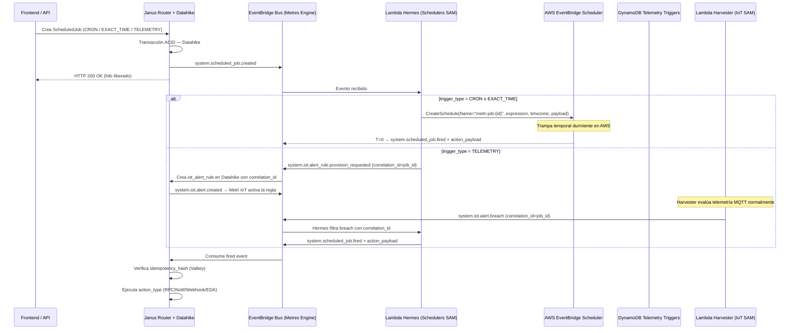

# Componente Externo 05 — Metri Schedulers Hub

> **Estado:** Diseño / Documentación  
> **Responsable:** Arquitectura Metri Engine  
> **Naturaleza:** Componente Externo — AWS SAM independiente  
> **Bus de integración:** Amazon EventBridge (eventos desde Metri Engine Core)

---

## 0. Principio Rector

Metri Schedulers **no vive dentro del ciclo de vida de Janus**. Es un componente externo en su propio AWS SAM Stack cuya única responsabilidad es: **recibir eventos del bus de Metri Engine y convertirlos en trampas temporales o telemátricas en AWS**. Cuando la trampa se dispara, devuelve ciegamente el `action_payload` original al bus para que Metri Engine Core lo ejecute.

Este es el **Patrón Boomerang**: Metri Engine lanza el payload hacia el futuro; Metri Schedulers lo sostiene durmiente; AWS lo despierta en `T=0` y lo devuelve íntegro.

---

## 1. Posición en el Ecosistema Metri

```
┌─────────────────────────────────────────────────────────────────────┐
│                    METRI ENGINE CORE (SAM Stack)                    │
│                                                                     │
│  Janus Router ──► Crea/Actualiza/Elimina scheduled_job en Datahike  │
│                                  │                                  │
│                    EventBridge Bus emite:                           │
│                    system.scheduled_job.created                     │
│                    system.scheduled_job.updated                     │
│                    system.scheduled_job.deleted                     │
│                                  │                                  │
└──────────────────────────────────┼──────────────────────────────────┘
                                   │
                                   ▼
┌─────────────────────────────────────────────────────────────────────┐
│               METRI SCHEDULERS HUB (SAM Stack Externo)              │
│                                                                     │
│  Lambda Hermes ──► Registra/Actualiza/Elimina trampa en AWS         │
│                    (EventBridge Scheduler o Evaluador Telemétrico)  │
│                                  │                                  │
│                    AWS dispara en T=0:                              │
│                    Publica action_payload → EventBridge Bus         │
│                                  │                                  │
└──────────────────────────────────┼──────────────────────────────────┘
                                   │
                                   ▼
┌─────────────────────────────────────────────────────────────────────┐
│                    METRI ENGINE CORE (SAM Stack)                    │
│                                                                     │
│  Janus Router consume el evento de retorno y ejecuta la acción:     │
│  RPC_CALL / DISPATCH_NOTIFICATION / WEBHOOK / EDA_BROADCAST         │
└─────────────────────────────────────────────────────────────────────┘
```

**Flujo de integración: Metri Engine → bus EDA → Metri Schedulers → AWS → bus EDA → Metri Engine.**  
Metri Schedulers **nunca llama directamente a Datahike**. Es un listener y actuador puro.

---

## 2. Por qué el Bus EDA nativo elimina el Outbox

El modelo `scheduled_job.json` declara `event_rules` nativos que el motor de Metri Engine emite automáticamente al bus EventBridge:

| Evento del motor OLTP | detail-type emitido al bus |
|---|---|
| `on_create` de `scheduled_job` | `system.scheduled_job.created` |
| `on_update` de `scheduled_job` | `system.scheduled_job.updated` |
| `on_delete` de `scheduled_job` | `system.scheduled_job.deleted` |

Dado que Metri Engine **ya garantiza** la emisión del evento EDA en la misma transacción Datahike (el motor EDA es parte del ciclo de escritura, no una llamada de red externa), **no existe Dual Write Problem**. El patrón Transactional Outbox queda resuelto de forma nativa por la arquitectura EDA de Metri Engine Core.

> **Decisión de diseño:** Metri Schedulers escucha directamente el bus EventBridge de Metri Engine. No necesita DynamoDB Outbox Table ni DynamoDB Streams propios. Esto reduce la infraestructura del SAM Stack a su mínimo irreducible.

---

## 3. El Modelo de Datos — `scheduled_job.json`

La entidad `scheduled_job` es `is_system: true` y `track_history: true`. Toda su historia de mutaciones queda registrada en Datahike con Time-Travel inmutable.

### 3.1 Taxonomía completa de atributos

| Atributo | Tipo | Rol arquitectónico |
|---|---|---|
| `parent_entity_ref` | `uuid (indexed)` | ID camaleónico del originador: un Maintenance Order, un Reminder, una Invoice. Permite al motor encontrar el contexto sin hardcodear relaciones |
| `trigger_type` | `enum` | Naturaleza de la trampa: `CRON`, `EXACT_TIME`, o `TELEMETRY` |
| `trigger_expression` | `string` | Motor universal de expresión (ver §3.2) |
| `iana_timezone` | `string` | Zona horaria canónica IANA (ej. `America/Bogota`). Delega el caos político del DST mundial al reloj maestro de AWS |
| `action_type` | `enum` | Lo que Hermes hará cuando AWS lo despierte: `RPC_CALL`, `DISPATCH_NOTIFICATION`, `WEBHOOK`, `EDA_BROADCAST` |
| `target_user_id` | `reference → user` | Protección topológica: Datahike bloquea la eliminación del usuario si tiene un Job futuro apuntando a él |
| `target_group_id` | `reference → user_group` | Idem para grupos de usuarios (broadcasting masivo) |
| `target_role_id` | `reference → role` | Resolución de notificaciones por rol orgánico de planta |
| `action_payload` | `json` | **El Boomerang Ciego.** Devuelto íntegro al bus cuando la trampa dispara. Contiene todo el contexto necesario para que Metri Engine ejecute la acción sin consultar estado adicional |
| `idempotency_hash` | `string (is_system)` | Huella dactilar estática. Metri Engine descarta reintentos parásitos o mensajes duplicados provenientes de Schedulers comparando este hash |
| `status` | `enum (is_dimension)` | `PENDING → ACTIVE → COMPLETED / FAILED / SUSPENDED` |

### 3.2 Los tres `trigger_type` explicados

#### `CRON` — Recurrencia periódica
`trigger_expression` contiene una expresión cron estándar:
```
"0 8 * * MON"   → Todos los lunes a las 8am (en iana_timezone)
"0 0 1 */6 *"   → El 1ero de cada semestre a medianoche
```
AWS EventBridge Scheduler gestiona el DST automáticamente usando `iana_timezone`. Hermes registra la trampa con `FlexibleTimeWindow: OFF` para ejecución puntual.

#### `EXACT_TIME` — Disparo único en fecha absoluta
`trigger_expression` contiene un timestamp Epoch Unix:
```
"1735689600"   → 2026-01-01T00:00:00Z
```
Hermes crea el schedule con `ScheduleExpression: at(2026-01-01T00:00:00)`. AWS lo elimina automáticamente post-ejecución con `ActionAfterCompletion: DELETE`.

#### `TELEMETRY` — Disparo por condición telemétrica
`trigger_expression` contiene una expresión de umbral sobre lecturas IoT:
```
"reading_value > 5000"   → Cuando el activo supere 5,000 RPM
```
Este `trigger_type` **no usa AWS EventBridge Scheduler** y **no comparte storage con Metri IoT**. La integración ocurre exclusivamente a través del bus EventBridge de Metri Engine:

1. Hermes parsea `trigger_expression` → crea una `iot_alert_rule` en Metri Engine Core emitiendo un evento al bus, con el `job_id` como `correlation_id`.
2. Metri IoT gestiona la regla de forma nativa (Valkey + Rule Store), como cualquier otra `iot_alert_rule`.
3. Cuando el Harvester de Metri IoT detecta un breach, emite `system.iot.alert.breach` al bus incluyendo el `correlation_id`.
4. **Hermes escucha ese evento**, lo correlaciona con su Job activo por `correlation_id`, y dispara el `action_payload`.

Los dos SAMs nunca comparten bases de datos. El bus es el único contrato entre ellos.

> **Principio clave:** `trigger_type: TELEMETRY` convierte un `ScheduledJob` en una `iot_alert_rule` con un `action_payload` asociado. Metri IoT detecta el momento físico; Metri Schedulers ejecuta la acción de negocio.

---

## 4. Los cuatro `action_type` — Lo que sucede al disparar

Cuando AWS (o el evaluador telemétrico) despierta la trampa, Hermes publica al bus EventBridge de Metri Engine con `detail-type: "system.scheduled_job.fired"` y el `action_payload` íntegro. Metri Engine Core consume el evento y ejecuta según `action_type`:

| `action_type` | Ejecutor en Metri Engine | Descripción |
|---|---|---|
| `RPC_CALL` | Janus Router | Invoca un método gRPC interno (ej. cerrar una Maintenance Order, generar un reporte) |
| `DISPATCH_NOTIFICATION` | @metri-notifications | Envía notificaciones push/email a `target_user_id`, `target_group_id`, o `target_role_id` |
| `WEBHOOK` | Lambda Webhook Dispatcher | POST HTTP a un endpoint externo con el `action_payload` como body |
| `EDA_BROADCAST` | EventBridge re-publish | Re-publica un evento al bus con el `action_payload` como detail — útil para encadenar workflows |

El `action_payload` debe ser **auto-contenido**: incluye todos los parámetros que el ejecutor necesita sin consultar estado en Datahike. Esto garantiza la naturaleza ciega del Boomerang.

---

## 5. El Patrón UUID Determinista — Anti-Race Condition

Metri prohíbe almacenar el ARN devuelto por AWS (`arn:aws:scheduler:...`) en Datahike. Hacerlo crearía una dependencia de escritura de vuelta desde Hermes hacia el motor, introduciendo el anti-patrón de acoplamiento bidireccional.

**Solución:** Hermes construye el nombre del Schedule usando el UUID nativo del `scheduled_job`:

```
schedule_name = "metri-job-{scheduled_job_id}"
# Ejemplo: "metri-job-6f96a3b2-1c4d-4e8a-b2f1-09d7c3e45812"
```

Esto garantiza:
- **CREATE:** `CreateSchedule(Name="metri-job-{id}")` — idempotente si se reintenta
- **UPDATE:** `UpdateSchedule(Name="metri-job-{id}")` — O(1), sin lookup de ARN
- **DELETE:** `DeleteSchedule(Name="metri-job-{id}")` — O(1), sin estado previo en Datahike
- **Fantasmas imposibles:** Si el Job se elimina en Datahike antes de que AWS lo ejecute, Hermes destruye el Schedule por nombre; no puede disparar un Job huérfano

---

## 6. Flujo End-to-End — Orden de Mantenimiento Semestral

```
[Usuario en Metri UI]
   │ Crea Maintenance Order con recurrencia: "Cada 6 meses, lunes 8am"
   ▼
[Janus Router → Datahike]
   │ Transacción ACID: crea MaintenanceOrder + ScheduledJob
   │   trigger_type: CRON
   │   trigger_expression: "0 8 * * MON"  (each 6 months equiv.)
   │   iana_timezone: "America/Bogota"
   │   action_type: RPC_CALL
   │   action_payload: {method: "maintenance.execute", order_id: "...", asset_id: "..."}
   │   idempotency_hash: SHA256(order_id + trigger_expression)
   │ Emite: system.scheduled_job.created → EventBridge Bus
   │ Responde HTTP 200 OK al usuario (hilo liberado)
   ▼
[Lambda Hermes — Metros Schedulers SAM]
   │ Recibe event: system.scheduled_job.created
   │ Construye schedule_name = "metri-job-{id}"
   │ SDK AWS: CreateSchedule(
   │   Name: "metri-job-{id}",
   │   ScheduleExpression: "cron(0 8 ? * MON *)",
   │   Timezone: "America/Bogota",
   │   Target: {EventBridgeBus, action_payload},
   │   FlexibleTimeWindow: OFF
   │ )
   │ En fallo: reintento con backoff exponencial vía SQS DLQ
   ▼
[Dormido en AWS EventBridge Scheduler — meses de latencia pasiva]
   ▼
[T=0 — Lunes 8am hora Bogotá]
   │ AWS EventBridge Scheduler dispara
   │ Publica a EventBridge Bus: detail-type="system.scheduled_job.fired"
   │   detail: {action_type: "RPC_CALL", action_payload: {...}, idempotency_hash: "..."}
   ▼
[Metri Engine Core — Lambda Handler]
   │ Recibe fired event
   │ Verifica idempotency_hash contra cache Valkey (descarta duplicados)
   │ Ejecuta RPC_CALL: maintenance.execute(order_id, asset_id)
   │ Actualiza scheduled_job.status = COMPLETED en Datahike
   ▼
[Usuario en Metri UI]
   Recibe notificación: "Mantenimiento ejecutado exitosamente"
```

---

## 7. Flujo de Disparo Telemétrico — `trigger_type: TELEMETRY`

### El problema del diseño ingenuo

Un diseño incorrecto haría que el Lambda Harvester de Metri IoT leyera una DynamoDB Table perteneciente al SAM de Metri Schedulers. Esto crea **acoplamiento estructural**: dos componentes externos independientes compartiendo storage. Si el SAM de Schedulers se degrada, la telemetría de IoT también falla. Si el schema de la tabla cambia, ambos SAMs deben actualizarse en sincronía. Es el anti-patrón de microservicios más clásico.

### La regla de oro

> **Dois SAMs independientes nunca comparten bases de datos. El bus EventBridge es el único contrato entre ellos.**

### El diseño correcto: `iot_alert_rule` como implementación del trigger telemétrico

Cuando un `ScheduledJob` de tipo `TELEMETRY` se crea, Hermes no registra nada en su propio storage. En cambio, **delega la detección del evento físico al componente que ya sabe hacerlo**: Metri IoT. Lo hace a través del bus, creando una `iot_alert_rule` real en Metri Engine Core, con el `job_id` como `correlation_id`.

```
[Usuario en Metri UI]
   │ Configura Job: "Si VIBRACIÓN > 5000 RPM → ejecutar Maintenance Order"
   │   asset_id: 99
   │   trigger_type: TELEMETRY
   │   trigger_expression: "VIBRATION > 5000"  ← métrica + operador + valor
   │   action_type: RPC_CALL
   │   action_payload: {method: "maintenance.execute", order_id: "...", asset_id: "99"}
   ▼
[Janus Router → Datahike]
   │ Transacción ACID: crea ScheduledJob
   │ Emite: system.scheduled_job.created → EventBridge Bus
   │   detail: {job_id, trigger_type: TELEMETRY, trigger_expression, action_payload, ...}
   ▼
[Lambda Hermes — Metri Schedulers SAM]
   │ Detecta trigger_type = TELEMETRY
   │ Parsea trigger_expression:
   │   metric    = "VIBRATION"
   │   operator  = GT
   │   threshold = 5000.0
   │
   │ NO crea EventBridge Scheduler
   │ NO escribe en ninguna DynamoDB propia
   │
   │ Emite al bus: system.iot.alert_rule.provision_requested
   │   detail: {
   │     correlation_id: job_id,          ← la llave de retorno
   │     asset_id: 99,
   │     threshold_operator: "GT",
   │     threshold_value: 5000.0,
   │     unit_of_measure: "VIB_MS",
   │     alert_severity: "CRITICAL",
   │     notify_users: [],
   │     notify_groups: []
   │   }
   ▼
[Metri Engine Core — Lambda Handler]
   │ Recibe system.iot.alert_rule.provision_requested
   │ Crea iot_alert_rule en Datahike con correlation_id = job_id
   │ El motor EDA emite: system.iot.alert.created → Metri IoT gestiona la regla
   │ (Valkey Rule Store hot-reload en <500ms — ver Componente 04)
   ▼
[Lambda Harvester — Metri IoT SAM]
   │ Recibe MQTT: asset_id=99, VIBRATION=5200 RPM
   │ Carga reglas desde Valkey: {operator: GT, threshold: 5000, severity: CRITICAL}
   │ Evalúa: 5200 > 5000 → TRUE → BREACH
   │
   │ Emite: system.iot.alert.breach → EventBridge Bus
   │   detail: {
   │     asset_id: 99,
   │     metric: "VIBRATION",
   │     value: 5200,
   │     threshold: 5000,
   │     severity: "CRITICAL",
   │     correlation_id: job_id   ← el mismo job_id que Hermes inyectó
   │   }
   ▼
[Lambda Hermes — Metri Schedulers SAM]
   │ Escucha también system.iot.alert.breach
   │ Filtra: solo eventos con correlation_id presente
   │ Recupera action_payload del ScheduledJob (consulta Metri Engine via gRPC)
   │ Publica: system.scheduled_job.fired → EventBridge Bus
   │   detail: {action_type: RPC_CALL, action_payload, idempotency_hash}
   ▼
[Metri Engine Core]
   │ Verifica idempotency_hash en Valkey (descarta duplicados)
   │ Ejecuta RPC_CALL: maintenance.execute(order_id, asset_id)
   │ Actualiza scheduled_job.status = COMPLETED en Datahike
```

### Por qué este diseño es correcto

| Principio | Cumplimiento |
|---|---|
| **Sin storage compartido** | Hermes nunca escribe en tablas de Metri IoT; Harvester nunca lee tablas de Schedulers |
| **Bus como único contrato** | La integración es: Hermes emite → Metri Engine crea regla → Metri IoT detecta → Hermes consume breach |
| **Reutilización del motor de reglas** | La `iot_alert_rule` es una entidad real en Datahike con Time-Travel, auditoría y lifecycle completo |
| **Desacoplamiento de fallos** | Si Metri Schedulers cae, Metri IoT sigue operando sus propias alertas normalmente |
| **Eliminación limpia** | Al eliminar el ScheduledJob, Hermes emite `system.iot.alert_rule.deprovision_requested` → Metri Engine elimina la `iot_alert_rule` correspondiente |

---

## 8. Infraestructura del SAM Stack

```yaml
# Recursos lógicos del template.yaml de Metres Schedulers Hub

Resources:

  # --- MENSAJERÍA (Fault Tolerance) ---
  MetriSchedulerDLQ:
    Type: AWS::SQS::Queue
    Properties:
      QueueName: metri-scheduler-dlq.fifo
      FifoQueue: true
      # Mensajes retenidos 14 días para reintentos manuales
      MessageRetentionPeriod: 1209600

  # --- COMPUTE PRINCIPAL ---
  LambdaHermes:
    Type: AWS::Serverless::Function
    Properties:
      FunctionName: Metri-Scheduler-Hermes
      Runtime: provided.al2023     # Golang compilado AOT
      Architectures: [arm64]       # Graviton3: eficiencia + costo reducido
      MemorySize: 128              # Huella mínima — Go native, sin GC pauses
      Timeout: 15
      Events:
        OnJobCreated:
          Type: EventBridgeRule
          Source: "metri.engine"
          DetailType: "system.scheduled_job.created"
        OnJobUpdated:
          Type: EventBridgeRule
          Source: "metri.engine"
          DetailType: "system.scheduled_job.updated"
        OnJobDeleted:
          Type: EventBridgeRule
          Source: "metri.engine"
          DetailType: "system.scheduled_job.deleted"
        OnDLQRetry:
          Type: SQS
          Properties:
            Queue: !GetAtt MetriSchedulerDLQ.Arn
      Policies:
        - scheduler:CreateSchedule
        - scheduler:UpdateSchedule
        - scheduler:DeleteSchedule
        - iam:PassRole (→ SchedulerExecutionRole)
        - dynamodb:PutItem / GetItem / DeleteItem (→ TelemetryTriggersTable)
        - events:PutEvents (→ MetriEventBus)

  # --- STORAGE: Hermes Correlation Store ---
  HermesCorrelationTable:
    Type: AWS::DynamoDB::Table
    Properties:
      TableName: metri-scheduler-correlations
      BillingMode: PAY_PER_REQUEST
      # PK: correlation_id (= job_id)
      # Guarda: action_payload + idempotency_hash para jobs TELEMETRY activos
      # Solo accedido por Lambda Hermes (este mismo SAM). Nunca por Metri IoT.
      # TTL: eliminado cuando scheduled_job.status = COMPLETED o DELETED

  # --- IAM: Rol de ejecución de los Schedules ---
  SchedulerExecutionRole:
    # Permisos mínimos: solo events:PutEvents al bus de Metres Engine
    # EventBridge Scheduler asume este role al disparar

  # --- OBSERVABILIDAD ---
  CloudWatchDashboard:
    # Métricas: schedule_created/deleted/fired, DLQ depth, Hermes errors
```

---

## 9. Variables de Entorno

| Variable | Descripción |
|---|---|
| `METRES_EVENT_BUS_ARN` | ARN del EventBridge Bus de Metres Engine Core. Destino de todos los eventos `fired` y de DLQ retries |
| `SCHEDULER_EXECUTION_ROLE_ARN` | IAM Role que EventBridge Scheduler asume para publicar al bus en `T=0` |
| `TELEMETRY_TRIGGERS_TABLE` | Nombre de la DynamoDB Table donde se registran los jobs de tipo `TELEMETRY` |
| `DLQ_URL` | URL de la SQS FIFO DLQ para reintentos con backoff exponencial |
| `AWS_REGION` | Región del clúster subyacente |

---

## 10. Seguridad y Garantías

| Principio | Implementación |
|---|---|
| **Idempotencia garantizada** | `idempotency_hash` en todo evento `fired`. Metres Engine descarta duplicados vía Valkey cache (`SET NX EX 86400`) |
| **Sin ARN en Datahike** | Patrón UUID determinista: `metri-job-{id}`. Elimina dependencia bidireccional Hermes→Datahike |
| **Fantasmas imposibles** | DELETE de Job → `DeleteSchedule(Name="metri-job-{id}")` O(1). No puede disparar un Job eliminado |
| **Fault Tolerance** | SQS DLQ FIFO con backoff exponencial. AWS Lambda reintenta hasta 14 días sin pérdida de mensajes |
| **Least Privilege** | SchedulerExecutionRole solo puede hacer `events:PutEvents` al bus de Metres Engine. Sin acceso a otros recursos |
| **No Dual Write** | El bus EDA de Metres Engine es atómico con la escritura Datahike. No hay Outbox table externa |
| **DST resuelto** | `iana_timezone` delega todo manejo de horario de verano/invierno al reloj maestro de AWS EventBridge |

---

## 11. Diagrama de Flujo Maestro (El Boomerang)



---

## 12. Tabla de Decisiones de Diseño

| Decisión | Alternativa Descartada | Razón |
|---|---|---|
| Bus EDA nativo como trigger de Hermes | DynamoDB Outbox + Streams propio | El motor OLTP de Metres Engine ya emite eventos EDA atómicamente; Outbox es redundante |
| UUID determinista como schedule name | Guardar ARN en Datahike | Elimina acoplamiento bidireccional Hermes→Core; DELETE y UPDATE son O(1) |
| `TELEMETRY` trigger vía DynamoDB Table | Segunda instancia de IoT Rules | Reutiliza el Harvester existente de Metres IoT; no duplica evaluación de telemetría |
| `action_payload` auto-contenido (Boomerang) | Hermes consulta Datahike en disparo | Metres Schedulers es stateless; no puede depender de latencia de red en `T=0` |
| SQS FIFO DLQ con 14 días de retención | Reintentos simples Lambda | Garantía de ejecución even si AWS experimenta degradación temporal |
| Golang en `arm64` (Graviton) | Node.js / Python | Cold-start <50ms, sin GC pauses, costo ~20% menor en Graviton vs x86 |

---

## 13. Fases de Implementación (Roadmap)

| Fase | Componente | Descripción |
|---|---|---|
| **SCH-1** | SAM Stack base | DLQ, IAM roles, EventBridge Rules de escucha |
| **SCH-2** | Lambda Hermes — CRON / EXACT_TIME | CreateSchedule / UpdateSchedule / DeleteSchedule con UUID determinista |
| **SCH-3** | DynamoDB Telemetry Triggers Table | Soporte para `trigger_type: TELEMETRY` |
| **SCH-4** | Integración con Metres IoT Harvester | Consulta de Telemetry Triggers en el pipeline de evaluación MQTT |
| **SCH-5** | Idempotency Guard en Metres Engine | Valkey cache de `idempotency_hash` para descartar duplicados |
| **SCH-6** | Observabilidad + CloudWatch Dashboard | Métricas de schedules activos, fired rate, DLQ depth, errores Hermes |
