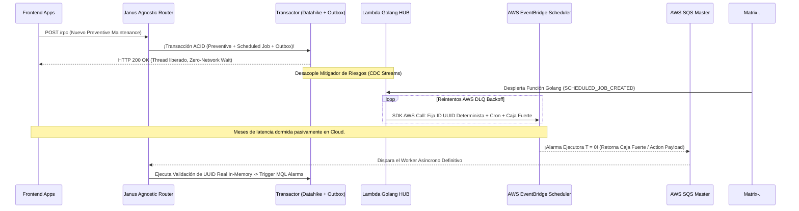

# Componente Externo 05 - Metri Schedulers (Élite Arquitectónica)

**Nombre del Componente:** Metri Event-Driven Schedulers Hub `(metri-schedulers-hub)`
**Infraestructura Host:** AWS Lambda (Golang) + AWS EventBridge Scheduler + DynamoDB Streams
**Patrón Arquitectónico:** Serverless Application Model (SAM) / Transactional Outbox CDC

---

## MÓDULO I: Objetivo y Overview Arquitectónico

Desacoplar radicalmente la ejecución temporal de tareas del ciclo de vida de los contenedores Datalog en Clojure. El mandato de este componente es delegar pasivamente toda la lógica aplazada computacional (ej. programaciones bi-semestrales, recordatorios cronometrados) a la infraestructura nativa Serverless (_AWS EventBridge_). Debe lograrlo extirpando el infame anti-patrón de _Polling_ constante, subyugando todo evento futuro a la base relacional pura dictaminada matemáticamente por **`scheduled_job.json`**.

**El Dilema del Tiempo en Sistemas Distribuidos:**
La ejecución de lógicas temporales (Mantenimientos Mensuales, Recordatorios) resulta económicamente devastadora y propensa a fallos si se aborda mediante _loops CRON_ eternos en memoria. **Metri Schedulers** repudia la inserción de fechas duras en código. Este Hub es un ecosistema pasivo-reactivo alineado a las reglas del _Domain Driven Design (DDD)_.

---

## MÓDULO II: Estructura Arquitectónica y Dominios (Golang)

Para garantizar _Cold-Starts_ por debajo de 50 milisegundos y evitar saturaciones de memoria (Garbage Collection pauses), el micro-handler se ensambla estrictamente en **Golang** bajo un esquema limpio.

```text
metri-schedulers-hub/
├── cmd/
│   └── lambda/
│       └── main.go                  # Entrypoint principal inyectado por AWS Lambda
├── internal/
│   ├── domain/
│   │   ├── models.go                # Mapeo Golang del JSON maestro 'scheduled_job.json'
│   │   └── scheduler_protocol.go    # Interfaces puras (Ports)
│   ├── usecase/
│   │   └── event_translator.go      # Reglas de negocio puras (Convierte Datalog CDC a EventBridge)
│   └── aws/
│       ├── eventbridge_adapter.go   # SDK AWS: CreateSchedule / DeleteSchedule (Adapters)
│       └── sqs_publisher.go         # SDK AWS: Dead Letter Queue y Fallbacks
├── template.yaml                    # IAM Roles y Arquitectura AWS SAM (Infra-as-Code)
├── env.json                         # Mapeo de Entorno Local / Testing
├── Makefile                         # Build Scripts (`GOOS=linux go build ...`)
└── go.mod                           # Módulo Go
```

---

## MÓDULO III: Infraestructura (AWS SAM Template)

Este componente jamás se levanta a mano; es inyectado determinísticamente usando _AWS Serverless Application Model (SAM)_. El archivo `template.yaml` autoriza las defensas Dead Letter Queue y los Streams.

```yaml
AWSTemplateFormatVersion: "2010-09-09"
Transform: AWS::Serverless-2016-10-31
Description: Metri Schedulers Hub - EventBridge Translator

Resources:
  MetriSchedulerDLQ:
    Type: AWS::SQS::Queue
    Properties:
      QueueName: metri-scheduler-dlq.fifo
      FifoQueue: true

  SchedulerHermesFunction:
    Type: AWS::Serverless::Function
    Properties:
      FunctionName: Metri-CDC-SchedulerRouter
      CodeUri: ./
      Handler: bootstrap # Binario nativo estático
      Runtime: provided.al2023 # Golang Compilado (AOT)
      Architectures: [arm64] # Silicio M6g/Graviton (Eficiencia extrema y costo reducido)
      MemorySize: 128 # Huella de RAM asombrosamente baja (Go native)
      Timeout: 10
      Environment:
        Variables:
          DLQ_URL: !Ref MetriSchedulerDLQ
          TARGET_EVENT_BUS: arn:aws:events:us-east-1:123456789:event-bus/metri-asgard
      Events:
        DynamoDBTrigger:
          Type: DynamoDB
          Properties:
            Stream: arn:aws:dynamodb:us-east-1:123456789:table/MetriOutbox/stream/123
            StartingPosition: TRIM_HORIZON
            BatchSize: 10
            FilterCriteria:
              Filters:
                # El evento se dispara SÓLO si la tabla Outbox graba esta mutación:
                - Pattern: '{ "eventName": ["INSERT"], "dynamodb": { "NewImage": { "event_type": { "S": ["SCHEDULED_JOB_CREATED", "SCHEDULED_JOB_DELETED", "SCHEDULED_JOB_UPDATED"] } } } }'
      Policies:
        - Statement:
            - Effect: Allow
              Action:
                - scheduler:CreateSchedule
                - scheduler:UpdateSchedule
                - scheduler:DeleteSchedule
              Resource: "*"
            - Effect: Allow
              Action: iam:PassRole
              Resource: !Ref SchedulerExecutionRoleArn
```

---

## MÓDULO IV: Variables de Entorno y Configuración (`env.json`)

El entorno rige las variables estrictas que Hermes usará para blindar la comunicación. Ningún token reside en el código:

| Variable                       | Descripción Estratégica                                                                                            |
| :----------------------------- | :----------------------------------------------------------------------------------------------------------------- |
| `AWS_REGION`                   | Define el clúster subyacente (Ej: `us-east-1`).                                                                    |
| `TARGET_EVENT_BUS`             | El ARN del BUS maestro pasivo en EventBridge donde aterrizan los Boomerangs al despertar.                          |
| `DLQ_URL`                      | Destino de contención SQS (Dead Letter Queue) para albergar eventos asíncronos venenosos si AWS cae temporalmente. |
| `SCHEDULER_EXECUTION_ROLE_ARN` | IAM Role estricto que Hermes asume para adquirir permisos ciegos y escribir alarmas temporales en Amazon.          |

---

## MÓDULO V: Ontología de Datos y Flujo Desacoplado

La lógica algorítmica del micro-handler se rige indudablemente por nuestro esquema maestro `scheduled_job.json`. A continuación se mapean las defensas operativas de sus atributos.

### 5.1 Desacoplamiento Absoluto (El Patrón "Transactional Outbox")

Las arquitecturas ingenuas incurren en el _Dual Write Problem_ al intentar invocar llamadas de red asíncronas hacia la Nube dentro de transacciones de bases de datos núcleo. Si Datahike graba, pero AWS Cloud falla con Timeout, el cronograma en la base queda desincronizado de la Nube (Un Fantasma).
Metri repudia los _dual writes_ y asegura **Consistencia Eventual** infranqueable:

1. **Aislamiento ACID Local:** El orquestador (Aegis/Janus) transa la Orden de Mantenimiento y empuja concurrentemente un `SCHEDULED_JOB_CREATED` a la tabla silente `Outbox`. Responde `HTTP 200 OK` instantáneo al usuario.
2. **Retransmisión Segura CDC:** DynamoDB Streams reacciona y despierta a nuestra Lambda en Golang _SchedulerHermesFunction_.
3. **El Inyector Golang:** Nuestro handler procesa el evento y, empleando su SDK limpio, implanta el `Timezone`, inyecta el `Action Payload` Ciego y configura físicamente la alarma en AWS EventBridge.
4. **Fault Tolerance Fuerte:** Si AWS experimenta latencia o caída, Golang aborta. AWS Lambda enruta el fallo al DLQ con reintentos exponenciales automáticos (Backoff), hasta que Amazon cede.

### 5.2 Flujograma Definitivo (El Boomerang Ciego)



### 5.3 Atributos Analíticos Estrictos (`scheduled_job.json`)

El Payload asíncrono soporta su peso bajo la inmutabilidad de su taxonomía L7:

1. **Trampas Avanzadas y DST:** `trigger_type` rige si usaremos `CRON` o `EXACT_TIME`. El `iana_timezone` abstrae al programador backend de lidiar con los caóticos y políticos cambios del Horario de Verano Mundial delegando todo al reloj maestro de Amazon.
2. **Protección Topológica In-Memory:** Sus referencias cruzadas (`target_group_id`) impiden que el motor Datalog acepte la eliminación de un Obrero o Operario si éste posee la designación en un Job a futuro. Erradica los _Null Pointers_ asíncronos.
3. **Llave Maestra UUID (El Parche Anti-Race Conditions):** Metri prohíbe explícitamente guardar un String ARN (`aws_scheduler_arn`). Hacerlo desataría un Anti-Patrón que requeriría que Hermes grabe de vuelta hacia Datahike. Al revés, Hermes fuerza determinísticamente a Amazon a bautizar la Alarma con el id nativo UUID del sistema local (`metri-job-6f96...`). Así, al llegar un evento ciego de _DELETE_, Golang dispara el percutor hacia EventBridge con el UUID local destruyéndolo instantáneamente en una ejecución O(1) innegociable.
