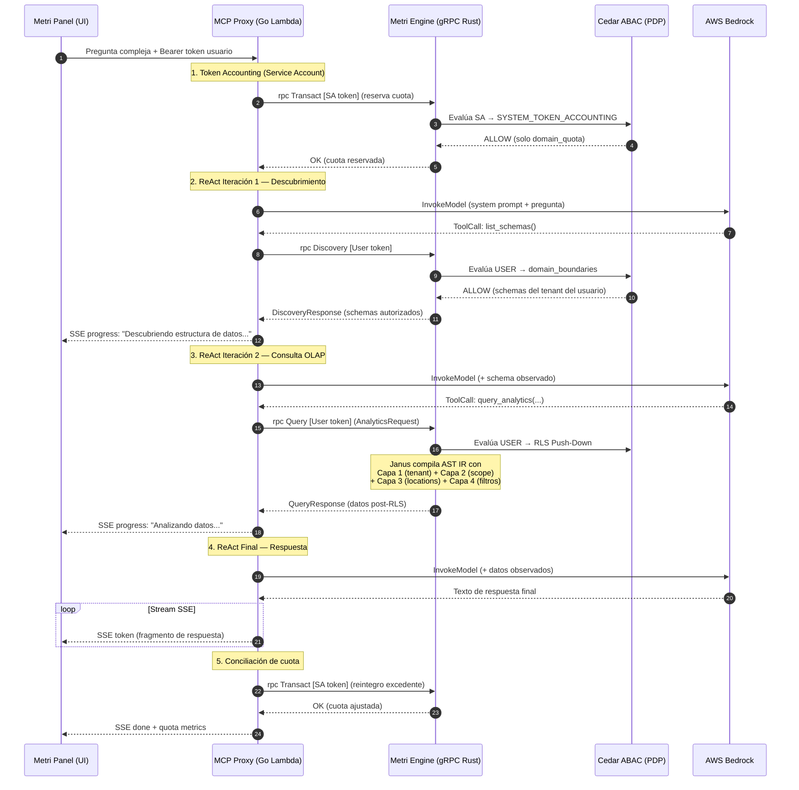

# Componente Externo 06 — Metri Q Assitant (AI Connector para Preguntas Complejas)

**Nombre del Manifiesto:** `MetriQAssitant`  
**Proyecto:** `metri-q-assitant` (Go 1.23+ / AWS SAM)  
**Fase contenedora:** Detallado en [08_FASE_METRI_Q_ASSITANT.md](08_FASE_METRI_Q_ASSITANT.md) (infraestructura, seguridad, costos)  
**Integraciones Engine:** `rpc Discovery`, `rpc Explore`, `rpc Query`, `rpc Transact` de `MetriService`  
**Vector Store:** [11_FASE_BASE_DE_DATOS_VECTORIAL_SERVERLESS.md](11_FASE_BASE_DE_DATOS_VECTORIAL_SERVERLESS.md)  
**Frontend:** [METRI_Q.md](METRI_Q.md)

---

## 1. Visión General: De Proxy Simple a Motor de Razonamiento Analítico

El **Metri MCP Proxy** es una aplicación serverless independiente en Go que funciona como el **cerebro cognitivo externo** de Metri. No es un simple proxy de reenvío — es un **agente ReAct** (Reasoning + Acting) que descompone preguntas complejas del usuario en cadenas de operaciones atómicas contra el `MetriService` gRPC, orquestando múltiples RPCs en secuencia para resolver consultas que ningún RPC individual podría responder.

```
    ARQUITECTURA DE RESOLUCIÓN DE PREGUNTAS COMPLEJAS

    ┌──────────────────────────────────────────────────────────────────────────┐
    │                          PREGUNTA COMPLEJA                              │
    │  "¿Cuáles son los 3 activos con mayor costo de mantenimiento en Cali   │
    │   este trimestre, y cómo se compara con el trimestre anterior?"         │
    └───────────────────────────────────┬──────────────────────────────────────┘
                                        │
                                        ▼
    ┌───────────────────────────────────────────────────────────────────────────┐
    │                     METRI MCP PROXY (Go / Lambda)                        │
    │                                                                          │
    │   ┌───────────────┐   ┌──────────────┐   ┌───────────────────────────┐   │
    │   │ ReAct Agent   │──►│ Tool Router  │──►│ MCP Tool Executor         │   │
    │   │ (CoT Loop)    │   │ (Planner)    │   │ (gRPC ↔ Engine Bridge)    │   │
    │   └───────┬───────┘   └──────────────┘   └──────────┬────────────────┘   │
    │           │                                          │                    │
    │           ▼                                          ▼                    │
    │   ┌───────────────┐                      ┌──────────────────────────┐    │
    │   │ Bedrock LLM   │                      │ gRPC Client (M2M)       │    │
    │   │ (Inference)   │                      │ → Discovery / Explore   │    │
    │   └───────────────┘                      │ → Query / Transact      │    │
    │                                          └──────────┬───────────────┘    │
    └──────────────────────────────────────────────────────┼───────────────────┘
                                                           │
                                                           ▼
    ┌──────────────────────────────────────────────────────────────────────────┐
    │                     METRI ENGINE (Rust / gRPC)                           │
    │                                                                          │
    │   ┌───────────┐   ┌────────────┐   ┌──────────┐   ┌──────────────────┐  │
    │   │ Janus     │   │ Aegis      │   │ Cedar    │   │ Vector Store     │  │
    │   │ (AST IR)  │   │ (SQL/DLog) │   │ (ABAC)   │   │ (HNSW/Athena)   │  │
    │   └───────────┘   └────────────┘   └──────────┘   └──────────────────┘  │
    └──────────────────────────────────────────────────────────────────────────┘
```

### 1.1 Principio Rector

> **"El LLM razona; Metri Engine ejecuta."**

El MCP Proxy garantiza que el modelo de lenguaje **nunca** tiene acceso directo a bases de datos, APIs crudas o infraestructura interna. Todo acceso a datos pasa por las RPCs tipadas del `MetriService`, blindadas por Cedar ABAC y el Zero-Trust del Janus AST IR. El LLM solo ve los resultados ya filtrados, autorizados y formateados.

---

## 2. Catálogo de MCP Tools (Herramientas del Agente)

El MCP Proxy expone **7 herramientas** al modelo de lenguaje mediante el protocolo MCP. Cada herramienta mapea a una o más RPCs del `MetriService`:

### 2.1 Herramientas de Descubrimiento (Discovery)

| Tool MCP | RPC Engine | Modo | Propósito |
| :--- | :--- | :--- | :--- |
| **`list_schemas`** | `rpc Discovery` | Lectura | Listar todas las entidades disponibles del Códice para el tenant |
| **`get_schema`** | `rpc Discovery(type=X)` | Lectura | Obtener la estructura detallada de una entidad (atributos, tipos, relaciones) |

```go
// internal/mcp/tools_discovery.go
func registerDiscoveryTools(server *mcp.Server, client *engine.GrpcClient) {
    // Tool: list_schemas — el agente descubre qué entidades existen
    server.AddTool(&mcp.Tool{
        Name:        "list_schemas",
        Description: "Lista todas las entidades (tablas) disponibles en Metri Engine con sus nombres y descripciones. Usa esta herramienta primero para entender la estructura de datos del cliente.",
        InputSchema: mcp.ObjectSchema{
            Properties: map[string]mcp.Schema{},  // Sin parámetros
        },
    }, func(ctx context.Context, args map[string]any) (*mcp.CallToolResult, error) {
        resp, err := client.Discovery(ctx, &pb.DiscoveryRequest{
            TenantId:          extractTenantFromCtx(ctx),
            IncludeAttributes: false,  // Solo metadatos ligeros
        })
        if err != nil { return toolError(err), nil }
        return formatSchemaList(resp), nil
    })

    // Tool: get_schema — el agente entiende la anatomía de una entidad
    server.AddTool(&mcp.Tool{
        Name:        "get_schema",
        Description: "Obtiene la estructura detallada de una entidad: sus atributos, tipos de dato, relaciones foráneas, y campos filtrables/agregables. Esencial para construir consultas correctas.",
        InputSchema: mcp.ObjectSchema{
            Properties: map[string]mcp.Schema{
                "entity": {Type: "string", Description: "Nombre de la entidad (ej: 'work_order', 'asset', 'location')"},
            },
            Required: []string{"entity"},
        },
    }, func(ctx context.Context, args map[string]any) (*mcp.CallToolResult, error) {
        resp, err := client.Discovery(ctx, &pb.DiscoveryRequest{
            TenantId:          extractTenantFromCtx(ctx),
            Type:              args["entity"].(string),
            IncludeAttributes: true,
        })
        if err != nil { return toolError(err), nil }
        return formatSchemaDetail(resp), nil
    })
}
```

### 2.2 Herramientas de Exploración (Explore)

| Tool MCP | RPC Engine | Modo | Propósito |
| :--- | :--- | :--- | :--- |
| **`explore_values`** | `rpc Explore` | Lectura | Obtener valores únicos de un atributo (autocompletado dimensional) |

```go
// internal/mcp/tools_explore.go
func registerExploreTools(server *mcp.Server, client *engine.GrpcClient) {
    server.AddTool(&mcp.Tool{
        Name:        "explore_values",
        Description: "Explora los valores únicos de un atributo específico. Úsalo para entender los filtros disponibles (ej: qué estados existen, qué ubicaciones, qué tipos de activo). Máximo 200 valores.",
        InputSchema: mcp.ObjectSchema{
            Properties: map[string]mcp.Schema{
                "entity":    {Type: "string", Description: "Entidad (ej: 'work_order')"},
                "attribute": {Type: "string", Description: "Atributo a explorar (ej: 'status', 'priority', 'type')"},
                "limit":     {Type: "integer", Description: "Máximo de valores (default: 50, max: 200)"},
            },
            Required: []string{"entity", "attribute"},
        },
    }, func(ctx context.Context, args map[string]any) (*mcp.CallToolResult, error) {
        limit := int32(50)
        if l, ok := args["limit"]; ok { limit = int32(l.(float64)) }
        if limit > 200 { limit = 200 }
        
        resp, err := client.Explore(ctx, &pb.ExploreRequest{
            TenantId:  extractTenantFromCtx(ctx),
            Entity:    args["entity"].(string),
            Attribute: args["attribute"].(string),
            Limit:     limit,
        })
        if err != nil { return toolError(err), nil }
        return formatExploreValues(resp), nil
    })
}
```

### 2.3 Herramientas de Consulta Analítica (Query)

| Tool MCP | RPC Engine | Modo | Propósito |
| :--- | :--- | :--- | :--- |
| **`query_table`** | `rpc Query` (OLTP) | Lectura | Consulta operacional: listar registros con filtros y JOINs |
| **`query_analytics`** | `rpc Query` (OLAP) | Lectura | Consulta analítica: métricas, agrupaciones, comparaciones temporales |
| **`query_semantic`** | `rpc Query` + Vector Store | Lectura | Búsqueda semántica RAG: encontrar entidades por similaridad de significado |

```go
// internal/mcp/tools_query.go
func registerQueryTools(server *mcp.Server, client *engine.GrpcClient) {
    // ── Tool: query_table — Consulta operacional OLTP ─────────────────────────
    server.AddTool(&mcp.Tool{
        Name: "query_table",
        Description: `Consulta registros operacionales con filtros, ordenación y relaciones.
Usa esta herramienta para preguntas como "muéstrame las órdenes de trabajo abiertas" o 
"lista los activos del tipo bomba en la planta de Cali".

Parámetros de filtro soportados:
- Operadores: EQ, NEQ, GT, GTE, LT, LTE, IN, NOT_IN, BETWEEN, LIKE, CONTAINS, IS_NULL, IS_NOT_NULL
- Conectores: AND, OR, NOT (anidables hasta 3 niveles)
- Máximo 500 registros por consulta.`,
        InputSchema: queryTableSchema(),
    }, handleQueryTable(client))

    // ── Tool: query_analytics — Consulta analítica OLAP ───────────────────────
    server.AddTool(&mcp.Tool{
        Name: "query_analytics",
        Description: `Ejecuta consultas analíticas con métricas, agrupaciones y comparaciones temporales.
Usa esta herramienta para preguntas como "¿cuál es el costo promedio de mantenimiento por ubicación?" 
o "¿cuántas órdenes se completaron este mes vs el mes anterior?".

Funciones de agregación: COUNT, SUM, AVG, MIN, MAX, MEDIAN, STD_DEV, VARIANCE, 
PERCENTILE_90, PERCENTILE_95, PERCENTILE_99, CORRELATION, LINEAR_REGRESSION.

Tipos de comparación temporal: TIME_SHIFT_RELATIVE, TIME_SHIFT_ABSOLUTE, 
TIME_SHIFT_SHORTCUT (YOY, MOM, WOW, DOD, QOQ), BENCHMARK, SMART.

Formatos de salida: KPI (valor único), TIMESERIES (serie temporal), TABLE (tabla agrupada), 
PIE (pastel), BUBBLE (burbuja multidimensional).`,
        InputSchema: queryAnalyticsSchema(),
    }, handleQueryAnalytics(client))

    // ── Tool: query_semantic — Búsqueda semántica vectorial (RAG) ─────────────
    server.AddTool(&mcp.Tool{
        Name: "query_semantic",
        Description: `Busca entidades por similitud semántica (significado) en lugar de coincidencia exacta.
Usa esta herramienta cuando el usuario pregunte algo conceptual como 
"busca activos relacionados con problemas de lubricación" o 
"encuentra órdenes de trabajo similares a fallas eléctricas en motores".
Retorna los registros más relevantes según similitud coseno.`,
        InputSchema: mcp.ObjectSchema{
            Properties: map[string]mcp.Schema{
                "entity": {Type: "string", Description: "Entidad a buscar (ej: 'asset', 'work_order')"},
                "query":  {Type: "string", Description: "Búsqueda en lenguaje natural"},
                "limit":  {Type: "integer", Description: "Máximo de resultados (default: 10, max: 50)"},
            },
            Required: []string{"entity", "query"},
        },
    }, handleSemanticQuery(client))
}
```

### 2.4 Herramienta de Contexto Temporal

| Tool MCP | RPC Engine | Modo | Propósito |
| :--- | :--- | :--- | :--- |
| **`resolve_time_context`** | Interna (sin RPC) | Utilidad | Resolver expresiones temporales naturales a timestamps exactos |

```go
// internal/mcp/tools_temporal.go
server.AddTool(&mcp.Tool{
    Name: "resolve_time_context",
    Description: `Convierte expresiones temporales en lenguaje natural a timestamps exactos 
para usar en filtros de consulta. Resuelve: "este mes", "último trimestre", 
"los últimos 30 días", "año anterior", "semana pasada", etc.
El timezone se extrae del contexto del tenant.`,
    InputSchema: mcp.ObjectSchema{
        Properties: map[string]mcp.Schema{
            "expression": {Type: "string", Description: "Expresión temporal (ej: 'este trimestre', 'últimos 7 días')"},
        },
        Required: []string{"expression"},
    },
}, handleResolveTimeContext())
```

---

## 3. El Bucle ReAct: Resolución de Preguntas Complejas

### 3.1 Anatomía de una Pregunta Compleja

Las preguntas complejas del mundo real requieren **múltiples pasos de razonamiento** que un solo `rpc Query` no puede resolver. El MCP Proxy implementa un **bucle ReAct** (Reasoning + Acting) donde el LLM planifica, ejecuta herramientas, observa resultados y ajusta su estrategia iterativamente.

```
    BUCLE ReAct — CICLO DE VIDA DE UNA PREGUNTA COMPLEJA

    ┌─────────────────────────────────────────────────────────────────────┐
    │  USUARIO: "¿Cuáles activos de tipo bomba en Cali tienen el mayor  │
    │  costo acumulado de mantenimiento este año, y sus últimas 3       │
    │  órdenes de trabajo?"                                              │
    └────────────────────────────────────┬────────────────────────────────┘
                                         │
    ═══════════════════════════ ITERACIÓN 1 ═══════════════════════════
    ┌─────────────────────────────────────────────────────────────────────┐
    │ THOUGHT: Necesito entender la estructura de datos. ¿Qué entidades │
    │          y atributos tengo disponibles?                             │
    │ ACTION:  list_schemas()                                            │
    │ OBSERVATION: [work_order, asset, location, meter_reading, ...]     │
    └────────────────────────────────────┬────────────────────────────────┘
                                         │
    ═══════════════════════════ ITERACIÓN 2 ═══════════════════════════
    ┌─────────────────────────────────────────────────────────────────────┐
    │ THOUGHT: Necesito los atributos de 'asset' y 'work_order' para    │
    │          saber cómo filtrar por tipo bomba y relacionar costos.    │
    │ ACTION:  get_schema(entity="asset")                                │
    │          get_schema(entity="work_order")                           │
    │ OBSERVATION: asset tiene type, location_id, name; work_order      │
    │              tiene asset_id, cost, status, completed_at            │
    └────────────────────────────────────┬────────────────────────────────┘
                                         │
    ═══════════════════════════ ITERACIÓN 3 ═══════════════════════════
    ┌─────────────────────────────────────────────────────────────────────┐
    │ THOUGHT: Ahora busco los activos tipo bomba en Cali con su costo  │
    │          acumulado de mantenimiento en 2026.                       │
    │ ACTION:  query_analytics(                                          │
    │            entity="work_order",                                    │
    │            metrics=[{field: "cost", aggregation: "SUM"}],          │
    │            dimensions=[{field: "asset_id"}],                       │
    │            filters=[{field: "asset.type", op: "EQ", value: "pump"},│
    │                     {field: "location.name", op: "LIKE",           │
    │                      value: "%Cali%"}],                            │
    │            time_frame="THIS_YEAR",                                 │
    │            sort=[{field: "SUM_cost", descending: true}],           │
    │            limit=5                                                  │
    │          )                                                          │
    │ OBSERVATION: [{asset_id: "ast-42", sum_cost: 45200}, ...]         │
    └────────────────────────────────────┬────────────────────────────────┘
                                         │
    ═══════════════════════════ ITERACIÓN 4 ═══════════════════════════
    ┌─────────────────────────────────────────────────────────────────────┐
    │ THOUGHT: Tengo los top 5 activos. Ahora necesito las últimas 3    │
    │          órdenes de cada uno, con sus detalles.                    │
    │ ACTION:  query_table(                                              │
    │            entity="work_order",                                    │
    │            select=["id", "description", "cost", "status",          │
    │                    "completed_at", {asset: ["name", "type"]}],     │
    │            filters=[{field: "asset_id", op: "IN",                  │
    │                      value: ["ast-42", "ast-17", ...]}],           │
    │            sort=[{field: "completed_at", descending: true}],       │
    │            limit=15                                                 │
    │          )                                                          │
    │ OBSERVATION: [{id: "wo-789", description: "Cambio rodamiento",    │
    │               cost: 12500, ...}, ...]                              │
    └────────────────────────────────────┬────────────────────────────────┘
                                         │
    ═══════════════════════════ ITERACIÓN 5 (FINAL) ══════════════════
    ┌─────────────────────────────────────────────────────────────────────┐
    │ THOUGHT: Tengo toda la información. Puedo responder con una tabla │
    │          de activos y sus órdenes recientes con costos.            │
    │ ANSWER:  "Los 5 activos tipo bomba en Cali con mayor costo       │
    │           de mantenimiento en 2026 son: ..."                       │
    └─────────────────────────────────────────────────────────────────────┘
```

### 3.2 Implementación del Bucle ReAct en Go

```go
// internal/handler/react_loop.go
package handler

const (
    MaxIterations    = 8     // Máximo de ciclos ReAct antes de forzar respuesta
    MaxToolCallsIter = 3     // Máximo de tool calls paralelas por iteración
    MaxTotalTools    = 15    // Máximo total de tool calls por pregunta
)

// ReactLoop orquesta el ciclo de razonamiento del agente.
// Cada iteración: LLM razona → invoca tools → observa resultado → repite o responde.
func (h *StreamHandler) ReactLoop(
    ctx context.Context,
    messages []Message,
    mcpServer *mcp.Server,
    flusher http.Flusher,
    w http.ResponseWriter,
) error {
    totalToolCalls := 0

    for iteration := 0; iteration < MaxIterations; iteration++ {
        // 1. Invocar LLM con mensajes + tools disponibles
        output, err := h.bedrock.InvokeWithTools(ctx, messages, mcpServer.ListTools())
        if err != nil {
            return fmt.Errorf("bedrock inference failed: %w", err)
        }

        // 2. Transmitir pensamiento parcial (Chain-of-Thought) al usuario via SSE
        if output.Thinking != "" {
            h.emitSSE(w, flusher, SSEEvent{Type: "thinking", Content: output.Thinking})
        }

        // 3. Si el LLM produjo texto final (sin tool calls), emitir y terminar
        if len(output.ToolCalls) == 0 {
            h.emitSSE(w, flusher, SSEEvent{Type: "text", Content: output.Text})
            return nil // Bucle completado exitosamente
        }

        // 4. Ejecutar las herramientas MCP solicitadas (paralelo si son independientes)
        if totalToolCalls+len(output.ToolCalls) > MaxTotalTools {
            // Forzar respuesta si se excede el límite de herramientas
            messages = append(messages, systemMessage("Límite de herramientas alcanzado. Responde con la información que tienes."))
            continue
        }

        toolResults := h.executeToolCalls(ctx, mcpServer, output.ToolCalls)
        totalToolCalls += len(output.ToolCalls)

        // 5. Agregar resultados como observaciones al contexto del LLM
        messages = append(messages, assistantMessage(output))
        for i, tc := range output.ToolCalls {
            messages = append(messages, toolResultMessage(tc.ID, toolResults[i]))
        }

        // 6. Emitir progreso al usuario
        h.emitSSE(w, flusher, SSEEvent{
            Type: "progress",
            Content: fmt.Sprintf("Paso %d: ejecuté %d consultas a Metri Engine", 
                iteration+1, len(output.ToolCalls)),
        })
    }

    // Si se agotan las iteraciones, forzar respuesta con lo que hay
    return h.forceResponse(ctx, messages, w, flusher)
}
```

### 3.3 Límites de Seguridad del Bucle ReAct

| Parámetro | Valor | Justificación |
| :--- | :--- | :--- |
| **MaxIterations** | 8 | Evita loops infinitos del LLM; 95% de preguntas se resuelven en ≤5 iteraciones |
| **MaxToolCallsIter** | 3 | Limita el paralelismo por iteración para no saturar `metri-engine` con gRPC concurrente |
| **MaxTotalTools** | 15 | Cota superior absoluta de llamadas gRPC por pregunta — protege la cuota del tenant |
| **Lambda Timeout** | 120s | Margen para el peor caso: 8 iteraciones × 10s inferencia + latencia de red |

> [!WARNING]
> **Protección contra prompt injection:** Cada tool call pasa por la capa de PII Censorship (Sección 5.2 de [Fase 08](08_FASE_METRI_Q_ASSITANT.md)) antes de inyectar los resultados al contexto del LLM. Un atacante que inyecte instrucciones maliciosas en los datos de Metri no puede escapar del sandbox del agente porque los resultados se sanitizan con `regexp` RE2 compilado.

---

## 4. Taxonomía de Preguntas Complejas y Estrategias de Resolución

El agente clasifica implícitamente las preguntas según su complejidad y elige la estrategia de resolución óptima:

### 4.1 Nivel 1 — Preguntas Directas (1-2 tool calls)

Preguntas que se resuelven con un único `rpc Query` o `rpc Discovery`.

| Ejemplo | Tools | Resultado |
| :--- | :--- | :--- |
| "¿Cuántas órdenes de trabajo tengo abiertas?" | `query_analytics` (COUNT) | KPI numérico |
| "Muéstrame los activos tipo bomba" | `query_table` | Tabla de registros |
| "¿Qué entidades tiene el sistema?" | `list_schemas` | Lista de entidades |

### 4.2 Nivel 2 — Preguntas Contextuales (2-4 tool calls)

Preguntas que requieren descubrimiento de esquema antes de consultar datos.

| Ejemplo | Tools | Estrategia |
| :--- | :--- | :--- |
| "¿Cuál es el costo promedio de mantenimiento por planta?" | `get_schema` → `query_analytics` | Schema primero, luego OLAP |
| "Lista las órdenes de trabajo del activo que más falla" | `query_analytics` (top) → `query_table` (detalles) | Ranking → Drill-down |

### 4.3 Nivel 3 — Preguntas Multi-Hop (4-8 tool calls)

Preguntas que cruzan múltiples entidades y requieren descomposición en sub-consultas secuenciales.

| Ejemplo | Tools | Estrategia |
| :--- | :--- | :--- |
| "¿Cuáles activos en Cali tuvieron más fallas este trimestre y cómo se compara con el anterior?" | `get_schema(asset)` → `get_schema(work_order)` → `query_analytics(comparación temporal)` → `query_table(detalles)` | Schema → OLAP comparativo → Drill-down |
| "Busca activos similares a 'bomba centrifuga de lubricación' y muestra sus últimas órdenes" | `query_semantic` → `query_table` | RAG vectorial → Tabla operacional |

### 4.4 Nivel 4 — Preguntas de Inteligencia (5-8+ tool calls)

Preguntas que requieren análisis estadístico, detección de anomalías o correlación entre dominios.

| Ejemplo | Tools | Estrategia |
| :--- | :--- | :--- |
| "¿Hay alguna correlación entre la frecuencia de lecturas de medidores y las fallas de activos?" | `list_schemas` → `get_schema(meter_reading)` → `get_schema(work_order)` → `query_analytics(CORRELATION)` → `query_analytics(TIMESERIES ambos)` | Descubrimiento → Análisis estadístico cruzado |
| "¿Cuáles activos están en riesgo de falla según su historial de mantenimiento?" | `query_analytics(STD_DEV + PERCENTILE_95)` → `query_table(activos outliers)` → `query_semantic(manuales similares)` | Estadístico → Drill-down → RAG semántico |

---

## 5. Protocolo de Descubrimiento Dinámico (Zero-Prompt Setup)

### 5.1 El System Prompt Mínimo

A diferencia de los agentes monolíticos que empaquetan el esquema completo del tenant en el system prompt (inflando costos de tokens), el agente de Metri arranca con un **prompt mínimo** de ~400 tokens y descubre la estructura de datos orgánicamente:

```go
// internal/handler/system_prompt.go
const SystemPrompt = `Eres Metri Q, el asistente de inteligencia analítica de Metri.
Tu rol es responder preguntas sobre los datos operacionales del cliente usando las 
herramientas disponibles para consultar Metri Engine.

REGLAS FUNDAMENTALES:
1. SIEMPRE descubre el esquema ANTES de consultar datos. Usa list_schemas y get_schema.
2. NUNCA inventes datos. Si una consulta retorna vacío, di "No se encontraron resultados".
3. NUNCA muestres IDs internos (UUIDs/ULIDs) al usuario. Usa nombres legibles.
4. Para preguntas temporales, usa resolve_time_context primero.
5. Para comparaciones, usa query_analytics con el parámetro comparisons.
6. Para preguntas conceptuales o difusas, usa query_semantic.
7. Responde SIEMPRE en el idioma del usuario.
8. Cuando presentes tablas, usa formato markdown.
9. Limita los resultados a lo que el usuario necesita (max 20 filas visibles).
10. Si no puedes responder con certeza, explica qué información falta.

CAPACIDADES ANALÍTICAS DISPONIBLES:
- Métricas: COUNT, SUM, AVG, MIN, MAX, MEDIAN, STD_DEV, VARIANCE, PERCENTILE_90/95/99
- Comparaciones: período anterior, año anterior (YOY), mes anterior (MOM), benchmark, anomalías (SMART)
- Correlaciones: CORRELATION, LINEAR_REGRESSION, LOGISTIC_REGRESSION
- Búsqueda semántica: encontrar entidades por significado, no por coincidencia exacta
- Filtros: operadores completos incluyendo BETWEEN, LIKE, CONTAINS, IS_NULL
- Jerárquías: drill-down en árboles de ubicaciones, categorías de activos`
```

### 5.2 Estrategia de Descubrimiento Progresivo

El agente utiliza un patrón de descubrimiento en capas que minimiza el consumo de tokens:

```
    DESCUBRIMIENTO PROGRESIVO (3 CAPAS)

    Capa 0 — System Prompt       ~400 tokens    Reglas de comportamiento
    ──────────────────────────────────────────────────────────────────────
    Capa 1 — list_schemas         ~200 tokens    "¿Qué entidades existen?"
    ──────────────────────────────────────────────────────────────────────
    Capa 2 — get_schema(X)        ~300 tokens    "¿Qué atributos tiene X?"
              (solo entidades relevantes)         (selectivo, no completo)
    ──────────────────────────────────────────────────────────────────────
    Capa 3 — explore_values(X,a)  ~100 tokens    "¿Qué valores tiene X.a?"
              (solo atributos ambiguos)           (ej: posibles estados)
    ──────────────────────────────────────────────────────────────────────
    
    VENTAJA: ~1000 tokens de contexto vs ~5000+ en un prompt estático.
    AHORRO: 4× menos tokens de entrada por conversación → 4× menor costo.
```

> [!TIP]
> **Caching de esquema en contexto:** Una vez que el agente descubre un esquema en la Iteración 2, esa información permanece en el contexto del LLM para el resto de la conversación. No se vuelve a llamar `get_schema` para la misma entidad en la misma sesión.

---

## 6. Integración con el Motor de Consulta de Metri Engine

### 6.1 Traducción MCP Tool Call → gRPC Request

Cada herramienta MCP traduce los parámetros del LLM al contrato Protobuf estricto del `MetriService`. La traducción es determinista y validada:

```go
// internal/mcp/translator.go

// translateAnalyticsRequest convierte los parámetros del tool call
// a un QueryRequest con AnalyticsRequest embebido.
func translateAnalyticsRequest(args map[string]any) (*pb.QueryRequest, error) {
    ar := &pb.AnalyticsRequest{}
    
    // Entity
    ar.Entity = args["entity"].(string)
    
    // Metrics → MetricDefinition[]
    if metrics, ok := args["metrics"].([]any); ok {
        for _, m := range metrics {
            mm := m.(map[string]any)
            ar.Metrics = append(ar.Metrics, &pb.MetricDefinition{
                Attribute:   mm["field"].(string),
                Aggregation: resolveAggregation(mm["aggregation"].(string)),
                // Filter opcionales para COUNT CASE WHEN
                Filter: translateFilterNode(mm["filter"]),
            })
        }
    }
    
    // Dimensions → DimensionDefinition[]
    if dims, ok := args["dimensions"].([]any); ok {
        for _, d := range dims {
            dd := d.(map[string]any)
            ar.Dimensions = append(ar.Dimensions, &pb.DimensionDefinition{
                Attribute: dd["field"].(string),
                Interval:  resolveInterval(dd["interval"]),
            })
        }
    }
    
    // Filters → FilterNode[] (árbol recursivo)
    if filters, ok := args["filters"].([]any); ok {
        ar.Filters = translateFilterNodes(filters)
    }
    
    // TimeFrame
    if tf, ok := args["time_frame"].(string); ok {
        ar.TimeFrame = resolveTimeFrame(tf)
    }
    
    // Comparisons → AnalyticalComparison[]
    if comps, ok := args["comparisons"].([]any); ok {
        for _, c := range comps {
            cc := c.(map[string]any)
            ar.Comparisons = append(ar.Comparisons, &pb.AnalyticalComparison{
                Type:     resolveComparisonType(cc["type"].(string)),
                Shortcut: cc["shortcut"].(string),
            })
        }
    }
    
    // OutputCast
    if oc, ok := args["output_cast"].(string); ok {
        ar.OutputCast = resolveOutputCast(oc)
    }

    return &pb.QueryRequest{
        TenantId: "", // Se inyecta después desde el contexto M2M
        Queries: map[string]*pb.AnalyticsRequest{
            "main": ar,
        },
    }, nil
}
```

### 6.2 Formateo de Respuestas para el LLM

Los resultados crudos de `rpc Query` (binarios Protobuf con `RowSet`, `VizMeta`, `Pagination`) se formatean a texto legible para el LLM. Este formato es crucial para que el modelo razone correctamente:

```go
// internal/mcp/formatter.go

// formatQueryResult convierte un QueryResponse Protobuf a texto
// estructurado que el LLM puede interpretar para razonar.
func formatQueryResult(resp *pb.QueryResponse) *mcp.CallToolResult {
    var sb strings.Builder
    
    // Metadatos de la consulta
    if meta := resp.GetMetadata(); meta != nil {
        sb.WriteString(fmt.Sprintf("Motor: %s | Tiempo: %dms | Filas: %d\n",
            meta.GetEngine(), meta.GetExecutionTimeMs(), countRows(resp)))
    }
    
    // Columnas
    if rs := resp.GetRowSet(); rs != nil {
        cols := rs.GetColumns()
        
        // Header tipo tabla markdown
        sb.WriteString("| ")
        for _, col := range cols {
            sb.WriteString(col.GetLabel())
            sb.WriteString(" | ")
        }
        sb.WriteString("\n|")
        for range cols { sb.WriteString(" --- |") }
        sb.WriteString("\n")
        
        // Filas (limitar a 25 para no saturar el contexto del LLM)
        rows := getRows(rs)
        maxRows := min(len(rows), 25)
        for i := 0; i < maxRows; i++ {
            sb.WriteString("| ")
            for _, val := range rows[i].GetValues() {
                sb.WriteString(formatValue(val))
                sb.WriteString(" | ")
            }
            sb.WriteString("\n")
        }
        
        if len(rows) > maxRows {
            sb.WriteString(fmt.Sprintf("\n... y %d filas más (mostrando las primeras %d)\n", 
                len(rows)-maxRows, maxRows))
        }
    }
    
    // Señales analíticas (VizMeta)
    if viz := resp.GetVizExt(); viz != nil {
        sb.WriteString(formatVizMeta(viz))
    }
    
    return &mcp.CallToolResult{
        Content: []mcp.Content{{Type: "text", Text: sb.String()}},
    }
}
```

---

## 7. Flujo de Seguridad: Propagación de Identidad Multi-Capa

### 7.1 Dos Identidades en Cada Llamada gRPC

El MCP Proxy maneja **dos identidades simultáneas** en cada llamada al `MetriService`:

```
    PROPAGACIÓN DE IDENTIDAD DUAL

    ┌─────────────────────────────────────────────────────────────────────────┐
    │                        MCP Proxy (Go)                                   │
    │                                                                         │
    │  Identidad 1 — USUARIO FINAL                                           │
    │  ├─ Opaque token: Bearer eyJhbGci...                                   │
    │  ├─ Propagado en: header gRPC "authorization"                          │
    │  ├─ Usado por: rpc Discovery, rpc Explore, rpc Query                   │
    │  └─ Cedar evalúa: permisos del usuario → domain_boundaries → RLS      │
    │                                                                         │
    │  Identidad 2 — SERVICE ACCOUNT (system:mcp-proxy)                      │
    │  ├─ Service token: desde AWS Secrets Manager                           │
    │  ├─ Propagado en: header gRPC "authorization" (solo para Transact)     │
    │  ├─ Usado por: rpc Transact (token accounting en domain_quota)         │
    │  └─ Cedar evalúa: SYSTEM_TOKEN_ACCOUNTING → solo domain_quota          │
    └─────────────────────────────────────────────────────────────────────────┘

    GARANTÍA: El agente NUNCA ve datos que el usuario no está autorizado a ver.
    El LLM recibe únicamente filas post-RLS filtradas por Aegis/Cedar.
```

### 7.2 Flujo Transaccional Completo con Identidad Dual



---

## 8. Integración con Búsqueda Vectorial (RAG Semántico)

### 8.1 Flujo de Preguntas Semánticas

Cuando el usuario hace una pregunta conceptual (ej. "activos con problemas de vibración"), el agente invoca `query_semantic`, que combina el Vector Store de Metri con los filtros ABAC de Cedar:

```
    FLUJO RAG SEMÁNTICO (QUERY_SEMANTIC)

    ┌─────────────────────────────────────────────────────────────────────┐
    │  "Busca activos similares a problemas de lubricación en bombas"    │
    └────────────────────────────────┬────────────────────────────────────┘
                                     │
                                     ▼
    ┌────────────────────────────────────────────────────────────────────┐
    │  MCP Proxy: Genera embedding de la consulta                       │
    │  → Bedrock Titan Embed V2 → Vector [1024 floats]                 │
    └────────────────────────────────┬───────────────────────────────────┘
                                     │
                                     ▼
    ┌────────────────────────────────────────────────────────────────────┐
    │  Metri Engine: Búsqueda KNN vectorial + ABAC                     │
    │                                                                    │
    │  Camino A (OLTP <5K docs): DynamoDB EAV → coseno en RAM          │
    │  Camino B (OLAP >5K docs): Athena SQL → coseno en Parquet        │
    │                                                                    │
    │  AMBOS: Filtrado post-RLS por Cedar domain_boundaries             │
    │         El agente NUNCA ve activos de locaciones no autorizadas   │
    └────────────────────────────────┬───────────────────────────────────┘
                                     │
                                     ▼
    ┌────────────────────────────────────────────────────────────────────┐
    │  Resultado: Top-K entidades por similitud coseno                  │
    │  [asset-42: 0.94, asset-17: 0.89, asset-8: 0.85, ...]           │
    │                                                                    │
    │  El agente puede hacer drill-down con query_table sobre estos     │
    │  resultados para obtener detalles operacionales completos.       │
    └────────────────────────────────────────────────────────────────────┘
```

### 8.2 Combinación RAG + OLAP (Preguntas Híbridas)

Las preguntas más potentes combinan búsqueda semántica con análisis cuantitativo:

```
Pregunta: "¿Cuáles activos con problemas de lubricación tienen el mayor 
           costo acumulado de mantenimiento?"

Paso 1: query_semantic(entity="asset", query="problemas de lubricación")
        → [ast-42, ast-17, ast-8, ast-91, ast-33]

Paso 2: query_analytics(
            entity="work_order", 
            metrics=[{field: "cost", aggregation: "SUM"}],
            dimensions=[{field: "asset_id"}],
            filters=[{field: "asset_id", op: "IN", value: [ast-42, ast-17, ...]}],
            sort=[{field: "SUM_cost", descending: true}]
        )
        → [{asset: "Bomba Siemens 50HP", total: $45,200}, ...]

Paso 3: Respuesta con tabla enriquecida semántica + cuantitativa
```

---

## 9. MCP Resources (Contexto Estático Expuesto al LLM)

Además de las herramientas (tools), el MCP Proxy expone **resources** estáticos que el LLM puede consultar sin llamada RPC:

```go
// internal/mcp/resources.go
func registerResources(server *mcp.Server) {
    // Resource: Glosario de términos de negocio
    server.AddResource(&mcp.Resource{
        URI:         "metri://glossary",
        Name:        "Glosario de Términos Metri",
        Description: "Definiciones de conceptos clave del dominio CMMS/EAM",
        MimeType:    "text/plain",
    }, func(ctx context.Context) (*mcp.ReadResourceResult, error) {
        return &mcp.ReadResourceResult{
            Contents: []mcp.ResourceContent{{
                URI:  "metri://glossary",
                Text: glossaryText, // Cargado al init
            }},
        }, nil
    })

    // Resource: Funciones de agregación disponibles
    server.AddResource(&mcp.Resource{
        URI:         "metri://aggregations",
        Name:        "Funciones de Agregación Analítica",
        Description: "Lista completa de funciones de agregación con ejemplos de uso",
        MimeType:    "text/plain",
    }, func(ctx context.Context) (*mcp.ReadResourceResult, error) {
        return &mcp.ReadResourceResult{
            Contents: []mcp.ResourceContent{{
                URI:  "metri://aggregations",
                Text: aggregationsReference,
            }},
        }, nil
    })
}
```

---

## 10. Observabilidad del Bucle de Razonamiento

### 10.1 Métricas Emitidas por Pregunta

Cada pregunta compleja genera un registro de observabilidad estructurado:

```go
// internal/handler/metrics.go
type QuestionMetrics struct {
    QuestionID      string        `json:"question_id"`       // ULID único
    TenantID        string        `json:"tenant_id"`
    UserID          string        `json:"user_id"`
    ModelKey        string        `json:"model_key"`          // "nova-lite", "claude-sonnet"
    
    // Métricas del bucle ReAct
    Iterations      int           `json:"iterations"`         // Ciclos ReAct ejecutados
    ToolCalls       int           `json:"total_tool_calls"`   // Total de herramientas invocadas
    ToolBreakdown   map[string]int `json:"tool_breakdown"`   // {"list_schemas": 1, "query_analytics": 2, ...}
    
    // Métricas de tokens (de Bedrock)
    InputTokens     int           `json:"input_tokens"`
    OutputTokens    int           `json:"output_tokens"`
    TotalTokens     int           `json:"total_tokens"`
    
    // Latencias
    TotalLatencyMs  int64         `json:"total_latency_ms"`   // Duración total de la pregunta
    InferenceMs     int64         `json:"inference_ms"`       // Tiempo total en Bedrock
    EngineMs        int64         `json:"engine_ms"`          // Tiempo total en gRPC a Metri Engine
    
    // Clasificación
    ComplexityLevel int           `json:"complexity_level"`   // 1-4 (auto-clasificado post-ejecución)
}
```

### 10.2 Eventos SSE de Progreso para el Frontend

El usuario ve el progreso del razonamiento en tiempo real:

```
data: {"type": "thinking", "content": "Necesito entender la estructura de datos primero..."}

data: {"type": "progress", "content": "Paso 1: Descubriendo entidades disponibles..."}

data: {"type": "progress", "content": "Paso 2: Analizando costos por activo en Cali (trimestre actual vs anterior)..."}

data: {"type": "text", "content": "## Análisis de Costos de Mantenimiento — Cali Q1 2026\n\n"}

data: {"type": "text", "content": "Los **3 activos con mayor costo** de mantenimiento..."}

data: {"type": "done", "metrics": {"iterations": 4, "tool_calls": 6, "tokens": 1850, "latency_ms": 8200}}
```

---

## 11. Manejo de Errores en el Bucle ReAct

### 11.1 Errores Recuperables (el agente se adapta)

| Error Engine | Código gRPC | Acción del Agente |
| :--- | :--- | :--- |
| Atributo no existe en el esquema | `JANUS_400` | El agente re-descubre el esquema con `get_schema` e intenta con el nombre correcto |
| Scope NONE (usuario sin permiso) | `ABAC_403` | El agente informa al usuario: "No tienes permisos para consultar esta entidad" |
| Query timeout (OLAP pesada) | `DEADLINE_EXCEEDED` | El agente simplifica la consulta (reduce dimensiones, limita fechas) |
| Entity no encontrada | `NOT_FOUND` | El agente explora alternativas con `list_schemas` |

### 11.2 Errores Terminales (el agente aborta y reporta)

| Error | Código | Acción |
| :--- | :--- | :--- |
| Cuota de tokens agotada | `RESOURCE_EXHAUSTED` | SSE error → "Tu cuota de tokens se ha agotado. Contacta al administrador." |
| Token de sesión expirado | `UNAUTHENTICATED` | SSE error → "Tu sesión ha expirado. Por favor inicia sesión nuevamente." |
| Bedrock no disponible | SDK Error | SSE error → "El servicio de IA no está disponible temporalmente." |
| Lambda timeout (120s) | Context cancelled | SSE error → "La consulta tardó demasiado. Intenta simplificar tu pregunta." |

```go
// internal/handler/error_recovery.go

// handleToolError decide si el error es recuperable o terminal.
// Si es recuperable, inyecta el error como observación para que
// el LLM ajuste su estrategia en la siguiente iteración.
func handleToolError(err error, toolName string) (recovery string, terminal bool) {
    st, ok := status.FromError(err)
    if !ok {
        return "", true // Error no-gRPC → terminal
    }

    switch st.Code() {
    case codes.InvalidArgument: // JANUS_400
        return fmt.Sprintf("Error en %s: %s. Verifica el esquema de la entidad con get_schema e intenta de nuevo con los campos correctos.", 
            toolName, st.Message()), false
    case codes.PermissionDenied: // ABAC_403
        return fmt.Sprintf("No tienes permisos para acceder a esta información. %s", st.Message()), false
    case codes.DeadlineExceeded:
        return fmt.Sprintf("La consulta %s tardó demasiado. Intenta con un rango de fechas más corto o menos dimensiones.", toolName), false
    case codes.ResourceExhausted:
        return "", true // Cuota agotada → terminal
    case codes.Unauthenticated:
        return "", true // Sesión expirada → terminal
    default:
        return "", true
    }
}
```

---

## 12. Referencia Cruzada Arquitectónica

| Documento | Relación con este componente |
| :--- | :--- |
| [08_FASE_METRI_Q_ASSITANT.md](08_FASE_METRI_Q_ASSITANT.md) | Infraestructura completa: Lambda, SAM, Go, token accounting, seguridad M2M, costos |
| [METRI_Q.md](METRI_Q.md) | Frontend: Metri Q View, SSE rendering, selector de modelos, cuota visual, súper-poderes y tool calling |
| [05.01-JANUS.md](05.01-JANUS.md) | Cerebro Janus: compila los `rpc Query` del agente a AST IR Zero-Trust |
| [05.02_FASE_JANUS_AST_IR.md](05.02_FASE_JANUS_AST_IR.md) | Contrato EDN: gramática de los filtros, métricas y dimensiones del agente |
| [05.03-AEGIS.md](05.03-AEGIS.md) | Motor Aegis: ejecuta las consultas del agente contra Datahike/Athena |
| [05.04-HERMES.md](05.04-HERMES.md) | Unificador Hermes: resuelve consultas cross-domain del agente (OLTP+OLAP) |
| [06_FASE_CEDAR_AUTHORIZER.md](06_FASE_CEDAR_AUTHORIZER.md) | Cedar ABAC: filtra los resultados del agente por permisos del usuario |
| [07_FASE_QUOTA_GUARD.md](07_FASE_QUOTA_GUARD.md) | QuotaGuard: control de cuotas de queries (complementa token accounting) |
| [11_FASE_BASE_DE_DATOS_VECTORIAL_SERVERLESS.md](11_FASE_BASE_DE_DATOS_VECTORIAL_SERVERLESS.md) | Vector Store: búsqueda semántica RAG invocada por `query_semantic` |

---

## 13. Checklist de Cumplimiento

- [x] **Catálogo MCP Tools:** 7 herramientas registradas (list_schemas, get_schema, explore_values, query_table, query_analytics, query_semantic, resolve_time_context)
- [x] **Bucle ReAct:** Implementado con límites de seguridad (MaxIterations=8, MaxTotalTools=15)
- [x] **Descubrimiento dinámico:** Zero-prompt setup — el agente descubre el esquema orgánicamente via `rpc Discovery`
- [x] **Identidad dual:** Token de usuario para lecturas + Service Account para token accounting
- [x] **Traducción MCP→gRPC:** Mapeo completo de tool args → Protobuf (`QueryRequest`, `AnalyticsRequest`, `FilterNode`)
- [x] **Formateo de resultados:** `QueryResponse` Protobuf → texto markdown legible para el LLM
- [x] **Error recovery:** Errores JANUS_400 y ABAC_403 son recuperables; RESOURCE_EXHAUSTED es terminal
- [x] **RAG semántico:** `query_semantic` integra Vector Store (HNSW/Athena) + Cedar ABAC post-filtering
- [x] **SSE de progreso:** Eventos `thinking`, `progress`, `text`, `done` transmitidos al frontend en tiempo real
- [x] **Observabilidad:** Métricas de iterations, tool_calls, tokens, latencies por pregunta
- [ ] **Extensión: Herramientas de escritura:** Tool `create_work_order` para que el agente pueda crear entidades via `rpc Transact` (requiere diseño de guardrails de confirmación)
- [ ] **Extensión: Conversational memory:** Persistencia de sesión vectorial para continuidad multi-turno a largo plazo
- [ ] **Extensión: Tool parallelism:** Ejecución paralela de tool calls independientes con `errgroup.Group` para reducir latencia total del bucle ReAct
