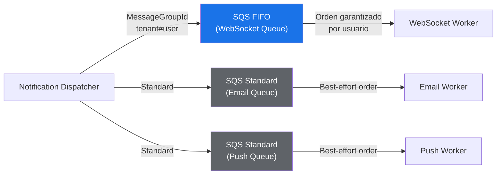
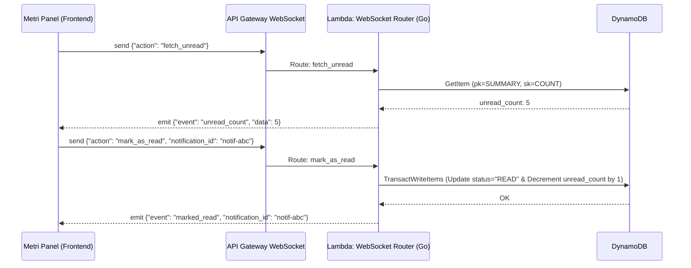
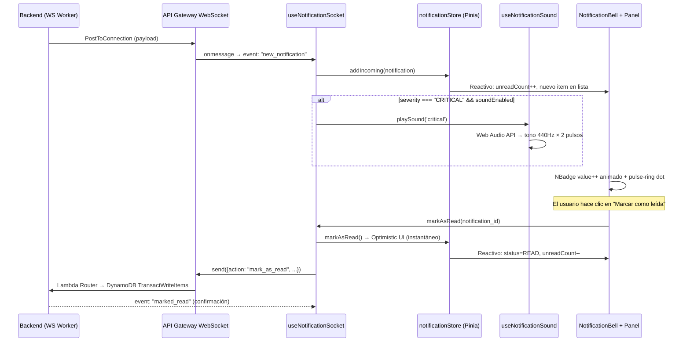

# Componente Externo 07 — Módulo Metri Notifications (Notificaciones Multicanal)

> **Estado:** Diseño / Propuesta Arquitectónica  
> **Responsable:** Arquitectura Metri Engine  
> **Naturaleza:** Componente Externo — AWS SAM independiente  
> **Lenguaje:** Go  
> **Bus de integración:** Amazon EventBridge (Event-Driven Architecture)

---

## Glosario de Términos

| Término | Definición |
|---|---|
| **Antichatter** | Mecanismo de supresión de ruido que evita el envío masivo de notificaciones repetitivas cuando un sensor oscila en torno a un umbral. Funciona filtrando alertas duplicadas dentro de una ventana temporal configurable. |
| **Fan-Out** | Patrón de mensajería donde un único mensaje de entrada se distribuye simultáneamente a múltiples destinos (en este contexto, colas SQS por canal: email, push, WebSocket). |
| **Sliding Window** | Técnica de control de tasa basada en una ventana temporal deslizante. En lugar de contadores fijos por periodo, evalúa la cantidad de eventos en los últimos *N* minutos de forma continua para decidir si suprimir o permitir una notificación. |
| **Dead Letter Queue (DLQ)** | Cola auxiliar de SQS donde se depositan automáticamente los mensajes que fallan tras un número máximo de reintentos (`maxReceiveCount`). Permite investigar y reprocesar fallos sin perder datos. |
| **Single Table Design** | Patrón de modelado de DynamoDB donde múltiples entidades (preferencias, conexiones, inbox, contadores) se almacenan en una única tabla, usando combinaciones de Partition Key y Sort Key para diferenciarlas. Reduce la latencia operacional y simplifica los permisos IAM. |
| **EventBridge** | Servicio de bus de eventos serverless de AWS que permite la comunicación asíncrona entre microservicios mediante reglas de enrutamiento basadas en patrones de eventos. |
| **Exponential Backoff** | Estrategia de reintento donde el tiempo de espera entre intentos crece exponencialmente (ej. 1s, 2s, 4s, 8s…), reduciendo la presión sobre un servicio degradado y evitando tormentas de reintentos. |
| **TTL (Time To Live)** | Atributo numérico en DynamoDB que define el instante (Unix Timestamp) en que un registro expira y es eliminado automáticamente por el motor de base de datos, sin costo de escritura. |
| **Optimistic UI Update** | Patrón de frontend donde la interfaz refleja inmediatamente el resultado esperado de una acción (ej. marcar como leído) antes de recibir la confirmación del servidor, revirtiendo el cambio visual solo si la operación falla. |
| **Heartbeat (Ping-Pong)** | Protocolo de latido periódico donde el cliente envía un frame `ping` y espera un `pong` del servidor para mantener activa la conexión WebSocket y detectar desconexiones silenciosas. |
| **Zero-Trust (IAM)** | Principio de seguridad donde cada componente recibe exclusivamente los permisos mínimos necesarios (*least privilege*). Ninguna Lambda, servicio o rol confía implícitamente en otro sin validación explícita. |
| **Multitenant** | Arquitectura donde una única instancia del sistema sirve a múltiples organizaciones (tenants) de forma aislada, garantizando que los datos y cuotas de un tenant nunca interfieran con los de otro. |
| **GSI (Global Secondary Index)** | Índice secundario en DynamoDB que permite consultar la tabla con una clave de partición y/o ordenamiento diferente a la clave primaria, habilitando access patterns adicionales sin duplicar datos manualmente. |
| **ACK (Acknowledgement)** | Confirmación explícita de que un mensaje fue recibido y procesado. En este sistema, el evento `system.notification.acknowledged` indica que el usuario leyó la alerta, evitando escalaciones innecesarias al canal de fallback. |
| **Digest** | Notificación de resumen que consolida múltiples alertas suprimidas por el mecanismo de antichatter en un único mensaje agrupado, evitando spam sin perder visibilidad de los eventos ocurridos. |
| **Circuit Breaker** | Patrón de resiliencia que detecta fallos consecutivos en un servicio externo y "abre el circuito" temporalmente, deteniendo las llamadas para permitir la recuperación del servicio antes de reintentar. |
| **Idempotencia** | Propiedad de una operación que garantiza que ejecutarla múltiples veces con la misma entrada produce exactamente el mismo resultado que ejecutarla una sola vez. Crítica en sistemas event-driven con entrega *at-least-once* para evitar efectos duplicados (ej. enviar dos veces la misma notificación). |
| **EventBridge Scheduler** | Servicio serverless de AWS que permite ejecutar tareas programadas (cron o rate) invocando targets como funciones Lambda, sin necesidad de mantener infraestructura de scheduling propia. Ideal para tareas periódicas como la compilación de digests. |
| **SQS FIFO** | Variante de Amazon SQS que garantiza entrega de mensajes en orden estricto (First-In-First-Out) y deduplicación exacta. Requiere un `MessageGroupId` para agrupar mensajes que deben mantener orden relativo entre sí. Tiene un throughput de 300 msg/s por grupo (3,000 con batching). |
| **MessageGroupId** | Etiqueta que agrupa mensajes dentro de una cola SQS FIFO. Todos los mensajes con el mismo `MessageGroupId` se entregan en orden FIFO estricto. Mensajes con diferente `MessageGroupId` pueden procesarse en paralelo, permitiendo escalar horizontalmente sin perder el orden por usuario. |
| **Adaptive Backoff** | Estrategia de reintento dinámica donde el SDK de AWS ajusta automáticamente los tiempos de espera entre reintentos basándose en las respuestas del servicio (ej. `Retry-After` headers, throttling rate). Más inteligente que el exponential backoff estático porque se adapta a la carga real del servicio. |

---

## 0. Principio Rector

Metri Notifications es un microservicio autónomo y serverless construido en **Go**. Su propósito fundamental es **orquestar, priorizar y entregar notificaciones multicanal** sin bloquear ni degradar las líneas vitales operativas de `metri-engine` ni de `metri-iot`. 

El servicio opera de forma puramente reactiva a eventos del bus EventBridge, aislando la latencia de APIs externas (SES, Twilio, FCM, APNS) mediante un patrón **Fan-Out con colas SQS dedicadas por canal**. Incorpora de forma nativa control de cuotas, supresión de ruido (antichatter), fallback dinámico y soporte multitenant absoluto.

---

## 1. Posición en el Ecosistema Metri

```
                  ┌────────────────────────────────────────────────────────┐
                  │                    METRI EVENT BUS (EventBridge)       │
                  │  Eventos:                                              │
                  │  • system.iot.alert.breach                             │
                  │  • system.auth.password_reset                          │
                  │  • system.billing.quota_exhausted                      │
                  └───────────────────────────┬────────────────────────────┘
                                              │
                                              ▼ (Filtros en EventBridge Rules)
                  ┌────────────────────────────────────────────────────────┐
                  │                METRI NOTIFICATIONS STACK               │
                  │                                                        │
                  │     ┌────────────────────────────────────────────┐     │
                  │     │       LAMBDA: Notification Dispatcher      │     │
                  │     │       - Resuelve preferencias in-RAM       │     │
                  │     │       - Resuelve de-duplicación/Throttling │     │
                  │     │       - Resuelve plantillas multitenant    │     │
                  │     └─────────────────────┬──────────────────────┘     │
                  │                           │                            │
                  │       ┌───────────────────┼───────────────────┐        │
                  │       ▼ (SQS Email)       ▼ (SQS Push)        ▼ (SQS WS)  
                  │  ┌─────────────┐     ┌─────────────┐     ┌─────────────┐
                  │  │   SES Queue │     │   FCM/APNS  │     │  WS Connection
                  │  └──────┬──────┘     └──────┬──────┘     └──────┬──────┘
                  │         ▼                  ▼                  ▼        │
                  │  ┌─────────────┐     ┌─────────────┐     ┌─────────────┐
                  │  │ LAMBDA:     │     │ LAMBDA:     │     │ LAMBDA:     │
                  │  │ SES Worker  │     │ Push Worker │     │ WS Worker   │
                  │  └──────┬──────┘     └──────┬──────┘     └──────┬──────┘
                  └─────────┼───────────────────┼───────────────────┼──────┘
                            │                   │                   │
                            ▼ (Amazon SES)      ▼ (FCM/SNS Push)    ▼ (API Gateway WS)
                      [ Cliente Email ]   [ Móvil / Web ]     [ Metri Panel ]
```

---

## 2. El Catálogo Maestro de Preferencias y Conexiones (DynamoDB)

Para mantener la velocidad sub-milisegundo en Go, el stack de notificaciones utiliza una única tabla de DynamoDB (`metri-notifications-registry`) optimizada con índices secundarios globales (GSI).

### 2.1 Entidad `UserPreferences` (Preferencia de Canales)
Permite a cada usuario decidir por qué canales desea recibir cada categoría de alerta.
*   **Partition Key (PK):** `TENANT#{tenant_id}#USER#{user_id}`
*   **Sort Key (SK):** `PREFERENCES`
*   **Atributos:**
    ```json
    {
      "channels_by_severity": {
        "CRITICAL": ["websocket", "push", "email"],
        "WARNING": ["websocket", "push"],
        "INFO": ["websocket"]
      },
      "silence_windows": [
        {
          "start_utc": "22:00",
          "end_utc": "06:00",
          "timezone": "America/Bogota",
          "allowed_severities": ["CRITICAL"]
        }
      ]
    }
    ```

### 2.2 Entidad `ActiveConnections` (WebSocket Registry)
Registra las conexiones WebSocket activas en el navegador o app móvil para enrutar mensajes en tiempo real.
*   **Partition Key (PK):** `CONNECTION#{connection_id}`
*   **Sort Key (SK):** `METADATA`
*   **Índice Secundario (GSI_User):** `USER#{user_id}` para envíos directos a todas las pantallas de un usuario.
*   **Atributos:**
    ```json
    {
      "tenant_id": "tenant-42",
      "user_id": "usr-102",
      "connected_at": 1735689600,
      "ttl": 1735776000
    }
    ```

### 2.3 Entidad `IdempotencyKey` (Deduplicación de Eventos)
Garantiza que un mismo evento entregado múltiples veces por EventBridge (entrega *at-least-once*) sea procesado **exactamente una vez**.
*   **Partition Key (PK):** `IDEMPOTENCY#{event_id}`
*   **Sort Key (SK):** `LOCK`
*   **Atributos:**
    ```json
    {
      "event_id": "evt-a3f7-92bc-01",
      "processed_at": 1735689600,
      "status": "COMPLETED",
      "ttl_val": 1735776000
    }
    ```
*   **Mecanismo:** Usa una escritura condicional (`PutItem` con `attribute_not_exists(pk)`) que actúa como un lock distribuido. Si el registro ya existe, la condición falla atómicamente y el Dispatcher descarta el evento duplicado sin procesarlo.
*   **TTL:** Los registros de idempotencia expiran automáticamente tras **24 horas** (`ttl_val`), liberando espacio sin intervención manual. La ventana de 24h es suficiente dado que los reintentos de EventBridge ocurren en minutos.

### 2.4 Entidad `DigestEntry` (Acumulador de Alertas Suprimidas)
Cuando el mecanismo de antichatter (§3.1, paso 3) suprime una alerta, la información del evento se persiste en esta entidad para ser consolidada posteriormente por el Digest Compiler (§3.3).
*   **Partition Key (PK):** `TENANT#{tenant_id}#DIGEST`
*   **Sort Key (SK):** `ASSET#{asset_id}#RULE#{rule_id}#TS#{timestamp}`
*   **GSI (`GSI_DigestStatus`):**
    *   **PK del GSI:** `DIGEST_STATUS#PENDING`
    *   **SK del GSI:** `TENANT#{tenant_id}#TS#{timestamp}`
    *   Permite al Digest Compiler consultar eficientemente todas las entradas pendientes globalmente, ordenadas por tenant y tiempo.
*   **Atributos:**
    ```json
    {
      "tenant_id": "tenant-42",
      "asset_id": "P-102",
      "rule_id": "rule-vibration-high",
      "metric": "vibration_rms",
      "severity": "WARNING",
      "breach_value": 12.87,
      "notify_users": ["usr-102", "usr-305"],
      "suppressed_at": 1735689600,
      "status": "PENDING",
      "ttl_val": 1735776000
    }
    ```
*   **Estados del ciclo de vida:**
    *   `PENDING` → Alerta suprimida, esperando ser incluida en el próximo digest.
    *   `DIGESTED` → Alerta ya consolidada y enviada en un resumen. El TTL la limpia en 24h.

---

## 3. Flujo Arquitectónico Detallado

### 3.1 Fase de Despacho (Notification Dispatcher)
La Lambda central **Notification Dispatcher** (Go) escucha el bus de eventos y ejecuta la orquestación inicial:

1.  **Guardia de Idempotencia (Deduplicación Exacta):**
    *   Amazon EventBridge ofrece entrega *at-least-once*, lo que significa que un mismo evento puede llegar más de una vez al Dispatcher. Sin protección, esto provocaría notificaciones duplicadas al usuario.
    *   **Mecanismo:** El Dispatcher extrae el `event_id` único del evento y ejecuta un `PutItem` condicional en DynamoDB contra la entidad `IdempotencyKey` (§2.3):
        ```
        PutItem(pk="IDEMPOTENCY#<event_id>", sk="LOCK")
          ConditionExpression: attribute_not_exists(pk)
        ```
    *   Si la escritura tiene éxito → el evento es **nuevo** y continúa al paso 2.
    *   Si la escritura falla con `ConditionalCheckFailedException` → el evento es un **duplicado** y el Dispatcher retorna inmediatamente sin efecto.
    *   **Costo:** Una sola escritura condicional de ~1 WCU por evento. El TTL de 24 horas limpia los registros automáticamente.
2.  **Resolución de Destinatarios:** Si el evento contiene grupos de notificación (`notify_groups`) o usuarios individuales (`notify_users`), el Dispatcher consulta a DynamoDB para recuperar las preferencias de cada usuario.
3.  **Mitigación de Ruido (Antichatter / Sliding Window):**
    *   Para evitar el "spam" de alertas repetitivas (ej: una bomba oscilando en el límite del umbral 50 veces por minuto), la Lambda calcula un hash de deduplicación semántica: `SHA256(asset_id + rule_id)` y lo combina con el `tenant_id` explícito como prefijo de la Partition Key: `TENANT#{tenant_id}#SUPPRESSION#{hash}`. Esto garantiza **aislamiento de tenant** (un tenant nunca puede colisionar con el hash de otro) y mantiene la distribución uniforme de escrituras dentro de cada tenant.
    *   Realiza un `UpdateItem` atómico en DynamoDB incrementando un contador de supresión con un TTL corto (ej. 5 minutos).
    *   Si el contador supera el límite permitido (ej. más de 1 alerta cada 5 minutos por la misma regla), la Lambda **suprime la notificación individual** y persiste un registro `DigestEntry` (§2.4) en DynamoDB con `status: PENDING`.
    *   **Acumulación para Digest:** La función `accumulateForDigest()` escribe atómicamente los datos del evento suprimido (tenant, activo, regla, métrica, valor, usuarios destino) en la tabla de notificaciones. El Digest Compiler (§3.3) los consolida periódicamente en un resumen agrupado.
4.  **Generación del Payload por Canal:**
    *   Carga en memoria las plantillas de mensaje en formato HTML/Texto (compiladas en caliente en el binario de Go para máxima velocidad).
    *   Mapea los datos del evento al template correspondiente según el idioma y el branding del Tenant.
5.  **Fan-Out a Colas SQS:**
    *   En lugar de llamar directamente a las APIs externas, el Dispatcher introduce de forma paralela los payloads formateados en las colas SQS de cada canal resuelto (`sqs-email`, `sqs-push`, `sqs-websocket`).
    *   **Ventaja:** El Dispatcher termina su ejecución en menos de **$15\text{ ms}$**, liberando inmediatamente el flujo de ingesta y aislando cualquier caída de red de proveedores externos.

> **Nota sobre la diferencia entre Idempotencia y Antichatter:**
> *   La **idempotencia** (paso 1) protege contra *entregas duplicadas del mismo evento exacto* por parte de EventBridge (mismo `event_id`).
> *   El **antichatter** (paso 3) protege contra *eventos legítimamente distintos pero semánticamente repetitivos* (ej. un sensor que dispara 50 alertas diferentes en un minuto, cada una con su propio `event_id`).

---

### 3.2 Fase de Entrega (Workers Especializados)

Cada cola SQS es consumida por una Lambda especializada construida en Go, implementando patrones de resiliencia específicos por canal.

#### A. WebSocket Worker (Tiempo Real en Metri Panel)
*   **Canal:** AWS API Gateway WebSocket API.
*   **Cola:** SQS FIFO (`metri-notif-ws-queue.fifo`) — garantiza orden cronológico por usuario.
*   **Mecanismo:** 
    *   El Worker lee de `sqs-websocket` en orden FIFO por `MessageGroupId` (`tenant_id#user_id`).
    *   Consulta las conexiones WebSocket activas en DynamoDB para el `user_id` de destino.
    *   Envía el mensaje directamente a las conexiones activas mediante la API `@connections` de API Gateway.
    *   Si API Gateway responde con `410 Gone`, el Worker elimina atómicamente la conexión obsoleta de DynamoDB.

#### B. Push Notification Worker (App Móvil / Navegador)
*   **Canal:** Amazon Pinpoint o Firebase Cloud Messaging (FCM).
*   **Cola:** SQS Standard (`metri-notif-push-queue`) — el orden no impacta (el OS del dispositivo ordena por timestamp nativo).
*   **Mecanismo:** 
    *   El Worker lee de `sqs-push` y envía el token de registro del dispositivo almacenado en el perfil del usuario.
    *   Implementa circuit breaker (§5.4) contra caídas de FCM/Pinpoint.
    *   Si el dispositivo reporta token inválido (`InvalidRegistration`), elimina atómicamente el token del perfil del usuario en DynamoDB.

#### C. Email Worker (SES)
*   **Canal:** Amazon SES (Simple Email Service).
*   **Cola:** SQS Standard (`metri-notif-email-queue`) — los emails no tienen orden visual intrínseco; cada uno lleva su timestamp.
*   **Mecanismo:** Incorpora control de cuotas diario de envío y reintentos automáticos con respaldo exponencial (*Exponential Backoff*) si SES devuelve *Throttling*. Circuit breaker (§5.4) protege contra caídas sostenidas.

#### D. SMS / Voz Worker (Fallback Crítico vía Twilio)
*   **Canal:** Twilio Programmable SMS y Twilio Voice (llamada robótica).
*   **Cola:** SQS Standard con `DelaySeconds` configurable (`metri-notif-sms-queue`) — los mensajes llegan con un retardo de 180 segundos (3 minutos) para dar tiempo al ACK de WebSocket/Push antes de escalar al canal más intrusivo.
*   **Mecanismo:**
    *   Este Worker **solo se activa para alertas `CRITICAL`** que no fueron confirmadas (ACK) dentro de la ventana de fallback (§5.2).
    *   Lee de `sqs-sms` y llama a la API de Twilio (`/Messages` para SMS, `/Calls` con TwiML para voz).
    *   **Cuota estricta por tenant:** Antes de enviar, valida contra `metri-quota-registry` que el tenant no haya excedido su límite de SMS/mes (ej. 100 SMS/mes para plan básico, 1,000 para enterprise).
    *   **Circuit breaker** (§5.4) con `CIRCUIT_BREAKER#sms` para proteger contra caídas de la API de Twilio.
    *   Si el envío falla y va a DLQ, se genera una alerta `CRITICAL` de infraestructura en CloudWatch (§11) para el equipo de operaciones de Metri.

---

### 3.3 Fase de Consolidación (Digest Scheduler)

Las alertas suprimidas por el antichatter no se pierden: se acumulan como registros `DigestEntry` (§2.4) y son consolidadas periódicamente en un resumen agrupado por el **Digest Compiler**.

```
┌──────────────────────────────────────────────────────────────────────────────────┐
│                         DIGEST SCHEDULER PIPELINE                              │
│                                                                                │
│   EventBridge Scheduler                                                        │
│   (rate: every 60 min)                                                         │
│          │                                                                     │
│          ▼                                                                     │
│   ┌─────────────────────────────────────────┐                                  │
│   │       LAMBDA: Digest Compiler (Go)      │                                  │
│   │                                         │                                  │
│   │  1. Query GSI_DigestStatus              │                                  │
│   │     (pk = DIGEST_STATUS#PENDING)        │                                  │
│   │                                         │                                  │
│   │  2. Agrupar por:                        │                                  │
│   │     tenant → user → asset → rule        │                                  │
│   │                                         │                                  │
│   │  3. Renderizar plantilla de resumen     │                                  │
│   │     por idioma/branding del tenant      │                                  │
│   │                                         │                                  │
│   │  4. Fan-Out a SQS (email + websocket)   │                                  │
│   │                                         │                                  │
│   │  5. BatchWriteItem: marcar registros    │                                  │
│   │     como status = "DIGESTED"            │                                  │
│   └─────────────────────────────────────────┘                                  │
│                    │                                                           │
│        ┌───────────┼───────────┐                                               │
│        ▼                       ▼                                               │
│   [ SQS Email ]          [ SQS WS FIFO ]                                      │
│        │                       │                                               │
│        ▼                       ▼                                               │
│   Email con tabla         Tarjeta resumen                                      │
│   resumen agrupada        en Inbox del panel                                   │
└──────────────────────────────────────────────────────────────────────────────────┘
```

#### 3.3.1 Flujo Detallado del Digest Compiler

1.  **Recolección:** La Lambda ejecuta un `Query` sobre el GSI `GSI_DigestStatus` con `pk = DIGEST_STATUS#PENDING`, recuperando todas las alertas suprimidas pendientes de consolidación. La query se pagina automáticamente si hay más de 1MB de resultados.
2.  **Agrupamiento en Memoria:** Los registros se agrupan jerárquicamente en un mapa:
    ```
    tenant_id → user_id → asset_id → rule_id → []{metric, breach_value, severity, timestamp}
    ```
    Esto permite generar un resumen por usuario que consolida todas las alertas de todos sus activos.
3.  **Renderizado del Resumen:** Para cada usuario, se genera un payload de digest con el siguiente formato:
    ```json
    {
      "type": "digest",
      "tenant_id": "tenant-42",
      "user_id": "usr-102",
      "period": { "from": 1735686000, "to": 1735689600 },
      "summary": [
        {
          "asset_id": "P-102",
          "asset_name": "Bomba Principal P-102",
          "alerts": [
            {
              "rule_id": "rule-vibration-high",
              "metric": "vibration_rms",
              "count": 47,
              "max_severity": "WARNING",
              "peak_value": 14.2,
              "first_at": 1735686120,
              "last_at": 1735689540
            }
          ]
        }
      ],
      "total_suppressed": 47
    }
    ```
4.  **Fan-Out a Canales de Digest:** El resumen se envía exclusivamente por **email** (tabla HTML formateada) y **WebSocket** (tarjeta de resumen en el Inbox del panel). No se envía por push para evitar saturar el móvil con resúmenes periódicos.
5.  **Marcado Atómico:** Los registros procesados se actualizan masivamente con `BatchWriteItem`, cambiando `status` de `PENDING` a `DIGESTED`. El TTL de 24h limpia los registros digeridos automáticamente.

#### 3.3.2 Decisiones de Diseño

| Decisión | Alternativa Descartada | Justificación |
|---|---|---|
| EventBridge Scheduler (cron) | AWS Step Functions Wait State | Step Functions es más costoso (~$0.025/transición) y más complejo para un patrón tan simple como "ejecutar cada N minutos". |
| Frecuencia de 60 min | 5 min / 30 min / 2h | 60 min balancea la latencia de entrega del resumen (aceptable para alertas ya suprimidas) con el costo de ejecución de la Lambda. Configurable por tenant en `UserPreferences`. |
| Solo email + websocket | Todos los canales | Un digest por push sería contraproducente: el propósito del digest es consolidar ruido, no generar más notificaciones intrusivas. |
| GSI dedicado (`GSI_DigestStatus`) | Scan de tabla completa | Un Scan sería prohibitivamente costoso a escala. El GSI permite queries eficientes acotadas a registros pendientes. |

---

### 3.4 Garantías de Orden (Ordering Pattern)

En un sistema de notificaciones multicanal, la garantía de orden no es un requerimiento uniforme para todos los canales. El sistema implementa una estrategia **FIFO selectiva** que optimiza la experiencia del usuario sin sacrificar throughput innecesariamente.

#### 3.4.1 Problema

Amazon SQS Standard ofrece entrega **best-effort ordering**, lo que significa que los mensajes pueden llegar desordenados. En el contexto de notificaciones:
*   Si un usuario recibe una alerta de **resolución** ("Bomba P-102 normalizada") *antes* de la alerta de **disparo** ("Bomba P-102 en cavitación"), la experiencia es confusa y potencialmente peligrosa en un entorno industrial.
*   Para **email** y **push**, cada mensaje es autónomo con su propio timestamp, y el cliente final (Gmail, iOS notification center) impone su propio orden visual.

#### 3.4.2 Estrategia: FIFO Selectivo por Canal



| Canal | Tipo SQS | `MessageGroupId` | Throughput | Justificación |
|---|---|---|---|---|
| **WebSocket** | FIFO | `{tenant_id}#{user_id}` | 300 msg/s por grupo | El usuario ve las notificaciones en tiempo real en el panel. El orden cronológico es **crítico** para la coherencia visual y la seguridad operacional. |
| **Email** | Standard | N/A | Ilimitado | Los emails son autónomos. Gmail y clientes de correo ordenan por timestamp del header `Date`. |
| **Push** | Standard | N/A | Ilimitado | iOS/Android apilan notificaciones con su propio orden temporal nativo. |

#### 3.4.3 Detalles de Implementación FIFO

*   **`MessageGroupId`:** Se construye como `{tenant_id}#{user_id}`. Esto garantiza que las notificaciones de un mismo usuario se entreguen en orden, mientras que usuarios de distintos tenants (o del mismo tenant) se procesan en **paralelo** — escalabilidad horizontal sin perder el orden por flujo lógico.
*   **`MessageDeduplicationId`:** Se usa `{event_id}#{channel}` para aprovechar la deduplicación nativa de SQS FIFO (ventana de 5 minutos), complementando la idempotencia de DynamoDB.
*   **Throughput:** 300 msg/s por `MessageGroupId` es más que suficiente para el caso de uso (un usuario raramente recibe más de 10 notificaciones/segundo incluso en escenarios extremos). Con miles de usuarios, los grupos se procesan en paralelo.
*   **Trade-off aceptado:** Email y Push usan SQS Standard, aceptando entrega best-effort. El impacto es nulo porque cada mensaje contiene su timestamp y los clientes finales imponen su propio orden.

---

## 4. Implementación en Go (Notification Dispatcher Core)

A continuación, se detalla la estructura base del Dispatcher en Go, optimizada para un procesamiento concurrente y eficiente utilizando Goroutines:

```go
package main

import (
	"context"
	"errors"
	"crypto/sha256"
	"encoding/hex"
	"encoding/json"
	"fmt"
	"log"
	"os"
	"sync"
	"time"

	"github.com/aws/aws-lambda-go/events"
	"github.com/aws/aws-lambda-go/lambda"
	"github.com/aws/aws-sdk-go-v2/aws"
	"github.com/aws/aws-sdk-go-v2/aws/retry"
	"github.com/aws/aws-sdk-go-v2/config"
	"github.com/aws/aws-sdk-go-v2/service/dynamodb"
	"github.com/aws/aws-sdk-go-v2/service/dynamodb/types"
	"github.com/aws/aws-sdk-go-v2/service/sqs"
)

type NotificationEvent struct {
	EventID   string         `json:"event_id"`
	Type      string         `json:"type"` // Ej: "system.iot.alert.breach" o "system.cmms.work_order.assigned"
	TenantID  string         `json:"tenant_id"`
	Timestamp int64          `json:"timestamp"`
	Detail    EventDetail    `json:"detail"`
}

type EventDetail struct {
	// Campos telemétricos (opcionales para otros tipos de notificaciones)
	AssetID     string   `json:"asset_id,omitempty"`
	RuleID      string   `json:"rule_id,omitempty"`
	Metric      string   `json:"metric,omitempty"`
	BreachValue float64  `json:"breach_value,omitempty"`
	
	// Campos comunes
	Severity     string   `json:"severity"` // INFO, WARNING, CRITICAL
	NotifyUsers  []string `json:"notify_users"`
	NotifyGroups []string `json:"notify_groups"`

	// Campos de notificaciones genéricas / operacionales (metri-cmms, metri-schedulers, etc.)
	Title    string            `json:"title,omitempty"`
	Message  string            `json:"message,omitempty"`
	Link     string            `json:"link,omitempty"`
	Metadata map[string]string `json:"metadata,omitempty"`
}

type Dispatcher struct {
	dbClient      *dynamodb.Client
	sqsClient     *sqs.Client
	emailQueueUrl string
	pushQueueUrl  string
	smsQueueUrl   string
	wsQueueUrl    string
}

func (d *Dispatcher) HandleRequest(ctx context.Context, event events.CloudWatchEvent) error {
	var notifEvent NotificationEvent
	if err := json.Unmarshal(event.Detail, &notifEvent); err != nil {
		return fmt.Errorf("falla al unmarshal del evento: %w", err)
	}

	// 1. Guardia de Idempotencia — Rechazar eventos duplicados de EventBridge
	duplicate, err := d.checkIdempotency(ctx, notifEvent.EventID)
	if err != nil {
		log.Printf("[ERROR] Falla al evaluar idempotencia: %v", err)
		// En caso de error de DynamoDB, continuar para no perder alertas críticas.
		// El antichatter (paso 2) actúa como segunda barrera contra duplicados.
	}
	if duplicate {
		log.Printf("[IDEMPOTENCIA] Evento %s descartado — ya fue procesado previamente", notifEvent.EventID)
		return nil
	}

	// 2. Validar Antichatter / Supresión Duplicados
	suppressed, err := d.checkSuppression(ctx, notifEvent)
	if err != nil {
		log.Printf("[ERROR] Falla al evaluar supresión: %v", err)
	}
	if suppressed {
		log.Printf("[SUPRESION] Alerta %s para activo %s silenciada por Chatter Limit", notifEvent.Detail.RuleID, notifEvent.Detail.AssetID)
		// Acumular la alerta suprimida para el próximo Digest (§3.3)
		if err := d.accumulateForDigest(ctx, notifEvent); err != nil {
			log.Printf("[ERROR] Falla al acumular para digest: %v", err)
		}
		return nil
	}

	// 3. Resolver destinatarios y preferencias en paralelo usando WaitGroup
	var wg sync.WaitGroup
	for _, userID := range notifEvent.Detail.NotifyUsers {
		wg.Add(1)
		go func(uid string) {
			defer wg.Done()
			if err := d.dispatchToUser(ctx, uid, notifEvent); err != nil {
				log.Printf("[ERROR] Falla al despachar a usuario %s: %v", uid, err)
			}
		}(userID)
	}
	wg.Wait()

	return nil
}

// checkIdempotency intenta registrar el event_id en DynamoDB con una escritura condicional.
// Si el registro ya existe, retorna true (duplicado). Si es nuevo, lo crea con TTL de 24h.
func (d *Dispatcher) checkIdempotency(ctx context.Context, eventID string) (bool, error) {
	pk := fmt.Sprintf("IDEMPOTENCY#%s", eventID)
	now := time.Now().Unix()
	ttl := now + 86400 // 24 horas de ventana de deduplicación

	_, err := d.dbClient.PutItem(ctx, &dynamodb.PutItemInput{
		TableName: aws.String("metri-notifications-registry"),
		Item: map[string]types.AttributeValue{
			"pk":           &types.AttributeValueMemberS{Value: pk},
			"sk":           &types.AttributeValueMemberS{Value: "LOCK"},
			"processed_at": &types.AttributeValueMemberN{Value: fmt.Sprintf("%d", now)},
			"status":       &types.AttributeValueMemberS{Value: "COMPLETED"},
			"ttl_val":      &types.AttributeValueMemberN{Value: fmt.Sprintf("%d", ttl)},
		},
		// Escritura condicional: solo inserta si la PK no existe aún.
		// Si ya existe, DynamoDB lanza ConditionalCheckFailedException → es un duplicado.
		ConditionExpression: aws.String("attribute_not_exists(pk)"),
	})
	if err != nil {
		// Verificar si el error es ConditionalCheckFailedException (evento duplicado)
		var condErr *types.ConditionalCheckFailedException
		if ok := errors.As(err, &condErr); ok {
			return true, nil // Evento duplicado — descartar silenciosamente
		}
		return false, fmt.Errorf("falla al registrar idempotency key: %w", err)
	}

	return false, nil // Evento nuevo — continuar procesamiento
}

func (d *Dispatcher) checkSuppression(ctx context.Context, ev NotificationEvent) (bool, error) {
	// Solo evaluar supresión (antichatter) para alertas con RuleID definido (telemetría de IoT)
	if ev.Detail.RuleID == "" {
		return false, nil // No suprimir notificaciones operacionales/transaccionales (ej: asignación OT)
	}

	// Generar Hash de deduplicación semántica (asset+rule, sin tenant para evitar redundancia)
	// El tenant_id se usa como prefijo explícito de la PK para garantizar aislamiento multitenant.
	rawKey := fmt.Sprintf("%s:%s", ev.Detail.AssetID, ev.Detail.RuleID)
	hasher := sha256.New()
	hasher.Write([]byte(rawKey))
	hashKey := hex.EncodeToString(hasher.Sum(nil))

	// PK con tenant isolation: cada tenant tiene su propio espacio de supresión
	pk := fmt.Sprintf("TENANT#%s#SUPPRESSION#%s", ev.TenantID, hashKey)
	now := time.Now().Unix()
	ttl := now + 300 // 5 minutos de ventana de supresión

	// Incremento atómico en DynamoDB con retorno del nuevo valor
	result, err := d.dbClient.UpdateItem(ctx, &dynamodb.UpdateItemInput{
		TableName: aws.String("metri-notifications-registry"),
		Key: map[string]types.AttributeValue{
			"pk": &types.AttributeValueMemberS{Value: pk},
			"sk": &types.AttributeValueMemberS{Value: "COUNTER"},
		},
		UpdateExpression: aws.String("ADD hit_count :inc SET ttl_val = :ttl"),
		ExpressionAttributeValues: map[string]types.AttributeValue{
			":inc": &types.AttributeValueMemberN{Value: "1"},
			":ttl": &types.AttributeValueMemberN{Value: fmt.Sprintf("%d", ttl)},
		},
		ReturnValues: types.ReturnValueAllNew,
	})
	if err != nil {
		return false, err
	}

	// Evaluar hit_count: si supera 1, la alerta ya fue enviada en esta ventana → suprimir
	if countAttr, ok := result.Attributes["hit_count"]; ok {
		if n, ok := countAttr.(*types.AttributeValueMemberN); ok {
			var count int64
			if _, err := fmt.Sscanf(n.Value, "%d", &count); err == nil && count > 1 {
				return true, nil // Suprimir: ya se envió una alerta en esta ventana de 5 min
			}
		}
	}

	return false, nil // Primera alerta en la ventana → permitir
}

// accumulateForDigest persiste la alerta suprimida como DigestEntry en DynamoDB
// para que el Digest Compiler (§3.3) la consolide en el próximo ciclo.
func (d *Dispatcher) accumulateForDigest(ctx context.Context, ev NotificationEvent) error {
	now := time.Now().Unix()
	ttl := now + 86400 // 24 horas de retención

	pk := fmt.Sprintf("TENANT#%s#DIGEST", ev.TenantID)
	sk := fmt.Sprintf("ASSET#%s#RULE#%s#TS#%d", ev.Detail.AssetID, ev.Detail.RuleID, now)

	// Serializar lista de usuarios destino
	userList := make([]types.AttributeValue, len(ev.Detail.NotifyUsers))
	for i, u := range ev.Detail.NotifyUsers {
		userList[i] = &types.AttributeValueMemberS{Value: u}
	}

	_, err := d.dbClient.PutItem(ctx, &dynamodb.PutItemInput{
		TableName: aws.String("metri-notifications-registry"),
		Item: map[string]types.AttributeValue{
			"pk":            &types.AttributeValueMemberS{Value: pk},
			"sk":            &types.AttributeValueMemberS{Value: sk},
			"tenant_id":     &types.AttributeValueMemberS{Value: ev.TenantID},
			"asset_id":      &types.AttributeValueMemberS{Value: ev.Detail.AssetID},
			"rule_id":       &types.AttributeValueMemberS{Value: ev.Detail.RuleID},
			"metric":        &types.AttributeValueMemberS{Value: ev.Detail.Metric},
			"severity":      &types.AttributeValueMemberS{Value: ev.Detail.Severity},
			"breach_value":  &types.AttributeValueMemberN{Value: fmt.Sprintf("%.4f", ev.Detail.BreachValue)},
			"notify_users":  &types.AttributeValueMemberL{Value: userList},
			"suppressed_at": &types.AttributeValueMemberN{Value: fmt.Sprintf("%d", now)},
			"status":        &types.AttributeValueMemberS{Value: "PENDING"},
			// GSI_DigestStatus keys para queries eficientes del Digest Compiler
			"gsi_digest_pk": &types.AttributeValueMemberS{Value: "DIGEST_STATUS#PENDING"},
			"gsi_digest_sk": &types.AttributeValueMemberS{Value: fmt.Sprintf("TENANT#%s#TS#%d", ev.TenantID, now)},
			"ttl_val":       &types.AttributeValueMemberN{Value: fmt.Sprintf("%d", ttl)},
		},
	})
	if err != nil {
		return fmt.Errorf("falla al acumular digest entry: %w", err)
	}

	log.Printf("[DIGEST] Alerta acumulada para digest: tenant=%s asset=%s rule=%s",
		ev.TenantID, ev.Detail.AssetID, ev.Detail.RuleID)
	return nil
}

func (d *Dispatcher) dispatchToUser(ctx context.Context, userID string, ev NotificationEvent) error {
	// A: Obtener preferencias del usuario
	pk := fmt.Sprintf("TENANT#%s#USER#%s", ev.TenantID, userID)
	out, err := d.dbClient.GetItem(ctx, &dynamodb.GetItemInput{
		TableName: aws.String("metri-notifications-registry"),
		Key: map[string]types.AttributeValue{
			"pk": &types.AttributeValueMemberS{Value: pk},
			"sk": &types.AttributeValueMemberS{Value: "PREFERENCES"},
		},
	})
	if err != nil {
		return err
	}

	// Canales por defecto si no hay registro
	channels := []string{"websocket"}
	if out.Item != nil {
		// Parsea preferencias de canales según severidad
		channels = d.resolveChannels(out.Item, ev.Detail.Severity)
	}

	// B: Publicar en colas SQS correspondientes
	for _, channel := range channels {
		// Formateo dinámico según el tipo de notificación (telemétrica vs genérica)
		title := ev.Detail.Title
		body := ev.Detail.Message
		
		if title == "" {
			if ev.Detail.Metric != "" {
				title = fmt.Sprintf("Alerta: %s anómala", ev.Detail.Metric)
			} else {
				title = "Notificación de Sistema"
			}
		}
		if body == "" {
			if ev.Detail.AssetID != "" && ev.Detail.BreachValue != 0 {
				body = fmt.Sprintf("El activo %s registró un valor de %.2f", ev.Detail.AssetID, ev.Detail.BreachValue)
			} else {
				body = fmt.Sprintf("Evento registrado: %s", ev.Type)
			}
		}

		payloadMap := map[string]any{
			"tenant_id": ev.TenantID,
			"user_id":   userID,
			"event_id":  ev.EventID,
			"severity":  ev.Detail.Severity,
			"title":     title,
			"body":      body,
			"timestamp": time.Now().Unix(),
		}

		// Enriquecer con link y metadata si están presentes en la especificación del evento
		if ev.Detail.Link != "" {
			payloadMap["link"] = ev.Detail.Link
		}
		if len(ev.Detail.Metadata) > 0 {
			payloadMap["metadata"] = ev.Detail.Metadata
		}

		payload, err := json.Marshal(payloadMap)
		if err != nil {
			log.Printf("[ERROR] Falla al serializar payload para canal %s: %v", channel, err)
			continue
		}

		var queueUrl string
		switch channel {
		case "email":
			queueUrl = d.emailQueueUrl
		case "push":
			queueUrl = d.pushQueueUrl
		case "sms":
			queueUrl = d.smsQueueUrl
		case "websocket":
			queueUrl = d.wsQueueUrl
		default:
			continue
		}

		// Construir el input base de SQS
		sendInput := &sqs.SendMessageInput{
			QueueUrl:    aws.String(queueUrl),
			MessageBody: aws.String(string(payload)),
		}

		// Para WebSocket (SQS FIFO): agregar MessageGroupId y MessageDeduplicationId
		// para garantizar orden cronológico por usuario en el panel (§3.4)
		if channel == "websocket" {
			groupId := fmt.Sprintf("%s#%s", ev.TenantID, userID)
			dedupId := fmt.Sprintf("%s#%s", ev.EventID, channel)
			sendInput.MessageGroupId = aws.String(groupId)
			sendInput.MessageDeduplicationId = aws.String(dedupId)
		}

		_, err = d.sqsClient.SendMessage(ctx, sendInput)
		if err != nil {
			log.Printf("[ERROR] Falla al encolar en SQS para canal %s: %v", channel, err)
		}
	}

	return nil
}

// resolveChannels extrae los canales configurados para una severidad específica
// del mapa DynamoDB `channels_by_severity` almacenado en las preferencias del usuario (§2.1).
// Si la severidad no tiene canales configurados, retorna ["websocket"] como fallback seguro.
func (d *Dispatcher) resolveChannels(item map[string]types.AttributeValue, severity string) []string {
	// Extraer el mapa channels_by_severity del registro DynamoDB
	channelsBySeverity, ok := item["channels_by_severity"].(*types.AttributeValueMemberM)
	if !ok {
		log.Printf("[WARN] Preferencias sin channels_by_severity, usando fallback")
		return []string{"websocket"}
	}

	// Buscar la lista de canales para la severidad del evento
	severityChannels, ok := channelsBySeverity.Value[severity].(*types.AttributeValueMemberL)
	if !ok {
		log.Printf("[WARN] Sin canales configurados para severidad %s, usando fallback", severity)
		return []string{"websocket"}
	}

	// Convertir la lista de AttributeValue a []string
	result := make([]string, 0, len(severityChannels.Value))
	for _, ch := range severityChannels.Value {
		if s, ok := ch.(*types.AttributeValueMemberS); ok {
			result = append(result, s.Value)
		}
	}

	if len(result) == 0 {
		return []string{"websocket"}
	}
	return result
}

func main() {
	cfg, err := config.LoadDefaultConfig(context.TODO(),
		// Retry adaptativo para DynamoDB throttling (§5.5)
		// Maneja automáticamente ProvisionedThroughputExceededException
		// y ThrottlingException con client-side rate limiting.
		config.WithRetryer(func() aws.Retryer {
			return retry.NewAdaptiveMode(
				func(o *retry.AdaptiveModeOptions) {
					o.StandardOptions = append(o.StandardOptions,
						func(so *retry.StandardOptions) {
							so.MaxAttempts = 5              // Hasta 5 intentos por operación DynamoDB
							so.MaxBackoff = 2 * time.Second // Máximo 2s entre reintentos
						},
					)
				},
			)
		}),
	)
	if err != nil {
		log.Fatalf("falla al inicializar AWS config: %v", err)
	}

	dispatcher := &Dispatcher{
		dbClient:      dynamodb.NewFromConfig(cfg),
		sqsClient:     sqs.NewFromConfig(cfg),
		emailQueueUrl: os.Getenv("EMAIL_QUEUE_URL"),
		pushQueueUrl:  os.Getenv("PUSH_QUEUE_URL"),
		smsQueueUrl:   os.Getenv("SMS_QUEUE_URL"),
		wsQueueUrl:    os.Getenv("WS_QUEUE_URL"),
	}

	lambda.Start(dispatcher.HandleRequest)
}
```

---

## 5. Estrategia de Fallback y Resiliencia (Best Practices)

Para asegurar la entrega del mensaje bajo condiciones extremas de fallo, el sistema implementa la siguiente **Estrategia de Fallback Escalado**:

```
                       [ ALERTA CRÍTICA EMITIDA ]
                                   │
                                   ▼
                       Encolar en Canal Principal:
                        Push Notification (Móvil)
                                   │
                    ¿Fallo de entrega o usuario offline?
                                   │
                  ┌────────────────┴────────────────┐
                  │ SÍ                              │ NO
                  ▼                                 ▼
         [ Esperar 3 Minutos ]             [ Fin del Flujo ]
                  │
        ¿No hay lectura en el panel
           vía WebSocket (ACK)?
                  │
         ┌────────┴────────┐
         │ SÍ              │ NO
         ▼                 ▼
  [ Canal Alterno ]   [ Fin del Flujo ]
    Enviar SMS o
     Llamada de 
        Voz
```

1.  **De-duplicación inteligente por Hash:** Si un sensor envía alertas duplicadas de forma ininterrumpida, el despachador las filtra usando el contador de DynamoDB con TTL, consolidándolas en una única alerta agrupada por hora.
2.  **Mecanismo de Confirmación de Entrega (WebSocket ACK):** 
    *   Al emitir una alerta `CRITICAL`, el despachador la envía prioritariamente vía WebSocket a **Metri Panel** y vía Push a la app móvil.
    *   Si en los siguientes 3 minutos, el microservicio no registra un evento de confirmación de lectura (`system.notification.acknowledged`) en la base de datos, el sistema asume que el usuario está offline o su conexión falló.
    *   **Fallback Automático:** La cola de control de retardo encolará automáticamente un envío de **SMS** o llamada de voz robótica vía Twilio para asegurar que el operario de guardia sea despertado.
3.  **Dead Letter Queues (DLQ):** Cada cola SQS (`sqs-email`, `sqs-push`, `sqs-websocket`) cuenta con una cola DLQ asociada. Si una notificación falla 3 veces consecutivas debido a que la API del proveedor está caída, el mensaje se almacena en la DLQ y se genera una alerta operativa en CloudWatch para el equipo de infraestructura de Metri.

---

### 5.4 Circuit Breaker (Protección contra Cascadas de Fallo en Workers)

Sin un circuit breaker, cuando SES está caído, el Email Worker reintenta 3 veces por mensaje y envía a DLQ. Pero si hay 10,000 emails encolados, **cada uno consumirá 3 reintentos contra un servicio muerto**, generando ~30,000 llamadas inútiles, agotando concurrencia Lambda, e incrementando costos. El circuit breaker detiene esta cascada.

#### 5.4.1 Máquina de Estados del Circuit Breaker

```
                ┌────────────────────────────────────────────────────────────────┐
                │                    CIRCUIT BREAKER POR CANAL                      │
                │                                                                  │
                │   ┌─────────────┐    fallos >= 5     ┌─────────────┐              │
                │   │   CLOSED    │ ──────────────▶ │    OPEN     │              │
                │   │ (Normal)   │                 │ (Bloqueado) │              │
                │   └─────────────┘                 └──────┬──────┘              │
                │        ▲                               │                        │
                │        │  probe exitoso           tras 60s                      │
                │        │                               ▼                        │
                │   ┌────┴────────┐                 ┌─────────────┐              │
                │   │   CLOSED    │ ◄────────────── │  HALF-OPEN  │              │
                │   │ (Restaurado)│  probe exitoso  │ (1 mensaje) │              │
                │   └─────────────┘                 └──────┬──────┘              │
                │                                       │                        │
                │                                  probe falla                    │
                │                                       │                        │
                │                                       ▼                        │
                │                                ┌─────────────┐              │
                │                                │    OPEN     │              │
                │                                │ (+60s más)  │              │
                │                                └─────────────┘              │
                └────────────────────────────────────────────────────────────────┘
```

*   **CLOSED (Normal):** El Worker procesa mensajes de la cola normalmente. Un contador atómico en DynamoDB rastrea los fallos consecutivos.
*   **OPEN (Bloqueado):** Tras **5 fallos consecutivos** en el mismo canal, el circuito se abre. Los mensajes **no se procesan** — la Lambda retorna el batch completo a SQS para que reintente después. Esto evita consumir los 3 reintentos de la cola y enviar prematuramente a DLQ.
*   **HALF-OPEN (Prueba):** Tras **60 segundos** de circuito abierto, el Worker permite pasar **un único mensaje de prueba**. Si tiene éxito, el circuito se cierra y resetea el contador. Si falla, vuelve a OPEN por otros 60s.

#### 5.4.2 Persistencia del Estado en DynamoDB

El estado del circuit breaker se almacena en la tabla `metri-notifications-registry` para que sea compartido entre todas las invocaciones concurrentes de la Lambda:

*   **Partition Key (PK):** `CIRCUIT_BREAKER#{channel}` (ej. `CIRCUIT_BREAKER#email`)
*   **Sort Key (SK):** `STATE`
*   **Atributos:**
    ```json
    {
      "channel": "email",
      "status": "OPEN",
      "consecutive_failures": 7,
      "last_failure_at": 1735689600,
      "opened_at": 1735689590,
      "cooldown_seconds": 60,
      "failure_threshold": 5
    }
    ```

#### 5.4.3 Implementación en Go (Worker con Circuit Breaker)

```go
package main

import (
	"context"
	"fmt"
	"log"
	"time"

	"github.com/aws/aws-sdk-go-v2/aws"
	"github.com/aws/aws-sdk-go-v2/service/dynamodb"
	"github.com/aws/aws-sdk-go-v2/service/dynamodb/types"
)

// CircuitBreaker gestiona el estado del circuit breaker para un canal específico.
type CircuitBreaker struct {
	dbClient         *dynamodb.Client
	channel          string
	failureThreshold int
	cooldownSeconds  int64
}

type CircuitState struct {
	Status              string // CLOSED, OPEN, HALF_OPEN
	ConsecutiveFailures int
	OpenedAt            int64
}

// CheckState consulta el estado actual del circuito en DynamoDB.
func (cb *CircuitBreaker) CheckState(ctx context.Context) (*CircuitState, error) {
	pk := fmt.Sprintf("CIRCUIT_BREAKER#%s", cb.channel)
	out, err := cb.dbClient.GetItem(ctx, &dynamodb.GetItemInput{
		TableName: aws.String("metri-notifications-registry"),
		Key: map[string]types.AttributeValue{
			"pk": &types.AttributeValueMemberS{Value: pk},
			"sk": &types.AttributeValueMemberS{Value: "STATE"},
		},
	})
	if err != nil {
		return &CircuitState{Status: "CLOSED"}, err // Fail-open: si no puede leer, asume cerrado
	}

	if out.Item == nil {
		return &CircuitState{Status: "CLOSED", ConsecutiveFailures: 0}, nil
	}

	state := &CircuitState{Status: "CLOSED"}

	// Parsear status
	if s, ok := out.Item["status"].(*types.AttributeValueMemberS); ok {
		state.Status = s.Value
	}
	// Parsear opened_at
	if n, ok := out.Item["opened_at"].(*types.AttributeValueMemberN); ok {
		fmt.Sscanf(n.Value, "%d", &state.OpenedAt)
	}
	// Parsear consecutive_failures
	if n, ok := out.Item["consecutive_failures"].(*types.AttributeValueMemberN); ok {
		fmt.Sscanf(n.Value, "%d", &state.ConsecutiveFailures)
	}

	// Evaluar transición OPEN → HALF_OPEN por cooldown expirado
	if state.Status == "OPEN" {
		elapsed := time.Now().Unix() - state.OpenedAt
		if elapsed >= cb.cooldownSeconds {
			state.Status = "HALF_OPEN"
		}
	}

	return state, nil
}

// RecordSuccess resetea el circuito a CLOSED tras una entrega exitosa.
func (cb *CircuitBreaker) RecordSuccess(ctx context.Context) error {
	pk := fmt.Sprintf("CIRCUIT_BREAKER#%s", cb.channel)
	_, err := cb.dbClient.PutItem(ctx, &dynamodb.PutItemInput{
		TableName: aws.String("metri-notifications-registry"),
		Item: map[string]types.AttributeValue{
			"pk":                     &types.AttributeValueMemberS{Value: pk},
			"sk":                     &types.AttributeValueMemberS{Value: "STATE"},
			"channel":                &types.AttributeValueMemberS{Value: cb.channel},
			"status":                 &types.AttributeValueMemberS{Value: "CLOSED"},
			"consecutive_failures":   &types.AttributeValueMemberN{Value: "0"},
			"opened_at":              &types.AttributeValueMemberN{Value: "0"},
			"cooldown_seconds":       &types.AttributeValueMemberN{Value: fmt.Sprintf("%d", cb.cooldownSeconds)},
			"failure_threshold":      &types.AttributeValueMemberN{Value: fmt.Sprintf("%d", cb.failureThreshold)},
		},
	})
	if err != nil {
		log.Printf("[CB] Error al resetear circuito %s: %v", cb.channel, err)
	}
	return err
}

// RecordFailure incrementa el contador de fallos y abre el circuito si supera el umbral.
func (cb *CircuitBreaker) RecordFailure(ctx context.Context) error {
	pk := fmt.Sprintf("CIRCUIT_BREAKER#%s", cb.channel)
	now := time.Now().Unix()

	// Incremento atómico del contador de fallos consecutivos
	result, err := cb.dbClient.UpdateItem(ctx, &dynamodb.UpdateItemInput{
		TableName: aws.String("metri-notifications-registry"),
		Key: map[string]types.AttributeValue{
			"pk": &types.AttributeValueMemberS{Value: pk},
			"sk": &types.AttributeValueMemberS{Value: "STATE"},
		},
		UpdateExpression: aws.String(
			"ADD consecutive_failures :inc " +
			"SET last_failure_at = :now, channel = :ch, " +
			"cooldown_seconds = :cd, failure_threshold = :ft"),
		ExpressionAttributeValues: map[string]types.AttributeValue{
			":inc": &types.AttributeValueMemberN{Value: "1"},
			":now": &types.AttributeValueMemberN{Value: fmt.Sprintf("%d", now)},
			":ch":  &types.AttributeValueMemberS{Value: cb.channel},
			":cd":  &types.AttributeValueMemberN{Value: fmt.Sprintf("%d", cb.cooldownSeconds)},
			":ft":  &types.AttributeValueMemberN{Value: fmt.Sprintf("%d", cb.failureThreshold)},
		},
		ReturnValues: types.ReturnValueAllNew,
	})
	if err != nil {
		return err
	}

	// Evaluar si debe abrir el circuito
	if countAttr, ok := result.Attributes["consecutive_failures"]; ok {
		if n, ok := countAttr.(*types.AttributeValueMemberN); ok {
			var count int
			if _, err := fmt.Sscanf(n.Value, "%d", &count); err == nil && count >= cb.failureThreshold {
				// Abrir circuito
				_, _ = cb.dbClient.UpdateItem(ctx, &dynamodb.UpdateItemInput{
					TableName: aws.String("metri-notifications-registry"),
					Key: map[string]types.AttributeValue{
						"pk": &types.AttributeValueMemberS{Value: pk},
						"sk": &types.AttributeValueMemberS{Value: "STATE"},
					},
					UpdateExpression: aws.String("SET #s = :open, opened_at = :now"),
					ExpressionAttributeNames: map[string]string{"#s": "status"},
					ExpressionAttributeValues: map[string]types.AttributeValue{
						":open": &types.AttributeValueMemberS{Value: "OPEN"},
						":now":  &types.AttributeValueMemberN{Value: fmt.Sprintf("%d", now)},
					},
				})
				log.Printf("[CB] ⚠️ Circuito ABIERTO para canal %s tras %d fallos consecutivos", cb.channel, count)
			}
		}
	}

	return nil
}
```

**Uso en un Worker (ejemplo: Email Worker):**

```go
func (w *EmailWorker) ProcessBatch(ctx context.Context, messages []SQSMessage) error {
	cb := &CircuitBreaker{
		dbClient:         w.dbClient,
		channel:          "email",
		failureThreshold: 5,
		cooldownSeconds:  60,
	}

	state, _ := cb.CheckState(ctx)

	switch state.Status {
	case "OPEN":
		// Circuito abierto: NO procesar. Retornar error para que SQS reintente
		// después del VisibilityTimeout sin consumir reintentos de maxReceiveCount.
		log.Printf("[CB] Circuito ABIERTO para email — batch de %d mensajes diferido", len(messages))
		return fmt.Errorf("circuit breaker open for channel email")

	case "HALF_OPEN":
		// Permitir solo 1 mensaje de prueba
		log.Printf("[CB] Circuito HALF-OPEN para email — probando con 1 mensaje")
		err := w.sendEmail(ctx, messages[0])
		if err != nil {
			cb.RecordFailure(ctx)
			return fmt.Errorf("probe failed, circuit re-opened: %w", err)
		}
		cb.RecordSuccess(ctx)
		// Procesar el resto del batch normalmente (circuito cerrado)
		for _, msg := range messages[1:] {
			if err := w.sendEmail(ctx, msg); err != nil {
				cb.RecordFailure(ctx)
				return err
			}
		}

	case "CLOSED":
		// Normal: procesar todos los mensajes
		for _, msg := range messages {
			err := w.sendEmail(ctx, msg)
			if err != nil {
				cb.RecordFailure(ctx)
				return err
			}
			cb.RecordSuccess(ctx) // Cada éxito resetea el contador
		}
	}

	return nil
}
```

> **Decisión de diseño:** El circuit breaker usa **DynamoDB como store compartido** en vez de estado in-memory. Esto es crítico en Lambda porque cada invocación es potencialmente un contenedor diferente — el estado in-memory no persiste entre invocaciones ni se comparte entre invocaciones concurrentes. DynamoDB garantiza que todas las Lambdas del mismo Worker ven el mismo estado del circuito.

---

### 5.5 Protección contra DynamoDB Throttling

Aunque la tabla usa `PAY_PER_REQUEST` (elimina la necesidad de aprovisionar capacidad), DynamoDB puede throttlear en escenarios de **hot partitions** (ej. miles de alertas simultáneas para el mismo tenant generan escrituras concentradas en la misma Partition Key). El sistema implementa protección en tres capas:

#### Capa 1: Retry Adaptativo del AWS SDK v2 (Transparente)

El AWS SDK v2 para Go incluye un retryer configurable que maneja automáticamente `ProvisionedThroughputExceededException` y `ThrottlingException` con backoff exponencial + jitter:

```go
import (
	"github.com/aws/aws-sdk-go-v2/aws/retry"
	"github.com/aws/aws-sdk-go-v2/config"
)

cfg, err := config.LoadDefaultConfig(ctx,
	config.WithRetryer(func() aws.Retryer {
		return retry.NewAdaptiveMode(
			func(o *retry.AdaptiveModeOptions) {
				o.StandardOptions = append(o.StandardOptions,
					func(so *retry.StandardOptions) {
						so.MaxAttempts = 5                    // Hasta 5 intentos por operación
						so.MaxBackoff = 2 * time.Second       // Máximo 2s entre reintentos
						so.RateLimiter = retry.NewTokenRateLimit(500) // 500 tokens iniciales
					},
				)
			},
		)
	}),
)
```

*   **`AdaptiveMode`:** A diferencia del `StandardMode` (backoff exponencial estático), el modo adaptativo implementa **client-side rate limiting** que reduce proactivamente la tasa de requests cuando detecta throttling, evitando el efecto de "tormenta de reintentos" que empeoraría la situación.
*   **`TokenRateLimit(500)`:** El rate limiter comienza con 500 tokens. Cada request exitoso recarga tokens, cada throttle los consume más rápido, creando una autorregulación natural.

#### Capa 2: Distribución de Carga en Partition Keys (Diseño Preventivo)

Las Partition Keys del sistema están diseñadas para distribuir la carga:

| Entidad | Partition Key | Distribución |
|---|---|---|
| Supresión | `TENANT#{tenant_id}#SUPPRESSION#{SHA256(asset+rule)}` | Aislamiento de tenant explícito + hash SHA256 para distribución uniforme dentro de cada tenant. Impide colisiones cross-tenant. |
| Inbox | `TENANT#{tenant_id}#USER#{user_id}#INBOX` | Distribuido por usuario: cada usuario es una partición independiente. |
| Digest | `TENANT#{tenant_id}#DIGEST` | Potencial hot partition si un tenant genera miles de alertas/hora. Mitigado por Capa 1 (retry adaptativo) y Capa 3 (fallback). |

#### Capa 3: Fallback Graceful (Degradación sin Pérdida)

Si después de los 5 reintentos del SDK el throttling persiste, el sistema no pierde la notificación:

*   **En el Dispatcher:** Si falla la escritura de idempotencia o supresión, el evento continúa procesándose (§4, comentario "continuar para no perder alertas críticas"). El resultado es potencialmente una notificación duplicada — preferible a una alerta perdida en un entorno industrial.
*   **En los Workers:** Si falla la lectura de conexiones WebSocket, el Worker retorna error y SQS reintenta el mensaje automáticamente tras el `VisibilityTimeout`. El circuit breaker (§5.4) previene cascadas.
*   **En el Digest Compiler:** Si falla el `BatchWriteItem` para marcar registros como `DIGESTED`, los registros quedan en `PENDING` y se incluirán en el siguiente ciclo de digest. El efecto es un digest duplicado para esas alertas — inofensivo.

---

### 5.6 Matriz de Retry Policies (Lambda → SAM)

Cada Lambda del stack tiene una política de reintentos explícita configurada en el SAM template (§10), calibrada según la criticidad y naturaleza de su trigger:

| Lambda | Trigger | `MaxRetryAttempts` | `MaxEventAge` | `BatchWindow` | Justificación |
|---|---|:---:|:---:|:---:|---|
| **Dispatcher** | EventBridge | 2 | 300s (5 min) | N/A | Alertas tienen urgencia temporal. Un evento de hace >5 min ya no es accionable como alerta en tiempo real; mejor que fluya al Digest. |
| **WS Worker** | SQS FIFO | 3 (via `maxReceiveCount`) | N/A | 0s | Tiempo real: sin ventana de batching. El circuit breaker previene cascadas dentro de los 3 reintentos de la cola. |
| **Email Worker** | SQS Standard | 3 (via `maxReceiveCount`) | N/A | 5s | Batching de 5s para eficiencia. Los emails no son time-critical. Circuit breaker protege contra SES caído. |
| **Push Worker** | SQS Standard | 3 (via `maxReceiveCount`) | N/A | 2s | Micro-batching de 2s para balance latencia/eficiencia. Circuit breaker protege contra FCM caído. |
| **SMS/Voz Worker** | SQS Standard | 3 (via `maxReceiveCount`) | N/A | 0s | Sin batching: cada SMS/llamada es urgente. Cuota de tenant validada pre-envío. |
| **Digest Compiler** | EventBridge Schedule | 0 | 900s (15 min) | N/A | Si falla, el siguiente ciclo horario lo compensará. No necesita reintentos — los registros `PENDING` persisten en DynamoDB hasta el próximo ciclo. |

---

## 6. Seguridad y Aislamiento Multitenant

1.  **Strict IAM Policies:** Cada Lambda de envío cuenta con permisos mínimos estrictamente mapeados. La Lambda de email solo puede invocar a `ses:SendRawEmail`, la de WebSocket a `execute-api:ManageConnections` y la de DynamoDB solo tiene permisos para su propia tabla.
2.  **Control de Quotas por API (Preventing Abuse):**
    Para evitar que un tenant mal configurado agote las cuotas globales de SMS de la cuenta AWS de Metri (provocando denegación de servicio a los demás tenants), el despachador valida las cuotas activas del tenant contra las tablas de `metri-quota-registry` (integradas con **QuotaGuard** en el core) previo al encolamiento del mensaje. Si supera la cuota permitida para su plan, el evento es desviado a una cola de baja prioridad y suspendido temporalmente.

### 6.1 Encriptación en Reposo y en Tránsito

Todo dato sensible del stack de notificaciones está protegido con encriptación a nivel de infraestructura:

| Recurso | Encriptación en Reposo | Encriptación en Tránsito |
|---|---|---|
| **DynamoDB** (`metri-notifications-registry`) | SSE con AWS KMS (clave administrada `aws/dynamodb`). Configurado como `SSESpecification.SSEEnabled: true` en el SAM template. Cubre tabla base, GSIs, streams y backups. | TLS 1.2 obligatorio — el SDK de Go v2 usa HTTPS por defecto para todos los endpoints de DynamoDB. |
| **SQS (todas las colas)** | SSE-SQS con clave administrada `aws/sqs`. Configurado como `SqsManagedSseEnabled: true` en cada cola del SAM template. Cubre mensajes en cola y en DLQ. | TLS 1.2 obligatorio — el SDK de Go v2 usa HTTPS por defecto. Además, la policy `aws:SecureTransport` (§6.2) rechaza cualquier request HTTP no cifrado. |
| **API Gateway WebSocket** | N/A (sin almacenamiento persistente) | TLS 1.2 obligatorio — API Gateway solo acepta conexiones `wss://`. Los certificados son gestionados por AWS Certificate Manager. |
| **SSM Parameter Store** (credenciales Twilio) | SSE con AWS KMS. Los parámetros se almacenan como `SecureString` con clave `aws/ssm`. | TLS 1.2 obligatorio — acceso via SDK. |

### 6.2 Política de Transporte Seguro (SQS Deny HTTP)

Para garantizar que **ningún cliente pueda enviar o recibir mensajes SQS sin TLS**, cada cola incluye una política de recurso que rechaza requests sobre HTTP plano:

```json
{
  "Effect": "Deny",
  "Principal": "*",
  "Action": "sqs:*",
  "Resource": "*",
  "Condition": {
    "Bool": { "aws:SecureTransport": "false" }
  }
}
```

> **Nota:** Esta política se aplica como `AWS::SQS::QueuePolicy` en el SAM template (§10) cubriendo todas las colas del stack.

---

## 7. Arquitectura Detallada de WebSocket y Gestión de Estados (Inbox del Usuario)

Para ofrecer un panel de notificaciones en tiempo real, el sistema implementa una arquitectura serverless bidireccional basada en **AWS API Gateway WebSocket API**, persistiendo el historial de estados de lectura de forma atómica en DynamoDB.

### 7.1 Autenticación y Handshake en `$connect`

```
[ Metri Panel Web ] ──► POST /ws-ticket ──► [ Auth API ] ──► JWT → Ticket efímero (30s TTL)
                                                                    │
                    ┌───────────────────────────────────────────────┘
                    ▼
[ Metri Panel Web ] ──► wss://...?ticket=EPHEMERAL_TICKET ──► API Gateway ──► Lambda Authorizer (Go)
                                                                                      │
                                                                            (Validar ticket + gRPC M2M)
                                                                                      ▼
                                                                             [ Metri Auth Core ]
```

1.  **Ticket Efímero (Mitigación de Token en Query Parameter):**
    *   AWS API Gateway WebSocket **no soporta headers personalizados** en el handshake `$connect`. Esto obliga a enviar credenciales como query parameter, lo cual presenta un riesgo porque los query parameters pueden quedar registrados en logs de proxy, CDN o navegador.
    *   **Mitigación:** En lugar de enviar el JWT de sesión directamente, el frontend primero solicita un **ticket efímero de un solo uso** al endpoint REST autenticado:
        ```
        POST /api/v1/ws-ticket
        Authorization: Bearer <JWT_SESSION>
        ```
    *   El backend genera un ticket opaco (UUID v4) con las siguientes restricciones:
        *   **TTL de 30 segundos** — caduca automáticamente si no se usa.
        *   **Uso único** — al consumirse en `$connect`, se invalida atómicamente en DynamoDB con una escritura condicional (`attribute_not_exists(consumed_at)`).
        *   **Vinculado a IP** — el ticket incluye el hash del IP del cliente para evitar su reutilización desde otra red.
    *   El frontend conecta al WebSocket usando el ticket efímero en vez del JWT real:
        ```
        wss://api.metri.com/notifications?ticket=a1b2c3d4-e5f6-7890-abcd-ef1234567890
        ```
    *   **Resultado:** Aunque el query parameter quede en un log, el ticket ya fue consumido y tiene un TTL de 30 segundos — es inútil para un atacante.
2.  **Lambda Authorizer (Go - gRPC First):**
    *   La conexión pasa por una Lambda Authorizer que recibe el `ticket` del query parameter.
    *   Busca el ticket en DynamoDB (`PK=WS_TICKET#{ticket}, SK=METADATA`), valida que no esté expirado ni consumido, y lo marca atómicamente como `consumed_at = NOW()`.
    *   Extrae el `user_id` y `tenant_id` asociados al ticket y valida la sesión llamando al microservicio **Metri Auth Core** mediante una conexión gRPC interna de alta velocidad.
    *   Si es válido, API Gateway permite la conexión, registra el `connection_id` en DynamoDB asociándolo a `tenant_id:user_id` en la entidad `ActiveConnections` y establece la sesión.
    *   Si el ticket es inválido, expirado o ya consumido, retorna `403 Forbidden` y API Gateway cierra la conexión.

---

### 7.2 Esquema de Persistencia en DynamoDB (`NotificationInbox`)

El historial y los estados de lectura ("leído", "no leído") de las notificaciones se almacenan en la misma tabla de DynamoDB utilizando claves que permiten consultas ordenadas por fecha:

#### A. Entidad `NotificationInbox` (Registro de Mensajes por Usuario)
*   **Partition Key (PK):** `TENANT#{tenant_id}#USER#{user_id}#INBOX`
*   **Sort Key (SK):** `NOTIFICATION#{timestamp}#{notification_id}`
*   **Atributos:**
    ```json
    {
      "notification_id": "notif-99a2-bc4f",
      "severity": "CRITICAL",
      "title": "Alerta Predictiva: Bomba P-102 en Cavitación",
      "body": "El sensor de vibración registró micro-picos inusuales de alta frecuencia.",
      "action_url": "/assets/P-102/analytics",
      "status": "UNREAD", // UNREAD | READ
      "created_at": 1735689600,
      "read_at": 0 // 0 indica no leído; se llena con Unix Timestamp al leer
    }
    ```

#### B. Entidad `NotificationSummary` (Contador de No Leídos Rápido)
Para evitar hacer escaneos de base de datos costosos solo para pintar el "número rojo de notificaciones" en la UI, se mantiene un registro atómico de control:
*   **Partition Key (PK):** `TENANT#{tenant_id}#USER#{user_id}#SUMMARY`
*   **Sort Key (SK):** `COUNT`
*   **Atributos:**
    ```json
    {
      "unread_count": 5
    }
    ```

---

### 7.3 Rutas del WebSocket (Protocolo de Comunicación)

El API Gateway enruta las acciones del cliente web a la Lambda **WebSocket Router** (Go) según la llave `"action"` en el payload JSON:



1.  **Acción `fetch_unread`:** Retorna el valor actual de `unread_count` para pintar el indicador en el icono de la campana. Latencia: $<5\text{ ms}$.
2.  **Acción `fetch_inbox`:** Retorna la lista de notificaciones del usuario de forma paginada. Usa el parámetro `LastEvaluatedKey` de DynamoDB como cursor para realizar scroll infinito en la UI.
3.  **Acción `mark_as_read`:** 
    *   Marca una notificación específica como leída (`status = "READ"`, `read_at = CURRENT_TIMESTAMP`).
    *   Ejecuta una transacción atómica (`TransactWriteItems`) para actualizar el registro del Inbox y decrementar el contador en `NotificationSummary` de forma síncrona en base de datos.
    *   Envía la confirmación al cliente WebSocket para actualizar el estado visual de la UI.

---

## 8. Integración del Frontend en `metri-app`: Componentes de Notificación (Naive UI + Tailwind CSS 4)

La implementación en `metri-app` sigue las convenciones existentes del proyecto: **Vue 3 Composition API** (`<script setup>`), **Naive UI**, **Tailwind CSS 4**, **Pinia 3** (setup stores), **TypeScript**, **@vueuse/core** y **Axios** (`metriApi`). Los componentes reemplazan el placeholder de campana existente en `DashboardLayout.vue` (líneas 241–254).

### 8.1 Árbol de Archivos Nuevos

```
src/
├── types/
│   └── notification.ts                    # Interfaces TypeScript
├── stores/
│   └── notification.ts                    # Pinia setup store (estado + acciones)
├── composables/
│   ├── useNotificationSocket.ts           # WebSocket lifecycle + reconnect
│   └── useNotificationSound.ts            # Web Audio API por severidad
├── components/
│   └── notifications/
│       ├── NotificationBell.vue            # Campana + badge (reemplaza placeholder)
│       ├── NotificationPanel.vue           # NDrawer lateral con inbox
│       └── NotificationCard.vue            # Tarjeta individual accionable
└── locales/
    ├── es.json                             # + claves notifications.*
    └── en.json                             # + claves notifications.*
```

---

### 8.2 Tipos TypeScript (`types/notification.ts`)

```typescript
// src/types/notification.ts

export type NotificationSeverity = 'INFO' | 'WARNING' | 'CRITICAL'
export type NotificationStatus = 'UNREAD' | 'READ'

export interface Notification {
  notification_id: string
  tenant_id: string
  user_id: string
  event_id: string
  severity: NotificationSeverity
  title: string
  body: string
  action_url: string          // Ruta interna: /assets/P-102/analytics
  asset_id?: string           // Para agrupamiento inteligente
  rule_id?: string            // Para agrupamiento inteligente
  status: NotificationStatus
  created_at: number          // Unix timestamp
  read_at: number | null      // null = no leído
}

/** Mensaje genérico recibido del WebSocket (§7.3) */
export interface WSMessage {
  event: string
  data: any
}

/** Grupo de notificaciones colapsadas por activo+regla (§8.6 Smart Collapsing) */
export interface NotificationGroup {
  key: string                 // `${asset_id}:${rule_id}`
  asset_id: string
  rule_id: string
  severity: NotificationSeverity
  latest: Notification        // La más reciente del grupo
  count: number               // Total de notificaciones en el grupo
  collapsed: boolean          // Estado visual del acordeón
}

/** Cursor para paginación infinita del inbox (LastEvaluatedKey de DynamoDB) */
export interface InboxCursor {
  pk: string
  sk: string
}
```

---

### 8.3 Pinia Store (`stores/notification.ts`)

Sigue el patrón de setup stores existente en `metri-app` (como `auth.ts`, `dashboard.ts`):

```typescript
// src/stores/notification.ts
import { defineStore } from 'pinia'
import { ref, computed } from 'vue'
import type { Notification, NotificationGroup, InboxCursor } from '@/types/notification'

export const useNotificationStore = defineStore('notification', () => {
  // ─── Estado Reactivo ──────────────────────────────────────────
  const notifications = ref<Notification[]>([])
  const unreadCount = ref(0)
  const isLoading = ref(false)
  const isPanelOpen = ref(false)
  const cursor = ref<InboxCursor | null>(null)
  const hasMore = ref(true)
  const soundEnabled = ref(true)

  // ─── Getters (Computed) ───────────────────────────────────────

  /** Notificaciones agrupadas por asset+rule para Smart Collapsing (§8.6.C) */
  const groupedNotifications = computed<NotificationGroup[]>(() => {
    const groups = new Map<string, Notification[]>()

    for (const notif of notifications.value) {
      const key = notif.asset_id && notif.rule_id
        ? `${notif.asset_id}:${notif.rule_id}`
        : notif.notification_id // Sin agrupar si no tiene asset/rule

      if (!groups.has(key)) groups.set(key, [])
      groups.get(key)!.push(notif)
    }

    return Array.from(groups.entries()).map(([key, items]) => {
      const sorted = items.sort((a, b) => b.created_at - a.created_at)
      return {
        key,
        asset_id: sorted[0].asset_id ?? '',
        rule_id: sorted[0].rule_id ?? '',
        severity: sorted[0].severity,
        latest: sorted[0],
        count: items.length,
        collapsed: items.length > 1,
      }
    }).sort((a, b) => b.latest.created_at - a.latest.created_at)
  })

  const hasCriticalUnread = computed(() =>
    notifications.value.some(n => n.severity === 'CRITICAL' && n.status === 'UNREAD')
  )

  // ─── Acciones ─────────────────────────────────────────────────

  /** Agrega una notificación entrante en tiempo real (invocada por el WebSocket) */
  function addIncoming(notif: Notification) {
    // Prevenir duplicados por event_id
    if (notifications.value.some(n => n.event_id === notif.event_id)) return

    notifications.value.unshift(notif)
    if (notif.status === 'UNREAD') {
      unreadCount.value++
    }
  }

  /** Actualiza el contador de no leídos (respuesta de fetch_unread) */
  function setUnreadCount(count: number) {
    unreadCount.value = count
  }

  /** Carga una página de notificaciones (respuesta de fetch_inbox) */
  function appendPage(items: Notification[], nextCursor: InboxCursor | null) {
    // Filtrar duplicados antes de insertar
    const existingIds = new Set(notifications.value.map(n => n.notification_id))
    const newItems = items.filter(n => !existingIds.has(n.notification_id))
    notifications.value.push(...newItems)
    cursor.value = nextCursor
    hasMore.value = nextCursor !== null
  }

  /**
   * Marca una notificación como leída con Optimistic UI (§8.6.B).
   * Actualiza el estado local inmediatamente. Si el WebSocket falla,
   * la función de rollback revierte el cambio visual.
   */
  function markAsRead(notificationId: string): () => void {
    const notif = notifications.value.find(n => n.notification_id === notificationId)
    if (!notif || notif.status === 'READ') return () => {}

    // Optimistic update
    const previousStatus = notif.status
    notif.status = 'READ'
    notif.read_at = Math.floor(Date.now() / 1000)
    unreadCount.value = Math.max(0, unreadCount.value - 1)

    // Rollback function (invocada si el WebSocket falla)
    return () => {
      notif.status = previousStatus
      notif.read_at = null
      unreadCount.value++
    }
  }

  /** Marca todas las notificaciones visibles como leídas (Optimistic UI) */
  function markAllAsRead(): () => void {
    const unreadNotifs = notifications.value.filter(n => n.status === 'UNREAD')
    const previousStates = unreadNotifs.map(n => ({
      id: n.notification_id,
      status: n.status,
      read_at: n.read_at,
    }))
    const previousCount = unreadCount.value

    // Optimistic: marcar todo instantáneamente
    unreadNotifs.forEach(n => {
      n.status = 'READ'
      n.read_at = Math.floor(Date.now() / 1000)
    })
    unreadCount.value = 0

    // Rollback function
    return () => {
      previousStates.forEach(ps => {
        const notif = notifications.value.find(n => n.notification_id === ps.id)
        if (notif) {
          notif.status = ps.status as 'UNREAD'
          notif.read_at = ps.read_at
        }
      })
      unreadCount.value = previousCount
    }
  }

  function togglePanel() {
    isPanelOpen.value = !isPanelOpen.value
  }

  function toggleSound() {
    soundEnabled.value = !soundEnabled.value
  }

  function $reset() {
    notifications.value = []
    unreadCount.value = 0
    cursor.value = null
    hasMore.value = true
    isPanelOpen.value = false
  }

  return {
    // State
    notifications, unreadCount, isLoading, isPanelOpen,
    cursor, hasMore, soundEnabled,
    // Getters
    groupedNotifications, hasCriticalUnread,
    // Actions
    addIncoming, setUnreadCount, appendPage,
    markAsRead, markAllAsRead, togglePanel, toggleSound, $reset,
  }
})
```

---

### 8.4 Composable WebSocket (`composables/useNotificationSocket.ts`)

Gestiona el ciclo de vida completo de la conexión WebSocket con **reconexión exponencial con jitter**, **heartbeat** (§9) y **ticket efímero** (§7.1). Usa `metriApi` (Axios) para obtener el ticket:

```typescript
// src/composables/useNotificationSocket.ts
import { ref, onMounted, onUnmounted, watch } from 'vue'
import { useAuthStore } from '@/stores/auth'
import { useNotificationStore } from '@/stores/notification'
import { useNotificationSound } from '@/composables/useNotificationSound'
import { metriApi } from '@/services/metriApi'
import type { WSMessage, Notification } from '@/types/notification'

const WS_BASE_URL = import.meta.env.VITE_WS_NOTIFICATIONS_URL || 'wss://api.metri.com/notifications'
const HEARTBEAT_INTERVAL_MS = 300_000  // 5 minutos (§9.1)
const PONG_TIMEOUT_MS = 10_000         // 10s sin pong → reconectar
const MAX_RECONNECT_DELAY_MS = 30_000  // Máximo 30s entre reintentos
const INITIAL_RECONNECT_DELAY_MS = 1_000

export function useNotificationSocket() {
  const auth = useAuthStore()
  const store = useNotificationStore()
  const { playSound } = useNotificationSound()

  const socket = ref<WebSocket | null>(null)
  const isConnected = ref(false)
  const reconnectAttempt = ref(0)

  let heartbeatTimer: ReturnType<typeof setInterval> | null = null
  let pongTimer: ReturnType<typeof setTimeout> | null = null
  let reconnectTimer: ReturnType<typeof setTimeout> | null = null

  // ─── Conexión con Ticket Efímero (§7.1) ───────────────────────
  async function connect() {
    if (socket.value?.readyState === WebSocket.OPEN) return
    if (!auth.isAuthenticated) return

    try {
      // 1. Obtener ticket efímero (30s TTL, uso único) via REST autenticado
      const { data } = await metriApi.post<{ ticket: string }>('/v1/ws-ticket')

      // 2. Conectar al WebSocket con el ticket (no el JWT)
      const ws = new WebSocket(`${WS_BASE_URL}?ticket=${data.ticket}`)

      ws.onopen = () => {
        isConnected.value = true
        reconnectAttempt.value = 0
        startHeartbeat()

        // Solicitar estado inicial: contador de no leídos + primera página
        send({ action: 'fetch_unread' })
        send({ action: 'fetch_inbox', limit: 20 })
      }

      ws.onmessage = (event: MessageEvent) => {
        handleMessage(JSON.parse(event.data) as WSMessage)
      }

      ws.onclose = (event: CloseEvent) => {
        isConnected.value = false
        stopHeartbeat()
        // Reconectar si no fue un cierre intencional (code 1000)
        if (event.code !== 1000) {
          scheduleReconnect()
        }
      }

      ws.onerror = () => {
        ws.close()
      }

      socket.value = ws
    } catch (err) {
      console.error('[WS] Error al obtener ticket o conectar:', err)
      scheduleReconnect()
    }
  }

  // ─── Dispatcher de Mensajes Entrantes ─────────────────────────
  function handleMessage(msg: WSMessage) {
    switch (msg.event) {
      case 'unread_count':
        store.setUnreadCount(msg.data as number)
        break

      case 'inbox_page':
        store.appendPage(msg.data.items, msg.data.cursor ?? null)
        break

      case 'new_notification': {
        const notif = msg.data as Notification
        store.addIncoming(notif)

        // Reproducir sonido si es CRITICAL y el sonido está habilitado (§8.6.E)
        if (notif.severity === 'CRITICAL' && store.soundEnabled) {
          playSound('critical')
        }
        break
      }

      case 'marked_read':
        // Confirmación del servidor — no-op si ya actualizamos optimísticamente
        break

      case 'pong':
        // Heartbeat ACK recibido — cancelar timeout de reconexión
        if (pongTimer) clearTimeout(pongTimer)
        break

      default:
        console.warn('[WS] Evento desconocido:', msg.event)
    }
  }

  // ─── Envío de Mensajes ────────────────────────────────────────
  function send(payload: Record<string, any>) {
    if (socket.value?.readyState === WebSocket.OPEN) {
      socket.value.send(JSON.stringify(payload))
    }
  }

  /** Marca como leída con Optimistic UI + envío WS */
  function markAsRead(notificationId: string) {
    const rollback = store.markAsRead(notificationId)
    send({ action: 'mark_as_read', notification_id: notificationId })
    // Si el WS está desconectado, revertir
    if (!isConnected.value) rollback()
  }

  /** Marca todas como leídas (Optimistic UI) */
  function markAllAsRead() {
    const rollback = store.markAllAsRead()
    send({ action: 'mark_all_read' })
    if (!isConnected.value) rollback()
  }

  /** Solicita la siguiente página del inbox (scroll infinito) */
  function fetchNextPage() {
    if (!store.hasMore || store.isLoading) return
    store.isLoading = true
    send({
      action: 'fetch_inbox',
      limit: 20,
      cursor: notifStore.cursor,
    })
  }

  // ─── Heartbeat / Ping-Pong (§9.1) ────────────────────────────
  function startHeartbeat() {
    heartbeatTimer = setInterval(() => {
      send({ action: 'ping' })
      // Si no recibe pong en 10s → reconectar
      pongTimer = setTimeout(() => {
        console.warn('[WS] Pong timeout — reconectando')
        socket.value?.close()
      }, PONG_TIMEOUT_MS)
    }, HEARTBEAT_INTERVAL_MS)
  }

  function stopHeartbeat() {
    if (heartbeatTimer) clearInterval(heartbeatTimer)
    if (pongTimer) clearTimeout(pongTimer)
  }

  // ─── Reconexión Exponencial con Jitter ────────────────────────
  function scheduleReconnect() {
    const baseDelay = Math.min(
      INITIAL_RECONNECT_DELAY_MS * Math.pow(2, reconnectAttempt.value),
      MAX_RECONNECT_DELAY_MS,
    )
    // Jitter: ±25% para evitar thundering herd
    const jitter = baseDelay * (0.75 + Math.random() * 0.5)
    reconnectAttempt.value++

    console.info(`[WS] Reconectando en ${Math.round(jitter)}ms (intento #${reconnectAttempt.value})`)
    reconnectTimer = setTimeout(connect, jitter)
  }

  // ─── Cierre Limpio ────────────────────────────────────────────
  function disconnect() {
    if (reconnectTimer) clearTimeout(reconnectTimer)
    stopHeartbeat()
    socket.value?.close(1000, 'User logout')
    socket.value = null
    isConnected.value = false
    store.$reset()
  }

  // ─── Lifecycle ────────────────────────────────────────────────
  onMounted(connect)
  onUnmounted(disconnect)

  // Reconectar si el usuario cambia de sesión
  watch(() => auth.isAuthenticated, (authenticated) => {
    authenticated ? connect() : disconnect()
  })

  return {
    isConnected,
    send,
    markAsRead,
    markAllAsRead,
    fetchNextPage,
    disconnect,
  }
}
```

---

### 8.5 Composable de Sonido (`composables/useNotificationSound.ts`)

Usa la **Web Audio API** para sintetizar un tono armónico en runtime (sin dependencia de archivos de audio), con fallback a un archivo `.mp3` si el navegador no soporta `AudioContext`:

```typescript
// src/composables/useNotificationSound.ts
import { ref } from 'vue'

// Frecuencias armónicas inspiradas en tonos de cabina de avión moderna (§8.6.E)
const TONES = {
  critical: { frequency: 440, duration: 0.3, repeat: 2, gap: 0.15 },   // A4, doble pulso
  warning:  { frequency: 523, duration: 0.2, repeat: 1, gap: 0 },      // C5, pulso simple
} as const

type SoundType = keyof typeof TONES

export function useNotificationSound() {
  const audioCtx = ref<AudioContext | null>(null)

  function getContext(): AudioContext {
    if (!audioCtx.value) {
      audioCtx.value = new (window.AudioContext || (window as any).webkitAudioContext)()
    }
    return audioCtx.value
  }

  /**
   * Sintetiza un tono limpio usando Web Audio API.
   * Produce un sonido sutil, elegante y no intrusivo.
   */
  function playSound(type: SoundType) {
    try {
      const ctx = getContext()
      const tone = TONES[type]

      for (let i = 0; i < tone.repeat; i++) {
        const startTime = ctx.currentTime + i * (tone.duration + tone.gap)

        // Oscilador principal (onda sinusoidal pura)
        const osc = ctx.createOscillator()
        osc.type = 'sine'
        osc.frequency.setValueAtTime(tone.frequency, startTime)

        // Envelope ADSR suave para evitar clicks
        const gain = ctx.createGain()
        gain.gain.setValueAtTime(0, startTime)
        gain.gain.linearRampToValueAtTime(0.15, startTime + 0.02)   // Attack: 20ms
        gain.gain.exponentialRampToValueAtTime(0.01, startTime + tone.duration) // Release

        osc.connect(gain)
        gain.connect(ctx.destination)
        osc.start(startTime)
        osc.stop(startTime + tone.duration)
      }
    } catch (err) {
      // Fallback: reproducir archivo MP3
      const audio = new Audio('/sounds/alert-critical.mp3')
      audio.volume = 0.3
      audio.play().catch(() => {})  // Silenciar si autoplay está bloqueado
    }
  }

  return { playSound }
}
```

---

### 8.6 Componentes Vue (Naive UI + Tailwind CSS 4)

#### A. `NotificationBell.vue` — Campana con Badge Animado

Reemplaza directamente el placeholder existente en `DashboardLayout.vue` (líneas 241–254). Usa `NBadge`, `NButton`, `NIcon` y animación CSS para el pulse dot:

```vue
<!-- src/components/notifications/NotificationBell.vue -->
<script setup lang="ts">
import { computed } from 'vue'
import { NBadge, NButton, NIcon } from 'naive-ui'
import { useNotificationStore } from '@/stores/notification'

const store = useNotificationStore()

const badgeValue = computed(() => store.unreadCount || undefined)
const badgeType = computed(() => store.hasCriticalUnread ? 'error' : 'warning')
</script>

<template>
  <div class="relative inline-flex items-center" @click="store.togglePanel()">
    <n-badge
      :value="badgeValue"
      :max="99"
      :type="badgeType"
      :show="store.unreadCount > 0"
      :offset="[-4, 4]"
    >
      <n-button circle tertiary>
        <template #icon>
          <n-icon size="20">
            <svg fill="none" viewBox="0 0 24 24" stroke="currentColor">
              <path stroke-linecap="round" stroke-linejoin="round" stroke-width="2"
                d="M15 17h5l-1.405-1.405A2.032 2.032 0 0118 14.158V11a6.002
                   6.002 0 00-4-5.659V5a2 2 0 10-4 0v.341C7.67 6.165 6 8.388
                   6 11v3.159c0 .538-.214 1.055-.595 1.436L4 17h5m6 0v1a3 3 0
                   11-6 0v-1m6 0H9" />
            </svg>
          </n-icon>
        </template>
      </n-button>
    </n-badge>

    <!-- Pulse dot para alertas CRITICAL no leídas -->
    <span
      v-if="store.hasCriticalUnread"
      class="absolute top-0.5 right-0.5 w-2 h-2 rounded-full bg-red-500 animate-pulse-ring"
    />
  </div>
</template>

<style scoped>
@keyframes pulse-ring {
  0%   { box-shadow: 0 0 0 0 rgba(239, 68, 68, 0.6); }
  70%  { box-shadow: 0 0 0 8px rgba(239, 68, 68, 0); }
  100% { box-shadow: 0 0 0 0 rgba(239, 68, 68, 0); }
}
.animate-pulse-ring {
  animation: pulse-ring 1.5s ease-out infinite;
}
</style>
```

#### B. `NotificationPanel.vue` — Panel Lateral con NDrawer

Drawer que desliza desde la derecha con **scroll infinito** (`@vueuse/core` `useInfiniteScroll`), **Smart Collapsing** y **toggle de sonido**:

```vue
<!-- src/components/notifications/NotificationPanel.vue -->
<script setup lang="ts">
import { ref } from 'vue'
import { useInfiniteScroll } from '@vueuse/core'
import { NDrawer, NDrawerContent, NButton, NSwitch, NIcon, NEmpty, NSpin, NDivider } from 'naive-ui'
import { useNotificationStore } from '@/stores/notification'
import { useNotificationSocket } from '@/composables/useNotificationSocket'
import { useI18n } from '@/composables/useI18n'
import NotificationCard from './NotificationCard.vue'

const store = useNotificationStore()
const { markAsRead, markAllAsRead, fetchNextPage } = useNotificationSocket()
const { t } = useI18n()

// Scroll infinito con VueUse
const scrollEl = ref<HTMLElement | null>(null)
useInfiniteScroll(scrollEl, () => fetchNextPage(), { distance: 200 })
</script>

<template>
  <n-drawer
    v-model:show="store.isPanelOpen"
    placement="right"
    :width="420"
    :trap-focus="false"
  >
    <n-drawer-content closable>
      <template #header>
        <div class="flex items-center justify-between w-full pr-2">
          <span class="text-base font-semibold">{{ t('notifications.title') }}</span>
          <div class="flex items-center gap-3">
            <!-- Toggle de sonido -->
            <div class="flex items-center gap-1.5 text-xs opacity-70">
              <n-icon size="16">
                <svg v-if="store.soundEnabled" fill="none" viewBox="0 0 24 24" stroke="currentColor">
                  <path stroke-linecap="round" stroke-linejoin="round" stroke-width="2"
                    d="M15.536 8.464a5 5 0 010 7.072M17.95 6.05a8 8 0 010
                       11.9M6.228 9.41L10 5.64v12.72L6.228 14.59H3v-5.18h3.228z" />
                </svg>
                <svg v-else fill="none" viewBox="0 0 24 24" stroke="currentColor">
                  <path stroke-linecap="round" stroke-linejoin="round" stroke-width="2"
                    d="M5.586 15H4a1 1 0 01-1-1v-4a1 1 0 011-1h1.586l4.707-4.707A1 1 0
                       0112 5.586v12.828a1 1 0 01-1.707.707L5.586 15zM17 14l2-2m0
                       0l2-2m-2 2l-2-2m2 2l2 2" />
                </svg>
              </n-icon>
              <n-switch v-model:value="store.soundEnabled" size="small" />
            </div>
            <!-- Marcar todo como leído -->
            <n-button
              text
              size="small"
              type="primary"
              :disabled="store.unreadCount === 0"
              @click="markAllAsRead()"
            >
              {{ t('notifications.mark_all_read') }}
            </n-button>
          </div>
        </div>
      </template>

      <!-- Lista con scroll infinito -->
      <div ref="scrollEl" class="overflow-y-auto max-h-[calc(100vh-5rem)]">
        <!-- Estado vacío -->
        <n-empty
          v-if="store.groupedNotifications.length === 0 && !store.isLoading"
          :description="t('notifications.empty')"
          class="py-16"
        />

        <!-- Grupos con Smart Collapsing -->
        <template v-for="group in store.groupedNotifications" :key="group.key">
          <!-- Grupo colapsado -->
          <div
            v-if="group.count > 1 && group.collapsed"
            class="flex items-center gap-2 px-4 py-3 cursor-pointer rounded-lg
                   hover:bg-[var(--n-color-hover)] transition-colors"
            @click="group.collapsed = false"
          >
            <span
              class="w-2 h-2 rounded-full shrink-0"
              :class="{
                'bg-red-500': group.severity === 'CRITICAL',
                'bg-orange-400': group.severity === 'WARNING',
                'bg-blue-400': group.severity === 'INFO',
              }"
            />
            <span class="text-sm flex-1 truncate">
              {{ group.count }} {{ t('notifications.alerts_from') }} {{ group.latest.title }}
            </span>
            <n-icon size="14">
              <svg fill="none" viewBox="0 0 24 24" stroke="currentColor">
                <path stroke-linecap="round" stroke-linejoin="round" stroke-width="2" d="M19 9l-7 7-7-7" />
              </svg>
            </n-icon>
          </div>

          <!-- Expandido o individual -->
          <template v-else>
            <div
              v-if="group.count > 1"
              class="flex items-center justify-between px-4 py-1.5 text-xs opacity-60 cursor-pointer"
              @click="group.collapsed = true"
            >
              <span>{{ group.count }} {{ t('notifications.alerts') }}</span>
              <n-icon size="14">
                <svg fill="none" viewBox="0 0 24 24" stroke="currentColor">
                  <path stroke-linecap="round" stroke-linejoin="round" stroke-width="2" d="M5 15l7-7 7 7" />
                </svg>
              </n-icon>
            </div>
            <TransitionGroup name="notif-list">
              <NotificationCard
                v-for="notif in group.count > 1
                  ? store.notifications.filter(n => n.asset_id === group.asset_id && n.rule_id === group.rule_id)
                  : [group.latest]"
                :key="notif.notification_id"
                :notification="notif"
                @mark-read="markAsRead(notif.notification_id)"
              />
            </TransitionGroup>
          </template>

          <n-divider class="!my-0" />
        </template>

        <!-- Spinner de scroll infinito -->
        <div v-if="store.isLoading" class="flex justify-center py-6">
          <n-spin size="medium" />
        </div>
      </div>
    </n-drawer-content>
  </n-drawer>
</template>

<style scoped>
.notif-list-enter-active  { transition: all 0.3s ease-out; }
.notif-list-leave-active  { transition: all 0.2s ease-in; }
.notif-list-enter-from    { opacity: 0; transform: translateY(-12px); }
.notif-list-leave-to      { opacity: 0; transform: translateX(30px); }
</style>
```

#### C. `NotificationCard.vue` — Tarjeta Accionable

```vue
<!-- src/components/notifications/NotificationCard.vue -->
<script setup lang="ts">
import { computed } from 'vue'
import { useRouter } from 'vue-router'
import { useTimeAgo } from '@vueuse/core'
import { NTag, NButton } from 'naive-ui'
import { useI18n } from '@/composables/useI18n'
import type { Notification } from '@/types/notification'

const props = defineProps<{ notification: Notification }>()
const emit = defineEmits<{ 'mark-read': [] }>()
const router = useRouter()
const { t } = useI18n()

const timeAgo = useTimeAgo(() => props.notification.created_at * 1000)
const isUnread = computed(() => props.notification.status === 'UNREAD')

const severityConfig = {
  CRITICAL: { type: 'error'   as const, label: 'CRITICAL' },
  WARNING:  { type: 'warning' as const, label: 'WARNING' },
  INFO:     { type: 'info'    as const, label: 'INFO' },
}

function navigate() {
  if (isUnread.value) emit('mark-read')
  if (props.notification.action_url) {
    router.push(props.notification.action_url)
  }
}
</script>

<template>
  <div
    class="flex gap-3 px-4 py-3 rounded-lg cursor-pointer transition-colors"
    :class="isUnread
      ? 'bg-[var(--n-color-hover)] hover:bg-[var(--n-color-pressed)]'
      : 'hover:bg-[var(--n-color-hover)]'"
    @click="navigate"
  >
    <!-- Dot indicador -->
    <span
      class="w-2 h-2 rounded-full mt-1.5 shrink-0 transition-opacity"
      :class="{
        'bg-red-500':    isUnread && notification.severity === 'CRITICAL',
        'bg-orange-400': isUnread && notification.severity === 'WARNING',
        'bg-blue-400':   isUnread && notification.severity === 'INFO',
        'opacity-0':     !isUnread,
      }"
    />

    <div class="flex-1 min-w-0">
      <!-- Header -->
      <div class="flex items-start justify-between gap-2">
        <span class="text-sm font-semibold leading-snug line-clamp-2">
          {{ notification.title }}
        </span>
        <div class="flex items-center gap-2 shrink-0">
          <n-tag
            :type="severityConfig[notification.severity].type"
            size="small"
            round
          >
            {{ severityConfig[notification.severity].label }}
          </n-tag>
          <span class="text-[11px] opacity-50 whitespace-nowrap">{{ timeAgo }}</span>
        </div>
      </div>

      <!-- Body -->
      <p class="text-xs opacity-70 mt-0.5 mb-1.5 leading-relaxed line-clamp-2">
        {{ notification.body }}
      </p>

      <!-- Acciones contextuales -->
      <div class="flex gap-1">
        <n-button
          v-if="notification.action_url"
          text
          size="tiny"
          type="primary"
          @click.stop="navigate"
        >
          {{ t('notifications.view_asset') }}
        </n-button>
        <n-button
          v-if="isUnread"
          text
          size="tiny"
          @click.stop="emit('mark-read')"
        >
          {{ t('notifications.mark_read') }}
        </n-button>
      </div>
    </div>
  </div>
</template>
```

---

### 8.7 Integración en `DashboardLayout.vue`

Los componentes **reemplazan el placeholder existente** en `DashboardLayout.vue` (líneas 241–254, data hardcoded en líneas 104–107):

**Antes (placeholder actual):**
```vue
<!-- Líneas 104-107 de DashboardLayout.vue (ELIMINAR) -->
const notificationOptions = [
  { label: 'Alerta de Activo (hace 2m)', key: 'n1' },
  { label: 'Reporte Mensual (hace 1h)', key: 'n2' }
]
```
```vue
<!-- Líneas 241-254 de DashboardLayout.vue (REEMPLAZAR) -->
<n-dropdown trigger="click" :options="notificationOptions">
  <n-badge dot type="error">
    <n-button circle tertiary>...</n-button>
  </n-badge>
</n-dropdown>
```

**Después (componentes reales):**
```typescript
// En el <script setup> de DashboardLayout.vue — agregar imports:
import NotificationBell from '@/components/notifications/NotificationBell.vue'
import NotificationPanel from '@/components/notifications/NotificationPanel.vue'
import { useNotificationSocket } from '@/composables/useNotificationSocket'

// Inicializar la conexión WebSocket al montar el layout
useNotificationSocket()

// ELIMINAR: const notificationOptions = [...]
```

```vue
<!-- En el template, reemplazar el bloque <n-dropdown>...<n-badge>...</n-dropdown> -->

<!-- Notificaciones en Tiempo Real (reemplaza placeholder) -->
<NotificationBell />

<!-- ... profile dropdown sigue igual ... -->

<!-- Fuera del navbar, antes del cierre del <n-layout> -->
<NotificationPanel />
```

> **Nota:** `useNotificationSocket()` se invoca en `DashboardLayout.vue` (no en `App.vue`) porque solo debe conectar **después de la autenticación**. `DashboardLayout` solo se renderiza cuando el usuario está autenticado, garantizando que el ticket efímero (§7.1) siempre tiene un JWT válido para solicitarse.

---

### 8.8 Arquitectura de Internacionalización (i18n)

Para soportar despliegues globales en plantas industriales multi-regionales, el módulo de notificaciones adopta una **Estrategia Híbrida de Internacionalización (i18n)** utilizando `vue-i18n` en el frontend:

#### A. Estrategia Híbrida de Traducción

1. **Etiquetas Estáticas de Interfaz (Client-Side):**
   - Todos los textos de botones, títulos de paneles, estados vacíos y configuraciones se administran en archivos locales de traducción (`es.json`, `en.json`).
2. **Cuerpo de Notificaciones Dinámicas (Fallback Híbrido):**
   - Los eventos de negocio pueden incluir una propiedad `message` genérica en lenguaje humano. Sin embargo, para soportar cambio de idioma en caliente, el frontend intentará mapear el `type` del evento (ej: `system.cmms.work_order.assigned`) como una clave de traducción interna.
   - Si la clave existe en los diccionarios locales (`notifications.events.system_cmms_work_order_assigned`), el cliente renderizará la traducción local interpolando las variables del mapa `metadata`.
   - Si la clave no está definida, el cliente renderiza de forma segura el texto crudo provisto por el backend en el campo `body`.

#### B. Diccionarios de Traducción (`locales/`)

Se especifican las estructuras JSON completas para español e inglés:

```json
// En src/locales/es.json
{
  "notifications": {
    "title": "Notificaciones",
    "bell_label": "Campana de notificaciones",
    "empty": "No tienes notificaciones",
    "mark_read": "Marcar como leída",
    "mark_all_read": "Marcar todo como leído",
    "view_asset": "Ver activo",
    "alerts": "alertas",
    "alerts_from": "alertas de",
    "sound_on": "Sonido activado",
    "sound_off": "Sonido desactivado",
    "collapsed_alerts": "+{count} alertas similares colapsadas",
    "time_ago": {
      "just_now": "Hace un momento",
      "minutes": "Hace {n} min",
      "hours": "Hace {n} h"
    },
    "severities": {
      "INFO": "Informativa",
      "WARNING": "Advertencia",
      "CRITICAL": "Crítica"
    },
    "events": {
      "system_cmms_work_order_assigned": "Se te asignó la orden de trabajo {work_order_id}",
      "system_auth_security_alert": "Intento de acceso inusual detectado desde {ip_address}"
    }
  }
}
```

```json
// En src/locales/en.json
{
  "notifications": {
    "title": "Notifications",
    "bell_label": "Notifications bell",
    "empty": "No notifications yet",
    "mark_read": "Mark as read",
    "mark_all_read": "Mark all as read",
    "view_asset": "View asset",
    "alerts": "alerts",
    "alerts_from": "alerts from",
    "sound_on": "Sound enabled",
    "sound_off": "Sound disabled",
    "collapsed_alerts": "+{count} similar alerts collapsed",
    "time_ago": {
      "just_now": "Just now",
      "minutes": "{n} min ago",
      "hours": "{n} h ago"
    },
    "severities": {
      "INFO": "Info",
      "WARNING": "Warning",
      "CRITICAL": "Critical"
    },
    "events": {
      "system_cmms_work_order_assigned": "Work order {work_order_id} has been assigned to you",
      "system_auth_security_alert": "Unusual login attempt detected from {ip_address}"
    }
  }
}
```

#### C. Interpolación Dinámica en Componentes Vue 3

Para renderizar las traducciones con interpolación de variables dinámicas provenientes de EventBridge, se implementa la siguiente lógica en la tarjeta de notificación:

```vue
<!-- Fragmento de código Vue en NotificationItem.vue -->
<template>
  <span class="text-sm font-medium text-slate-200">
    {{ getLocalizedBody(notification) }}
  </span>
</template>

<script setup lang="ts">
import { useI18n } from 'vue-i18n'
import type { Notification } from '@/types/notification'

const { t, te } = useI18n()

const getLocalizedBody = (notif: Notification): string => {
  // 1. Normalizar el tipo de evento reemplazando puntos por guiones bajos para formar la clave
  const eventKey = `notifications.events.${notif.event_id.replace(/\./g, '_')}`
  
  // 2. Si la clave de traducción existe en locales/, interpolar usando la metadata
  if (te(eventKey)) {
    return t(eventKey, notif.metadata || {})
  }
  
  // 3. Fallback: Retornar el cuerpo crudo enviado por el backend
  return notif.body
}
</script>
```

---

### 8.9 Flujo Completo de una Notificación en Tiempo Real



### 8.10 Decisiones de Diseño Clave

| Decisión | Justificación |
|---|---|
| **NDrawer en vez de NPopover** | Un popover se cierra al hacer clic fuera, frustrando a usuarios que alternan entre la lista y acciones. El Drawer persiste, permite scroll infinito y no bloquea la interacción con el layout. |
| **Web Audio API en vez de `<audio>` tag** | Evita cargar archivos MP3 y problemas de caché. Sintetiza tonos en runtime con control total de frecuencia, duración y envelope ADSR. Fallback silencioso si `AudioContext` no está disponible. |
| **Optimistic UI con rollback** | El `markAsRead()` del store retorna una función de rollback. Si el WebSocket está desconectado, se invoca inmediatamente para revertir. Esto da UX instantánea sin riesgo de inconsistencia. |
| **Ticket efímero en vez de JWT en query param** | Los query parameters se registran en logs de proxy/CDN/CloudWatch. El ticket tiene TTL=30s, uso único y binding a IP — inútil para un atacante (§7.1). |
| **Smart Collapsing por `asset_id:rule_id`** | En entornos industriales, un sensor oscilante puede generar 50+ alertas por minuto. Colapsar evita saturar la bandeja y reduce el ruido cognitivo del operador de planta. |
| **`useNotificationSocket` en `DashboardLayout`** | Solo conectar al WS dentro del layout autenticado. Si se pusiera en `App.vue`, intentaría conectar antes del login, fallando silenciosamente. |
### 8.11 Esquema de Enriquecimiento de UI (WebSocket) y Buenas Prácticas Visuales

Cuando una notificación cruda es entregada al frontend a través del WebSocket, el cliente de `metri-app` debe transformarla en un objeto enriquecido con contexto visual. Esto evita acoplar el backend con estilos visuales y permite que el cliente renderice de forma intuitiva, accesible y veloz.

#### A. Esquema de Enriquecimiento de Datos (`EnrichedNotification`)

El store de Pinia y los componentes de visualización consumen la interfaz extendida `EnrichedNotification`, la cual calcula dinámicamente las propiedades de presentación en runtime:

```typescript
import { Component } from 'vue'

export type NotificationCategory = 'TELEMETRY' | 'OPERATIONAL' | 'SECURITY' | 'SYSTEM'

export interface EnrichedNotification extends Notification {
  // Propiedades de UI calculadas localmente en el cliente
  category: NotificationCategory
  icon: Component              // Componente de icono de Naive UI / Unicons
  iconColor: string            // Clase CSS de color de icono (ej: "text-red-500")
  bgColor: string              // Clase CSS de fondo de tarjeta (ej: "bg-red-50/10")
  borderColor: string          // Clase CSS de borde izquierdo (ej: "border-l-red-500")
  actionText: string           // Texto del botón de acción (ej: "Ver Orden de Trabajo")
  formattedTime: string        // Tiempo relativo calculado dinámicamente ("hace 2 min")
  detailFields: Array<{        // Lista llave-valor de metadatos visibles estructurados
    label: string
    value: string
  }>
}
```

#### B. Matriz de Mapeo Dinámico de UI

Al recibir un mensaje en el store, la función de utilidad `enrichNotification(notif: Notification): EnrichedNotification` aplica el siguiente mapeo basado en el prefijo del campo `type` y la severidad:

| Prefijo del Evento (`type`) | Categoría | Icono Sugerido | Color de Acento (Tailwind) | Texto de Acción (`actionText`) | Mapeo de Metadatos (`detailFields`) |
| :--- | :---: | :---: | :---: | :---: | :--- |
| **`system.iot.*`** | `TELEMETRY` | `Pulse` (Pulso) | `red` / `amber` | `"Ver Analíticas"` | Mapea `metric`, `breach_value` y `asset_id` |
| **`system.cmms.work_order.*`**| `OPERATIONAL`| `Wrench` (Llave) | `blue` / `indigo` | `"Ver Orden"` | Mapea `work_order_id` y `priority` de la metadata |
| **`system.auth.*`** | `SECURITY` | `ShieldAlert` | `red` / `amber` | `"Ver Seguridad"` | Mapea `ip_address` y `device_type` de la metadata |
| **`system.scheduler.*`** | `SYSTEM` | `Clock` (Reloj) | `teal` / `gray` | `"Ver Calendario"` | Mapea `job_id` y `days_ahead` |

---

#### C. Recomendaciones de Diseño Visual y Buenas Prácticas (UI/UX Guidelines)

Para lograr una interfaz de notificaciones de nivel industrial que reduzca la fatiga de alarma (*alarm fatigue*) de los operadores y aumente la velocidad de respuesta, se implementan las siguientes guías de diseño en `metri-app`:

##### 1. Jerarquía Visual y Código de Colores (Severidades)
Evitamos el uso de colores saturados planos para el fondo de las tarjetas, optando por fondos translúcidos suaves (`backdrop-blur`) con bordes izquierdos gruesos de color para dar contraste táctil:
* **CRITICAL (🔴 Alta Prioridad):**
  * Fondo: `bg-red-500/10` (Modo oscuro) o `bg-red-50` (Modo claro).
  * Borde izquierdo: `border-l-4 border-l-red-500`.
  * Indicador: Anillo de pulso animado (`animate-pulse`) alrededor de la campana.
* **WARNING (🟡 Media Prioridad):**
  * Fondo: `bg-amber-500/10` o `bg-amber-50`.
  * Borde izquierdo: `border-l-4 border-l-amber-500`.
* **INFO (🔵 Informativo / Baja Prioridad):**
  * Fondo: `bg-blue-500/10` o `bg-blue-50`.
  * Borde izquierdo: `border-l-4 border-l-blue-500`.

##### 2. Micro-interacciones y Animaciones Fluidas
* **Transición de Entrada (Slide-in):** Las nuevas alertas de WebSocket no deben aparecer de golpe. Se animan usando transiciones de Tailwind para deslizarse desde la parte superior con un efecto elástico suave (`transition-all duration-300 ease-out translate-y-0 opacity-100`).
* **Ring Pulse animado en el Badge:** Si existen alertas de severidad `CRITICAL` no leídas, la campana del header debe mostrar un indicador rojo con un doble anillo concéntrico de pulsación infinita (`ping` animation) para atraer la atención periférica del usuario sin ser intrusivo.
* **Retroalimentación Tactil e Instantánea:** Al marcar una alerta como leída, la opacidad de la tarjeta se atenúa al 50% inmediatamente mediante *Optimistic UI* y se desplaza ligeramente, confirmando la acción al instante.

##### 3. Actualización de Tiempo Reactivo sin Re-renderizado Completo
Utilizar la función de formateo estático de tiempo causa que las tarjetas digan "hace 1 minuto" indefinidamente hasta que el usuario recarga la pantalla.
* **Buena Práctica:** Consumir `@vueuse/core` mediante el composable `useTimeAgo(created_at)`. Este calcula de manera reactiva el tiempo relativo ("hace 5s", "hace 3m") actualizando únicamente el nodo de texto del DOM, optimizando la CPU de la pestaña del navegador.

##### 4. Prevención de la Fatiga de Alarma (Smart Collapsing)
Si la campana del header se inunda con 30 alertas consecutivas idénticas sobre vibración, el usuario dejará de prestarles atención.
* **Regla de Oro:** Si llegan múltiples alertas que comparten la misma tupla `[asset_id, rule_id]`, los componentes de la interfaz de Naive UI las colapsan visualmente dentro de un único acordeón (`NCollapse`). El acordeón muestra la alerta más reciente y una etiqueta animada: `"+4 alertas similares acumuladas"`.

##### 5. Accesibilidad (WCAG 2.1 AA) e Indicadores de Audio
* **Relación de Contraste:** Asegurar que los colores de acento para textos de severidad tengan una relación de contraste mínima de `4.5:1` sobre el fondo oscuro y claro de la aplicación.
* **Firma Auditiva Distintiva:** Los tonos generados por el sintetizador del navegador (`AudioContext`) deben diferir según la criticidad para que el operador reconozca el nivel de emergencia sin mirar la pantalla:
  * *Critical:* Dos tonos agudos consecutivos y rápidos (ej: 880Hz y 1000Hz).
  * *Warning:* Un solo tono de alerta medio (ej: 600Hz).
  * *Info:* Un clic mecánico discreto de baja frecuencia (ej: 150Hz).

---

---
## 9. Protocolo de Heartbeat (Ping-Pong) para Conexión Ininterrumpida

AWS API Gateway WebSocket API finaliza automáticamente cualquier conexión TCP que permanezca inactiva por más de **10 minutos**. Para garantizar que el operador en `metri-panel` no sufra desconexiones silenciosas que detengan el monitoreo en tiempo real, se implementa el siguiente protocolo de latido:

### 9.1 Flujo del Frame de Latido (Cada 5 Minutos)

```
[ Metri Panel (Frontend) ] ───► send {"action": "ping"} ───► [ API Gateway WS ] ───► [ WebSocket Router ]
                                                                                           │
                                                                                 (Actualiza TTL in-RAM/DDB)
                                                                                           ▼
[ Metri Panel (Frontend) ] ◄─── emit {"event": "pong"} ◄──── [ API Gateway WS ] ◄──────────┘
```

1.  **Emisión en el Frontend:**
    El cliente frontend ejecuta un temporizador en segundo plano (`setInterval`) cada **5 minutos (300,000 ms)**. Envía un mensaje JSON de control mínimo por el socket abierto:
    ```json
    { "action": "ping" }
    ```
2.  **Procesamiento en el Router (Go):**
    El API Gateway enruta la acción `"ping"` al WebSocket Router en Go:
    *   La Lambda captura el `connection_id` del contexto.
    *   Realiza una actualización atómica asíncrona del TTL en DynamoDB para mantener el registro activo en la tabla por 24 horas adicionales:
        ```go
        // En la Lambda WebSocket Router
        func (d *Dispatcher) handlePing(ctx context.Context, connectionID string) error {
            pk := fmt.Sprintf("CONNECTION#%s", connectionID)
            newTTL := time.Now().Unix() + 86400 // Prolonga 24 horas

            _, err := d.dbClient.UpdateItem(ctx, &dynamodb.UpdateItemInput{
                TableName: aws.String("metri-notifications-registry"),
                Key: map[string]types.AttributeValue{
                    "pk": &types.AttributeValueMemberS{Value: pk},
                    "sk": &types.AttributeValueMemberS{Value: "METADATA"},
                },
                UpdateExpression: aws.String("SET ttl_val = :ttl"),
                ExpressionAttributeValues: map[string]types.AttributeValue{
                    ":ttl": &types.AttributeValueMemberN{Value: fmt.Sprintf("%d", newTTL)},
                },
            })
            return err
        }
        ```
3.  **Respuesta Pong:**
    El Router devuelve inmediatamente a través de API Gateway un frame plano de confirmación al cliente:
    ```json
    { "event": "pong", "timestamp": 1735689600 }
    ```
    Si el cliente web no recibe la respuesta `"pong"` en una ventana de **10 segundos**, asume que la red se ha desconectado físicamente e inicia un protocolo de reconexión exponencial ordenado, evitando bloqueos y fugas de memoria en la pestaña del navegador.

---

## 10. Especificación de Infraestructura como Código (IaC — AWS SAM `template.yaml`)

A continuación, se detalla el blueprint formal de la plantilla de AWS SAM (`template.yaml`) que modela los recursos serverless requeridos con políticas IAM de privilegios mínimos (*Zero-Trust*).

```yaml
AWSTemplateFormatVersion: '2010-09-09'
Transform: AWS::Serverless-2016-10-31
Description: Metri Notifications Stack — Multichannel Real-time Notification Engine

Globals:
  Function:
    Timeout: 15
    MemorySize: 256
    Runtime: provided.al2023 # Optimizado para ejecutables nativos compilados en Go
    Architectures:
      - arm64 # Optimización extrema de costos y rendimiento
    Environment:
      Variables:
        DYNAMODB_TABLE: !Ref NotificationsRegistryTable

Resources:
  # S3 Bucket para guardar plantillas desacopladas de plugins
  NotificationTemplatesBucket:
    Type: AWS::S3::Bucket
    Properties:
      BucketName: !Sub "metri-notification-templates-${AWS::AccountId}"
      PublicAccessBlockConfiguration:
        BlockPublicAcls: true
        BlockPublicPolicy: true
        IgnorePublicAcls: true
        RestrictPublicBuckets: true
      BucketEncryption:
        ServerSideEncryptionConfiguration:
          - ServerSideEncryptionByDefault:
              SSEAlgorithm: AES256

  # 1. Registro Central DynamoDB (Single Table Design)
  NotificationsRegistryTable:
    Type: AWS::DynamoDB::Table
    Properties:
      TableName: metri-notifications-registry
      BillingMode: PAY_PER_REQUEST
      # Encriptación en reposo con AWS KMS (clave administrada por AWS) — §6.1
      SSESpecification:
        SSEEnabled: true
        SSEType: KMS
      AttributeDefinitions:
        - AttributeName: pk
          AttributeType: S
        - AttributeName: sk
          AttributeType: S
        - AttributeName: gsi_user_pk
          AttributeType: S
        - AttributeName: gsi_user_sk
          AttributeType: S
        - AttributeName: gsi_digest_pk
          AttributeType: S
        - AttributeName: gsi_digest_sk
          AttributeType: S
      KeySchema:
        - AttributeName: pk
          KeyType: HASH
        - AttributeName: sk
          KeyType: RANGE
      GlobalSecondaryIndexes:
        # GSI_User: Permite buscar conexiones WebSocket activas por user_id (§2.2)
        - IndexName: GSI_User
          KeySchema:
            - AttributeName: gsi_user_pk
              KeyType: HASH
            - AttributeName: gsi_user_sk
              KeyType: RANGE
          Projection:
            ProjectionType: ALL
        # GSI_DigestStatus: Permite al Digest Compiler consultar alertas pendientes (§2.4)
        - IndexName: GSI_DigestStatus
          KeySchema:
            - AttributeName: gsi_digest_pk
              KeyType: HASH
            - AttributeName: gsi_digest_sk
              KeyType: RANGE
          Projection:
            ProjectionType: ALL
      TimeToLiveSpecification:
        AttributeName: ttl_val
        Enabled: true

  # 2. Colas de Aislamiento SQS (con Dead Letter Queues + Encriptación SSE §6.1)
  EmailQueueDLQ:
    Type: AWS::SQS::Queue
    Properties:
      SqsManagedSseEnabled: true
  EmailQueue:
    Type: AWS::SQS::Queue
    Properties:
      QueueName: metri-notif-email-queue
      SqsManagedSseEnabled: true # Encriptación en reposo con clave aws/sqs
      RedrivePolicy:
        deadLetterTargetArn: !GetAtt EmailQueueDLQ.Arn
        maxReceiveCount: 3

  PushQueueDLQ:
    Type: AWS::SQS::Queue
    Properties:
      SqsManagedSseEnabled: true
  PushQueue:
    Type: AWS::SQS::Queue
    Properties:
      QueueName: metri-notif-push-queue
      SqsManagedSseEnabled: true
      RedrivePolicy:
        deadLetterTargetArn: !GetAtt PushQueueDLQ.Arn
        maxReceiveCount: 3

  SmsQueueDLQ:
    Type: AWS::SQS::Queue
    Properties:
      SqsManagedSseEnabled: true
  SmsQueue:
    Type: AWS::SQS::Queue
    Properties:
      QueueName: metri-notif-sms-queue
      SqsManagedSseEnabled: true
      DelaySeconds: 180 # 3 minutos de retardo para dar tiempo al ACK (§5.2)
      RedrivePolicy:
        deadLetterTargetArn: !GetAtt SmsQueueDLQ.Arn
        maxReceiveCount: 3

  WebSocketQueueDLQ:
    Type: AWS::SQS::Queue
    Properties:
      QueueName: metri-notif-ws-dlq.fifo
      FifoQueue: true
      SqsManagedSseEnabled: true
  WebSocketQueue:
    Type: AWS::SQS::Queue
    Properties:
      QueueName: metri-notif-ws-queue.fifo
      FifoQueue: true
      SqsManagedSseEnabled: true
      ContentBasedDeduplication: false # Usamos MessageDeduplicationId explícito
      DeduplicationScope: messageGroup # Dedup por grupo, no por cola global
      FifoThroughputLimit: perMessageGroupId # Throughput paralelo entre grupos
      RedrivePolicy:
        deadLetterTargetArn: !GetAtt WebSocketQueueDLQ.Arn
        maxReceiveCount: 3

  # Política de transporte seguro: rechazar requests HTTP sin TLS (§6.2)
  SQSQueuePolicy:
    Type: AWS::SQS::QueuePolicy
    Properties:
      Queues:
        - !Ref EmailQueue
        - !Ref PushQueue
        - !Ref SmsQueue
        - !Ref WebSocketQueue
        - !Ref EmailQueueDLQ
        - !Ref PushQueueDLQ
        - !Ref SmsQueueDLQ
        - !Ref WebSocketQueueDLQ
      PolicyDocument:
        Version: "2012-10-17"
        Statement:
          - Sid: DenyNonTLSAccess
            Effect: Deny
            Principal: "*"
            Action: "sqs:*"
            Resource: "*"
            Condition:
              Bool:
                aws:SecureTransport: "false"

  # 3. API Gateway WebSocket (con rutas $connect, $disconnect, $default)
  WebSocketApi:
    Type: AWS::ApiGatewayV2::Api
    Properties:
      Name: metri-notifications-ws-api
      ProtocolType: WEBSOCKET
      RouteSelectionExpression: "$request.body.action"

  WebSocketStage:
    Type: AWS::ApiGatewayV2::Stage
    Properties:
      ApiId: !Ref WebSocketApi
      StageName: prod
      AutoDeploy: true

  # 3a. Lambda Authorizer para WebSocket $connect (§7.1)
  WebSocketAuthorizerFunction:
    Type: AWS::Serverless::Function
    Properties:
      CodeUri: ./bin/ws_authorizer
      Handler: bootstrap
      Description: "Valida JWT vía gRPC a Metri Auth Core en $connect"
      Policies:
        - DynamoDBCrudPolicy:
            TableName: !Ref NotificationsRegistryTable

  WebSocketAuthorizer:
    Type: AWS::ApiGatewayV2::Authorizer
    Properties:
      ApiId: !Ref WebSocketApi
      AuthorizerType: REQUEST
      AuthorizerUri: !Sub "arn:aws:apigateway:${AWS::Region}:lambda:path/2015-03-31/functions/${WebSocketAuthorizerFunction.Arn}/invocations"
      IdentitySource:
        - "route.request.querystring.token"
      Name: metri-ws-jwt-authorizer

  WebSocketAuthorizerPermission:
    Type: AWS::Lambda::Permission
    Properties:
      Action: lambda:InvokeFunction
      FunctionName: !Ref WebSocketAuthorizerFunction
      Principal: apigateway.amazonaws.com
      SourceArn: !Sub "arn:aws:execute-api:${AWS::Region}:${AWS::AccountId}:${WebSocketApi}/*"

  # 3b. Lambda para $connect / $disconnect (gestiona ActiveConnections en DynamoDB)
  WebSocketConnectionFunction:
    Type: AWS::Serverless::Function
    Properties:
      CodeUri: ./bin/ws_connection
      Handler: bootstrap
      Description: "Registra/elimina conexiones WebSocket activas en DynamoDB"
      Policies:
        - DynamoDBCrudPolicy:
            TableName: !Ref NotificationsRegistryTable

  WebSocketConnectionPermission:
    Type: AWS::Lambda::Permission
    Properties:
      Action: lambda:InvokeFunction
      FunctionName: !Ref WebSocketConnectionFunction
      Principal: apigateway.amazonaws.com
      SourceArn: !Sub "arn:aws:execute-api:${AWS::Region}:${AWS::AccountId}:${WebSocketApi}/*"

  # 3c. Lambda Router para $default (ping, fetch_unread, mark_as_read, fetch_inbox)
  WebSocketRouterFunction:
    Type: AWS::Serverless::Function
    Properties:
      CodeUri: ./bin/ws_router
      Handler: bootstrap
      Description: "Enruta acciones WebSocket (ping, fetch_unread, mark_as_read)"
      Policies:
        - DynamoDBCrudPolicy:
            TableName: !Ref NotificationsRegistryTable
        - Statement:
            - Effect: Allow
              Action:
                - "execute-api:ManageConnections"
              Resource:
                - !Sub "arn:aws:execute-api:${AWS::Region}:${AWS::AccountId}:${WebSocketApi}/*"

  WebSocketRouterPermission:
    Type: AWS::Lambda::Permission
    Properties:
      Action: lambda:InvokeFunction
      FunctionName: !Ref WebSocketRouterFunction
      Principal: apigateway.amazonaws.com
      SourceArn: !Sub "arn:aws:execute-api:${AWS::Region}:${AWS::AccountId}:${WebSocketApi}/*"

  # 3d. Rutas de API Gateway WebSocket
  ConnectRoute:
    Type: AWS::ApiGatewayV2::Route
    Properties:
      ApiId: !Ref WebSocketApi
      RouteKey: $connect
      AuthorizationType: CUSTOM
      AuthorizerId: !Ref WebSocketAuthorizer
      Target: !Sub "integrations/${ConnectIntegration}"

  ConnectIntegration:
    Type: AWS::ApiGatewayV2::Integration
    Properties:
      ApiId: !Ref WebSocketApi
      IntegrationType: AWS_PROXY
      IntegrationUri: !Sub "arn:aws:apigateway:${AWS::Region}:lambda:path/2015-03-31/functions/${WebSocketConnectionFunction.Arn}/invocations"

  DisconnectRoute:
    Type: AWS::ApiGatewayV2::Route
    Properties:
      ApiId: !Ref WebSocketApi
      RouteKey: $disconnect
      Target: !Sub "integrations/${DisconnectIntegration}"

  DisconnectIntegration:
    Type: AWS::ApiGatewayV2::Integration
    Properties:
      ApiId: !Ref WebSocketApi
      IntegrationType: AWS_PROXY
      IntegrationUri: !Sub "arn:aws:apigateway:${AWS::Region}:lambda:path/2015-03-31/functions/${WebSocketConnectionFunction.Arn}/invocations"

  DefaultRoute:
    Type: AWS::ApiGatewayV2::Route
    Properties:
      ApiId: !Ref WebSocketApi
      RouteKey: $default
      Target: !Sub "integrations/${DefaultIntegration}"

  DefaultIntegration:
    Type: AWS::ApiGatewayV2::Integration
    Properties:
      ApiId: !Ref WebSocketApi
      IntegrationType: AWS_PROXY
      IntegrationUri: !Sub "arn:aws:apigateway:${AWS::Region}:lambda:path/2015-03-31/functions/${WebSocketRouterFunction.Arn}/invocations"

  # 4. Lambda Central: Notification Dispatcher
  NotificationDispatcherFunction:
    Type: AWS::Serverless::Function
    Properties:
      CodeUri: ./bin/dispatcher
      Handler: bootstrap
      Environment:
        Variables:
          EMAIL_QUEUE_URL: !Ref EmailQueue
          PUSH_QUEUE_URL: !Ref PushQueue
          SMS_QUEUE_URL: !Ref SmsQueue
          WS_QUEUE_URL: !Ref WebSocketQueue
      Policies:
        # Permisos mínimos de lectura/escritura en DynamoDB
        - DynamoDBCrudPolicy:
            TableName: !Ref NotificationsRegistryTable
        # Permiso exclusivo para publicar en todas las colas SQS
        - SQSSendMessagePolicy:
            QueueName: !GetAtt EmailQueue.QueueName
        - SQSSendMessagePolicy:
            QueueName: !GetAtt PushQueue.QueueName
        - SQSSendMessagePolicy:
            QueueName: !GetAtt SmsQueue.QueueName
        - SQSSendMessagePolicy:
            QueueName: !GetAtt WebSocketQueue.QueueName
      Events:
        # EventBridge Trigger para capturar alertas e incidencias del bus
        AlertBreachEvent:
          Type: CloudWatchEvent
          Properties:
            EventBusName: metri-event-bus
            Pattern:
              source:
                - "metri.iot"
                - "metri.cmms"
                - "metri.schedulers"
                - "metri.auth"
              detail-type:
                - "system.iot.alert.breach"
                - "system.cmms.work_order.assigned"
                - "system.cmms.work_order.status_changed"
                - "system.cmms.asset.downtime"
                - "system.scheduled_job.fired"
                - "system.auth.security.alert"
      # Retry Policy explícita para invocaciones asíncronas de EventBridge (§5.6)
      EventInvokeConfig:
        MaximumRetryAttempts: 2            # 2 reintentos máximo (3 intentos total)
        MaximumEventAgeInSeconds: 300      # Descartar eventos > 5 min de antigüedad
        DestinationConfig:
          OnFailure:
            Type: SQS
            Destination: !GetAtt DispatcherDLQ.Arn

  # DLQ para el Dispatcher (captura eventos que fallan tras 3 intentos)
  DispatcherDLQ:
    Type: AWS::SQS::Queue
    Properties:
      QueueName: metri-notif-dispatcher-dlq
      MessageRetentionPeriod: 1209600     # 14 días de retención para investigación

  # 5. Lambda Worker: WebSocket Deliverer (consume cola FIFO en orden por usuario)
  WebSocketWorkerFunction:
    Type: AWS::Serverless::Function
    Properties:
      CodeUri: ./bin/ws_worker
      Handler: bootstrap
      Policies:
        - DynamoDBCrudPolicy:
            TableName: !Ref NotificationsRegistryTable
        # Permiso para enviar comandos descendentes por la conexión WebSocket
        - Statement:
            - Effect: Allow
              Action:
                - "execute-api:ManageConnections"
              Resource:
                - !Sub "arn:aws:execute-api:${AWS::Region}:${AWS::AccountId}:${WebSocketApi}/*"
      Events:
        # Trigger disparado directamente por la Cola SQS FIFO WebSocket
        SQSTrigger:
          Type: SQS
          Properties:
            Queue: !GetAtt WebSocketQueue.Arn
            BatchSize: 10
            MaximumBatchingWindowInSeconds: 0  # Sin ventana de batching: tiempo real (§5.6)
            FunctionResponseTypes:
              - ReportBatchItemFailures        # Reportar fallos individuales sin perder el batch completo

  # 6. Lambda Worker: Email Deliverer
  EmailWorkerFunction:
    Type: AWS::Serverless::Function
    Properties:
      CodeUri: ./bin/email_worker
      Handler: bootstrap
      Environment:
        Variables:
          TEMPLATES_BUCKET: !Ref NotificationTemplatesBucket
      Policies:
        - DynamoDBCrudPolicy:
            TableName: !Ref NotificationsRegistryTable
        - Statement:
            - Effect: Allow
              Action:
                - "ses:SendRawEmail"
                - "ses:SendEmail"
              Resource: "*"
            - Effect: Allow
              Action:
                - "s3:GetObject"
              Resource:
                - !Sub "${NotificationTemplatesBucket.Arn}/templates/*"
            - Effect: Allow
              Action:
                - "s3:ListBucket"
              Resource:
                - !GetAtt NotificationTemplatesBucket.Arn
      Events:
        SQSTrigger:
          Type: SQS
          Properties:
            Queue: !GetAtt EmailQueue.Arn
            BatchSize: 10
            MaximumBatchingWindowInSeconds: 5  # Batching de 5s para eficiencia (§5.6)
            FunctionResponseTypes:
              - ReportBatchItemFailures

  # 7. Lambda Worker: Push Notification Deliverer (FCM / Pinpoint)
  PushWorkerFunction:
    Type: AWS::Serverless::Function
    Properties:
      CodeUri: ./bin/push_worker
      Handler: bootstrap
      Policies:
        - DynamoDBCrudPolicy:
            TableName: !Ref NotificationsRegistryTable
        - Statement:
            - Effect: Allow
              Action:
                - "mobiletargeting:SendMessages" # Amazon Pinpoint
                - "sns:Publish"                   # Fallback a SNS → FCM
              Resource: "*"
      Events:
        SQSTrigger:
          Type: SQS
          Properties:
            Queue: !GetAtt PushQueue.Arn
            BatchSize: 10
            MaximumBatchingWindowInSeconds: 2  # Micro-batching 2s (§5.6)
            FunctionResponseTypes:
              - ReportBatchItemFailures

  # 8. Lambda Worker: SMS / Voz Deliverer (Twilio — Fallback Crítico §3.2.D)
  SmsWorkerFunction:
    Type: AWS::Serverless::Function
    Properties:
      CodeUri: ./bin/sms_worker
      Handler: bootstrap
      Timeout: 30 # Llamadas de voz Twilio pueden tardar más
      Environment:
        Variables:
          TWILIO_ACCOUNT_SID_PARAM: /metri/twilio/account_sid
          TWILIO_AUTH_TOKEN_PARAM: /metri/twilio/auth_token
          TWILIO_FROM_NUMBER_PARAM: /metri/twilio/from_number
      Policies:
        - DynamoDBCrudPolicy:
            TableName: !Ref NotificationsRegistryTable
        # Permiso para leer credenciales de Twilio desde SSM Parameter Store
        - Statement:
            - Effect: Allow
              Action:
                - "ssm:GetParameter"
                - "ssm:GetParameters"
              Resource:
                - !Sub "arn:aws:ssm:${AWS::Region}:${AWS::AccountId}:parameter/metri/twilio/*"
      Events:
        SQSTrigger:
          Type: SQS
          Properties:
            Queue: !GetAtt SmsQueue.Arn
            BatchSize: 1 # Procesar de a 1: cada SMS/llamada es individual y urgente
            MaximumBatchingWindowInSeconds: 0
            FunctionResponseTypes:
              - ReportBatchItemFailures

  # 9. Lambda: Digest Compiler (Consolida alertas suprimidas en resúmenes periódicos)
  DigestCompilerFunction:
    Type: AWS::Serverless::Function
    Properties:
      CodeUri: ./bin/digest_compiler
      Handler: bootstrap
      Timeout: 60 # El digest puede procesar miles de registros; 60s es conservador
      MemorySize: 512 # Memoria extra para agrupamiento en RAM de alertas masivas
      Environment:
        Variables:
          EMAIL_QUEUE_URL: !Ref EmailQueue
          WS_QUEUE_URL: !Ref WebSocketQueue
      Policies:
        - DynamoDBCrudPolicy:
            TableName: !Ref NotificationsRegistryTable
        - SQSSendMessagePolicy:
            QueueName: !GetAtt EmailQueue.QueueName
        - SQSSendMessagePolicy:
            QueueName: !GetAtt WebSocketQueue.QueueName
      Events:
        # EventBridge Scheduler: ejecutar cada 60 minutos para compilar digests
        DigestSchedule:
          Type: ScheduleV2
          Properties:
            ScheduleExpression: "rate(60 minutes)"
            Description: "Compila alertas suprimidas en resúmenes digest cada hora"
            State: ENABLED
      # Sin reintentos: si falla, el próximo ciclo horario compensa (§5.6)
      EventInvokeConfig:
        MaximumRetryAttempts: 0
        MaximumEventAgeInSeconds: 900

  # ──────────────────────────────────────────────────────────────────────
  # 10. Observabilidad: Alarmas CloudWatch y Métricas Custom (§11)
  # ──────────────────────────────────────────────────────────────────────

  # Alarma: mensajes en DLQ del Dispatcher (eventos perdidos)
  DispatcherDLQAlarm:
    Type: AWS::CloudWatch::Alarm
    Properties:
      AlarmName: metri-notif-dispatcher-dlq-messages
      AlarmDescription: "Eventos de notificación fallando tras 3 intentos — posible fallo en Dispatcher"
      Namespace: AWS/SQS
      MetricName: ApproximateNumberOfMessagesVisible
      Dimensions:
        - Name: QueueName
          Value: !GetAtt DispatcherDLQ.QueueName
      Statistic: Sum
      Period: 60
      EvaluationPeriods: 1
      Threshold: 1
      ComparisonOperator: GreaterThanOrEqualToThreshold
      TreatMissingData: notBreaching

  # Alarma: mensajes en DLQ de Email (SES caído o circuit breaker agotado)
  EmailDLQAlarm:
    Type: AWS::CloudWatch::Alarm
    Properties:
      AlarmName: metri-notif-email-dlq-messages
      AlarmDescription: "Emails fallando tras 3 reintentos — verificar estado de SES y circuit breaker"
      Namespace: AWS/SQS
      MetricName: ApproximateNumberOfMessagesVisible
      Dimensions:
        - Name: QueueName
          Value: !GetAtt EmailQueueDLQ.QueueName
      Statistic: Sum
      Period: 60
      EvaluationPeriods: 1
      Threshold: 1
      ComparisonOperator: GreaterThanOrEqualToThreshold
      TreatMissingData: notBreaching

  # Alarma: mensajes en DLQ de SMS (Twilio caído — CRÍTICO para alertas de planta)
  SmsDLQAlarm:
    Type: AWS::CloudWatch::Alarm
    Properties:
      AlarmName: metri-notif-sms-dlq-critical
      AlarmDescription: "CRÍTICO: SMS/Voz de fallback fallando — operarios podrían no ser alertados"
      Namespace: AWS/SQS
      MetricName: ApproximateNumberOfMessagesVisible
      Dimensions:
        - Name: QueueName
          Value: !GetAtt SmsQueueDLQ.QueueName
      Statistic: Sum
      Period: 60
      EvaluationPeriods: 1
      Threshold: 1
      ComparisonOperator: GreaterThanOrEqualToThreshold
      TreatMissingData: notBreaching

  # Alarma: errores del Dispatcher Lambda (tasa de error > 5%)
  DispatcherErrorAlarm:
    Type: AWS::CloudWatch::Alarm
    Properties:
      AlarmName: metri-notif-dispatcher-error-rate
      AlarmDescription: "Tasa de error del Dispatcher > 5% — posible fallo en DynamoDB o parsing de eventos"
      Namespace: AWS/Lambda
      MetricName: Errors
      Dimensions:
        - Name: FunctionName
          Value: !Ref NotificationDispatcherFunction
      Statistic: Sum
      Period: 300
      EvaluationPeriods: 1
      Threshold: 5
      ComparisonOperator: GreaterThanOrEqualToThreshold
      TreatMissingData: notBreaching

  # Alarma: latencia P99 del Dispatcher > 10s (debería ser <15ms normalmente)
  DispatcherLatencyAlarm:
    Type: AWS::CloudWatch::Alarm
    Properties:
      AlarmName: metri-notif-dispatcher-latency-p99
      AlarmDescription: "Latencia P99 del Dispatcher > 10s — posible throttling de DynamoDB"
      Namespace: AWS/Lambda
      MetricName: Duration
      Dimensions:
        - Name: FunctionName
          Value: !Ref NotificationDispatcherFunction
      ExtendedStatistic: p99
      Period: 300
      EvaluationPeriods: 2
      Threshold: 10000
      ComparisonOperator: GreaterThanOrEqualToThreshold
      TreatMissingData: notBreaching

  # Dashboard operativo centralizado
  NotificationsDashboard:
    Type: AWS::CloudWatch::Dashboard
    Properties:
      DashboardName: metri-notifications-ops
      DashboardBody: !Sub |
        {
          "widgets": [
            {
              "type": "metric", "x": 0, "y": 0, "width": 12, "height": 6,
              "properties": {
                "title": "Notificaciones Despachadas / Canal",
                "metrics": [
                  ["MetriNotifications", "DispatchedCount", "Channel", "websocket"],
                  ["MetriNotifications", "DispatchedCount", "Channel", "email"],
                  ["MetriNotifications", "DispatchedCount", "Channel", "push"],
                  ["MetriNotifications", "DispatchedCount", "Channel", "sms"]
                ],
                "period": 300, "stat": "Sum", "region": "${AWS::Region}"
              }
            },
            {
              "type": "metric", "x": 12, "y": 0, "width": 12, "height": 6,
              "properties": {
                "title": "Alertas Suprimidas (Antichatter) vs Digest Enviados",
                "metrics": [
                  ["MetriNotifications", "SuppressedCount"],
                  ["MetriNotifications", "DigestCompiledCount"]
                ],
                "period": 3600, "stat": "Sum", "region": "${AWS::Region}"
              }
            },
            {
              "type": "metric", "x": 0, "y": 6, "width": 8, "height": 6,
              "properties": {
                "title": "DLQ Messages (todas las colas)",
                "metrics": [
                  ["AWS/SQS", "ApproximateNumberOfMessagesVisible", "QueueName", "${DispatcherDLQ.QueueName}"],
                  ["AWS/SQS", "ApproximateNumberOfMessagesVisible", "QueueName", "${EmailQueueDLQ.QueueName}"],
                  ["AWS/SQS", "ApproximateNumberOfMessagesVisible", "QueueName", "${PushQueueDLQ.QueueName}"],
                  ["AWS/SQS", "ApproximateNumberOfMessagesVisible", "QueueName", "${SmsQueueDLQ.QueueName}"]
                ],
                "period": 60, "stat": "Maximum", "region": "${AWS::Region}"
              }
            },
            {
              "type": "metric", "x": 8, "y": 6, "width": 8, "height": 6,
              "properties": {
                "title": "Circuit Breaker Status",
                "metrics": [
                  ["MetriNotifications", "CircuitBreakerOpen", "Channel", "email"],
                  ["MetriNotifications", "CircuitBreakerOpen", "Channel", "push"],
                  ["MetriNotifications", "CircuitBreakerOpen", "Channel", "sms"]
                ],
                "period": 60, "stat": "Maximum", "region": "${AWS::Region}"
              }
            },
            {
              "type": "metric", "x": 16, "y": 6, "width": 8, "height": 6,
              "properties": {
                "title": "Dispatcher Latencia (P50, P99)",
                "metrics": [
                  ["AWS/Lambda", "Duration", "FunctionName", "${NotificationDispatcherFunction}", {"stat": "p50"}],
                  ["AWS/Lambda", "Duration", "FunctionName", "${NotificationDispatcherFunction}", {"stat": "p99"}]
                ],
                "period": 300, "region": "${AWS::Region}"
              }
            }
          ]
        }
```

---

## 11. Observabilidad y Monitoreo Operacional

Para un sistema de notificaciones que opera 24/7 en entornos industriales, la observabilidad no es opcional. El stack implementa **tres pilares de monitoreo** con métricas custom, alarmas automatizadas y un dashboard operativo centralizado.

### 11.1 Métricas Custom (Namespace: `MetriNotifications`)

Cada Lambda emite métricas custom usando el **Embedded Metric Format (EMF)** de CloudWatch, que permite publicar métricas directamente desde los logs sin llamadas API adicionales:

| Métrica | Dimensiones | Emitida por | Descripción |
|---|---|---|---|
| `DispatchedCount` | `Channel`, `Tenant`, `Severity` | Dispatcher | Notificaciones despachadas por canal, tenant y severidad |
| `SuppressedCount` | `Tenant`, `RuleID` | Dispatcher | Alertas suprimidas por antichatter |
| `IdempotencyHitCount` | `Tenant` | Dispatcher | Eventos duplicados descartados por idempotencia |
| `DigestCompiledCount` | `Tenant` | Digest Compiler | Resúmenes digest generados por ciclo |
| `DigestEntriesProcessed` | `Tenant` | Digest Compiler | Alertas individuales consolidadas en digests |
| `CircuitBreakerOpen` | `Channel` | Workers | Indica si el circuit breaker de un canal está abierto (1) o cerrado (0) |
| `DeliveryLatencyMs` | `Channel` | Workers | Latencia de entrega al proveedor externo (SES, FCM, Twilio) |
| `FallbackEscalation` | `Tenant`, `UserId` | SMS Worker | Escalaciones a SMS/Voz por falta de ACK |

**Ejemplo de emisión EMF en Go:**

```go
// Emitir métrica custom usando Embedded Metric Format (sin SDK adicional)
func emitMetric(metricName string, value float64, dimensions map[string]string) {
	dims := make([]map[string]string, 0)
	for k, v := range dimensions {
		dims = append(dims, map[string]string{"Name": k, "Value": v})
	}

	log.Printf(`{"_aws":{"Timestamp":%d,"CloudWatchMetrics":[{"Namespace":"MetriNotifications","Dimensions":[[%s]],"Metrics":[{"Name":"%s","Unit":"Count"}]}]},"%s":%.0f}`,
		time.Now().UnixMilli(),
		formatDimKeys(dimensions),
		metricName, metricName, value)
}
```

### 11.2 Alarmas CloudWatch Automatizadas

Las alarmas están definidas en el SAM template (§10) y cubren los escenarios críticos:

| Alarma | Condición | Severidad | Acción |
|---|---|:---:|---|
| **DLQ Dispatcher** | ≥1 mensaje en `DispatcherDLQ` | 🔴 CRITICAL | Eventos de notificación perdidos — investigar parsing/DynamoDB |
| **DLQ Email** | ≥1 mensaje en `EmailQueueDLQ` | 🟡 WARNING | SES caído o circuit breaker agotado — verificar estado del servicio |
| **DLQ SMS** | ≥1 mensaje en `SmsQueueDLQ` | 🔴 CRITICAL | Fallback de SMS/Voz fallando — operarios podrían NO ser alertados |
| **Dispatcher Error Rate** | ≥5 errores en 5 min | 🟡 WARNING | Posible fallo en DynamoDB o formato de evento inválido |
| **Dispatcher Latency P99** | >10s durante 10 min | 🟡 WARNING | Posible throttling de DynamoDB o hot partition |

> **Nota:** Las alarmas de DLQ de SMS tienen la máxima criticidad porque representan el **último canal de escalación** para alertas industriales. Si el SMS falla, el operario de planta podría no ser notificado de una emergencia.

### 11.3 Dashboard Operativo (`metri-notifications-ops`)

El dashboard centralizado (definido como recurso `AWS::CloudWatch::Dashboard` en §10) ofrece visibilidad en tiempo real de la salud del sistema:

```
┌────────────────────────────────────────────────────────────────────────────────┐
│  METRI NOTIFICATIONS — DASHBOARD OPERATIVO                                    │
├──────────────────────────────────┬────────────────────────────────────────────┤
│  Notificaciones / Canal          │  Alertas Suprimidas vs Digests Enviados   │
│  ████ WebSocket: 12,340          │  ▓▓▓▓ Suprimidas: 8,920                   │
│  ████ Email:      3,210          │  ████ Digests:       142                   │
│  ████ Push:       5,670          │                                            │
│  ██   SMS:           23          │                                            │
├────────────────┬─────────────────┼────────────────────────────────────────────┤
│  DLQ Messages  │ Circuit Breaker │  Dispatcher Latencia (P50/P99)             │
│  Dispatcher: 0 │ Email:  CLOSED  │  P50: ████░ 3ms                            │
│  Email:     0  │ Push:   CLOSED  │  P99: ██████████░ 12ms                     │
│  Push:      0  │ SMS:    CLOSED  │                                            │
│  SMS:       0  │                 │                                            │
└────────────────┴─────────────────┴────────────────────────────────────────────┘
```

---

## 12. Integración y Contratos de Comunicación Inter-Componentes

El módulo de notificaciones opera como un **sumidero de eventos unificado (Notification Sink)** para todo el ecosistema Metri. En lugar de que cada componente (`metri-iot`, `metri-cmms`, etc.) implemente de forma independiente su propia lógica de envío de emails, SMS o WebSockets, delegan esta responsabilidad asíncronamente publicando mensajes estructurados en el bus de eventos central (`metri-event-bus`).

### 12.1 Topología de Integración (Core Flow)

El siguiente flujo ilustra cómo diversos componentes del ecosistema inyectan eventos al bus de Amazon EventBridge, los cuales son filtrados e interceptados por la Lambda `Dispatcher` de notificaciones para su resolución, traducción y despacho multicanal:

```mermaid
sequenceDiagram
    autonumber
    participant IOT as Módulo IoT (metri-iot)
    participant CMMS as Módulo CMMS (metri-cmms)
    participant SCHED as Programador (metri-schedulers)
    participant BUS as EventBridge Bus (metri-event-bus)
    participant DISP as Dispatcher Lambda (metri-notifications)
    participant DB as DynamoDB Registry
    participant APP as Frontend (metri-app via WS)

    %% Escenario A: Alerta telemétrica
    IOT->>BUS: PutEvents [source="metri.iot", type="system.iot.alert.breach"]
    
    %% Escenario B: Orden de trabajo
    CMMS->>BUS: PutEvents [source="metri.cmms", type="system.cmms.work_order.assigned"]
    
    %% Escenario C: Recordatorio de mantenimiento
    SCHED->>BUS: PutEvents [source="metri.schedulers", type="system.scheduled_job.fired", action_type="DISPATCH_NOTIFICATION"]

    %% Procesamiento del Dispatcher
    BUS->>DISP: Dispara Lambda con Event Detail
    
    rect rgb(20, 20, 30)
        Note over DISP,DB: Lógica Interna del Dispatcher
        DISP->>DB: checkIdempotency(event_id) -> OK
        DISP->>DISP: checkSuppression() -> (Ignorado para eventos operacionales, evaluado para IoT)
        DISP->>DB: GetItem (Obtener UserPreferences del destinatario)
        DB-->>DISP: UserPreferences (Canales habilitados según severidad)
    end
    
    %% Despacho
    DISP->>APP: Envía evento procesado a WebSocketQueue -> API Gateway WebSocket
    Note over APP: Sonido campana / Panel se actualiza en tiempo real
```



### 12.2 Catálogo Maestro de Eventos de Notificación

El `Dispatcher` está configurado en el SAM template (§10) para interceptar exclusivamente los siguientes eventos. Cualquier otro evento en el bus que no coincida con esta matriz de enrutamiento será ignorado para optimizar costos de computación:

| Origen (`source`) | Tipo de Evento (`detail-type`) | Disparador Operacional | Severidad Default | Canales Típicos |
| :--- | :--- | :--- | :---: | :--- |
| **`metri.iot`** | `system.iot.alert.breach` | Lectura de sensor supera los límites configurados. | `CRITICAL` / `WARNING` | WebSocket, Push, SMS (Fallback) |
| **`metri.cmms`** | `system.cmms.work_order.assigned` | Se asigna una Orden de Trabajo (OT) a un técnico. | `INFO` | WebSocket, Email |
| **`metri.cmms`** | `system.cmms.work_order.status_changed` | Una OT cambia de estado (ej: de en progreso a bloqueada/esperando repuestos). | `WARNING` | WebSocket, Email |
| **`metri.schedulers`** | `system.scheduled_job.fired` | Disparo de un `scheduled_job` con `action_type = DISPATCH_NOTIFICATION` (recordatorio programado, alerta telemétrica de negocio). Los demás `action_type` los ejecuta el Event Router — ver Componente Externo 05 §4.2. | Según `action_payload` | WebSocket, Push, Email |
| **`metri.cmms`** | `system.cmms.asset.downtime` | Un activo crítico se declara fuera de servicio (parada no programada). | `CRITICAL` | WebSo## 13. SDK de Notificaciones en Go (`metri-notif-sdk-go`) e Integración

Para facilitar que los componentes de la arquitectura escritos en Go (`metri-iot`, `metri-auth`, `metri-event-router`, etc.) emitan eventos hacia el bus `metri-event-bus` respetando los contratos unificados definidos en el §12, se provee el SDK cliente oficial: `metri-notif-sdk-go`.

Con el fin de garantizar un **diseño desacoplado y agnóstico**, el núcleo del SDK no contiene lógica de negocio ni conoce entidades específicas de otros dominios (como órdenes de trabajo o sensores). El SDK expone únicamente un canal genérico y tipado de publicación, delegando a cada componente externo la creación de sus propios helpers de negocio locales.

### 13.1 Estructura del Contrato Go y Cliente SDK Agnóstico

El SDK define la interfaz `Publisher` como la abstracción central de comunicación, la cual es 100% agnóstica de la lógica de negocio de los clientes:

```go
package sdk

import (
	"context"
	"encoding/json"
	"errors"
	"fmt"
	"time"

	"github.com/aws/aws-sdk-go-v2/aws"
	"github.com/aws/aws-sdk-go-v2/service/eventbridge"
	"github.com/aws/aws-sdk-go-v2/service/eventbridge/types"
	"github.com/google/uuid"
	"go.opentelemetry.io/otel"
	"go.opentelemetry.io/otel/propagation"
)

// EventDetail mapea el payload del detalle de la notificación (esquema flexible y compatible)
type EventDetail struct {
	AssetID      string            `json:"asset_id,omitempty"`
	RuleID       string            `json:"rule_id,omitempty"`
	Metric       string            `json:"metric,omitempty"`
	BreachValue  float64           `json:"breach_value,omitempty"`
	Severity     string            `json:"severity"` // INFO, WARNING, CRITICAL
	NotifyUsers  []string          `json:"notify_users"`
	NotifyGroups []string          `json:"notify_groups"`
	Title        string            `json:"title,omitempty"`
	Message      string            `json:"message,omitempty"`
	Link         string            `json:"link,omitempty"`
	Metadata     map[string]string `json:"metadata,omitempty"`
}

// NotificationEvent representa el envoltorio (envelope) estándar de AWS EventBridge
type NotificationEvent struct {
	EventID   string      `json:"event_id"`
	Type      string      `json:"type"`
	TenantID  string      `json:"tenant_id"`
	Timestamp int64       `json:"timestamp"`
	Detail    EventDetail `json:"detail"`
}

// Publisher define el contrato agnóstico para despachar notificaciones al bus
type Publisher interface {
	Publish(ctx context.Context, eventType string, tenantID string, detail EventDetail) error
}

// Client implementa la interfaz Publisher interactuando con AWS EventBridge
type Client struct {
	ebClient     *eventbridge.Client
	eventBusName string
	sourceName   string
}

// NewClient inicializa una instancia del cliente del SDK
func NewClient(cfg aws.Config, eventBusName, sourceName string) *Client {
	return &Client{
		ebClient:     eventbridge.NewFromConfig(cfg),
		eventBusName: eventBusName,
		sourceName:   sourceName,
	}
}
```

### 13.2 Método Core `Publish` y Propagación de Contexto (OpenTelemetry)

El motor principal del SDK se encarga de empaquetar el evento, autocompletar timestamps, inyectar el TraceContext activo de OpenTelemetry para trazabilidad de extremo a extremo, y realizar la llamada física a AWS:

```go
func (c *Client) Publish(ctx context.Context, eventType string, tenantID string, detail EventDetail) error {
	if tenantID == "" {
		return errors.New("el campo tenant_id es obligatorio en el contrato")
	}
	if detail.Severity == "" {
		detail.Severity = "INFO" // Fallback seguro
	}

	// 1. Instanciar envelope con datos de auditoría
	event := NotificationEvent{
		EventID:   uuid.NewString(),
		Type:      eventType,
		TenantID:  tenantID,
		Timestamp: time.Now().Unix(),
		Detail:    detail,
	}

	// 2. Propagación de Contexto Distribuido (OpenTelemetry)
	// Extraer el traceparent activo en el contexto y pasarlo en la metadata para correlación
	if event.Detail.Metadata == nil {
		event.Detail.Metadata = make(map[string]string)
	}
	
	propagator := otel.GetTextMapPropagator()
	carrier := propagation.MapCarrier(event.Detail.Metadata)
	propagator.Inject(ctx, carrier)

	// 3. Serializar Payload a JSON string
	payloadJSON, err := json.Marshal(event)
	if err != nil {
		return fmt.Errorf("error al serializar payload del evento: %w", err)
	}

	// 4. Enviar a Amazon EventBridge
	_, err = c.ebClient.PutEvents(ctx, &eventbridge.PutEventsInput{
		Entries: []types.PutEventsRequestEntry{
			{
				Source:       aws.String(c.sourceName),
				DetailType:   aws.String(eventType),
				Detail:       aws.String(string(payloadJSON)),
				EventBusName: aws.String(c.eventBusName),
			},
		},
	})
	if err != nil {
		return fmt.Errorf("fallo al despachar evento a EventBridge: %w", err)
	}

	return nil
}
```

---

### 13.3 Estrategia de Extensión: Helpers de Negocio Locales por Componente

Para evitar acoplar el SDK de notificaciones con la lógica de negocio de los demás componentes (lo que obligaría a versionar y redistribuir el SDK cada vez que un servicio añada un nuevo tipo de alerta), **cada componente emisor define localmente sus propios helpers** consumiendo el cliente genérico.

#### A. Helper Local en `metri-iot` (Evaluación de Sensores)
Definido en el paquete local de notificaciones del módulo IoT:

```go
package iotnotif

import (
	"context"
	"github.com/metri/metri-notifications/sdk"
)

// PublishTelemetryBreach formatea y publica una alerta de límites telemétricos
func PublishTelemetryBreach(ctx context.Context, pub sdk.Publisher, tenantID, assetID, ruleID, metric string, val float64, severity string, users, groups []string) error {
	detail := sdk.EventDetail{
		AssetID:      assetID,
		RuleID:       ruleID,
		Metric:       metric,
		BreachValue:  val,
		Severity:     severity,
		NotifyUsers:  users,
		NotifyGroups: groups,
	}
	return pub.Publish(ctx, "system.iot.alert.breach", tenantID, detail)
}
```

#### B. Helper Local en `metri-cmms` (Gestión de Mantenimiento)
Definido en el paquete local del módulo CMMS:

```go
package cmmsnotif

import (
	"context"
	"github.com/metri/metri-notifications/sdk"
)

// PublishWorkOrderAssigned formatea y publica un evento de orden de trabajo asignada
func PublishWorkOrderAssigned(ctx context.Context, pub sdk.Publisher, tenantID, assetID, workOrderID, title, message, link string, users []string) error {
	detail := sdk.EventDetail{
		AssetID:     assetID,
		Severity:    "INFO",
		NotifyUsers: users,
		Title:       title,
		Message:     message,
		Link:        link,
		Metadata: map[string]string{
			"work_order_id": workOrderID,
		},
	}
	return pub.Publish(ctx, "system.cmms.work_order.assigned", tenantID, detail)
}
```

#### C. Helper Local en `metri-auth` (Identidad y Seguridad)
Definido en el paquete local del módulo de Autenticación:

```go
package authnotif

import (
	"context"
	"github.com/metri/metri-notifications/sdk"
)

// PublishSecurityAlert formatea y publica una alerta de accesos inusuales
func PublishSecurityAlert(ctx context.Context, pub sdk.Publisher, tenantID, title, message, link string, users []string, riskMetadata map[string]string) error {
	detail := sdk.EventDetail{
		Severity:    "WARNING",
		NotifyUsers: users,
		Title:       title,
		Message:     message,
		Link:        link,
		Metadata:    riskMetadata,
	}
	return pub.Publish(ctx, "system.auth.security.alert", tenantID, detail)
}
```

---

### 13.4 Estrategias de Integración Fácil para Otros Componentes

A continuación se muestran los patrones de integración utilizando el SDK agnóstico y los helpers locales de negocio:

#### Estrategia A: Inyección de Dependencias (DI)
El servicio recibe la interfaz genérica `sdk.Publisher` y delega el formateo al helper local del componente.

**Ejemplo en `metri-auth` (Capa de Servicio):**
```go
package service

import (
	"context"
	"github.com/metri/metri-notifications/sdk"
	"github.com/metri/metri-auth/authnotif" // Helper local de auth
)

type AuthService struct {
	userRepo UserRepository
	notifSDK sdk.Publisher // SDK agnóstico inyectado
}

func NewAuthService(repo UserRepository, pub sdk.Publisher) *AuthService {
	return &AuthService{
		userRepo: repo,
		notifSDK: pub,
	}
}

func (s *AuthService) LoginHandler(ctx context.Context, userID, ip string) error {
	isSuspicious := true // Lógica de detección...

	if isSuspicious {
		metadata := map[string]string{"ip": ip, "user_id": userID}
		// Llamar al helper local inyectando el publicador agnóstico
		return authnotif.PublishSecurityAlert(ctx, s.notifSDK, "tenant-42", 
			"Alerta: Inicio de Sesión Sospechoso", 
			"Acceso detectado desde una dirección IP inusual para su cuenta.", 
			"/profile/security", 
			[]string{userID}, 
			metadata,
		)
	}
	return nil
}
```

#### Estrategia B: Patrón Singleton / Acceso Global (Para Lambdas Cortas)
Ideal para Lambdas serverless rápidas, inicializando un cliente de publicación único y utilizando el helper local del módulo.

**Ejemplo en `metri-iot` (Lambda Handler):**
```go
package main

import (
	"context"
	"github.com/aws/aws-lambda-go/lambda"
	"github.com/metri/metri-notifications/sdk"
	"github.com/metri/metri-iot/iotnotif" // Helper local de IoT
)

var notifier sdk.Publisher

func init() {
	cfg := loadAWSConfig()
	// Cliente agnóstico configurado para la fuente metri.iot
	notifier = sdk.NewClient(cfg, "metri-event-bus", "metri.iot")
}

func HandleTelemetry(ctx context.Context, input TelemetryInput) error {
	if input.Vibration > 12.5 {
		// Llamar al helper local pasando el publicador global agnóstico
		return iotnotif.PublishTelemetryBreach(ctx, notifier,
			input.TenantID, 
			input.AssetID, 
			"rule-vibration", 
			"vibration_rms", 
			input.Vibration, 
			"CRITICAL", 
			[]string{"usr-supervisor"}, 
			nil,
		)
	}
	return nil
}

func main() {
	lambda.Start(HandleTelemetry)
}
```

#### Estrategia C: Mocking nativo para Pruebas Unitarias
Dado que la interfaz `Publisher` es completamente agnóstica y solo tiene un método `Publish`, escribir pruebas unitarias mockeadas es sumamente simple.

**Ejemplo de Test en `metri-auth` con Mocking:**
```go
package service_test

import (
	"context"
	"testing"

	"github.com/metri/metri-notifications/sdk"
	"github.com/metri/metri-auth/authnotif" // Helper local a probar
	"github.com/stretchr/testify/assert"
)

// MockPublisher implementa la interfaz agnóstica de sdk.Publisher en memoria
type MockPublisher struct {
	PublishedEvents []struct {
		Type     string
		TenantID string
		Detail   sdk.EventDetail
	}
}

func (m *MockPublisher) Publish(ctx context.Context, eventType string, tenantID string, detail sdk.EventDetail) error {
	m.PublishedEvents = append(m.PublishedEvents, struct {
		Type     string
		TenantID string
		Detail   sdk.EventDetail
	}{
		Type:     eventType,
		TenantID: tenantID,
		Detail:   detail,
	})
	return nil
}

func TestAuthService_SecurityNotificationEmitted(t *testing.T) {
	// 1. Arrange: Crear mock e inyectarlo en el servicio
	mockNotif := &MockPublisher{}
	service := NewAuthService(newMockUserRepo(), mockNotif)

	// 2. Act: Ejecutar acción sospechosa que gatilla alerta
	err := service.LoginHandler(context.Background(), "usr-101", "198.51.100.99")

	// 3. Assert: Verificar que el helper local invocó a Publish con los datos correctos
	assert.NoError(t, err)
	assert.Len(t, mockNotif.PublishedEvents, 1)
	assert.Equal(t, "system.auth.security.alert", mockNotif.PublishedEvents[0].Type)
	assert.Equal(t, "usr-101", mockNotif.PublishedEvents[0].Detail.Metadata["user_id"])
}
```

---

## 14. Estrategia de Correos Enriquecidos (HTML Emails & Templating)

Para proveer una experiencia de usuario premium, responsiva y multitenant sin generar un acoplamiento rígido (donde cada modificación de diseño en un plugin obligaría a redesplegar el servicio central de notificaciones), el sistema adopta una **Estrategia Desacoplada de Registro de Plantillas basada en Amazon S3**.

Los componentes y plugins externos gestionan y despliegan sus propias plantillas en S3 de forma totalmente independiente. El Email Worker de `metri-notifications` actúa como un motor de renderizado dinámico e inteligente que aplica marcas corporativas en runtime.

```
                  ┌──────────────────────────────────────────────┐
                  │   CI/CD Pipeline (metri-cmms / metri-iot)     │
                  └──────────────────────┬───────────────────────┘
                                         │ Despliega plantillas HTML
                                         ▼
                                ┌─────────────────┐
                                │ S3 Temp. Bucket │ (Registro de Plantillas)
                                └────────┬────────┘
                                         │
  EventBridge emite:                     │ Leer plantilla (con LRU cache)
  {template_path, template_data}         ▼
        │                       ┌─────────────────┐      Renderiza e
        └──────────────────────►│  Email Worker   ├─────► Hidrata HTML ──► AWS SES
                                └────────┬────────┘       Branded
                                         │
                                         ▼
                                ┌─────────────────┐
                                │ DynamoDB Registry│ (Logotipo, Colores del Tenant)
                                └─────────────────┘
```

---

### 14.1 Arquitectura del Registro Desacoplado en S3

1. **Bucket de Plantillas Centralizado:**
   Se crea un bucket S3 privado llamado `metri-notification-templates-${AWS::AccountId}`.
2. **Organización por Dominios / Plugins:**
   Las plantillas precompiladas desde MJML se almacenan bajo la convención:
   `s3://[Bucket]/templates/[plugin_name]/[template_name].html`
   * *Ejemplo:* `templates/metri-cmms/work_order_assigned.html`
3. **Despliegue Independiente (Independencia de CI/CD):**
   El equipo de desarrollo de `metri-cmms` puede rediseñar sus correos de órdenes de trabajo y subirlos a S3 de forma autónoma. No requiere reiniciar ni redesplegar el stack de `metri-notifications`.

#### Contrato del Mensaje en la Cola SQS (`EmailQueue`)
El Dispatcher encola los eventos enviando el puntero a la plantilla en S3 (`template_path`) y las variables dinámicas de negocio (`template_data`):

```json
{
  "tenant_id": "tenant-42",
  "user_id": "usr-101",
  "severity": "INFO",
  "template_path": "metri-cmms/work_order_assigned",
  "template_data": {
    "work_order_id": "OT-2026-881",
    "priority": "HIGH",
    "due_date": "2026-06-30"
  }
}
```

---

### 14.2 Registro de Marca Multitenant (`BrandingConfig` en DynamoDB)

Para inyectar el logotipo y color corporativo del tenant correspondiente, se define una nueva entidad de configuración en la tabla única de DynamoDB (`metri-notifications-registry`):

* **Partition Key (PK):** `TENANT#{tenant_id}#BRANDING`
* **Sort Key (SK):** `CONFIG`
* **Atributos de Datos:**

```json
{
  "pk": "TENANT#tenant-42#BRANDING",
  "sk": "CONFIG",
  "company_name": "Aceros Industriales S.A.",
  "logo_url": "https://cdn.metri.io/tenants/tenant-42/logo-aceros.png",
  "primary_color": "#1E3A8A", // Azul corporativo para los botones
  "support_email": "soporte@acerosind.com",
  "updated_at": 1735689600
}
```

---

### 14.3 Motor de Renderizado en Runtime con Caché Local (Go)

Para eliminar cualquier tipo de latencia de red recurrente (como descargar la plantilla HTML de S3 en cada email enviado), el **Email Worker** utiliza una **caché concurrente con expiración de tiempo (TTL)** en memoria para mantener cargadas las plantillas de mayor frecuencia:

```go
package main

import (
	"bytes"
	"context"
	"fmt"
	"html/template"
	"sync"
	"time"

	"github.com/aws/aws-sdk-go-v2/aws"
	"github.com/aws/aws-sdk-go-v2/service/dynamodb"
	"github.com/aws/aws-sdk-go-v2/service/s3"
	"github.com/aws/aws-sdk-go-v2/service/sesv2"
)

// TemplateCacheEntry representa una entrada en la caché de plantillas con TTL
type TemplateCacheEntry struct {
	Template  *template.Template
	ExpiresAt time.Time
}

// EmailTemplateData representa la estructura de hidratación de la plantilla
type EmailTemplateData struct {
	Title         string
	Message       string
	LogoURL       string
	CompanyName   string
	SeverityClass string
	PrimaryColor  string
	ActionURL     string
	ActionText    string
	Metadata      map[string]string
	Data          map[string]any // Contiene las variables dinámicas de la plantilla
}

type EmailWorker struct {
	sesClient   *sesv2.Client
	s3Client    *s3.Client
	dbClient    *dynamodb.Client // Usado para recuperar la BrandingConfig del tenant
	bucketName  string
	cache       sync.Map      // Cache de plantillas compiladas: path -> TemplateCacheEntry
	cacheTTL    time.Duration
}

func NewEmailWorker(cfg aws.Config, bucketName string) *EmailWorker {
	return &EmailWorker{
		sesClient:  sesv2.NewFromConfig(cfg),
		s3Client:   s3.NewFromConfig(cfg),
		dbClient:   dynamodb.NewFromConfig(cfg),
		bucketName: bucketName,
		cacheTTL:   10 * time.Minute, // TTL por defecto
	}
}

// getTemplate recupera la plantilla desde la caché local o la descarga de S3 si expira/no existe
func (w *EmailWorker) getTemplate(ctx context.Context, templatePath string) (*template.Template, error) {
	if val, ok := w.cache.Load(templatePath); ok {
		entry := val.(TemplateCacheEntry)
		if time.Now().Before(entry.ExpiresAt) {
			return entry.Template, nil
		}
	}

	// Cache miss: Descargar archivo HTML desde Amazon S3
	s3Key := fmt.Sprintf("templates/%s.html", templatePath)
	output, err := w.s3Client.GetObject(ctx, &s3.GetObjectInput{
		Bucket: aws.String(w.bucketName),
		Key:    aws.String(s3Key),
	})
	if err != nil {
		return nil, fmt.Errorf("error al descargar plantilla desde S3 (%s): %w", s3Key, err)
	}
	defer output.Body.Close()

	buf := new(bytes.Buffer)
	if _, err := buf.ReadFrom(output.Body); err != nil {
		return nil, fmt.Errorf("error al leer el cuerpo de la plantilla: %w", err)
	}

	// Compilar la plantilla en runtime
	tmpl, err := template.New(templatePath).Parse(buf.String())
	if err != nil {
		return nil, fmt.Errorf("error al compilar plantilla HTML: %w", err)
	}

	// Guardar en la caché concurrente con TTL
	w.cache.Store(templatePath, TemplateCacheEntry{
		Template:  tmpl,
		ExpiresAt: time.Now().Add(w.cacheTTL),
	})

	return tmpl, nil
}
```

---

### 14.4 Ciclo de Entregabilidad y Reputación (Bounces & Complaints)

AWS SES bloquea temporal o permanentemente el envío de correos si la tasa de rebotes (*bounces*) supera el **10%** o la tasa de quejas (*complaints*) supera el **0.1%**. Para blindar la reputación de entregabilidad de Metri:

1. **Feedback Loop Automatizado:**
   Se configura un **SES Event Destination** que notifica en tiempo real eventos de *Bounce* y *Complaint* hacia una cola SQS FIFO llamada `metri-ses-feedback-queue`.
2. **Lambda de Mitigación de Reputación:**
   Una Lambda procesa esta cola y marca al usuario afectado en la tabla DynamoDB Registry:
   - Clave: `TENANT#{tenant_id}#USER#{user_id}` (SK: `PREFERENCES`).
   - Atributo a actualizar: `email_status = "BOUNCED"` o `email_status = "COMPLAINT"`.
3. **Guardia Pre-Envío en el Worker:**
   Antes de generar el email, el **Email Worker** lee este estado. Si el valor es diferente de `HEALTHY`, el envío se cancela de forma inmediata, evitando realizar peticiones fallidas a SES de cuentas inexistentes.

```mermaid
flowchart LR
    SES[AWS SES] ── Bounce/Complaint ──► SNS[Amazon SNS]
    SNS ──► SQS[SQS Feedback Queue]
    SQS ──► Lambda[Reputation Guard Lambda]
    Lambda ── Update email_status ──► DB[(DynamoDB Registry)]
```

---

### 14.5 Lógica de Renderizado y Envío en Go

El siguiente bloque representa el flujo interno del **Email Worker** al consumir un evento de la cola SQS de correos, cargando dinámicamente la plantilla desde S3 e inyectando la marca:

```go
func (w *EmailWorker) ProcessEmail(ctx context.Context, sqsEvent events.SQSEvent) error {
	for _, record := range sqsEvent.Records {
		// 1. Deserializar payload enviado por el Dispatcher
		var msg map[string]any
		if err := json.Unmarshal([]byte(record.Body), &msg); err != nil {
			return err
		}

		tenantID := msg["tenant_id"].(string)
		userID := msg["user_id"].(string)

		// 2. Verificar reputación del destinatario en DynamoDB
		status, err := w.checkUserEmailStatus(ctx, tenantID, userID)
		if err != nil || status != "HEALTHY" {
			log.Printf("[REPUTACION] Cancelado envío a usuario %s (Status: %s)", userID, status)
			continue // Omitir envío para proteger entregabilidad
		}

		// 3. Obtener BrandingConfig del Tenant
		brand, err := w.getTenantBranding(ctx, tenantID)
		if err != nil {
			log.Printf("[WARN] No se encontró BrandingConfig para %s, usando fallback por defecto", tenantID)
			brand = defaultBranding()
		}

		// 4. Cargar la plantilla dinámica desde S3 (o Caché)
		templatePath := msg["template_path"].(string)
		tmpl, err := w.getTemplate(ctx, templatePath)
		if err != nil {
			log.Printf("[ERROR] No se pudo obtener la plantilla %s: %v", templatePath, err)
			continue
		}

		// 5. Hidratar estructura de datos para la plantilla
		severity := msg["severity"].(string)
		data := EmailTemplateData{
			Title:         msg["title"].(string),
			Message:       msg["body"].(string),
			LogoURL:       brand.LogoURL,
			CompanyName:   brand.CompanyName,
			SeverityClass: getSeverityBorderClass(severity),
			PrimaryColor:  brand.PrimaryColor,
			ActionURL:     w.buildDeepLink(msg["link"].(string)),
			ActionText:    "Ingresar al Portal",
			Metadata:      extractMetadataMap(msg),
			Data:          extractTemplateData(msg), // Variables específicas del plugin
		}

		// 6. Renderizar plantilla HTML in-memory
		var htmlBuffer bytes.Buffer
		if err := tmpl.Execute(&htmlBuffer, data); err != nil {
			return fmt.Errorf("fallo al renderizar template de correo: %w", err)
		}

		// 7. Despachar a través de AWS SES v2
		recipient := w.getUserEmail(ctx, tenantID, userID)
		_, err = w.sesClient.SendEmail(ctx, &sesv2.SendEmailInput{
			FromEmailAddress: aws.String(fmt.Sprintf("Metri Alertas <%s>", brand.SupportEmail)),
			Destination: &types.Destination{
				ToAddresses: []string{recipient},
			},
			Content: &types.EmailContent{
				Simple: &types.Message{
					Subject: &types.Content{
						Data: aws.String(data.Title),
					},
					Body: &types.Body{
						Html: &types.Content{
							Data: aws.String(htmlBuffer.String()),
						},
					},
				},
			},
		})
		if err != nil {
			return fmt.Errorf("falla al enviar correo mediante SES: %w", err)
		}
	}
	return nil
}
```

---

### 14.6 Ciclo de Vida y Pipeline CI/CD de Plantillas (MJML)

Para asegurar la total autonomía de los equipos de desarrollo, el diseño, la compilación y el despliegue de las plantillas HTML se manejan de forma descentralizada. Las fuentes se escriben en **MJML** en los repositorios de cada plugin y se compilan automáticamente a HTML en los flujos de CI/CD para ser publicados en el Registro de S3.

#### A. Estructura Estándar del Repositorio de un Plugin (Ejemplo en `metri-auth`)

Cada componente externo mantiene sus plantillas organizadas dentro de su propio árbol de directorios de código fuente:

```
metri-auth/
├── src/
│   ├── authnotif/
│   │   └── helper.go        # Helper local que consume sdk.Publisher
├── templates/
│   ├── security_alert.mjml  # Diseño de plantilla fuente en MJML
│   └── password_reset.mjml
├── package.json             # Dependencia de compilación local del CLI de MJML
└── .github/workflows/
    └── deploy-templates.yml # Pipeline de GitHub Actions para S3
```

#### B. Ejemplo de Plantilla MJML Dinámica (`templates/security_alert.mjml`)

Las plantillas de MJML contienen tanto placeholders corporativos globales del tenant (`{{.LogoURL}}`, `{{.PrimaryColor}}`, etc.) como variables dinámicas específicas del negocio del plugin expuestas bajo el namespace `{{.Data}}`:

```xml
<mjml>
  <mj-body background-color="#F4F4F5">
    <!-- Cabecera de Marca del Tenant -->
    <mj-section background-color="#FFFFFF" padding-bottom="0px">
      <mj-column width="100%">
        <mj-image src="{{.LogoURL}}" alt="{{.CompanyName}}" width="120px" align="left" />
        <mj-divider border-color="{{.PrimaryColor}}" border-width="3px" />
      </mj-column>
    </mj-section>

    <!-- Contenido Principal de la Alerta -->
    <mj-section background-color="#FFFFFF" padding-top="20px">
      <mj-column width="100%">
        <mj-text font-size="20px" font-weight="bold" color="#1F2937">
          {{.Title}}
        </mj-text>
        <mj-text font-size="16px" color="#4B5563" line-height="1.5">
          {{.Message}}
        </mj-text>
        
        <!-- Variable dinámica específica del negocio de metri-auth -->
        <mj-text font-size="14px" color="#9CA3AF">
          Dirección IP detectada: <strong>{{.Data.ip}}</strong>
        </mj-text>
        
        <mj-button background-color="{{.PrimaryColor}}" href="{{.ActionURL}}" align="left" border-radius="4px">
          {{.ActionText}}
        </mj-button>
      </mj-column>
    </mj-section>
  </mj-body>
</mjml>
```

#### C. Automatización del Pipeline en CI/CD (GitHub Actions)

El siguiente flujo de trabajo (`.github/workflows/deploy-templates.yml`) ilustra cómo se automatiza la compilación del código fuente MJML a HTML responsivo y su posterior publicación en el bucket S3 centralizado:

```yaml
name: Deploy Templates to S3 Registry

on:
  push:
    branches:
      - main
    paths:
      - 'templates/**.mjml'

jobs:
  deploy:
    runs-on: ubuntu-latest
    steps:
      - name: Checkout Code
        uses: actions/checkout@v4

      # 1. Instalar y Compilar usando el compilador oficial de MJML
      - name: Install MJML Compiler
        run: npm install -g mjml

      - name: Compile MJML to HTML
        run: |
          mkdir -p dist
          for file in templates/*.mjml; do
            filename=$(basename "$file" .mjml)
            mjml "$file" -o "dist/${filename}.html"
          done

      # 2. Configurar credenciales y publicar en el Bucket S3 Privado
      - name: Configure AWS Credentials
        uses: aws-actions/configure-aws-credentials@v4
        with:
          aws-access-key-id: ${{ secrets.AWS_ACCESS_KEY_ID }}
          aws-secret-access-key: ${{ secrets.AWS_SECRET_ACCESS_KEY }}
          aws-region: us-east-1

      - name: Sync Templates to S3
        run: |
          # Sincronizar bajo la convención: templates/[plugin_name]/[template_name].html
          aws s3 sync dist/ s3://metri-notification-templates-${{ secrets.AWS_ACCOUNT_ID }}/templates/metri-auth/ \
            --exclude "*" \
            --include "*.html" \
            --cache-control "max-age=3600" \
            --acl private
```

---

### 14.7 Sistema de Despliegue de Plantillas mediante AWS SAM

Para aquellos proyectos que utilicen **AWS SAM** para gestionar tanto el código fuente como la infraestructura del plugin, se puede optar por un mecanismo de despliegue nativo mediante **Custom Resources** de CloudFormation. 

Este enfoque empaqueta las plantillas HTML compiladas dentro del binario de una función Lambda auxiliar durante el despliegue del stack, y las publica en S3 de forma segura en runtime.

```
┌─────────────────┐  1. sam deploy  ┌───────────────────────────┐
│ Repositorio     ├────────────────►│ CloudFormation Stack      │
│ (Código + HTML) │                 └─────────────┬─────────────┘
└─────────────────┘                               │
                                                  │ 2. Gatilla
                                                  ▼
┌──────────────┐   4. Sube HTML     ┌───────────────────────────┐
│  S3 Bucket   │◄───────────────────┤ cfn:CustomResource Lambda │
└──────────────┘                    └───────────────────────────┘
```

#### A. Especificación en el `template.yaml` de SAM de cada Plugin

Cada plugin (por ejemplo, `metri-auth`) define la Lambda del deployer y el recurso personalizado en su archivo de configuración SAM:

```yaml
Resources:
  # 1. Lambda Auxiliar del Deployer (Empaqueta las plantillas HTML locales)
  TemplateDeployerFunction:
    Type: AWS::Serverless::Function
    Properties:
      CodeUri: . # Directorio que contiene el binario compilado de Go y la subcarpeta /templates/
      Handler: bootstrap
      Runtime: provided.al2023
      Architectures:
        - arm64
      Policies:
        - Statement:
            - Effect: Allow
              Action:
                - "s3:PutObject"
                - "s3:DeleteObject"
                - "s3:ListBucket"
              Resource:
                - !Sub "arn:aws:s3:::metri-notification-templates-${AWS::AccountId}"
                - !Sub "arn:aws:s3:::metri-notification-templates-${AWS::AccountId}/*"

  # 2. Custom Resource que ejecuta la Lambda durante la creación/actualización del Stack
  TemplateDeployment:
    Type: AWS::CloudFormation::CustomResource
    Properties:
      ServiceToken: !GetAtt TemplateDeployerFunction.Arn
      BucketName: !Sub "metri-notification-templates-${AWS::AccountId}"
      PluginName: "metri-auth" # Carpeta destino dentro del Bucket S3
```

#### B. Código Go del Deployer Lambda (`main.go`)

La función Lambda utiliza la biblioteca oficial de AWS Lambda para Go con soporte nativo de Custom Resources para procesar las señales de CloudFormation, subir las plantillas en `Create/Update` y eliminarlas en `Delete`:

```go
package main

import (
	"context"
	"fmt"
	"io/fs"
	"log"
	"os"
	"path/filepath"

	"github.com/aws/aws-lambda-go/cfn"
	"github.com/aws/aws-lambda-go/lambda"
	"github.com/aws/aws-sdk-go-v2/aws"
	"github.com/aws/aws-sdk-go-v2/config"
	"github.com/aws/aws-sdk-go-v2/service/s3"
	"github.com/aws/aws-sdk-go-v2/service/s3/types"
)

func main() {
	// Registrar la Lambda como manejador de Custom Resources
	lambda.Start(cfn.MakeHandler(handler))
}

func handler(ctx context.Context, event cfn.Event) (physicalResourceID string, data map[string]interface{}, err error) {
	cfg, err := config.LoadDefaultConfig(ctx)
	if err != nil {
		return "", nil, fmt.Errorf("fallo al cargar configuracion de AWS: %w", err)
	}
	s3Client := s3.NewFromConfig(cfg)

	// Extraer propiedades configuradas en el template.yaml
	bucketName := event.ResourceProperties["BucketName"].(string)
	pluginName := event.ResourceProperties["PluginName"].(string)

	physicalResourceID = fmt.Sprintf("%s-templates-deployer", pluginName)

	switch event.RequestType {
	case cfn.RequestCreate, cfn.RequestUpdate:
		log.Printf("[INFO] Iniciando subida de plantillas a S3 (Bucket: %s, Plugin: %s)", bucketName, pluginName)
		err = uploadTemplates(ctx, s3Client, bucketName, pluginName)
	case cfn.RequestDelete:
		log.Printf("[INFO] Eliminando plantillas de S3 al destruir el stack (Bucket: %s, Plugin: %s)", bucketName, pluginName)
		err = deleteTemplates(ctx, s3Client, bucketName, pluginName)
	}

	return physicalResourceID, nil, err
}

// uploadTemplates recorre la carpeta /templates embebida en la Lambda y la sube a S3
func uploadTemplates(ctx context.Context, s3Client *s3.Client, bucketName, pluginName string) error {
	// Las plantillas HTML se encuentran en la raíz de ejecución de la Lambda (/var/task/templates)
	baseDir := "./templates"

	return filepath.WalkDir(baseDir, func(path string, d fs.DirEntry, err error) error {
		if err != nil {
			return err
		}
		// Ignorar directorios y archivos que no sean HTML
		if d.IsDir() || filepath.Ext(path) != ".html" {
			return nil
		}

		file, err := os.Open(path)
		if err != nil {
			return fmt.Errorf("error al abrir plantilla %s: %w", path, err)
		}
		defer file.Close()

		filename := filepath.Base(path)
		s3Key := fmt.Sprintf("templates/%s/%s", pluginName, filename)

		_, err = s3Client.PutObject(ctx, &s3.PutObjectInput{
			Bucket:      aws.String(bucketName),
			Key:         aws.String(s3Key),
			Body:        file,
			ContentType: aws.String("text/html"),
		})
		if err != nil {
			return fmt.Errorf("falla al subir %s a S3: %w", s3Key, err)
		}

		log.Printf("[OK] Plantilla subida con éxito: %s", s3Key)
		return nil
	})
}

// deleteTemplates limpia las plantillas del plugin para evitar dejar basura en el bucket S3
func deleteTemplates(ctx context.Context, s3Client *s3.Client, bucketName, pluginName string) error {
	prefix := fmt.Sprintf("templates/%s/", pluginName)

	// 1. Listar todos los objetos bajo el prefijo del plugin
	listOutput, err := s3Client.ListObjectsV2(ctx, &s3.ListObjectsV2Input{
		Bucket: aws.String(bucketName),
		Prefix: aws.String(prefix),
	})
	if err != nil {
		return fmt.Errorf("error al listar objetos para eliminacion: %w", err)
	}

	if len(listOutput.Contents) == 0 {
		log.Printf("[INFO] No se encontraron plantillas para eliminar en %s", prefix)
		return nil
	}

	// 2. Preparar el lote de objetos a borrar
	var objectsToDelete []types.ObjectIdentifier
	for _, obj := range listOutput.Contents {
		objectsToDelete = append(objectsToDelete, types.ObjectIdentifier{
			Key: obj.Key,
		})
	}

	// 3. Ejecutar borrado en lote
	_, err = s3Client.DeleteObjects(ctx, &s3.DeleteObjectsInput{
		Bucket: aws.String(bucketName),
		Delete: &types.Delete{
			Objects: objectsToDelete,
			Quiet:   aws.Bool(true),
		},
	})
	if err != nil {
		return fmt.Errorf("fallo al borrar plantillas de S3: %w", err)
	}

	log.Printf("[OK] Se eliminaron %d plantillas de S3", len(objectsToDelete))
	return nil
}
```


