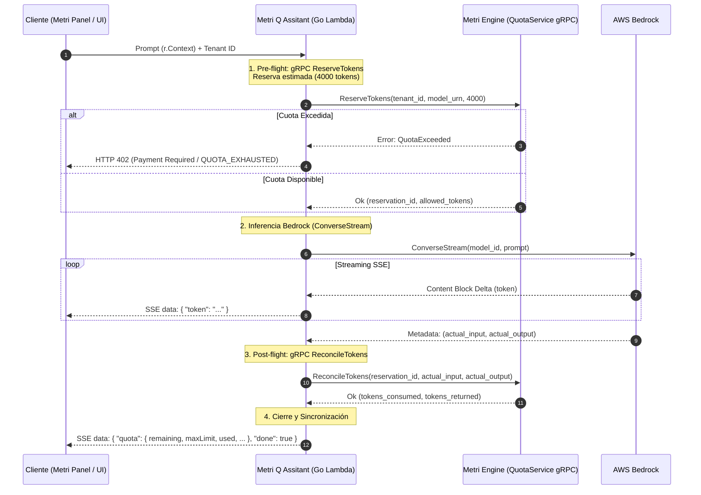

# Metri Q — Integración, Súper-Poderes y Visualización (Metri Q Copilot)

Este documento técnico detalla la arquitectura de integración, flujo de datos y renderizado del asistente **Metri Q** (Panel Copilot) en `metri-panel`, y la dualidad de componentes entre el orquestador **metri-q-assitant** (BFF y Agente) y el servidor **metri-mcp** (MCP Server de producción).

---

## 1. Arquitectura de Conectividad Frontend ↔ Backend

La comunicación y ejecución del agente está distribuida en tres microservicios en el backend:
1. **Chat y Razonamiento (BFF / Orquestador):** `metri-q-assitant` (puerto `3001`) maneja la sesión del operador, la estimación de cuotas (`ReserveTokens` / `ReconcileTokens`) y ejecuta el bucle cognitivo **ReAct** (Reasoning + Acting) vía AWS Bedrock ConverseStream.
2. **Servidor MCP de Datos (Production MCP Server):** `metri-mcp` (puerto `3002`) expone las herramientas de datos analíticos conectándose vía gRPC-Web a `metri-engine`. El orquestador le invoca llamadas JSON-RPC stateless por POST `/rpc` autenticadas con token HMAC.
3. **Control de Cuotas y Motor:** `metri-engine` (puerto `9090`) ejecuta la validación de cuotas EAV y consultas transaccionales.

```
                  CONECTIVIDAD FRONTEND ↔ BACKEND (DEV LOCAL)
                  
     ┌─────────────────────────────────────────────────────────────┐
     │                Metri Panel (Vue 3 Copilot)                  │
     │                                                             │
     │  MetriQPanelCopilot.vue                                     │
     │   ├─ aiService.ts ──────► SSE ──────────────────────────┐   │
     │   └─ quota.ts (Pinia) ──► Query/MetriQuery ─────────┐   │   │
     └─────────────────────────────────────────────────────┼───┼───┘
                                                           │   │
     ┌─────────────────────────────────────────────────────┼───┼───┐
     │              Entorno Local Backend                  │   │   │
     │                                                     │   │   │
     │  ┌────────────────────────┐                         │   │   │
     │  │ /api/bedrock/chat      │◄────────────────────────┼───┘   │
     │  │ (metri-q-assitant:3001)  │──► AWS Bedrock (SDK)    │       │
     │  └──────────┬─────────────┴───────────┬─────────────┘       │
     │             │ gRPC QuotaService       │ POST /rpc           │
     │             ▼                         ▼ (HMAC Auth)         │
     │  ┌────────────────────────┐     ┌────────────────────────┐  │
     │  │ localhost:9090         │◄────┤ localhost:3002         │  │
     │  │ (metri-engine)         │     │ (metri-mcp Server)     │  │
     │  └────────────────────────┘     └──────────┬─────────────┘  │
     │                                            │ gRPC Query     │
     │                                            ▼                │
     └─────────────────────────────────────────────────────────────┘
```

### 1.1 Variables de Entorno y Configuración de Puertos

- **`metri-q-assitant` (Puerto `3001` / Lambda URL):**
  - `METRI_ENGINE_GRPC_URL`: Dirección de `metri-engine` (ej: `localhost:9090` o gRPC-Web en producción).
  - `VITE_MCP_PROXY_URL`: Endpoint expuesto al panel (ej: `/api/bedrock/chat`).
- **`metri-mcp` (Puerto `3002` / Lambda URL):**
  - `METRI_ENGINE_GRPC_URL`: Dirección del motor (`localhost:9090`).
  - `HMAC_SECRET`: Clave de verificación de firmas M2M.

---

## 2. Catálogo de Modelos y URN Mapping

El selector de modelos en Metri Q mapea las claves de la UI a URNs del Códice e IDs de Bedrock (usando *inference profiles* regionales en producción para alta disponibilidad).

| Key | Bedrock Model ID / Profile | URN (domain_quota) | Badge |
| :--- | :--- | :--- | :--- |
| `nova-micro` | `us.amazon.nova-micro-v1:0` | `llm:aws:nova-micro` | ⚡ Rápido |
| `nova-lite` | `us.amazon.nova-lite-v1:0` | `llm:aws:nova-lite` | 🌟 Recomendado |
| `nova-pro` | `us.amazon.nova-pro-v1:0` | `llm:aws:nova-pro` | 🧠 Pro |
| `claude-sonnet` | `us.anthropic.claude-sonnet-4-6` | `llm:anthropic:claude-sonnet-4.6` | ✨ Inteligente |

---

## 3. Control y Contabilidad de Cuotas (Token Accounting)

Para evitar condiciones de carrera en el consumo del tenant, el **Metri Q Assitant** y **Metri Engine** operan bajo un ciclo de vida transaccional de dos fases: **Reserva Atómica Optimista** y **Conciliación Post-flight**.



### 3.1 Servicios gRPC en Metri Engine (`metri.QuotaService`)

La contabilidad se conecta mediante la definición `metri.QuotaService` con dos métodos core:
- **`ReserveTokens`:** Valida la disponibilidad de tokens remanentes y carga de forma preventiva el estimado sobre `current_usage` en `domain_quota` para evitar race conditions.
- **`ReconcileTokens`:** Resta la diferencia a favor (`tokens_returned`) si el uso real fue inferior al reservado, liberando la cuota.

### 3.2 Autenticación Machine-to-Machine (M2M)

El agente firma criptográficamente sus peticiones a `metri-engine` generando un service token HMAC-SHA256 con el formato:
$$\text{Token} = \texttt{mk\_<claims\_base64>.<signature\_base64>}$$
La clave se obtiene del entorno mediante `HMAC_SECRET` (con fallback de desarrollo local).

---

## 4. Servidor MCP de Producción (`metri-mcp`) y Súper-Poderes

El componente standalone **`metri-mcp`** actúa como el MCP Server de producción. Expone las tools de base de datos a través de llamadas gRPC a `metri-engine`.

### 4.1 Catálogo de Herramientas del Servidor MCP

| Herramienta | Entrada (Arguments) | Propósito | Integración Core / Backend |
| :--- | :--- | :--- | :--- |
| `resolve_time_context` | `expression` (string), `timezone` (string) | Convierte expresiones naturales a timestamps UTC. | Interno (Go `time`) |
| `search_schemas` | `query` (string) | Busca semánticamente entidades relevantes del Códice. | Vector Store (`Titan`) |
| `list_locations` | `limit` (int), `parent_id` (string), `type` (string), `status` (string), `tag` (string), `search` (string) | Lista ubicaciones con conteo dinámico por tipo (`summary`). | `QueryRequest` (location) |
| `get_location_by_id` | `location_id` (string) | Obtiene jerarquía ascendente, hijos directos, activos conectados e info geográfica. | `QueryRequest` (location + asset) |
| `list_auth_events` | `tenant_id` (string), `user_id` (string), `since` (string), `limit` (int) | Consulta eventos e intentos de autenticación y auditoría de seguridad. | [metri-auth](file:///Users/macuser/projects/metri/metri-auth) EventBridge |
| `get_user_sessions` | `user_id` (string), `tenant_id` (string) | Lista las sesiones activas persistentes y sus huellas digitales de cliente. | [metri-auth](file:///Users/macuser/projects/metri/metri-auth) DynamoDB |
| `revoke_user_sessions` | `user_id` (string), `tenant_id` (string), `reason` (string) | Invalida y fuerza el cierre inmediato de todas las sesiones de un usuario. | [metri-auth](file:///Users/macuser/projects/metri/metri-auth) DynamoDB |
| `trigger_magic_invite` | `email` (string), `tenant_id` (string), `roles` (array) | Genera una invitación de registro autogestionada (Flujo B - Magic Link). | [metri-auth](file:///Users/macuser/projects/metri/metri-auth) BFF |
| `autofill_active_form` | `fields_map` (object) | Rellena automáticamente los campos del formulario reactivo activo en pantalla. | [metri-panel](file:///Users/macuser/projects/metri/metri-panel) (UI State) |
| `navigate_to_view` | `route` (string), `query_params` (object) | Redirige la interfaz del panel a la ruta y filtros indicados. | [metri-panel](file:///Users/macuser/projects/metri/metri-panel) (vue-router) |

*Nota: Mientras `metri-mcp` (puerto 3002) realiza consultas gRPC reales al motor y APIs de identidad, `metri-q-assitant` (puerto 3001) expone mocks simplificados de estas tools para simulación local offline.*

### 4.2 Súper-Poder 1: Paralelismo Concurrente de Herramientas (`errgroup`)

Cuando el LLM devuelve múltiples llamadas en una iteración, el proxy de Go ejecuta los despachos concurrentemente mediante `golang.org/sync/errgroup` y los sincroniza de forma segura antes de re-alimentar el bucle cognitivo.

```go
func (s *McpServer) ExecuteConcurrentTools(ctx context.Context, calls []mcp.CallToolParamsRaw) ([]mcp.CallToolResult, error) {
	g, ctx := errgroup.WithContext(ctx)
	results := make([]mcp.CallToolResult, len(calls))
	
	for i, call := range calls {
		i, call := i, call
		g.Go(func() error {
			res, err := s.dispatchSingleTool(ctx, call.Name, call.Arguments)
			if err != nil { return err }
			results[i] = *res
			return nil
		})
	}

	if err := g.Wait(); err != nil { return nil, err }
	return results, nil
}
```

### 4.3 Súper-Poder 2: Intérprete Adaptativo Temporal

Resuelve en milisegundos expresiones relativas (como `today`, `yesterday` o `last_3_weeks`) traduciéndolas a timestamps absolutos de inicio y fin alineados a la zona horaria real (`timezone`) inyectada del cliente.

### 4.4 Súper-Poder 3: PII Censorship y RE2

Antes de inyectar cualquier resultado obtenido del motor de base de datos de Metri en la memoria de conversación de Bedrock, los datos pasan por un pipeline de sanitización `PII Censorship` de alta velocidad escrito en Go. Utiliza patrones `regexp` compilados una sola vez con el motor de Google **RE2**, asegurando tiempo de ejecución lineal $O(n)$ sin peligro de ReDoS. Reemplaza SSN, correos, teléfonos e identificadores fiscales por marcas `[REDACTED_*]`.

### 4.5 Seguridad de Acceso a Tools (Filtro `/rpc` por HMAC)

El endpoint HTTP stateless `/rpc` de `metri-mcp` requiere autenticación M2M. El middleware `WithAuth` intercepta el token `Bearer mk_...`, valida la firma HMAC contra la clave `HMAC_SECRET` y extrae los claims del contexto (`tenant_id` y `user_id`):

```go
func WithAuth(next http.Handler) http.Handler {
	return http.HandlerFunc(func(w http.ResponseWriter, r *http.Request) {
		rawToken := getRawToken(r)
		session, ok := verifyHMACLocalToken(rawToken)
		if !ok {
			http.Error(w, `{"error": "unauthenticated"}`, http.StatusUnauthorized)
			return
		}
		ctx := context.WithValue(r.Context(), "tenant_id", session.TenantID)
		ctx = context.WithValue(ctx, "user_id", session.UserID)
		next.ServeHTTP(w, r.WithContext(ctx))
	})
}
```

### 4.6 Integración de Identidad y Auditoría (`metri-auth`)

El motor de Tool Calling aprovecha los endpoints y persistencia de [metri-auth](file:///Users/macuser/projects/metri/metri-auth) para habilitar los siguientes flujos automatizados de seguridad:
- **SecOps Copilot:** Al usar `list_auth_events` y `revoke_user_sessions`, el agente de IA puede auditar inicios de sesión sospechosos (ej. múltiples fallos, salto geográfico imposible o dispositivos no reconocidos) y revocar sesiones de manera automática o sugerida en caso de compromiso de cuenta.
- **Soporte Autogestionado de MFA:** Ante bloqueos de sesión o fallos de token TOTP (MFA), la IA ejecuta diagnósticos de desfase horario comparando el epoch del cliente con el del servidor para guiar al usuario en la sincronización de su app autenticadora.

---

## 5. Visualización Avanzada (Agentic UI & Llenado de Formularios)

El frontend de **Metri Q** ([MetriQPanelCopilot.vue](file:///Users/macuser/projects/metri/metri-panel/src/components/MetriQPanelCopilot.vue)) evoluciona el chat hacia una experiencia de **Generative UI** y automatización de procesos donde el agente de IA interactúa directamente con los componentes gráficos de la interfaz.

### 5.1 Tags del Sistema y Badges Reactivos

El copilot analiza y extrae bloques del chat usando tags definidos en el System Prompt:
- **`<thoughts>...</thoughts>`:** Razonamiento interno (thoughts, thinking, reflection) se representa en un bloque colapsable y estilizado de Amber.
- **`<code>...</code>`:** Código de automatización TypeScript/Clojure se colorea mediante una sintaxis custom.
- **`<data>...</data>`:** Payloads JSON con metadatos estructurados para renderizar tarjetas de salud (`health-stats`), alertas (`anomalies`) y planes de mantenimiento (`saving-plan`).

```vue
<!-- Parsing de tags en tiempo real durante streaming -->
const parseAgentOutput = (rawText: string) => {
  // Extrae pensamientos, código y data estructurada
  // Devolviendo fragmentos limpios y formateados
}
```

### 5.2 Gráficos ECharts Interactivos (`chart`)

Cuando el agente emite un bloque de código markdown de tipo `chart`, el Panel Copilot lo intercepta, decodifica el JSON y dibuja un widget interactivo de e-charts (`vue-echarts`) en el cuerpo del chat:

```chart
{
  "type": "bar",
  "title": "Consumo Activos Planta Centro",
  "labels": ["MTR-ROB-01", "MTR-ROB-02", "SEN-PWR-L1"],
  "series": [
    { "name": "Consumo (kW)", "data": [45.2, 38.9, 120.4] }
  ]
}
```

### 5.3 Renderizado Matemático LaTeX

El chat procesa fórmulas matemáticas inline (`$formula$`) o de bloque (`$$formula$$`) mediante **KaTeX**. Si KaTeX no está cargado en la sesión, cae a un motor de reemplazo de caracteres lógicos (ej: `\eta` $\rightarrow$ `η`, `\Delta` $\rightarrow$ $\Delta$).

### 5.4 Tablas Markdown Estilizadas

Las tablas enviadas por el LLM se re-renderizan a tablas HTML enriquecidas, coloreando dinámicamente los estados críticos:
- `✅ Activo` / `Activa` $\rightarrow$ Emerald
- `⚠️ Alerta` / `Mantenimiento` $\rightarrow$ Amber
- `❌ Inactivo` / `Error` $\rightarrow$ Rose

### 5.5 Generative UI y Renderizado de Componentes Dinámicos

En lugar de limitarse a respuestas textuales, el Copilot puede emitir llamadas a herramientas que renderizan widgets vivos e interactivos en el historial de chat:
- **Formularios Conversacionales:** La IA llama a `render_interactive_form` especificando un esquema JSON. El panel dibuja un formulario con inputs HTML reactivos e interactivos en el chat. Al enviarse, la respuesta se retroalimenta al agente como resultado del Tool Call.
- **Control de Vistas:** El agente manipula y navega la interfaz del operador en segundo plano llamando a `navigate_to_view` (ej. redirigiendo a [BIAuditAnalyticsView.vue](file:///Users/macuser/projects/metri/metri-panel/src/views/BIAuditAnalyticsView.vue)) o aplicando filtros globales al store de Pinia.

### 5.6 Diligenciamiento de Formularios Asistido y Conversacional

El Copilot cuenta con capacidades avanzadas para acelerar la carga de datos en formularios como [AssetFormView.vue](file:///Users/macuser/projects/metri/metri-panel/src/views/AssetFormView.vue) o [TenantFormView.vue](file:///Users/macuser/projects/metri/metri-panel/src/views/TenantFormView.vue):
- **Diligenciamiento Guiado en Pantalla:** Al invocar `autofill_active_form(fields_map)`, la IA inyecta el JSON de campos estructurados directo en el estado reactivo del formulario activo. El usuario observa la pantalla llenarse en tiempo real mediante micro-animaciones, pudiendo revisar y confirmar antes de guardar físicamente.
- **Extracción de Datos Multimodal:** Al recibir fotos de placas metálicas de maquinaria o PDFs de fichas técnicas en el chat, el Copilot utiliza visión para estructurar los atributos técnicos y rellenar automáticamente el formulario de creación.
- **Resolución Inteligente de Errores de Validación:** Si el guardado falla por errores de base de datos (ej. `ERR_DUPLICATE_TAG`), el Copilot intercepta la excepción, consulta valores alternativos disponibles y sugiere la corrección al formulario en pantalla con un solo clic.

### 5.7 Inyección de Contexto Ambiental (Ambient Context)

El panel ([MetriQPanelCopilot.vue](file:///Users/macuser/projects/metri/metri-panel/src/components/MetriQPanelCopilot.vue)) inyecta de forma transparente en cada mensaje del usuario un payload con el contexto activo de la sesión:
- **Vista en Pantalla:** Ruta actual de navegación.
- **Selecciones del Operador:** Elementos activos seleccionados (activo, medidor, localización).
- **Log de Errores Recientes:** Traza de errores HTTP/gRPC del cliente, lo que permite al usuario preguntar *"¿Por qué no carga este gráfico?"* y a la IA diagnosticarlo sabiendo de antemano el error exacto que ocurrió.

---

## 6. Integración en el Dashboard y Pinia Store (`quota.ts`)

La tienda reactiva de Pinia en `metri-panel` mantiene el estado de cuota y bloquea la entrada del chat si se alcanza el 100% de la cuota:

```typescript
export const useQuotaStore = defineStore('quota', () => {
  const isExceeded = ref(false);
  const isWarning = ref(false);
  const tokenQuota = ref<TokenQuotaState | null>(null);

  const usagePercent = computed(() => {
    if (!tokenQuota.value || tokenQuota.value.maxLimit === 0) return 0;
    return Math.min(100, Math.round((tokenQuota.value.currentUsage / tokenQuota.value.maxLimit) * 100));
  });

  function updateFromProxy(quota: { remaining: number; maxLimit: number; used: number; modelUrn?: string }) {
    tokenQuota.value = {
      modelUrn: quota.modelUrn || 'unknown',
      currentUsage: quota.used,
      maxLimit: quota.maxLimit,
      resetAt: null,
      resetStrategy: 'MONTHLY',
      lastUpdated: Date.now(),
    };
    isExceeded.value = quota.remaining <= 0;
    isWarning.value = !isExceeded.value && (quota.used / quota.maxLimit) >= 0.8;
  }

  return { isExceeded, isWarning, tokenQuota, usagePercent, updateFromProxy };
});
```
