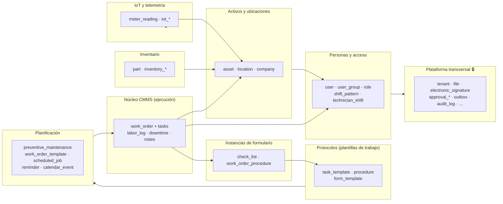
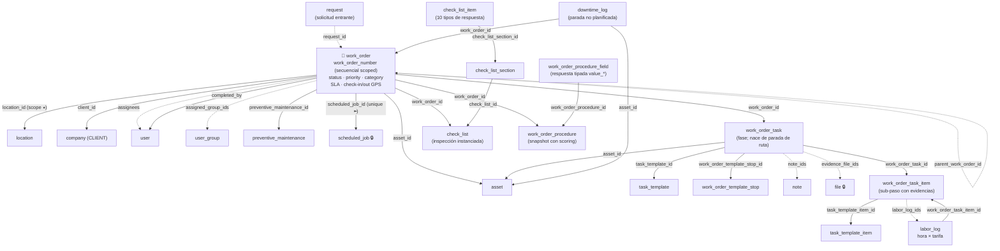
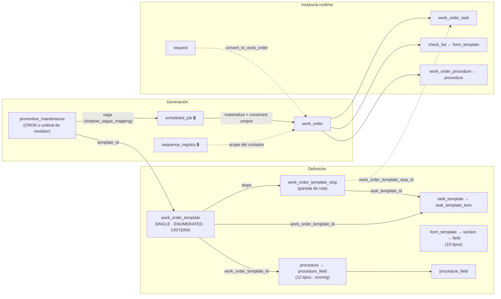
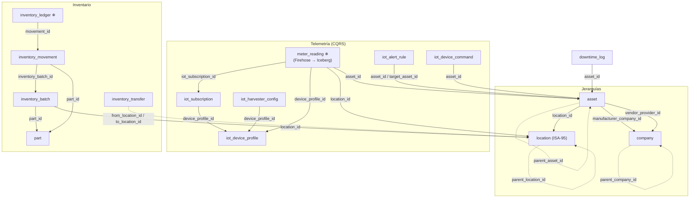
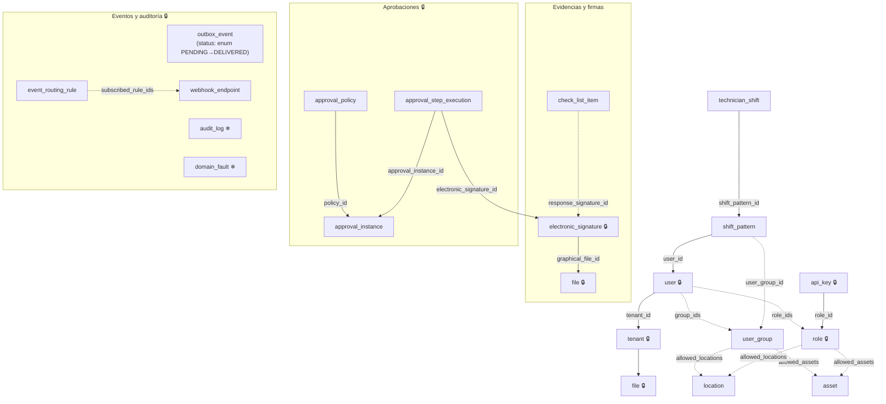

# Diagrama del Modelo de Datos (Códice)

> Fuente única: `config/models/*.json` (64 modelos). Este documento es un mapa visual
> de acompañamiento — la referencia campo a campo vive en
> [modelos-codice.md](modelos-codice.md) (generada). Si el catálogo cambia,
> regenerar las aristas: las relaciones de este doc derivan de los atributos
> `type: "reference"` + `entityRef` de cada modelo.

## Cómo leer los diagramas

- **Flecha sólida `──1──▶`**: `reference` con `cardinality: "one"` (belongs_to).
- **Flecha punteada `┈┈N┈┈▶`**: `reference` con `cardinality: "many"` (array de IDs).
- **Auto-referencia**: jerarquía dentro de la misma entidad (`asset.parent_asset_id`).
- Las etiquetas de flecha son el **nombre del atributo** en el modelo de origen.
- 🔒 = `is_system: true` (reservado del motor), ❄ = `engine: "olap"` (Data Lake).

Las relaciones **polimórficas** (nombre de entidad + id en campos string, sin
`entityRef`) no se dibujan como flechas; se listan al final.

---

## 1. Mapa de dominios del catálogo

Todo modelo OLTP persiste en el EAV de DynamoDB; los OLAP (❄ `audit_log`,
`domain_fault`, `meter_reading`, `inventory_ledger`) se entregan por Firehose a
tablas Iceberg en S3 y se consultan por Athena.

---

## 2. Núcleo de ejecución: `work_order` y su órbita

Restricción viva: `constraints` de `work_order` — **una OT por
(`scheduled_job_id`, `asset_id`)** por tenant: es la idempotencia definitiva del
loop preventivo (una ruta ENUMERATED genera N OTs del mismo job, una por parada).

⭑ `location_id` es `is_sequence_scope`: el contador `work_order_number` se
Scoped por ubicación (`WO-L-K92MXA-0043`); si solo viene `asset_id`, el scope se
resuelve vía `is_sequence_scope_via` (nearest_registered).

---

## 3. De la plantilla a la instancia (los tres sistemas de protocolo)

Este es el plano que más confusión resuelve: hay **tres sistemas paralelos** de
"plantilla → instancia", cada uno con su capa de definición y su capa runtime.

| Sistema | Definición | Instancia | Uso |
|---|---|---|---|
| Task templates | `task_template(_item)` | `work_order_task(_item)` | Protocolo de tareas por OT |
| Procedures | `procedure(_field)` | `work_order_procedure(_field)` | Protocolo formal con scoring (estilo MaintainX) |
| Form templates | `form_template(_section/_field)` | `check_list(_section/_item)` | Checklists de inspección y `request` |

---

## 4. Activos, ubicaciones, telemetría e inventario

---

## 5. Personas y plataforma transversal

---

## 6. Relaciones polimórficas (sin `entityRef`)

Estas asociaciones guardan `(entity_type, entity_id)` como texto/uuid; el
catálogo no las valida estructuralmente:

| Origen | Campos | Destinos válidos |
|---|---|---|
| `file` | `owner_entity_type/id` | cualquier entidad (adjuntos) |
| `document_chunk` | `owner_entity_type/id` | dueño del documento RAG |
| `electronic_signature` | `signed_entity/id` | entidad firmada |
| `approval_instance` | `target_entity_name/id` | entidad bajo aprobación |
| `calendar_event` | `source_entity_type/id` | reminder · preventive_maintenance · work_order |
| `scheduled_job` | `parent_entity_ref` | preventive_maintenance · reminder · user |
| `inventory_movement` | `reference_entity/reference_id` | work_order · compra, etc. |

---

## 7. Deudas del modelo detectadas en la revisión (2026-09-09)

**Eliminado en esta revisión** (config muerta que el motor nunca leyó):

- Bloques raíz `"events"` formato legacy (`{create: "X_CREATED", …}`) en 12
  modelos — sustituidos por `event_rules`, que es lo único que compila el
  registry (`src/codice/registry.rs::parse_entity_model`).
- `"calendar_mapping"` en `preventive_maintenance` y `reminder` — 0 lectores en
  `src/`. Si se quiere proyectar a `calendar_event`, el mecanismo actual es
  `shadow_sagas_mapping` en la saga (`src/janus_router/saga.rs`).
- 13 claves `"default"` renombradas a `"default_value"` (6 modelos IoT) — el
  parser solo lee `default_value`; quedaban en silencio ignoradas.
- `outbox_event.status` era `type: "string"` con `options` (que el validador
  solo aplica a enums) → ahora `enum` con los 4 valores que `moira.rs` escribe
  realmente (PENDING · PROCESSING · FAILED · DELIVERED).

**Candidatos a deprecación que exigen decisión de producto/migración de datos**
(no tocar sin conciliar el dato vivo):

1. `provider` ≅ subconjunto pobre de `company` (que ya tiene
   `company_type: PROVIDER`); ningún modelo referencia ya a `provider`.
2. Tres sistemas paralelos de protocolos (§3): `procedure` repite campo a campo
   a `task_template` + lifecycle/scoring. Definir cuál es el camino y deprecir
   el otro con migración.
3. `labor_log.hourly_rate` es `decimal` sin `_cents` ni divisa hermana — viola
   la convención de unidad menor del [README](../../config/models/README.md).
4. `iot_alert_rule.notify_groups` apunta a `role` mientras
   `scheduled_job`/`reminder` usan `user_group` para "grupo".
5. `estimated_duration_minutes`: `integer` en `work_order_template` pero
   `decimal` en `work_order_task`/`task_template`/`procedure`.
6. `note.work_order_task_id` es `required`, pero
   `work_order_task_item.note_ids` declara la inversa — las notas de ítem no
   tienen campo espejo.
7. Doble vía de adjuntos: arrays `*_file_ids` + asociación polimórfica de
   `file.owner_entity_*`.
8. `dashboardBI` es la única entidad en camelCase.
